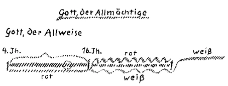
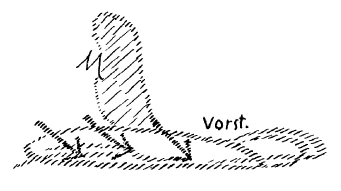
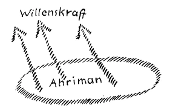

Der Mensch kann nur dadurch ein wirkliches, seine Seele tragendes Bewußtsein erlangen, daß er aufnimmt wenigstens die wichtigsten, die wesentlichsten Gesetze der menschlichen Entwickelung. Dasjenige, was sich zugetragen hat im Lauf der menschlichen Entwickelung, das müssen wir erkennen, in unser Seelenleben hereinbringen. So ist einmal die Aufgabe des gegenwärtigen Menschen. Nun handelt es sich darum, daß man - ich bemerkte das schon in diesen Tagen - völlig ernst nehme, daß die Entwickelung der Menschheit selbst eine Art lebendige, eine Art Wesensentwickelung ist. Wie in dem einzelnen menschlichen Individuum gesetzmäßiges Wachstum ist, so in der Entwickelung des ganzen Menschengeschlechtes. Und da in der Gegenwart einmal der Zeitpunkt ist, wo gewisse Dinge ins Bewußtsein herauf müssen und der Mensch ja in den wiederholten Erdenleben teilgenommen hat an den verschiedenen Gestaltungen der Menschheitsentwickelungsgeschichte, so ist auch notwendig, daß man Verständnis entwickele für die Verschiedenheiten der menschlichen Seelenstimmungen in den einzelnen Epochen der Menschheitsentwickelung. Ich habe schon öfter gesagt: Dasjenige, was wir heute Geschichte nennen, das ist eigentlich eine Fable convenue aus dem Grunde, weil bei dieser abstrakten Aufzählung von Ereignissen und bei diesem Suchen nach Ursache und Wirkung im äußerlichsten Sinne gegenüber den geschichtlichen Hergängen gar nicht Rücksicht genommen wird auf die Umwandlungen, auf die Metamorphosen des menschlichen Seelenlebens selber. Wenn man von diesem Gesichtspunkte aus Proben macht, so könnte man sich schon überzeugen, wie vorurteilsvoll es ist, wenn man glaubt, daß ungefähr so wie die Seelen der Menschen jetzt gestimmt sind, sie bis in jene Zeiten waren, in die noch die ersten Dokumente der Geschichte zurückreichen. Das ist nicht der Fall. Menschen, auch einfachste, primitivste Menschen des 9., 10. nachchristlichen Jahrhunderts, sie waren ganz anders in der Seele gestimmt als die Menschen nach der Mitte des 15. Jahrhunderts. Man kann das verfolgen bis in die Niederungen des Menschengeschlechtes hinein, kann es auch auf den Höhen verfolgen. Versuchen Sie zum Beispiel einmal, sich eine Kenntnis zu verschaffen des merkwürdigen Werkes von Dante über die «Monarchie». Wenn Sie so etwas lesen, aber nicht lesen wie eine Kuriosität, sondern lesen mit einem gewissen kulturhistorischen Spürsinn, dann wird Ihnen auffallen, wie in einem solchen Buche eines Repräsentanten seiner Zeit Dinge drinnenstehen, die unmöglich aus der Seele eines Gegenwartsmenschen heraus gesprochen sein könnten. Ich will nur eines erwähnen. ^vll1ky

Dante versucht in diesem Buche, das in seinem Sinne eine ernsthafte Abhandlung über die Rechtsgrundlage, über die politische Grundlage der Monarchie sein soll, darzulegen, daß die Römer das vorzüglichste Volk der Erde waren. Er versucht darzulegen, daß es ein Urrecht der Römer war, den ganzen Erdball, soweit er dazumal in Frage kam, zu erobern. Er versucht darzulegen, daß diese Eroberung des ganzen Erdballes durch die Römer ein größeres Recht sei als etwa das Selbständigkeitsrecht einzelner kleiner Völkerschaften, denn Gott habe es so gewollt, daß die Römer über einzelne kleine Völkerschaften herrschten, zum Wohle dieser einzelnen kleinen Völkerschaften. Viele Beweise ganz aus dem Geiste seiner Zeit heraus bringt Dante vor für diese Berechtigung des Römertums, den Erdkreis zu beherrschen. Einer dieser Beweise ist auch der folgende. Er sagt: Die Römer stammen doch ab von Äneas. Äneas hat dreimal geheiratet. Zuerst die Creusa. Dadurch aber, durch diese Heirat, habe er sich als der Stammvater das Recht erworben, Asien zu beherrschen. Zweitens habe er geheiratet die Dido. Dadurch habe er sich als Urvater der Römer das Recht erworben, Afrika zu beherrschen. Dann habe er geheiratet die Lavinia. Damit habe er sich das Recht erworben — das heißt für die Römer -, Europa zu beherrschen. Herman Grimm, der diese Sache einmal besprochen hat, macht dazu die, ich glaube nicht unzutreffende Bemerkung: Ein reines Glück, daß dazumal Amerika und Australien noch nicht entdeckt waren! ^su6bth

Aber diese Schlußfolgerung war für einen erleuchteten Geist der Dante-Zeit, ja für den hervorragendsten Geist der Dante-Zeit etwas ganz selbstverständliches. So etwas war dazumal eine juristische Darlegung. Nun bitte ich Sie, sich vorzustellen, daß bei irgendeinem Juristen der Gegenwart eine solche Schlußfolgerung aufträte. Sie können sich es nicht vorstellen. Ebensowenig können Sie sich vorstellen, daß die Denkweise in bezug auf andere Gründe, die Dante vorbringt, aus der Seelenverfassung eines Gegenwartsmenschen herauskäme. ^tgnkxi

So ergibt eine ganz naheliegende Tatsache, wie man hinsehen muß auf die Umwandlung der Seelenverfassungen der Menschen. Diese Dinge nicht zu verstehen, das ging in einer gewissen Weise an bis in unsere Zeit herein. Das geht in unserer Zeit nicht mehr an und wird insbesondere nicht gegen die Zukunft hin für die Menschheit angehen, aus dem einfachen Grunde, weil die Menschheit bis in unsere Zeiten herein oder wenigstens bis zum Ende des 18. Jahrhunderts — seit der Französischen Revolution ist es schon allmählich anders geworden, aber es blieben immer alte Reste der betreffenden Seelenverfassungen zurück -, weil die Menschheit bis in unsere Zeit herein — also mit der Einschränkung, die ich eben gemacht habe — gewisse Instinkte hatte. Und aus diesen Instinkten heraus konnte sie ein Bewußtsein entwickeln, das seelentragend war. So wie aber der sich fortwandelnde Organismus der Menschheit nunmehr geworden ist, sind diese Instinkte nicht mehr da, und der Mensch muß sich in bewußter Weise erwerben den Zusammenhang mit der ganzen Menschheit. Das ist ja schließlich die ganze Bedeutung, die tiefere Bedeutung der sozialen Frage in der Gegenwart. Dasjenige, was die Leute parteimäßig vielfach sagen, ist nur eine Formulierung obenhin. Dasjenige, was eigentlich in den Untergründen der Menschenseelen wogt, das spricht sich [nicht] aus in solchen Formeln. Aber das, was wogt, das ist eben, daß.die Menschheit fühlt, man müsse bewußt den Zusammenhang des einzelnen mit der ganzen Menschheit erringen, das heißt, einen sozialen Impuls sich aneignen. ^klz687

Nun kann man das nicht, ohne daß man das Gesetz der Entwickelung wirklich ins Auge faßt. Tun wir das noch einmal, nachdem wir es für andere Fragen schon wiederholt getan haben. Nehmen wir zum Beispiel die Zeit vom 4. nachchristlichen Jahrhundert bis etwa ins 16. nachchristliche Jahrhundert herein. Da finden wir, wie das Christentum im zivilisierten Europa sich ausbreitet. Wir finden dieser Ausbreitung jenen Charakter aufgeprägt, von dem ich gestern und öfter gesprochen habe. Wir finden, daß in dieser Zeit noch alle Sorgfalt darauf verwendet wird, durch menschliche Vorstellungen und menschliche Begriffe, wie sie vom Griechentum übermittelt worden sind, die Geheimnisse von Golgatha zu verstehen. Dann beginnt aber eine veränderte Form der Entwickelung. Wir wissen, daß sie eigentlich schon früher einsetzt, um die Mitte des 15. Jahrhunderts. Sichtbar, deutlich wird sie erst etwa im 16. Jahrhundert. Dann beginnt das naturwissenschaftlich orientierte Denken zuerst die obere Menschheit zu ergreifen, aber sich immer weiter und weiter auszudehnen. ^go4g79

Nun fassen wir einmal dieses naturwissenschaftlich orientierte Denken einer bestimmten Eigenschaft nach ins Auge. Es gibt viele solche Eigenschaften, die man erwähnen kann für das naturwissenschaftlich orientierte Denken, aber wir wollen heute wiederum eine besonders hervorheben. Das ist diese, daß, wenn man so recht handfester neuerer Denker im heutigen Sinne ist, man nicht zurechtkommt mit der Frage: Naturnotwendigkeit und menschliche Freiheit. Immer mehr drängte das Naturdenken der neueren Zeit dahin, den Menschen als ein Glied der übrigen Natur zu denken, die man auffaßt als einen Strom von fest einander bedingenden Ursachen und Wirkungen. Gewiß sind ja viele Menschen auch heute da, die sich klar darüber sind, daß Freiheit, das Erlebnis der Freiheit, eine Tatsache des menschlichen Bewußtseins ist. Aber dies hindert nicht, daß, wenn man sich so recht hineinfindet in die besondere Konfiguration des Naturdenkens, man da nicht zurechtkommt. Denkt man so, wie die heutige Naturwissenschaft das will, über die Wesenheit des Menschen, so kann man eben mit diesem Denken nicht vereinigen das Denken über die menschliche Freiheit. Manche machen sich es leicht mit der menschlichen Freiheit, mit dem menschlichen Verantwortlichkeitsgefühl. Ich kannte einen Strafrechtslehrer, der begann seine Vorlesungen über das Strafrecht jedesmal damit, daß er sagte: Meine Herren, ich habe Ihnen Strafrecht vorzutragen. Das beginnen wir damit, daß wir als Axiom annehmen, es gäbe eine menschliche Freiheit und Verantwortlichkeit. Denn gäbe es keine Freiheit und keine Verantwortlichkeit, so könnte es kein Strafrecht geben. Nun gibt es aber ein Strafrecht, denn ich muß es Ihnen vortragen, also gibt es auch eine Verantwortlichkeit und Freiheit. — Diese Argumentation ist etwas einfach, aber sie ist doch auch hinweisend darauf, wie schwer die Menschen heute noch zurechtkommen, wenn sie fragen sollen: Wie vereinigt Naturnotwendigkeit sich mit Freiheit? Das heißt aber mit anderen Worten nichts anderes als: Immer mehr und mehr ist der Mensch durch die Entwickelung der letzten Jahrhunderte gezwungen worden, eine gewisse Allmacht der Naturnotwendigkeit zu denken. Man sagt es sich nicht mit diesen Worten, aber dennoch, es wird gedacht eine gewisse Allmacht der Naturnotwendigkeit. Was ist diese Allmacht der Naturnotwendigkeit? ^rgb3uy

Wir werden uns am besten verstehen, wenn ich Sie an etwas erinnere, das ich schon öfters erwähnt habe. Die heutigen Denker glauben, sie handeln — oder denken vielmehr — vorurteilslos, bloß wissenschaftlich forschend, wenn sie behaupten, der Mensch bestünde aus Leib und Seele. Nicht wahr, bis zu dem angeblich großen, eigentlich nur von seines Verlegers Gnaden großen Philosophen Wilhelm Wundt behaupten die Leute, wenn man unbefangen denkt, so müsse man den Menschen gliedern in Leib und Seele, wenn überhaupt noch die Seele gelten gelassen wird. Und nur schüchtern wagt sich der Versuch der Wahrheit hervor, den Menschen zu gliedern in Leib, Seele und Geist. Die Philosophen, die heute glauben, vorurteilslos den Menschen in Leib und Seele zu gliedern, die wissen eben nicht, daß ihre Gliederung nur das Ergebnis eines historischen Vorganges ist, der seinen Ausgangspunkt genommen hat vom achten allgemeinen Konzil von Konstantinopel, wo die katholische Kirche den Geist abgeschafft hat, indem es zum Dogma erhoben worden ist, daß fortan der richtig gläubige Christ nur zu denken habe, der Mensch bestünde aus Leib und Seele, und die Seele habe auch einige geistige Eigenschaften. Das war Kirchengebot. Das lehren heute noch die Philosophen und wissen nicht, daß sie bloß dem Kirchengebote folgen, sie glauben vorurteilslose Wissenschaft zu treiben. So steht es tatsächlich heute um manches, was man «vorurteilslose Wissenschaft» nennt. ^nfsybv

So ähnlich ist es auch mit der Naturnotwendigkeit. Diese ganze Entwickelung vom 4. Jahrhundert bis ins 16. Jahrhundert, die kristallisierte immer mehr einen ganz besonderen Gottesbegriff heraus. Wenn man auf die Feinheiten der geistigen Entwickelung dieser Jahrhunderte eingeht, so kommt man darauf, daß immer mehr und mehr ein ganz bestimmter Gottesbegriff aus dem menschlichen Denken herausgearbeitet wurde, der Gottesbegriff, der eigentlich gipfelt in dem Diktum: Gott, der Allmächtige. Es wissen die wenigsten Menschen, daß es zum Beispiel für den Menschen vor dem 4. nachchristlichen Jahrhundert keinen rechten Sinn gehabt hätte, von Gott dem Allmächtigen zu sprechen. Wir treiben keine Katechismus-Wahrheiten; da steht natürlich drinnen: Gott ist allmächtig, allweise und allgütig und so weiter. Das alles sind Dinge, die mit den Wirklichkeiten nichts zu tun haben. Vor dem 4. Jahrhundert würde niemand, der verständig war in diesen Dingen, der mit diesen Dingen wirklich mitgegangen ist, daran gedacht haben, die Allmacht als eine Grundeigenschaft des göttlichen Wesens zu betrachten, sondern da war noch die Nachwirkung der griechischen Begriffe. Und wenn man an das göttliche Wesen gedacht hat, so würde man in erster Linie nicht gesagt haben (an die Tafel schreibend:) Gott, der Allmächtige, sondern: Gott, der Allweise. ^mx5md6

Die Weisheit war dasjenige, was man zunächst als die Grundeigenschaft dem göttlichen Wesen beigelegt hat. Und der Begriff der Allmächtigkeit, er ist erst vom 4. Jahrhundert an allmählich eingedrungen in die Idee von dem göttlichen Wesen. Das entwickelt sich weiter. Der Persönlichkeitsbegriff wird fallen gelassen, und übertragen wird das Prädikat auf die bloße, immer mehr und mehr sogar mechanisch vorgestellte Naturordnung. Und der Begriff der neueren Naturnotwendigkeit, dieser Allmacht der Natur, ist nichts anderes als das Ergebnis der Entwickelung des Gottesbegriffes vom (an die Tafel schreibend:) 4. Jahrhundert bis ins 16. Jahrhundert. Nur daß abgeworfen wurden die Persönlichkeitseigenschaften, und daß herübergenommen wurde in die Struktur des Naturdenkens dasjenige, was dazumal für den Gottesbegriff genommen worden ist. ^4b0unn

Die echten Naturwissenschafter von heute würden sich natürlich kräftig wehren, wenn man ihnen so etwas sagt. Geradeso wie manche Philosophen glauben, vorurteilslos über den Menschen zu denken, indem sie ihn nur aus Leib und Seele bestehen lassen, während sie in Wahrheit nur befolgen das achte allgemeine ökumenische Konzil von Konstantinopel von 869, geradeso wie diese Philosophen abhängig sind von einer historischen Strömung, so sind sie alle — die Haeckelianer, die Darwinisten, alle, alle bis zu den Physikern mit ihrer Naturordnung nichts anderes als Abhängige derjenigen theologischen Richtung, die sich ausgebildet hat in der Zeit von Augustinus bis Calvin. Diese Dinge müssen durchschaut werden. Denn das ist das Eigentümliche einer jeden Evolutionsströmung, daß sie eine gewisse Evolution in sich schließt, aber auch eine Involution oder Devolution. Und während sich entwickelte der Begriff «Gott der Allmächtige», war die Unterströmung in den unterbewußten Sphären des menschlichen Seelenlebens vorhanden, die dann die tonangebende Oberströmung wurde: die Naturnotwendigkeit (siehe Zeichnung, rot). Und seit dem 16. Jahrhundert ist wiederum eine neuerliche Unterströmung da, die gerade in unserer Zeit sich vorbereitet, Oberströmung zu werden (s. Zeichnung, weiß). ^b9b94h

 ^w04mf5

Das ist es, was wir als das Charakteristikon des Michael-Zeitalters anführen müssen, daß dasjenige, was sich vorbereitet hat in Form einer Unterströmung der Naturnotwendigkeit, von jetzt ab werden muß eine Oberströmung. Aber es muß verstanden werden der innere Geist der Erdenentwickelung, wenn man überhaupt zu irgendeinem möglichen Begriffe kommen will von dem, was sich eigentlich da vorbereitet. ^wyvwhc

Ich habe Sie neulich einmal darauf aufmerksam gemacht, daß eigentlich das, was von selbst geht in der irdischen Entwickelung und namentlich in der Menschheitsentwickelung, sich in absteigender Linie bewegt. Die Erdenmenschheit und die Erdenentwickelung selbst ist eigentlich in der Dekadenz. Ich habe Sie darauf aufmerksam gemacht, daß das ja sogar heute schon eine geologische Wahrheit ist, daß ernsthaft zu nehmende Geologen zugeben, die Erdkruste sei bereits in einem Verfallsprozesse. Aber insbesondere ist in einem Verfallsprozesse durch die Kräfte, die eigentlich sinnlich-irdisch sind, die Menschheit selbst. Und der Menschheitsprozeß muß so weitergehen, daß die Menschheit aufnimmt geistige Impulse, die gegen die Dekadenz arbeiten. Daher muß bewußtes Geistesleben in die Menschheit eintreten. Wir müssen uns klar sein darüber: den Höhepunkt der Erdenentwickelung, den haben wir bereits überschritten. Damit die Erdenentwickelung weitergehen kann, muß Geistiges immer klarer und deutlicher aufgenommen werden. ^zmzthp

Das scheint zunächst wie eine abstrakte Tatsache. Für den Geistesforscher ist das gar nicht eine abstrakte Tatsache. Sie wissen ja wohl, daß wir die Entwickelung desjenigen, was dann Erde geworden ist, verfolgen durch ein Saturn-, Sonnen- und Mondenstadium bis herein ins Erdenstadium. Diese Entwickelung können wir auch dadurch charakterisieren, daß wir sagen, im Grunde genommen ist, wenn wir von der heutigen Menschheit sprechen, dasjenige, was sich von dieser Menschheit durch Saturn-, Sonnen- und Mondenperiode entwickelt hat, Vorbereitung, Vorstadium gewesen. Auf der Erde selbst hat der Mensch eigentlich erst, als er sein Ich angenommen hat, die Menschenwesenheit in Wirklichkeit erreicht und wird in diese Wesenheit weiteres hineingießen durch die folgenden Entwickelungsstadien der Erde. ^xicl54

Nun wissen Sie ja, daß auf derselben Entwickelungsstufe, wenn auch in ganz anderen Formen, bei ganz anderem äußerem Ansehen, die sogenannten Archai, die heutigen Geister der Persönlichkeit oder Zeitgeister, im Saturnstadium waren, in derselben Entwickelungsstufe, aber mit anderem Ansehen, wie heute der Mensch. So daß ich das in meinen Büchern ausgedrückt habe dadurch, daß ich sagte: Was wir heute als Archai, als Geister der Persönlichkeit ansehen, das war während der Saturnzeit Mensch, die Archangeloi waren während der Sonnenzeit Mensch, die Angeloi während der Mondenzeit Mensch. Während der Erdenzeit sind wir Menschen. ^f07fd9

Nun haben wir uns ja natürlich immer vorbereitend mitentwickelt. Wenn wir nur zurückgehen bis zum Mondenstadium, so müssen wir sagen: da sind die Angeloi Menschen gewesen; nicht so aussehende Menschen wie wir, denn das alte Mondenstadium hat ganz andere Verhältnisse gehabt. Aber außer diesen Mondenmenschen, den Angeloi, entwickelten auch wir uns schon in einem Vorstadium dort, in dem Vorstadium der Erdenentwickelung, in sehr weit vorgeschrittenem Stadium, so daß wir dort eigentlich schon in Betracht kamen für die Angeloi. Namentlich als die Mondenentwickelung bereits im Abstiege war, kamen wir dort zuweilen in recht lästiger Weise für die Angeloi in Betracht. Geradeso aber geht es uns mit der absteigenden Erdenentwikkelung. Seit die Erdenentwickelung im Abstiege ist, kommen andere Wesenheiten nach. Das ist ein bedeutsames, ein wichtiges Ergebnis geisteswissenschaftlicher Forschung, das sehr, sehr ernst zu nehmen ist, daß wir bereits in dieses Stadium der Erdenentwickelung eingetreten sind, wo sich Wesen geltend machen, die auf dem Jupiter — das ist das nächste Stadium der Erdenentwickelung — aufgerückt sein werden zu zwar anderen Menschenformen, aber doch zu Formen, die sich mit dem Menschenwesen vergleichen lassen. Wir werden ja andere Wesen sein auf dem Jupiter. Aber diese gewissermaßen Jupitermenschen sind jetzt schon da, wie wir auf dem Monde waren. Sie sind da, natürlich nicht äußerlich sichtbar; aber ich habe ja neulich zu Ihnen gesprochen, was das bedeutet, äußerlich sichtbar zu sein, und daß der Mensch auch ein übersinnliches Wesen ist. Übersinnlich sind diese Wesenheiten gar sehr da. ^5y1fe7

Ich betone noch einmal: Das ist eine außerordentlich ernste Wahrheit, daß sich geltend machen gewisse Wesenheiten, welche tatsächlich um die Menschheit herum sind. Immer mehr und mehr machen sie sich geltend seit der Mitte des 15. Jahrhunderts. Diese Wesenheiten haben zunächst vorzugsweise ausgebildet den Impuls einer Kraft, die sehr ähnlich ist der menschlichen Willenskraft, jener Willenskraft, von der ich Ihnen gestern gesagt habe, wie sie unten ist in tieferen Schichten des menschlichen Bewußtseins. Mit dem, was da dem gewöhnlichen heutigen Bewußtsein unbewußt bleibt, mit dem verwandt sind diese unsichtbaren Wesenheiten, die sich aber schon sehr stark geltend machen in der Entwickelung der heutigen Menschheit. ^ozo8zo

Für den, der die Geistesforschung konkret ernst nimmt, ist das ein Problem von gewaltiger Größe. Mir trat dieses Problem besonders stark entgegen — und ich habe es dazumal zu verschiedenen unserer Freunde in der einen oder in der anderen Form ausgesprochen -, mir trat dieses Problem besonders stark entgegen, ich möchte sagen, fordernd entgegen, als im Jahre 1914 diese Kriegskatastrophe ausbrach. Da mußte man sich fragen: Wie stürmte über die europäische Menschheit herein ein Ereignis, das etwa so auszumessen nach seinen Verursachungen, wie man das gewohnt ist gegenüber früheren geschichtlichen Ereignissen, tatsächlich unmöglich ist? Wer da weiß, daß bei den entscheidenden Dingen doch im Jahre 1914 kaum mehr als dreißig bis vierzig Menschen in Euröpa beteiligt waren, und wer da weiß, in welcher Seelenverfassung die meisten dieser Menschen waren, für den kommt das eigentlich bedeutsame Problem herauf: Denn die meisten dieser Menschen, so sonderbar das heute klingt, die meisten dieser Menschen waren von getrübtem Bewußtsein, von verdunkeltem Bewußtsein. Überhaupt hat sich in den letzten Jahren ungeheuer viel zugetragen von der Art, das verursacht ist von getrübtem menschlichem Bewußtsein. An den entscheidenden Stellen des Jahres 1914 sehen wir überall, wie geradezu aus Bewußtseinsverdüsterung heraus Ende Juli und Anfang August die wichtigsten Entschlüsse gefaßt wurden, und wiederum durch diese Jahre hindurch bis in unsere Gegenwart herein. Das ist ein Problem, furchtbar in seiner Art. Untersucht man es geisteswissenschaftlich, dann findet man, daß diese verdunkelten Bewußtseine die Tore waren, durch die gerade diese Willenswesen von dem Bewußtsein dieser Menschen Besitz ergriffen haben, von dem umdunkelten, umflorten Bewußtsein dieser Menschen Besitz ergriffen haben und gewirkt haben mit ihrem Bewußtsein. Und diese Wesen, die da Besitz ergriffen haben, die noch untermenschliche Wesen sind, was für Wesenheiten sind sie wiederum? Diese Frage müssen wir uns einmal ganz ernsthaftig vorlegen: Was sind das eigentlich für Wesenheiten? ^ew8evu

Nun, wir haben gefragt nach dem Ursprung der menschlichen Intelligenz, nach dem Ursprung des menschlichen intelligenten Verhaltens, das, einfach gesprochen, zu seinem Werkzeug unsere Kopforganisation hat. Und wir haben gesehen, daß diese intelligente Verfassung unserer Seele herrührt von jener Tat Michaels, des Erzengels, die man gewöhnlich symbolisch darstellt als den Sturz, das Herabwerfen des Drachens. Das ist eigentlich ein sehr triviales Symbolum. Denn wenn man sich richtig vorstellt Michael mit dem Drachen, so hat man sich vorzustellen: das Michael-Wesen — und der Drache ist eigentlich alles das, was einzieht in unsere sogenannte Vernunft, in unsere Intelligenz. Nicht in eine Hölle stürzt Michael seine gegnerischen Scharen, sondern in die menschlichen Köpfe hinein. (Es wird gezeichnet.) Da lebt dieser luziferische Impuls weiter. Ich habe Ihnen ja charakterisiert die menschliche Intelligenz als einen eigentlich luziferischen Impuls. Wir können also sagen: Blicken wir zurück im Erdenwerden, so finden wir die Michael-Tat, und an diese Michael-Tat ist gebunden die Erleuchtung des Menschen mit seiner Vernunft. ^60kh1z

 ^tt6ad4

Was jetzt eintritt, die untermenschlichen Wesenheiten, die in ihrem Hauptcharakter einen Impuls haben, der sehr stark übereinstimmt mit dem menschlichen Willen, mit der menschlichen Willenskraft, die kommen gewissermaßen von unten herauf, während jene von Michael gestürzten Scharen oder Kräfte von oben kamen. Und während diese Besitz ergriffen von dem menschlichen Vorstellungsvermögen, ergreifen jene Besitz von der menschlichen Willenskraft, vereinigen sich mit ihr und sind Wesen, die aus dem Reich des Ahriman erzeugt werden. ^45uzlw

 ^l1meod

Ahrimanische Einflüsse waren es, die durch diese umdunkelten Bewußtseine wirkten. Ja, so lange man nicht wird diese Kräfte ebenso behandeln als objektiv in der Welt vorhandene Kräfte wie dasjenige, was man heute Magnetismus, Elektrizität und so weiter nennt, solange wird man keine Einsicht gewinnen in diejenige Natur, die nach Goethes Dichtung, Goethes Prosahymnus auch den Menschen mit umfaßt. Denn die Natur, die sich die heutige Naturforschung vorstellt, in der ist der Mensch nicht drinnen, sondern nur das menschliche physische Gehäuse. ^sjlndl

Diese Wesenheiten, die also ebenso einen Aufstieg ahrimanischen Wesens vorstellen, wie das, was im Beginne des Erdenwerdens das Herabfallen des luziferischen Wesens ist, diese Wesen, die ebenso eine Influenzierung der menschlichen Willenskraft darstellen, wie die anderen Wesen eine Influenzierung der luziferischen Vorstellungskraft, diese Wesenheiten müssen wir in ihrer Ankunft innerhalb der Menschheitsentwickelung erkennen. Wir müssen uns klar sein, daß diese Wesen ankommen und daß wir rechnen müssen mit einer Naturauffassung, die zunächst sich allerdings nur auf den Menschen erstreckt. Denn das Tierreich wird erst später in der Erdenzeit einbezogen, auf das Tier haben sie noch keinen Einfluß. Das Menschengeschlecht aber wird man nicht verstehen, ohne daß man auf diese Wesen Rücksicht nehmen wird. Und diese Wesen, die, ich möchte sagen, von hinten geschoben werden — denn hinter ihnen steht eigentlich das Ahrimanische, das ihnen ihre starke Willenskraft gibt, das ihnen eingießt ihre Richtungskräfte und so weiter —, diese Wesenheiten, die für sich untermenschliche Wesenheiten sind, sind aber in ihrer Masse beherrscht von höheren ahrimanischen Geistern und haben dadurch etwas in sich, was weit hinausgeht über ihre eigene Natur und Wesenheit. Dadurch zeigen sie in ihrem Auftreten etwas, was sogar, wenn es den Menschen gefangen nimmt, stärker wirkt, wesentlich stärker als dasjenige, worüber der schwache Mensch, wenn er es nicht durch den Geist stärkt, heute Herr sein kann. Worauf geht diese Schar aus? Sehen Sie, so wie die Scharen, die Michael herabgestoßen hat, diese luziferischen Scharen, ausgegangen sind auf menschliche Erleuchtung, auf menschliche Durchvernünftigung, so gehen diese Scharen aus auf eine gewisse Durchdringung des menschlichen Willens. Und was wollen sie? Sie wühlen gewissermaßen in der tiefsten Schichte des Bewußtseins, wo der Mensch heute auch noch wachend schläft. Der Mensch merkt nicht, wie sie in sein Seelenwesen, wie auch in sein Leibeswesen hereinkommen. Da aber ziehen sie mit ihren Anziehungskräften an alledem, was luziferisch geblieben ist, was nicht durchchristet geworden ist. Das können sie auch erreichen, dessen können sie sich bemächtigen. ^gwr4a7

Diese Dinge sind sehr aktuell! Ich habe schon eine Erscheinung erwähnt, die ganz im höheren Sinne kulturhistorisch bedeutsam ist. Wir lesen ja heute sogenannte Rechtfertigungsschriften. Alle möglichen Leute, von Theobald Bethmann angefangen bis zu Jagow, alles, alles schreibt; Clemenceau und Wilson werden ja später auch drankommen, sie werden auch schreiben: alles schreibt. Nun, man braucht nur Einzelnes herauszugreifen, zum Beispiel die zwei dicken Bände von Tirpitz und von Ludendorff. Es ist höchst interessant für einen Menschen, der denkt, der denkt mit dem Geiste seiner Zeit, die Art und Weise zu verfolgen, in der solche Menschen wie Tirpitz und Ludendorff schreiben. Inhaltlich sind sie sehr voneinander verschieden, denn sie konnten einander nicht leiden, sie hatten ganz verschiedene Ansichten. Aber von den Ansichten wollen wir hier nicht reden, sondern von der Geisteskonfiguration wollen wir reden. Die Bücher sind ja im heutigen Deutsch geschrieben, wenigstens annähernd im heutigen Deutsch geschrieben, aber die Gedankenformen, die sind tatsächlich - man muß Verständnis haben für so etwas, sonst bemerkt man es nicht, sonst versetzt man ein solches Buch, weil die Jahreszahl 1919 drauf steht, in die Gegenwart — in den Vorstellungsarten so geschrieben, daß man sich fragt: Ja, was ist denn das eigentlich für eine Formung des Denkens? Ich habe mir diese Frage ganz ernsthaftig vorgelegt, gerade die beiden genannten Bücher daraufhin untersucht, denn es ist eine vollständige Unwahrheit, reale Unwahrheit, daß diese Bücher deutsch geschrieben sind. Äußerlich sind sie deutsch geschrieben, aber eigentlich ist es nur eine Übersetzung, denn die Gedankenformen sind diejenigen der Cäsarenzeit. Ganz genau dieselbe Art des Denkens, wie sie bei Cäsar vorhanden war, ist bei diesen Leuten vorhanden. ^knfdih

Gerade dann, wenn man sich für die Metamorphose der Menschheit, wie ich sie vorhin geschildert habe, ein Verständnis erworben hat, merkt man das, wie zurückgeblieben solche Seelen sind, denn die haben eigentlich die Metamorphose nicht mitgemacht. Die Tirpitz-Memoiren und die Ludendorff-Memoiren, die handeln nur zufällig von heutigen Ereignissen; die könnten ebensogut dieKriegszüge des Cäsar behandeln. Das ist exakt zu beweisen für den, der die Methode hat, so etwas zu beweisen. Das heißt aber mit anderen Worten: An diesen Menschen ist das Christentum überhaupt vorbeigegangen, die haben nichts Christliches in sich. Worte gewiß - sie haben ja vielleicht in ihrer Jugend auch gebetet in christlichen Kirchen, vielleicht, ich weiß nicht, von Tirpitz glaube ich es nicht, von Ludendorff auch nicht recht, aber das würde ja auch nichts weiter besagen -, aber den wirklichen Christus-Impuls, den haben sie nicht in ihrem Herzen, in ihrer Seele. Sie sind stehengeblieben auf einer früheren Entwickelungsstufe der Menschheit. An solche Art von Vorstellungskonfiguration können die Geister heran, von denen ich gesprochen habe; derer können sie sich bemächtigen, die ziehen sie zu sich heran. Dadurch wollen sie ihre Herrschaft begründen. Dadurch aber kommt ein fremdes Element, ein Element aus einer geistigen Welt, die sich jetzt geltend macht, in die Entschlüsse dieser Menschen herein. Bei Ludendorff ist es ja direkt historisch nachweisbar, obwohl man heute noch keine Historio-Psychopathologie betreibt - man wird sie in nicht gar zu ferner Zeit betreiben -, bei Ludendorff ist es direkt nachweisbar. Es war am 6. August, Einnahme von Lüttich. In einer der Straßen staut sich der ganze Heereskörper, Ludendorff mitten darinnen, damals als Oberst noch. Auf ihn fiel alle Entschließungskraft. Nur durch seinen raschen Entschluß ist das zustande gekommen, was in Lüttich zustandegekommen ist. Dabei aber ging das Normale seines Bewußtseins verloren. Das brachte zu jener Verfassung, die noch die Cäsar-Verfassung des Seelenlebens ist, die Umdunklung des Bewußtseins hinzu, die Tor ist für die ahrimanische Welt. ^2ivqz1

Die Zeit stellt uns heute diese Probleme. Wir dürfen als Menschen nicht mehr vorübergehen an diesen Dingen. Bequem sind sie nicht. Denn bequem ist es geworden, über die Menschen anders zu denken, das heißt, gar nicht über die Menschen zu denken, ihnen überhaupt nicht nahezutreten. Und ungefährlich ist es auch nicht in der Gegenwart, wo die Menschheit in vielen ihrer Individuen gar nicht den Wahrheitssinn liebt, über diese Dinge in voller Wahrheit zu reden. Abgesehen davon, daß mißverstandene Sentimentalität diese Dinge seelisch grausam finden könnte. ^nmcsph

Aber dasjenige, was resultieren wird aus einer solchen Auffassung, ist eine gründliche Erkenntnis von der Notwendigkeit des ChristusImpulses. Man muß erkennen, wo überall der Christus-Impuls nicht da ist. Denn, wie wir gestern gezeigt haben, daß in der Mittelschichte des Bewußtseins der Christus-Impuls Platz greifen muß, so können wir heute hinzufügen: Wenn in der Mittelschichte des Bewußtseins dieser Christus-Impuls Platz greift, wenn der Mensch wirklich sich durchchristet, dann können diese ahrimanischen Kräfte durch die Mittelschichte nicht durch, nicht hinauf, und können mit ihren geistigen Kräften nicht herunterziehen die intellektuellen Kräfte. Darauf kommt alles an. ^3me50v

Es ist durchaus notwendig, daß man heute erkennt, wie ebenso wichtig, als manche Einflüsse, die nur in der Menschenwelt wurzeln, die Einflüsse sind, die uns von außermenschlichen, untermenschlichen Wesen kommen, auf die aber wiederum andere Wesen ihren Einfluß haben. Ich habe Ihnen vor acht Tagen vom Michael-Einfluß gesprochen. Ich habe Ihnen diesen Michael-Einfluß charakterisiert. Er ist ein sehr notwendiger. Denn ebenso wahr, als es ist, daß durch den MichaelEinfluß die luziferische Influenzierung der menschlichen Intelligenz gekommen ist, ebenso wahr ist es, daß jetzt der Gegenpol kommt, das Heraufsteigen gewisser ahrimanischer Wesenheiten. Und nur durch die fortgesetzte Tätigkeit des Michael wird der Mensch gewappnet sein gegen dasjenige, was da heraufsteigt. Es ist heute schon durchaus auch physiologisch gefährlich, bloß an der Naturnotwendigkeit zu hängen, an jener Art von Fatalismus, der sich in der Naturnotwendigkeit ausspricht. Denn dasErzogenwerden durch dieSchule und Erzogenwerden durch das Leben in den Vorstellungen, die bloß auf Naturnotwendigkeit, auf Allmacht der Naturnotwendigkeit fußen, das schwächt das menschliche Haupt, und die Menschen werden dadurch so stark passiv mit Bezug auf ihr Bewußtsein, daß andere Kräfte in dieses Bewußtsein herein können und daß jene Stärke eben ausbleibt, die notwendig ist, wenn der Christus-Impuls in seiner heutigen Gestalt herein will in die menschliche Seelenverfassung. ^a39qic

Ich bin gewissermaßen verpflichtet, in dieser Zeit zu sprechen von dem, wovon ich heute begonnen habe zu sprechen — ich werde es morgen fortsetzen —, von dem Hereinwandern bestimmter ahrimanischer Wesenheiten, mit denen wir rechnen müssen. Von diesem Hereinwandern wissen die verschiedensten Menschen auf unserer Erde heute schon. Aber sie interpretieren es falsch. Sie interpretieren es aus dem Grunde falsch, weil sie ja von der wirklichen Trinität Christus-LuziferAhriman nichts wissen oder nichts wissen wollen, sondern Ahriman und Luzifer zusammenwerfen. Dann kann man nicht mehr unterscheiden, dann kann man den wahren Grundcharakter dieser ahrimanischen Wesenheiten, die jetzt heraufkommen, nicht mehr ordentlich erkennen. Nur wenn man das Ahrimanische rein herausarbeitet und seinen Gegensatz gegenüber dem Luziferischen kennt, dann weiß man, welcher Art die übersinnlichen Einflüsse sind, die, ich möchte sagen, als das Gegenstück des Sturzes des Drachens durch Michael jetzt heraufziehen. Es ist wie ein Heraufheben aus ahrimanischen Tiefen, wie ein Heraufheben von gewissen Wesenheiten. Und besondere Angriffspunkte in dem Menschen finden sich für diese Wesen, wenn die Menschen sich ungezügelten instinktiven Impulsen überlassen, nicht danach streben, sich über ihre Impulse klar zu werden. ^18l8xc

Nun aber gibt es heute geradezu eine Methode, ich könnte auch sagen eine Antimethode, das Instinktive zu verhüllen, indem man gewissermaßen einen Begriff hinpfahlt und einen anderen darüberschiebt, so daß man das, was da ist, nicht in der richtigen Weise beurteilen kann. Denken Sie nur einmal an den Schlachtruf des Proletariats der neueren Zeit. Hinter diesem Schlachtruf stehen - ich habe ja das oft genug ausgeführt — sehr berechtigte Forderungen der Menschheit. Aber an diese Forderungen wird zunächst nicht appelliert. — In unserer Dreigliederungsidee wird zum erstenmal daran appelliert. - Appelliert wird an etwas wesentlich anderes: Proletarier aller Länder, vereinigt euch! Was heißt das? Pflegt jenes Antigefühl gegen die anderen Klassen, das euch als Proletariern eigen ist, pflegt etwas, was dem Haß ähnlich ist, als einzelne Individuen, und vereinigt euch, das heißt liebet einander, vereinigt eure Haßgefühle, suchet die Liebe einer Klasse, suchet die Liebe der Genossen einer Klasse untereinander aus dem Haß heraus. Liebet einander aus Haß oder auf Grund des Hasses. — Da haben Sie zwei entgegengesetzte Polbegriffe hingepfahlt. Das macht die Auffassung des Menschen so nebulos, daß Instinkte zurückgedrängt werden und man nicht weiß, mit was man es in sich selbst zu tun hat. Es ist geradezu eine Art Antimethode, wenn ich mich des paradoxen Ausdrucks bedienen darf, vorhanden, um durch das gegenwärtige menschliche Denken zu verschleiern das Walten eines instinktiven Lebens, das besonders starke Angriffspunkte für die geschilderten ahrimanischen Wesenheiten gibt. ^4cmiip