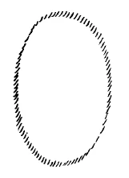
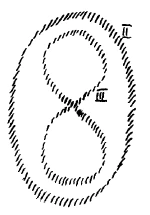
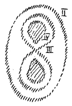
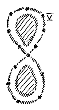
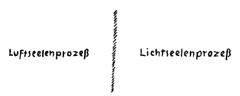

Sie haben gesehen aus den Darstellungen der letzten Tage, wie zum völligen Verständnis der menschlichen Wesenheit notwendig ist, einzugehen auf die Gliederung des Menschen, vor allen Dingen zu unterscheiden, welch tiefgreifender Unterschied besteht zwischen dem, was wir nennen können menschliche Hauptesorganisation, menschliche Kopforganisation, und dem, was wir nennen können die Organisation des übrigen Menschen. Zwar wissen Sie ja, daß wir auch diesen übrigen Menschen wiederum gliedern, so daß wir im Ganzen auch da eine Dreigliederung bekommen, aber zunächst ist für das Verständnis der bedeutsamen Impulse in der Menschheitsentwickelung, denen wir gegenwärtig und in der nächsten Zukunft gegenüberstehen, die Unterscheidung in Kopfmenschen und in die Organisation des übrigen Menschen wichtig. ^96ccvf

Nun, wenn wir geisteswissenschaftlich so über den Menschen sprechen, daß wir sagen: Kopfmensch, übriger Mensch, dann sind uns die Kopfes- oder Hauptesorganisation und die Organisation des übrigen Menschen zunächst mehr Bilder, von der Natur selbst geschaffene Bilder für das Seelische, für das Geistige, dessen Ausdruck, dessen Offenbarung sie sind. Der Mensch steht in der gesamten Erdenmenschheitsentwickelung in einer Weise darinnen, die man eigentlich nur verstehen kann, wenn man das verschiedene Darinnenstehen der Kopfesorganisation und der übrigen Organisation des Menschen betrachtet. Dasjenige, was an die Hauptesorganisation geknüpft ist, was also namentlich als das Vorstellungsleben des Menschen durch das Haupt sich offenbart, das ist ja etwas, was — wenn wir zunächst nur bleiben in der Zeit der nachatlantischen Menschheitsentwickelung — weit zurückgeht in dieser nachatlantischen Menschheitsentwickelung. Wenn wir die Zeit ins Auge fassen, die unmittelbar auf die große atlantische Katastrophe folgte, das ist also im 6., 7., 8. Jahrtausend vor der christlichen Zeitrechnung, dann kommen wir allerdings zurück für die Gegenden, die damals für die zivilisierte Welt in Betracht kommen, zu einer Seelenstimmung der Menschheit, die sich kaum mehr mit der unsrigen vergleichen läßt. Dasjenige, was dazumal der Mensch in seinem Bewußtsein hatte, was des Menschen Auffassung der Welt charakterisierte, das ist schwer mit dem zu vergleichen, was jetzt unsere Sinnesanschauung, unsere Gedankenauffassung der Welt charakterisiert. In meiner «Geheimwissenschaft im Umriß» habe ich diese Kultur, die in so alte Zeiten zurückreicht, die urindische genannt. Wir können sagen: Bis zu dem Grade war die Menschheitsorganisation, die dazumal vorzugsweise an das Haupt gebunden war, von der unsrigen verschieden, daß eigentlich das Rechnen mit Raum und Zeit, wie es uns eigen ist, dieser alten Bevölkerung gar nicht eigen war. Es war im Überschauen der Welt mehr ein Überblick über unermeßliche Raumesweiten, und es war auch ein Ineinanderschauen der verschiedenen Zeitmomente. Dieses starke Betonen von Raum und Zeit in der Weltauffassung, das war in dieser alten Zeit nicht vorhanden. ^d1xtuh

Davon finden wir die ersten Anklänge erst gegen das 5., 4. Jahrtausend, namentlich in der Zeit, die wir bezeichnen als die urpersische Zeit. Da ist aber auch noch die ganze Stimmung des seelischen Lebens eine solche, die sich schwer mit dem vergleichen läßt, was in unserer Zeit des Menschen Seelen- und Weltenstimmung ist. Da ist vor allen Dingen der Mensch immer darauf aus in dieser alten Zeit, alle Dinge so sich zu interpretieren, daß er Abstimmungen eines Lichten, Hellen und eines Finsteren, Dunklen überall erblickt. Jene Abstraktionen, in denen wir heute leben, die sind jener alten Erdenbevölkerung noch völlig fremd. Es ist noch etwas von einer universellen Gesamtanschauung vorhanden, ein Bewußtsein des Durchdrungenseins alles Anschaubaren vom Lichte und seines Abschattierens in Dunkelheiten. So sah man auch die moralische Weltordnung an. Man empfand einen Menschen, der wohlwollend war, gütig war, als licht, als hell, einen Menschen, der mißtrauisch war, eigensüchtig war, als einen dunklen Menschen. Man sah gewissermaßen noch aurisch um den Menschen herum dasjenige, was seine moralische Individualität war. Und wenn man zu einem Menschen dieser alten urpersischen Zeit gesprochen hätte von dem, was wir heute Naturordnung nennen, da hätte er gar nichts davon verstanden. Naturordnung in unserem Sinne gab es in seiner Licht- und Schattenwelt nicht. Denn für ihn war Licht- und Schattenwelt da, und er nannte zum Beispiel in der Tonwelt auch eine gewisse Nuance des Tönens hell, licht, eine gewisse Nuance des Tönens dunkel, schattig. Für ihn war die Welt eine Licht- und Schattenwelt. Und das, was sich ausdrückte durch dieses Hell-Dunkel, das waren ihm geistige und zugleich Naturgewalten. Es war für ihn kein Unterschied zwischen geistigen und Naturgewalten. So etwas, wie wir heute unterscheiden zwischen Naturnotwendigkeit und menschlicher Freiheit, das wäre ihm als Wahnsinn erschienen, denn für ihn gab es diese Zweiheit nicht, menschliche Willkür und Naturnotwendigkeit. Für ihn war gewissermaßen alles zu umfassen unter einer geistig-physischen Einheit. Soll ich bildlich Ihnen etwas aufzeichnen — die Bedeutung wird es erst erhalten durch das, was folgen wird —, wie der Charakter dieser urpersischen Weltanschauung war, so müßte ich ungefähr solch eine Linie hinzeichnen, wie die Weltenschlange, das Symbol des Alls, die einheitlich die Menschheitsanschauung umfaßte. ^yfwwfd

 ^h3fy30

Dann, nachdem etwas über zwei Jahrtausende die Seelenstimmung der Menschen so war, trat ja dasjenige auf, dessen Nachklänge wir noch wahrnehmen in der chaldäischen Weltanschauung, in der ägyptischen Weltanschauung und in einer besonderen Form in derjenigen Weltanschauung, deren Abglanz uns im Alten Testamente erhalten ist. Da tritt in einer gewissen Weise schon etwas auf, was näher ist unserer gegenwärtigen Weltanschauung. Da bekommt man schon die Nuance von einer gewissen Naturnotwendigkeit herein in das menschliche Vorstellen. Aber diese Naturnotwendigkeit ist noch weit entfernt von dem, was wir heute die mechanische oder auch nur die vitale Naturordnung nennen. Es fällt noch zusammen für diese Zeit das Naturgeschehen mit dem göttlichen Wollen, mit der Vorsehung. Vorsehung und Naturgeschehen ist noch eines. Der Mensch wußte: Wenn er seine Hand bewegt, so ist es das Göttliche eigentlich in ihm, das ihn durchdringt, das seine Hand bewegt, seinen Arm bewegt. Wenn ein Baum durch den Wind geschüttelt wurde, so war ihm die Anschauung dieses sich schüttelnden Baumes nicht anders als die Anschauung des bewegten Armes. Er sah dieselbe göttliche Macht als Vorsehung in seinen eigenen Bewegungen und in den Bewegungen des Baumes. Aber man unterschied schon den Gott außerhalb und den Gott innerhalb; nur dachte man ihn als einheitlich, den Gott in der Natur, den Gott im Menschen, nur war er derselbe. Und man war sich klar in dieser Zeit, daß allerdings im Menschen etwas ist, womit gewissermaßen die Vorsehung, die außen in der Natur ist, und die Vorsehung, die innen im Menschen ist, einander begegnen. ^drp38l

So empfand man in dieser Zeit den Atmungsprozeß des Menschen. Man sagte, wenn ein Baum sich schüttelt, das ist der Gott außerhalb, und wenn ich meinen Arm bewege, das ist der Gott innerhalb. Wenn ich die Luft einziehe, innerlich verarbeite und wiederum nach außen lasse, dann ist das der Gott von außen, der hereingeht und wiederum hinausgeht. So empfand man dasselbe Göttliche draußen, drinnen, aber in einem Punkt zugleich draußen, drinnen. Man sagte sich: Indem ich Atmungswesen bin, bin ich zugleich ein Wesen der Natur draußen, zu gleicher Zeit ich selbst. ^yt0mgs

Soll ich ebenso, wie ich die urpersische Weltanschauung Ihnen charakterisiert habe durch diese Linie (vorhergehende Zeichnung), soll ich Ihnen die des dritten Zeitalters charakterisieren, so müßte ich sie durch diese Linie charakterisieren (in das Oval wird eine Lemniskate gezeichnet, siehe S. 106 oben). ^eb0w76

Diese Linie würde darstellen auf der einen Seite draußen das Naturdasein, auf der anderen Seite das Menschendasein, aber in dem einen Punkt, im Atmungsprozesse, sich überkreuzend. ^9fwpld

 ^428p55

Das wird anders im vierten Zeitalter, in dem griechisch-lateinischen Zeitalter. Da tritt vor die Menschen schroff hin der Gegensatz des Außen und des Innen, des Naturdaseins und des menschlichen Daseins. Da beginnt der Mensch sich im Gegensatz zu fühlen gegen die Natur. Und wenn ich Ihnen wiederum charakteristisch bezeichnen soll, wie jetzt der Mensch beginnt zu fühlen im griechischen Zeitalter, so müßte ich das so zeichnen (es wird in die Lemniskate hineingezeichnet): ^ifdnbw

 ^q41o3w

Auf der einen Seite empfindet er das Äußere, auf der anderen Seite das Innere, und zwischen beiden ist nicht mehr der überkreuzende Punkt. ^udmo38

Es bleibt gewissermaßen dieses, was der Mensch mit der Natur gemeinsam hat, außerhalb des Bewußtseins. Es fällt schon aus dem Bewußtsein hinaus. In der indischen Jogakultur versucht man es wieder hereinzubekommen. Daher ist die indische Jogakultur ein atavistisches Zurückgehen auf frühere Entwickelungsstufen der Menschheit, weil man wieder hereinzubekommen sucht ins Bewußtsein den Atmungsprozeß, den man im dritten Zeitalter naturgemäß als das empfand, worinnen man sich zugleich draußen und zugleich drinnen fühlte. Dieses vierte Zeitalter beginnt ja im 8. vorchristlichen Jahrhundert. Und da begannen dann auch jene spätindischen Jogaübungen, die wiederum zurückzurufen suchten atavistisch dasjenige, was man früher gehabt hatte, insbesondere auch in der indischen Kultur hatte, was aber verlorengegangen war. ^w7jy4o

Also dieses Bewußtsein des Atmungsprozesses, das ging verloren. Und wenn man sich frägt: Warum versuchte es die indische Jogakultur wiederum zurückzurufen, was glaubte sie eigentlich dadurch zu erringen? — so muß man sagen: Ja, was dadurch errungen werden sollte, das war ein wirkliches Verständnis der Außenwelt. Denn dadurch, daß der Atmungsprozeß verstanden wurde im dritten Kulturzeitalter, dadurch verstand man innerlich in sich etwas, was zu gleicher Zeit ein ÄAußerliches war. ^wgk1yw

Das ist es, was auf einem anderen Wege wiederum errungen werden muß. Denn wir leben noch — das vierte Zeitalter hört ja erst auf etwa mit dem Jahre 1413, also überhaupt erst in der Mitte des 15. Jahrhunderts — unter den Nachwirkungen dieser Kultur, die durchaus in der menschlichen Seelenstimmung ein Zwiefaches hat. Wir haben durch unsere Hauptesorganisation eine unvollständige Naturanschauung, das, was wir die Außenwelt nennen, und wir haben durch unsere Innenorganisation, durch die Organisation des übrigen Menschen, ein unvollständiges Wissen von uns selbst. (Es werden zwei voneinander getrennte Gebilde skizziert.) Dazwischen bleibt uns dasjenige aus, fällt uns hinweg, in dem wir zugleich einen Prozeß der Welt und einen Prozeß von uns selbst sehen würden. ^v24fyg

Nun handelt es sich darum, daß wiederum errungen werden muß, aber jetzt in bewußter Weise wiederum errungen werden muß dasjenige, was verlorengegangen ist. Das heißt, wir müssen wiederum zum Erfassen von etwas kommen, was im Inneren des Menschen ist, was zu gleicher Zeit der Außenwelt und dem Inneren angehört, was sich wie rechts derum übergreift. (Um die beiden Gebilde wird eine Lemniskate gezogen.) ^837tkq

 ^zkveil

Das muß das Bestreben des fünften nachatlantischen Zeitraums sein. Das Bestreben des fünften nachatlantischen Zeitraums muß sein, wiederum etwas im Menscheninneren zu finden, wo sich in dem, was wir in uns finden, zu gleicher Zeit ein äußerer Prozeß abspielt. ^6416fv

Sie werden sich wohl erinnern, daß ich auf dieses wichtige Faktum bereits hingedeutet habe; daß ich hingedeutet habe in meinem letzten Aufsatz der «Sozialen Zukunft», wo ich scheinbar die Bedeutung dieser Dinge für das soziale Leben behandelt habe, wo aber deutlich gerade darauf hingedeutet ist, daß etwas gefunden werden muß, wo der Mensch zu gleicher Zeit etwas in sich ergreift, was er erkennt als einen Prozeß der Welt. Wir können als Menschen der Gegenwart dies nicht etwa dadurch erreichen, daß wir zurückgreifen auf die Jogakultur; die ist etwas Vergangenes. Denn, sehen Sie, der Atmungsprozeß selbst hat sich verändert. Das können Sie natürlich heute nicht auf der Klinik nachweisen. Aber der Atmungsprozeß des Menschen ist seit dem dritten nachatlantischen Kulturzeitalter ein anderer geworden. Grob gesprochen könnte man sagen: Im dritten nachatlantischen Kulturzeitalter atmete der Mensch noch Seele, jetzt atmet er Luft. Nicht bloß etwa unsere Vorstellungen sind materialistisch geworden, die Realität selber hat ihre Seele verloren. ^jyyz3l

Ich bitte Sie, in dem, was ich jetzt sage, nicht etwas Unerhebliches zu sehen. Denn denken Sie, was das bedeutet, daß sich die Realität, in der die Menschheit lebt, selber so umgewandelt hat, daß unsere Atemluft etwas anderes ist, als sie etwa vor vier Jahrtausenden war. Nicht etwa bloß das Bewußtsein der Menschheit hat sich verändert, o nein, in der Atmosphäre der Erde war Seele. Die Luft war die Seele. Das ist sie heute nicht mehr, beziehungsweise sie ist es in anderer Art. Die geistigen Wesenheiten elementarer Natur, von denen ich gestern gesprochen habe, die dringen wiederum in sie ein, die kann man atmen, wenn man heute Jogaatmen treibt. Aber dasjenige, was in der normalen Atmung vor drei Jahrtausenden erlangbar war, das kann nicht auf künstliche Weise zurückgebracht werden. Daß das zurückgebracht werden könne, ist die große Illusion der Orientalen. Das, was ich jetzt sage, ist etwas, was durchaus eine Realität beschreibt. Jene Beseelung der Luft, die zu dem Menschen gehört, die ist nicht mehr da. Und deshalb können die Wesen, ich möchte sie die antimichaelischen Wesen nennen, von denen ich gestern gesprochen habe, in die Luft eindringen und durch die Luft in den Menschen, und auf diese Weise gelangen sie in die Menschheit, so wie ich das gestern beschrieben habe. Und wir können sie nur vertreiben, wenn wir an die Stelle des Jogamäßigen das Richtige setzen von heute. Wir müssen uns klarwerden darüber, daß dieses Richtige angestrebt werden muß. Dieses Richtige kann nur angestrebt werden, wenn wir uns einer viel feineren Beziehung des Menschen zur Außenwelt bewußt werden, so daß mit Bezug auf unseren Ätherleib etwas stattfindet, das immer mehr und mehr in unser Bewußtsein hereinkommen muß, ähnlich wie der Atmungsprozeß. Wie wir beim Atmungsprozeß frische Sauerstoffluft einatmen und unbrauchbare Kohlenstoffluft ausatmen, so ist ein ähnlicher Prozeß vorhanden in allen unseren Sinneswahrnehmungen. Denken Sie einmal, Sie sehen etwas. Nehmen wir einen radikalen Fall. Nehmen wir an, Sie sehen eine Flamme an, Sie schauen auf eine Flamme hin. Da geschieht etwas, was sich vergleichen läßt, nur viel feiner ist es, mit dem Einatmen. Machen Sie dann das Auge zu — und Sie können ähnliche Dinge mit jedem der Sinne machen -, machen Sie dann das Auge zu, so haben Sie das Nachbild der Flamme, das sich sogar nach und nach verändert, wie Goethe sagt, abklingt. An diesem Prozeß des Aufnehmens des Lichteindruckes und des nachherigen Abklingens ist im wesentlichen außer dem, was rein physiologisch ist, der menschliche Ätherleib sehr beteiligt. Aber in diesem Prozeß steckt etwas sehr, sehr Bedeutsames. Da drinnen ist nunmehr das Seelische, das vor drei Jahrtausenden mit der Luft ein- und ausgeatmet worden ist. Und wir müssen lernen, in einer ähnlichen Weise den Sinnesprozeß in seiner Durchseelung einzusehen, wie man vor drei Jahrtausenden den Atmungsprozeß eingesehen hat. ^6tczdc

Das hängt zusammen damit, daß man sagen kann, der Mensch lebte vor drei Jahrtausenden in einer Art Nachtkultur. Jahve gab sich durch seine Propheten kund aus den Träumen der Nacht heraus. Wir aber müssen die Feinheiten unseres Verkehres mit der Welt ausbilden so, daß wir in unserem Aufnehmen der Welt nicht bloß sinnliche Wahrnehmungen haben, sondern Geistiges haben. Wir müssen uns gewiß werden, daß wir mit jedem Lichtstrahl, mit jedem Ton, mit jeder Wärmeempfindung und deren Abklingen in seelischen Wechselverkehr mit der Welt treten, und dieser seelische Wechselverkehr muß für uns etwas Bedeutsames werden. Aber wir können uns auch unterstützen, so daß es so mit uns werde. ^wzqbkj

Ich habe Ihnen ja dargestellt, daß das Mysterium von Golgatha hereingefallen ist in den vierten nachatlantischen Zeitraum, der etwa, wenn wir genau rechnen wollen, beginnt mit dem Jahre 747 vor Christus, und schließt mit dem Jahre 1413 nach Christus. In das erste Drittel dieses Zeitraumes fällt das Mysterium von Golgatha. Dasjenige aber, wodurch die Menschen zunächst dieses Mysterium von Golgatha begriffen haben, das waren noch die Nachklänge der alten Denkweise, der alten Kultur. Die Art des Begreifens des Mysteriums von Golgatha, die muß eine durchaus neue werden. Denn die alte Art, das Mysterium von Golgatha zu begreifen, ist abgebraucht. Sie ist nicht mehr gewachsen dem Mysterium von Golgatha. Und viele Versuche, die gemacht worden sind, das menschliche Denken fähig zu machen, das Mysterium von Golgatha zu begreifen, haben sich als nicht mehr geeignet erwiesen, heraufzureichen zu dem Mysterium von Golgatha. ^hs94dg

Sehen Sie, alle die Dinge, die äußerlich materiell auftreten, sie haben auch ihre geistig-seelische Seite. Und alle die Dinge, die geistig-seelisch auftreten, sie haben auch ihre äußerlich materielle Seite. Daß die Luft der Erde entseelt worden ist, so daß der Mensch nicht mehr die ursprünglich beseelte Luft atmet, das hatte eine bedeutsame geistige Wirkung in der Entwickelung der Menschheit. Denn der Mensch hatte, indem er hereinbekam mit der Atmung die Seele, mit der er selber ursprünglich verwandt war, wie es am Beginne des Alten Testamentes steht: Und der Gott blies dem Menschen den Odem ein als lebendige Seele —, er hatte durch dieses Einatmen des Seelischen eine Möglichkeit: er bekam ein Bewußtsein von der Präexistenz des Seelischen, von dem Bestehen der Seele, bevor sie heruntergestiegen ist in den physischen Leib durch die Geburt oder durch die Empfängnis. Und in demselben Maße, in dem der Atmungsprozeß aufhörte beseelt zu sein, verlor der Mensch das Bewußtsein der Präexistenz des Seelischen. Und schon sogar als Aristoteles auftrat in diesem vierten nachatlantischen Zeitraum, da war keine Möglichkeit mehr vorhanden, mit menschlicher Fassungskraft die seelische Präexistenz zu durchschauen. Keine Möglichkeit war dafür mehr vorhanden. ^f75ky8

Wir stehen eben historisch vor dem merkwürdigen Faktum, daß das größte Ereignis hereinbricht in die Erdenentwickelung, das ChristusEreignis, daß aber die Menschheit erst heranreifen muß, um es zu verstehen. Sie ist noch fähig, mit den alten Resten des Fassungsvermögens, das aus der Urkultur herrührt, aufzufangen die Strahlen des Mysteriums von Golgatha. Dann aber verliert sich diese Fassungskraft, und die Dogmatik entfernt sich immer mehr und mehr vom Verständnis des Mysteriums von Golgatha. Die Kirche verbietet an die Präexistenz zu glauben nicht deshalb, weil die Präexistenz nicht mit dem Mysterium von Golgatha vereinbar wäre, sondern weil die menschliche Fassungskraft durch die Entseelung der Luft aufhörte, das Bewußtsein in die Seele als Kraft hereinzubekommen, das Bewußtsein von der Präexistenz. Aus all dem, was Kopfbewußtsein wurde, verschwindet die Präexistenz. Wenn wir das Beseeltsein unserer Sinnesempfindungen wieder haben werden, dann werden wir wiederum einen Kreuzungspunkt haben, und in diesem Punkt werden wir den menschlichen Willen, der heraufströmt aus der dritten Bewußtseinsschichte, wie ich es Ihnen in diesen Tagen charakterisiert habe, erfassen. Da werden wir zu gleicher Zeit etwas Subjektiv-Objektives haben, wonach Goethe so lechzte. Da werden wir wiederum die Möglichkeit haben, in feiner Art zuerst zu erfassen, wie merkwürdig eigentlich dieser Sinnesprozeß des Menschen im Verhältnis zur Außenwelt ist. Das sind ja alles grobe Vorstellungen, als wenn die Außenwelt auf uns bloß wirkte und wir dann bloß reagierten darauf. All das Zeug, das da geredet wird, das sind ja bloß grobklotzige Vorstellungen. Die Wirklichkeit ist vielmehr diese, daß ein seelischer Prozeß vor sich geht von außen nach innen, der erfaßt wird durch den tief unterbewußten, inneren seelischen Prozeß, so daß die Prozesse sich übergreifen. Von außen wirken die Weltgedanken in uns herein, von innen wirkt der Menschheitswille hinaus. Und es durchkreuzen sich Menschheitswillen und Weltengedanken in diesem Kreuzungspunkte, wie sich im Atem das Objektive mit dem Subjektiven einstmals überkreuzt hat. Wir müssen fühlen lernen, wie durch unsere Augen unser Wille wirkt, und wie in der Tat die Aktivität der Sinne leise sich hineinmischt in die Passivität, wodurch sich Weltengedanken mit Menschheitswille kreuzen. Diesen neuen Jogawillen, den müssen wir entwickeln. Damit wird uns wiederum etwas Ähnliches vermittelt, wie vor drei Jahrtausenden den Menschen in dem Atmungsprozeß vermittelt wurde. Unsere Auffassung muß eine viel seelischere, eine viel geistigere werden. ^4ni4zf

Nach solchen Dingen strebte die Goethesche Weltanschauung. Goethe wollte das reine Phänomen erkennen, was er das Urphänomen nannte, wo er nur zusammenstellte dasjenige, was in der Außenwelt auf den Menschen wirkt, wo sich nicht hineinmischt der luziferische Gedanke, der aus dem Kopf des Menschen selbst kommt. Dieser Gedanke sollte nur zur Zusammenstellung der Phänomene dienen. Goethe strebte nicht nach dem Naturgesetz, sondern nach dem Urphänomen. Das ist das Bedeutsame bei ihm. Kommen wir aber zu diesem reinen Phänomen, zu diesem Urphänomen, dann haben wir in der Außenwelt etwas, was uns möglich macht, auch die Entfaltung unseres Willens im Anschauen der Außenwelt zu verspüren, und dann werden wir uns aufschwingen wiederum zu etwas Objektiv-Subjektivem, wie es zum Beispiel die alte hebräische Lehre noch hatte. Wir müssen lernen, nicht immer nur von dem Gegensatz zu sprechen zwischen dem Materiellen und dem Geistigen, sondern wir müssen das Ineinanderspiel des Materiellen und des Geistigen in einer Einheit gerade im sinnlichen Auffassen erkennen. Geradeso wie das, was vor drei Jahrtausenden die Jahve-Kultur war, so wird für uns dasjenige sein, was eintritt, wenn wir die Natur nicht mehr materiell sehen, und auch nicht wie etwa Gustav Theodor Fechner in die Natur etwas Seelisches hineinphantasieren. Wenn wir in der Natur das Seelische mitempfangen lernen mit der Sinnesanschauung, dann werden wir das Christus-Verhältnis zu der äußeren Natur haben. Da wird das Christus-Verhältnis zur äußeren Natur etwas sein wie eine Art geistigen Atmungsprozesses. ^1t6gto

Wir können uns dadurch unterstützen, daß wir immer mehr einsehen, aber jetzt einsehen durch den gesunden Menschenverstand: Ja, Präexistenz ist etwas, was unserem Seelendasein zugrunde liegt. Und wir müssen die rein egoistische Vorstellung von der Postexistenz, die eine rein egoistische ist, die nur aus unserem Bedürfnis, nach dem Tode da zu sein, entspringt, wir müssen diese egoistische Postexistenzvorstellung ergänzen durch das Wissen von der Präexistenz des Seelischen. Wir müssen uns auf eine andere Art wiederum aufschwingen zu der Anschauung der wirklichen Ewigkeit der Seele. Das ist dasjenige, was man die Michael-Kultur nennen kann. Wenn wir durch die Welt schreiten in dem Bewußtsein, mit jedem Blick, mit jedem Ton, den wir hören, strömt Geistiges, Seelisches wenigstens in uns ein, und zu gleicher Zeit strömen wir in die Welt Seelisches hinaus, dann, dann haben wir das Bewußtsein errungen, das die Menschheit für die Zukunft braucht. ^poaz8c

Ich komme noch einmal auf das Bild zurück. Sie sehen eine Flamme. Sie schließen die Augen, haben das Nachbild, das abklingt. Ist das bloß ein subjektiver Prozeß? Der heutige Physiologe sagt so. Es ist nicht wahr. In dem Weltenäther bedeutet das einen objektiven Prozeß, wie in der Luft die Anwesenheit der Kohlensäure, die Sie ausatmen, einen objektiven Prozeß bedeutet. Sie prägen dem Weltenäther ein das Bild, das Sie nur wie ein abklingendes Nachbild empfinden. Das ist nicht bloß subjektiv, das ist ein objektiver Vorgang. Hier haben Sie das Objektive. Hier haben Sie die Möglichkeit, zu erkennen, wie etwas, was sich in Ihnen abspielt, in feiner Art zu gleicher Zeit ein Weltenvorgang ist, wenn Sie sich nur bewußt werden: Sehe ich eine Flamme an, mache die Augen zu, lasse sie abklingen — es klingt ja auch ab, wenn Sie die Augen offen lassen, nur bemerken Sie es dann nicht -, dann ist das etwas, was nicht bloß in mir vorgeht, das ist etwas, was in der Welt vorgeht. Das ist aber nicht bloß bei der Flamme so. Trete ich einem Menschen gegenüber und sage: Dieser Mensch hat das oder jenes gesagt, was wahr oder nicht wahr sein kann -, so ist das eine Beurteilung, eine moralische oder eine intellektuelle Handlung im Inneren. Das klingt ebenso ab wie die Flamme. Das ist ein objektiver Weltenvorgang. Wenn Sie über Ihren Nebenmenschen Gutes denken: es klingt ab, ist im Weltenäther als ein objektiver Vorgang; wenn Sie Böses denken: es klingt ab als ein objektiver Vorgang. Sie können nicht etwa in Ihrem Kämmerchen abschließen dasjenige, was Sie über die Welt wahrnehmen oder urteilen. Sie machen es zwar scheinbar für Ihre Auffassung in sich, aber es ist zu gleicher Zeit ein objektiver Weltenvorgang. Wie sich das dritte Zeitalter bewußt war, daß der Atmungsprozeß zu gleicher Zeit etwas ist, was im Menschen vorgeht und was ein objektiver Prozeß ist, so muß die Menschheit sich in der Zukunft bewußt werden, daß das Seelische, von dem ich gesprochen habe, zu gleicher Zeit ein objektiver Weltenvorgang ist. ^9b4cpg

Diese Wandlung des Bewußtseins, das ist etwas, was fordert, daß größere Stärke in der menschlichen Seelenstimmung Platz greife, als sie heute der Mensch gewöhnt ist. Das ist das Einlassen der MichaelKultur: das Sich-Durchdringen mit diesem Bewußtsein. Wir müssen gewissermaßen, wenn wir das Licht als den allgemeinen Repräsentanten der Sinneswahrnehmung hinstellen, uns dazu aufschwingen, das Licht beseelt zu denken, so wie es selbstverständlich war für den Menschen des 2., des 3. vorchristlichen Jahrtausends, die Luft beseelt zu denken, weil sie das auch war. Wir müssen uns gründlich abgewöhnen, dasjenige in dem Lichte zu sehen, was das materialistische Zeitalter gewöhnt ist, in dem Lichte zu sehen. Wir müssen uns gründlich abgewöhnen zu glauben, daß von der Sonne ausstrahlen bloß jene Schwingungen, von denen uns unsere Physik und das allgemeine Menschheitsbewußtsein heute redet. Wir müssen uns klarwerden darüber, daß da Seele durch den Weltenraum dringt auf den Schwingen des Lichtes. Und zu gleicher Zeit müssen wir einsehen, daß das so nicht war in der Zeit, die unserem Zeitalter vorangegangen ist. In der Zeit, die unserem Zeitalter vorangegangen ist, ist dasselbe an die Menschheit durch die Luft herangekommen, was jetzt an uns herankommt durch das Licht. Sehen Sie, das ist ein objektiver Unterschied in dem Erdenprozeß. Und wenn wir im Großen denken, so können wir sagen: Luftseelenprozeß, Lichtseelenprozeß. (Es wird an die Tafel geschrieben:) ^esqwrj

 ^mqdavk

Und das ist etwa dasjenige, was wir in der Entwickelung der Erde beobachten können. Und mitten hinein fällt, den Übergang des einen in das andere bedeutend, das Mysterium von Golgatha. Es genügt nicht für die Gegenwart und für die Zukunft der Menschheit, daß man in Abstraktionen von dem Geistigen fabelt, daß man in irgendeinen nebulosen Pantheismus oder dergleichen verfällt, sondern es handelt sich darum, daß man dasjenige, was die heutige Menschheit eigentlich nur empfindet wie einen materiellen Prozeß, daß man das anfängt auch in seiner Beseeltheit zu erkennen. ^7m8h5q

Es handelt sich darum, daß man anfangen lerne zu sprechen: Es gab eine Zeit vor dem Mysterium von Golgatha, da hatte die Erde eine Atmosphäre. In dieser Atmosphäre war die Seele, die zum Seelischen des Menschen gehörte. Jetzt hat die Erde eine Atmosphäre, die ist entleert des Seelischen, das zum Seelischen des Menschen gehört. Dafür ist in das Licht, das uns vom Morgen bis zum Abend umfaßt, eingezogen dasselbe Seelische, das vorher in der Luft war. Daß der Christus sich mit der Erde verbunden hat, das gab die Möglichkeit dazu. So daß Luft und Licht auch geistig-seelisch etwas anderes geworden sind im Laufe der Erdenentwickelung. ^o7g4lt

Es ist eine kindsköpfige Darstellung, wenn man Luft und Licht in gleicher Weise rein materiell beschreibt für die Jahrtausende, in denen sich die Erdenentwickelung abgespielt hat. Luft und Licht sind innerlich etwas anderes geworden. Wir leben in einer anderen Atmosphäre, in einem anderen Lichtkreis, als unsere Seelen in früheren Erdenverkörperungen gelebt haben. Erkennen lernen dasjenige, was äußerlich materiell ist, als Geistig-Seelisches, darauf kommt es an. Das wird nicht eine wirkliche Geisteswissenschaft geben, wenn die Leute auf der einen Seite das rein materielle Dasein beschreiben, so wie man es heute gewohnt ist, und dann — ja, so wie eine Dekoration — nebenher sagen: Aber in diesem Materiellen ist überall auch Geistiges! Ja, in dieser Beziehung sind die Menschen ganz merkwürdig, in dieser Beziehung wollen sie heute durchaus sich auf das Abstrakte zurückziehen. Dasjenige aber, was notwendig ist, das ist: in der Zukunft nicht in abstrakter Weise ein Materielles und ein Geistiges zu unterscheiden, sondern in dem Materiellen selber das Geistige zu suchen, daß man es beschreiben könne als das Geistige zugleich, und in dem Geistigen den Übergang ins Materielle, die Wirkungsweise im Materiellen zu erkennen. Dann erst werden wir auch wirklich wiederum, wenn wir das haben, eine Erkenntnis des Menschen selbst erringen. «Blut ist ein ganz besonderer Saft», aber das, wovon man heute redet in der Physiologie, das ist kein ganz besonderer Saft, das ist halt ein Saft, dessen chemische Zusammensetzung man versucht ebenso anzugeben wie irgendeine andere Stoffzusammensetzung. Das ist ja nichts Besonderes. Aber wenn man den Ausgangspunkt erst gewinnt, die Metamorphose von Luft und Licht seelisch richtig einsehen zu können, dann wird man allmählich aufsteigen können, auch den Menschen selber wiederum in allen seinen einzelnen Gliedern geist-seelisch zu begreifen, dann wird man nicht abstrakten Stoff und abstrakten Geist haben, sondern Geist, Seele und Leib ineinanderwirkend. Das wird Michael-Kultur sein. ^svavqd

Das ist etwas, was unsere Zeit fordert. Das ist etwas, das mit allen Fasern des seelischen Lebens von den Menschen, die heute die Zeit verstehen wollen, aufgefaßt werden sollte. Es ist seit langer Zeit immer Widerstand geleistet worden gegen alles dasjenige, was als ein Ungewohntes in die menschliche Weltanschauung hereingetragen werden mußte. Ich habe ja öfter das niedliche Beispiel, das an etwas Grobklotziges sich gewendet hat, angeführt: 1835 — also wir sind noch nicht ein Jahrhundert drüber hinaus - ist das gelehrte Medizinalkollegium in Bayern gefragt worden, als man die erste Eisenbahn von Fürth nach Nürnberg bauen wollte, ob es hygienisch ist, solch eine Eisenbahn zu bauen? Da sagte das Medizinalkollegium — das Dokument ist vorhanden, es ist kein Märchen -, man solle keine Eisenbahn bauen, denn die Leute würden nervös werden, die in dieser Weise sich über den Erdboden bewegen würden. — Aber dann setzte man noch hinzu: Wenn es schon solche Menschen geben würde, die durchaus wollten Eisenbahnen fordern, dann müsse man links und rechts hohe Bretterwände aufführen, damit diejenigen, an denen die Eisenbahnen vorbeifahren, nicht Gehirnerschütterung kriegen. — Ja, sehen Sie: Eines ist ein solches Urteil, das man fällt, ein anderes ist der Entwickelungsgang der Menschheit. Wir lächeln heute über ein solches Dokument, wie es das bayerische Medizinalkollegium 1835 geliefert hat. Aber nun, nicht wahr, so ohne weiteres haben wir kein Recht zu lachen: trifft uns heute etwas ähnliches, verhalten wir uns wieder geradeso. Denn so absolut unrecht können wir auch nicht wiederum dem bayerischen Medizinalkollegium geben. Wenn man den Nervenzustand der gegenwärtigen Menschheit vergleicht mit dem Nervenzustande derjenigen Menschheit, die vor zwei Jahrhunderten da war, so sind die Leute nervös geworden. Vielleicht hat das Medizinalkollegium bloß etwas übertrieben, aber nervös geworden sind die Leute. Nur handelt es sich bei der Fortentwickelung der Menschheit nicht um solche Dinge, sondern darum, daß gewisse Impulse, die herein wollen, wirklich hereinkommen in die Erdenentwickelung, daß sie nicht zurückgewiesen werden. Und es ist schon etwas gegen die Bequemlichkeit der Menschen, was da herein will von Zeit zu Zeit in die menschliche Kulturentwickelung, und man muß ablesen dasjenige, was Pflicht ist in bezug auf die menschliche Kulturentwickelung aus der Objektivität, nicht aus der menschlichen Bequemlichkeit heraus, nicht einmal aus der besseren menschlichen Bequemlichkeit heraus. Und ich schließe heute aus dem Grunde mit diesen Worten, weil ja es ganz zweifellos ist, von allen Seiten kündigt es sich an, daß ein gewisser, schon recht stark anschwellender Kampf gerade zwischen dem anthroposophischen Erkennen und den verschiedenen Bekenntnissen eintreten wird. Die Bekenntnisse, die in altgewohnten Geleisen bleiben wollen, die sich nicht aufschwingen wollen zu einer Neuerkenntnis des Mysteriums von Golgatha, sie werden die starke Kampf "position, die sie bereits eingenommen haben, immer mehr verstärken, und es wäre sehr, sehr leichtsinnig, wenn wir uns nicht bewußt würden, daß dieser Kampf losgeht. ^5o0aun

Nun, sehen Sie, ich bin durchaus gar nicht erpicht auf einen solchen Kampf, insbesondere nicht auf den Kampf mit der katholischen Kirche, der, wie es scheint, von der anderen Seite jetzt in solcher Heftigkeit aufgedrängt wird. Derjenige, der auch die tieferen historischen Impulse der heutigen Bekenntnisse schließlich gut kennt, der wird sehr unwillig das Altehrwürdige bekämpfen. Aber wenn der Kampf aufgedrängt wird, dann ist er eben nicht zu vermeiden. Und das heutige Priestertum ist durchaus nicht geneigt, irgendwie hereinkommen zu lassen dasjenige, was hereinkommen muß: das Geisteswissenschaftliche. Man kann auch voraussehen, daß der notwendige Kampf gegen so etwas, wie ich es Ihnen neulich vorgelesen habe, ja eigentlich grotesk ist: daß also gesagt wird, man solle sich unterrichten über anthroposophisch orientierte Geisteswissenschaft aus den mir gegnerischen Schriften, denn meine eigenen Schriften seien ja durch den Papst verboten für die Katholiken. Das ist gar nicht lächerlich, das ist eine tiefernste Sache! Ein Kampf, der in dieser Weise grotesk auftritt, der fähig ist, solches Urteil in die Welt zu senden, ein solcher Kampf ist nicht leichthin zu nehmen. Und insbesondere ist er dann nicht leichthin zu nehmen, wenn man ihn gar nicht gern eingeht. Denn sehen Sie, nehmen wir das Beispiel der katholischen Kirche. Mit der evangelischen ist es ja nicht anders, die katholische ist nur mächtiger, da haben wir die altehrwürdigen Einrichtungen. Man braucht nur dasjenige, was den Priester umhüllt, wenn er Messe liest, jedes einzelne Stück des Meßgewandes, man braucht nur jeden einzelnen Akt der Messe zu verstehen, dann hat man uraltheilige, ehrwürdige Einrichtungen, Einrichtungen, die sogar älter sind als das Christentum, denn das Meßopfer ist nur im christlichen Sinne umgewandelter, uralter Mysterienkultus. Darinnen steckt das heutige Priestertum, das sich solcher Kampfmittel bedient! Wenn man also auf der einen Seite die allertiefste Verehrung hat sowohl für Kultus wie für Symbolik desjenigen, was da ist, und auf der anderen Seite sieht, mit welch schlechten Mitteln verteidigt wird dasjenige, was da ist, und mit welch schlechten Mitteln angegriffen wird dasjenige, was in die Menschheitsentwickelung herein will, dann sieht man erst, welcher Ernst heute notwendig ist, um zu diesen Dingen Stellung zu nehmen. Es ist ganz wahrhaftig etwas, was wohl studiert, was wohl durchdrungen werden muß. Und dasjenige, was von dieser Seite angekündigt ist, es ist erst im Anfange. Und es ist nicht an der Zeit, nicht richtig, dem gegenüber zu schlafen, sondern durchaus die Augen dafür zu schärfen! Nicht wahr, wir konnten uns lange, durch zwei Jahrzehnte hindurch, durch die ja nahezu die anthroposophische Bewegung in Mitteleuropa getrieben wird, das sektiererisch Schläfrige gönnen, das so schwer in. unseren eigenen Kreisen zu bekämpfen war, und das noch so tief im Gemüte der Menschen drinnensteckt, die in der anthroposophischen Bewegung drinnenstehen. Aber die Zeit ist vorüber, wo wir uns gönnen könnten, schläfriges Sektierertum zu treiben. Das ist tief wahr, was ich öfter hier betont habe, daß wir nötig haben, die weltgeschichtliche Bedeutung der anthroposophischen Bewegung wirklich ins Auge zu fassen und über Kleinigkeiten hinwegzusehen, aber auch die kleinen Impulse ernst und groß zu nehmen. ^kjlk6z