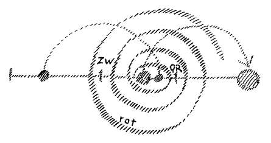
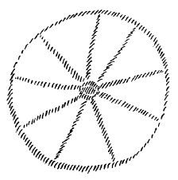

Sie haben in verschiedenen Betrachtungen gehört, wie zu einer wirklichen Erkenntnis der Menschenwesenheit es nötig ist, die Gliederung dieser Menschenwesenheit in drei Glieder wirklich zu verfolgen. Relativ selbständig organisiert sind innerhalb der menschlichen Wesenheit das Haupt - grob gesprochen natürlich -, die Brustorgane und die Gliedmaßenorgane; wobei wir uns allerdings vorzustellen haben, daß zu den Gliedmaßenorganen ein gut Teil von demjenigen gehört, was innerhalb des Rumpfes liegt. Nun haben Sie auch entnehmen können aus Vorträgen und aus meiner Darstellung in den «Seelenrätseln», wie zusammenhängt mit dem menschlichen Haupte das Denk- und Vorstellungsleben, wie zusammenhängt mit alldem, was die rhythmische Tätigkeit beim Menschen — also wie gesagt, grob gesprochen — das Brustsystem ist, alles dasjenige, was Fühlsphäre ist, und wie zusammenhängt die Willenssphäre, die aber beim Menschen das eigentliche Geistige darstellt, mit dem Gliedmaßensystem, mit der Gliedmaßenorganisation. Relativ selbständig sind diese drei Systeme des menschlichen Organismus. Relativ selbständig, nur eben zusammenwirkend, sind auch das Vorstellungsleben, das Gefühlsleben und das Willensleben. Nun wissen Sie ja, daß vom geistigen Gesichtspunkte aus am besten erfaßt wird, worin sich diese drei Systeme unterscheiden, wenn man sagt: Im gewöhnlichen Wachleben wacht der Mensch vollständig eigentlich nur durch sein Kopfsystem, durch all dasjenige, was, seelisch gesprochen, mit dem Vorstellungs- und Denkleben zusammenhängt. Dagegen ist alles dasjenige, was mit dem Gefühlsleben, also mit dem eigentlichen rhythmischen System, leiblich gesprochen, zusammenhängt, eigentlich auch während des wachen Lebens ein dieses Wachleben durchsetzendes Traumleben. Was in unserer Gefühlssphäre vor sich geht, wissen wir durch unsere wachen Vorstellungen mittelbar, aber niemals unmittelbar durch die Gefühle selbst. Und noch dunkler bleibt das Willensleben, das wirklich seinem eigentlichen Inhalte nach von uns nicht anders erfaßt wird als das Schlafesleben als solches. So daß wir genauer, als das gewöhnlich geschieht, aussprechen können, inwiefern dem menschlichen gewöhnlichen Bewußtsein unterbewußte Zustände zugrunde liegen: Unterbewußte Vorstellungen liegen zugrunde dem Gefühlsleben, und wenn ich den Komparativ bilden darf, noch unbewußtere Vorstellungen liegen zugrunde dem Willensleben. ^b6nkh5

Es ist nun sehr wichtig, daß man sich klarmacht, daß eigentlich in jedem der drei menschlichen Systeme Denken, Fühlen und Wollen enthalten sind. Im Kopfsystem, im Denksystem ist durchaus auch Fühlleben und Willensleben vorhanden, nur sind diese viel schwächer entwickelt als das Vorstellungsleben. Ebenso sind Gedanken in der Gefühlssphäre vorhanden, traumhaft nur uns zum Bewußtsein kommend, schwächer eben als in der Kopfsphäre. Was aber gewöhnlich nicht berücksichtigt wird in unserer Zeit abstrakter Wissenschaftlichkeit, das ist, daß diese unterbewußten Glieder der menschlichen Wesenheit in demselben Maße objektiver sind, als sie uns subjektiv weniger zum Bewußtsein kommen. Was heißt das? Das heißt, dasjenige, was wir durch unser Vorstellungsleben, durch unser Hauptes- oder Kopfesleben haben, das sind Vorgänge, die verhältnismäßig in uns vorgehen. Dasjenige aber, was wir durch unser rhythmisches System, durch unser Brustsystem erleben, was in unserer Gefühlssphäre vor sich geht, das ist keineswegs bloß unser individuelles Eigentum, das ist etwas, was zu gleicher Zeit in uns vorgeht, aber objektive Weltvorgänge darstellt. Das heißt, wenn Sie etwas fühlen, so ist das ja allerdings ein Erlebnis in Ihnen selbst, aber es ist zu gleicher Zeit etwas, was in der Welt geschieht, was in der Welt eine Bedeutung hat. Und es ist gerade außerordentlich interessant, zu verfolgen, welche Weltvorgänge unserem Gefühlsleben zugrunde liegen. Nehmen wir an, Sie erleben irgend etwas, das Ihre Gefühle außerordentlich stark in Anspruch nimmt, ein Sie freudig oder traurig erregendes Ereignis. Sie wissen, das Gesamtleben des Menschen läuft so ab, daß wir einteilen können dieses Gesamtleben des Menschen in ungefähr siebenjährige Perioden. Die erste Periode geht ungefähr von der Geburt bis zum Zahnwechsel, die zweite Periode geht bis zur Geschlechtsreife, die dritte geht bis zum Beginn des einundzwanzigsten Jahres - alles das ist approximativ -, und so geht es weiter fort. Das ist eine Gliederung des menschlichen Lebenslaufes. (Siehe Zeichnung 5.124: waagrechte Linie mit senkrechten Markierungen.) ^eo4c2k

Wenn wir diese Gliederung ins Auge fassen, so kommen wir zu Knotenpunkten der menschlichen Entwickelung, die im Beginn des menschlichen Erdenlebens ganz deutlich sich ausdrücken in dem Zahnwechsel, in der Geschlechtsreife, die dann mehr oder weniger sich verhüllen, für den, der aber beobachten kann, noch sehr deutlich sind später. (Es werden die Knotenpunkte skizziert.) Denn das, was so um das einundzwanzigste Jahr herum mit dem Seelisch-Leiblichen des Menschen vorgeht, das ist für den, der beobachten kann, ebenso deutlich wahrnehmbar, wie etwa die Geschlechtsreife für die äußere Physiologie wahrnehmbar ist. Aber es wird gewöhnlich weniger beobachtet. Nun, damit haben wir mehr eine allgemeine Gliederung des menschlichen Lebenslaufes. Wenn aber nun so etwas auftritt, wie ich gesagt habe, irgendein bedeutsames Ereignis, zum Beispiel zwischen dem Zahnwechsel und der Geschlechtsreife, das sehr erregend in der Gefühlssphäre wirkt (es wird die Spirale gezeichnet, rot), dann findet etwas sehr Eigentümliches statt, das — weil heute ja nur roh beobachtet wird - in der Wirklichkeit eben gewöhnlich nicht beobachtet wird. Aber dieses Ereignis findet doch statt. Gewissermaßen ist der Eindruck da, der Gefühlseindruck schwingt ab im Bewußtsein. Aber wenn es sich um einen Gefühlseindruck handelt, dann geht, ganz abgesehen von dem, was in Ihrem Bewußtsein, in Ihrem Seelenleben überhaupt sich abspielt, in der objektiven Welt etwas vor. Und wir können das, was in der objektiven Welt vorgeht, vergleichen wie mit einer Art von Schwingungserregung: es breitet sich aus in der Welt. Und das Merkwürdige ist, daß es sich nicht endlos ausbreitet, sondern wenn es sich genug ausgebreitet hat, wenn gewissermaßen seine Elastizität an einem Ende angekommen ist, dann schwingt es wieder zurück (linker Halbbogen), und es erscheint im nächsten siebenjährigen Zeitraum so, daß es wieder zurückkommt und in irgendeiner Weise ein von außen in Ihr Seelenleben eindringender Impuls ist. Ich will nicht sagen — weil das doch zusammenhängt mit der individuellen Lebensgestaltung —, daß ungefähr nach sieben Jahren immer solch ein Ereignis zurückkommt, das wäre nicht richtig. Aber es fällt in den nächsten siebenjährigen Zeitraum hinein, wird nur vom Menschen nicht beachtet. Wir gehen fortwährend mit unserem Seelenleben durch solche Dinge durch, die in unser Gefühlsleben hereinschlagen und die die Rückwirkung der Welt auf dasjenige sind, was wir in der vorhergehenden siebenjährigen Periode in der Gefühlssphäre irgendwie erlebt haben. Also ein solches Ereignis, das uns irgendwie gefühlsmäßig erregt, das tönt wiederum im nächsten Lebensabschnitte in unser Seelenleben herein. Die Menschen beachten solche Dinge gewöhnlich nicht. Wer sich ein wenig Mühe gibt, kann solche Dinge schon äußerlich beobachten. ^cabfoa

Wer hätte es denn noch nicht erlebt, daß bei irgendeinem Menschen, den man gut kennt, plötzlich vielleicht eine Mißstimmung auftritt, man weiß gar nicht, woher es kommt. Der Mensch verändert sich aus heiterem Himmel heraus, wie man oftmals sagt. Wenn man den Dingen nachgeht und wirklich ein Auge, ein Seelenauge haben kann für das besondere Verhalten eines Menschen, wenn man namentlich fühlen kann, was ein solcher Mensch zwischen den Worten sagt, oder was er in den Worten sagt, dann wird man zurückgehen können auf irgendein solches — wie ich es charakterisiert habe — früheres gefühlsmäßiges, ihn erregendes Ereignis. Und in der ganzen Zwischenzeit ist eigentlich etwas in der Welt vorgegangen, was nicht vorgegangen wäre, wenn der Mensch nicht jene Gefühlserregung gehabt hätte. Aber das Ganze ist ein Vorgang, der außer dem, daß ihn der Mensch erlebt, sich auch noch objektiv außer dem Menschen abspielt. Sie sehen, wie viele Gelegenheiten da sind, daß sich diese Dinge außerhalb des Menschen abspielen, die durch den Menschen da sind, und die einfach objektive Weltvorgänge sind. ^lbmi5t

In diese objektiven Weltvorgänge hinein mischt sich dasjenige, was unter den Elementarwesen geschieht, auch solchen Elementarwesen, wie ich sie neulich charakterisiert habe, außerhalb des Menschen. Ich habe sie ja in einer anderen Beziehung zusammengebracht mit dem Atmungs-, mit dem rhythmischen System. Hier sehen Sie sie auf dem Umwege durch die Gefühlserregungen mit dem rhythmischen System zusammenwirkend. Diese Dinge nötigen uns, wenn wir sie richtig verstehen, zu sagen: Der Mensch erzeugt fortwährend etwas um sich herum wie eine recht große Aura. Aber in das, was er da an Wellen aufwirft, in das mischen sich hinein Elementarwesen, welche, je nachdem der Mensch ist, das, was da zurückkommt, beeinflussen können. Denken Sie also, die Sache ist so: Sie haben eine Erregung; die strahlen Sie aus. Wenn sie Ihnen zurückkommt, ist sie nicht unbeeinflußt, sondern in der Zwischenzeit machen sich Elementarwesen mit dieser Erregung zu tun. Und wenn sie dann zurückwirkt auf den Menschen, dann bekommen Sie mit dem, was diese Elementarwesen angefangen haben mit dem, was außer Ihnen ist, die Wirkung der Elementarwesen zurück. (Der rechte Halbbogen wurde gezeichnet. Die Zeichnung ist nun vollständig.) ^dsnd0c

 ^3byqv1

Durch das, was der Mensch da als eine geistige Atmosphäre verbreitet, kommt er in Wechselwirkung mit Elementarwesen. Alles dasjenige, was sich für den Menschen schicksalsmäßig abspielt innerhalb des Lebenslaufes, hängt mit diesen Dingen zusammen. Wir haben ja auch innerhalb unseres Lebenslaufes eine Art Erfüllung unseres Schicksals. Nicht wahr, wenn wir heute irgend etwas erleben, so hat das eine Bedeutung für später. Das ist aber der Weg, wodurch uns tatsächlich unser Schicksal gezimmert wird. Und an dem Zimmern unseres Schicksals wirken solche Elementarwesen mit, die sich zu uns hingezogen fühlen durch unsere eigene Natur. Da fühlen sie sich angezogen, da wirken sie mit auf uns ein. ^qqai70

Sie sehen da hinein in eine Wechselwirkung zwischen dem Menschen und seiner Umgebung, und Sie sehen gewissermaßen das Spielen von geistigen Kräften in der Umgebung. Wenn man dieses Spiel verfolgt, dann klärt sich vieles auf, was für den Menschen schicksalsmäßig wird. Die Einsicht in diese Verhältnisse, die ist unserer «aufgeklärten» Zeit - aufgeklärten muß man nämlich immer in Gänsefüßchen schreiben — sehr fernliegend, und es ragen, ich möchte sagen, nur die Traditionen früherer Zeiten, in denen der Mensch durch elementarere Bewußtseinsstufen mehr mit der Wirklichkeit zusammenhing als heute, in unsere Zeit herein. Diese Traditionen, die finden Sie sehr schön ausgedrückt in denjenigen Dichtungen der Vorzeit, in denen Schicksalsmäßiges für den Menschen geknüpft wird an das Eingreifen von elementaren Wesenheiten. Und wirklich eines der schönsten Gedichte, die uns erhalten sind, und die da handeln von solchem schicksalsmäßigen Eingreifen von Elementarwesenheiten in unserer Umgebung, ist dasjenige, das Sie jetzt in eurythmischer Darstellung oftmals bekommen. Sie sehen da, wiesschicksalsmäßig eingreifen die Elementarwesen aus Erlkönigs Reich. Sie wissen ja, das Gedicht heißt: ^y7smry

Da haben Sie das Hineinweben der elementarischen Welt in das Schicksalsmäßige des Menschen, insofern dieses dann übergreift in die auffälligste Schicksalserscheinung: Krankheit und Tod. ^y4ugq0

Ich bitte Sie, solche Dinge zu beachten. Diese Dinge, die sind nicht so in alten Dichtungen — von Herder ist ja das nur aus der Volksdichtung aufgenommen -, wie sie in neueren Dichtungen stehen. Unseren Kulturdichtungen gegenüber darf man wohl sagen, daß ungefähr neunundneunzig Prozent derselben zu viel sind. Die Dichtungen, die wirklich hervordringen aus dem alten Wissen, die sind immer so, daß sie dem Tatsächlichen, dem Wirklichen entsprechen. Niemals würde hier stehen: sie tät einen Schlag ihm auf den Kopf, oder auf den Mund, oder auf die Nase, sondern: ^cotpjp

Das, worauf ich Sie aufmerksam machen will, ist eben die dichterisch durchaus sachgemäße Wiedergabe dessen, was sich um den Menschen herum in einer solchen Schicksalsstunde abspielt, und was eigentlich immer um den Menschen herum sich abspielt, besonders stark aber hervortritt in jenen Zusammenhängen, die man wahrnehmen kann bei der periodischen Wiederkehr die Gefühlssphäre erregender Erlebnisse. Denn die kehren immer so wieder, daß sie in unser Schicksal eingreifen, aber nicht ganz unverändert, sondern nachdem sie hindurchgegangen sind durch dasjenige, was solche Elementarwesen mit ihnen angefangen haben. Genauso wie wir in der äußeren physischen Luft leben, wie wir unter den Ergebnissen des mineralischen, pflanzlichen, tierischen Reiches leben, genauso leben wir mit unseren zunächst unterbewußten Menschheitsteilen, mit unserem rhythmischen System in der geistigen Sphäre der Elementarwesen. Und da wird so viel von unserem Schicksal gezimmert, als gezimmert werden kann eben im Lebenslaufe zwischen Geburt und Tod. ^a6ud42

Nur dadurch, daß wir mit dem Haupte voll wach sind, ragen wir heraus aus diesem Wechselspiel mit den Elementarwesen. Nicht eingegliedert in das Reich der Elementarwesen sind wir nur durch unser waches Hauptleben. Da ragen wir gewissermaßen über die Oberfläche des elementarischen Meeres, in dem wir als Menschen fortwährend schwimmen, heraus. ^sxjmbj

Sie sehen hier die Wiederkehr der Ereignisse, die schicksalsmäßige Wiederkehr der Ereignisse schon innerhalb des gewöhnlichen Lebens durch dasjenige, was sich für unser rhythmisches System abspielt und für unser Gliedmaßensystem. Das geht auch Wechselwirkungen mit der Umgebung ein, aber kompliziertere, viel, viel kompliziertere, und auch die schwingen wieder zurück, nur haben sie eine weitere Schwingungsausbauchung. Sie kommen erst wiederum im nächsten Erdenleben oder in einem der nächsten Erdenleben zurück. So daß wir sagen können, es braucht dasjenige, was wir unser Schicksal, unser Karma nennen, für uns gar nicht so sehr etwas Rätselhaftes zu sein, wenn wir anschauen, wie es nur ist die Vergrößerung desjenigen, was wir innerhalb des Menschenlebens selbst studieren können in der Wiederkehr solcher Ereignisse. Sie kommen nämlich nicht unverändert zurück, diese Ereignisse, sie kommen ganz stark verändert zurück. ^w3v31m

Ich mache Sie auf eines aufmerksam. Ich habe in pädagogischen Vorträgen, wo ich sie auch gehalten habe, immer darauf aufmerksam gemacht, daß während der Volksschulzeit ein wichtiger Knotenpunkt des Lebens so um das neunte Lebensjahr herum da ist. Man sollte im Volksschulunterrichte diesen wichtigen Knotenpunkt des Menschenlebens sehr, sehr wohl beachten. Bis dahin sollte man zum Beispiel nicht anders die Naturkunde mit dem Menschen betreiben, als dadurch, daß man die Beschreibung der Naturvorgänge — fabelhaft, legendenhaft und dergleichen — anknüpft an das menschliche moralische Leben. Dann erst sollte man beginnen, weil erst jetzt der Mensch reif wird dazu, mit eigentlicher einfacher, elementarer Naturbeschreibung. Was man Lehrplan nennen kann, ergibt sich nämlich ganz aus einer wirklichen Beobachtung der menschlichen Wesenheit bis ins einzelne. Ich habe ja darauf schon aufmerksam gemacht in dem Aufsatz, den Sie über «Die pädagogische Grundlage der Waldorfschule» haben. Auch da habe ich auf diesen Zeitpunkt im ungefähr neunten Jahre hingewiesen. Dieser Zeitpunkt, man kann ihn so charakterisieren, daß man sagt: Das Ich-Bewußtsein bekommt eine neue Gestalt. Der Mensch wird fähig, die äußere Natur mehr objektiv zu betrachten. Früher verbindet er alles, was er in der äußeren Natur sieht, mit seinem eigenen Wesen. Nun entwickelt sich das Ich-Bewußtsein aber schon in dem ersten siebenjährigen Lebensabschnitt, mit zwei, zweieinhalb Jahren und so weiter. Aber im zweiten Lebensabschnitte, da kommt es ungefähr um das neunte Lebensjahr zurück. Das ist sozusagen eine der auffälligsten Rückkehrungen, dieses Zurückkehren des Ich-Bewußtseins um das neunte Lebensjahr herum. Das Ich-Bewußtsein kommt da in geistigerer Form zurück, während es mehr seelisch so im zweiten oder dritten Lebensjahr ist. Das ist nur eines der Ereignisse, die in ganz auffälliger Weise zurückkommen. Man kann das aber auch für unbedeutendere Ereignisse im Menschenleben durchaus erschauen. ^skznk0

Diese Intimitäten des Menschenlebens, die werden für die Zukunft der menschlichen Entwickelung dringend, ganz dringend notwendig sein. Die Einsicht in solche Dinge wird allmählich allgemeine Bildung werden müssen. Diese allgemeine Menschenbildung ändert sich ja von Zeitraum zu Zeitraum. Heutzutage, nicht wahr, sind wir schon unglücklich, wenn unsere Kinder zehn Jahre alt geworden sind und gewisse Dinge noch nicht rechnen können. Die Römer waren es noch gar nicht; aber sie waren unglücklich, wenn ein solcher Junge die Zwölftafelgesetze noch nicht gekannt hat, während wir wieder weniger Sorgfalt darauf verwenden, daß unsere Kinder die Gesetzesbestimmungen kennen. Es wäre auch mit unserer Seelenverfassung schlimm bestellt, wenn es noch geschähe. Aber dasjenige, wovon man glaubt, daß es allgemeines Bewußtsein sein muß, das ändert sich, und wir stehen jetzt am Ausgangspunkte einer Zeit, wo aus der Entwickelung der Erde, der Menschheit heraus solche Intimitäten des Seelenlebens zum allgemeinen Bewußtsein kommen müssen. Der Mensch muß dahin kommen, sich genauer kennenzulernen, als man das bis jetzt für nötig gehalten hat. Sonst würden diese Dinge in der ungünstigsten Weise auf die Verfassung des ganzen Menschenlebens zurückwirken. ^tdxqdf

Daß wir nicht wissen, wo irgend etwas, das uns erregt, seinen Ursprung hat, das hat ja nicht zur Folge, daß es in unserem Seelenleben nicht vor sich geht. Die Dinge kommen zurück, sie üben ihren Einfluß auf unser Seelenleben aus. Wir können sie uns nicht erklären, wir nehmen sie gar nicht einmal in unser Bewußtsein auf. Die Folge davon ist, daß wir allerlei Zustände kriegen. Und die Leute leiden heute sehr unter solchen Zuständen, die man einfach hinnimmt, von denen man natürlich nicht weiß, daß sie zurückführen auf frühere Erlebnisse. Was gefühlsmäßig ist, kommt in irgendeiner Weise zurück. Sie können sich das, ich möchte sagen, gedächtnismäßig einfach durch das zusammenhalten, was ich öfter wie eine Art Repräsentanz für diese Dinge sage. Lehren wir ein Kind beten, das heißt, Gebetsstimmung gefühlsmäßig entwickeln, so schwingt das auch einmal zurück. Allerdings, es schwingt später zurück, nach sehr langer Zeit, es schwingt auch zwischendurch zurück, aber es schwingt wieder weiter und schwingt wiederum zurück. Nach sehr langer Zeit kommt das Beten dadurch zurück, daß wir die Seelenstimmung des Segnens entwickeln können. Deshalb sage ich so häufig: Kein bejahrter Mensch wird segnen können wirksam durch die Imponderabilien, der nicht in seiner Kindheit beten gelernt hat. Das Beten wandelt sich um ins Segnen. Das sind die Rückkehrungen des Lebens. ^40y9dj

Diese Dinge wird man nach und nach verstehen müssen. Daß diese Dinge heute noch nicht verstanden werden, das ist der Grund, warum auch nicht die große Bedeutung des Mysteriums von Golgatha von den Menschen durchschaut werden kann. Was hat es denn schließlich für die Menschen, die so ganz in der heutigen Bildung befangen sind, für eine Bedeutung, wenn man ihnen sagt: nachdem der Christus durch das Mysterium von Golgatha gegangen ist, verband er sich mit dem Leben der Erdenmenschheit? Die Menschen wollen sich ja gar keine Vorstellung davon machen, wie sie selbst in Wechselbeziehung stehen zu dem, worinnen der Christus ist. Für unsere Kopfvorstellung ist nicht viel bemerklich von dem Einfluß des Christus-Impulses. Sobald wir aber hinunterschauen ins Unbewußte, in die Fühlsphäre und Willenssphäre, dann leben wir erstens in der Sphäre der Elementarwesen, aber diese Sphäre der Elementarwesen, die wird für uns zu gleicher Zeit durchwoben von dem Christus-Impuls. Wir tauchen durch unser rhythmisches System, physiologisch gesprochen, durch unsere Fühlsphäre, in das Gebiet hinunter, mit dem sich der Christus für das Erdendasein vereinigt hat. Da finden wir also sozusagen den Ort, an dem der Christus real, nicht nur durch Tradition oder durch eine subjektive Mystik, sondern real, objektiv zu finden ist. Wir leben aber zu gleicher Zeit in der Epoche, von welcher an die Ereignisse, die von diesem Orte kommen, wie ich Ihnen neulich auseinandergesetzt habe, eine große objektive Bedeutung für das Menschenleben haben, denn sie gewinnen allmählich für die menschlichen Entschlüsse, für das, was die Menschen tun, wenn sie sich dagegen sträuben, einen unbewußten Einfluß. Wenn die Menschen eingehen darauf, können sie einen bewußten Einfluß erleben, das heißt, wir können mit ihnen rechnen, wir können gewissermaßen die geistigen Welten, die zu uns gehören, aufrufen, mit uns zu wirken. ^r930gh

Auch äußerlich läßt sich erkennen, wie wir in dieser Beziehung an einem Wendepunkt der Menschheitsentwickelung stehen. Ich brauche ja nur auf eine Tatsache hinzuweisen, von der ich Ihnen von dem einen oder anderen Gesichtspunkte aus schon öfter einmal gesprochen habe. Wenn wir Geschichtsbetrachtungen nehmen, gewöhnliche, heute dargestellte Geschichte, so werden wir uns sagen: Diese Geschichtsbetrachtungen sind eigentlich noch nicht vorgedrungen zu dem Mysterium von Golgatha. Nehmen Sie einmal nur das, was Ihnen gewöhnlich vorgelegen hat als Weltgeschichte. Gewiß, es werden Ihnen da geschildert die Zeiten des alten assyrischen, babylonischen Reiches, des alten Perserreiches, des ägyptischen Reiches, Griechenlands, Roms. Dann wird vielleicht erwähnt, daß auch das Mysterium von Golgatha stattgefunden hat, dann wird aber weiter verfolgt die Geschichte über die Völkerwanderungen hin und so weiter, für die einen bis zu Ludwig XIV. oder bis zur Französischen Revolution oder Poincare, für die anderen bis zum Untergang der Hohenzollern und so weiter. Aber von dem Fortwalten des Christus-Impulses finden Sie in der gewöhnlichen Fable convenue, die man «Geschichte» nennt, nichts, gar nichts. Es ist für die geschichtliche Betrachtung eigentlich so, wie wenn für sie der ChristusImpuls ausgeschaltet würde. Es ist merkwürdig, wie zum Beispiel ein solcher Historiker wie Ranke, der ein gläubiger Christ war und auf den Christus-Impuls subjektiv sehr viel gegeben hat, als Historiker das Christus-Ereignis in die Geschichte nicht hereinbringen kann. Er kann nichts damit anfangen. Es spielt in der geschichtlichen Darstellung das Christus-Ereignis keine Rolle. So daß wir sagen können: Für diejenige Geisteserkenntnis des Menschen, die sich bisher in seiner Geschichte offenbart, ist das Christentum eigentlich noch nicht da. Und erst unsere anthroposophisch orientierte Geisteswissenschaft rechnet in positiver Weise, indem sie Geschichte darstellt, mit der Notwendigkeit des vierten nachatlantischen Zeitraums, durch die hereinbrechen mußte in die konkrete geschichtliche Entwickelung das Ereignis von Golgatha. Und wir stellen Geschichte so dar, wie Sie wissen, daß dieses Ereignis von Golgatha in unserer Geschichtsdarstellung drinnensteht. Ja, wir gehen weiter: Wir stellen nicht nur die Geschichtsentwickelung des Menschen dar, indem wir das Ereignis von Golgatha aufnehmen, sondern wir stellen auch die Weltentwickelung, die kosmische Entwickelung so dar, daß wir das Mysterium von Golgatha in der kosmischen Entwickelung drinnen haben. ^kznfdw

Wenn Sie meine «Geheimwissenschaft im Umriß» auf sich wirken lassen, so werden Sie sehen, daß da nicht nur geredet wird von Sonnenfinsternissen, die vergangen sind, oder Mondenfinsternissen, die vergangen sind, oder irgendwelchen Explosionen oder Eruptionen im Weltenall, sondern da wird als von einem kosmischen Ereignis von dem Christus-Ereignis gesprochen. Und sonderbar: Wenn man von der Geschichte zunächst nur sagen kann, daß die Historiker, die sogenannten Historiker keine Möglichkeit finden, das Christus-Ereignis einzureihen in den Fortgang des historischen Werdens, da werden die offiziellen Vertreter der Bekenntnisse geradezu wild. Wenn sie hören: hier ist etwas wie anthroposophisch orientierte Geisteswissenschaft, die von dem Christus-Ereignis als einem kosmischen Ereignis spricht, da beginnen die Leute, die die offiziellen Vertreter der Bekenntnisse sind, furchtbar zu schimpfen. Daraus ersehen Sie, wie wenig diese Bekenntnisse geneigt sind, die großen Anforderungen unserer Zeit wirklich zu erfüllen, das Christus-Ereignis in Zusammenhang zu bringen mit den Weltereignissen überhaupt. Man muß sagen: Leute, die heute oftmals von dem Christus sprechen, sogar Theologen, sie sprechen von diesem Christus gar nicht anders, als sie von irgendeinem allgemeinen göttlichen Wesen sprechen, nicht anders, als die alten Juden oder die Juden noch heute von ihrem Jahve oder Jehova sprechen. Und ich habe Ihnen ja neulich gesagt: Sie können das Buch von Harnack «Das Wesen des Christentums» nehmen und den Christus-Namen überall da, wo er ihn braucht, ausstreichen und den allgemeinen Gottes-Namen hinsetzen, dann ändert sich der Sinn nicht, weil der Mann gar keine Ahnung hat von dem Spezifischen des Christentums. Ja, das Buch «Das Wesen des Christentums» von Harnack, das ist Seite für Seite eine Schilderung des Gegenteiles des Wesens des Christentums, denn es handelt gar nicht vom Christentum, es handelt von einer allgemeinen Jahve-Lehre. Es ist sehr wichtig, auf diese Dinge hinzuweisen, denn diese Dinge hängen durchaus mit den notwendigsten Forderungen unserer Gegenwart zusammen. Und dasjenige, was einströmen muß in die menschliche Kulturentwickelung, das ist das Bewußtsein der Menschen von dem Vorhandensein nicht nur einer allgemeinen, abstrakten geistigen Welt, sondern der konkreten geistigen Welt, in der wir drinnen leben mit dem, was wir fühlen und wollen und tun, und aus der wir nur herausragen durch dasjenige, was wir denken, durch unser Haupt nur herausragen. Es ist schon so, daß in der Tat eine neue Art Weltanschauung dadurch gerechtfertigt wird, daß man anstrebt die wirkliche Durchdringung desjenigen, was wir fühlen und wollen und tun, mit dem Christus-Impuls. ^wcf47e

Daß unsere Astronomie, unsere Entwickelungslehre ganz in abstrakten Formeln sich entfaltet haben in der neueren Zeit, das ist nur dadurch möglich geworden, daß der Christus-Impuls zunächst nicht innerlich die Menschen ergriffen hat, sondern Tradition geblieben ist und höchst subjektiv die Menschen ergriffen hat, aber sie nicht ergriffen hat so innerlich, daß die innerlichen Erlebnisse solche sind, die zu gleicher Zeit objektive Weltenerlebnisse sind, das heißt, wo wir im Wechselspiel stehen mit dem, was geistig um uns herum vorgeht. ^p65yso

Man sieht heute da oder dort wohl ein starkes Bewußtsein davon auf dämmern, daß neue Impulse für die Menschheitsentwickelung notwendig sind. Aber dazu können sich die Menschen so schwer entschließen, zu einem konkreten Geistesleben zu greifen. Wenn sie vom Geiste sprechen, so haben sie immer doch mehr oder weniger die Sehnsucht, im Abstrakten drinnen zu leben. ^pvfqwi

Selbst das Bewußtsein von unserer Stellung zu unseren Gedanken muß sich in einer gewissen Weise ändern. Von dem einen oder dem anderen Gesichtspunkte aus habe ich ja schon aufmerksam gemacht auf das, was ich hiermit eigentlich meine, denn ich habe ja oftmals auch in öffentlichen Vorträgen darauf hingedeutet, daß das Vortragen von anthroposophisch orientierter Geisteswissenschaft gerade in unserer Gegenwart nicht unter irgendeinem Programmziel erfolgt, nicht aus der Vorliebe, sich gerade nach dieser Richtung hin für irgendein Ideal zu begeistern, sondern aus der Einsicht in dasjenige, was der Menschheit heute not tut. Und damit muß wieder angeknüpft werden an gewisse Seelenverfassungen früherer Zeiten, die auch vorhanden waren in Epochen, in denen die Menschen mehr zusammenhingen mit ihrer wirklichen geistigen Umgebung. In früheren Zeiten war das anders. Heute sollten wir aber das ganz besonders stark fühlen. Ich habe es öfters ausgeführt: Von außen kann uns eigentlich heute als Mensch nichts mehr blühen. Wir müssen die Fortschrittsimpulse für die Menschenentwickelung von innen heraus, von unserem Zusammenhang mit der geistigen Welt aus holen, und wir müssen eigentlich ein gutes Auge dafür haben, wie dasjenige, was wir erleben, ohne daß wir selber etwas dazu tun, eigentlich immer mehr und mehr Niedergangserlebnisse werden. Wir befinden uns gewissermaßen schon im Abstieg der Erdenentwickelung, und wir müssen als Menschen uns hinaufschwingen, damit wir über die Erdenentwickelung hinauskommen durch unseren Zusammenhang mit der geistigen Welt. Dadurch aber wird das, was wir erkenntnismäßig anstreben, empfunden werden müssen als eine Kraft, die uns möglich macht, als Gesamtheit des Menschentums so in nächste Entwickelungsstadien hinüberzugehen, wenn die Erde unter uns abstirbt, wie wir in andere Entwickelungsstadien im Kleinen übergehen, wenn der Leib abstirbt, wenn wir durch die Pforte des Todes gehen. Wir gehen als einzelner Mensch durch die Pforte des Todes, das heißt, in die geistige Welt ein, der Leib stirbt unter uns ab. So wird es einstmals im Gesamten der Menschheit sein. Diese Menschheit wird sich in der Gesamtheit zum Jupiterdasein —- ich nenne es Jupiterdasein hinüber entwickeln. Die Erde wird Leichnam. Wir sind jetzt schon in der Absterbe-Entwickelung. Der einzelne Mensch kriegt Runzeln, kriegt graue Haare. Die Erde hat heute für den Geologen, der wirklich beobachten kann - ich habe Ihnen erst neulich darüber gesprochen -, deutliche Zeichen ihres Altwerdens. Sie stirbt unter uns ab. Dasjenige, was wir heute geistig aufsuchen, das ist also in der Tat ein Entgegenarbeiten gegen den Prozeß des Alterns bei der Erde. Dieses Bewußtsein, das ist es, womit wir uns durchdringen sollen. ^f9akev

Von einem anderen Gesichtspunkt aus haben frühere Zeiten ihr Mysterienwissen bezeichnet als etwas, was der Heilkraft, auch der physischen Heilkraft verwandt ist. Dieses Bewußtsein muß auch heute wiederum beginnen, die Menschheit zu durchdringen. Es muß das Streben nach der Erkenntnis das Bewußtsein erzeugen: man tut damit etwas für die Weiterentwickelung der ganzen Menschheit. Zu diesem Bewußtsein wird man natürlich niemals kommen, wenn man das Konkrete, das uns umspielt in der Weise, wie ich es beschrieben habe, nicht ins Auge faßt, denn da wird man dasjenige, was der Mensch fühlt und will und tut, eigentlich nur als seine eigene persönliche Angelegenheit ansehen. Man wird nicht wissen, daß das etwas ist, was sich da draußen auch abspielt. Aber es wird notwendig sein, daß — und da muß ich jetzt eine Anmerkung machen, die vielleicht nicht so ganz allgemein verständlich sein kann — auch die, ich will sagen, exakteren Seiten des menschlichen Wissens solchen Bestrebungen entgegenkommen. Die sind aber heute noch gar nicht auf der Höhe, wirklich gar nicht auf der Höhe. Sie können zum Beispiel heute noch immer die unmöglichsten Vorstellungen in der exakten Wissenschaft finden. Ich will nur einiges erwähnen, was vielleicht allgemein verständlich sein kann. Sagen wir, die Leute stellen sich gewöhnlich trivial vor (es wird gezeichnet): Irgendwo ist die Sonne. Von der Sonne geht Licht aus nach allen Seiten, wie von einer anderen Lichtquelle. Und Sie können es überall verfolgen, daß die Leute, die mit mathematischen Vorstellungen dieser Ausbreitung des Lichtes folgen, sagen: Na ja, das Licht breitet sich eben aus ins Unendliche, und dann verschwindet es irgendwie. An seiner eigenen Schwäche geht es, indem es sich ausbreitet ins Unendliche, dann verloren. — Aber so ist es nicht. Alles, was sich so ausbreitet, gelangt an eine Grenze, und von dieser Grenze schwingt es wiederum zurück, kommt als etwas anderes wiederum zu seinem Ursprung zurück. Das Sonnenlicht geht nicht in die Unendlichkeit, sondern schwingt in sich selbst wiederum zurück, nicht als Licht, jedoch als etwas anderes; aber es schwingt wiederum zurück. ^3vsjwj

 ^0gt8vn

Und so ist es im Grunde genommen mit jedem Lichte. So ist es im Grunde genommen mit allen Wirkungen. Alle Wirkungen unterliegen im Grunde genommen dem Gesetze der Elastizität, die eine Elastizitätsgrenze hat. Solche Vorstellungen aber, die finden Sie heute gang und gäbe in unserer sogenannten exakten wissenschaftlichen Darstellung, und man rechnet heute viel zu wenig mit den Wirklichkeiten. Wenn Sie Physiker wären, würde ich Sie darauf aufmerksam machen, wie die Leute heute in der Physik rechnen mit Weg, der zurückgelegt wird, und mit Zeit. Und dann nennen sie die Geschwindigkeit, die man gewöhnlich mit c oder v bezeichnet, eine Funktion von Weg und Zeit, und stellen es als einen Quotienten dar (es wird an die Tafel geschrieben «Weg», «Zeit» und die Formel:) ^p1yheo

Aber das ist durchaus falsch. Nicht die Geschwindigkeit ist ein Resultat, sondern die Geschwindigkeit ist das Elementare, das irgend etwas, sei es ein Materielles oder ein Geistiges, in sich trägt, und wir zerlegen die Geschwindigkeit in den Weg, in Raum und in die Zeit. Wir abstrahieren die zwei Dinge heraus. Raum und Zeit als solche sind nichts Reales. Geschwindigkeiten sind in der Welt etwas Reales, verschiedene Geschwindigkeiten. Das ist eine Anmerkung, die ich nur für Physiker mache, die Physiker werden mich aber verstehen, daß selbst in all den Dingen, die heute zugrunde gelegt werden theoretisch unserem Zeitwissen, brüchige Bedingungen walten. Überall sind Bedingungen drinnen, die nur dadurch darinnen stecken, daß wir nicht imstande sind, das Geistige als ein Konkretes zu erfassen. ^732gr4

Das ist das Erfordernis der Michael-Zeit, daß die Menschheit in die Lage komme, das Geistige in seiner Konkretheit zu erfassen, das heißt, mit der menschlichen Umgebung so zu rechnen, daß man ebenso, wie man sagt, Luft und Wasser ist in der Umgebung, die verschiedenen elementaren und höheren Wesenheiten in der Umgebung weiß. Das ist es, worauf es ankommt, und das ist etwas, was Menschenbildung wieder werden muß, wie es in alten Zeiten auch Menschenbildung war. Man will das nur nicht zugeben. Man will durchaus solche Umschwünge in der Menschheitsentwickelung, wie sie stattgefunden haben zum Beispiel in der Mitte des 15. Jahrhunderts, nicht zugeben. An Einzelheiten kann man aber nachweisen, daß das so ist. ^hexm1g

Irgendein, ich weiß nicht, Schwede oder Norweger, hat vor kurzer Zeit ein Buch geschrieben, worinnen er viel aus Alchimisten zitiert. Da zitiert er besonders eine Stelle aus einem Alchimisten, worinnen alles mögliche vorkommt, Merkur, Antimon und so weiter. Und nun sagt jener Schriftsteller von heute, der —- wie man es seinem Buche ansieht — ein ganz exzellenter Chemiker von heute ist: er kann sich nichts vorstellen bei diesem chemischen Rezept, das da bei einem Alchimisten angegeben ist. — Er kann sich wirklich nichts darunter vorstellen, aus dem einfachen Grunde, weil, wenn der heutige Chemiker von Merkur redet, von Quecksilber, so ist ihm dies das Mineral Quecksilber; wenn der heutige Chemiker von Antimon redet, so ist ihm dies das Metall und so weiter. Die Worte bedeuten aber in dem Buche, das er zitiert, etwas ganz anderes, gar nicht das äußere Metall, sondern gewisse Vorgänge, die im menschlichen Organismus drinnen vorkommen. Es ist menschliche Innenerkenntnis. Schreibt man sie auf in dem Sinne, wie sie präsent, gegenwärtig war in dem Bewußtsein des Schriftstellers, den da der gute Herr von heute zitiert, so kann man sie heute lesen wie die Beschreibung eines Laboratoriumvorganges, der mit Retorten arbeitet und dergleichen beschreiben kann. Nur gewinnt man keinen Sinn daraus. Man kann die Dinge nur als Unsinn ansehen. Es hat aber einen Sinn, sobald man weiß, was in diesen alten Zeiten mit Antimon, mit Merkur und so weiter gemeint war, und daß da zwar sich auch ein Aspekt ergab für das äußere Mineral, daß aber vor allen Dingen mit diesen Vorgängen innere Vorgänge der menschlichen Natur gemeint waren, für die man aber andere Mittel hatte, als man sie heute hat. Daher muß derjenige, der die Literatur vor dem 15. Jahrhundert liest, mit ganz anderem Sinn lesen als der, der nachher liest. An solchen Dingen könnte man auch äußerlich das ganze Umwandeln der Seelenverfassung studieren. Nun leben wir heute eben in einer Zeit, in der man beginnen muß, auf solche Dinge, auf die die Menschheit durch Jahrhunderte keinen Wert gelegt hat, einen starken Wert zu legen. ^3j9f2z