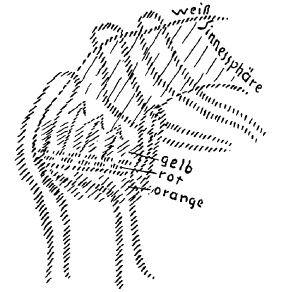
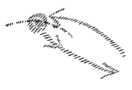

Was ich Ihnen in diesen Wochen zu sagen hatte, gipfelt ja in der Tatsache, daß wir wirklich gegenüberstehen dem Hereinbrechen einer geistigen Welt in unsere gegenwärtige Welt, welche im wesentlichen das Ergebnis jener Kulturentwickelung ist, die begonnen hat um die Mitte des 15. Jahrhunderts. Um die Mitte des 15. Jahrhunderts wird alles anders in der als zivilisiert bekannten Welt. Dasjenige, was sich die Menschen vor dieser Mitte des 15. Jahrhunderts in ihr Bewußtsein hereinbrachten, handelte mehr über das Innere der menschlichen Organisation. Sie können in alten Schriften, soweit sie heute überhaupt noch zu haben sind - ich sprach davon schon gestern -, in Ausdrücken geredet finden, die sehr ähnlich sind unseren chemischen, physikalischen Ausdrücken und so weiter. Aber der heutige Chemiker oder Physiker wird die Dinge wirklich nicht verstehen, die in diesen Büchern stehen, aus dem einfachen Grunde, weil er glaubt, mit diesen Dingen seien äußere Prozesse geschildert. Diese äußeren Prozesse sind da nicht geschildert, innere Prozesse sind geschildert, Vorgänge im Inneren des menschlichen physischen oder ätherischen Leibes. Erst seit der Galilei-, Giordano Bruno-Zeit beginnt die Menschheit die Aufmerksamkeit mehr auf die äußere Welt zu lenken, und heute sind wir so weit, daß wir eine Naturerkenntnis haben, welche aber schon alles Denken, namentlich auch das populäre Denken und Empfinden beeinflußt hat, daß wir eine Naturerkenntnis haben, die von vielem spricht im mineralischen, pflanzlichen, tierischen Reiche, die aber in gar keiner Weise Aufklärung geben kann über das Wesen des Menschen selbst, auch nicht über das physisch-leibliche Wesen des Menschen. Heute muß bereits der Mensch aber die Frage aufwerfen: Wie verhalte ich mich selber als Mensch zu dem, was die äußeren Naturreiche sind, zu dem, was mich umgibt als Tier-, Pflanzen-, Mineralreich, als äußeres physisches Menschenreich, als das Reich von Luft und Wasser, von Feuer und Wolken, von Sonne und Mond und Sternen? Wie verhalte ich mich als Mensch dazu? ^79lkss

Nun können wir diese Frage nicht gründlich beantworten, wenn wir nicht auf mancherlei von dem wiederholentlich eingehen, was wir über den Menschen betrachtet haben. Nehmen wir zunächst den Menschen, wie er als Sinnes-, Verstandeswesen vor uns steht, so können wir sagen: Wir nehmen durch unsere Augen, durch unsere Ohren, durch die anderen Sinnesorgane, die dennoch, wenn sie für den übrigen Leib da sind, Hauptesorgane, Kopfesorgane sind, die äußere Welt wahr. Wir verarbeiten dann diese äußere Welt durch diejenigen Ideen und Begriffe, die an unser Gehirn als Werkzeug gebunden sind. Wir behalten — denn das ist zu unserer inneren Integrität als Mensch notwendig — von dem, was wir so erlebt haben durch unsere Sinne, was wir durchdacht haben durch unsere sogenannte verständige Intelligenz, unsere Erinnerungsvorstellung zurück. Und es ist schließlich das, was wir zunächst aufnehmend aus der Außenwelt haben, was durch unsere Sinne von der Außenwelt in uns geschieht, was wir durch unsere Intelligenz aus diesem äußerlich Aufgenommenen machen, dasjenige, was wir als Erinnerungsvorstellung zurückbehalten. Was sind wir denn eigentlich mit Bezug auf das, daß wir als Menschen, so wie ich es jetzt geschildert habe, der Welt gegenübertreten? ^06hd6b

Gehen Sie von einem einfachen Phänomen der Sinnesempfänglichkeit aus. Ich habe schon einmal auf dies Phänomen in den letzten Tagen hingewiesen. Gehen Sie aus davon, daß Sie mit Ihren Augen eine Flamme sehen. Sie machen das Auge zu: Sie haben ein Nachbild dieser Flamme. Dieses Nachbild der Flamme, das Sie in Ihrem Auge mittragen, verschwindet nach und nach. Goethe, der sich immer anschaulich über diese Dinge ausspricht, sagt: Es tönt das Nachbild ab. — Es stellt sich die ursprüngliche Konstitution des Auges und des damit verbundenen Nervenapparates wiederum her, nachdem diese verändert worden sind durch den Lichteindruck, der auf das Auge gemacht worden ist. Das, was da in Ihrem Sinnesorgan sich abspielt, das ist nur der einfachere Vorgang für dasjenige, was sich mit Ihrem Gedächtnis, mit Ihrer Erinnerung abspielt, wenn Sie äußere Eindrücke im allgemeinen empfangen, sie überdenken und sie Ihnen bleiben als Erinnerungsvorstellungen. Der Unterschied ist nur der, wenn Sie mit Ihrem Auge einen Eindruck aufnehmen, ich will sagen also eine Flamme, dann die Vorstellung der Flamme haben, und das wiederum abklingt, so dauert das nur kurz. Wenn Sie mit dem ganzen Menschen etwas aufnehmen, es überdenken, sich später immer wieder erinnern können, wenn dieses große Nachbild der Erinnerung kommt, so dauert das lange, dauert unter Umständen für diese Erlebnisse Ihr ganzes Leben hindurch. Worauf beruht das? Ja, wenn Sie das einfache Abbild, das Sie im Auge haben, das vielleicht nur ein paar Minuten oder vielleicht nur Teile von einer Minute nachklingt, wiederum zum Versinken bringen, so ist es nur deshalb, weil das nicht durch Ihren ganzen Organismus weiter durchgeht, sondern in einem Teil, in einer Partie Ihres Organismus bleibt. Dasjenige, was Erinnerungsvorstellung wird, das geht zunächst durch einen großen Teil — ich werde ihn gleich näher bezeichnen — Ihrer Gesamtorganisation, stößt von da aus in den Ätherleib hinein, durch den Ätherleib in den umliegenden Weltenäther. Und in dem Augenblicke, wo nicht nur ein Bild als Sinnesbild im einzelnen Organ hängen bleibt, sondern durch einen großen Teil des Gesamtmenschen geht, sich in den Ätherleib hineinschiebt, nach außen geht, nach außen stößt, da kann es für das ganze Leben als Nachbild bleiben. Es handelt sich nur darum, daß der Eindruck tief genug ist, und daß er den Ätherleib ergreift, und der Ätherleib ihn nicht behält, sondern ihn an den äußeren Äther der Welt überträgt, ihn dort einschreibt, ihn dort einzeichnet. Glauben Sie nicht, daß wenn Sie sich an Sachen erinnern, dies bloß ein Vorgang Ihres Inneren ist. Sie können zwar nicht, wenn Sie ein Erlebnis haben, dieses immer, obzwar es heute schon viele Menschen mit sehr vielen Erlebnissen tun, in Ihr Notizbuch einschreiben und dann wieder herausnehmen, es wieder ablesen. Aber das, woran Sie sich erinnern, schreiben Sie in den Weltenäther ein, und der Weltenäther ruft es in Ihnen, wenn Sie sich erinnern sollen, wiederum als einen Siegelabdruck hervor. Das Erinnern ist keine bloße persönliche Angelegenheit, das Erinnern ist ein Auseinandersetzen mit dem Weltenall. Sie können nicht allein sein, wenn Sie sich als innerlich sich haltender Mensch an Ihre Erlebnisse erinnern wollen. Sich nicht erinnern an Erlebnisse, das zerstört die Wesenheit des Menschen. ^3i28dt

Bedenken Sie nur einmal, was es heißt, ich habe das Beispiel öfter angeführt: ein Mann, den ich sehr gut kannte, der eine bedeutsame Stellung einnahm, der bekam plötzlich einmal den Drang, zur Eisenbahn zu gehen, ohne Grund, und sich dort ein Billett zu kaufen, um in ihm unbekannte Fernen, in denen er gar nichts zu tun hatte, zu fahren. Das alles tat er in einem ganz anderen Bewußtseinszustande. Aber in der Zeit, während er da fuhr, wußte er nichts von dem, worin er sonst war und er kam erst wieder zu sich, als er sich in Berlin in der Kurfürstenstraße in einem Armenasyl angenommen fand. Die ganze Zeit war ausgelöscht aus seinem Bewußtsein von der Zeit an, als er in Darmstadt eingestiegen war. Man hat nachher aus Angaben verschiedener Leute herausfinden können, daß er in Budapest war, in Lemberg war, und von Lemberg wiederum nach Berlin gefahren ist, und er kam wiederum zum Bewußtsein, als er in einem Armenasyl in Berlin war. Bedenken Sie, der Verstand war vollständig in Ordnung, nichts war in Unordnung von dem Verstande. Er wußte ganz genau in der Zeit von seinem Einsteigen in Darmstadt bis zu seiner Annahme in Berlin im Armenasyl, was man tut, um sich Fahrkarten zu lösen, was man tut, um sich in der Zwischenzeit zu verpflegen und so weiter. Aber in der Zeit, als er das ausführte, hatte er von seinem übrigen Leben keine Erinnerung. Und nachher hatte er zwar wieder die Erinnerung seines früheren Lebens bis zur Abfahrt in Darmstadt, aber keine Erinnerung an die ganze Reise. Was da geschehen war, konnte man nur aus äußeren Mitteilungen feststellen. Das ist ein Beispiel. Ich könnte viele ähnliche Beispiele erzählen. Es soll dieses Beispiel nur darauf aufmerksam machen, wie unser Leben wäre, wenn nicht eine kontinuserlich fortlaufende Erinnerung durchginge durch alle unsere Erlebnisse. Denken Sie sich, wenn für irgendeine Zeit außerhalb derjenigen, die Sie verschlafen haben - an die erinnern Sie sich ja natürlich nicht —, aber denken Sie sich, wenn für irgendeine Zeit außerhalb derjenigen, die Sie verschlafen haben, keine Erinnerung da sein würde, was Sie da über Ihr Ich als Mensch denken müßten. Dasjenige, was zu unserer Sinnesempfänglichkeit gehört, zu unserer Intelligenz gehört, es ist unsere persönliche Angelegenheit. In dem Augenblicke, wo die Sache anfängt, erinnerungsmäßig zu werden, ist dasjenige, was der Mensch in seinem Seelenleben erlebt, eine Auseinandersetzung mit dem Universum, eine Auseinandersetzung mit der Welt. In der Intensität, in der es notwendig ist, weiß die gegenwärtige Menschheit noch nicht, daß dies, was ich auseinandergesetzt habe, eine Tatsache ist. Aber es wird zu den Bestandteilen der Zukunftsbildung der Menschheit gehören, die beim ätherischen Menschen zur Erinnerung führen, nicht als eine bloß persönliche Angelegenheit sie zu betrachten, sondern als etwas, wodurch der Mensch der Welt verantwortlich ist. ^7wglym

Ich habe Ihnen, als ich diese Vortragsserie hier begann, davon gesprochen, wie zunächst einmal vorhanden war in der Zeit, in die wir gewöhnlich in der Geschichte zurückgehen, zum Beispiel noch bei den Griechen, ein Landbewußtsein, das nicht weit ging. Wie dann dieses Bewußtsein sich umwandelte in ein Erdbewußtsein, aber erst in der neueren Zeit eintreten muß für die Zukunft der Menschheit ein kosmisches, ein Weltbewußtsein, wie sich der Mensch wiederum wissen muß — das war ja auch in Urzeiten der Fall - als ein Bürger des ganzen Kosmos. Der Weg dazu wird sein, klar und deutlich in sich die Verantwortlichkeit zu fühlen für das Gedachte, das zur Erinnerung führen kann. ^i07lq6

Dasjenige aber, was ich Ihnen bis jetzt geschildert habe, gehört, wie ich Ihnen sagte, einem großen Teile des Menschen an, nicht aber eigentlich dem ganzen Menschen. Und um Ihnen zu charakterisieren, was hier der Fall ist, muß ich es Ihnen schematisch andeuten. Nehmen wir an, das wäre die Sinnesregion (weiß), wobei ich alle Sinne zusammenfasse, auch die Verstandesregion, dann kämen wir bis gewissermaßen zu demjenigen im menschlichen Organismus (rot), das die Gedanken, die wir hegen, zurückwirft (Pfeile, rot), so daß sie Erinnerungen werden können, dasjenige, was im Menschen zusammenstößt mit der Objektivität des Kosmos. Ich habe Ihnen schon einmal auf die Stellen im Menschenleib hingedeutet, in denen der Mensch zusammenstößt mit dem Kosmos. ^wfc0h5

 ^ejdvjs

Wenn Sie verfolgen, sagen wir zum Beispiel einen Nerv, der von irgendeiner Stelle des Leibes nach dem Rückenmark geht — ich zeichne schematisch -, so finden Sie für jeden solchen Nerv auch einen anderen, oder wenigstens annähernd für jeden solchen Nerv auch einen anderen, der irgendwoher wiederum zurückführt irgendwohin. Die Sinnesphysiologen nennen das eine einen sensitiven Nerv, das andere einen motorischen Nerv. ^sqhlnv

 ^to7ean

Nun, über diesen Unsinn, daß es sensitive und motorische Nerven gäbe, habe ich ja des öfteren schon gesprochen. Aber das Wichtige ist, daß eigentlich jede ganze Nervenbahn an dem Umfang des Menschen entspringt und wiederum zum Umfang zurückgeht, aber irgendwo unterbrochen ist; wie ein elektrischer Draht, wenn er einen Funken überspringen läßt, so ist eine Art Überspringen, ein sensitives Fluidum von dem sogenannten sensitiven bis zu dem sogenannten motorischen Nervenanfang. Und an der Stelle - also solche Stellen sind unzählige, wenigstens sehr viele, in unserem Rückenmark zum Beispiel, in anderen Partien unseres Leibes — an diesen Stellen sind auch die Raumssstellen, wo der Mensch sich nicht allein selber angehört, wo er dem Weltenall angehört. Wenn Sie alle diese Orte miteinander verbinden, dazu auch die Ganglien des Sympathikus nehmen, dann bekommen Sie diese Grenze, auch leiblich-physiologisch diese Grenze. So daß Sie sagen können: Sie halbieren gewissermaßen den Menschen - es ist dieses mehr als die Hälfte, aber nehmen wir an, wir halbieren den Menschen - und betrachten ihn wie ein großes Sinnesorgan, betrachten das Aufnehmen durch die Sinne überhaupt als die Sinnesempfänglichkeit, das Verarbeiten durch den Verstand als eine weitere feinere Sinnestätigkeit, das Entstehen der Erinnerungsbilder als Nachbilder, die aber bleibend sind für das Leben zwischen Geburt und Tod, weil aufgestoßen wird, wenn die Erinnerung sich bildet, an dem Weltenäther. Unser eigener Äther stößt an den Weltenäther auf, und es finden Auseinandersetzungen zwischen uns und dem Weltenäther statt. Der andere Teil des Menschen, der ist der, welcher gewissermaßen zu seinem Endorgan die Gliedmaßen hat, alles, was Gliedmaßen sind. So wie dieser eine Teil die Sinnessphäre zum Endorgan hat (das Wort «Sinnessphäre» wird angeschrieben), so hat der andere Teil des Menschen die anwachsenden Gliedmaßen (es wird an der ersten Zeichnung S. 143 weitergezeichnet): die Füße wachsen an, die Arme wachsen an. Es ist natürlich grob und schematisch gezeichnet. ^2w5oae

Das ist dasjenige, wovon ich ebenso alles, was willensartig ist, nach innen zeichnen müßte, wie ich von den Sinnen aus gezeichnet habe alles, was intelligenzartig ist, und das schließt sich an den anderen Teil des Menschen an. Dieses Willensartige ist der andere Pol des menschlichen Wesens. Zwischen beiden liegt eben die Grenze, die innere Grenze, die Sie bekommen, wenn Sie alle Nervenendigungen und alle Ganglien verbinden. Da bekommen Sie, wenn Sie diese Grenze von der einen Seite etwas überschreiten, so daß Sie sich denken, diese Grenze wäre ein Sieb und auf der einen Seite drängte durch die Löcher dieses Siebes der Wille (siehe Zeichnung Seite 143, orange), auf der anderen Seite drängte Intelligenz durch die Löcher dieses Siebes (gelb) - dann bekommen Sie in der Mitte das Gemüt, die Fühlsphäre. Denn alles das, was zum Fühlen gehört, ist eigentlich halb Wille und halb Intelligenz. Der Wille drängt von unten, die Intelligenz von oben: das gibt das Fühlen. Im Fühlen ist immer traumhaft auf der einen Seite die Intelligenz, auf der anderen Seite schlafend der Wille darinnen. ^988peq

Nachdem wir so gewissermaßen den Menschen geisteswissenschaftlich präpariert haben — auf der einen Seite den Intelligenzpol, auf der anderen Seite den Willenspol -, nachdem wir gesehen haben, daß die physischen Organe nach oben der Ausdruck des Intelligenzpoles sind, können Sie nun fragen: Mit was in der Außenwelt stimmt dasjenige, was da im Menschen drinnen ist — wir haben jetzt die zwei Pole, die zwei Seiten des Menschenwesens kennengelernt — eigentlich überein? Mit nichts, mit gar nichts in Wirklichkeit. Wir haben in der Außenwelt ein mineralisches, ein pflanzliches, ein tierisches Reich. Mit keinem dieser Reiche stimmt dasjenige, was der Mensch im Inneren ist, auch leiblich ist, irgendwie wahrhaftig überein. ^0ii1iq

Sie werden jetzt einen gewichtigen Einwand machen können, einen Einwand, der selbstverständlich furchtbar nahe liegt. Sie werden sagen: Nun ja, wir bestehen doch aus denselben Stoffen wie die Außenwelt, denn wir essen diese Stoffe und vereinigen uns also mit den Stoffen des mineralischen Reiches, indem wir uns unsere Speisen salzen, andere mineralische Stoffe zu uns nehmen, ebenso Pflanzen. Es gibt ja auch Fleischesser, nicht wahr, die vereinigen sich auch mit den Substanzen der Tiere und so weiter. Es ist aber so, daß in diesem Glauben, wir hätten nun wirklich in der eigenen Leiblichkeit etwas zu tun mit den Stoffen der Außenwelt, ein furchtbarer Irrtum steckt. Das was unsere Leiblichkeit eigentlich tut, ist, daß sie sich fortwährend wehren muß gegen die Einflüsse der Außenwelt, auch gegen die Einflüsse, die mit den Nahrungsmitteln in uns kommen. Diese Tatsache ist sogar unseren Mitmenschen heute noch sehr schwer verständlich zu machen, denn das Wesentliche unseres Leibes besteht nicht darinnen, daß wir die Nahrungsstoffe aufnehmen, sondern daß wir sie wieder herausschaffen. Manches schaffen wir sehr rasch heraus, manches aber erst im Laufe von sieben, acht Jahren. Aber nichts von dem, was Sie heute gegessen haben, tragen Sie nach acht Jahren noch in sich. Denn das ist alles ausgetauscht, und die Tätigkeit Ihres Leibes besteht im Herausschaffen, nicht im Aufnehmen. ^0w0b8a

Daß Sie aufnehmen müssen, das hat nämlich für Ihren Leib im Grunde keine andere Bedeutung, als was der Boden für Ihr Gehen ist. Wenn Sie keinen Boden unter den Füßen hätten, könnten Sie nicht gehen, aber Sie haben mit dem Boden als Mensch nichts zu tun, er muß Sie nur halten. So muß bloß Ihre Leibestätigkeit eine Widerlage haben, sie muß fortwährend auf etwas aufstoßen, daher muß man fortwährend essen, damit die Leibestätigkeit auf etwas aufstößt. Gerade wie Sie versinken würden in den Boden, so würde die Leibestätigkeit versinken in die Nullität, wenn sie nicht fortwährend an dem Boden, der bereitet wird — aber jetzt durchdringt er eben den ganzen Leib -, aufstoßen würde. Sie essen nicht, um die Nahrungsmittel mit sich zu vereinigen, sondern Sie essen, um die Tätigkeit vermitteln zu können, die zum Herausschaffen der Nahrungsmittel notwendig ist. Denn in der Tätigkeit des Herausschaffens der Nahrungsmittel besteht Ihre Menschenwesenheit. Und so wenig, wie Sie den Fußboden zu der Sohle Ihres Fußes rechnen dürfen, so wenig dürfen Sie dasjenige, was in dem Nahrungsmittel ist, soweit es irgendwie in der Außenwelt vorhanden ist, zu Ihrer Menschlichkeit rechnen, wenn Sie die Wahrheit denken wollen. Der Mensch ist im ganzen nichts weiter als eine Reaktion gegen dasjenige, was seine Umwelt ist. Eine Reaktion ist der Mensch, durchaus eine Reaktion. Denn der Mensch ist im Grunde genommen durch und durch Tätigkeit. ^nj4r83

Das, was ich jetzt auseinandergesetzt habe, findet ja in sehr verschiedener Weise statt für die Organe der Sinnes- und Intelligenzsphäre, ganz anders für die Organe der Willenssphäre. Gewiß, insofern ist der Mensch eine polarische Wesenheit. Aber mit dem, was in der Außenwelt ist, hat dasjenige, was da in diesen zwei Polen der menschlichen polarischen Wesenheit vor sich geht, nicht viel zu tun. ^0yjr5d

Wir haben in der Außenwelt das mineralische, das pflanzliche Reich. Dieses mineralische, dieses pflanzliche Reich, das ist nicht innerlich stark verwandt mit unserem eigenen Wesen. Wollen wir etwas aufsuchen, womit dieses Mineral- und pflanzliche Reich verwandt ist, dann müssen wir in die Welt schauen, die wir durchleben vor unserer Geburt, die wir durchmachen, bevor wir durch Geburt beziehungsweise Konzeption aus der geistigen Welt in die physische Welt herabsteigen. Wenn wir den Blick über die Pflanzenwelt und über die mineralische Welt werfen, dann müssen wir uns eigentlich sagen: Ich war vor meiner Geburt in einer geistigen Welt. Diese geistige Welt schaue ich nicht durch meine physischen Sinne, denke sie nicht durch meinen physischen Verstand. Aber diese Welt, die mir also wie durch einen Schleier verhüllt ist, wenn ich Sinnesmensch bin, diese Welt offenbart sich äußerlich in der Pflanzenwelt und in ihrer Grundlage, der mineralischen Welt. Viel mehr mit unserem außerweltlichen Leben hat mineralische und pflanzliche Welt zu tun, als mit unserem Leben zwischen Geburt und Tod. Natürlich nicht diejenigen Pflanzen, die wir durch unsere Sinne in der Umgebung sehen, die sich uns hier offenbaren: die sind die Wirkungen derjenigen Kräfte, mit denen wir zwischen Tod und neuer Geburt zusammenhängen. Und das Tierreich hat auch nicht sehr viel mit demjenigen zu tun, was wir als Menschenwesenheit sind, hat eher zu tun mit der Zeit unmittelbar nach dem 'Tode, von der es eine äußerliche, polarisch entgegengesetzte Offenbarung ist. So daß wir sagen können: Was im Menschen ist, lernen wir nicht kennen, wenn wir die Umgebung des Menschen naturwissenschaftlich kennenlernen. Und so ist es denn der Fall, daß diejenige Wissenschaft, welche die Gegenwart hat, welche die Gegenwart besonders schätzt, eine Wissenschaft ist, die nichts vom Menschenwesen eigentlich in Wirklichkeit enthält. Sie können alles dasjenige, was nach naturwissenschaftlicher Methode heute erforscht wird, von Grund aus kennen, und Sie lernen dadurch gar nichts kennen über die Wesenheit des Menschen, denn in dem naturwissenschaftlichen Erkennen ist die Wesenheit des Menschen nicht enthalten. ^9yx25x

Nun sind aber seit den letzten vier Jahrhunderten alle unsere populären Vorstellungen entsprungen aus der Popularisierung der naturwissenschaftlichen Methode. Naturwissenschaftlich denkt im Grunde genommen heute schon selbst der Bauer auf dem Lande draußen, wenn er das auch noch in seine eigenen Worte kleidet. Naturwissenschaftlich denkt im Grunde genommen selbst der Katholizismus mit seinem dogmatischen Materialismus. Naturwissenschaftliches Denken beherrscht im Grunde genommen alles. Aber wir sind ja heute in dem Zeitpunkte angelangt, in dem es notwendig geworden ist, die soziale Ordnung aufzubauen. Einen großen Teil der heute zivilisierten Welt — und dieser Teil wird immer größer und größer und schließlich zur ganzen zivilisierten Welt werden — drängt es heute, einen sozialen Neuaufbau zu errichten. Die Menschen denken nach über den sozialen Aufbau. Soziale Forderungen leben heute in der zivilisierten Menschheit. Woraus sind sie entsprungen? Sie sind aus sehr unterbewußten Impulsen in der Menschennatur entsprungen. Womit will man sie befriedigen? Mit Ergebnissen naturwissenschaftlichen Denkens. Und die naturwissenschaftlichen Ergebnisse nennt man heute im weitesten Umkreise «soziales Denken», weil man diese Ergebnisse anwendet auf das soziale Leben der Menschen. ^i92lme

So ist es geschehen, daß im Osten Europas aus rein naturwissenschaftlich-materialistischem Denken eine neue Staats-Sozial-Ordnung aufgerichtet werden soll. Die Männer, die Dr. Helphand, der sich Parvus nennt, nach der Anleitung von Ludendorff und Hindenburg nach Rußland importiert hat, damit sie dort den Bolschewismus machen, diese Männer sind die verkörperten naturwissenschaftlichen Methoden. Man kann sogar sagen: Die praktische Probe, was die naturwissenschaftliche Methode wird, wenn sie in den Köpfen gewisser Sozialrevolutionäre Wurzel faßt, zeigen uns die Männer des Bolschewismus. Die verkörperte naturwissenschaftliche Methode haust heute in Rußland durch Helphands Schaffnerdienste, denn er hat den plombierten Wagen geführt durch Deutschland durch, um die Männer des Bolschewismus unter der Ägide von Ludendorff und Hindenburg nach Rußland zu führen. ^6kprg8

Man soll die Tragweite dieser verkörperten naturwissenschaftlichen Methode nicht übersehen! Ich habe Sie auf einige Tatsachen aufmerksam gemacht. Es gibt zwei Philosophen, höchst bürgerlich spießige Philosophen waren es. Der eine hat gelehrt an der Zürcher Universität, Avenarius, ein Mensch, der ganz gewiß darauf gehalten hat, ein bürgerlich-spießiges Denken zu entwickeln. Der andere ist Ernst Mach, der in Prag, in Wien gelehrt hat. Ich habe ihn selbst 1882 in der Wiener Akademie der Wissenschaften vortragen hören. Er ist mir immer so etwas wie die Inkarnation bürgerlicher Spießigkeit und Rechtschaffenheit erschienen, dieser Ernst Mach. Wenn Sie heute nach der «Staatsphilosophie» des Bolschewismus fragen, so ist es nicht ein Zufall, sondern eine innere Notwendigkeit, daß die Avenariussche und Machsche Philosophie die Staatsphilosophie ist, denn diese Dinge gehören zusammen: äußerste Konsequenz naturwissenschaftlicher Methode umgewandelt in Metamorphose auf soziales Denken. Deshalb muß man die Sache auch ernst nehmen. Zuerst blühte das naturwissenschaftliche Denken als soziale Blüte im Osten auf. Es wird schon weiter aufblühen, wenn man nicht die Sache an der Wurzel anpackt, am naturwissenschaftlich-materialistischen Leben selber. ^eypc3k

Es handelt sich darum, daß heute eine gewisse Welle des Denkens und Empfindens durch die Welt geht. Erregt wird diese Welle durch das sozialwissenschaftliche materialistische Denken. Indem diese Welle sich ausbreitet, ergreift sie heute das notwendig soziale Denken, wird da zur zerstörerischen Gewalt der Menschheit, zur absoluten zerstörerischen Gewalt der Menschheit. Die leitenden, führenden Kreise haben nicht die Macht und Kraft gehabt, hineinzugießen in das menschliche Denken eine wirklich tragende geistige Welle. Deshalb ist aufgegangen in den breiten Massen des Proletariats die materialistische Welle, im sozialen Denken der breiten Masse des Proletariats. Und der Marxismus, der wiederum so grotesk aufgelebt ist in den letzten vier bis fünf Jahren, das ist die soziale Blüte und Frucht der materialistisch naturwissenschaftlichen Methode im sozialen Denken. Man sollte nicht verkennen, daß das die Konfiguration der gegenwärtigen zivilisierten Welt ist. Sieht man sie nicht, so verschläft man die wichtigsten Erscheinungen und Symptome dieses Lebens. Man ist nicht voll Mensch in der Gegenwart, wenn man diese Erscheinungen verschläft. ^fabcqj

Einzelne Menschen ragen heraus aus dem allgemeinen Urteil. Diese einzelnen Menschen fühlen heute schon bis zu einem gewissen Grade: Wenn wir so fortdenken und fortempfinden, wie wir es getan haben, können wir nicht weiter, es geht nicht. Wir kommen in das Chaos immer weiter hinein. Darum sind Weckrufe von der Art wie der Folgende heute zwar selten, aber sie sind schon da, diese Weckrufe. Einen solchen Weckruf lassen Sie mich Ihnen vorlesen. ^u6u55e

Im 31./32. Heft der kultursozialistischen Wochenschrift «NeueErde» in Wien erschien ein interessanter Aufsatz unter dem Titel «Weltanschauungskrise» von Karl Polanyi. Darin wird gesagt, daß ein allgemeiner Widerwille gegen die kapitalistische Wirtschaftsordnung eingesetzt habe, zugleich mit einer Abkehr vom marzistischen Sozialismus. ^3cdh3q

«Es herrscht heute noch eine Verquickung von Marxismus und Sozialismus, die das Ärgernis alles modernen Denkens ist. Jeder Anlauf zur intellektuellen Förderung der brennendsten sozialen Probleme der Zeit scheitert in dem Sumpfe dieser geistigen Niederung... » ^ds5hjs

«...Der Ausbruch des Weltkrieges war die Wende für alles kapitalistische und damit marxistische Denken. Die Führer der Menschheit erkannten es klar und die Massen fühlten es dumpf, daß nimmermehr die sogenannten Lebensinteressen die Welt beherrschen, sondern Kräfte ganz anderer Art und anderen Wesens. Erwiesen sich doch die allgegenwärtigen wirtschaftlichen Interessen, denen die Imperialisten nachjagten und gegen die die Sozialisten im Windmühlenkampf ankämpften, nicht bloß als irreal und abstrakt bis zur Phrasenhaftigkeit, sondern auch als bloßer ökonomischer Aberglaube und leeres Hirngespinst. Klar trat es vor Augen, daß nicht das Materielle, sondern die Vorstellung von diesem Materiellen die Triebkraft ist, und wäre diese Vorstellung noch so falsch und noch so irrig, — daß es mithin die Vorstellungen und nicht das Materielle ist, was die Massen lenkt. Ja, auch die Vorstellung des materiellen Interesses, dieses angeblich Konkretesten und Wirklichsten, wird erst historisch wirksam, sobald sie zum Glauben erhöht wird, wenn erst die Opfer nicht mehr gezählt werden, die man ihr darbringt, und ihr Selbstwert allein für alles Irrationelle, das in ihrem Namen verübt wird, zur Entschädigung und zur Rechtfertigung dient. Diese Zeit allerungeheuerlichster Paradoxe glaubte an den Egoismus. Er wurde nicht mehr abgeleugnet, nicht mehr idealistisch übertüncht; im Gegenteil! Die Menschheit zog in den Tod im geheiligten Namen von wirtschaftlichen Lebensinteressen, die sie mit einem Glorienschein umgab, und des Sacro Egoismo, der sich selbst zum Himmel erhoben hatte. Das Materielle hatte sich selbst zum einzigen Ideellen erklärt und damit vollendete die materialistische Welt ihre Bahn. Hatten doch diese Idealisierung des Materiellen als des einzig Wirklichen und Wesenhaften die Kapitalisten schon Vaterland genannt, die Marxisten aber offen: Sozialismus!» ^89hxhn

«Utilitaristische Ethik, materialistische Geschichtsauffassung, positivistische Erkenntnislehre, deterministische Philosophie: sie sind in der neuen Atmosphäre nicht mehr lebensfähig. Der Marxismus aber als Weltanschauung ist auf diese Pfeiler aufgebaut. Seine Zeit ist um.» ^p2o9lu

So sehen Sie den Weckruf einer Seele, die immerhin das Negative, in das Chaos unserer Zeit Hineinführende sieht. Und jetzt kommt die Frage, eine furchtbare Schicksalsfrage. Diese ist: «Was soll an seine Stelle treten?» ^umacrb

Diese Frage wirft derselbe auf, der alles das geschrieben hat, was ich Ihnen eben vorgelesen habe. Er sagt weiter: «Die Beantwortung dieser Frage ist für das Schicksal des Marxismus nicht bestimmend. Für aufrichtige und nach Klarheit strebende Geister ist dies ein untergeordnetes Bedenken. Erlösche auch die Sonne, man müßte sich eher im Dunkeln zurechtfinden, als ein Irrlicht für die Sonne auszugeben.» ^gxzhju

«Was aber unserem Geschlechte die Sonne verdunkelt, ist eine neue, noch hellere und strahlendere, die am Horizont aufgeht. Vom Alpdruck einer Entwickelungslehre befreit, in deren Tretmühle wir zur ewigen Zusammenarbeit verurteilt, ruhelos und heimatlos, unser sinnloses Dasein fristeten, aus der Halluzination einer verkehrten Geschichtsauffassung erwacht, die im Weltgeschehen nicht das Echo der Rufer im Streite, sondern in ihrem Rufe das bloße Echo des Weltgeschehens zu hören wähnte, der Zwangsvorstellung eines clownhaften Determinismus entwachsen, die unsere Willensfreiheit als Zufallsspiel hinter der Szene wirkender Kräfte hinstellte, von dem Glauben an der toten Menge endlich zum Glauben an uns selbst geboren, werden wir die Kraft und die Berufung in uns finden, die Forderungen des Sozialismus nach Gerechtigkeit, nach Freiheit und nach Liebe auch zur Wirklichkeit der Menschheit zu machen.» ^qco07o

Ja, eine sehnsüchtige Seele, die sieht: wir steuern dem Chaos entgegen, die sogar die schicksalsschwere Frage aufwirft: Was soll an seine Stelle treten? — und die dann fortsetzt mit der Antwort, und die alten Phrasen nur aufzutischen hat, die eben zu Worthülsen geworden sind: Gerechtigkeit, Freiheit und Liebe. Lange genug sind sie gepredigt worden. Der konkrete Weg ist in dieser Phrase wahrhaftig nicht enthalten. ^n8q3sw

«Der marxistische Sozialismus verdunkelt heute bloß die Schicksalsfrage, vor der die Menschheit steht, er unterbindet die freien Kräfte einer radikalen Lösung, hält das Denken im Halbdunkel einer überlebten Dogmenwelt, versagt das Handeln durch dunkle Weissagungen, obskure Autoritäten und mystische Symbole. Er verstellt der Menschheit die freie Aussicht.» ^uiwxbn

Richtig: «Er verstellt der Menschheit die freie Aussicht» — aber durch Phrasen wird diese Aussicht nicht frei gemacht! Und dann fährt der Verfasser weiter fort: «Die Kirche hat ihren Beruf um tausend Jahre überlebt. Der Marxismus mag uns überleben, aber der neue Geist, der aus dem Jammer dieses Weltkrieges der Menschheit geboren wurde, wird ihn gewiß überdauern.» ^ffsmli

Aber wo ist der neue Geist? So sagt der Verfasser, der, wie es scheint, eine Empfindung hat für die Nullität unserer Zeit, für dasjenige, was in das Chaos hineinführt. Nun, ein Freund von uns, der lang schon innerhalb unserer Weltanschauung steht, fügt zu dem, was ich Ihnen eben vorgelesen habe, einige Zeilen hinzu. Das, was ich Ihnen bisher vorgelesen habe, ist eben von demjenigen, der sieht, daß etwas Neues kommen müsse, der aber schließlich bei den alten Phrasen bleibt. Unser Freund fügt hinzu: «Hier sehen wir eine Weltauffassung, die einsieht, daß der Marxismus, wie er heute in seiner konsequentesten Form im Bolschewismus auftritt, zum alten Denken gehört. Er ist nur das Widerspiel der alten kapitalistischen Welt. Er krankt ebenso wie diese am Geistesleben. Ist er im Wirtschaftlichen ihr Gegner, so ist er mit ihr in der geistigen Grundlage eins. An seine Stelle und an die der modernen naturwissenschaftlichen Weltanschauung soll treten eine neue, die aus einer «Philosophie der Freiheit» hervorgegangene anthroposophische Weltanschauung.» ^vfhlg9

Das sind allerdings wenige Zeilen, von einem Freunde unserer Bewegung hinzugefügt, aber klar ist es dem, der hineinschaut in das Getriebe des heutigen Menschtums, daß ja, weil die Dinge so sind, diese anthroposophische Geisteswissenschaft auftreten will. Und ehe man nicht zugeben wird, daß der Krankheitsprozeß unseres gegenwärtigen Lebens nur geheilt werden kann durch anthroposophisch orientierte Geistesforschung, wird aus dem Chaos nicht herauszukommen sein. ^k8uaba

Man kann deshalb ohne Unbescheidenheit sagen: Wenn sich nur recht viele fänden, welche auf die Frage: «Was soll an seine Stelle treten?» — dieselbe Antwort geben würden wie der Dr. Kolisko in Wien sie diesem Karl Polanyi gegeben hat. Solange man glauben wird, daß das Heil unserer Bewegung in irgendeiner Sektiererei zu suchen ist, wird man niemals den Sinn dieser Bewegung erkennen. Erst wenn man einsehen wird, daß wir es zu tun haben mit einer Weltangelegenheit, wird man den Sinn dieser Bewegung erkennen. ^j6vqrl

Nur derjenige kann ein wirklicher Träger dieser Weltanschauung sein, der in dieser Weise ihren Sinn nicht nur erkennt, sondern zum innersten Impuls des eigenen Willens macht. Ich möchte nicht durch viele Worte verbrämen dasjenige, was ich in diesem Vortrage Ihnen sagen wollte. Wir werden uns ja in nicht allzulanger Zeit hier zu ähnlichen Besprechungen wieder sehen. Wir brauchen gar nicht einmal Abschied zu nehmen, denn es wird diesmal nicht so lange dauern. ^cphri7

Aber ich muß doch sagen, daß es einem tiefen Bedürfnis meines Herzens entsprechen würde, wenn recht viele von Ihnen die Worte, durch die ich hinweisen wollte auf ein Wichtigstes in unserer jetzigen Weltenlage, gerade in den nächsten Wochen recht stark beherzigen würden. ^vutyle

Wir haben von mancherlei schädigenden Einflüssen aus der elementarischen Welt in dieser unserer jetzigen Zeit gesprochen. Sie wissen, daß eine alte, wahre Anschauung, die man nur richtig verstehen muß, davon spricht, daß mit dem Ende des bürgerlichen Jahres, wenn die Weihnachtszeit heranrückt, jene Tage kommen, in denen der geistigste Einfluß, der innerhalb der Erdensphäre auf den Menschen geschehen kann, am intensivsten ist. ^032fpi

Suchen wir vielleicht gerade in dieser Zeit, die durch Jahrhunderte hindurch Menschen so wichtig und wesentlich war — die in unserer Zeit nicht viel mehr ist als eine Zeit, «passende Geschenke» zu geben -, suchen wir in dieser Zeit vielleicht doch, einem alten Seelengebrauche entsprechend, unsere Zuflucht bei jenen auch alten geistigen Mächten, die immerhin noch auf unser Menschenschicksal Einfluß gewinnen können, wenn wir den ganzen Ernst auf unsere Seele wirken lassen, der in der Beziehung der geistigen Welt zur menschlichen Welt besteht! ^a8q85o

Das ist dasjenige, was ich heute zu Ihnen sprechen wollte. ^648j07

Wenn ich wiederum hier vortragen werde, wird es Ihnen ja bekanntgegeben werden. ^wipgp5