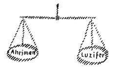
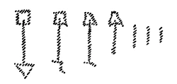
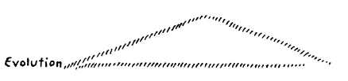
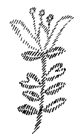

Da sich unsere Abreise noch um einige Tage verzögert hat, bin ich heute, morgen und übermorgen in der Lage, hier zu Ihnen zu sprechen. Es gereicht mir das zur besonderen Befriedigung, da eine Anzahl Freunde aus England hier angekommen sind, zu denen ich auf diese Weise auch noch vor der Abreise einiges werde sprechen können. ^es2zh6

Diese Freunde werden gesehen haben, daß unser Bau des Goetheanum in den schweren Jahren fortgeschritten ist. Er konnte ja allerdings bis zum heutigen Tage nicht vollendet werden, und wir können auch kaum heute irgendeinen Zeitpunkt seiner Vollendung mit Bestimmtheit voraussagen. Aber dasjenige, was heute schon vorhanden ist, wird Ihnen zeigen, aus welchen geistigen Grundlagen heraus dieser Bau erwachsen ist und wie er zusammenhängt mit der geistigen Bewegung, die hier vertreten wird. Daher wird es gerade bei dieser Gelegenheit, wo ich nach langer Zeit auch wiederum zu unseren englischen Freunden in größerer Zahl sprechen kann, gestattet sein, heute den Ausgangspunkt der Betrachtungen gerade von unserem Bau selbst zu nehmen. Wir werden dann in den beiden folgenden Tagen an dasjenige, was im Zusammenhang mit dem Bau gesagt werden kann, einiges andere anschließen können, von dem behauptet werden darf, daß es vielleicht gerade in der Gegenwart wichtig ist ausgesprochen zu werden. ^vfwq7n

Wer unseren Bau, der ja heute wenigstens seiner Idee nach schon zu überschauen ist, betrachtet, dem wird der eigentümliche Zusammenhang dieses Baues mit unserer geistigen Bewegung auffallen, und er wird einen Eindruck bekommen, vielleicht gerade aus diesem Bau, dieser Repräsentanz unserer Geistesbewegung, welcher Art diese Bewegung sein will. Denken Sie, wenn irgendeine, wenn auch noch so ausgebreitete sektiererische Bewegung in die Notwendigkeit sich versetzt gefühlt hätte, für ihre Versammlungen ein solches Haus zu bauen, was würde geschehen sein? Nun, es würde, entsprechend den Bedürfnissen dieser Gesellschaft oder Vereinigung, ein mehr oder weniger großer Bau aufgeführt worden sein in diesem oder jenem Baustile, und Sie hätten vielleicht innerhalb dieses Baues durch das eine oder durch das andere mehr oder weniger sinnbildliche Zeichen einen Hinweis gefunden auf dasjenige, was in diesem Bau gemacht werden soll. Sie hätten vielleicht auch da oder dort ein Bild gefunden, das hingewiesen hätte auf das, was in diesem Bau beabsichtigt wird gelehrt oder sonst vorgebracht zu werden. Das alles, werden Sie bemerkt haben, hat sich so für diesen Bau des Goetheanum nicht vollzogen. Dieser Bau ist nicht nur in äußerlicher Weise zum Gebrauche der anthroposophischen Bewegung oder der Anthroposophischen Gesellschaft hingestellt worden, sondern so wie er dasteht, in allen seinen Einzelheiten, ist er herausgeboren aus dem, was in geistiger Beziehung und auch sonst unsere Bewegung vor der Welt vorstellen will. Diese Bewegung konnte sich nicht damit begnügen, ein Haus aufzurichten in diesem oder jenem Baustile, diese Bewegung fühlte sich in dem Augenblicke, in dem die Rede sein konnte von dem Bau eines solchen eigenen Hauses, gedrungen, einen eigenen Stil aus den Grundlagen unserer Geisteswissenschaft heraus zu finden, einen Stil, durch den in allen Einzelheiten ausgedrückt ist dasjenige, was als geistige Substanz durch diese unsere Bewegung fließt. Hier zum Beispiel wäre undenkbar gewesen, ein beliebiges Haus in einem beliebigen Baustil gerade für diese unsere Bewegung etwa herstellen zu lassen. Daraus sollte man von vornherein schließen, wie weit abstehend dasjenige ist, was mit dieser Bewegung gedacht ist, von irgendwelcher, sei es auch noch so stark verbreiteten sektiererischen oder ähnlichen Bewegung. Wir hatten nötig, nicht bloß ein Haus zu bauen, sondern einen Baustil zu finden, der genau dasselbe ausspricht, was durch jedes Wort, durch jeden Satz unserer anthroposophisch orientierten Geisteswissenschaft ausgesprochen wird. ^pym7bv

Ja, ich habe die Überzeugung, daß wenn man hinlänglich eingehen wird auf das, was in den Formen dieses Baues wirklich empfunden werden kann — beachten Sie, ich sage: empfunden werden kann, nicht spintisiert werden kann -, daß der, welcher dies empfinden kann, aus den empfundenen Formen dieses Baues wird ablesen können dasjenige, was sonst ausgesprochen wird durch das Wort. ^tvti76

Dies ist keine Äußerlichkeit, dies ist etwas, was innerlichst zusammenhängt mit der ganzen Art, wie diese geistige Bewegung gedacht ist. Diese geistige Bewegung will etwas anderes sein, als namentlich jene geistigen Bewegungen, welche in der Menschheit nach und nach heraufgekommen sind seit dem Beginne der fünften nachatlantischen Kulturperiode, sagen wir, seit der Mitte des 15. Jahrhunderts. Und die Überzeugung liegt zugrunde, daß es heute, daß es dieser Gegenwart notwendig ist, etwas anderes in die Evolution der Menschheit hineinzustellen, als sich bisher seit der Mitte des 15. Jahrhunderts in diese Menschheitsevolution hineingestellt hat. Das Charakteristischste für alles dasjenige, was sich in der zivilisierten Menschheit in den letzten drei bis vier Jahrhunderten vollzogen hat, scheint mir das Folgende zu sein: Die äußere Lebenspraxis im weitesten Umkreise, die sich ja im starken Maße mechanisiert hat, bildet heute ein Reich für sich. Sie bildet ein Reich für sich, welches gewissermaßen wie ein Monopol in Anspruch nehmen diejenigen, die sich einbilden Lebenspraktiker zu sein. Neben dieser äußeren Lebensprazis, die sich auf allen Gebieten des sogenannten praktischen Lebens ausgestaltet hat, haben wir eine Summe von geistigen Anschauungen, Weltanschauungen, Philosophien oder wie man es nennen will, die im Grunde genommen nach und nach, aber insbesondere im Laufe der letzten drei bis vier Jahrhunderte, lebensfremd geworden sind, die gewissermaßen in dem, was sie dem Menschen geben an Gefühlen, an Empfindungen, über der eigentlichen Lebenspraxis schweben. Und so kraß ist die Differenz zwischen diesen beiden Strömungen, daß man sagen kann: Mit unserer Gegenwart ist die Zeit angebrochen, in der sich diese zwei Strömungen durchaus nicht mehr verstehen, oder vielleicht besser gesagt, in denen sie keine Anknüpfungspunkte finden, um gegenseitig aufeinander zu wirken. Wir versorgen heute unsere Fabriken, wir bringen unsere Eisenbahnen zum Fahren über dieSchienen und wir schicken unsere Dampfschiffe über dieMeere, wir lassen unsere Telegraphen und Telephone spielen, wir tun das alles, indem wir gewissermaßen die Lebensmechanik automatisch ablaufen lassen und uns selber hineinspannen lassen in diese Lebensmechanik. Und wir predigen daneben. Man predigt eigentlich viel. Die alten Kirchenbekenntnisse predigen in den Kirchen, die Politiker predigen in den Parlamenten, die verschiedenen Bestrebungen auf den verschiedenen Gebieten reden von den Forderungen des Proletariats, von den Forderungen der Frauen. Viel, viel wird gepredigt, und der Inhalt dieses Predigens, er ist ja im Sinne des heutigen Menschheitsbewußtseins etwas gewiß klar Gewolltes. Aber wenn wir uns fragen würden: Wo ist die Brücke zwischen dem, was wir predigen und dem, was unser äußerliches Leben in seiner Praxis zimmert, so würden wir, wenn wir ehrlich und wahrheitsgemäß antworten wollten, eine richtige Antwort nicht finden aus der gegenwärtigen Zeitbewegung heraus. ^bbe7lz

Nur deshalb erwähne ich die folgende Erscheinung, weil dies am anschaulichsten durch diese Erscheinung zutage tritt: Sie wissen ja, es gibt für die heutige Menschheit außer allen übrigen Gelegenheiten zu predigen allerlei Geheimgesellschaften. Nehmen wir von diesen Geheimgesellschaften, sagen wir, die gewöhnlichen Freimaurerlogen, auch diejenigen mit ihren allertiefsten Graden oder höchsten Graden, da finden wir eine Symbolik: Dreieck, Kreis, Winkelmaß und ähnliches. Wir finden sogar ein in solchen Zusammenhängen häufig gebrauchtes Wort: Der Baumeister aller Welten. ^flhihf

Was ist das alles? Ja, wenn wir zurückgehen ins 9., 10., 11. Jahrhundert und uns die zivilisierte Welt ansehen, innerhalb welcher diese Geheimgesellschaften, diese Freimaurerlogen wie eine Cr&me in der Zivilisation sich ausbreiteten, da finden wir, daß all die Instrumente, die heute als Symbol auf dem Altare dieser Freimaurerlogen liegen, verwendet worden sind zum Hausbau und zum Kirchenbau. Man hat Winkelmaße, man hat Kreise, das heißt Zirkel gehabt, hat Wasserwaagen gehabt, Lote, man hat sie verwendet in der äußeren Lebenspraxis. In den Freimaurerlogen hält man, in Anknüpfung an die Dinge, die ihren Zusammenhang mit der Lebenspraxis vollständig verloren haben, Reden und sagt allerlei schöne Sachen darüber, die ja gewiß sehr schön sind, die aber dem äußeren Leben, der äußeren Lebenspraxis vollständig fremd sind. Wir sind zu Ideen gekommen, zu Gedankengebilden gekommen, denen die Stoßkraft fehlt, um ins Leben einzugreifen. Wir sind allmählich dahin gekommen, daß unsere Menschen vom Montag bis Samstag arbeiten und sonntags sich die Predigt anhören. Diese zwei Dinge haben nichts miteinander zu tun. Und wir brauchen oftmals, indem wir predigen, die Dinge, die in älteren Zeiten mit der äußeren Lebenspraxis in innigem Zusammenhang gestanden haben, als Symbole für das Schöne, für das Wahre, sogar für das Tugendhafte. Aber die Dinge sind lebensfremd. Ja, wir sind soweit gekommen zu glauben, daß, je lebensfremder unsere Predigten sind, sie sich desto mehr in die geistigen Welten erheben. Die gewöhnliche profane Welt, die ist etwas Minderwertiges. Und heute sieht man hin auf allerlei Forderungen, die aus den Tiefen der Menschheit aufsteigen, aber man versteht diese Forderungen in ihrem Wesen eigentlich nicht. Denn was ist wohl oftmals für ein Zusammenhang zwischen jenen Gesellschaftspredigten, die in mehr oder weniger schönen Zimmern gesprochen werden darüber, wie der Mensch gut ist, darüber, wie man, nun, sagen wir, alle Menschen liebt ohne Unterschied von Rasse, Nation und so weiter, Farbe sogar, was ist denn für ein Zusammenhang zwischen diesen Predigten und dem, was äußerlich geschieht und was wir mit dadurch fördern, was wir mit dadurch treiben, daß wir unsere Coupons abschneiden und uns auszahlen lassen unsere Renten aus den Banken, die damit die äußere Lebenspraxis versorgen, mit wahrhaftig ganz anderen Prinzipien also als diejenigen sind, von denen wir als den Prinzipien der guten Menschen sprechen in unseren Stuben. Wir begründen zum Beispiel theosophische Gesellschaften, in denen wir für alle Menschen gerade von Brüderlichkeit reden, aber wir haben in dem, was wir reden, nicht die geringste Stoßkraft, um dasjenige irgendwie zu beherrschen, was auch durch uns geschieht, wenn wir unsere Coupons abschneiden. Denn indem wir die Coupons abschneiden, setzen wir eine ganze Summe von volkswirtschaftlichen Dingen in Bewegung. Unser Leben zerfällt ganz und gar in diese zwei voneinander getrennten Strömungen. ^bpmjeq

So kann es vorkommen - ich erzähle nicht ein Schulbeispiel, sondern ein Beispiel aus dem Leben -, es kann vorkommen, ist sogar vorgekommen, daß eine Dame mich aufsuchte und sagte: Ja, da kommt jemand und fordert von mir einen Beitrag, der aber dann verwendet wird dazu, Leute zu unterstützen, die Alkohol trinken. Das kann ich doch als’Theosophin nicht tun! — So sagte die Dame. Ich konnte nur antworten: Sehen Sie, Sie sind Rentiere, wissen Sie denn, wieviel Brauereien mit Ihrem Vermögen gegründet und unterhalten werden? — Es handelt sich für dasjenige, auf was es ankommt, nicht darum, daß wir auf der einen Seite predigen zur wollüstigen Befriedigung unserer Seele, und auf der anderen Seite uns ins Leben hineinstellen so wie es die Lebensroutine, die durch die letzten drei bis vier Jahrhunderte heraufgekommen ist, einmal fordert. Wenige Menschen sind heute überhaupt geneigt, auf dieses Grundproblem der Gegenwart einzugehen. Woher kommt dieses? Es kommt daher, daß wirklich dieser Dualismus ins Leben getreten ist — und am stärksten geworden ist in den letzten drei bis vier Jahrhunderten — zwischen dem äußeren Leben und zwischen unseren sogenannten geistigen Bestrebungen. Die meisten Menschen reden, wenn sie heute vom Geiste reden, von etwas ganz Abstraktem, Weltenfremdem, nicht von etwas, das in das alltägliche Leben einzugreifen vermag. ^dt91mb

Die Frage, das Problem, auf das damit hingedeutet wird, das muß an seiner Wurzel angepackt werden. Wäre hier auf diesem Hügel im Sinne dieser Bestrebungen der letzten drei bis vier Jahrhunderte gehandelt worden, dann hätte man sich vielleicht an einen beliebigen Architekten gewendet, einen berühmten Architekten und hätte einen schönen Bau hier aufführen lassen, der ja gewiß hätte sehr schön sein können aus irgendeinem Baustil heraus. Darum konnte es sich nie handeln. Denn wir wären dann hineingegangen in diesen Bau, wir wären umgeben gewesen von allem möglichen Schönen aus diesem oder jenem Stil, und wir hätten drinnen Dinge gesprochen, die zu diesem Bau gepaßt hätten, ungefähr so, wie eben all die schönen Reden, die heute gehalten werden, passen zu der äußeren Lebenspraxis, welche die Menschen pflegen. Das konnte nicht so sein, denn so war nicht die Geisteswissenschaft gemeint, die sich anthroposophisch orientieren will. Diese war vom Anfang an anders gemeint. Die war so gemeint, daß nicht aufgerichtet wurde der alte falsche Gegensatz zwischen Geist und Materie, wobei dann vom Geiste in abstracto gehandelt wird und dieser Geist keine Möglichkeit hat, in das Wesen und Weben der Materie unterzutauchen. Wann spricht man berechtigt vom Geiste, wann spricht man in Wahrheit vom Geiste? Nur dann spricht man in Wahrheit vom Geiste, spricht man berechtigt vom Geiste, wenn man den Geist als Schöpfer meint desjenigen, was materiell ist. Es ist schlimmste Rede vom Geiste, wenn auch diese schlimmste Rede vom Geiste oftmals heute als die schönste angesehen wird, wenn man von dem Geiste als im Wolkenkuckucksheim spricht, in einer solchen Weise spricht, daß dieser Geist gar nicht berührt werden sollte von dem Materiellen. Nein, von dem Geiste muß man so sprechen, daß man den Geist meint, der die Kraft hat unmittelbar unterzutauchen in das Materielle. Und wenn man von der Geisteswissenschaft spricht, so darf diese nicht nur so gedacht werden, daß sie sich bloß erhebt über die Natur, sondern daß sie zu gleicher Zeit vollwertige Naturwissenschaft ist. Wenn man vom Geiste spricht, so muß der Geist gemeint sein, mit dem sich der Mensch verbinden kann so, daß dieser Geist auch in das soziale Leben durch die Vermittlung des Menschen hinein sich verweben kann. Ein Geist, von dem man bloß im Salon spricht als dem, welchem man durch das Gutsein und durch die Bruderliebe wohlgefallen will, und der sich wohl hütet unterzutauchen in das unmittelbare Leben, ein solcher Geist ist nicht der wahre Geist. Ein solcher Geist ist eine menschliche Abstraktion, und die Erhebung zu ihm ist nicht die Erhebung zum wirklichen Geist, sondern sie ist gerade der letzte Ausfluß des Materialismus. ^jm1sye

Daher mußten wir einen Bau aufrichten, der in allen seinen Einzelheiten herausgedacht ist, herausgeschaut ist aus demjenigen, was sonst auch in unserer anthroposophisch orientierten Geisteswissenschaft lebt. Und damit hängt es auch zusammen, daß in dieser schweren Zeit hervorgegangen ist eine Behandlung der sozialen Frage aus dieser Geisteswissenschaft, die nicht im Wolkenkuckucksheim weilen will, sondern die Lebenssache sein wollte vom Anfange ihres Wirkens an, die gerade das Entgegengesetzte sein wollte von jeder Art von Sektiererei, die ablesen wollte dasjenige, was in den großen Forderungen der Zeit liegt, und die dienen wollte diesen Forderungen der Zeit. Gewiß, an diesem Bau ist vieles nicht gelungen. Aber es handelt sich heute wahrhaftig auch nicht darum, daß alles gleich gelinge, sondern es handelt sich darum, daß in gewissen Dingen ein Anfang, ein notwendiger Anfang gemacht werde. Und dieser notwendige Anfang scheint mir wenigstens mit diesem Bau gemacht worden zu sein. So werden wir, wenn dieser Bau einstmals fertig sein wird, nicht in irgend etwas, was uns als fremdartige Wände umgibt, dasjenige vollziehen, was wir zu vollziehen haben werden, sondern so wie die Nußschale zur Nußfrucht gehört und in ihrer Form ganz angepaßt ist dieser Nußfrucht, so wird angepaßt sein jede einzelne Linie, jede einzelne Form und Farbe dieses Baues demjenigen, was durch unsere geistige Bewegung fließt. ^3gyy1z

Es wäre schon notwendig, daß in der Gegenwart wenigstens von einer Anzahl von Menschen dieses Wollen eingesehen werde, denn auf dieses Wollen kommt es an. ^kem6j1

Ich muß noch einmal zurückkommen auf manches Charakteristische, das in den letzten drei bis vier Jahrhunderten in der Evolution der zivilisierten Menschheit zutage getreten ist. Wir haben in dieser Evolution der zivilisierten Menschheit Erscheinungen, die uns so recht charakteristisch ausdrücken die tieferen Grundlagen desjenigen, was sich in der Gegenwart im Leben der Menschen ad absurdum führt; denn ein Adabsurdum-Führen ist es. Es ist zwar so, daß heute ein großer Teil der Menschenseelen eigentlich schläft, wirklich schläft. Ist man irgendwo, wo gewisse Dinge, die heute, ich möchte sagen, als wirkliche Widerbilder, Gegenbilder alles zivilisierten Lebens sich abspielen, ist man irgendwo, wo diese Gegenbilder einem nicht direkt vor Augen treten, aber doch in zahlreichen Gegenden der heutigen zivilisierten Welt sich abspielen und bedeutungsvoll, symptomatisch sind für dasjenige, was immer weiter und weiter um sich greifen muß, dann findet man: Ja, die Menschen sind mit ihren Seelen draußen, außerhalb der wichtigsten Zeitereignisse. Die Menschen leben in den Alltag hinein, ohne sich klar vor Augen zu halten, was eigentlich in der Gegenwart vorgeht, solang sie nur nicht unmittelbar berührt werden von diesen Vorgängen. Aber allerdings, es liegen auch die eigentlichen Impulse dieser Vorgänge in den Tiefen des unterbewußten oder unbewußten Seelenlebens der Menschen. ^yub9el

Zugrunde liegend dem Dualismus, den ich angeführt habe, ist ja heute ein anderer: der Dualismus, der sich zum Beispiel ausspricht — ich meine ein charakteristisches Beispiel anzuführen — durch Miltons «Verlorenes Paradies». Aber es ist das nur ein äußeres Symptom für etwas, was durch das ganze moderne Denken, Empfinden, Fühlen und Wollen geht. Wir haben im neueren Menschheitsbewußtsein das Gefühl eines Gegensatzes zwischen dem Himmel und der Hölle, andere nennen es Geist und Materie. Es sind nur im Grunde genommen Gradunterschiede zwischen dem Himmel und der Hölle des Bauern draußen auf dem Lande und zwischen Materie und Geist des sogenannten aufgeklärten Philosophen unserer Tage. Die eigentlichen Denkimpulse, die zugrunde liegen, sind genau die gleichen. Der eigentliche Gegensatz ist der zwischen Gott und Teufel, zwischen dem Paradies und der Hölle. Sicher ist es den Menschen: Das Paradies ist gut, und es ist schrecklich, daß die Menschen aus dem Paradiese herausgekommen sind; das Paradies ist etwas Verlorenes, es muß wieder gesucht werden, und der Teufel ist ein schrecklicher Widersacher, der entgegensteht all denjenigen Mächten, die man verbindet mit dem Begriff des Paradieses. Menschen, die keine Ahnung davon haben, wie Seelengegensätze walten bis in die äußersten Ranken unserer sozialen Gegensätze und sozialen Forderungen hinein, die können sich gar nicht vorstellen, welche Tragweite in diesem Dualismus liegt zwischen Himmel und Hölle oder zwischen dem verlorenen Paradiese und der Erde. Man muß heute schon recht Paradoxes sagen, wenn man die Wahrheit sagen will, man kann eigentlich kaum heute über manche Dinge die Wahrheit sagen, ohne daß diese Wahrheit wie ein Wahnsinn oftmals unseren Zeitgenossen erscheint. Aber so wie im paulinischen Sinne die Weisheit der Menschen eine Torheit vor Gott sein kann, so könnte die Weisheit der Menschen von heute, oder der Wahnsinn der Menschen von heute, auch Wahnsinn sein für die Anschauung der Menschen der Zukunft. Die Menschen haben sich allmählich in einen solchen Gegensatz zwischen der Erde und dem Paradiese hineingeträumt, sie bringen das Paradiesische zusammen mit dem, was als das eigentlich Menschlich-Göttliche anzustreben ist, und wissen nicht, daß das Anstreben dieses Paradiesischen ebenso schlimm für den Menschen ist, wenn er es ohne weiteres will, als das Anstreben des Gegensatzes wäre. Denn wenn man die Struktur der Welt so vorstellt, wie sie als Vorstellung zugrunde liegt dem «Verlorenen Paradies» von Milton, dann tauft man um eine der Menschheit abträgliche Macht, wenn sie einseitig angestrebt wird, in die göttlich-gute Macht und stellt ihr einen Gegensatz gegenüber, der kein wahrer Gegensatz ist: den Gegensatz des Teufels, den Gegensatz desjenigen, was in der menschlichen Natur an dem Guten Widerstrebendem liegt. ^vn2pw0

Der Protest gegen diese Anschauung soll liegen in jener Gruppe, die im Osten unseres Baues innen aufgestellt werden soll, eine neuneinhalb Tafel 14 ^hvaejj

Meter hohe Holzgruppe, in der an die Stelle, oder durch die an die Stelle des luziferischen Gegensatzes zwischen Gott und dem Teufel dasjenige gesetzt wird, was dem Menschheitsbewußtsein der Zukunft zugrunde liegen muß: die Trinität zwischen dem Luziferischen, dem ChristusGemäßen und dem Ahrimanischen. ^qqk4e8

Von dem Geheimnis, das da zugrunde liegt, hat die neuere Zivilisation so wenig ein Bewußtsein, daß man das Folgende sagen kann. Wir haben aus gewissen Gründen, über die ich vielleicht auch noch hier wiederum sprechen werde, diesen Bau «Goetheanum» genannt, als bauend auf Goethescher Kunst- und Erkenntnisgesinnung. Aber zu gleicher Zeit muß gerade hier gesagt werden: In dem Gegensatze, den Goethe in seinem «Faust» aufgerichtet hat zwischen den guten Mächten und dem Mephistopheles, liegt derselbe Irrtum wie in Miltons «Verlorenem Paradies»: auf der einen Seite die guten Mächte, auf der anderen Seite die schlechte Macht Mephistopheles. In diesem Mephistopheles hat Goethe bunt durcheinandergeworfen das Luziferische auf der einen Seite, das Ahrimanische auf der anderen Seite, so daß in der Goetheschen Mephistopheles-Figur für den, der die Sache durchschaut, zwei geistige Individualitäten durcheinandergemischt sind, unorganisch durcheinandergemischt sind. Erkennen muß der Mensch, wie sein wahres Wesen nur ausgedrückt werden kann durch das Bild des Gleichgewichtes: Wie der Mensch auf der einen Seite versucht ist, gewissermaßen über seinen Kopf hinauszuwollen, hinauszuwollen in das Phantastisch-Schwärmerische hinein, hinauszuwollen in das falsch Mystische hinein, hinauszuwollen in all dasjenige, was phantastisch ist. Das ist die eine Macht. Die andere Macht ist diese, die den Menschen gewissermaßen herunterzieht in das Materialistische, in das Nüchterne, Trockene und so weiter. Nur dann verstehen wir den Menschen, wenn wir ihn auffassen seinem Wesen nach als strebend nach dem Gleichgewichte zwischen, sagen wir, auf dem einen Waagebalken dem Ahrimanischen, auf dem anderen Waagebalken dem Luziferischen. (Siehe Zeichnung, S. 165.) ^xv4rm3

 ^q1hxto

Der Mensch hat fortwährend die Gleichgewichtslage zwischen diesen beiden Mächten anzustreben, zwischen demjenigen, das ihn hinausführen möchte über sich selbst, und demjenigen, das ihn herabziehen möchte unter sich selbst. Nun hat die neuere Geisteszivilisation verwechselt das Phantastisch-Schwärmerische des Luziferischen mit dem Göttlichen. So daß in dem, was als Paradies geschildert wird, in der Tat die Schilderung des Luziferischen vorliegt, und daß man die furchtbare Verwechselung begeht zwischen dem Luziferischen und dem Göttlichen, weil man nicht weiß, daß es darauf ankommt, die Gleichgewichtslage zwischen zwei den Menschen nach der einen oder nach der anderen Seite hin zerrenden Mächten zu halten. ^sudi40

Diese Tatsache mußte zunächst aufgedeckt werden. Wenn der Mensch streben soll nach demjenigen, was man das Christliche nennt, worunter aber heute sonderbare Dinge oftmals verstanden werden, dann muß er sich klar sein, daß dies nur ein Streben sein kann in der Gleichgewichtslage zwischen dem Luziferischen und dem Ahrimanischen, und daß namentlich die drei bis vier letzten Jahrhunderte so sehr ausgeschaltet haben die Erkenntnis des wirklichen Menschenwesens, daß man von dem Gleichgewichte wenig weiß und das Luziferische umgetauft hat in das Göttliche in dem «Verlorenen Paradies», und einen Gegensatz gemacht hat aus dem Ahrimanischen, der kein Ahriman mehr ist, aber der zum modernen Teufel oder zur modernen Materie oder zu irgend etwas dergleichen geworden ist. Dieser Dualismus, der in Wirklichkeit ein Dualismus ist zwischen Luzifer und Ahriman, dieser Dualismus spukt im Bewußtsein der modernen Menschheit als der Gegensatz zwischen Gott und dem Teufel. Und das «Verlorene Paradies» müßte eigentlich aufgefaßt sein als eine Schilderung des verlorenen luziferischen Reiches, es ist nur umgetauft. ^nu0ywo

So stark muß man heute in den Geist der neueren Zivilisation hineinweisen, weil es nötig ist, daß die Menschheit sich klar werde darüber, wie sie auf eine abschüssige Bahn - es ist eine historische Notwendigkeit, aber Notwendigkeiten sind doch auch dazu da, daß man sie begreift —, wie sie auf eine abschüssige Bahn gekommen ist und, wie gesagt, nur durch die radikalste Kur wiederum aufwärts kommen kann. Oftmals versteht man heute unter der Schilderung der geistigen Welt eine Darstellung dessen, was übersinnlich ist, was aber nicht lebt hier auf unserer Erde. Man möchte mit einer geistigen Anschauung flüchten von dem, was uns hier auf unserer Erde umgibt. Man weiß nicht, daß man — indem man also flieht in ein abstraktes geistiges Reich — gerade nicht den Geist, sondern die luziferische Region findet. Und manches, was sich heute Mystik nennt, was sich heute Theosophie nennt, ist ein Aufsuchen der luziferischen Region. Denn das bloße Wissen von einem Geiste, das kann dem heutigen Geistesstreben der Menschen nicht zugrunde liegen, weil es angemessen ist diesem heutigen, diesem gegenwärtigen Geistesstreben, zu erkennen den Zusammenhang zwischen den geistigen Welten und der Welt, in die wir hineingeboren werden, um zwischen der Geburt und dem Tode in ihr zu leben. ^sm4jon

Diese Frage sollte uns vor allen Dingen dann gerade berühren, wenn wir den Blick nach geistigen Welten richten: Warum werden wir aus den geistigen Welten heraus in diese physische Welt hineingeboren? — Nun, wir werden in diese physische Welt hineingeboren — und ich werde morgen und übermorgen dasjenige, was ich heute skizziere, genauer ausführen —, weil es hier auf dieser Erde Dinge zu erfahren, Dinge zu erleben gibt, die in den geistigen Welten nicht erlebt werden können, sondern um diese zu erleben, muß man heruntersteigen in diese physische Welt, und man muß aus dieser physischen Welt die Ergebnisse dieses Erlebens hinauftragen in die geistigen Welten. Man muß, um das zu erreichen, aber auch in diese physische Welt untertauchen, muß gerade mit seinem Geist erkenntnismäßig in diese physische Welt untertauchen. Um der geistigen Welt willen muß man in diese physische Welt untertauchen. ^i09ru0

Nehmen wir einmal, um es radikal zu sagen, was ich aussprechen will, einen normalen Menschen der Gegenwart, der sich redlich ernährt, seine gehörige Anzahl von Stunden schläft, frühstückt, zu Mittag und zu Abend ißt und so weiter, und der auch geistige Interessen hat, sogar hohe geistige Interessen, der Mitglied, sagen wir, einer theosophischen Gesellschaft wird, weil er geistige Interessen hat, da alles mögliche treibt, um zu wissen, was in den geistigen Welten vorgeht. Nehmen wir einen solchen Menschen, der sozusagen im kleinen Finger alles dasjenige hat, was in dieser oder jener theosophischen Literatur der Gegenwart notifiziert wird, der aber sonst nach den gewöhnlichen Usancen des Lebens lebt. Nehmen wir ihn, diesen Menschen! Was bedeutet all sein Wissen, das er sich aneignet mit seinen höheren geistigen Interessen? Es bedeutet etwas, was hier auf dieser Erde ihm einige innerliche seelische Wollust bereiten kann, so einen richtigen luziferischen Genuß, wenn es auch ein raffinierter, verfeinerter Seelengenuß ist. Es wird nichts davon durch des Todes Pforte getragen, gar nichts davon wird durch des Todes Pforte getragen. Denn es kann unter solchen Menschen — und sie sind sehr häufig — solche geben, die, trotzdem sie im kleinen Finger haben, was ein Astralleib, ein Ätherleib und so weiter ist, keine Ahnung davon haben, was vorgeht, wenn eine Kerze brennt. Sie haben keine Ahnung davon, welche Zauberkunststücke aufgeführt werden, damit draußen die Tramway fährt. Sie fahren zwar damit, aber sie wissen nichts davon. Aber noch mehr: sie haben zwar im kleinen Finger, was Astralleib, Ätherleib ist, Karma, Reinkarnation, aber sie haben keine Ahnung davon, was gesprochen wird, angestrebt wird zum Beispiel heute in den Versammlungen proletarischer Menschen. Es interessiert sie nicht. Es interessiert sie nur, wie der Ätherleib ausschaut, wie der Astralleib ausschaut, es interessiert sie nicht, welche Wege das Kapital macht, indem es seit dem Beginne des 19. Jahrhunderts die eigentlich herrschende Macht geworden ist. Das Wissen vom Ätherleib, Astralleib, das nützt nichts, wenn die Menschen gestorben sind. Gerade das muß man aus einer wirklichen Erkenntnis der geistigen Welt heraus sagen. Es hat erst dann einen Wert, wenn dieses geistige Erkennen das Instrument wird, um unterzutauchen in das materielle Leben und da im materiellen Leben dasjenige aufzunehmen, was in den geistigen Welten selber nicht aufgenommen werden kann, was aber hineingetragen werden muß. ^12uim1

Wir haben heute eine Naturwissenschaft, die wird an unseren Universitäten auf den verschiedensten Gebieten gelehrt. Es wird experimentiert, es wird geforscht und so weiter. Da kommt die Naturwissenschaft zustande. Mit dieser Naturwissenschaft speisen wir unsere Technik, mit dieser Naturwissenschaft heilen wir heute auch schon die Menschen, tun alles mögliche. Daneben gibt es kirchliche Bekenntnisse. Aber ich frage Sie, haben Sie schon Kenntnis genommen von dem Inhalte so gewöhnlicher Sonntagnachmittagspredigten, wo zum Beispiele gesprochen wird von dem Reich Christi und so weiter? Welche Beziehung ist zwischen der Naturwissenschaft und dem, was da gesprochen wird? Zumeist gar keine. Beide Dinge gehen nebeneinander her. Die einen glauben, sie haben die rechte Kraft, um über Gott und den Heiligen Geist und alles mögliche zu reden. Wenn sie auch sagen, sie empfänden die Dinge, sie reden doch in abstrakten Formen, in abstrakten Anschauungen darüber. Die anderen reden von einer geistlosen Natur. Keine Brücke wird geschlagen! Dann haben wir in der neueren Zeit selbst allerlei theosophische Anschauungen bekommen, mystische Anschauungen bekommen. Ja, diese mystischen Anschauungen, sie reden über alles mögliche Lebensferne, aber sie reden nicht vom Menschenleben, weil sie nicht die Kraft haben, unterzutauchen in das Menschenleben. Ich möchte einmal fragen, ob denn im rechten Sinne von einem Weltenschöpfer geredet wäre, wenn man ihn so ausdächte, daß er ja ein sehr interessanter schöner Geist wäre, aber niemals hätte zur Weltschöpfung kommen können? Die geistigen Mächte, von denen heute oftmals geredet wird, die hätten niemals zur Weltschöpfung kommen können, denn die Gedanken, die wir über diese entwickeln, die sind nicht einmal imstande einzugreifen in dasjenige, was unser Wissen über die Natur oder unser Wissen über das soziale Leben der Menschen ist. ^5jxqu7

Ich darf vielleicht, ohne unbescheiden zu werden, an einem Beispiel erläutern, was ich meine. In einem meiner letzten Bücher - «Von Seelenrätseln» — habe ich darauf aufmerksam gemacht, und ich habe es ja öfter in mündlichen Vorträgen ausgesprochen, welcher Unsinn gelehrt wird in der heutigen Physiologie, also auch einer Naturwissenschaft: der Unsinn, daß es zweierlei Nerven im Menschen gibt, motorische Nerven, die dem Willen zugrunde liegen, und sensitive Nerven, die den Wahrnehmungen, den Empfindungen zugrunde liegen. Nun, seit es Telegraphie gibt, hat man ja das Bild von der Telegraphie. Also: vom Auge geht der Nerv zum Zentralorgan, dann vom Zentralorgan aus geht er wiederum zu irgendeinem Gliede. Wir sehen irgend etwas sich da bewegen als ein Glied, da geht der Telegraphendraht von diesem Organ, vom Auge, zum Zentralorgan, das setzt den Bewegungsnerv in Tätigkeit, dann wird die Bewegung ausgeführt. ^d9i8jl

Diesen Unsinn läßt man die Naturwissenschaft lehren. Man muß sie ihn lehren lassen, denn man redet in einer abstrakten geistigen Anschauung von allem möglichen, nur entwickelt man nicht solche Gedanken, die positiv eingreifen können in das Naturgetriebe. Man hat nicht die Stärke in dem, was die geistigen Anschauungen sind, um ein Wissen über die Natur selbst zu entwickeln. Es gibt nämlich nicht einen Unterschied zwischen motorischen und sensitiven Nerven, sondern dasjenige, was man Willensnerven nennt, sind auch sensitive Nerven, sie sind nur dazu da, um unsere eigenen Glieder dann wahrzunehmen, wenn Bewegungen ausgeführt werden sollen. Das Schulbeispiel der Tabes, das beweist gerade das Gegenteil dessen, was bewiesen werden soll. Ich will nicht weiter darauf eingehen, weil unter Ihnen nicht entsprechende physiologische Vorkenntnisse sind. Ich würde allerdings über diese Dinge im Kreise von physiologisch, biologisch vorgebildeten Leuten einmal sehr gerne darüber reden. Hier will ich aber nur darauf aufmerksam machen, daß wir auf der einen Seite eine Naturwissenschaft haben, auf der anderen Seite ein Reden und Predigen von geistigen Welten, das nicht eindringt in irgendwelche realen Welten, die uns in der Natur vorliegen. Das aber brauchen wir. Wir brauchen eine Erkenntnis des Geistes, die so stark ist, daß sie zu gleicher Zeit Naturwissenschaft werden kann. Die werden wir nur erlangen, wenn wir das Wollen berücksichtigen, auf das ich Sie heute hier aufmerksam machen wollte. Hätten wir eine sektiererische Bewegung begründen wollen, die nur auch irgendeine Dogmatik über das Göttliche und Geistige hat und die einen Bau braucht, so hätten wir irgendeinen Bau aufgeführt, respektive aufführen lassen. Da wir das nicht wollten, sondern da wir schon in dieser äußeren Handlung andeuten wollten, daß wir untertauchen wollen in das Leben, mußten wir uns auch diesen Bau ganz aus dem Wollen der Geisteswissenschaft heraus selber bauen. Und an den Einzelheiten..dieses Baues wird man einmal sehen, daß tatsächlich wichtige Prinzipien, die heute unter dem Einflusse der erwähnten zwei Dualismen in das falscheste Licht gerückt werden, auf ihre gesunde Grundlage gestellt werden können. Ich möchte Sie nur auf eines heute noch aufmerksam machen. ^sd9lvc

 ^euipiq

Sehen Sie sich einmal die aufeinanderfolgenden sieben Säulen an, die auf jeder Seite unseres Hauptbaues stehen (es wird gezeichnet): Da haben Sie darüber Kapitäle, darunter Sockel. Die sind nicht gleich, sondern jeder folgende entwickelt sich aus dem vorhergehenden. So daß Sie eine Anschauung bekommen des zweiten Kapitäls, wenn Sie sich lebensvoll in das erste und seine Formen hineinversetzen, lebendig werden lassen den Gedanken der Metamorphose als Organisches, und jetzt wirklich einen so lebendigen Gedanken haben, daß dieser Gedanke nicht abstrakt ist, sondern daß er dem Wachsen folgt. Dann können Sie das zweite Kapitäl aus dem ersten entwickelt sehen, das dritte aus dem zweiten, das vierte aus dem dritten und so weiter bis zum siebenten. So ist versucht worden, in lebendiger Metamorphose ein Kapitäl, ein Architravstück und so weiter aus dem anderen heraus zu entwickeln, nachzubilden dasjenige Schaffen, das als geistiges Schaffen in der Natur selber lebt, indem die Natur eine Gestalt aus der anderen hervorgehen läßt. Ich habe das Gefühl, daß kein Kapitäl anders sein könnte als es nun ist. ^29o8zu

Aber dabei hat sich etwas sehr Merkwürdiges herausgestellt. Wenn heute die Leute von Evolution reden, da sagen sie oftmals: Entwickelung, Entwickelung, Evolution, erst das Unvollkommene, dann das etwas weiter Vollkommene, das mehr Differenzierte und so fort, und immer werden die vollkommeneren Dinge auch die komplizierteren. Das konnte ich nicht durchführen, als ich die sieben Kapitäle auseinander entstehen ließ nach der Metamorphose, sondern als ich zum vierten Kapitäl kam, ergab sich mir, daß ich dieses vierte, da ich nun das nächste, das fünfte, das vollkommener sein sollte, als das vierte, auszubilden hatte als das komplizierteste. Das heißt, als ich nicht wie Haeckel oder Darwin nur in Gedanken die abstrakten Dinge verfolgte, sondern als ich die Formen so machen mußte, wie die Form hervorgeht aus dem Vorhergehenden - so wie in der Natur selbst eine Form nach der anderen aus den Vitalkräften hervorgeht -, da war ich genötigt, zwar die fünfte Form in ihren Flächen kunstvoller zu machen als die vierte, aber nicht komplizierter, sondern einfacher wurde die ganze Form. Und die sechste wurde wieder einfacher und die siebente wieder einfacher. Und so stellte sich mir heraus, daß Evolution nicht ein Fortschreiten zu immer Differenzierterem und Differenzierterem ist (es wird die Gerade an die Tafel gezeichnet), sondern daß Evolution ein Ansteigen ist zu einem höheren Punkte, dann aber wiederum ein Fallen in Einfacheres und Einfacheres. ^tjfz5g

 ^zrv3wa

Das ergab sich einfach aus dem Arbeiten selbst. Und ich konnte sehen, wie dieses im künstlerischen Arbeiten sich ergebende Prinzip der Evolution dasselbe ist, wie das Prinzip der Evolution in der Natur. ^txkv6w

Denn betrachten Sie das menschliche Auge, so ist es ja sicher vollkommener als die Augen mancher Tiere. Aber die Augen mancher Tiere sind komplizierter als das Menschenauge. Sie haben zum Beispiel innen eingeschlossen gewisse bluterfüllte Organe, den Schwertfortsatz, den Fächer, die beim Menschen nicht da sind, gewissermaßen aufgelöst sind. Das menschliche Auge ist wieder vereinfacht gegenüber den Formen mancher Tieraugen. Verfolgen wir die Entwickelung des Auges, so finden wir: es ist zuerst primitiv, einfach, dann wird es immer komplizierter und komplizierter, dann aber vereinfacht es sich wiederum, und das Vollkommenste ist nicht das Komplizierteste, sondern wiederum ein Einfacheres als das in der Mitte Stehende. ^6orblj

Und man war dazu genötigt, es selbst so zu machen, indem man künstlerisch das ausbildete, was eine innere Notwendigkeit auszubilden hieß. Nicht wurde hier angestrebt über etwas zu forschen, sondern die Verbindung mit den Vitalkräften selbst wurde angestrebt. Und in unserem Bau hier wurde angestrebt die Formen so zu gestalten, daß in diesem Gestalten dieselben Kräfte drinnen liegen, die als der Geist der Natur dieser Natur zugrunde liegen. Ein Geist wird gesucht, der nun tatsächlich schöpferisch ist, der in den Produktionen der Welt drinnen lebt, der nicht bloß predigt. Das ist das Wesentliche. Das ist auch der Grund, warum es manches absetzte hier gegenüber denen, die auch unseren Bau ausgestalten wollten mit allen möglichen Symbolen und dergleichen. Es ist kein einziges Symbol im Bau, sondern alles sind die Formen, die dem Schaffen vom Geist in der Natur selbst nachgebildet sind. ^6to16q

Damit aber ist der Anfang eines Wollens gegeben, das seine Fortsetzung finden muß. Und zu wünschen wäre es, daß gerade dieser Gesichtspunkt der Sache verstanden würde, daß verstanden würde, wie in der Tat gesucht werden sollen Urquellen menschlichen Intendierens, menschlichen Schaffens, die auf allen Gebieten notwendig sind für die neuere Menschheit. Wir leben ja heute mitten in Forderungen. Aber es sind alles einzelne Forderungen, aus den verschiedenen Lebenskreisen heraus sprießen diese Forderungen auf. Wir brauchen aber auch eine Zusammenfassung. Sie kann nicht von irgend etwas kommen, was nur im Umkreise des äußeren sichtbaren Daseins schwebt, denn allem Sichtbaren liegt das Übersichtbare zugrunde, und dieses muß man heute erfassen. Ich möchte sagen: Man sollte gar sehr hinhören auf die Dinge, die heute geschehen, und man wird finden, daß es gar kein so absurder Gedanke ist, daß das Alte zusammenfällt. Dann muß aber etwas da sein, das an die Stelle treten kann. Doch um mit diesem Gedanken sich zu befreunden, braucht man einen gewissen Mut, der nicht im äußeren Leben erworben wird, sondern der innerlichst erworben werden muß. ^k8g5f4

Dieser Mut, ich möchte ihn nicht definieren, möchte ihn charakterisieren. Die schlafenden Seelen von heute werden ganz gewiß entzückt sein, wenn da oder dort irgend jemand auftritt und so malen kann wie Raffael oder wie Leonardo. Das ist begreiflich. Aber wir müssen heute den Mut haben zu sagen, nur derjenige hat ein Recht Raffael und Leonardo zu bewundern, der weiß, daß heute nicht so geschaffen werden kann und darf, wie Raffael und Leonardo geschaffen haben. Schließlich kann man etwas sehr Philiströses sagen, um das zu veranschaulichen: Nur derjenige hat ein Recht heute, die geistige Tragweite des pythagoräischen Lehrsatzes anzuerkennen, der nicht glaubt, daß der pythagoräische Lehrsatz heute erst entdeckt werden soll. Ein jegliches Ding hat seine Zeit, und aus der konkreten Zeit heraus müssen die Dinge begriffen werden. ^nxag34

Man braucht heute tatsächlich mehr, als manche Leute aufbringen möchten, wenn sie sich auch irgendeiner geistigen Bewegung anschließen: man braucht heute die Erkenntnis, daß wir vor eine Erneuerung des Daseins der Menschheitsentwickelung uns stellen müssen. Es ist billig, zu sagen, unsere Zeit ist eine Übergangszeit. Jede Zeit ist eine Übergangszeit, es kommt nur darauf an, daß man weiß, was übergeht. Also diese Trivialität möchte ich nicht aussprechen, daß unsere Zeit eine Übergangszeit ist, aber das andere möchte ich sagen: Immerfort spricht man davon, die Natur und das Leben machen keine Sprünge. Man ist sehr weise, wenn man das ausspricht: Sukzessive Entwickelung, nirgends Sprünge! - Nun, die Natur macht fortwährend Sprünge. (Es wird gezeichnet:) Sie bildet stufenweise aus das grüne Laubblatt, sie bildet es um zum andersartigen Kelchblatt, zum farbigen Blumenblatt, zu den Staubgefäßen, zum Stempel. ^xsd8mk

 ^mbfp79

Die Natur macht fortwährend Sprünge, indem sie ein einzelnes Gebilde bildet; das größere Leben macht fortwährend Umschwünge. Wir sehen im Menschenleben, wie sich mit dem Zahnwechsel ganz neue Verhältnisse einstellen, wie sich mit der Geschlechtsreife ganz neue Verhältnisse einstellen. Und würde die Beobachtungsgabe der gegenwärtigen Menschen nicht so grob sein, so würde man um das zwanzigste Jahr herum eine dritte Epoche und so weiter, und so weiter im Menschenleben wahrnehmen können. ^6iz6w8

Aber auch die Geschichte selbst ist ein Organismus, und solche Sprünge finden statt. Man geht an ihnen vorüber. Die Menschen haben heute kein Bewußtsein davon, welch bedeutungsvoller Sprung geschehen ist um die Wende des 14. und 15. Jahrhunderts, oder eigentlich in der Mitte des 15. Jahrhunderts. Aber dasjenige, was sich damals eingeleitet hat, das will in der Mitte unseres Jahrhunderts sich erfüllen. Und es ist wahrhaftig keine Spintisiererei, sondern etwas, was sich allen exakten Wahrheiten an die Seite stellen kann, wenn man davon spricht, daß die Ereignisse, die die Menschheit so bewegen, und die solche Kulmination in der letzten Zeit erlangt haben, hintendieren nach etwas, das man wirklich herausfinden kann als sich vorbereitend und als stark hereinbrechend in die Menschheitsevolution für die Mitte dieses Jahrhunderts. Auf solche Dinge muß derjenige eingehen, der nicht aus irgendwelcher Willkür heraus Ideale für die Menschheitsentwickelung aufstellen will, sondern der mit den schaffenden Kräften der Welt ^ir5il5

Geisteswissenschaft finden will, die dann auch einlaufen kann in das Leben. ^9bo5xp