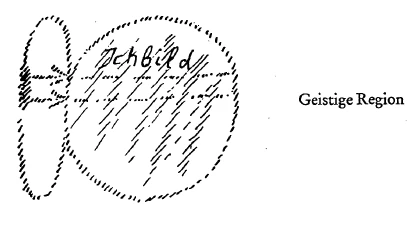
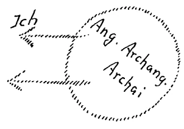

Es ist unmöglich, daß der Mensch von der Gegenwart ab in die Zukunft hinein zu einer wirklichen Selbsterkenntnis, zu einem Selbstgefühl auch von seinem Wesen komme, ohne daß er in Beziehung tritt zur Wissenschaft der Initiation, aus dem Grunde, weil in allem, was der Mensch hier in dieser Welt erfahren kann, ohne daß er Rücksicht nimmt auf die Wissenschaft der Initiation, die Kräfte nicht darinstecken, aus denen heraus das menschliche Wesen wirklich geformt ist. Sie müssen nur, um sich eine entsprechende Vorstellung von dem zu machen, was ich damit eigentlich sagen will, an manches denken, was Ihnen ja geläufig ist aus unseren anthroposophischen Betrachtungen. Sie müssen daran denken, daß der Mensch außer dem, daß er hier sein Leben zwischen der Geburt und dem Tode durchmacht, immer wiederum Leben durchmacht zwischen dem Tode und einer neuen Geburt. Geradeso wie wir hier die Erlebnisse haben durch die Werkzeuge unseres leiblichen Wesens, so haben wir die Erlebnisse zwischen dem Tode und einer neuen Geburt, und diese Erlebnisse sind durchaus nicht ohne Bedeutung für das, was wir hier tun, während wir im physischen Leibe unser irdisches Dasein verbringen. Diese Erlebnisse sind aber auch nicht ohne Bedeutung für dasjenige, was überhaupt auf der Erde geschieht. Denn nur ein Teil, und zwar ziemlich der geringere Teil desjenigen, was hier auf der Erde geschieht, rührt von den im physischen Leibe Lebenden her. Die Toten wirken ja fortwährend herein in unsere physische Welt. Und die Kräfte, von denen der Mensch heute im materialistischen Zeitalter gar nicht sprechen will, sind doch da. Es sind fortwährend aus der geistigen Welt nicht nur von den Wesen der höheren Hierarchien ausgehende Kräfte hier in der physischen Welt vorhanden, welche unsere physische Umgebung konfigurieren, durchdringen, sondern es sind auch Kräfte hinein imprägniert in das, was uns umgibt, was uns ergreift, die von den toten Menschen ausgehen. So daß über das Menschenleben ein Vollständiges ja nur erfahren werden kann, wenn man über das hinausblickt, was die ^b494sy

Sinneserfahrung und auch die historische Erfahrung hier auf der Erde geben kann. Das, was vorhanden ist an solchen Kräften, ist aber schließlich auch einzig und allein das, was überhaupt den ganzen Menschen, den ganzen Gang der menschlichen Entwickelung über die Erde hin verständlich macht. Es wird ein Jahr kommen in der physischen Erdenentwickelung, dieses Jahr wird, sagen wir, ungefähr das Jahr 5700 und einiges sein, in diesem Jahre, oder um dieses Jahr herum, wird der Mensch, wenn er seine richtige Entwickelung über die Erde hin vollzieht, nicht mehr die Erde so betreten, daß er sich verkörpert in Leibern, die von physischen Eltern abstammen. Ich habe öfters gesagt, die Frauen werden in diesem Zeitalter unfruchtbar. Die Menschenkinder werden dann nicht mehr in der heutigen Weise geboren, wenn die Entwickelung über die Erde hin normal verläuft. ^0pdh0w

Über eine solche Tatsache darf man sich keinen Mißverständnissen hingeben. Es könnte zum Beispiel auch folgendes eintreten: Es könnten die ahrimanischen Mächte, welche unter dem Einfluß der gegenwärtigen Menschenimpulse sehr stark werden, die Erdenentwickelung verkehren; sie könnten die Erdenentwickelung in gewissem Sinne pervers machen. Dadurch würde — gar nicht zum Menschenheile — über diese Jahre im 6. Jahrtausend hinaus die Menschheit in demselben physischen Leben erhalten werden können. Sie würde nur sehr stark vertieren; aber sie würde in diesem physischen Leben erhalten werden können. Das ist eine der Bestrebungen der ahrimanischen Mächte, die Menschheit länger an die Erde zu fesseln, um sie dadurch von ihrer Normalentwickelung abzubringen. Aber wenn die Menschheit wirklich das ergreift, was in ihren besten Entwickelungsmöglichkeiten liegt, so kommt einfach im 6. Jahrtausend diese Menschheit zum Irdischen in eine Beziehung, die für weitere zweieinhalb Jahrtausende so ist, daß der Mensch zwar noch mit der Erde ein Verhältnis haben wird, aber ein Verhältnis, das sich nicht mehr darin ausdrückt, daß physische Kinder geboren werden. Der Mensch wird gewissermaßen als Geist-Seelenwesen — um es anschaulich auszudrücken, will ich sagen: in den Wolken, im Regen, in Blitz und Donner rumoren in den irdischen Angelegenheiten. Er wird gewissermaßen die Naturerscheinungen durchvibrieren; und in einer noch späteren Zeit wird das Verhältnis zum Irdischen noch geistiger werden. ^n6y7ea

Von allen diesen Dingen kann heute nur erzählt werden, wenn man einen Begriff hat von dem, was geschieht zwischen dem Tode und einer neuen Geburt. Obzwar nicht eine vollständige Gleichheit herrscht zwischen der Art und Weise, wie der Mensch heute zwischen dem Tode und einer neuen Geburt zu den irdischen Verhältnissen in Beziehung steht, und der Art, wie er dann, wenn er sich gar nicht mehr physisch verkörpern wird, dazu in Beziehung stehen wird, so ist doch eine Ähnlichkeit vorhanden. Wir werden gewissermaßen, wenn wir verstehen, der Erdenentwickelung ihren wirklichen Sinn zu geben, dann dauernd in ein solches Verhältnis zu den irdischen Angelegenheiten kommen, wie wir jetzt dazu bloß stehen, wenn wir zwischen dem Tod und einer neuen Geburt leben. Es ist das jetzige Leben zwischen dem Tod und einer neuen Geburt nur etwas, ich möchte sagen, geistiger, als es dann sein wird, wenn der Mensch dauernd in diesen Verhältnissen sein wird. ^c14j92

Aber man kann zum Verständnis dieser Dinge noch lange nicht aufsteigen ohne die Wissenschaft der Initiation. Die meisten Menschen glauben heute noch immer, das Wesentliche im Aneignen der Wissenschaft der Initiation bestehe darin, daß man allerlei geistige Erfahrungen sammelt, aber nicht auf dem Wege, der uns einmal beschieden ist im physischen Leibe. Man schätzt heute selbst die Erfahrungen, die auf spiritistischem Wege gewonnen werden, höher als das, was mit dem gesunden Menschenverstand eingesehen werden kann. Das rührt nur davon her, daß man diesen gesunden Menschenverstand eben heute gar nicht in einer irgendwie gesunden Weise verwendet. Alles, was durch einen Initiierten erkundet wird und mitgeteilt werden kann, ist, wenn man sich nur die nötige Mühe gibt, durch den gewöhnlichen, wirklich richtig gebrauchten gesunden Menschenverstand einzusehen. Auch der Initiierte hat die Aufgabe, vor allen Dingen das, was er erkunden kann aus der geistigen Welt, in die Sprache des gesunden Menschenverstandes zu übersetzen. Es hängt viel mehr davon ab, daß diese Übersetzung in die Sprache des gesunden Menschenverstandes richtig ist, als davon, daß man Erfahrungen in der geistigen Welt macht. Natürlich kann man nichts in den gesunden Menschenverstand übertragen, wenn man nicht diese Erfahrungen macht. Aber die unverarbeiteten Erfahrungen, die einfach gewonnen werden, ohne daß man den gesunden Menschenverstand zum Interpreten benützt, sind eigentlich wertlos, haben eigentlich nicht die richtige Bedeutung für das Menschenleben. Wenn noch so viele übersinnliche Erfahrungen gewonnen werden könnten und die Menschen es verschmähen würden, den gesunden Menschenverstand in richtiger Weise anzuwenden, so würden diese Erfahrungen für die Zukunft gar nichts der Menschheit nützen. Im Gegenteil, diese Erfahrungen würden der Menschheit erheblich schaden. Denn brauchbar ist eine übersinnliche Erfahrung erst dann, wenn sie umgesetzt ist in die Sprache des gesunden Menschenverstandes. Und das eigentliche Übel unserer Zeit liegt nicht darin, daß die Menschen nicht übersinnliche Erfahrungen haben. Übersinnliche Erfahrungen könnten die Menschen genug haben, wenn sie sie haben wollten; die sind da. Man wendet nur den gesunden Menschenverstand nicht an, um zu ihnen zu kommen. Was heute fehlt, das ist gerade die Anwendung des gesunden Menschenverstandes. ^0kvlmu

Es ist ja natürlich nicht bequem, das einem Zeitalter und Geschlecht sagen zu müssen, das sich gerade besonders viel einbildet auf die Handhabung dieses gesunden Menschenverstandes. Aber, womit es am schlechtesten bestellt ist in der Gegenwart, das ist nicht etwa die übersinnliche Erfahrung; womit es am schlechtesten in der Gegenwart bestellt ist, das ist die gesunde Logik, das ist wirklich gesundes Denken, das ist vor allen Dingen auch die Kraft der Wahrhaftigkeit. In dem Augenblick, wo Unwahrhaftigkeit sich geltend macht, schmelzen die übersinnlichen Erfahrungen ab, da kommen die Menschen nicht zu einem Verständnis der übersinnlichen Erfahrungen. Das wollen die Menschen nur immer nicht glauben. Es ist aber doch so. Die erste Anforderung, um überhaupt mit der übersinnlichen Welt zurechtzukommen, ist die, daß man die peinlichste Wahrhaftigkeit mit Bezug auf die sinnlichen Erfahrungen anwendet. Wer es mit den sinnlichen Erfahrungen nicht genau nimmt, der kann nie zur richtigen Erfassung der übersinnlichen Welt kommen. Man kann noch so viel hören über die übersinnliche Welt, es bleibt leeres Wortgeschelle, wenn nicht vorhanden ist die peinlichste Gewissenhaftigkeit im Formulieren dessen, was hier in der physischen Welt vor sich geht. Wer aber die Menschheit heute beobachtet, wie sie umgeht mit der sinnenfälligen Wahrheit, der wird natürlich zu dem allertrübsten Bilde kommen. Denn eigentlich handelt es sich den meisten Menschen heute gar nicht darum, irgend etwas, was sie erlebt haben, so zu formulieren, daß die Formulierung ein Abbild desjenigen ist, was sie erlebt haben, sondern es handelt sich für die Menschen darum, die Dinge so zu formulieren, wie sie sie haben wollen, wie es ihnen bequem ist, und die Menschen wissen gar nicht, wie die Impulse vorhanden sind, um nach der einen oder nach der andern Richtung hin abzuirren von einer getreulichen Formulierung des physisch Erlebten. Wenn wir von Kleinem absehen, brauchen wir heute nur auf alle die Impulse zu sehen, welche aus den gewöhnlichen menschlichen Zusammenhängen kommen, aus denen die Menschen dies oder jenes in bezug auf die Wahrheit frisieren möchten. Ferner brauchen wir nur darauf hinzusehen, daß heute über gewisse Dinge die meisten Menschen überhaupt nicht das Wahre sagen, weil sie irgendwie national oder dergleichen engagiert sind. Wer national engagiert ist nach der einen oder nach der andern Richtung, kann über gewisse Dinge überhaupt nicht die Wahrheit denken oder sagen in dem Sinne, wie sie heute aufzufassen ist. Daher wird über die Ereignisse der letzten vier bis fünf Jahre fast gar nicht die Wahrheit gesagt, weil die Leute überall sie von diesem oder jenem Punkt des nationalen Interesses aus sprechen. Daß von solchen Dingen Unendliches abhängt, wenn man sich der übersinnlichen Welt nähern will, das einzusehen ist notwendig. In einem Zeitalter, in dem solches möglich ist, wie ich Ihnen gestern am Schlusse charakterisiert habe — glauben Sie, daß da viele Zugänge zur Wahrheit offenliegen? Das tun sie nicht. Denn diejenigen Menschen, die in solchen Sümpfen von Unwahrheit drinnenstecken, wie wir sie gestern konstatieren konnten, die verbreiten Dunst und Nebel, der niemals das durchläßt, was als übersinnliche Wahrheit vom gesunden Menschenverstand begriffen werden soll. Ebensowenig wollen die Menschen in Wahrheit, in Wirklichkeit einsehen, daß ein gerades Verhältnis zwischen Mensch und Mensch notwendig ist, wenn die übersinnlichen Wahrheiten in entsprechender Weise ins soziale Leben eingreifen sollen. Man kann nicht auf der einen Seite die Wahrheit «frisieren» und auf der andern Seite übersinnliche Angelegenheiten verstehen wollen. ^sohb87

Wenn man diese Dinge ausspricht, so erscheinen sie fast selbstverständlich, aber sie sind tatsächlich so wenig selbstverständlich, daß sie heute eigentlich fortwährend jeder vor sich selbst wiederholen sollte. Denn nur dadurch ist allmählich das zu erreichen, was auf diesem Felde zu erreichen notwendig ist. Man muß nur bedenken, daß völlig ernst zu nehmen ist, was ich in diesen Tagen hier sagte über das Hauptprinzip des sozialen Zusammenlebens: Es muß auf Vertrauen begründet sein in dem Sinne, wie ich das hier charakterisiert habe. In vieler Beziehung wird dieses Vertrauen auch in der Zukunft notwendig sein mit Bezug auf die Erkenntniswege, mit Bezug darauf, daß tatsächlich diejenigen, die in der Lage sind, etwas zu sprechen über die Wissenschaft der Initiation, so behandelt werden, daß man wirklich ihre Aussagen nur mit dem gesunden Menschenverstand prüft, nicht mit Sympathie und Antipathie und dergleichen, auch nicht durch den Spiegel des einen oder des andern persönlichen Gefühles. Immer wieder und wiederum sollte es durchaus klar sein, daß diese Anthroposophische Gesellschaft ein wahrhaftiger Träger der übersinnlichen Wahrheiten in die Welt werden sollte. Dadurch könnte sie außerordentlich Notwendiges und außerordentlich Bedeutungsvolles wirken für die Menschheitsentwickelung. ^buelh7

Nun muß aber bedacht werden, daß Erfahrungen sammeln in übersinnlichen Welten durchaus eine offenbar ernste Angelegenheit ist. Ich. habe Ihnen vor einiger Zeit hier davon gesprochen, wie ein Freund unserer Sache kurz vor seinem Tode, der infolge Kriegsverwundung eingetreten ist, Zeilen niedergeschrieben hat, in denen er im Angesichte des Todes davon spricht, wie die Luft graniten wird, hart wird. Ich habe damals darauf aufmerksam gemacht, wie das eine durchaus wahre Erfahrung ist. Denn nehmen Sie nur die allerelementarsten Dinge, die in Betracht kommen beim Übertritt über die Schwelle der geistigen Welt, so können Sie den ganzen Ernst der Sache daran ermessen. Wenn wir hier in unserem Tagesleben sind — oder meinetwillen auch in unserem Nachtleben, denn da ist ja elektrisches Licht -, so bescheint die Sonne, das Sonnenlicht die Dinge um uns herum. Die Dinge sind uns durch das Sonnenlicht sichtbar. Die andern Sinne nehmen auf ähnliche Weise die Dinge um uns herum wahr. In dem Augenblick, in welchem die Schwelle überschritten wird, da muß der Mensch, wenn ich mich auf das Beispiel des Sonnenlichtes beschränke, in seinem inneren Wesen eins werden mit dem Lichte. Er kann nicht durch das Licht die Dinge sehen, weil er ja in das Licht hineinkriechen muß. Man kann nur so lange die Dinge mit Hilfe des Lichtes sehen, als das Licht außerhalb ist. Wenn man mit dem Lichte sich selbst bewegt, kann man nicht mehr die Dinge sehen, die das Licht bescheint. Nun merkt man aber erst dann, wenn man mit seinem Seelenwesen also im Lichte sich bewegt, daß eigentlich unser Denken eine Einheit ist mit dem in der Welt webenden Lichte. ^y83cbu

Es ist ja zunächst nur für das physische Leben richtig, daß wir ein Denken haben, das an unseren Leib gebunden ist. In dem Augenblick, wo wir diesen Leib verlassen, haben wir kein abgerundetes Denken, sondern das, was Denken ist, verwebt sich mit dem Lichte, lebt im Lichte und ist eins mit dem Lichte. In dem Augenblick aber, wo so das Licht unser Denken aufnimmt, hört die Möglichkeit auf, auf so bequeme Weise ein Ich zu haben, wie der Mensch dieses Ich zwischen der Geburt und dem Tode hat. Er tut Ja gar nichts dazu. Sein Leib ist so eingerichtet, daß sich sein Wesen durch diesen Leib spiegelt, und dieses Spiegelbild nennt er sein Ich. Es ist ein richtiges Spiegelbild des wahren Ich, aber es ist eben ein Spiegelbild; es ist ein bloßes Bild. Es ist ein Bild-Gedanke, ein Gedanken-Bild. Und das fließt in dem Momente, in welchem die Schwelle überschritten wird, in das Licht aus. Würde man jetzt nicht einen andern Halt für das Ich finden, so würde man überhaupt kein Ich haben. Denn dieses Ich, das man hier zwischen Geburt und Tod hat, hat man durch den Leib zupräpariert. Man verliert es in dem Augenblicke, in welchem man den Leib verläßt, und man kann dann nur ein Ich dadurch erleben, daß man eins wird mit dem, was man nennen kann die Kräfte des Planeten, namentlich mit den verschiedenen Variationen der Schwerkraft des Planeten. Man muß dann tatsächlich so eins werden mit dem Planeten, mit der Erde, daß man sich so als ein Glied der Erde empfindet, wie sich der Finger als ein Glied unseres Organismus empfindet. Dann findet man mit der Erde zusammen die Möglichkeit, wiederum ein Ich zu haben. Und dann merkt man, daß so, wie man sich jetzt des Denkens bedient im physischen Leib, man sich so nachher des Lichtes bedienen kann. So daß man sagen müßte vom Gesichtspunkte der Initiation aus: Man lebt mit der Erdenschwere und beschäftigt sich leuchtend mit der Welt. - Das wäre dieselbe Tatsache für das Erleben jenseits der Schwelle, wie wenn man hier sagt: Man lebt in seinem Leibe und denkt über die Dinge. - Im Leben zwischen Geburt und Tod sagt man: Man lebt im Leibe und beschäftigt sich denkend mit Dingen. Sobald man den Leib verläßt, muß man sagen: Man lebt mit der Schwerkraft oder mit ihren Variationen, Elektrizität, Magnetismus der Erde, und beschäftigt sich leuchtend, indem man im Lichte lebt, mit den Dingen der Welt. ^imt5mf

Dann aber, wenn man das ausspricht, was man auf diese Weise erleuchtet, so wie man sonst im Leben die Dinge erdenkt, dann ist es durchaus erfaßbar und begreiflich für den gesunden Menschenverstand. Und auch der Initiierte hat gar nichts von seinen übersinnlichen Erfahrungen, wenn er nicht den gesunden Menschenverstand richtig entwickelt. Wenn heute einer so denkt - bitte betrachten Sie das, was ich jetzt sage, als etwas wirklich sehr Ernstes —, daß er möglichst gut jene Anforderungen zufriedenstellt, die heute bei unseren Schulprüfungen gestellt werden an die Menschen, wenn er sich solche Denkgewohnheiten aneignet, daß er dem heutigen Professorentum in der befriedigendsten Weise Prüfungen ablegen kann, dann ist sein gesunder Menschenverstand so verschroben, daß er, wenn auch Millionen von Erfahrungen der übersinnlichen Welt ihm auf dem Präsentierteller gereicht würden, er sie ebensowenig sehen würde, wie Sie in einem finsteren Zimmer physisch das sehen können, was in diesem finsteren Zimmer sich befindet. Denn durch dasjenige, was die Menschen für das materialistische Zeitalter heute tauglich macht, verfinstern sie sich den Raum, in dem ihnen entgegentreten die übersinnlichen Welten. Die Menschen werden heute gewöhnt, so zu denken, wie nur in Gemäßheit der Funktionen des Leibes gedacht werden kann. Das wird den Menschen von Jugend auf eingewöhnt. Aber der gesunde Menschenverstand ist nicht das, was sich auf der Grundlage des Leibes entwickelt. Der gesunde Menschenverstand ist das, was sich entwickelt in freier Geistigkeit. Aber die freie Geistigkeit wird den Menschen heute schon in unseren niedersten Schulen aberzogen. Schon die Lehrmittel sind so, daß die Menschen verhindert werden, eine wirklich freie Geistigkeit zu entwickeln. Was würde es nützen, wenn diese wichtigen Zeitwahrheiten einfach vor den Menschen verhüllt werden ? Die Menschen würden ja doch nicht einsehen, warum man es sich so angelegen sein läßt, so etwas wirklich ins Werk zu setzen wie die Stuttgarter Waldorfschule. Aber durch diese Stuttgarter Waldorfschule soll wenigstens zunächst einem Teil von Menschenkindern die Möglichkeit geboten werden, aus der Verschrobenheit des Zeitalters herauszukommen und wirklich die Möglichkeit zu gewinnen, im freien Denkelemente sich zu bewegen. Ehe nicht die Dinge von dem Gesichtspunkt dieses Ernstes aus betrachtet werden, kommen wir ja nicht vorwärts. ^1q4wrk

Die Tendenz ist heute noch viel zu allgemein, die etwa in dem Folgenden besteht. Die Leute möchten Anthroposophie oder so etwas Ähnliches, weil sie der gewöhnlichen Form des Alten überdrüssig sind. So möchten sie etwas Neues haben. Aber dieses Neue soll womöglich nach irgendeiner Richtung hin doch wiederum «eingeschleimt» werden in alle alten Menschheitsvorurteile. Ich habe viele Leute kennengelernt - es ist nämlich gar nicht unangebracht, sich über diese Dinge gar keiner Täuschung hinzugeben -, die haben wahrgenommen, daß anthroposophisch orientierte Geisteswissenschaft etwas Richtiges über das Christentum, über das Mysterium von Golgatha verbreiten will. Aber es gab darunter solche Menschen, denen das nur aus dem Grunde recht war, weil sie dadurch wiederum weniger anstößig wurden in der Kirche, die deshalb die anthroposophische Geisteswissenschaft opportuner gefunden haben als eine andere irgendwie geartete Geisteswissenschaft, die zum Christentum anders steht. Bei ihr handelt es sich allerdings nur um die Wahrheit; aber den Menschen, die das hingenommen haben, hat es sich nicht immer um die Wahrheit gehandelt, sondern oft nur um die Opportunität. Es ist ja natürlich in der Gegenwart unbequem, sich gestehen zu müssen, wie die Vertreter der Bekenntniskirchen es äußerlich mit der Wahrheit nehmen und schließlich ihre Bekennerschaft erst recht. Das färbt auch ab auf die Ungläubigen. Diese kulturhistorische Erscheinung muß durchaus ins Auge gefaßt werden. ^zl1xk7

Man muß zum Beispiel, wenn man sich in der richtigen Weise den übersinnlichen Welten nähern will, Interesse für alle Dinge haben, aber für nichts Neugierde. Den Menschen ist es aber so angenehm, ihre Neugierde mit dem Interesse zu verwechseln. Man muß sich in der Tat angewöhnen, über alle Dinge nicht nur anders denken zu lernen, sondern anders fühlen zu lernen. Wenn schließlich anthroposophisch orientierte Geisteswissenschaft ein Mäntelchen bekommt, durch das sie in der Gesinnungsatmosphäre der Kaffeeklatsche figurieren kann oder dessen, was in unserer Zeit ähnlich ist den Kaffeeklatschen, dann ist das nicht zur Förderung dieser anthroposophisch orientierten Geisteswissenschaft, so daß diese ihre Aufgabe wirklich erfüllen kann. Denn diese Aufgabe ist eine durchaus ernste. ^a5oz8z

Die Gegnerschaften, die in der heutigen Zeit sich in einer so schmierigen Weise geltend machen, die rühren lediglich davon her, daß man merkt: Hier handelt es sich nicht um eine Sekte, um so eine «bessere Familiengesellschaft», die viele Leute haben möchten, sondern hier handelt es sich darum, daß etwas wirklich sich erheben will zu den Impulsen, die die Zeit notwendigerweise braucht. Aber was interessieren die meisten Menschen heute die Impulse, die die Zeit braucht ? - Wenn sie nur die Wollust empfinden können, auch irgend etwas von einer neuen Religion zu haben! — Dieser seelische Egoismus, der sehr viele zur anthroposophisch orientierten Geisteswissenschaft treibt, muß überwunden werden. Man muß, wenn man heute richtig diese anthroposophisch orientierte Geisteswissenschaft auffassen will, ein tatsächliches Interesse für die großen Angelegenheiten der Menschheit haben. Es müssen einen die großen Angelegenheiten der Menschheit interessieren. Sie treten durchaus auf in den scheinbar kleinsten Angelegenheiten des Lebens, diese großen Angelegenheiten und Zusammenhänge des Menschheitslebens. Aber nach einer Richtung hin muß das ganze Empfindungsgefüge unseres Menschenwesens sich ändern, wenn wir den gesunden Menschenverstand so orientieren wollen, daß er, ich möchte sagen, in der richtigen Strömung der Geisteswissenschaft läuft. Ich möchte nur das noch einmal sagen: Es muß das ganze Gefüge unseres Seelenlebens sich nach einer bestimmten Richtung hin ändern, wenn unser gesunder Menschenverstand sich so orientieren soll, daß er in der Strömung läuft, welche über die Menschheit durch anthroposophisch orientierte Geisteswissenschaft kommen soll. Denn wie sind wir hier durch diejenige Menschheitskultur, die in den Materialismus hineingedampft ist, zunächst orientiert ? ^5zimkl

Wir sind so orientiert, daß wir uns fühlen als leibliche Menschen. Da stehen wir nun mit unseren Knochen, mit unseren Muskeln, mit unseren Nerven. Wir fühlen uns als leibliche Menschen. Und so, wie unser Leib funktioniert, macht er es wie ein Spiegel, daß er uns unser Ich entgegenwirft, schematisch gezeichnet: ^h3j1le

 ^9ku344

Ja, sehen Sie, Ihr wahres Wesen, das ist ja irgendwo in geistigen Regionen. Da ist Ihr Leib. Dieser Leib wird zum Spiegel und wirft Ihnen von sich aus das Ich-Bild zurück (siehe Zeichnung). Das Ich ist da, aber das Ich-Bild wird Ihnen zurückgeworfen vom Leib. Sie wissen von diesem Ich-Bild, wenn Sie dahin [auf den Leib] blicken, mit dem Menschen hinblicken, von dem die meisten Menschen der Gegenwart nichts wissen, in dem sie aber leben. So wird Ihnen vom Leibe Ihr Ich zurückgespiegelt und ebenso die Gedanken und Gefühle und Willensimpulse. Das wird zurückgespiegelt. Und hinter diesem Ich-Bild, da ist dann der Leib (siehe Zeichnung), und der Mensch nennt diese Bilder, die ihm da entgegengespiegelt werden, seine Seele, und hinter der Seele erblickt er den Leib. Auf den stützt er sich. Aber dieses Bild: Da drunter ist der Leib; da taucht das Ich heraus — dieses Bild muß sich ganz ändern. Das ist ein ganz passiv empfundenes Bild, das man nur dadurch so empfindet, daß der Leib hinter ihm ist. Man muß anders empfinden lernen. Man muß sich empfinden lernen: Da bist du in einer geistigen Welt; da sind nicht die Pflanzen, die Mineralien, die Tiere, da sind Angeloi und Archangeloi und Archai und die andern Wesen der Hierarchien, in denen lebt man drinnen. Und dadurch, daß einen diese durchimprägnieren, strahlt man das Ich aus (siehe Zeichnung S. 100). ^vq6uz8

 ^9bnvma

Dieses Ich strahlt man aus der geistigen Welt hin. Dieses Ich muß man fühlen lernen, man muß fühlen lernen, daß) man jenes Ich in sich hat, hinter dem die Hierarchien ebenso stehen, wie hinter diesem Ich, das nur ein Bild ist, der Leib steht, der aus den drei Naturreichen zusammen gesetzt ist. Man muß aus der Passivität des Erlebens in die völlige Aktivität übergehen. Man muß fühlen lernen: Du machst aus der geistigen Welt heraus dein wirkliches Ich. - Dann lernt man auch fühlen: Dir wird dein Ich-Spiegelbild gemacht aus dem dem physischen Sein angehörigen Leibe heraus. ^6vuo4r

Das ist eine Umkehrung des innerlichen Erfühlens, und in diese Umkehrung des innerlichen Erfühlens muß man sich einleben. Das ist das Wichtige, nicht Daten sammeln. Die ergeben sich reichlich, wenn man nur zunächst die Umkehrung des Erfühlens erlebt hat. Dann, wenn man so aktiv denkt, kommen diejenigen Gedanken, die auch das soziale Denken befruchten können. Wenn man nur das Ich spiegeln läßt, kommen immer nur diejenigen sozialen Dinge in Betracht, die so, wie ich gestern gesagt habe, durch Umlagerung der Sprache entstehen. Erst wenn man aktiv sein will in seinem Ich, dann faßt man auch freie Gedanken. ^vtcrl9

Dieses freie Denken ist in früheren Jahrhunderten, die gar nicht so weit hinter uns liegen, allerdings aus atavistischen alten Seelenanlagen heraus, noch in den Menschen gewesen. Die Menschen haben es nur eben aus Instinkt heraus als ein Ideal betrachtet, zu diesem freien Denken aufzusteigen. Wir müssen es in der Zukunft auf bewußte Weise tun. Dafür gibt es einen äußeren Beweis. Nehmen Sie sich nur einmal von den mitteleuropäischen Universitäten die Doktordiplome vor. Die Leute werden gewöhnlich nicht bloß zu Doktoren promoviert, sondern sie werden promoviert zu «Doktoren» und «Magistern der sieben freien Künste», Arithmetik, Dialektik, Rhetorik und so weiter. Das hat heute gar keinen Sinn mehr, denn nirgends gibt es im Universitätsleben heute noch die sieben freien Künste. Das ist ein Überbleibsel, eine Erbschaft aus alten Zeiten, wo durch das Universitätsleben angestrebt wurde die Befreiung des Denkens, das Ergreifen eines Seelenlebens, das zu wirklich freiem Denken sich erheben kann. Man versteht gar nicht mehr, was freie Künste sind. Sie heißen schon deshalb «Künste», weil sie in einer jenseits des bloßen Sinneslebens liegenden Sphäre getrieben wurden, so wie man das künstlerische Phantasieleben frei und unabhängig von der Sinnlichkeit entwickelt. Das, was da noch auf diesen Universitätsdiplomen figuriert, das hat es einmal gegeben, wie es überhaupt vieles gegeben hat, was heute noch in den Formeln des Universitätslebens existiert. Dieser «Magister artium liberalium» ist ein sehr charakteristisches Ding. ^nzfdkj

Und so müssen Sie sich darüber klar sein, daß wieder errungen werden muß dieses Sich-Erfassen in Lebendigkeit. Aber es ist unbequem, denn die Leute möchten heute nicht mit ihren Beinen, sondern auf Krücken gehen. Das ist allerdings das, was die Leute heute als ein Ideal betrachten; sie möchten, daß ihnen überall von der äußeren sinnlichen Wirklichkeit das entgegengetragen wird, was sie denken sollen. Daß das, was eigentlich gedacht werden soll, in freier Geistigkeit erlebt werden muß, das finden die Menschen unbequem, weil es wirklich ein Losreißen aus der Bequemlichkeit des Lebens erfordert, ein Losreißen von alledem, was als Stütze, als Krücke uns durch das Seelenleben führt. Und wenn einmal vom Gesichtspunkte eines Denkens aus gesprochen wird, das wirklich gar nichts mit der Sinneswelt zu tun hat, sondern das ganz frei aus Intuitionen heraus schöpft, dann verstehen das die Menschen nicht. Deshalb wurde meine «Philosophie der Freiheit» nicht verstanden, weil sie nur begriffen werden kann von einem Menschen, der nun freie Gedanken wirklich entwickeln will, der wirklich in einer neuen Art ein «Magister der freien Künste» ist. ^e46ot4

Das sind die Dinge, die heute verstanden werden müssen mit dem richtigen Gefühle und mit dem richtigen Ernste. Insbesondere möchte ich zu den englischen Freunden, die jetzt nur auf kurze Zeit hier sitzen, sagen: Es ist notwendig, dieses Wahrzeichen unseres Baues, das hier auf diesem Hügel aufgeführt worden ist, eben als ein äußeres Wahrzeichen aufzufassen für die so gekennzeichneten Zeichen unserer Zeit. Da soll dieser Bau stehen, damit durch ihn in der Welt gesagt werden kann: Ihr möget denken in der alten Weise, wie ihr es seit vier Jahrhunderten gewohnt worden seid in euren Wissenschaften, ihr werdet damit die Menschheit zugrunde richten. Ihr mögt in der bequemen Weise durch Krücken nach Sozialismen suchen, ihr werdet damit nur dasjenige gewahren, was schon den Tod in sich schließt. Notwendig ist heute, ein so freies Denken für das Seelenleben zu finden, wie die Formen frei sind, aus denen als architektonische oder plastische oder malerische Formen versucht worden ist, diesen Bau herauszugestalten. Daß an einem Punkt der Erde dies gesagt werde, gesagt werde nicht bloß durch Worte, gesagt werde auch durch Formen, darum handelt es sich hier! Und fühlen sollte man es, daß hier durch diese Formen etwas anderes gesagt werden soll, als sonst heute in der Welt gehört werden kann, daß aber dieses hier Gesagte in erster Linie zu dem gehört, was für die Fortentwickelung der Menschheit in erkenntnismäßiger und in sozialer Beziehung in bezug auf alle Wissenschaften und alle Zweige des sozialen Lebens eminent notwendig ist. ^jh80qw

Nun möchte ich - selbstverständlich auch zu den andern, aber in erster Linie jetzt zu unseren englischen Freunden — das Folgende sagen: Sehen Sie, es ist die Möglichkeit vorhanden, daß jenes Interesse, welches da war, als man an den Bau hier ging, daß dieses Interesse erlahmt, daß dieses Interesse in der Zukunft, in der allernächsten Zukunft nicht in der entsprechenden Weise da ist. Was würde dann geschehen ? Dieser Bau würde unvollendet bleiben, denn dieser Bau braucht noch große Opfer. Ohne große Opfer ist er nicht zu Ende zu führen. Dieser Bau würde unvollendet bleiben, dieser Bau würde dastehen als ein Torso. Das könnte durchaus sein, daß dieser Bau dastehen bleiben müßte als ein Torso. Daß er nicht ein Torso bleibt, das wird davon abhängen, daß man das richtige Verständnis dem Wollen entgegenbringt, dem dieser Bau dienen soll, das ich in der verschiedensten Weise gerade in diesen Betrachtungen hier vor Ihnen wollte zum Ausdrucke bringen. ^xpindm

Betrachten Sie es nicht als ein Abirren vom Idealismus oder von der Spiritualität, wenn gesagt wird, es ist notwendig, daß dieser Bau auch mit äußeren Geldmitteln gebaut wird, und wenn darauf aufmerksam gemacht wird, daß diese äußeren Geldmittel eben vorhanden sein müssen. Gewiß, Sie können sagen, das ist Materialismus, die richtige Spiritualität besteht darinnen, daß man sich um das Materielle nicht kümmert. Aber wenn Sie zum Beispiel jetzt nach England zurückgehen, würde es ein falscher Standpunkt sein, wenn Sie dort ankommen würden und nur davon reden würden im gegenwärtigen Augenblicke, wo so viel davon abhängt, erstens, daß dieser Bau vollendet werde, wo aber so sehr die Möglichkeit vorliegt, daß er Torso bleiben könnte, es würde völlig falsch sein, wenn Sie sagen würden: Ja, es kommt ja doch darauf an, daß man das Geistige fördert! — Nein, es kommt bei dem Idealismus und bei der Spiritualität nicht etwa noch darauf an, daß man dann Geiz entfaltet in bezug auf materielle Opfer. Geizigkeit in bezug auf materielle Opfer ist noch kein Zeichen von Spiritualität. Und wenn man auch nicht so recht zugesteht dasjenige, worauf ich jetzt ziele — so ein bißchen im Hintergrund haben es viele Menschen: Weil das eine spirituelle Sache ist, so braucht man für sie nicht materielle Opfer zu bringen! Da kann man sich schon gönnen, die Spiritualität zu bewundern, zu verehren, ihr anzuhängen, aber die Taschen fest verschließen. — Es geht eben nicht, daß wir unsere Spiritualität dadurch betätigen, daß wir die Taschen fest verschließen! Wir werden im Gegenteil zeigen, daß wir wirklich Verständnis haben für dasjenige, was hier geschehen soll, wenn wir unseren Idealismus und unsere Spiritualität dadurch bekunden, daß wir nicht sagen: Wir können gut spirituell und idealistisch sein bei fest verschlossenen Taschen -,sondern wenn wir diese Taschen öffnen. Denn von den offenen Taschen hängt tatsächlich vieles ab: Das Materielle ist ja doch wirklich, nicht wahr, dabei das Unbedeutende. Also betrachten wir es nicht ganz so bedeutend, sagen wir, die Tasche zuzulassen. Betrachten wir es mit der nötigen Unbedeutendheit, dann wird sich die Sache finden. Aber wir brauchen dazu ein wenig Kraft, denn natürlich, wir müssen zu den Leuten gehen und müssen sie veranlassen, daß sie Opferwilligkeit entfalten. Das wollen sie nicht sogleich. Es ist auch nicht damit getan, daß wir den Leuten die Sache beibringen in der Art, wie sie sie schon verstehen. Man stellt an uns jetzt vielfach die Anforderungen: wir sollten für diese oder jene Leute, die vielleicht dann ihre Taschen aufmachen - ich glaube zwar nicht, daß sie sie sehr stark aufmachen würden -, aber die dann vielleicht ihre Taschen aufmachen, wir sollten möglichst, ja, so wie man die Leimspindeln macht, wenn die Vögel sich daran fangen sollen, man sollte möglichst, damit die Leute verstehen, wir sollen dies und das. - Aber darum handelt es sich gerade, daß wir den Leuten ein neues Verständnis beibringen sollen und daß sie für das entflammt werden sollen, daß sie die Taschen aufmachen nämlich, was ein sehr starkes Entflammen bei vielen Menschen notwendig macht! Es handelt sich darum, daß sie für etwas Neues, das sie noch nicht verstehen, die Taschen aufmachen sollen, und daß sie wirklich auch einmal für das Geistige die Taschen aufmachen sollen. ^yn6kon

Sehen Sie, ich rede scheinbar auch materiell. Aber, meine lieben Freunde, nicht gesagt habe ich dasjenige, was ich heute sage, schon jahrelang, und ich kann Ihnen die Versicherung geben: das Nichtsagen hat meistens viel weniger geholfen, als ich hoffen möchte, daß jetzt einmal das Sagen hilft. Ich würde ja gerne einmal das Sagen unterlassen von solchen Dingen, wenn das Nichtsagen geholfen hätte! Und darauf kommt es doch an, daß geholfen werde. Und es ist heute sehr nötig, meine lieben Freunde. Glauben Sie aber nicht, daß ich etwa damit behaupten will: Gehen Sie jetzt nach England, und sagen Sie bloß den Leuten, die in Dornach wollen zunächst Geld; das meine ich gar nicht, sondern es handelt sich schon darum, daß das Geld ganz gleichgültig und wertlos ist, wenn es nicht verwendet wird im Dienste des Allerspirituellsten, wenn es nicht verwendet wird dahingehend, daß gerade dasjenige, was hier spirituell gewollt wird, durch die Welt vibriert. Wenn das nicht wäre, wenn das nicht sein könnte, daß gerade der Geist, der hier verkörpert sein soll, durch die Welt vibriert, dann brauchen wir den Bau nicht, dann mag er Torso bleiben! ^7luhdh

Also auf der einen Seite mit ganzer Hingabe gerade dem Spirituellen dienen, das hier gewollt wird, auf der andern Seite aber eben möglich machen, daß dieses Spirituelle auch in der Welt sein kann. Ich kann Ihnen die Versicherung geben: Ich würde diesen Appell heute nicht an Sie gerichtet haben, wenn er nicht notwendig wäre. Haben Sie wenigstens so viel Vertrauen zu mir, daß Sie glauben, daß ich mich entschlossen habe zu diesem Appell aus einer gewissen Notwendigkeit heraus, weil ich einsehe, daß es notwendig ist, daß Sie, indem Sie über den Kanal fahren, nicht nur denken: Wir verbreiten jetzt die spirituellen Lehren, im übrigen mögen die in Dornach sehen, wie sie ihren Bau fertig kriegen, denn das ist ja doch nur etwas Materielles —, es wäre mir ja angenehm, wenn ich so sprechen könnte, aber es geht heute nicht, denn es ist dringend notwendig, ich muß schon noch einmal ganz trocken realistisch das sagen, es ist dringend notwendig, meine lieben Freunde, verzeihen Sie, daß ich es ganz trocken ausspreche, daß wir in der nächsten Zeit für alles das, was zu geschehen hat, viel, viel Geld erhalten, recht viel. Das sage ich jetzt wahrhaftig nicht aus Geldgier, sondern ich sage es aus dem Grunde, weil nur das deutliche Aussprechen desjenigen, was ich eben jetzt deutlich aussprechen mußte, uns verhindern wird, dasjenige, was hier begonnen wird, einen Torso sein zu lassen. Also insbesondere möchte ich mich an die englischen Freunde richten, daß Sie, wenn Sie nach der grünen Insel wieder hinüberkommen, nicht vergessen, bei Ihren Freunden und so weiter, auch in derjenigen, mir etwas unbehaglichen Richtung zu wirken, die ich jetzt in einem bestimmten Ton angeschlagen habe. Es ist sehr, sehr notwendig. Nächsten Freitag um sieben Uhr werden wir den nächsten Vortrag haben. — Ich möchte nur noch hinzufügen, ich habe aber auch neben bei für diejenigen gesprochen, die nicht in nächster Zeit über den Kanal fahren. ^djstwr