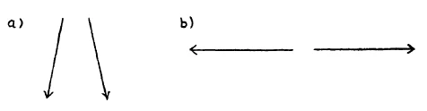

Da heute noch einmal Gelegenheit ist, zu Ihnen gerade als zu den Freunden der anthroposophischen Bewegung zu sprechen, bevor ich abreise, so möchte ich dem nachkommen, was mir in gewisser Beziehung ein Herzenswunsch ist: einiges zu besprechen, was jetzt notwendig ist zu besprechen. Vielleicht wird ja das meiste von dem, was ich gerade heute zu sagen habe, eine Art Wiederholung sein von Dingen, die öfter aus den verschiedensten Gesichtspunkten heraus erwähnt worden sind, die heute auch schon eine Rolle spielen in den Betrachtungen, die in öffentlichen Vorträgen dargestellt werden. Aber aus gewissen Gründen heraus ist es doch notwendig, daß wir uns über einige Dinge heute noch einmal unterhalten. ^musm01

Es muß ja, wie ich oftmals betont habe, durchaus verstanden werden von einer genügend großen Anzahl von Menschen, wenn der Niedergang, in den wir uns hineingeritten haben als gegenwärtige zivilisierte Welt, nicht zum völligen Ruin führen soll, daß die gegenwärtige Zivilisation durchtränkt werden muß mit gewissen Impulsen, die nur aus der geisteswissenschaftlichen Erfassung der Welt im weitesten Umfange kommen können. ^7vorft

Der Materialismus, der heraufgezogen ist seit den letzten drei bis vier Jahrhunderten in der europäischen Welt, der dann seinen Höhepunkt erlangt hat im 19. Jahrhundert und sich überschlagen hat im 20. Jahrhundert, dieser Materialismus hat ja eine Eigentümlichkeit, die besonders paradox sich ausnimmt, wenn man nicht richtig auf die Gründe einzugehen weiß, um die es sich dabei eigentlich handelt. Dieser Materialismus hat nämlich die Eigentümlichkeit, daß ihm völlig versagt ist, die materielle Welt in ihrer Wirklichkeit zu erkennen. Ich habe Ihnen ja vielleicht auch hier schon ein Beispiel dafür angeführt. Überall findet man aus der materialistischen Denk weise der neueren Zeit heraus die Anschauung vertreten, die eine breite Offentlichkeit ergriffen hat, daß unser Herz innerhalb unseres Organismus eine Art von Pumpe sei, welche das Blut durch den Organismus pumpt. In den mannigfaltigsten Varianten findet man diese Anschauung von dem Pumpwerk des menschlichen Herzens heute ausgebaut. Nun ist ja die Sache nicht so, sondern dasjenige, was Wirklichkeit ist, das muß so aufgefaßt werden, daß man sagt: Unser ganzes rhythmisches Zirkulationssystem ist ein Lebendiges, und nicht irgend etwas, was zu vergleichen ist mit irgendwelchen Kanälen oder dergleichen, durch die Wasser fließt, das durch ein Pumpwerk in seinen Kreislauf getrieben wird. Unser rhythmisches Zirkulationssystem, unser Blutsystem ist ein Lebendiges. Es wird in seiner Lebendigkeit erhalten durch die verschiedenen Faktoren, von denen die gröbsten sind: Atmung, Hunger, Durst und dergleichen, also Dinge, die durchaus geistig-seelischer Natur sind. Es bringen ganz primäre Ursprünge unser lebendiges Blutsystem in rhythmische Bewegung, und das, was Bewegung des Herzens ist, rührt davon her, daß dieses Geistige sich einschaltet in diesen Blutrhythmus. Der Blutrhythmus ist das Primäre, Lebendige, und das Herz wird mitgerissen von diesem Blutrhythmus. Die Tatsachen sind also völlig entgegengesetzt dem, was heute von der gebräuchlichen Physiologie von allen Lehrkanzeln herunter verkündet und daher auch von der Schule und von frühester Kindheit an den Menschen eingepaukt wird. ^hwfenn

Wir müssen also sagen: Der Materialismus hat nicht einmal vermocht, das in Wirklichkeit zu erkennen, was die materiellen Vorgänge im menschlichen Organismus sind, die sich auf das Herz beziehen. Er hat gerade das Materielle völlig mißverstanden. Das ist aber nur ein Beispiel für viele. Gerade das Materielle ist absolut unerklärt geblieben unter dem Einflusse des Materialismus. Das Herz ist keine Pumpe, sondern es ist etwas, was man eher ansehen kann als ein Sinnesorgan, das einzuschalten ist in den menschlichen Organismus, damit der Mensch in seinem Unterbewußtsein durch das Herz eine Art unterbewußtes Wahrnehmen hat von seiner Zirkulation, so wie man durch das Auge eine Wahrnehmung hat von den Farben der äußeren Welt. Das Herz ist im Grunde genommen ein in die Blutzirkulation eingeschaltetes Sinnesorgan. Von alledem wird das völlige Gegenteil heute gelehrt. ^nonsef

Nun, das ist scheinbar ein recht in der Ecke stehendes Beispiel. Ich kann mir denken, daß mancher Philister heute geneigt ist zu sagen: Was soll das schon für Unheil anrichten, wenn die Menschen eine ganz falsche Ansicht über das Wesen des menschlichen Herzens haben! Eher wird man schon zugeben müssen, daß es eine ganz allgemein bedenkliche Bedeutung hat, wenn alle Ärzte eine falsche Ansicht über das Wesen des menschlichen Herzens haben. Denn ob die Ärzte eine richtige oder falsche Ansicht über das Herz haben, davon hängt doch vieles im menschlichen Leben ab. — Aber so ist es ja mit andern Dingen auch. Und dadurch, daß alle Dinge im Leben zusammenhängen, dadurch ist die Menschheit heute geradezu erfüllt von lauter verkehrten Gedanken, von ganz inversen Gedanken. Und man könnte glauben, wenn man nur wollte, daß das Hängen in verkehrten Gedanken nun überhaupt unser ganzes Denken ruiniert. Das tut es nämlich auch. Unser Denken wird gründlich ruiniert dadurch, daß wir uns auf den verschiedensten Gebieten gewöhnen, weil es uns eingepaukt wird von unserer Kindheit an, das Gegenteil von dem Wirklichen zu denken. Wir gewöhnen uns dadurch niemals ein sicheres, zielbewußtes Denken an. Denn wie kann ein zielbewußtes Denken herauskommen zum Beispiel im sozialen Leben, wenn man in den Dingen, wo vor allen Dingen die Wahrheit gesucht werden muß, auf dem entgegengesetzten Wege ist? ^uhkqxv

Aber sehen Sie, gewisse Dinge bleiben überhaupt heute dem Menschen verschlossen, die wichtig sind zu wissen. Wenn heute in den gebräuchlichen Anstalten, in den physiologischen, biologischen Laboratorien oder Kliniken oder sonstigen Anstalten der menschliche Organismus untersucht wird, so untersucht man, sagen wir, das Gehirn, indem man es Stück für Stück, so wie es zunächst ausschaut, analysiert, und man untersucht die Leber, indem man sie geradeso analysiert. Aber indem man das tut, sieht man niemals auf etwas, was ganz spezifisch ist für das Verständnis des Menschen. Unsere ganze heutige Hauptesorganisation und alles das, was von derselben beherrscht wird, ist etwas wesentlich anderes als unser übriger menschlicher Organismus. ^xztvca

Was da zugrunde liegt, will ich Ihnen auf folgende Weise zeigen: Es ist etwas, was Sie zeichnen können in der folgenden Weise. Ich will allmählich zu dem, was ich eigentlich sagen will, hinführen. Sie können sagen: Der Mensch hat zwei Wahrnehmungsorgane, deren Wahrnehmungsrichtungen etwa diese sind (siehe Zeichnung, a). Und in einem gewissen Verhältnis zu diesen Wahrnehmungsrichtungen stehen zwei andere Wahrnehmungsrichtungen, die, wenn ich sie schematisch zeichnen will, so zu zeichnen sind (b): ^ke3n4u

 ^4buyfy

Das sind vier Wahrnehmungsrichtungen, die der Mensch hat, deren Linien so verlaufen, wie ich es hier in dieser Weise aufgezeichnet habe. ^8glg1p

Ich habe absichtlich nicht gesagt, wo am menschlichen Organismus diese Wahrnehmungsrichtungen liegen. Wenn ich hier nichts zeichne als zwei Richtungen (a), die man gewissermaßen ausstreckt und mit denen man wahrnimmt, und da zwei andere (b), durch die man seitlich wahrnimmt, so ist es völlig gleichgültig, ob das hier die Gefühls- oder Empfindungsrichtungen sind, die durch meine zwei Beine gehen, und ob das da die Gefühlsrichtungen sind, die durch meine Arme gehen. Da haben Sie etwas Zusammenstimmendes. Ich nehme gewissermaßen meine eigene Schwere wahr, indem ich mit meinen zwei Beinen auf dem Boden stehe. Da nehme ich wirklich etwas wahr. Und ich nehme etwas wahr jedesmal, wenn ich auch nichts berühre, wenn ich meine Hand, meinen Arm ausstrecke. Das kann ich so zeichnen (a). Aber ich kann auch etwas ganz anderes meinen mit derselben Zeichnung. Denken Sie sich, ich habe die Horizontale, dann kann ich mit diesen beiden Richtungen die beiden Augenachsen meinen, dann zeichne ich die beiden Augenachsen so hin. Und mit dieser Richtung (b) kann ich die Ohrenrichtung meinen, und ich kann dasselbe Schema für Augen- und Ohrenwahrnehmungen haben. Das eine Mal habe ich den ganzen Organismus, nur im rechten Winkel gedreht, im Kopfe, das andere Mal in dem übrigen Organismus drinnen. Von einem gewissen höheren Gesichtspunkte aus ist beides dasselbe. Unsere zwei Beine sind nur fleischgewordene Richtungen des Wahrnehmens, die wir in einer geistigeren Weise auch haben, indem sie sich vom Gehirn durch die Augen ausstrecken und da Farben wahrnehmen, während wir sonst die Schwere wahrnehmen und alles, was damit zusammenhängt. Wir sehen unser Gewicht und wir treten auf die Farben, könnten wir etwa sagen, wenn wir die beiden Dinge, aber ganz organisch, miteinander verwechseln wollten. Ich höre die Kreide, ich berühre das C oder Cis. Das ist nur ein gradueller Unterschied. Das, was da am Kopfe ist, ist im rechten Winkel gedreht, geistiger, das andere ist in der Vertikalebene und ist materiell. Aber beides geht zum Schluß auf dasselbe zurück. Nur von dem einen weiß ich, von dem, was meine Augen betreten an Farben, was meine Ohren berühren an Tönen, von dem weiß ich, das ist in meinem gewöhnlichen Bewußtsein. Von dem, was meine Beine sehen von den Verhältnissen der Schwere, und von dem, was meine Arme hören von allen andern Verhältnissen, die da in Betracht kommen, ist alles im Unterbewußtsein. Und das, was da im Unterbewußtsein ist, das sind die Verhältnisse des Kosmischen. Mit diesem ganzen Uhnterbewußtsein weiß ich das Kosmische, weiß ich das Verhältnis der Erde zu den andern Weltenkörpern, weiß ich dasjenige, was mit der Schwere universell zusammenhängt. Mit den Armen höre ich die Sphärenmusik, nicht natürlich mit den Ohren. So daß wir sagen können: Wir bestehen aus unserem sogenannten niederen Organismus, der ein unterbewußtes kosmisches Bewußtsein hat, und aus unserem Haupte, das ein irdisches Bewußtsein, aber eben ein «bewußtes» Bewußtsein hat. Auf diesen Unterschied ist die ganze menschliche Organisation hingebildet. Wie wir äußerlich gestaltet sind, das hängt durchaus ab von diesen Gegensätzen. Und Sie wissen ja: Das, was wir heute als Kopf an uns tragen, das ist der umgestaltete Leib aus der früheren Inkarnation, dem früheren Erdenleben, während unser jetziger übriger Organismus zum Kopf im nächsten Erdenleben wird. Diese Metamorphose machen wir von einem Erdenleben zum andern durch. Der Kopf ist daher der übrige umgestaltete Organismus. Der ist gewissermaßen mehr vollkommen, mehr fertig. Und weil er das ist, sind die Beine so fein geworden, daß sie sich als Sehfühlfäden aus den Augen heraus erstrecken, um da höchst beweglich auf die Farben zu treten. Die Arme des vorigen Lebens sind so ätherisch geworden, daß sie sich jetzt bei den Ohren herauserstrecken und die Töne berühren. ^vjpry6

Nehmen Sie einmal diese konkreten Erkenntnisse des Menschen. Es ist ja gar nichts damit getan, wenn die Leute wissen, es gibt wiederholte Erdenleben und so weiter. Das sind schließlich Dogmen, und da ist es gleich, ob man Dogmen der katholischen oder evangelischen Kirche hat, oder ob man das Dogma von der Wiederholung der Erdenleben hat. Es beginnt das eigentliche Denken erst dann, wenn man in die konkreten Ereignisse eintritt, erst wenn man begreifen kann: Du schaust das menschliche Haupt an, da siehst du es als Umgestaltung deines Leibes aus dem vorigen Erdenleben, den du dir allerdings hauptlos denken mußt, denn das vorige Haupt ist die Umgestaltung eines Leibes in einem noch früheren Erdenleben. Aber in dem, was du jetzt als Haupt siehst, siehst du den umgestalteten Organismus des früheren Erdenlebens. Und was du jetzt siehst als übrigen Organismus, darin siehst du, was im nächsten Leben zum Haupte werden wird, wo sich die Arme so metamorphosiert haben werden, daß sie zu Ohren geworden sind, und die Beine sich so metamorphosiert haben werden, daß sie zu Augen geworden sind. Erst dann, wenn man so hineinschaut in das Materielle und es in seiner geistigen Umwandlung begreift, wenn man den Geist so hat, daß er in das Materielle hineinleuchten kann, dann erst ist dasjenige da, was die Menschheit heute notwendig braucht. Und erst wenn man den menschlichen Geist so organisiert hat, daß er nicht solche Torheiten verkündet, wie sie verkündet worden sind, namentlich in der zweiten Hälfte des 19. Jahrhunderts, als mögliche soziale Anschauungen, erst dann ist man wirklich reif dazu, solche sozialen Anschauungen zu gewinnen, die als Wirklichkeiten in die Welt hineingetragen werden können. Es ist heute notwendig, daß dieses gründlich durchschaut werde. Es ist eine ernste Angelegenheit, daß sich heute die Leute sagen: Dasjenige, was verehrt wird als die Wissenschaft, die sich heraufgebildet hat, das, was verkündet wird überall, das muß durch etwas anderes ersetzt werden. Es geht gar nicht anders. ^ofxemf

Es ist ein Unsinn, wie ich neulich auch in einem öffentlichen Vortrage sagte, von der Errichtung von Volkshochschulen zu reden und zu glauben, man könne das, was getrieben wird heute in unseren gewöhnlichen Hochschulen, in die Volkshochschulen verpflanzen. Das, was an unseren Hochschulen getrieben wird, das hat uns ja in diese Katastrophen hineingetrieben, weil es die wenigen führenden Persönlichkeiten als ihre materialistische Grundgesinnung gehabt haben; nun soll es in die ganzen Massen hineingetragen werden, das heißt, es sollen Millionen hineinreiten in die Katastrophen, in die sie hineingeritten worden sind durch eine falsche geistige Führung von wenigen. Was für wenige nichts taugt, soll jetzt für viele ausgestreut werden. So bequem geht es doch nicht mit der Verbreitung der Volksbildung, daß man das, was an Universitäten lebt, einfach hinausträgt, denn dadurch trägt man hinaus, was für den Menschen überhaupt ungeeignet ist. Das klingt heute radikal, aber es gehört zu dem Allernotwendigsten, daß das unbedingt durchschaut wird,wenn man nur im Entferntesten daran denkt, daß der Niedergang nicht weiterrollen soll, sondern daß ein Aufbau zustande kommen soll. ^h685zr

Das ist es, wovon man möchte reden können in Worten, die wirklich die Herzen ergreifen. Es müssen möglichst viele Herzen ergriffen werden von diesen konkreten Wahrheiten. Deshalb war es mir ein solches Bedürfnis, in öffentlichen Vorträgen darauf hinzuweisen, wie wir es doch schon dazu gebracht haben in unserer Waldorfschule, daß in einzelnen Zweigen Anthroposophie positiv hineingetragen wurde in den Geschichtsunterricht. Ebensogut konnte ich auch den anthropologischen Unterricht in der fünften Klasse erwähnen, wo auch Anthroposophie wirkte, wirkte, nicht indem man den Kindern Anthroposophie lehrt - das würde uns nicht einfallen -, sondern indem man belebt den Unterricht durch das, was aus der Anthroposophie kommt, indem man Anthroposophie in den Unterrichtsstoff einfließen läßt. Das wirkt weckend auf die Seelen der Kinder; sie werden ganz anders durch diese Einflüsse. Es wäre eine Bequemlichkeit, wenn man Anthroposophie in den Schulen einfach lehren wollte. Darauf kommt es wahrhaftig nicht an, sondern darauf, daß man dasjenige, was man lehrt, den Kindern zu beleben versteht durch Anthroposophie. Dazu allerdings muß die Anthroposophie in einem selbst völlig lebendig werden, und das ist ja etwas, was so unendlich schwierig geht: daß die Anthroposophie lebendig wird in den Menschen. Denn es wäre heute schon möglich in einer gewissen Beziehung, daß die mannigfaltigsten Zweige nicht etwa nur der Wissenschaft, sondern ich sage geradezu: die mannigfaltigsten Zweige des Lebens durchdrungen wären von dem, was durch das Leben in der Anthroposophie kommen kann. ^xlmrfa

Das ist so eine allgemeine Betrachtung. Ich will eine spezielle Betrachtung daran knüpfen, aus der Sie werden ersehen können, wie die Dinge zusammenhängen, die hier in Betracht kommen. ^6lb4zc

Sie wissen Ja, in der heute weitverbreiteten marxistischen Weltanschauung und Lebensauffassung, die ihren radikalen Ausdruck in dem weltzerstörenden Leninismus und Trotzkismus findet, in dieser marxistischen Lebensauffassung spielt eine große Rolle die Anschauung, die man die «materialistische Geschichtsauffassung» nennt, und namentlich das Dogma von der grundlegenden Wirkung der Produktionsverhältnisse. Es ist ein Dogma, zu dem heute Millionen von Menschen aus dem Proletariat sich bekennen, das Dogma, daß dasjenige, was Sitte, Recht, Wissenschaft, Religion und so weiter ist, etwas ist, was wie ein Rauch, wie eine Ideologie — Sie können in den «Kernpunkten» Genaueres darüber nachlesen — aufsteigt aus den Produktionsverhältnissen, während die Produktionsverhältnisse das einzig Wirkliche wären, dasjenige, was man in der Geschichtsbetrachtung zugrunde zu legen habe. ^l7qpi2

Ich hielt es von ganz besonderer Wichtigkeit seinerzeit — und eigentlich hängt das zusammen mit meiner ganzen Meinung, daß ich etwas habe tun können in der Berliner Arbeiter-Bildungsschule, von dem man hätte ausgehen können -, in proletarischen Kreisen über diese Anschauung von der alleinigen Wirksamkeit der Produktionsverhältnisse im menschlichen Werdegang aufklärend zu sprechen, und ich habe daher nicht materialistische Geschichtsauffassung, sondern die Wahrheit zu verkünden versucht. Das war dann ja auch der Grund, warum ich herausgeworfen wurde, weil das geradeso damals den Führern widerstrebt hat wie jetzt die Idee der Dreigliederung, weil tatsächlich innerhalb der sozialistischen Bewegung dazumal und heute noch ein viel blinderes Autoritätsgefühl und Autoritätsglaube war und ist als in der Katholischen Kirche. ^tdyebc

Aber Sie sehen, dasjenige, um was es sich gerade handelt, das ist, zu durchschauen, richtig zu durchschauen, wie die Dinge auch sozial in der Welt zusammenhängen. Wer eine richtige Einsicht gewinnt in das, was ich angedeutet habe in meinem Buche «Von Seelenrätseln» als die naturgegebene Dreigliederung des menschlichen Organismus, wer diese Gliederung des Menschen in den Nerven-Sinnesorganismus, den rhythmischen Organismus und den Stoffwechselorganismus versteht, der denkt so, daß er dieses Denken dann auch auf das soziale Leben anwenden kann. Wenn man so etwas tut, so kommen die Toren von heute und sagen: Du machst Analogien; weil der menschliche Leib dreigegliedert ist, gliederst du auch den sozialen Organismus. — Das ist Unsinn! Das tun die «Kernpunkte» gewiß nicht, da wird nicht mit Analogien gearbeitet. Es wird bloß gesagt, daß, wenn einer sein Denken aus den spanischen Stiefeln herauskriegt, in die es durch die heutige Gelehrsamkeit und namentlich das heutige öffentliche Leben eingeschnürt ist, er dieses Denken dadurch, daß es auf Wirklichkeitsgemäßes kommt im menschlichen Organismus, so weit frei bekommt, daß er auch im Sozialen ordentlich denken kann, während das Denken, das das Gehirn des Menschen neben die Leber legt und alles als gleiche Substanzen untersucht, niemals zu einer vernünftigen Einsicht kommen kann. ^469r4v

Wenn man so äußerlich Analogien bilden würde, dann würde man sagen: Wir haben die Dreigliederung des sozialen Organismus und die Dreigliederung des menschlichen Organismus. Der Kopf ist das geistige Organ, also muß man es vergleichen mit dem geistigen Leben des dreigliedrigen Organismus; das rhythmische System, das bringt Einklang zwischen den verschiedenen Funktionen als Herztätigkeit, als Atmungstätigkeit — also Rechtsteil des sozialen Organismus; den Stoffwechsel, das Gröbste, Materiellste, dasjenige, worauf der Mystiker mit einer gewissen Verachtung herabsieht, trotzdem auch er erklärt, daß er essen und trinken muß, den vergleicht man mit dem wirtschaftlichen Leben. ^pzsa6k

Das ist aber nicht so! Ich habe öfter darauf aufmerksam gemacht bei andern Gelegenheiten, daß die Dinge eben in Wirklichkeit anders liegen, als man nach bloßen Analogien glaubt, daß man zum Beispiel nicht sagen kann, die Sommerzeit lasse sich mit dem Wachzustand der Erde vergleichen und die Winterzeit mit dem Schlafzustand. Die Wahrheit ist eine andere. Im Sommer schläft die Erde, im Winter wacht sie. Das habe ich ja in seinen Einzelheiten ausgeführt. ^whp95f

Aber so ist es auch, wenn man auf die Wirklichkeit und nicht auf Analogien geht, bei dem Vergleichen des sozialen Organismus mit dem menschlichen Organismus. Da muß man vergleichen just das Wirtschaftsleben im sozialen Organismus mit der menschlichen Kopftätigkeit; dasjenige, was Rechtsleben ist, das muß man allerdings — weil es das Mittlere ist, so haben sich die Leute auch nicht geirrt bei der Analogie — mit der rhythmischen Tätigkeit vergleichen. Aber das Geistesleben, das muß man vergleichen mit dem Stoffwechsel. Also das Wirtschaftsleben ist zu vergleichen mit den geistigen Organen, das geistige Leben im sozialen Organismus mit den Stoffwechselorganen. Da hilft nichts. Das Wirtschaftsleben ist der Kopf des sozialen Organismus, und das geistige Leben ist Magen, Leber und Milz für den sozialen Organismus, nicht für den einzelnen individuellen Menschen. Das ist natürlich wieder viel zu unbequem, wenn man in spanischen Stiefeln steckt, daß man zu unterscheiden hat das soziale Leben und das Leben des einzelnen, des individuellen Menschen. ^j1bgu4

Hier kommt es abermals darauf an, durch Geisteswissenschaft vorbereitet auf die Wirklichkeit hinzusehen und nicht Analogien und vertrackteSymbolistik zu treiben. Dann kommt man schon auf mancherlei wichtige Dinge. Man kommt zum Beispiel darauf, daß man sich sagen kann: Ja, dann aber muß ja das Wirtschaftsleben, wenn es eigentlich der Kopf ist im sozialen Organismus, so wie der menschliche Kopf von dem übrigen Organismus zehren. Dann kann man nicht sagen, Sittlichkeit, Erkenntnis, religiöses Leben sei eine Ideologie, die aufsteigt aus dem Wirtschaftsleben. Nein, ganz im Gegenteil! Das Wirtschaftsleben ist etwas, was abhängt von dem geistigen Leben, vom Stoffwechsel des sozialen Organismus, wie der menschliche Kopf abhängt vom Atmen, von Magen und Leber und Milz. Dann kommt man darauf, einzusehen, daß das Wirtschaftsleben dasjenige ist, was aufsteigt aus dem geistigen und religiösen Leben. Wenn der Mensch keinen Magen hätte, könnte er keinen Kopf haben. Gewiß könnte er auch keinen Magen haben, wenn er keinen Kopf hätte, aber schließlich wird der Kopf vom Magen genährt, und ebenso wird unterhalten das Wirtschaftsleben vom geistigen Leben und nicht umgekehrt. Daher ist das ein Irrwahn, ein furchtbarer Aberglaube, der heute sich als sozialistische Theorie über die ganze zivilisierte Welt zu verbreiten droht, weil niemand darauf bedacht war in den letzten Jahrhunderten, die Wahrheit zu erforschen, sondern jeder nur aus den Emotionen heraus dasjenige als Wahrheit verkündigte, was ihm nach seiner Klasse und nach seinem Standpunkt angemessen war. Jetzt erst sieht man ein, welcher Irrwahn es ist, die Produktionsverhältnisse als die Grundlage für das geschichtliche Geschehen anzusehen. Denn man kommt jetzt darauf, wirklich die Tatsachen zu vergleichen, nicht Analogien zu verbreiten. Man schaut jetzt in der richtigen Weise hin und sieht ein, daß, wenn der Stoffwechsel untergraben wird im menschlichen Organismus, der Kopf leidet, daß also jedesmal, wenn das Ethische, das Religiöse, das Erkenntnisleben untergraben wird, im sozialen Organismus nicht ein gesunder Stoffwechsel wirkt und das Wirtschaftsleben dann zugrunde gehen muß. Vom Wirtschaftsleben hängt gar nichts ab, sondern primär hängt alles ab von Anschauungen, von Ideen, von dem geistigen Leben der Menschen. ^y4rki8

Und so wie unser Kopf eigentlich fortwährend stirbt — ich habe das in andern Vorträgen ausgeführt -, so wie wir unseren Kopforganismus nur dadurch unterhalten, daß er in fortwährendem Absterben ist, gegen das sich der übrige Organismus auflehnt, so ist es mit dem Wirtschaftsleben. Das Wirtschaftsleben ist dasjenige, welches den geschichtlichen Fortgang der Menschheit fortwährend zum Absterben bringt, das nicht etwa das übrige aus sich hervortreibt, sondern nur den Tod von allem hervorbringt. Und dieser Tod muß fortwährend wieder ausgeglichen werden durch dasjenige, was im geistigen Organismus hervorgebracht wird. Also gerade das Umgekehrte ist wahr. Wer im materialistischen Sinne behauptet, das Wirtschaftsleben sei die Grundlage von dem, was fortschreitet, sagt nicht das Wahre. Die Wahrheit ist, daß das Wirtschaftsleben die Grundlage dessen ist, was immer wiederum in Etappen abstirbt und dessen Absterben vom Geiste aus ausgeglichen werden muß. So vorzugehen, wie jetzt in Rußland vorgegangen wird, bedeutet, der Welt zum Absterben zu verhelfen. Es gibt keine andere Möglichkeit, wenn man in dieser Weise fortarbeitet, als der Welt zum Absterben zu verhelfen, aus dem einfachen Grunde, weil in dem, was man da verrichtet, die Gesetzmäßigkeit des Absterbens drinnen liegt. ^wz5mu4

Sie sehen, welche sozial eminent wichtigen Dinge hier vorliegen. Das war es, was ich immer wieder in den verschiedensten Tönen versuchte, seit den zwei Jahrzehnten, seitdem Anthroposophie unter uns getrieben wird, durch die verschiedenen Vorträge durchleuchten zu lassen und klarzumachen, daß es sich bei uns wahrhaftig nicht darum handelt, eine innere seelisch-wollüstige Weltauffassung und Lebensanschauung, eine Art geistigen Snobismus zu kultivieren, sondern daß es sich handelt um dasjenige, was das Zeitalter als seinen wichtigsten Impuls braucht. ^wvxfuo

Ich wollte dies heute noch einmal vor Ihnen aussprechen in einer wieder etwas andern Form, zusammenhängend mit verschiedenen Dingen, die uns aufklären können über das Wesen des Menschen, weil es jetzt wichtig ist, daß diejenigen, die als Freunde unserer anthroposophischen Bewegung sich bekennen, den Zusammenhang dieser anthroposophischen Bewegung mit dem, was sonst jetzt unter uns vorgeht, einsehen. ^op8pjd

Es ist ja, da jetzt oftmals alles in einer recht entstellten Form besprochen wird, was von mir oder andern Freunden ausgeht, es ist ja schwer, einer großen, auch anthroposophischen Versammlung so ganz frei die Dinge zu sagen, aber es muß, weil man ja keine andere Gelegenheit hat, im engeren Kreise so ohne weiteres zu sprechen, und weil über die Dinge gesprochen werden muß, auf einiges aufmerksam gemacht werden. Wir müssen uns dessen bewußt sein, besonders hier in Stuttgart, daß dasjenige, woran wir gehangen haben seit zwei Jahrzehnten als anthroposophischer Bewegung, eben doch in ein neues Stadium getreten ist, und daß wir dadurch, wenn wir es ehrlich meinen mit dieser Bewegung, die Verpflichtung auf uns genommen haben, mitzugehen mit diesem Umschwung, uns anzupassen diesem Umschwung. Sie müssen das nur ordentlich erfassen, daß, indem durch unsere Freunde Molt, Kühn, Unger, Leinhas und einige andere hier der Versuch unternommen worden ist, praktisch die Konsequenz der anthroposophischen Lebensauffassung zu ziehen, daß dadurch eben etwas geschehen ist, was uns alle angeht, was uns alle so angeht, daß wir uns dafür interessieren müssen in unserem ganzen Verhalten. Es ist so, daß bis dahin eigentlich — fassen wir das nur ganz scharf ins Auge — die anthroposophische Bewegung eine Weltenströmung war. Eine geistige Weltenströmung ist eben etwas Geistiges. Etwas Geistiges, das geht seinen Weg. Es mögen sich Cliquen bilden, es mögen sich noch so verwerfliche kleine Zusammenrottungen bilden, die persönliche und was weiß ich welche Interessen noch haben, selbst über einen solchen Un-«Rat» wie den Max Seiling kann eine geistigeBewegung hinweggehen. Man muß es ja natürlich in dieser oder jener Weise richtig behandeln, aber so lange es sich um eine bloß geistige Bewegung handelt, kann darüber hinweggegangen werden. Aber nun haben wir doch drei Dinge herausgebildet aus dieser geistigen Bewegung. ^9ud9ts

Das erste war dasjenige, was sich an meinen Aufruf vom vorigen Jahr angeschlossen hat. Das ist übergegangen in die ja heute noch fragwürdige Dreigliederungsbewegung, in den Bund für Dreigliederung des sozialen Organismus, der eigentlich dasjenige, was gewollt worden ist, bis jetzt auch nicht in annähernder Weise hat erreichen können. Denn das, was mit dem Aufruf gemeint war, ist ja in einem gewissen Sinne abgelehnt worden, und es wäre gut, wenn ein vollständiges Bewußtsein davon vorhanden wäre, daß es abgelehnt worden ist, daß das wenigste davon erfüllt ist, was mit diesem Aufruf gemeint war. ^kd53ek

Ich bin dadurch selbstverständlich zu manchem genötigt. Als zum Beispiel in Dornach die Idee auftrat, man solle einen weiteren Aufruf machen, der im internationalen Leben klarmachen würde, was Dornach der Welt bedeutet, da mußte ich den Freunden klarmachen: Ja, draußen im gewöhnlichen Leben, das aber jetzt seinem Zusammenbruche entgegengeht, da ist man gewöhnt, Aufruf an Aufruf, Programm an Programm herauszusetzen. Das kann man nicht aus der anthroposophischen Bewegung heraus. Da handelt es sich darum, einzusehen, daß es in einer gewissen Weise im höchsten Grade ungesund ist, wenn irgend etwas gemacht wird, was nicht gelingt. Da handelt es sich darum, daß man tatsächlich in der allerpräzisesten Weise die Chancen des Gelingens ins Auge faßt, daß man nicht bloß das, was einem gerade einfällt, tut, sondern daß man nur das tut, was gelingen kann. Deshalb sagte ich dazumal das Wort, das wichtig ist und das ich bitte zu erwägen: Es wird mir nicht einfallen, in einer ähnlichen Weise wiederum einen Aufruf zu machen, denn ein zweites Mal darf nicht mit einem Aufruf dasselbe geschehen, was mit dem ersten geschehen ist. — Ich konnte hier noch geschehen lassen den Kulturratsaufruf, der nicht von mir selbst gemacht worden ist, aber man muß sich klar sein, daß die Dinge anfangen, ungeheuer viel ernster zu sein, als der Mensch heute geneigt ist, sie aufzufassen, wenn etwas wie die anthroposophische Bewegung im Hintergrunde ist. ^sp1ggx

Nun haben wir drei Dinge gewissermaßen herausgebildet aus der anthroposophischen Bewegung, von denen jedes etwas ganz anderes darstellt: ^jxlzc1

Die Dreigliederung aus jenem Aufruf — wir müssen daran arbeiten, denn sie wird zum Teil abgelehnt; das zweite Glied ist die Waldorfschule; das dritte die finanzielle, kommerzielle, industrielle Unternehmung «Der Kommende Tag». ^c24vh2

Nun bin ich in früheren Zeiten, als wir nur die anthroposophische Bewegung hatten — ich spreche heute nur von Stuttgart -, hierhergekommen nach Stuttgart, da war ich ja vielleicht drei bis vier Tage da, aber Sie wissen, mit wievielen Menschen ich immer einzeln sprechen konnte. Das alles waren Dinge, die, wie jetzt der Erfolg zeigt, von einer gewissen Bedeutung waren. Es war nicht bedeutungslos, daß dasjenige, was sich mittlerweile ereignet hatte - man wird mich verstehen, wenn man mich verstehen will -, in solchen Unterredungen mit einzelnen Persönlichkeiten wiederum zurechtgerückt werden konnte. Dann konnte die Sache wieder fortgehen bis zum nächsten Mal. Nun, so wie die Sachen unmittelbar stehen, hat man eigentlich jetzt, nachdem sich diese äußeren Dinge herausgebildet haben, mit Sitzungen vom Morgen bis zum Abend, ja bis in die Nacht hinein zu tun, und es kann nicht die Rede sein davon, jene alten Gewohnheiten fortzusetzen, die da waren, als wir noch eine anthroposophische Bewegung waren. Von alledem empfinden sehr viele nichts anderes, als daß es eine Unannehmlichkeit sei, daß es nicht mehr ist wie früher. Es ist aber notwendig, auf den ganzen Umschwung hinzuschauen und sich wirklich zu sagen: Es ist etwas anders geworden seit dem Frühling des vorigen Jahres, und dem muß Rechnung getragen werden. ^x5eso0

Nun wird es ja nicht so bleiben können, wie es jetzt ist, aber daß es nicht so bleiben kann, dazu muß mitgearbeitet werden. So kann es aus dem Grunde nicht bleiben, weil alles das, was geschieht, sei es für die Waldorfschule, sei es für den Dreigliederungsbund, sei es für den «Kommenden Tag», ja auf der Grundlage der geistigen Arbeit entsteht. Ohne die geistige Arbeit, die geleistet worden ist und weiter geleistet werden muß, hat ja das alles keinen Sinn. Diese geistige Arbeit muß dem Ganzen Konfiguration, muß dem Ganzen Kraft und Inhalt geben. Wenn wir dazu kommen, wozu wir kommen würden, wenn die Sache so weitergehen würde, so wäre die Folge, daß die jetzigen Einrichtungen die ursprüngliche geistige Bewegung auffressen würden; da entziehen wir der Sache ihre ursprünglichen Grundlagen. Es darf das, was herauswächst aus der anthroposophischen Bewegung, nicht auffressen diese anthroposophische Bewegung selbst. ^blgp12

Sie sehen, ich muß sehr ernste Dinge heute besprechen, und es werden mich einige wenigstens verstehen. Aber die Sache kann nicht anders werden, wenn wir nicht das eine Realität sein lassen, daß eben anthroposophisch wirklich viele Jahre, jahrzehntelang gearbeitet worden ist. Diese Arbeit muß eine Realität sein. ^dgu4ds

Nun bitte ich Sie, zu dem hinzuzunehmen eines: In der Welt gibt es viel Kampf, aber wo ist eigentlich am meisten Kampf? Er spielt sich nur in einer gewissen Form ab, man merkt es nicht, aber er ist am allermeisten im geistigen Leben. Und zum Beispiel in dem, was sich anthroposophische Bewegung nennt, da ist ja kein Ende des Kampfes. Als aus den alten Usancen heraus - man mußte anknüpfen an sie, Sie wissen ja warum — unsere Bewegung sich gestaltete, das heißt, viele von den Leuten mit den alten theosophischen Gewohnheiten sich anschlossen an unsere Bewegung, hatte ich die Empfindung, daß ein Herr, der damals ein ganz besonders heftiger Verteidiger gerade unserer Richtung war, sehr bald mit allen möglichen andern Leuten streiten werde; denn der Kampf ist etwas, was sich da gerade furchtbar herausbildet. Ja, ich habe sogar immer betont: Der Herr, der so ein ganz waschechter Theosoph ist, er wird nicht nur mit andern Leuten streiten, sondern seine linke und seine rechte Hälfte werden in einen furchtbaren Kampf kommen. Man wird erleben, daß die linke Seite dieser Persönlichkeit mit der rechten in der furchtbarsten Weise zankt. ^zrpccq

Es muß eben selbstverständlich der andere Pol entwickelt werden, der Pol, der die fortwährend vorhandenen, aus dem Wesen jeder geistigen Bewegung entstehenden Kämpfe — weil jede geistige Bewegung auf die Individualität hinarbeitet - überwinden muß. Es muß der andere Pol vorhanden sein, der Pol der Menschenverständigung, der Pol, der darin besteht, daß man in den Menschen eindringen kann, daß man in die Lebensimpulse eines andern Menschen sich vertiefen kann und so weiter. Es muß möglich sein, daß dasjenige, was wir jetzt als Dreigliederungsarbeit, was wir als «Kommender Tag», was wir als Waldorfschule treiben, getragen wird von einer guten, moralischen Grundlage unserer anthroposophischen Bewegung hier in Stuttgart, von derjenigen moralischen Grundlage, die erarbeitet worden ist seit Jahrzehnten, oder wenigstens erarbeitet werden sollte. Davon muß es getragen sein, denn nur so kommen wir weiter und können uns wiederum ein Gleichgewicht zurückerobern zwischen dem Leben in Sitzungen und dem notwendigen geistigen Arbeiten, das doch die Grundlage bilden muß. Aber wir kommen natürlich nicht dazu, wenn fortwährend solche Dinge sich abspielen hier wie etwa, daß man gesagt bekommt: Da ist wiederum etwas Schreckliches geschehen, da ist ein Mensch, der stänkert fortwährend, der ist schädlich für alle übrigen. - Das mag sein, das kann richtig sein. Aber mir ist es bis jetzt, trotzdem mir solche Dinge während meiner jetzigen Anwesenheit unzählige Male entgegengetreten sind, nicht gelungen, eine solche Sache so weit zu verfolgen, daß, wenn ich zu dem zweiten gekommen bin, er mir dasselbe gesagt hätte wie der erste. Und beim fünften, sechsten wurde es schon das Gegenteil von dem, was mir der erste verkündet hatte. Ja, ich erzähle nur Tatsachen. Ich will keine Kritik üben, ich will nicht tadeln oder loben, wirklich auch das erstere nicht, aber es ist so. Dasjenige aber, was notwendig ist, daß es gerade auf anthroposophischem Boden sich entwickele — ich habe es ja öfter ausgeführt -, ist ein absolutes, treffsicheres Wahrheitsgefühl. Es ist sehr schwierig, in all diesen Dingen weiter zu arbeiten, wenn nicht die Grundlage da ist von Wahrheit, von unmittelbar wirklicher Wahrheit. Ist diese Grundlage von wirklicher Wahrheit da, dann muß es doch so sein, daß, wenn irgend etwas an einen herantritt und man verfolgt es noch bei dem fünften oder sechsten, es sich noch in derselben Weise darstellt. Aber ich erlebe, daß mir etwas, was «furchtbar» ist, mitgeteilt wird und jeder, den ich frage, etwas anderes sagt. Ich kann ja selbstverständlich nicht die Dinge, die ich von andern Quellen her weiß, im äußeren Leben anwenden; das habe ich oftmals ausgeführt. Darum handelt es sich nicht, ob ich die Sache weiß oder nicht, ob das richtig sei oder nicht, sondern darum handelt es sich, ob der erste dasselbe sagt wie der sechste, siebente; nicht um mein Wissen handelt es sich. Ich lasse mir in der Regel keine Illusionen vormachen und frage auch gar nicht darum irgend jemand, sondern um ganz anderer Gründe willen. Mich interessiert gewöhnlich gar nicht sehr stark, was mir mitgeteilt wird, aber es handelt sich jetzt darum, daß ich hinschauen kann auf das, was der erste und was der siebente sagt, und da stellt sich sehr häufig heraus, daß der eine etwas sagt, und beim siebenten ist es eben das Gegenteil. Nun glaube ich, folgt mit einer gewissen Evidenz daraus etwas: daß eines davon nicht wahr ist. Das scheint mir doch daraus zu folgen. ^2ku89m

Ja, im äußeren physischen Leben, das ja jetzt gerade deshalb dem Niedergang entgegengeht, hat man immer nicht bemerken wollen die Funktion, die einschneidende Bedeutung der Unwahrheit. Auch wenn sie nicht beabsichtigt ist, wirkt die Unwahrheit doch zerstörend. Auf dem Boden, auf dem anthroposophisch orientierte Geisteswissenschaft steht, müßte man unter allen Umständen einsehen: Das, was im physischen Leben eine zerstörende Bombe ist, das ist im Geistigen eine Unwahrheit. Sie ist eine zerstörende Kraft, ein zerstörendes Instrument, und zwar ein ganz real zerstörendes Instrument. Es würde tatsächlich wiederum möglich sein, trotz der vielen Gründungen zu großer fruchtbarer Arbeit zu kommen auch auf geistigem Gebiete, wenn man diesen Dingen einige Aufmerksamkeit zuwenden würde, aber eine sachliche Aufmerksamkeit, nicht eine persönliche Aufmerksamkeit. ^hnzz6h

Sie wissen, es ist nicht meine Art, Philippiken zu halten; Moralpauken zu halten ist ja nicht meine Art. Aber ich muß Tatsachen, die mir insbesondere jetzt stark entgegengetreten sind, wirklich einmal zur Sprache bringen, weil wir in einer ernsten Lage drinnenstehen. Wir stehen vor Unternehmungen, die nicht mißlingen dürfen, die gelingen müssen, bei denen gar keine Rede davon sein kann, daß sie irgendwie mißlingen, von denen wir heute sagen müssen: sie werden gelingen. Aber daß sie nicht die ursprüngliche anthroposophische Bewegung auffressen, das hängt davon ab, daß ein jeder wirklich mitarbeitet daran, daß das, was sich moralisch ergeben sollte aus der jahrzehntelangen Arbeit, wirklich da sei. Dazu muß jeder mitarbeiten. Das ist schon einmal notwendig, daß dazu jeder mitarbeitet. ^03ltzc

Mir tut es im Herzen weh, daß ich fast keinen der Wünsche befriedigen kann, die jetzt so zahlreich an mich herantreten. Aber ich muß immer die Freunde abweisen, weil ja einfach die Zeit sich nicht verdoppeln läßt und nicht bloß vom Morgen zum Abend, sondern in die Nächte hinein Sitzungen sind. Man kann nicht zu gleicher Zeit mit einzelnen Menschen sprechen selbstverständlich. Aber wenn nicht — die Dinge hängen zusammen — durch eine Besinnung im weitesten Kreise unserer Mitarbeiterschaft diese Dinge weggenommen werden, die so hineinspielen in alles Leben hier und die eben charakterisiert sind mit dem, was ich eben jetzt charakterisiert habe, wenn diese Dinge nicht durch Insichgehen jedes einzelnen gerade heute an diesem Orte aus der Welt geschaffen werden, so ist es gar nicht möglich, daß man die Zeit findet, um die wirklich grundlegende geistige Arbeit zu leisten. Dasjenige, wozu Anthroposophie geführt hat, das wird gelingen. Aber wenn in gewissen Dingen nicht Änderungen eintreten, dann wird es die ursprüngliche geistige Bewegung auffressen und dann würde man durch den Willen der sogenannten Träger dieser geistigen Bewegung einen neuen Materialismus haben, indem eben die geistige Bewegung, die zugrunde liegt, zum Absterben gebracht worden ist. Der Geist will gepflegt sein, wenn er nicht zum Absterben kommen soll. Und der Materialismus besteht nicht durch sich selber etwa, den Materialismus kann man nicht begründen, geradesowenig wie man einen Leichnam macht. Ein Leichnam entsteht, wenn der Organismus von der Seele verlassen wird. So auch kann alles dasjenige, was hier aus geistigen Grundlagen, aus Beseeltem heraus geschaffen wird, ein bloß Materielles werden, wenn nicht die Neigung dazu da ist, das Geistige nun wirklich zu pflegen. Dazu ist aber notwendig, daß vor allen Dingen die moralische Grundlage, die ethische Grundlage, die hat erarbeitet werden können, aufmerksam ins Auge gefaßt wird. Vor allen Dingen muß aufmerksam ins Auge gefaßt werden, daß man sich nicht Illusionen hingibt, daß man sich nicht mit Beurteilungen zufrieden gibt, die einem bequem sind, sondern daß man rücksichtslos auf das Leben hinschaut. ^31xp69

Es ist wirklich sehr schlimm, wenn man zum Beispiel sagt: Dreigliederung ist ein schönes Ding, dem muß man anhängen, und weil man sich dann so wohl fühlt, sagt man: Ich gründe jetzt etwas, das ist ganz im Sinne der Dreigliederung; da bin ich dann ein braver Mensch. Ich kann mich als ein so braver Mensch fühlen, wenn ich etwas gründe, was ein Kern der Dreigliederung ist. — Moralisch sich die Finger ablecken vor lauter innerer Wollust, das kann man, wenn man so etwas macht, aber Wirklichkeitssinn braucht man deshalb nicht zu haben. Denn die Dreigliederungsidee ist gerade deshalb eine so wirklichkeitsgemäße Idee, weil man suchen muß, sie mit allen Kräften in die Wirklichkeit umzusetzen. Aber sie ist wegen des unwirklichkeitsgemäßen Geistes in manchem so widerstrebend, daß sie vor allen Dingen erst in eine genügend große Anzahl von Köpfen hinein muß. Man muß den nötigen Wirklichkeitssinn und praktischen Sinn haben. ^oyhx6r

Vor acht Tagen mußte ich hier reden über die Konsequenzen der Dreigliederung für die Bewirtschaftung von Grund und Boden. Ich habe gesagt, daß die Dreigliederung selbstverständlich dahin arbeitet, daß der soziale Austausch, die sozialen Verhältnisse für Grund und Boden so sein werden, daß man Grund und Boden nicht kaufen und verkaufen kann wie eine Ware. Das ist etwas, was ganz aus der Realität heraus ist, und das entgegengesetzte Verhältnis ist ein Irreales. Das mußte ich an dem Tage auseinandersetzen, an dem ich hier sogar zu spät gekommen bin, weil wir den ganzen Tag auf dem Lande herumgefahren sind, um Güter zu kaufen. Man kann sich nicht, wenn man Sinn hat für Wirklichkeit, so auf den Boden der Dreigliederung stellen, daß man sagt: Ich muß doch ein guter Mensch sein; ich bilde einen Kern der Dreigliederung. — Nein, man muß ohne Illusionen sich dem hingeben, daß es unmöglich ist, heute für die Dreigliederung in gewisser Beziehung anders zu arbeiten, gerade das zu arbeiten, was das Wichtigste ist, wenn man nicht herausarbeitet aus der unmittelbaren Gegenwart. ^k89j3h

Nicht darum handelt es sich, daß man sich die Finger moralisch ableckt, um zu sagen, man ist Anhänger einer Idee. Dadurch wird sie unfruchtbar und abstrakt. Es handelt sich aber darum, daß man die Wirklichkeit durchschaut, daß man das Notwendige erkennt. Das ist der Unterschied zwischen Utopisten, Dogmatikern und den Praktikern, daß allerdings der Praktiker in der Idee so weit geht, als irgend gegangen werden kann, daß er aber nicht in irgendeinem Weltfremden lebt bloß aus innerer Wollust, sondern daß er die Wirklichkeit anfaßt. Illusionen geben wir uns wirklich nur aus innerer Wollust heraus hin. Das muß eingesehen werden. Und vieles andere noch muß eingesehen werden, was in dieser Richtung liegt. Und ich konnte nicht umhin, trotzdem mancherlei auch für diese Stunde vorgelegen hätte, als diese Stunde noch zu benützen vor meiner Abreise, um gerade auf so manches hinzuweisen, was mir in der mannigfaltigsten Weise so en passant gezeigt worden ist, das aber hineinbrandet in die fruchtbringende Tätigkeit. Die leidet vor allen Dingen dadurch, daß es eigentlich immer notwendig wird, endlose Debatten über Dinge zu führen, die in einer halben Stunde abgetan sein könnten, weil immer sich Dinge hineinmischen, die eigentlich gar nicht da sein sollten. Wenn man heute gewöhnt ist an gesundes Denken — und daran muß man sich gewöhnen, wenn man die Geisteswissenschaft zustande bringen will, die hier vorgetragen wird —, und wenn man dann versetzt wird, ich rede da nicht Theorien, inmitten desjenigen, was heute im Geschäftsleben in der sogenannten Praxis vor sich geht, so läßt sich das eigentlich am besten so charakterisieren, daß man soviel als möglich die Zeit tottritt, die Zeit verschwendet. Denn es gibt heute Praktiker, die sich rühmen, den ganzen Tag zu tun zu haben. Wenn sie nicht die Zeit verschwenden würden, könnte ihre vielleicht zehnstündige Arbeit in einer Stunde reichlich gemacht werden. Zeit totgetreten wird gerade im heutigen sogenannten praktischen Leben. Und man erzeugt dadurch, daß die Zeit totgetreten wird, ein Auseinanderzerren der Gedanken. Man hat eigentlich das Gefühl, wenn man heute in diesen Betrieb des sogenannten praktischen Lebens hineinkommt, daß man sich fortwährend in einer Nudelfabrik glaubt, wo die Gedanken, die konzentriert da sein sollten, wie der Strudelteig oder Nudelteig auseinandergezogen werden, wo alles breit auseinandergezogen wird. Es ist entsetzlich, diesen auseinandergezogenen Gedanken zu begegnen, die heute als Lebenspraxis kultiviert werden. Wenn man mit diesen Gedanken die Welt durchschauen will, diejenigen Dinge durchschauen will, von denen ich heute gesprochen habe, um eine Einleitung zu geben, dann würde man niemals zu irgend etwas kommen. Denn dieses ganze strudelteigige Denken ist eben aus dem Totschlagen der Zeit entstanden, indem dasjenige, was konzentriert sein sollte und nur dann als Gedanken wirken könnte, auseinandergezogen nichts mehr ist. Denn das, was in einer gewissen Dichtigkeit seine Funktionen vollzieht, taugt natürlich nichts mehr, wenn es dünn und schleißig wird. Und so taugt vieles von dem, was in der neueren Wirtschaft figuriert, ganz und gar nicht dazu, irgendwie die Welt weiterzubringen. Das würde gerade unsere Aufgabe sein, auch in bezug auf das praktische Leben zu einem wiederum kompendiösen Denken zu kommen, und nicht die Zeit totzuschlagen. Aber heute muß noch die Zeit totgeschlagen werden, wenn die anthroposophische Bewegung, die gerade hinter unseren Unternehmungen steht, nicht ist, was sie sein müßte: Eine durch und durch wahre Bewegung, in der dasjenige, was lügenhaft ist, sich selber ausscheidet, weil man es nicht darin brauchen kann, weil es sich gleich offenbaren wird. ^adyt69

Das ist dasjenige, was ich, ohne irgend jemand zu meinen - ich bitte, nicht wieder zu erzählen, ich habe das öder jenes treffen wollen -, Ihnen heute sagen wollte. Ich wollte allgemeine Tatbestände charakterisieren, ich habe sie charakterisieren müssen, denn wir stehen heute vor ernsten Weltsituationen, und im Grunde genommen spielt sich wirklich in dem, was hier unter uns in Stuttgart vorgeht, das ab, was an Ernst in der ganzen Zivilisation drinnen ist. Und wir könnten an dem, was zwischen uns spukt, manches lernen über das, was in der ganzen Welt spukt. ^ev0btd

Es war nicht bös gemeint. Es sollte auch keine philiströse Philippika sein, keine Kanzelrede, sondern eine Besprechung desjenigen, was mir eigentlich erst indirekt in den letzten vierzehn Tagen immer wieder und wiederum vor Augen und vor die Seele getreten ist. ^vqhtmy