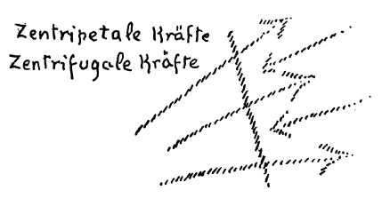
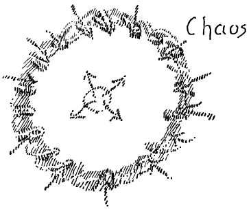

Eine Vorstellung versuchte ich durch die gestrigen Betrachtungen hervorzurufen von der Stellung des Menschen im Kosmos. Wenn der Mensch betrachtet wird von dem Gesichtspunkte jenseits der Schwelle, die zwischen den sinnlichen und den übersinnlichen Welten liegt, dann ergibt sich ja das Wesen des Menschen so, daß es sich darstellt als im ganzen Kosmos als ein Glied darinnenstehend. Und ich habe gestern zunächst versucht zu zeigen, wie gewissermaßen äußerlich der Mensch im Kosmos drinnensteht, indem ich darauf hingewiesen habe, wie ja hinter dem Teppich, der sich um uns herum ausbreitet und der die sämtlichen Sinneseindrücke enthält, eine geistige Welt ist. Ich habe betont, diese geistige Welt ist eine fröstelnde, eine kalte Welt. Es ist diejenige Welt, in der wir allerdings, wie Sie wissen, unbewußt sind zwischen dem Einschlafen und Aufwachen, in der wir uns aber in Wirklichkeit aufhalten, allerdings dann ihren eigentlichen Charakter nicht empfinden, sondern im Gegenteile den Verkehr der geistigen Welt mit ihr dadurch vermitteln, daß wir wärmende Liebe gerade in diese Welt hineintragen. Wir haben damit gegeben ein geistiges Gebiet. Jenes geistige Gebiet aber, das unsere eigentliche Umgebung ist, ist ein anderes geistiges Gebiet — ich habe gestern schon darauf hingewiesen -, ist dasjenige, was unterhalb jenes Spiegels liegt, der in uns die Erinnerungen zurückwirft. Dasjenige geistige Gebiet, aus dem aufsteigt die Gliederung namentlich unseres Gliedmaßenorganismus mit alledem, was zu diesem Gliedmaßenorganismus gehört, dieses geistige Gebiet ist es, nach dem allerdings der gewöhnliche Mystiker hinstrebt. Er findet es aber nicht, weil es erst dann aufgefunden wird, wenn der Mensch durch die Geheimnisse seines physischen und ätherischen Organismus durchdringt, um dann eben das zu entdecken, was diesen physischen und ätherischen Organismus formt, gestaltet, mit Bewegung durchdringt. Dieses Gebiet hat einen wesentlich andern Charakter, als das für die Außenwelt zu beschreibende geistige Gebiet. Dieses Gebiet braucht nicht erst durch den Menschen erwärmt zu werden. Dieses Gebiet ist gewissermaßen ein in sich den Eindruck der Wärme machendes Gebiet. Es ist das Gebiet, welches mit den entgegengesetzten Kräften ausgerüstet ist wie das vorige. Ich sagte, das vorige Gebiet ist ausgerüstet mit den Kräften, die den geistigen Kosmos zusammenhalten, mit den zentripetalen Kräften; dieses andere Gebiet, aus dem die Kräfte stammen, welche unsere Gliedmaßen bewegen, das ist mit den entgegengesetzten Kräften durchsetzt, mit den zentrifugalen Kräften, mit denjenigen Kräften, die fortwährend dadurch tätig sind, daß sie gewissermaßen das geistige Weltenall ins Weite auseinanderbreiten. Es sind die zentrifugalen Kräfte. Nur dürfen Sie sich unter diesen Kräften nicht physische Kräfte vorstellen, sondern geistige Wesenheiten. Wir sehen da gewissermaßen in die Konstitution des Weltenalls hinein. Wir bringen das, was das Weltenall konstituiert, in Zusammenhang mit dem, was in uns selbst ist. Wir verfolgen die Kräfte, die in unseren Augen, in unseren Ohren, kurz, in unserem Sinnesapparat leben, und wir erkennen sie als die Kräfte, die die Welt zusammenhalten. Wir finden in uns die Kräfte, durch die wir unsere Arme bewegen, unsere Beine bewegen, durch die noch manches andere in unserem Gliedmaßenorganismus geschieht, und wir müssen sie ansprechen als diejenigen Kräfte, die, wenn sie sich selbst überlassen wären, das Weltenall ins Weite zerstreuen würden. In diesen Kräftezusammenhang sind wir hineingestellt als Menschen. Innerhalb dieses Kräftezusammenhanges findet sich die Welt der verschiedensten Wesenheiten, jener Wesenheiten, mit denen jene neun Hierarchien, von denen wir ab und zu gesprochen haben, gerade durch den Menschen in Beziehung stehen. Der Mensch ist der Vermittler zwischen Götterwelten. Man möchte sagen: Die Götter begegnen sich durch den Menschen. ^mcxq4x

Man sieht da hinein in das Weltenall und sieht den Menschen in einer gewissen Beziehung als den Vermittler von Götterwelten. Man möchte, daß solches Bewußtsein die Menschenseelen durchdringe; denn aus diesem Bewußtsein allein können die egoistischen Elemente der alten Religionen überwunden werden. Diese Elemente der alten Religionen sind ja zum großen Teile durchaus auf den Egoismus aufgebaut. Wenn aus den bestehenden Konfessionen heraus den Menschen gepredigt wird, so geschieht es, um zu appellieren an ihre egoistischen Instinkte der Unsterblichkeit und dergleichen. Man redet, indem man aus den traditionellen Konfessionen heraus spricht, zu diesen egoistischen Instinkten. Man muß nur ein Gefühl dafür haben, wie auf diese egoistischen Instinkte spekuliert wird. Geisteswissenschaft wird den Menschen so darstellen, daß er ein Bewußtsein bekommt, welche Rolle er im ganzen Kosmos spielt, wie zusammenhängen durch ihn eine Welt der zentripetalen Kräfte und eine Welt der zentrifugalen Kräfte, die sich im Grunde genommen nur im Menschen selbst begegnen (siehe Zeichnung). ^m0mkex

 ^kjzkwz

Wenn das, was ich jetzt gesagt habe, nicht eine graue Theorie bleibt, sondern wenn es übergeht in die ganze Gefühls- und Empfindungswelt des Menschen, dann fühlt er sich im Weltenall drinnenstehend und sagt sich: Ich bin um der Entwickelung des Weltenalls willen da, durch mich hindurch geht der Strom des kosmischen Geschehens. Dieses Gefühl eines Befestigtseins im Weltenall, das ist dasjenige, was das Bewußtsein der Gegenwart und der nächsten Zukunft durchziehen muß. Denken Sie nur einmal, wie dieses Gefühl entgegengestellt wird einem andern Gefühl, das durch die Kultur der letzten drei bis vier Jahrhunderte an die Oberfläche der menschlichen Entwickelung getrieben worden ist. Haben denn diese letzten drei bis vier Jahrhunderte aus sich selbst heraus irgend etwas von einem solchen Bewußtsein des Menschen getrieben? Nein, es wurde ja wissenschaftlich überhaupt nicht nachgedacht, was der Mensch im Weltenall ist und bedeutet. Es wurde der Blick geworfen auf die Tierreihe. Man lernte erkennen, wie eine Tierform aus der andern sich entwickelt, und man sagte dann: Nun, der Mensch ist die höchste der Tierformen. Man stückelte ihn gleichsam an als das höchste Tier an die niederen Tiere. Man lernte den Menschen in seiner Tierheit kennen. Man sprach gar nicht über das Wesen des Menschen. Das ist der Umschwung, der sich im Seelenhaften von heute ab in der Menschheit voll-ziehen muß, daß der Mensch sich wieder bewußt wird, wie er einen Durchgangspunkt für Götterkräfte bildet, wie er gewissermaßen der Platz ist, an dem sich Hierarchien begegnen, damit sie im Weltenall zusammenwirken können. Und wissen soll der Mensch: Wenn er niedrig von sich denkt und niedrig handelt und sein Menschheitsbewußtsein herabdrückt, dann wird er kein Vermittler sein zwischen den höheren und den niederen Welten. Sich fühlen als ein Wesen, das dem Kosmos angehört, das muß der Mensch lernen. Götterwesen, die den zentrifugalen Triebkräften dienen, Götterwesen, die den zentripetalen Kräften dienen, sie begegnen sich im Menschen. ^slixcf

Und wo finden sie ihren Ausgleich? Die zentripetalen Kräfte wirken vorzugsweise durch das menschliche Haupt, die zentrifugalen vorzugsweise durch den Gliedmaßenmenschen. Der mittlere Mensch, der rhythmische Mensch, er ist dasjenige Wesen, welches den Ausgleich, den Gleichklang, die Harmonie bewirken soll zwischen den zentripetalen und den zentrifugalen Weltenkräften. Bedenken Sie, was das bedeutet. Das bedeutet, wenn der Mensch eine gewisse Seelenverfassung in sich entwickelt, wenn der Mensch eine gewisse innere Gesinnung entwickelt, die ihm selbstverständlich, wie wir aus dem Verschiedensten gesehen haben, nur aus der Geisteswissenschaft heraus werden kann, dann gibt er seinem ganzen inneren Erleben eine gewisse Färbung, dann verläuft dieses innere Erleben in einer gewissen Weise. Und das drückt sich bis ins Organische hinein, bis in den Herz- und Atmungsrhythmus aus. Das heißt mit andern Worten: Wie der Mensch atmet, wie des Menschen Herz schlägt, das hat eine Bedeutung nicht nur innerhalb der menschlichen Wesenheit, das hat eine Bedeutung innerhalb des ganzen Kosmos. Und wenn wahrgenommen wird der menschliche Herzschlag, so bedeutet dies das Zusammenwirken verschiedener Götter- oder Geisterwelten. Das alte Wahrwort, daß der Mensch ein Tempel für das Göttliche ist, es steigt wiederum auf aus den neueren Erkenntnissen der Initiationswissenschaft. ^baely8

Und so wird denn, was aus diesen Erkenntnissen der Initiationswissenschaft aufsteigt, einen andern Charakter tragen müssen als das, was die alten traditionellen Konfessionen dem Menschen bringen können. Die rechnen mit seinem Egoismus. Womit rechnet dasjenige, was als Weltempfindung durch die Geisteswissenschaft kommen kann? Es rechnet mit der Verantwortung des Menschen gegenüber der Welt. Es appelliert vorzugsweise an die Verantwortungsgefühle. Es erhöht den Menschen, indem es ihm zeigt, wie er als ein wesentliches Glied im ganzen Weltenall drinnensteht. ^s0cgfr

Dieses Erringen eines gewissen Menschheitsbewußtseins, das ist es, was so dringend notwendig ist. Denn worauf beruht es denn, daß die Menschen heute in dieses Chaos kamen, in dem unsere soziale Ordnung über die ganze zivilisierte Welt hin zum Teil schon zerfallen ist, zum Teil zu zerfallen droht, worauf beruht es denn? Es beruht darauf, daß der Mensch vergessen hat dieses sein Stehen im Kosmos drinnen, daß der Mensch nichts wissen will von diesem seinem Stehen im Kosmos. Wer so sich im Kosmos darinnen fühlt, der wird begreifen, daß die Weltentwickelung nicht beschrieben werden darf bloß von dem ausgehend, was außerhalb des Menschen ist, sondern daß vorzugsweise im Menschen selbst die Kräfte sind, welche unserer Erde den Ursprung gegeben haben, welche unserer Erde ihr Ende geben werden und sie in andere Metamorphosen der Weltgestaltung überführen werden. Im Menschen müssen wir vorzugsweise dasjenige suchen, was wir wissen, was wir fühlen sollen, woraus wir unser Wollen gestalten sollen. ^g3zf1c

Was sind es für Kräfte, die vorzugsweise im menschlichen Haupte wirken und die ja verwandt sind den zentripetalen, den zusammenpressenden Kräften des Kosmos, was sind es für Kräfte? Es sind diejenigen Kräfte, die die ältesten Kräfte unseres Weltenalls sind. Erinnern Sie sich an meine Darstellungen in der «Geheimwissenschaft im Umriß», wie ich die alte Saturnentwickelung beschrieben habe, wie ich da hinweisen mußte darauf, daß sich herausgerungen hat aus dieser Saturnentwickelung das menschliche Sinnesleben. Was da zurückgeblieben ist aus dieser Saturnentwickelung, es liegt hinter unserem Sinnesteppich als die kalte, fröstelnde Welt, die sich eben aus dem Wärmezustand des Anfanges heraus entwickelt hat, in die wir heute Wärme hineinzutragen haben. Das, was da hinter dem Sinnesteppich liegt, ist gewissermaßen die älteste der Welten. Wir betreten sie unbewußt in der Zeit vom Einschlafen bis zum Aufwachen. Wir wandeln aber eigentlich immerfort in ihr herum. Sie gibt uns alles dasjenige, was mit unseren Sinnen zusammenhängt. Die zentripetalen Kräfte wirken, gleichsam die Sinne von außen bildend, in unsere Sinne hinein, in unsere Augen, in unsere Ohren, und von da aus in unseren physischen Verstand, in dasjenige, was wir denken. Und indem wir durch die Welt denkend gehen, gehen wir eigentlich mit demjenigen menschlichen Besitz durch die Welt, der uns aus dieser Umgebung heraus gebildet wird, das heißt, mit den ältesten Kräften, die nun schon angekommen sind beim Zerfall. Das dürfen wir nie vergessen, daß dies die Kräfte sind, die eigentlich schon beim Zerfall angekommen sind. ^beak6p

 ^14nkno

Man möchte sagen, die Sache ist so: Wenn man schematisch darstellt das Weltenall, auseinander, ins Weite strebend, aber an dieser Grenze zentripetal zusammengehalten werdend, es sind die ältesten Kräfte des Weltenalis (siehe Zeichnung). Sie zerbröckeln in einer gewissen Weise. Und aus diesen zerbröckelnden Kräften, aus diesen in den Tod schon übergehenden Kräften, aus diesen zum Chaos gewordenen Kräften steigt dasjenige auf, was unser Verstand ist, was unser menschlicher Intellekt ist. ^17pgl0

Es war das Schicksal der neueren Menschheit, daß seit den letzten drei bis vier Jahrhunderten dieser Intellekt besonders entwickelt werden mußte. Aber dieser Intellekt, er steigt auf gewissermaßen aus dem sterbenden Chaos, das von der alten Saturnentwickelung geblieben ist. Die Menschen haben nun bis in diese Zeit herein, bis in das soziale Leben hinein reformierend wirken wollen aus diesen Kräften heraus. Aber diese Kräfte sind diejenigen Kräfte, die gerade dann normal wirken, wenn sie zerstörend sind. Wir könnten nicht denken, wenn wir diese Kräfte nicht hätten. Wir könnten unseren Intellekt nicht entwickeln, wenn wir diese Kräfte nicht hätten. Wir zerstören die soziale Ordnung, wenn wir sie durchsetzen wollten mit dem, was aus diesem unserem Intellekt heraus folgt. ^q7jac2

Alles, wobei Gedanken tätig sein müssen, ist angewiesen darauf, daß es an diesen Intellekt appelliert, an den Intellekt, der aus dem Chaos aufsteigt. Aber wir dürfen das, was da aus dem Chaos aufsteigt, nicht zu sozialen Reformen verwenden. Im Osten Europas ist es jetzt so, daß die äußersten Ausläufer des europäischen Intellektualismus sozial-reformatorisch auftreten. Was da im Osten Europas entstanden ist, es breitet sich über Asien, über Europa, über den Westen herüber aus, wenn nicht zeitig genug eine, aber jetzt nicht wieder intellektualistische, sondern, wie wir gleich sehen werden, eine andere Gegenwirkung zustande kommt. Wir brauchen zu unserem Geistesleben, zu unserem freien Geistesleben diese Kräfte. Wir brauchen sie, weil dasjenige, was vom menschlichen Intellekt getragen sein soll, nur aus dem Chaos aufsteigen kann. Aber sie sind nicht brauchbar, diese Kräfte, wenn sie sich vermählen mit den sozial wirkenden Kräften. Da ist jene Intelligenz schädlich, welche im engeren Geistesleben nützlich und fruchtbar ist. Dasjenige, was Erfindungen macht, was geistvolle Dichtungen formt, das muß aufsteigen aus dem Chaos, aus dem reifen Materiellen des menschlichen Organismus, das darf niemals glauben, daß es soziale Impulse geben kann in bezug auf das äußere Leben. Es ist wichtig, daß die Menschheit jetzt anfängt, in diese Dinge klar hineinzusehen. Sie wird nicht klar in sie hineinsehen, wenn sie immer wiederum ablehnt, Geisteswissenschaft zu berücksichtigen. Alles das aber, was das eigentliche Geistesleben groß macht, es muß aus diesem Chaos aufsteigen. Es muß dieses Geistesleben aus chaotischen Untergründen der Individualität des Menschen aufsteigen. ^ux10mj

Da gliedert sich die Erziehungsfrage zusammen mit der allgemeinen Kulturfrage. Denn was auf diese Art der Menschheit gebracht werden soll, es muß ja aus dem Chaos aufsteigen, das der Mensch sich mitbringt, indem er durch die Geburt heruntersteigt aus höheren Welten. Er bringt sich den zerfallenden Gehirnorganismus mit. Und aus diesem chaotischen Gehirnorganismus steigt dasjenige auf, was das Geistesleben konstituieren kann. Am entgegengesetzten Ende der Menschheitsorganisation müssen sich entwickeln diejenigen Kräfte, die zugrunde liegen können den sozialen Ideen. ^ql9xst

Da berühre ich allerdings etwas, das für die gegenwärtige Menschheit mit ihren furchtbaren Vorurteilen noch ganz unverständlich ist. Die gegenwärtige Menschheit glaubt, sie denkt bloß mit dem Kopfe. Das ist ein Unsinn. Man denkt und fühlt und will nicht bloß mit dem Kopfe, sondern mit dem ganzen Menschen. Arme und Beine sind ebensolche Seelenorgane wie der Kopf. Das ist eines der schlimmsten Vorurteile, daß das Seelenleben organisch einseitig dem Nervenleben zugeteilt worden ist. Nur das intellektualistische Leben ist dem Nervenleben zugeteilt. So daß also gerade aus den zentrifugalen Kräften heraus, aus den frischen organischen Kräften, die nicht das Chaos repräsentieren, sondern die gerade in der Gliedmaßenorganisation des Menschen und allem, was dazu gehört, leben, dasjenige sich entwickeln muß, was soziale Impulse abgeben kann, vorzugsweise soziale Impulse des äußeren Lebens, besonders des dritten Gliedes des sozialen Organismus, des wirtschaftlichen Lebens. Hier hat der Mensch es zu tun mit den jüngsten Bildungen. In seiner Hauptesorganisation, die der Geistesorganisation zugrunde liegt, hat man es zu tun mit den ältesten Bildungen. Hier in alledem, was zugrunde liegt der wirtschaftlichen Organisation, hat man es zu tun mit den jüngsten Bildungen, mit denjenigen Bildungen, die Träger des Menschenwillens sind, die beim Menschen heute im normalen Bewußtseinszustande durchaus im Unbewußten liegen, die aber heraufgeholt werden müssen durch Initiationswissenschaft, durch Mysterienwissenschaft aus dem Unbewußten. Und wie können sie heraufgeholt werden? Ich brauche Ihnen ja nicht zu schildern, wie das eigentliche freie Geistesleben zustande zu kommen hat. Das freie Geistesleben beginnt mit der Erziehung des Kindes, holt dasjenige heraus aus der kindlichen Individualität, was durch die Götter heruntergeschickt wird aus den geistigen Welten, wenn die Kinder durch die Geburt ins physische Dasein eintreten. Da arbeiten wir aus dem Chaos, aus der dunklen, nebeligen Tiefe heraus, um die menschlichen Genialitäten, um die menschlichen Veranlagungen aus dem Geiste heraus durch das Chaos der Materie in das physische Dasein hereinzuführen. ^yk3wax

Anders steht die Sache, wenn wir appellieren müssen an das, was im Menschen das jüngste Glied seiner Organisation ist, wo er im normalen Bewußtsein völlig unbewußt ist, wo die Initiationswissenschaft alles heraufholen muß aus diesen unbewußten Tiefen. Wie geschieht das? Nun, beim sozialen Denken ist es anders als beim Denken aus dem Geistigen heraus. Beim Geistigen beruht alles auf der Entwickelung der Individualität. Beim sozialen Denken ist es so, daß man zum Beispiel statistisch ausrechnen kann, wieviel Menschen, sagen wir, von tausend Zwanzigjährigen sechzig Jahre alt werden. Man kann gut darüber Zahlen bekommen, indem man über ein gewisses Gebiet Tausende von Zwanzigjährigen annimmt; von diesen Tausenden Zwanzigjährigen, von denen sind nach zehn Jahren so und so viel Dreißigjährige, nach weiteren zehn Jahren so viel Vierzigjährige, wieder nach zehn Jahren so viel Fünfzigjährige, dann so viel Sechzigjährige da. Eine gewisse Rechnungsart, die Wahrscheinlichkeitsrechnung, stützt sich auf dasjenige, was man auf diese Weise aus dem zahlenmäßigen Gang von Menschengruppen-Entwickelung entnehmen kann. Und man kann sich mit sozialen Einrichtungen auf diese Rechnung verlassen. Die Versicherungseinrichtungen beruhen ja auf diesen Berechnungen. Wenn ich als Zwanzigjähriger mein Leben versichere, so habe ich zu zahlen nach dem Maße, das herauskommt, wenn man berechnet, wieviel von tausend Zwanzigjährigen zum Beispiel noch sechzig Jahre alt werden, also sagen wir, wieviel man auszuzahlen hat im sechzigsten Jahre. Und indem man die Sache sozial nimmt, indem man die Sache gruppenweise nimmt, stimmt die Sache, sonst würden ja alle Versicherungsgesellschaften zugrunde gehen müssen. Sie beruhen auf solchen Gruppierungen von Fakten in der Menschheitsentwickelung. Hat diese Berechnung für den einzelnen einen Wert? Und aus dieser Berechnung, bekommt man da heraus, wenn man ein Zwanzigjähriger ist, wie groß für einen die wahrscheinliche Lebensdauer noch ist? Niemand wird sich sagen: Also lebe ich nur so und so lange -, jene wahrscheinliche Lebensdauer, nach der man sein Leben versichert, ist eine andere als diejenige, mit der man rechnet als einzelner Mensch, als Individualität. Das steht auf ganz verschiedenen Gebieten des Denkens, des Urteilbildens. Man muß ganz anders über den Menschen denken, wenn man ihn versichern will, also eine soziale Einrichtung treffen will, als wenn man als Mensch, als einzelner Mensch über sein Leben denkt, ^icxtwv

Und wenn man überhaupt zu sozialen Einrichtungen, namentlich denjenigen, die wirtschaftlicher Art sind, kommen will, was muß man dann tun? Man muß ganz nach Art dieser Versicherungsstatistik überhaupt Statistik treiben, man muß zusammenstellen dasjenige, was sich ergibt. Daraus bekommt man niemals jene Weisheit, die aufsteigt aus dem Inneren des Menschen, aus dem Chaos, sondern man bekommt etwas, was sich zahlenmäßig ausdrücken läßt. Sehen Sie sich doch um in alle dem, wozu die Menschen gekommen sind, namentlich diejenigen der westlichen Wissenschaft. Sie finden doch überall Statistik, und aus der Statistik wird erschlossen, wieviel man Zoll zahlen soll auf diesen oder jenen Artikel, wieviel man zu diesem oder jenem braucht und so weiter. Das ist eine ganz ähnliche Berechnung wie die Versicherungsberechnung. Indem man auf das eine hinschaut, auf das, was schöpferisch im Geistesleben steht, unterliegt man einer ganz andern Urteilsbildung, als indem man auf dasjenige hinschaut, was sozial sich in Menschengruppen einrichtet. Aber das, was sozial sich in Menschengruppen einrichtet, was man auf diese Weise berechnen kann, das hängt eben zusammen mit diesen zentrifugalen Kräften, das hängt zusammen mit den jüngsten Organisationskräften des Menschen, die es noch nicht bis zum Bewußtsein gebracht haben, deren Inhalt daher geschlossen werden muß aus der Statistik. ^7f28i8

Diejenigen Menschen, die einen ganz besonderen Enthusiasmus haben, einen zynischen Enthusiasmus, wie ihn Nietzsche hatte, für alles das, was aus dem Inneren des Menschen, aus dem Chaos des Menschen entspringt und sich herausarbeitet aus diesem Chaos, die finden, daß eigentlich nur das einen Wert hat, was so aus diesem innersten Chaos heraus sich arbeitet, und alles Gruppenmäßige verachten sie. Nietzsche hat furchtbar verachtet alles dasjenige, was gruppenmäßig in der Welt ist. Daher hat Nietzsche auch insbesondere in seiner frühen Epoche die ganze Entwickelung der Menschheit so betrachtet, daß für ihn, für seine Weltbetrachtung nur einen Wert hatten die einzelnen auserlesenen Individuen. Die Weltgeschichte betrachtete Nietzsche so, daß sie eigentlich nur der Weg ist, damit die andern, Nichtsbedeutenden, den Umweg bilden zu den paar hervorragenden Individuen. Das war für Nietzsche Grundlage seiner ersten Weltbetrachtung. Er wollte überhaupt nur den Blick richten auf die paar Genies, welche die Menschheitsentwickelung hat. Das übrige, von dem sagte Nietzsche, es hole sichs der Teufel oder die Statistik. Das war ungefähr für ihn dasselbe. Aber auf diese Statistik wird ja heute dasjenige gebaut, muß gebaut werden, was sich bezieht auf die wirtschaftliche Gestaltung, auf die wirtschaftliche Urteilsbildung, die mit den zentrifugalen Kräften, mit den jüngsten Kräften der Menschheitsorganisation zu tun haben. ^bsl0gi

Aber aus dieser Statistik kann eigentlich etwas Heilsames doch nicht folgen. Trotzkij und Lenin haben aus solchen Statistiken ihre hauptsächlichste Wahrheit, und in dem rein wirtschaftlichen Denken des Westens spielt die Statistik eine große Rolle. Aber diese ganze Statistik hat eigentlich einen unmittelbaren Wert nicht. Ich möchte Sie doch darauf verweisen, versuchen Sie es einmal in einer, ich will sagen, noch so genialen Weise, sich Statistiken zusammenzustellen, Sie werden kaum sehr viel herausbekommen, und man muß schon sagen, was mit Statistik auch als Sozialwissenschaft getrieben worden ist, es ist ein ziemlich schlimmes Ding. Es kommt nicht viel dabei heraus und ist nicht viel dabei herausgekommen. Im Grunde genommen gruppieren die einen so die Zahlen, die andern gruppieren sie anders, und darnach kommen dann die verschiedensten Ratschläge in der Sozialwissenschaft heraus. ^eyrzcu

Woher rührt das? Das rührt davon her, daß eben die Kräfte, auf die sich das bezieht, die zentrifugalen Kräfte, eben doch die jüngsten Kräfte im Menschen sind, diejenigen Kräfte, die überhaupt noch zu keinem Bewußtsein heraufgekommen sind. Da irrt der Mensch noch kindlich herum in dieser Region. So daß wir sagen müßten: Wenn man auf dasjenige, was im Normalbewußtsein der Menschheit heute vorhanden ist, Sozialwissenschaft, soziale Impulse gründen wollte, so käme überhaupt nichts heraus. Ehe man sich nicht gesteht, daß die Wissenschaft und das Bewußtsein der Gegenwart impotent sind in bezug auf die Bildung eines sozialen Urteiles, so wie diese Wissenschaft, so wie dieses gewöhnliche Bewußtsein ist, ehe man sich das nicht zugesteht, eher gibt es keine klare Einsicht in dasjenige, was notwendig ist. — Denn was ist notwendig? Zu wissen, daß der einzelne überhaupt mit den Zahlen nichts machen kann, daß nur Assoziationen mit den Zahlen etwas machen können, Gruppen von Menschen, die diese Erfahrungen, gegenseitig einander ergänzend, verwerten. Aber solche Assoziationen, sie werden trotzdem nichts Besonderes ausrichten, wenn sie nicht Richtkräfte haben, und welches müssen diese Richtkräfte sein? Diejenigen, die aus dem imaginativen Erkennen kommen, die aufsteigen aus der Initiationswissenschaft. Es müssen Leute kommen, die in einem gewissen Sinne initiiert sind, und müssen die Erfahrungen der Assoziationen gerade im wirtschaftlichen Leben in die richtigen Bahnen bringen. ^87szsf

Wo wird man zuerst geisteswissenschaftliche Richtkräfte brauchen, wenn man die Bedürfnisse der Menschheit in der Gegenwart und in der nächsten Zukunft richtig versteht? Man wird sie brauchen gerade auf dem Boden des Wirtschaftslebens. Da müssen sich Assoziationen bilden, da müssen diejenigen Erfahrungen, die die Assoziationen in ihren Zahlen zusammenstellen, ihre Richtkräfte erfahren durch jene Wirkungen, die einzig und allein aus der inneren Erfahrung in den höheren Welten gewonnen werden können. Das Geistesleben, das das Leben der Genies ist, das muß aus dem Chaos der natürlichen Organisation in der Erziehung herausgeholt werden. Dasjenige, was dem Wirtschaftsleben zugrunde liegt, das muß in seinen Richtkräften geholt werden aus der Initiationswissenschaft, und diese Initiationsrichtkräftemüssen ordnen, was gesammelt wird von den einzelnen Assoziationen aus diesem oder jenem Berufskreise, aus diesem oder jenem Industrie-, Ackerbaukreise und so weiter. Gerade das Wirtschaftsleben macht den Einfluß des Geisteslebens am allermeisten notwendig, und gerade im Wirtschaftsleben wird man nicht weiterkommen ohne dieses, denn im Wirtschaftsleben wird alles instinktiv bleiben, wenn es nicht dadurch zur Bewußtheit gebracht wird, daß es in dieser Weise sich entwickelt, wie ich gesagt habe. Daher müßte man sagen: Zunächst einen Besen her und alles das aus dem Wirtschaftsleben heraus, was den Geist negiert! Davon hängt das Heil der zukünftigen Menschheit ab. Alles, was nicht den Geist will, heraus aus dem Wirtschaftsleben, gerade aus dem Wirtschaftsleben! Da ist es am allernotwendigsten, sonst kommt das wirtschaftliche Chaos und damit überhaupt das zivilisatorische Chaos. Und das zeigt sich ja, ich möchte sagen, klar und deutlich genug. ^rcmvbu

Es ist merkwürdig, wie das Denken der Menschen in diesem katastrophalen weltgeschichtlichen Augenblicke war. DieMenschen haben hereinbrechen sehen seit 1914 die Weltkatastrophe. Was haben sie sich gedacht? Sie haben sich gedacht: Nun, wenn nur nächstes Jahr Friede kommt, dann sind wir doch wiederum in Ordnung. — Und als der Friede nicht gekommen war: Nun, wenn er nur nächstes Jahr kommt! —und so weiter. Dann kam ein Friede, der aber nur Ausgangspunkt für eigentlich noch größere Konflikte war. Nun schlafen die Menschen weiter. Sie sehen nicht, wie von Monat zu Monat die Niedergangskräfte sich häufen, stärker werden. Sie wollen es nicht sehen. Warum wollen sie es nicht sehen? Weil sie den Geist nicht haben wollen, weil sie dasjenige nicht haben wollen, was einzig und allein der Welt wirklich aufhelfen kann. Es nützt nichts, heute zu glauben, man könne mit dem oder jenem, was herausragt aus dem Alten, Kompromisse schließen. Das geht nicht. Die Welt will neu gebaut sein, die Welt will aus neuen Quellen heraus neue Kräfte haben. Was als Initiationswissenschaft geltend gemacht werden muß, und aus dem solche Impulse kommen sollen, die ich charakterisiert habe, das ist das, was neu herein will in die Welt, und was man aufnehmen muß, weil vor allen Dingen dasjenige, was zu einem Aufstieg führen soll, ohne das verfallen muß, nicht weiterkommen kann. Es handelt sich darum, daß von diesen Dingen ein starkes Bewußtsein, namentlich in denjenigen Menschen sich festsetzt, welche gewissermaßen die größte Verantwortlichkeit haben in der nächsten Zeit - ich habe schon einmal von diesen Tatsachen hier gesprochen -, das ist die anglo-amerikanische Bevölkerung. Diejenigen Bevölkerungen, die in Mittel- und Osteuropa sind, sie liegen auf dem Boden. Die anglo-amerikanische Bevölkerung hat damit, daß sie dasteht als diejenige, deren Macht sich ausbreitet, deren Einfluß vor allen Dingen sich ausbreitet, die unbedingte Verantwortung, dem Geistesleben sich zuzuwenden. ^uej6qb

Und man möchte sagen, deshalb war es von einer so großen Wichtigkeit, daß auf neutralem Boden der Repräsentant unserer Geistesbewegung während der katastrophalen Jahre stand. Hier in Dornach gab es einen neutralen Boden, auf dem sich aus allen Nationen finden konnten diejenigen Menschen, die kommen wollten, wo niemandem ein Hindernis in den Weg gelegt worden ist von dem, was im Boden der Geisteswissenschaft selbst wurzelt. Es ist, ich möchte sagen, herausgestellt worden aus Mitteleuropa dasjenige, was jetzt hier steht. Es sind wahrhaftig nicht die schlechtesten Kräfte dieses Mitteleuropas, die auch in materieller Beziehung das hingestellt haben, das jetzt dasteht, und was dasteht so, daß es frägt: Bringt ihm die Welt Verständnis entgegen? — Mitteleuropa kann so nicht gefragt werden: Bringt ihm die Welt Verständnis entgegen? — denn es liegt am Boden, das geht seiner geistigen, seiner wirtschaftlichen Entwertung entgegen. Daß es Werte in sich gehabt hat, mag daraus hervorgehen, daß es hierher stellen konnte diesen Bau. Jetzt steht er als Frage da, ob man ihm Verständnis entgegenbringt. Und es ist schon eine Weltfrage, eine Frage, die in die Welt hinaus gerichtet wird: Wird dieser Bau einstmals unvollendet dastehen, wie es ja heute mehr scheinen kann, wird er einmal unvollendet dastehen, wird er nur so viel gebaut sein, als von Mitteleuropa an ihm gebaut worden ist und als von neutralen Gebieten hinzugefügt worden ist? Oder wird von der anglo-amerikanischen Welt Verständnis entgegengebracht werden dieser Frage an die Menschheitszukunft? Man sollte diese Frage als eine tief bedeutungsvolle empfinden. Denn entweder wird man zum Geiste ja sagen, dann wird man auch die Mittel und Wege finden, das, was sonst unvollendet bleiben muß, fertig zu machen, oder man wird zum Geiste nein sagen, dann wird hier ein unvollendeter Bau stehen, zum Zeichen dafür, daß man dasjenige, was die Aufsteigekräfte sind, nicht verstehen wollte. Dann aber auch wird man die Frage verneint haben, ob man es mit dem Fortschritt der Menschheit ernst nehmen will. ^bmgbt4