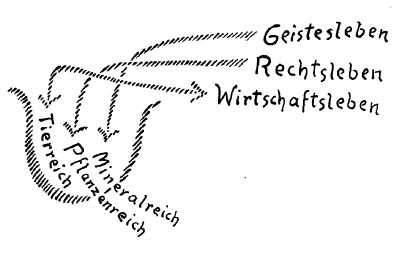

[ 1 ] ^9ipi2g

Es handelt sich gegenüber den geisteswissenschaftlichen Bestrebungen darum, daß man dasjenige, was eingesehen werden soll, nach und nach von den verschiedensten Gesichtspunkten her kennenlernt. Man kann sagen, die Welt erwartet gerade von dem, was geisteswissenschaftlich ist, eine leichtgeschürzte Überzeugungsmöglichkeit. Allein, die ist nicht so ohne weiteres zu schaffen. Denn gegenüber den geisteswissenschaftlichen Tatsachen handelt es sich darum, daß man die Überzeugung eigentlich entwickelungsgemäß erhält. Sie beginnt mit einem gewissen Stadium, das noch schwach ist, und man lernt dann dieselben Dinge von immer neuen und neuen Gesichtspunkten kennen, und dadurch verstärkt sich immer mehr und mehr diese Überzeugung. Das ist das eine, von dem ich heute ausgehen möchte. Das andere möchte anknüpfen an verschiedenes, das ich seit Wochen hier zur Erörterung gebracht habe, anknüpfen an dasjenige, was gesagt worden ist über die Differenzierung der Menschheit über die zivilisierte Erde hin. Nur kurz lassen Sie mich einige der wesentlicheren Tatsachen andeuten, die für unsere Betrachtungen in diesen drei Tagen von einiger Wichtigkeit sind. ^d06ckt

[ 2 ] ^cjw2up

Ich habe darauf hingewiesen, in welchem Sinne der Orient die Quelle des eigentlichen Geisteslebens der Menschheit ist. Ich habe dann darauf hingewiesen, daß in mittleren Gegenden, Griechenland, Mitteleuropa, das Römische Reich — es erstreckt sich ja das, was zu sagen ist, über weite Zeiträume -, vor allen Dingen die Anlage dafür vorhanden ist, die rechtlichen, die staatlichen Begriffe zur Ausbildung zu bringen, und daß der Westen vorzugsweise daraufhin veranlagt ist, die wirtschaftlichen Begriffe zu der Gesamtzivilisation der Menschheit beizusteuern. Wenn wir nach dem Orient hinüberschauen — auch das ist ja schon erwähnt worden -, so finden wir, daß heute sein zivilisatorisches Leben im wesentlichen in der Dekadenz ist, und wir müssen, um so recht einzusehen, was der Orient eigentlich für die Gesamtzivilisation der Menschheit ist, in ältere Zeiträume zurückgehen. Von den geschichtlich erlangbaren Dokumenten, die ein Beweis dafür sind, was der Orient ist, leuchten uns ja vor allen Dingen die Veden, die Vedantaphilosophie aus dem Orient entgegen und manches andere, was aber wiederum Zeugnis ist von dem, was in noch älteren Zeiten im Orient vorhanden war. Und diese Dinge weisen darauf hin, wie aus einer ursprünglichen, ganz geistigen Veranlagung der Menschheit des Orients ein Geistesleben geboren worden ist. Dann kamen für den Orient auch die Zeiten der Verdunklung dieses Geisteslebens. Wer aber das, was heute im Orient geschieht, selbst wenn es nur noch die Karikatur des Alten ist, in richtiger Weise ins Auge zu fassen versteht, der sieht auch heute in den dekadenten Dingen noch immer die Nachwirkung des alten Geisteslebens. ^jj5jki

[ 3 ] ^i6wc6h

In einer etwas späteren Zeit hat sich über die mittleren Gegenden der Erde hin, im alten Griechenland, im alten Rom, später in jenen Gebieten, die sich vom Mittelalter ab über Europa ausgebreitet haben, entwickelt, was das eigentliche rechtliche oder staatliche Denken ist. Der Orient hatte ursprünglich kein eigentliches staatliches, hatte vor allen Dingen nicht das, was wir ein juristisches Denken nennen. Dem widerspricht auch nicht, daß es etwa Gesetzbücher gibt wie die des Hammurabi und dergleichen. Denn wer den Inhalt dieser Gesetzbücher nimmt, der wird aus dem ganzen Ton und der ganzen Haltung erkennen, daß es sich da um etwas anderes handelt als um eine Denkweise, die wir innerhalb des Abendlandes als eine juristische bezeichnen. Und im Westen ist es erst die neueste Zeit, wo sich ein eigentliches wirtschaftliches Denken entwickelt. Selbst die Wissenschaft, wie sie da getrieben wird, nimmt, wie ich ja schon ausgeführt habe, die Formen an, die eigentlich in das Wirtschaftsleben hineingehören. ^szyqxs

[ 4 ] ^1757y0

Was das orientalische Geistesleben betrifft, so ist es ja interessant, zu beobachten, wie alles das, was das Abendland bisher gehabt hat, im Grunde genommen auch Erbe des orientalischen Geisteslebens ist, allerdings in Umwandlungen. Ich habe hier einmal aufmerksam darauf gemacht, wie sehr das orientalische Geistesleben sich umgewandelt hat innerhalb Europas. Da liegt ja doch die Tatsache vor, daß jene Fähigkeiten, die im Orient gewaltet haben, eine Anschauung der unsterblichen Menschenseele hervorgetrieben haben, aber so, daß diese Unsterblichkeit mit einer Ungeburtlichkeit eben wesentlich verbunden war. Das präexistente Leben, das Leben der Seele vor diesem irdischen Leben zwischen Geburt und Tod, das war vor allen Dingen das, was für den orientalischen Geist vor der Seele, vor der Anschauung der Seele lag. Das andere ergab sich gewissermaßen als eine Konsequenz. Und daraus ergaben sich dann jene großen Zusammenhänge, die vom Abendländer ja bis heute nur geahnt werden, die man die karmischen Zusammenhänge nennen kann, die dann einen Abglanz hinterlassen haben in der griechischen Schicksalsidee, aber nur einen schwachen Abglanz. Und was ist denn eigentlich übergegangen in das Abendland, selbst von denjenigen Begriffen, durch die man das Mysterium von Golgatha zu verstehen versucht hat, was ist denn übergegangen in diese abendländische Ausbildung? Etwas, was sehr stark gefärbt ist von juristischem Denken. Es ist etwas radikal verschiedenes, wenn man auf der einen Seite betrachtet den Weg der Seele im Sinne der orientalischen Weltanschauung, wie sie aus der geistigen Welt heruntersteigt in die physische Welt, wieder hinaufsteigt in die geistige Welt, wie man da nach großen Gesichtspunkten die Schicksalszusammenhänge ins Auge faßt, und das juristische Gerichthalten über die Seele, von dem diese orientalischen Vorstellungen im Abendlande durchdrungen worden sind. Man erinnere sich nur an das gewaltige Bild Michelangelos im Vatikan, in der Sixtinischen Kapelle, man erinnere sich daran, wie da der Weltenrichter wie der universelle Jurist über die Guten und über die Bösen urteilt. Das ist ins abendländische Juristische umgesetzte orientalische Weltanschauung, das ist in keiner Weise ursprüngliche orientalische Weltanschauung. Dieses juristische Denken liegt ganz außerhalb des orientalischen Anschauens. Und je weiter fortgeschritten gerade in Mitteleuropa die Anschauung vom Geistigen ist, um so mehr lief das Geistige in das Römisch- Juristische ein. ^hhm6gf

[ 5 ] ^tul2nb

Also in mittleren Gegenden haben wir es vor allem zu tun mit dem, was veranlagt ist für das Juristisch-Staatliche. Nun aber ist die Zivilisation doch nicht bloß in der Weise differenziert über die Erde hin, sondern auch noch in einer andern Weise. Wenn man eingeht auf das, was der Orient geleistet hat, wenn man die besondere Nuance des Seelenlebens des Orients gerade da, wo dieses Seelenleben am größten ist, ins Auge faßt, dann findet man, daß dieses orientalische Seelenleben, trotzdem es vorzugsweise Geistiges produziert, von dem, wie gesagt, die ganze Menschheit weiterzehrte, im eminentesten Sinne instinktiv, atavistisch instinktiv ist. Es kommt heraus aus unterbewußten Imaginationen, die allerdings schon von einem gewissen Strahl des Bewußtseins übertönt sind. Aber es ist viel Unbewußtes, viel Instinktives darinnen. ^ytrg8u

[ 6 ] ^jk7qjj

So wird eigentlich das, was die Menschheit an geistigem Leben bisher hervorgebracht hat, so hervorgebracht, daß es hinaufweist in die höchsten Gebiete, deren die menschliche Seele teilhaftig werden kann; aber in einer Art instinktiven Höhenflugs wurden diese Gebiete erreicht. Es genügt nicht, wenn man den Begriffen oder den Bildern nachzeichnet, was der Orient ausgebildet hat, sondern man muß die besondere Art des Geistes- und Seelenlebens ins Auge fassen, durch die der Orientale gerade in seiner Blütezeit zu diesen Vorstellungen gekommen ist. Von dieser besonderen Seelenart, die ich hier auch schon charakterisiert habe, indem ich sie an das Stoffwechselleben anknüpfte, bekommt man allerdings nur eine Vorstellung, wenn man den ganzen ursprünglichen Seelenduktus von so etwas, wie die Veden und dergleichen sind, empfinden kann. Man darf eben durchaus nicht aus dem Auge verlieren, daß heute der Orient in seiner Dekadenz angekommen ist, und man dürfte zum Beispiel in keiner Weise jene mystisch-nebulose Art, die trotz seiner Größe Rabindranath Tagore auszeichnet, verwechseln mit dem, was wirklich das Wesen orientalischen Seelenlebens ist; denn Rabindranath Tagore hat allerdings dasjenige, was sich vom alten orientalischen Seelenleben bis heute herauf verpflanzt hat, aber er durchwebt es mit allen möglichen neueren westeuropäischen Koketterien und ist vor allen Dingen ein koketter Geist. ^wvf0w6

[ 7 ] ^6n4etc

Diese Dinge, die müssen nach und nach von der Geisteswissenschaft wirklich so erfaßt werden, daß man nicht bloß hingepfahlte Begriffe nimmt, sondern daß man die besondere Seelennuance, die dabei in Betracht kommt, wirklich ins Auge faßt. Also ein instinktives Geistesleben im Orient, durchwoben durch und durch von der Anschauung desjenigen, was sich als juristisch-staatliches Seelenleben entwickelt in den mittleren Gegenden. Da kommen wir dazu, daß sich das Halbinstinktive entwickelt, halbbewußt, halbinstinktiv. Es ist höchst interessant, wie, sagen wir, aus Fichtes, aus Goethes, aus Schellings, aus Hegels Seele heraus sich ein rein juristisches Denken ergibt. Es ist rein juristisch, aber es ist halb instinktiv und halb stark bewußt. Das ist zum Beispiel gerade bei Hegel das Reizvolle, dieses halb Instinktive und halb Vollbewußte. Und etwas ganz Bewußtes tritt erst auf im Westen, in der westlichen Seele, wo aus den Instinkten selber das Bewußtsein sich herausbildet — es ist das Bewußte noch instinktiv in der westlichen Seele, aber es kommt instinktiv das Bewußte heraus — in dem westlichen wirtschaftlichen Denken. So daß da zum ersten Male die Menschheit angewiesen ist, aus dem Bewußtsein heraus zu einer Durchdringung auch der öffentlichen sozialen Angelegenheiten zu kommen. ^4ks4mf

[ 8 ] ^peqv0i

Und da stellt sich denn etwas höchst Merkwürdiges heraus. Man könnte geradezu empfehlen, die Leute, denen es irgendwie darauf ankommt, sollten jetzt versuchen, die ganze Konfiguration des Denkens der zivilisierten Menschheit zu verstehen, sollten sich bekanntmachen mit den Versuchen, zu einer sozialen Denkweise zu kommen, bei den englischen Denkern, sagen wir Spencer, Bentham, namentlich Huxley und so weiter. Diese Denker wurzeln ja alle in derselben Denkatmosphäre, in der Darwin wurzelte, und sie denken alle eigentlich so, wie Darwin dachte, nur bemühen sie sich, zum Beispiel Huxley, aus ihrem naturwissenschaftlichen Denken ein soziales Denken herauszuentwikkeln. Man hat ja ein merkwürdiges Gefühl, wenn man sich so vertieft, sagen wir, in die Huxleyschen Versuche, zu einem sozialen Denken zu kommen, sagen wir über den Staat, über das rechtliche Zusammenleben der Menschen. Man hat ein eigentümliches Gefühl. Man nehme einmal folgendes an: Jemand wollte sich ein Gefühl von dem, was ich hier meine, verschaffen, und er würde zu diesem Zwecke, sagen wir, so etwas wie Hegels Buch über das Naturrecht oder die Staatswissenschaften oder Fichtes Rechtsphilosophie in die Hand nehmen oder irgend etwas anderes, auch von unbedeutenderen Geistern Mitteleuropas, und würde hinterher etwa Huxleys Versuche, aus dem naturwissenschaftlichen Denken in ein staatliches Denken hineinzukommen, lesen. Da würde man etwa folgendes erleben. Man würde sich sagen: Ja, jetzt lese ich Fichte, jetzt Hegel, das alles, das sind ausgebildete Begriffe, das sind Begriffe, die wirklich stark konturiert und intensiv gemalt sind. Und nun lese ich Huxley oder Spencer: das ist primitiv, das ist, wie wenn man eben anfangen würde, über diese Dinge nachzudenken. — Wenn man solchen Dingen gegenübersteht, kommt man nicht etwa damit aus, daß man sagt, das eine war vollkommen, das andere unvollkommen. Mit solchen Dingen kommt man überhaupt nicht aus, wenn man Realitäten gegenübersteht. ^fjrepm

[ 9 ] ^0fpb5w

Ich will Ihnen von einem ganz andern Gebiete her eine Parallele‘ sagen. Es kann einem vorkommen, daß man über irgend etwas aus der Geisteswissenschaft heraus vorträgt, sagen wir über die vorhergehende Verkörperung der Erde, über die Mondenverkörperung. Man gibt allerlei an. Irgend jemand liest das, oder hört zu, der in ganz atavistischer Weise hellsichtig ist. Das kann eine Persönlichkeit sein, die äußerlich unlogisch ist, die im gewöhnlichen praktischen Leben keine fünf Worte in logischer Weise aneinanderreihen kann, überall tapsig ist, so daß man sie zu dem oder jenem und zu allem andern auch noch dazu nicht gebrauchen kann im gewöhnlichen Leben. Nun hört solch eine Persönlichkeit das, was man eben über die Konfiguration irgendeiner Mondenzeit sagt, und die betreffende Persönlichkeit, die im äußeren Leben dumm und ungeschickt und so ist, daß sie kaum bis fünf ordentlich zählen kann, die aber atavistisch hellsichtig ist, die kann nun das aufnehmen, was sie da gehört hat, und sie kann es erweitern, kann weiteres ausbilden, und Dinge, die nicht gesagt worden sind, dazu finden. Aber die Dinge, die diese Persönlichkeit dann dazu findet, können von einer außerordentlich scharfsinnigen Logik durchzogen sein, von einer Logik, die bewunderungswürdig ist, während die Persönlichkeit im äußeren Leben tapsig und unlogisch ist, nicht fünf Worte logisch zusammenfügen kann. Das kann durchaus sein; denn wenn jemand atavistisch hellsehend ist, so fügt seine Bilder — und die Bilder kann er selber finden — in logischer Weise nicht sein Ich zusammen, sondern es fügen sie zusammen allerlei geistige Wesenheiten, die in ihm stecken. Deren Logik lernt man dann kennen, nicht seine Logik lernt man dann kennen. ^8kx8zl

[ 10 ] ^n34nq7

So darf man nicht so einfach sagen, das eine steht höher, das andere steht tiefer, sondern man muß überall auf den speziellen Charakter der Sache eingehen. Und so ist es auch hier. Fichtes oder Hegels oder minderer Geister juristische oder sonstige Anschauungen, die sind halb instinktiv, nur halb vollbewußt. Dasjenige, was aber da im Westen als primitives wirtschaftliches Denken auftritt, das ist nun allerdings ganz bewußt; impertinent bewußt sind solche Dinge wie diese, die von Huxley oder von Spencer oder dergleichen Leuten, aber in primitiver Weise ausgedacht werden; aber sie sind eben primitiv. Dasjenige, was früher in instinktiver Weise zutage getreten ist oder in halbinstinktiver Weise, das kommt da in bewußter Weise, aber so recht hübsch im Anfange zum Vorschein. Ich will Ihnen das an einem konkreten Beispiel verdeutlichen. ^uikth8

[ 11 ] ^6cron4

Huxley sagt sich: Man betrachte die Natur — er betrachtet sie selbstverständlich im darwinistischen Sinne -, da ist Kampf ums Dasein. Jedes Wesen kämpft rücksichtslos für seine Selbsterhaltung, und das Ganze kämpft so, daß die in der Natur Stärksten übrigbleiben, indem sie die Schwächeren ausrotten. — Das ist ihm in Fleisch und Blut übergegangen, dem Huxley. Das aber kann sich doch nicht in die Menschheit herauf fortpflanzen. Freiheit, wie man sie im menschlich-sozialen Leben suchen soll, gibt es in der Natur nicht, denn Freiheit kann es nicht geben, meint Huxley, in einem Reiche, wo ein jedes Wesen entweder sich rücksichtslos selbst behaupten oder sterben muß. Gleichheit kann es nicht geben da, wo die Tüchtigsten immer die andern aus der Welt schaffen müssen. Nun sieht Huxley weg von diesem Naturreiche auf das soziale Reich, und nun ist er genötigt zu sagen: Ja, aber im sozialen Reich soll das Gute herrschen, soll Freiheit herrschen; da muß also etwas eintreten, was in der Natur noch nicht gefunden werden kann. ^wh09ii

[ 12 ] ^zq1mls

Es ist wiederum die große Kluft, die ich schon von den verschiedensten Gesichtspunkten aus charakterisiert habe. Sehr schön nennt Huxley einmal den Menschen «the splendid rebel», den glänzenden Rebellen, der gerade, um ein menschliches Reich aufzurichten, Rebell ist gegenüber alledem, was in der Natur herrscht. Da tritt also etwas ein, was in der Natur noch nicht vorhanden ist. Aber nun denkt Huxley eigentlich wiederum naturwissenschaftlich. Da ist er genötigt, natürliche Kräfte im Menschen zu finden, welche das soziale Leben konstituieren, welche sich gegen die Natur selber auflehnen. Er will etwas Konkretes finden, was im Menschen ist und was die menschliche soziale Gemeinschaft begründet; denn die sonstigen natürlichen Kräfte der natürlichen Reiche können diese soziale Gemeinschaft nicht begründen, denn da ist Kampf ums Dasein, da ist nichts von alledem, was die Menschen in einem sozialen Zusammenhang eben zusammenhalten könnte. Und dennoch, fürHuxley gibt es ja wiederum nichts anderes als diesen natürlichen Zusammenhang. Also dieser «splendid rebel», der muß nun selber wiederum natürliche Kräfte haben, die eigentlich als Naturkräfte rebellieren gegen die allgemeinen Naturkräfte. Und da findet Huxley zwei Naturkräfte, die zugleich die Grundkräfte des sozialen Lebens sind. Die eine Naturkraft, die ist eigentlich per nefas aufgestellt, denn sie kann noch nicht eigentlich ein soziales Leben, sondern nur den Familienegoismus begründen. Es ist dasjenige, was Huxley die Familienanziehung nennt, also dasjenige, was innerhalb der Blutsverwandtschaft wirkt. Das andere aber, was er anführt, und was nun eine Art Grundlage bilden könnte, eine Naturgrundlage für das soziale Leben, das ist das, was er nennt «human instinct for mimicry», Nachahmungsbegabung des Menschen, Begabung für Nachahmung. ^3h2w4z

[ 13 ] ^66aor6

Nun haben wir etwas, was im Menschen auftritt im Sinne von Huxley: Imitationskraft. Das heißt, der eine macht es dem andern nach, und deshalb geht nicht jeder bloß seine eigenen Wege, sondern es geht die ganze Gesellschaft, das soziale Leben gewissermaßen gleiche Wege, weil es einer dem andern nachmacht. Bis hierher kommt Huxley. Es ist interessant, denn Sie wissen, wir haben aufgestellt, wenn wir den Menschen verfolgen, vom ersten bis zum siebenten Jahre das Imitationselement, vom siebenten bis zum vierzehnten Jahre das Autoritätselement, und vom vierzehnten bis zum einundzwanzigsten Jahre das selbständige Urteilselement. Die wirken natürlich alle mit beim sozialen Gestalten. Aber Huxley bleibt beim ersten stehen; er arbeitet sich erst aus dem Primitiven heraus. Er hat nichts anderes als das, was im Menschen eigentlich nur bis zum siebenten Lebensjahre wirkt. Nichts Geringeres liegt eigentlich vor, als daß, wenn die soziale Gemeinschaft, wie sie Huxley sich denkt, wirklich bestehen würde, sie aus lauter Kindern bestehen müßte und die Menschen immer Kinder bleiben müßten. Also die soziale Gesellschaft dieses Westens ist eigentlich erst dazu gekommen, das soziale Leben so weit zu denken, wie es für Kinder gilt. Weiter ist sie noch nicht gekommen, die mit voller Bewußtheit angestrebte Sozialwissenschaft. Das ist außerordentlich interessant. ^a3azox

[ 14 ] ^kf5eie

Da sehen Sie das Primitive an einem besonderen Element. Da arbeitet aus dem naturwissenschaftlich-wirtschaftlichen Denken heraus dieser Westen und erlangt auf bewußte Weise etwas, was im mittleren Teile auf halbbewußte Weise oder auf halbinstinktive Weise auf einer höheren Stufe erlangt worden ist. Man kann diese Dinge geradezu im einzelnen verfolgen, und sie werden interessant, wenn man sie im einzelnen verfolgt. Alle Dinge, welche die Geisteswissenschaft zutage fördert, sie können immer durch Einzelheiten verfolgt werden. Es müßte nur bei einer genügend großen Anzahl von Menschen der genügende Fleiß entstehen, wirklich die Dinge der Geisteswissenschaft im einzelnen zu verfolgen. ^c35fz1

[ 15 ] ^l1ozr3

Ich möchte sagen: Wird man denn da nicht wie mit der Nase darauf gestoßen, daß ja nun auch noch etwas anderes da sein muß, was mitarbeitet an einer sozialen Gestaltung des Daseins? — Denn man kann doch nicht jetzt Sozietäten gründen, in denen nur diejenigen Kräfte walten, die Imitationskräfte sind; da würde man ja eigentlich nur Kinder drinnen haben können, und die Menschen müßten immerfort Kinder bleiben, wenn das Soziale nur dadurch entstünde, daß immer einer den andern nachahmt. Man muß, um nun wirklich zu etwas zu kommen, was auch wiederum Licht wirft auf das, was da primitiv versucht wird und was zusammenbringen kann Osten, Mitte und Westen, man muß von der Initiationswissenschaft ausgehen. Das heißt, wir müssen den Gedankengang, den wir jetzt versucht haben anzuknüpfen an das Vorliegende, den müssen wir jetzt anknüpfen an dasjenige, was die Initiationswissenschaft der Menschheit zu geben hat, damit diese Menschheit ein wirklich geistgemäß gestaltetes soziales Leben entwikkeln könne. ^1uinze

[ 16 ] ^k1zifk

Die Menschen beachten ja nicht, wie die Umgebung des Menschen durchsetzt ist mit ganz genau differenzierten Kräften. Nicht wahr, die heutige Wissenschaftlichkeit bringt es dahin, sich zu sagen: Luft, die ist um uns, denn wir atmen sie ein, wir atmen sie aus. — Aber dasjenige, was eigentlich im Grunde genommen fast noch klarer ist als das «Luft ist um uns» zu unserem Leben, das beachten dann die Menschen nicht. Nehmen Sie folgendes ganz Einfache, das heute sich keiner sagt, das aber eigentlich sich jeder sagen könnte. Um uns Menschen herum breitet sich ein Tierreich aus. Dieses Tierreich weist Wesen in den mannigfaltigsten Gestaltungen auf. Veranschaulichen wir uns einmal im Geiste das ganze um uns herum sich ausbreitende mannigfaltige Tierreich. Ja, wenn da ein Tisch steht, so setzt jeder voraus: da sind irgendwie Kräfte vorhanden, die diesem Tisch diese Gestalt gegeben haben. Wenn da sich das Tierreich ringsherum ausbreitet, so müßte natürlich auch jeder voraussetzen: da liegen in der Umgebung, geradeso wie die Luft da ist, diejenigen Kräfte, die den Wesen des Tierreiches diese Formen geben. Wir leben alle in demselben Reiche. Der Hund, das Pferd, der Ochs, der Esel, sie gehen ja nicht in einer andern Welt herum als in derjenigen, in der auch wir herumgehen. Und die Kräfte, die dem Esel die Eselsform geben, die wirken auch auf uns Menschen; wahrhaftig, sie wirken auch auf uns Menschen, und dennoch - verzeihen Sie, wenn man es radikal ausspricht — bekommen wir nicht die Eselsform. Es sind ja auch Elefanten in unserer Umgebung, und wir bekommen nicht die Elefantenform. Aber alle die Kräfte, die diese Formen bilden, die sind um uns herum. Warum bekommen wir denn nicht die Eselsform oder die Elefantenform? Weil wir andere Kräfte haben, die dem entgegenwirken. Wir würden die Esels- und die Elefantenform schon bekommen, wenn wir nicht andere Kräfte hätten, die dem entgegenwirken. Denn es ist schon so: wenn wir als Menschen einem Esel gegenüberstehen, da bekommt unser Ätherleib fortwährend die Tendenz, auch ein Esel zu werden. Er hat fortwährend das Bestreben, die Formen des Esels anzunehmen. Und nur dadurch, daß wir einen physischen Leib haben, der seine feste Form hat, dadurch verhindern wir unseren Ätherleib, die Eselsform anzunehmen. Und wiederum, wenn wir einem Elefanten gegenüberstehen, will unser Ätherleib die Elefantenform annehmen, und nur dadurch, daß unser physischer Leib seine feste Form hat, wird der Ätherleib verhindert, ein Elefant zu werden, und so ein Hirschkäfer oder Mistkäfer und alles will der Ätherleib werden. Die ganzen Formen sind der Anlage nach in unseren Ätherleibern, und nur dadurch können wir diese Formen verstehen, daß wir sie innerlich gewissermaßen nachzeichnen. Und unser physischer Leib verhindert uns nur, das alles zu werden. So daß wir sagen können: Das ganze Tierreich tragen wir in unserem Ätherleib eigentlich in uns. Mensch sind wir nur im physischen Leib. Das ganze Tierreich tragen wir in unserem Ätherleib in uns. ^209d78

[ 17 ] ^v4qhuv

Und wiederum sind wir umflossen von demselben Kräftegebiet, welches die Pflanzenformen bildet. Geradeso wie unser Ätherleib veranlagt ist, alle Tierformen anzunehmen, so ist unser Astralleib veranlagt, alle Pflanzenformen nachzubilden. Hier wird es schon angenehmer, Vergleiche zu machen, denn der Ätherleib ist von der Tendenz beseelt, wenn er einen Esel sieht, auch ein Esel zu werden; der Astralleib will bloß die Distel werden, die der Esel frißt. Aber dieser astralische Leib ist durchaus von der Tendenz durchseelt, sich auch denjenigen Kräften zu fügen, die ihren äußeren Ausdruck finden in den Pflanzenformen. So daß wir also sagen können, der Astralleib reagiert auf den Kräftekomplex, der die Pflanzenwelt bildet. ^l65wlv

[ 18 ] ^w6d5o2

Mineralreich: da ist wiederum ein Kräftekomplex, der die verschiedenen Formen des Mineralreiches bildet. Das wirkt in unserem Ich. Bei dem Ich, da haben Sie es nun ganz offenbar, denn Sie denken ja nur das Mineralreich. Bis zum Überdruß wird es ja immer gesagt, daß man nur das Tote begreifen kann mit dem Intellekt. Also das, was im Ich ist, versteht das Tote, So daß in diesem Kräftekomplex, der das Mineralreich formt, unser Ich lebt. Der physische Leib lebt als solcher eigentlich in keinem der Reiche, der hat ein Reich für sich, das wissen Sie ja. In meiner «Geheimwissenschaft im Umriß» ist Mineralreich, Pflanzen- und Tierreich für sich aufgeführt, und das bedeutet, daß der physische Menschenleib ein Reich für sich hat. Aber das Tierreich ist eigentlich dem Ätherleib, das Pflanzenreich ist aus diesem Gesichtspunkte dem astralischen Leib, das Mineral dem Ich zugeteilt, Nun wissen Sie aber etwas anderes aus meinen verschiedenen Büchern. Sie wissen, daß während des Lebens gearbeitet wird an diesen verschiedenen Leibern. Ich habe es ja ausgeführt, wie gearbeitet wird an dem Ich, an dem Astralleib, an dem Ätherleib, sogar gearbeitet wird an dem physischen Leib. Ich habe das dort zunächst ausgeführt, ich möchte sagen, in menschlich humanistischer Absicht. Wollen wir es jetzt einmal von einem andern Gesichtspunkte ausführen. ^9qv56s

[ 19 ] ^9o1fhe

Nehmen Sie einmal die mineralischen Begriffe, die der Mensch aufnimmt. Die Außenwelt erlebt er ja so, daß er sie in mineralischen Begriffen, Formen erlebt. Nur erleuchtetere Geister wie Goethe arbeiten sich hinauf zu den Bildformen, zu der Morphologie der Pflanzen, zu der Metamorphose. Da verwandeln sich die Gestalten. Aber die gewöhnliche, heute noch bestehende Ansicht, die lebt ja nur in den festen mineralischen Formen. Aber wenn nun das Ich diese Formen ausarbeitet, wenn es sie heraufarbeitet, was wird denn dann? Ja, dann wird das geistige Leben, das bewußte Geistesleben, das eine Gebiet des dreigegliederten sozialen Organismus. Das geistige Leben ist dasjenige, was das Ich bildet, indem es sich selber innerlich bearbeitet. Alles geistige Leben ist ja innerlich bildende Bearbeitung des Ich. Was das Ich aus dem mineralischen Reich gewinnt und wiederum umbildet in Kunst, Religion, Wissenschaft und so weiter, das ist geistige Welt, das ist umgebildetes Mineralreich, geistiges Gebiet. ^17c53q

[ 20 ] ^p7ip5g

Was entsteht nun dadurch, daß der Astralleib, der ja in unterbewußten Tiefen bei den meisten Menschen ist, eigentlich immer die Tendenz hat, alle möglichen Pflanzenformen zu werden? Wenn Sie das umbilden, was da im Astralleibe lebt, wenn das in halbinstinktiver, halbbewußter Form ins Bewußtsein heraufstrahlt, was entsteht dann? Dann entsteht das Rechts- oder Staatsgebiet. ^yrw4jo

[ 21 ] ^g4n3w8

Und wenn Sie dasjenige, was nun umgekehrt wird innerhalb des äußerlichen Lebens an dem, was der Mensch im Ätherleib von der Tierheit erlebt, wenn Sie das auffassen, was da von Mensch zu Mensch ist, dann bekommen Sie das dritte Gebiet des dreigliedrigen sozialen Organismus. Würden wir nur beim Ätherleib stehenbleiben, so wie er uns vorliegt von unserer Geburt her, so würden wir in diesem Ätherleib nur die Tendenz haben, bald ein Esel, bald ein Ochs, bald eine Kuh, bald ein Schmetterling, bald das oder jenes zu sein, wir würden die ganze Tierwelt nachbilden. Nun bilden wir nicht bloß die Tierwelt nach, sondern wir arbeiten den Ätherleib um als Menschen. Das tun wir im sozialen Leben, indem wir zusammenleben. Wenn wir einem Esel gegenüberstehen, will der Ätherleib ein Esel werden, wenn man einem Menschen gegenübersteht, kann man durchaus nicht, ohne eine tiefe Beleidigung auszusprechen, sagen, daß man da auch ein Esel werden wollte. Nicht wahr, wenn man einem Menschen gegenübersteht, so geht das nicht, wenigstens im normalen Leben geht es nicht, da muß man was anderes werden. Ich möchte sagen, da sieht man die Umwandlung, und da wirken diejenigen Kräfte, die im wirtschaftlichen Leben spielen. Das sind die Kräfte, wenn der Mensch dem Menschen in Brüderlichkeit gegenübersteht. In dieser Art beim brüderlich Gegenüberstehen, da wirken diejenigen Kräfte, die nun Bearbeitung des Ätherleibes sind, so daß durch die Bearbeitung des Ätherleibes das dritte Gebiet, das Wirtschaftsgebiet entsteht. ^aa5boi

Tierreich: Ätherleib Wirtschaftsgebiet ^wqvzc4

Pflanzenreich: Astralleib Rechts- oder Staatsgebiet ^mtxbjk

Mineralreich: Ich Geistiges Gebiet ^vdla3u

[ 22 ] ^f64eel

Und so wie der Mensch durch seinen ÄÄtherleib auf der einen Seite mit dem Tierleben zusammenhängt, so hängt er auf der andern Seite, in der äußeren Umgebung, zusammen mit dem Wirtschaftsgebiet des sozialen Organismus. Wir können sagen: Da ist der Mensch nach innen, das heißt geistig, nach innen gesehen; zunächst vom physischen Leib nach dem AÄtherleib gesehen, würden wir, wenn wir hineingehen in den Menschen, das Tierreich finden. Wenn wir hinausgehen, in der Umgebung, finden wir das Wirtschaftsleben. ^gmfmcs

 ^soow71

[ 23 ] ^wcshe0

Wenn wir hineingehen in den Menschen und aufsuchen, was er durch seinen astralischen Leib ist, dann finden wir das Pflanzenreich. Draußen entspricht im sozialen Zusammenleben dem Pflanzenreich das Rechtsleben. Wenn wir hineingehen in den Menschen, finden wir dem Ich entsprechend das Mineralreich. Draußen in der Umgebung, dem Mineralreich entsprechend, das geistige Leben. So daß der Mensch in seiner Konstitution zusammenhängt mit den drei Naturreichen. Indem er an seinem ganzen Wesen arbeitet, wird er ein soziales Wesen. ^v39q8f

[ 24 ] ^8cgdp9

Sie sehen, man kann gar nicht zu einem Verständnis des Sozialen kommen, wenn man nicht in der Lage ist, zum ÄÄtherleib, Astralleib und Ich aufzusteigen, denn man bekommt keinen Zusammenhang des Menschen mit dem Sozialen, wenn man nicht aufsteigt. Wenn man von der bloßen Naturwissenschaft ausgeht, da bleibt man stehen bei «human instinct for mimicry», beim Imitationsvermögen; man kann nicht weiter, man macht in Gedanken die ganze Welt zu einer Kinderei, weil das Kind noch am meisten natürliche Kräfte in sich hat. Will man weiter aufsteigen, dann braucht man eben die Einsicht in die Initiationswissenschaft, daß der Mensch mit dem Ätherleib zusammenhängt durch das Tierische, mit dem Astralleib durch die Pflanze, mit dem Ich durch das Mineralische, und daß er durch das, was er der Beobachtung des Mineralischen zu verdanken hat, das geistige Leben erlangt, daß er durch Umwandeln desjenigen, was er an tiefen Instinkten trägt, an Verwandtschaft hat in der Umgebung des Pflanzenreiches, das Rechts- und Staatsleben erlangt, daß dieser tiefe Instinkt dem Rechts- und Staatsleben entspricht. Daher hat das Staatsleben zunächst, wenn es nicht mit geistiger Rechtswissenschaft durchflutet ist, so viel Instinktives. Dann haben wir das Wirtschaftsgebiet, das im Grunde genommen Umwandlung jener inneren Erlebnisse ist, welche im Ätherleib erlebt werden. ^9n3icl

[ 25 ] ^kou4zs

Nun werden diese Erlebnisse nicht von innen heraus etwa durch die Initiationswissenschaft gehoben, denn Huxley kommt nicht durch die Initiationswissenschaft irgendwie dazu, den Zusammenhang des Menschen mit dem Wirtschaftsleben zu ergründen, sondern er beobachtet das Äußere, er beobachtet dasjenige, was wirtschaftlich draußen da ist. Der ganze Zusammenhang: Wirtschaftsgebiet, Ätherleib, Tierreich, ist ihm unklar. Er beobachtet das, was äußerlich ist. Da kann er allerdings nicht weiterkommen als bis zu dem, was das Primitivste, das Elementarste ist, die Imitationskraft. ^9btb5s

[ 26 ] ^lxxw97

Wir sehen daraus, daß, wenn die Menschen fortfahren wollten, aus der Naturwissenschaft heraus ein soziales Denken zu gewinnen, sie steckenbleiben würden bei Absurditäten, und es würde etwas ganz Furchtbares entstehen müssen. Es müßte entstehen ein soziales Leben über die ganze Erde hin, das die allerprimitivsten Zustände brächte, das die Menschheit zurückführte auf ein kindisches Zusammenleben. Es würde nach und nach die Lüge Selbstverständlichkeit werden, aus dem einfachen Grunde, weil die Menschen ja nicht anders könnten, wenn sie es auch wollten. Sie wären dreißig, vierzig, fünfzig Jahre alt, manche sogar noch älter, aber sie würden sich verhalten müssen, wenn sie mit dem Bewußtsein nur das erfassen wollten, was aus Naturwissenschaft folgt, wie die Kinder. Sie würden nur die Imitationsinstinkte entwickeln können. Man hat ja heute wirklich vielfach das Gefühl, daß nur die Imitationsinstinkte entwickelt werden. Da sehen wir, wie irgendwo wieder eine neue Reformbewegung radikaler Art auftritt. Sie hat aber nur die Imitationsinstinkte von irgendwelchem Universitätsphilister eigentlich in sich. Und so würde sich vieles von dem, was sich heute sehr illuster ausnimmt, wenn man es mit den gebräuchlichen verlogenen Worten beleuchtet, im Lichte der Imitationsanschauung ganz anders ausnehmen. Aber so viel versteht man eigentlich heute nur von der Welt, als im Lichte der Imitationsanschauung gesehen werden kann, wenn man nicht vorschreiten will von der gewöhnlichen offiziellen Wissenschaft zu der Wissenschaft der Initiation, zu der Wissenschaft, die aus den inneren Impulsen des Dasein heraus schöpft. ^wzl7et

[ 27 ] ^umdzuc

So habe ich Ihnen zu zeigen versucht, wie das, was der Gegenwart fehlt, das, woran sich zeigt, wo die Gegenwart steckenbleiben muß, weil sie nicht eindringen kann in die Wirklichkeit, wie das befruchtet und beleuchtet werden muß von der Initiationswissenschaft. ^hzp2sl