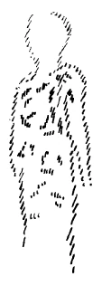
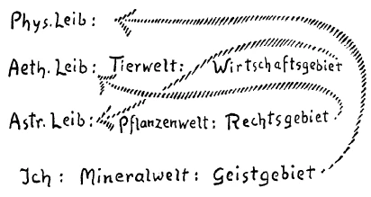

[ 1 ] ^c1oodu

Gestern versuchte ich von einer gewissen Seite her zu beleuchten die Notwendigkeit einer Gliederung in der sozialen Ordnung und wies darauf hin, daß dasjenige, was man Beweisführen nennen könnte innerhalb der Geisteswissenschaft, darin besteht, daß die Tatsachen, auf die hinzuweisen ist, von den verschiedensten Seiten her gestützt werden, und daß schließlich der Grad der Überzeugung sich immer mehr steigert, je mehr man solche Stützen bekommt. Ich möchte kurz wiederholen, was vorgebracht worden ist. Wir kennen ja die Gliederung des Menschen, wir wissen, daß der Mensch sich gliedert in seinen physischen Leib, seinen Ätherleib, seinen astralischen Leib und das, was wir das Ich nennen. Wir wissen aber auch, daß diese Gliederung des Menschen gewissermaßen etwas ist, was sich in Fluß befindet. Sie können meine Darstellungen verfolgen, wie ich sie gegeben habe in meiner «Theosophie», in meiner «Geheimwissenschaft im Umriß», und Sie werden daraus ersehen, wie physischer Leib, Ätherleib, Astralleib und zuletzt auch das Ich nichts eigentlich Festes sind, sondern wie die menschliche Entwickelung gerade darin besteht, daß der Mensch durch die wiederholten Erdenleben hindurch arbeitet an diesen Gliedern seines Organismus. So daß in einer bestimmten Zeit, nach einer bestimmten Summe von Erdenleben, der Mensch so geboren wird, daß man sagen kann, er besteht sozusagen normalerweise aus physischem Leib, Ätherleib, Astralleib und Ich. Dann aber beginnt er zunächst an seinem Ich zu arbeiten, arbeitet daran durch wiederholte Erdenleben hindurch. Ist das Ich verstärkt, hat das Ich eine gewisse innere Arbeit an sich verrichtet, dann geht diese Arbeit über auf den astralischen Leib. Wiederum, hat der astralische Leib auf diese Weise durch das Ich und durch sein eigenes Mithelfen eine innere Arbeit an sich verrichtet, dann geht diese Arbeit über auf den Ätherleib, und dann zuletzt auf den physischen Leib. Da aber kommen wir dann schon in weite Zukunften hinein. Denn daß der Mensch durch diejenigen Erdenleben, die wir zunächst verfolgen, im wesentlichen der äußerlich-physischen Gestalt nach gleichbleibt, das wissen Sie. Aber diese menschliche Gestalt — das wissen Sie wiederum aus der Darstellung in meiner «Geheimwissenschaft» -, sie hat sich im Laufe der Zeit wesentlich verändert, sie wird sich auch in der Zukunft verändern. Sie wird zu diesen Veränderungen, diesen Metamorphosen gezwungen durch das, was die feineren Glieder, der astralische Leib, der Ätherleib vollbringen an dem physischen Leib. Und so wird zuletzt in fernen Zukunften eben auch der physische Leib des Menschen andere Gestaltungen annehmen. ^0o5yon

[ 2 ] ^15tumv

Nun aber hängt das, was der Mensch an seinen Gliedern arbeitet, ja zusammen mit der menschlichen Umgebung, so wie der Mensch, ich möchte sagen, von seinem Ursprunge her in seinen einzelnen Gliedern zusammenhängt mit der natürlichen Umgebung. ^9g2xk0

[ 3 ] ^ljmo2x

Man muß sich ja über das eine klar sein: Nehmen wir den physischen Leib des Menschen. Er steht innerhalb der Naturordnung als eine vereinzelte Erscheinung da. Er ist gewissermaßen herausgehoben aus der Naturordnung. Und wenn wir genügend ins Auge fassen die starke Differenzierung zwischen den Menschen und den verschiedenen Gliedern des Tierreiches, können wir nicht anders sagen als: Der Mensch ist nicht so einfach, wie es Entwickelungstheoretiker machen, an den Schluß des Tierreiches zu stellen, sondern er ist schon nicht nur eine Zusammenfassung der gesamten Tierwelt, aller Tierformen, sondern auch eine Zusammenfassung auf höherer Stufe. Diesen physischen Leib des Menschen können wir deshalb mit nichts anderem zusammenbringen als mit sich selbst. So daß wir in der ganzen Umgebung des Menschen, in der natürlichen Umgebung des Menschen nichts finden hier auf Erden, womit wir den physischen Leib des Menschen gewissermaßen wie in eine Klasse zusammenstellen können. Dieser physische Leib des Menschen steht also für sich da (siehe Schema). ^4isnlv

[ 4 ] ^o74t1g

Nun dringen wir vor, weiter nach innen gehend, zu dem Ätherleib. Da kommen wir zu dem nächsten, schon beweglichen Gliede des Menschen. Und ich habe Ihnen ja gestern dargestellt — vielleicht sogar etwas merkwürdig dargestellt für manche Empfindungen -, wie beweglich dieser Ätherleib des Menschen ist. Er hat nun einmal die Tendenz, sich der Tierwelt in einer gewissen Weise gegenüberzustellen. Er hat eine gewisse Verwandtschaft mit der Tierwelt. Ich sagte: Wenn wir gegenüberstehen einem Elefanten oder einem Esel oder auch andern Tierformen, so hat unser Ätherleib die innerliche Tendenz — er wird verhindert, sie ganz auszuführen —, aber er hat die innerliche Tendenz, gerade die Tierform nachzuahmen, ähnlich zu werden der Tierform; wenn der Mensch einem Esel, einem Elefanten, einem Kalb gegenübersteht, so will der Ätherleib diese Formen annehmen. Er hat eine besondere Verwandtschaft zu diesen Tierformen. Durch die im physischen Leib konzentrierten Kräfte wird er verhindert, das auszuführen, aber er strebt darnach. Und es ist eine erste Erfahrung der Initiation, daß dieses innerliche Spannen und Drängen auftritt gegenüber der Tierwelt, daß man ähnlich werden will den Tieren. So daß man sagen kann, der Mensch ist in bezug auf seinen physischen Leib nicht verwandt mit der Tierwelt, aber sein Ätherleib zeigt eine ganz entschiedene Verwandtschaft mit der Tierwelt. ^byooya

[ 5 ] ^1yfp1u

Nun schreiten wir zum astralischen Leib vor. Da finden wir eine gleiche innere Verwandtschaft mit der Pflanzenwelt. Der astralische Leib hat die Tendenz, wenn er der Pflanzenwelt gegenübersteht, pflanzenähnlich zu werden, und zwar derjenigen Pflanze, der er gegenübersteht, ähnlich zu werden. Ich habe Ihnen gestern mehr zum Memorieren gesagt: Wenn wir gegenüberstehen einem Esel, der Disteln frißt, so will! der Ätherleib dem Esel und der astralische Leib der Distel gleichen. Das ist so. In dieser Weise sind wir verwandt mit der Umgebung der Naturreiche. Also im astralischen Leib sind wir verwandt mit der Pflanzenwelt. ^3d9c0y

[ 6 ] ^iknbcb

Und in bezug auf unser Ich, sagte ich Ihnen, sind wir verwandt mit der mineralischen Welt. ^7ppztk

Physischer Leib ^pa1uza

Ätherleib: Tierwelt ^nibi6l

Astralleib: Pflanzenwelt ^32p0fu

Ich: Mineralwelt. ^pw0sfz

[ 7 ] ^e1cz0p

Das ist natürlich, weil es dem unmittelbaren Bewußtsein vorliegt, dasjenige, was wir als Menschen am leichtesten eben auch für das gewöhnliche Bewußtsein konstatieren können. Unser ganzer Bewußtseinsinhalt ist ja eigentlich dieser Verwandtschaft mit der mineralischen Welt verdankt. Wir bilden unseren Bewußtseinsinhalt im wesentlichen aus an der mineralischen Welt, und ich habe Ihnen gesagt, weil der Mensch mit seinem Ich, wie es heute vorliegt, hinorganisiert ist auf die Mineralwelt, davon kommt es ja, daß wir eigentlich in unseren wissenschaftlichen Bestrebungen nicht vordringen können zum Ergreifen der Pflanzenwelt oder gar der Tierwelt, nicht vordringen können zum Ergreifen des Lebendigen, daß immer herumdiskutiert wird, ob das Lebendige begriffen werden könne, ob es nicht begriffen werden könne. Nur Menschen, welche von einer andern Art der Anschauung ausgehen, wie zum Beispiel Goethe, die erwerben sich ein Bewußtsein davon, daß in das Lebendige in einer gewissen Weise hineingedrungen werden kann. Und die Initiation gibt natürlich die Möglichkeit, dasjenige, was im astralischen Leib in bezug auf die Pflanzenwelt, im ätherischen Leib in bezug auf die Tierwelt vorgeht, in einer ähnlichen Weise innerlich zu verfolgen, wie man mit dem gewöhnlichen Bewußtsein nur die Verwandtschaft des Menschen mit der Mineralwelt verfolgt. Und dann, sagte ich Ihnen, arbeitet der Mensch an seinem Ich. Er arbeitet sein Ich durch seine wiederholten Erdenleben aus. Was aus dem Mineralreich herausgeborener Inhalt ist, das arbeitet er also um. Er macht daraus seine Wissenschaft, er macht daraus seine Kunst, er macht daraus seine Religion. All das, was als Kultur, als Zivilisationsinhalt in dieser Weise erscheint, das ist ja im Grunde genommen umgestaltetes Mineralreich. ^6cjecm

[ 8 ] ^gdnvdk

Bedenken Sie nur, daß ja, wenn Sie, sagen wir, eine griechische Statue anschauen, daß Sie dann das Leben forthaben; aber alles das, was innerhalb des Mineralischen beschlossen ist, die Form, die Gliederung, das haben Sie durch ihre Umwandlung, also hier durch die künstlerische Umwandlung derjenigen Vorstellungen und Empfindungen, die Sie aus dem Mineralreich heraus unmittelbar in das Bewußtsein aufnehmen, erreicht. Und so ist es auch mit den andern Kulturinhalten. In diesem Kulturinhalt, da spricht sich, insofern die Kultur aus Kunst, Wissenschaft, Religion besteht, dasjenige aus, was das Ich an sich selber arbeitet, natürlich im menschlichen Zusammenwirken, und was im wesentlichen umgestalteter, aus dem Mineralreich gewonnener Inhalt ist. Wer wirklich unbefangen diese Dinge verfolgen kann, der wird finden, daß da umgestalteter, aus dem Mineralreich genommener Inhalt vorliegt. Wenn wir das, was in des Menschen sozialer Umgebung lebt, scharf abgrenzen, so finden wir: Alles das, was auf solche Weise entsteht, daß das Ich den aus dem Mineralreich gewonnenen Inhalt umgestaltet und daraus ein geistiges Leben formt, dasjenige formt, was unter uns lebt als Kunst, als Literatur, als Wissenschaft oder als Inhalt des Glaubens der Religionsgemeinschaften und so weiter, all das, was also im wesentlichen umfaßt wird durch diese Umarbeit des Ich an sich selbst, all das begrenzt ganz scharf dasjenige, was wir das Geistgebiet des dreigegliederten sozialen Organismus nennen. ^2lp2uj

[ 9 ] ^qsidci

Sie können also hier eine Möglichkeit gewinnen, scharf zu umgrenzen das Geistgebiet des dreigliedrigen sozialen Organismus. Es gäbe kein Geistgebiet des sozialen Organismus, wenn das Ich nicht sein eigenes Wesen so umwandeln würde, daß es den aus dem Mineralreich gewonnenen Inhalt künstlerisch, religiös, wissenschaftlich verarbeitet. ^05i1nt

[ 10 ] ^vsd7d1

Aber der Mensch wandelt ja auch seinen astralischen Leib um. Diesen astralischen Leib wandelt er nicht in derselben bewußten Weise um. Wenn wir den Kulturinhalt ansehen, so sind die bewußtesten Bestandteile dieses Kulturinhaltes die des Geistgebietes, wie wir es eben jetzt charakterisiert haben. Halb unbewußt gerade da, wo sie am schärfsten konturiert entstanden sind, halb unbewußt sind diejenigen Vorstellungen, die das Leben von Mensch zu Mensch regeln, diejenigen Vorstellungen, die das Recht umfassen und alles, was man zum Recht, nämlich zum Verhältnis von Mensch zu Mensch rechnen kann. Wer nicht jenen Unterschied begreift, der besteht zwischen einer Vorstellung, die dem religiösen oder dem wissenschaftlichen oder dem künstlerischen Gebiet angehört, und einer Vorstellung, die dem Rechts- oder Staatsgebiet angehört, der ist zweifellos kein guter Psychologe, kein Seelenkenner. Denn in ganz anderer Weise regeln wir den Verkehr von Mensch zu Mensch, regeln wir dieses dumpfe Bewußtsein: Was ist meine Pflicht gegen den andern Menschen? Was ist sein Recht gegen mich? Was ist mein Recht gegen ihn? — Alle diese Fragen, die da spielen von Mensch zu Mensch, die gehen aus einem viel dumpferen Bewußtsein hervor als dasjenige, was in Wissenschaft, Religion und Kunst lebt. Und das Gebiet, was da zwischen Mensch und Mensch sich abspielt, was eigentlich nicht in derselben Weise vom einzelnen Menschen entschieden werden kann, wie Wissenschaft, Kunst und Religion, sondern was nur entschieden werden kann durch das Zusammenleben der Menschen, durch das, ich möchte sagen, Sich-Verabreden und gegenseitige Sich-Verständigen der Menschen, das ist zu umfassen mit dem Gebiete des Rechts- oder Staatslebens, das ist das Rechtsgebiet des sozialen Organismus. ^bjzbai

[ 11 ] ^fevbwp

Noch dumpfer erlebt der Mensch ein drittes Gebiet, dasjenige, das dadurch entsteht, daß er seinen Ätherleib umgestaltet. Das ist ein Gebiet, von dem der Mensch eigentlich höchst indirekt, durch allerlei vage diätetische Vorschriften und dergleichen ein Bewußtsein erlangt. Es ist das Gebiet, welches fast schlafend von dem Menschen durchlebt wird, und was so wenig in das volle Bewußtsein heraufschlägt, daß es nicht einmal durch eine Verständigung von Mensch zu Mensch erhellt werden kann. Das Rechtsgebiet kann durch Verständigung von Mensch zu Mensch erhellt werden, und ein gewisses Ideal unserer sozialen Ordnung ist das, daß wir für das Rechtsgebiet die völlige Demokratie durchgeführt haben, wo alle mündig gewordenen Menschen in Gleichheit sich gegenüberstehen und in Verständigung sich ihr Recht besorgen. Die Dumpfheit des Bewußtseins, das die Umwandlungen des astralischen Leibes zum Inhalte hat, sie reicht aus für den einzelnen Menschen, wenn er seine Stütze hat in der Verständigung mit andern einzelnen Menschen. Wissenschaft muß der Mensch für sich begreifen, Religion muß der Mensch für sich allein, Kunst muß der Mensch aus seinem innersten individuellen Quell, aus dem Quell seiner Persönlichkeit hervorbringen. Das ist dasjenige, was aus dem offensten, aus dem klarsten Bewußtsein hervorgehen muß. Da muß der Mensch ganz auf sich allein, auf seine Individualität gestellt werden. Man empfindet es ja schon als etwas doch ziemlich Abnormes, wenn in der neueren Zeit in der Kunst zuweilen die «Assoziation» entstanden ist; allerdings war es in der Regel nur eine Assoziation zu zweien, bei Dramendichtern, die zusammen Dramen gedichtet haben, so daß man zuweilen auf den Theaterzetteln gefunden hat das Spießbürgerlustspiel von X Y und U Z. Nicht wahr, gewöhnlich ist das ja doch, wie Eingeweihte auf diesem Gebiete wissen, nicht eine richtige Assoziation zu zweien gewesen, sondern in der Regel war es ja so, daß ein älterer Herr da war, der in der Jugend Theaterstücke geschrieben hat, und dem das Talent - wenn man das so nennen kann —, solche Theaterstücke zu schreiben, schon verraucht war. Der hat sich dann zusammengetan mit einem jüngeren Menschen, der noch ganz unbekannt war, hat den das Drama schreiben lassen, hat es dann so ein bißchen durchkorrigiert und hat nun seinen Namen dazugeschrieben.. Dadurch ist der Dichter nun auch so in die Öffentlichkeit hinausgerutscht, und auf diese Weise haben sich Assoziationen auf diesem Gebiete ergeben. Aber es fühlt natürlich jeder, daß das etwas Abnormes ist, und daß dasjenige, was wirklich dem Geistgebiet angehört, auch der Persönlichkeit des Menschen ganz individuell angehören muß. Dagegen kommt der Mensch zurecht mit Bezug auf die Fixierung des Rechtes, wenn er als einzelner Mensch seine Stütze an einem andern einzelnen Menschen hat. Das genügt aber nicht bei einem dritten Gebiete, wo das Bewußtsein eigentlich nicht hinunterdringt. Im Ätherleib, wo sich eben Vorgänge abspielen, da genügt es nicht, daß der Mensch als einzelner einem andern einzelnen gegenübersteht. Wo der Mensch der Gesamtheit als einzelner gegenübersteht, da ist es notwendig, daß sich Assoziationen bilden, daß die Urteile durch Assoziieren von einzelnen Personen gebildet werden, daß also Personen ihre Erfahrungen zusammentragen und daß Taten, Werke hervorgehen aus den Assoziationen, nicht aus den einzelnen Persönlichkeiten. Wir werden da auf ein Leben verwiesen, wo der einzelne für sich nichts vermag, sondern wo er nur etwas vermag, wenn er in einer Assoziation drinnensteht und eine Assoziation wiederum in Wechselwirkung tritt mit einer andern Assoziation. Kurz, wir werden auf dasjenige verwiesen, was wirklich innerhalb der menschlichen Gesellschaft in dieser dumpferen Bewußtheit sich abspielt, wir werden auf das Wirtschaftsgebiet des sozialen Organismus verwiesen. ^mvzeyw

[ 12 ] ^tww0zr

So daß wir sagen können: Sehen wir auf dasjenige, was der Mensch, so wie er heute ist, gewissermaßen nach rückwärts, gegen die Natur hin ist, so finden wir, er ist mit seinem Ätherleib in der Tierwelt begründet, mit seinem astralischen Leib in der Pflanzenwelt, mit seinem Ich in der mineralischen Welt. Aber er wandelt diese seine bestehenden Glieder schon um, er wandelt seinen Ätherleib um, und dadurch entsteht um ihn herum im menschlichen Zusammenleben dasjenige, worinnen er wiederum mit seinem Ätherleib in der Außenwelt, im sozialen Organismus begründet ist: das Wirtschaftsleben. Er ist mit seinem Astralleib im Rechtsgebiet des sozialen Organismus, und er ist mit seinem Ich im Geistgebiet des sozialen Organismus begründet. Wir stehen also als Menschen auf der einen Seite zusammengegliedert mit den drei Naturreichen, stehen nach der andern Seite als Menschen hineingegliedert in das soziale Leben nach seinen drei verschiedenen Gliedern, dem Geistglied, dem Rechtsglied und dem Wirtschaftsglied. ^ol804d

Physischer Leib ^wrvf6e

Ätherleib: Tierwelt Wirtschaftsgebiet ^s3zduu

Astralleib: Pflanzenwelt Rechtsgebiet ^dk63ry

Ich: Mineralwelt Geistgebiet ^zhmnnk

[ 13 ] ^dn9suu

Nun müssen wir uns auf einen Boden vollständig klarer Vorstellungsart stellen, um diese ganze Einsicht, die wir dadurch gewinnen, noch mehr zu vertiefen. Fassen wir das wohl auf, daß durch die Umwandlung, die wir vollziehen in den wiederholten Erdenleben, durch die Umwandlung des Ätherleibes, des Astralleibes, des Ich, das soziale Leben in seiner Gliederung bewirkt wird. Also wenn wir den Blick so wenden, dann finden wir gewissermaßen dasjenige, was der Mensch von sich aus durch seine Gliederung beiträgt, damit das soziale Leben entsteht. Aber nun wirkt das soziale Leben wiederum auf ihn zurück, auf den Menschen. Ich möchte sagen, wir haben bis jetzt die Willensseite des sozialen Lebens betrachtet, wir haben betrachtet, wie es entsteht, das soziale Leben, wie es herausfließt aus der Gliederung der Menschennatur. Aber es ist ja dann da, wenn es herausgeflossen ist! Also es fließt das Wirtschaftsgebiet aus dem ätherischen Leib oder aus der Umwandlung des ätherischen Leibes, es fließt das Rechtsgebiet aus dem Astralleib, es fließt das Geistgebiet aus der Umwandlung des Ich, aber indem es dann ausgeflossen ist, ist dieses Geistgebiet, ist dieses Rechtsgebiet, ist dieses Wirtschaftsgebiet, sind diese drei Glieder ja Realitäten, und dann wirken sie wiederum zurück auf den Menschen. Also der Mensch setzt sie erst aus sich heraus, und sie wirken wiederum auf ihn zurück. ^bt0b2v

[ 14 ] ^4c9z6w

Diese zweite Art des Zusammenwirkens des Menschen müssen wir auch beachten. Das ist so, daß wir sagen können, das ist mehr von der Wahrnehmungsseite aus. Das, was wir hier betrachtet haben, war mehr von der Willensseite aus, wie der Mensch die Dreigliederung bewirkt. Jetzt wollen wir mehr zu der Wahrnehmungsseite gehen, was für Eindrücke da entstehen, indem des Menschen Umgebung auf den Menschen wiederum zurückwirkt. Und da zeigt sich denn der Beobachtung, daß das Geistgebiet zurückwirkt auf den physischen Leib des Menschen (siehe Schema Seite 217), allerdings nur in sehr spärlichem Grade, auf den physischen Leib im gegenwärtigen Erdenleben. Wir können zwar in einem gewissen Grade konstatieren, daß der Mensch, indem er sich mit einer Verwandtschaft zu seiner Umgebung entwickelt, von dieser Umgebung, insofern sie das Geistgebiet ist, etwas annimmt. Wächst der Mensch auf in einer gewissen Kunstatmosphäre, man kann es ihm, wenn man dafür eine Empfindung hat, ansehen an der Physiognomie, man kann es ihm, wenn er in einer philiströsen Atmosphäre aufwächst, an der Physiognomie ansehen. Aber das ist, möchte ich sagen, doch etwas, was eben nur eine ganz feine Lebensnuance ist. Im ganzen können wir sagen: Es ist nicht so, daß der physische Leib des Menschen in bezug auf seine Gestaltung in diesem Leben eine starke Beeinflussung durch die Umgebung des Geistgebietes zeigt. Um so stärker ist diese Beeinflussung für die nächsten Erdenleben. Das ist allerdings so, daß wir in den nächsten Erdenleben stark jene Physiognomie tragen werden, die herkommt aus der geistigen Umgebung in diesem Erdenleben. Und so, wie wir jetzt ausschauen, wie wir jetzt unsere Physiognomie haben, ist es im wesentlichen das Ergebnis des Einflusses des Geistgebietes, in dem wir waren im früheren Erdenleben. Man kann schon, wenn man dafür eine Empfindung hat, vom Gesichte eines Menschen ablesen, in welcher Umgebung er in früheren Erdenleben war, wenn das auch nur, ich möchte sagen, in einem gewissen allgemeinen Sinne möglich ist. Aus diesen Dingen gehen auch gewisse Diskrepanzen hervor, die uns zuweilen recht stark entgegentreten im menschlichen Leben. ^mivr5w

[ 15 ] ^j4n8t0

Bedenken Sie einmal, nun, sagen wir, ein Mensch stamme in bezug auf sein voriges Erdenleben aus einer feingestimmten Familie und wächst jetzt auf in einer rohen Familie, dann trägt er jene feine Lebensnuance, von der ich vorhin gesprochen habe, wenn auch, ich möchte sagen, in unbeträchtlicher Weise, in seinem Gesichte. Vielleicht trägt er stark gerade dasjenige in seinem Gesichte, was er aus seinem früheren Erdenleben mitgebracht hat. Man begreift da oftmals nur aus diesem Zusammenhang, wie es kommt, daß ein roher Kerl eigentlich manchmal ein ganz feines Gesicht haben kann. Die Dinge im menschlichen Leben hängen eben durchaus in komplizierter Weise zusammen. ^1ww3r0

 ^r09xbr

[ 16 ] ^lurhhg

Nun werden Sie sagen: Ja, aber der Mensch nimmt doch für das nächste Erdenleben seinen physischen Leib nicht mit, er legt ihn ja ab. — Das ist in bezug auf die Materie der Fall, aber ich möchte das noch einmal wiederholen, was ich vor einiger Zeit gesagt habe. Das was Sie eigentlich sehen als den physischen Leib in seiner Form, das ist ja nicht der physische Organismus des Menschen, das ist eben die Form (siehe Zeichnung). Und in diese Form ist nur hineingegliedert die Materie. Sie ist aufgefaßt von der Form, und die Form ist etwas durchaus Geistiges, und diese Form meine ich, wenn ich jetzt von dem Einfluß des Geistgebietes auf den physischen Leib spreche. Das, was abgelegt wird, das sind ja nur die materiellen Teilchen, die eingegliedert sind. Die Form aber, die der Mensch hat, wird nicht abgelegt, sondern wirkt in das nächste Leben hinein — namentlich das, was der Mensch entwickelt durch die Behendigkeit und Beweglichkeit seiner Gliedmaßen, seiner Hände und Arme, seiner Füße und Beine -, das kommt in der Kopfbildung des nächsten Lebens zum Vorschein. ^vjmpch

[ 17 ] ^fitur9

Also der physische Organismus trägt durchaus seine Spuren in das nächste Erdenleben hinein, und er trägt sie hinein nach Maßgabe des ihn in diesem Erdenleben umgebenden Geistgebietes. ^hgzvk1

[ 18 ] ^qzmolh

Dagegen wirkt das Rechtsgebiet zurück auf den ätherischen Leib (siehe Schema Seite 217). Bei dem ist es allerdings so, daß er nach dem Tode, während der physische Leib, also dasjenige, was materiell am physischen Leib ist — nicht die Form — der Erde übergeben wird, dem Kosmos übergeben wird, sich darinnen auflöst; aber das, was in ihm als Kräfte wirkt, das trägt sich hinüber in das nächste Erdenleben, wirkt wenigstens hinüber. Aber es wirkt nicht nur auf das nächste Erdenleben hinüber; da wirkt es sogar, wie man empirisch aus der Geisteswissenschaft wissen kann, in sehr geringem Grade hinüber. Während die Gestalt des physischen Leibes stark in das nächste Erdenleben hinüberwirkt und damit alles das, was der physische Leib sich erobert hat aus dem Geistgebiet, das ihn umgibt, wirkt dasjenige, was im ätherischen Leib nun aus dem Rechtsgebiete kommt, vor allen Dingen auf den Kosmos. Und das ist eine sehr wichtige Entdeckung, welche die Initiationswissenschaft macht. ^wr7kqw

 ^tj115w

[ 19 ] ^bs178t

Wir leben in der Welt. Wir haben durch die Art und Weise, wie wir sozial in die Welt hineingestellt sind, eine gewisse Seelenverfassung. Wir stehen ja zu den Menschen, mit denen wir in Berührung kommen im Leben, nach Rechtsbegriffen oder Begriffen und Empfindungen, die ähnlich sind den Rechtsempfindungen. Das gibt unserer Seele eine gewisse Konfiguration. Grob gesprochen, stehe ich meinetwillen im Leben zu zehn Menschen in einem gewissen Verhältnisse, den einen Menschen liebe ich, den andern hasse ich, der dritte ist mir gleichgültig, von dem vierten bin ich abhängig, der fünfte ist von mir abhängig und so weiter. Also in der verschiedensten Weise sind meine Rechte und Pflichten gegen diese zehn Menschen konfiguriert. Das aber lädt sich als eine Seelenverfassung in mir ab, nicht nur in oberflächlicher Weise, sondern der Empfindungsgehalt meiner Seele hängt davon ab. Dieses vom Gesichtspunkte des Rechtsgebietes im sozialen Leben Darinnenstehen, das gibt meinem ätherischen Leib eine gewisse Konfiguration, die nun, wenn ich sterbe, sich überträgt auf den Kosmos. Was da in meinem ätherischen Leibe schwingt, das schwingt weiter, wenn der ätherische Leib von mir getrennt ist, im Kosmos, und das zieht da weiter seine Wellen. ^m5ve0h

[ 20 ] ^wvujgp

Solche Dinge werden ja leider von dem, was man heute Wissenschaft nennt, gar nicht beachtet. Daher hat diese Wissenschaft kein Bewußtsein von den intimeren Zusammenhängen des Menschenlebens mit dem kosmischen Leben. Die Art und Weise, wie heute auf der Erde Wind und Wetter verlaufen, wie also der Rhythmus unseres äußeren Klimas sich vollzieht, ist im wesentlichen das Fortschwingen von Rhythmen, die durch das Rechtsleben im sozialen Organismus vergangener Zeiten veranlaßt worden sind. Der Mensch steht einmal mit der äußeren Wirklichkeit, auch der natürlichen Wirklichkeit, in einer gewissen Beziehung. Und es ist notwendig, einzusehen, daß dasjenige, was sich als Rechtsgebiet um uns herum entwickelt, nicht etwas bloß Abstraktes ist, was die Menschen begründen, was entsteht und wieder verschwindet, sondern das, was zunächst ideell ist, was zunächst im Rechtsgebiete lebt, es lebt in einer späteren Zeit des Erdendaseins in der Atmosphäre, in den Schwingungen, in der ganzen Konfiguration, in den Bewegungen der Atmosphäre. ^y2alnq

[ 21 ] ^obizgs

Das richtig aufgefaßt, gibt dem Menschen eine Empfindung von seinem Zusammenhange mit dem ganzen Erdenleben. Es läßt ihm erst erscheinen, wie wichtig es ist, daß er dieses oder jenes Rechtsleben, ein gutes, ein schlechtes Rechtsleben entwickelt. Alles, was physisch ist, geht ursprünglich aus irgend etwas Geist-Geordnetem oder Geist-Ungeordnetem eigentlich hervor. Geisteswissenschaft muß eben darauf dringen, daß der Mensch einen vollen, lebendigen, bewußten Entwickelungszusammenhang mit dem Kosmos hat. ^o123at

[ 22 ] ^14cac1

Wie ist es denn heute? Wir sind in unserer heutigen Zeit der Dekadenz dahin gekommen, daß wir mit abstrakten Begriffen die Natur umfassen, eine Naturwissenschaft begründen, die eigentlich nichts enthält von dem, was im Menschen lebt, die einen Inhalt gibt, der im Grunde nicht der Inhalt des menschlichen Lebens ist. Und das, was der Mensch im Inneren erlebt, steht in keiner Beziehung zu dem, was da draußen vorgeht. Das steht auf der einen Seite. ^0siprm

[ 23 ] ^n72cyh

Und auf der andern Seite soll der Mensch, ich möchte sagen, ganz abgesondert von diesem Naturwissen, das er entwickelt, eine Art Gottesbewußtsein oder ein Bewußtsein von seinem Verhältnis zu dem Gotte entwickeln. Beide Dinge wollen miteinander gar nichts zu tun haben, können eigentlich miteinander nichts zu tun haben nach der Art, wie sie sich bis in die Gegenwart herein ausgebildet haben. Dagegen zeigt uns Geisteswissenschaft, wie im einzelnen ganz konkret der Mensch nicht nur zusammenhängt mit der ganzen Welt, sondern wie er selber mitarbeitet. Man sieht an dem, was entsteht, wie er lebte in früheren Erdenleben. Wir begründeten in früheren Erdenleben Rechtssysteme. Jetzt leben wir wieder. Jetzt haben wir ein bestimmtes Wetter, Wind und dergleichen, Jahreszeiten mit dieser oder jener Konfiguration: Wir erleben jetzt außen in der Atmosphäre, was wir einstmals als Rechtsordnung begründet haben. Da wächst der Mensch in seinem Bewußtsein zusammen mit dem, was seine Umgebung ist. Da redet man nicht nur im allgemeinen abstrakt herum, daß der Mensch ein Gottesbewußtsein in seinem Inneren hat und daß er mit der Außenwelt eine Einheit bildet, sondern da lernt man im einzelnen erkennen, wie diese Einheit gestaltet ist, wie der Mensch zusammenfließt mit dem, was im ganzen Weltenall ist. ^4rfojb

[ 24 ] ^5joply

Bedenken Sie doch nur einmal, was würde man vom Menschen wissen, wenn man keine Ahnung davon hätte, daß es das Blut seines Kopfes ist, das durch seine Beine rinnt, wenn man also nicht den ganzen Kreislauf der Geschehnisse im Organismus, insofern er in der Haut beschlossen ist, anschauen würde? Aber in derselben Weise, wie man nicht darf, sagen wir, den Kopf für sich betrachten und den Zusammenhang mit dem übrigen Organismus nicht ins Auge fassen, in derselben Art darf man nicht den Menschen in einem Erdenleben für sich betrachten, sondern man muß den Kreislauf der Metamorphose betrachten. Was das eine Mal eine geistig-soziale Rechtsordnung ist, das wird das andere Mal, freilich in fern davon gelegenen Zeiten, eine Naturordnung, und man kann mit Hilfe von Geisteswissenschaft sehen, wie die geistig-ideelle Rechtsordnung des einen Mals zusammenhängt mit der natürlichen, atmosphärischen Ordnung des andern Mals. ^9ajryy

[ 25 ] ^zckv8d

Wenn diese Dinge sich so entwickeln, daß dadurch des Menschen Fühlen von seinem Darinnenstehen in der Welt vertieft wird, der Mensch sich mit der Welt als eine Einheit fühlt, dann wird tatsächlich jene notwendige, unerläßliche Versöhnung von Wissenschaft und Religion eintreten, die für den Aufbau unseres sozialen Lebens absolut notwendig ist. ^8lflgr

[ 26 ] ^xx54f5

Wie das Rechtsgebiet auf den Ätherleib wirkt, das Geistgebiet auf den physischen Leib wirkt, so wirkt das Wirtschaftsgebiet auf den astralischen Leib, und wir können sagen, gerade auf dieses Innerlichste der Menschennatur wirkt das Wirtschaftsgebiet! Sie müssen unterscheiden: entstehen tut das Wirtschaftsgebiet aus dem Ätherleib heraus, aber wenn es zurückwirkt auf den Menschen, dann wirkt es auf den astralischen Leib zurück. Die Rückwirkung ist eine andere als diejenige, die vom Menschen ausgeht. Man kann sich diese Dinge nicht schematisch bloß konstruieren, sondern man muß sie empirisch aus der Anschauung hervorholen. Und gerade dadurch, daß das Wirtschaftsgebiet auf den astralischen Leib wirkt, gerade dadurch wird jene Brüderlichkeit, welche ja im Wirtschaftsgebiet sein soll, durch die Pforte des Todes durchgetragen, denn der astralische Leib wird für eine Zeitlang vom Menschen mitgenommen. Und was da durch die Brüderlichkeit in des Menschen Seele begründet wird, das wird durch den Tod in die geistige Welt hineingetragen und wirkt als solches weiter. So daß dasjenige, was von andern Gesichtspunkten von mir schon erörtert worden ist, gerade durch diesen Gesichtspunkt wiederum zum Vorschein kommt. ^o4sr05

[ 27 ] ^9tpjmm

Das Wirtschaftsgebiet, also die Art und Weise, wie sich der Mensch mit andern zusammen in Assoziationen die Grundlage für wirtschaftliche Urteile und wirtschaftliche Taten bildet, das wirkt auf den astralischen Leib des Menschen zurück, und das gestaltet den astralischen Leib des Menschen, und eigentlich trägt der Mensch diejenige Gestaltung des astralischen Leibes durch den Tod hindurch, die er aus der Brüderlichkeit des Wirtschaftslebens heraus sich erobert. Man darf nicht als Idealist oder gar als Mystiker das Wirtschaftsleben besonders gering achten, denn gerade im Wirtschaftsleben kann man die Brüderlichkeit entwickeln, wie wir oft ausgeführt haben. Und was da im scheinbar materiellen Leben als Geistiges hineingetragen ist, das erobert sich der Mensch gerade für sein höheres Reich. Was er im Geistgebiet begründet, das zieht er aus dem Mineralreich heraus, das ist etwas, was er im Grunde genommen in seinen Anlagen hat, die er sich durch die Geburt mitbringt. Was er aber ins wirtschaftliche Gebiet hineinträgt, das ist dasjenige, was so fest sich mit der Seele zusammenschließt, daß er es durch seinen Tod hindurchträgt. ^sxekc9

Phys. Leib ^k3t7hr

Ätherleib: Tierwelt Wirtschaftsgebiet | Astralleib ^z0kpeq

Astralleib: Pflanzenwelt Rechtsgebiet | Ätherleib ^bhr5ja

Ich: Mineralwelt Geistgebiet | Physischer Leib ^wqnw8n

Willensseite | Wahrnehmungsseite ^7i7csv

[ 28 ] ^qoq8l2

Es ist schon so, daß wir sagen müssen: Ja, da glauben die Leute, Idealisten oder Mystiker zu sein und die Materie verachten zu müssen, aber man ist nicht dadurch Idealist, daß man die Materie verachtet, sondern man ist dadurch Idealist, daß man die Materie zu vergeistigen weiß. Und dem Wirtschaftsleben gegenüberzustehen in falscher Äsketik, es verachten, gering achten, das ist nicht dasjenige, worauf es ankommt, sondern worauf es ankommt, ist, dieses Wirtschaftsleben so zu gestalten, daß der Geist ihm überall seinen Stempel aufdrückt, so daß gerade dieses Wirtschaftsgebiet des sozialen Organismus ein vom Menschen geprägtes durchgeistigtes Gebiet ist. Das ist auch das, worauf es für die Zukunft im wesentlichen ankommt. Und im kleinen, nicht wahr, macht sich das schon dadurch geltend - ich habe das schon einmal erwähnt -, daß die Menschen idealistisch zu sein glauben, geistig zu sein glauben, wenn sie dem Geiste, sagen wir, den Tribut des Materiellen versagen und meinen: Es ist nicht nötig, für das Geistige das oder jenes wirklich als Opfer darzubringen! Das Geistige ist ja eben das Geistige — sagen sie —, man muß es hoch schätzen, man muß es nicht dadurch in den Staub herunterziehen, daß man für das Geistige Geld etwa als Opfer hingibt! Darum ist man ein richtiger Idealist, wenn man sich sagt: Ja, ich verehre den Geist, aber ich halte meine Taschen zu und tue nichts für die Pflege des geistigen Lebens. — Man verachtet die Materie, man verachtet vor allen Dingen das Schlimmste der Materie, das Ahrimanischste der Materie, man macht so fest die Taschen zu, damit ja nichts heraus kann für die Pflege des Geisteslebens. Das sind Dinge, die doch auch ein wenig mit der Gesinnung zusammenhängen, die bei Idealisten und Mystikern so leicht aufkommt. Die Materie wird verachtet, statt daß sie durchgeistigt wird. Ja, die Materie verachten, woher kommt das? Weil die Idealisten und Mystiker heute oftmals die stärksten Materialisten sind, weil sie so gebändigt sind von der Materie, daß sie ihr gegenüber gar nicht anders aufkommen, als indem sie sich in eine Verachtung hineinträumen. Sie träumen sich ja nur in eine Verachtung hinein. Und so verachten sie die Materie, weil sie selbst gegen sie nicht aufkommen würden, weil sie so tief in ihr drinnenstecken. ^gggstd

[ 29 ] ^byikqr

Man muß sich schon klar darüber sein, wie in unserer Zeit gewisse Empfindungen, Gefühle existieren, die eigentlich Masken sind. Und mancher, der heute als Mystiker einherstolziert, ist eigentlich nur Materialist, wie ich ja aus andern Gesichtspunkten gerade in diesen Wochen auch zu erklären versuchte. Aber Sie sehen vor allen Dingen wiederum aus dem, was ich heute Ihnen nahezubringen versucht habe, wie durch Geisteswissenschaft das Zusammengehörigkeitsgefühl des Menschen mit der Welt erwachen kann und immer intensiver und intensiver werden kann. Das ist in der Gegenwart notwendig! ^amwy7r

[ 30 ] ^6myb1y

Eigentlich hat es der Mensch bis zu einem gewissen Punkte seiner Entwickelung gebracht, weil er nichts dazu zu tun brauchte. Wir sind in der Erdenentwickelung von dem Ursprunge des Erdendaseins selber ausgegangen. Da haben göttlich-geistige Wesen am Beginne der Erdenentwickelung für uns gesorgt, da haben sie schon eingegliedert der Erdenorganisation den Boden, das Klima und sogar schließlich das geistige Leben; denn Sie wissen, daß große Lehrer in Mysterien da waren, deren Lehrer selber wiederum die Götter waren. So daß also nicht Menschliches aufgespeichert worden ist, sondern Göttliches übernommen worden ist. Da war von den Göttern besorgt worden alles das, was für die Menschheit geordnet vorhanden gewesen ist. Das aber - ich habe es Ihnen aus den verschiedensten Zusammenhängen her gezeigt -, alles das ist im wesentlichen verflogen in unserer Zeit; und das Katastrophale in unserer Zeit hängt damit zusammen, daß der alte Götterinhalt verflogen ist, daß die Menschen aus sich heraus einen neuen Inhalt schaffen. Sie schaffen diesen neuen Inhalt dann nicht nur für das Menschenleben im Geistgebiet, im Rechtsgebiet, im Wirtschaftsgebiet, sondern sie schaffen es für dasjenige, was aus diesen Gebieten hinausgeht bis in das Naturleben. Und die Zukunft der Erde muß des Menschen eigene Gestaltung, muß des Menschen eigene Sorge sein. ^20j381

[ 31 ] ^03eb5w

Daher hat ein solcher Mensch wie Spengler in bezug auf die gegenwärtige Menschheitsanschauung ganz recht, wenn die Menschen nicht den Quell in sich anregen, der schöpferisch sein kann nicht nur für das Rechts- oder für das Wirtschafts- oder für das Geistesleben, sondern der schöpferisch sein muß aus diesen Gebieten heraus für das ganze Erdenleben, auch für das natürliche Erdenleben. Denn dann geht nicht nur die Zivilisation in die Barbarei über, wie Spengler heute schon wissenschaftlich beweist, sondern es geht die ganze Erde dem Untergang entgegen, erreicht ihr Ziel nicht. Möchten sich doch die Menschen durchdringen mit diesem Bewußtsein, daß dasjenige, was in der Zukunft der Erdenentwickelung geschieht, an der Menschheit selber hängt. Dann könnte aus dieser Empfindung der starke Impuls hervorgehen, der heute notwendig wäre, um die durchaus absteigende Erdenordnung wiederum überzuführen in eine aufsteigende Erdenordnung, um aufzurufen die schläfrigen Seelen, die nicht sehen wollen, was eigentlich vor sich geht, um umzuwandeln diese schläfrigen Seelen in wachende Seelen. Denn eine wachende Menschheit brauchen wir heute, und eine wachende Menschheit ist einzig und allein diejenige, die dasjenige übersieht, was um sie herum vorgeht, und die auch die Aufgaben kennt, die im Gange der Menschheitsentwickelung liegen und in bezug auf welche die Menschheit in der Gegenwart gerade in starke Prüfungen hineingestellt wird. ^urier3