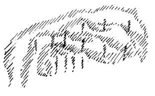

[ 1 ] ^uuw9y8

Wenn wir uns heute einen Überblick verschaffen über das, was durch die zivilisierte Welt geht, was in ihr vorhanden ist, so finden wir eigentlich — wir dürfen es schon, nachdem wir ja manches andere zur Erklärung vorausgeschickt haben, sagen — einen werdenden 'Trümmerhaufen der Zivilisation. Wir müssen, wenn wir verstehen, was Geisteswissenschaft uns über die Weltengeheimnisse sagen kann, uns ja ganz klar darüber sein, daß alles, was äußerlich in der physischen Welt geschieht, seinen Ursprung hat in der geistigen Welt. In der geistigen Welt liegen die Veranlassungen für das, was sich auch zu irgendeiner Zeit im geschichtlichen Werden der Menschheit vollzieht. Daß wir im gegenwärtigen Zeitaugenblicke in einer solchen Menschheitsverfassung leben, wo der Mensch darauf angewiesen ist, aus seinem eigenen Inneren heraus etwas zum Neuaufbau beizutragen, das ist eine andere Wahrheit, die wir uns nicht oft genug vor das Seelenauge stellen können. Wir leben nicht mehr in einer Zeit, in der der Glaube hinreicht, daß die Götter schon helfen werden. Die Götter rechnen in der heutigen Zeit gar nicht damit, daß sie und ihre Absichten von den Menschen erkannt werden. Und es ist vieles, was vor verhältnismäßig kurzer Zeit noch nicht in der Menschen Absichten gestellt war, eben heute in der Menschen Absichten gestellt. ^37mxuz

[ 2 ] ^nrv45c

Eine solche Wahrheit muß in ihrem vollen Ernste und im Grunde genommen von jedem einzelnen ins Auge gefaßt werden. Um das zu können, dazu wird vor allen Dingen notwendig sein, daß wir manche Dinge, aus denen wir herausgewachsen sind, verstehen. Der Mensch ist ja nach und nach während des materialistischen Zeitalters dazu gekommen, alles, ich möchte sagen, von einem gewissen absoluten Gesichtspunkte aus zu fassen, von einem solchen absoluten Gesichtspunkte aus, der noch dazu eigentlich zeitlich sehr beschränkt wird. Ist heute einer fünfundzwanzig Jahre alt, dann fühlt er sich dazu berufen, über alles zu urteilen. Er hat den Glauben, daß man ohne irgendwie weiter eine Entwickelung oder so etwas durchzumachen, ein abschließendes Urteil über alles haben könne. Er wird vielleicht, wenn er dann fünfzig Jahre alt geworden ist, mit einiger Überlegenheit auf seine Urteilsfähigkeit von vor fünfundzwanzig Jahren herunterblicken, aber er wird nicht irgendwie, sagen wir, sich erzogen fühlen, mit fünfundzwanzig Jahren nach dem reiferen Urteil der Fünfzigjährigen hinzuschauen und mit ihm zu rechnen. Unter den Ursachen, die unserer chaotischen Gegenwart zugrunde liegen, ist die eben gekennzeichnete wahrhaftig nicht eine der geringsten, sondern eine der allerwichtigsten, allerdings eine solche Ursache, die einmal mitwirken mußte an der ganzen Entwickelung der Menschheit. Denn nur dadurch, daß der einzelne Mensch in einer gewissen Weise sich völlig emanzipiert fühlt von allem Weltenzusammenhang und sich sogar nicht einmal bloß persönlich, das heißt im Leben zwischen Geburt und Tod, sondern in jedem Zeitpunkte dieses Lebens auf einen absoluten Standpunkt stellt, auf den Standpunkt, daß er souverän urteilen kann über alles, nur dadurch, daß unter den vielen Lebensillusionen - und in der bloß physischen Welt ist ja gewissermaßen alles Illusion — sich auch diese eingestellt hat, wird die Menschheit den einzelnen Menschen zur Freiheit allmählich hingeleiten. ^fm8gwt

[ 3 ] ^mta9ph

Aber beachtet werden muß der große Unterschied dieses unseres Zeitalters, das von einem solchen Gesichtspunkte ausgeht, von jenen Zeitaltern, in denen ganz andere Lebensimpulse dem menschlichen Dasein zugrunde lagen. Und auf solche früheren Lebensimpulse, die wiederum die späteren werden sollen, zu denen alles Streben in der Gegenwart wiederum hindrängen soll, auf solche Lebensimpulse in früheren Zeiten muß schon hingeschaut werden. Sie sind ja nur langsam und allmählich verschwunden in der Menschheitsentwickelung, und man unterschätzt das ganze "Tempo der neuzeitlichen Geistesentwickelung, wenn man in ihm nicht den schnellen Ablauf sieht, der in wenigen Jahrhunderten Ungeheures von dem, was an Geistigkeit vorher vorhanden war, hinweggeschmolzen hat durch die Impulse des Materialismus. ^p68ow1

[ 4 ] ^lett94

Versetzen wir uns einmal, um Ausgangspunkte zu gewinnen für eine wirkliche Gegenwartsbetrachtung, wie wir sie dann morgen anstellen wollen, zurück, nun, sagen wir in die beste Zeit des alten ägyptischen Lebens. Im alten ägyptischen Leben oder im alten chaldäischen Leben waren selbstverständlich auch in der äußeren Welt soziale Einrichtungen da; diese sozialen Einrichtungen waren inauguriert und getroffen von gewissen Menschen. Aber diese Menschen urteilten nicht so, daß sie in ihren weisen Köpfen ausspintisierten, wie man die besten sozialen Einrichtungen trifft, was für das Zusammenleben der Menschen nach ihrer Meinung das Richtige sei, sondern sie wandten sich an die Initiationsstätten. Und im Grunde genommen war der initiierte Weise, der in die Geheimnisse des Weltenalls eingeweiht wurde in den Initiationsstätten, der wirkliche tonangebende Berater der obersten sozialen Lenker, die zum großen Teile selbst, je nach ihrer Würdigkeit und Reife, Eingeweihte waren in die Weltengeheimnisse. Und wenn man Bestimmungen treffen sollte über das, was in der sozialen Ordnung geschehen sollte, dann fragte man im wahren Sinne des Wortes nicht an beim gescheiten menschlichen Kopfe, sondern man fragte an bei dem, was die Himmelszeichen deuteten. Denn man wußte, wenn ein Stein zur Erde fällt, so hat das mit Kräften der Erde zu tun; wenn es regnet, hat es mit Kräften der Luft, des Luftumkreises zu tun. Wenn aber menschliche Schicksale sich vollziehen sollen, die aufeinander bestimmend wirken sollen, dann hat das nichts zu tun mit irgendwelchen Naturgesetzen, die man hier auf diese Weise gewinnen kann, sondern dann hat das zu tun mit denjenigen Gesetzen, die im Kosmos verfolgt werden konnten aus dem, was etwa der Gang der Sterne zeigte. So wie wir die Zeit ablesen von der Uhr, so las man den Gang der Sterne ab. Aber, wie wir nicht sagen: Mein Zeiger steht da unten rechts und der andere links —, sondern wie wir sagen: Diese Zeigerstellung bedeutet uns, daß die Sonne vor so und so vielen Stunden untergegangen ist und dergleichen -, so sagten sich diese Menschen, die den Gang der Sterne ablasen: Diese und jene Konstellation der Sterne bedeutet uns diese und jene Absicht jener göttlich-geistigen Wesenheiten, welche leitend und lenkend sind für alles, was man menschliches Geschick nennen kann. — Man schaute auf die Absichten der geistigen Mitgenossen des Kosmos, indem man hinaufblickte zum Gang der Sterne, und man war sichklar darüber: Nicht alles, was der Mensch zu wissen braucht, enthüllt sich hier auf dieser Erde, sondern das Wichtigste sogar, was der Mensch zu wissen braucht, die Kräfte, die in seinem sozialen Leben wirken, die enthüllen sich aus dem, was im Kosmos beobachtbar ist, außerhalb der irdischen Welt. Man wußte, man kann nicht die Angelegenheiten der Menschheit auf Erden besorgen, wenn man nicht die Absicht der Götter im außerirdischen Raume erforscht. Man gliederte also dasjenige, was in der sozialen Ordnung hier vollzogen werden sollte, an Außerirdisches an. ^o5e695

[ 5 ] ^y5u02y

Nun fragen wir uns: Wo ist denn heute Geneigtheit dazu vorhanden, irgendwie diese großen Zeichen des außerirdischen Kosmos zu erforschen, wenn da oder dort wiederum der Glaube auftritt, es muß diese oder jene Reformbewegung ins Leben gerufen werden? Das ist ein viel wichtigeres Kennzeichen des Materialismus, daß der Mensch nicht mehr befrägt das außerirdische Weltenall zur Ordnung seiner irdischen Angelegenheiten, als alles das, was als naturwissenschaftlicher Materialismus aufgetreten ist. Und man ist nicht dadurch Spiritualist, daß man Theorien aufstellt über den Menschen und über irgend etwas anderes in der Welt, sondern man wird erst dadurch Spiritualist, daß man wiederum die Angelegenheiten der irdischen Menschheit an das Außerirdische anzuknüpfen verstehen wird. ^refk4b

[ 6 ] ^an5sdb

Da muß man aber vor allen Dingen die Überzeugung haben, daß sich die Dinge dieser Welt nicht ordnen lassen nach den durch die bloße naturwissenschaftliche Bildung anerzogenen Urteilen. Da muß man in die ganze zivilisatorische Erziehung hineinbringen können die Fähigkeit, eben wiederum Außerirdisches mit Irdischem zu verbinden. Da ist vor allen Dingen notwendig, genauer hinzuschauen, wie diese Fähigkeit im Laufe der Menschheitsentwickelung verlorengegangen ist, wie wir dazugekommen sind, alles nur vom irdischen Gesichtspunkte aus beurteilen zu wollen. Nehmen wir etwas, was jetzt durch die Welt geht, und was Bestandteil einer sozialistischen Agitation ist. ^5c83s6

[ 7 ] ^pbhe8p

Sie alle haben gehört, daß überall auftaucht das Bestreben, Arbeitspflicht einzuführen, das heißt, den Menschen durch irgendwelche soziale Ordnung zu verpflichten, aus den gesetzlichen Bestimmungen der sozialen Ordnung heraus zu arbeiten, nicht mehr bloß an das zu appellieren, was den Menschen zur Arbeit zwingt — den Hunger und andere Dinge -, sondern geradezu gesetzlich festzulegen die Arbeitspflicht. ^1yctmt

[ 8 ] ^103i1y

Wir sehen, wie auf der einen Seite aus sozialistischer Agitation heraus diese Arbeitspflicht gefordert wird. Wir sehen, wie in Sowjetrußland diese Arbeitspflicht geradezu schon zu einer gewissen Feststellung, einer allgemeinen Menschheitskasernierung geführt hat. Wir sehen auch, wie begeistert radikale sozialistische Menschen für diese Arbeitspflicht sind. Wir sehen allerdings auch, wie die schlafenden Seelen der Gegenwart solche Notizen aufnehmen wie die, daß da und dort wiederum ein Ministerium sogar beschlossen hat, die allgemeine Arbeitspflicht einzuführen. Man liest das wie irgendeine andere Notiz, kümmert sich nicht viel darum. Man steht auf, wie man sonst aufgestanden ist, man frühstückt, man ißt zu Mittag, man geht im Sommer aufs Land, man kommt wieder zurück, und man benimmt sich im allgemeinen heute, trotzdem die grundlegendsten Dinge durch die Welt gehen, so, wie man sich halt seither benommen hat, wie man es gewohnt worden ist seither. Aber die Menschheit sollte heute nicht an den alten Gewohnheiten durchaus festhalten; die Menschheit sollte ernst nehmen, um was es sich heute handelt: das Umlernen über alle Verhältnisse des Lebens. Und selbst wenn wir bekämpfen sehen so etwas wie die Forderung der allgemeinen Arbeitspflicht, von welchen Gesichtspunkten aus werden denn solche Dinge bekämpft? Man muß sagen, die Bekämpfer sind in der Regel nicht viel gescheiter als diejenigen, die diese Forderungen aufstellen, denn es wird höchstens gesagt: Ja, kann denn den Menschen die Arbeit noch freuen? — und dergleichen. All die Gründe, die für und gegen aufgeführt werden, sie sind in der Regel gleich viel wert, denn sie entspringen aus den gleichen Urteilen, die sich nur auf das beschränken, was hier zwischen der Geburt und dem Tod sich abspielt, sie gehen nicht hervor aus einer genügenden Durchdringung des Lebens. Und wenn der Geistesforscher kommt und sagt: Nun ja, führt die allgemeine Arbeitspflicht ein, ihr werdet nach zehn Jahren eine furchtbare Statistik haben, denn die Selbstmorde werden in rasender Eile zunehmen -, dann wird man das als eine Phantasterei betrachten und wird nicht eingehen darauf, daß ein solches Urteil aus einer inneren Erkenntnis der Zusammenhänge des Weltenalls genommen ist, wird sich nicht einlassen darauf, Geisteswissenschaft zu studieren und den Boden zu finden, von dem aus man ein solches Urteil berechtigt finden kann. Sondern man wird eben weiterleben, die einen aufstehend, frühstückend, mittagessend, aufs Land gehend im Sommer und dergleichen mehr, die andern in irgendeiner andern Weise schlafend; man wird nicht ernst nehmen, um was es sich handelt. Andere werden Vereine gründen, soziale oder Frauenvereine und dergleichen, was ja ganz schöne Dinge sind, was aber, wenn es nicht angeknüpft wird an die eigentlich kosmische Ordnung, nur in den Wind hineingesprochen ist. Unsere Zeit ist viel zu hochmütig, um irgendwie hinauszukommen über jene absoluten Gesichtspunkte, die annehmen, daß man in jedem Lebensalter unbedingt über alles ein abschließendes Urteil hat. ^lkaalw

[ 9 ] ^5x7vto

Ich habe in diesen Tagen oder in den letzten Wochen gezeigt, wie die verschiedenen Zweige des dreigliedrigen sozialen Organismus auf den verschiedenen Territorien der Erdenentwickelung ihren Ursprung haben. Im Grunde genommen, sagte ich, ist alles unser geistiges Leben nur eine Umwandlung dessen, was im Orient vor langer Zeit entstanden ist. Aber wenn wir das durchprüfen, was wir ja nach der einen Seite hin in den letzten Wochen viel geschildert haben, mit Bezug auf diejenigen Gesichtspunkte, die ich jetzt eben angegeben habe, dann ist das so, daß alles Wissen dieses Orients, insofern es sich auf das Menschenschicksal bezog, abgelesen war von dem Gang der Sterne, abgelesen war von dem, was außerirdisch, außertellurisch ist. Und die griechische Schicksalsidee war der letzte Ausläufer eines solchen außerirdischen Wissens. ^1em8z5

[ 10 ] ^c2bh9i

Dann kam dazu das Wissen des mittleren Territoriums; das war, wie wir angedeutet haben, ein mehr juristisches Wissen, das war etwas, was der Mensch mehr aus sich selbst herausspann. Das knüpfte nicht an die Beobachtungen an, die aus dem außerirdischen Kosmos kamen. Und ich habe Ihnen gesagt, man merkt es auch der höheren Weltanschauung an, wie sie im Abendländischen durchjuristet worden ist, wie gewissermaßen das, was als Menschheitsentwickelung sich abspielt, unter juristische Begriffe gestellt worden ist. Strafe verhängte der Weltenrichter geradeso, wie der irdische Jurist Strafe für irgendein äußeres Vergehen verhängt. Juristische Art der Anschauung, juristische Art der Vorstellung, das ist dasjenige, was die ganz andere Art der orientalischen Vorstellungen der geistigen Welt durchdrungen hat. ^pfii44

[ 11 ] ^490jvr

Und diese Anschauung von der geistigen Welt, die hing damit zusammen, daß in den Initiationsstätten diejenigen, die dazu reif befunden wurden, eben eingeweiht wurden in das, was aus den sichtbaren, aber die übersichtbare Welt offenbarenden höheren Gebieten auf die Erde herunterwirkt. Und dann lenkte man das, was auf der Erde zu geschehen hat, nach diesen Intentionen der Einweihung, Bei einem solchen Wissen ist es natürlich notwendig, daß mehr ins Auge gefaßt wird als der einzelne Standpunkt in irgendeinem Lebensjahre, von dem aus man dann ein absolutes Urteil über alles mögliche fällt. Von dem Gesichtspunkte aus muß ins Auge gefaßt werden die ganze Entwickelung des Menschen, aber auch das, was sich der Mensch durch die Geburt hereinbringt ins irdische Dasein, und was sich ihm offenbaren kann, wenn er im irdischen Dasein eine Offenbarung des überirdischen Daseins erblickt. ^214gcq

[ 12 ] ^tk8ich

So ist im Grunde genommen in der neueren Zeit durchjuristet worden, was einstmals eine Art Himmelswissenschaft war. Diese Himmelswissenschaft selber, ihr Schicksal muß man ein wenig ins Auge fassen. Denn, was heiliges Wissen im Orient war, was in den Initiationsstätten in seiner reinsten Form vor vielleicht zehntausend Jahren im Orient gepflegt worden ist, ja, was noch später in Ägypten, wenn auch nicht mehr in so reiner Form, doch immerhin in relativ reiner Form gepflegt worden ist, das wurde, nachdem es in einer gewissen Weise popularisiert worden war, auf den Straßen des späteren kaiserlichen Roms von Schwindlern und Gauklern, allerdings umgewandelt in sichtbare Zauberkünste, verzapft. Das ist eben der Gang der Weltenereignisse, daß etwas, was in einem gewissen Zeitalter heilig ist, nachher zum Allerunheiligsten werden kann. Und während das orientalische höchste Wissen in der späteren römischen Kaiserzeit der Straße angehörte, entwickelte sich aus dem Römertum selbst heraus auf Grundlage des späteren Ägyptertums das juristische Denken, das dann weltbeherrschend wurde. In der Folgezeit, aber nur langsam und allmählich, ist dann verglommen und erstorben, was einstmals im Orient von den Sternen herunter als Menschenweisheit geholt worden ist. Denn im 13. Jahrhundert, da sagte noch Thomas von Aquino: Das menschliche Schicksal, alles, was an Schicksal in der sublunarischen Welt geschieht, wird gelenkt von den Sternenintelligenzen. Es ist aber deshalb für den Menschen nicht etwas Unvermeidliches. — Also der katholisch-christliche Kirchenlehrer des 13. Jahrhunderts spricht von den Sternen, den Planeten nicht bloß als den physischen Planeten, sondern er spricht von den Intelligenzen, die in diesen Planeten wohnen, und die die eigentlichen Lenker dessen sind, was Menschenschicksal genannt werden soll. Was einstmals im Orient aufgegangen ist, im r2., 13., 14. Jahrhunderte war es noch durchaus, wenn auch in den letzten Ausläufern, vorhanden als diese Seite der christlich-katholischen Kirche. Und es ist einfach eine. furchtbare Entstellung der gegenwärtigen katholischen Kirche, wenn diese Dinge den Gläubigen vorenthalten werden, wenn zum Beispiel die Annahme von Beseelung und Durchgeistigung der einzelnen Sterne, der Planeten zum Beispiel, als eine Ketzerei hingestellt wird, denn die Kirche verleugnet damit nicht nur das Christentum, sie verleugnet selbst ihre letzten Lehrer, welche noch einen unmittelbareren Zusammenhang mit den Quellen des Geisteslebens gehabt haben, als die Gegenwart irgendwie hat. Deshalb muß man sagen, es ist noch nicht so lange her, daß völlig vergessen worden ist, was die Welt noch durchgeistigt vorstellte. Würden die Menschen die Wahrheit heute lehren über das, was selbst noch gewaltet hat in dem Geistesleben des ir., 12., 13., 14., 15. Jahrhunderts, würden sie nicht nach vorgefaßten Meinungen das entstellen, was da geherrscht hat, dann würde selbst das noch befruchtend sein können für eine Durchgeistigung der gegenwärtigen Weltanschauung, so daß der Materialismus, der naturwissenschaftliche Materialismus oder der Materialismus der Mystiker oder der Materialismus der Theosophen nicht bestehen könnte, namentlich nicht bestehen könnte der Materialismus der katholischen Kirche. Denn ausgegangen ist das, was in den Dogmen der katholischen Kirche vorliegt, von der reinsten geistigen Wissenschaft. Aber diese reinste geistige Wissenschaft sah überall Geistiges im Weltenall. ^qo8ibx

[ 13 ] ^e0ktto

Das alles, was da Geistiges im Weltenall gesehen worden ist durch das Seelenauge, das ist abgestreift worden. Das Weltenall ist vermaterialisiert worden. Dann bleibt natürlich nichts anderes zurück als das bloß geglaubte Wort. Denn die Dinge liegen so, daß zum Beispiel hinter der Trinität, der Lehre von dem Vater, Sohn und Geist, die tiefsten Mysterien liegen. Aber in dem, was heute als dieses Trinitätsdogma gelehrt wird, liegt eben nichts mehr. Auf der einen Seite sind es die Worte, der Glaube der Bekenntnisse, auf der andern Seite ist es die geistlose Naturwissenschaft. Die können beide die Menschheit aus dem Elend, in das sie heute hineingeraten ist, wahrhaftig nicht retten. Aber daß die Rettung möglich werde, dazu ist eben notwendig, daß eine genügend große Anzahl von Menschen sich innerlich aufrütteln. Denn es liegt im menschlichen Inneren, besonders in der heutigen Epoche, die Möglichkeit, jene Fäden geistig-seelischer Art zu finden, die, wenn sie in der richtigen Weise in ihrer Kraft innerlich empfunden werden, dazu führen, daß verstanden wird, was aus Geisteswissenschaft heraus zur Beleuchtung sowohl des Naturlebens wie des sozialen Lebens geholt werden kann. Nur darf man eben nicht die schlechten Gewohnheiten des inneren Menschenlebens, wie sie sich heraufgebildet haben in den letzten Jahrhunderten, durchaus beibehalten wollen. Und diese schlechten Gewohnheiten bestehen darinnen, daß man meint, man könne sich ruhig, passiv verhalten, dann werden schon die Götter in einen eindringen, alles offenbaren im Inneren, mystische Tiefe werde ein innerliches Licht erhellen und so weiter. Dazu ist das heutige Zeitalter nicht geeignet. Das heutige Zeitalter fordert von dem Menschen innere geistig-seelische Tätigkeit, und es fordert ein Hinblicken auf das, was sich im Inneren offenbaren will. Dann findet man unter allen Umständen dasjenige, was sich im Inneren offenbaren will. Aber man muß eben den Willen haben zu einer solchen inneren geistigen Tätigkeit. Man muß schon nicht glauben, daß mit irgendeinem innerlichen pseudomystischen Ausleben besonders viel herauskommt, sondern man muß vor allen Dingen den Geist in den äußeren Weltendingen verfolgen. ^8m4075

[ 14 ] ^rdkxt5

Ich habe Sie aufmerksam darauf gemacht, was zum Beispiel im Osten, in Asien geschehen ist. Einstmals, sagte ich, war es in Asien so, daß der Mensch sein Herz aufgehen fühlte, seine Seele warm durchdrungen fühlte, wenn er, gelenkt von dem Gedanken an das heilige Brahman, den Blick richtete auf das große äußere Zeichen, auf die Swastika, auf das Hakenkreuz. Da ging ihm das Innere auf. Diese innere Seelenstimmung, die war etwas für ihn. Heute, wenn der Orientale die russische Zweitausend-Rubelnote - die ja heute nicht viel bedeutet, denn man bezahlt nicht mehr nach Scheidemünzen, sondern nach Tausend-Rubelnoten —, wenn einer eine gewöhnliche Zweitausend-Rubelnote empfängt, so empfängt er auf dieser Zweitausend-Rubelnote die schön ausgeführte Swastika, das Hakenkreuz. Selbstverständlich sind jene tausendjährigen Empfindungen rege, die einstmals das heilige Brahman innerlich erschauten, wenn der Blick gerichtet wurde auf das Hakenkreuz. Heute lenken sich dieselben Empfindungsqualitäten hin nach der Zweitausend-Rubelnote. ^b3ykda

[ 15 ] ^jqlmtk

Glauben Sie, daß man die Welt geistig betrachtet, wenn man nicht hinschaut auf so etwas und sich sagt: Das sind die ahrimanischen Mächte, die hier ihr Wesen treiben; darinnen liegt überirdische Vernunft, wenn auch eben ahrimanische Vernunft? — Glauben Sie, daß man damit auskommt, wenn man bloß sagt: Ach, das ist die äußere materielle Welt! Wir lenken den Blick himmelwärts auf die geistigen Inhalte und lenken nicht den Blick auf dasjenige, wovon sie nur Worte haben? — Wollen Sie das Geistige, so müssen Sie es suchen auch da, wo es sich in seinen großen Verirrungen erweist im Weltengange selbst, der sich äußerlich abspielt, denn von da aus können Sie die Anfänge finden auch zu dem andern. Das ist die Tragik des heutigen Zivilisationszeitalters, daß man sich vorstellt, überall wirken nur menschliche Kräfte, die ihren Ursprung zwischen Geburt und Tod haben, während unsere Welt überall durchdrungen ist von übersinnlichen Mächten, geistigen Gewalten, die sich in den verschiedenen Dingen, die geschehen, äußern. Und will man irgend etwas tun, will man Absichten entfalten, daß dies oder jenes anders werde, so braucht man den Blick zu jenen geistigen Mächten, die geistigen Mächten entgegenarbeiten können, und die geistigen Mächte, die entgegenarbeiten können, müssen durch die Tätigkeit des eigenen Inneren im Menschen geboren werden. ^uga7hv

[ 16 ] ^lb3j1e

Aber zu alldem braucht man eben den wirklichen Aufblick in die geistige Welt. Dieser Aufblick in die geistige Welt ist natürlich vielen Leuten unangenehm. Daher ist dem größten Teile der Welt heute höchst unangenehm überhaupt das Reden von der Initiationswissenschaft. Denn eines muß diese Initiationswissenschaft unter allen Umständen dem Menschen klarmachen. Der Mensch ist organisiert auf seinen Verstand zunächst. Gewiß, er trägt andere Faktoren seiner Organisation in sich, die Faktoren der Verdauung, des Stoffwechsels, des Herzschlages, der Atmung, also physiologische Vorgänge. Er trägt Instinkte in sich, also Seelenentitäten und so weiter. Er trägt aber dann etwas in sich, was man die Intelligenz nennt. Und auf diese Intelligenz ist das gegenwärtige Zeitalter besonders stolz. Aber woher haben wir die Intelligenz? Der Materialismus glaubt, wir haben die Intelligenz daher, weil — nun ja, nicht wahr, da unten, da geschehen diejenigen Prozesse, welche in der Leber, im Herzen wirken, dann verfeinern sie sich, bilden die Prozesse im Gehirn drinnen. Diese Prozesse im Gehirn, das sind bloß ein bißchen andere als diejenigen, die sich in der Leber oder im Magen abspielen, aber diese selben Prozesse, die bewirken das Denken. Wir wissen, es ist nicht so. Diese Prozesse, die sich im Gehirn so abspielen wie die Prozesse, die sich in der Leber oder in dem Magen abspielen, würden gar kein Denken bewirken, sondern da oben geschieht etwas, und fortwährend bilden sich aus den Aufbauprozessen Zerstörungsprozesse heraus. Hier oben wird nicht nur aufgebaut, sondern abgebaut. Hier oben fällt immerfort Materie heraus ins Nichts, so daß wir es nicht zu tun haben mit einem Aufbau im Gehirn. Dieser Aufbau ist nur zur Ernährung des Gehirns da, nicht zum Denken. Dasjenige, was zum Denken ist, ist das, was abfällt. Wenn Sie nach denjenigen Prozessen blicken wollen im Gehirn, die mit dem Denken etwas zu tun haben und sie vergleichen wollen mit dem übrigen Organismus, so müssen Sie nicht mit den Aufbauprozessen oder aufbauenden Wachstumsprozessen die Denkprozesse vergleichen, sondern mit dem, was die Ausscheidungsprozesse sind. Das Gehirn scheidet fortwährend aus und, wie gesagt, die Vernichtungs-, die Zerstörungs-, die Todesprozesse, das sind Begleitprozesse für dasjenige, was Intelligenz ist. Und könnten wir im Gehirn nicht ausscheiden, so könnten wir nicht denken. Würden wir im Gehirn nur aufbauen, so würden wir instinktiv dumpf dahinleben, könnten es höchstens bis zu einem ganz dumpfen Träumen bringen. Zum hellen, klaren Denken bringen wir es gerade dadurch, daß das Gehirn absondert, ausscheidet. Und das Denken ist überhaupt nur zur Parallelisierung von Ausscheidungsprozessen. Indem sich im menschlichen Organismus dasjenige herauslöst, was für ihn unbrauchbar ist, kann sich das Denken festsetzen aus geistigen Welten heraus. ^uyi0p9

 ^hyxkdi

[ 17 ] ^zgr5c3

Nun, nehmen Sie dieses Denken, das insbesondere seit der Mitte des 15. Jahrhunderts groß geworden ist, dieses Denken, auf das der heutige Mensch so stolz ist, es entsteht dadurch, daß wir unser Gehirn zerstören, abbauen, daß wir Ausscheidungsprozesse im Gehirn bewirken. Nehmen Sie nun an, man wäre ein Trotzkij oder Lenin und ginge nach Rußland befördert durch ZLudendorff im gut versperrten Wagen und begleitet von Dr. Helphand, das war ja einstmals der Zug, der aus der Schweiz durch Mitteleuropa durchging, geleitet von solchen Leuten wie Dr. Helphand, und der lediglich Lenin nach Rußland brachte unter der Protektion von Ludendorff -, nehmen Sie an, man ist solch ein Mensch und glaubt, aus den Prozessen, die die Intelligenzprozesse sind und die die einzigen sind, aus denen sich das naturwissenschaftliche Denken der letzten Jahrhunderte herausgebildet hat, mit diesen Prozessen könne man ausbilden die soziale Ordnung. Was wird das für eine soziale Ordnung? Die Nachbildung dessen, was da drinnen während der Denkprozesse vor sich geht. Glauben Sie nicht, daß wir da drinnen was anderes bilden als da draußen, wenn sie bloß als Denkprozesse angewendet werden. Wollen Sie mit diesen Denkprozessen eine soziale Ordnung bilden, dann ist das ein Zerstörerisches, geradeso wie Denkprozesse in Ihrem Kopf eine Zerstörung bewirken, ganz genau so. Das Denken, auf die Realität angewendet, zerstört. Solche Dinge kann man nur einsehen, wenn man in die tieferen Geheimnisse des Menschenwesens und der ganzen Welt hineinschaut. Deshalb hat es die Menschheit heute notwendig, in diese Dinge hineinzuschauen, wenn sie überhaupt nur irgendein gültiges Urteil über öffentliche Angelegenheiten abgeben soll. Es hilft heute gar nicht, aus den Voraussetzungen der letzten Jahrhunderte über irgendwelche soziale Angelegenheiten zu sprechen, denn das ist alles Wischiwaschi. Um was es sich handelt, das ist, sich zu sagen: Da müssen ganz andere Prozesse im menschlichen Geistesleben Platz greifen, da muß wiederum die Wissenschaft der Initiation kommen und aus geistigen Quellen dasjenige hervorholen, was aus bloßen Intelligenzquellen niemals hervorgeholt werden kann. Und eine Sozialwissenschaft der Gegenwart kann nur entspringen aus der Initiationswissenschaft, kann nur im Gefolge der Geisteswissenschaft auftreten. Durchaus aus dem Fundamente heraus kann und soll das begriffen werden. ^cesmye

[ 18 ] ^qie7ut

Das ist es, um was es sich beim gegenwärtigen Menschen eigentlich handelt, daß er nicht bloß in oberflächlicher Weise irgendeine Beziehung zur Geisteswissenschaft erlangt, sondern daß er ermessen lernt, wie gründlich diese Geisteswissenschaft mit dem menschlichen Schicksal in der Zukunft zusammenhängt. ^7qhtq1

[ 19 ] ^4kdkxs

Da muß allerdings, damit der Mensch so etwas ermessen kann, eine Empfindung für dasjenige in dem Menschen Platz greifen, was sich mit vollem Ernst aus geistigen Quellen heraus geltend macht. Damit aber eine solche Empfindung Platz greifen kann, muß vieles weg, muß vor allen Dingen die allgemeine Weltfrivolität weg. Ich habe neulich in dem Vortrag, den ich hier für die Lehrer der Umgebung gehalten habe, ein Symptom, wie solche Weltfrivolität heute auftritt, angedeutet. Einer unserer Freunde arbeitete in London dafür, daß eine Anzahl von Künstlern hier erscheinen sollte im August, um diesen Bau kennenzulernen und um eine Art von Mittelpunkt zu bilden, von dem ausgehen könnte dasjenige, was jetzt so notwendig ist, wenn dieser Bau jemals zu Ende geführt werden sollte. Es wird dargestellt einem englischen Journalisten, nicht einer gewöhnlichen Tageszeitung, sondern einer Zeitung, die sich «Architect» nennt, die also schon ernster aufgefaßt sein will, was da gewollt wird; es wird ihm sogar schriftlich eine Beschreibung vorgelegt. Der Bursche ist aber so frivol, daß er hinschreibt: Es steht der Besuch von denen und denen in Dornach in Aussicht. Dr. Steiner hat selbst versprochen, die Leute zu instruieren über dasjenige, was da in Dornach geschieht, und man meint, daß man zehn Tage wird verwenden können zu diesem Ausflug nach Dornach; davon entfallen ja vier Tage auf die Reise, und dann die übrigen sechs Tage werden sich die Besucher von dem Schock erholen können, den sie zunächst von dem ersten Eindruck in Dornach haben werden. — Also, der Frivoling hat keine Ahnung von dem, worüber er schreiben soll, der Frivoling ist nur imstande, für seine Zeilenschinderei einen blöden Witz zu machen, damit seine Leser entsprechend weiter verfrivolisiert werden. ^aecssf

[ 20 ] ^6q5rk4

Dahin sind wir gekommen, daß von vornherein die allgemeine Gemütsstimmung der Menschen so verdorben ist, verdorben ist durch diese Art von Journalisten, so verdorben ist, daß überhaupt nicht mehr die Rede sein kann von irgend etwas, was sich vielleicht geltend machen kann, sondern daß das einzige, was man tut, ist, daß man die Veranlassung nimmt, einen blöden, einen frivolen Witz zu machen. Man wird gewiß nicht weiterkommen, wenn man den Ernst, mit dem solche Dinge besprochen werden sollen, nicht einsieht. Man wird gewiß nicht weiterkommen, wenn man in solchen Dingen etwas Unbedeutendes sieht, wenn man etwa sagt von einem gewissen blasierten Standpunkte aus: Ach, solch ein Journalist, dem darf man das nicht so hoch anrechnen. - Gewiß, von einem gewissen Gesichtspunkte aus braucht man die Zeilenschinderei nicht besonders hoch anzurechnen, aber man muß sie anrechnen nach dem, was sie in der Welt nach ihren Wirkungen bedeutet. ^jtpnae

[ 21 ] ^drmo74

Diese Dinge sind natürlich durchaus ernst, und diese Dinge stehen schon so, daß sie einem immer wieder und wiederum die Worte auf die Zunge legen: Dieser Bau hier, er soll ein Wahrzeichen sein für das, was geschehen soll zum Aufbau der Menschheit. - Es ist schließlich doch so, daß von einer gewissen Seite her alles getan worden ist, um diesen Bau so zu machen. Auch das Schicksal hat das Nötige dazu getan. Schließlich ist es so, daß dieser Bau zuerst durchaus von den Mittelländern hierhergestellt worden ist in der Hauptsache, im wesentlichen. Dann, als die Mittelländer anfingen, auf dem Boden zu liegen mit ihren Mitteln, dann haben sich in sehr bedeutsamer, anerkennenswerter Weise die neutralen Länder finden lassen, für diesen Bau etwas zu tun. Diejenigen, die durften aus den Mittelländern heraus für diesen Bau etwas tun, sie haben sich alle Mühe gegeben über die von Haß und Gegnerschaft durchwühlte Kriegspsychose hindurch, diese Stätte hier so zu halten, daß nun wirklich Menschen aller Weltgegenden, aller Nationen sich hier finden konnten. Dieser Bau ist hinübergerettet worden über alle Zeiten des Chauvinismus, und niemandem wurde hier die Möglichkeit genommen, mit den andern freundschaftlich sich zu finden, aus welchem Teile der Welt er auch kommen möchte. Aber aus alledem geht hervor einmal, daß ja die Unmöglichkeit vorhanden ist, daß aus den früheren Quellen heraus dieser Bau zu Ende geführt wurde, daß nun von denjenigen Gebieten aus für diesen Bau etwas getan würde, die eben durchaus in der Lage sind, weil sie ja im Beginne sind einer Zeit, in der sie nicht gestört sind durch das Darniederliegen am Boden, die durchaus in der Lage sind, für diesen Bau etwas zu tun. Und man möchte hoffen, daß einstmals nicht durch die Welt die Erzählung ginge: Es hätte sollen ein Wahrzeichen entstehen für das aufgehende Geistesleben; diejenigen, die von der Weltenwelle hinweggefegt und untergegangen sind, sie haben als Letztes zurückgelassen, so viel sie tun konnten. Diejenigen aber, die nicht hinweggefegt worden sind, diejenigen, die gerade haben anfangen können das neue Leben, die haben nicht gesehen, was ihnen die Untergehenden hingestellt haben. ^memxxz