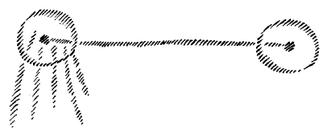

[ 1 ] ^fbn5h8

Von dem Umschwung, der sich notwendigerweise in unserer ganzen Zivilisation vollziehen muß, habe ich nun in einer ganzen Reihe von Vorträgen gesprochen. Und vor allen Dingen ist, was nach dieser Richtung hin gesprochen worden ist, so gesprochen worden, daß an den Willen der Menschen appelliert wird. Wir leben heute in einem Zyklus der Menschheitsentwickelung, in dem die Menschen die innere Aktivität finden müssen, um zu diesem notwendigen Umschwunge das ihrige beizutragen. Denn es wird menschliche Seelensubstanz sein, die in die Objektivität, in das äußere Leben wird überzufließen haben, und von den Menschen selbst wird getan werden müssen, was da erscheinen soll. Und man kann im heutigen Entwickelungszyklus der Menschheit nicht mehr in passiver Weise abwarten, daß von irgendwelchen, den Menschen ganz ferne stehenden göttlichen Mächten ohne menschliches Zutun eingegriffen werde in die menschliche Entwickelung. ^nqdy0u

[ 2 ] ^dtkmdp

Nun handelt es sich darum, daß man in der Lage ist, solche Dinge an den einzelnen Erscheinungen des sozialen Lebens zu verstehen, auch des Naturlebens, aber wir reden heute von einzelnen Erscheinungen des sozialen Lebens. Ich möchte von einer ganz bestimmten Tatsache ausgehen. Nehmen wir einmal an, irgendwo läßt sich jemand melden, meinetwillen, er schickt seine Karte zunächst; darauf steht: Edmund Müller. Aber was wäre man für ein Mensch, wenn man, nachdem man diese Karte «Edmund Müller» bekommt, denken würde, es kommt ein Müller, der Korn zu Mehl mahlt! Denn vielleicht ist derjenige, der Edmund Müller heißt und sich melden läßt, sagen wir zunächst ein Baumeister oder Professor oder ein Hofrat oder sonst irgend etwas. Nicht wahr, niemand ist in einem solchen Fall berechtigt, aus dem Namen Müller irgend etwas herauszuholen, sondern es handelt sich darum, daß man vielleicht noch gar keine Gedanken faßt, sondern abwartet, was hinter dem Namen Müller steckt, oder aber, man weiß es aus irgendwelchen andern Lebenszusammenhängen heraus, welche Wesenheit, welche wirkliche Lebensentität hinter diesem Namen Müller steckt. ^5cbrkm

[ 3 ] ^um20ds

Man sieht in einem solchen Falle ein, wie unrecht man haben würde, aus dem Namen Müller auf den Charakter der eintretenden Persönlichkeit zu schließen. Oder wenn sich irgend jemand meldet, der zum Beispiel «Schmied» heißt, so wird man auch nicht schließen, daß er ein Schmied sei oder dergleichen. Das heißt, wir haben denjenigen Worten gegenüber, die wir als Eigennamen empfinden, das Bedürfnis, durch etwas, was nicht aus dem Namen folgt, dahinterzukommen, mit was oder mit wem wir es eigentlich zu tun haben. ^0td3ol

[ 4 ] ^6okor1

Nun, auch Eigennamen haben in dieser Richtung eine bestimmte Geschichte durchgemacht. Jemand, der heute «Schmied» heißt, hat nichts mehr mit einem Schmied zu tun. Wer «Müller» heißt, hat nichts mehr mit einem Müller zu tun. Aber die Namen kommen doch ursprünglich davon her, daß in irgendeinem Dorfe in der Zeit, als es noch nicht eine solche Namengebung gegeben hat wie heute, man gemeint hat: der Schmied habe es gesagt; da hatte man aber den wirklichen Schmied gemeint. Oder der Müller hat es gesagt oder getan, oder: Ich habe den Müller gesehen. — Wer in Dörfern gelebt hat, weiß, daß man dort oftmals nicht mit Eigennamen die Leute bezeichnet, sondern daß man sagt: den Schmied oder den Baumeister oder so irgend jemanden habe man gesehen. Also da hatte ursprünglich der Name Veranlassung gegeben, aus ihm heraus, aus dem Worte heraus auf dasjenige zu schließen, was hinter den Worten steckt. ^rf9k0s

[ 5 ] ^vpl4xu

Denselben Weg, welchen solche Eigennamen machen, bei denen wir diesen Weg schon in völliger Klarheit heute überschauen können, denselben Weg machen in der Zeit der Entwickelung, der wir entgegengehen, in der Zeit vom fünften in den sechsten nachatlantischen Zeitraum hinein, alle Worte durch, wird die ganze Sprache durchmachen. Dennoch stecken wir als Menschen heute noch fast über den ganzen Umfang der Sprache hinüber darinnen, unsere ganze Weisheit im Grunde aus der Sprache heraus zu nehmen. Im Grunde verhalten wir uns gegenüber dem weitaus größten Umfang der Sprache so, daß wir aus den Worten auf die Sache schließen, Man kann es nun bequem finden, aus den Worten auf die Sache zu schließen; aber der Gang der Menschheitsentwickelung ist eben ein anderer, und solchen Dingen gegenüber muß man sich so verhalten, wie auch, ich möchte sagen, den Naturerscheinungen gegenüber. In solchen Dingen gibt es objektive Notwendigkeiten. Objektive Notwendigkeiten gibt es ja auch gegenüber der Naturkausalität in dem Gebiete des Lebens, das viele Menschen bloß in einer luftigen Abstraktheit empfinden und auch ausleben. Kommt es doch - ich habe öfters davon gesprochen — sehr häufig vor, daß man sagt: Ja, ich habe dies oder jenes ja nicht gewollt, nicht gemeint, ich habe es anders gemeint, ich habe bei diesem oder jenem diese oder jene Absicht gehabt. - Aber wenn das Kind noch so sehr die Absicht hat, sich nicht zu verbrennen und greift in das Feuer, so verbrennt es sich eben doch. Über die Dinge des Lebens entscheiden nicht die Absichten, die nicht in das Leben untertauchen, sondern nur höchstens jene Absichten, die wirklich in das Leben untertauchen oder eben die Tatsachen und die gesetzmäßigen Zusammenhänge dieser Tatsachen. ^2xbnry

[ 6 ] ^v5w95z

An diese Denkungsweise sich zu gewöhnen, das ist vor allen Dingen aus geisteswissenschaftlichen Untergründen heraus im eminentesten Sinne notwendig. Und so muß man sich auch daran gewöhnen, zu denken: So schön es auch wäre, wenn man in bequemer Weise bei den Worten bleiben könnte, so ist es doch so, daß der objektive Gang und die objektive Gesetzmäßigkeit der Menschheitsentwickelung anders sprechen, so sprechen, daß die ganze menschliche Auffassung, das ganze menschliche Seelenleben sich emanzipiert von den Worten, und daß die Worte immer mehr und mehr zu bloßen Gebärden werden, daß sie immer mehr zu dem werden, was hindeutet auf die betreffende Wesenheit, auf die betreffende Sache, was aber nicht mehr die betreffende Sache restlos bezeichnet, restlos etwa erklärt. Wenn man es ernst nimmt zum Beispiel mit geisteswissenschaftlichen Darstellungen, muß daher das eintreten, was man mir so häufig übelnimmt: daß man gar nicht mehr in derselben Weise die Worte gebrauchen kann, wie es in der Gegenwart üblich ist, die Worte und die Sätze zu gebrauchen. Denn, wenn man Geisteswissenschaftliches vertritt, so vertritt man ja heute im eminentesten Sinne eine Zukunftssache, so vertritt man etwas, was in der Zukunft Eigentum der Menschheit werden muß. Da muß man also in einer gewissen Beziehung vorausnehmen, was in der Zukunft eben eintreten soll. Man muß in seinen Willen dasjenige aufnehmen, was in der Zukunft einzutreten hat. Und so muß geisteswissenschaftlich so dargestellt werden, daß ja schon die Worte in einer gewissen Weise gebärdenhaft hindeuten auf das eigentlich Wirkliche, das dahinterliegt. Und da das, was wir heute im Sinne des sozialen Aufbaues denken, wie ich gestern auseinandergesetzt habe, aus dem Geisteswissenschaftlichen herausgeboren werden muß, so ist es auch notwendig, daß gerade bei den dem sozialen Aufbau dienenden Dingen von einem solchen Gesichtspunkt aus gesprochen werde. Das war zum Beispiel, was man bei meinen «Kernpunkten der sozialen Frage» durchaus nicht verstehen wollte. Man wollte durchaus im alten Stile irgend etwas dargestellt finden, was eben nicht im alten Stil dargestellt werden kann, weil es der Zukunft angehört. Und im Grunde genommen zeigt sich das, was hier vorliegt, am besten darinnen, daß eigentlich fast sämtliche Fragestellungen, die bis jetzt angeknüpft worden sind von dieser oder jener Seite an die Darlegungen der «Kernpunkte der sozialen Frage», immer ganz von der alten Denkweise ausgehen, daß gar nicht der Versuch gemacht wird, sich hineinzufinden in die umgewandelte, in die neue Denkweise. ^k3fkzi

[ 7 ] ^fuga5j

Und so können wir sagen: Vor allen Dingen muß sich bei der Darstellung sozialer Zusammenhänge der Zukunft zunächst zeigen, daß hineingetaucht werden muß in diese Emanzipation eines Seelenlebens, das nicht mehr an den Worten haftet. Wer meine Darstellungen auf den verschiedensten Gebieten des Geisteswissenschaftlichen, in letzter Zeit auch auf dem Gebiete des Sozialen, verfolgt, wird finden, daß ich stets bemüht bin, von den verschiedensten Seiten her eine Sache zu erklären, daß ich in der Regel statt eines Satzes zwei Sätze gebrauche, weil der eine Satz gewissermaßen von der einen Seite auf die Sache hindeutet, der andere Satz von der andern Seite, und dann in dem Zuhörer oder in dem Leser ein Gefühl davon hervorgerufen wird: er soll gewissermaßen über die Worte und über die Sätze hinausgehend an die Sache herankommen. Das ist dasjenige, was mit Bezug auf die Umwandlung der menschlichen Sprachbedeutung für das menschliche Seelenleben gesagt werden muß. Und das ist eine wichtige Sache. Sie ist deshalb wichtig, weil ein größerer Teil von dem, was heute in der Verwirrung der Denkweisen und Vorstellungen vorkommt, eigentlich von nichts anderem herrührt, als daß die objektiven, gesetzmäßigen Impulse der Menschheitsentwickelung schon verlangen, daß wir uns frei machen von der Sprache, daß aber die Menschen aus den bequemen Denkgewohnheiten heraus eben nicht loskommen wollen von dem Hängen an der Sprache. Und solch eine Erscheinung, klar aufgefaßt, sie führt dann zu einem tieferen Verständnis des ganzen Werdeganges der Menschheit. Wir können geradezu die Brücke schlagen zu hochgeistigen Tatsachen von dieser Umwandlung unserer Sprache oder unserer Sprachen. Natürlich ist es bei der einen Sprache mehr, bei der andern weniger der Fall. Aber das ist dann eine Sache der speziellen Behandlung der Sprache, der Sprachbedeutungen in den einzelnen, wie ich dargestellt habe, differenzierten Territorien der menschlichen Zivilisation. ^mnvvj0

[ 8 ] ^ozypop

Nun stehen wir im fünften nachatlantischen Entwickelungszeitraum der Menschheit, und wir nähern uns dem sechsten nachatlantischen Entwickelungszustande. Diese Entwickelungszustände sind ja nicht so, daß man zwischen dem einen und dem andern ganz scharfe Grenzen ziehen kann, sondern der eine geht mit seinen Eigentümlichkeiten in den andern über, und der nächstfolgende wirft längst, bevor er entsteht, seine Schatten voraus, man könnte auch sagen: seine Lichter voraus. Man muß die Lichter erfassen, wenn man mit seiner Seele teilnehmen will an der Entwickelung der Menschheit. Die eine, gewissermaßen überhistorische Tatsache, daß wir uns entgegenzuarbeiten haben dem sechsten nachatlantischen Zeitraum, wollen wir einmal in Verbindung bringen mit der uns auch allen bekannten andern Tatsache, daß der Mensch mit seinem geistig-seelischen Wesen aus einer geistigen Welt zur irdischen Verkörperung heruntersteigt durch die Geburt oder durch die Empfängnis, daß er dann hier auf der Erde durchlebt das Leben zwischen der Geburt und dem Tode, daß er dann durch die Todespforte geht, und indem er durch die Todespforte geht, sein Geistig-Seelisches wiederum hinüberträgt in jene Lebensumgebung, die eben durchaus geistiger, seelischer Art ist. ^umhbyq

[ 9 ] ^u4w97t

Nun müssen wir uns klar darüber sein - und wie bedeutsam das zum Beispiel gerade für die Erziehungskunst ist, das ist in dieser Zeit auch hier dargelegt worden -, daß wir herunterbringen aus der geistigen Welt, in den Wirkungen wenigstens, dasjenige, was wir in dieser geistigen Welt erlebt haben. Geradeso wie man sonst, wenn man einen Ort verläßt und vielleicht zu dem andern hingeht, außer seinen Kleidern noch sein Geistig-Seelisches aus dem alten Ort in den neuen hineinträgt, so bringt man auch aus der geistig-seelischen Welt durch Empfängnis und Geburt in diese Welt mit die Folgen, die Wirkungen dessen, was man in der geistigen Welt durchgemacht hat. Und in dem Zeitraume, den die Menschheit eben jetzt durchlebt hat, und von dem wir ja wissen, daß er etwa in der Mitte des i5. Jahrhunderts der nachchristlichen Zeit begonnen hat, in diesem Zeitraume brachte sich der Mensch mit sein geistig-seelisches Wesen mit bildlosen Kräften des Seelenlebens, bildlosen Kräften. Daher ist in diesem Zeitraume auch vorzugsweise das intellektuelle Leben entstanden und hat das intellektuelle Leben geblüht. Es ist also gewissermaßen dem Menschen in diesem Zeitraume, bevor er heruntergestiegen ist durch Empfängnis oder Geburt in das physische Leben, eingeprägt etwas Eigenschaftsloses, etwas Bildloses. Daher auch die geringe Anlage der Menschheit, die sich seit der Mitte des i5. Jahrhunderts entwickelt hat, für ursprüngliche Schöpfungen der Phantasie. Die Phantasie ist ja in Wahrheit nur eine irdische Widerspiegelung der überirdischen Imagination. Die Renaissance ist kein Gegenbeweis, denn gerade, daß man nicht zu einer Naissance, sondern zu einer Renaissance greifen mußte, beweist, daß eine ursprüngliche Phantasie nicht da war, sondern eine solche Phantasie, die die Befruchtung aus früheren Zeiten brauchte. Kurz, es ist so, daß die Seele in einer gewissen Weise mit Kräften durchzogen war, die bildlos sind. Und jetzt beginnt — und darinnen liegt vielfach der Grund für das Stürmische unserer Zeit -, jetzt beginnt die Zeit, in welcher die Seelen aus der geistigen Welt, indem sie durch die Empfängnis und die Geburt zum irdischen Leben heruntersteigen, sich Bilder mitbringen. Bilder, wenn sie mitgebracht werden aus dem geistigen Leben in dieses physische Leben herein, müssen unter allen Umständen, wenn Heil für den Menschen und für sein soziales Leben entstehen soll, unbedingt sich mit dem astralischen Leib verbinden, während sich das Bildiose nur verbindet mit dem Ich. Und es war vorzugsweise die Auslebung des Ich, welche in der Menschheit seit der Mitte des i5. Jahrhunderts geblüht hat. Jetzt aber beginnt die Zeit, wo der Mensch fühlen muß: In dir leben aus vorgeburtlichem Leben heraus Bilder, die mußt du in dir während des Lebens lebendig machen. Das kannst du nicht mit dem bloßen Ich, das muß tiefer in dich hineinwirken; das muß bis in den astralischen Leib hineinwirken. ^usozc3

[ 10 ] ^8iugqn

Nun ist es ja zunächst meistens so bei der Menschheit, daß sie widerstrebt diesem Hineinleben der vor der Empfängnis erlebten Bilder in den astralischen Leib. Die Menschen stoßen gewissermaßen das zurück, was sich aus den Tiefen ihres Wesens heraus in den astralischen Leib hineinleben soll. Die Nüchternheit, das Prosaische der neueren Zeit ist ja ein Grundcharakterzug, und es gibt heute sogar breite Strömungen, die sich dagegen wehren, daß man durch die Erziehung schon dafür sorgt, daß dasjenige, was aus der Seele aufsteigen und im astralischen Leib sich geltend machen will, auch wirklich zur Geltung komme. Es gibt trockene Nüchtlinge, welche die Erziehung durch Märchen, Legenden, durch das, was von der Phantasie durchstrahlt ist, eigentlich ausschließen möchten. In unserem Waldorfschulsystem haben wir gerade in den Vordergrund gestellt, daß der Unterricht und die Erziehung bei den die Volksschule betretenden Kindern ausgehen von bildhafter Darstellung, von einem lebendigen Hinstellen der Bilder, von Legendarischem, von Märchenhaftem. Und auch dasjenige, was die Kinder zunächst erfahren sollen über die Wesen und Vorgänge im Tierreich, im Pflanzenreich, im Mineralreich, soll nicht in trockener, nüchterner Weise gesagt werden, sondern das soll gekleidet werden in das Bildhafte, in das Legendarische, in das Märchenhafte. Denn was da tief drinnen sitzt in der Kinderseele, das sind die in der geistigen Welt empfangenen Imaginationen. Die wollen herauf. Und wenn der Lehrer oder der Erzieher sich richtig zum Kinde verhält, bringt er ihm Bilder entgegen. Und indem der Lehrer Bilder vor das kindliche Gemüt hinstellt, zucken herauf aus dem kindlichen Gemüte diejenigen Bilder, oder besser gesagt, die Kräfte der verbildlichenden Darstellung, die empfangen worden sind vor der Geburt oder, sagen wir, vor der Empfängnis. ^5a9aan

[ 111 ] ^hv7d5n

Wenn nun das unterdrückt wird, wenn der trockene Nüchtling heute erzieht und unterrichtet, dann bringt er schon von früher Jugend etwas, was schon eigentlich gar nicht dem Kinde verwandt ist, an das Kind heran: die Buchstaben. Denn die Buchstaben, wie wir sie heute haben, die haben nichts mehr mit alten Bilderbuchstaben zu tun, sind etwas dem Kinde im Grunde genommen Fremdes, das erst aus dem Bilde herausgeholt werden sollte, so wie wir in der Waldorfschule versuchen, es zu machen. Man bringt das Unbildliche an das Kind heran; das Kind aber hat da in seinem Leibe Kräfte - ich meine natürlich die Seele, wenn ich jetzt vom Leibe spreche, wir sagen ja auch der «Astralleib» —, das Kind hat in seinem Leibe Kräfte sitzen, welche es zersprengen, wenn sie nicht heraufgeholt werden in bildhafter Darstellung. Und was ist die Folge? Verloren gehen diese Kräfte nicht; sie breiten sich aus, sie gewinnen Dasein, sie treten doch in die Gedanken, in die Gefühle, in die Willensimpulse hinein. Und was entstehen daraus für Menschen? Rebellen, Revolutionäre, unzufriedene Menschen, Menschen, die nicht wissen, was sie wollen, weil sie etwas wollen, was man nicht wissen kann, weil sie etwas wollen, was mit keinem möglichen sozialen Organismus vereinbar ist, was sie sich nur vorstellen, was in ihre Phantasie hätte gehen sollen, da nicht hineingegangen ist, sondern in ihre sozialen Treibereien hineingegangen ist. ^ulk82s

[ 12 ] ^j5oejs

Und so kann man sagen, daß diejenigen Menschen, die es in okkultistischer Weise nicht ehrlich meinen mit ihren Mitmenschen, sich nur nicht zu sagen getrauen: Wenn heute die Welt revoltiert, da ist es der Himmel, der revoltiert, das heißt der Himmel, der zurückgehalten wird in den Seelen der Menschen, und der dann nicht in seiner eigenen Gestalt, sondern in seinem Gegenteile zum Vorschein kommt, der in Kampf und Blut zum Vorschein kommt, statt in Imaginationen, Es ist daher gar kein Wunder, wenn jene Menschen, die sich an solchem Zerstörungswerk der sozialen Ordnung beteiligen, eigentlich das Gefühl haben, sie tun etwas Gutes. Denn was spüren sie in sich? Den Himmel spüren sie in sich; er nimmt aber nur karikaturhafte Gestalt an in ihrer Seele. So ernst sind die Wahrheiten, die wir heute einsehen sollen. Zu den Wahrheiten sich zu bekennen, um die es sich heute handelt, das sollte kein Kinderspiel sein, es sollte durchaus von dem allerallergrößten Ernst durchzogen sein. Es wird einem ja im allgemeinen nicht leicht, solche Dinge darzustellen, denn erstens liebt man sie doch nicht, zweitens hängen die Leute an Worten. Und derjenige, der sagt, der Himmel revoltiere in der Menschenseele, der wird selbstverständlich nach den Worten ausgelegt, und man merkt nicht, wie er sich erst bemüht, zu zeigen, daß man da noch etwas wissen muß, wodurch man mit dem Worte «Himmel» etwas anderes noch verbindet als das, was man mit dem Worte Himmel zu verbinden gewohnt ist, gerade so, wie man, wenn sich Herr Müller melden läßt, darunter auch nicht einen Müller, der Korn mahlt, zu verstehen hat. Dieses Emanzipieren von der Sprache ist im einzelnen konkreten Fall durchaus notwendig, wenn wir in dem Sinne, wie es die Gesetze der Menschheitsentwickelung verlangen, jetzt wirklich vorwärtskommen wollen. ^k4g9wl

[ 13 ] ^x7ygb7

Da sehen wir, wie in das soziale Leben dasjenige hineinschießt, was eigentlich aus dem vorgeburtlichen Leben stammt. Und wer die Zusammenhänge kennt, der weiß, daß er in dem, was hier auf der Erde in Karikatur erscheint, wiederum zu erkennen hat dasjenige, was eigentlich himmlisch ist. Das ist mit Bezug auf das Soziale. Aber es kommt noch etwas anderes dazu. ^zutta0

[ 14 ] ^61thbv

In der Zeit des Intellektualismus, die sich also vorzugsweise entwikkelt hat seit der Mitte des 15. Jahrhunderts, bekamen die Menschen auch außerordentlich wenig mit aus dem Schlafesleben heraus an Imaginationen für das wache Leben. Selbst diejenigen, die etwas lebendigere Träume haben, sie haben ja die Neigung, diese Träume ganz rationalistisch, intellektualistisch zu erklären. Rationalistisch und intellektualistisch sind in dieser Richtung zum Beispiel die Theosophen. Wie viele Menschen im Laufe der Zeit zu mir gekommen sind und rationalistische Erklärungen ihrer Träume haben wollten, das wäre in einem kleinen Buche nicht zu beschreiben, nur in einem großen! Um was es sich da handelt, das ist, daß selbst jene Imaginationen, die sich im Traume darleben, auf ein tieferes Geistesleben weisen. Ich habe oft gesagt, beim Traume kommt es gar nicht an auf das Äußerliche; das hat sich schon emanzipiert vom eigentlichen Inhalt. Und was wir da an Inhalt empfangen und dann in Worte der Sprache umsetzen, von der wir uns eigentlich schon emanzipieren müssen, das ist nicht der wahre Verlauf des Traumes, das hat mit dem wahren Verlauf des Traumes eigentlich furchtbar wenig zu tun. Dasjenige, was der Trauminhalt ist, das ist die Dramatik des Traumes, wie ein Bild auf das andere folgt, wie sich Knoten schürzen und lösen, so daß man denselben geistigen Inhalt auf mancherlei Weise als Traum erleben kann. Der eine kommt und schildert, er sei einen Berg hinangestiegen, er konnte ganz gut bis zu einem gewissen Punkte hinansteigen, dann plötzlich steht er vor einem Abgrund, er kann nicht weiter. — Ein anderer erzählt: Er ging einen Weg, alles in der Umgebung freute ihn. Da trat plötzlich, als er an einen bestimmten Punkt des Weges kam, ein Mensch mit einem Dolch auf ihn zu, der ihn tötete. -— Zwei ganz verschiedene 'Traumbilder! Der geistige Vorgang, der dahintersteckt, kann aber ganz derselbe sein; er kann sich das eine Mal ausleben durch das Hinansteigen auf einen Berg und sich vor einem Abgrund fühlen, das andere Mal durch das Gehen eines Weges in Freude, bis man vor einem Menschen steht, der einen töten will. Auf den Inhalt der Bilder kommt es nicht an, sondern auf den dramatischen Verlauf, daß man irgend etwas durchmacht, das sich entgegenstellt. Auf diese Dynamik, die hinter diesen Bildern steht, darauf kommt es an. Derselbe Kräfteverlauf kann sich in die einen und in die andern Bilder hüllen und in hunderterlei Bilder kleiden. Erst dann verstehen wir die geistige Welt, wenn wir wissen, wie das, was hier in der physischen Welt sich als Träume darlebt, oder was aus der geistigen Welt heraus sich so verbildlicht, daß es der physischen Welt ähnlich ist, wie das eben nur Bild ist. Aber solange man die Neigung hat, die Bilder rationalistisch, rein vernunftgemäß auszulegen, so lange steht man auch dem Traumesleben des Schlafes gegenüber auf intellektualistischem Standpunkte. Und um was es sich handelt, das ist, dieses Traumesleben des Schlafes eben zu verstehen als den Ausdruck eines tieferen geistigen Lebens. Dann ist es erst imaginativ erfaßt; dann fassen wir die Bilder als dasjenige, was steht für den Inhalt. Und dann wenden wir uns nicht gegen dasjenige, was heute für den Menschen beginnt: aus dem Schlafe heraus in ähnlicher Weise innere seelische Forderungen zu stellen, wie die Imagination vor der Geburt beziehungsweise vor der Empfängnis. Denn wir beginnen heute auch anders zu schlafen, als im regulären Leben der intellektualistischen Zeit seit der Mitte des i5. Jahrhunderts geschlafen worden ist. Da brachte sich der Mensch wenig Neigung mit ins Aufwachen hinein für dasjenige, was die Bilder erleben will und nicht deuten. Jetzt sind wir an dem Punkte der Menschheitsentwickelung, wo wir auch aus dem Schlafe heraus die Imaginationen nehmen, die sich einleben wollen nicht bloß in unser Ich, wo die Ratio herrscht, sondern wo sich die Bilder hineinleben wollen in unseren astralischen Leib. Wenn wir dem entgegenarbeiten, so stoßen wir wiederum etwas zurück, was aus den Tiefen der Menschenseele in das Bewußtsein herauf will, und wir arbeiten dem ganzen Entwickelungsgang der Menschheit entgegen. Und es handelt sich auch da darum, daß wir nicht dem Entwickelungsgang der Menschheit entgegenarbeiten, sondern daß wir im Sinne dieses Entwickelungsganges der Menschheit arbeiten. Wir tun es, wenn wir erstens unsere Kultur wiederum durchziehen mit möglichst vielem, was mit der geistigen Welt in irgendeiner Weise zusammenhängt. Natürlich handelt es sich für das äußere Leben darum, daß wir uns mit dem durchdringen, was aus der geistigen Welt heraus erfaßt ist, daß wir uns also durchdringen mit einer wirklichen geistigen Erkenntnis, uns durchdringen mit etwas, was in dieser physischen Welt aus der physischen Welt heraus nicht begriffen werden kann. Dem war die ganze abgelaufene Periode des Menschenlebens eigentlich zuwider. Nehmen Sie einen Fall, den ich ja auch schon öfter angeführt habe. ^7c3ltb

[ 15 ] ^m4se7o

Nicht wahr, das Christentum trat so an die Menschen heran, daß sie es eigentlich in seinem Wesen nur verstehen können, namentlich, daß sie das Mysterium von Golgatha in seinem Wesen nur verstehen können, wenn sie sich zum Verständnisse eines Übersinnlichen bequemen. Denn vorgestellt muß werden, daß ein Wesen, das vorher nicht mit der Erdenentwickelung verbunden war, wie der Christus, sich mit dem Menschen Jesus von Nazareth verbunden hat, daß übersinnliche Vorgänge sich abgespielt haben; vorgestellt muß werden, daß schon Geburt und Empfängnis anders waren für dieses Ereignis von Golgatha als für gewöhnliche menschliche Vorgänge. Kurz, es werden Anforderungen gestellt aus der Christologie heraus, das Mysterium von Golgatha im übersinnlichen Sinne zu verstehen. Es gibt eine interessante Stelle bei einem neueren Naturforscher, wo gewettert wird gegen die «conceptio immaculata», wo gesagt wird: zu behaupten, daß es eine unbefleckte Empfängnis gibt, sei eine freche Verhöhnung der menschlichen Vernunft. ^zzaktc

[ 16 ] ^x0ac6f

Nun, das muß der moderne Rationalist, der rein intellektualistische Mensch schon so empfinden. In gewissem Sinne ist es ja eine freche Verhöhnung der menschlichen Vernunft, was aus dem geistigen Leben heraus gewollt wird. Aber es handelt sich darum, daß wir eben in einem Zeitalter leben, wo wir dazu übergehen müssen, das geistig Erlebte zwischen dem Einschlafen und Aufwachen so hereinzubringen auch in das wache Leben, daß unser astralischer Leib — nicht bloß unser Ich, was der Sitz der Ratio, des Intellektualismus ist —, daß unser astralischer Leib bildhaft durchsetzt, durchzogen werden kann. Und es ist interessant, daß selbst die Theologie des 19. Jahrhunderts sich so entwickelt hat, daß sie entgegengesetzt hat der Christologie den Rationalismus, den reinen Intellektualismus. Immer mehr und mehr hat sich die moderne Theologie dazu veranlaßt gefühlt, den Christus als solchen überhaupt zu verleugnen und den schlichten Mann aus Nazareth, den bloßen Jesus als eine etwas über die andern Menschen hervorragende menschliche Persönlichkeit hinzustellen. Man wollte sich nicht dazu bequemen, etwas Übersinnliches zu begreifen. Man wollte dasjenige, was eben übersinnlich an den Menschen herantreten soll, was einen aufwecken soll zum Übersinnlichen, das wollte man mit den Begriffen, die hier in der sinnlichen Welt gewonnen werden, begreifen. ^84y1fw

[ 17 ] ^8ikpo1

Ein protestantischer Theologe, mit dem ich einmal über diese Angelegenheit sprach, sagte mir, nachdem wir längere Zeit darüber gesprochen hatten: Ja, wir modernen Theologen, wir sollten uns eigentlich nicht mehr Christen nennen, denn wir haben eigentlich keinen Christus mehr; wenn der Name « Jesuit» nicht schon vergeben wäre, so müßten wir ihn für uns in Anspruch nehmen. — Das ist etwas, was nicht ich sage, sondern was mir als Geständnis seiner eigenen Seele einmal ein protestantischer Theologe der neueren Färbung sagte. ^ieohzd

[ 18 ] ^ynhh00

Wer aber den ganzen Charakter unserer Zeit durchschaut, der wird eben verstehen, daß wir vordringen müssen zu einem solchen Erfassen des Mysteriums von Golgatha, das uns, gerade weil es die Zentralerscheinung unserer Menschheitsentwickelung ist, herausreißt aus dem irdischen Vorstellen und uns mit allen Kräften hinzieht, etwas zu begreifen, was aus dem Umfange des Irdisch-Sinnlichen heraus eben nicht zu begreifen ist. Wer bei allem an dem Umfang des Irdisch-Sinnlichen hängenbleiben will, der sagt: Die conceptio immaculata ist eine freche Verhöhnung der menschlichen Vernunft. ^ckayu9

[ 19 ] ^9ppua3

Wer die Aufgabe des gegenwärtigen Menschen versteht, der sagt: Ich muß mir solche Vorstellungen aneignen. Dann allerdings muß ich mich emanzipieren von der heute gebräuchlichen Art der Worte, muß nicht nur, wenn sich mir einer namens Schmied oder Müller anmeldet, vermuten, daß der eine mit dem Hammer und der andere mit dem mehlbesprühten Mahlkittel komme, sondern ich muß etwas ganz anderes vermuten, als was ich aus den Worten deduzieren kann. So muß ich mich auch gewöhnen, mich zu emanzipieren von dem, was den Worten eingeprägt worden ist aus dem bloßen sinnlich-physischen Leben. ^v9917z

[ 20 ] ^fz56ip

Für uns heute ist das Mysterium von Golgatha in der Tat die erste Probe, ob wir mitgehen wollen zum Begreifen von etwas, was über die Sphäre des Physisch-Sinnlichen hinausgeht. Daher können wir uns auch heute nicht mehr begnügen mit einer bloßen traditionell-historischen Darstellung des Christentums, sondern wir brauchen ein schöpferisches Erfassen des Mysteriums von Golgatha, wir brauchen aus der Geisteswissenschaft heraus innere Kraft der Seele, welche in einer neuen Weise an das Mysterium von Golgatha herankommt und dieses Mysterium von Golgatha als eine übersinnliche Tatsache zu begreifen in der Lage ist. Und dann müssen wir, wenn wir so das Mysterium von Golgatha in den Mittelpunkt des menschlichen Denkens und Empfindens und Fühlens stellen, den Anfang nehmen wiederum besonders bei der Erziehung und schon das Kind darauf vorbereiten, daß es nicht unterdrückt oder unterdrücken muß die Imaginationen, die aus den Tiefen der Seele herauf wollen. Wir müssen ihm entgegenkommen mit Verbildlichung der Darstellungen. ^s1155b

[ 21 ] ^w7xw3f

Das ist der tiefere Grund, warum ich im letzten Heft der «Sozialen Zukunft», das ein Erziehungsheft ist, das Erziehen und Unterrichten im eminentesten Sinne als eine Kunst hingestellt habe. Wo so verfahren werden muß vom Lehrer und vom Erzieher, wie wirklich vom Künstler auch verfahren wird, ja sogar in einem höheren Stile so verfahren werden muß, wo es nicht geht, daß man in einer abstrakten Pädagogik abstrakte Grundsätze gibt, sondern wo es darauf ankommt, daß man in das Wesen des Menschen eindringt und durch dieses Eindringen in das Wesen des Menschen dazu kommt, aus dem Menschen heraus abzulesen, was man in jedem einzelnen Falle zu tun hat. Der Künstler kann nicht, wenn er irgend etwas bildet, nach abstrakten Regeln vorgehen. Eine Ästhetik hat eine ganz andere Aufgabe, als für den Künstler Regeln zu bilden. Der Künstler kann nicht einmal bei dem, was er heute schafft, sich nach dem richten, was er gestern geschaffen hat: Er muß in jedem Augenblick bestrebt sein, schöpferisch, ursprünglich zu sein. So muß es, in einem noch höheren Stile sogar, der Lehrer sein. Man darf nicht aus einer gewissen Gesinnung heraus sagen: Ja, wenn wir solche Lehrer haben wollen, da müssen wir noch drei-, vierhundert Jahre warten. — Daß wir sie nicht haben können, das rührt eigentlich nur davon her, daß wir so etwas sagen. Wir können sie in dem Augenblicke haben, wo wir die starke Kraft des Bekenntnisses dazu haben; aber eben die starke, und nicht die passive Kraft des Bekenntnisses ist nötig dazu. So handelt es sich darum, daß wir dasjenige, was der astralische Leib erlebt vom Einschlafen bis zum Aufwachen, dann, wenn wir herüberkommen im Aufwachen, nun im astralischen Leib wirklich darinnen erleben und dem Ätherleib einprägen. Das kann nur durch eine Verbildlichung des ganzen Kulturlebens geschehen. ^cpu4q8

[ 22 ] ^e68xiq

Diese Verbildlichung des ganzen Kulturlebens, diese von den Gesetzen der Menschheitsentwickelung geforderte Verbildlichung, sie wird nur dann eintreten, wenn das ganze Geistesleben in die freie Entscheidung derjenigen gestellt ist, die am Geistesleben beteiligt sind, wenn nicht Instruktionen, Schulvorschriften von dem ja notwendig außerhalb des Geisteslebens stehenden Staate gegeben werden. Denn da kann man alles mögliche Schöne und Gute verkündigen. Es handelt sich nicht darum, daß man in abstracto von Staats wegen pädagogische Verordnungen gibt, Lehrpläne aufstellt und dergleichen, sondern es handelt sich darum, daß man im emanzipierten Geistesleben drinnen die aus ihrer eigenen freien Persönlichkeit heraus handelnden Menschen hat, und daß man mit ihnen dasjenige leistet, was man mit diesen Menschen leisten will oder kann. ^gh9tpe

[ 23 ] ^2jieul

Daß der Mensch gegenwärtig beginnt, anderes mitzubringen durch Empfängnis und Geburt, als er seit der Mitte des 14. Jahrhunderts mitgebracht hat, daß er auch beim Aufwachen anderes aus dem Schlafe heraus bringt, beides fordert, daß man aufmerksam auf solche Dinge hinschaut, daß man wirklich sich durchdringt mit dem Wissen von einer so einschneidenden Tatsache. Woher soll man denn ein solches Wissen von einer so einschneidenden Tatsache gewinnen, als aus der Geisteswissenschaft? Mit den Dingen, um die es sich da handelt, beschäftigt sich ja die äußere Bildung, die äußere Wissenschaft heute eben durchaus nicht. Sie geht an ihnen vorbei, und sie muß nach ihren Methoden an ihnen vorbeigehen. Und ich möchte sagen, am bittersten wird die Sache, wenn man sieht, wie merkwürdig diskrepant die inneren Forderungen der Menschheitsentwickelung oftmals zu dem stehen, was von der menschlichen Seite her diesen Forderungen entgegengebracht wird. Da trat eben in der neueren Zeit diese Forderung auf, mit dem zu rechnen, was aus der geistigen Welt hereinfließt in den Menschen. Und als man intellektualistisch war, als man nicht rechnete mit dem, was hereinfließt aus der geistigen Welt, hypothetisierte man Atome, Moleküle und so weiter. Man dachte sich, die Körper, die Volumen sind, die weisen zurück auf atomistische Gestaltungen und so weiter. Aus den Ursachen der menschlichen Entwickelung trat das Bedürfnis auf, Geistiges zu erfassen. Und dieser Instinkt, Geistiges zu erfassen, er lebte sich ja auch zum Beispiel in so etwas aus wie in der Theosophischen Gesellschaft. Aber einer der Helden dieser 'Theosophischen Gesellschaft ist zum Beispiel ein Mr. Leadbeater; der hat eine okkulte Chemie geschrieben. Was hat er dabei getan? Das Horrible hat er getan, daß er die geistige Welt nun atomistisch vorstellt, das heißt, die materialistische Art und Weise des Denkens wird in die geistige Welt hineingetragen. ^09jmc4

 ^t1m31w

[ 24 ] ^kxxmgd

Ich habe neulich schon einmal das ganz Groteske hervorgehoben: Einmal trat nämlich etwas ganz besonders Gescheites in der Theosophischen Gesellschaft auf. Man wollte beweisen: Da ist ein Leben, da ist das nächste Leben (siehe Zeichnung). Nun, nicht wahr, da muß doch etwas herübergehen aus dem vorhergehenden in das nächste Leben. Den Leib sieht man verfallen. Der richtige Materialist sagt, der Leib verfällt, dann ist es aus mit dem Menschen. Ja, aber der 'Theosoph will doch, daß ein nächstes Erdenleben kommt; da muß etwas herübergehen! Der richtige Materialist sagt, alle Atome vereinigen sich mit der Erde. Der Theosoph dachte ja auch nicht anders als materialistisch, aber er wollte zu gleicher Zeit «theosophisch» denken; er wollte, daß da was herübergeht. Und da sagte er: Ja, die Atome, die fallen ja allein die Erde herein; ein Atom aber, das bleibt, und das geht durch die ganze Zeit durch in dem Leben zwischen dem Tode und einer neuen Geburt. Da erscheint es wiederum: das ist das permanente Atom. — Ein Atom! Da waren die Theosophen ganz besonders stolz, als sie dieses «permanente» Atom entdeckten! Sie hatten keine Ahnung davon, daß sie ja damit gerade den Materialismus in die spirituelle Weltauffassung hineintrugen! Dieser Materialismus hat sie dazu verführt, daran zu glauben, daß irgend etwas — was, das haben sie nie gesagt — von den vielen Atomen, die da in die Erde hineinsinken, daß eines gerettet wird; und dieses glücklich gerettete permanente Atom, das sei dann das, was im nächsten Erdenleben wiederum auftritt. Über dieses permanente Atom ist viel geschrieben worden. Es ist nichts anderes als ein Beweis dafür, daß in die spirituelle Wissenschaft hineingetragen werden sollte dasjenige, über das man nicht hinauskommen konnte: der Materialismus, der ja übrigens schon in der ganzen Darstellung des Menschen steckt, wenn man es so macht, wie es vielfach in der Literatur der Theosophischen Gesellschaft gemacht wird, wo eben, wie ich oftmals gesagt habe, der physische Leib dicht ist, dann der Ätherleib dünner, der Astralleib wiederum dünner. Und dann geht es schon in solche Dünnheiten über, daß auch das Denken und Vorstellen ganz dünn wird; aber man hat eben immer noch etwas Materielles, Nebelartiges; so daß Buddhi und Atma zwar Nebel sind, aber eben doch noch ein Nebel. Man hat nicht den Willen, den Materialismus wirklich abzulegen auch im Vorstellungsleben und aus dem Vorstellen des Materiellen zum Vorstellen des Spirituellen hinüberzugehen. ^pf4ecu

[ 25 ] ^7piso1

Diese Dinge, die beweisen alle, wie eng verbunden die Menschen mit alten Vorstellungsweisen sind. Und eigentlich müßte aus solchen Betrachtungsweisen jeder, der ehrlich sich zur Geisteswissenschaft bekennen will, die innere Aufforderung schöpfen, sich zu prüfen, inwiefern er losgekommen ist von alten materialistischen Vorstellungen, oder inwiefern er durchaus, auch indem er sich irgend etwas Geistiges vorhält, dieses Geistige in materialistischen Bildern vorstellt und sich nicht bewußt ist, daß es eben Bilder sind. ^ovj33i

[ 26 ] ^1pbpxn

Es handelt sich immer darum, daß man sich dessen bewußt ist. Denn, wenn ich, sagen wir, einen von Ihnen hier auf diese Tafel zeichnen würde, so könnte ich von dem Bilde ja sehr viel haben, wenn der Betreffende nicht mehr da ist. Aber wenn ich mir vorstellen würde, daß der mir die Hand gibt, oder daß er zu mir spricht, also er das Wesen selber ist, so würde ich ein Phantast sein. So darf man sich natürlich das Geistige in Bildern versinnlichen, aber man muß sich immer klar sein darüber, daß man es mit sinnlichen Bildern zu tun hat. Bei den Worten aber müssen sich die Menschen immer klarer und klarer werden, daß die Sprache auf dem Wege ist, das Wort zur Gebärde zu machen, und daß wir nicht weitergehen sollen, als uns durch das Wort auf etwas, was nicht mehr im Worte liegt, hindeuten zu lassen. Denselben Weg, den die Eigennamen genommen haben, müssen alle andern Worte nehmen. ^ri1ik8

[ 27 ] ^tz3le9

Für Philosophen könnte ich da sogar noch etwas sehr Schönes sagen. Die Philosophen der neueren Zeit haben vielfach Theorien aufgestellt. Wenn ich sage: Das Kind ist klein — von dem «klein» haben sie eine Vorstellung, von «Kind» haben sie eine Vorstellung; aber das «ist», die Kopula dessen, was es eigentlich bedeutet —? Oh, es ist viel geschrieben worden über diese Kopula, auch im philosophischen Sinne, nicht bloß im grammatischen oder philologischen Sinne. Und alles, was geschrieben ist, krankt an dem einen, daß in der Tat dieses «ist» heute eben die Bedeutung, über die die Leute reden, nicht mehr hat, daß es sich auch von seiner Bedeutung emanzipiert hat, daß der Seelengehalt schon ein anderer geworden ist. Und so philosophiert man eigentlich über dasjenige, was nicht mehr lebendig in der Seele lebt. ^1v53yq

[ 28 ] ^gy56r4

Das ist nur eine philosophische Zwischenbemerkung, die ja vielleicht weniger Bedeutung hat, die Sie aber darauf aufmerksam machen soll, daß dasjenige, was nicht bemerkt wird von der äußeren Welt, nicht etwa von den Philosophen gleich bemerkt wird. Im Gegenteil, es ist vielfach so, daß die Philosophen die letzten sind, die die Dinge, die sich in der Welt wirklich vollziehen, bemerken. Und viele unserer philosophischen Systeme hinken eigentlich hinter manchem andern, was außer ihnen noch da ist, beträchtlich nach! ^av5dva

[ 29 ] ^xjbbgp

Ich wollte Ihnen, vorzugsweise ausgehend von dem Beispiel der Sprache, heute zeigen, wie ganz im Konkreten sich die Menschheitsentwickelung gegenwärtig darstellt. Man schaut nur hin auf das, was da eigentlich geschieht für die Menschheitsentwickelung, wenn man auf Übersinnliches schaut. Anthropologie kann nicht mehr dasjenige finden, was sich eigentlich abspielt, sondern allein Anthroposophie. Daher muß das anthroposophische Kulturdenken gerade dem zugrunde liegen, was heute Arbeit ist an dem Fortschritt der Menschheit. ^2yw1jy