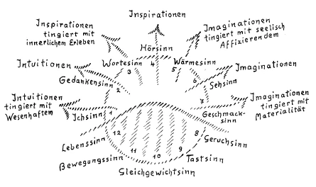
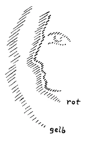
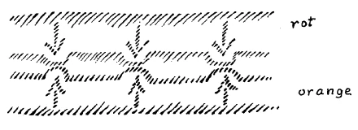

Ich möchte heute einiges von dem in diesen Tagen Besprochenen dadurch vertiefen, daß ich an ein älteres Thema anknüpfe, welches eine Anzahl von Ihnen bereits kennen wird. Ich habe einmal vor Jahren über die Charakteristik der Gesamtsinnenwelt des Menschen gesprochen. Sie wissen ja, daß, wenn man von den Sinnen spricht, man in gebräuchlicher Art den Gesichtssinn, den Gehörsinn, den Geruchssinn, den Geschmackssinn und den Tastsinn aufzählt. In der letzteren Zeit sind allerdings auch einige Wissenschafter veranlaßt worden, von andern, sozusagen mehr nach dem Inneren des Menschen hin gelegenen Sinnen zu sprechen, von einem Gleichgewichtssinn und so weiter. Aber dieser ganzen Anschauung von den menschlichen Sinnen fehlt einerseits der Zusammenhang und fehlt andererseits vor allen Dingen das in sich Geschlossene. Man hat es eigentlich immer nur mit einem Teil der menschlichen Sinnesorganisation zu tun, wenn man die gebräuchlich aufgezählten Sinne ins Auge faßt. Vollständig hat man die Sinnesorganisation des Menschen erst erschöpft, wenn man zwölf Sinne ins Auge faßt. Diese zwölf Sinne wollen wir uns heute einmal zunächst, ich möchte sagen, nur aufzählend und in kurzer Charakteristik vor Augen führen. ^rmgmek

Man kann die Aufzählung und Charakteristik der Sinne irgendwo beginnen. Beginnen wir also zum Beispiel damit, daß wir den Sehsinn betrachten. Wir wollen zunächst ganz äußerlich, wie es ein jeder für sich konstatieren kann, die Charakteristik ins Auge fassen (siehe Zeichnung $. 48). Der Sehsinn vermittelt uns die Oberfläche der äußeren Körperlichkeit, die uns farbig, hell, dunkel und so weiter entgegentritt. Wir könnten in der mannigfaltigsten Weise diese Oberfläche beschreiben und würden dann dasjenige haben, was der Sehsinn vermittelt. Dringen wir nun durch die sinnliche Anschauung etwas ins Innere der äußeren Körperlichkeit, vermitteln wir uns durch unsere Sinnesorganisation dasjenige, was nicht an der Oberfläche liegt, sondern was sich mehr ins Innere des Körpers hinein fortsetzt, so muß das durch den Wärmesinn geschehen. Wiederum mehr gegen uns hergezogen, an uns gebunden, von der Oberfläche der Körperlichkeit gegen uns zugeneigt, nehmen wir Eigenschaften wahr durch den Geschmackssinn. Er liegt gewissermaßen auf der andern Seite des Sehsinnes. Wenn Sie Farben, Hell und Dunkel, und wenn Sie den Geschmack ins Auge fassen, dann werden Sie sich sagen: das was an der Oberfläche der Körperlichkeit Ihnen entgegentritt, ist etwas durch den Sehsinn Vermitteltes. Dasjenige, was in der Wechselwirkung mit Ihrem eigenen Organismus Ihnen entgegentritt, was sich gewissermaßen in der Empfindung loslöst von der Oberfläche und gegen Sie zugeht, das vermittelt der Geschmackssinn. ^ugsynu

Nun stellen wir uns vor, daß Sie mehr noch in das Innere der Körperlichkeit gehen, als es durch den Wärmesinn möglich ist, daß Sie gewissermaßen nicht nur dasjenige, was die Körperlichkeit von außen durchdringt, aber allerdings im Inneren durchsetzt wie die Wärme, ins Auge fassen, sondern was innere Qualität der Körper durch ihre Wesenheit ist. Zum Beispiel: Sie hören eine metallene Platte, die Sie anschlagen, dann nehmen Sie etwas von der Substantialität dieser metallenen Platte wahr, also von dem inneren Wesen des Metallischen. Während, wenn Sie die Wärme wahrnehmen, Sie durch den Wärmesinn nur dasjenige wahrnehmen, was gewissermaßen als allgemeine Wärme die Körper durchdringt, aber dann allerdings im Inneren ist, so nehmen Sie also durch den Hörsinn dasjenige wahr, was schon mit dem inneren Wesen der Körper zusammenhängt. Gehen Sie jetzt nach der andern Seite, so bekommen Sie etwas, was der Körper auf Sie als Wirkung ausübt, was viel stärker innerlich ist als dasjenige, was wahrgenommen wird durch den Geschmackssinn. Das Riechen ist materiell viel innerlicher als das Schmecken. Das Schmecken geschieht gewissermaßen dadurch, daß die Körper uns nur berühren und dann unsere Absonderungen sich oberflächlich mit unserem Inneren vereinigen; das Riechen, das ist schon eine bedeutsame Veränderung in unserem Inneren, und die Nasenschleimhaut ist etwas, was viel innerlicher organisiert ist — natürlich materiell gemeint — als die Geschmackswerkzeuge. ^a3wgjj

Wenn Sie dann noch weiter in das Innere des äußeren Körperlichen eindringen, wo das äußere Körperliche schon mehr seelisch wird, dann dringen Sie ein durch den Gehörsinn in das Wesen des Metallischen, bekommen Sie gewissermaßen die Seele des Metallischen, aber Sie dringen noch tiefer, namentlich in das Äußere ein, wenn Sie nicht nur durch den Gehörsinn wahrnehmen, sondern durch den Wortesinn, durch den Sprachsinn. Es ist eine vollständige Verkennung, daß man glaubt, mit dem Gehörsinn sei auch schon dasjenige erschöpft, was der Wortesinn in sich enthält: man könnte hören, aber man brauchte noch nicht den Inhalt der Worte so wahrzunehmen, daß man ihn versteht. Es ist auch in bezug auf die organische Gliederung ein Unterschied vorhanden zwischen dem bloßen Hören des Tones und dem Wortewahrnehmen. Das Hören des Tones ist vermittelt durch das Ohr, das Wortewahrnehmen ist durch andere Organe vermittelt, welche ebenso physischer Natur sind, wie diejenigen, die den Gehörsinn vermitteln. Und wir dringen auch tiefer in das Wesen eines Äußeren ein, wenn wir es verstehen durch den Wortesinn, als wenn wir sein inneres Wesen bloß tonhaft hören. ^q7s39t

Noch mehr nach innen gelegen, schon ganz von den Dingen abgesondert, viel mehr noch, als das beim Geruchssinn der Fall ist, ist jene Vermittlung, die wir nennen können die Vermittlung durch den Tastsinn. Wenn Sie Gegenstände betasten, so nehmen Sie ja eigentlich nur sich selber wahr. Sie betasten einen Gegenstand, der Gegenstand drückt in einer gewissen Weise stark auf Sie, weil er hart ist, oder drückt nur wenig auf Sie, weil er weich ist. Sie nehmen aber nichts vom Gegenstande wahr, sondern Sie nehmen nur das wahr, was in Ihnen selber bewirkt wird: die Veränderung in Ihnen selber. Ein harter Gegenstand schiebt Ihnen Ihre Organe weit zurück. Dieses Zurückschieben als eine Veränderung in Ihrem eigenen Organismus nehmen Sie wahr, wenn Sie durch den Tastsinn wahrnehmen. Sie sehen, indem wir uns mit dem Sinneninneren da hineinbewegen, gehen wir aus uns heraus. Wir sind zunächst wenig aus uns heraus beim Geschmackssinn, mehr aus uns heraus sind wir bei der Oberfläche der Körper, bei dem Sehsinn. Wir dringen schon in den Körper ein durch den Wärmesinn, noch mehr dringen wir ein in das Wesen durch den Hörsinn, und schon gar in das Innere des Wesens hineinergossen sind wir durch den Wortesinn. Dagegen dringen wir in unser Inneres hinein, im Geschmackssinn ist schon etwas davon vorhanden, mehr beim Geruchssinn, mehr noch beim Tastsinn. Dann aber, wenn wir noch mehr in unser Inneres eindringen, so tritt in uns ein Sinn auf, welcher eigentlich gewöhnlich schon nicht mehr genannt wird, wenigstens nicht oft genannt wird, ein Sinn, durch den wir unterscheiden, ob wir stehen oder ob wir liegen, durch den wir auch wahrnehmen, wie wir, wenn wir auf unseren zwei Beinen stehen, uns im Gleichgewichte halten. Dieses Sich-im-Gleichgewicht-Fühlen, das wird vermittelt durch den Gleichgewichtssinn. Da dringen wir also schon ganz in unser Inneres ein; wir nehmen die Beziehung unseres Inneren zur Außenwelt wahr, innerhalb welcher wir uns im Gleichgewichte fühlen. Aber wir nehmen das ganz in unserem Inneren wahr. ^uu3o7i

Dringen wir noch mehr in die äußere Welt hinein, mehr noch, als wir es durch den Wortesinn können, so geschieht das durch den Gedankensinn. Und es gehört, um die Gedanken des anderen Wesens wahrzunehmen, wiederum einfach ein anderes Sinnesorgan dazu, als es der bloße Wortesinn ist. Dagegen, wenn wir noch mehr in unser Inneres hineindringen, dann haben wir einen Sinn, der uns innerlich vermittelt, ob wir in der Ruhe oder ob wir in der Bewegung sind. Wir nehmen nicht nur dadurch, daß die äußeren Gegenstände an uns vorübergehen, wahr, ob wir in Ruhe oder ob wir in Bewegung sind, wir können innerlich an unserer Muskelverlängerung und -verkürzung, an der Konfiguration unseres Leibes, insofern sich diese verändert, wenn wir uns bewegen, wahrnehmen, inwiefern wir bewegt sind und so weiter. Das geschieht durch den Bewegungssinn. ^qov7eh

Wenn wir Menschen gegenüberstehen, dann nehmen wir nicht nur ihre Gedanken wahr, sondern wir nehmen auch das Ich selber wahr. Und auch das Ich ist noch nicht wahrgenommen, wenn man bloß die Gedanken wahrnimmt. Gerade aus demselben Grunde, warum wir abgesondert den Hörsinn vom Sehsinn statuieren, müssen wir, wenn wir auf die feineren Gliederungen der menschlichen Organisation eingehen, auch einen besonderen Ichsinn, einen Sinn für die Ich-Wahrnehmung statuieren. Indem wir in das Ich eines andern Menschen wahrnehmend eindringen, gehen wir am meisten aus uns selber heraus. ^1yi95u

 ^7im8ut

Wann gehen wir am meisten in uns selber hinein? Nun, wenn wir im allgemeinen Lebensgefühl dasjenige wahrnehmen, was wir im wachen Zustande immer eben als unser Bewußtsein haben, daß wir sind, daß wir uns innerlich erfühlen, daß wir wir sind. Das wird vermittelt durch den Lebenssinn. ^bhd2wi

Damit habe ich Ihnen die zwölf Sinne, die das vollständige System der Sinnesorgane geben, hingeschrieben. Sie sehen nun ohne weiteres daraus, daß eine gewisse Anzahl von unseren Sinnen gewissermaßen mehr nach außen gerichtet ist, mehr darauf gerichtet ist, in die Außenwelt einzudringen. Wir können, wenn wir das Ganze (siehe Zeichnung) als den Umfang unserer Sinneswelt ansehen, sagen: Ichsinn, Gedankensinn, Wortesinn, Hörsinn, Wärmesinn, Sehsinn, Geschmackssinn, das sind die Sinne, welche mehr nach außen gerichtet sind. Dahingegen, wo wir mehr uns selbst wahrnehmen an den Dingen, wo wir mehr die Wirkungen der Dinge in uns wahrnehmen, da haben wir die andern Sinne: Lebenssinn, Bewegungssinn, Gleichgewichtssinn, Tastsinn, Geruchssinn. Sie bilden mehr das Gebiet des Inneren des Menschen; es sind Sinne, welche sich nach innen öffnen und durch das Wahrnehmen des Inneren uns unser Verhältnis zum Kosmos vermitteln (siehe Zeichnung, schraffiert). So daß also, wenn wir das vollständige System der Sinne haben, wir sagen können: Wir haben sieben mehr nach außen gerichtete Sinne. Der siebente Sinn ist schon zweifelhaft: Der Geschmackssinn steht schon an der Grenze zwischen dem, was die äußeren Körper betrifft und dem, was die äußeren Körper als Wirkung auf uns ausüben. Die andern fünf Sinne sind solche Sinne, welche uns durchaus innere Vorgänge zeigen, die in uns sich abspielen, die aber Wirkungen der Außenwelt auf uns sind. Was ich nun heute an diese Sinnesgliederung, die den meisten von Ihnen bekannt sein wird, anfügen möchte, ist das Folgende. ^jua2pk

Sie wissen, wenn der Mensch aufsteigt von der gewöhnlichen Sinneserkenntnis zur höheren Erkenntnis, kann er es dadurch tun, daß er mit seinem Geistig-Seelischen aus seinem physischen Leib heraustritt. Dann treten die höheren Arten des Erkennens auf: Imagination, Inspiration, Intuition. Ich möchte sagen: beschreibend sind Imagination, Inspiration, Intuition ja geschildert in meiner «Geheimwissenschaft im Umriß» und in meiner Schrift «Wie erlangt man Erkenntnisse der höheren Welten?». Aber Sie werden sich leicht vorstellen können, daß wir, gerade wenn wir diese Gliederung der Sinne vor uns haben, zu einer besonderen Charakteristik dessen gelangen können, was Anschauung der höheren Welten ist. Wir dringen aus uns heraus. Über welche Grenze schreiten wir denn da? Wenn wir in uns bleiben, wenn wir in uns stecken, dann sind die Sinne unsere Grenzen; wenn wir aus uns herausdringen, dann dringen wir durch die Sinne nach außen. Es ist ganz, ich möchte sagen, selbstverständlich, daß, wenn unser Geistig-Seelisches die Leibeshülle verläßt, es durch die Sinne nach außen dringt. Wir kommen also durch die äußeren Sinne, durch den Geschmackssinn, den Sehsinn, den Wärmesinn, den Hörsinn, den Wortesinn, den Gedankensinn und den Ichsinn nach außen. Wir werden nachher sehen, wohin wir kommen, wenn wir durch die andere Grenze, wo die Sinne sich nach innen öffnen, nach innen dringen. Also wir dringen durch die Sinne nach außen, indem wir mit unserem Geistig-Seelischen gewissermaßen unsere Leibesgrenze verlassen. Da passieren wir zum Beispiel den Sehsinn nach außen: das heißt, wir dringen mit unserem GeistigSeelischen nach außen, indem wir unsere Sehwerkzeuge zurücklassen. Indem wir uns bewegen in der Welt, mit dem seelischen Auge sehend, aber die physischen Augen zurücklassend, wenn wir also gerade durch das Auge verlassen unsere Leiblichkeit, kommen wir in jene Region hinein, wo die Imagination waltet (siehe Zeichnung Seite 48). ^wlipzv

Und wenn wir wirklich imstande sind, durch die Initiation gerade durch das Auge hinauszudringen in die geistige Welt, dann bekommen wir reine Imaginationen, Imaginationen, die, ich möchte sagen, Bilder sind, so wie der Regenbogen ein Bild ist, reine Bildimaginationen, webend und lebend im Seelisch-Geistigen. Noch tingiert mit den letzten Resten materiellen Daseins erscheinen die Bilder, wenn wir durch das Geschmacksorgan nach außen dringen. So daß wir also sagen können: Dringen wir durch das Geschmacksorgan nach außen, so sind die Imaginationen tingiert, also förmlich betupft mit Materialität. Wir bekommen nicht reine duftige Bilder wie beim Regenbogen, sondern wir bekommen etwas, was tingiert ist, was gewissermaßen im Bilde etwas wie einen letzten Rest des Materiellen enthält: wir bekommen Gespenster, richtige Gespenster, wenn wir durch das Geschmacksorgan den physischen Leib verlassen. Verläßt man durch den Wärmesinn den physischen Leib, so bekommt man die Bilder auch tingiert. Die Bilder, die sonst rein sind, ich möchte sagen, wie der Regenbogen, die erscheinen dann so, daß sie uns seelisch in einer gewissen Weise affizieren. Das macht jetzt ihre Tingierung aus. Beim Geschmacksorgan verdichtet sich gleichsam das Bild zum Gespensterhaften. Wenn wir aber durch den Wärmesinn nach außen gehen, bekommen wir allerdings auch Imaginationen, aber Imaginationen, welche seelisch wirken, welche sympathisch, antipathisch wirken, welche seelisch warm oder kalt wirken. Also die Bilder erscheinen nicht in der gleichen Weise gelassen wie die andern, sondern sie erscheinen warm oder kalt, aber seelisch warm oder kalt. ^2exznv

Wenn wir nun durch unser Ohr, durch den Gehörsinn unseren Leib verlassen, dann kommen wir hinaus in die geistig-seelische Welt und erleben die Inspiration. Also hier vorher (in der Zeichnung) erleben wir Imaginationen, tingiert mit seelisch Affizierendem; wenn wir durch den Gehörsinn unseren Leib verlassen, dringen wir in das Gebiet der Inspiration. Während sonst diese Sinne mehr nach außen hin gehen, dringt jetzt das, was da vom Wärmesinn zum Gehörsinn herüberkommt, wenn wir den Leib verlassen, mehr in unser seelisch-geistiges Inneres ein. Denn Inspirationen gehören mehr dem seelisch-geistigen Inneren an als Imaginationen, wir werden mehr berührt, nicht nur affektiv, sondern wir fühlen uns durchdrungen mit Inspirationen, wie wir uns leiblich durchdrungen fühlen mit der Luft, die wir eingeatmet haben, so fühlen wir uns seelisch durchdrungen mit den Inspirationen, in deren Region wir hineingelangen, wenn wir durch den Gehörsinn unseren Leib verlassen. ^l858d7

Wenn wir durch den Wortesinn, durch den Sprachsinn unseren Leib verlassen, dann tingieren sich wiederum die Inspirationen. Das ist etwas, was ganz besonders wichtig ist, daß man kennenlernt dasjenige Organ, das ebenso real da ist in der physischen Organisation, wie der Gehörsinn da ist, wenn man sich ein Gefühl erwirbt zunächst für das, was der Sprachsinn ist. Wenn man durch dieses Organ den physischen Leib mit dem Geistig-Seelischen verläßt, so tingiert sich die Inspiration mit innerlichem Erleben, mit dem Sich-Eins-Fühlen mit dem fremden Wesen. ^zpbq36

Wenn wir durch den Gedankensinn unseren Leib verlassen, dann dringen wir in das Gebiet der Intuitionen. Und wenn wir durch den Ichsinn unseren Leib verlassen, dann sind die Intuitionen tingiert mit Wesenhaftem der geistigen Außenwelt. ^qg6y8e

 ^ho7w67

So dringen wir immer mehr und mehr in das Wesenhafte der geistigen Außenwelt ein, sobald wir mit unserem Geistig-Seelischen den Leib verlassen, und wir können immer hinweisen darauf, wie eigentlich das, was uns umgibt, die geistige Welt ist. Aber der Mensch ist gewissermaßen herausgedrängt aus der geistigen Welt. Was da hinter den Sinnen ist, nimmt er ja erst wahr, wenn er durch sein Geistig-Seelisches den Leib verläßt. Aber es drückt sich ab durch die Sinne: Es erscheinen uns die Intuitionen durch den Ich- und den Gedankensinn, aber nur die Abdrücke davon; die Inspirationen durch den Wortesinn und den Hörsinn, aber wiederum nur Abdrücke davon; die Imaginationen durch den Wärmesinn und den Sehsinn, und ein wenig durch den Geschmackssinn, aber abgetönt, hereingenommen, ins Sinnliche verwandelt. Schematisch könnte man die Sache so zeichnen: An der Grenze ist die Wahrnehmung der Sinneswelt (siehe Zeichnung, rot); gelangt man hinaus mit dem Geistig-Seelischen, so dringt man in die geistige Welt ein (siehe Zeichnung, gelb) durch Imagination, Inspiration und Intuition. Und das zu Imaginierende, das zu Inspirierende, zu Intuitierende, das ist da draußen. Aber indem es in uns eindringt, wird es zu unserer Sinneswelt. Sie sehen: Atome sind nicht da draußen, wie es sich die Materialisten phantasieren, sondern da draußen ist die Welt des Imaginativen, des Inspirierten, des Intuitiven. Und indem diese Welt auf uns wirkt, entstehen die Abdrücke davon in den äußeren Sinneswahrnehmungen.. Daraus sehen Sie, daß — wenn wir durch unsere Haut, welche die Sinnesorgane umschließt, gewissermaßen nach außen dringen, aber nach den verschiedenen Richtungen hin, in denen die Sinne wirken — wir dann in die objektive geistig-seelische Welt hineingelangen. Da dringen wir durch die Sinne, die wir als nach außen sich öffnend erkannt haben, in die Außenwelt ein. ^qp79bn

Sie sehen also, daß der Mensch, wenn er durch seine Sinne in die Außenwelt dringt, wenn er die Schwelle, die, wie Sie daraus ersehen, sehr nahe ist, nach der Außenwelt hin überschreitet, er in die objektiv geistig-seelische Welt hineindringt. Das ist das, was wir durch Geisteswissenschaft zu erreichen versuchen: in diese objektive geistig-seelische Welt einzudringen. Wir kommen zu einem Höheren, indem wir durch unsere äußeren Sinne in dasjenige eindringen, was innerhalb der Sinneswelt durch einen Schleier für uns bedeckt ist. ^7t6lmm

Wie ist es nun, wenn wir durch die inneren Sinne, den Lebenssinn, den Bewegungssinn, den Gleichgewichtssinn, den Tastsinn, den Geruchssinn in unser Inneres eindringen, wenn wir — ebenso, wie wir durch die äußeren Sinne nach außen dringen — durch diese inneren Sinne in uns eindringen? Da nimmt sich die Sache überhaupt anders aus. Schreiben wir uns noch einmal diese inneren Sinne auf: Geruchssinn, Tastsinn, Gleichgewichtssinn, Bewegungssinn, Lebenssinn. Was da eigentlich in uns vorgeht, das wird da nicht wahrgenommen. Wir nehmen im gewöhnlichen Leben eigentlich das, was im Bereiche dieser Sinne vorgeht, nicht wahr; das bleibt unterbewußt. Dasjenige, was wir im gewöhnlichen Leben durch diese Sinne wahrnehmen, ist schon heraufgestrahlt in das Seelische. ^0dq4a6

 ^hicrc1

Sehen Sie, wenn das die äußere geistige Welt der Imagination, Inspiration, Intuition ist (siehe Zeichnung S. 54, rot), so strahlt sie gewissermaßen auf unsere Sinne, und durch die Sinne wird vor uns hingestellt, wird die sinnliche Welt eben erzeugt. Da wird also um eine Stufe hereingeschoben die äußere Geistwelt. Was aber diese Sinne umschließt, und was da unten in der Körperlichkeit wühlt (orange), das nimmt man unmittelbar nicht wahr. So wie man unmittelbar nicht wahrnimmt die objektive äußere Geistwelt, sondern nur in ihrer Hereingeschobenheit in unsere Sinne, so nimmt man unmittelbar auch nicht das wahr, was da in unserem Körper wühlt, sondern nur das Heraufgeschobensein in das Seelische. Man nimmt gewissermaßen die seelischen Wirkungen dieser inneren Sinne wahr. Sie nehmen nicht die Vorgänge wahr, welche die Lebensvorgänge sind, sondern Sie nehmen wahr vom Lebenssinn (siehe Zeichnung Seite 48), was Gefühl ist davon, was Sie nicht wahrnehmen, wenn Sie schlafen, was Sie wahrnehmen als innere Behaglichkeit beim Wachen, als das Durchbehaglichtsein, was nur gestört ist, wenn einem irgend etwas weh tut in seinem Inneren. Da ist der Lebenssinn, der sonst als Behaglichkeit heraufstrahlt, so, daß er gestört ist, geradeso wie ein äußerer Sinn gestört ist, wenn man zum Beispiel schlecht hört. Aber im ganzen lebt sich beim gesunden Menschen der Lebenssinn als Behaglichkeit aus. Jenes Durchdrungensein von Behaglichkeit, erhöht nach einer würzigen Mahlzeit, etwas herabgestimmt beim Hunger, dieses allgemeine innerliche Sich-Fühlen, das ist die in die Seele hineingestrahlte Wirkung des Lebenssinnes. ^rnx0rv

Der Bewegungssinn (siehe Zeichnung Seite 48), dasjenige, das da in uns vorgeht, indem wir durch Verkürzung und Verlängerung unserer Muskeln wahrnehmen, ob wir gehen oder stehen, ob wir springen oder tanzen, also wodurch wir wahrnehmen, ob und wie wir in Bewegung sind, das gibt, in die Seele hineingestrahlt, jenes Freiheitsgefühl des Menschen, das ihn sich als Seele empfinden läßt: Empfindung des eigenen freien Seelischen. Daß Sie sich als eine freie Seele empfinden, das ist die Ausstrahlung des Bewegungssinnes, das ist das Hereinstrahlen der Muskelverkürzungen und Muskelverlängerungen in Ihr Seelisches, so wie die innere Behaglichkeit oder Unbehaglichkeit das Hereinstrahlen der Ergebnisse, der Erfahrungen desLebenssinnes in Ihr Seelisches ist. ^wcyeyb

Wenn der Gleichgewichtssinn hereinstrahlt in das Seelische, da lösen wir schon sehr stark dieses Seelische los. Denken Sie nur einmal, wie wenig wir darauf aus sind — wenn wir nicht gerade ohnmächtig geworden sind, dann wissen wir nichts davon —, unmittelbar wirklich zu empfinden, daß wir in die Welt im Gleichgewichte hineingestellt sind. Wie empfinden wir denn, in die Seele hineingestrahlt, die Erlebnisse des Gleichgewichtssinnes? Das ist schon ganz seelisch: wir empfinden das als innere Ruhe, als jene innere Ruhe, welche macht, daß, wenn ich von da bis hierher gehe, ich doch nicht zurücklasse den, der da in meinem Körper steckt, sondern ihn mitnehme; der bleibt ruhig derselbe. Und so könnte ich durch die Luft fliegen, ich würde ruhig derselbe bleiben. Das ist dasjenige, was uns unabhängig erscheinen läßt von der Zeit. Ich lasse mich auch heute nicht zurück, sondern ich bin morgen derselbe. Dieses Unabhängigsein von der Körperlichkeit, das ist das Hineinstrahlen des Gleichgewichtssinnes in die Seele. Es ist das Sich-als-GeistFühlen. ^kqa26c

Noch weniger nehmen wir wahr die inneren Vorgänge des Tastsinnes. Die projizieren wir ja ganz nach außen. Wir fühlen den Körpern an, ob sie hart oder weich sind, ob sie rauh oder glatt sind, ob sie seidig sind oder wollen; wir projizieren die Erlebnisse des Tastsinnes ganz in den äußeren Raum. Eigentlich ist das, was wir im Tastsinn haben, ein inneres Erlebnis, aber was da innerlich vorgeht, das bleibt ganz im Unbewußten. Davon ist nur ein Schatten vorhanden in den Eigenschaften des Tastsinnes, die wir den Körpern zuschreiben. Aber das Organ des Tastsinnes, das macht, daß wir die Gegenstände seiden oder wollen, hart oder weich, rauh oder glatt fühlen. Das strahlt auch ins Innere herein, das strahlt in die Seele herein; nur merkt der Mensch den Zusammenhang seines seelischen Erlebnisses mit dem, was der äußere Tastsinn ertastet, nicht, weil die Dinge sich sehr differenzieren — was da ins Innere hineinstrahlt und was nach außen hin erlebt wird. Aber dasjenige, was da ins Innere hineinstrahlt, ist nichts anderes als das Durchdrungensein mit dem Gottgefühl. Der Mensch würde, wenn er keinen Tastsinn hätte, das Gottgefühl nicht haben. Was da im Tastsiinn sich als Rauheit und Glätte, Härte und Weichheit erfühlt, das ist das nach außen Strahlende; was sich zurückschlägt in der Seelenerscheinung, das ist das Durchdrungensein mit der allgemeinen Weltsubstantialität, das Durchdrungensein mit dem Sein als solchem. Wir konstatieren das Sein der äußeren Welt gerade durch den Tastsinn. Wir glauben noch nicht, wenn wir irgend etwas sehen, daß es auch im Raume vorhanden ist; wir überzeugen uns, daß es im Raume vorhanden ist, wenn der Tastsinn es ertasten kann. Dasjenige, was alle Dinge durchdringt, was auch in uns hereindringt, was Sie alle hält und trägt, diese alles durchdringende Gottsubstanz kommt ins Bewußtsein und ist, nach innen reflektiert, das Erlebnis des Tastsinnes. ^3exffk

Der Geruchssinn: seine Ausstrahlung nach außen kennen Sie. Wenn der Geruchssinn aber seine Erlebnisse nach innen strahlt, dann merkt der Mensch schon gar nicht mehr, wie diese inneren Erlebnisse mit den äußeren Erlebnissen zusammenfallen. Wenn der Mensch irgend etwas riecht, so ist das die Ausstrahlung seines Geruchssinnes nach außen; er projiziert die Bilder nach außen. Aber diese Wirkung projiziert sich auch nach innen. Der Mensch beachtet sie nur seltener als die Wirkung nach außen. Manche Leute riechen gern wohlriechende Dinge, da beobachten sie die Ausstrahlung des Geruchssinnes nach außen. Aber es gibt auch Leute, die sich dem hingeben, was da als die Wirkung des Geruchssinnes nach innen so intensiv das Innere ergreift, was nicht nur wie das Gottesgefühl den Menschen durchdringt, sondern was sich so hineinsetzt in den Menschen, daß er es als mystisches Einssein mit Gott empfindet. ^yy6ca4

5. Geruchssinn = mystisches Einssein mit Gott ^07jzrj

4. Tastsinn = Durchdrungensein mit dem Gottgefühl ^t80bwj

3. Gleichgewichtssinn = innere Ruhe, sich als Geist fühlen ^4879yf

2. Bewegungssinn = Empfindung des eigenen freien Seelischen ^6rmcwk

1. Lebenssinn = Behaglichkeit ^ii5j0y

Sie sehen, man muß sich, wenn man die Dinge durchschaut, so wie sie wirklich in der Welt sind, von manchem sentimentalen Vorurteile losmachen. Denn manch einer wird ganz sonderbare Gefühle haben, wenn er Mystiker sein will und nun erfährt, was eigentlich dieses mystische Erlebnis im Verhältnis zur Sinneswelt ist: es ist das in das Innere der Seele einstrahlende Geruchssinn-Erlebnis. ^z9qpgq

Man braucht vor solchen Dingen nicht zu erschrecken, denn auch unsere Empfindungen bilden wir ja nur in der äußeren konventionellen Scheinwelt, in der Maja. Und warum sollte man denn, wenn man den Geruchssinn nicht gleich als etwas vom Höchsten betrachtet, dieses Majaurteil über den Geruchssinn beibehalten? Warum sollte man denn nicht in der Lage sein, diesen Geruchssinn in seinem höheren Aspekt zu betrachten, wo er der Schöpfer der inneren Erlebnisse des Menschen wird? Ja, die Mystiker sind manchmal arge Materialisten, sie verdammen die Materie, sie wollen sich über die Materie erheben, weil die Materie etwas so Niedriges ist, und sie erheben sich über die Materie, indem sie sich innerlich wohlgefällig den Wirkungen des Geruchssinnes nach innen hingeben. ^cwpzq8

Wer für solche Dinge eine feinere Empfänglichkeit und Empfindlichkeit hat, der wird gerade bei ausgesprochenen Mystikern sympathischer Art, wie der Mechthild von Magdeburg oder der heiligen Therese oder Johannes vom Kreuz, wenn sie ihre inneren Erlebnisse beschreiben - und solche Persönlichkeiten beschreiben sehr anschaulich -, an der besonderen Art der Erlebnisse die Dinge «riechen». Mystik, auch bei Meister Eckhart oder bei Johannes Tauler, ist ebensogut, ja adäquater zu riechen, als mit Wollust durch die seelische Empfindung einzusaugen. Wenn man zum Beispiel die Beschreibung der mystischen Erlebnisse der heiligen Therese nimmt oder der Mechthild von Magdeburg, so hat man einen süßlichen Geruch in seinem Inneren, wenn man die Dinge okkult versteht. Wenn man die Mystik des Tauler, des Meister Eckhart nimmt, dann hat man so etwas von einem Geruch, wie etwa die Rautepflanze riecht, einen herben, aber nicht unsympathischen Geruch. ^g87w2c

Kurz, das Eigentümliche, das Frappierende, das einem da entgegentritt, besteht darin, daß, wenn man sich durch die Sinne nach außen entfernt, man in eine höhere Welt hineinkommt, in eine objektiv geistige Welt. Wenn man hinuntersteigt durch Mystik, durch das Durchdrungensein mit dem Gottgefühl, durch die innere Ruhe des Sich-alsGeist-Fühlen, durch das Sich-seelisch-frei-Fühlen, durch die innere Behaglichkeit: dann kommt man in Körperlichkeit, in Materialität hinein, was ich Ihnen ja schon angedeutet habe in diesen Betrachtungen. Beim inneren Erleben kommt man, majahaft gesprochen, immer in niedrigere Regionen hinein als diejenigen, die man schon im gewöhnlichen Leben hat. Beim äußeren Sich-Erheben über die Sinne kommt man in höhere Regionen hinein. Daraus sehen Sie wohl auch, wie es darauf ankommt, daß man sich über diese Dinge keinen Illusionen hingibt, daß man vor allen Dingen sich nicht der Illusion hingibt, daß man glaubt, man dringe in eine besondere Geistigkeit ein, wenn man durch das mystische SichEinsfühlen mit dem Göttlichen in sein Inneres hineinsteigt. Nein, da steigt man nur in die Ausstrahlungen seiner Nase nach innen hinein. Und diejenigen Mystiker, die am meisten geliebt werden, die geben uns durch ihre Beschreibungen dasjenige, was sie durch die AusstrahJungen der nach innen fortgesetzten Nase in ihrem Inneren fühlen. ^t68xei

Sie sehen: redet man von jenseits der Schwelle, redet man von der geistigen Welt aus über die Angelegenheiten dieser Welt, dann muß man in ganz andern Worten reden, als die Menschen es sich von dieser physischen Welt aus vorstellen. Das sollte Sie eigentlich nicht verwundern, denn Sie brauchen ja nicht erwarten, daß die geistige Welt jenseits der Schwelle eine bloße Doublette dieser physischen Welt hier sei. Solche Doubletten können Sie einzig und allein erleben, wenn Sie die Beschreibungen der höheren Welt in der Esoterik des Islam lesen, oder wenn Sie die Beschreibungen des Devachan vom Herrn Leadbeater lesen. Da haben Sie, nur ein wenig verändert, aber im Grunde genommen Doubletten von dieser Welt. Das ist den Leuten sehr behaglich. Insbesondere bei denen, welche ein gewisses Salonleben in guten Kleidern und bei sonst hinreichenden Gelüstebefriedigungen hier in der physischen Welt führen, kann man es leicht finden, daß sie auch jenen Devachansalon, in dem man sich dann aufhalten kann, wie in einer ähnlichen Weise in den Salons hier, nach ihrem Tode betreten, wie es ihnen ja auch Herr Leadbeater beschreibt. In dieser bequemen Lage ist derjenige nicht, der die Wahrheiten der geistigen Welten beschreiben muß. Der muß Ihnen sagen, daß das Durchdrungensein mit dem Gottgefühl zu der Projektion des Riechens nach innen führt, und daß der Mystiker eigentlich dem wirklichen Okkultisten nichts anderes verrät, als wie er in seinem Inneren riecht. Zur Sentimentalität ist keine Gelegenheit bei wirklicher Betrachtung der Welt von der geistigen Seite aus. Ich habe es oftmals erwähnt: Dringt man wirklich in die geistige Welt hinein, dann beginnt der Ernst in solchem Maße, daß alle Dinge selbst andere Worte bekommen müssen, als sie hier haben, und daß die Worte selbst ganz entgegengesetzte Bedeutung bekommen. In die geistige Welt eindringen, heißt nicht bloß Gespenster der hiesigen Welt beschreiben, sondern man muß sich darauf gefaßt machen, daß man vieles von dem erlebt, was das Gegenteil der physischen Welt hier ist, vor allen Dingen aber das Gegenteil des Angenehmen ist. ^06xtge

Ich wollte Ihnen diesen Gesichtspunkt heute hinstellen, um Ihnen ein mehr allgemeines Gefühl zu vermitteln von dem, was unserer Zeit wirklich notwendig ist. Wenn man hinhorcht auf das, was einem heute vom Westen entgegentönt — im Osten, und je weiter man nach dem Osten hinkommt, ist es etwas anderes —, wenn ein Gedanke in westlicher Form wiedergegeben wird, dann ist es oft so, daß man sagt: so kann man nicht im Französischen sich ausdrücken, so kann man nicht im Englischen sich ausdrücken. Je weiter man nach Westen kommt, desto mehr findet man dieses Urteil. Was bedeutet dieses Urteil aber anderes als das Hängen an dem Physischen, das schon Erstarrtsein in dem Physischen gegenüber der wirklichen Welt? Was kommt es auf Worte an? Es kommt vielmehr darauf an, daß man sich über die Worte hinaus über die Dinge verständigt. Dann aber muß man auch die Worte loslösen können von den Dingen, und man muß nicht nur die Worte loslösen können, sondern man muß sogar die in der Sinneswelt erworbenen subjektiven Empfindungen loslösen können. Wenn man den Geruchssinn als einen niederen Sinn betrachtet, so ist das ein Urteil, gewonnen aus der Sinneswelt. Und wenn man sein inneres Korrelat, die Mystik als ein Höheres betrachtet, so ist das auch ein Urteil aus der Sinneswelt. Von jenseits der Schwelle angesehen, ist die Organisation des Geruchssinnes etwas außerordentlich Bedeutendes, und die Mystik ist nicht etwas so Großartiges, wenn sie von jenseits der Schwelle angesehen wird. Denn die Mystik ist durchaus ein Produkt der materiellen, physischen Welt, sie ist nämlich die Art, wie Menschen in die geistige Welt eindringen wollen, die eigentlich materialistisch bleiben, indem sie das, was hier ist, erst recht als Materie ansehen. Das ist ihnen zu niedrig, zu materialistisch. Würden sie allerdings eindringen in das, was da draußen ist, dann kämen sie gerade in die geistige Welt, in die Hierarchien. Statt dessen aber dringen sie in ihr Inneres: da tappen sie in die volle Materie innerhalb der eigenen Haut hinein! Das kommt ihnen allerdings als der höhere Geist vor. Aber es handelt sich nicht darum, daß wir durch unsere geist-seelischen Phänomene mystisch hinunterdringen in unsere Körper, sondern es handelt sich darum, daß wir durch unsere materiellen Phänomene, durch die Phänomene der Sinneswelt hindurchdringen in die Geistwelt hinein, in die Welt der Hierarchien, in die Welt der geistigen Wesenhaftigkeiten. Nicht eher, als bis die Welt es verträgt, solche Töne anschlagen zu hören, nicht eher, als bis die Welt es verträgt, daß über die Welt ganz anders gesprochen wird als in den letzten vier Jahrhunderten, nicht eher, als bis die Welt es verträgt, daß wir auch unsere sozialen Urteile aus solchen vollständig umgewandelten Begriffen bilden, kommen wir zu Impulsen, die wiederum zu einem Aufgang führen. Wollen wir aber verbleiben in alledem, was wir uns angeeignet haben, und wollen wir daraus unser soziales Tun orientieren, dann segeln wir immer tiefer in den Niedergang hinein, dann geht es hinunter in den Niedergang des Abendlandes. ^0bymph

Worauf beruht so etwas, wie das Urteil Oswald Spenglers? Es beruht darauf, daß er ein sehr genialer Mensch ist, der aber nichts anderes denken kann als die gewöhnlichen Begriffe des Abendlandes, die man jetzt hat. Die analysiert er. Da rechnet er aus — was für diese Begriffe durchaus richtig ist —, daß mit dem Beginn des dritten Jahrtausends an die Stelle unserer Zivilisation die Barbarei getreten sein wird. Wenn man ihm von Anthroposophie redet, bekommt er einen roten Kopf, weil er es nicht ausstehen kann. Würde er verstehen, was durch die Anthroposophie in die Menschheit einziehen kann, wie sie die Menschen beleben kann, dann würde er sehen, daß einzig und allein durch sie der Niedergang abgewendet werden kann, daß man einzig und allein durch sie zu einem Aufstiege kommen kann. ^k5qdpe