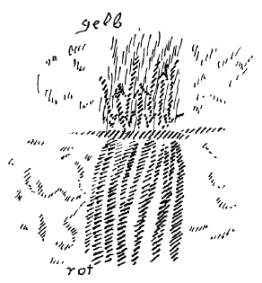

Sie werden aus dem Zusammenhange mancher Darlegungen der letzten Zeit mit allerlei Kundgebungen von außen eines wohl entnehmen können, daß unsere anthroposophische Bewegung in ein Stadium eingetreten ist, welches von jedem einzelnen, der sich an ihr beteiligen will, voraussetzt, daß er diese Beteiligung mit einem sehr ernsten Verantwortlichkeitsgefühl verbindet. Es ist ja in dieser Richtung öfters von mir gesprochen worden. Allein es wird nicht immer der Zusammenhang, um den es sich dabei handelt, in durchdringender Weise ins Auge gefaßt. Wir dürfen eben, gerade weil wir innerhalb unserer Bewegung stehen, nicht aus dem Auge verlieren, in welch ungeheuer ernster Zeit die europäische Zivilisation mit ihrem amerikanischen Anhange sich gegenwärtig befindet. Und wenn wir auch gar nicht von uns aus das eine oder das andere sagen würden — was aber durchaus zu sagen notwendig ist —, was als Zusammenhang besteht zwischen den Impulsen, die aus anthroposophisch orientierter Geisteswissenschaft kommen, und den zeitgeschichtlichen Ereignissen der Gegenwart: diese Ereignisse der Gegenwart würden heranschlagen an das, womit wir uns beschäftigen, und würden ganz zweifellos auch ohne unser Zutun sich mit dem beschäftigen, was in unserer Linie liegt. Es handelt sich darum, daß wir tatsächlich nicht die Augen verschließen vor der ganzen Bedeutung dessen, was mit solchen Worten angedeutet ist. ^6ex68p

Es ist vielleicht einer Reihe von Freunden, denen es früher noch nicht klar war, gerade aus den gestrigen Darlegungen von Dr. Boos klar geworden, in welch notwendigem und sachlichem Zusammenhange die Dreigliederungsidee mit alledem steht, was auf dem Grunde der anthroposophisch orientierten Geisteswissenschaft gewollt ist. ^krn3vw

Der Weltengang gleicht gegenwärtig einem außerordentlich komplizierten Organismus, und aus den mannigfaltigsten Erscheinungen, die man sorgfältig beobachten muß, geht hervor, welchen Gang dieser Organismus nimmt. Es geschieht heute sehr vieles, was zunächst scheinbar unbedeutend ins Dasein tritt. Dieses Unbedeutende, dieses scheinbar Unbedeutende bedeutet aber zuweilen etwas außerordentlich Einschneidendes und Eingreifendes. Es geschehen Dinge wiederum, die im eminentesten Sinne zeigen, wie außerordentlich schwer es ist, sich aus den altgewohnten Vorstellungen heraus zu einer Anschauung aufzuschwingen, die der heutigen Zeit angemessen ist. ^pxq8tv

Sie sehen aus mancherlei Zeitungsäußerungen der letzten Tage, wie das, was hier von Dornach ausgeht, hinauswirkt in die Welt, wie es zum Teil von diesem oder jenem aufgenommen wird, und man soll eben solche Ereignisse außerordentlich ernst betrachten. Man soll sich darüber klar sein, daß im Grunde genommen jedes Wort, das von uns heute ausgesprochen wird, durch und durch bedacht sein muß, und daß wichtige Worte eigentlich nicht ausgesprochen werden sollten, ohne daß man sich die Verpflichtung auferlegt, sich von dem allgemeinen Weltengang, wie er eben heute ein außerordentlich komplizierter Organismus ist, Kenntnis zu verschaffen. Auf Dinge, die hier in Betracht kommen, wird mir noch obliegen, in der allernächsten Zeit einzugehen; aber ich möchte heute einleitend doch dieses bemerken, daß gerade durch die Verknüpfungen unserer Bewegung mit dem allgemeinen Weltengange es uns vor allen Dingen obliegt, wirklich ein volles Verständnis dafür zu erwerben, daß wir nicht mehr unsere Bewegung irgendwie sektenmäßig betreiben dürfen. Ich habe über dieses Faktum des öfteren gesprochen. Durchaus ist heute die Zeit gekommen, wo wir nötig haben, jeden einzelnen Mitarbeiter zu übernehmen, aber jeden einzelnen Mitarbeiter mit der breiten vollen Verantwortung für dasjenige, was er im Sinne unserer Bewegung vertritt. Und diese Verantwortung sollte doch so gestaltet sein, daß sie eben verknüpft ist damit, sich verpflichtet zu fühlen, nichts zu sagen, was nicht durch innere Gründe in rechtem Zusammenhang erscheint mit dem allgemeinen Gang der heutigen Weltereignisse. Am wenigsten im Einklang mit den heutigen Weltereignissen ist ein sektiererisches Treiben. Was heute vertreten werden soll, muß durchaus im Angesichte der ganzen Welt vertreten werden können und darf weder einen sektiererischen noch einen dilettantischen Charakter tragen, gleichgültig, ob es Gesprochenes oder ob es Getanes ist. Wir dürfen nicht zurückschrecken davor, durchzusegeln zwischen der Skylla und der Charybdis. ^891rw4

Gewiß wird sich mancher sagen und damit auf eine gewisse Skylla deuten: Wie soll ich mich denn darüber informieren, was heute geschieht, da der Gang der Ereignisse ein so verwickelter geworden ist, da man heute so schwer aus den Symptomen auf die innere Bewegung der Tatsachen schließen kann? — Aber das soll eben nicht, ich möchte sagen, zur Charybdis hinführen, das heißt, tatenlos zu sein; sondern es sollte eben zum richtigen Durchsegeln führen, nämlich zum Fühlen der Verpflichtung, sich, so gut es geht, mit allen nur zugänglichen Mitteln in Einklang zu versetzen mit dem Gang der allgemeinen Weltenereignisse. Es ist ja gewiß leichter, sich zu sagen: Da ist die Anthroposophie, die lerne ich; auf ihrem Boden denke ich auch ein bißchen nach, erforsche das eine oder das andere und das vertrete ich dann vor der Welt. — Gerade dadurch kommen wir in die Sektiererei hinein, wenn wir so, gewissermaßen mit Scheuledern gegenüber den so großen, wichtigen Ereignissen der Gegenwart, einfach ohne rechts und links zu sehen, auf einem solchen Wege tätig sein wollen, wie ich es eben angedeutet habe. Uns obliegt es, den Gang der Ereignisse der Gegenwart zu studieren und vor allen Dingen bei diesem Studieren zugrunde zu legen dasjenige, was uns an Urteilen zukommen kann durch die Tatsachen, die aus anthroposophischer Geisteswissenschaft selber folgen. ^sqzmtk

Die ganzen Jahre her sind hier Tatsachen zusammengetragen worden mit dem Zwecke, daß auf Grundlage dieser Tatsachen der einzelne in die Lage kommt, sich ein Urteil zu bilden. Es dürfen diese Tatsachen nicht unberücksichtigt bleiben, wenn man von unseren Beobachtungen aus ein Urteil über irgend etwas, was heute geschieht, fällen will. Dies möchte ich heute nur im allgemeinen hingestellt haben und werde in der allernächsten Zeit auf Einzelheiten nach dieser Richtung eingehen. ^zkvr1k

Ich möchte heute einiges von dem vorbringen, was ergänzen wird, was ich letzten Sonntag hier über das Wesen des menschlichen Sinnesorganismus vorgebracht habe. Und ich möchte davon ausgehen, daß ich einen Gegensatz vor Sie hinstelle, den ich oftmals schon gerade an diesem Orte zum Ausdruck gebracht habe. Es besteht ja heute, ohne daß das große Publikum viel davon weiß, aber doch in dieser Richtung denkt, ich möchte sagen, das Infiziertsein durch die naturwissenschaftliche Denkweise auf der einen Seite, und auf der andern Seite besteht bei dem einen noch ein alter traditioneller Glaube an sittliche oder religiöse Ideale, bei dem andern besteht nurmehr Skeptizismus, Zweifelsucht in dieser Beziehung, bei dem dritten Gleichgültigkeit und so weiter. Dieser große Gegensatz, der durchzittert und durchzuckt heute im Grunde die ganze Menschheit: Wie verhält sich der notwendige Gang der Naturereignisse zu dem, was die Geltung der ethischen, sittlichen und religiösen Ideale ist? ^xu7fzj

Noch einmal will ich erwähnen, was ich ja vor eine große Anzahl von Ihnen bereits hingestellt habe: Wir haben eine naturwissenschaftliche Weltanschauung auf der einen Seite; sie glaubt, durch ihre Tatsachen etwas ausmachen zu können über den Weltengang, namentlich den Weltengang der Erde. Und wenn sie auch dasjenige, was sie sagt, als hypothesenhaft betrachtet, so impft sich das doch dem ganzen Denken, dem ganzen Empfinden und dem ganzen Fühlen der Menschheit ein. Man führt unser Erdendasein auf eine Art Nebelzustand zurück. Man betrachtet dann als durch rein naturgesetzliche Notwendigkeit hervorgebracht alles, was aus diesem Nebelzustand hervorgegangen ist, und man sieht auf den Endzustand unseres Erdendaseins hin, indem man wiederum starre, notwendige Naturgesetze zugrunde legt und sich Vorstellungen darüber macht, wie diese Erde zugrunde gehen wird. Und man hat, indem man eine solche Anschauung aufstellt, eine Grundvorstellung, welche heute auch schon ganz populär geworden ist, welche den Kindern in der Schule beigebracht wird; man hat die Grundvorstellung, daß der Stoff des Weltenalls, gleichgültig ob man ihn aus Atomen oder Ionen und dergleichen bestehen läßt, unzerstörbar sei, daß also gewissermaßen der Stoff beim Ausgangspunkt der Erdenbildung in einer gewissen Weise geballt war, sich dann umgewandelt, metamorphosiert hat, aber daß im Grunde genommen heute derselbe Stoff da ist, der im Beginn der Erdenentwickelung da war, und daß derselbe Stoff am Ende der Erdenentwickelung da sein wird, nur anders geballt, daß der Stoff unzerstörbar ist, daß alles nur Verwandlungen im Stoffe sind. Man hat hinzugefügt zu dieser Anschauung diejenige von der sogenannten Erhaltung der Kraft, indem man eine gewisse Summe von Kräften im Beginne annimmt, sie sich umwandelnd denkt und sich im Grunde genommen wiederum dieselbe Summe von Kräften im Endzustande der Erde vorstellt. ^3qdn19

Es sind nur einzelne mutige Geister gewesen, welche sich gegen so etwas aufgebäumt haben. Einen habe ich als typisches Beispiel öfters vor Ihnen angeführt, Herman Grimm, der ja gesagt hat: Von einem Nebelzustand, von derKant-Laplaceschen Nebelessenz im Beginne des Erdendaseins oder des Weltendaseins spricht man; da soll sich durch rein natürliche Vorgänge alles herausgeballt haben, was auf unserer Erde ist, inbegriffen der Mensch. Und dann soll sich das umwandeln, bis es zuletzt als Schlacke wiederum in die Sonne zurückfällt. Herman Grimm meint, ein Aasknochen, um den ein hungriger Hund herumläuft, sei ein appetitlicherer Anblick als diese Kant-Laplacesche Theorie vom Weltendasein, und es würde künftigen Zeiten schwer sein, kulturhistorisch zu erhärten, wie es hat sein können, daß das 19. und 20. Jahrhundert von dieser Krankheit, so etwas zu denken, hat ergriffen werden können. Einzelne mutige Geister, wie gesagt, haben sich aufgelehnt gegen diese Dinge. Aber diese Dinge werden heute so gelehrt, daß man von demjenigen, der dagegen etwas einwendet, wenn es ein Herman Grimm ist, sagt: Nun ja, ein Kunstgelehrter braucht ja von der Naturwissenschaft nichts zu verstehen. —- Und wenn es ein anderer sagt, der von der Naturwissenschaft etwas verstehen will, so hält man ihn für einen Narren. Derlei Dinge gelten heute für selbstverständlich, und die wenigsten Menschen empfinden, welche Bedeutung dieses Selbstverständlichsein eigentlich hat. Wenn diese Anschauung auch nur ein Atom Richtigkeit hat, dann hat alles Reden von sittlichen und religiösen Idealen keinen Sinn, dann sind sittliche und religiöse Ideale aus den Gehirnen der Menschen herausgeboren und steigen auf wie Blasen — die sozialdemokratischen Theoretiker nennen sie eine Ideologie, um die Menschen zu äffen -, die sich ja nur herausgeballt haben aus den Verwandlungen des Stoffes und die verschwinden werden, wenn unsere Erde in ihrem Endzustand angelangt ist. Alles, was wir uns vorstellen an sittlichen, an religiösen Idealen, ist lediglich Schaumblase dann. Denn die Realität, welche die naturwissenschaftliche Weltanschauung fordert, ist so geartet, daß sie gar nicht eine sittliche oder religiöse Weltanschauung zuläßt, wenn man diese naturwissenschaftliche Weltanschauung so hinnimmt, wie sie von der Mehrzahl der Menschen geglaubt wird. Daher handelt es sich darum, daß die Zeit, die heute reif ist auf der einen Seite, dringend notwendig macht auf der andern Seite, daß aus ganz andern Quellen heraus, als die heutige Bildung sie hat, eine Weltanschauung geholt werde. ^3kr26t

Diese Quellen, die es möglich machen, daß eine sittliche und eine religiöse Weltanschauung neben der naturwissenschaftlichen bestehe, können einzig und allein die geisteswissenschaftlichen Quellen sein. Aber diese geisteswissenschaftlichen Quellen müssen dann da aufgesucht werden, wo sie im vollen Ernst sprechen. Das Aufsuchen dieser Quellen wird vielen Menschen der Gegenwart schwer. Sie wollen sich lieber hinwegsetzen über jenen reinen Widerspruch, den ich heute wiederum vor Sie hingestellt habe, denn man hat nicht den Mut, der naturwissenschaftlichen Weltanschauung selber zu Leibe zu gehen. Man hört von denen, die man als Autoritäten betrachtet, das Gesetz von der Erhaltung des Stoffes und der Kraft sei sichergestellt und jeder sei ein Dilettant, der sich nicht an diese Gesetze hält. Man bringt eben gegenüber der ungeheuren Last der falschen Autorität, die heute auf der Menschheit liegt, den Mut nicht auf, von dieser Autorität weg zu den Quellen der Geisteswissenschaft zu gehen. | ^16jvqs

Und auch das lehren die äußeren Tatsachen, daß das Heil des Christentums, das Heil eines wirklichen Begreifens des Mysteriums von Golgatha von der Hinwanderung zu den Quellen der Geisteswissenschaft abhängt. Der äußere Gang der Ereignisse zeigt das ja. Sehen Sie sich die sogenannten fortgeschrittenen Theologen an, sehen Sie sich an, was von den fortgeschritteneren Vertretern des Christentums gelehrt wird. Der Materialismus hat ja auch die Religion ergriffen. Nicht mehr kann man einsehen, wie das geistig-göttliche Prinzip, das mit dem Namen des Christus umrissen ist, vereinigt ist mit der menschlichen Persönlichkeit des Jesus von Nazareth, denn diese Vereinigung kann heute nur aus den Quellen der Geisteswissenschaft heraus gekannt werden. ^a0tpyl

Und so ist es denn dahin gekommen, daß auch die Theologie materialistisch geworden ist, nur von dem «schlichten Manne aus Nazareth» spricht, von einem Menschen, der ja Großartigeres gelehrt haben soll als andere, der aber eben doch nur als ein großartigerer Lehrer in Betracht kommt, der nicht in Betracht kommt durch dasjenige Wesen, das er in seinem Leibe getragen hat. Und einer der bedeutendsten Theologen der Gegenwart, Adolf Harnack, hat ja das Wort geprägt: Nicht der Christus, sondern der Vater gehört in das Evangelium -, das heißt, das Evangelium soll nicht sprechen von dem Christus, weil solche Theologen wie Harnack im Grunde genommen den Christus gar nicht mehr kennen, sondern nur den Lehrer von Nazareth. Die Lehre dieses Menschen von Nazareth wollen sie noch annehmen; die Lehre von dem väterlichen Schöpfer der Welt, die gehöre ins Evangelium, nicht aber eine Lehre über den Christus Jesus selber! ^gacthh

Auf dieser Bahn der Naturalisierung, der Materialisierung würde das Christentum zweifellos fortschreiten, wenn ein geisteswissenschaftlicher Einschlag für dasselbe nicht kommen würde. Aus dem, was von altersher die Menschheit überkommen hat, kann sie in ehrlichem Sinne keinen Begriff aufbringen über die Vereinigung der göttlichen und der menschlichen Natur in dem Christus Jesus. Dazu ist die Eröffnung neuer Quellen geistiger Wissenschaft notwendig. Und diese Eröffnung brauchen wir für das religiöse Leben; diese Eröffnung, wir brauchen sie aber auch für die von den Zeitereignissen geforderte Neugestaltung der sozialen Verhältnisse innerhalb unserer Zivilisation. Und wir brauchen vor allen Dingen eine völlige Neugestaltung der Wissenschaft, eine Durchdringung aller Wissenschaften mit geisteswissenschaftlichen Quellen. Ohne diese geht es nicht weiter. Und derjenige, der glaubt, man brauche sich nicht zu kümmern um den Gang des religiösen Lebens, um den Gang des sozialen Lebens, um den Gang der öffentlichen Ereignisse über die zivilisierte Welt hin, um den Gang der wissenschaftlichen Leistungen, wer da glaubt, man könne in sektiererischer Abgeschlossenheit Anthroposophie treiben vor irgendeinem zusammengewürfelten Kreis, der sich dann als eine Summe von Fremdlingen innerhalb dieser Welt ausnimmt, der ist eben durchaus in einem schweren Irrtum befangen. ^9jcff8

Bei allem, was hier von mir gesprochen wird, liegt immer zugrunde die Verantwortung gegenüber dem ganzen Gang der gegenwärtigen Weltereignisse. Bei jedem einzelnen Satze, bei jedem einzelnen Worte liegt diese Verantwortung zugrunde. Ich muß das schon erwähnen aus dem Grunde, weil es nicht immer in aller Schärfe eingesehen wird. Wenn heute in derselben Weise fortgefahren wird, von Mystik zu reden, wie viele im Laufe des 19. Jahrhunderts von Mystik geredet haben, dann steht das nicht mehr im Einklange mit dem, was die Welt heute fordert. Und wenn nur zu dem, was sonst im Gang der Weltereignisse geschieht, der Inhalt der anthroposophischen Lehre hinzugesetzt wird, so steht das ebenfalls nicht im Einklange mit den Anforderungen der Gegenwart. Erinnern Sie sich, wie im Mittelpunkt der Betrachtungen, die ich seit Jahrzehnten pflege, das Problem, das Rätsel der menschlichen Freiheit steht. Dieses Problem der menschlichen Freiheit, wir müssen es heute in den Mittelpunkt einer jeglichen und wirklich geisteswissenschaftlichen Betrachtung stellen. ^nrvv38

Wir müssen dies aus zwei Gründen tun. Erstens deshalb, weil alles, was aus den alten Mysterien heraus aufgebracht worden ist, was durch die Initiationswissenschaft der alten Zeit vor die Welt hingestellt worden ist, weil alles das ohne ein wirkliches Begreifen des Rätsels der menschlichen Freiheit dasteht. Großartiges, Gewaltiges haben die Lehrer der alten Mysterien der Menschheit überliefern können. Großartiges, Gewaltiges liegt in den mythischen Überlieferungen der verschiedenen Völker, die ja auch esoterisch erläutert werden dürfen, freilich nicht so, wie man es oft macht. Großartiges liegt in den sonstigen Überlieferungen, die ihren Quell in der Initiationswissenschaft alter Zeit haben, wenn man sie nur in der richtigen Weise versteht. Aber eines liegt in alledem nicht, eines liegt nicht in der Initiationswissenschaft der alten Mysterien, nicht in den Mythen der verschiedenen Völker, auch wenn sie esoterisch verstanden werden, nicht in den Traditionen, die sich herschreiben aus dieser Initiationswissenschaft: das ist das Rätsel von der menschlichen Freiheit. Denn derjenige, der von einer Initiationswissenschaft, von einer Einweihung der Gegenwart ausgeht, der begreift, wie Einweihung der Gegenwart sich hinstellt neben Einweihung der Vergangenheit, der weiß, daß die Menschheit in ihrer Entwickelung über die Erde hin erst jetzt in das Stadium wirklicher Freiheit eintritt, und daß es einfach früher nicht nötig war, der Menschheit eine Initiationswissenschaft zu geben, die ganz imprägniert wäre von dem Rätsel der Freiheit. Was alles das Rätsel der Freiheit umschließt, in welche Lage die menschliche Seele versetzt ist, wenn sie das Rätsel der Freiheit völlig klar auf sie abgeladen findet, das ahnen die wenigsten Menschen heute. Alle Initiationswissenschaft muß ja ein neues Licht empfangen durch dieses Rätsel der menschlichen Freiheit. Das auf der einen Seite. Wir sehen, wie sich fortsetzen aus alten Zeiten in direkter Kontinuation, möchte ich sagen, Geheimgesellschaften, die zum Teil recht stark in demLeben der Gegenwart stehen, die aber nur das Alte bewahren, nur das Alte nachahmen, nur fortwirken im Sinne des Alten, und die doch nichts weiter sind, als Schatten des Alten, die nichts weiter sind als etwas, was, wenn es heute wirkt, der Menschheit schädlich sein muß. ^s5invf

Man muß einsehen, daß selbst die einstmals größten Mysterien, wollte sie heute jemand lehren, schädlich für die Menschheit wären. Niemand, der das Wesen gegenwärtiger Initiation versteht, kann wie etwas Gegenwärtiges lehren, was einst in den ägyptischen, in den chaldäischen, in den indischen, selbst in den griechischen Mysterien, die uns noch so nahestehen, gelehrt worden ist. Aber schließlich ist alles, was an Lehre über das Christentum vorgebracht worden ist bis jetzt, aus diesen traditionellen Lehren heraus vorgebracht worden. Und nötig haben wir, aus einer neuen Lehre neu das Mysterium von Golgatha zu verstehen. Das, wie gesagt, auf der einen Seite. ^2rc89l

Auf der andern Seite sehen wir den Gang der Zeitereignisse. Wir sehen, wie aus unterbewußten, tiefliegenden Gründen der Menschenseele heraufzieht das Streben nach dem Freiheitsimpuls. Wir sehen, wie gewissermaßen dieser Ruf nach Freiheit das menschliche Streben der neueren Zeit durchtönt. Ja, er durchtönt dieses Streben, aber es durchtönt so vieles das menschliche Streben, was nicht klar verstanden wird, was nur aus unterbewußten Tiefen herauftönt und was eben mit klarem Verständnis erst durchdrungen werden muß. Man möchte sagen: Die Menschheit lechzt nach Freiheit! Die Initiationswissenschaft weiß, daß sie eine Initiationswissenschaft geben muß, beleuchtet von dem Lichte der Freiheit. ^rfa8td

Und diese zwei Dinge, dieses Streben der Menschheit und dieses Herausschaffen einer Initiationsweisheit, beleuchtet mit dem Lichte der Freiheit, diese zwei Dinge müssen zusammenkommen. Sie müssen zusammenkommen auf allen Gebieten. Daher darf man heute nicht aus allen möglichen alten Untergründen heraus über die soziale Frage reden. Man kann heute über sie nur dann reden, wenn man sie im Lichte der Geisteswissenschaft betrachtet. Das wird gerade der heutigen Menschheit so schwer. Warum? — Ja, die Menschheit strebt nach Freiheit, nach Freiheit der einzelnen Individualität, und mit Recht strebt sie darnach. Ich sage durchaus: mit Recht. Die Menschen können nicht mehr im Sinne des alten Gruppensystems mit den Gruppenseelen wirken. Die Menschen müssen Individualitäten bilden. Aber dieses Streben, Individualitäten zu bilden, das scheint zu widersprechen dem Hinhorchen auf das, was aus der Initiationswissenschaft kommt und was ja selbstverständlich zunächst durch einzelne Individuen kommen muß. Der alte Initiierte hatte Mittel und Wege, sich seine Schüler auszusuchen, seinen Schülern die Initiationsweisheit zu übertragen und auch Anerkennung für sie zu schaffen und Anerkennung für sich und seine Mysterienstätte. Der moderne Initiierte kann das nicht haben, denn es würde notwendig machen, daß man aus gewissen Kräften und Impulsen der Gruppenseelenhaftigkeit heraus wirke, und das geht heute nicht. So steht heute die Menschheit da; jeder möchte von dem Standpunkte aus, auf dem er gerade steht, eine Individualität werden. Da will er selbstverständlich nicht auf das hören, was da durch Menschen als Initiationswissenschaft kommt. Aber ehe nicht die Menschen einsehen, daß sie nur gerade dadurch Individualitäten werden können, daß sie wiederum durch andere menschliche Individualitäten den Inhalt der Initiationswissenschaft aufnehmen, eher kann es nicht besser werden. Das hängt nicht nur zusammen mit einzelnen Weltanschauungsfragen, das hängt zusammen mit dem Grundcharakter unseres ganzen Zeitalters und mit den Auswirkungen dieses Zeitalters auf geistigem, auf staatlichem und wirtschaftlichem Gebiete. Nach Freiheit dürstet die Menschheit. Von Freiheit möchte die Initiationswissenschaft sprechen. Wir sind aber im gegenwärtigen Entwickelungsstadium der Menschheit eigentlich erst da angekommen, wo Freiheit durch den gesunden Menschenverstand wirklich begriffen werden kann. Heute muß man manches einsehen, was Sie aus unserer anthroposophischen Literatur entnehmen können und was ich hier wiederum von gewissen Gesichtspunkten aus kurz zusammenfassen möchte. Man muß heute begreifen, was für eine Art von Wesen der Mensch ist. Alles abstrakte Schwätzen von Monismus läuft gerade vorbei an dem wahren Monismus, der errungen sein will, nachdem man manches andere durchgemacht hat, den man aber nicht von vornherein als eine Weltanschauung deklamieren kann. ^rg1dgs

Der Mensch ist ein Doppelwesen. Auf der einen Seite steht dasjenige, was man — das Wort führt zu Mißverständnissen, aber wir haben ja in der Sprache so wenig Worte, die wirklich adäquat dasjenige ausdrücken, was man eigentlich ausdrücken möchte vom geisteswissenschaftlichen Standpunkte aus —, was man die niedere Natur des Menschen nennen könnte, die physisch-körperhafte Organisation, aus der zunächst der Mensch besteht. Diese physisch-körperhafte Organisation habe ich Ihnen das letzte Mal im Zusammenhange gerade mit der Sinnesorganisation geschildert, Wir wollen heute zunächst davon absehen und morgen auf die Sache wieder zurückkommen. Aber jeder von Ihnen, der einigermaßen die anthroposophische Literatur verfolgt hat, hat ja eine Vorstellung von dieser physisch-körperhaften Organisation des Menschen und auch davon, daß sie zusammenhängt mit dem, was zunächst unsere Umwelt ist. Das, was da draußen die Welt konstituiert, was draußen im mineralischen, im pflanzlichen, im tierischen Reiche lebt, das konstituiert physisch-körperhaft auch uns Menschen. Wir sind ja eine Art Zusammenfassung, heraufgehoben auf eine höhere Stufe, und man kann bildhaft sagen: die Krone der Schöpfung. Aber wir sind eben in physisch-körperhafter Weise ein Zusammenfluß dessen, was an Kräfte- und Stoffwirkungen außer uns vorgeht und was vor uns auftaucht durch unsere Sinneswahrnehmungen. ^pvhzsq

 ^u620tt

Dann haben wir unser Innenleben. Wir haben unser Wollen, unser Fühlen, unser Denken, unser Vorstellen. Wir können, wenn wir uns auf uns selbst besinnen, aufmerksam werden auf dieses Wollen, Fühlen, Denken in uns, und wir können dieses Wollen, Fühlen und Denken mit dem durchdringen, was wir unsere religiösen, unsere sittlichen und sonstigen Ideale nennen. Wir kommen da zu etwas, was man — wiederum führt das leicht zu Mißverständnissen, aber man braucht dieses Wort den seelisch-geistigen Menschen nennen kann. Man kommt nicht zurecht, wenn man nicht den Seelenblick hinwendet einerseits auf diesen geistig-seelischen Menschen, andererseits auf den physisch-körperlichen Menschen. Aber es ist notwendig, daß man, sei es durch ein wirklich unbefangenes Verfolgen der Tatsachen der Natur, sei es durch Vertiefung in die Geisteswissenschaft, es ist notwendig, daß man sich zum Bewußtsein bringe: diese physisch-körperhafte Organisation liegt eigentlich zunächst nicht vor in demjenigen, was irgendwelche menschliche Wissenschaft, wie sie heute in der exoterischen Welt existiert, umfassen kann. Wenn ich das schematisch durch eine Zeichnung klarmachen soll, so möchte ich sagen: Wenn ich alles das zusammenfasse, was menschlich-physische Organisation ist und was im Zusammenhange steht mit der ganzen Umwelt (siehe Zeichnung, rot), so geht das bis zu einem gewissen Punkte — ich will das hier durch eine Linie zeichnen -, und straff davon verschieden, trotz aller moderner dilettantischer psychologischer Einwände, straff davon verschieden ist dasjenige, was man die 'geistig-seelische Natur des Menschen nennen kann (gelb), die ihrerseits mit einer Welt des Geistig-Seelischen in Verbindung steht, mit einer Welt, die der heutigen Menschheit sehr abstrakt vorkommt, weil sie sie nur auffaßt im Sinne der abstrakt-sittlichen oder im Sinne der religiösen Ideale, die auch immer mehr und mehr zu abstrakten Vorstellungen geworden sind. Beiden Gliedern der menschlichen Natur gegenüber muß man aber sagen: Das, was man heute als Wissenschaft ansieht, das umfaßt weder die physisch-körperliche noch die geistig-seelische Natur des Menschen. Die physisch-körperliche Natur des Menschen, man kann sie nicht erkennen. Lesen Sie die Gründe, warum man sie nicht erkennen kann, in meinem kleinen Büchelchen «Durch den Geist zur Wirklichkeits-Erkenntnis der Menschenrätsel». Wenn der Mensch nämlich bei einer Innenschau sich selber durchschauen würde, das heißt, bis auf den Grund hinunterschauen würde auf das, was da im Inneren eigentlich vorgeht, dann würde er genau sehen können, was im Inneren vorgeht, in dem Sinne genau, wie die heutige Wissenschaft etwas «genau sehen» nennt. Dann würde der Mensch aber nicht das Wesen sein können, das er heute ist, denn er würde dann kein Gedächtnis haben können, er würde kein Erinnerungsvermögen haben. Indem wir die Welt anschauen, bleiben uns die Bilder der Welt als Erinnerungen, das heißt, die Welteindrücke schlagen überhaupt nur bis zu dieser Grenze hier (siehe Zeichnung, Pfeile) und da schlagen sie in die Seele zurück, und wir erinnern uns an sie. Und was da aus uns selbst in die Erinnerung zurückschlägt, das verdeckt uns das physisch-leibliche Innere des Menschen. Wir können da nicht hineinschauen, denn würden wir hineinschauen können, so wäre jeder Eindruck nur ein Augenblickseindruck. Es würde nichts als Erinnerung zurückgeworfen. Nur dadurch, daß sich diese Grenze hier verhält, wie sich ein Spiegel verhält - wir können auch nicht hinter den Spiegel schauen, sondern es werden uns die Eindrücke zurückgeworfen —, können wir nicht in unser Inneres schauen, es werden uns die Eindrücke zurückgeworfen, wenn wir nicht zur Geisteswissenschaft aufsteigen. Und würden sie nicht zurückgeworfen, so würden wir eben auch nicht im gewöhnlichen Leben die zurückgeworfenen Eindrücke der Erinnerung haben. Wir müssen als Menschen im Leben so organisiert sein, daß wir Erinnerungen haben. Dadurch aber ist uns verschlossen unsere physisch-leibliche Organisation. Wie man durch den Spiegel nicht hindurchschauen kann auf das, was hinter dem Spiegel ist, so kann man gewissermaßen nicht hinter den Erinnerungsspiegel oder unter den Erinnerungsspiegel schauen, auf das, was die leiblich-physische Organisation des Menschen ist. ^gq4sx2

Das ist wahre Psychologie, das ist das wahre Wesen der Erinnerung. Und erst dann, wenn geisteswissenschaftliche Methoden so diesen Spiegel durchbrechen, daß für die geisteswissenschaftlichen Methoden — was ich auch schon in öffentlichen Vorträgen gesagt habe — eben nicht an das Erinnerungsvermögen appelliert wird, sondern ohne Erinnerung und jedesmal mit neuen Eindrücken gearbeitet wird, erst dann kommt man auch auf das Leiblich-Seelische, auf seine wahre Gestalt. ^y79u2v

Ebenso ist es nach der andern Seite hin. Würden wir das GeistigSeelische, von dem ich Ihnen ja letzten Sonntag zeigte, wie es hinter dem Sinnlichen ist — nicht Atome oder Moleküle sind dahinter, sondern das Geistig-Seelische ist da in Wahrheit dahinter —, würden wir dies mit unserem gewöhnlichen alltäglichen Erkenntnisvermögen durchschauen, würden wir uns gewissermaßen nicht stoßen an den Pfählen, an den Grenzen der Naturwissenschaft, dann wäre in uns das nicht vorhanden, was wir wiederum zum menschlichen Leben brauchen, was wir erziehen müssen hier zwischen Geburt und Tod, dann wäre in uns nicht vorhanden die menschliche Liebefähigkeit. Die menschliche Liebefähigkeit wird in uns dadurch erzogen, daß wir zunächst in diesem Leben zwischen Geburt und Tod, wenn wir nicht zur Geisteswissenschaft schreiten, zu verzichten haben auf das Durchschauen des Sinnenschleiers, auf das Hineinschauen in die geistige Welt. Und Erinnerungsvermögen können wir nur dadurch haben, daß wir verzichten auf das Hineinschauen in das Leiblich-Physische. Dadurch aber sind wir zwei großen Täuschungen ausgesetzt. Der einen Täuschung unterliegen die dogmatischen Anhänger der naturwissenschaftlichen Weltanschauung. Sie hören nicht hin auf die Initiationswissenschaft und kommen nicht in der Art, wie ich Ihnen das letzten Sonntag auseinandergesetzt habe, darauf, daß hinter dem Sinnenschleier nicht Materie, nicht Stoff, nicht das, was die Naturwissenschaft Kraft nennt, vorhanden ist, sondern durch und durch geistig-seelische Wesenheit. Es ist auch heute von mir noch mit aller Schärfe dasselbe zu betonen, was ich in meinem Kommentar zum dritten Bande von Goethes naturwissenschaftlichen Schriften, zu Goethes «Farbenlehre» hervorgehoben habe. Da draußen ist der Farbenteppich der Welt, da draußen ist Rot und Blau und Grün, und da draußen sind die andern Empfindungen. Hinter diesen stecken nicht Atome, stecken nicht Moleküle, hinter diesen stecken geistige Wesenheiten. Was aus diesen geistigen Wesenheiten an die Oberfläche getrieben wird, das lebt sich aus im Farbenteppich der Welt, im Tonzusammenhange, im Wärmezusammenhange der Welt und in all den andern Empfindungen, die uns die Welt vermittelt. ^8qpf6c

Diejenigen aber, die heute dogmatische Anhänger der naturwissenschaftlichen Weltanschauung sind, die durchschauen das nicht. Sie wollen nicht auf die Initiationswissenschaft hinhören. Die Folge davon ist, daß sie anfangen darüber zu spekulieren, was hinter den Farben, der Wärme und so weiter steckt, und dann zu einer stofflichen Konstruktion der Welt kommen. Die ist immer, wenn sie scheinbar noch so gut gegründet ist, wie die moderne Ionentheorie, nur erspekuliert, und man darf nicht hinter die Sinneswelt hinspekulieren, man darf hinter der Sinneswelt nur durch eine höhere, durch eine geistige Welt Erlebnisse haben, sonst muß man bei den Phänomenen stehenbleiben. Die Sinneswelt ist eine Summe von Phänomenen und sie muß als eine Summe von Phänomenen begriffen werden. ^ivxbjm

So wird uns heute ein Bild der Natur überliefert, das dann ausgedehnt wird über den Anfangszustand, über den Endzustand der Erde, jenes Bild der Natur, das eben sittliche, religiöse Weltanschauung für den ehrlich Denkenden ausschließt. ^lvs3pa

Auf die andere Klippe kommen diejenigen, welche nun ins Innere hineinschauen. Die bleiben meistens bei dem stehen, was sich spiegelt. Der gewöhnliche Mensch im Alltagsleben nimmt die Erinnerungswirkungen wahr, ich möchte sagen, er erinnert sich an das, was er gestern und vorgestern erlebt hat, wenn auch das Gestern und Vorgestern schon vor Jahren war. Derjenige, der nun ein Mystiker wird, treibt dann allerlei aus seinem Inneren an die Oberfläche und belegt es mit allerlei schönen mystischen Worten und Theorien. Aber es ist doch nichts anderes, als was ich hier neulich angedeutet habe, es ist nichts anderes als das Kochen und Brodeln des organischen Lebens im menschlichen Inneren. Denn durchdringt man diesen Spiegel, dann kommt man nicht zu dem, was etwa der Meister Eckhart oder Johannes Tauler in ihrer Mystik haben, sondern dann kommt man zu organischen Prozessen allerdings, von denen die Welt heute wenig ahnt. Und was noch mit so schönen mystischen Worten dargelegt wird, das verhält sich zu diesen organischen Prozessen nicht anders, als sich bei der Kerze die Flamme zu dem Brennstoff verhält: sie ist das Produkt dieser organischen Prozesse. Die Mystik eines Johannes vom Kreuz, einer Mechthild von Magdeburg, auch des Johannes Tauler und Meister Eckharts, sie sind schön, aber doch nur das, was aus dem organischen Leben heraufbrodelt und was nur deshalb in abstrakten Formen beschrieben wird, weil man nicht einsieht, wie dieses organische Leben tätig ist. Man lernt das geistige Leben nicht kennen, wenn man nicht erst dieses organische Leben kennenlernt. Der kann kein Geisteswissenschafter werden im wahren Sinne des Wortes, der das innerlich-brodelnde organische Leben in Mystik umdeutet. Gewiß, es sind schöne Worte, die da gesprochen werden. Aber man muß sich, wenn man über diese Dinge spricht, auf einen ganz andern Gesichtspunkt stellen können als den der äußeren Welt. Man muß sich eben nicht auf den menschlich hochmütigen Gesichtspunkt stellen, indem man sagt: Das innere organische Leben ist eben niederes Leben. — Es wird dadurch nicht höher, daß man seine Wirkung als Mystik bezeichnet, sondern man wird ins geistige Leben eben gerade dadurch getrieben, daß man dieses organische Leben in seinen organischen Wirkungen durchschaut, daß man: weiß, je tiefer man in die Einzelnatur des Menschen hineinsteigt, desto mehr entfernt man sich vom Geistigen, man kommt ihm nicht näher. Man kommt nur auf geisteswissenschaftliche Weise dem Geistigen näher, nicht dadurch, daß man in sich selber hineinsteigt. Wenn man in sich selber hineinsteigt, dann hat man die Aufgabe, zu untersuchen, wie durch Zusammenwirkung von Herz, Leber und Niere Mystik zustande kommt, denn das tut sie. ^wv1u2p

Das habe ich ja öfters als die Tragik des modernen Materialismus hingestellt, daß dieser moderne Materialismus zuletzt eben die materiellen Wirkungen nicht erkennen kann, daß er gar nicht bis zu den materiellen Wirkungen kommt. Wir haben ja heute weder eine wirkliche Naturwissenschaft noch eine wirkliche Psychologie; denn eine wirkliche Naturwissenschaft führt zum Geiste, und eine Psychologie, die in dem Sinne, wie wir es heute wollen, fortschreitet, die führt zu der Erkenntnis von Herz, Leber, Niere und nicht zu den abstrakten Dingen, von denen die heutige dilettantische Psychologie redet. Denn was man heute oftmals Wollen, Fühlen, Denken nennt, sind abstrakte Worte, die konkreten Dinge fehlen den Leuten. Und es ist leicht, sogar wirklich ernstgemeinte Geisteswissenschaft des Materialismus zu zeihen, weil sie gerade in das Wesen des Materiellen hineinführt, um auf diesem Wege zum Geiste zu führen. ^ev39on

Der wirkliche Spiritualismus wird gerade das Wesen des Materiellen zu enthüllen haben. Dann wird er zeigen können, wie der Geist im Materiellen wirkt. Denn das muß ganz ernst genommen werden: Geisteswissenschaft darf nicht auf die bloße Logizität der Erkenntnis, sondern muß auf die Erkenntnis als Tat gehen. Es muß etwas getan werden im Erkennen. Es muß das, was im Erkennen sich abspielt, in den Gang der Weltereignisse eingreifen. Es muß etwas Tatsächliches sein. Gerade darauf habe ich mich ja bemüht, letzten Sonntag und in den vorhergehenden Tagen hinzuweisen. Es handelt sich einmal darum, daß man einsehe: Der Geist als solcher muß als Tatsache verstanden werden, es darf nicht eine Theorie vom Geiste ausgebildet werden. Theorien sollen dazu da sein, um zum lebendigen Empfinden des Geistes zu führen. Aus diesem Grunde ist es notwendig, daß von dem wirklichen Geisteswissenschafter so oft paradox gesprochen wird. Man kann heute nicht fortfahren, in den landläufigen Formeln zu sprechen, wenn man von wahrer Geisteswissenschaft spricht, sonst kommt man eben zu dem, wozu eine verderbliche 'Theosophie geführt hat, welche von allen möglichen Gliedern der Menschennatur spricht, vom physischen Menschen, vom ätherischen, vom astralischen Menschen; aber das wird immer nur «dünner». Der physische Mensch ist dicht, der ätherische ist dünner, der astralische ist noch dünner, dann gibt es ganz dünne, mentale und was noch alles, es wird immer dünner und dünner, ein wahrgenommener Nebel, aber Nebel bleibt es, es bleibt Materie! Darauf kommt es nämlich nicht an. Es kommt darauf an, daß man in der Substanz das Materielle überwindet. Da muß man dann oftmals Worte anwenden, die eine andere Prägung haben, als sie im alltäglichen Leben üblich ist. ^e4irvr

Und so muß man schon sagen — morgen wird uns diese Sache noch klarer werden -, so muß man schon sagen: Nehmen wir auf der einen Seite einen Menschen, der durch und durch materialistische Gesinnung hat, der, sagen wir, verführt durch den Materialismus der Gegenwart, sich nicht zu der Anschauung eines Geistigen erheben kann, der durch und durch ein Materialist der Theorie nach ist und alles als Nonsens ansieht, was man über ein Geistiges behauptet, aber dasjenige, was er über die Materie sagt, nehmen wir an, das wäre geistvoll, das wäre etwas, was die Materie wirklich treffen würde, dann hätte der Mann Geist. Er würde zwar durch seinen Geist den Materialismus vertreten, aber er hätte Geist. ^syx5ug

Nehmen wir einen andern, der sich in irgendeiner theosophischen Gesellschaft hat einschreiben lassen und den Standpunkt vertritt: Da ist der physische Leib, dann etwas dünner der ätherische Leib, noch dünner der astralische Leib, noch dünner der Mentalleib und so weiter. Um das zu behaupten, dazu gehört nicht viel Geist. Man kann wenig Geist haben und solch eine Theorie vertreten. Man vertritt im Grunde genommen nur als Lüge eine geistige Welt, denn man vertritt in Wirklichkeit nur eine materielle Welt, die man geistig umschreibt. ^bg43l6

Wo wird derjenige, der nun wirklich auf den Geist geht, den Geist suchen, beim materialistischen Theoretiker, der den Geist hat, nur eben auf eine Weise, die logisch ist, oder bei dem, der sozusagen richtige Behauptungen aufstellt, aber in seinen Worten doch nur von Materie redet? — Der wirkliche Spiritualist wird vom Geiste bei dem ersteren reden, bei dem, der eine materialistische Weltanschauung vertritt, denn da kann Geist eben vorhanden sein, während beim Vertreten einer spirituellen Anschauung eben kein Geist vorhanden zu sein braucht. Und es kommt darauf an, daß der Geist wirkt, nicht daß man vom Geiste redet. ^5iru6n

Das wollte ich heute nur zur Erläuterung von manchem sagen, was wie paradox sich ausnimmt. Der geistvolle Materialist kann mehr erfüllt sein vom Geiste als derjenige, der eine spirituelle Theorie vertritt, wenn er sie eben geistlos vertritt. Es hört eben bei der wahren Geisteswissenschaft die Möglichkeit auf, bloß logisch über Weltanschauungsgesichtspunkte zu streiten. Da beginnt die Notwendigkeit, den Geist in seiner Realität zu erfassen. Das kann man nicht, ohne daß man sich erst Vorbegriffe klarmacht, wie diejenigen sind, von denen wir heute gesprochen haben, von denen wir morgen weiter sprechen wollen. ^xwkl0g