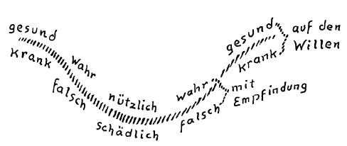
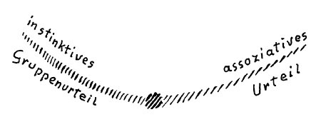

Ich möchte heute einiges für manchen hier schon wiederholentlich Vorgebrachtes vor Ihnen entwickeln, was zu gleicher Zeit in gewisser Beziehung als eine Vorbereitung dienen kann für das, was morgen hier über die Bildung des sozialen Urteils vorzubringen sein wird. Ich möchte zunächst darauf aufmerksam machen, wie wir innerhalb der Bildungsgewohnheiten der Gegenwart davon ausgehen, über Weltanschauungsfragen so zu diskutieren, so uns Ansichten zu bilden, daß es uns dabei darauf ankommt, im logischen Sinne zu entscheiden: Was ist wahr, was ist falsch? Gerade das aber ist etwas, was sich wandeln muß in der Gegenwart. Johann Gottlieb Fichte sagte ja die schönen Worte: Man hat eine solche Philosophie, wie man ein Mensch ist.— Nun, man bildet sich nach seiner Veranlagung eine mehr materialistische oder spiritualistische Weltanschauung, eine realistische, eine idealistische oder eine liberale oder eine konservative oder eine sozialistische, eine politische Weltanschauung, oder auch man bildet sich eine philiströse oder eine fortschrittliche Ansicht in der Frauenfrage. Ich könnte noch lange diese Dinge hier aufzählen. Man bildet sich Ansichten, und man vertritt dann diese Ansichten, indem man sich vorstellt, man selbst habe das Richtige, der andere, der das Entgegengesetzte vertritt, habe das Falsche. Richtig und falsch ist etwas, was uns heute bei der Bildung eines Urteils ganz besonders interessiert. ^ztaepd

Allerdings, man sieht schon — wie wir gleich nachher deutlich ausführen werden -, daß ein Übergang von diesem «Wahr und Falsch» zu etwas ganz anderem seinen Anfang nimmt. Aber vorerst wollen wir uns klarmachen, daß dieses «Wahr und Falsch» nicht immer so war wie heute. Noch in den älteren Zeiten des Christentums oder gar in den Zeiten des Ägyptertums, des Chaldäertums, gar nicht zu reden von den Zeiten, die vorangegangen sind diesen Kulturepochen, galt etwas ganz anderes, wenn man sich ein Urteil bilden wollte. Man bildete sich ein Urteil nicht so, daß man zunächst auf seine Logizität sah, sondern man hatte das Gefühl: Wenn jemand in einer bestimmten Weise urteilt, so urteilt er gesund; wenn er in einer andern Weise urteilt, so urteilt er krank. — Geradeso wie man sagt, wenn man jemanden pausbackig, gerötet, ein bißchen belebt sieht, er sei gesund, und wie man sagt, wenn man jemanden ganz dürr findet, käsig, weiß, mit schwarzen Rändern an den Augen, er sei kränklich, so sagte man, wenn jemand so oder so urteilte, er urteile gesund oder krank. Man sah also in der Art und Weise, wie jemand urteilte, geradeso einen Ausfluß der ganzen Menschheitsorganisation wie im pausbackigen oder im hageren oder im käsigen Aussehen. Man beurteilte den Menschen mehr mit Bezug auf das, was er an sich ist, weniger mit Bezug auf das, was er gegenüber einer Umgebung ist, über die er sich Vorstellungen von richtig oder falsch macht. ^rbd7oz

Ich habe hier bereits früher hervorgehoben, für eine Anzahl von Ihnen, die damals dagewesen sind, daß wir in einer gewissen Weise auf diese Anschauungsart wiederum zurückkommen müssen. In einer gewissen Art ist ja der Entwickelungsgang der Menschheit so, daß bestimmte instinktive, atavistische Wahrheiten aus den alten Mysterien stammten, die dann verintellektualisiert, verabstrahiert worden sind. Und in diesem Intellektualismus, in dieser Abstraktion leben wir noch heute. Aber die neuere Initiationswissenschaft, die sich geltend machen muß, muß aus dem vollen Bewußtsein in gewisser Weise wieder auf frühere Empfindungen zurückkommen. Und so wird man sich in der Zukunft nicht darüber streiten — obzwar in einer für die allgemeine Menschheit mehr oder weniger fernen Zukunft —, ob ein Urteil richtig oder falsch ist, wenn man sich ernstlich bemüht, an dem Aufgang der menschlichen Zivilisation mitzuarbeiten. Man wird jemanden, der zum Beispiel Atome und Moleküle in der äußeren Welt sucht, statt geistige Wesenheiten hinter dem Schleier des Sinnlichen zu sehen, als krankhaft urteilend bezeichnen; man wird finden, daß er an einer gewissen Art von Krankheit der Seele leidet, die man als Schwachsinn bezeichnen kann. Schwachsinnig wird man die Anschauung finden, daß die äußere Welt nicht in Goetheschem Sinne «Phänomen» ist, sondern daß dahinter so etwas wie reale Atome oder Moleküle verborgen seien. Schwachsinnig, nicht falsch, wird man das nennen, weil man finden wird, daß das aus einer unzulänglichen Organisation des ganzen Menschen hervorgeht. Und wenn jemand das, was aus seiner Organisation, aus dem Kochen und Brodeln von Leber, Magen und so weiter aufsteigt, was da aus dem Blute kommt, wenn jemand das wie eine erhabene Mystik beschreibt — es kann richtig so beschrieben werden, aber es handelt sich darum, wie man sich dazu stellt -, wenn jemand so sich dazu stellt, daß er darin etwas anderes sieht als die Flamme, welche aufbrennt aus der Organisation, dann wird man nicht sagen, das sei falsch, sondern man wird sagen, das sei kindsköpfig. «Kindsköpfig», habe ich Ihnen gesagt, ist ein Wort, welches von jenseits der Schwelle etwas anderes bedeutet als von diesseits der Schwelle. Von diesseits wird die Sache so aussehen, daß man sagt: Der Mensch muß reif werden im Verlaufe seines Lebens zwischen Geburt und Tod; er muß gesetzt, nüchtern werden, er kann nicht spielerisch in seinem Urteil bleiben wie das Kind. - Wenn man aber von jenseits der Schwelle, von der übersinnlichen Welt aus auf die sinnliche Welt blickt und sieht das aufwachsende Kind, dann sieht man, wie der Mensch heruntergestiegen ist aus der geistigen Welt, sich des physischen Leibes bemächtigt hat, wie dann das, was da heruntergestiegen ist, plastizierend an dem Fleischlich-Leiblichen der physischen Welt arbeitet. Und man sieht dann in ganz anderer Weise, wie das Geistig-Seelische viel vollkommener ist als das, was wir im Leben zwischen Geburt und Tod als unseren Verstand, als unsere Geistigkeit ausbilden können. ^iqe50j

Ich habe früher angedeutet, daß diejenige Weisheit, welche aus der geistigen Welt heraus an der plastischen Gestaltung des menschlichen Gehirnes und der übrigen Menschheitsorganisation arbeitet, von dem Menschen innerlich errungen werden kann zwischen Geburt und Tod. Und Philosophen, wie zum Beispiel Max Dessoir, haben sich an solchen Dingen gestoßen, weil sie, wenn sie von der Seele reden, eben keine Ahnung haben von dem, was eigentlich das Geistig-Seelische ist. Kindsköpfig — von jenseits der Schwelle gesprochen — bedeutet eben, daß das Geistig-Seelische des Kindskopfes arbeitet an dem physischen Kopf. Und was wir hier von diesseits der Schwelle die Genialität eines Menschen nennen, ist nichts anderes als das Erhalten eines Quantums von dieser Kindsköpfigkeit durch das ganze Leben hindurch. Nur wenn man sich zuviel von dieser Kindsköpfigkeit erhält und nicht einsehen kann, wie das als das innere Fünklein, als der innere Gott und so weiter herausbrandet aus dem brodelnden Organismus, dann hat man nicht Genialität; dann hat man eben zuviel Kindsköpfiges. Das ist etwas, was eben objektiv in dieser Weise eingesehen werden muß. Wir müssen uns nur klar sein, daß die Dinge von jenseits der Schwelle anders zu benennen sind als von diesseits, daß die Worte eine andereBedeutung erhalten. Sprechen wir von diesseits der Schwelle von Kindsköpfigkeit, so meinen wir eigentlich etwas Schimpfliches; wenn wir von jenseits der Schwelle sprechen, so meinen wir das, was im richtigen Sinne als Genialität und im krankhaften Sinne als falsche Mystik im Menschen bleibt. Also solche falsche Mystik wird man krankhaft, wird man auch kindsköpfig nennen. Man wird übergehen zu solchen Bezeichnungen, die von dem bloß Abstrakt-Logischen wiederum zu dem Realen gehen. Wenn man von Richtig und Falsch spricht, dann meint man etwas, was im Menschen eben nur als Gedanke lebt, eine bloße Nichtübereinstimmung des Inneren mit dem Äußeren. Wenn man aber von krankhaftem Urteil spricht, dann meint man, daß im Menschen etwas nicht in Ordnung ist; das ist zum Beispiel der Fall, sagen wir, wenn er die phänomenale Welt für eine wirkliche materielle Welt hält, oder wenn er die Mystik für eine unmittelbare göttliche Kundgebung in seinem Inneren hält, nicht für ein Aufflackern der organischen Prozesse, Also man wird die Erkenntnis als Tat aufzufassen haben. Das ist das Wesentliche, dem wir durch die Geisteswissenschaft zusteuern müssen: wiederum Tatsächliches, Reales zu meinen, nicht bloß Logisches, wenn wir von dem sprechen, was vom Menschen kommt. ^vz8eq8

Wie gesagt, noch in den älteren Zeiten des Griechentums würde man ein solches Sprechen von Richtig und Falsch, wie wir es heute im Sinne der Logik meinen, nicht verstanden haben. Da hat man noch gesprochen von gesundem und ungesundem Urteil. Dann haben sich die Nachfolger des Platonismus allmählich zu der Logizität herausgearbeitet, die dann in der römischen Kultur am höchsten gekommen und dann in die späteren Zeiten übergegangen ist. Und eine besondere Ausprägung hat dieses Wahr und Falsch unter bestimmten Voraussetzungen in der Scholastik erhalten, die wie der Nachklang — nur auf einem andern Gebiete — der römischen Art des Urteilens war. In unserer Zeit ist man noch weit entfernt davon, sich wiederum in spiritueller Weise ein Verständnis von gesundem und krankhaftem Urteil zu erarbeiten, sondern man arbeitet sich in unserer Zeit zu etwas anderem hin. Man hat sich durchgearbeitet zu etwas, was nun ganz und gar vom Menschen losgelöst ist in bezug auf das Urteil. Wenn ich sage: Der Mensch urteilt gesund oder krank -, so weise ich auf seine Organisation hin; wenn ich sage: Der Mensch urteilt wahr oder falsch —, so sage ich wenigstens etwas über seinen Seelen- und Gemütszustand aus. Ich drücke damit aus, daß er ein Dummkopf oder ein gescheiter Mensch ist, das sind immerhin noch Eigenschaften von ihm. Davon aber ist man in der letzten Zeit abgekommen. Es hat sich eine besondere Weltanschauung schon einzelner Menschen bemächtigt. Und unter denen, die sich nicht in geisteswissenschaftliche Anschauungen finden werden, wird diese Weltanschauung populär werden, wird sich immer mehr und mehr verbreiten. Es ist das, was von Amerika ausgeht, aber sich auch schon im Abendlande geltend macht, zunächst allerdings unter den Philosophen, die immer mit solchen Sachen anfangen. Es ist der sogenannte Pragmatismus. Der redet auch schon nicht mehr von Wahr und Falsch im Sinne der alten Logik, der redet davon, daß Wahr dasjenige ist, was den Menschen befähigt, sich ins Leben zu schicken. Wenn jemand etwas behauptet, wobei er sich nicht ins Leben schickt, so behauptet er etwas Schädliches. Wenn jemand aber etwas behauptet, wodurch er sich gut durchfrißt durchs Leben, dann behauptet er etwas Nützliches. Wahr und Falsch, das betrachtet man in diesen Kreisen, die vom Pragmatismus ausgehen, schon mehr oder weniger als Wischiwaschi, etwas, dem sich die Menschen hingeben als eine Illusion. Dem gibt sich heute schon eine Philosophenschule hin, die, wie gesagt, in Amerika noch eine größere Ausbreitung hat als in Europa, aber immerhin in Europa in den verschiedensten Formen auch schon auftritt. Sie urteilt so, daß Wahr und Falsch nur Illusion ist, daß dasjenige, was man wahr nennt, eigentlich nur das ist, was der Mensch deshalb behauptet, weil es ihm nützlich fürs Leben ist. Falsch ist das, was der Mensch behauptet, weil es ihm schädlich fürs Leben wird. Diese Anschauung ist in Deutschland, wo man immer in diesen Dingen am gründlichsten ist, zu einer ganz besonderen Ausbildung gekommen durch die sogenannte «Philosophie des Als Ob». Diese «Philosophie des Als Ob», die von einem gewissen Vaihinger herrührt und die auch schon eine gewisse Verbreitung gefunden hat — ich glaube, es gibt jetzt sogar schon eine «Als Ob-Wissenschaft» oder so etwas Ähnliches -, die sagt: Das kann man allerdings nicht behaupten, daß es Atome gibt, daß es Moleküle gibt. Aber man kann sagen: Wir betrachten die Welt so, daß es uns nützlich ist, und da ist es uns nützlich, wenn wir die Welt betrachten, «als ob» es Moleküle und Atome gäbe, wir betrachten den Weltengang so, «als ob» sich sittliche Ideale verwirklichten. Das ist uns nützlich. Wir betrachten die Welt so, «als ob» sie von einem Gotte regiert würde. Diese Als Ob-Philosophie, die Philosophie des «Als Ob» ist sehr charakteristisch für unsere Zeit. Sie ist die deutsche Ausgestaltung des amerikanischen Pragmatismus, der aber Schüler gefunden hat; zum Beispiel ist einer der Schüler Wilhelm Jerusalem, und der hat schon gesagt: «Wahr und falsch bedeutet ursprünglich gar nichts anderes als nützlich oder schädlich im biologischen Sinn». Wenn man von jemand sagen muß, daß er etwas Falsches behauptet, er aber dabei ein vermögender Mann wird, sich ins Leben schicken kann, dann sagen diese Logiker: Das ist wahr. - Aber das ist uns eine Illusion. In Wirklichkeit ist es nicht wahr, sondern etwas, was ihm nützlich ist, und das wird dann uminterpretiert, das wird dann «wahr» genannt. Und was ihm schädlich ist, das ist dann unrichtig, unwahr. ^f6h6hw

Eine andere Stelle bei Jerusalem sagt: «Die Wertung, die eine vollzogene Deutung auf Grund der Nützlichkeit oder Schädlichkeit der auf Grund derselben getroffenen Maßnahmen erfährt, diese Wertung und nichts anderes ist der Ursprung der Begriffe wahr und falsch.» - Ja, ich kann es Ihnen nicht anders vorlesen, es ist Philosophenstil! ^m7s33d

Es ist schon fast Juristendeutsch. Also Sie sehen, hier werden die Begriffe Wahr und Falsch auf die Begriffe Nützlich und Schädlich zurückgeführt. Das ist der äußerste Tiefstand. Wir kommen her von den Begriffen Gesund und Krank, finden dann die Begriffe Wahr und Falsch. Die haften noch am Menschen: wenn einer wahr urteilt, ist er gescheit, wenn einer falsch urteilt, ist er dumm. Also es ist immerhin etwas, was noch auf menschliche Eigenschaften weist. Nun kommen wir dazu, das Wahre nur im Nützlichen, das Falsche nur im Schädlichen zu finden. Das ist Gegenwartswahrheit! Die Philosophen sprechen es aus, aber die andern Menschen urteilen im Grunde genommen heute schon fast geradeso; sie wissen es nur nicht, aber sie urteilen im Grunde genommen ebenso. Und namentlich, wenn soziale Urteile gefällt werden, dann werden sie nicht anders als unter diesem Gesichtspunkte gefällt. ^16eti8

Die Entwickelung muß wiederum aufwärts gehen. Wir müssen zunächst in die Lage kommen, bei dem Wahren eine Empfindung, ein. inneres Erlebnis zu haben, das uns selber die Empfindung des Gesunden gibt. Wir müssen uns gewissermaßen glücklich fühlen bei diesem Wahren und unglücklich beim Falschen. Das ist die Forderung der Zeit, die man in gesunder Weise anstreben muß. Wir müssen wieder zurückkehren zu Wahr und Falsch, aber mit Empfindung. ^vc2cxa

Das ist dasjenige, was als innerliche Zivilisationserziehung die Menschheit ergreifen muß, daß man nicht in gleichgültiger Weise sich über das Wahre und Falsche ergeht, wie man es jetzt tut, sondern innerlichen Anteil muß der Mensch haben können an der Wahrheit, an der Falschheit. Das empfindet man, wenn man heute hineinschaut in die Notwendigkeiten der Zeit, mit so furchtbarem Schmerz, daß die Menschen nach und nach so gleichgültig geworden sind gegen die eine oder gegen die andere Behauptung. Das war selbst noch vor einem Jahrhundert anders. Man hätte nur sehen sollen, wenn man vor einem Jahrhundert einer Versammlung gesagt hätte: Kindsköpfig, von jenseits angesehen, bedeutet dasselbe, was von diesseits angesehen unter Umständen als Genialität zu bezeichnen ist! — Wie von ihren Sitzen aufgefahren wären ein Wilhelm von Humboldt oder ein Fichte oder dergleichen Leute, wenn man desgleichen damals gesagt hätte, wie der Mensch damals noch mit seinem ganzen Wesen bei diesen Dingen war. Heute kocht und brodelt das Blut nicht, wenn die eine oder die andere Behauptung getan wird. Die Seelen sind schlafend geworden. Das ist es, was den, der die Forderungen der Zeit durchschaut, mit Schmerz erfüllt, daß er so sehr die schlafenden Seelen sehen muß. Und wir haben ja als äußerste Blüte dieser Schläfrigkeit der Zeit jene theosophische Bewegung bekommen, wo man im Zuhören innerliche Wollust empfinden will, wo man will, daß die Dinge so gesagt werden, daß man sanft beruhigt und immer beruhigter wird, und daß sich harmonische Stimmung ausgießt über die Zuhörer, so daß alles sanft nach und nach einschlafen kann. Und gerade dann fühlt man das ewig Mystische, wenn nach und nach sanft alles einschlafen kann! ^ybhf05

Das ist dasjenige, was wiederum anders werden muß, das ist dasjenige, was wir brauchen, daß unser Herz nach der einen oder nach der andern Seite springt, je nachdem die eine oder die andere Behauptung getan wird. Dann wird man nicht mehr mit bloßer logischer Neutralität untersuchen, ob etwas richtig oder unrichtig ist, sondern man wird selber gesund oder krank fühlen, je nachdem man etwas als wahr oder als falsch empfindet. Und dann wird man weiter aufsteigen. Aber Geisteswissenschaft muß das schon jetzt kultivieren als etwas, was in uns hineinfahren muß. Man wird in voller Bewußtheit zurückzukehren haben zu dem Urteil: gesund oder krank -, und das muß auf den Willen wirken. Wir müssen gleichsam innerlich von Willen erfüllt werden bei dem, was wir früher nur als wahr und als falsch empfunden haben. Der Wille muß sich regen. Wir müssen das Richtige wollen; wir müssen nicht wollen, sondern vernichten dasjenige, was unrichtig, das heißt krank ist. Diese Umstimmung des Menschen ist es, die angestrebt werden muß. Nicht bloß wiederum irgendeine andere mehr oder weniger richtige Anschauung darf angestrebt werden, über die man dann diskutieren kann, sondern angestrebt muß werden, was die Menschen innerlich gesund macht, das heißt, mit der Erkenntnis muß nicht bloß etwas angestrebt werden, worüber man sagen kann: Das ist logisch richtig — sondern mit der Erkenntnis angestrebt werden muß etwas, was Tat ist, was Realität ist, wodurch etwas geschieht. ^o5cmoj

 ^tahbpr

Sie sehen, auf das Leben kommt es an bei der wahren, wirklichen Geisteswissenschaft und nicht auf das, was heute etwa im Kopfe eines Professors lebt, der auf seinem Stuhle sitzt und da sich mit einer vollkommenen Gleichgültigkeit über das Wahre und Falsche ergeht, während man über seine Neutralität in eine Stimmung kommen könnte, daß man die Wände hinaufkriechen möchte. Gewiß wird mancher sagen: Ja, aber es soll ja gerade innerliche Gelassenheit, innerliche Ruhe entwickelt werden. — Solche Dinge darf man nicht mißverstehen. Innerliche Gelassenheit, innerliche Ruhe bedeuten Gleichgewicht, und es handelt sich darum, daß wir tatsächlich, sagen wir, bei einem gesunden Urteil nach der einen Seite ausschlagen können, aber auch die Möglichkeit haben, die Gegenkräfte zu entwickeln, so daß wir trotz des Ausschlagens eben im Gleichgewichte sind, das heißt, daß wir uns immer in der Hand haben. Bewußtes Gleichgewicht ist etwas anderes als schläfriges Gleichgewicht. Sie sehen also, bis in das Innerste der Wahrheitsbenennung muß hineingreifen das, was wir eine Evolution nennen im geisteswissenschaftlichen Sinne. ^rst5tf

Wir können nicht über die Eigenschaften des Menschen zwischen dem Tode und einer neuen Geburt sprechen, wenn wir uns nicht daran gewöhnen, die Worte in einem ganz andern Sinne zu gebrauchen, als es in dem Gebiete unserer heutigen Umgangssprache geschieht. Daher werden natürlich immer diejenigen Menschen, die nur das hören wollen, was sie schon haben, die Sprache der Geisteswissenschaft unverständlich finden, weil sie sich nicht nur daran gewöhnen müssen, daß die Worte in anderer Weise zusammengefügt werden, sondern daß auch in das Innere der Worte etwas anderes ergossen wird, als bisher ergossen worden ist. Wenn wir so in die Entwickelung des Menschen hineinschauen, dann bekommen wir erst ein Urteil darüber, wie anders der Mensch in der Vorzeit war, wie anders er wiederum werden wird in einer fernen Zukunft, und wie wir zu bewerten haben dasjenige, was in unserer Mittellage der Zivilisation vorhanden ist. Unsere Zeit ist von einer solchen Katastrophe durchschauert, daß es wichtig ist, sich zu einer wirklichen Menschenerkenntnis zu bequemen. Wir stehen gewissermaßen in diesen Tagen in einer Zeit allerwichtigster europäischer Entscheidung, und die Menschen ahnen kaum, was eben in diesem komplizierten Organismus vor sich geht, der das öffentliche Leben bildet. Fast noch wichtiger als Tage jüngster Vergangenheit sind die Tage jetzt für den weiteren Fortgang der europäischen Zivilisation. Man wird sich schon in die Tatsächlichkeit hineinfinden müssen, daß alles Haftenwollen am Alten verderblich ist, daß nur ein gründliches Schöpfen aus den Quellen, die durch die Geisteswissenschaft wieder eröffnet werden, zum Ziele führen kann. ^4wx6un

Es ist merkwürdig, wie das, was einen gewissen Anblick gewährt jenseits der Schwelle, in den geistigen Welten, heute seine Schatten hereinwirft in diese so urmaterialistische Zeit. Man wurde ausgelacht vor zwei, drei Jahren, wenn man über die Impulse gesprochen hat, welche von gewissen Geheimgesellschaften des Westens und anderer Erdengebiete die öffentlichen Angelegenheiten bedingen. Über diese Dinge habe ich hier eine ganze Reihe von Vorträgen gehalten, und einer Reihe von Ihnen wird der Inhalt dieser Vorträge ja auf die eine oder andere Weise bekanntgeworden sein. Aber man wurde mehr oder weniger ausgelacht, wenn man davon sprach, daß die öffentlichen Angelegenheiten von Kräften durchsetzt sind, deren Ursprung man findet, wenn man hineinleuchtet in gewisse Geheimgesellschaften, die Traditionen alter Initiationsweisheit haben und sie in falscher Richtung anwenden. Heute, in verhältnismäßig kurzer Zeit, ist das anders geworden. Die nüchterne englische Presse, die sich wahrhaftig zu besonderen Sprüngen nicht herbeiläßt, bringt jetzt wochenlang Artikel über das Bestehen von Geheimgesellschaften; und wenn auch diese Artikel von Ausgangspunkten handeln, die nichts anderes sind als eine aufgelegte Jesuitenmache, so muß man immerhin sagen: Wenn auch die Leute den Wind aus einer ganz falschen Ecke heraus spüren, man sieht heute schon auf so etwas hin. Und was wochenlang besprochen wird, was, ich möchte sagen, mit philologischer Genauigkeit besprochen wird, das weist darauf hin, wie gründlich sich in dieser Beziehung die Welt seit ein paar Jahren gewandelt hat. Nur übersehen es die Leute leicht, wenn selbst, wie gesagt, in den nüchternen englischen Zeitungen heute Zusammenstellungen gebracht werden wie diese, daß 1897 etwas vor die Welt trat wie eine Beschreibung künftiger Ereignisse. Man bringt das heute, indem man es auf der linken Seite in Spalten aufschreibt und auf der rechten Seite die Programme der Bolschewisten bringt und dasjenige, was jetzt geschieht. Was 1897 bereits bekannt war, es geschieht heute, und man kann es philologisch nachweisen, daß das heute Geschehende mit dem Früheren stimmt. Natürlich weisen die Leute, ohne daß sie irgendeine Kenntnis von den tieferen Zusammenhängen haben, journalistisch auf diese Dinge hin. Natürlich spüren heute noch die wenigsten, um was es sich handelt bei solchen Dingen, daß es sich darum handelt, daß Leute, die tief im Hintergrunde der Erscheinungen stehen, aber deshalb doch die Fäden der Erscheinungen stramm in der Hand halten, unbekannt bleiben möchten und daher ihre Spuren auf andere überführen. Das ganze ist eine Mache, was da gedruckt wird, aber es ist eine wohlberechnete Mache, wenn man auf die Ursprünge zurücksieht, denn sie ist darauf berechnet, andere anzuschuldigen, damit die Menschheit nicht an diejenigen denke, die wirklich die Fäden in der Hand haben. Wie gesagt, es ist heute schon so, daß man die Verantwortung empfinden muß, hinzuschauen auf das, was sich eigentlich zuträgt. ^yxba6b

Ich habe zu manchem 1914 gesagt: Die Geschichte jener Kriegskatastrophe, die 1914 begonnen hat, darf nicht so geschrieben werden, wie frühere Dinge geschrieben wurden, einfach aus den Archiven heraus. Wenn man wirklich einsehen will, was 1914 begonnen hat, dann muß man zu okkulter Denkweise übergehen, dann muß man sich klar sein, daß wichtigste Persönlichkeiten, die über die ganze zivilisierte Welt hin an der Herbeiführung der Katastrophe beteiligt waren, umnebelt, im Bewußtsein getrübt waren. Diejenigen Momente aber, wo die Menschen im Bewußtsein getrübt werden, das sind die Tore, durch die die ahrimanischen Mächte lenkend und leitend in die Welt hereinkommen. Wenn jemand an einem wichtigen Posten sitzt und in einem wichtigen Momente in seinem Bewußtsein getrübt wird, dann regiert nicht mehr er, dann regiert durch ihn Ahriman. Es regieren geistige Mächte in die Welt herein, solche wie ich jetzt meine, in diesem Falle ahrimanischer Art. Nur wenn man diese Zusammenhänge auf geisteswissenschaftliche Art verfolgen will, kann man die Ereignisse der letzten Jahre verstehen; und immer weniger und weniger wird es möglich sein, das, was über die zivilisierte Welt hin geschieht, zu verstehen, wenn man es nicht von geisteswissenschaftlichen Grundlagen aus verstehen will; man wird lange diskutieren können, ob der oder jener dies oder jenes gesagt hat vor drei oder vier oder mehr Jahren, oder es heute sagt. Viel wichtiger ist es heute, sich Menschenkenntnis anzueignen, so daß man weiß, wie gesund oder ungesund der oder jener an jener Stelle war oder ist, denn von dem hängt es ab, ob gute oder schlimme Mächte in den Gang der Ereignisse hereinwirken. Es ist richtig, daß der Weg zu dem Urteilen auf diese Art nicht gerade mit Rosen gebettet ist; denn wenn die Menschen in dieser Weise bei dem Hereinspielen übersinnlicher oder untersinnlicher Mächte in diese sinnliche Welt urteilen sollen, dann werden sie leicht dazu verführt, schwärmerisch zu werden, mystisch erhaben zu werden. ^8q258n

Notwendig ist für den, der Geisteswissenschaft im Ernste pflegen soll, nicht bloß der gewöhnliche Grad von Nüchternheit, sondern ein höherer Grad von Nüchternheit; gar keine Schwärmerei, gar kein Sich-Verlieren, ein festes Stehen auf einem festen Boden der Wirklichkeit, das ist notwendig. Zur Realität müssen wir uns erziehen, wenn wir so urteilen wollen, wie eigentlich heute schon geurteilt werden müßte. ^ii9mo8

Es ist eine große Gefahr, wenn jemand sagt, das, was er ausspricht, sei Ergebnis nicht von dem, was er will oder nicht will, sondern von höheren Mächten. Hinter dem steckt ja gewöhnlich nichts anderes als der purste Egoismus. Und die Mystiker, die sich der Welt vorstellen als Träger von dieser oder jener Geistigkeit, sind zumeist die größten Egoisten. Deshalb ist das erste, was notwendig ist auf dem Wege zu einer gewissen höheren Erkenntnis, das Nüchternwerden, das Hinwegsehenkönnen über all dasjenige, was mit dem Egoismus zusammenhängt. Schwärmerei ist in der Regel nur eine andere Form des Egoismus. Und insbesondere wird notwendig sein, daß die Menschheit auf dem Wege zur Geistigkeit sich einen gewissen Humor zulegt. Von diesem Humor ist die Welt heute weit entfernt. Und es ist außerordentlich schwer, mit dem Urteil der Welt zurechtzukommen, wenn es sich um solche Dinge handelt, weil ja da alles mögliche, was in den Tiefen der menschlichen Natur organisch west und webt, mitspricht. ^ftzrmg

Es ist vielleicht damit zunächst einmal angedeutet, was angedeutet werden mußte, um auf die Wichtigkeit des Weges hinzuweisen, zu einem geistigen Urteile zu kommen auf der einen Seite, und auf die Schwierigkeit, auf das Gefahrvolle dieses Weges auf der andern Seite. Auf diese beiden Dinge muß man hinschauen. Man darf sich nicht zurückhalten lassen vor den Gefahren; man darf aber auch nicht lässig werden gegenüber den Anstrengungen, die zu machen sind, um wirklich zu einem geistgemäßen Urteil zu kommen. Diese Dinge muß man immer im Auge haben, wenn man den Menschen in der Gegenwart verstehen will. Und ohne daß man den Menschen in der Gegenwart versteht, kann man zu keinem sozialen Urteil kommen. Den Menschen in der Gegenwart muß man so verstehen, daß man ihn wirklich voll ansieht als Seele, Leib und Geist, daß man nicht nur hinzusehen vermag auf sein Leben zwischen Geburt und Tod, sondern auch auf das zwischen dem Tod und einer neuen Geburt. Und im Grunde genommen hat das Urteil «nützlich» oder «schädlich» keinen Sinn für das Leben zwischen dem Tod und einer neuen Geburt, aber sehr viel Sinn gerade für diese Zeit zwischen Tod und neuer Geburt hat das Urteil «gesund» und «krank». Da sind die Seelen gesund unter den Nachwirkungen des irdischen Lebens, oder sie sind krank unter den Nachwirkungen des irdischen Lebens. Nützlich oder schädlich in dem Sinne, wie wir das hier erklären, für wahr oder falsch anzusehen, bedeutet zugleich, alle Weltbetrachtung nur auf die physische Welt beschränken. Und daß es einen Pragmatismus und eine Philosophie des «Als Ob» in der Gegenwart gibt, das ist das sicherste Zeichen dafür, daß die Menschen kein Gefühl haben für alles das, was jenseits der Schwelle von der physischen Welt zur geistigen Welt liegt. ^rlav01

Ein gesundes soziales Urteil wird aber nur zustande kommen auf der Grundlage dieser Initiationswissenschaft. Denn sehen Sie, nehmen wir das eine Gebiet des dreigliedrigen sozialen Organismus, nehmen wir das Materiellste und Prosaischeste, wie manche sagen, das Wirtschaftsleben. Wir wissen, dieses Wirtschaftsleben wird sich in einer gesunden Weise nur entwickeln, wenn es sich unter dem Assoziationsprinzip entwickelt. Was heißt das? Das heißt, daß in der Zukunft die Menschen ein wirtschaftliches Urteil sich überhaupt nicht aus der einzelnen Individualität heraus entwickeln werden. Es wird natürlich erkenntnistheoretisch aus der Individualität stammen, aber gebildet werden wird es nicht aus der Individualität heraus. Ein wirtschaftliches Urteil bloß aus der Individualität heraus zu bilden, wird den Menschen der Zukunft, wenn sie sich richtig entwickeln, so vorkommen, wie der berühmte Jean Paulsche Schläfer, der mitten in der Nacht im finstern Zimmer aufwacht, nichts sieht, nichts hört, und nachdenkt, wieviel Uhr es ist, und es durch Nachdenken herauskriegen will. Man muß im Einklange mit seiner Umgebung stehen, wenn man sich mitten in der Nacht ein Urteil bilden will, wieviel Uhr es ist. Und man wird in der Zukunft, wenn man sich ein wirtschaftliches Urteil bilden will, sagen wir, ein Preisurteil oder ein Urteil, wieviel Arbeiter in einer bestimmten Branche arbeiten dürften, man wird um sich haben müssen Assoziationen, solche Assoziationen, welche in dieser Branche produzieren, solche Assoziationen, welche in dieser Branche konsumieren. Und aus dem Zusammenfluß dessen, was von diesen Assoziationen ausgeht, wird man sich ein Urteil bilden. So wie man das heute will, von der Individualität aus, das würde eben: dem Schläfer gleichkommen, der aus sich selbst herauskriegen will, wieviel Uhr es ist. Das hat sich ja eben gerade gezeigt, wie weit man mit einem solchen Urteil kommt, welches nicht auf assoziative Erfahrung gestellt ist. ^8jmf8y

Ich habe ja auch schon vor einer Anzahl von Ihnen ein anderes Beispiel angeführt. Wir haben im 19. Jahrhundert gebildete Diskussionen gehabt über die Nützlichkeit der Goldwährung, und Sie können von Leuten aller Parlamente Europas und in allen möglichen praktischen Gebieten Europas so in der Mitte des 19. Jahrhunderts und weiter bis in das letzte Drittel hinein immerzu die schönsten und geistreichsten Gründe dafür finden, warum Goldwährung kommen soll anstelle des Bimetallismus. Was haben sich die Leute davon versprochen? Sie haben gesagt, die Goldwährung werde den Freihandel bringen. Und was ist in Wirklichkeit eingetreten? Überall die Schutzzölle, das Gegenteil von dem, was die gescheiten Nationalökonomen und die gescheiten Parlamentarier gesagt haben! Ich meine das jetzt nicht humoristisch, wenn ich sage «die gescheiten Leute». Geirrt haben sich alle, aber ich nenne sie deshalb nicht dumm oder töricht; sie waren wirklich gescheit. Aber sie haben keine Erfahrung gehabt, keine wirtschaftliche Erfahrung; denn diese Erfahrung kann man eben nicht aus den Fingern saugen oder durch Nachdenken entwickeln, sondern nur dann gewinnen, wenn man im assoziativen Zusammenhang seine Fäden zu dem oder jenem zieht. Und wirklich so, wie man von den Uhren die Zeit abliest, so wird man aus den Assoziationen die Grundlagen ablesen für ein wirtschaftliches Urteil, das zu Taten führen kann. ^hpdsqs

Was bedeutet denn das alles? Sie werden sich erinnern, daß ich oftmals gesagt habe, wie an einem gewissen Ausgangspunkte unserer Menschheitsentwickelung eine Art Gruppenurteil, eine Gruppenseele vorhanden war. Da haben die Menschen aus Instinkt heraus in ganzen Gruppen gleich geurteilt, gleich empfunden. Es wären ja niemals Sprachen entwickelt worden, wenn die Menschen nicht in solchen Gruppen geurteilt hätten. Es gab sogar, wie ich das in einigen Zyklen ausgeführt habe, ein Gruppengedächtnis. Also man ist ausgegangen von Gruppen, von instinktivem Gruppenurteil. Man kommt dann zu einem gewissen tiefsten Punkt, und man steigt wiederum hinauf durch die Assoziationen, aber jetzt bewußt, indem man im wirtschaftlichen Leben die Menschen wiederum in Gruppen vereinigt, zu Assoziationen, die sich halten und tragen durch ihr wirtschaftliches Urteil. Man steigt wiederum hinauf zu dem assoziativen Urteil. Nur wird das so werden, daß diese Gruppen bewußt gebildet werden, daß jetzt mit vollem Bewußtsein geschieht, was früher atavistisch instinktiv geschah. Da haben Sie wiederum eine von denjenigen Begründungen, die aus der Geisteswissenschaft heraus gegeben werden können für die Notwendigkeit einer solchen sozialen Entwickelung, wie sie durch die «Kernpunkte der sozialen Frage» hingestellt werden. Diese Dinge sind eben so, daß sie sich mit absolut mathematischer Gewißheit ergeben, wenn man auf die Quellen eines wirklichen Erkennens eingeht. Diese Dinge sind nicht leichtsinnig in die Welt hineingesprochen, sondern aus den Fundamenten des Menschenlebens herausgeholt. Das aber hat unsere Zeit notwendig, daß aus Menschenerkenntnis heraus eine Welt sozial aufgebaut werde. Ohne das kommen wir nicht vorwärts, ohne das bleibt alles Reden von Links- und Rechtspolitik, von allem dogmatischen Diktieren, daß die Menschen an einen Gott zu glauben haben, von der philiströsen bis zur liberalsten Auffassung der Frauenfrage, vom reaktionärsten Flügel bis zum bolschewistischen Flügel, ohne das bleibt das alles ein Herumreden, das keine Wirklichkeit begründen, sondern nur in die Zerstörung führen wird. Nur aus dem geistigen Erleben heraus wird die Wirklichkeit erfaßt werden können. Dann aber muß man auf eine wirkliche Menschenerkenntnis eingehen können, dann muß man sehen, wie so etwas, was als assoziatives Glied im Wirtschaftsleben in voller Bewußtheit gefordert wird, wie das eben im Aufstieg dasjenige ergibt, was im Abstiege verloren worden ist an atavistisch instinktivem Urteil. Mit wirklicher, echter, ganz durchschaubarer Wissenschaft hat man es zu tun; mit einer Wissenschaft, die so durchschaubar ist, wie der pythagoreische Lehrsatz, wenn auch gerade die Wissenschafter von heute auf diese Durchschaubarkeit nicht eingehen. Aber es muß eine genügend große Anzahl von Menschen geben, welche diese innere Kristallklarheit desjenigen Urteils durchschaut, das einzig und allein aus dem Niedergang zum Aufgang führen kann aus den Quellen der Geisteswissenschaft heraus. ^pfjh19

 ^5qf2tv

Das habe ich mit auch als eine Art Vorbereitung sprechen wollen für morgen, wo wir dann hier sprechen wollen in Vorträgen und freier Diskussion über die Bildung des sozialen Urteils und über die Notwendigkeiten einer solchen Bildung des sozialen Urteils in den sozialen Zuständen der Gegenwart. ^w7e88r