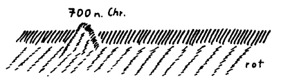
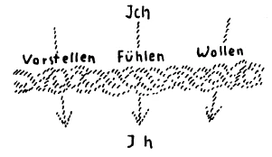

Es ist in den Vorträgen, die hier während des Kursus über Geschichte gehalten worden sind, mehreres erwähnt worden, das zu betrachten gerade in der gegenwärtigen Zeit von einer ganz besonderen Wichtigkeit sein kann. Zunächst ist in bezug auf den geschichtlichen Verlauf der Menschheitsentwickelung die ja oftmals besprochene Frage erwähnt worden, ob die hauptsächlichsten treibenden Kräfte in dieser Entwickelung die einzelnen hervorragenden, tonangebenden Persönlichkeiten seien, oder ob das Wesentliche bewirkt werde nicht von diesen einzelnen Persönlichkeiten, sondern von den Massen. Es ist dieses in vielen Kreisen immer ein strittiger Punkt gewesen, und über ihn wurde wirklich mehr aus Sympathie und Antipathie heraus entschieden als aus wirklicher Erkenntnis. Das ist die eine Tatsache, die ich gewissermaßen als wichtig erwähnen möchte. Die andere Tatsache, die ich gerade aus den geschichtlichen Betrachtungen heraus als wichtig hier notieren möchte, ist die folgende: Mit einem deutlichen Kundgeben ist im Beginn des 19. Jahrhunderts Wilhelm von Humboldt aufgetreten, indem er verlangt hat, die Geschichte solle so betrachtet werden, daß man nicht nur die einzelnen Tatsachen in Erwägung zieht, die äußerlich in der physischen Welt zu beobachten sind, sondern aus einer zusammenfassenden, synthetisierenden Kraft heraus dasjenige sieht, was im geschichtlichen Werden wirksam ist, was aber eigentlich nur gefunden werden kann von demjenigen, der in einem gewissen Sinne dichterisch, aber dann eigentlich die Wahrheit dichtend, die geschichtlichen Tatsachen zusammenzufassen weiß. Es ist auch darauf aufmerksam gemacht worden, wie im Laufe des 19. Jahrhunderts dann gerade die entgegengesetzte geschichtliche Denkweise und Gesinnung eine besondere Ausbildung erfahren hat, wie keineswegs Ideen in der Geschichte verfolgt worden sind, sondern eben nur der Sinn für die äußere Tatsachenwelt entwickelt worden ist. Und es ist darauf aufmerksam gemacht worden, daß gerade über die letztere Frage eigentlich erst zur Klarheit gekommen werden kann aus der Geisteswissenschaft heraus, weil ja erst die Geisteswissenschaft die wirklichen treibenden Kräfte des geschichtlichen Werdens der Menschheit enthüllen kann. Humboldt war eine solche Geisteswissenschaft noch nicht zugänglich. Er sprach von Ideen, aber Ideen haben doch keine treibende Kraft. Ideen als solche sind eben Abstraktionen, wie ich schon gestern hier erwähnte. Und derjenige, der auch Ideen als die treibenden Kräfte der Geschichte finden möchte, könnte niemals beweisen, daß diese Ideen wirklich etwas tun, denn sie sind nichts Wesenhaftes, und nur Wesenhaftes kann etwas tun. Die Geisteswissenschaft deutet auf wirkliche geistige Kräfte hin, die hinter den sinnlich-physischen Tatsachen sind, und in solchen wirklichen geistigen Kräften liegen die Motoren des Geschichtlichen, wenn auch diese geistigen Kräfte für den Menschen dann eben durch Ideen ausgedrückt werden müssen. ^ba57s3

Aber über all diese Dinge kommen wir nur zur Klarheit, wenn wir einen tieferen Blick eben gerade vom geisteswissenschaftlichen Standpunkte aus in das geschichtliche Werden der Menschheit werfen, und wir wollen es heute einmal so tun, daß durch unsere Betrachtungen einige Tatsachen uns erfließen, die gerade für die Beurteilung der gegenwärtigen Menschheitssituation wichtig sein können. Ich habe schon öfter erwähnt, daß die Geisteswissenschaft, wenn sie geschichtliche Betrachtungen anstellt, dann eigentlich eine Symptomatologie betreiben müsse, eine Symptomatologie, die darin besteht, daß man sich bewußt ist: Hinter dem, was als physisch-sinnlicher Tatsachenstrom abläuft, liegen die treibenden geistigen Kräfte. Aber es gibt überall in dem geschichtlichen Werden Punkte, wo das eigentlich Wesenhafte symptomatisch an die Oberfläche tritt und wo man es beurteilen kann aus den Erscheinungen heraus, wenn man nur die Möglichkeit hat, in seiner Erkenntnis von diesen Erscheinungen aus mehr hineinzudringen in die Tiefen des geschichtlichen Werdens. ^crquu6

 ^e7cbcj

Ich möchte das durch eine einfache versinnlichende Zeichnung klarmachen. Nehmen wir einmal an, dies wäre ein Strom von geschichtlichen Tatsachen (siehe Zeichnung). Dasjenige, was treibende Kräfte sind, liegt eigentlich für die gewöhnliche Beobachtung unter dem Strom dieser Tatsachen. Wenn etwa ein Seelenauge diesen Strom der Tatsachen so beobachtet, dann würde unter dem Strom der Tatsachen das eigentliche Wirken der treibenden Kräfte liegen (rot). Aber es gibt bedeutsame Punkte innerhalb des Tatsachenstromes. Und diese bedeutsamen Punkte zeichnen sich eben dadurch aus, daß bei ihnen das sonst sich Verbergende an die Oberfläche tritt. So daß wir sagen können: Hier würde an einer besonderen Erscheinung, die man nur richtig abschätzen muß, klarwerden können, was auch sonst überall wirkt, was sich aber nicht an so prägnanten Erscheinungen zeigt. Nehmen wir an, das (siehe Zeichnung) wäre in irgendeinem Jahre der Weltgeschichte, was sich hier abspielt etwa 800 nach Christi Geburt. Dasjenige, was für Europa, sagen wir, für Westeuropa bedeutsam war, wirkte natürlich auch vorher, wirkte auch nachher; aber nicht in einer so prägnanten Art zeigte es sich in der vorhergehenden Zeit und in der nachfolgenden Zeit, wie gerade da. Wenn man auf eine solche Geschichtsbetrachtung weist, die hinschaut auf prägnante Punkte, so liegt eine solche durchaus im Sinne des Goetheanismus. Denn Goethe wollte überhaupt alle Weltbetrachtung so einrichten, daß auf gewisse prägnante Punkte hingeschaut werde und aus dem, was in solchen prägnanten Punkten erschaut werden kann, dann der übrige Gehalt des Weltgeschehens erkannt werden sollte. Goethe sagt geradezu, innerhalb der Fülle der Tatsachen komme es darauf an, überall einen prägnanten Punkt zu finden, von dem aus sich die Nachbargebiete überschauen lassen, von dem aus sich viel enträtseln läßt. ^qjjaoy

Nun, nehmen wir dieses Jahr 800 etwa. Da können wir auf eine Tatsache hinweisen in der westeuropäischen Menschheitsentwickelung, die gegenüber der gewöhnlichen Geschichtsbetrachtung unbedeutend erscheinen könnte, die man vielleicht gar nicht beachtenswert findet für das, was man sonst Geschichte nennt, die aber doch für eine tiefere Betrachtung des Menschheitswerdens eben ein prägnanter Punkt ist. Um dieses Jahr herum etwa war eine Art theologisch-gelehrter Streit zwischen dem Manne, der eine Art Hofphilosoph des Frankenreiches war, Alkuin, und einem damals im Frankenreiche lebenden Griechen. Der Grieche, der bewandert war gerade in der besonderen Seelenverfassung des Griechenvolkes, die sich auf ihn herüber vererbt hatte, hatte die Prinzipien des Christentums beurteilen wollen und kam auf den Begriff der Erlösung. Er stellte die Frage: Wem ist denn eigentlich bei dieser Erlösung durch den Christus Jesus das Lösegeld ausbezahlt worden? — Er, der griechische Denker, kam zu der Lösung, dem Tod sei das Lösegeld ausbezahlt worden. Also es war gewissermaßen eine Art Erlösungstheorie, die dieser Grieche aus dieser ganz griechischen Denkweise, die eben das Christentum kennenlernt, entwickelt hat. Dem Tod sei das Lösegeld durch die Weltenmächte ausbezahlt worden. ^nwqd1c

Alkuin, der damals in jener theologischen Strömung drinnenstand, welche dann maßgebend geworden ist für die Entwickelung der römisch-katholischen Kirche des Abendlandes, diskutierte in der folgenden Weise über das, was dieser Grieche vorgebracht hatte. Er sagte: Das Lösegeld kann doch nur einem Wesen ausbezahlt werden, das wirklich ist; aber der Tod hat doch keine Wirklichkeit, der Tod schließt nur die Wirklichkeit ab, der Tod ist nichts Wirkliches; also könne auch nicht das Lösegeld an den Tod bezahlt worden sein. ^l45pbw

Nun, es kommt jetzt nicht darauf an, die Alkuinsche Denkweise zu kritisieren; denn für denjenigen, der die Tatsachenzusammenhänge etwas durchschauen kann, hat die ganze Anschauung, daß der Tod kein Wirkliches sei, etwas Ähnliches mit jener Anschauung, die sagt: Die Kälte ist doch nichts Wirkliches, sondern sie ist nur die Herabminderung der Wärme, ist nur eine geringere Wärme; da die Kälte nichts Wirkliches ist, ziehe ich mir keinen Winterrock im Winter an, denn ich werde mich doch nicht gegen etwas Unwirkliches schützen. — Aber davon wollen wir ganz absehen, wir wollen vielmehr den Streit zwischen Alkuin und dem Griechen rein positiv nehmen und wollen uns fragen, was da eigentlich geschehen ist; denn es ist schon etwas höchst Auffälliges, daß ja nicht diskutiert wird über den Begriff der Erlösung selber, nicht diskutiert wird so, daß gewissermaßen die beiden Persönlichkeiten, der Grieche und der römisch-katholische Theologe, denselben Gesichtspunkt einnehmen, sondern daß der römisch-katholische Theologe den Standpunkt ganz verschiebt, bevor er überhaupt darauf eingeht. Er redet nicht in der Richtung weiter, die er gerade eingeschlagen hat, sondern er bringt das ganze Problem in eine ganz andere Richtung. Er fragt: Ist der Tod etwas Wirkliches oder nicht? - und wendet ein, der Tod sei eben nichts Wirkliches. ^ggmvro

Das weist uns von vorneherein darauf hin, daß da zwei Anschauungen zusammenstoßen, die aus ganz verschiedenen Seelenverfassungen herauskommen. Und so ist es auch. Der Grieche dachte gewissermaßen noch fort in der Richtung, die im Griechentum im Grunde genommen erst verglommen war zwischen Plato und Aristoteles. In Plato war noch etwas lebendig von der alten Weisheit der Menschheit, von jener Weisheit, die uns hinüberführt nach dem alten Orient, wo, allerdings in alten Zeiten, eine Urweisheit gelebt hat, die dann immer mehr und mehr in die Dekadenz gekommen ist. Die letzten Ausläufer, möchte ich sagen, dieser orientalischen Urweisheit, finden wir bei Plato, wenn wir ihn richtig verstehen können. Dann setzt, wie durch eine rasch sich entwickelnde Metamorphose, der Aristotelismus ein, der im Grunde genommen eine ganz andere Seelenverfassung darbietet, als es die platonische ist. Der Aristotelismus stellt ein ganz anderes Element dar in der Menschheitsentwickelung als der Platonismus. Und wenn wir den Aristotelismus dann weiter verfolgen, so nimmt er auch wiederum verschiedene Formen, verschiedene Metamorphosen an, aber sie lassen sich doch alle in ihrer Ähnlichkeit erkennen. Wir sehen dann, wie als altes Erbgut in dem Griechen, der gegen Alkuin zu kämpfen hat, der Platonismus weiter fortlebt, wie aber bei Alkuin bereits der Aristotelismus vorhanden ist. Und wir werden hingewiesen, indem diese beiden Menschen in unser Blickfeld treten, auf jenes Wechselspiel, das sich vollzogen hat auf europäischem Boden zwischen zwei, man kann nicht einmal gut sagen Weltanschauungen, sondern menschlichen Seelenverfassungen, derjenigen, die ihren Ursprung noch hat in alten Zeiten des Orients drüben und derjenigen, die sich dann später hineinstellt, die wir im Orient noch nicht finden, die auftauchte in den mittleren Gegenden der Zivilisation, die Aristoteles zuerst ergriffen hat. Sie klingt in Aristoteles aber erst leise an; denn in ihm lebt doch noch viel Griechentum, sie entwickelt sich aber dann mit besonderer Vehemenz in der römischen Kultur, innerhalb welcher sie sich schon lange vor Aristoteles, ja vor Plato vorbereitet hat. So daß wir auch sehen, wie auf der italienischen Halbinsel schon seit dem 8. vorchristlichen Jahrhundert sich eine besondere Kultur, nur nuanciert, vorbereitet neben dem, was auf der griechischen Halbinsel weiterlebt wie eine Art letzter Ausläufer der orientalischen Seelenverfassung. Und wenn wir auf die Unterschiede dieser beiden menschlichen Denkweisen eingehen, so finden wir wichtige historische Impulse. Denn dasjenige, was sich in diesen Denkweisen ausdrückt, ging dann über in das Gefühlsleben der Menschen, ging über in die Struktur der menschlichen Handlungen und so weiter. ^394urs

Nun fragen wir uns einmal: Was lebte denn in dem, was in Urzeiten sich entwickelte im Oriente drüben als Weltanschauung, was dann im Platonismus, ja sogar noch im Neuplatonismus als in einem Spätling seine Ausläufer fand. Es ist eine hochgeistige Kultur, die aus einer inneren Anschauung kam, welche vorzugsweise in Bildern, in Imaginationen lebte, aber in Bildern, die nicht durchdrungen waren von dem Vollbewußtsein, noch nicht durchdrungen waren von dem vollen Ich-Bewußtsein der Menschen. In gewaltigen Bildern ging gerade im alten orientalischen Geistesleben, von dem Veda und Vedanta die Nachklänge sind, dasjenige auf, was eben im Menschen als das Geistige lebt. Aber es war in einer — ich bitte, das Wort nicht mißzuverstehen und es nicht mit dem gewöhnlichen Träumen zu verwechseln —, es war in einer traumhaften, in einer dumpfen Art vorhanden, so daß dieses Seelenleben nicht durchwellt und durchstrahlt war von dem, was im Menschen lebt, wenn er deutlich sich seines Ich und seiner eigenen Wesenheit bewußt wird. Der Orientale war sich wohl bewußt, daß seine Wesenheit vorhanden war vor der Geburt, daß sie durch den Tod wiederum in dieselbe geistige Welt zieht, in der sie vor der Geburt oder vor der Empfängnis vorhanden war. Der Orientale schaute auf dasjenige, was durch Geburten und Tode zog. Aber jenes innere Fühlen, das in dem «Ich bin» lebt, das schaute der Orientale als solches nicht an. Es war gewissermaßen dumpf, wie ausgeflossen in einer Gesamtseelenanschauung, die sich nicht bis zu einem solchen Punkte hin konzentriert, wie es das Ich-Erlebnis ist. In was schaute denn da der Orientale eigentlich hinein, wenn er sein instinktives Schauen hatte? ^a239dz

Man kann es noch fühlen, wie ganz anders diese orientalische Seelenverfassung war als die der späteren Menschheit, wenn man sich zu diesem Verständnis, vielleicht durch Geisteswissenschaft vorbereitet, in jene merkwürdigen Schriften vertieft, die zugeschrieben werden ich will jetzt die Autorfrage nicht weiter untersuchen, ich habe mich öfter darüber ausgesprochen - dem Dionysius vom Areopag, dem Areopagiten. Da wird noch gesprochen von dem «Nichts» als von einer Realität, der nur das Sein der äußeren Welt, wie man sie im gewöhnlichen Bewußtsein überblickt, als etwas anderes Reales entgegengestellt wird. Dieses Sprechen von dem Nichts, das klingt dann noch weiter fort. Bei Scotus Erigena, der am Hofe Karls des Kahlen lebte, findet man noch Nachklänge, und den letzten Nachklang findet man dann im 15. Jahrhundert bei Nikolaus Cusanus. Aber dann verglimmt das vollständig, was gemeint war in dem Nichts, das man bei Dionysius dem Areopagiten findet, von dem aber der Orientale als von etwas ihm Selbstverständlichen sprach. Was war für den Orientalen dieses Nichts? Es war ein Wirkliches für ihn. Er richtete den Blick in die umgebende Sinneswelt, er sagte sich: Diese Sinneswelt ist ausgedehnt im Raum, verfließt in der Zeit, und man sagt im gewöhnlichen Leben zu dem, was im Raume ausgedehnt ist und in der Zeit verfließt, es sei ein Etwas. ^1z71k4

Aber das, was der Orientale sah, was für ihn eine Realität war, die durch Geburten und Tode geht, das war nicht in diesem Raum enthalten, in dem sich die Mineralien befinden, die Pflanzen sich entwickeln, die Tiere sich bewegen, der Mensch als physisches Wesen sich bewegt und handelt, es war auch nicht in jener Zeit enthalten, in der sich unsere Vorstellungen, Gefühle und Willensimpulse abspielen. Der Orientale war sich ganz klar: Man muß aus diesem Raume herausgehen, in dem die physischen Dinge ausgedehnt sind, und sich bewegen, und man muß aus dieser Zeit herausgehen, in der unsere Seelenkräfte des gewöhnlichen Lebens sich betätigen. Man muß in eine ganz andere Welt eindringen, in die Welt, die für das äußere zeitlich-räumliche Dasein das Nichts ist, das aber doch ein Wirkliches ist. Der Orientale empfand eben gegenüber den Welterscheinungen etwas, was der Europäer höchstens noch auf dem Gebiete der realen Zahl empfindet. Wenn der Europäer fünfzig Franken hat, so hat er etwas. Wenn er fünfundzwanzig Franken davon ausgibt, so hat er nur noch fünfundzwanzig Franken; wenn er wieder fünfzehn Franken ausgibt, so hat er noch zehn; wenn er diese auch ausgibt, hat er nichts; wenn er jetzt mit Ausgeben weiterfährt, hat er fünf, zehn, fünfzehn, fünfundzwanzig Franken Schulden. Er hat immer nichts, aber er hat doch etwas sehr Reales, wenn er statt einfach leerem Portemonnaie fünfundzwanzig oder fünfzig Franken Schulden hat. Das bedeutet in der realen Welt auch etwas sehr Reales, wenn man diese Schulden hat. Es ist ein Unterschied in der ganzen Lebenssituation, ob man nichts hat oder ob man fünfzig Franken Schulden hat. Diese fünfzig Franken Schulden sind ebenso wirksame Kräfte für die Lebenssituation, wie auf der anderen Seite im entgegengesetzten Sinne fünfzig Franken Vermögen wirksame Kräfte sind. Auf diesem Gebiete läßt sich wahrscheinlich der Europäer auf die Realität der Schulden ein, denn es muß in der realen Welt immer etwas vorhanden sein, wenn man Schulden hat. Die Schulden, die man selber hat, mögen für einen eine noch so sehr negative Größe sein, für den anderen, dem man sie schuldet, sind sie aber eine recht positive Größe. ^9i9zda

Also, wenn es nicht bloß auf das Individuum ankommt, sondern auf die Welt, dann ist dasjenige, was ja nach der einen Seite der Null liegt, die entgegengesetzt ist der Vermögensseite, doch etwas sehr Reales. Der Orientale empfand, aber nicht, weil er irgendwie spekulierte, sondern weil ihn seine Anschauung nötigte, so zu empfinden, er empfand: Da erlebe ich auf der einen Seite den Raum und die Zeit, und auf der anderen Seite erlebe ich dasjenige, was nicht im Raum und in der Zeit beobachtet werden kann, was für die Raum- und Zeitdinge und für das Raum- und Zeitgeschehen ein Nichts ist, aber eine Realität ist, eben nur eine andere Realität. Nur durch ein Mißverständnis ist dann dasjenige entstanden, dem sich die abendländische Zivilisation unter Roms Führung hingegeben hat: die Schöpfung der Welt aus dem Nichts, wobei man unter dem Nichts nur die Null gedacht hat. Im Oriente, wo diese Dinge ursprünglich konzipiert worden sind, entsteht die Welt nicht aus dem Nichts, sondern aus jenem Realen, auf das ich Sie eben hingewiesen habe. Und ein Nachklang desjenigen, das durch alle orientalische Denkweise und bis zu Plato herunter vibriert hat, was Ewigkeitsimpuls einer alten Weltanschauung war, ein Nachklang davon lebte in dem Griechen am Hofe Karls des Großen, der mit Alkuin zu diskutieren hatte. Und eine Abweisung des geistigen Lebens, für das dieses Nichts die äußere Form war im Oriente, lebte bei dem Theologen Alkuin, der daher, als der Grieche von dem Tod, der aus dem geistigen Leben heraus verursacht ist, als von etwas Realem sprach, nur erwidern konnte: Der Tod ist doch ein Nichts, also kann er kein Lösegeld erhalten. ^xb2jd2

Sehen Sie, all das, was Gegensatz ist zwischen alter orientalischer, bis zu Plato reichender Denkweise und dem, was später folgte, drückt sich aus in diesem prägnanten Punkte, wo Alkuin mit dem Griechen am Hofe Karls des Großen diskutierte. Denn, was war mittlerweile eingezogen in die europäische Zivilisation seit Plato, namentlich durch die Verbreitung des romanischen Wesens? Es war eingezogen diejenige Denkweise, welche man dadurch zu begreifen hat, daß sie vorzugsweise auf das geht, was der Mensch durchlebt zwischen Geburt und Tod. Die Seelenverfassung, die sich vorzugsweise beschäftigt mit dem, was der Mensch durchlebt zwischen Geburt und Tod, das ist die logisch-juristische, die logisch dialektisch-juristische. Das Morgenland hatte nichts Logisch-Dialektisches und am wenigsten etwas Juristisches. Das Abendland brachte in die morgenländische Denkweise das logisch-juristische Denken so stark hinein, daß wir selbst das religiöse Empfinden durchjuristet finden. Wir sehen in der Sixtinischen Kapelle in Rom uns entgegenragen von der Meisterhand Michelangelos den Weltenrichter Christus, der da richtet über die Guten und die Bösen. ^log91p

In die Gedanken über den Weltverlauf ist Juristisch-Dialektisches hineingezogen. Ganz fremd war das der orientalischen Denkweise. Da gab es so etwas nicht, wie Schuld und Sühne, wie Erlösung überhaupt. Daher kann der Grieche fragen: Was ist denn diese Erlösung? — Da gab es eben die Anschauung jener Metamorphose, durch die sich das Ewige umgestaltet durch Geburten und Tode hin; da gab es dasjenige, was in dem Begriff des Karma lebte. Dann aber wurde alles hereingespannt in eine Anschauungsweise, welche eigentlich nur gültig ist für das Leben zwischen Geburt und Tod, welche nur umfassen kann dieses Leben zwischen Geburt und Tod. Das aber, dieses Leben zwischen Geburt und Tod, hatte sich gerade wieder dem Orientalen entzogen. Er blickte viel mehr auf des Menschen Wesenskern hin. Er hatte weniger Verständnis für das, was sich zwischen Geburt und Tod abspielte. Und innerhalb dieser abendländischen Kultur wurde nun groß jene Denkweise, die vorzugsweise das erfaßt, was innerhalb von Geburt und Tod sich abspielt durch jene Kräfte, die der Mensch dadurch hat, daß er sein Geistig-Seelisches mit einem Leib umkleider hat, mit einem physischen und ätherischen Leibe. In dieser Konstitution, in dem innerlichen Erleben des Geistig-Seelischen und in der Art dieses Erlebens, die davon herkommt, daß man eben eingetaucht ist mit dem Geistig-Seelischen in einen physischen Leib, kommt die klare, die volle Erfassung, die innerliche Erfassung des Ich. Daher geschieht es auch im Abendlande, daß der Mensch sich gedrängt fühlt, gerade sein Ich zu erfassen, sein Ich als Göttliches zu erfassen. Wir sehen diesen Drang, das Ich als ein Göttliches zu erfassen, auftreten bei den mittelalterlichen Mystikern, bei Eckart, bei Tauler, bei den anderen. Diese Erfassung des Ich kristallisiert sich mit aller Macht heraus in dem, was die mittlere Kultur ist. So daß wir unterscheiden können: die Ostkultur, die Zeit, in der das Ich erst dumpf erlebt wird; die Mittelkultur, sie ist vorzugsweise diejenige, in der das Ich erlebt wird. Und wir sehen, wie in den mannigfaltigsten Metamorphosen dieses Ich erlebt wird: erst, ich möchte sagen, in jener dämmerhaften Weise, in der es auftritt bei Eckart, bei Tauler, bei den anderen Mystikern; dann immer deutlicher und deutlicher, indem sich alles dasjenige herausentwickelt, was aus dieser Ich-Kultur stammen kann. ^o0wuxd

Wir sehen dann, wie innerhalb der Ich-Kultur der Mitte ein anderer Einschlag auftritt. Am Ende des 18. Jahrhunderts tritt in Kant etwas auf, was im Grunde genommen gar nicht erklärbar ist aus dem Fortströmen dieser Ich-Kultur. Denn, was kommt durch Kant herauf? Kant untersucht das Erkennen der Natur. Er kommt nicht zurecht damit. Es fällt ihm das Naturerkennen auseinander in Subjektivitäten, er dringt nicht bis zum Ich vor, trotzdem er fortwährend vom Ich spricht, sogar aus dem Ich heraus in manchen Kategorien, in den Anschauungen von Raum und Zeit, die ganze Natur umfassen möchte. Er dringt doch nicht zum wirklichen Erleben des Ich vor. Er konstruiert auch eine praktische Philosophie mit dem kategorischen Imperativ, der aus unergründlichen Gegenden der Menschenseele sich kundgeben soll. Wiederum erscheint dabei nicht das Ich. In der Kantschen Philosophie ist es merkwürdig: Es ist die ganze Wucht der Dialektik, des dialektisch-logisch-juristischen Denkens da, indem alles auf das Ich hintendiert; aber er kann nicht dazu kommen, dieses Ich philosophisch wirklich zu durchschauen. Da muß irgend etwas sein, was ihn daran hindert. Dann kommt Fichte, der noch der Schüler Kants ist, und der mit aller Wucht seine ganze Philosophie aus diesem Ich herausquellen lassen will, der den, ich möchte sagen, durch seine Einfachheit niederschlagenden Satz als den höchsten Satz seiner Philosophie hinstellt: «Ich bin.» Und aus diesem «Ich bin» soll alles, was richtig wissenschaftlich ist, folgen. Man soll gleichsam deduzieren können, herauslesen können aus dem «Ich bin», die ganze Weltanschauung. Kant kann nicht zu dem «Ich bin» kommen. Fichte, gleich hinterher, noch als der Schüler Kants, schleudert ihm entgegen das «Ich bin». Und die Leute sind erstaunt: Das ist ein Schüler Kants, der redet so etwas! — Und Fichte sagt: So viel er verstehen könne, müsste Kant, wenn er richtig zu Ende denken könnte, dasselbe denken, was er denkt! — So unerklärlich ist es Fichte, daß Kant anders denkt als er, daß er sagt: Wenn Kant nur zu Ende denkt, so muß er geradeso denken, so muß er auch zu dem «Ich bin» kommen. — Und Fichte drückt das noch deutlicher aus, indem er sagt: Ich würde lieber die ganze Kantsche Kritik für ein blindes Spiel von zufällig durcheinander gewirbelten Begriffen halten, als für das Werk eines Kopfes, wenn nicht meine Philosophie aus der Kantschen richtig folgen würde. - Kant weist das selbstverständlich zurück. Er will nichts zu tun haben mit dem, was Fichte als seine Konsequenzen gezogen hat. ^maerug

Nun sehen wir, wie sich an Fichte das anschließt, was dann als deutsche idealistische Philosophie in Schelling, in Hegel aufgesprossen ist, was all die Kämpfe hervorgerufen hat, von denen ich zum Teil in meinen Vorträgen über die Grenzen der Naturerkenntnis gesprochen habe. Aber wir sehen doch etwas Eigentümliches. Wir sehen, wie Hegel ganz in einer kristallklaren Ausgestaltung des Juristisch-DialektischLogischen lebt und ein Weltanschauungsbild daraus gewinnt, aber nur ein Weltanschauungsbild, welches sich interessiert für dasjenige, was zwischen Geburt und Tod verfließt. Denn gehen Sie die ganze Hegelsche Philosophie durch, Sie finden darin nichts, was über Geburt und Tod hinausgeht. Es schließt alles mit der Weltgeschichte, mit Religion, Kunst und Wissenschaft, mit all dem, was hereinfällt in die Erlebnisse zwischen Geburt und Tod. ^kgf36e

Was ist denn da Merkwürdiges geschehen? Nun, dasjenige, was in Fichte, Schelling und Hegel herausgekommen ist, diese stärkste Entfaltung der mittleren Kultur, in der das Ich zum vollen Bewußtsein, zum inneren Erleben kam, das war nur eine Reaktion noch, ein letztes Reagieren gegenüber etwas anderem. Denn man versteht Kant nur, wenn man folgendes richtig ins Auge faßt. Jetzt komme ich wieder an einen prägnanten Punkt, von dem sich vieles ableiten läßt. Sehen Sie, Kant war noch - das geht aus seinen älteren Schriften klar hervor — ein Schüler des Rationalismus des 18. Jahrhunderts, der in Leibniz in genialer, in Wolff in pedantischer Weise gelebt hat. Und man sieht: Diesem Rationalismus kam es eigentlich gar nicht darauf an, auf ein Geistig-Wirkliches wirklich zu kommen - Kant wies es daher ab, dieses «Ding an sich», wie er es nannte -, sondern es kam ihm darauf an, zu beweisen, sicher zu beweisen! Kants Schriften sind in dieser Beziehung auch merkwürdig. Er schrieb seine «Kritik der reinen Vernunft», in der er eigentlich fragt: Wie muß die Welt sein, damit man in ihr beweisen kann? — Nicht: Was sind die Realitäten dabei? -, sondern er frägt eigentlich: Wie muß ich mir die Welt denken, damit ich in ihr logisch-dialektisch, logisch beweisen kann? — Es kommt ihm nur darauf an, und er sucht in seinen «Prolegomena zu einer jeden künftigen Metaphysik, die als Wissenschaft wird auftreten können», eine Metaphysik zu dem, was sich in seinem Sinne beweisen läßt: Alles andere raus! Hol’ der Teufel die Realität der Welt, man lasse mir nur die Kunst des Beweisens! Was schert mich, was die Wirklichkeit ist; wenn ich sie nicht beweisen kann, dann kümmere ich mich nicht um sie! ^dzi2ih

In dieser Weise haben diejenigen natürlich nicht gedacht, die solche Bücher geschrieben haben wie Christian Wolff zum Beispiel, «Vernünftige Gedanken von Gott, der Welt und der Seele des Menschen, auch allen Dingen überhaupt» etwa, sondern ihnen kam es darauf an, ein sauberes, in sich geschlossenes System von Beweisen zu haben, wie sie eben das Beweisen ansehen. Kant lebte in dieser Sphäre; aber da war immerhin etwas da, was zwar ein ausgepreßter Balg der mittleren Weltanschauung war, aber doch in die mittlere Weltanschauung hineinpaßte. Kant aber, der hat noch etwas anderes, was unerklärlich macht, wodurch er Fichtes Lehrer werden konnte. Er regt doch immerhin Fichte an, und Fichte wirft ihm wieder entgegen die starke Betonung des «Ich bin», wirft ihm entgegen allerdings nicht bloße Beweise, denn die wird man bei Fichte nicht suchen, aber ein vollentwickeltes inneres Seelenleben. Es taucht bei Fichte mit aller Kraft des inneren Seelenlebens eigentlich das auf, was man bei den Wolffianern, bei den Leibnizianern strohern finden kann. Fichte konstruiert seine Philosophie aus dem «Ich bin» heraus in lauter reinen Begriffen; nur sind sie bei ihm lebensvoll. Sie sind auch bei Schelling, sie sind auch bei Hegel. Aber was ist denn da eigentlich über Kant herüber geschehen? Nun, man trifft auf den prägnanten Punkt, wenn man Kant verfolgt, wie er sich entwickelt hat. Aus einem Schüler Wolffs ist etwas anderes dadurch geworden, daß ihn der englische Philosoph David Hume, wie er selber sagt, aus dem dumpf-apathischen Schlummer geweckt hat. Was ist da in Kant hineingefahren, was Fichte nicht mehr verstehen konnte? Da ist in Kant - es paßte nur schlecht in ihn hinein, weil er zu stark verstrickt war mit dem Mitteleuropäertum — hineingefahren dasjenige, was jetzt die Westkultur ist. Ihm trat sie entgegen in der Persönlichkeit des David Hume; da fuhr in Kant die Westkultur hinein. Und worin können wir ihr Eigentümliches suchen? In der morgenländischen Kultur, da finden wir, daß das Ich unten dumpf noch lebt, wie traumhaft, in den Seelenerlebnissen, die sich imaginativ bildhaft ausdrücken, ausbreiten. In der Westkultur, da finden wir, daß das Tafel 3 ^wsr8a9

Ich gewissermaßen von den rein äußerlichen Tatsachen erdrückt wird. Da ist das Ich zwar vorhanden, da ist es aber nicht dumpf vorhanden, sondern da bohrt es sich hinein in die Tatsachen. Und da bildet man zum Beispiel eine merkwürdige Psychologie aus. Da redet man nicht so wie Fichte über das Seelenleben, der alles aus dem einen Punkt des Ich herausarbeiten möchte, da redet man von Gedanke und Gedanke und Gedanke, und diese assoziieren sich. Da redet man von Gefühlen und Vorstellungen und Empfindungen, und diese assoziieren sich, und auch Willensimpulse assoziieren sich. Da redet man von dem inneren Seelenleben so, wie von Gedanken, die sich assoziieren. ^7nyj94

Fichte redet von dem Ich; das strahlt die Gedanken aus. Im Westen fällt das Ich vollständig heraus, weil es absorbiert, aufgesogen ist von den Gedanken, von den Empfindungen, die man wie selbständig macht, und die sich assoziieren und wieder trennen. Und man verfolgt das Seelenleben so, als ob sich die Vorstellungen verbinden und trennen würden. Lesen Sie Spencer, lesen Sie John Stuart Mill, lesen Sie die amerikanischen Philosophen: überall, wo sie auf Psychologie zu reden kommen, da ist diese merkwürdige Anschauung, die nicht das Ich ausschließt wie der Orient, weil es dort dumpf entwickelt wird, sondern die das Ich voll in Anspruch nimmt, aber es versinken läßt in die Region des vorstellenden, fühlenden, wollenden Seelenlebens. Man könnte sagen: Beim Orientalen ist das Ich noch über Vorstellen, Fühlen und Wollen; es ist noch nicht heruntergestiegen auf das Niveau von Vorstellen, Fühlen und Wollen. Bei dem Menschen der Westkultur ist das Ich schon unter der Sphäre, da ist es unter der Oberfläche von Denken, Fühlen und Wollen, so daß es zunächst nicht mehr bemerkt wird und man von Denken, Fühlen und Wollen wie von selbständigen Mächten redet. - Das ist in Kant hineingefahren in der Gestalt der Philosophie des David Hume. Dem hat sich noch die mittlere Partie der Erdenkultur mit aller Gewalt entgegengestellt in Fichte, in Schelling, in Hegel. Dann überflutet mit dem Darwinismus, mit dem Spencerismus die Westkultur alles, was zunächst da ist. ^xl3u4e

 ^spq1r3

Nur dann wird man zu einem Verständnisse desjenigen kommen können, was da lebt in der Menschheitsentwickelung, wenn man diese tieferen Kräfte untersucht. Dann findet man, daß sich auf eine naturgemäße Weise im Oriente etwas entwickelt, was eigentlich nur Geistesleben war. Da hat sich in dem mittleren Gebiete etwas entwickelt, was dialektisch-juristisch war, was eigentlich die Staatsidee hervorgebracht hat, weil es auf diese anwendbar ist. Gerade solche Denker, wie Fichte, Schelling, Hegel, konstruieren mit einer ungeheuren Sympathie die einheitlichen Staatsgebilde. Dann taucht aber im Westen eine solche Kultur auf, die von einer Seelenverfassung herrührt, wo das Ich absorbiert ist, unter dem Niveau von Denken, Fühlen und Wollen verläuft, wo man von Assoziationen spricht im Vorstellungs-, im Gefühlsleben. Man sollte dieses Denken nur auf das Wirtschaftsleben anwenden! Da ist es am richtigen Platze. Man war vollständig fehlgegangen, als man es anwendete zuerst auf etwas anderes als auf das Wirtschaftsleben. Da ist es groß, da ist es genial, und würde Spencer, würde John Stuart Mill, würde David Hume, würden sie alle dasjenige, was sie auf die Philosophie verschwendet haben, auf Einrichtungen des Wirtschaftslebens verwendet haben, es wäre großartig geworden. Würden die in Mitteleuropa wohnenden Menschen das, was ihnen als Begabung naturgemäß war, beschränkt haben auf den bloßen Staat, und würden sie nicht zugleich damit auch das Geistesleben und das Wirtschaftsleben haben erfassen wollen, es hätte etwas Großartiges daraus werden können. Denn mit dem, was Hegel denken konnte, was Fichte denken konnte, hätte man, wenn man innerhalb des juristisch-staatlichen Gebildes bliebe, das wir im dreigliedrigen Organismus heraussondern wollen als das staatliche Gebilde, etwas Großartiges erreichen können. Aber dadurch, daß diesen Geistern vorschwebte, sie müßten ein Staatsgebilde schaffen, wo das Wirtschaftsleben drinnen ist und das Geistesleben drinnen ist, dadurch wurden Karikaturen statt wirklicher Staatsgebilde. Und das Geistesleben hat man überhaupt nur gehabt als ein Erbgut des alten Orientes. Man wußte nur nicht, daß man noch von diesem Erbgut des alten Orientes lebte. Was zum Beispiel brauchbare Aufstellungen der christlichen Theologie sind, ja, was brauchbare Aufstellungen noch innerhalb unserer materialistischen Wissenschaften sind, es ist entweder altes orientalisches Erbgut, oder es ist ein Wechselbalg von juristisch-dialektischem Denken, oder es ist schon herübergenommen, so wie Spencer und Mill es getan haben, aus der westlichen Kultur, die für das Wirtschaftsleben besonders geeignet ist. ^z9wzvt

So war über die Erde hin verteilt geistiges Denken, das der alte Orient hatte, aber in einer instinktiven Weise, wie es heute nicht mehr zu gebrauchen ist, da es heute in der Dekadenz ist, dialektisch-staatliches Denken, das seine Auflösung erlebte gerade durch die Weltkatastrophe. Denn niemand war weniger geeignet, wirtschaftlich zu denken, als die Schüler von Fichte, Schelling und Hegel. Als sie anfingen, ein Reich zu gründen, das vorzugsweise durch die Wirtschaft groß werden wollte, mußten sie selbstverständlich unterliegen, denn das war nicht naturgemäß in ihrer Begabung gelegen. Verteilt war nach dem historischen Entwickelungsgang der Menschheit: geistiges Denken, staatlich-politisches Denken, wirtschaftliches Denken auf Osten, Mitte, Westen. Wir sind an dem Punkte der menschlichen Entwickelung angelangt, wo über die ganze Menschheit Verständnis, gleichermaßen Verständnis sich ausbreiten muß. Wie kann das geschehen? ^9j9sam

Das kann nur geschehen aus der Initiationskultur, aus der neuen Geisteswissenschaft heraus, die nun nicht nach Einseitigkeiten hin sich entwickelt, sondern die gerade auf allen Gebieten das, was sich sonst von selber dreigegliedert hat, als Dreigliederung auch im sozialen Leben wirklich ins Auge faßt, die zusammenfaßt dasjenige, was über die Erde verbreitet ist. Diese kann aber nicht durch natürliche Anlagen verbreitet werden, sie kann nur dadurch verbreitet werden, daß man sich einläßt auf diejenigen, die diese Dinge durchschauen, die wirklich erleben können als ein besonderes Gebiet das Geistgebiet, als ein besonderes Gebiet das Staats- oder politische Gebiet, als ein besonderes Gebiet das Wirtschaftsgebiet. Darin liegt die Einigung der Menschen über die Erde hin, daß dasjenige, was auf drei Sphären verteilt war, im Menschen zusammengefaßt wird, indem er es selbst im sozialen Organismus so gliedert, daß es sich vor ihm, vor seiner Nase, in Harmonie befinden kann. Das aber kann nur erfolgen aus der geisteswissenschaftlichen Schulung heraus. Und hier stehen wir an dem Punkte, wo wir sagen müssen: Wir sehen in alten Zeiten die einzelnen Persönlichkeiten, wir sehen sie aussprechen dasjenige, was der Geist der Zeit ist. Aber wenn wir wirklich prüfen, zum Beispiel gerade innerhalb der orientalischen Kultur, dann finden wir, daß im Grunde genommen in den Massen instinktiv lebte etwas von Seelenverfassung, was in einer merkwürdigen, selbstverständlichen Übereinstimmung mit dem war, was die einzelnen aussprachen. ^lrl9hh

Dieses Zusammenwirken wird aber immer geringer und geringer. In unserer Zeit sehen wir das entgegengesetzte Extrem sich herausbilden. Wir sehen in den Massen die entgegengesetzten Instinkte von dem heraufkommen, was der Menschheit eigentlich heilsam ist. Wir sehen heraufkommen, was gerade das notwendig macht, was dem Einzelnen, der auf die Geisteswissenschaft bis in ihre Tiefen eingehen kann, entströmen kann. Aus den Instinkten wird kein Heil kommen, allein aus jenem Verständnis, von dem hier auch Dr. Unger gesprochen hat, das oftmals betont wird, das jeder Mensch dem Geistesforscher entgegenbringen kann, wenn er sich nur dem gesunden Menschenverstand wirklich hingibt. So wird eine Kultur kommen, wo gerade die einzelne Individualität mit ihrem immer tieferen Eindringen in innere Tiefen der geistigen Welten von besonderer Wichtigkeit ist, und wo man den, der so eindringt in die geistigen Welten, gelten lassen will wie den, der sonst ein Handwerk betreibt. Man läßt sich nicht vom Schneider Stiefel machen, nicht vom Schuster rasieren, warum sollte man das, was man braucht als Weltanschauung, bei jemandem anderen holen als bei dem, der in sie eingeweiht ist? Aber das ist es ja, was gerade gegenwärtig im intensivsten Sinne notwendig ist zum Menschenheil, obwohl die Reaktion dagegen da ist, die zeigt, wie die Menschheit sich noch sträubt gegen das, was ihr heilsam ist. Das ist der furchtbare Kampf, der Ernst, in dem wir drinnenstehen. ^yztcui

Keiner Zeit ist notwendiger gewesen, daß hingehorcht werde auf das, was der Einzelne in dem oder jenem weiß, und daß - nicht auf Autoritätsglaube hin, sondern auf Verstand und auf verständnismäßige Zustimmung hin — wirken kann für das soziale Leben derjenige, der auf einem einzelnen Gebiete etwas weiß. Aber die Instinkte wenden sich zunächst dagegen, und man glaubt, daß man vom allgemeinen Nivellement aus irgend etwas Heilsames erreichen kann. Das ist der ernste Kampf, in dem wir drinnenstehen. Da hilft keine Sympathie und Antipathie, da hilft kein Leben in Schlagworten, da hilft nur ein klares Ansehen der Tatsachen. Denn heute entscheiden sich ja die großen Fragen, die Fragen, ob die Persönlichkeit oder die Masse eine Bedeutung hat. Für andere Zeiten hatte sie keine große Bedeutung, denn es stimmte die Masse mit den einzelnen Persönlichkeiten zusammen; die Persönlichkeiten waren gewissermaßen doch nur die Exponenten der Masse. Immer mehr gehen wir derjenigen Zeit entgegen, wo der Einzelne ganz in sich selber den Quell dessen suchen muß, was er zu finden hat, und was er dann wiederum hineinzuwerfen hat in das soziale Leben, und es ist nur das letzte Sträuben gegen diese Geltung gerade der Individualität und einer immer größeren und größeren Zahl von Individualitäten. Man kann geradezu hineinschauen, wie das, was Geisteswissenschaft zeigt, überall an dem prägnanten Punkt sich auch beweist. Wir reden von den notwendigen Assoziationen im Wirtschaftsleben, brauchen dazu ein bestimmtes Denken. In der Westkultur hat sich das entwickelt, indem man die Gedanken sich assoziieren läßt. Wenn man das nehmen könnte, was John Stuart Mill mit der Logik treibt, wenn man diese Gedanken dort herausnehmen und sie aufs Wirtschaftsleben anwenden könnte, da paßten sie hinein, da kämen gerade die Assoziationen hinein, die nicht hineinpassen in die Psychologie. Bis in dasjenige hinein, was so erscheint im Gebiete der menschlichen Entwickelung, verfolgt Geisteswissenschaft eben die Realität. ^jx6p95

Daher steht Geisteswissenschaft mit vollem Bewußtsein in dem ganzen Ernst der gegenwärtigen Weltlage drinnen, sie weiß, welch großer Kampf sich abspielt zwischen dem, was aus der Geisteswissenschaft heraus an sozialen Impulsen in der Dreigliederung kommen kann und demjenigen, was als bolschewistische Welle, die zum Unheile der Menschheit führen würde, sich dieser Dreigliederung entgegenwirft. Und ein Drittes neben diesen beiden gibt es nicht. Zwischen diesen beiden muß sich der Kampf abspielen. Das muß man einsehen. Alles andere ist bereits Dekadentes. Wer unbefangen die Verhältnisse anschaut, in denen wir drinnenstehen, der muß sich schon sagen, daß es heute notwendig ist, daß alle Kräfte zusammengenommen werden, damit diese furchtbare ahrimanische Sache, die sich entgegenwirft der Geisteskultur, abgewehrt werden könne. ^hi5qli

Dieser Bau steht da, zunächst unvollendet. Es ist heute aus den Mittelländern heraus nicht dasjenige zu haben, was ihn zum großen Teile bis zu diesem Punkte gebracht hat im Zusammenhange mit dem, was von den neutralen Staaten uns zugekommen ist. Wir müssen Zuschüsse aus den Ländern der ehemaligen Entente haben. Da muß Verständnis entwickelt werden für dasjenige, was eine Einheitskultur werden soll, die Geist und Politik und Wirtschaft enthält. Denn die Menschen müssen aus einer einseitigen Anlage heraus und denjenigen folgen, die auch von Politik und Wirtschaft etwas verstehen, die nicht nur in Dialektik machen, sondern auch Geistiges durchschauen und auf Wirtschaftsimpulse sich einlassen, nicht Staaten gründen wollen, in denen der Staat schon selber wirtschaften könne. Die westlichen Völker werden einsehen müssen, daß zu ihrer besonderen Zukunftsbegabung im wirtschaftlichen Assoziationenwesen, das sie gerade am verkehrten Ende, bei der Psychologie, angebracht haben, zu dem sich hinzuentwickeln muß: ein volles Verständnis des staatlich-politischen Elementes, welches andere Quellen hat als das wirtschaftliche Leben, und des geistigen Elementes zu gewinnen. Aber am Boden liegen die Mittelländer. Man wird in westlichen Gebieten das einsehen müssen - an den Orient ist ja gar nicht zu denken -, was dieser Bau hier will! Daher ist es nötig, daß man sich daraufhin besinnt, wie es geschehen muß, daß für diejenige Kultur wirklich gesorgt werde, die hier jetzt sich zeigen wollte als eine solche Kultur, die berufen ist, das Hochschulwesen der Zukunft zu durchdringen und die sich in der Begründung der Waldorfschule gezeigt hat als eine solche, die das Volksschulwesen durchleuchten kann. Aber wir brauchen dazu die verständnisvolle Unterstützung weitester Kreise. ^qyg8m6

Wir brauchen dazu vor allen Dingen Mittel. Zu all dem, was im höheren oder niederen Sinne Schule heißt, brauchen wir die Gesinnung, die ich schon betätigte damals, als die Waldorfschule in Stuttgart begründet wurde; bei der Begründung sagte ich es, in der Eröffnungsrede: Diese eine Waldorfschule, ja, schön, daß wir sie haben, aber für sich ist sie nichts; sie ist erst etwas, wenn wir in dem nächsten Vierteljahre zehn solcher Waldorfschulen errichten würden, und dann weitere. Das hat die Welt nicht verstanden, dazu hatte sie kein Geld. Denn da steht sie auf dem Standpunkt: Oh, die Ideale sind zu hoch und zu rein, als daß wir das schmutzige Geld an sie heranbringen sollten; das behalten wir lieber in der Tasche, da ist es am richtigen Platz, das schmutzige Geld. Die Ideale, oh, die sind viel zu rein, die darf man nicht besudeln mit dem Geld! - Es läßt sich allerdings eine solche Verkörperung der Ideale mit derjenigen Reinheit nicht erreichen, an die das schmutzige Geld nicht herangebracht wird, und so müssen wir schon daran denken, daß wir bis Jetzt ja bei der einen Waldorfschule stehen blieben, die eigentlich noch nicht recht vorwärts kann, weil wir in großen Geldsorgen steckten im Herbste. Sie sind zunächst behoben; zu Ostern werden wir wieder davor stehen. Und hier, hier werden wir nach verhältnismäßig kurzer Zeit fragen: Sollen wir aufhören? Und wir werden aufhören müssen, wenn nicht vorher ein sehr stark in die Taschen greifendes Verständnis sich findet. ^flxgee

Daher kommt es darauf an, nach dieser Richtung hin Verständnis zu erwecken. Ich glaube nicht, daß viel Verständnis erwachsen würde — das hat sich uns schon gezeigt -, wenn wir sprechen würden, daß wir etwas wollen für den Bau in Dornach oder dergleichen. Aber — und dafür findet sich ja heute noch Verständnis —, wenn man Sanatorien oder dergleichen gründen will, dazu kriegt man Geld, so viel man will! Das wollen wir ja nicht gerade, wir wollen nicht lauter Sanatorien begründen, sind ganz einverstanden mit ihrer Begründung, soweit sie notwendig sind, aber hier handelt es sich vor allen Dingen um die Pflege derjenigen Geisteskultur, deren Notwendigkeit wohl sich beweisen wird aus dem, was gerade dieser Hochschulkursus hier leisten wollte. Daher versuchte ich dasjenige anzuregen, was ich vor einigen Tagen hier in das Wort zusammengefaßt habe: «Weltschulverein». Unsere deutschen Freunde sind abgereist; auf sie kommt es nicht an bei diesem Weltschulverein. Es kommt auf diejenigen an, die als Freunde zum größten Teil aus allen möglichen Gegenden der nichtdeutschen Welt hier erschienen sind und hier noch sitzen, daß sie verstehen dieses Wort «Weltschulverein», denn es ist notwendig, daß wir Schulen über Schulen in allen Gegenden der Welt aus dem pädagogisch-didaktischen Geiste heraus gründen, der in der Waldorfschule herrscht. Es ist notwendig, daß wir diese Schule erweitern können, bis wir den Anschluß finden an dasjenige, was wir hier als Hochschulwesen wollen. Dazu ist aber notwendig, daß wir imstande sind, diesen Bau mit allem, was zu ihm gehört, zu vollenden und fortwährend dasjenige unterhalten können, was notwendig ist, um hier zu wirken, um zu schaffen, zu schaffen an dem weiteren Ausbau aller einzelnen Wissenschaften aus dem Geiste der Geisteswissenschaft heraus. ^03mpsg

Es fragen einen die Leute, wieviel Geld man zu alledem braucht. Man kann gar nicht sagen, wieviel man braucht, denn nach oben hat das überhaupt niemals eine Grenze. Selbstverständlich — einen Weltschulverein, wir werden ihn nicht dadurch begründen, daß wir ein Komitee schaffen von zwölf oder fünfzehn oder dreißig Personen, die schöne Statuten ausarbeiten, wie ein solcher Weltschulverein wirken und arbeiten soll. Das hat alles keinen Zweck. Ich gebe nichts auf Programme, nichts auf Statuten, sondern auf die Arbeit der lebendigen Menschen, die verständnisvoll wirken. Man wird diesen Weltschulverein einmal gründen können, nun, nach London wird man ja noch lange Zeit nicht kommen können; aber vom Haag oder von einem solchen Orte aus, wenn etwa dadurch eine Unterlage geschaffen ist, und noch durch manche andere Dinge, wenn diejenigen Freunde, die jetzt nach Norwegen oder Schweden oder Holland oder nach irgendwelchen anderen Ländern, nach England, Frankreich, Amerika und so weiter gehen, wenn diese Freunde überall, bei jedem Menschen, an den sie herankommen können, die Überzeugung, die wohlbegründete Überzeugung hervorrufen: Einen Weltschulverein muß es geben! — Das müßte wie ein Lauffeuer durch die Welt gehen: Ein Weltschulverein muß entstehen zur Beschaffung der materiellen Mittel für die Geisteskultur, die hier gemeint ist. - Kann man ja sonst als einzelner von allem möglichen Hunderte und Hunderte von Menschen überzeugen, warum sollte man denn nicht in einer kurzen Zeit - denn der Niedergang geht so schnell, daß nur kurze Zeit uns zur Verfügung steht -, als ein einzelner Mensch auf viele wirken können, so daß man, wenn man dann nach einigen Wochen etwa nach dem Haag kommt, sehen würde, wie schon weitverbreitet das Urteil ist: Die Entstehung eines Weltschulvereins ist notwendig, nur die Mittel fehlen zu alledem. Was man von Dornach aus will, ist eine historische Notwendigkeit. -— Dann wird man reden können über die Inaugurierung dieses Weltschulvereins, wenn die Meinung über ihn schon da ist. Komitees zu begründen und den Weltschulverein zu beschließen, das ist utopistisch, das hat gar keinen Zweck; aber von Mensch zu Mensch zu wirken und die Meinung, die begründete Meinung in einer Raschheit zu verbreiten, die eben nötig ist, das ist dasjenige, was vorausgehen muß der Gründung. Geisteswissenschaft lebt in Realitäten. Deshalb läßt sie sich auch nicht auf programmäßiige Vornahmen von Gründungen ein, sondern sie weist auf dasjenige hin, was unter Realitäten — die Menschen sind ja Realität —, was unter Menschen zu geschehen hat, damit eine solche Sache eine Aussicht hat. ^x6r2uc

Also darauf kommt es an, daß wir endlich lernen von der Geisteswissenschaft, im realen Leben zu stehen. Ich werde mich nie einlassen auf eine bloß utopistische Begründung des Weltschulvereins, sondern ich werde der Meinung immer sein: Der Weltschulverein kann erst entstehen, wenn eine genügend große Anzahl von Menschen von seiner Notwendigkeit überzeugt sind. Und damit dasjenige, was der Menschheit notwendig ist — es hat sich ja wohl aus unseren Hochschulkursen erwiesen —, geschehen könne, dazu muß dieser Weltschulverein gegründet werden. Also man sehe das, was mit diesem Weltschulverein gemeint ist, im ganzen internationalen Leben im rechten Sinne an! In diese Aufforderung möchte ich ausklingen lassen am heutigen Tage dasjenige, was in ganz anderer Weise aus unserem ganzen Kursus heraus zu der Menschheit gesprochen hat gerade durch diejenigen, die hier gewesen sind, und von denen wir die Hoffnung und den Wunsch haben, sie mögen es in die Welt hinaustragen. Der Weltschulverein, er kann die Antwort der Welt sein auf dasjenige, was wie eine Frage vor die Welt hingestellt wird, aber eine Frage, die aus den wirklichen Kräften des Menschenwerdens, das heißt, der Menschheitsgeschichte herausgegriffen ist. Also, was geschehen kann für den Weltschulverein nach jener Überzeugung, die Sie hier haben gewinnen können in den letzten drei Wochen, das geschehe! Darinnen klingt aus dasjenige, was ich auch heute noch habe sagen wollen. ^466bzp