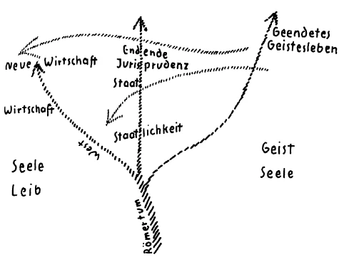

Ich habe gestern wiederum von einem anderen Gesichtspunkte aus, als dies schon durch längere Zeiten hindurch geschehen ist, auf die Differenzierung aufmerksam gemacht, die unter den Völkern der gegenwärtigen zivilisierten Welt besteht. Ich habe darauf hingewiesen, wie die Individualisierung des Menschen im fünften nachatlantischen Zeitraum von den geistigen Welten her gelenkt wird, wie eingreifen auf der einen Seite im Westen durch die Menschen selber gewisse Wesenheiten, welche in einer unregelmäßigen Weise vorgerückt sind, welche weiter sind als die Menschheit, aber aus gewissen Interessen heraus sich in Menschen verkörpern, um den wahren Impulsen der Gegenwart entgegenzuwirken, den Impulsen der Dreigliederung des sozialen Organismus. ^imk5ei

Ich habe auch darauf aufmerksam gemacht, wie in anderer Art im Osten sich die Tatsache geltend macht, daß zwar nicht durch die Menschen selber, wohl aber durch ihr Erscheinen gegenüber den Menschen sich gewisse Wesenheiten geltend machen, Wesenheiten, die ihre eigentliche Bedeutung in ferner Vergangenheit hatten, die aber jetzt ins Menschenleben hereinwirken wollen; wie diese durch die besondere Seelenverfassung der im Orient Lebenden auf diese Menschen wirken, sei es mehr oder weniger bewußt, indem sie als Imagination hereinwirken in das Bewußtsein einiger Menschen des Ostens, sei es, daß sie während des Schlafes hineinwirken in das menschliche Ich, in den astralischen Leib und sich dann geltend machen, ohne daß die Menschen es wissen, in den Nachwirkungen während des Wachens und auf diese Weise alles das hereintragen, was sich gegen einen regelmäßigen Fortschritt der Menschheit im Osten auftürmen will. So daß wir sagen können: Im Westen hat sich seit langem vorbereitet in einer gewissen Weise eine Art Erdgebundenheit bei solchen Menschen, wie ich sie gestern geschildert habe, die da eingestreut sind, die insbesondere in Sekten Führerstellungen einnehmen, die auch in Geheimgesellschaften Führerstellungen einnehmen und dergleichen. Im Osten finden sich auch gewisse führende Persönlichkeiten, welche eben unter dem Eindrucke solcher durch Imagination erscheinenden Wesen der Vorzeit dasjenige ausüben, was sie eben in die gegenwärtige Kulturentwickelung hereinbringen. Wenn man verstehen will, wie die Menschen der europäischen Mitte zwischen dem Westen und dem Osten gewissermaßen eingekeilt sind, so muß man genauer hinschauen gerade auf die geistigen Bedingungen, die da zugrunde liegen, und auf alles das, was sich ausspricht in der physisch-sinnlichen Welt aus diesen geistigen Bedingungen heraus. ^q7ktdm

Ich habe Sie ja eben von den verschiedensten Gesichtspunkten aus darauf aufmerksam gemacht, wie in der Hauptsache das Leben des uralten Orients ein Geistesleben war, wie der Mensch des uralten Orients ein hochentwickeltes Geistesleben hatte, ein Geistesleben, das aus unmittelbarer Anschauung der geistigen Welten herausströmte; wie dann dieses Geistesleben eigentlich als Erbstück weiter fortlebte, wie es im Griechentum als schöne Künstlerschaft zunächst vorhanden war, aber auch noch als eine gewisse Einsicht; wie aber auch schon im Griechentum sich hineinmischte dasjenige, was dann der Aristotelismus war, was bereits verstandesmäßiges, dialektisches Denken war. Aber es drang dann das, was von orientalischer Weisheit kam, eben in die Zivilisation des Abendlandes hinein, und mit Ausnahme dessen, was aus der Naturwissenschaft stammt, und was stammen kann aus der modernen anthroposophisch orientierten Geisteswissenschaft, ist im Grunde genommen alles, was in der abendländischen Zivilisation an Geistesleben vorhanden ist, altes orientalisches Erbgut. Aber dieses Geistesleben ist eben durchaus dekadent. Dieses Geistesleben ist so, daß ihm die eigentliche Tragkraft fehlt, daß der Mensch zwar noch eine gewisse Hinlenkung zur geistigen Welt hat, aber dies, was er von der geistigen Welt glaubt, nicht mehr verbinden kann mit dem, was hier in der physischen Welt geschieht. ^kolocm

Es zeigt sich das am stärksten, wenn im angelsächsischen Puritanertum ein, ich möchte sagen, ganz weltfremdes, neben dem weltlichen Treiben einhergehendes weltfremdes Glauben Platz gegriffen hat, das nach ganz abstrakten geistigen Regionen hinzielt, das im Grunde genommen gar nicht sich die Mühe gibt, sich auseinanderzusetzen mit der äußeren physisch-sinnlichen Welt. ^1dn7ys

Im Orient nehmen selbst ganz weltliche Bestrebungen, Bestrebungen des sozialen Lebens, einen so geistigen Charakter an, daß sie sich wie religiöse Bewegungen ausnehmen. Und im Osten ist zum Beispiel die Tragkraft des Bolschewismus darauf zurückzuführen, daß er eigentlich von den Menschen des Ostens, schon vom russischen Volke, wie eine Religionsbewegung aufgefaßt wird. Nicht so sehr auf den abstrakten Vorstellungen des Marxismus beruht die Tragkraft dieser sozialen Bewegung des Ostens, sondern sie beruht im wesentlichen darauf, daß die Träger wie neue Heilande angesehen werden, gewissermaßen wie die Fortsetzer früheren religiös-geistigen Strebens und Lebens. ^m4m1st

Aus dem Römertum heraus, auch schon aus späterem Griechentum heraus hat sich dann, wie wir wissen, dasjenige entwickelt, was die Menschen der Mitte am allermeisten ergriffen hat, das dialektische Element, das Element des juristischen, des politischen, des militärischen Denkens. ^7k5wlh

Und welche Rolle das dann später spielte, was da aus dem Römertum heraus sich entwickelte, das kann man nur verstehen, wenn man zunächst bedenkt, daß alle drei Zweige des menschlichen Erlebens, das geistige Erleben, das wirtschaftliche Erleben, das staatlich-politische Erleben in den Zeiten, in denen das Römertum sich zu besonderem Glanze entwickelte, in denen das römische Kaisertum aufkam, in einer ähnlichen Weise verknäuelt waren, durcheinanderstrebten, wie das im Grunde über die ganze zivilisierte Welt hin in der gegenwärtigen Zeit der Fall ist. Das Römertum lief durchaus in eine Dekadenz aus, welche im wesentlichen dadurch bedingt war, daß im römischen Weltreiche die Unmöglichkeit wirkte, die immer daraus hervorgeht, daß die drei menschlichen Betätigungen — Geistesleben, Staatsleben, Wirtschaftsleben — chaotisch ineinandergreifen. Man kann ja wirklich sagen, das römische und insbesondere das byzantinische Kaisertum ist eine Art Symbolum gewesen für den Verfall der vierten nachatlantischen Zeit, der griechisch-lateinischen Zeit. Man braucht ja nur zu bedenken, daß von einhundertsieben oströmischen Kaisern bloß vierunddreißig in ihrem Bette gestorben sind. Von einhundertsieben Kaisern sind bloß vierunddreißig in ihrem Bette gestorben! Die anderen sind entweder vergiftet oder verstümmelt worden und im Kerker gestorben, sind aus dem Kerker ins Mönchsleben übergegangen und dergleichen. Und aus dem, was da im Süden Europas (siehe Zeichnung) als die romanische Welt ihrem Niedergange entgegenging, aus dem entwickelte sich dasjenige heraus, was dann, ich möchte sagen, in drei Ästen nach Norden heraufströmte. ^owcdug

 ^jfbreq

Da haben wir zunächst den westlichsten Ast. Ich will heute nicht darauf eingehen, was sich in geschichtlichen Einzelheiten entwickelte durch das hindurch, was als das Mittelalter aus der alten Menschheitsentwickelung hervorging; aber ich will auf einiges aufmerksam machen. Die charakteristische Erscheinung der westlichen, zunächst der mehr südwärts gelegenen westlichen Entwickelung ist ja diese, daß das Römertum, ich möchte sagen, auch als eine Summe von Menschen zunächst sich ausdehnt nach Spanien, über das heutige Frankreich, auch über einen Teil von Britannien hin. Römische Menschen waren es, die da hinein sich entwickelten. Aber alles das wurde durchsetzt von dem, was als germanische Stämme der verschiedensten Art durch die Völkerwanderung gerade in diese Bevölkerungen von römischen Menschen hineindrang. ^i71l9x

Und eine eigentümliche Erscheinung finden wir da. Die Erscheinung finden wir, daß germanische Menschen in das Römertum sich hineinzwängen, in das Römertum sich hineinstoßen, und daß da etwas entsteht, was nur so charakterisiert werden kann, daß man sagt: Es war Menschenwesen germanischer Art eingedrungen in das Römertum; das Römertum als solches ging im Grunde genommen als Menschenwesen unter; was aber erhalten blieb von dem Römertum, also dasjenige, was, ich möchte sagen, durch diese Kreuzung (siehe Zeichnung S. 50) der beiden Linien hier sich bildete, was sich da bildete als spanische Bevölkerung, als französische Bevölkerung, zum Teil auch als britannische Bevölkerung, das ist im wesentlichen germanisches Blut, übertönt von dem romanischen Sprachelemente. Nicht anders kann in Wirklichkeit verstanden werden, um was es sich da handelt, als wenn man es so anschaut. Dieses Menschenwesen ist durchaus seiner Seelenkonfiguration nach, seiner Empfindungs-, Gefühls- und Willensrichtung nach hervorgegangen aus dem, was sich als germanisches Element im Strom der Völkerwanderung vom Osten nach dem Westen bewegt hat. Aber es ist eine Eigentümlichkeit dieses germanischen Elementes, daß, wenn es zusammenstößt mit einem fremden Sprachelemente — und in der Sprache ist immer eine Kultur, möchte ich sagen, verkörpert -, es in diesem fremden Sprachelemente aufgeht, diese Sprache annimmt. Es wächst hinein in diese fremde Sprache, ich möchte sagen, wie in ein Zivilisationskleid. Was im Westen von Europa lebt als lateinische Rasse, das hat im Grunde genommen nichts von lateinischem Blute in sich. Das ist aber hineingewachsen in dasjenige, was da heraufgeströmt ist, verkörpert durch die Sprache. Denn es lag im Wesen des lateinischen, des römischen Elementes, sich selber über das Menschentum hinaus im Weltenentwickelungsgang zu behaupten. Deshalb ist ja in Rom zuerst das Testament aufgekommen, die Behauptung des Egoismus über den Tod hinaus. Daß der Wille über den Tod hinausreiche, das hat dazu geführt, den Gedanken des Testamentes zu fassen. So auch wirkte der Bestand der Sprache über den Bestand des Menschlichen im Volkstum hinaus. ^er5qb7

Und anderes als die Sprache wurde erhalten. So wurden erhalten für diesen Westen auf dieser Strömung hier (siehe Zeichnung S. 50) die alten Traditionen der verschiedenen Geheimgesellschaften, von deren Bedeutung ich Ihnen ja im Laufe der letzten Jahre Mannigfaltiges erzählt habe, durchaus Traditionen, die aus der vierten nachatlantischen Zeit, aus der griechisch-lateinischen Zeit stammen, die allerdings Entlehnungen sind aus dem Orient — namentlich aber aus Handschriften -, die aber durchaus durch das Römertum, durch das Lateinertum durchgegangen sind. So daß man in einer gewissen Beziehung in dem westlichen Menschentum, insofern es untergetaucht ist in dem römischen Sprachelemente, das sich über das Volkstum hinaus erhalten hat, den Menschen in einem fremden Zivilisationskleide hat. Man hat auch den Menschen in einem fremden Kleide, indem man in den alten Mysterienwahrheiten, die schon abstrakt geworden sind, die namentlich in den Zeremonien und in dem Kultus der westlichen Gesellschaften mehr oder weniger leere Formeln geworden sind, etwas hat, worin das Menschentum untergetaucht ist und worin es als in etwas lebt, wovon es ergriffen werden kann. ^wa97rh

Sind nun andere Verhältnisse besonders günstig, dann bietet gerade dieses, ich möchte sagen, mehr von außen Durchdrungenwerden des Menschen mit alledem, was aus der Sprache herauskommt, einen Anhaltspunkt dafür, daß sich solche Wesen, wie ich es gestern geschildert habe, in diesen Menschen verkörpern können. Aber besonders günstig ist für dieses Verkörpern gerade das angelsächsische Element aus dem Grunde, weil da auch durchaus germanisches Menschenwesen nach dem Westen hinübergekommen ist, weil sich stark das germanische Menschenwesen erhalten hat, und in einem geringeren Maße als das eigentlich lateinische Element sich durchdrungen hat mit dem römischen Elemente. So daß da ein viel labileres Gleichgewicht in der angelsächsischen Rasse vorhanden ist, und durch dieses labilere Gleichgewicht jene Wesen, die sich da verkörpern, eine viel größere Willkür des Wirkens, einen viel größeren Spielraum haben. In eigentlich romanischen Ländern würden sie außerordentlich gebunden sein. Vor allen Dingen aber muß man sich klar sein darüber, daß von solchen volkspsychologischen Konfigurationen dasjenige abhängt, was sich dann in einzelnen Persönlichkeiten äußern kann. Durch dieses freiere Element im Angelsachsentum ist es möglich geworden, daß, während allerdings das Puritanertum eine abstrakte Glaubenssphäre darstellt, dieses angelsächsische Element im höchsten Grade geeignet war, das naturwissenschaftliche Denken auch als Welt- und Lebensanschauung aufzunehmen und auszugestalten. Es wird allerdings nicht das volle Menschentum ergriffen, aber es wird gerade derjenige Teil des Menschenwesens ergriffen, welcher durch die Eingliederung von Sprachen, durch die Eingliederung von anderen Elementen des Menschenwesens es möglich macht, daß sich solche Wesen, wie ich es gestern geschildert habe, in diesen Menschen verkörpern. ^hhfmcs

Ich bemerke ausdrücklich, daß bei alledem, was ich jetzt bespreche, es sich nur um solche einzelne Menschen handelt, die unter der Menge der übrigen Menschen zerstreut sind. Es betrifft nicht die Nationen, es betrifft nicht irgendwie die große Masse der Menschen, es betrifft die einzelnen Menschen, die aber außerordentlich starke Führerstellungen in den Regionen haben, von denen ich gesprochen habe. Was nun da im Westen vorzugsweise ergriffen wird von solchen Wesen, die dann dem Menschenleib, in welchem sie sich verkörpern, eine gewisse Führerstellung sichern, das ist hauptsächlich Leib und Seele, nicht der Geist, für den man sich daher weniger interessiert. ^qj1mwt

Woher kommt zum Beispiel die ganz grandiose, aber einseitige Ausgestaltung der Deszendenzlehre durch Charles Darwin? Sie kommt daher, daß bei Charles Darwin tatsächlich besonders dominierend waren Leib und Seele, nicht der Geist. Daher betrachtet er den Menschen auch nur nach Leib und Seele, sieht ab von dem Geiste und von dem, was aus dem Geiste in das Seelische sich hereinlebt. Wer unbefangen auf die Ergebnisse der Forschungen Darwins sieht, der wird sie verstehen von dem Gesichtspunkte aus, daß da etwas lebte, was den Menschen nicht betrachten wollte seinem Geiste nach. «Geist» nahm man nur von der neueren naturwissenschaftlichen Richtung, die international ist; dasjenige aber, was die ganze Anschauung über das Menschenwesen färbte, nuancierte, das war die Hinneigung zu Leib und Seele, mit Außerachtlassung des Geistes. Ich möchte sagen, die treuesten Schüler des ökumenischen Konzils vom Jahre 869 waren die Menschen des Westens. Sie haben den Geist zunächst unberücksichtigt gelassen, Leib und Seele genommen, wie sie besonders in der Schilderung Darwins zum Vorschein kommen, und nur einen künstlichen Kopf aufgesetzt als Geist mit materialistischer Denkungsweise, wie er aus der Naturwissenschaft hervorkommt. Und weil man sich gewissermaßen schämte, aus der Naturwissenschaft eine Universalreligion zu machen, blieb als äußerliches Nebenwerk, das ein abstraktes Dasein führte, dasjenige, was als Puritanismus und dergleichen weiterlebt, was aber mit der eigentlichen Weltkultur hier keinen Zusammenhang hat. Da sehen wir, wie in einer gewissen Weise überwältigt wird Leib und Seele von einem abstrakt naturwissenschaftlichen Geist, den wir bis in die Gegenwart herauf klar beobachten können. ^muy6et

Aber man nehme an, das andere geschähe. Es würde stärker sein dasjenige, was in der Sprache weiterlebt, was in der ganzen geistigen Formenwelt der vierten nachatlantischen Zeit weiterlebt, was würde da herauskommen? Da würde ein strenges fanatisches Abweisen des modernen Geistes herauskommen; und es würde nicht betont werden, daß aus naturwissenschaftlichen Begriffen ein künstlicher Kopf aufgesetzt werde dem Leiblich-Seelischen, sondern es würden die alten Traditionen aufgesetzt werden, aber es würden doch nur das Leibliche und Seelische eigentlich gepflegt werden. Da könnten wir uns denken, daß irgendein Mensch in ebenso brutaler Weise alles das, was nur Leib und Seele ist, ausbildet und eine Lehre erfindet, die nur auf Leib und Seele hinsehen will und als Äußeres dazu nicht die Naturwissenschaft hat, sondern einen wiederum nur noch äußerlich gebliebenen Teil von einer aus früherer Zeit in spätere Zeit hineingetragenen Offenbarung: Und dann haben wir den Jesuitismus, dann haben wir Ignaz von Loyola. Ich möchte sagen, ebenso wie mit Notwendigkeit Geister wie Darwin hervorgingen aus dem Angelsachsentum, ebenso ging aus dem Spätromanismus Ignaz von Loyola hervor. ^w3344d

Das Eigentümliche der Menschen, von denen wir hier in bezug auf den Westen zu sprechen haben, ist, daß sich durch sie der Welt bemerklich machen jene geistigen Wesen, die ich gestern charakterisiert habe, daß sie durch sie in der Welt wirken. Im Osten ist das anders. Nach dem Osten geht eben eine andere Strömung (siehe Zeichnung S. 50). Wir werden zunächst aber etwas betrachten, was als eine zweite Strömung von dem alten Römertum ausgeht, was nun nicht die Sprache auch hinaufträgt, wohl aber die ganze Richtung der Seelenverfassung hinaufträgt, was die Gedankenrichtung hinaufträgt. Nach dem Westen geht mehr die Sprache. Dadurch kommen alle diejenigen Erscheinungen, von denen ich eben gesprochen habe. Nach der europäischen Mitte geht dasjenige, was mehr die Gedankenrichtung ist. Aber es vereinigt sich mit dem, was in dem Germanentum veranlagt ist, und in dem Germanentum ist veranlagt ein gewisses Verwachsen-seinWollen mit der Sprache. Aber man kann dieses Verwachsen-sein-Wollen mit der Sprache nur erhalten, solange die Menschen, die in dieser Sprache leben, zusammen sind. Als die Goten, die Vandalen und so weiter nach dem Westen zogen, tauchten sie unter in das lateinische Element. Es blieb das Verwachsensein mit der Sprache nur in der europäischen Mitte vorhanden. Dies bedeutet, daß in dieser europäischen Mitte die Sprache zwar nicht in einer besonders starken Weise an dem Menschen haftet, aber doch stärker haftet, als sie in den römischen Menschen war, die als solche sich verloren haben, aber die Sprache selber abgegeben haben. Die germanischen Menschen würden ihre Sprache nicht abgeben können. Die germanischen Menschen haben ihre Sprache als ein Lebendigeres in sich. Sie würden es nicht als Erbstück hinterlassen können. Sie kann sich nur so lange erhalten, diese Sprache, als sie mit dem Menschen verbunden ist. Das hängt zusammen mit der ganzen Art und Weise der menschlichen Verfassung dieser Völker, die in Europas Mitte sich nach und nach geltend gemacht haben. Das bedingt, daß in dieser europäischen Mitte sich Menschen geltend gemacht haben, die nicht gerade geeignet waren, starke Möglichkeiten für die Verkörperung solcher Wesen zu bieten, wie es im Westen der Fall war. Aber ergriffen konnten sie doch auch werden. Bei diesen Menschen der europäischen Mitte war es durchaus möglich, daß in den Führergestalten sich solche Wesen der dreifachen Gattung geltend machten, wie ich sie gestern geschildert habe. Aber das bewirkt immer, daß auf der anderen Seite auch eine gewisse Zugänglichkeit bei diesen Menschen vorhanden ist für jene Erscheinungen, die den Menschen des Orients sich als Imagination entgegenstellen. Nur bleiben diese Imaginationen bei den Menschen der Mitte während des Tagwachens so blaß, daß sie eben nur als Begriffe, als Vorstellungen erscheinen. In derselben Weise wirkt dasjenige, was von jenen Wesen herrührt, die sich durch die Menschen verkörpern und eine so große Rolle bei einzelnen Menschen des Westens spielen. Dadurch können diese durchaus nicht eine solche Wirkung hervorbringen, aber doch dem ganzen Menschen eine gewisse Richtung geben. Es ist insbesondere bei den Menschen dieser Mitte so, daß es durch Jahrhunderte hindurch kaum möglich gewesen ist, daß diejenigen Menschen, die irgendeine Bedeutung erhielten, sich retten konnten vor der Einkörperung auf der einen Seite der Geister des Westens und auf der anderen Seite der Geister des Ostens. Das bewirkte immer eine Art Zwiespältigkeit dieser Menschen. ^94w5qp

Man könnte sagen, wenn man sie ihrer wahren Realität nach schildert: Wenn diese Menschen wachten, so war etwas von den Attacken der Geister des Westens in ihnen, das ihre Triebe, ihr Instinktleben beeinflußte, das in ihrem Willen lebte, das ihren Willen lähmte. Wenn diese Menschen schliefen, wenn der astralische Leib und das Ich gesondert waren, da machten sich auf sie solche Geister geltend wie diejenigen, die auf die Menschen des Orients als Erscheinungen in Imaginationen oft unbewußt wirkten. Und man braucht nur eine ganz charakteristische Persönlichkeit aus der Zivilisation der Mitte herauszunehmen, und man wird, ich möchte sagen, mit Händen greifen können, daß das so ist, wie ich es geschildert habe. Man braucht nur Goethe herauszunehmen. Nehmen Sie all das, was in Goethe von den Attacken der Geister des Westens lebte, was in seinem Willen sich geltend machte, was insbesondere in dem jungen Goethe wühlte, was man wohl fühlt, wenn man die in der Jugend hingewühlten Szenen des «Faust» oder des «Ewigen Juden» liest; und dann sehen Sie, wie Goethe auf der anderen Seite abgeklärt war — weil das bloß nach dem Geistig-Seelischen hintendierende Element des Orients in ihm gebändigt war, durchströmt war von diesem Willenselement -, wie er im Alter sich mehr zu Imaginationen hinwendet im zweiten Teil seines «Faust». Aber eine Kluft ist doch vorhanden. Sie kommen nicht recht herüber vor allen Dingen aus dem Stil des ersten Teiles des «Faust» in den Stil des zweiten Teiles des «Faust». ^nrrf9i

Und betrachten Sie den lebendigen Goethe selbst, der herauswächst aus den Impulsen des Westens, der, ich möchte sagen, gepeinigt wird von den Geistern des Westens, der sich als junger Mensch tröstet mit dem, was ja schließlich auch viel Westliches in sich enthält: mit der Gotik, womit aber auftaucht das Streben zu den Geistern der Vergangenheit, zu jenen Geistern, die im Griechentum, die auch ganz besonders in der Gotik tätig waren, die aber doch im Grunde genommen die Nachkommen jener Geister waren, die einstmals den Orientalen inspirierten, als er zu seiner großen Urweisheit kam. Und so sehen wir, als es in die achtziger Jahre hereingeht, wie er es nicht aushält mit den Geistern des Westens, wie sie ihn quälen. Er will das ausgleichen, indem er nach dem Süden zieht, um aufzunehmen, was von der anderen Seite kommen kann. Das gibt den Menschen der Mitte gerade in ihren hervorragenden Führern — und die anderen folgen ja diesen Führern — ihr charakteristisches Gepräge. Die Menschen der Mitte waren dadurch besonders vorgebildet zur Geltendmachung des einen, was wichtig ist in der ganzen Menschheitsentwickelung. Man kann es am besten bei einem solchen Geiste wie Hegel beobachten. Wenn Sie Hegels Philosophie nehmen - ich habe das schon öfter hier erwähnt -, finden Sie überall diese Philosophie hinentwickelt bis zum Geiste. Aber nirgends finden Sie irgend etwas bei Hegel, was über das physisch-sinnliche Leben hinausragt. Statt einer eigentlichen Geistlehre finden Sie eine logische Dialektik als ersten Teil der Philosophie; die Naturphilosophie finden Sie bloß als eine Summe von Abstraktionen dessen, was im Menschen wesen selber lebt; was durch die Psychologie ergriffen werden soll, das finden Sie dargestellt im dritten Teil von Hegels Philosophie. Aber es kommt nichts anderes heraus als das, was der Mensch auslebt zwischen Geburt und Tod, was sich dann zusammendrängt in der Geschichte. Von irgendeinem Hineingehen des Ewigen im Menschen in ein vorgeburtliches, in ein nachtodliches Dasein ist ja bei Hegel nirgends die Rede; es kann auch gar nicht geltend gemacht werden. ^tx5mdf

Das eine ist es, was die Menschen, die hervorragendsten Menschen der Mitte geltend machen, daß in dem Menschen, wie er hier lebt zwischen Geburt und Tod, Leib, Seele und Geist vorhanden sind. Für den Menschen der Sinneswelt, für unsere physische Welt sollte durch diese Menschen der Mitte der Geist und das Seelische sich darstellen. ^dgx35b

Sobald wir nach dem Osten gehen, finden wir, daß — ebenso wie wir im Westen sagen müssen, es lebe vorzugsweise Leib, Seele — im Osten vorzugsweise Seele und Geist lebt. Daher das Hinaufheben zu den Imaginationen ja natürlich ist, und wenn diese Imaginationen auch nicht zum Bewußtsein kommen, so wirken sie in das Bewußtsein hinein. Die ganze Anlage des Denkens ist beim Menschen des Ostens so, daß sie nach Imaginationen hintendiert, wenn auch diese Imaginationen zuweilen, wie bei Solowjow, in abstrakte Begriffe gefaßt werden. ^elp7mg

Und ein dritter Ast geht von dem Römertum nach dem Norden über Byzanz in den Osten hinein (siehe Zeichnung S. 50). Es spaltet sich gewissermaßen dasjenige, was im Römertum chaotisch beisammen war, in drei Zweige. Es strebt auseinander, kommt zum Westen, wo ein neues Element des Wirtschaftlichen sich geltend macht als dasjenige, was der Neuzeit besonders angemessen war, und was sich mit der Naturwissenschaft verbindet. Es kommt zum Osten und kommt aus der alten Urweisheit in die Dekadenz hinein; es entwickelt sich da hinüber dasjenige, was in religiöser Form das Geistige ist. Das alles geht natürlich parallel. Es entwickelt sich nach der Mitte hin dasjenige, was Politisch-Militärisches, Staatlich- Juristisches ist, was natürlich nach den verschiedenen Seiten sich ausbreitet; aber wir müssen die charakteristischen Äste ins Auge fassen. Je weiter wir nach dem Osten kommen, desto mehr sehen wir, wie diese Menschen des Ostens mit ihrer Sprache nicht in derselben Art verwachsen sind wie die germanischen Völker. Die germanischen Völker leben in ihrer Sprache, solange sie sie haben. Studieren Sie einmal diesen merkwürdigen Gang gerade der germanischen Menschheit Mitteleuropas. Studieren Sie diese Zweige der germanischen Bevölkerung, die sich zum Beispiel nach Ungarn hinüber in die Zipser Gegend, als Schwaben hinunter ins Banat, nach Siebenbürgen als die Siebenbürgener Sachsen bewegt haben. Überall ist es, ich möchte sagen, etwas wie ein Abglimmen des eigentlich sprachlichen Elementes. Diese Menschen gehen überall in der Sprache auf, in die sie untertauchen. Und eine der allerinteressantesten ethnographischen Studien wäre es, zu sehen, wie um Wien herum in verhältnismäßig kurzer Zeit, im Laufe der letzten zwei Drittel des 19. Jahrhunderts, das Deutschtum zurückgegangen ist, überflutet worden ist. Man könnte das mit Händen greifen, wenn man diese Sache verständig ansähe. Man sah, wie in das Magyarentum hinein auf künstliche Weise, aber namentlich in das Slawentum hinein auf natürliche Weise, sich das germanische Element entwickelte. Im Osten ist der Mensch mit seiner Sprache aber ganz verwachsen. Da lebt das Geistig-Seelische, lebt in der Sprache. Das ist etwas, was man oftmals gar nicht berücksichtigt. Der Mensch des Westens lebt ja in der Sprache in einer ganz anderen Art, in einer radikal anderen Art als der Mensch des Ostens. Der Mensch des Westens lebt in seiner Sprache wie in einem Kleide; der Mensch des Ostens lebt in seiner Sprache wie in sich selbst. Daher konnte der Mensch des Westens die naturwissenschaftliche Lebensauffassung annehmen, hineingießen in seine Sprache, die ja nur ein Gefäß ist. Im Orient wird die naturwissenschaftliche Weltanschauung des Westens niemals Fuß fassen, denn sie kann gar nicht untertauchen in die Sprachen des Orients. Die Sprachen des Orients weisen sie zurück, die naturwissenschaftliche Weltanschauung nehmen sie gar nicht auf. ^a3eicc

Das können Sie schon verspüren, wenn Sie die allerdings heute noch koketten Auseinandersetzungen des Rabindranath Tagore auf sich wirken lassen; wenn auch das bei Rabindranath Tagore von Koketterie durchwirkt ist, so sieht man doch, wie sein ganzes Sich-Darleben besteht im Erleben eines Anpralles der westlichen Weltanschauung, aber sofort — durch das Leben in der Sprache - ein Zurückwerfen dieser Weltanschauung des Westens. ^psrexh

In dieses Ganze war der Mensch der Mitte hineingeworfen. Er mußte alles das aufnehmen, was er im Westen erlebte. Er nahm es nicht so tief auf wie der Westen, er durchtränkte es mit dem, was auch der Osten hatte. Daher das labilere Gleichgewicht in der Mitte, dadurch aber auch die Zerrissenheit, die Zweiheit der Individualisierung der Seelen der Menschen der Mitte, dieses Streben, eine Harmonie, einen Ausgleich in der Zweiheit zu finden, wie es sich so klassisch, so großartig darlebt in Schillers Briefen über die ästhetische Erziehung, wo zwei Triebe — der Naturtrieb und der Vernunfttrieb -, die vereinigt werden sollen, deutlich hinweisen auf diese Zweiheit. Aber man kann noch auf viel Tieferes deuten. ^127upr

Sehen Sie, wenn man nach dem Westen hinblickt, so finder man, daß da vorzugsweise eine gewisse Geneigtheit im ganzen Volkstum ist, die naturwissenschaftliche Denkweise aufzunehmen, die sich für das Wirtschaftsleben so außerordentlich eignet. Ich habe Ihnen gezeigt, wie die naturwissenschaftliche Denkweise sich bis in die Psychologie, bis in die Seelenkunde hineingelebt hat. Da nimmt man sie auf, da nimmt man sie restlos auf, diese naturwissenschaftliche Anschauungsweise. Und das Puritanertum lebte eben dort wie ein abstrakter Einschlag, wie etwas, das mit dem eigentlichen äußeren Leben nichts zu tun hat, das man auch gewissermaßen in sein Seelenhaus einsperrt, das man nicht berührt werden läßt von der äußeren Kultur. ^xwj116

Das, was da im Westen sich entwickelt, ist so, daß man sagen kann: Es ist eine Neigung vorhanden, alles in sich aufzunehmen, was der menschlichen Vernunft zugänglich ist, insofern sie gebunden ist an Leib und Seele. Das andere, der Puritanismus, ist ja nur ein Sonntagskleid dessen, was Leib ist, was zugänglich ist der Vernunft. Daher der Deismus, diese ausgepreßte Zitrone einer religiösen Weltanschauung, wo von Gott nichts mehr vorhanden ist als ein Märchen einer allgemeinen, ganz abstrakten Weltursache; die Vernunft, wie sie an Leib und Seele gebunden ist, die macht sich da geltend. ^pc7kav

Wenn Sie nach dem Osten gehen, da ist gar kein Verständnis für eine solche Vernünftigkeit. Schon in Rußland fängt es an. Hat denn der Russe überhaupt Verständnis für das, was man im Westen Vernünftigkeit nennt? Man gebe sich nur keiner Täuschung hin; nicht das geringste Verständnis hat der Russe schon für das, was man im Westen Vernünftigkeit nennt. Der Russe ist zugänglich für dasjenige, was man Offenbarung nennen könnte. Er nimmt im Grunde genommen alles das auf als seinen Seeleninhalt, was er einer Art Offenbarung verdankt. Vernünftigkeit, wenn er auch das Wort den westlichen Menschen nachsagt, so versteht er doch nichts davon, das heißt, er fühlt nicht das, was die westlichen Menschen dabei fühlen. Aber was nachgefühlt werden kann, wenn man von Offenbarung, von dem Herabkommen von Wahrheiten aus der übersinnlichen Welt in den Menschen herein spricht, das versteht er gut. Dasjenige aber, wovon man im Westen so redet — und dafür ist ja gerade das Puritanertum ein Beweis —, ist so, daß man sieht: In diesem Westen ist selbstverständlich nicht das geringste Verständnis da für dasjenige, was man eigentlich als das Verhältnis des russischen Menschen und gar erst des Orientalen, des asiatischen Menschen, was man überhaupt als das Verhältnis des Menschen zur geistigen Welt ansprechen muß. Dafür ist im Westen nicht das geringste Verständnis. Denn das ist etwas ganz anderes als das, was durch Vernunft vermittelt wird; das ist etwas, was, vom Geistigen ausgehend, den Menschen ergreift und den Menschen lebendig durchdringt. ^ig5pa3

Und bei den Menschen der europäischen Mitte, nun, da ist es so: Als der fünfte nachatlantische Zeitraum sich schon nahte, so im 10., 11., 12. Jahrhundert — er kam ja dann in der Mitte des 15. Jahrhunderts —, da standen die hervorragendsten Geister der europäischen Mitte vor einer ungeheuren Frage, vor einer Frage, die ihnen aufgegeben war als Menschen, die drinnenstanden zwischen dem Westen und dem Osten, und es drängte in ihnen der Westen nach Vernunft, und es drängte in ihnen der Osten nach Offenbarung. Und man studiere einmal von diesem Gesichtspunkte aus die Hochscholastik, die Glanzepoche mittelalterlicher Geistesentwickelung, man studiere von diesem Gesichtspunkte aus solche Geister, wie Albertus Magnus, Thomas von Aquino, Duns Scotus und so weiter; man vergleiche sie mit solchen Geistern wie Roger Bacon — ich meine den Älteren, der mehr westwärts orientiert war —, und man wird sehen: Eine große Frage entstand bei den Geistern der mitteleuropäischen Hochscholastik aus dem Zusammenwirken von dem, was vom Westen her als Vernunft, vom Osten her als Offenbarung drängte. Ihre Bedrängnis war die, die auf der einen Seite von den Geistern herrührte, die durch den Willen den menschlichen Leib und die menschliche Seele ergreifen wollten, auf der anderen Seite von den Geistern herrührte, die von der Imagination aus Geist und Seele im Osten ergreifen wollten. Daher entstand die scholastische Lehre, daß alles beides gilt: Vernunft auf der einen Seite, Offenbarung auf der anderen Seite, Vernunft für alles dasjenige, was auf der Erde mit den Sinnen zu erreichen ist, Offenbarung für die übersinnlichen Wahrheiten, die nur aus der Bibel und aus der Tradition des Christentums geschöpft werden können. Man begreift so richtig die christliche Scholastik des Mittelalters, wenn man ihre hervorragendsten Geister auffaßt als diejenigen, in denen zusammenströmte Vernünftigkeit von Westen, Offenbarung von Osten. Da wirkten in den Menschen beide Richtungen, und im Mittelalter konnte man sie nicht anders zusammenbringen als dadurch, daß man gewissermaßen in sich selber den Zwiespalt empfand. ^eyaw37

An jener Stelle unserer kleinen Kuppel, drüben im kleinen Kuppelraum, wo das germanische Element zur Darstellung kommen sollte mit seinem Dualismus, sehen Sie daher auch in dem Bräunlich-Schwärzlichen und dem Rötlich-Gelblichen aneinanderstoßen diese Zweiheit: das Rot-Gelbliche der Offenbarung, das Schwärzlich-Bräunliche des Vernünftigen; wie dort überhaupt inspirierend das gewirkt hat, was durch die verschiedenen Menschheitskulturen hindurch an die Menschen herangetreten ist; nur ist es dort in Farben und in den Offenbarungen der Farben empfunden. ^cty37e

So, möchte man sagen, ist das, was wir jetzt haben über die zivilisierte Welt hin, im Westen ergriffen von dem eigentlichen, erst in der Neuzeit heraufgekommenen Element, von dem Wirtschaftsleben; denn dieses Wirtschaftsleben selbst war in keiner früheren Epoche eine solche Zeitfrage, wie es jetzt geworden ist. Es ist eigentlich zeitgemäß. Dagegen ist dasjenige, was in Staat und Politik ist, schon im Abglimmen begriffen. Und was dann im letzten Drittel des 19. Jahrhunderts als Deutsches Reich begründet worden ist, das nahm eben in sich auf dieses abglimmende Element des alten Römertums und ging daran zugrunde. Schon wie es sich aufgebaut hat, war es so, aber insbesondere, wie es dann sich ausgestaltet hat. Im Grunde genommen gab es innerhalb dieses Deutschen Reiches nur die Fortsetzung des juristischstaatlichen, politischen Elementes, das organisierte, das ja große Genies des Organisierens hatte; aber das wollte sich einverleiben die Wirtschaft, ohne daß man das wirtschaftliche Denken hatte. Denn alles, was die Wirtschaft innerhalb dieses Gebietes trieb, das wollte immer mehr und mehr unter das Staatssystem unterkriechen. Der Militarismus zum Beispiel, der im Grunde genommen von Frankreich oder auch der Schweiz ausgegangen ist, der aber ja noch andere Formen hatte, wurde verstaatlicht, möchte man sagen, in Mitteleuropa. So daß dieses Mitteleuropa weder aufnehmen konnte das wirtschaftliche Leben, noch aufnehmen konnte ein wirklich in sich selbst lebendiges, aus seinen Wurzeln heraus treibendes Geistesleben. Was organisiert wurde an Widergeistigkeit in der letzten Zeit gerade in Mitteleuropa, das ist ja das Allerfurchtbarste! Wir sehen alles, was Geistesleben ist, immer mehr und mehr hineinwachsen in die Form des politischen Staates. Und so kam es, daß es im zweiten Jahrzehnt des 20. Jahrhunderts in Mitteleuropa keinen Menschen mehr gab, der über Geschichte oder über ähnliche Dinge anders schrieb denn als politischer Parteimann. Alles, was von den Universitäten ausging, ist nicht objektive Geschichte, ist Parteiweisheit, ist durchaus politisch gefärbt. Und noch mehr in der Dekadenz ist das geistige Leben, das aus Urzeiten aus dem Orient stammt. Es wuchs hinein in eine Überschwemmung aus dem Westen, aus der Mitte, in den Maßnahmen Peters des Großen, die noch durchdrungen waren von einem urwüchsigen Geistigen, das aber eben in der Dekadenz ist, das sich im Panslawismus, im Slawophilentum auslebt. Und es führte endlich dazu, daß die heutigen Zustände geschaffen wurden, aus denen heraus will ein neuer Geist, denn der alte ist ja ganz in der Dekadenz. ^wc8eqh

So sehen wir über die Welt verbreitet die neue Wirtschaft, die endende Jurisprudenz und Staatlichkeit und das geendete Geistesleben. ^q7onam

Im Westen sehen wir, von der Wirtschaft ganz aufgesogen, das Staatselement, und das Geistige ist ja nur in der Form der Naturwissenschaft da, wenn man eben absieht von dem unwahren Puritanertum. In der Mitte haben wir einen schon alternden Staat gehabt, der Wirtschaft und Geistesleben aufsaugen wollte und deshalb nicht leben konnte. Und im Osten haben wir nichts anderes als den ersterbenden Geist der alten Zeit, der galvanisiert werden soll durch allerlei Maßnahmen des Westens; gleichgültig, ob es Peter der Große ist, ob es Lenin ist, dasjenige, was vom Westen kommen will, galvanisiert den Leichnam des östlichen Geistes. Die Rettung besteht darinnen, daß man klar einsieht: Ein neuer Geist muß die Menschen durchziehen. ^3tigsi

Dieser neue Geist, der nun nicht im Orient, der im Abendlande selber gefunden werden kann, dieser neue Geist muß reinlich nebeneinander hinstellen Wirtschaftsleben, staatlich-politisches Leben, Geistesleben. Dann kann zu dem Wirtschaftsleben des Westens, wozu der Westen besonders durch seine Natureigenschaften organisiert ist, auch das staatliche und geistige Leben treten. Dann kann die Mitte neben dem staatlichen Leben, das, wenn es anthroposophisch orientiert wird, aus ganz anderen Grundsätzen heraus aufgebessert wird, als früher da waren, dann kann die Mitte wirklich ein Wirtschafts- und ein Geistesleben aufnehmen. Und dann kann der Orient wiederum befruchtet werden. Das Geistesleben, das im Abendlande blüht, das wird der Orient verstehen, wenn man es ihm nur in der richtigen Weise bringt. Sobald nicht mehr künstliche Grenzen geschaffen sind, über die nicht hinübergelassen wird, was an wirklichem anthroposophisch orientierten Geistesleben im Abendlande lebt, sobald das hinübergelassen wird nach dem Orient, wird man es verstehen, wenn es auch zunächst durch so kokette Geister dringt wie Rabindranath Tagore oder andere. Es handelt sich darum, daß die Naturwissenschaft als solche zurückgewiesen wird von dem Orient. Aber jene Naturwissenschaft, welche durchleuchtet ist von wirklicher Geistigkeit, wie wir sie ja darstellen wollten in unseren Hochschulkursen hier, die wird mit allem Eifer auch vom Orient aufgenommen werden. Dann wird der Orient sehr viel Verständnis für ein selbständiges Geistesleben haben. Und er wird auch aufnehmen das selbständige staatlich-politische Leben, er wird aufnehmen können das Wirtschaftsleben, es in Unabhängigkeit treiben können. So daß wirklich in dieser Dreigliederung des sozialen Organismus sich auch dasjenige erfüllt, was sich aus einer vernünftigen und zu gleicher Zeit geistigen Betrachtung als Entwickelung der europäischen und asiatischen Welt seit dem untergehenden Römertum darstellt. ^auqy7r