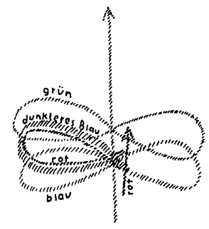

Ich habe bereits im Jahre 1891 aufmerksam gemacht auf die Beziehung, welche besteht zwischen Schillers «Ästhetischen Briefen» und Goethes «Märchen von der grünen Schlange und der schönen Lilie». Heute möchte ich darauf hinweisen, daß ein gewisser Zusammenhang besteht zwischen dem, was ich gestern als Charakteristik der mittelländischen Zivilisation im Gegensatze zu der westlichen und der östlichen gegeben habe, und dem, was ja in ganz eigenartiger Weise bei Schiller und bei Goethe auftritt. Man kann dieses ganze Streben, wie ich es gestern charakterisiert habe — auf der einen Seite das Ergriffensein der menschlichen Leiblichkeit von den Geistern des Westens und auf der anderen Seite das Fühlen jener geistigen Wesenheiten, die als Imaginationen, als Geister des Ostens inspirierend wirken auf die östliche Zivilisation —, man kann beides gerade bei diesen führenden Geistern, bei Schiller und bei Goethe, merken. Ich mache nur noch darauf aufmerksam, wie in Schillers «Ästhetischen Briefen» gesucht wird, eine Seelenverfassung des Menschen zu charakterisieren, die eine gewisse mittlere Stimmung darstellt zwischen dem einen, das der Mensch auch haben kann, dem Hingegebensein an die Instinkte, an das Sinnlich-Physische, und dem anderen, das er haben kann, wenn er an die logische Vernunftwelt hingegeben ist. Schiller meint, daß der Mensch in beiden Fällen nicht zur Freiheit kommen könne. In dem Falle nicht, wenn er ganz der Sinnenwelt, der Welt der Instinkte, der Triebe hingegeben ist; da ist er seiner leiblich-physischen Wesenheit unfrei hingegeben. Aber er ist auch nicht frei, wenn er der Vernunftnotwendigkeit, der logischen Notwendigkeit ganz hingegeben ist, denn da zwingen ihn eben die logischen Gesetze unter ihre Tyrannei. Aber Schiller will hinweisen auf einen mittleren Zustand, wo der Mensch seine Instinkte so weit vergeistigt hat, daß er sich ihnen überlassen kann, daß sie ihn nicht hinunterziehen, daß sie ihn nicht versklaven, und wo auf der anderen Seite die logische Notwendigkeit aufgenommen ist in das sinnliche Anschauen, aufgenommen ist in die persönlichen Triebe, so daß auch diese logische Notwendigkeit den Menschen nicht versklavt. ^hmccfh

Schiller findet allerdings dann in dem Zustand des ästhetischen Genießens und des ästhetischen Schaffens jenen mittleren Zustand, in dem der Mensch zur wahren Freiheit kommen kann. ^xxul8h

Es ist von großer Wichtigkeit, daß diese ganze Abhandlung Schillers hervorgegangen ist aus derselben europäischen Stimmung, aus der die Französische Revolution hervorgegangen ist. Dasselbe, was sich tumultuarisch im Westen geäußert hat als große politische Bewegung mit der Hinorientierung auf äußere Umwälzungen, das bewegte Schiller, und es bewegte ihn so, daß er suchte die Frage zu beantworten: Was muß der Mensch an sich selbst tun, um zu einem wahrhaft freien Wesen zu werden? — Im Westen stellte man die Frage: Wie müssen die äußeren sozialen Zustände werden, damit der Mensch in ihnen frei werden könne? — Schiller frägt: Wie muß der Mensch selbst in sich werden, damit er in seiner Seelenverfassung die Freiheit darleben könne? — Und Schiller stellt sich vor, daß, wenn die Menschen zu einer solchen mittleren Stimmung erzogen werden, sie auch ein soziales Gemeinwesen darstellen werden, in dem Freiheit herrscht; also auch ein soziales Gemeinwesen will Schiller auf die Weise verwirklichen, daß durch die Menschen die freien Zustände geschaffen werden, nicht durch äußere Maßnahmen. ^roobce

Schiller ist zu dieser Fassung seiner « Ästhetischen Briefe» durch seine Kant-Schulung gekommen. Er war ja bis zu einem hohen Grade eine künstlerische Natur, allein er hat sich gerade am Ende der achtziger Jahre und im Beginne der neunziger Jahre des 18. Jahrhunderts von Kant stark beeinflussen lassen und versuchte, im Kantischen Sinne sich solche Fragen zu beantworten. Die Abfassung der «Ästhetischen Briefe» fällt nun gerade in die Zeit, in der Goethe und Schiller zusammen die Zeitschrift «Die Horen» gründen, und Schiller legt die «Ästhetischen Briefe» Goethe vor. ^vvnvnx

Nun wissen wir ja, wie Goethes Seelenverfassung eine ganz andere war als die Schillers. Gerade durch die Verschiedenheit dieser Seelenverfassung kamen sich die beiden so nahe. Sie konnten, jeder dem anderen, das geben, was eben dieser andere nicht hatte. Nun bekam also Goethe Schillers «Ästhetische Briefe», in denen Schiller die Antwort geben wollte auf die Frage: Wie kommt der Mensch innerlich zu einer innerlich freien Seelenverfassung und äußerlich zu sozial freien Zuständen? Goethe konnte aus der philosophischen Abhandlung Schillers nicht viel machen. Diese Art der Begriffsführung, der Ideenentwickelung war Goethe nicht etwa fremd gewesen, denn derjenige, der, wie ich, gesehen hat, wie Kants «Kritik der reinen Vernunft» in Goethes eigenem Exemplar mit Unterstreichungen und Randbemerkungen versehen ist, der weiß, wie Goethe dieses noch in ganz anderem Sinne abstrakte Werk Kants wirklich studiert hat. Und wie er sie als solche Werke durchaus hätte hinnehmen können, so hätte er natürlich als Studiumwerk auch Schillers «Ästhetische Briefe» hinnehmen können. Aber darum handelte es sich gar nicht, sondern für Goethe war diese ganze Konstruktion des Menschen, auf der einen Seite der Vernunfttrieb mit seiner logischen Notwendigkeit, auf der anderen Seite der Sinnestrieb mit seiner sinnlichen Notdurft, wie Schiller sagte, und der dritte, mittlere Zustand, das war für Goethe etwas viel zu Gradliniges, zu Einfaches. Er empfand: So einfach kann man sich den Menschen nicht vorstellen, so einfach kann man auch die menschliche Entwickelung nicht darstellen, und deshalb schrieb er an Schiller, er wolle das ganze Problem, das ganze Rätsel nicht in einer solchen philosophisch verstandesmäßigen Form behandeln, sondern bildmäßig. Bildmäßig hat Goethe denn auch dieses selbe Problem, gewissermaßen als die Antwort auf die Zusendung der «Ästhetischen Briefe» Schillers, in seinem Märchen von der grünen Schlange und der schönen Lilie behandelt, indem er in den beiden Reichen, diesseits und jenseits des Flusses, aber in bildhafter, mannigfaltiger, konkreter Weise dasselbe hingestellt hat, was Schiller als Sinnlichkeit und als Vernunftmäßigkeit auf der anderen Seite hinstellte. Und das, was Schiller bloß abstrakt als den mittleren Zustand charakterisiert, das hat Goethe dann in der Aufrichtung des Tempels, in dem da herrscht der König der Weisheit, der goldene König, der König des Scheines, der silberne König, der König der Gewalt, der eherne, der kupferne König, und in dem zerfällt der gemischte König; das hat Goethe in bildhafter Weise behandeln wollen. Und wir haben gewissermaßen eine Hindeutung, aber eben noch in der Goetheschen Weise eine Hindeutung auf die Tatsache, daß die äußere Gliederung der menschlichen Gesellschaft nicht eine Einheit sein dürfe, sondern eine Dreiheit sein müsse, wenn der Mensch darinnen gedeihen solle. ^50ilyg

Dasjenige, was dann entsprechend einer späteren Epoche als die Dreigliederung herauskommen mußte, das gibt Goethe noch im Bilde; natürlich ist noch nicht die Dreigliederung des sozialen Organismus da, aber Goethe gibt eben die Gestalt, die er dem sozialen Organismus anweisen will, in diesen drei Königen, in dem goldenen, dem silbernen und dem kupfernen König; und das, was zerfällt, gibt er in dem gemischten König. ^ro63mq

Man kann heute nicht mehr so diese Dinge geben. Das habe ich gezeigt in meinem ersten Mysterium, wo im Grunde genommen dasselbe Motiv behandelt ist, wo es aber so ist, wie man es behandeln mußte im Beginn des 20. Jahrhunderts, während Goethe sein Märchen schrieb am Ende des 18. Jahrhunderts. ^vc4zcs

Nun kann man aber in einer gewissen Weise schon hindeuten darauf, wenn das auch Goethe selber noch nicht getan hat, wie der goldene König entsprechen würde demjenigen sozialen Gliede, das wir als das geistige Glied des sozialen Organismus bezeichnen; wie der König des Scheines, der silberne König, entsprechen würde dem politischen Staate; wie der König der Gewalt, der kupferne König, entsprechen würde dem wirtschaftlichen Gliede des sozialen Organismus; und wie der gemischte König, der in sich selber zerfällt, den Einheitsstaat darstellt, der in sich selber eben keinen Bestand haben kann. ^614rfe

Das ist gewissermaßen Goethes bildhafte Hindeutung auf das, was einmal herauskommen mußte als die Dreigliederung des sozialen Organismus. Goethe hat also gewissermaßen gesagt, als er Schillers «Ästhetische Briefe» bekam: So kann man das nicht machen ; Sie, lieber Freund, stellen sich den Menschen viel zu einfach vor. Sie stellen sich drei Kräfte vor. So ist es beim Menschen nicht. Wenn man dieses ganze reichgegliederte Innere des Menschen nehmen und anschauen will, so bekommt man so ungefähr zwanzig Kräfte - die Goethe dann in seinen zwanzig Märchengestalten bildhaft dargestellt hat —-, und man muß dann das Spielen und Ineinanderwirken dieser etwa zwanzig Kräfte auch in einer wesentlich weniger abstrakten Weise darstellen. ^h4pbqk

So haben wir am Ende des 18. Jahrhunderts zwei Darstellungen ein und derselben Sache, eine von Schiller, man möchte sagen aus dem Verstande heraus, aber nicht so, wie die Menschen gewöhnlich aus dem Verstande heraus etwas machen, sondern doch so, daß der Verstand durchdrungen ist von Empfindung und Seele, von dem ganzen Menschen. Nur ist es ein Unterschied, ob irgendein steifer durchschnittsprofessionaler Philister irgendeine Sache über den Menschen psychologisch darstellt, wo nur der Kopf über die Sache denkt, oder ob hier Schiller aus dem Erleben des vollen Menschen heraus sich das Ideal einer menschlichen Seelenverfassung konstruiert und gewissermaßen das, was er empfindet, nur in Verstandesbegriffe umwandelt. ^76i3d1

Man könnte nicht weiter nach dem Logisieren, nach dem verstandesmäßßigen Analysieren hin gehen auf dem Wege, auf dem Schiller gegangen ist, ohne daß man philiströs und abstrakt würde. Es ist noch das volle Fühlen und Empfinden Schillers in jeder Zeile dieser «Ästhetischen Briefe». Es ist nicht die steife Königsbergerität Immanuel Kants mit den trockenen Begriffen, es ist Tiefsinn in Verstandesform, in Ideen hinein gestaltet. Aber würde man einen Schritt weitergehen, dann würde man eben in das verstandesmäßige Getriebe hineinkommen, das verwirklicht ist in der heutigen gewöhnlichen Wissenschaft, wo ja im Grunde genommen hinter dem, was verstandesmäßig ausgestaltet ist, der Mensch nichts mehr bedeutet, wo es gleichgültig ist, ob der Professor A oder D oder X die Sache ausgestaltet, weil die Dinge eben dargestellt werden, ohne aus dem ganzen Menschen heraus genommen zu sein. Bei Schiller ist noch alles urpersönlich, aber bis in den Verstand heraufgehoben. Da lebt Schiller in einer Phase, ja geradezu in einem Entwickelungspunkt der modernen Menschheitsentfaltung, der wichtig und wesentlich ist, weil Schiller gerade haltmacht vor dem, in das dann später die Menschheit vollständig hinein verfallen ist. ^illhxb

 ^snjzji

Wollen wir einmal graphisch darstellen, wie etwa die Sache gemeint sein könnte. Man könnte sagen: Das ist im allgemeinen die Tendenz der Menschheitsentwickelung (Pfeil aufwärts). Sie geht aber nicht so vor sich, diese Menschheitsentwickelung - es ist dies nur schematisch, graphisch dargestellt —, sondern sie geht so vor sich, daß sich die Entwickelung (blau) in einer Lemniskate herumschlängelt; aber sie kann nicht so gehen, sondern es muß fortwährend, wenn die Entwickelung diesen Gang nimmt, neue Antriebe geben, die im Sinne dieser Linie die Lemniskate heraufheben. Schiller würde, angekommen an diesem Punkte hier (siehe Zeichnung), gewissermaßen in ein dunkleres Blau der bloßen Abstraktion, des bloßen Verstandesmäßigen hineingekommen sein, wenn er weiter fortgefahren hätte im Selbständigmachen desjenigen, was er innerlich fühlte. Er machte halt, und gerade noch hielt er mit dem verständigen Gestalten inne an dem Punkt, wo man die Persönlichkeit nicht verliert, sondern in dem verständigen Gestalten noch die Persönlichkeit drinnen hat. Daher wurde das nicht blau, sondern es wurde auf einer höheren Stufe der Persönlichkeit, die ich hier (siehe Zeichnung) mit Rot durchziehen will, grün gemacht. So daß man sagen kann: Schiller hielt zurück gerade im Verstandesmäßigen vor dem, wo das Verstandesmäßige in seiner Reinheit heraus will. Sonst wäre er in den gewöhnlichen Verstand des 19. Jahrhunderts hineinverfallen. Goethe drückte dasselbe aus in Bildern, in wunderbaren Bildern, in dem «Märchen von der grünen Schlange und der schönen Lilie»; aber er blieb auch stehen bei diesen Bildern; er konnte gar nicht leiden, daß man irgendwie an diesen Bildern etwas herummäkelte, denn für ihn ergab sich das, was er über das Individuell-Menschliche und über das soziale Leben empfand, eben in solchen Bildern. Aber weiter durfte er nicht gehen als bis zu diesen Bildern. Denn würde er nun weiterzugehen versucht haben von seinem Standpunkte aus, er wäre in das Schwärmerische, in die Phantastik hineingekommen. Die Sache würde nicht mehr Konturen gehabt haben; sie würde nicht mehr anwendbar gewesen sein für das Leben, sie würde das Leben überschritten haben, sich über das Leben hinaus erhoben haben. Es würde schwärmerische Phantastik geworden sein. Man möchte sagen: Goethe war genötigt, die andere Klippe zu vermeiden, wo er ganz ins PhantastischRote hineingekommen wäre. Darum hat er beigemischt das, was das Unpersönliche ist, dasjenige, was die Bilder in der Region des Imaginativen hielt, und ist dadurch auch auf das Grün gekommen. ^mgxg5t

Schiller hat gewissermaßen, wenn ich mich schematisch ausdrücken soll, das Blau vermieden, das Ahrimanisch-Verstandesmäßige; Goethe hat vermieden das Rot, das Schwärmerische, und ist beim konkreten imaginativen Bilde geblieben. ^q8tnwl

Schiller hat sich auseinandergesetzt als mittelländischer Mensch mit den Geistern des Westens. Die wollten ihn verleiten zu dem ganz Verstandesmäßigen. Kant ist dem unterlegen. Ich habe es dargestellt, indem ich vor kurzer Zeit hier darauf hingewiesen habe, wie Kant durch David Hume unterlegen ist dem Verstandesmäßigen des Westens. Schiller hat sich herausgearbeitet, obwohl er von Kant sich schulen ließ. Er ist geblieben bei dem, das nicht bloß das Verstandesmäßige ist. ^cwguxq

Goethe hatte mit den anderen Geistern, den Geistern des Ostens zu kämpfen, die ihn nach der Imagination trieben. Er konnte zu seiner Zeit, weil Geisteswissenschaft noch nicht vorhanden war, nicht weiter gehen als bis zu dem Gewebe der Imagination in dem «Märchen von der grünen Schlange und der schönen Lilie». Aber auch da blieb er innerhalb der festen Konturen. Er ging nicht bis ins Phantastische, Schwärmerische hinauf. Er befruchtete sich, indem er nach Süden zog, wo noch viel erhalten war von dem Erbgute des Orients. Er lernte kennen, wie die Geister des Orients da noch wirkten in der Nachblüte orientalischer Kultur, der griechischen Künste, wie er sie sich konstruierte aus den italienischen Kunstwerken. So daß man sagen kann: Es ist etwas Eigentümliches in diesem Freundschaftsbunde zwischen Schiller und Goethe. Schiller hat zu kämpfen mit den Geistern des Westens; er ergibt sich ihnen nicht, er hält zurück, er verfällt nicht in den bloßen Verstand. Goethe hat zu kämpfen mit den Geistern des Ostens; sie wollen ihn zum Schwärmerischen treiben. Er hält zurück; er bleibt bei den Bildern, die er im «Märchen von der grünen Schlange und der schönen Lilie» gegeben hat. Goethe hätte entweder in die Schwärmerei verfallen oder die orientalische Offenbarung annehmen müssen. Schiller hätte entweder ganz verstandesmäßig werden müssen, oder er hätte das, was er geworden ist, ernst nehmen müssen; bekanntlich ist er ja von der Revolutionsregierung zum «französischen Bürger» ernannt worden, aber er hat die Sache nicht sehr ernst genommen. ^4vkfmd

Da sehen wir, wie in einem wichtigen Punkte europäischer Entwickelung diese zwei Seelenverfassungen nebeneinanderstehen, die ich Ihnen charakterisiert habe. Sie leben sonst ja auch, man möchte sagen in jeder einzelnen bedeutsamen mitteleuropäischen Individualität, aber in Schiller und Goethe stehen sie zu gleicher Zeit in einer gewissen Weise nebeneinander. Es mußte, während Schiller und Goethe gewissermaßen noch auf jenem Punkte geblieben sind, erst der Einschlag der Geisteswissenschaft kommen, der diese Lemniskatenkurve (siehe Zeichnung) heraufhebt, so daß sie auf einer höheren Stufe dann erscheint. ^n9c4tc

Und so sehen wir denn in einer eigentümlichen Weise in Schillers drei Zuständen, dem Zustand der Vernunftnotwendigkeit, dem der Instinktnotwendigkeit und dem der freien ästhetischen Stimmung, und in Goethes drei Königen, dem goldenen, dem silbernen, dem kupfernen, vorgebildet alles das, was wir sowohl über die Dreigliederung des Menschen, wie über die Dreigliederung des sozialen Gemeinwesens zu finden haben durch Geisteswissenschaft als die nächsten notwendigen Ziele und Rätselfragen des einzelnen Menschen und des menschlichen Zusammenlebens. ^vfuoa8

Diese Dinge weisen uns doch wohl darauf hin, daß nicht durch eine Willkür diese Dreigliederung des sozialen Organismus an die Oberfläche getragen worden ist, sondern daß schon beste Geister der neueren Menschheitsentwickelung darauf hintendiert haben, solches zu bringen. Aber wenn es nichts anderes gäbe als ein solches Denken über das Soziale, wie es Goethes «Märchen von der grünen Schlange und der schönen Lilie» ist, so würde man nicht zur Schlagkraft des äußeren Wirkens kommen können. Goethe stand an dem Punkt, die bloße Offenbarung zu überwinden. Er ist ja auch in Rom nicht zum Katholiken geworden. Er erhob sich eben zu seinen Imaginationen. Aber er blieb doch beim bloßen Bilde stehen. Und Schiller ist nicht zum Revolutionär geworden, sondern zum Erzieher des inneren Menschen. Er blieb stehen bei dem Punkte, wo noch Persönlichkeit in der Verstandesgestaltung drinnen ist. ^nw49h4

So wirkte sich in einer späteren Phase mitteleuropäischer Kultur etwas aus, was schon seit älteren Zeiten zu bemerken ist, am klarsten für den modernen Menschen noch im Griechentum. Nach dem Griechentum strebte ja auch Goethe. Im Griechentum ist zu bemerken, wie das Soziale im Mythus dargestellt wird, also auch im Bilde. Aber im Grunde genommen ist der griechische Mythus so Bild, wie auch Goethes «Märchen von der grünen Schlange und der schönen Lilie» Bild ist. Man kann nicht mit diesen Bildern nun etwa reformatorisch wirken im sozialen Organismus. Man kann gewissermaßen nur als Idealist etwas sagen, was sich bilden müßte. Aber die Bilder sind ein zu leichtes Gebäude, als daß man wirklich schlagkräftig eingreifen könnte in die Gestaltung des sozialen Organismus. Daher haben die Griechen auch nicht geglaubt, mit ihrem Stehenbleiben in den Mythenbildern auch das Soziale zu treffen. Und da kommt man, wenn man diese Linie des Forschens verfolgt, an einen wichtigen Punkt der griechischen Entwickelung. ^deq0zo

Man möchte sagen: Für das Alltagsleben, wo sich die Dinge gewohnheitsmäßig abspielen, da dachten sich die Griechen abhängig von ihren Mythengöttern, Mythengeistern. Dann aber, wenn es sich darum handelte, Großes zu entscheiden, da sagten sich die Griechen: Ja, da machen es diejenigen Götter nicht aus, welche in die Imagination hereinwirken und eben die Mythengötter sind; da muß etwas Reales zutage treten. Und da trat das Orakel zutage. Da wurden die Götter nicht bloß imaginativ vorgestellt, da wurden sie veranlaßt, die Menschen wirklich zu inspirieren. Und mit den Orakelsprüchen befaßten sich die Griechen, wenn sie soziale Impulse haben wollten. Da stiegen sie auf von der Imagination zur Inspiration, aber zu einer Inspiration, zu welcher sie die äußere Natur herbeiriefen. Wir modernen Menschen müssen allerdings auch versuchen, uns zur Inspiration zu erheben, aber dann zu einer Inspiration, die nicht die äußere Natur in den Orakeln herbeiruft, sondern die zum Geiste aufsteigt, um in der Sphäre des Geistigen sich inspirieren zu lassen. Aber so wie die Griechen zum Realen griffen, wenn es sich um Soziales handelte, wie sie nicht bei Imaginationen geblieben sind, sondern zu den Inspirationen aufstiegen, so können wir auch nicht bei den bloßen Imaginationen bleiben, sondern müssen zu den Inspirationen aufsteigen, wenn wir irgend etwas zum sozialen Heile finden wollen in der neueren Zeit. ^y6d1qg

Und hier kommen wir an einen anderen Punkt, der wichtig ist zu beachten. Warum sind denn eigentlich Schiller und Goethe stehengeblieben, der eine auf dem Wege nach dem Verständigen, der andere auf dem Wege nach dem Imaginativen? Geisteswissenschaft hatten sie beide nicht, sonst hätte Schiller fortschreiten können dazu, seine Begriffe geisteswissenschaftlich zu durchdringen, und er würde dann etwas viel Realeres in seinen drei Seelenzuständen gefunden haben als die drei Abstraktionen, die er in den «Ästhetischen Briefen» hat. Goethe würde die Imagination ausgefüllt haben mit dem, was real aus der geistigen Welt herein spricht, und er hätte vordringen können zu den Gestaltungen des sozialen Lebens, die da bewirkt sein wollen aus der geistigen Welt herein, dem geistigen Glied des sozialen Organismus, dem goldenen König; dem staatlichen Glied des sozialen Organismus, dem silbernen König, dem König des Scheins; dem wirtschaftlichen Gliede, dem ehernen, dem kupfernen König. ^3a5a9w

Die Zeit, in der Schiller und Goethe zu diesen Einsichten, der eine in den «Ästhetischen Briefen», der andere im «Märchen», vorgedrungen sind, diese Zeit war noch nicht dazu angetan, weiterzudringen; denn um weiterzudringen muß man etwas ganz Bestimmtes einsehen. Man muß das einsehen, was eigentlich aus der Welt würde, wenn man den Weg Schillers nun weitergehen würde bis zur vollen Ausgestaltung des Unpersönlich-Verstandesmäßigen. Das 19. Jahrhundert hat es ja zunächst in der Naturwissenschaft ausgebildet, dieses Unpersönlich-Verstandesmäßige, und die zweite Hälfte des 19. Jahrhunderts hat angefangen, es in den äußeren öffentlichen Angelegenheiten verwirklichen zu wollen. Da liegt aber ein bedeutsames Geheimnis vor. Im menschlichen Organismus wird fortwährend das, was aufgenommen wird, auch zur Zerstörung geführt. Wir können nicht fortwährend bloß essen, wir müssen auch ausscheiden, es muß das, was wir als Stoff aufnehmen, auch einem Niedergang entgegengehen, das muß auch zerstört werden, muß wiederum heraus aus dem Organismus. Und das Verstandesmäßige ist dasjenige, welches, sobald es - und hier kommt eine Komplikation — das wirtschaftliche Leben ergreift, im Einheitsstaat, im gemischten König, dieses Wirtschaftsleben zerstört. ^qqelq7

Nun leben wir aber in der Zeit, in der sich der Verstand entwickeln muß. Wir können nicht im fünften nachatlantischen Zeitraum zur Entwickelung der Bewußtseinsseele kommen, ohne den Verstand zu entwickeln. Und die westlichen Völker haben ja gerade die Aufgabe, den Verstand in das Wirtschaftsleben hineinzutragen. Was bedeutet das? Wir können das moderne Wirtschaftsleben, weil wir es verständig gestalten müssen, nicht imaginativ gestalten, wie Goethe es in seinem «Märchen» gestaltet hat. Weil wir im Wirtschaftlichen den Weg weiter machen müssen, den Schiller nur getrieben hat bis zu dem noch persönlichen Aushauchen des Verstandesmäßigen, müssen wir ein Wirtschaftsleben gründen, das als Wirtschaftsleben, weil es eben verständig sein muß, im fünften nachatlantischen Zeitraum notwendig zerstörend wirkt. Es gibt im heutigen Zeitraum kein Wirtschaftsleben, das etwa imaginativ geführt werden könnte wie das Wirtschaftsleben des Orients oder noch das Wirtschaften des europäischen Mittelalters, sondern seit der Mitte des 15. Jahrhunderts haben wir nur die Möglichkeit, ein solches Wirtschaftsleben zu haben, das, wenn es allein da wäre oder mit den anderen Gliedern des sozialen Organismus vermengt ist, zerstörend wirkt. Es geht nicht anders. Daher betrachten wir dieses Wirtschaftsleben als die eine Waagschale, die tief heruntersinken würde und dadurch zerstörend wirken muß; es muß ein Gleichgewicht da sein. Daher müssen wir ein Wirtschaftsleben haben als das eine Glied des sozialen Organismus, und ein Geistesleben, welches jetzt eben das Gleichgewicht hält, immer wieder aufbaut. Hält man heute an dem Einheitsstaat fest, dann wird das Wirtschaftsleben, wie es im Westen der Fall ist, diesen Einheitsstaat mit dem Geistesleben aufsaugen, dann müssen aber solche Einheitsstaaten notwendig zur Zerstörung führen. Und wenn man bloß aus dem Verstande heraus wie Lenin und Trotzkij, einen Staat begründet, er muß zur Zerstörung führen, weil sich der Verstand bloß auf das Wirtschaftsleben richtet. ^6sg63k

Das fühlte Schiller, indem er seinen sozialen Zustand ausdachte. Schiller fühlte: Gehe ich weiter in dem verstandesmäßigen Können, komme ich ins Wirtschaftsleben hinein, so muß ich den Verstand auf das Wirtschaftsleben anwenden. Dann schildere ich nicht dasjenige, was wächst und gedeiht, dann schildere ich dasjenige, was in der Zerstörung lebt. - Schiller zuckte zurück vor der Zerstörung. Er hielt gerade an dem Punkt, wo die Zerstörung anbrechen würde, an; da blieb er stehen. Die Neueren denken alle möglichen sozialen wirtschaftlichen Systeme aus, wissen nur nicht, weil sie ein zu grobes Gefühl dazu haben, daß jedes wirtschaftliche System, das sie so ausdenken, zur Zerstörung führt, unbedingt zur Zerstörung führt, wenn es nicht jederzeit wiederum erneuert wird durch das selbständige, sich entwickeinde Geistesleben, das immer wieder und wiederum sich zu dem Zerstören, zu dem Ausscheiden des Wirtschaftslebens verhält wie das Aufbauende. In diesem Sinne ist auch in meinen «Kernpunkten» das Zusammenwirken des geistigen Gliedes des sozialen Organismus mit dem Wirtschaftlichen geschildert. ^x8i4fg

Würde unter der modernen Verständigkeit des fünften nachatlantischen Zeitraums das Kapital bleiben bei den Menschen, auch dann, wenn sie nicht mehr es selber verwalten können, dann würde das Wirtschaftsleben selber den Kreislauf des Kapitals bewirken; Zerstörung müßte kommen. Da muß das geistige Leben eingreifen, da muß über das geistige Leben hinüber das Kapital an denjenigen gebracht werden, der wieder bei seiner Verwaltung dabei ist. Das ist der innere Sinn der Dreigliederung des sozialen Organismus, daß auch in dem richtig gedachten dreigliedrigen sozialen Organismus man sich keiner Illusion hingibt, daß das wirtschaftliche Denken in der modernen Zeit ein zerstörendes Element ist, und daß daher fortwährend ihm entgegengesetzt werden muß das aufbauende Element des geistigen Gliedes des sozialen Organismus. ^gjc21p

Mit jeder neuen Generation, mit den Kindern, die wir in der Schule unterrichten, wird uns von der geistigen Welt etwas gegeben, etwas heruntergeschickt; das fangen wir auf in der Erziehung, das ist etwas Geistiges, das einverleiben wir wiederum dem Wirtschaftsleben und verhüten dessen Zerstörung; denn das Wirtschaftsleben, durch sich selbst seinen Gang gehend, zerstört sich. So muß man hineinsehen in das Getriebe. So muß man sehen, wie am Ende des 18. Jahrhunderts Goethe und Schiller dastanden, Schiller sich sagte: Ich muß zurückzucken, ich darf keinen sozialen Zustand schildern, der bloß an den persönlichen Verstand appelliert, ich muß mit dem Verstand innerhalb des Persönlichen bleiben, sonst würde ich die wirtschaftliche Vernichtung schildern -, Goethe: Ich will nicht die schwärmerischen, ich will die scharf konturierten Bilder; denn würde ich eine Strecke weitergehen, ich käme hinein in einen Zustand, der nicht auf der Erde ist, der nicht eingreift schlagkräftig in das Leben selber; ich würde wie etwas Unlebendiges das Wirtschaftsleben unter mir lassen, würde ein Geistesleben begründen, das nicht eingreifen kann in die Tatsachen des unmittelbaren Lebens. ^lctrfj

So sehen wir, daß wir im richtigen Goetheanismus leben, wenn wir nirgends bei Goethe stehenbleiben, sondern überall mitmachen die Entwickelung, die ja wohl Goethe selber mitgemacht hat seit dem Jahre 1832. Ich habe auch dieses, daß das Wirtschaftsleben fortwährend heute in seine eigene Zerstörung hineinarbeitet und fortwährend der eigenen Zerstörung entgegengearbeitet werden muß, wie der Zerstörung des Menschen durch das Essen entgegengearbeitet werden muß, ich habe auch das an einer bestimmten Stelle in meinen «Kernpunkten der sozialen Frage» angedeutet. Nur liest man die Sachen nicht ordentlich, sondern man denkt, dieses Buch sei auch so geschrieben, wie etwa heute die meisten Bücher geschrieben sind, daß man, nun ja, einfach so durchlesen kann. Es will eben jeder Satz bei einem solchen, aus dem Praktischen heraus geschriebenen Buche durchaus bedacht sein. ^aotrdg

Aber wenn man diese beiden Dinge nimmt: Schillers «Ästhetische Briefe» sind wenig verstanden worden in der Folgezeit, ich habe davon öfter gesprochen, man hat sich wenig mit ihnen beschäftigt; es würde sonst dasStudium der Schillerschen «Ästhetischen Briefe» ein guter Weg sein zum Hineinmünden in das, was Sie finden in meiner Schrift «Wie erlangt man Erkenntnisse der höheren Welten?»; dazu könnten Schillers «Ästhetische Briefe» die Vorbereitung sein. Und wiederum könnte Goethes «Märchen von der grünen Schlange und der schönen Lilie» die Vorbereitung sein, um jene Art der Geisteskonfiguration sich anzueignen, die nicht aus dem bloßen Verstande, sondern aus tieferen Kräften heraus kommen kann, und die dann so etwas wie die «Kernpunkte der sozialen Frage» wirklich verstehen könnte. Denn sowohl Schiller wie Goethe empfanden das Tragische der mitteleuropäischen Zivilisation. Gewiß, die Dinge waren ihnen nicht bewußt, aber sie empfanden sie. Beide empfanden — man kann das nachlesen bei Goethe überall in den Gesprächen mit Eckermann, mit dem Kanzler von Müller, in den zahlreichen anderen Andeutungen Goethes -: Wenn nicht etwas heraufkommt wie ein neuer Einschlag aus dem Geistigen, wie ein neues Begreifen des Christentums, dann muß es abwärts gehen. — Vieles, was Goethe an Resignation in seinen späteren Jahrzehnten dargelebt hat, beruht zweifellos auf dieser Stimmung. ^j2bx90

Und diejenigen, die ohne die Geisteswissenschaft Goetheaner geworden sind, die fühlen, wie namentlich aus dem deutschen mitteleuropäischen Wesen gerade dieses eigentümliche Nebeneinanderwirken der Geister des Westens und der Geister des Ostens ersichtlich ist. Ich habe gestern gesagt: Innerhalb der mitteleuropäischen Zivilisation ist jener Ausgleich, den die Hochscholastik gesucht hat zwischen Vernunftwissenschaft und Offenbarung, auch zurückzuführen auf die Wirkungen der Geister des Westens und der Geister des Ostens. Wie das bei Schiller und Goethe zum Vorschein kommt, wir haben es heute gesehen. Aber im Grunde genommen schwankt die ganze mitteleuropäische Zivilisation in diesem Wirbel drinnen, in dem der Osten und der Westen durcheinanderwirbeln; vom Osten herüber die Sphäre des goldenen Königs, vom Westen herüber die Sphäre des kupfernen, vom Osten herüber die Weisheit, vom Westen herüber die Gewalt und in der Mitte dasjenige, was Goethe im silbernen König darstellt, der Schein, der sich nur schwer durchdringt mit Wirklichkeit. Das Scheinhafte der mitteleuropäischen Zivilisation, es lag als tragische Stimmung auf dem Untergrunde der Goetheschen Seele. Und Herman Grimm hat in schöner Weise aus seinem Goethe-Empfinden heraus - er hat ja als ein Mensch, der eben auch von der Geisteswissenschaft unberührt war, Goethe angesehen -, er hat als ein solcher Geist charakterisiert, wie diese mitteleuropäische Zivilisation in sich hat dieses Hineingetriebensein in den Wirbel der Geister des Ostens und der Geister des Westens, was dazu führt, den Willen nicht zu seinem Rechte kommen zu lassen, und was zu der ewig schwankenden Stimmung der deutschen Geschichte geführt hat. Schön sagt Herman Grimm gerade über diese Dinge: «Die deutsche Geschichte ist für Treitschke das unablässige Streben nach geistiger und staatlicher Einheit und auf dem Wege zu ihr das unablässige Dazwischentreten unserer eigensten angeborenen Eigenschaften.» So sagt Herman Grimm, sich selber als Deutscher fühlend. Er sagt weiter: «Immer dieselbe Art unserer Natur, sich zu widersetzen, wo man nachgeben sollte, und nachzugeben, wo Widerstand nötig war. Das wunderbare Vergessen des eben erst Vergangenen, das plötzliche Nichtmehrwollen des eben noch heftig Erstrebten, die Mißachtung der Gegenwart, aber die feste, doch unbestimmte Hoffnung. Dazu der Hang, sich dem Fremden hinzugeben und, wenn dies einmal geschah, zugleich dann aber der unbewußte, maßgebende Einfluß auf die Ausländer, denen man sich doch unterwarf.» ^onlc0r

Wenn man es heute mit mitteleuropäischer Zivilisation zu tun hat und mit ihr etwas erreichen möchte, so weht einem überall diese Tragik entgegen, die die ganze Geschichte dieses Deutschen, Mitteleuropäischen, zwischen dem Westen und Osten verrät. Auch heute ist es überall noch so, daß man mit Herman Grimm sagen könnte: Der Drang, sich zu widersetzen, wo man nachgeben sollte, und nachzugeben, wo Widerstand nötig ist. ^k9xyxv

Das ist dasjenige, was von dem schwankenden Mittleren herrührt, von dem, was zwischen Wirtschaft und aufbauendem Geistesleben als das rhythmische Hin- und Herschwanken des Staatlichen mitten drinnensteht. Weil in diesen Mittelländern gerade das staatlich-politische Element seine Triumphe gefeiert hat, deshalb lebt der Schein, der leicht zur Illusion werden kann. Schiller will nicht den Schein verlassen, indem er seine «Ästhetischen Briefe» hinschreibt. Er weiß, wenn es mit dem bloßen Verstande zu tun hat, dann kommt man in die Zerstörung des Wirtschaftslebens hinein; im 18. Jahrhundert wurde der Teil zerstört, der durch die Französische Revolution zerstört werden konnte; im 19. Jahrhundert würde es viel schlimmer werden. Goethe wußte, er darf nicht bis zum Schwärmerischen gehen, er muß im Imaginativen stehenbleiben. Aber es erzeugt sich auch sehr leicht bei diesem Schwanken zwischen dem einen und dem anderen in dieser Zweiheit, die in der wirbelnden Hin- und Herbewegung der Geister des Westens und des Ostens sich vollzieht, es erzeugt sich leicht eine illusionäre Stimmung. Es ist gleichgültig, ob diese illusionäre Stimmung im Religiösen, ob sie im Politischen, im Militärischen herauskommt, es ist schließlich ganz gleichgültig, ob der Schwärmer irgendwelche Mystik ausschwärmt, oder ob er so schwärmt, wie Ludendorff geschwärmt hat, ohne auf dem Boden der Wirklichkeit zu stehen. Und schließlich, auch in einer liebenswürdigen Weise kann einem das entgegentreten. Denn dieselbe Stelle von Herman Grimm, die ich Ihnen vorgelesen habe, fährt fort: «Man sehe doch heute: Niemand schien so völlig vom Vaterlande losgetrennt als der Deutsche, der zum Amerikaner geworden war, und heute steht das amerikanische Leben, in dem das unserer Auswanderer aufging, unter dem Einflusse des deutschen Geistes.» ^22zz6t

So schreibt Herman Grimm, der geistvolle Mann, im Jahre 1895, wo man wirklich nur aus der schlimmsten Illusion heraus glauben konnte, daß die Deutschen, die nach Amerika gekommen sind, das amerikanische Leben deutsch nuancieren würden. Denn längst bereitete sich das vor, was dann im zweiten Jahrzehnt des 20. Jahrhunderts herauskam: daß eben das Amerikanische völlig überflutet hat das Wenige, was die Deutschen hineinbringen konnten. ^bn79yf

Und schließlich, noch größer wird das Illusionshafte dieses Herman Grimmschen Ausspruches, wenn man folgendes ins Auge faßt. Herman Grimm tut diesen Ausspruch aus Goethescher Gesinnung heraus, denn er hat sich ganz an Goethe herangebildet. Nur, einen Einschlag hat er gehabt. Wer Herman Grimm genau kennt, seinem Stil nach, seiner ganzen Ausdrucksform nach, seiner Denkweise nach, der weiß, Herman Grimm hat sehr viel von Goethe angenommen, nicht das Reale, Durchdringende Goethes; denn er schildert ja so, daß er eigentlich Schattenbilder schildert, nicht wirkliche Menschen. Aber er hat doch etwas anderes noch in sich, nicht bloß Goethe. Und was hat Herman Grimm in sich? Amerikanismus, denn dasjenige, was er in seinem Stile, seinen Gedankenformen außer von Goethe in sich hat, das hat er durch eine frühe Lektüre Emersons bekommen; und sogar seine Satzbildung, seine Gedankenführung ist dem Amerikaner Emerson nachgebildet. ^7j5erq

So findet sich also Herman Grimm in dieser doppelten Illusion, in diesem Reiche des silbernen Königs des Scheins. Er wähnt, als schon alles herausgeworfen wird, was in Amerika deutscher Einfluß ist, daß Amerika germanisiert würde, während er einen guten Einschlag von Amerikanismus in sich trägt. ^hu09e6

So drückt sich oftmals intim aus, was dann in der äußeren Kultur grob da ist. Da hat sich der grobe Darwinismus, die grobe wirtschaftliche Denkweise ausgebreitet, und würde schließlich, wenn nicht die Dreigliederung des sozialen Organismus kommt — weil eben das bloß verstandesmäßig konstruierte Wirtschaftsleben notwendig zum Ruin führen muß -, zum Ruin führen. Und derjenige, der aus diesem Wirtschaftsleben heraus denkt wie Oswald Spengler, der kann wissenschaftlich beweisen, daß mit dem Beginn des 3. Jahrtausends die heutige zivilisierte Welt — sie ist ja eigentlich heute nicht mehr so stark zivilisiert — in die wüsteste Barbarei wird versunken sein müssen. Denn Spengler weiß nichts von demjenigen, was diese Welt als Einschlag erhalten muß, von dem geistigen Einschlag. ^7ispby

Aber doch hat sich recht schwer durchzukämpfen, was als Geisteswissenschaft und als geisteswissenschaftliche Kultur vor die Welt heute nicht hintreten will, sondern hintreten muß. Und überall machen sich diejenigen geltend, die gerade diese Geisteswissenschaft nicht aufkommen lassen wollen. Und wenig tatkräftige Arbeiter sind im Grunde genommen noch auf diesem Boden der Geisteswissenschaft da, während die anderen, die in das Werk der Zerstörung hineinführen, durchaus tatkräftig sind. ^i7f7dp

Man braucht nur zu sehen, wie eigentlich der heutige Mensch schon ganz ratlos ist gegenüber dem, was im heutigen Zivilisationsleben auftritt. Es ist zum Beispiel charakteristisch, wie eine Zeitung der Ostschweiz Berichte gebracht hat über meine Vorträge über die Grenzen des Naturerkennens während des Hochschulkurses. Und jetzt hält in dem Ort, in dem die Zeitung erscheint, der Nachgackerer Eduard von Hartmanns, Arthur Drews, Vorträge, der niemals etwas anderes zustande gebracht hat, als daß er nachgegackert hat dem Eduard von Hartmann, dem Philosophen des Unbewußten. Bei dem ist es interessant. Bei dem Nachgackerer ist es natürlich etwas höchst Überflüssiges. Und diese an der Karlsruher Hochschule wirkende philosophische Hohlköpfigkeit, die macht sich jetzt auch über dasjenige her, was anthroposophisch orientierte Geisteswissenschaft ist! ^sy3d8z

Und wie steht der heutige Mensch — das möchte ich besonders hervorheben — vor diesen Dingen? Nun haben wir dem einen Gehör gegeben, nun geben wir auch dem anderen Gehör. Das heißt, dem heutigen Menschen ist alles egal. Und das ist das Furchtbare. Ob nun der heutige Nachgackerer des Eduard von Hartmann, Arthur Drews, etwas gegen die Anthroposophie hat oder nicht, darauf kommt es schon gar nicht an; denn das, was der Mann haben kann gegen Anthroposophie, kann man aus dessen Büchern durchaus vorher konstruieren, nicht ein einziger Satz braucht auszubleiben. Aber das Bedeutsame ist, daß die Menschen eigentlich auf dem Standpunkte stehen: Man hört das, man notifiziert das, und dann abgetan, dann Schluß! Ein wirkliches Eingehen auf die Sache braucht es ja nur, um auf den rechten Weg zu kommen. Aber der heutige Mensch will sich nicht erfassen lassen von einem rechten Eingehen auf die Sache. Das ist das ganz Furchtbare, das Schreckliche, das ist dasjenige, was die Menschen schon so weit getrieben hat, daß sie nicht imstande sind, noch zu unterscheiden zwischen dem, was von Realitäten spricht, und dem, was ganze Bücher schreibt, wie der Graf Hermann von Keyserling, in denen kein einziger Gedanke ist, sondern nur Worte, durcheinandergewürfelte Worte. Und sehnt man sich nach einem enthusiastischen Aufnehmen von irgend etwas, was ja von selbst dazu führen würde, daß das hohle Wortgeplänkel unterschieden würde von dem, was auf wirklich geistiger Forschung beruht, da findet man niemanden, der auch nur sich aufraffen, sein Herz zusammennehmen und ergriffen werden könnte von dem, was substantiell ist. Das haben die Leute verlernt, gründlich verlernt, namentlich in der Zeit, wo die Wahrheit nicht nach der Wahrheit entschieden worden ist, sondern wo unter die Menschen die große Lüge getreten ist, daß die einzelnen Nationalitäten in den letzten Jahren das wahr gefunden haben, was von ihnen ist, und falsch gefunden haben, was von einer anderen Nationalität ist. Das empörende Gegeneinander-Lügen, das ist im Grunde genommen Signatur des öffentlichen Geistes geworden. Wenn irgend etwas von einer anderen Nation gekommen ist, so war es das Unwahre; wenn es von der eigenen Nation gekommen ist, war es das Wahre. Es klingt heute noch nach, es ist heute schon in die Denkgewohnheiten hineingegangen. Dagegen ein wirkliches, unbefangenes Hingeben an das, was die Wahrheit ist, es führt zu einer Vergeistigung. Aber im Grunde ist das den Menschen heute noch egal. ^b72och

Bevor sich nicht eine genügend große Anzahl von Menschen findet, die nun wirklich mit dem ganzen Herzen eintreten wollen für das, was geistige Substanz ist, kann nichts Heilsames aus dem heutigen Chaos hherauskommen. Man glaube nur nicht, daß man mit der Galvanisierung des Alten irgendwie weiter vorschreiten könne. Dieses Alte, es gründet «Weisheitsschulen» auf bloße hohle Worte. Es hat die Universitätsphilosophie mit Arthur Drewsen versehen, die aber wahrhaftig überall vertreten sind, und die Menschheit will nicht Stellung nehmen. Ehe sie nicht Stellung nimmt auf allen drei Gebieten des Lebens, auf geistigem, auf politischem, auf wirtschaftlichem Gebiet, eher kann kein Heil hervorgehen aus dem heutigen Chaos, sondern es muß immer tiefer und tiefer hinuntergehen. ^4fcyge