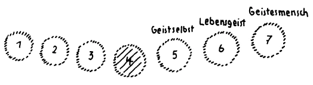

Ich habe gestern versucht, Ihnen einiges zu schildern von den europäischen Verhältnissen, wie sie sich in der nächsten Zeit herausbilden müssen, und Sie haben gesehen, wie mit der europäischen Entwickelung, überhaupt mit der Entwickelung der modernen Zivilisation verbunden sein muß ein gewisses Hinschwinden dessen, was die Menschen in der gegenwärtigen Zeit auf manchen Gebieten noch durchaus als etwas ihnen Bequemes, etwas ihnen Wertes ansehen. Aus der Art, wie ich gerade gestern darstellen mußte, ersehen Sie, daß es noch für manchen, der lieber die Entwickelung der nächsten Zeiten in bequemem Schlafe, im Seelenschlafe verleben möchte, ein gar nicht behagliches Erwachen geben wird. Ich will nicht sagen — ich habe das schon gestern angedeutet —, daß die Prophezeiungen derjenigen bis aufs i-Pünktchen stimmen müssen, die nur in so äußerlichen Dingen wie in der Diskrepanz zwischen Japan und Amerika etwa das Wesentliche der nächsten Entwickelung sehen. Aber als bevorstehend muß betrachtet werden, was ich Ihnen, wenigstens mit einigen Strichen, charakterisiert habe als den großen Geisteskampf des Ostens mit dem Westen, des Westens mit dem Osten, in dem eingekeilt sein wird dasjenige, was wir jetzt schon durch Wochen kennengelernt haben als die eigentliche Kultur der europäischen Mitte. Gerade aus dem heraus, was sich als die moderne, auf Naturwissenschaft gebaute Weltanschauung in der letzten Zeit betätigt hat - so sonderbar das klingt, es muß gesagt werden -, gerade aus dem heraus wird das intensivste Bedürfnis entstehen müssen nach dem, was ich bezeichnete als das Christus-Erlebnis, das bevorsteht. Wir haben namentlich durch die Auseinandersetzungen von gestern erfahren können, wie wenig von diesem Christus-Erlebnis eigentlich in der Gegenwart vorhanden ist. Gerade das, was man das Christus-Erlebnis nennen könnte, ist ja seit dem Mysterium von Golgatha durch die Entwickelung der Menschheit, besonders in den letzten Jahrhunderten, durchaus in die Dekadenz gekommen. Und wir konnten sehen, daß auf Grund des unmöglichen Festhaltens an dem alten Verbot des Evangelienlesens, das ja von der katholischen Kirche noch theoretisch festgehalten wird gegenüber der Forderung der Menschheit, die Evangelien zu bekommen, die Evangelien lesen zu können, sich ein Christus-Erlebnis nicht entwickeln kann. Und wir haben schon darauf hingewiesen, wie die besondere Seelenverfassung, die da im Anzuge ist innerhalb der modernen Zivilisation, wiederum hinführen wird zu dem Christus-Erlebnis, geradeso wie zu solchem Erlebnis hinführen konnte dasjenige, was von den Resten der alten instinktiven Hellsichtigkeit der Menschheit zur Zeit des Mysteriums von Golgatha noch da war. Aber man muß sich klar sein darüber, daß, wie auch sonst wesentliche, einschlagende Ereignisse in der Menschheitsentwickelung auf eine andere Art kommen, als man in den Kreisen der Philister und Pedanten erwartet, dasjenige, was man das Christus-Erlebnis von der ersten Hälfte des 20. Jahrhunderts nennen muß, in einer anderen Weise kommen wird. Und eine ganz klar zu umschreibende Beziehung zu der auf moderne Naturwissenschaft gebauten Weltanschauung wird dieses Erlebnis haben. ^v4ycy5

Bedenken Sie nur das Folgende: Die Seelenverfassung der Menschen ist — ich habe das oft beschrieben, noch in diesen Tagen - seit der Mitte des 15. Jahrhunderts eine ganz andere geworden, als sie früher war. Das berücksichtigt die äußere Geschichte nicht, weil diese äußere Geschichte immer wieder und wieder an der Oberfläche haftet. Aber insbesondere ist in der Zeit von der Mitte des 19. Jahrhunderts bis in unsere Tage die Seelenverfassung der Gesamtmenschheit einer wesentlichen Änderung unterworfen gewesen. Auch das wird viel zu wenig berücksichtigt, weil die Menschen gewohnheitsmäßig an denjenigen Dingen festhalten, welche ihnen einmal eingepfropft worden sind. Man kann höchstens eine Durchbrechung dieses gewohnheitsmäßigen Festhaltens an dem Eingepfropften bemerken, wenn man heute mit wacher Seele verfolgt, was mit der jüngeren Generation an Anschauung heraufkommt, und es vergleicht mit dem, was in ihrer Jugend die heute älteren Menschen als Anschauung gehabt haben. Die Diskrepanz zwischen dem heutigen Alter und der heutigen Jugend ist insbesondere durch die Dichter immer wieder und wiederum dargestellt worden, und wenn die Menschen sich nicht gar zu sehr einkapseln würden in ihre gewohnten Vorstellungen, so daß sie eigentlich nichts hereinlassen, was ihren Denkgewohnheiten widerspricht, so würde man schon bemerken, welch ein ungeheurer Riß eigentlich vorhanden ist zwischen dem heutigen Alter und der heutigen Jugend. ^058t8o

Auf der anderen Seite ist heute ein ungeheuer reaktionär-konservatives Element in der Menschheitsentwickelung vorhanden, und auf das habe ich auch schon gestern hingedeutet. Es ist der Autoritätsglaube gegenüber der landläufigen Wissenschaft. Und das hängt zusammen damit, daß diese landiäufige Wissenschaft eigentlich sich mit Riesenschritten das allgemeine Bewußtsein erobert hat. Das unterschätzt man eben durchaus heute. Man sollte nur einmal verfolgen, mit welcher Raschheit insbesondere in den letzten Jahrzehnten die gebräuchlichen Vorstellungen jener Wissenschaft, die sich im 19. Jahrhundert ausgebildet hat, bis in die allerungebildetsten Menschenklassen hinunter alle Seelen ergriffen haben. Gewiß, es halten sich manche Menschen noch im Zustande einer gewissen Frömmigkeit, die nichts wissen will von dem, was durch die moderne naturwissenschaftliche Vorstellung in die Menschheit eindringt. Aber in dieser Frömmigkeit ist zumeist verankert eine ungeheure Unwahrhaftigkeit, ein Nicht-sehen-Wollen auch desjenigen, was sich dort ausbreitet, und was man nicht anders bezeichnen kann als den durch die Naturwissenschaft hervorgerufenen Materialismus der neueren Menschheit. Die Ausbreitung dieses Materialismus wird in den nächsten Zeiten nicht etwa eine Zurückdämmung erfahren, wie einzelne wissenschaftliche Illusionäre glauben, sondern im Gegenteil, die Ausbreitung dieses populärwissenschaftlichen Materialismus wird mit rasender Eile zunehmen, und man wird sehen, daß aus dem Chaos der modernen Zivilisation heraus diese materialistische Stimmung immer mehr und mehr zunehmen wird. Und aus dieser materialistischen Stimmung heraus können sich, wenn die Sache genügend vorbereitet wird, wenn Geisteswissenschaft mit dem, was sie will, durchdringt, wenn also Anregung gegeben werden kann zu einer sachgemäßen Entwickelung schon der Kinder in der Schule, dann können sich aus diesem Chaos heraus einzelne Seelen entwickeln, welche eines besonders stark empfinden werden, das ich jetzt charakterisieren möchte, obwohl diese Charakteristik in der verschiedensten Weise schon bei anderen Gelegenheiten gegeben worden ist. ^jiz9g6

Wenn derjenige, der ein wenig die moderne naturwissenschaftliche Weltanschauung kennt, sie mit wachen Seelenaugen verfolgt, so muß er das besonders charakteristisch in ihr finden, daß sie außerstande ist, den Menschen irgendwie zu begreifen. Eigentlich fällt aus dieser modernen naturwissenschaftlichen Weltanschauung der Mensch als solcher ganz heraus. Wir haben Gelegenheit gehabt, als hier unser Hochschulkursus gehalten worden ist, auf den verschiedensten Gebieten der einzelnen Fachwissenschaften zu sehen, wie diese Fachwissenschaften nichts zu sagen haben über das eigentliche Wesen des Menschen. Man braucht nur einiges Charakteristische aus diesen Wissenschaften herauszunehmen. Da haben wir zum Beispiel die gebräuchliche Darwinistische oder Weismannsche oder wie immer gefärbte Entwickelungslehre; sie zeigt die Entwickelung der Lebewesen von den unvollkommensten bis zu den vollkommensten, und sie begründet die Ansicht, daß auch der Mensch aus dieser Entwickelungsströmung hervorgegangen ist. Aber eigentlich betrachtet sie vom Menschen nur so viel, als am Menschen Tierisches ist. Sie betrachtet den Menschen überall nur so weit, als sie sagen kann: Irgendein Glied, irgendeine Ausbildung am Menschen geht aus diesem Glied, aus dieser Ausbildung der Tierströmung hervor. Inwiefern das Tierische am Menschen verändert auftritt, inwiefern das Tierische beim Menschen etwas anderes ist als beim Tiere, das betrachtet eigentlich diese Wissenschaft nicht. Dagegen den Menschen selbst wirklich ins Auge zu fassen, das ist dieser Wissenschaft abhanden gekommen. Der Mensch fällt gewissermaßen aus dieser Wissenschaft ganz heraus. Diese Wissenschaft hat gewissenhafte Methoden entwikkelt. Sie hat eine gewisse Disziplin begründet, die notwendig ist, wenn man heute mitreden will in Fragen der Weltanschauung. Aber es war diese Wissenschaft nicht imstande, irgendwie das menschliche Begreifen zu dem zu erheben, was den Menschen selbst begreiflich macht. Der Mensch fällt heraus aus dem, was heute wissenschaftliches Begreifen ist, so daß er immer mehr und mehr sich selber als ein Rätsel gegenübertreten muß. Das empfinden heute noch die wenigsten; und diejenigen, die es empfinden, können es sich wohl theoretisch klarmachen, aber es ist noch nicht ein einheitliches Gefühl davon vorhanden. Aus richtig geleiteten Volksschulen wird dieses Gefühl mit aller Lebendigkeit hervorgehen. Es werden aus richtig geleiteten Volksschulen die Kinder so hervorkommen, daß sie im Fühlen schon haben: Ja, wir haben eine Wissenschaft, die aus der modernen Intellektualität geboren ist; aber gerade je weiter wir kommen in diesem Wissen, je mehr wir da lernen von der Natur, desto weniger können wir von uns selbst, desto weniger können wir vom Menschen begreifen. ^2u88u2

Dieser Intellekt, der ja die hauptsächlichste sich entwickelnde Seelenkraft der letzten Jahrhunderte war, und der es auch heute noch ist, höhlt gewissermaßen den Menschen ganz aus in bezug auf seine Selbstempfindung, in bezug auf sein Selbstgefühl. Und auf der anderen Seite steht wieder die Forderung da, daß der Mensch sich ganz auf den Boden seiner eigenen Wesenheit stellen soll. Das tritt gerade, ich möchte sagen, als eine wesentliche soziale Forderung hervor. Neben dem, daß die Wissenschaft der neueren Zeit über den Menschen nichts auszusagen vermag, sehen wir auf der anderen Seite überall die Forderungen stehen, die nun nicht wissenschaftlich auftreten, sondern die aus der Tiefe der Menscheninstinkte heraufkommen, wir sehen die Forderung: Der Mensch müsse sich erheben können zu einem menschenwürdigen Dasein, der Mensch müsse erfühlen können, was sein Wesen ist. Wir sehen immer mehr und mehr praktische Forderungen auftreten, und wir sehen auf der anderen Seite immer mehr und mehr das Unvermögen der Wissenschaft, dem Menschen über sein eigenes Wesen irgend etwas zu sagen. Solch eine Diskrepanz im menschlichen Erleben wäre in älteren Zeiten der menschlichen Weltanschauungs-Entwickelung ganz unmöglich gewesen. ^t2ms4g

Stellen wir die alte orientalische Weltanschauung noch einmal vor uns, so werden wir aus dem, was wir darüber andeuten konnten, sagen müssen: Da wußte der Mensch, er kommt aus geistigen Höhen herunter; er lebt, bevor er durch die Empfängnis beziehungsweise Geburt eingetreten ist in das physische Dasein, in einer geistigen Welt. Er bringt sich aus einer geistigen Welt mit, was eben noch in ihm ist, was als Anlage, was als Aspiration herauskommt in der Kindheit, was ihm dann durch die ganze Lebenszeit auf Erden hindurch bleibt. Jeder Orientale der älteren Zeiten hat gewußt, daß dasjenige, was aus seiner Seele sich herausarbeitet in der Kindheit, in der Jugend, eine Mitgift ist aus den geistigen Welten heraus, die er durchlebt hat, bevor er sein physisches Dasein angetreten hat. Theoretisch einzusehen, daß man ein solches geistiges Leben vor dem Erdenleben durchlebt hat, das hat nicht den großen Wert. Den großen Wert hat das lebendige Gefühl davon, den großen Wert hat es, wenn man fühlt: Was da in einem herangewachsen ist seit der Kindheit in der seelischen Entwickelung, das kommt aus der geistigen Welt her. ^68vqe2

Dieses Gefühl aber ist heute eigentlich einem anderen gewichen. Es ist einem anderen gewichen beim einzelnen Menschen, und namentlich im sozialen Leben ist es heute einem anderen Gefühl gewichen. Und da liegt etwas Wichtiges vor, auf das man hinschauen muß. Immer mehr und mehr lastet auf dem Menschen halb unbewußt das Gefühl von seinen vererbten Eigenschaften. Wer unbefangen heute auf das, was die Menschen fühlen, hinschauen kann, der sieht: Eigentlich fühlt der Mensch, das, was er ist, ist er durch seine Eltern, Voreltern und so weiter. Er fühlt nicht wie der alte Mensch, daß dasjenige, was in ihm aufflammt von Kindheit auf, aus jenen Tiefen herauskommt, in denen sich verankert hat, was er aus seinen geistigen Erlebnissen vor dem Erdenleben mitbekommen hat, sondern er fühlt in sich die von den Eltern, Großeltern und so weiter vererbten Eigenschaften. Man fragt auch heute zuerst: Wo hat das Kind das, wo jenes her? — Und wenige Menschen geben sich darauf die Antwort: Das hat das Kind von dem oder jenem Erlebnisse der geistigen Welt -, sondern man forscht danach, ob das von Großmutter, Großvater und dergleichen herstammt. Aber je mehr im einzelnen Menschen dies nicht als eine theoretische Ansicht, sondern als ein Gefühl auftritt, als ein Gefühl der Abhängigkeit von bloß irdisch vererbten Eigenschaften, desto drückender wird dieses Gefühl, desto furchtbarer nach und nach wird dieses Gefühl. Und dieses Gefühl wird mit einer rasenden Eile an Stärke zunehmen. Es wird bis zur Unerträglichkeit sich steigern müssen in dem nächsten Jahrzehnt, denn dieses Gefühl ist verbunden mit einem anderen, mit einem gewissen Gefühl der Wertlosigkeit des menschlichen Daseins. Das wird immer mehr und mehr auftreten, daß der Mensch die Wertlosigkeit seines Daseins fühlt, wenn er dieses Sein als nichts anderes fühlen kann denn als eine Zusammenfassung dessen, was seinem Blute, was seinen übrigen Organen eingepflanzt ist aus den physisch vererbten Eigenschaften heraus. Heute ist das, was da auftritt, allerdings noch bis zu einem gewissen Grade eine bloße Theorie. Dichter haben es auch schon als Erlebnis dargestellt. Aber es wird als Gefühl, es wird als Empfindung auftreten, und dann wird es eine drückende Eigentümlichkeit sein des Fühlens der zivilisierten Menschheit. Es wird wie eine Last auf der Seele ruhen, dieses Sich-Erleben in den bloß vererbten Eigenschaften. So tritt das, was die Naturwissenschaft dem Menschen nicht geben kann, das Menschenverständnis selber, so tritt es auf in seinem Mangel, indem der Mensch sich nicht als ein Kind der geistigen Welt fühlt, sondern lediglich als ein Kind der in dem irdischen, physischen Daseinslaufe vererbten Eigenschaften. ^8emms9

Aber mit aller Vehemenz tritt das im sozialen Leben auf. Denken Sie nur, welche Forderungen da auftraten als der Ausfluß einer riesigen weltpolitischen Dummheit, die in den letzten Jahren durch die Welt gezogen ist! Langsam ist es heraufgekommen in den letzten Jahrhunderten, seine Kulmination hat es erlangt, als es in unseren Tagen eben eine weltpolitische Dummheit geworden ist. Die große Krise im zweiten Jahrzehnt des 20. Jahrhunderts trat ein, als alle diejenigen Nichtswisser von den Menschheitsverhältnissen, die nun die Führung der verschiedenen Nationen und so weiter angeblich in der Hand hatten, die wenigstens an den Plätzen standen, auf denen man glaubte, die Führung der Menschheit in der Hand zu haben, als alle diese von einer Gliederung der Menschheit nach dem Willen der einzelnen Nationen sprachen. Im allerschlimmsten Sinne wurde nationaler Chauvinismus gerade in der neuesten Zeit wachgerufen. Und nationaler Chauvinismus klingt heute durch die ganze zivilisierte Welt. Das ist nur das soziale Gegenbild für jene urreaktionäre Weltanschauung, welche alles auf die vererbten Eigenschaften zurückführen will. Wenn man nicht mehr danach strebt, sein Wesen als Mensch zu ergründen und die soziale Struktur so zu gestalten, daß dieses Wesen als Mensch zurechtkommt, sondern wenn man nur darnach strebt, die soziale Struktur so herbeizuführen, daß sie dem entspricht, was man als Tscheche, als Slowake, als Magyar, als Franzose, als Engländer, als Pole und so weiter ist, dann vergißt man alle Geistigkeit. Dann schließt man alle Geistigkeit aus, dann will man die Welt bloß nach den blutsvererbten Eigenschaften ordnen, weil man immer mehr und mehr dazu gekommen ist, in seinen Begriffen nicht den geringsten Inhalt zu haben, weil dieses 20. Jahrhundert die Probe zu liefern hatte, daß auch ein Mensch da sein kann, der angestaunt wird von einer großen Menge als ein Weltenlenker, der aber überhaupt in seinen Worten gar keinen Begriff mehr hat, wie Woodrow Wilson, der nur Worte sagt, die gar keine Begriffe mehr enthalten. Deshalb mußte man sich anlehnen an irgend etwas, was ganz geistlos ist, die Blutsverwandtschaft, die blutsverwandten Eigenschaften der Nationen, woraus dann nichts anderes geworden ist, als daß Friedensschlüsse zustande gekommen sind — nun ja, wie sie eben zustande gekommen sind -, in denen Leute Landkarten über die Gestaltung der modernen zivilisierten Welt bestimmt haben, die überhaupt nicht das geringste von den Lebensverhältnissen dieser modernen Welt kennen. Nichts zeigt vielleicht deutlicher den Materialismus der Neuzeit, dieses Verleugnen alles Geistigen, als das Auftreten des Nationalprinzips. ^21hrtg

Das ist selbstverständlich eine Wahrheit, die heute vielen Menschen unangenehm ist. Und das macht es wiederum, daß so viel Lüge auf dem Grunde der Seele sich ablagern muß. Denn geht man nicht ehrlich darauf ein, daß man den Geist ableugnet, wenn man eine Weltordnung nur auf die Blutsverwandtschaft begründen will, so lügt man; man lügt, wenn man dann sagt, man neige irgendeiner geistigen Weltanschauung zu. ^wnzlo8

Und nun sehen Sie sich den Gang der heutigen Weltentwickelung an. Was aus den chaotischen Instinkten der Menschheit herausquillt, das verleugnet ja überall den Geist. Ich habe Ihnen gestern eine Probe geliefert. Ich will, um Ihre zarten Nerven zu schonen, die ich gestern einigermaßen bemerkte, nicht diese Probe noch vermehren, sie könnte leicht vermehrt werden. So sehen wir überall, wie die Anschauung des menschlichen Wesens dem Menschen abhanden gekommen ist. Und nun wollen wir einmal geisteswissenschaftlich von dem, was ich da als ein heraufziehendes Gefühl schildern mußte, das Gegenbild ins Auge fassen. ^smxdkw

Sie wissen ja, geisteswissenschaftlich zeigt sich, wie unser Erdenplanet, auf dem der Mensch sein gegenwärtiges Schicksal zu erleben hat, die Wiederverkörperung von drei vorangehenden Weltenverkörperungen ist, und wie wir hinschauen müssen auf drei folgende Weltenkörper, wie also unsere Erde, schematisch dargestellt, der Zwischenzustand ist. ^nfyvju

 ^9y1qam

Wir wissen nun auch aus dem, was in meiner «Geheimwissenschaft im Umriß» dargestellt worden ist, daß im wesentlichen das, was der Mensch heute als seinen physischen Leib an sich trägt, eine Erbschaft ist des ersten, zweiten, dritten und vierten Zustandes, daß dasjenige, was der Mensch als seinen Ätherleib an sich trägt, ein Ergebnis ist des zweiten, dritten und vierten Zustandes; was wir als seinen astralischen Leib bezeichnen, ist das Ergebnis des dritten und vierten Zustandes, und sein Ich kommt jetzt in unserer Erdenentwickelung zum Vorschein. Es wird ferner zum Vorschein kommen, wenn die Erde in ihre nächsten Zustände eingetreten ist, dasjenige, was heute im Menschen nur keimhaft angedeutet ist, Geistselbst, Lebensgeist und der eigentliche Geistesmensch. Das muß sich im Menschen ebenso herausarbeiten, wie sich in ihm herausgearbeitet hat physischer Leib, Ätherleib, astralischer Leib, und wie das Ich gegenwärtig in seinem Herausarbeiten ist. Aber Sie wissen, wenn Sie überdenken, was als diese kosmisch-irdische Evolution an Sie herangebracht werden kann: Während der Erdenentwickelung können ja doch nur die Keime von Geistselbst, Lebensgeist und Geistesmensch entwickelt werden, denn es muß abgewartet werden die Umwandlung der Erde in ihre drei nächstfolgenden Zustände, wenn das zum Vorschein kommen soll. Und aus der Schilderung, die ich gegeben habe in meiner «Geheimwissenschaft», werden Sie ersehen, daß im wesentlichen das Geistselbst die Umwand Tafel 7 lung des astralischen Leibes zu einer höheren Stufe bedeutet, daß der Lebensgeist die Umwandlung des Ätherleibes zu einer höheren Stufe und der Geistesmensch die Umwandlung des physischen Leibes zu einer höheren Stufe bedeutet. Aber diese Umwandlung des physischen Leibes zu einer höheren Stufe wird ja erst im siebenten Zustande — und so entsprechend auch die Umwandlung der anderen Glieder — stattfinden. Aber daß das stattfinden muß, das kann der Mensch heute schon einsehen; er kann heute den Gedanken aufnehmen, daß das stattfinden muß. Ja, noch mehr kann der Mensch heute begreifen, wenn er unbefangen über die naturwissenschaftliche Beschränktheit heraus den Seelenblick auf sein eigenes Wesen lenkt. Er muß sich sagen: Gewiß, ich kann nicht in meinem astralischen Leib während des Erdendaseins das Geistselbst erringen, ich kann nicht während des Erdendaseins in meinem Ätherleib den Lebensgeist, in meinem physischen Leib den Geistesmenschen erringen, aber seelisch muß ich das vorbilden. Und indem ich jetzt die Bewußtseinsseele ausbilde, bereite ich mich vor, in dem nächsten, in dem sechsten Zeitalter das Geistselbst in diese Bewußtseinsseele hereinzunehmen. Zwar kann ich noch nicht das Geistselbst in meinen ganzen astralischen Leib hineinbringen, aber ich muß es in meine Bewußtseinsseele hereinbringen. Ich muß innerlich als Mensch lernen so zu leben, wie ich einstmals leben werde, wenn die Erde in ihren nächsten Entwickelungszustand durch eine gewisse, selbstverständlich kosmische Entwickelung übergegangen sein wird. Und ich muß noch während des Erdendaseins diese Zukunftszustände wenigstens in mein Inneres hereinnehmen. Ich muß mein Inneres keimhaft vorbereiten, so daß auch mein Äußeres in der Zukunft in einer solchen Weise sich gestalten kann, wie ich es heute verstehen muß. ^kosprx

Nun machen Sie sich einmal empfindungsgemäß klar, was da eigentlich vorliegt. Der Mensch wächst ja schon jetzt in das Geistselbst hinein, wie ich das öfter dargestellt habe, der Mensch wächst in Bewußtseinszustände hinein, von denen er sich sagen muß, sie sind eigentlich so, daß sie während der Erdenzeit nicht vollständig herauskommen können. Diese Bewußtseinszustände wollen ihn eigentlich auch in bezug auf seine äußeren Hüllen, in bezug auf Astralleib, Ätherleib und physischen Leib umgestalten; aber das kann er als Erdenmensch nicht. Der Mensch muß sich sagen: Für den Rest der Erdenentwickelung muß ich durch diese so durchgehen, daß ich eigentlich überall empfinde: Ich bereite mich vor durch mein Inneres zu Zuständen, die ich jetzt noch nicht entwickeln kann. - Das muß die normale Entwickelung der Zukunft sein, daß der Mensch sich sagt: Ich sehe das Menschenwesen als etwas an, was eigentlich durch sein inneres Wesen hinauswächst über das, was ich als Erdenmensch werden kann. Ich muß mich als Erdenmensch gewissermaßen als Zwerg fühlen gegenüber dem, was der eigentliche Mensch ist. Und aus dem Unbefriedigten, das richtig erzogene Kinder schon in der allernächsten Zeit haben werden, wird eben gerade dieses Gefühl herauswachsen. Die Kinder werden empfinden: Mit aller intellektualistischen Bildung kommt man nicht dazu, das Rätsel des Menschen zu lösen. Der Mensch fällt heraus aus dem, was man intellektualistisch wissen kann, aus dem sozialen Gestalten. All das, was sich unter den Wilsonschen Dummheitsformeln und unter dem, was sonst als Chauvinismus durch die Welt geht, entwickeln wird, das werden ja lauter Unmöglichkeiten sein. Die moderne Zivilisation geht durch all diese Dinge lauter Unmöglichkeiten entgegen. Richten Sie noch mehr nationale Reiche auf innerhalb der modernen Zivilisation, so liefern Sie noch mehr Zerstörungskeime — und aus alledem, was sich da ablagert auf den Seelen, wird hervorgehen eben gerade dasjenige Gefühl, was ich jetzt Ihnen von einer anderen Seite her geschildert habe. Der Mensch wird sich sagen: Ja, aber des Menschen Wesen, das mir innerlich aufleuchtet, ist ein viel höheres als dasjenige, was ich da äußerlich verwirklichen kann. Ich muß etwas ganz anderes in die Welt hineintragen. Ich muß in die soziale Struktur etwas ganz anderes hineintragen, etwas, was aus geistigen Höhen her erkannt wird. Ich kann mich nicht dem überlassen, was ich aus der Naturwissenschaft für die soziale Wissenschaft und dergleichen lernen kann. — Aber den inneren Zwiespalt muß der Mensch empfinden zwischen diesem zwerghaften Dasein auf der Erde und dem, was ihm aufleuchtet als einem kosmischen Wesen, als das er sich empfinden wird. Aus all dem, was die moderne Bildung, diese heute so vielgepriesene, angebetete Bildung dem Menschen geben kann, wird herauswachsen, daß er sich auf der einen Seite als Erdenmensch fühlt, und auf der anderen Seite, daß er sich sagt: Aber der Mensch ist mehr als ein Erdenwesen. Die Erde kann gar nicht den Menschen ausfüllen, sie muß, wenn sie ihn ausfüllen will, sich erst in andere Zustände verwandeln. — Der Mensch ist ja auch kein Erdenwesen in Wirklichkeit, der Mensch ist in Wirklichkeit ein kosmisches Wesen, ein Wesen, das dem ganzen Weltenall angehört. Auf der einen Seite wird der Mensch erdgebunden sein, auf der anderen Seite wird er sich als ein kosmisches Wesen fühlen. Und dieses Gefühl wird sich in ihm ablagern. Wenn das einmal nicht mehr Theorie ist, sondern gefühlt wird von einzelnen Menschen, die durch ihr entsprechendes Karma herauswachsen aus dem, was heute triviales Gefühl ist, wenn die Menschheit sich angeekelt fühlt und dadurch zu einer Umkehr kommt über das Fühlen der bloß vererbten Eigenschaften, über das Fühlen des Chauvinismus, nur dann wird eine Art Reversion eintreten. Der Mensch wird sich als kosmisches Wesen fühlen. Er wird verlangen wie mit ausgestreckten Armen nach einer Enträtselung seines kosmischen Wesens. Das ist, was in den nächsten Jahrzehnten kommt, daß der Mensch wie — ich meine das jetzt natürlich symbolisch — mit ausgestreckten Armen fragt: Wer enträtselt mir mein Wesen als ein kosmisches Wesen? Alles, was ich auf der Erde ergründen kann, was mir die Erde geben kann, alles, was ich aus der modernen Wissenschaft, die heute so geschätzt wird, entnehmen kann, enträtselt mich nur als Erdenwesen, läßt mir gerade das eigentliche Wesen des Menschen als ein ungelöstes Rätsel erscheinen. Ich weiß, ich bin ein kosmisches, ich bin ein überirdisches Wesen; wer enträtselt mir mein überirdisches Wesen? ^vzezsw

Als eine Grundempfindungsfrage wird das aus den Seelen heraus leben. Wichtiger als alle anderen Dinge, die in den nächsten Jahrzehnten auftreten können, noch bevor das Jahrhundert seiner Hälfte sich nähert, wichtiger als alle anderen Empfindungen, die auftreten können, wird gerade diese Empfindung sein. Und aus der Erwartung, aus dem Verlangen, daß doch etwas da sein muß, was dieses menschliche Rätsel löst, dieses Rätsel, daß der Mensch doch ein kosmisches Wesen ist, aus diesem Gestimmtsein gegenüber dem Kosmos: Es muß das aus dem Kosmos einmal heraus sich enthüllen, was nicht von der Erde kommen kann -, aus dem heraus wird die Stimmung entstehen, der der Kosmos entgegenkommt. So wie zur Zeit des Mysteriums von Golgatha der physische Christus erschienen ist, so wird der geistige Christus der Menschheit erscheinen, der allein Antwort geben kann, weil er nicht irgendwo ist, weil er charakterisiert werden muß als ein Wesen, das sich aus Außerirdischem mit der irdischen Menschheit verbunden hat. - Man wird begreifen müssen: Beantwortet werden kann die Frage nach dem kosmischen Menschen nur dann, wenn dem Menschen zu Hilfe kommt dasjenige, was aus dem Kosmos heraus sich mit dem Erdendasein verbindet. So wird die Lösung sein der bedeutsamsten Disharmonie, die jemals im Erdendasein hervorgetreten ist: der Disharmonie des menschlichen Erfühlens als eines irdischen Wesens und seiner Erkenntnis, daß er ein überirdisches, ein kosmisches Wesen ist. Die Erfüllung dieses Dranges wird ihn dazu vorbereiten, zu erkennen, wie aus grauen Geistestiefen heraus sich ihm offenbaren wird dieses Christus-Wesen, das nun geistig zu ihm sprechen wird, wie es im Physischen während der Zeit des Mysteriums von Golgatha zu ihm gesprochen hat. Es wird der Christus nicht kommen im geistigen Sinn, wenn die Menschen nicht dazu vorbereitet sind. Aber vorbereitet dazu können sie nur sein durch die Art, wie ich es eben auseinandergesetzt habe, indem sie die geschilderte Diskrepanz empfinden, indem der Zwiespalt furchtbar auf ihnen lastet: Ich bin ja zunächst ein Erdenwesen. Die intellektuelle Entwickelung der letzten Jahrhunderte hat alles das gebracht, was mich erscheinen läßt als ein Erdenwesen. Aber ich bin kein Erdenwesen. Ich muß mich verbunden fühlen mit einem Wesen, das nicht von dieser Erde ist, das wirklich in Wahrheit, und nicht mit der theologischen Verlogenheit sagen kann: «Mein Reich ist nicht von dieser Welt.» Denn der Mensch wird sich sagen müssen: Mein Reich ist nicht von dieser Welt. - Daher wird er verbunden sein müssen mit einem Wesen, dessen Reich nicht von dieser Welt ist. ^xb5sya

Gerade aus den Wissenschaften heraus, die sich, wie ich geschildert habe, mit rasender Eile zum populären Bewußtsein verbreiten werden, muß sich das entwickeln, was die Menschheit der Wiedererscheinung des Christus von der ersten Hälfte des 20. Jahrhunderts an entgegenführt. Das konnte natürlich nicht eintreten in derjenigen Seelenverfassung, in der die zivilisierte Welt vor dem Jahre 1914 war, wo alles Reden von Idealen, alles Reden von Spiritualität im Grunde genommen eine Verlogenheit war. Die Not muß dem Menschen wahrmachen das Streben nach der Geistigkeit. Und der Christus wird erscheinen niemand anderen als denjenigen, die verlassen all das, was Verlogenheit über das irdische Leben ausbreitet. Und keine soziale Frage wird gelöst werden, die nicht verbunden gedacht wird mit diesem geisteswissenschaftlichen Streben, das den Menschen in Wahrheit wieder als ein überirdisches Wesen erscheinen läßt. Unsere sozialen Lösungen werden in demselben Maße sich ergeben, als die Menschen den Christus-Impuls in ihrer Seele werden empfinden können. Alle anderen sozialen Lösungen werden nur in Zerstörung, in Chaos hineinführen. Denn alle anderen Lösungen gehen darauf aus, den Menschen als ein irdisches Wesen zu beschreiben. Aber der Mensch wächst heraus — gerade in unserem Zeitalter wächst er heraus — aus jener Seelenverfassung, die ihn in seinem Bewußtsein für sich selber ein bloß irdisch-physisches Wesen sein läßt. Aus der Gestimmtheit der Menschenseele und aus der Not heraus wird sich das neue Christus-Erlebnis bilden. ^gxabeb

Um so mehr aber muß hingesehen werden auf alles, was das Herankommen dieses neuen Christus-Erlebnisses verhindert. ^2xj4i7

Wir haben ja, indem wir unmittelbar auf Angriffe auf unsere eigene Sache hinweisen mußten, auch hier gesehen, wie eigentlich die Menschen sich so stellen zu der heraufkommenden Geisteswissenschaft, daß sie sie aus innerer Unwahrheit heraus bekämpfen. ^zlbql0

Auf diesem Gebiete erlebt man wirklich heute etwas, was ganz unbefangen ins Auge gefaßt werden muß. Man möchte sagen, fast jeden Tag wird ja jetzt einmal die Geisteswissenschaft totgeschlagen. Der letzte dieser Totschläge ist ja derjenige, den ein Professor der Theologie, Karl Goetz, verübt hat in Übereinstimmung mit einem anderen Doktor der Theologie, einem gewissen Heinzelmann. Ich will ganz absehen davon, daß jener Doktor der Theologie, Kar! Goetz, einen Angriff auf die Geisteswissenschaft oder, wie er sagt, wie es zum Beispiel nach dem Zeitungsbericht heißt, auf die sogenannte Geisteswissenschaft verübt hat - an diese Dinge gewöhnt man sich ja heute, namentlich hier in Dornach, allmählich mehr und mehr. Aber man kann das ganze, was da von einem Dr. theol. Goetz verübt worden ist, auch noch von einem anderen Standpunkte aus betrachten. Man kann es von dem Standpunkte aus betrachten, wie unwissend diese offizielle Gelehrsamkeit ist, die die Heranbildung der heutigen Jugend in der Hand hat. Man kann abstrahieren davon, daß ein Angriff auf die Geisteswissenschaft vorliegt, aber man kann auf das Folgende seine Blicke richten, und ich will einige charakteristische Dinge herausheben - allerdings nur nach dem Zeitungsbericht -, die gerade in diesem Angriff vorkommen sollen. Da wird also hingewiesen auf die Erkenntnismethode der Geisteswissenschaft von einem Manne, dessen Beruf es ist, über die Christologie zu sprechen, der sein Brot dafür ißt, daß er die Jugend aufzieht in Christologie. Von diesem Manne wird über die Erkenntnismethode der anthroposophischen Wissenschaft so gesprochen, daß er sagt, was da angestrebt werde als Imagination, als Intuition, das beruhe darauf, daß durch die Übungen künstlich gehemmte und verdrängte Vorstellungstätigkeit hervorgerufen werde, und daß die dabei ersparte Nervenenergie dann jene Vorstellungsbilder erzeuge, welche der Anthroposoph Imagination und Intuition nennt. ^6ngq36

Also, sehen Sie sich den Mann einmal an: künstlich gehemmte und verdrängte Vorstellungstätigkeit, und dabei ersparte Nervenenergie! Ganz abgesehen davon, daß der Mann selbstverständlich von ersparter Nervenenergie nur als von einer ganz vagen Hypothese reden kann, denn kein Mensch kann sich heute aus der Wissenschaft heraus irgend etwas vorstellen unter ersparter Nervenenergie, aber er redet von künstlich gehemmter und von verdrängter Vorstellungstätigkeit. Hat dieser Mann in seiner wissenschaftlichen Gewissenhaftigkeit - ich muß in diesem Falle das Wort richtig wählen: «wissenschaftliche Gewissenhaftigkeit», ich sage es jetzt in Gänsefüßchen - sich jemals wirklich beschäftigt mit dem, was zum Beispiel hier als die Erkenntnismethode angewendet wird, um zu Imaginationen zu kommen? Kann man da reden von künstlich gehemmter oder verdrängter Vorstellungstätigkeit? Nun, der Mann könnte sich das beantworten, wenn er die anthroposophische Literatur vornähme. Diejenigen Vorstellungen, die er als seine normalen betrachtet, die werden wahrhaftig nicht zurückgedrängt. Hätte der Mann nur ein wenig sich erkundigt, ob hier verdrängte Vorstellungen walteten, als unser Hochschulkursus abgehalten wurde, dann könnte er nicht davon reden, daß hier Vorstellungstätigkeit unterdrückt wird. Es kommt immer reichlich noch dasjenige heraus an nichtunterdrücktem Vorstellungsleben, das, mindestens in bezug auf manche Fachwissenschaften, auch begreifen kann, was der Mann begreifen kann. Also von unterdrückter Vorstellungstätigkeit kann gar nicht gesprochen werden. Und würde er sich jemals in seiner sogenannten «wissenschaftlichen Gewissenhaftigkeit» bekanntgemacht haben mit dem, was hier geschildert wird als der Weg in die geistigen Welten, so würde er sehen: Künstlich gehemmt wird da nämlich gar nicht, sondern da wird freigemacht. Nichts anderes liegt vor, als daß der Mann kein Sterbenswörtchen von dem verstanden hat, was in meinem Buch «Wie erlangt man Erkenntnisse der höheren Welten?» steht. Und nichts weiß er von Erkenntnismethoden der Geisteswissenschaft als dasjenige, was er nach seiner Seelenverfassung aus den Meditationserfolgen einiger alter Tanten ablesen kann. Von dem übrigen versteht er nichts. Das wirkt heute als «wissenschaftliche Gewissenhaftigkeit» in dem, was offizielle Wissenschaft ist. ^tk5zra

Was er dann weiter redet, daß durch die Zurückstauung dieser gehemmten Vorstellungen - es soll sich ein Mensch dabei nur etwas vorstellen, wenn da wie Wasser zurückgestaut sind die Vorstellungen -, daß durch dieses Zurückstauen nun die Imaginationen lebendig werden, so daß sie wie sinnliche Wahrnehmungen sich ausnehmen, ja, ich möchte die Seiten zusammenzählen, wo immer und immer wiederum in meinen Büchern gesagt wird, daß Imaginationen nichts ähnliches haben mit sinnlichen Vorstellungen, mit sinnlichen Wahrnehmungen. Das wird in aller Breite überall auseinandergesetzt. Was herrscht also in dieser «wissenschaftlichen Gewissenhaftigkeit»? Die Lüge, die vielleicht aus der Ohnmacht hervorgeht, aus dem Unvermögen. Aber diese Lüge, sie breitet sich insbesondere im Theologischen, im Philosophischen, im Geschichtswissenschaftlichen, im Juristischen und in ähnlichen Unterrichtszweigen mit rasender Eile aus. Auf diese Tatsache sollte die moderne Menschheit hinschauen. Denn in diesen Tatsachen liegen die Gründe für das Hineinsteuern in das Chaos, nicht in jenen Redereien, die die Woodrow Wilsoneanerei aus ihren gehaltleeren Worten und dergleichen fabriziert. ^26foso

Dann kommt noch eine schöne Stelle, wie gesagt, ich kann alles nur aus dem Zeitungsbericht besprechen: Weil sie unwillkürlich aufsteigen, diese durch das zurückgestaute Vorstellungselement lebendig gewordenen Imaginationen, deshalb werden sie als leibfreie Erlebnisse geschildert -, so sagt er. Wiederum hat er in seiner «wissenschaftlichen Gewissenhaftigkeit» niemals sein Auge darauf hingerichtet, wie gezeigt wird, daß gar nichts unwillkürlich aufsteigt, wie das willkürliche Vorstellen gerade im geisteswissenschaftlichen Erkennen eine Steigerung erfährt. Vielleicht aus spiritistischen oder aus medialen Kindskopfstuben heraus hat sich der Mann seine Kenntnisse gebildet. Dann soll er den kindsköpfigen Spiritismus, die kindsköpfige Mediumschaft treffen, aber er soll die Hand weglassen von demjenigen, wovon er nichts versteht und nichts verstehen will. ^y9ea0y

Und weiter erzählt er: Durch die Bewußtseinsspaltung wird das hervorgerufen, was dann die Imagination personifiziert. — Das ist eine gewissenlose, lügenhafte Verdrehung alles dessen, was dargestellt wird in meinen Büchern als die Erkenntnismethode der Geisteswissenschaft! Dadurch macht sich der Mann dann den Boden zurecht, um in seiner Art zuletzt sagen zu können, daß zwar diese Geisteswissenschaft das Christentum nicht bekämpft, aber daß sie doch kulturell wertlos ist. Und jetzt kommt etwas ganz besonders «Schönes»: Diese Geisteswissenschaft ist kulturell wertlos, denn die Telepathie wird niemals den Telegraphen ersetzen, das Gedankenlesen wird nicht das Telephon ersetzen und die magnetische Heilkraft niemals die Medizin! ^wf8cdw

Also, während hier im Goetheanum während dieses Hochschulkursus über Medizin gesprochen worden ist, wahrhaftig mit Ausschluß alles Dilettantismus in magnetischen Heilkräften, und während in Wirklichkeit hingedeutet worden ist auf das ganz ernsthaftig Medizinische, redet ein theologischer Doktor unmittelbar in der Nachbarschaft, nachdem dieser Kursus abgelaufen ist, davon, daß die ganzen Bestrebungen der Geisteswissenschaft darinnen bestünden, die Medizin ersetzen zu wollen durch magnetische Heilkräfte. Und mit solchem Gerede erlebt ein heutiger Dr. theol. Erfolge bei dem heutigen Publikum! Und er erlebt Erfolge, wenn ihm dann das Heinzelmännchen beispringt, ein modernes Heinzelmännchen, und zuletzt hinzufügt, daß man mit der Geisteswissenschaft doch nicht den Christus finden kann, sondern nur durch die Evangelien. Nun sollte man dieses Heinzelmännchen einmal fragen: Mit welchem der Evangelien? — Man sollte dieses Heinzelmännchen fragen: Was habt ihr denn mit eurer Theologie aus den Evangelien gemacht? — Das habt ihr gemacht, daß schließlich die ganze Christologie aus der modernen Entwickelung verschwunden ist. Und jetzt, nachdem der Brei da ist, hört man von dieser Seite reden: Was von der Geisteswissenschaft kommt, das braucht man nicht für das Christliche, denn da muß die Einfachheit der Evangelien wirken. - Ist das nicht die allergründlichste Verlogenheit? Eine Verlogenheit ist es, zu wissen, was die moderne Evangelienkritik geliefert hat, und sich dann hinzustellen und zu sagen: Es muß Rettung für Zeit und Ewigkeit kommen aus den Evangelien ohne die Geisteswissenschaft. ^jqslmc

Was von dieser Seite kommt, was ist es denn? Es ist Verleugnung des Christus. Und die stärksten Verleugner des Christus sind heute die Theologen. Diejenigen, die nur ja keine wahre Idee von dem Christus heraufkommen lassen wollen, das sind heute die Theologen. Und ehe das nicht eingesehen ist, daß dieses neue Erlebnis des Christus im 20. Jahrhundert so heraufkommen muß, daß zunächst die Theologie aller Konfessionen den Christus verleugnet hat, eher wird er nicht kommen. Er wird den Menschen wieder erscheinen, wenn ihn diejenigen, die «von den Seinen» sind, die modernen Schriftgelehrten und Pharisäer, völlig verleugnet haben. ^emjozx

Es ist nicht leicht, diese Dinge in aller Stärke zu durchschauen, denn man sieht dann immer auch, wie wenig die Menschen der Gegenwart geneigt sind, mit solchem Durchschauen zu rechnen. Die Gegner stehen auf ihren Posten. Die Gegner entwickeln alle Intensität des Kampfes. Unser Kampf, dasjenige, was wir vermögen, ist schwach, recht schwach, und unsere Auffassung der Anthroposophie ist in vieler Beziehung schläfrig, recht schläfrig. Das ist der große Schmerz, der sich heute ablagert auf den, der die Dinge voll durchschaut. Man fühlt es so oft, wie man mit dem, von dem man meint, daß es aus den Forderungen der Zeit heraus gesprochen ist, daß es gerade gesprochen ist zur sozialen Heilung der Zeit, wie man mit dem eigentlich kaum etwas anderes sagt als etwas, was die Menschen als ein gesprochenes Feuilleton hinnehmen. Man möchte die Menschen aufrufen, daß sie hineinnehmen in alle Gestaltung des Lebens dasjenige, was aus der Geisteswissenschaft kommen kann, und man sieht, wie die Menschen das Leben laufen lassen, hinschauen auf diejenigen, die aus Verlogenheit heraus dieses Leben dirigieren, und aus einer gewissen inneren Wollust heraus zuhören dem, was sie als ein gesprochenes Feuilleton der Geisteswissenschaft aufnehmen. Das ist es, was noch erstehen muß: der tiefe, der heilige Ernst im Aufnehmen des Geisteswissenschaftlichen, das Abgewöhnen dessen, was die Menschen dazu bringt, wie irgendein anderes literarisches Produkt, so auch die Geisteswissenschaft aufzunehmen als etwas, an dem man sich in einer etwas besseren Weise amüsiert, weil es einem die Sehnsucht nach dem Weiterleben nach dem Tode garantiert. Es ist heute noch ein furchtbarer Abstand zwischen dem, was notwendig ist im Aufnehmen der Geisteswissenschaft, und dem, was wirklich da ist. Sehen Sie, man kann ganz absehen von dem, was ein solcher Angriff auf die Anthroposophie ist bei einem Goetz oder bei einem Heinzelmann, man braucht nur hinzuschauen auf ihre Fähigkeiten und man muß sich sagen: Wie war denn die Auslese der Menschheit, daß sie diese Leute auf solch führende Posten gebracht hat? — Ehe man sich aber nicht diese Frage in der intensivsten Weise stellen will, ehe man nicht hinschauen will, wo es eigentlich fehlt, eher kommt man nicht weiter. Alles Deklamieren von sozialen oder ähnlichen Idealen nützt nichts, wenn man nicht hinschauen will auf dieses ganz prinzipiell in unserer Gegenwart Lebende. Denn die Schäden unserer Zeit gehen von unserem verkehrten Geistesleben aus, das allmählich ganz tief in die Unwahrheit hineingekommen ist, und das sich nicht einmal bewußt ist, wie tief es in der Unwahrheit drinnen lebt. Wie sehr kontrastiert von dem, was notwendig ist, die Art, wie dasjenige, was hier gesprochen wird, aufgenommen wird! Es ist nicht als ein gesprochenes Feuilleton gemeint, es ist gemeint als eine Lebenskraft, und man wird allmählich sich dazu bequemen müssen, es als eine Lebenskraft zu verstehen. ^ydxct6

Das ist es, was ich Ihnen heute sagen wollte im positiven und im negativen Sinne über — um jetzt das triviale Wort zu gebrauchen - den Geist unseres Zeitalters, Dieser Geist unseres Zeitalters sollte der Geist der Erwartung sein, er sollte der Geist sein, der aus der Erwartung heraus sich ein Verständnis für das große, aus der Not geborene Erlebnis von der ersten Hälfte des 20. Jahrhunderts entwickelt. Aber ohne daß man in Wahrheit auf alles, was ein Hemmschuh ist, hinschaut, wird man heute nicht diesem Erlebnis entgegengehen können. Will man heute, wie man es so gerne aus Bequemlichkeit, aus innerer Wollust tut, das Knie beugen vor dem Traditionellen, und will man sich nicht bewußt werden, daß man mit dieser Kniebeuge eine tiefe Unwahrheit an den Tag legt, dann wird man sich nicht reif machen für das Christus-Erlebnis des 20. Jahrhunderts. Aber von diesem Reifmachen hängt alles ab. Alles hängt davon ab, daß wir die theologische Rederei über den Christus überwinden, um zum Verständnis des Christus wirklich vorzudringen. ^5bmvh1