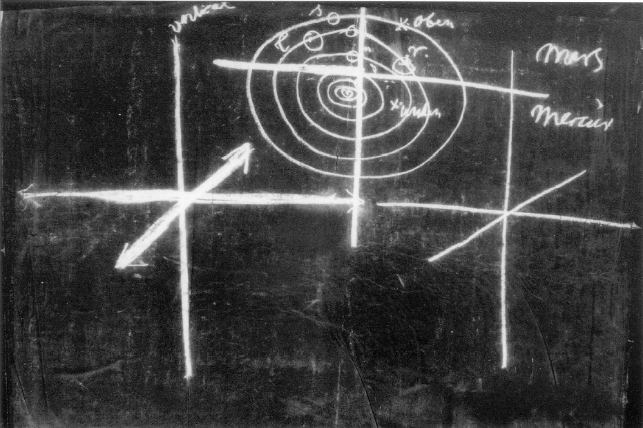
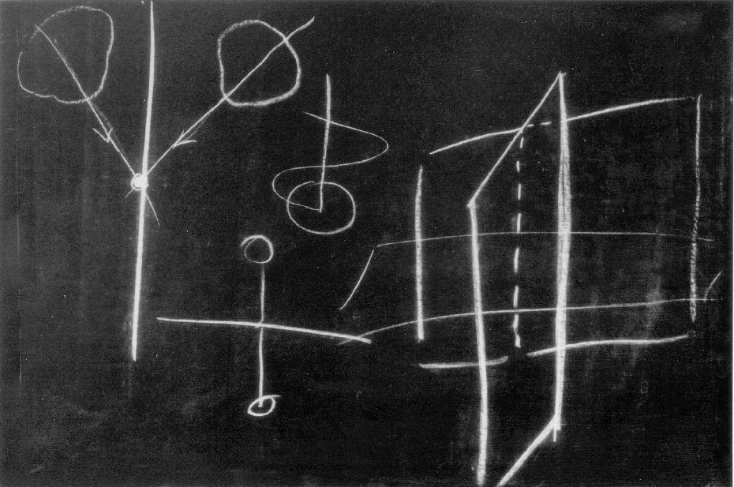

[ 1 ] ^dhlv3f

Ich werde heute versuchen, weitere Gesichtspunkte Ihnen anzugeben über ein Thema, das in der letzten Zeit hier schon berührt worden ist. Ich habe besprochen, wie für den Menschen der Gegenwart auseinanderfallen die moralischen Anschauungen und die intellektualistischen Anschauungen. Durch seinen Intellektualismus wird der Mensch gebracht zu einer Anerkennung der strengen Naturnotwendigkeit. Nach dieser strengen Naturnotwendigkeit beobachten wir alles unter dem Gesetze der Ursachen und Wirkungen. Wir fragen auch dann, wenn der Mensch eine Handlung vollzieht, was ihn verursacht hat, was in ihm gewirkt hat oder außer ihm, um die Ursache abzugeben zu dieser Handlung. Diese Anerkenntnis der Notwendigkeit alles Geschehens hat in der neueren Zeit mehr einen naturwissenschaftlichen Charakter bekommen. Sie hat in der früheren Zeit einen mehr theologischen Charakter gehabt und hat einen theologischen Charakter noch für sehr viele Menschen. Der naturwissenschaftliche Charakter ergibt sich, wenn man mehr der Meinung ist, was wit tun, das sei abhängig von unserer körperlichen Konstitution und von den Einwirkungen auf unsere körperliche Konstitution. Es gibt ja heute noch immer Menschen, welche so denken, daß der Mensch handelt geradeso notwendig wie etwa ein Stein, wenn er zur Erde fällt. Das wäre die naturwissenschaftliche Färbung des Notwendigkeitsgedankens. ^o5ereq

[ 2 ] ^ywbr4l

Die mehr theologische könnte man etwa dahin charakterisieren, daß man sagt: Es ist alles von irgendeiner göttlichen Macht, göttlichen Vorsehung vorherbestimmt, und der Mensch muß dasjenige ausführen, was ihm von der göttlichen Macht vorausbestimmt ist. In diesen beiden Fällen würde entweder die reine naturwissenschaftliche Notwendigkeit oder nur die unbedingte göttliche Voraussicht gelten. Es würde von Freiheit des Menschen nicht die Rede sein können. Auf der anderen Seite steht die ganze moralische Welt. Diese moralische Welt, von ihr fühlt der Mensch wohl, wie er von ihr nicht sprechen kann, ohne an die Freiheit seiner Willensentschlüsse zu denken. Denn hat der Mensch keine Möglichkeit zu freien Willensentschlüssen, so kann von einer Moralität der Handlungen des Menschen ja nicht die Rede sein. Dennoch fühlt der Mensch Verpflichtungen, moralische Impulse, und er muß eine moralische Welt anerkennen. Ich habe Ihnen auch erwähnt, wie die Unmöglichkeit, eine Brücke zwischen diesen zweien zu schaffen, zwischen der Welt der Notwendigkeit und der Welt des Moralischen, Kant dazu geführt hat, zwei Kritiken zu schreiben: die «Kritik der reinen Vernunft», die sich gewissermaßen damit beschäftigt, alles zu untersuchen, was der natürlichen Weltordnung angehört, und die «Kritik der praktischen Vernunft», die sich damit beschäftigt, das zu untersuchen, was der moralischen Weltordnung angehört. Dann hat er noch die Notwendigkeit empfunden, die «Kritik der Urteilskraft» zu schreiben, die gewissermaßen eine Vermittelung sein sollte zwischen beiden, die aber doch nur ein Kompromißprodukt geworden ist, und die höchstens zu einer Realität übergeht in der Betrachtung der Welt des Schönen, des künstlerischen Schaffens. Das würde aber auch nur bedeuten, daß der Mensch auf der einen Seite die Welt der Notwendigkeit hat, in die er eingesponnen ist, auf der anderen Seite die Welt des freien moralischen Handelns hat, und nichts anderes, was beide verbindet, finden würde, als die Welt des künstletischen Scheins, wo wir, sagen wir, in der Plastik oder in der Malerei eben dem Scheine nach dasjenige vorstellen, was zwar aus der Naturnotwendigkeit genommen ist, dem wir aber einprägen dasjenige, was frei von Naturnotwendigkeit ist, dem wir gewissermaßen den Schein des Freien im Notwendigen geben. ^xsmhvc

[ 3 ] ^d25bis

Man wird auch nicht eine Brücke schlagen können zwischen dieser Welt der Notwendigkeit und der Welt der Freiheit, ohne den Weg zu finden durch die Geisteswissenschaft. Aber Geisteswissenschaft erfordert zu ihrer völligen Ausbildung wirklich eine Erfüllung des, ich möchte sagen, schon seit vielen Jahrhunderten geltend gemachten Spruches, des Apollo-Spruches der Griechen: «Erkenne dich selbst.» Nun, dieses «Erkenne dich selbst» - womit nicht gemeint ist ein Hineinbrüten in seine Subjektivität, sondern ein Erkennen der ganzen Wesenheit des Menschen, wie der Mensch in der Welt drinnensteht -, dieses Suchen, das ist dasjenige, was eingeführt werden muß in unsere ganze geistige Bewegung gerade durch die Geisteswissenschaft. ^tdwetb

[ 4 ] ^ubwkvs

Sehen Sie, von diesem Gesichtspunkte aus dürfen wir wirklich sagen - ich will das einleitend jetzt bemerken -, daß der Verlauf, die Entwickelung unserer anthroposophisch orientierten Geistesbewegung in den letzten Tagen einen Anlauf genommen hat, der Geistesbewegung der Menschheit in deutlicher Weise zu zeigen, wie gesucht werden müsse dieses Durchleuchten der heutigen Denkweise, die gewissermaßen den Menschen ganz verloren hat, mit der Menschenerkenntnis. Das war ja etwas, was ganz durchleuchten mußte den eben für Ärzte gehaltenen Kursus, der insofern zu denjenigen Dingen gehört, durch die wir das Geistesleben versuchen mit Menschenerkenntnis zu durchdringen, als eben mit ihm ein erster Versuch gemacht worden ist, in positiver Weise in die Notwendigkeiten, die heute für bestimmte Fachwissenschaften vorliegen, hineinzuleuchten. Und nach außen zeigte sich das durch die Reihe von Vorträgen, die hier von unseren Freunden und von mir gehalten worden sind und in denen gezeigt werden sollte, wie das Verhältnis sich zu gestalten hat der einzelnen Fachwissenschaften zu dem, was sie als Impuls dutch die Geisteswissenschaft erhalten können. Es wäre durchaus wünschenswert, daß ein recht starkes Bewußtsein vorhanden wäre innerhalb unserer geisteswissenschaftlichen Bewegung von der Notwendigkeit solcher Unternehmungen. Denn sollen wir gedeihen, so haben wir durchaus nötig, der Außenwelt klarzumachen, sie gewissermaßen zu zwingen zum Verständnis davon, daß hier in keiner Weise der Dilettantismus gefördert werden soll auf irgendeinem Gebiete, sondern daß hier ernste Erkenntnis angestrebt werden muß. Das ist ja dasjenige, was oftmals auch verhindert wird durch die Art, wie aus unseren Kreisen selbst unsere Dinge in die Öffentlichkeit dringen, so daß man von dieser Öffentlichkeit aus dann glaubt - oder auch böswilligerweise es leicht so motivieren kann -, daß hier alles mögliche Sektiererische und aller mögliche Dilettantismus vertreten werde. Immer mehr und mehr muß einfach diese Außenwelt davon überzeugt werden, wie ernst es ist mit dem Streben, das all dem zugrunde liegt, für das dieser Bau hier der Repräsentant ist. Und getragen werden müßten eben im weiteren eigentlich solche Unternehmungen, wie diejenigen waren, die wir nun länger, durch einige Wochen, haben hier ablaufen sehen, von den Kräften der ganzen anthroposophischen Bewegung. Denn dadurch wird der Anfang gemacht mit einer wirklichen Menschenerkenntnis, die die Grundlage bilden muß für alle wahre Geisteskultur. Seit der Mitte des 15. Jahrhunderts ist immer mehr und mehr - ich möchte sagen - filtriert worden, verabstrahiert worden das konkretere Verhältnis, das die Menschen früher zur Welt gehabt haben. Der Mensch wußte allerdings durch atavistische Erkenntnisse viel mehr über sich selbst in alten Zeiten, als er heute weiß. Denn seit der Mitte des 15. Jahrhunderts ist eben über die ganze sogenannte zivilisierte Welt ausgedehnt worden der Intellektualismus. Der Intellektualismus stützt sich nur auf einen kleinen Teil, auf einen ganz kleinen Teil im Wesen des Menschen. Und weil sich dieser Intellektualismus nur auf einen ganz kleinen Teil im Wesen des Menschen stützt, gibt er auch von der Welterkenntnis nur ein abstraktes Netz. ^7oehl9

[ 5 ] ^jsrgpn

Was ist denn eigentlich Welterkenntnis geworden im Laufe der letzten Jahrhunderte in der äußeren populären Welt? Welterkenntnis, insofern sie sich bezieht auf das Weltenall, ist geworden mathematisch-mechanische Rechnerei, zu der in der neuesten Zeit noch die Ergebnisse der Spektralanalyse dazugetreten sind, etwas rein Physikalisches, und noch dazu im Physikalischen ein MechanischMathematisches. Der Astronom beobachtet den Gang der Sterne und rechnet; er konstatiert nur diejenigen Kräfte, die eigentlich die Welt, das Weltenall, insofern die Erde drinnen eingespannt ist, als eine große Maschine, als einen großen Mechanismus zeigen. Und wir können sagen, daß diese mechanisch-mathematische Betrachtungsweise dasjenige geworden ist, was einzig und allein heute als wirklich erkenntnismäßig angesehen wird. ^60hfu1

[ 6 ] ^u84igu

Nun, womit rechnet zunächst alles dasjenige, was seine Offenbarung, seinen Ausdruck findet in dieser mathematisch-mechanischen Konstruktion des Weltenalls? Es rechnet auch mit etwas, was gewissermaßen im Wesen des Menschen begründet ist, aber nur in einem sehr kleinen Stück vom Menschen. Es rechnet zunächst mit den abstrakten drei Raumdimensionen. Mit diesen rechnet der Astronom. Er unterscheidet einfach eine Raumdimension, eine zweite und - wenn ich perspektivisch zeichne - eine dritte senkrecht darauf stehende (Tafel 1, links). Und er faßt einen Stern, der sich bewegt, oder die Lage eines Sternes ins Auge, indem er auf diese drei Raumdimensionen sieht. Der Mensch würde nicht sprechen können über diese drei Raumdimensionen, wenn er sie nicht in seinem eigenen Wesen erlebte. Der Mensch erlebt diese drei Raumdimensionen. Zunächst erlebt er in seinem Lebensgang die vertikale Dimension. Er kriecht als Kind und richtet sich auf. Da erlebt er die vertikale Dimension. Es gäbe nicht die Möglichkeit, von der vertikalen Dimension zu sprechen, wenn der Mensch sie nicht erlebte. Wenn die Leute glauben, der Mensch könne etwas anderes im Weltenall finden, als er in sich selber findet, so geben sie sich starken Illusionen hin. Die Vertikaldimension findet der Mensch nur im Weltenall, weil er sie in sich selbst erlebt. ^viiari

 ^iiy3gx

[ 7 ] ^p2a1pi

Auch diese Dimension (die horizontale) findet der Mensch nur dadurch, daß er sie in sich selbst erlebt. Strecken Sie im Verhältnis zu der Vertikaldimension Ihre Hände aus, Ihre Arme aus, so erleben Sie die zweite Dimension. Und nehmen Sie dazu dasjenige, was Sie erleben, indem Sie atmen, indem Sie sprechen, also indem Sie die Luft einziehen oder ausatmen, oder indem Sie essen, wo die Speisen in Ihrem Körper von vorne nach rückwärts sich bewegen, so erleben Sie dazu die dritte Dimension. Nur dadurch, daß der Mensch in sich diese drei Dimensionen erlebt, projiziert er sie auch hinein in den äußeren Raum. Es gibt schlechterdings nichts, was der Mensch in der Außenwelt finden kann, ohne daß er es zuerst in sich selber findet. Aber das Eigentümliche ist, daß der Mensch in der abstrahierenden Zeit seit der Mitte des 15. Jahrhunderts diese drei Dimensionen zu einem Gleichartigen gemacht hat. Das heißt, er hat die konkreten Unterschiede einfach weggelassen. Er hat weggelassen dasjenige, was die drei Raumdimensionen für ihn zu etwas Verschiedenem macht. Er müßte eigentlich, wenn er sein eigenes Menschenerlebnis gäbe, sagen: meine Aufrechte, meine Wirkende, meine Umfassende oder meine Ausstreckende. Er müßte einen Unterschied zwischen diesen drei Raumdimensionen annehmen. Würde der Mensch aber einen Unterschied zwischen diesen drei Raumdimensionen annehmen, dann würde er auch nicht mehr das astronomische Weltbild in einer solchen Weise abstrakt fassen können, wie er es faßt. Denn dann würde er auf ein nicht so rein intellektualistisches Weltbild kommen. Er würde aber in konkreter Weise erleben müssen, wie er sich in bezug auf diese drei Dimensionen zur Welt verhält. Das erlebt er heute nicht. Er erlebt heute nicht das Sich- Aufrichten, das In-derVertikale-Sein. Daher weiß er auch nicht, daß er in dieser Vertikale aus dem Grunde ist, weil er sich mit der Erde in einer bestimmten Richtung bewegt, welche diese Vertikale einhält (Tafel 2, Mitte oben. Erde mit vertikalem Strich). Und der Mensch weiß auch nicht, daß er auch seine Atembewegung, seine Verdauungs-, Eßbewegung und noch andere Bewegungen, welche in derselben Richtung verlaufen, in einer gewissen Richtung macht, durch die sich die Erde wiederum in einer gewissen Linie bewegt (die vorige Zeichnung wird durch die schwingende Linie ergänzt). All dieses Einhalten von gewissen Richtungen ist ein Sich-Hineinfügen in Bewegungen des Weltenalls. Von diesem konkreten Verstehen der Dimensionen sieht der Mensch heute ganz ab. Daher kann er sich auch nicht einordnen in den Weltenprozeß; daher weiß er auch nicht, wie er in diesem Weltenprozeß drinnensteht, wie er gewissermaßen ein Glied in diesem Weltenptrozesse ist. Es wird immer mehr und mehr dazu kommen müssen, daß Schritte gemacht werden, durch die der Mensch eine gewisse Menschenerkenntnis, eine gewisse Selbsterkenntnis bekommt von seiner Einordnung in das Weltenall. ^i4h6l8

 ^n1xh39

[ 8 ] ^9qiabz

Nun sind zunächst die drei Raumdimensionen wirklich schon so abstrakt geworden für den Menschen, daß er sich außerordentlich schwer erziehen kann zu fühlen, wie er gewisse Bewegungen der Erde und des ganzen Planetensystems mitmacht, indem er in diesen drei Raumdimensionen etwas zu tun hat. Aber geisteswissenschaftliche Denkweise, sie kann ausgedehnt werden auf Menschenerkenntnis, wenn zunächst wenigstens ein Ersatz gesucht wird für dieses schwer zu erringende Verständnis der drei Raumdimensionen. Und wir können schon leichter uns zu dieser Raumerkenntnis des Menschen aufschwingen, wenn wir nun nicht die drei Raumlinien, die aufeinander senkrecht stehen, ins Auge fassen, sondern wenn wir drei Raumebenen betrachten. Da bitte ich Sie, nur zunächst einmal folgendes zu betrachten: Sie werden leicht einsehen können, daß Ihre Symmetrie etwas zu tun hat mit Ihrem Denken, wenn Sie darauf achten, daß Sie eine elementar naturgegebene Gebärde machen, wenn Sie das urteilende Denken gebärdenhaft ausdrücken wollen. Sie fahren, indem Sie sich geradezu den Finger auf die Nase legen, durch diese vertikale Symmetrieebene, die Sie in einen linken und in einen rechten Menschen zerschneidet (Tafel 2, rechts). Diese Ebene, die mittendurch geht durch Ihre Nase, durch Ihren Körper, und die Symmetrieebene darstellen soll, ist dasjenige, dessen Sie sich bewußt werden können als etwas, das zu tun hat mit allem Unterscheiden in Ihnen, allem unterscheidenden Denken, unterscheidenden Urteilen. Es ist möglich, ausgehend von dieser elementaren Geste, sich tatsächlich ein Bewußtsein davon zu verschaffen, daß man als Mensch in allen seinen Verrichtungen mit dieser Ebene etwas zu tun hat. ^n8ntzt

[ 9 ] ^7kg5db

Nehmen Sie nur einmal die Funktion Ihres Sehens. Sie sehen mit zwei Augen. Sie sehen mit zwei Augen so, daß Sie dasjenige, was die beiden Augen machen, hier zur Kreuzung bringen (Tafel 2, links). Einen Punkt, der hier ist, Sie sehen ihn von links und von rechts, aber Sie sehen ihn nur einmal, weil die Sehlinien, die Visierlinien sich schneiden, und sie schneiden sich so, daß sie sich in der Ebene, die ich hier gezeichnet habe, schneiden. Unsere menschliche Tätigkeit ist vielfach so angeordnet, daß das Verstehen, das Auffassen mit dieser Ebene etwas zu tun hat. ^tc1ja7

[ 10 ] ^cyubt3

Wir können dann hinsehen auf eine andere Ebene, welche etwa gehen würde mitten durch unser Herz, und welche trennen würde den Menschen rückwärts von dem Menschen vorne. Der Mensch vorne ist physiognomisch gegliedert. Er ist der Ausdruck seines seelischen Wesens. Diese physiognomisch-seelische Gliederung des Menschen ist durch eine Ebene, die auf der ersten Ebene senkrecht steht, von der hinteren Gliederung getrennt (vorige Zeichnung, zweite vertikale Ebene). Wie unser rechter und linker Mensch durch eine Ebene getrennt sind, so sind unser vorderer und rückwärtiger Mensch durch eine Ebene getrennt. Sie brauchen ja nur die Arme, die Hände auszustrecken und den physiognomischen Teil der Hände - im Gegensatz zu dem, was bloß der organische Teil ist - nach vorne zu richten, den organischen Teil nach rückwärts, so können Sie dann durch die Hauptpunkte, die Hauptlinien, die dadurch entstehen, eine Ebene legen, und bekommen diese Ebene, die ich hier meine. — Ebenso können Sie eine dritte Ebene legen, welche alles dasjenige, was nach oben sich gliedert als Kopf und Antlitz, von dem abgrenzen würde, was nach unten sich gliedert in Rumpf und Gliedmaßen. So würden Sie bekommen eine dritte Ebene, die wiederum auf den beiden andern senkrecht steht, die horizontal ist und die etwa durchgehen würde ganz durch Ihre Arme, wenn Sie die Arme so halten (seitlich ausgestreckt, die Handflächen nach unten). Ihre Hände würden dann in diese Ebene fallen. ^dry2xh

[ 11 ] ^fhbziw

Man kann sich ein Gefühl von diesen drei Ebenen erwerben. Wie man sich ein Gefühl erwirbt von der ersten Ebene, das habe ich schon gesagt. Sie ist zu fühlen als die Ebene des unterscheidenden Denkens. Die zweite Ebene, welche den Menschen in ein Vorderes und Rückwärtiges trennt, sie würde diejenige Ebene sein, welche geradezu auf dasjenige hinweist, wodurch der Mensch Mensch ist. Denn nicht in derselben Weise könnten Sie diese Ebene in ein Tier hineinzeichnen. Die Symmetrie-Ebene können Sie in das Tier hineinzeichnen, die andere vertikale Ebene nicht. Diese zweite vertikale Ebene, die würde zusammenhängen mit alledem, was menschliches Wollen ist. Und die dritte, die darauf senkrechte horizontale Ebene würde zusammenhängen mit alledem, was menschliches Fühlen ist. Versuchen Sie nur einmal wiederum aus den elementaren Gesten sich eine Anschauung von diesen Dingen zu verschaffen. Sie werden sehen, daß man das kann, daß man in der Lage ist, so etwas zu machen. Schließlich nähert sich alles dasjenige, worinnen der Mensch sein Fühlen zum Ausdrucke bringt, sei es ein grüßendes Fühlen, ein dankendes Fühlen oder sonstiges Mitfühlen, in einer gewissen Weise der Horizontalebene. ^v9biqx

[ 12 ] ^jwvwpl

Ebenso können Sie sehen, daß Sie in einer gewissen Weise immer das Wollen werden in Zusammenhang bringen müssen mit der angegebenen Vertikalebene. Es ist möglich, sich anzuerziehen ein Gefühl für diese drei Ebenen. Wenn der Mensch nun ein Gefühl für diese drei Ebenen bekommt, dann wird er genötigt sein, das Weltenall ebenso im Sinne dieser drei Ebenen aufzufassen, wie er, wenn er nur in abstrakter Weise die drei Raumdimensionen auffaßt, in mechanisch-mathematischer Weise galileisch oder kopernikanisch das Weltenall in seinen Bewegungen und Stellungen berechnet. Nur werden ihm dann konkrete Verhältnisse hineinkommen in dieses Weltenall. Er wird nicht mehr bloß nach den drei Raumdimensionen rechnen, sondern er wird aufmerksam darauf werden, daß da in ihm selbst, indem er die drei Ebenen fühlen lernt, zwischen rechts und links ein Unterschied ist, zwischen oben und unten ein Unterschied ist, zwischen vorne und hinten ein Unterschied ist. Für das Mathematische ist es gleichgültig, ob etwas ein Stückchen weiter nach rechts oder nach links, nach vorne oder rückwärts ist. Wenn wir bloß messen, so messen wir von unten nach oben, messen von rechts nach links, von vorne nach rückwärts. Ob drei Meter in dieser oder jener Lage gelegen sind, es sind drei Meter. Höchstens unterscheiden wit, damit wir zur Bewegung übergehen können, eben die aufeinander senkrecht stehenden Dimensionen. Das tun wir aber auch nur, weil wir eben beim bloßen Messen nicht stehenbleiben können, denn es würde uns dann die Welt in eine gerade Linie ausschrumpfen. Lernen wir aber, konkret Denken, Fühlen, Wollen in diesen drei Ebenen zu charakterisieren, und lernen wir uns selbst hineinzustellen als seelisch-geistige Wesen mit unserm Denken, Fühlen und Wollen in den Raum, dann lernen wir — ebenso, wie wir als Stück vom Menschen die drei Dimensionen anzuwenden lernten auf die Astronomie - auch diese Gliederung des Menschen anzuwenden auf die Astronomie. Und wir bekommen dann die Möglichkeit, wenn wir hier — wir könnten ebensogut ein anderes Schema zugrunde legen -, wenn wir hier Saturn, Jupiter, Mars, Sonne, Merkur, Venus, Mond, dann Erde haben (Tafel 1, Mitte), die Sonne nach ihrer äußeren Offenbarung wie etwas Scheidendes, etwas Trennendes anzusehen. Und wir werden durch die Sonne uns eine Ebene gelegt denken müssen (die Horizontale wird gezeichnet) und werden dann nicht mehr bloß dimensional ansehen dasjenige, was über der Ebene ist und was darunter ist, sondern wir werden diese Ebene als etwas Trennendes ansehen und werden nun unterscheiden das Obere und das Untere. Wir werden also nicht mehr nur sagen, der Mars ist so und so viele Meilen, die Venus so und so viele Meilen von der Sonne entfernt, denn wir werden die Menschenerkenntnis auf die Welterkenntnis anzuwenden lernen und wir werden uns sagen: Geradeso, wie es nicht einfach mit den Dimensionen abgetan ist, wenn ich sage, der menschliche Kopf oder die Nase ist von der horizontalen Ebene, die ich als die Ebene des Fühlens bezeichnet habe, so weit entfernt, das Herz ist so weit entfernt, sondern ich das Entferntsein nach unten und nach oben mit der Gestaltung, mit der Bildung in einen Zusammenhang bringen werde; ebenso wenig werde ich dann bloß sagen: Mars und Merkur - der eine ist so weit, der andere so weit von der Sonne entfernt, sondern ich werde wissen, daß, wenn ich die Sonne als etwas Trennendes betrachte, der Mars nach oben eine andere Natur als der Merkur nach unten haben muß. Und ich werde jetzt auch legen können, sagen wir, eine solche Ebene, die darauf senkrecht steht, durch die Sonne (die Vertikale wird gezeichnet). Dann wird der Jupiter oder der Mars sich einmal so bewegen, daß er rechts von dieser Ebene steht (r), und er wird sich herüberbewegen und so stehen, daß er links von der Ebene steht (l). Gehe ich bloß abstrakt nach den Dimensionen vor, so ist er einmal rechts, einmal links so und so viele Meilen von der Ebene entfernt. Konkretisiere ich in den Weltenraum hinein, wie ich in mich selber als Mensch hinein konkretisieren muß, dann ist es mir nicht gleichgültig, ob der Planet einmal rechts, einmal links steht, sondern ich werde sagen, da ist ein Unterschied, ob er rechts oder links steht, wie etwa zwischen einem rechten und einem linken Organ. Es ist nicht genügend, daß ich sage, die Leber im Menschen ist so und so viele Zentimeter von der Symmetrieebene rechts, der Magen so und so viele Zentimeter links, sondern die beiden sind verschieden in ihrer Gestaltung dadurch, daß das eine Organ rechts, das andere links ist. Hier ist es so, daß der Jupiter etwas anderes wird, wenn er rechts steht, etwas anderes, wenn er links steht, rein für den Augenschein. ^q527rf

[ 13 ] ^nzbt16

Ebenso könnte ich eine dritte Ebene legen, und ich müßte wiederum meine Beurteilung einrichten nach dem, wie das ist. Aber ich würde zu gleicher Zeit, wenn ich nun meine Menschenerkenntnis ausdehnte auf das Weltenall, genötigt sein, alles dasjenige, was sich auf die eine Ebene bezieht, in ähnlicher Art zu betrachten, wie ich das menschliche Denken betrachte; was sich auf die zweite Ebene bezieht, in ähnlicher Weise zu betrachten wie das menschliche Fühlen; die dritte Ebene zu betrachten wie das menschliche Wollen. ^agsi0w

[ 14 ] ^0e3w7q

Ich wollte Ihnen damit nur zeigen, daß für diese neueste Weltanschauung ein letzter Rest geblieben ist von äußerster Abstraktion: drei gleichgültig aufeinander senkrecht stehende Linien, auf die man Stellungen und Bewegungen der Sterne bezieht, und nach diesen Stellungen und Bewegungen der Sterne Berechnungen macht des Weltenalls wie eines Mechanismus. Man bezieht nur dieses ezze, den ganz abstrakten Raum mit seinen Punktverhältnissen, auf das Weltenall in der galileischen astronomischen Anschauung. Man kann das ausdehnen auf eine stärkere Menschenerkenntnis. Man kann sagen: Der Mensch ist ein Wesen - denkend, fühlend, wollend. Als äußerlich räumliches Wesen hat sein Denken etwas zu tun mit einer Ebene, sein Wollen mit einer darauf senkrecht stehenden Ebene, sein Fühlen wiederum mit einer darauf senkrecht stehenden Ebene. Dies muß sich auch beziehen auf die äußere Welt. Eigentlich richtig wissen tut ja der Mensch seit der Mitte des 15. Jahrhunderts überhaupt gar nichts anderes, als daß er nach den drei abstrakten Dimensionen ausgedehnt ist. Das andere sind ja bloß Wissensnotizen, das andere ist bloß aufgesammeltes Beobachtungsmaterial. Es muß wiederum errungen werden eine wirkliche Menschenerkenntnis, dann wird auf dem Umwege durch die Menschenerkenntnis auch eine Welterkenntnis errungen werden. Und dann wird man verstehen lernen, wie Notwendigkeit und Freiheit zusammenhängen können, wie sie beide im Menschen Platz haben können, indem der Mensch aus der Welt heraus geboren ist. Denn natürlich, wenn man nur diesen letzten Rest menschlichen Wesens, die drei aufeinander senkrecht stehenden Dimensionen, nimmt und als dasjenige auffaßt, was man noch begreifen will, dann erscheint einem auch das Weltenall ungeheuer arm, unendlich arm. Und unendlich arm ist unsere heutige astronomische Weltanschauung. Aber sie wird nicht reicher werden, wenn wir nicht erst zu einer wirklichen Menschenerkenntnis vordringen, wenn wir nicht erst lernen, in den Menschen wirklich hineinzuschauen. ^q5vsrp

[ 15 ] ^ckocqe

Das hängt zusammen mit gewissen Dingen, die ich vorgestern hier im öffentlichen Vortrage vorgebracht habe, das hängt damit zusammen, daß anthroposophisch orientierte Weltanschauung gerade in das wirkliche Geist-Erkennen das Materielle hineinführt. Stehen denn nicht solche Dinge wie Denken, Fühlen und Wollen wie furchtbar kahle Abstraktionen heute vor der menschlichen Erkenntnis? Die Menschen prüfen sich nur nicht genügend. Die Menschen fragen sich eigentlich gar nicht, was sie in dem haben, wofür sie Worte anwenden. Daher ist ja so vieles zur Phrase geworden. Es sollte jemand wirklich nur sich gewissenhaft fragen, wenn er das Wort Denken ausspricht, ob er denn wirklich klar sich etwas dabei vorstellt, gar nicht zu reden von Fühlen und Wollen. Aber bedenken Sie, wie das phrasenhafte Sich-Ergehen in Worten in Anschauung übergeht, wenn man wirklich zum Bilde zurückkehrt. Wenn man auch nur das eine Bild hat für das Denken, daß man sich an die Nase greift - man braucht es ja nicht immer zu tun, aber man weiß, daß diese Bewegung immer in der Situation ausgeführt werden will, wenn wit denken sollen; oder wir deuten auch auf unser Kinn, wenn wir aufpassen sollen -, also, wir greifen gerade in diese Ebene hinein, weil wir da auch urteilen wollen über dasjenige, dem wir zuhören. Wir teilen gewissermaßen unseren Organismus in eine linke und rechte Hälfte, weil wir immer mit dem linken Sinnesorgan eigentlich etwas anderes verrichten als mit dem rechten. Wie Sie mit dem linken Sinnesorgan etwas anderes verrichten als mit dem rechten, das können Sie ja daran ermessen, daß Sie eigentlich immer mit dem linken Sinnesorgan etwas tun, was auch im Denken wie ein Befühlen des Gegenstandes ist. Mit dem rechten Sinnesorgan befühlen Sie gewissermaßen wiederum Ihr Befühlen. Dadurch wird es erst Ihr Eigentum. Sie würden ja niemals zu der Ich-Vorstellung kommen können, wenn Sie nicht dasjenige, was Sie links erleben, wiederum wahrnehmen könnten mit dem, was Sie rechts erleben. Indem Sie einfach Ihre Hände übereinanderlegen, ist das ein Bild des Ich-Vorstellens. Das muß gesagt werden, daß der Mensch, indem er von dem bloßen Leben in Phrase übergeht zur Anschaulichkeit, daß er dadurch innerlich reicher wird, dadurch auch die Möglichkeit gewinnt, das Weltenall reicher vorzustellen. ^wkzyuc

[ 16 ] ^2foe7n

Dadurch, daß dieser Weg angetreten wird, wird wiederum Leben hineinkommen in dieses Weltenall und in uns als Menschen das Gefühl von der Teilnahme an dem Leben des Weltenalls. Dann wird es wieder einen Sinn bekommen, das Weltenall mit dem Menschen zu verbinden, eine Brücke zu schlagen vom Weltenall zum Menschen hin. Wenn diese Brücke geschlagen wird, dann kann erst eingesehen werden, ob denn nun wirklich für alles, was im Menschen vorliegt, eine naturnotwendige Impulsation im Weltenall vorliegt; ob das Weltenall uns durch und durch determiniert oder ob es uns in einer gewissen Weise frei läßt. Solange wir nur in Abstraktionen leben, so lange können wir unmöglich irgendeine Brücke schlagen zwischen dem Moralischen und dem Naturgemäßen. Wir müssen uns erst fragen können: Wie weit reicht im Weltenall das Naturgemäße und wo tritt im Weltenall etwas auf, das wir nicht unter den Gesichtspunkt des Naturgemäßen bringen können? Dann kommen wir zu einer Beziehung, die auch für den Menschen eine Bedeutung hat, zwischen dem Naturgemäßen und dem Freien, dem Moralischen. Auf diese Weise werden Sie lernen, wiederum einen Sinn mit den Worten zu verknüpfen: Mars ist ein sonnenferner, Venus ein sonnennaher Planet. - Damit, daß Sie einfach in abstrakten Zahlen die Entfernungen angeben, haben Sie ja gar nichts gesagt, oder wenigstens sehr wenig gesagt. Denn alles dasjenige, was in dieser Weise - und im Grunde wird ja alles, was die heutige Astronomie angeht, in dieser Weise angegeben -, alles, was in dieser Weise nur bestimmt wird, das ist gerade so bestimmt, wie wenn Sie sagen, Sie sehen einmal auf jene Linie, welche durchgeht durch die beiden Arme und Hände des Menschen, und sprechen dann von einem Organ, das zweieinhalb Dezimeter entfernt ist von dieser Linie. Ja, aber das eine Organ, das von dieser Linie (Tafel 2, Mitte unten) entfernt ist, das kann nach unten entfernt sein, das andere Organ kann nach oben entfernt sein. Es ist nicht nur das wichtig, daß diese Organe so und so weit entfernt sind, sondern es macht etwas aus, daß das eine Organ nach oben so weit entfernt ist, und das andere Organ nach unten. Wenn es keinen Unterschied gäbe zwischen dem Oben und Unten, dann wäre kein Unterschied zwischen Ihrer Nase und Ihrem Magen oder zwischen Ihren Augen und Ihrem Magen. Das Auge ist nur dadurch Auge, daß es oberhalb dieser Linie liegt, der Magen nur dadurch Magen, daß er unterhalb dieser Linie liegt. Das innere Wesen wird bedingt von dieser Stellung. ^56cm1n

[ 17 ] ^w366tc

Und so wird auch das innere Wesen des Mars bedingt von seiner Stellung außerhalb der Sonnenbahn und das Wesen der Venus von ihrer Stellung innerhalb der Sonnenbahn. Und wer nicht begreift, welcher innere wesenhafte Unterschied zwischen einem Organ des menschlichen Kopfes und einem Organ des menschlichen Rumpfes ist, von denen das eine über, das andere unterhalb dieser Ebene liegt, für den geht auch nicht eine Erkenntnis davon auf, daß wesensverschieden sind Mars und Venus oder Mars und Merkur. Die Möglichkeit, das Weltenall organisiert zu denken, hängt davon ab, daß wir est dasjenige, worin uns die Hieroglyphe des Organisierens vor Augen gestellt ist, zu lesen verstehen. Wir müssen lernen, den Menschen als eine Hieroglyphe des Weltenalls aufzufassen, denn der Mensch gibt uns die Gelegenheit, aus der Nähe zu sehen, wie die wesenhafte Verschiedenheit ist des Oben und Unten von etwas, des Rechts und Links von etwas, des Vorne und Hinten von etwas. Und am Menschen müssen wir das lernen. Dann werden wir das auch im Weltenall finden. ^omgowa

[ 18 ] ^qem1zb

Weil die heutige naturwissenschaftliche Weltanschauung eigentlich ein Weltbild gibt mit Ausschluß des Menschen - den Menschen erkennt sie ja nur an als höchstes der Tiere, das heißt, als eine Abstraktion -—, weil in dieser Weltanschauung der Mensch gar nicht drinnen ist, erscheint dieser Weltanschauung alles dasjenige, was Universum ist, bloß in einem mathematischen Bilde. In diesem mathematischen Bilde wird niemals der universelle Ursprung der Freiheit und des Moralischen erkannt werden können. Das aber ist das Allerwichtigste der Gegenwart, daß wir lernen können wissenschaftlich zu durchschauen den Zusammenhang des Moralischen mit dem Naturnotwendigen, so daß diese zwei nicht weiter auseinanderfallen. Und ich habe heute versucht, Ihnen in etwas subtilen Begriffen etwas vor die Seele zu führen, was Ihnen, ich möchte sagen intim einen Weg weisen kann, wie Menschenerkenntnis zu erwerben ist und von der Menschenerkenntnis aus wiederum Welterkenntnis. Sehen Sie, den Ärzten konnte ich zeigen in einer streng wissenschaftlichen Weise, wie dieser Weg für Medizin, Physiologie und Biologie gesucht werden muß. Hier müssen wir sehen, wie er für eine allgemeine menschliche Weltanschauung, die wir brauchen zu unserem neuzeitlichen sozialen Leben, gesucht werden muß. ^0vkba1

[ 19 ] ^u3k5gx

Davon dann morgen weiter. ^w7f58g