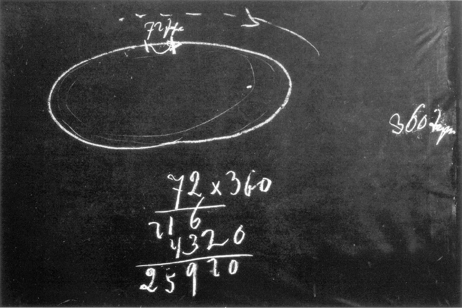
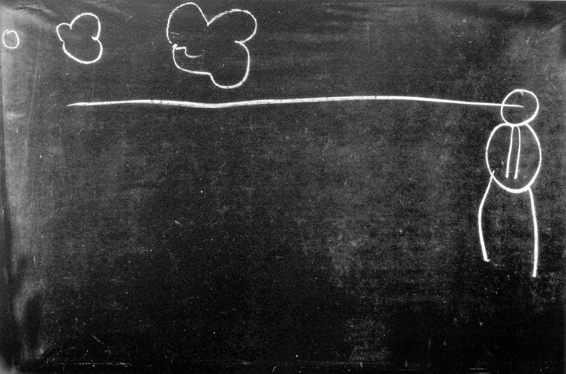

[ 1 ] ^r7l37k

Wir haben nun die verschiedensten Dinge zusammengetragen, welche dazu führen können, eine Empfindung zu bekommen von dem Bau des Weltenalls in seinen Verhältnissen zum Menschen. Wir haben gesehen - und darauf muß ja immer wieder aufmerksam gemacht werden -, daß das Weltenall ohne den Menschen nicht begriffen werden kann; das heißt also, daß ein Begreifen des Weltenalls an sich, ohne daß man den Menschen dazurechnet und das Verhältnis des Weltenalls zum Menschen ins Auge faßt, nicht möglich ist. Wenn Sie sich, ich möchte sagen, in einer ganz populären Weise eine Vorstellung darüber bilden wollen, wie der Mensch zusammenhängt mit dem Weltenall, dann brauchen Sie ja nur an dasjenige zu denken, was Gegenstand der elementarsten Astronomie ist, nämlich die sogenannte Schiefe der Ekliptik, das heißt die schiefe Stellung der Erdachse gegenüber der Linie, der Kurve, die sich dutch den Tierkreis ziehen läßt. Diese Schiefe der Ekliptik, man mag sie auffassen, wie man will, man mag sie auch interpretieren, wie man will, bei solchen Interpretationen kommt es zunächst gar nicht darauf an, ob man mit dem, was man interpretiert, die Wirklichkeit trifft oder nicht, sondern darauf kommt es an, daß man sich dadurch etwas, sagen wit, nahebringen kann. Wenn auf der Ebene, die man durch die Tierkreis-Ekliptik legen kann, die Erdachse, das heißt diejenige Achse, um die man die täglichen Umdrehungen der Erde ausgeführt denken kann, senkrecht stünde, so wären über die ganze Erde hin fortwährend das ganze Jahr hindurch Nacht und Tag gleich. Läge die Erdachse in der Ekliptik drinnen, so wäre über die ganze Erde hin ein halbes Jahr Tag, ein halbes Jahr Nacht. Beide Extreme sind ja in einer gewissen Weise erfüllt am Äquator und an den Polen. Dazwischen aber liegen diejenigen Gebiete, welche verschieden lange Tage im Laufe des Jahres haben. Und Sie brauchen nur einmal ein wenig diese ganze Sache zu überdenken, so wird Ihnen sogleich beikommen, welche ungeheure Bedeutung für die ganze Kulturentwickelung der Erde diese Stellung der Erdachse im Weltenraume hat. Denken Sie nur einmal, daß wir ja alle Eskimos wären über die ganze Erde hin, wenn die Erdachse in der Ekliptik läge, und denken Sie sich einmal, daß die ganze Erde erfüllt sein müßte genau von derjenigen Kultur, die am Äquator ist, wenn die Erdachse senkrecht stehen würde auf der Ekliptik. ^tvaquf

[ 2 ] ^wdq14x

Zum Verständnis der Wirklichkeit kommt es natürlich darauf an, wie man sich etwas interpretiert. Aber um sich nahezubringen, welch ein Zusammenhang zwischen dem Menschen, seiner Kultur und Zivilisation und dem Bau des Weltenalls ist, genügt ja jede Interpretation, und es zwingt einfach die Tatsache, mag sie nun welche immer sein, die hinter dieser Interpretation steht, diese Tatsache zwingt dazu, den Menschen und die Erde als etwas Einheitliches aufzufassen — nicht den Menschen, insofern er ein physisches Wesen ist, als etwas aufzufassen, was man nur für sich ansehen könne. Das kann man eben nicht. Der Mensch ist als physisches Wesen nicht eine Wirklichkeit für sich, sondern er ist ein physisches Wesen mit der ganzen Erde zusammen. Ebensowenig wie Sie eine Hand, die Sie abtrennen vom menschlichen Organismus, als irgend etwas Reales ansehen können - sie stirbt ab, sie ist nur denkbar im Zusammenhange mit dem Organismus -, ebensowenig wie Sie eine Rose, die gepflückt ist, als etwas Reales ansehen können - sie stirbt ab, sie ist nur denkbar im Verein mit dem ganzen in der Erde wurzelnden Rosenstock -, ebensowenig kann man auch den Menschen, wenn man ihn in seiner Ganzheit, Totalität beurteilen will, als bloß in den Grenzen seiner Haut eingeschlossen betrachten. ^v2w0bj

[ 3 ] ^7t92ks

Man muß also dasjenige, was der Mensch auf der Erde erlebt, so im Zusammenhange betrachten mit der Erdachse, wie man in anderer Hinsicht eine gewisse Art von Intelligenz schon im Zusammenhange betrachtet mit dem Gesichtskreis oder dem Gesichtswinkel des Menschen. Darauf kommt es ja an bei einer Weltanschauung, die auf Wirklichkeit ausgeht, daß nicht dasjenige, was nur Teilwirklichkeit ist, als eine volle Wirklichkeit aufgefaßt werde. Und man kommt gerade dazu, jene Totalität, die der Mensch als GeistSeelen-Wesen ist, in ihrer Wirklichkeit zu erfassen, wenn man den Menschen als physisches Wesen nicht als in sich abgeschlossene Wirklichkeit betrachtet. Als Geist-Seelen-Wesen ist der Mensch eine Wirklichkeit, eine in sich abgeschlossene Wirklichkeit, eine wirkliche Individualität. Dasjenige aber, was er bewohnt zwischen Geburt und Tod - der physische und der Ätherleib -, das sind für sich keine Realitäten, das sind Glieder des Erdenganzen und, wie wir gleich sehen werden, sogar noch eines anderen Ganzen. ^buli7e

[ 4 ] ^unrno7

Sehen Sie, damit kommen wir dann auf etwas, was noch in genauerem Sinne beachtet werden muß. Ich muß immer wiederum auf eines hinweisen: Die Vorstellungen, die man sich über den Menschen macht, sie gehen, ich möchte sagen, unbewußt fast immer darauf hin, wenigstens nahezu, den Menschen als eine Art festen Körper zu betrachten. Gewiß, man ist sich ja bewußt, daß der Mensch nicht gerade ein harter Körper ist, daß er gewissermaßen ein bildsamer Körper ist; aber man wird sich gewöhnlich nicht bewußt, daß der Mensch ja bis zu mehr als 75 Prozent aus Flüssigkeit besteht und nur zu dem Reste eigentlich als ein Wesen, das MineralischFestes in sich enthält, aufgefaßt werden darf. Der Mensch ist zu 75 Prozent eigentlich ein Wasserwesen. Nun, geht es denn an, frage ich Sie, diesen menschlichen Organismus so zu schildern, wie man das gewöhnlich tut; in scharf konturierten Bildern zu sagen: da hat man diesen Lappen des Gehirns, da hat man das Organ und so weiter, und dann so zu tun, als ob diese fest umrissenen Organe in ihrer Betätigung zusammen bewirkten, was als die Betätigung des ganzen menschlichen Organismus zustande kommt? Das hat ja im Grunde genommen eigentlich gar keinen Sinn. Es handelt sich doch darum, daß wir auch ins Auge fassen, daß der Mensch innerhalb der Grenzen seiner Haut so etwas ist wie ein wogendes Wasser, daß also auch dasjenige eine Bedeutung hat, was bloß innerlich wogende Flüssigkeit ist, daß wir also nicht so schildern sollten, als ob der Mensch mehr oder weniger doch ein fester Körper wäre. Das hat geisteswissenschaftlich betrachtet eine ganz tiefe Bedeutung. Denn gerade wenn wir auf das Feste sehen, das mit dem äußerlichen Mineralischen in einer gewissen Weise zusammenhängt, so hat dieses Feste im menschlichen Organismus eine gewisse Beziehung zur Erde. Wir haben die verschiedensten Beziehungen des Menschen zur Umwelt konstatiert; wir wollen jetzt dasjenige konstatieren, was Beziehung seines Festen zur Erde ist. Diese Beziehung ist da. Aber was wässeriges Element im Menschen ist, das hat zunächst keine Beziehung des Menschen zur Erde, sondern das hat Beziehung des Menschen zum außerirdischen planetarischen Weltenall, vorzugsweise aber zum Monde. Geradeso wie der Mond, wenn auch nicht direkte, so indirekte Beziehungen hat zu dem Entstehen von Ebbe und Flut, also zu gewissen Konfigurationen des flüssigen Teiles der Erde, so hat der Mond auch seine Beziehungen zu dem, was im flüssigen Teile des menschlichen Organismus vor sich geht. Und wenn ich Ihnen gestern geschildert habe, daß wir auf der einen Seite eine gewisse Astronomie haben, die da gilt für die Sonne - sie gilt auch für die Erde -, so sind wir selbst in diese Astronomie als Organismus, der Festes in sich schließt, eingegliedert. Aber die Mondenastronomie ist eine andere. Und in diese Mondenastronomie sind wir so eingegliedert, daß sie mit dem flüssigen Bestandteil unseres Organismus zu tun hat. Sie sehen also, in unseren physisch-festen und in unseren physisch-flüssigen Leib wirken hinein die Kräfte des Kosmos. ^w479ry

[ 5 ] ^s7npon

Das hat aber noch eine viel größere Bedeutung, die darinnen besteht, daß zunächst auf unseren festen Menschen unmittelbar dasjenige einen Einfluß hat, was wir unser Ich nennen, daß aber auf unseren flüssigen Menschen einen unmittelbaren — unmittelbaren, sage ich - Einfluß hat dasjenige, was wir unsern Astralleib nennen, so daß also auch dasjenige, was vom Seelisch-Geistigen auf unsere Organisation wirkt, durch unsere Leiblichkeit in Beziehung kommt zu all dem, was die Kräfte und die Bewegungen des Kosmos sind. Diese Bewegungen des Kosmos sind von den verschiedensten Weltanschauungsgesichtspunkten aus immer Gegenstand der Beobachtung gewesen. Wenn wir hinschauen auf die persische, die urpersische Kultur - da gab es schon Untersuchungen über die Bewegungen im Weltenall; es gab solche bei den Chaldäern, es gab auch solche bei den Ägyptern. Und es ist nicht uninteressant, gerade einmal - ich habe schon dergleichen erwähnt bei Betrachtungen, die mit diesen zusammenhängen - hinzusehen auf die Art, wie sich die Ägypter zu den Bewegungen des Weltenalls verhalten haben. Die Ägypter haben ja namentlich Veranlassung gehabt, aus zunächst scheinbar ganz materiellen Gründen, den Zusammenhang der Erde mit dem außerirdischen Kosmos zu studieren. Denn ihr Land hing ab von den Überschwemmungen des Nil, und die traten ein, wenn die Sonne eine bestimmte Lage im Weltenall hatte. Und diese Lage der Sonne konnte nach der Sirius-Stellung bestimmt werden, so daß die Ägypter schon dazu gekommen waren, über die Stellung der Sonne zu den Sternen, die wit heute Fixsterne nennen, sich Vorstellungen zu machen. Namentlich. waren in ägyptischen Priesterkolonien, in ägyptischen Priestermysterien ausgedehnte Untersuchungen betrieben worden über das Verhältnis der Sonne zu den anderen Sternen, zu den Sternen, die wir heute die fixen Sterne nennen. Das habe ich eben schon erwähnt, daß die Ägypter schon genau wußten, daß die Sonne mit jedem Jahre gegenüber den anderen Sternen am Himmel verschoben erscheint. So daß, wenn die Ägypter damit rechneten, daß die Sterne — ob scheinbar oder wirklich, ist uns gleichgültig - am Himmel herumgehen, so merkten sie, daß das Herumgehen der Sterne in Tagen eine gewisse Geschwindigkeit hat, das Herumgehen der Sonne auch eine gewisse Geschwindigkeit hat, aber keine ganz so große, wie das für die übrigen Sterne der Fall war. Die Sonne bleibt immer etwas zurück. Die Ägypter wußten und verzeichneten das, daß die Sonne in 72 Jahren um einen Tag zurückbleibt, daß also, wenn ein bestimmter Stern, mit dem zugleich die Sonne in einem bestimmten Jahre aufgegangen ist, nach 72 Jahren wiederum aufgeht, die Sonne mit ihm nicht zugleich aufgeht, sondern daß sie dann erst 24 Stunden später aufgeht. Der Stern, der der Fixsternwelt angehört, der ist in 72 Jahren der Sonne um einen Tag, um einen vollen Tag vorausgeeilt. Das ist der Weg, den die Sterne machen und den die Sonne macht (Tafel 24, oben). Aber die Sonne bleibt in 72 Jahren um einen Tag zurück. Wenn ich mit 360 multipliziere, so bekomme ich 25 920 Jahre. Das ist die Zahl, die uns öfter begegnet ist. Es ist die Zeit, welche die Sonne braucht, um dutch ihr Zurückbleiben dahin zu kommen, daß sie wiederum zum Ausgangspunkt kommt, daß sie also um den ganzen Tierkreis herumgegangen ist. Sie ist also in 72 Jahren gerade um einen Grad zurückgeblieben, denn ein Kreis hat ja, wie Sie wissen, 360 Grade. Nach diesen teilten die Ägypter das große Jahr, das eigentlich 25 920 Jahre umfaßt, in 360 Tage. Aber ein solcher Tag ist 72 Jahre lang, und 72 Jahre, was ist denn das? Das ist im Durchschnitt auch die höchste Lebensdauer des Menschen. Gewiß werden einzelne älter, andere nicht so alt, aber es ist eine obere Grenze für das menschliche Leben. So daß man also sagen kann, dieser ganze Zusammenhang ist im Weltenall daraufhin konstruiert, daß er ein Menschenleben erhält durch einen Sonnentag hindurch, der 72 Jahre lang ist. Allerdings, der Mensch ist davon emanzipiert. Er kann immer geboren werden. Er ist davon emanzipiert, zu gewissen Zeiten geboren zu werden, aber sein Leben hier als physischer Mensch zwischen Geburt und Tod richtet sich nach diesem Sonnentag ein. Wenn man nun in der Geschichte nachliest, so wird man meistens finden, daß die Ägypter auch das gewöhnliche Jahr zu 360 Tagen angenommen haben, nicht zu 365% Tagen, wie es wirklich ist, bis später die Sache mit dem Gang der Sterne so wenig gestimmt hat, daß man die anderen fünf Tage eingeschoben hat. Aber wodurch ist es denn gekommen, daß die Ägypter ursprünglich das Jahr zu 360 Tagen angenommen haben? Da ist schon ein merkwürdiges Mißverständnis entstanden. Es ist das Mißverständnis entstanden, daß die Priester von einem großen Weltenjahr gesprochen haben. Für dieses Weltenjahr ist wirklich ein Grad, das heißt, der 360. Teil, ein Weltentag von 72 Jahren. So daß also in den ägyptischen Priestermysterien gelehrt worden ist: der Mensch hängt mit dem Kosmos so zusammen, daß seine Lebensdauer ein Tag des Weltenjahres ist. Da wurde der Mensch angegliedert an den Kosmos; es wurde ihm seine Beziehung zum Kosmos klargemacht. ^2trdmr

 ^pcrshi

[ 6 ] ^ngi8xr

Aber dutch Verhältnisse, die in der Dekadenz der ganzen Entwickelung des ägyptischen Volkes liegen, wurde den breiten Massen des ägyptischen Volkes - und das ist dort am charakteristischsten zutage getreten — nicht mitgeteilt dasjenige, was Wesenheit des Menschen ist, was Zusammenhang des Menschen mit dem Kosmos ist. Man sagte sich: Wissen einmal alle Menschen, daß sie eine Wesenheit sind, die so eingegliedert ist in den ganzen Kosmos, daß ihre eigene Lebensdauer ein Glied ist in der Lebensdauer eines Sonnenumganges, dann werden diese Menschen, die sich fühlen als in das Weltenall eingegliedert, sich nicht regieren lassen, dann betrachtet sich jeder als ein Glied des Weltenalls. - Es sollten nur diejenigen wissen, daß es so ist, die man zum Führen berufen glaubte. Die anderen Menschen, die sollten nicht ein solches Weltenwissen, sondern ein Tageswissen haben. Das hängt zusammen mit der ganzen Dekadenz der ägyptischen Kulturentwickelung. Und was in bezug auf viele andere Dinge allerdings notwendig war, die unreife Menschheit in gewisse Mysterien nicht einzuweihen, das wurde ausgedehnt gerade von der ägyptischen Kultur auf solche Dinge, die den Führenden, den Regierenden Macht gaben. ^qbh832

[ 7 ] ^kaz96d

Nun ist vieles von dem, was heute unsere Menschenseele durchdringt, aus orientalischen Quellen gekommen. Und auch das traditionelle Christentum enthält viel, was von orientalischen Quellen stammt. Aber ein starker Einschlag ist gerade in das römische Christentum von dem Ägyptertum hergekommen. So wie das ägyptische Volk unaufgeklärt hat bleiben sollen über seinen Zusammenhang mit dem Kosmos, so herrscht in gewissen Kreisen gerade des Romanismus die Anschauung: das Volk muß unaufgeklärt bleiben über seine Beziehung zum Kosmos, wie sie durch das Mysterium von Golgatha eingetreten ist. - Und deshalb jener heftige Kampf, wenn aus einer Kultur- und inneren Notwendigkeit heraus darauf aufmerksam gemacht wird, daß das Ereignis von Golgatha nicht bloß irgend etwas ist, was außer Zusammenhang gedacht werden müßte mit der übrigen Weltanschauung, sondern daß dieses Ereignis von Golgatha sachgemäß in die übrige Weltanschauung hineingestellt werden muß; wenn darauf aufmerksam gemacht wird, daß wirklich dasjenige, was zu Golgatha geschehen ist, mit dem ganzen Weltenall und seiner Konstitution etwas zu tun hat. Es wird daher als die ärgste Ketzerei aufgefaßt, wenn der Christus in dem Sinne, wie wir es getan haben, als der Sonnengeist bezeichnet wird. ^8svihw

[ 8 ] ^xklomp

Man soll nur nicht glauben, daß dasjenige, um was es sich dabei handelt, gewissen, in erster Linie führenden Leuten nicht bekannt sei, die da bekämpfen dasjenige, was ich jetzt angedeutet habe. Es ist ihnen selbstverständlich gut bekannt. Aber geradeso wie die ägyptischen Priester genau gewußt haben, daß das gewöhnliche Jahr nicht 360 Tage, sondern 365% Tage hat, so wissen gewisse Leute sehr gut, daß es sich bei dem Christus-Geheimnis zugleich um das Sonnenmysterium handelt. Aber es soll verhindert werden, daß dieses der gegenwärtigen Menschheit notwendige Wissen wirklich der gegenwärtigen Menschheit mitgeteilt werde. Denn es ist schon einmal wahr, was ich gestern sagte: Die materialistische Weltanschauung ist jener Seite viel lieber als die Geisteswissenschaft. Denn die materialistische Weltanschauung, sie hat ja auch ihre praktischen Folgen. Sie hat praktische Folgen, die, ich möchte sagen, wiederum an einem Vergleich der gegenwärtigen Zeit mit dem alten Ägyptertum studiert werden können. Ich machte darauf aufmerksam, die Ägypter als solche waren abhängig von dem Gang der Sonne, also von dem Zusammenhang des Irdischen mit dem Himmlischen mit Bezug auf ihre äußere Kultur. Es bedeutete eine gewisse Macht in den Händen des untergehenden ägyptischen Priestertums, wenn das Wissen von dem Zusammenhange der Weltenerscheinungen und ihrer Wirkung auf die ägyptische Landkultur geheimgehalten blieb. Dadurch war derjenige, welcher als Arbeiter wirken sollte in Ägypten, angewiesen darauf, seine Direktiven sich geben zu lassen von den Priestern, die das entsprechende Wissen hatten. ^3kiq9w

[ 9 ] ^zwx752

Wenn nun der Charakter europäischer und amerikanischer Zivilisation so bleiben würde, wie er ist, wenn man beibehalten würde nur die materialistische kopernikanische Weltanschauung mit ihrem Sprößling, der Kant-Laplaceschen Theorie, dann würde notwendigerweise auch für die irdischen Erscheinungen, die biologischen, die physikalischen, die chemischen Erscheinungen ein materialistisches Weltenbild entstehen müssen. Dieses materialistische Weltenbild hat keine Möglichkeit, die moralische Weltordnung in ihre Struktur einzubeziehen. Sie hat auch keine Möglichkeit, das Christus-Ereignis in ihre Struktur einzubeziehen; denn daß man zu gleicher Zeit Bekenner der maternalistischen Weltanschauung und zu gleicher Zeit Christ ist, das ist eine innerliche Lüge, das ist etwas, was nicht sein kann, wenn man ehrlich und aufrichtig ist. Daher mußten sich in der europäischen und amerikanischen Kultur ganz notwendigerweise die praktischen Folgen zeigen dieses Zwiespaltes zwischen dem Materialismus auf der einen Seite und dem ohne Zusammenhang mit dem materialistischen Weltenbild stehenden moralischen Weltenbilde und auch den Glaubensinhalten. Und diese Konsequenz zeigte sich darin, daß die Menschen, die nicht durch äußere Gründe Veranlassung hatten, innerlich unehrlich zu sein, daß diese den Glauben über Bord warfen und das materialistische Weltenbild auch für das Menschenleben statuierten. Dadurch wurde das materialistische Weltenbild soziales Weltenbild. Das aber würde sich im weiteten Verfolge unserer europäischen und amerikanischen Kultur so ergeben, daß eben die Menschen nur ein materialistisches Weltenbild haben würden, nichts wissen würden von einem Zusammenhang der Erde mit den Weltenmächten, so wie wir es gestern und in diesen Stunden schon öfter betrachtet haben. Aber einer gewissen Priesterkaste würde bleiben das Wissen von dem Zusammenhang mit dem Weltenbilde, geradeso wie den ägyptischen Priestern das Wissen von dem platonischen Jahr, dem großen Weltenjahr und dem großen Weltentag geblieben ist. Und Hoffnung könnte diese Priesterkaste haben, das Volk, welches unter dem Materialismus barbarisch verkommt, dann zu beherrschen. ^kgv624

[ 10 ] ^5d9uul

Es ist natürlich, daß solche Dinge heute nur gesagt werden aus einem Pflichtgefühl gegenüber der Wahrheit; aber sie müssen aus dem Pflichtgefühl gegenüber der Wahrheit durchaus gesagt werden. Es handelt sich heute schon darum, meine lieben Freunde, daß eine Anzahl von Menschen erfahre, daß es nötig ist, dem Mysterium von Golgatha seine kosmologische Bedeutung zu geben. Diese kosmologische Bedeutung muß von einer Anzahl von Menschen eingesehen werden, die dann ihrerseits eine gewisse Verantwortung dafür übernehmen, daß der Menschheit der Erde nicht verborgen bleibt die Tatsache, daß sie zusammenhängt mit einem außerirdischen Geist, der in dem Menschen Jesus im Beginn unserer Zeitrechnung in Palästina gewandelt hat. Es ist notwendig, daß diese Erkenntnis von dem Hereindringen des Christus aus außerirdischen Welten in den Menschen Jesus von Nazareth von einer Anzahl von Menschen durchschaut werde. Es gehört heute zu einem solchen Durchschauen ja tatsächlich ein Überwinden jener Unehrlichkeit, die heute in Weltanschauungs- und Bekenntnisfragen eigentlich gang und gäbe ist. Denn was tut man heute? Man läßt sich auf der einen Seite erzählen, die Erde bewegt sich in einer Ellipse um die Sonne und hat sich entwickelt im Sinne der Kant-Laplaceschen Theorie, und unterschreibt dieses; und dann läßt man sich erzählen, im Beginne unserer Zeitrechnung habe in Palästina das und das stattgefunden. Man nimmt diese beiden Dinge, ohne sie miteinander in Beziehung zu bringen, man nimmt sie hin, und man denkt, das sei ohne Folge. Es ist nicht ohne Folge, denn wenn die Lüge bewußt aufgefaßt wird, dann ist es weniger schlimm, als wenn die Lüge unbewußt figuriert und den Menschen herunterbringt, ihn barbarisiert. Denn wenn Sie die Lüge betrachten, wie sie im Bewußtsein ist, so geht sie mit dem Bewußtsein jedesmal beim Einschlafen aus dem physischen und Ätherleib heraus, ist vorhanden im raumlosen, zeitlosen Sein, in dem ewigen Sein, wenn der Mensch im traumlosen Schlafe ist. Da wird vorbereitet alles dasjenige, was aus der Lüge werden kann in der Zukunft, das heißt, es wird vorbereitet alles dasjenige, was die Lüge wieder verbessern kann, wenn die Lüge im Bewußtsein sitzt. Wenn die Lüge aber im Unbewußten ist, dann bleibt sie im Bette liegen mit dem physischen und dem Ätherleib. Da gehört sie, während der Mensch nicht seinen physischen und seinen Ätherleib ausfüllt, dem Kosmos, nicht bloß dem irdischen Kosmos, sondern dem ganzen Kosmos an. Da arbeitet sie an der Zerstörung des Kosmos, vor allen Dingen an der Zerstörung der ganzen Menschheit, denn da beginnt die Zerstörung in der Menschheit selber. ^ic28ak

[ 11 ] ^8fv3o4

Dem, was da der Menschheit droht, entgeht man durch nichts anderes als durch das Anstreben innerer Wahrheit in bezug auf solche höchsten Fragen des Daseins. Es ist also gewissermaßen heute eine Art Aufforderung aus unseren Zeitimpulsen heraus an die Menschheit, einzusehen, daß nicht weiter eine Astronomie materialistischer Art existieren darf, die nichts weiß davon, daß in einem bestimmten Zeitpunkte das Ereignis von Golgatha sich bildet. Aber jede Astronomie, welche einschließt in die Weltstruktur den Mond ebenso wie die Sonne und die Erde, statt die beiden in ihren Strömungen ineinanderlaufen zu lassen, so aber, daß sie gesonderte Strömungen sind, jede solche Astronomie ist nichts anderes als eine heidnische Astronomie, keine christliche Astronomie. Daher muß vom christlichen Standpunkte aus jede Evolutionslehre abgelehnt werden, die nur gewissermaßen einheitlich die Welt schildert. Verfolgen Sie meine «Geheimwissenschaft», so werden Sie sehen, wie, indem ich schildere Saturnzeit, Sonnenzeit, die Strömung sich teilt in zwei Strömungen, die dann ineinanderwirken. Da haben Sie die beiden Strömungen. Wenn man aber so schildert, wie gemeiniglich geschildert wird, dann schildert man mit den Begriffen, die durchaus im Sinne der heidnischen Fortentwickelung sind. Das geht bis in die Einzelheiten hinein. Denken Sie nur, wenn der heutige Evolutionstheoretiker so richtig darwinistischer Färbung schildert die Entwickelung der organischen Form, da sagt er: Erst waren einfache organische Formen, dann kamen kompliziertere, dann wiederum kompliziertere und so weiter bis herauf zum Menschen (Tafel 25, oben). — So ist es nicht, sondern, wenn Sie den Menschen nehmen, dreigliedern, so ist nur sein Haupt die Ausbildung der niederen Tierformen (Zeichnung, rechts). Was der Mensch als Haupt hat, das ist die Ausbildung der niederen Tierformen. Dasjenige, was an das Haupt angegliedert ist, das ist später entstanden. So daß wir nicht sagen dürfen, in unserem Rückenmark haben wir etwas, was sich zum Kopfe umbildet, sondern wir müssen sagen: Unser Haupt, unser Kopf ist ja gewiß aus früheren Gebilden entstanden, die Rückgrat-ähnlich waren; aber das heutige Rückgrat hat nichts zu tun mit dieser Entwickelung, sondern ist ein späterer Ansatz; und von einem anders geformten Rückgrat stammt dasjenige, was heute Kopforganisation ist. ^9vigyg

 ^771cyl

[ 12 ] ^r1e1f6

Das erwähne ich für diejenigen, die sich schon etwas mit Deszendenztheorie beschäftigt haben. Ich erwähne es deshalb, damit Sie sehen, daß eine gerade Linie von kosmischen Betrachtungen zu Betrachtungen dessen führt, was in der Menschheitsentwickelung ist, und damit Sie sehen, daß es notwendig ist, daß Geisteswissenschaft hineinleuchte in alle einzelnen Wissens- und Lebensgebiete; daß einfach die Sache nicht so fortgehen kann, wie sich die Wissenschaft in den letzten Jahrhunderten unter dem Einflusse der materialistischen Weltanschauung, die wiederum ein Kind der materialistischen Auffassung des Christentums ist, entwickelt hat. Verdankt wird der Materialismus dem Materialistisch-Werden der christlichen Weltanschauung. Die Lehre von dem kosmischen Christus muß wieder hergestellt werden gegen die Vermaterialisierung dieser Lehre. Das ist die allerwichtigste Aufgabe der Zeit. Und ehe man nicht einsehen wird, daß dies die allerwichtigste Aufgabe der Zeit ist, wird man auf keinem Gebiete klar sehen können. ^cdpd1q

[ 13 ] ^2hj03n

Ich habe Ihnen heute etwas anführen wollen, aus dem Sie, ich möchte sagen, intimer erkennen können, warum böswillige Gegner mit solcher Heftigkeit sich gegen dasjenige wenden, was aus einer inneren Notwendigkeit heraus vor die Welt heute hintreten muß. Und ich mußte diese ganze Betrachtung anknüpfen gewissermaßen an eine Art Kosmologie. Wir werden mit dieser Kosmologie am nächsten Freitag um acht Uhr hier fortfahren. ^qp1hsj