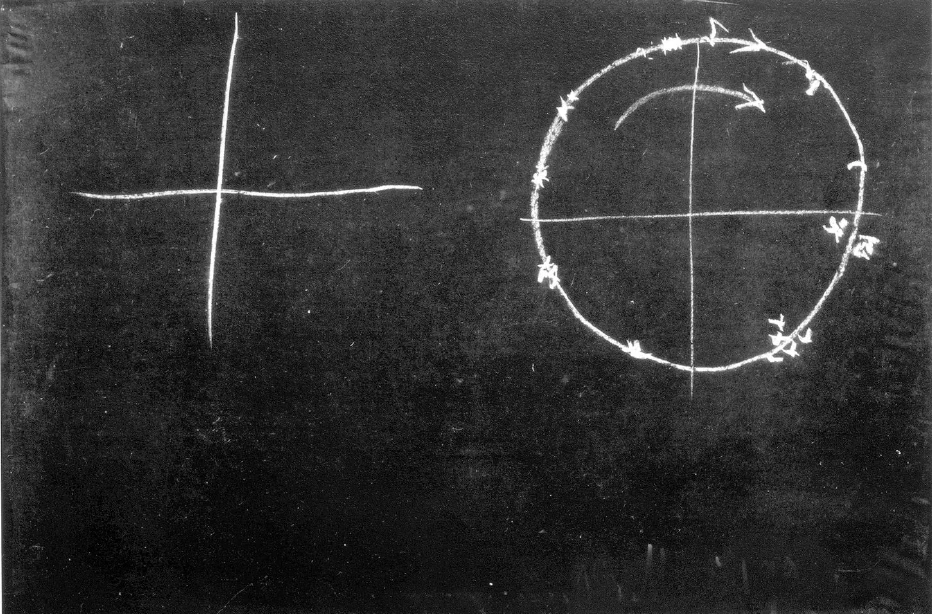
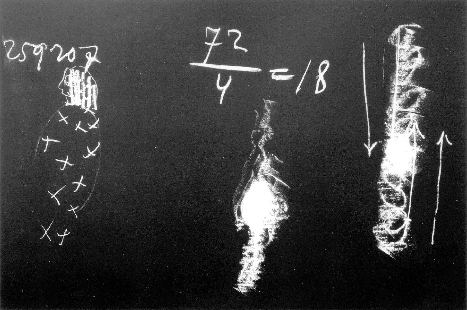

[ 1 ] ^xppa0d

Das Wesentliche dieser nächsten Betrachtungen soll sein zu erkennen, wie die beiden weltgeschichtlichen Strömungen, die heidnische und die christliche, für unser Leben zusammenkommen, wie sie ineinanderwirken, wie sie zusammenhängen mit dem Geschehen im ganzen Weltenall. Dazu, um dies nun etwas genauer zu durchdringen, ist allerdings heute noch eine Art von Vorbetrachtung nötig. Es handelt sich darum, daß wir möglichst exakt auseinanderhalten, wodurch sich unterscheiden müssen heidnische Weltanschauung im weitesten Sinne - die ja durchaus auch noch auf dem Grunde unserer Weltanschauung nicht nur ist, sondern sein muß und christliche Weltanschauung, die zum geringsten Teile eigentlich heute schon ihrer vollen Wirklichkeit nach in die menschlichen Gemüter übergegangen ist. Es handelt sich darum, daß wir eines, was ich ja öfter hier betont habe, genau ins Seelenauge fassen. Das ist, daß wir heute angekommen sind bei einem unvermittelten Nebeneinanderstehen desjenigen, was wir nennen können naturwissenschaftliches Weltbild und desjenigen, was wir nennen die moralische Weltordnung, zu der natürlich auch die religiöse Weltanschauung gehört. Mehr als er sich bewußt ist, sind für den gegenwärtigen Menschen naturwissenschaftliches Geschehen und moralisches Geschehen zwei voneinander ganz weit abliegende Dinge, die er im Grunde genommen gar nicht verbinden kann, wenn er wirklich vom Gesichtspunkt der heutigen Weltanschauung aus ganz ehrlich vor sich selbst dastehen will. Das ist es ja, warum ein großer Teil gerade der fortgeschrittenen Theologie des 19. und 20. Jahrhunderts im Grunde genommen gar keine Christologie hat. Ich habe schon darauf aufmerksam gemacht, daß es ja solche Bücher gibt, wie Adolf Harnacks «Wesen des Christentums», bei denen es gar keinen Grund gibt, warum darinnen überhaupt der Christus-Name genannt wird. Denn dasjenige, was als «Christus» auftritt, ist darinnen nichts anderes als genau die Gottheit, welche im Alten Testament als Jahve, als Jehova-Gottheit vorkommt. Es ist im Grunde genommen kein wirklicher Unterschied zwischen diesem Wesen, das zum Beispiel Harnack «Christus» nennt,und dem Jahve-Gott; ich meine, es ist kein Unterschied in dem, was über das Christus-Wesen gesagt wird und dem, was von den Bekennern der alttestamentlichen Weltanschauung über ihren Jehova gesagt wird. Und wenn wir gar die ChristusVorstellung vieler Gegenwartsmenschen nehmen und sie zusammenhalten mit dem, was diese Menschen sonst als Lebensauffassung haben, so ist gar kein Grund, daß diese Menschen eigentlich von Christus und Christentum sprechen. Denn wenn jemand von Christus und Christentum spricht und zum Beispiel das nationale Wesen so auffaßt, wie viele Menschen der Gegenwart, so ist das ein völliger Widerspruch. Diese Dinge fallen dem Gegenwartsmenschen nur aus dem Grunde nicht auf, weil er es vermeidet, in mutiger Art eine Konsequenz zu ziehen aus dem, was ihm eigentlich heute vorliegt. Aber der tiefste Spalt, die tiefste Kluft ist vorhanden zwischen der naturwissenschaftlichen Anschauung der Dinge und der christlichen Anschauung der Dinge. Und es ist die wichtigste Aufgabe unserer Zeit, eine Brücke zu bauen über die Kluft. Naturwissenschaftliche Weltanschauung, so wie sie heute, ich möchte sagen, der Bauer hat - er weiß es nur nicht, aber er hat sie -, ist so eigentlich erst ein Kind des 19. Jahrhunderts. Und es ist auch ganz gut, nicht immer bloß die Dinge abstrakt zu charakterisieren, sondern auch da ein wenig in das Konkrete hineinzuschauen. ^hberh0

[ 2 ] ^gnbvy3

Ich habe Ihnen ja öfter einen Namen genannt, der einer hervorragenden Persönlichkeit des 19. Jahrhunderts angehörte und der uns sogleich dahin führt, die naturwissenschaftliche Weltanschauung so ganz exakt ins Auge zu fassen, möchte ich sagen; es ist der Name Julius Robert Mayer, mit dem wir - wenn auch mit Bezug auf Julius Robert Mayer das in vieler Beziehung mißverständlich ist — doch verknüpfen müssen die naturwissenschaftliche Weltanschauung des 19. Jahrhunderts. Sie wissen, in populärer Art wird ja immer gesagt, daß auf Julius Robert Mayer zurückgeht die Aufstellung des sogenannten Gesetzes von der Erhaltung der Kraft; genauer gesprochen, daß das Weltenall in sich schließt eine konstante Summe von Kräften, die nicht vermehrt und nicht vermindert werden können und die nur sich ineinander umwandeln. Wärme, mechanische Kraft, Elektrizität, chemische Kraft, sie wandeln sich ineinander um. Aber die Summe der im Weltenall vorhandenen Kraftmengen bleibt immer dieselbe. So denkt ja heute selbstverständlich jeder Physiker. Wenn auch die Menschen im populären Bewußtsein nicht aufmerksam werden auf dieses Gesetz von der Erhaltung der Kraft und der Energie, sie denken über die Naturerscheinungen so, wie man nur unter dem Einfluß dieses Gesetzes von der Erhaltung der Kraft denken kann. Ich meine, Sie sollten sich klarmachen, daß ja etwas im Handeln eines Wesens liegen kann, das einem gewissen Prinzip entspricht, ohne daß das Wesen imstande ist, sich dieses Prinzip klar zu machen. Wenn Sie einem Hunde zum Beispiel klarmachen wollten, daß eine doppelt so große Menge von Fleisch darauf beruht, daß die einfache Menge eben zweimal genommen worden ist, so würden Sie das nicht können. Der Hund würde das nicht bewußt in sich aufnehmen können, aber er wird praktisch nach diesem Prinzip doch handeln. Wenn er die Wahl hat, ein kleines oder ein doppelt so großes Stück Fleisch zu schnappen, so wird er in der Regel, wenn sonst die Bedingungen die gleichen sind, nach dem doppelt so großen schnappen. Jedenfalls kann man unter dem Einflusse eines Prinzipes stehen, ohne sich dieses Prinzip in seiner abstrakten Form als solches zu explizieren. So kann man sagen: Gewiß, die meisten Menschen denken nicht an das Gesetz von der Erhaltung der Kraft, aber sie stellen sich die ganze Natur so vor, weil in der Schule gelehrt wird, daß das Gesetz von der Erhaltung der Kraft bestehe. Es ist nun interessant, hinzusehen, wie die Denkungsweise Julius Robert Mayers sich äußerte, wenn es darauf ankam, anderen gegenüber, die noch nicht so dachten wie er, diese Denkungsweise scharf hinzustellen. ^8verwv

[ 3 ] ^ez955w

Julius Robert Mayer hatte einen Freund, der in einer Art Memoiren verschiedene Gespräche aufgezeichnet hat, die er mit Julius Robert Mayer geführt hat. Da erzählt er ganz interessante Tatsachen; Tatsachen, durch die man gründlich hinschauen kann auf die Denkweise des Naturdenkens des 19. Jahrhunderts. Vor allen Dingen, um etwas äußerlich zu charakterisieren, möchte ich das Folgende erwähnen: Julius Robert Mayer war so drinnen in der ganzen Vorstellungsart, die ihn zu dieser Vorstellung, zu diesem Erhalten von der Kraft, zu diesem bloßen Umwandeln einer Kraft in die andere führte, daß er in der Regel, wenn er einem Freund auf der Straße begegnete, gar nicht anders konnte, als schon von weitem ihm zuzurufen: Aus nichts wird nichts! — Das ist ja das Wort, das auch an der Spitze der Urabhandlung 1842 von Julius Robert Mayer immer wiederkehrt: Aus nichts wird nichts. Es kam auch vor, daß Julius Robert Mayer diesen Freund besuchte — Rümelin hieß er -, anklopfte, die Türe aufmachte und rief: «Aus nichts wird nichts!» Das war die Anrede, bevor ein Gruß erfolgte. So gründlich war Julius Robert Mayer in diesem «Aus nichts wird nichts» drinnen. ^i2zno4

[ 4 ] ^w9on88

Nun erzählt Rümelin von einem einmal stattgehabten sehr interessanten Gespräch, in dem, da der Rümelin noch nicht viel wußte von diesem Gesetz der Erhaltung der Kraft, auseinandergesetzt werden sollte, worinnen es eigentlich besteht. Da sagte Julius Robert Mayer zu Rümelin: Wenn zwei Pferde eine Kutsche ziehen - und Julius Robert Mayer war ja Heilbronner, sein Denkmal steht auch in Heilbronn -, wenn zwei Pferde eine Kutsche ziehen, und sie fahren weiter, was ist der Effekt? - Da sagte Rümelin: Nun ja, der Effekt ist, daß die in der Kutsche Sitzenden meinetwegen bis Öhringen kommen. — Aber wenn sie wieder umkehren und zurückfahren, ohne daß sie dort in Öhringen irgend etwas getan haben, so daß sie wieder in Heilbronn ankommen? - Da sagte Rümelin: Das ist zwar dann so, daß zufällig der eine Weg den anderen aufgehoben hat und dadurch scheinbar kein Effekt da ist, aber es ist doch der wirkliche Effekt der, daß die Leute, die Menschen von Heilbronn nach Öhringen gefahren und von Öhringen wiederum nach Heilbronn zurückgekehrt sind. - Nein, sagte Julius Robert Mayer, das ist nur ein Nebenerfolg, das hat gar nichts zu tun mit dem, was eigentlich geschehen ist. Dasjenige, was geschehen ist durch die Aufwendung der Kraft von seiten der Pferde, das ist etwas ganz anderes. Das ist, daß durch diese von den Pferden aufgewendete Kraft erstens die Pferde selbst heißer geworden sind, die Pferde sind wärmer geworden; zweitens, die Wagenachsen sind wärmer geworden, um die sich die Räder herumbewegen; drittens, wenn wir abmessen würden mit einem feinen Thermometer die Rillen auf dem Erdboden, über die die Räder gefahren sind, so würden wir finden, daß da in den Rillen die Wärme etwas höher ist als auf beiden Seiten. Das ist der wirkliche Effekt. Es sind auch in den Pferden Stoffe verbrannt durch den Stoffwechsel. Das alles ist der wirkliche Effekt. Das andere, daß die Leute von Heilbronn nach Öhringen und wieder zurück gefahren sind, das ist alles Motiv, Nebeneffekt, aber nicht dasjenige, was wirkliches physikalisches Geschehen ist. Wirkliches physikalisches Geschehen ist die aufgewendete Kraft der Pferde; die Umwandelung in die erhöhte Wärme der Pferde; die erhöhte Wärme der Wagenachsen; in dem Verbrauch der Wagenschmiere durch die Wärme, der eintritt, wenn man die Räder schmiert; die Erwärmung der Rillen auf der Straße und so weiter. Und wenn man mißt — Julius Robert Mayer hat ja dann gemessen und hat die entsprechende Maßzahl angegeben -, wenn man mißt, so ist alle die Kraft, welche die Pferde angewendet haben, restlos übergegangen in diese Wärme. Das andere ist alles Nebeneffekt. ^an4a8d

[ 5 ] ^ekmgdc

Sie sehen, das hat natürlich eine gewisse Wirkung für unsere Anschauung. Da kommt zuletzt doch das heraus, daß man sagen muß: Ja, man muß nun reinlich das Naturgeschehen loslösen von alledem, was Nebeneffekt ist im Sinne des streng naturwissenschaftlichen Denkers. Denn dieser Nebeneffekt, der hat ja mit naturwissenschaftlichem Denken im Sinne des 19. Jahrhunderts eigentlich gar nichts zu tun. Der springt gewissermaßen über das naturwissenschaftliche Geschehen so hin. Wenn wir aber wieder fragen: Worin äußert sich denn all das, was wir moralische Weltordnung nennen? Worin äußert sich denn all das, was wir Menschenwert und Menschenwürde nennen? - Doch wahrhaftig nicht darinnen, daß sich die aufgewendete Kraft der Pferde in die erhöhte Wärme der Wagenachsen unnwandelt, sondern da ist der Nebeneffekt die Hauptsache! Aber bedenken Sie doch, daß bei alledem, was als naturwissenschaftliche Betrachtung angestellt wird, dieser Nebeneffekt ganz ausgelassen wird. Die Menschen des 19. Jahrhunderts und schon Kant im 18. Jahrhundert, sie haben Anschauungen gebildet über das Werden des Weltenalls bloß aus denjenigen Prinzipien heraus, die Julius Robert Mayer scharf begrenzt, indem er alles dasjenige, was wirklich bloß der Natur angehört, absondert von dem, was Nebeneffekt ist. ^yf1yv6

[ 6 ] ^qe2oxq

Wenn wir einmal die Sache ordentlich ins Auge fassen, dann müssen wir ja sagen, dann muß aus denjenigen Prinzipien heraus, die so als Naturprinzipien erkannt werden, das Weltenall konstruiert werden. Und alles dasjenige, was zum Beispiel durch das Christentum geschehen ist, ist ein Nebeneffekt, genau ebenso ein Nebeneffekt, wie es ein Nebeneffekt ist, daß die Menschen mit der Kutsche von Heilbronn bis Öhringen fahren. Es kommt gar nicht in Betracht für die naturwissenschaftliche Anschauung, was die Leute da zu tun haben. Aber wiederum, kreuzen sich nicht in irgendeiner Weise doch die beiden Strömungen? ^ljgkh2

[ 7 ] ^wpu3q8

Nehmen wir nun einmal an, Rümelin hätte sich nicht gleich beruhigt, sondern hätte etwa folgenden Einwand gemacht - ich weiß, für den Physiker der Gegenwart ist das kein gültiger Einwand, aber für den Aufbau einer Gesamtweltanschauung ist es doch ein gültiger Einwand -, nehmen wir an, es würde folgendes gesagt: Wenn das Motiv bei den Leuten, die von Heilbronn nach Öhringen gefahren sind, nicht dagewesen wäre, so würden ja die Pferde ihre Kraftaufwendungen nicht gemacht haben; die ganze Umwandelung in Wärme würde nicht geschehen sein, oder sie würde an einem ganz anderen Orte in ganz anderem Zusammenhange geschehen sein. Also dasjenige, was geschieht, muß naturwissenschaftlich so betrachtet werden, daß es sich nur auf das erstreckt, was gar nicht bis zum letzten Grund, warum es geschehen ist, führt. Es wäre ja nicht geschehen, wenn die Leute nicht geglaubt hätten, sie hätten in Öhringen etwas zu tun. Es greift also dasjenige, was die Naturwissenschaft als einen Nebeneffekt ansehen muß, doch in das Naturgeschehen hinein. Oder nehmen wit an, die Leute hätten in Öhringen zu einer ganz bestimmten Stunde etwas zu tun gehabt. Die Wagenachsen wären nicht nur heiß geworden, sondern es wäre eine zerbrochen, so hätten sie nicht weiterfahren können. Dann wäre dieses, was da geschehen ist, das Zerbrechen der Wagenachse, selbstverständlich durchaus naturwissenschaftlich erklärbar. Aber was nun durch dieses Naturereignis geschehen ist, daß da irgend etwas nicht vollzogen werden konnte, was hätte vollzogen werden sollen, das hat unter Umständen — man kann sich das leicht vorstellen - wiederum ganz ungeheuer weite Folgen, sogar für andere Naturprozesse, die dann eingeleitet werden infolge dieser Folgen. ^2u6bdh

[ 8 ] ^lfpvzk

Sie sehen also, da treten, auch wenn man bloß auf logischem Boden stehen bleibt, doch ganz bedeutsame, schwerwiegende Fragen auf. Und diese Fragen, die da auftreten, das muß schon gesagt werden, sie können von der Weltanschauung, zu der heute aus den Voraussetzungen unserer Bildung heraus sich ein Mensch ehrlich bekennen kann, ohne Geisteswissenschaft nicht beantwortet werden. Sie können gar nicht beantwortet werden. Denn bevor die Richtung gegeben wurde zu diesem naturwissenschaftlichen Denken, die ja erst bei Julius Robert Mayer zu solcher Exaktheit geführt hat, war durchaus nicht jener scharfe Trennungsstrich da zwischen dem naturwissenschaftlichen Denken und dem moralischen Denken. Wenn Sie noch das 13. Jahrhundert, das 12. Jahrhundert nehmen, so klingen fortwährend ineinander diejenigen Dinge, die die Menschen über die moralische Ordnung zu sagen haben und die sie über die physische Ordnung zu sagen haben. Die Menschen lesen heute nur nicht mehr ordentlich. Aus den älteren Zeiten sind ja nicht viel Dinge vorhanden, die, ich möchte sagen, ganz unverfälscht auf unsere Tage gekommen sind. Aber selbst wenn Sie solche Schriften, welche die Nachzügler der alten Weltanschauungen sind, heute nehmen, so werden Sie darinnen allerlei entdecken, das Ihnen beweist, daß man in älteren Zeiten das Moralische ins Physische hineingetragen und das Physische bis zum Moralischen heraufgehoben hat. Lesen Sie nur einmal bei den, ich möchte sagen, schon ziemlich verfälschten, aber immerhin noch heute annähernd lesbaren Schriften des Basilius Valentinus, lesen Sie da über die Metalle, über die Planeten, lesen Sie über Heilmittel, Sie werden fast in jeder Zeile auf Eigenschaftswörter stoßen, die den Metallen beigelegt werden: gute, schlechte Metalle oder kluge Metalle und dergleichen, die Ihnen zeigen, daß selbst in dieses Gebiet etwas von moralischem Denken hineingetragen worden ist. Das kann heute selbstverständlich nicht sein. Denn nachdem die Abstraktion so weit gegangen ist, daß man das Naturgeschehen so heraussondert aus alledem, was Nebeneffekt ist, wie es Julius Robert Mayer getan hat, kann man selbstverständlich nicht sagen, es ist eine Güte der Pferdefüße, die sich bewegen, daß sie die Wagenschmiere verbrauchen durch die Wärme, die entwickelt wird infolge dieser Bewegung. Da ist es nicht möglich in diesem naturwissenschaftlichen Zusammenhang, irgendwelche moralische Kategorien hineinzutragen. Da stehen beide Gebiete, natürliches Gebiet und moralisches Gebiet, ganz radikal nebeneinander. Und wenn das Weltengeschehen so wäre, wie es vorgestellt wird von dieser Vorstellungsart, so könnte der Mensch in unserer Welt überhaupt nicht existieren. Der Mensch würde gar nicht da sein. Denn was ist denn der Grund für die gegenwärtige physische Gestalt des Menschen? ^6dp35w

[ 9 ] ^dlyne0

Indem ich hier von der physischen Gestalt des Menschen spreche, bitte ich Sie durchaus, das Wort «Gestalt» ernst zu nehmen. Die Naturdenker von heute nehmen das Wort «menschliche Gestalt» nicht ernst. Denn was tun sie? Sie tun zum Beispiel das Folgende. Sie zählen, wie es Huxley oder andere getan haben, die Knochen des Menschen, die Knochen der höheren Tiere, und aus dem, was sie da als Zahl bekommen, leiten sie her, daß der Mensch eben nur eine höherentwickelte Stufe der Tierheit ist. Oder sie zählen die Muskeln und so weiter. Wir haben immer darauf hinweisen müssen, daß das Wesentliche ja ist, daß die tierische Rückgratslinie im wesentlichen horizontal ist, die menschliche Rückgratslinie im wesentlichen vertikal ist (Tafel 26, links). Und wenn auch gewisse Tiere sich aufrichten, so ist das bei ihnen nicht das Wesentliche, sondern das Wesentliche ist die horizontale Rückgratslinie. Und davon hängt nun die ganze Gestaltung ab. Also, ich bitte Sie, völlig ernst zu nehmen, was ich mit dem Worte Gestalt ausdrücken will. ^w4b24t

 ^01po5v

[ 10 ] ^9q70rz

Diese Gestalt des Menschen, wo haben wir ihre Ursache, ihre, ich möchte sagen, zunächst physische Ursache auf geistige Art im Weltenall zu suchen? Nun, ich habe auf diesen Punkt schon hingewiesen in diesen Betrachtungen. Ich habe Sie darauf hingewiesen: Der Sternenhimmel, den wir hier schematisch so zeichnen wollen -— meinetwillen als Tierkreis mit seinen Sternbildern (Tafel 26, rechts) —, der bewegt sich - scheinbar oder wirklich, das ist uns jetzt gleichgültig — um die Erde herum; die Sonne auch. Die Sonne nimmt also denselben Weg. Aber wenn wir in Betracht ziehen, was man ja wissen kann, daß die Sonne ihren Frühjahrsaufgangspunkt jedes Jahr verschiebt, um ein kleines Stück gegenüber den Sternen zurückbleibt, so kommen wir zu einer außerordentlich wichtigen Tatsache. Es wird ja dieses ganze Rücken des Frühlingspunktes an den Sternbildern gesehen dadurch, daß das Sternbild, wenn man ein bestimmtes ins Auge faßt, im folgenden Jahre früher aufgeht als die Sonne, respektive früher untergeht. Das lehrt uns ja, daß die Sonne zurückbleibt. Und ich habe Sie darauf aufmerksam gemacht, daß ja schon die alten Ägypter wußten: Wenn man den Kreis in 360 Grade teilt, so bleibt in 72 Jahren die Sonne hinter den Sternen um einen solchen Grad zurück; in 360 mal 72 Jahren, was 25920 Jahre sind, bleibt sie um den ganzen Kreis zurück, das heißt, sie kommt wiederum zu dem Stern, mit dem sie zugleich aufgegangen ist vor 25 920 Jahren. ^juhicd

[ 11 ] ^j2j1r2

Sie haben also da die Tatsache gegeben, daß im Weltenall - wie gesagt, jetzt will ich mich nicht darum bekümmern, ob nun das scheinbar oder wirklich ist — die Sterne herumgehen und die Sonne herumgeht. Aber die wichtige Tatsache liegt vor, daß die Sonne langsamer geht, daß die Sonne um einen Grad des ganzen Weltenkreises zurückbleibt nach 72 Jahren. Diese 72 Jahre - ich habe auch darauf schon hingewiesen - sind ja die normale Maximallebensdauer des Menschen. Also, der Mensch lebt 72 Jahre, gerade diejenige Zeitdauer, die die Sonne um einen Grad im Weltenkreis gegenüber den anderen Sternen zurückbleibt. ^tnhwxk

[ 12 ] ^m0f1yv

Wir haben ja von diesen Dingen keine richtige Empfindung mehr. Noch in den hebräischen Mysterien sagte der Lehrer zu seinen Schülern, ihnen dies sehr, sehr tief einprägend: Jahve ist es, der bewirkt, daß die Sonne hinter den Sternen zurückbleibt. Und Jahve bildet mit der Kraft, die da die Sonne zurückhält, die menschliche Gestalt aus, die sein Ebenbild ist. Also wohlgemerkt: die Sterne laufen schneller, die Sonne läuft langsamer. Da entsteht eine Kraftdifferenz. Und diese Kraftdifferenz wäre nach diesen alten Mysterien das, was die Gestalt des Menschen bewirkt. Aus der Zeit heraus wird der Mensch so geboren, daß er sein Dasein verdankt den Unterschieden in der Geschwindigkeit zwischen dem Sternenweltentag und dem Sonnenweltentag. Wir würden heute in unserer Sprache sagen: Wäre die Sonne nicht im Weltenall, wäre sie ein Stern wie die anderen Sterne, der mit derselben Geschwindigkeit ginge wie die anderen Sterne, was wäre die Folge? - Die Folge wäre, daß die luziferischen Mächte allein herrschten. Daß nicht die luziferischen Mächte allein herrschen im Weltenall, sondern der Mensch in die Lage kommt, sich den luziferischen Mächten zu entziehen mit seiner ganzen Wesenheit, das ist verdankt dem Umstande, daß die Sonne die Geschwindigkeit der Sterne nicht mitmacht, sondern hinter ihnen zurückbleibt, nicht die Luzifer-Geschwindigkeit entfaltet, sondern die Jahve-Geschwindigkeit entfaltet. Wiederum, wenn bloß die Sonnen-Geschwindigkeit da wäre und nicht die Sternen-Geschwindigkeit, dann würde der Mensch nicht dazu kommen, mit seinem Verstande seiner übrigen Entwickelung voranzueilen. Und das ginge sozusagen auch nicht zusammen mit der Gesamtentwickelung des Menschen. Sehen Sie, in unserer Zeit ist ja das ganz besonders auffällig. Wenn man Geisteswissenschaft ernst nimmt, so weiß man natürlich ganz gut, man hat mit 36 Jahren zum Beispiel Dinge begriffen, die man noch nicht begreifen konnte mit 25 Jahren. Denn es gehört Erleben zum Begreifen von gewissen Dingen dazu. Das wird heute wenig zugegeben, denn der Mensch mit 25 Jahren fühlt sich fertig. Er ist aber nur im Verstande fertig, er ist nicht im Erleben fertig. Das Erleben geht langsamer als das Verständigwerden. Würde man dies bedenken, daß das Erleben langsamer geht als das Verständigwerden, so würden nicht die jüngsten Leute heute schon ihren Standpunkt haben, denn sie würden wissen, daß sie gar nicht die Standpunkte haben können, zu denen nötig ist, etwas erlebt zu haben. Der Verstand geht mit den Sternen, das Erleben geht mit der Sonne. Und wenn Sie die Sache so nehmen, daß Sie sich einfach das menschliche Leben vorlegen - 72 Jahre, wenn nicht Elementarereignisse eintreten, durch die der Mensch weniger alt wird oder älter wird -, wenn Sie sich das menschliche Leben vorlegen, so werden Sie sich sagen, es dauert so lange, bis die Sonne mit ihrem Frühlingspunkt um einen Grad zurückgerückt ist. So lange kann es dauern. Warum dauert es denn so lange? Der Grund liegt in einer gewissen kosmischen Feinheit. Aber ich bitte Sie dennoch, mir heute bei der Vorbetrachtung in dieses Gebiet zu folgen. ^4mtb99

[ 13 ] ^zbaj5b

Sehen Sie, es ist so: Wenn man in einem gewissen Jahre eine Mondfinsternis betrachtet, so liegt ein gewisses Datum vor, in dem die Mondfinsternis auftreten kann. Die Mondfinsternis kehrt ungefähr nach 18 Jahren wiederum zum selben Datum, respektive zur selben Konstellation zurück. Es ist ein periodischer Rhythmus in den Finsternissen, der 18 Jahre umfaßt. 72 durch 4 macht 18. Das ist das gerade Viertel eines Weltentages und das gerade Viertel eines Menschenlebens. Der Mensch, wenn ich mich so ausdrücken darf, erträgt vier solcher Finsternisperioden. Warum? Weil wirklich im Weltenall alles zahlenmäßig zusammenstimmt. Der Mensch hat, was mit seiner rhythmischen Herztätigkeit zusammenhängt, durchschnittlich nicht nur 72 Lebensjahre, sondern auch durchschnittlich 72 Pulsschläge und 18 Atemzüge. Das ist wiederum das Viertel. Dieser Zahlenzusammenhang, der im Weltenall ausgedrückt ist - man nannte die Periode von 18 Jahren, weil sie die Chaldäer zuerst vertreten haben, die chaldäische Sarosperiode -, dieser Rhythmus, der besteht zwischen der Sarosperiode und der Sonnenperiode, dieser selbe Rhythmus besteht auch im Menschen in seiner innerlichen Beweglichkeit zwischen Atemzug und Pulsschlag. Plato sagte nicht umsonst: Gott geometrisiert, arithmetisiert. — Bedenken Sie, daß wegen des Viertels, das auf unsere Atmungstätigkeit entfällt, wir richtig verteilen müssen die Atmungstätigkeit so, daß sie nicht zusammenfällt mit der Pulstätigkeit, sondern diese schneller ist. Und das entspricht der Tatsache, daß wir in unseren 72 Lebensjahren, denen zugeordnet ist unsere Herztätigkeit, Pulstätigkeit, viermal ertragen die Sarosperiode, weil wir in ihr viermal enthalten haben unsere Atmungstätigkeit. Ganz auf das Weltenall hin konstruiert ist unsere menschliche Organisation. Ihre Bedeutung werden wir aber nur dann einsehen, wenn wir noch einen anderen Zusammenhang ins Auge fassen. ^33atnx

[ 14 ] ^9oipv1

Man kommt mit dem, was ich Ihnen in einer der letzten Betrachtungen sagte, mit der Bewegung des Mondes, mit der Umdrehung des Mondes um seine Achse nur dann zu Rande, wenn man seine Umdrehung nicht auf den Sonnentag, sondern auf den Sternentag bezieht. Wenn man die Sternenzeit ins Auge faßt, so kommt eine kürzere Zeit, 27% Tage, für die Umdrehung des Mondes in Betracht. So daß wir eigentlich nur dann mit unserer Mondbewegung zurecht kommen, wenn wir sie nicht zueignen der Sonnenbewegung, sondern zueignen der Sternbewegung. Die Sonnenbewegung fällt also in einer gewissen Weise aus einem System, dem der Mond angehört und dem die Sterne angehören, heraus. Wir sind also im Weltenall so drinnenstehend, daß wir auf der einen Seite zugeordnet sind der Sternen-Mond-Bewegung, auf der anderen Seite zugeordnet sind der Sonnenbewegung. ^w4ij81

[ 15 ] ^0umckz

Hier sehen Sie schon nach und nach auseinanderfallen die Sonnenastronomie und die Sternenastronomie. Wie ich Ihnen das letzte Mal sagte, kommen wir nicht zurecht, wenn wir nur eine Astronomie haben. Da werfen wir alles durcheinander. Wir kommen nur zurecht, wenn wir uns nicht auf eine Astronomie beschränken, sondern wenn wir uns sagen, auf der einen Seite ist das System der Sterne, das auch den Mond in sich faßt in einer gewissen Beziehung, auf der anderen Seite ist das System, zu dem die Sonne gehört. Die durchdringen sich gegenseitig. Die wirken zusammen. Aber wir tun nicht recht, wenn wir die gleiche Gesetzmäßigkeit auf beides anwenden. ^z5qj66

[ 16 ] ^bh6id6

Dann, wenn man einsieht, daß wir zunächst zwei ganz verschiedene Astronomien haben, dann werden wir uns sagen: Das kosmische Geschehen, in dem wir drinnenstehen, das hat zwei Ursprünge zunächst. Aber wir stehen in ihm so drinnen, daß diese zwei Strömungen in uns Menschen gerade zusammenfließen. In uns Menschen fließen sie zusammen. Und was geschieht in uns Menschen? Sehen Sie, nehmen Sie einmal an, in uns Menschen geschähe nur dasjenige, was der Naturforscher von heute gelten lassen kann, dann würde, wenn ich schematisch zeichne (Tafel 27, ganz links, ohne die Striche am Kopf), allerlei vor sich gehen im menschlichen Organismus, Stoffbewegungen und so weiter. Die würden sich auf den übrigen Organismus erstrecken und auch in das Gehirn hinein, beziehungsweise in die Sinne hineingehen. Aber was wäre die Folge, wenn die ganze Stoffumwandelung, welche in dem menschlichen Organismus stattfindet und die hineingestellt ist in den Kosmos, so wie ich es jetzt beschrieben habe, wenn diese ganze Stoffumwandelung ins Gehirn sich hineinerstreckte? Wir würden niemals das Bewußtsein haben können, daß wir selber denken. Sauerstoff, Eisen, die anderen Stoffe, Kohlenstoff und so weiter, von denen müßten wir sagen, sie denken in uns in ihren gegenseitigen Beziehungen. Aber das haben wir ja gar nicht als Tatbestand des Bewußtseins gegeben. Es ist ja keine Rede davon, daß wir das als Tatbestand des Bewußtseins gegeben haben. Wir haben als Tatbestand des Bewußtseins den Inhalt unseres Seelenlebens gegeben. Der kann unter gar keiner anderen Voraussetzung da sein, als daß dieses ganze stoffliche Geschehen sich abbaut, sich vernichtet (die Striche werden in den Kopf gezeichnet), daß in uns tatsächlich keine Erhaltung der Kraft und des Stoffes vorhanden ist, sondern Platz gemacht wird durch Stoffvernichtung für die Entwickelung des Gedankenlebens. In der Tat ist der Mensch der einzige Schauplatz, in dem eine wirkliche Stoffvernichtung stattfindet. Auf das kommt man in unserer Zeit nicht, in der man ja eine Menschenerkenntnis gar nicht entfaltet, sondern alles nur ins Auge faßt, was Außermenschliches ist. ^yjidr7

 ^i79hjr

[ 17 ] ^3i03ub

Wenn wir nun voraussetzen, daß nach 72 Jahren die Sonne um einen Grad zurückbleibt im Himmelskreise, daß da ist ein Geschwindigkeitsunterschied zwischen der Sternbewegung und der Sonnenbewegung, der in uns wirkt, der in uns zusammenläuft — und wenn wir uns nun vorstellen, daß wir die Bildung unseres Hauptes von dem Sternenhimmel haben, und, indem wir nach einer sehr schönen Redensart «das Licht der Welt erblicken», in die Sonnenbewegung eingefaßt werden, so müssen wir uns sagen: Es ist fortwährend in uns die Tendenz, mit einer geringeren Geschwindigkeit der schnelleren Geschwindigkeit der Sterne entgegenzuwirken. Was die Sterne in uns anrichten, dem wird entgegengewirkt. Was ist der Effekt dieses Entgegenwirkens? Der Effekt dieses Entgegenwirkens ist der Abbau desjenigen, was materiell die Sterne in uns bewirken: Der Abbau. Der Abbau der reinen materiellen Gesetze, der durch die Sonnenwirkung geschieht. Wir können also sagen: Würden wir mit den Sternen schreiten, indem wir als Menschen dutch die Welt schreiten, wir würden so mit den Sternen schreiten, daß wir den materiellen Gesetzen des Weltenalls unterlägen. Aber wir tun das nicht. Die Sonnengesetze wirken dagegen. Sie halten uns zurück. Da ist etwas in uns, was zurückhält. Man kann berechnen - diese Rechnung kann ich Ihnen allerdings hier nicht ausführen, erstens würde sie zu lange dauern und zweitens würden Sie ja nicht folgen —, man kann berechnen, wenn eine gewisse Bewegung geschieht (Tafel 27, rechts, der Pfeil abwärts), also da eine Strömung geschieht mit einer gewissen Geschwindigkeit, und diese Strömung mit einer anderen zusammenfließt, wobei allerdings vorausgesetzt werden muß, daß dann die andere Strömung nicht auch so fließe, sondern entgegengesetzt (Pfeil aufwärts); daß, wenn diese beiden Strömungen so fließen, daß sie ineinanderfließen. Also bitte, denken Sie sich, ein Wind wirbelt mit einer gewissen Geschwindigkeit von oben nach unten und ein anderer von unten nach oben, und sie wirbeln ineinander (Mitte der Zeichnung rechts). Wenn man den Geschwindigkeitsunterschied nimmt zwischen der heruntergehenden Strömung und der hinaufgehenden Strömung, so daß die hinaufgehende Strömung sich zu der hinuntergehenden Strömung gerade so verhält, daß ein Geschwindigkeitsunterschied herauskommt, der dasselbe Verhältnis trägt, wie der Geschwindigkeitsunterschied in der Sternenzeit und der Sonnenzeit, dann würde, wenn das durcheinanderwirbelte, durch den Wirbel eine Verdichtung entstehen, die ihre bestimmte Form bekommt. Nicht wahr, das wirbelt herunter (Mitte der Tafel); dadurch, daß das andere hier hinaufwirbelt, mit einer größeren Geschwindigkeit hineinstößt — von oben nach unten würde die geringere Geschwindigkeit sein —, das stößt hier hinein, gibt hier durch den Zusammenstoß eine Verdichtung, eine gewisse Figur. Und diese Figur ist - abgesehen von allem, was sie beeinträchtigt, ich zeichne nur schematisch — die Umrißfigur, die Silhouette des menschlichen Herzens. So daß es möglich ist, daß Sie durch die Begegnung der Luzifer-Strömung und der Jahve-Strömung richtig konstruieren die Figur des menschlichen Herzens. Diese Figur des menschlichen Herzens ist einfach herauskonstruiert aus Verhältnissen des Weltenalls. Man muß geradezu sagen: Sobald man annimmt, daß die Sonnenbewegung der Ausdruck ist einer weniger schnellen Bewegung, die entgegenkommt einer schnelleren Bewegung, dann werden wir so eingeschaltet in diese beiden Bewegungen, daß daraus die Silhouette unseres Herzens entsteht. Daran ist die übrige menschliche Gestalt angegliedert. Sie sehen daraus, welche Geheimnisse eigentlich im Kosmos verborgen sind. Denn in dem Augenblick, wo ich sage: Wir haben zwei Astronomien, und diese zwei Astronomien, die wirken zusammen in ihren Ergebnissen was ist das Ergebnis? Das Ergebnis ist das menschliche Herz. Die ganze naturwissenschaftliche Richtung der Gegenwart, die geht darauf aus, diese zwei Strömungen nicht voneinander zu unterscheiden. Daher vollzieht sich an ihr das tragische Geschick, daß in einer anderen Weise das Zusammenwirken auseinanderfällt in das Naturgeschehen, insofern es Julius Robert Mayer dachte, und in die Nebeneffekte. Weil man nicht in der Lage ist, kosmisch dasjenige, was aus zwei Quellen heraus zusammenwirkt, zusammenzudenken, fällt für das Denken die Welt in zwei Extreme auseinander. ^l55wgl

[ 18 ] ^zjxrpz

Hier liegt zunächst der kosmische Aspekt für ungeheuer Bedeutsames in bezug auf das Menschen- und Weltbegreifen. Und ohne daß man aus unseren heutigen Voraussetzungen heraus wieder erneuert jene Erkenntnisse, die einmal da waren in den alten Mysterien, als man das Christentum erwartet hat, so erwartet hat, wie ich es in meinem Buche «Das Christentum als mystische Tatsache» beschrieben habe, ohne daß man erneuert diese alten Erkenntnisse in einer Gestalt, wie sie heute sein müssen, bleibt alles Erkennen eine Illusion. Denn dasjenige, was das Bedeutsamste im menschlichen Herzen zum Ausdruck bringt, es ist ja überall vorhanden. Überall sind die Geschehnisse so, daß sie erklärbar sind durch das Zusammenfließen zweier Strömungen, die aus verschiedenen Quellen kommen. Niemals wird man die ganz andersartige Hineinstellung des Mysteriums von Golgatha in den übrigen Werdegang unserer Erde begreifen, wenn man nicht schon im Kosmos anfängt mit diesem Begreifen. Ich wollte Ihnen heute in dieser Vorbesprechung den Grund legen, den wir brauchen, um dann morgen und übermorgen darauf aufbauen zu können. ^enps7g