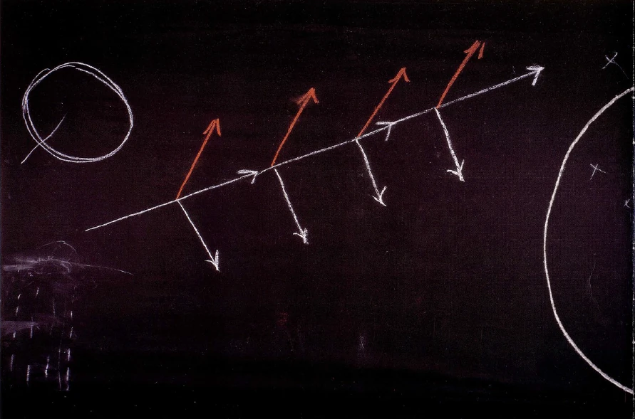
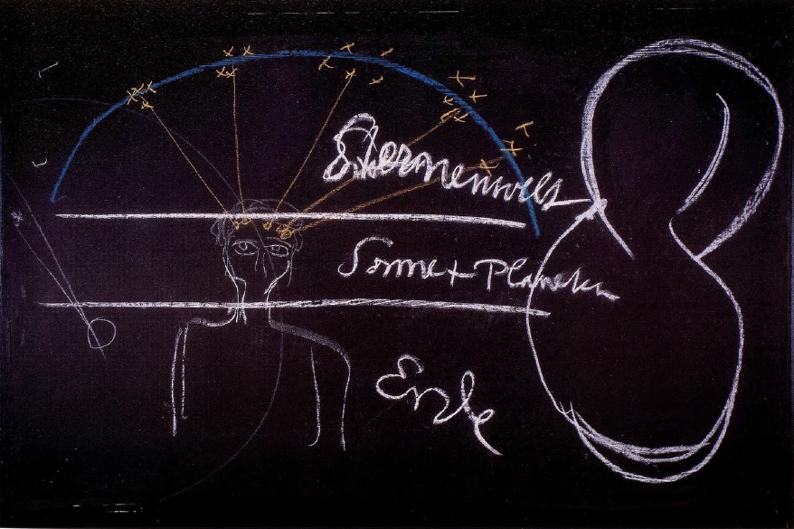

[ 1 ] ^jtpjt7

Aus den Betrachtungen, die wir hier angestellt haben, werden Sie gesehen haben, wie nötig es ist, den Menschen in seiner Ganzheit zu betrachten, um darauf zu kommen, wie genau eigentlich der Mensch in all seiner Beschaffenheit ein Abbild ist der Gesamtwelt. Dies aufzunehmen ist außerordentlich bedeutsam, nicht nur in die verstandesmäßige Erkenntnis, sondern auch in die gefühlsmäßige Erkenntnis, in die willensmäßige Erkenntnis. Denn nur dadurch, daß man den Menschen in seiner Gesamtheit herausgeboren ansieht aus der Gesamtwelt, wird man ein tieferes Verständnis gewinnen können auch für dasjenige, was nun im Fundamente das Christentum der Welt sein will. Man kann sehr leicht einwenden: Ja, da wird von der modernen Menschheit ein kompliziertes Verstehen der Einzelheiten der Welt gefordert und auch ein kompliziertes Verstehen der Einzelheiten des Menschen, um gewissermaßen dadurch erst in seinem Bewußtsein ein ganzer Mensch zu sein. Aber bedenken Sie doch nur, daß diese Forderung, die jetzt wie eine Kardinalforderung an die Menschheit herantritt, nicht etwa bloß der jetzt auftretenden Geisteswissenschaft eigen ist. Um auf dasjenige hinzuweisen, was ich meine, möchte ich Ihnen zunächst die Frage aufwerfen: Was alles hat denn eigentlich das Christentum bei seinem Auftreten gebracht? Das Christentum hat ja gebracht im Grunde genommen die Anforderung eines Weltverständnisses, das wirklich ein recht ausgebreitetes war. Und dieses Weltverständnis, das angeknüpft hat an die alten heidnischen Vorstellungen, dieses Weltverständnis, das ist im Laufe der Zeit eigentlich völlig vergessen worden. Bedenken Sie doch nur einmal, was den Menschen im Laufe der Zeit allmählich gegeben worden ist von den Fundamentalanschauungen, den Fundamentalideen des Christentums. Das Christentum trat ja so auf, daß man es nur verstehen konnte, wenn man zum Beispiel die Trinität verstand, wenn man verstand das Wesen des Vatergottes, des Sohnesgottes, das heißt des Christus Jesus, und des Geistes. In dem Sinne, wie das Christentum diese drei Aspekte des GöttlichGeistigen verstand, gehörte nicht weniger dazu, als zum Verständnis von solchen Dingen, wie sie heute durch die Geisteswissenschaft vorgebracht werden. Nur hat man allmählich dasjenige, was zum Verständnis dieser Ideen führte, des Vaters, des Sohnes, des Geistes, man hat das allmählich eliminiert, man hat es herausgeworfen aus dem Verständlichen und hat behalten leere Worte, leere Worthülsen. Und durch Jahrhunderte hindurch haben die Menschen leere Worthülsen gehabt. Das ist so weit gekommen, daß dann die Menschen sogar, nachdem sie zuerst dogmatisch zurückgewiesen haben die leeren Worthülsen, dann angefangen haben, über diese leeren Worthülsen zu spotten. Beste Menschen haben über diese leeren Worthülsen gespottet. Man bedenke nur einmal, was alles für Spott ergossen worden ist etwa in der Form, daß man gesagt hat, die Dogmatik fordert, daß Eins Drei und Drei Eins sei. Es ist ja eine furchtbare Illusion, es ist ja eine bloße Täuschung, wenn die Menschen glauben, das, was einstmals das Christentum in seiner Strömung geführt hat, erfordere weniger Verständnis, weniger hingebungsvolle Erkenntnis als dasjenige, was - um das Christentum wiederum zu erobern - die heutige Geisteswissenschaft gibt. Allerdings, die wichtigsten, die fundamentalsten Dinge sind ja aus dem Christentum herausgeworfen worden, und wenn man davon absieht, daß sie in den einzelnen Bekenntnissen als Worte fortleben, so kann man fragen: Was ist denn eigentlich von den Fundamentalbegriffen des Christus selber den Menschen in Wirklichkeit verblieben? Wie unterscheidet denn der moderne Mensch - ich habe Sie darauf aufmerksam gemacht, daß nicht einmal Theologen wie Harnack es unterscheiden - dasjenige, was der Christus ist, von dem, was ein allgemeiner Weltengott ist, den man auch treffen würde mit dem Begriff des Jahve oder Jehova? Und erst, wie viele Menschen machen sich denn heute klar, was zu verstehen ist unter dem Geiste oder dem Heiligen Geiste? Die Menschen sind ja allmählich solche Abstraktlinge geworden, daß sie eben zufrieden sind mit den leeren Worthülsen, daß sie entweder, wenn sie in dem Bekenntnis stehenbleiben, eben zufrieden sind, oder wenn sie, wie man dies dann nennt, aufgeklärt werden, daß sie dann spotten. Aber niemals wird dasjenige, was da aufgebracht wird in den leeren Worthülsen, die Macht erringen können, Licht hineinzubringen in die einzelnen Betätigungen der menschlichen Erkenntnis. ^ah0q25

[ 2 ] ^jl9umk

Bedenken Sie nur, wie weit wir in dieser Beziehung eigentlich gekommen sind. Alles, was noch in älteren griechischen Zeiten Erkenntnis war, war zu gleicher Zeit Inhalt eines Heilprinzipes. Der Heiler war Priester und war zu gleicher Zeit der Lehrer des Volkes. Daß der Lehrer des Volkes, daß der Priester zugleich Heiler ist, das setzt voraus, daß irgend etwas Krankes vorausgesetzt wird in dem ganzen Kulturprozesse. Sonst hätte man ja keine Berechtigung, vom Heiler zu sprechen. Man sprach vom Heiler, weil man aus instinktiver Erkenntnis heraus noch in einer gewissen Beziehung einen umfassenderen, einen intensiveren Begriff von dem ganzen Weltenprozeß hatte, als man heute hat. Heute stellt man sich den Weltenprozeß so vor, daß er eben abläuft und das Spätere immer die Wirkung des Vorhergehenden ist. Aber so ist es in Wirklichkeit nicht. Und eine ältere, instinktive Erkenntnis hat das gewußt, daß es in Wirklichkeit nicht so ist. Man stellt sich heute vor, und insbesondere diejenigen, die von einem abstrakten Fortschritt sprechen, sie stellen sich vor: Na, es geht halt die Entwickelung immer aufwärts. - Diese Anschauung von einer solchen aufwärtsgehenden Entwickelung (Tafel 28, Mitte; Schräge, darin Pfeile) finden wir ja selbst bei der oberflächlich gewordenen Philosophie der neueren Zeit. Ein solcher Mensch, der einfach emporgetragen worden ist von dem Gesamtvorurteil der Zeit, wie Wilhelm Wundt, der Unphilosoph, der zu dem Zeitphilosophen für viele Menschen geworden ist, ein solcher Mensch spricht auch als angeblicher Philosoph von einem solchen allgemeinen Fortschritte, ohne die geringste Erkenntnis, was eigentlich in der wirklichen Strömung des Menschenwerdens liegt. Wir müssen uns aber vorstellen, daß in der wirklichen Strömung des Menschenwerdens fortwährend liegt ein Bestreben zu entarten. Es ist nicht eine Tendenz des Fortschrittes da, vor allen Dingen nicht in der Geschichte. Es ist eine fortwährende Tendenz da zur Entartung (Pfeile nach unten). Und nur dadurch, daß ständig dieser Tendenz zu entarten entgegengewirkt wird von dem, was wir Lehre, Erkenntnis und so weiter nennen, dadurch wird dasjenige, was sonst in die Tiefen hinunterziehen würde, hinaufgehoben. Und nur dadurch entsteht ein Fortschritt (Pfeile nach oben, rot). ^va0lug

 ^oueqt3

[ 3 ] ^rcbt2i

Sehen wir von diesem Gesichtspunkte aus einmal an, wie es sich verhält mit. dem Kinde. Das Kind wird geboren. Man spricht von Vererbungen. Ja aber, vererbt wird nur dasjenige, was zum Niedergange führen würde, was in die Dekadenz führen würde. Würde nicht das Kind erzogen werden schon durch die ganze Umgebung und später durch die Schule, durch das Leben, so würde das Kind entarten. Erziehung ist also in Wirklichkeit Bewahrung vor dem Entarten. Also, das wirkt Heilung. Als ein Heilungsprozeß wurde noch von der instinktiven Menschenerkenntnis aus alles angesehen, womit Erkenntnis, womit Erziehung, womit Priestertum irgend etwas zu tun hat. Für ältere Anschauungen war der Arzt vom Priester gar nicht zu trennen, war eines und dasselbe; erst die neuere Entwickelung hat Naturwissen und geist-seelisches Wissen so auseinandergetrennt, wie ich das gestern auseinandergesetzt habe. So daß man dem naturwissenschaftlichen Arzt überläßt, alles dasjenige zu heilen, was nach Ju/ius Robert Mayers Anschauung nichts zu tun hat mit dem, was Menschenziele sind und so weiter, sondern nur zu tun hat mit so etwas, wie die Aufwendung der umgewandelten Pferdekräfte in die Erhitzung der Pferde, der Wagenachsen, die Erhitzung der Straße, über die das Rad geht und so weiter. Das ungefähr überläßt man dem physischen Arzt. Und Leute wie Ruder in Berlin, der ja aber nur der Repräsentant dieser Richtung ist, die berechnen dasjenige, was der Mensch zum Leben nötig hat, ungefähr so, wie wenn der Mensch eine Art von komplizierterem Ofen wäre. ^xvakax

[ 4 ] ^w0568i

Ziehen Sie nun die sozial-ethische Konsequenz einer solchen Anschauung, ziehen Sie sie so, daß Sie erkennen, wenn alles, was da in der Umwandelung der Kräfte vor sich geht, nur zu Nebeneffekten dasjenige hat, was da überhaupt geschieht als die Absichten und Ziele der Menschen, dann ist ja die Möglichkeit, die Denkmöglichkeit da, daß die Welt auch ohne diese Nebenabsichten bestehe. Und im Grunde genommen ist das ja die eigentlich geheime Meinung des neueren Menschen, daß das Wirkliche nur in dem Physikalischen bestehe und das andere Nebeneffekte sind. ^m6o8j9

[ 5 ] ^q2h3rb

Sehen Sie, gegenüber einer solchen Anschauung wäre es einzig und allein konsequent, das Christentum streng abzulehnen, wie es die Materialisten um die Mitte des 19. Jahrhunderts getan haben. Diese Materialisten um die Mitte des 19. Jahrhunderts - ich habe einzelnes von ihnen angeführt im Basler öffentlichen Vortrage - sind nun wirklich bis zu den Konsequenzen der materialistischen Weltanschauung gegangen. Sie haben die Konsequenzen gezogen, indem sie gesagt haben: Ist der Naturalismus richtig, dann bleibt nichts anderes übrig, als es lächerlich zu finden, einen Unterschied zu machen zwischen dem Verbrecher und dem guten Menschen, denn selbstverständlich verwandelt sich in dem Verbrecher genau ebenso die aufgewendete Kraft in Wärme wie in dem guten Menschen. Die Fragen, die heute die Welt durchzucken, sind im Grunde genommen vielfach Fragen der Ehrlichkeit, des Mutes, der Konsequenz. In einer Zeit allerdings, in der man nicht solche Ehrlichkeit in bezug auf die äußeren Dinge des Lebens hat, ist es ja nicht verwunderlich, daß in®bezug auf diese Kardinalfragen diese Ehrlichkeit nicht da ist. ^89ezzf

[ 6 ] ^2efzg3

Und so kommt es, daß die heutige Menschheit noch von Christus redet, ohne eigentlich wirklich etwas davon zu wissen, daß dieser Christus sich wirklich unterscheiden muß von einem allgemeinen Gott, der der ganzen Natur zugrunde liegt. Wenn allmählich die Christus-Vorstellung übergeht in die bloße Gottes-Vorstellung, dann bedeutet das einen Rückschritt der Menschheit hinter das Mysterium von Golgatha zurück. Um aber das Christentum wirklich zu fassen, dazu ist notwendig, daß dieses Prinzip der Entartung ernst genommen werde und daß diesem Prinzip der Entartung ernst gegenübergestellt werde die Notwendigkeit, aus etwas ganz anderem heraus zu arbeiten, als aus dem, was den Keim der Entartung in sich trägt. Die gegenwärtige Menschheit wird aufmerksam darauf werden müssen, daß in dem Zeitpunkte, in dem die Erde sich hinbewegte — mit der Menschheit selbstverständlich — zu dem Mysterium von Golgatha, durch das Mysterium von Golgatha innerhalb des Erdengeschehens sich etwas abspielte, was nicht bloß ein Rationalistisches des Menschlichen bedeutet hat, sondern was ein Rationalistisches bedeutet hat für das ganze Erdenleben. ^y1vcg6

[ 7 ] ^zva1xm

Allerdings, will man dieses einsehen, dann muß man Natur und Geist in einer viel intensiveren Weise studieren, als das in der Neigung der heutigen Menschheit liegt. Um uns zu verständigen, möchte ich Sie zurückweisen auf etwas, was im Bewußtsein der Menschheit vielleicht bis zum 8. vorchristlichen Jahrhunderte lebte. Der Mensch bis zum 8. vorchristlichen Jahrhunderte fühlte sich in der Tat nicht als ein so isoliertes, abgeschlossenes Wesen, wie er sich heute fühlt. Heute fühlt sich ja der Mensch eigentlich nur als das Wesen, das innerhalb seiner Haut eingeschlossen ist. Der Mensch bis zum 7. oder 8. vorchristlichen Jahrhunderte fühlte sich einmal als ein Glied des ganzen Weltenalls, und er fühlte sich auch hineingestellt in das Geschehen des ganzen Weltenalls. Er fühlte nicht in einer solchen intensiven Weise — die Sache erscheint dem heutigen Menschen fast grotesk, aber es ist so -, der Mensch dieser alten Zeiten fühlte nicht so, wie der heutige Mensch, sein Haupt streng abgeschlossen durch die Schädeldecke, sondern er fühlte, daß dasjenige, was in seinem Haupte lebte, eine Fortsetzung hat hinaus in die Welt und hinzugehört zu dem gesamten Sternenhimmel (Tafel 29, links; Himmelsbogen blau, Sterne und Strahlen gelb). Der Mensch - so sonderbar es dem heutigen Menschen erscheint — fühlte sein Haupt so, daß es lebendig zusammenhing mit den Sternen. So daß er sich sagte: Indem sich über mir der Nachthimmel wölbt, bin zc# es eigentlich, der da in lebendiger Kommunikation meines Hauptes mit den Sternen lebt. — Und er sagte sich: Wenn ich nun weitergehe im Zeitenlaufe, wenn nach der Nacht der Tag erscheint, die Sterne, die erst auf der einen Seite heraufgekommen sind, auf der anderen Seite hinuntergehen, dann tritt an die Stelle der Sterne die Sonne. Da wirkt nicht mehr in meinem Haupte die Konfiguration des Sternenhimmels, sondern da vertritt die Sonne die Stelle des Sternenhimmels, und der Sonne zugeordnet sind meine Augen. - Und nun, indem er das empfand: Der Sonne zugeordnet sind meine Augen, wenn ich während des Tages mich auf der Erde beschäftige, - indem er das lebendig empfand, sagte er sich: So wie jetzt, da es ein Erdendasein gibt, meine Augen zugeordnet sind der Sonne, so war in demjenigen Dasein, das der Erde voranging - wir nennen es Mondendasein -, mein ganzes Haupt eine Art Auge; nur sah dieses Auge nicht so wie jetzt eben nur in zweifacher, die Gegenstände zusammenfassender Weise, sondern es sah hinaus in den Weltenraum, es waren gewissermaßen in mir, in meinem Gehirn, so viele kleine Augen, als Sterne sind. Aus diesen kleinen Augen ist alles dasjenige geworden, was jetzt in meinem Gehirn lebt, und meine Sinnesaugen sind spätere Produkte, die der Sonne zugeordnet sind, wie mein Gehirn zugeordnet war dem Sternenhimmel. Mein Gehirn ist daher ein späteres Entwickelungsprodukt eines Auges, oder eigentlich vieler Teilaugen, so vieler Teilaugen, als Sonnen da draußen leuchten zur Nachteszeit. Aus dem Sinn ist mein Gehirn geworden. Und was jetzt im Erdendasein mein Auge ist, wodurch ich mit dem, was in meiner irdischen Umgebung lebt, in Kommunikation stehe, das wird Innenorgan sein, wie jetzt mein Gehirn, wenn die Erde einmal von einem zukünftigen Planetenzustand abgelöst ist — Sie wissen, wir nennen das Jupiterzustand. Was jetzt äußerlich an meiner Oberfläche ist, das zieht in mein Inneres dann ein. Die Menschen werden anders ausschauen. Was sie jetzt als korrespondierend mit der Umgebung haben, das wird in der Zukunft Innenorgan sein. — So hat instinktiv eine alte Menschheit gefühlt, hat gesagt: Licht dringt dutch mein Sinnesauge; aber in meinem Inneren bewahre ich das Licht der alten Zeiten; das wirkt in mir als Gedanke. Der Gedanke war Sinneswahrnehmung, als noch nicht Erde war, als die Erde noch ein anderer Planet war. Und meine Sinneswahrnehmung wird Gedanke der Zukunft sein. — Das alles empfand man in alten Zeiten als eine Weisheit, die - wir sagen heute - instinktiv empfunden wurde. Die Alten haben nicht mit dem Wort «instinktiv» so unverständig herumgeworfen, wie die gegenwärtige Menschheit das tut, sondern die Alten haben gesagt: Das ist die Weisheit, die uns die Götter vom Himmel auf die Erde gebracht haben. — Dasjenige, was in ihnen instinktiv aufgegangen ist von Vergangenheit, Gegenwart und Zukunft, von dem haben sie gesagt: Das haben uns gebracht die Unsterblichen. — Und sie haben es sich vorgestellt im Bilde. Und das Isis-Bild, was sagt es denn? «Ich bin das All. Ich bin die Vergangenheit, die Gegenwart und die Zukunft. Meinen Schleier hat noch kein Sterblicher gelüftet.» Die Interpretation, die die neuere Menschheit gibt, ist eigentlich eine sonderbare. Denn die neuere Menschheit denkt bei einem solchen Satze, in dem ja «Sterblicher» steht, schon materialistisch. Sie denkt eigentlich bei dem Isis-Satze nicht: «Ich bin die Vergangenheit, ich bin die Gegenwart, ich bin die Zukunft. Meinen Schleier hat noch kein Sterblicher gelüftet», sondern sie denkt eigentlich: «Ich bin die Vergangenheit, die Gegenwart und die Zukunft. Meinen Schleier hat noch kein Mensch gelüftet.» So denkt die moderne Menschheit. Sie denkt gar nicht daran, daß sie ja auf der andern Seite sich selbst für unsterblich hält, und daß sie daher das «Meinen Schleier hat noch kein Sterblicher gelüftet» gar nicht als eine abschließende Sache betrachten kann. Novalis hat gesagt: Nun gut, dann müssen wir eben Unsterbliche werden, um den Schleier der Isis zu lüften! ^lnhits

 ^4lflwn

[ 8 ] ^zejspm

Man denke sich nur, welchen Untergedanken diese moderne materialistische Menschheit hervorgebracht hat. Aber es tut ihr auch wohl; denn indem sie denkt: «Ich bin das All. Ich bin die Vergangenheit, die Gegenwart und die Zukunft. Meinen Schleier hat noch kein Mensch gelüftet», so erspart sie sich die Anstrengung, um den Schleier zu lüften, und ihre Philosophen können tradieren, daß der Mensch ja die Grenzen der Erkenntnis hat. In Wahrheit meinen diese Philosophen, daß der Mensch zu faul ist, um den Erkenntnisweg zu gehen. Aber das mögen sie nicht sagen. Daher sagen sie, der Mensch habe Grenzen der Erkenntnis. Und in unserer Zeit, die autoritätsfrei sein will, nimmt man diese Dinge hin. Sie dürfen in der Zukunft nicht hingenommen werden, wenn die Menschheit nicht in die Dekadenz fallen will. Und es darf nicht übersehen werden, daß niemand das Recht hat, sich einen Christen zu nennen, der nur an einen allgemeinen Fortschritt glaubt, der sich nicht darüber klar ist, daß, wenn die Erde sich seit dem Mysterium von Golgatha selbst überlassen wäre, sie in die Dekadenz verfallen würde. So daß wir nötig haben, der Dekadenz etwas entgegenzusetzen, das wir nicht von der Erde nehmen können, nicht aus dem nehmen können, woraus die Erde ist, nicht aus dem Vatergotte nehmen können, sondern nehmen müssen von dem Sohnesgotte, es einimpfen müssen demjenigen, was fortlaufende Menschheitsentwickelung ist. Es ist durchaus ein Ablenken der Menschheit von dem, was ihre jetzige Aufgabe ist, wenn man immerzu nicht zugeben will, daß das Weltenall in Zusammenhang zu bringen ist mit dem Christus-Ereignis. Denken Sie nur, was es eigentlich heißt, wenn von katholischer und evangelischer Bekenntnisseite dagegen gewettert wird, daß durch die Geisteswissenschaft geltend gemacht werde, es müsse der ChristusGedanke an den Kosmos-Gedanken angeknüpft werden, wenn dagegen immer wieder gesagt wird, es hätte diese Geisteswissenschaft keinen Begriff davon, daß der Christus zunächst nur als etwas Ethisches aufzufassen ist, als etwas, was sich nur in die moralische Weltenordnung hineinstellt. Ja, wenn man die moralische Weltenordnung nur als einen Nebeneffekt der Umwandelung der Kräfte hat, dann stellt sich der Christus-Gedanke, wenn er sich nur in die moralische Weltenordnung hineinstellt, auch eben als ein Nebeneffekt der Weltenordnung dar. ^ywc7xh

[ 9 ] ^40atzo

Das war also eines, worauf eine sogenannte instinktive Erkenntnis der Menschheit hingewiesen hat, wie das menschliche Gehirn im Zusammenhange steht mit der Sternensphäre, wie das menschliche Auge in gewisser Weise zugeordnet ist der Sonnensphäre. Wenn Sie zurückgehen in gewisse ältere Zeiten, wo man noch eine qualitative Erkenntnis gehabt hat von astronomischen Dingen und auch von irdisch-elementarischen Dingen, so werden Sie sehen, daß man da das Licht in eine gewisse Beziehung bringt mit dem, was um unsere Erde zunächst herum ist, mit der Luft. Die Alten in ihrer instinktiven Erkenntnis konnten sich das Licht ohne die Luft nicht denken. Die Neueren in ihrer Abstraktionserkenntnis sondern so etwas, was sie sich als Licht auslegen - allerdings, sie schildern es als schwingende Bewegung des Äthers und sie schildern es in einer ganz sonderbaren Weise -, sie sondern es von der Luft ab und können es mit der Luft nicht anders zusammenbringen, als daß sie höchstens die Luft als ein Mittel betrachten, durch welches das Licht durchgeht. Aber sehen Sie, es ist ja eigentlich höchst merkwürdig, wie wenig die Menschen nachdenken über dasjenige, was ihnen, ich möchte sagen, vorgemacht wird: Erde, der unendliche Weltenraum, Sterne. (Tafel 29, ganz links; Umkreis zum Teil auf der anderen Tafel.) Ja, unter diesen Sternen sind solche, von denen das Licht Millionen von Jahren braucht, um auf die Erde herunterzukommen. Jetzt wird es Nacht. Da ist ein Stern, da braucht das Licht kürzere Zeit, um auf die Erde herunterzukommen. Nehmen Sie nun einmal an, was haben Sie denn in den Lichtstrahlen? Doch wahrhaftig nicht den Stern, wenn Sie hinausschauen in der Richtung des Lichtstrahles. Der Lichtstrahl, der da in Ihr Auge fällt nach dieser Theorie, der kommt ja von etwas, was Jahrmillionen zurückliegt; das kann sogar schon längst kaputt gegangen sein, da kommt noch immer das Licht her. Was da eigentlich in der Welt draußen ist, von dem sollte ja nicht geredet werden. Es sollte ja eigentlich nur davon geredet werden, daß da Lichtkanäle ankommen, die vielleicht noch zu irgendwelchen existierenden Sternen führen können, aber auch zu solchen, die gar nicht mehr da sind. ^xpro1b

[ 10 ] ^aw5pae

Wir müssen uns durchaus befreunden damit, wie ja für uns Lichterscheinungen als solche sich in der Lufterscheinung darstellen. Wenn auch das Licht durch den scheinbar luftleeren Raum geht, für uns stellt es sich nicht im luftleeren Raume dar, sondern im lufterfüllten Raume, denn nur da können wir sein. Und so lebt sich für uns zusammen Licht und Luft. Dadurch kommt man dann, indem man, ich möchte sagen, in Licht und Luft zusammen lebt, in der Menschenkonstitution tiefer. Man kommt um ein Stück tiefer; man kommt am menschlichen Haupte vom Auge zur Nase. Die Nase ist ja zunächst - und die orientalische Philosophie wußte viel davon dasjenige, wodurch man ein- und ausatmet. Das Auge ist das Aufnahmeorgan für das Licht. Nase und Auge teilen sich. Die Nase paßt sich der Luft an, und alles, was sich da der Luft anpaßt, das verlängert sich hinaus in die Planetenwelt. Die Sonne macht den Anfang, indem sie auf unser Auge wirkt. Aber das übrige wirkt auf unsere übrige Konstitution, und wir kommen herunter aus der Sternenwelt in die Welt der Sonne und Planeten und sind beim Menschen als dem auf seine Nase hin Konstituierten angekommen. Und dann kommen wir gar zur Erde herunter und gehen von der Nase zum Munde, zum Geschmacksorgan, und nehmen da die Stoffe der Erde auf durch das Geschmacksorgan, kommen von der planetarischen Welt in die Erdenwelt herein. Und wir haben den übrigen Menschen wie ein Anhängsel, den Kopf als ein Anhängsel der Augen, die Brust als ein Anhängsel der Nase, den ganzen übrigen Menschen, den Gliedmaßenmenschen, den Stoffwechselmenschen im ganzen als ein Anhängsel des Geschmacksorgans. Und wir haben den Menschen zugeteilt, wenn wir ihn nun in seiner Gesamtheit auffassen, der Sternenwelt, der Sonnen- und Planetenwelt, der Erdenwelt (diese Gebiete werden in die Zeichnung links, Tafel 29, eingezeichnet). Wir haben den Menschen hineingestellt in das ganze Weltenall, und wir sehen in dem menschlichen Haupte, insofern es der Träger des Gehirnes ist - innerlich, nicht äußerlich, nicht durch physische Anatomie, sondern dutch inneres Wissen — ein unmittelbares Abbild der Sternenwelt. Wir sehen in alledem, was von der Nase sich verlängert zur Lunge und so weiter, ein Abbild des Planetensystems mit der Sonne. Und wenn wir dann dasjenige, was vom Menschen übrigbleibt, ins Auge fassen, dann sehen wir in dem dasjenige, was vom Menschen so erdgebunden ist, wie zum Beispiel das Tier erdgebunden ist. Auf diese Art kommen wir erst auf den wirklichen Parallelismus zwischen dem Menschen und der übrigen Welt. Wir sehen ihn herausgedeutet aus dieser übrigen Welt. Und so sollte man den Menschen auch im einzelnen verstehen. ^heqg14

[ 11 ] ^ic00o2

Bedenken Sie einmal, wenn Sie den Blutkreislauf betrachten, wie, sagen wir, zunächst das von der äußeren Luft umgewandelte Blut in die linke Herzvorkammer geht, dann von da in die linke Herzkammer, von da abzweigend dutch die Hauptschlagader, durch die Aorta in den Organismus (Zeichnung rechts). Wir können sagen: Blut von der Lunge zum Herzen, von da in den übrigen Organismus, aber mit einer Abzweigung zum Haupte. Das Blut, das durch den Organismus durchgeht, nimmt aber dann die Nahrung auf. In sie ist eingeschaltet alles dasjenige, was von der Erde abhängig ist. Was da als der Verdauungsapparat eingeschaltet ist in den Blutkreislauf, das ist irdisch; was eingeschaltet ist dadurch, daß wir atmen, wo wir in die Blutbahn den Sauerstoff hineinbringen, das ist planetarisch; und dann haben wir jenen Blutkreislauf, der in unser Haupt geht, der alles dasjenige umschließt, was unser Haupt ist. Wie der Lungenkreislauf mit der Sauerstoffaufnahme, Kohlensäureabgabe, dem Planetarischen zugeteilt ist, wie dasjenige, was in unserem Blut eingefügt wird durch unseren Verdauungsapparat, der Erde zugeteilt ist, so ist dasjenige, was da in dem kleinen Kreislauf nach oben sich abzweigt, der Sternenwelt zugeteilt. Das wird gewissermaßen herausgezogen aus der Aorta und strömt dann wiederum zurück, vereinigt sich mit dem vom übrigen Organismus zurückströmenden Blute, so daß das Blut von oben und unten gemeinsam zum Herzen zurückströmt. Dies, was da oben abgezweigt ist, das sagt gewissermaßen zu dem ganzen übrigen Kreislauf: Ich mache nicht mit, weder den Sauerstoffprozeß noch den Verdauungsprozeß, sondern ich sondere mich aus, ich stülpe mich da drüber. — Das ist dasjenige, was mit der Sternenwelt zusammenhängt. Ebenso könnte man es für das Nervensystem verfolgen. Man bekommt keine Anschauung von dem Menschen, wenn man glaubt, man könne bloß den Menschen nehmen, wie man ihn sinnlich vor sich hat, und könne ihn da studieren. Da findet man jenen Brei innerhalb der Schädelhöhle, welchen unsere physische Anatomie beschreibt. In Wahrheit ist dasjenige, was unsere physische Anatomie beschreibt, eben ein Nichts, denn es ist der Zusammenfluß von Kräften des Sternenhimmels. Und es ist geradeso unsinnig, dieses physische Gehirn für sich zu beschreiben, wie wenn man eine Rose für sich beschreiben wollte. Es hat doch keinen Sinn, eine Rose für sich zu beschreiben, denn sie ist kein Wesen für sich. Sie kann nicht abgesondert gedacht werden vom Rosenstock. Sie geht ja zugrunde, wenn sie abgesondert ist vom Rosenstock. Sie ist nichts, vom Rosenstock abgesondert. So ist das menschliche Gehirn nichts, vom Sternenhimmel abgesondert. ^4pqoxi

[ 12 ] ^2bw1bd

Aber jetzt erinnern wir uns an dasjenige, was ja eigentlich die Sonne ist. Ich habe Ihnen immer wieder und wiederum betont, die Physiker würden sehr erstaunt sein, wenn sie einen Luftballon ausrüsten könnten, wie es ja jedenfalls in ihrem Ideale liegt, und da hinausfahren könnten zur Sonne in der Vermutung, einen glühenden Gasball zu finden. Den würden sie nicht finden, sondern sie fänden eine Saugsphäte, etwas, was allerdings alles mögliche in sich aufsaugen will, aber was eigentlich leerer Raum ist, und noch mehr leer ist als leerer Raum, negative Materie. Innerhalb des Umkreises der Sonne liegt nichts, was sich vergleichen ließe mit unserer Materie. Das ist nicht nur leer, das ist weniger als leer, das ist ausgespart gegenüber der übrigen Materie. Es handelt sich eben durchaus darum, daß man nun wirklich nicht in der heutigen Zeit beginnt, wirklichkeitsungemäß über die Dinge der Welt zu spekulieren, sondern daß man sich erfülle mit Wirklichkeitsgeist. Ich habe Ihnen ja vor kurzer Zeit ein hübsches Stückchen von der Relativitätstheorie gesagt. Sie erinnern sich an den Kasten, den ich Ihnen da vorgeführt habe, den Einsteinschen Kasten, wodurch die Gravitationslehre überwunden werden soll. Ein anderes ist das, was Einstein ja auch geltend gemacht hat, daß auch die Ausdehnung eines Körpers etwas bloß Relatives ist, und daß sie abhängt von der Schnelligkeit der Bewegung, daß also auch, nach der Einsteinschen Theorie, ein Mensch, wenn er sich mit einer gewissen Geschwindigkeit durch den Weltenraum bewegt, nicht mehr die Dicke hat von vorne nach hinten, die er hat, sondern wenn er sich mit der nötigen Geschwindigkeit bewegt, so dünn wird wie ein Papier. Das ist etwas, was da ernsthaftig besprochen wird unter den Einsteinern, unter diesen Leuten mit der epochemachenden Erfindung der Relativitätstheorie. Solches Verweilen in wirklichkeitsfremden Gedanken, das bildet ja heute schon Wissenschaft. Und das ist der Gegenpol für dasjenige, was auf der anderen Seite Bekenntnis ist. ^uz6651

[ 13 ] ^t7l517

Der Arzt ist verwiesen worden auf das bloß Physische, der Priester auf das bloß Seelische. Das Geistige ist ja abgeschafft. Der Priester ist verwiesen auf das bloß Seelische. Aber denken Sie nur, wenn das sich so fortentwickelt, daß alles, was außerhalb des Physischen liegt, Nebeneffekte sind! Pferde, Wagen, real den physischen Sinnen, die aufgewendeten Pferdekräfte, sie wandeln sich um in das Heißerwerden der Pferde, der Wagenachse, das Heißerwerden der Straßenfurchen; das andere ist — ja, man kann nicht sagen, das fünfte Rad am Wagen, denn es ist ja weniger als das fünfte Rad am Wagen, es ist ein bloßer Nebeneffekt, der eigentlich nicht zur Realität dazugehört. Und während der Arzt sich bloß mit der Umwandelung der Kräfte befaßt, beschäftigt sich dann mit dem Nebeneffekt der Priester. Der ist also auch eigentlich, man kann nicht einmal mehr sagen, das fünfte Rad am Wagen innerhalb der modernen Weltanschauung, denn was erzielt der denn noch, wenn das alles Nebeneffekte sind? Es ist schon so, wenn Ärzte wie Julius Robert Mayer Philosophie machen, dann wird das Physik, und wenn die Anhänger der Seelensubstanz, oder was es dann halt ist, wenn die Philosophie machen, so werden es abstrakte Begriffe, und die zwei Weltenströmungen stehen einander so fremd gegenüber, wie die materialistischen Ärzte von der Mitte des 19. Jahrhunderts und die predigenden Pfarrer. Die haben sich wahrhaftig nicht verstanden, auch nicht geachtet, sondern - nun, vielleicht sich höchstens politisch bekämpft. Nun ist allerdings eine Zeit heraufgestiegen, in der man weniger ehrlich, weniger konsequent ist, und die nun ganz ernsthaftig überwunden werden muß. Aber - ernsthaftig muß das schon geschehen. ^0fim7z

[ 14 ] ^lvzbs4

Wir haben nicht nur zu kämpfen gegen bösen Willen, sondern schon auch, was ja vielleicht doch auch in die Waagschale fällt, gegen alle Standpunkte der Dummheit und der Unkenntnis. Nun ja, so sind die Dinge. Dann darf ich noch persönlich betonen, daß ich ja aus einem gewissen Antriebe heraus zu Pfingsten sprechen werde in drei Vorträgen am Samstag, Sonntag und Montag über die Philosophie des Thomas von Aquino, am Samstag über den Augustinismus und am Sonntag über den Thomismus als solchen, über das Wesen des Thomismus, und am Pfingstmontag über den Thomismus und die Gegenwart. Ich weiß nicht, ob dann unsere Gegner nicht auch damit anfangen werden, daß sie uns das Recht absprechen, uns hier über den Thomismus zu unterhalten, zu belehren. Aber es ist vielleicht doch am besten, dem Gerede, das aus jener Ecke herkommt, einmal eine ernsthafte Betrachtung des Thomismus entgegenzusetzen. Sie wissen ja, daß durch eine Enzyklika Leo XII. der Thomismus zu der offiziellen Philosophie des Katholizismus erklärt worden ist, und ich weiß nicht, ob nun dasjenige, was hier als Thomismus wird vorgetragen werden, nun auch als eine unberechtigte Propaganda, die von Dornach ausgeht, wird bezeichnet werden. Wollen wir einmal sehen, was daraus wird. ^fp8shw