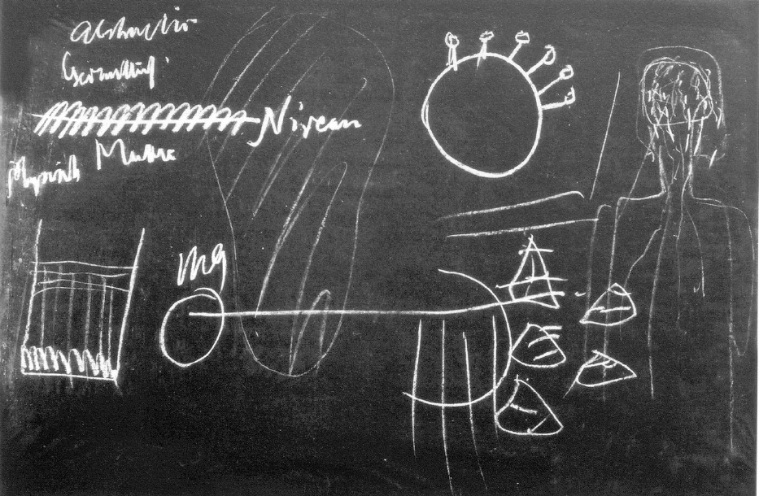
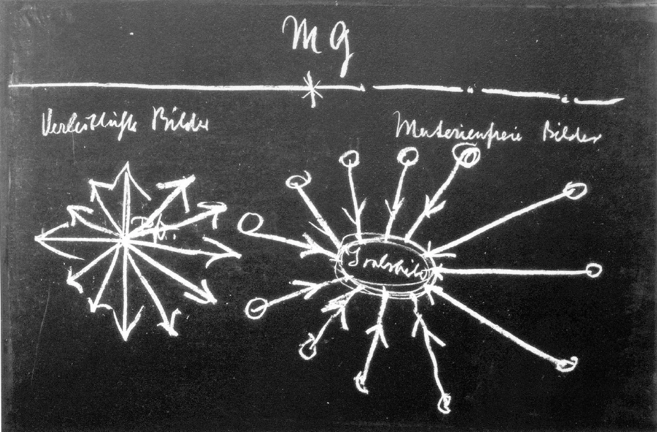

[ 1 ] ^b9uia9

Wenn man versucht zu erkennen, wie der Mensch im ganzen Universum drinnensteht, so handelt es sich darum, nicht nur das Räumliche dabei ins Auge zu fassen, sondern auch das Zeitliche. Wer die Entwickelungsgeschichte der Menschheit etwas verfolgt, wird finden, daß es eine Eigentümlichkeit orientalischer Weltanschauung ist, das Räumliche in den Vordergrund zu stellen, allerdings nicht so, daß das Zeitliche dabei ganz unberücksichtigt bleibt; aber es steht das Räumliche im Vordergrunde. Dahingegen ist es das Eigentümliche abendländischer Weltanschauung, mit dem Zeitlichen in ganz besonderem Maße zu rechnen. Und gerade der Hinblick auf dieses Zeitliche in der Entwickelung der Menschheit und des Universums überhaupt ist dasjenige, was bei einer richtigen Anschauung über die Christus-Kraft vor allen Dingen berücksichtigt werden muß. Dann aber, wenn man die Christus-Kraft in ihrer ganzen Bedeutung innerhalb der Evolution der Menschheit und der Erde richtig erkennen will, dann muß man den Menschen selbst zeitlich richtig in das ganze Universum hineinstellen können. Daran hindert heute, wie ich schon mehrfach erwähnte, der allgemeine Glaube an das Gesetz von der Erhaltung der Kraft und namentlich auch an das Gesetz von der Erhaltung des Stoffes. Dieses Gesetz von der Erhaltung der Kraft, das ist es ja vor allen Dingen, welches den Menschen so in das Weltenall hineinstellen möchte, daß dieser Mensch dabei eigentlich nur wie ein Naturprodukt in diesem Weltenall drinnensteht. Es sind ja sogar schon Versuche gemacht worden zu ergründen, wie die Umwandelung desjenigen, was der Mensch aufnimmt als Nahrung, durch die Verbrennung geschieht in Kräfte, und wie die dann in dem Menschen auftretende Verbrennungswärme und seine sonstige Kraft sich als die umgewandelte Kraft der Nahrungsmittel ergibt. Solche Versuche sind bereits in der neueren Zeit mit Studenten gemacht worden. Sie gleichen dem Gedanken, der etwa in der folgenden Weise sich geltend machen wollte: Man sieht ein Haus, hört, das ist eine Bank, versucht durch irgendwelche Manipulationen alles Geld, welches hineingetragen wird in diese Bank, zu zählen und zählt dann auch alles dasjenige Geld, das wiederum herausgetragen wird; und man findet, daß das dasselbe ist. Und jetzt zieht man daraus den Schluß: also hat sich das Geld darinnen umgewandelt, oder es ist das gleiche geblieben, und es sind keine Beamten, keine Menschen in diesem Bankhaus drinnen. So ungefähr ist ja die Logizität des Gedankens, daß man alles dasjenige, was der Mensch in sich hineinißt, in den umgewandelten Kräften seiner Erwärmung, seiner Betätigung wiederum finden könne. Man hat auch da nur nicht den Mut, wirklich einmal, ich möchte sagen, die Gedankentiefe zu prüfen, die diesen modernen Prinzipien zugrunde liegt. Man würde gar mancherlei herausbekommen, wenn man das, was in der sogenannten Wissenschaft der Gegenwart figuriert, auf seine Logizität und namentlich auf seinen Wirklichkeitscharakter hin prüfen würde. ^ei0yxn

[ 2 ] ^ph0t5g

Nun handelt es sich darum, daß ja durch alle diese unwirklichkeitsgemäßen und im Grunde genommen auch unlogischen Denkoperationen der neueren Zeit, der Mensch eben in diesen Zwiespalt hineingestellt ist, auf den ich in diesen Tagen aufmerksam machte, wo auf der einen Seite die Ideale stehen, Nebeneffekte, auf der anderen Seite das Naturgeschehen steht und man keine Brücke von dem einen zu dem andern finden kann. Höchstens wird in der neueren Zeit von dekadenten Schwätzern auf dem Gebiete der Philosophie, wie etwa Eucken oder Bergsor, versucht, in das Naturgeschehen in einer Weise hineinzureden, durch die ein wenig geschmeichelt werden kann dem primitiven Denken derjenigen Menschen, die durchaus nicht auf etwas Konkretes eingehen wollen, sondern die sich mit solch einem Gefasel, wie es der Euckenismus oder der Bergsonismus ist, zufrieden geben wollen. Um was es sich handelt, ist zunächst einmal, sich zu fragen: Was trägt der Mensch in sich aus dem ganzen Umfange des Universums heraus? Was trägt der Mensch in sich so, daß er sich in diesem Gliede des Universums mit seinem Selbst betätigen kann, so betätigen kann, daß man sieht, was da entsteht, ist sein Eigenes. — Alle anderen Dinge des Universums, alle anderen Wesenschaften, wenn ich das Wort bilden darf, alle andern Wesenschaften des Universums sind weniger leicht zu übersehen, aber eine Wesenschaft ist ja zunächst wirklich leicht zu studieren, wenn man nur absieht von allen Vorurteilen der sogenannten neueren Wissenschaft, das ist die Wärme. ^905wq8

[ 3 ] ^vuz837

Gewiß, man muß zunächst sich sagen, auch die Tierwelt und vielleicht bis zu einem gewissen Grade die Pflanzenwelt haben Eigenwärme; aber in einer solchen Weise, wie die höhere Tierwelt und die Menschenwelt Eigenwärme haben, kann man sie doch unterscheiden von anderen Arten von Eigenwärme, die entwickelt werden. Jedenfalls ist es notwendig, einmal auf dieses, was wir Eigenwärme im Menschen nennen können, hinzusehen. Ich will heute von der Tierheit ganz absehen, obwohl das, was ich sage, durchaus nicht im Widerspruche steht mit den Tatsachen innerhalb der Tierwelt; aber es würde heute zu weit führen, die Betrachtung auch auf die Tierwelt auszudehnen. In dem, was der Mensch als seine Eigenwärme hat, und in dem zunächst etwas vorliegt, was sich gewissermaßen als eine Art Wärmeorganismus absondert für jeden Menschen von der übrigen universellen Wärme, in dem hat er sein innerstes körperliches, sein innerstes leibliches Betätigungsfeld. Man ist nur darauf nicht aufmerksam, weil dem gewöhnlichen Bewußtsein sich ja entzieht, wie im Grunde genommen dasjenige, was im Menschen als Seelisch-Geistiges lebt, seine unmittelbare Fortsetzung findet in einer Wirkung auf die im Menschen vorhandene Wärme. Man sollte eigentlich zunächst, wenn man von des Menschen Leiblichkeit spricht, von seinem Wärmeleib sprechen. Man sollte sagen: Wenn ein Mensch vor dir steht, so steht vor dir auch ein abgeschlossener Wärmeraum, der in einer gewissen Beziehung höhere Temperatur hat als die Umgebung. In dieser erhöhten Temperatur lebt zunächst das, was geistig-seelisch im Menschen ist, und auf dem Umwege durch die Wärme überträgt sich das, was im Menschen geistig-seelisch ist, auch auf die übrigen Organe. So kommt ja auch der Wille zustande. | ^wmi19q

[ 4 ] ^eqmtqy

Der Wille kommt dadurch zustande, daß zuerst auf die im Menschen befindliche Wärme gewirkt wird und dann, indem auf die Wärme gewirkt wird, auf den Luftorganismus, von da auf den Wasserorganismus und von da erst auf das, was im Menschen mineralisch fester Organismus ist. So daß man also sich die menschliche Organisation so vorzustellen hat: Man wirkt innerlich zuerst auf die Wärme, dann durch die Wärme auf die Luft, von da auf das Wasser, auf den Flüssigkeits-Organismus, und von da auf den festen Organismus. Ich habe Sie darauf aufmerksam gemacht, daß der Mensch ja zum geringsten Teile seines Organismus aus Festem besteht, daß er zu mehr als 75 Prozent ja Wasserkörper ist. Dies, daß wir eigentlich leben und weben in unserer Wärme, das gehört zu den physiologischen Tatsachen, die streng ins Auge gefaßt werden müssen. Wir dürfen auch dasjenige, was da als ein abgeschlossener Wärmeraum ist (Tafel 30, große Form Mitte oben), nicht einfach etwa so auffassen, daß da eben ein Wärmeraum von einer höheren Temperatur als die Umgebung ist, sondern wir müssen das so auffassen, daß da differenziert wärmere und kältere Partien sind. Ebenso wie in uns Leber, Lunge und so weiter differenziert sind, so ist unser Wärmeorganismus differenziert, und er ist so, daß er seine Differenzierung innerlich fortwährend ändert. Er ist in einer bewegten Differenzierung. Und in diesem innerlichen Organisieren von Wärme besteht dasjenige, was sich zunächst an die seelisch-geistige Tätigkeit anschließt. ^u9qw0m

 ^bhn1w7

[ 5 ] ^q1wk78

Sehen Sie, heute reden die Philosophen davon, man könne nicht die Wirkung des Geistig-Seelischen auf das Leibliche einsehen, weil sie sich einen Arm etwa so wie irgendeine feste Hebelvorrichtung vorstellen (dieselbe Tafel, Winkel rechts oben). Dann kann man natürlich nicht einsehen, wie auf diese feste Hebelvorrichtung sich die Tätigkeit des Geistig-Seelischen, das man möglichst abstrakt vorstellt, übertragen soll. Man muß nur sein Augenmerk auf die Übergänge richten. Da also finden wir dasjenige, was für den Menschen herausorganisiert ist aus dem ganzen Universum. Und nun handelt es sich darum, daß, wenn wir real den Gedanken des Menschen studieren, wir daraufkommen, daß das Denken, das sich in unserem Haupte geltend macht, sehr viel zu tun hat mit diesem innerlichen Arbeiten in den Wärme-Verhältnissen. Es ist das etwas ungenau gesprochen, aber es kann nur im Laufe der Zeit das Ungenaue vielleicht durch das Genauere ergänzt werden. Wir müssen versuchen, ein abgeschlossenes Bild zu bekommen. Daher will ich mehr kursorisch zunächst charakterisieren. Es ist so, daß, wenn man beobachtet dieses Ineinanderarbeiten von Gedanken im Wärmeraum, im abgeschlossenen Wärmeraum, wenn man das beobachtet, dann zeigt sich, daß so etwas wie ein Zusammenwirken von dem, was die Denktätigkeit ist, mit der Wärmetätigkeit vor sich geht. Und worinnen besteht das? Sehen Sie, da kommen wir auf etwas, was ich Sie bitte, sehr genau zu berücksichtigen. ^h7lbjj

[ 6 ] ^s0lxzm

Wenn Sie den ganzen übrigen Menschen nehmen und dann sein Haupt (dieselbe Tafel, ganz rechts), so können Sie natürlich einen Stoffwechsel vom ganzen übrigen Menschen zum Haupt hin vetfolgen. Und daß schließlich das Haupt mit dem Denken etwas zu tun hat, das spüren Sie ja als eine unmittelbare Erfahrung. Aber was geschieht da in Wirklichkeit? Sehen Sie, was da in Wirklichkeit geschieht, darauf möchte ich Sie führen, indem wir nach und nach zu dem entsprechenden Bilde kommen wollen. Nehmen Sie einmal an, Sie haben eine Flüssigkeit; Sie bringen sie zum Kochen; da verdunstet sie, da geht sie in eine Substanz von größerer Dünnigkeit über. Noch viel intensiver geschieht dieser Vorgang durch das menschliche Denken. Es bewirkt, daß in dem, was da als Stoffwechsel sich abspielt im menschlichen Haupte, aller Stoff abfällt, gewissermaßen als Bodensatz abfällt und dann ausgeschieden wird (Pünktchen in der Zeichnung), und daß zurückbleibt von dem das bloße Bild. ^62oveh

[ 7 ] ^lxpzu9

Ich will ein anderes Bild noch gebrauchen, damit Sie mich verstehen. Denken Sie sich einmal, Sie haben hier ein Gefäß (ganz links). In diesem Gefäß haben Sie eine Lösung. Sie bringen die Lösung zum Abkühlen, was auch ein Wärmeprozeß ist. Unten sammelt sich ein Bodensatz, oben sammelt sich die feinere Flüssigkeit. So ist es hier (in der Zeichnung ganz rechts) durch das menschliche Haupt. Nur sammelt sich da oben überhaupt nichts Materielles, sondern die bloßen Bilder, und das Materielle wird ausgeschieden. Das ist die menschliche Hauptestätigkeit, daß sich die bloßen Bilder sammeln und das Materielle ausgeschieden wird. Dieser Prozeß vollzieht sich tatsächlich in alledem, was man den Übergang des Menschen zum reinen Denken nennen kann. Da fällt gewissermaßen in den Organismus zurück alles Materielle, das sich an dem menschlichen Innenleben beteiligt hat, und es bleiben allein die Bilder. Tatsächlich ist es so, daß wir, wenn wir uns zum reinen Denken aufschwingen, in Bildern leben. Unsere Seele lebt in Bildern. Und diese Bilder, sie sind dasjenige, was von allem Früheren bleibt. Nicht das Materielle bleibt, sondern die Bilder bleiben. ^znahjr

[ 8 ] ^jw1bju

Das, was ich Ihnen jetzt auseinandergesetzt habe, das ist zu verfolgen bis in die Gedanken selbst hinein, denn es geschieht dieser Vorgang nur dann, wenn sich eben die Gedanken umwandeln in bloße Bilder. Gedanken leben ja zunächst, ich möchte sagen, verleiblicht. Sie sind von Substanz durchdrungen. Aber sie sondern sich als Bilder aus dieser Substanz heraus. Aber wir können, wenn wir richtig geisteswissenschaftlich zu Werke gehen, gut unterscheiden, was sich da als reine Gedanken, als sinnlichkeitsfreie Gedanken heraussondert aus dem materiellen Prozeß, wir können das unterscheiden von allen solchen Gedanken, welche eigen waren dem, was ich in diesen Tagen wiederum und sonst auch immer genannt habe «die instinktive Weisheit der Alten». Diese instinktive Weisheit der Alten, sie trägt, wenn wir sie heute kennenlernen, ganz genau den Charakter an sich, daß die Alten es nicht gebracht haben bis zu einer solchen Filtrierung der Gedanken, daß wirklich alles Materielle herausgefallen wäre. Daß wirklich alles Materielle herausfällt, das ist ein Ergebnis der Menschheitsentwickelung. Und wenn es auch durch äußere Physiologie nicht zu konstatieren ist, es ist so, daß im wesentlichen - natürlich im wesentlichen und approximativ — die Menschheit der Erde vor dem Mysterium von Golgatha immer bloß Gedanken hatte in Verbindung mit dem Materiellen und daß in der Zeit, in der das Ereignis von Golgatha in das Erdenleben eingeschlagen hat, die Menschheit in ihrer Entwickelung so weit war, daß sie absondern konnte in dem innerlich seelisch-geistigen Gedankenprozeß das Materielle; daß materienfreies Denken möglich geworden ist. ^1dmgpp

[ 9 ] ^ruapu4

Ich bitte, fassen Sie das nicht als etwas Unbedeutendes auf. Es ist sozusagen eine der allerwichtigsten Tatsachen, die wir im Erdenleben beobachten können, daß in diesem Erdenleben einmal das eintritt, daß die Menschen in ihrer Fortentwickelung frei werden von der Verleiblichung der Gedanken, daß die Gedanken sich umwandeln in bloße Bilder. So daß wir sagen können: Entwickelung bis zum Mysterium von Golgatha - verleiblichte Bilder leben im Menschen; Entwickelung nach dem Mysterium von Golgatha — materienfreie Bilder leben im Menschen (Tafel 31, oben). Das Universum wirkt vor dem Mysterium von Golgatha so auf den Menschen, daß er zu leibfreien, materienfreien Bildern nicht kommt. Das Universum zieht sich gewissermaßen zurück seit dem Mysterium von Golgatha. Der Mensch wird in ein Sein versetzt, das nur in Bildern geschieht. ^mbwx6g

 ^sxup0s

[ 10 ] ^wxovyx

Sehen Sie, was da der Mensch vor dem Mysterium von Golgatha als seinen Zusammenhang mit der Erde erfühlt hat, das bezog er auch auf das Universum. Er bezog gewissermaßen das irdische Menschenleben auf den Himmel. Wir können das ganz genau beobachten. Es war ein deutliches Bewußtsein vorhanden im hebräischen Altertum, daß die 12 Stämme Israels irdische Projektionen sind der 12 Sternbilder des Tierkreises. Die Zwölfteiligkeit der Welt drückt sich im Menschenleben aus. (Tafel 31, rechts.) Und wir können sagen: Dazumal wurde dieses Menschenleben so vorgestellt, daß es als ein Ergebnis vorgestellt wurde der Zwölfheit des Himmels, des Tierkreises. Die Menschen fühlten sich, auch jeder einzelne, so, daß der Sternenhimmel in sie hereinstrahlte. Sie fühlten sich vor allen Dingen als Gruppe so, daß der Sternenhimmel in sie hereinstrahlte. In der Entwickelung des althebräischen Altertums müssen wir zurückgehen bis zu der Zeit, wo uns gesprochen wird von den 12 Jakobssöhnen als den Projektionen der 12 Gebiete des Himmels auf der Erde. Wie da im grauen Altertum sich innerhalb der hebräischen Entwickelung dieses Hereinstrahlen der Kräfte des Himmels auf den Erdenmenschen ergab, so ergab sich, weil auf den verschiedenen Punkten der Erdoberfläche die Entwickelung in verschiedenen Zeiten auftritt, für Europa ein späterer Zeitpunkt. Da müssen Sie ins Frühmittelalter zurückgehen und die Artussage, die Sage vom König Artus und seiner Tafelrunde, die bedeutsame Keltensage, studieren. Denn Mitteleuropa, das in späterer Zeit jene Etappe der Kultur entwickelte, die die alten Hebräer schon vor Jahrtausenden entwickelt haben, Mitteleuropa war erst zu der Zeit, für die angesetzt wird die Artussage, die Sage von Artus’ Tafelrunde, so weit. Aber es ist ein Unterschied jetzt. Das hebräische Altertum entwickelte sich bis zu dem Punkte hin, wo diese Einstrahlungen aus dem Universum in dem Menschen noch das ergaben, was die verleiblichten Bilder waten. Dann kam der Zeitpunkt, wo der Leib sich von den Bildern zurückzog. Jetzt mußte den Bildern eine neue Substantialität gegeben werden. Es war ja die Gefahr vorhanden, daß der Mensch in bezug auf sein Seelenleben völlig überging in ein Bilddasein. Diese Gefahr wurde von den Menschen nicht gleich erkannt. Und noch der Cartesius zappelte; und statt den Satz auszusprechen: Ich denke, also bin ich nicht -, sprach er den Satz aus, der das Gegenteil der Wahrheit ist: Ich denke, also bin ich. - Denn wenn wir in den Bildern leben, sad wir eben nicht. Es ist das beste Zeichen, daß wir nicht sind, wenn wir in bloßen Gedanken leben, daß der Gedanke substantiell erfüllt werden muß. Damit die Menschheit nicht in bloßen Bildern fortlebe, schlägt diejenige Wesenheit in die Menschheitsentwickelung herein, die durch das Mysterium von Golgatha hereingeschlagen ist, damit wiederum innerliche Substantialität im Menschenwesen ist. Dieses Hereinschlagen der Zentralkraft, die nun der zum Bild gewordenen menschlichen Seele wieder Realität geben soll, wird aber nicht gleich verstanden. Sie trifft zunächst allerdings das althebräische Altertum. Im Mittelalter haben wir von diesem den letzten Ausläufer in der Tafelrunde der 12 um den König Artus; aber es stellt sich gleich etwas anderes entgegen: die Parzival-Sage, die den einen Menschen den Zwölften gegenüberstellt, den einen Menschen, der nun aus seinem eigenen inneren Zentrum die Zwölfheit herausentwickelt. So daß diesem Bilde (Tafel 31, rechts), das im wesentlichen das Gralsbild wäre, entgegenzustellen ist das ParzivalBild (links), wo aus dem Zentrum ausstrahlt, was der Mensch jetzt in sich hat. Und das Bestreben derjenigen, die im Mittelalter den Parzival begreifen wollten, die rege machen wollten in der menschlichen Seele das Parzival-Streben, das Bestreben dieser war, hineinzubtringen in das menschliche Bilddasein, das sich herauskristallisieren kann nach der Filtration von allem Materiellen, Substantialität, Innerlichkeit, Wesenhaftigkeit. Während die Gralssage noch die Einstrahlung von außen zeigt, wird entgegengestellt die Parzival-Gestalt, die vom Zentrum aus in die Bilder das hineinstrahlen soll, was ihnen wieder Realität gibt. ^yyh5hb

[ 11 ] ^kd5c8p

Und indem die Parzival-Sage auftritt, ist diese Parzival-Sage das Bestreben der mittelalterlichen Menschheit, den Weg zu finden zum innerlichen Christus. Es ist ein instinktives Streben, dasjenige zu verstehen, was als der Christus in der Menschheitsentwickelung lebt. Wenn man innerlich studiert, was bei der Ausgestaltung dieser Parzival-Gestalt empfunden wurde, und dann es mit dem vergleicht, was heute in den Bekenntnissen lebt, dann bekommt man so recht einen Antrieb für das, was heute geschehen muß. Denn heute begnügen sich die Leute mit der Worthülse «Christus» und glauben, den Christus zu haben, während ihn nicht einmal die Theologen haben, die ja auch an der äußerlichen Wort-Interpretation hängen. Im Mittelalter ist noch so viel unmittelbares Bewußtsein vorhanden, daß man sich durch das Erfassen des MenschheitsRepräsentanten, des Parzival, zu der Christus-Gestalt hinaufringen will. Wenn man dies überdenkt, bekommt man aber auch einen Eindruck von der Stellung des Menschen zum ganzen Universum. Überall draußen in der natürlichen Welt herrscht Umwandelung der Kräfte; im Menschen allein wird durch das reine Denken der Stoff herausgewortfen. Der Stoff, der nun wirklich durch das reine Denken aus dem Menschlichen herausgeworfen wird, der ist auch vernichtet als Stoff, der geht in die Vernichtung hinein. Das Menschenleben steht so im Universum drinnen, daß im Menschen der Ort vorhanden ist, wo Stoffliches aufhört, so daß es nicht mehr vorhanden ist. ^yl2hwk

[ 12 ] ^drw8h5

Wenn Sie dies bedenken, dann müssen Sie ja sich das ganze Erdendasein so vorstellen (Tafel 30, oben rechts der Mitte): Hier die Erde, auf der Erde die Menschen, in die Menschen hinein geht der Stoff. Überall sonst wandelt er sich um; im Menschen wird er vernichtet. Die stoffliche Erde wird in dem Maße verschwinden, als dutch die Menschen der Stoff der Erde vernichtet wird (unten, rechts der Mitte, Erde mit abwärts strahlenden Linien). Wenn einmal aller Stoff der Erde durch die menschliche Organisation durchgegangen sein wird, so daß er in den menschlichen Organisationen gebraucht sein wird zum Denken, dann hört die Erde als Weltenkörper auf zu sein. Und was die Menschen herausgewonnen haben aus dieser Weltenerde, das sind die Bilder (dreieckige Formen). Aber diese Bilder, die haben eine neue Realität, eine ursprüngliche Realität erhalten. Und diese Realität ist diejenige, die von der Kraft ausgeht, die sich als die Zentralkraft geltend machte durch das Mysterium von Golgatha (Kreis MG mit horizontal in die Bilder einstrahlender Linie). Das heißt, wenn wir hinblicken auf das Ende der Erde, wie stellt sich die Sache dar? Das Ende der Erde wird dann vorhanden sein, wenn auf die eben geschilderte Art der ganze Stoff der Erde vernichtet sein wird. Von dem, was innerhalb der Erdenentwickelung dann geschehen sein wird, werden die Menschen Bilder haben. Es würde am Ende der Erdenzeit die Erde im Weltenall versunken sein, und es würden bloß die Bilder da sein ohne Realität. Was ihnen aber Realität gibt, das ist, daß in der Menschheit das Mysterium von Golgatha da war, welches diesen Bildern weiterhin für das folgende Leben die innerliche Realität gibt. Damit aber ist ein neuer Anfang gesetzt für das Zukunftsdasein der Erde durch das Mysterium von Golgatha. ^gl13et

[ 13 ] ^ps8f9f

Sie sehen daraus, daß wir dasjenige, was in unserer Entwickelungsströmung enthalten ist, nicht bloß so anzusehen haben, daß das eine fortlaufende Entwickelungsströmung ist, wo sich eins ans andere immer wie Wirkung zur Ursache anschließt, sondern wir haben die Erdenentwickelung so anzusehen, daß es eine vorchristliche Erdenentwickelung gegeben hat, aus der alles dasjenige herauskam, was dazumal auch Menschen denken konnten. Denn das war im Vatergott enthalten, das war der Erde mitgeteilt durch ihren Vatergott. Aber der Vatergott hatte es so eingerichtet, daß dasjenige, was er als Erdenentwickelung schuf, dem absterbenden Teile der Erdenentwickelung gewidmet war. Ein neuer Anfang setzte ein mit dem Mysterium von Golgatha. Von allem Früheren sollten nur zurückbleiben die Bilder, gewissermaßen das Gemälde der Welt. Aber diese Bilder sollten eine neue Realität erhalten durch dasjenige, was als Wesenheit in die Erdenentwickelung hereingedrungen ist durch das Mysterium von Golgatha. Das ist die kosmische Bedeutung des Mysteriums von Golgatha. Das ist es, was ich schon vor Jahren meinte, als ich sagte: Nicht eher ist das Christentum begriffen, als bis es bis zur Physik herunter all unser Erkennen durchdringt. Nicht eher ist das Christentum begriffen, bis wir herunter bis zum Physikalischen verstehen, wie die christliche Substantialität im Weltendasein wirkt. Nicht eher ist das Christentum begriffen, bis wir uns sagen: Gerade im Gebiet der Wärme vollzieht sich im Menschen eine solche Umwandelung, daß durch sie Materie vernichtet wird, daß sich bloßes Bilddasein aus der Materie herauszieht, daß dieses Bilddasein aber durch die Verbindung der Menschenseele mit der Christus-Substanz zu neuer Realität gemacht wird. ^pfqwc5

[ 14 ] ^c73dto

Und vergleichen Sie mit diesem Zusammenschlingen desjenigen, was geistig-seelisch durch den Menschen ist, mit dem, was physisches Dasein ist, vergleichen Sie diesen ganzen Gedanken mit dem trostlosen naturwissenschaftlichen Gedanken der neuen Zeit, der Sie nur in eine Sackgasse führen kann, so werden Sie sehen, welche Bedeutung dieser Gedanke hat; denn dieser Gedanke zeigt uns, wie wir uns alles das vorzustellen haben, was in die bloßen Julius Robert Mayerschen Gesetze eingeschlossen ist, wie wir uns das vorzustellen haben als dasjenige, was abfällt vom Weltendasein, wie Eis vor der Sonne schmilzt, Schnee in der Sonne schmilzt. Aber der Mensch behält zurück die Bilder. Diese Bilder bekommen aber eine Realität für die Zukunft dadurch, daß eine neue Substanz in diese Bilder fährt, die Substanz, die durch das Mysterium von Golgatha gegangen ist. ^o4llxd

[ 15 ] ^taoeh2

Damit aber wird auch der Menschengedanke der Freiheit begründet, und er wird zusammengeschlossen mit dem naturwissenschaftlichen Denken. Er wird dadurch zusammengeschlossen mit dem naturwissenschaftlichen Denken, daß man nicht sagt: Erhaltung des Stoffes und der Kraft, sondern: Es ist dem Stoff und der Kraft eine bloße zeitliche Lebensdauer bestimmt. Wir nehmen nicht bloß teil an dem sich fortentwickelnden stofflichen Weltenall, sondern an dem Absterben dieses Weltenalls, und wir sind jetzt schon dabei, uns herauszuringen bis zum bloßen Bilddasein und uns mit dem zu durchdringen, dem wir uns freiwillig allein hingeben können, dem Christus-Wesen. Denn das Christus-Wesen steht so in der Menschheitsentwickelung drinnen, daß das Verhältnis des Menschen zum Christus nur ein freies sein kann. Derjenige, der sucht, gezwungen zu werden, den Christus anzuerkennen, der kann sein Reich nicht finden. Der kann nur zu dem allgemeinen Vatergott gehen, der aber in unserer Welt sich nur noch mit einer untergehenden Welt beteiligt, der eben wegen dieses Unterganges seiner Welt den Sohn gesandt hat. Es muß sich geistige Weltanschauung mit natürlicher Weltanschauung zusammenschließen; aber sie schließen sich im Menschen zusammen. Und sie schließen sich im Menschen zusammen dutch eine freie Tat. Daher kann man nicht anders sagen, als wer die Freiheit beweisen will, der steht auf einem alten heidnischen Standpunkt. Deshalb mißglücken auch alle Beweise für die Freiheit, denn die Freiheit muß man nicht beweisen wollen, sondern ergreifen wollen. Und man ergreift sie in dem Momente, wo man den Charakter des sinnlichkeitsfreien Denkens erfaßt. Aber dieses sinnlichkeitsfreie Denken, das braucht wiederum den Zusammenhang mit der Welt. Es findet ihn nicht, wenn es sich nicht verbindet mit dem, was als neue Substanz geradezu in die Weltenevolution eingezogen ist dutch das Mysterium von Golgatha. ^ev63nh

[ 16 ] ^twpre2

So liegt schon im richtigen Erfassen des Christentums die Brücke zwischen der natürlichen Weltanschauung und der moralischen Weltanschauung. Und es könnte zunächst sehr eigentümlich erscheinen, daß gerade Träger moderner oder alter, ins moderne Leben hereinragender Bekenntnisse nicht eine Wissenschaft wollen, welche sich gegen das Christentum hinbewegt, daß sie womöglich eine bloß materialistische Wissenschaft wollen, damit daneben ein wissenschaftsloser Glaube zu seinem Rechte kommen könne. In dieser Beziehung kann man sagen: Sehr verwandt sind sich der moderne Materialismus und das reaktionäre Christentum. Denn das reaktionäre Christentum hat geradezu die Menschheit hineingetrieben in die Auffassung, es dürfe nichts Geistiges mit dem wirklichen Wissen durchdrungen werden. Das wirkliche Wissen müsse sich freihalten von dem Geistigen, müsse wegbleiben von dem Geistigen, dürfe sich nur auf das Materielle erstrecken. Und so steht auf der einen Seite der Verteidiger dieses oder jenes Bekenntnisses, der sagt: Wissenschaft erstreckt sich nur auf das Sinnlich-Wahrnehmbare, das andere soll nur vom Glauben erfaßt werden; und auf der anderen Seite steht der Materialist, der sagt: Wissenschaft erstreckt sich nur auf das Sinnlich-Wahrnehmbare, den Glauben habe ich mir aber abgewöhnt. ^7kyyi3

[ 17 ] ^w6ez5u

Geisteswissenschaft ist nicht verwandt mit dem Materialismus. Die modernen Bekenntnisse, also die alten Bekenntnisse, die in das moderne Leben hereinragen, sind gar sehr verwandt mit dem Materialismus. ^qdav9m

[ 18 ] ^b9kvm0

Damit glaube ich, Sie darauf hingewiesen zu haben, wie verankert ist in der Geisteswissenschaft die Möglichkeit, die moralische Weltordnung wirklich zu durchdringen mit dem, was wir auch über die Natur wissen können, und umgekehrt das Naturwissen wirklich zu durchdringen mit der moralischen Weltordnung. Denn, sehen Sie, jenes Phantom, welches heute in der äußeren Wissenschaft noch als Mensch figuriert, jenes trügerische Bild, das mit dem Menschen wie mit einer Konfiguration von Mineralischem rechnet, das ist ja in Wahrheit beim herumgehenden Menschen nicht vorhanden. Der Mensch ist ebenso organisiert im Flüssigen wie im Festen, organisiert im Luftförmigen und vor allen Dingen organisiert in der Wärme. Und kommen Sie herauf bis zur Wärme, so finden Sie den Übergang in das Geistig-Seelische, denn Sie haben in der Wärme bereits den Übergang von dem Räumlichen in das Zeitliche. Und das Seelische verfließt ja in dem Zeitlichen dort. Sie kommen immer mehr und mehr über die Wärme herauf aus dem Räumlichen in das Zeitliche, und Sie erhalten die Möglichkeit, auf dem Umwege, den ich hier angedeutet habe, das Moralische zu suchen im Physischen. Wer, ich möchte sagen, kurzsinnig denkt, der wird ja kaum herausbekommen, wie der Zusammenhang des Moralischen mit dem Physischen in der Menschennatur ist. Denn man vermag ja allerdings seinem Tode entgegenzuleben als ein Bösewicht, und man verrenkt sich dadurch die Arme nicht, sondern bleibt dabei ein wohlgestalteter Mensch. Aber der Wärmezustand wird dann nicht untersucht, der Wärmezustand, der sich allerdings in viel minuziöserer Weise ändert, als man glaubt, der aber wiederum zurückwirkt auf dasjenige, was der Mensch durch den Tod trägt. Heute ist die Betrachtungsweise so, daß wir gewissermaßen auf dieses Niveau hinsehen (Tafel 30, links oben wird angeschrieben und gezeichnet), hinaufsehen in die Abstraktion, da oben das Gedankliche und so weiter haben, hinuntersehen in das Physisch-Materielle. Wir bekommen aber den Übergang nicht, wenn wir nicht zu der in sich beweglichen Wärme, die dazwischen liegt, übergehen; zu jener Wärme, die wenigstens für den menschlichen Instinkt noch einen ebenso seelischen wie physischen Aspekt hat. Aus dem Instinkt ist es wenigstens noch nicht herausgebracht worden, daß der Mensch auch moralisch für seinen Mitmenschen Wärme entwickeln kann, seelische Wärme entwickeln kann, die das wirkliche Gegenbild der physischen Wärme ist. Aber diese seelische Wärme entsteht allerdings nicht dutch eine physische Umwandelung im Sinne der Julius Robert Mayerschen Theorie. Wie entsteht sie denn? Ich möchte sagen: Hier zeigt es sich handgreiflich. Warum reden Sie denn überhaupt von warmem Fühlen? Weil Sie fühlen, weil Sie empfinden, daß die Gefühlswärme das Bild ist der äußeren physischen Wärme. Da filtriert sich die Wärme in das Bild. Und das, was heute nur seelische Wärme ist, es wird im späteren, zukünftigen Weltendasein eine physische Rolle dadurch spielen, daß der Christus-Impuls darinnen leben wird. Und in dem, was heute nur Bild-Wärme ist in unserer Gefühlswelt, wird leben, damit es physisch sein kann dann, wenn die Erdenwärme verschwunden sein wird, dasjenige, was die Christus-Substanz, die Christus-Wesenschaft ist. Versuchen Sie nur einmal, jenes zarte Verhältnis zwischen der äußeren physischen Wärme und dem, was man instinktiv als die Gefühlswärme bezeichnet, zu finden. Gehen Sie dann zu dem, was Goethe in seiner Farbenlehre in der sechsten Abteilung: «Sinnlichsittliche Wirkung der Farben» nennt. Sehen Sie, wie er in den Farbenwahrnehmungen selber auf der einen Seite die erkältenden Farben hat, auf der andern Seite die erwärmenden Farben; sehen Sie, wie da das Sinnlich-Sittliche sich zusammenschließt mit dem physischen Zustande, den wir gewissermaßen mit dem Thermoskop abmessen können; sehen Sie, wie da ineinanderspielt das Seelische und das äußerlich Physische. Dann werden Sie einen Aspekt von dem bekommen, wie durch echten Goetheanismus der Zusammenschluß zwischen der moralischen Weltanschauung und der physischen Weltanschauung gefunden werden kann. ^qzch3o

[ 19 ] ^2xk6j1

Allerdings, der Jesuitismus haßt diesen Zusammenschluß. Deshalb ist auch das beste Buch über Goethe, das aus jesuitischem Geiste geschrieben worden ist, ein giftiges Buch, ein furchtbares Buch, aber viel scharfsinniger, viel wirkungsvoller als alles, was sonst über Goethe geschrieben worden ist, weil mit innerlicher jesuitischer Rhetorik geschrieben. Ich meine das dreibändige Goethewerk von Pater Baumgartner. Es ist haßerfüllt, voller Giftigkeit, aber es ist eben eindrucksvoll und wirksam. Und Sie können ganz sicher sein, in der Welt, von der sich viele Menschen heute keine Vorstellung machen, in der Welt, die aber auch uns bekämpft, da ist Goethe verbreiteter als unter den Gebildeten. Diejenigen, die zu Goethe halten und die Goethe verstehen vom positiven Standpunkte aus, sind eine kleine Gemeinde. Diejenigen, die Goethe hassen, das ist eine große Gemeinde; man stellt sie sich nur nicht groß genug vor. Ich habe Sie einmal, vor jetzt schon längerer Zeit, darauf hingewiesen, wie wenig man eigentlich gegenüber dem, was unter uns Menschen immerhin lebt, wach ist. Ich habe dazumal gesagt, ich möchte an der Türe Zettel abnehmen lassen, um zu wissen, wie viele von den Anwesenden das deutsche Machwerk «Dreizehnlinden» von Weber kennen. Ich hätte gern gewußt, wie viele Zettel abgegeben worden wären. Es wäre damals sicher ein trauriges Resultat herausgekommen. Und dennoch, dieses Werk «Dreizehnlinden», ein Werk im Sinne des positiven Katholizismus, hat bald nach seinem Erscheinen schon eine außergewöhnlich große Anzahl von Auflagen erlebt. Wissen denn diejenigen, die die Menschheit gern vorwärts bringen möchten, in ihrem Wachbewußtsein etwas davon, wie breite Wirkung solche Dinge haben? Und breite Wirkung haben alle diese Dinge, aus denen auch der Kampf gegen uns hervorgeht, davon können Sie überzeugt sein. Diese Dinge sind wirksam. Sie sind es in viel breiterem Umfange, als sich die schläfrige Menschheit vorstellen möchte. Und während wir wirklich eine kleine Goethe-Gemeinde haben, die zu Goethe hält, die gar nicht einmal hinweisen kann auf irgendwie Beträchtliches aus dieser Goethe-Weisheit heraus, ist das Jesuitenbuch über Goethe mit großem Scharfsinn geschrieben, geschickt gemacht und ein sehr wirksames Buch. ^pn1ilb

[ 20 ] ^wk20o6

Das ist es aber, was wir nötig haben: uns zu durchdringen mit wachem Geistesleben. Dann wird Geisteswissenschaft schon gedeihen, wenn waches Geistesleben wirklich unter uns Platz greift. ^vojpj6