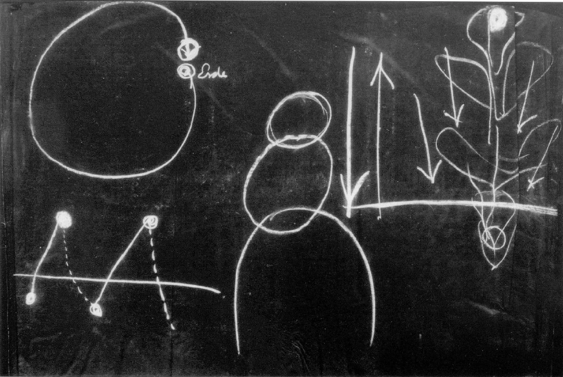
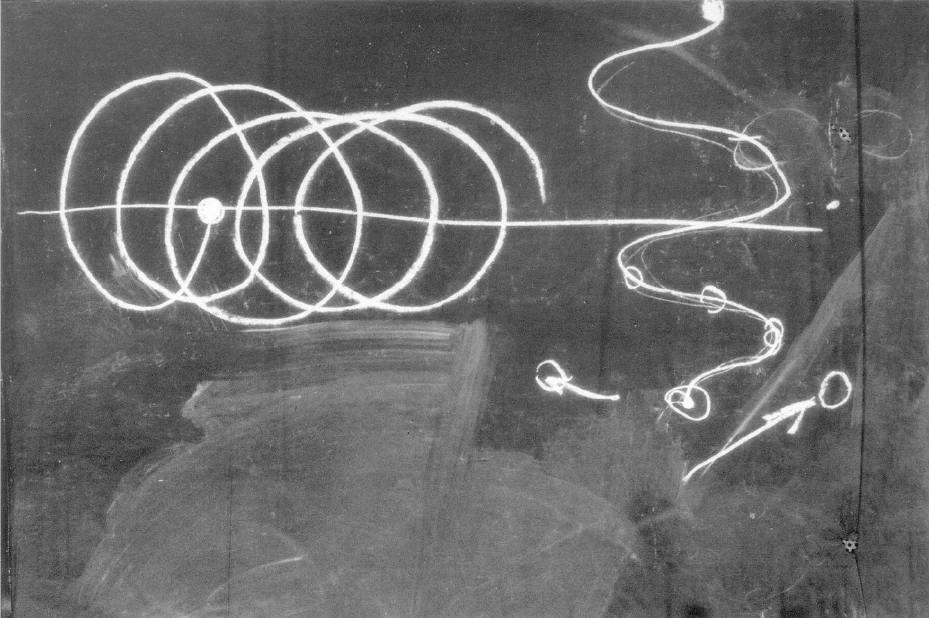

[ 1 ] ^9glzz4

Wir wollen in unserer gestrigen Betrachtung fortfahren. Es hat sich mir gestern namentlich darum gehandelt, Sie darauf aufmerksam zu machen, wie in der gegenwärtigen Kulturperiode der Menschheit man in abstrakten Raumlinien, die aufeinander senkrecht stehen und die drei Dimensionen des Raumes bilden, dasjenige zusammenfaßt, was eigentlich im Leben sich als etwas viel Komplizierteres, viel Konkreteres herausstellt. Nun bekommt man allerdings über diese Sache erst dann eine entsprechende Vorstellung, wenn man sie noch bestimmter faßt. Wir müssen uns die Frage vorlegen: Woher kommt es denn, daß - wenn wir wirklich veranlagt sind, eigentlich unser Denken nach einer durch unsere Symmetrie-Achse gehenden senkrechten Ebene orientiert zu denken, unser Wollen ebenfalls unter dem Bilde einer vertikalen Ebene zu denken, die aber wiederum gewissermaßen auf der Denkebene senkrecht steht, und dann auf beiden Ebenen senkrecht die Gefühlsebene zu denken -, woher kommt es denn, daß wir nicht empfinden oben und unten, rechts und links, vorne und hinten als drei voneinander verschiedene Richtungen, die nicht miteinander verwechselt werden dürfen, sondern daß wir einfach empfinden drei, ich möchte sagen, gleichwertige Raumdimensionen? Wir sagen zwar Länge, Breite und Höhe, aber schließlich, wenn wir uns drei aufeinander senkrechte Richtungen denken, so können wir diese drei Richtungen so anordnen, daß wir eine Linie, die wir zuerst horizontal haben, senkrecht aufstellen; dann sind die beiden anderen horizontal. Kurz, wir können so auf drei verschiedene Arten solch eine Anordnung aufstellen. Das bezeugt eben, daß die ganze Bestimmtheit, durch die diese Richtungen in unseren Menschen hineingebaut sind, verabstrahiert wird, indem sie von uns Menschen heute angewendet wird, sogar um unser gesamtes Weltenbild, in dem Sonne und Sterne drinnen sind, in unserer Anschauung anzuordnen. ^1fhczu

[ 2 ] ^q5sqia

Die Frage ist wichtig: Wie machen wir es denn eigentlich, daß wir aus den konkreten Raumrichtungen abstrakte Raumrichtungen herausbekommen? Ein Tier würde das nicht können. Ein Tier würde nicht ohne weiteres aus den drei konkreten Raumrichtungen abstrakte herausbekommen können. Ein Tier würde stets seine Symmetrie-Ebene als konkrete Symmetrie-Ebene empfinden, und es würde nicht beziehen diese Symmetrie-Ebene auf irgendeine abstrakte Richtung, sondern es würde höchstens, wenn es abstrakt vorstellen könnte oder überhaupt vorstellen könnte im Sinne dessen, was wir Menschen «vorstellen» nennen, es würde die Drehung empfinden. Es zs£ auch beim Tiere so, daß es die Drehung empfindet, empfindet als eine Abweichung seiner Symmetrie-Ebene von einer Normalrichtung. Da liegen wichtige und wesentliche Dinge für die Tierkunde, die wiederum einmal zutage treten werden, wenn man diese Sache studieren wird aus ihren Wirklichkeitsimpulsen heraus. Daß Tiere, wie Sie es am eklatantesten sehen beim Vogelflug, Richtungen finden, das rührt davon her, daß sie nicht in beliebiger Weise die drei Raumrichtungen empfinden, sondern daß sie gewissermaßen sich zugehörig fühlen zu einer ganz bestimmt orientierten Raumrichtung, und daß sie jedes Abweichen von dieser Raumrichtung eben auch als einen Winkel, als eine Abweichung empfinden. ^w7pu8m

[ 3 ] ^cgrwha

Nun, wenn man die Sache für den Menschen ganz verstehen will, muß man schon zu Hilfe nehmen das, was wir früher über die Gliederung der menschlichen Wesenheit gehört haben. Wir haben ja über diese Gliederung gehört, daß der Mensch in drei Glieder zerfällt, in die eigentliche Kopforganisation, die natürlich nicht bloß den Kopf umfaßt, sondern die nur hauptsächlich im Kopfe ist, sich aber über den ganzen Menschen ausdehnt in ihren Ausläufern. Dann dasjenige, was ich nennen möchte den Zirkulationsmenschen, alles dasjenige, was zu Lunge und Herz gehört und wodurch repräsentiert wird das Rhythmische im Menschen. Und dann der Gliedmaßenmensch mit den Fortsetzungen der Gliedmaßen nach innen, was den Stoffwechselmenschen darstellt. ^hq66qa

[ 4 ] ^0iwdiw

Nun handelt es sich darum, daß wir diesen dreigliedrigen Menschen, ich möchte sagen, richtig ernst nehmen. Stellen wir ihn uns schematisch vor: Kopfmensch, Rhythmusmensch, Gliedmaßenmensch (Tafel 3, Mitte). Von diesen drei Gliedern des Menschen ist nur der Gliedmaßenmensch mit der Fortsetzung nach innen streng eingegliedert in die Kräfte unseres irdischen Planeten - wir fassen die Kräfte ins Auge, nicht die Substanzen, sondern die Kräfte. Der Gliedmaßenmensch ist streng eingegliedert in die Kräfte unseres Planeten, unserer Erde. ^u9slue

 ^q9hvh4

[ 5 ] ^revmo5

Der Kopfmensch ist das nicht, denn was ist dieser Kopfmensch? Dieser Kopfmensch - Sie müssen nicht das Substantielle ins Auge fassen, sondern die Kräfte, die Formkräfte, die Bildungskräfte, die ihn bedingen -, dieser Kopfmensch ist ja die Metamorphose des Gliedmaßenmenschen, der in der vorigen Inkarnation, im vorigen Erdenleben da war. Die Kräfte, die den Gliedmaßenmenschen in der vorigen Inkarnation gebildet haben, die sind in einer Welt gewesen, die wir ja öfter beschrieben haben, zwischen dem letzten Tode und der letzten Geburt, der Geburt, die uns in dieses Dasein gebracht hat. Da haben sie sich metamorphosiert, so daß sie nun den Kopf bilden können. Es ist also ein vollständig polarer Gegensatz zwischen dem Gliedmaßenmenschen und dem Kopfmenschen. Und der mittlere Mensch ist der Ausgleich beider, derjenige, der durch den Rhythmus den Ausgleich beider schafft. ^t2g0zf

[ 6 ] ^pa25wn

Diesen Gegensatz zwischen dem Kopfmenschen und dem Gliedmaßenmenschen müssen wir nun ein wenig ins Auge fassen. Wir können uns vielleicht zuerst nähern dem, was uns notwendig ist auf diesem Gebiete, wenn wir das Folgende aus einem anderen Felde ins Auge fassen. Betrachten Sie die Pflanze, zunächst nicht eine Baumpflanze, sondern eine einjährige Pflanze, die vom Samen aus in die Wurzel schießt und es im Jahreslaufe bis zu der Frucht- und Samenbildung bringt (Tafel 3, rechts). Eine solche Pflanze wächst dadurch, daß sie den Keim in die Erde gepflanzt erhält, daß aus dem Keim dann, indem er in die Erde gepflanzt ist, die Wurzel und das andere entsteht, die Blätter heraufwachsen bis zur Blüte, in der Blüte durch die Frucht sich der neue Samen entwickelt. Ein Kreislauf der Pflanze ist vollendet. Wir können schematisch diesen Kreislauf so zeichnen: Die Pflanze geht von dem Samen aus, der sich dutch die Erde entfaltet. Sie wächst hinauf über die Erdoberfläche. Sie wird empfangen von der Lichtwirkung, von der Sonnenwirkung, von der Licht- und Wärmewirkung. Da wächst sie weiter, vollendet ihren Kreislauf und kommt wiederum zurück zur Samenbildung. Aber da ist sie jetzt, indem sie zurückkommt in der Samenbildung im Herbste, da ist sie nun nicht unter der Erde, sondern da ist sie über der Erde; da ist sie auch den ganzen Sommer hindurch abhängig gewesen von den außerirdischen Kräften, von den Kräften, die gerade das Wachstum befördern aus dem Außertellurischen. Da ist also die Pflanze gewachsen bis zur neuen Samenbildung, jetzt nicht unter dem Einfluß der Erde, sondern sie ist gewissermaßen herausgezogen worden durch das Außerirdische aus der Erde. Sie ist wiederum das geworden, was sie früher war, und doch etwas anderes. Sie ist etwas anderes geworden. Inwiefern ist sie etwas anderes geworden? Ja, sie ist insofern etwas anderes geworden, als dieser Same das Wachstum abschließt. Da hört es auf, und dieser Kreis (Tafel 3, links oben), der vollendet sich jetzt nicht, wenn wir nicht den Samen aus seiner Region wegnehmen und ihn wieder zurückbringen, gewissermaßen auf ein tieferes Niveau bringen, ihn wiederum unter die Erde hineinbringen. Wir müssen also, indem wir den Samen verfolgen bis hinauf in das Gebiet, wo er im Bereiche des Außertellurischen ist, wir müssen den Samen wiederum hinunterbringen unter die Erde. Dann wächst er wiederum dem Himmel entgegen, und wir müssen ihn immer wiederum hinunterbringen (Tafel 3, links unten). Das heißt, das Weiterwachsen ist davon abhängig, daß wir gewissermaßen auf ein tieferes Niveau den Samen wiederum hinunterbringen. Wir müssen dasjenige, was der Himmel hervorgebracht hat, wiederum der Erde zurückgeben. So ist es nicht getan mit dem bloßen Kreislauf, sondern es handelt sich darum, daß gewissermaßen die Bildung der Pflanze sich selbst entläuft, und wenn sie bis zu einem gewissen Grade sich selbst entlaufen ist, muß sie wieder auf den ursprünglichen Standort zurückgebracht werden. Dann wird sie von denselben Kräften empfangen und der Kreislauf beginnt von neuem. So daß ich auch die Sache so zeichnen kann, daß jetzt, nachdem die Pflanze hierhergekommen ist, sie nun nicht weitergehen kann (Tafel 4, links. Vom Samen abwärts und erster Anstieg). Daher muß ich sagen: Wenn hier das Niveau der Erde ist (Horizontale), so muß ich den Kreislauf der Pflanze so zeichnen. Aber die Pflanze muß jetzt wieder in die Erde hinein. Wenn ich also mehrere Jahresläufe der Pflanze zeichne, so muß ich immer um ein Stück weitergehen. Das ist der Niveauunterschied. Ich muß immer wiederum den Samen zurücktragen auf ein anderes Niveau. ^paibyf

[ 7 ] ^04g5fw

Das habe ich Ihnen zunächst als ein Bild vorgeführt. Aber betrachten wir an diesem Bilde noch etwas weiteres. Sie brauchen ja nur, um das, was ich meine, zu betrachten, die Entstehung der Bohnenpflanze aus dem Bohnensamen ins Auge zu fassen, und Sie werden sehen, wie sich im einzelnen das vollzieht. Klarer werden Sie die Sache noch sehen, wenn Sie eine Pflanze, die ihren Stengel windet, ins Auge fassen, wenn Sie also die Pflanze verfolgen, wie sie nicht veranlaßt wird, ganz geradlinig zu wachsen, sondern gewisse Kräfte frei wirken können, wie etwa bei der Winde, die so wächst dem Samen zu (Tafel 4, rechts, aber nur die Spirale mit dem alten und neuen Samen). So vollendet sie ihren Kreislauf. ^nyhvx5

 ^7g808t

[ 8 ] ^kg8x52

Betrachten wir dieses Bild im Zusammenhang mit dem Menschen. Wenn wir beim Menschen, statt jetzt den Jahreskreislauf der Pflanze ins Auge zu fassen, ins Auge fassen jenen Kreislauf, der von einem Lebenslauf durch die geistige Welt bis zum nächsten Lebenslauf hinübergeht, dann haben wir etwas Ähnliches, etwas ganz merkwürdig Ähnliches. Wir schauen, sagen wir, bei jedem von Ihnen auf den Gliedmaßenorganismus in der vorigen Inkarnation und schauen jetzt auf Ihren Kopf in dieser Inkarnation. Der entsteht durch eine Metamorphose, indem nur unterbrochen ist die sichtbare Verwandlung durch alles das, was geschieht zwischen Tod und neuer Geburt. Dieser Kopf entsteht so, wie hier (Tafel 3, links) im Laufe des Wachstums entsteht der neue Same aus dem alten. Aber das ganze übrige Pflanzenleben liegt dazwischen. So daß Sie sich sagen können: Im Menschen liegt seiner Formbildung nach so etwas vor, wie wenn die Wurzel von ihm in der vorigen Inkarnation dagewesen wäre, und aus dieser Wurzel ist aufgesprossen der Kopf dieser Inkarnation. Dieser Kopf, der stellt also damit etwas Ähnliches dar wie der Same hier. Nur ist beim Menschen alles, ich möchte sagen, auf einem anderen Niveau gelegen. Es liegt in einer höheren Region. Es ist auch komplizierter. ^0cj8u3

[ 9 ] ^930cau

Nun fassen Sie aber, um die Vorstellung fertig zu bekommen, die ganze Metamorphose der Pflanzen ins Auge. Wenn Sie bei der Winde sich das ansehen, so werden Sie aus dem spiralig gewundenen Stengel oder eigentlich schraubenförmig gewundenen Stengel sehen, daß die Kräfte, die da wirken von außen, nicht bloß gerade hinaufwirken, sondern daß sie in der Tat die Pflanze spiralig fortschreiten lassen. Die Pflanze hat eine Spiraltendenz. Nur wenn wieder der neue Same sich bildet, da widerstrebt dieser Same der Spiraltendenz, da zieht sich alles zusammen in ein Körnchen. Da entzieht sich der Same dem Einflusse des Weltenalls. Beim Menschen ist das so, daß vor allen Dingen der Gliedmaßenmensch dem Einflusse der Erde unterliegt. Beim rhythmischen Menschen ist das etwas anders, darauf werden wir noch zu sprechen kommen. Aber der Kopf ist etwas, was sich entzieht dem Erdeneinflusse, was diesen nicht mitmacht. Geradeso wie der Same hier nicht mitmacht die außerirdischen Einflüsse, so macht der Kopf nicht mit die Erdeneinflüsse. Der Kopf entzieht sich vollständig den Erdeneinflüssen. Nur dadurch ist es möglich, daß wir Menschen abstrahieren, daß wit Menschen in abstrakten Gedanken denken. Würde unser Kopf sich nicht entziehen können den Erdeneinflüssen, so könnte er nicht abstrakt denken. Er kann nur dadurch abstrakt denken, daß er sich dem Erdeneinflusse entzieht. Das drückt sich übrigens schon aus in der menschlichen Gestalt. Denken Sie doch nur einmal, daß Ihr Kopf ja wirklich der umgewandelte Gliedmaßenmensch ist. Aber dieser Gliedmaßenmensch - hier auf der Erde geht er, er wandelt auf der Erde. Der Kopf macht nicht mit. Der Kopf verhält sich ungefähr, trotzdem er auch nur ein Mensch ist, wenn auch ein Mensch späterer Metamorphose, der Kopf verhält sich so, wie wenn Sie sich bequem hineinsetzen ins Auto oder in den Eisenbahnzug, sich nicht regen und doch vorwärtskommen. Gerade in dieselbe Lage versetzt sich Ihr Kopf gegenüber dem übrigen Organismus. Der übrige Organismus, der schreitet vorwärts; der Kopf, der ist wie in einer Kutsche, der ruht und macht die Bewegungen nicht mit. Der entzieht sich also in anschaulicher Weise dem Erdeneinflusse. Das ist der Mensch, der sich vom anderen Menschen befördern läßt. ^85sav8

[ 10 ] ^fwtn27

So ist aber überhaupt dieses Haupt des Menschen organisiert. Es entzieht sich dem Erdeneinflusse. Und so können wir sagen: dieses Haupt des Menschen, es stellt etwas — wenigstens zunächst im Bilde - Ähnliches dar wie der Same, der sich dem himmlischen Einflusse der Pflanzenbildung entzieht. Nun aber beim Menschen ist es nicht so, wie es bei der Pflanze ist. Bei der Pflanze ist es so, daß sie von der Erde nach oben wächst, daß sie also entgegenwächst dem himmlischen Einflusse. Der Mensch wächst nach unten. Er hat dasjenige, was sich zunächst dem Erdeneinflusse entzieht, oben, und alles dasjenige, was in den Erdeneinfluß hineinwächst, das ist dasjenige, was nach unten wächst. Wenn der Mensch ankommt bei der Konzeption oder bei der Geburt, so kommt er zunächst - auch die äußere Embryologie ist ein vollständiger Beweis dafür — als ein Kopfgebilde an. Den Kopf bringt er sich schon mit als ein metamorphosiertes Produkt aus dem vorigen Erdenleben. Hier in diesem Erdenleben wächst ihm aus den Kräften dieses Erdenlebens vor allem der Gliedmaßenmensch zu, wächst an den Kopf daran und ist jetzt noch nicht so weit wie der Kopf, ist den Erdeneinflüssen vollständig ausgesetzt. Der Kopf entzieht sich den Erdeneinflüssen. So daß wir sagen können: Wenn wir Pflanzen beobachten, so können wir an dem spiraligen oder schraubenförmigen Bau der Pflanze verfolgen, daß die Kräfte von den außerirdischen Körpern kommen, die der Pflanze diese schraubenförmige Windung geben. Wenn wir in den Menschen hineinschauen, so können wir sehen, wie er der Erde entgegenwächst. Und fragen können wir uns: Was hat denn dem Menschen diese Möglichkeit gegeben, entgegengesetzt dem Wachstum der Pflanze, die von unten nach oben wächst, von oben nach unten zu wachsen und in die Erdeneinflüsse hinein sich zu fügen? Was hat dem Menschen diese Möglichkeit gegeben? Wie hängt das alles zusammen? Das ist eine wesentliche und wichtige Frage für das Studium der menschlichen Gestaltenlehre, der Morphologie, aber auch für das Studium der ganzen menschlichen Wesenheit. Sehen Sie, würden wir angewiesen sein darauf, unser Seelenleben ohne unsern Kopf zu führen, so würde es etwas anderes sein. Wenn wir unser Seelenleben ohne unsern Kopf führten, so würden wir keine Abstraktionen bilden. Wir würden vor allen Dingen nicht den bloßen dreidimensionalen Raum als Abstraktion bilden. Wir würden streng unterscheiden: vorne, rückwärts; links, rechts; oben, unten. Das würden für uns konkret voneinander verschiedene Dinge sein. Das tut auch unser Organismus. In dem Augenblicke, wo Sie sich durch die geisteswissenschaftliche Methode nur bis zur imaginativen Anschauung der Welt erheben, da hört die bequeme Dreidimensionalität auf, da ist sie nicht mehr da. Da müssen Sie unterscheiden, denn Sie begehen ja das Eigentümliche, daß Sie die gewöhnliche Kopforganisation ausschalten und bis zu der ätherischen Organisation des Menschen zurückkehren. Die ist im Vergleich zum physischen Kopforganismus wesentlich anders. So daß erst durch den vollkommenen, von der vorigen in diese Inkarnation errungenen Menschenkopf die Abstraktionen zustande kommen. Alles abstrakte Denken, alles Denken in bloßen Gedanken ist gebunden an diese Kopforganisation, die wir aber erst erhalten dadurch, daß wir verlassen die geistige Welt, in die irdische Welt hereinkommen und dasjenige, was früher abhängig war von der Erdenorganisation, nunmehr von ihr unabhängig machen. ^3mhko4

[ 11 ] ^n35aoc

Das weist Sie darauf hin, daß wir als Menschen ebenso auf der einen Seite hineingestellt sind in die Kräfte des Weltenalls wie die Pflanze. Nur weil wir uns mit unserem Kopfe unabhängig machen, machen wir diese Kräfte nicht mit. Unser übriger Organismus, der würde sich sofort, wenn er kopflos dächte — das kann er ja -, sich sofort in der ganzen Weltenorganisation drinnenfühlen. ^uq46y0

[ 12 ] ^rppbfi

Wenn man einen sehr bequemen Schlafwagen zustande bekommen könnte - in der gegenwärtigen Zeit wird es ja nicht so leicht möglich sein —, gar nicht hinausschauen könnte und es gar nicht rattern hörte und so weiter, könnte man vielleicht in die Illusion verfallen, daß man in einem ruhigen Zimmer ist. Man könnte nichts bemerken von der ganzen Wagenbewegung. Aber sobald Sie wiederum zum Fenster hinausschauen, dann merken Sie doch, trotzdem Sie ruhig sitzen, daß es vorwärtsgeht. Sobald Sie sich von dem, was Ihnen Ihr Kopf dadurch vorgaukelt, daß er sich von der Erdenorganisation frei macht, wiederum befreien, merken Sie, daß Sie mit der Erdenorganisation die Bewegungen der Erde mitmachen. Das heißt, es ist möglich, wenn man sich von der gewöhnlichen gegenständlichen Vorstellungsweise, wie ich sie in meinem Buche «Wie erlangt man Erkenntnisse der höheren Welten?» genannt habe, zur Imagination erhebt, die Bewegungen der Erde zu fühlen, weil man nämlich da zum Fenster hinausschaut: man schaut in die geistige Welt hinein. Geradeso, wie Sie beim Eisenbahnzug zum Fenster hinausschauen und merken, daß da draußen sich das Bild fortwährend ändert, so schauen Sie, indem Sie von dieser physisch-sinnlichen Welt an die geistige kommen, zum Fenster hinaus, und an der Veränderung der geistigen Welt, da merken Sie, wie Sie da vorbeifahren, daß Sie mit der Erde nicht in Ruhe sind, sondern mit der Erde sich weiterbewegen. Man kann daher nicht zu einer wirklichen Auffassung eines räumlichen Weltenbildes der Astronomie kommen, wenn man es konstruieren will just mit dem Glied unseres Organismus, das sich unabhängig macht. Denken Sie doch einmal, was wit seit dem Beginn dieses fünften nachatlantischen Zeitraumes als zivilisierte Menschheit eigentlich getan haben. Wir haben mit unserem Kopf über die Welt gedacht. Aber just der Kopf ist es, der sich ganz unabhängig gemacht hat von der Welt, der die Weltenrichtungen bis zur Abstraktion der drei Raumrichtungen filtriert hat. Wir haben also ein Weltenbild, das kopernikanische Weltenbild entworfen mit dem denkbar ungeeignetsten Mittel dazu, mit dem Menschenkopf, dessen wesentliche Eigenschaft gerade darinnen besteht, daß er sich emanzipiert von dem Mitmachen der Weltbewegungen. Es ist etwa geradeso, wie wenn Sie ein Bild bekommen wollten von, sagen wir, den Bewegungen des Eisenbahnzuges, die Sie mitmachen, indem Sie im Eisenbahnzug fahren, aus einer Zeichnung, die Sie mit Ihren Fingern machen, und wobei Sie sich gar nicht richten nach der Bewegung des Eisenbahnzuges, sondern nach Ihren Ideen. Sie zeichnen ja etwas auf, Sie machen sich unabhängig. Das können Sie nicht als ein Bild der Bewegung des Eisenbahnzuges ansehen, denn es ist ganz unabhängig davon. So unabhängig eigentlich ist dasjenige Bild, das wir entwerfen von dem äußeren räumlich-astronomischen Weltgeschehen, wenn wir das dazu ungeeignetste Mittel verwenden. ^l8ktkd

[ 13 ] ^bcz577

Nun denken Sie sich, wozu man genötigt ist durch eine wirklichkeitsgemäße Auffassung in der Gegenwart. Man ist genötigt, zu sagen, das räumliche astronomische Weltenbild ist mit dem ungeeignetsten Mittel konstruiert worden. Kein Wunder, daß es allem widerstrebt, was herauskommt, sobald man geeignete Mittel verwendet. Natürlich, für gewisse Zwecke eignet sich zunächst dieses Weltenbild. Denn warum? Weil wir uns ja angewöhnt haben und angewöhnen mußten seit der Mitte des 15. Jahrhunderts, seit dem Entstehen der fünften nachatlantischen Periode, unabhängig vom Weltenall zu denken. Wir werden morgen hören, warum das so gekommen ist. Aber dadurch haben wir die Möglichkeit verloren, nun wirklich etwas zu wissen über jene Bewegungen, die wir mit der Weltbewegung der Erde mitmachen und die dann herauskommen in dem Augenblicke, wo wir uns dazu erziehen, die sonst abstrakten Raumdimensionen konkret zu empfinden, wie ich es Ihnen gestern kurz schon skizziert habe. Und wir werden auf diese Dinge immer weiter und weiter eingehen. Man kann sie nicht anders als, ich möchte sagen, aufbauend in Kreisen vollziehen. ^sid4sn

[ 14 ] ^cwa8w7

Nun hat nach den gestrigen Andeutungen Herr Dr. Stein sich die Mühe gegeben, hier ein Modell aufzustellen für die Bewegung, die etwa herauskommt, wenn man den Menschen verfolgt mit der Erde, also mit anderen Worten, für die Bewegung der Erde, rein absolut genommen. Statt daß ich hier (Tafel 4, rechts) die Bewegung der Pflanzenkräfte in Spiralen verfolge, komme ich, wenn ich die Bewegung, die der Mensch mit der Erde mitmacht, also die Bewegung der Erde verfolge, komme ich auch auf eine solche Spirale, die aber fortschreitet. Und diese Spirale, sie gibt mir ein Bild der wirklichen Erdenbewegung. Sie gibt mir aber zu gleicher Zeit ein Bild der Sonnenbewegung. Denn sehen Sie, nehmen Sie an, hier wäre die Erde, da wäre die Sonne (in die Zeichnung werden Stellungen von Sonne und Erde hineingezeichnet). Ein Beschauer sieht hier die Sonne in dieser Richtung gehen. Die Erde schreitet fort, aber genau der Linie hinter der Sonne nach. So sieht der Beschauer die Sonne in der anderen Richtung, wenn das jetzt die Erde ist. Jetzt geht die Sonne hier weiter, die Erde hier ihr nach; jetzt ist die Sonne hier, die Erde hier. Der Beschauer sieht wiederum die Sonne in der anderen Richtung. Das heißt, indem in dieser Weise die Erde hinter der Sonne herläuft, sieht ein Beschauer das eine Mal die Sonne rechts, das andere Mal sieht er sie links. ^qos63w

[ 15 ] ^fyqg10

Das wurde interpretiert dahingehend, daß die Sonne stillsteht und die Erde um die Sonne sich herumbewegt. In Wahrheit bewegt sich nicht die Erde um die Sonne herum, sondern die Erde läuft hinter der Sonne nach. Der Beschauer sieht, wenn die Sonne an diesem Punkte der Schraubenlinie angekommen ist, und die Erde dahin gekommen ist, die Sonne rechts; hier sieht er die Sonne links, hier rechts, hier links. Das gibt für den äußeren Anblick, wenn man nicht wahrnimmt die eigene Bewegung, gar nichts anderes, als wenn die Erde nicht herumlaufen würde. ^vp8v0i

[ 16 ] ^uaj0pf

Sie sehen daraus, welche Täuschungsmöglichkeit vorliegt, wenn man nach dem äußeren Anblicke urteilt, denn in dieser Beziehung liegt wirklich eine Relativität der Bewegung vor. Man kann wirklich sagen, die eigene Bewegung wird auch von denjenigen nicht wahrgenommen, die jetzt rechnen und die die scheinbare Bewegung der Sonne ja in Rechnung ziehen, aber die nicht in Rechnung ziehen das Verhältnis der Erde zur Sonne. ^e6ng1k

[ 17 ] ^wq2ydh

Nun möchte ich, daß Sie versuchen, dasjenige, was ich jetzt über das Laufen in der Schraubenlinie gesagt habe, sich einmal etwas vorzustellen. Denn man muß in der Tat sich erst an einem solchen Modell richtig vorstellen das Hinterherlaufen der Erde hinter der Sonne, das Nachlaufen, und man wird dann weiterschreiten können zu dem, wozu wir, ich glaube morgen kommen, nämlich zu einem wirklichen Erkennenlernen dessen, was da eigentlich vorliegt. Ich habe absichtlich heute nur Andeutungen gegeben, und, ich möchte sagen, geflissentlich manche Fragen offengelassen. Aber diese Fragen werden schon morgen oder in den nächsten Vorträgen zur Beantwortung kommen. Ich wollte ganz einfach mitteilend dasjenige Ihnen vorführen, was derjenige erlebt, welcher aus der physischen Welt zum Fenster hinausschaut und die geistige Welt draußen wahrnimmt, das Vorübersausen der geistigen Welt draußen wahrnimmt, so daß er ein Urteil bekommen kann, welches die wirkliche Bewegung der Erde ist und welches auch die wirkliche Bewegung der Sonne ist. Ich werde Ihnen aber zeigen, daß darüber, wie nun die Erde zu der Sonne steht - daß sie wirklich hinter ihr nachläuft -, eine Vorstellung erst zu bekommen ist, wenn man das Einzige aufsucht, woran man wirklich finden kann das Verhältnis der Erde zur Sonne, nämlich wenn man findet das Verhältnis gewisser Vorgänge im menschlichen Organismus zu dem menschlichen Repräsentanten der Sonne, zu dem menschlichen Herzen. Denn ausgehend von der Erkenntnis des Menschen müssen wir wiederum eine Anschauung über das Weltenall gewinnen. ^fthn4g

[ 18 ] ^z5sj20

Davon wollen wir dann morgen weiter reden. ^n781cf