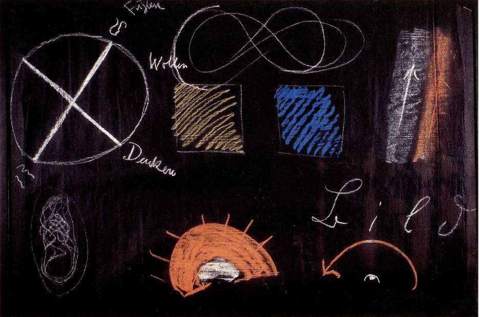
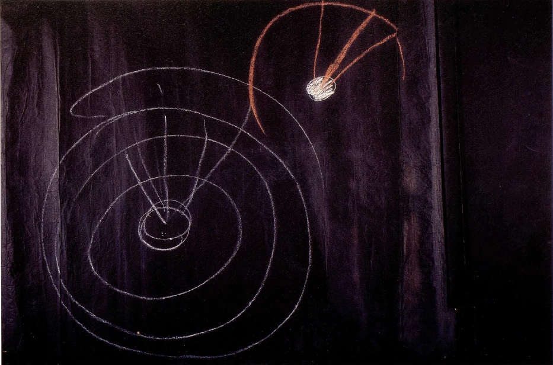

[ 1 ] ^if1mal

Ich wollte Sie in diesen Betrachtungen auf einiges aufmerksam machen, das wiederum zu einer konkreteren Betrachtung des Universums führen muß, als es die kopernikanische Weltanschauung ist. Wir müssen ja nicht vergessen, daß diese kopernikanische Weltanschauung in der Zeit entstanden ist, in der die Menschen seit der Mitte des 15. Jahrhunderts immer mehr neigten zur abstraktesten Weltauffassung, dazu neigten, am meisten zu abstrahieren, und daß wit nötig haben - dies ist besonders zu betonen -, aus dem bloßen Abstrahieren herauszukommen und wiederum bestimmte Vorstellungen, die auch anderes als bloß Abstraktes zum Inhalte haben, auf das Weltenall anzuwenden. Es handelt sich nicht darum, daß wir nun gleich in allen Einzelheiten ein dem kopernikanischen Weltbilde ähnliches Weltenbild, nur mit ein bißchen anderen Linien, auf die Tafel zeichnen können. Es fiel mir das stark auf an den verschiedenen Frage-Sehnsuchten, die gestern aufgetaucht sind. Da handelte es sich darum, daß man gleich wieder Linien zeichnen wollte, die nun wiederum in äußerster Abstraktion darstellen würden ein Weltenbild. Darauf kommt es ja nicht an, sondern es kommt eben darauf an, das Außermenschliche in seiner Durchgeistigung zu erfassen, um eine Brücke schlagen zu können vom Geistigen im Menschen zum Geistigen außerhalb des Menschen. Sie müssen ja auch bedenken, daß hier jetzt in diesem Augenblicke jedenfalls nicht die Aufgabe vorliegen kann, eine mathematische Astronomie vorzutragen. Das würde nötig machen, daß man aus den Elementen heraus diese mathematische Astronomie erst erarbeitete. Denn die Grundvorstellungen, die man heute verwendet, die sind eben aus der ganzen materialistischen Denkweise seit der Mitte des 15. Jahrhunderts entstanden. Und es handelt sich darum, daß man, wenn man das Weltenbild, das wir skizziert haben, abschließen würde, daß man dann nötig hätte, ganz aus den Elementen heraus zu arbeiten. Denn sehen Sie, gerade an dem Schicksal, möchte ich sagen, das der Kopernikanismus erfahren hat, ist es ja zu ersehen, daß es immer zu gewissen, ich möchte sagen, intellektuellen Exzessen führen wird, wenn man zu stark nach dem Abstrakten hinstrebt. Denn Kopernikanismus ist eigentlich nicht das, was er bei den Kopernikanern geworden ist. Man hat aus gewissen Lehren des Kopernikanismus sich diejenigen herausgenommen, die einem gerade im Laufe der letzten Jahrhunderte gepaßt haben, und dadurch ist das heute schulmäßige Weltenbild entstanden. ^znslia

[ 2 ] ^yfgu8i

Ich möchte durchaus nichts beitragen dazu, daß nun wiederum, ohne von den Elementen auszugehen, ein solches schulmäßiges Weltenbild entsteht, nur daß man statt der bekannten Ellipse, in deren einem Brennpunkte die Sonne stehen soll, und in der sich die Erde bewegt mit einer zur Bahnebene schiefen Achse, daß man statt dessen nun eben eine Schraubenlinie aufzeichnet. Mir kam es darauf an, die Beziehungen des Menschen zur Welt darzustellen. Und nach dieser Richtung hin wollen wir diesmal die Sache verfolgen. ^hyxhac

[ 3 ] ^v6debr

Ich habe versucht auseinanderzusetzen, wie in dem Augenblicke, wo man nur ein wenig übergeht zu einem intensiveren Erleben, die drei Richtungen des Raumes für den Menschen selbst, der sich in seiner Gestalt erlebt, durchaus nicht gleichwertig sind, wie diese vielmehr voneinander verschieden sind. Nur die Kopfabstraktion verhält sich so, daß sie gleichgültige drei Raumdimensionen daraus abstrahiert, indem sie nicht unterscheidet in bezug auf das Dreidimensionale das Oben und Unten, das Rechts und Links, das Vorne und Rückwärts, sondern Vorne und Rückwärts, Oben und Unten, Rechts und Links eben als drei Linien einfach auffaßt. Man würde gleich wiederum in einen ähnlichen Fehler verfallen, wenn man nun einfach abstrakt in den Raum hinein konstruieren wollte. Worauf es ankommt, das kann uns an anderen Dingen - wenigstens zunächst einmal, ich möchte sagen - sich verdeutlichen. ^hdg246

[ 4 ] ^i1e5mu

Sehen wir — wirklich aber nur um zu verdeutlichen — einmal auf die Farben hin. Ich möchte das Beispiel der Farbe noch einmal erwähnen. Nehmen wir einmal an, wir haben eine blaue Fläche und wir haben eine meinetwillen gelbe Fläche (Tafel 5, die beiden Quadrate, links blau, rechts gelb). Dieselbe Weltanschauung, welche das kopernikanische Weltbild aus ihren Abstraktionen heraus gestaltet hat, die hat es ja auch zuwege gebracht, zu sagen: Vor mir steht das Blau, vor mir steht das Gelb. Das rührt davon her, daß irgend etwas auf mich einen Eindruck macht. Dieser Eindruck erscheint mir als Gelb, als Blau. - Ja, es handelt sich darum, daß man nun gar nicht anfängt, auf diese Weise zu theoretisieren: Vor mir steht das Gelb, vor mir steht das Blau, und es macht auf mich irgend etwas einen Eindruck. Sehen Sie, das ist ein Vorgehen, welches zu vergleichen ist mit dem Worte Bild (das Wort wird an die Tafel geschrieben). Wenn jetzt jemand kommt und nachgrübelt: B, dahinter muß irgend etwas sein, hinter diesem B suche ich Schwingungen, die verursachen mir dieses B. Dann wiederum hinter dem z Schwingungen, hinter dem Schwingungen und so weiter. Das hat keinen Sinn. Es hat nur einen Sinn, daß wir die vier Buchstaben miteinander verbinden, innerhalb ihres eigenen Planes, möchte ich sagen, verbinden, und «Bild» lesen; daß wir nicht nachspekulieren: Was ist da drinnen? - sondern daß wir «Bild» lesen. Und so kommt es darauf an, daß wir uns hier sagen, es veranlaßt mich diese Fläche (blau) dazu, mich gewissermaßen hinter sie zu vertiefen, in sie einzudtringen. Diese Fläche (gelb) veranlaßt mich dazu, von ihr mich zu entfernen. Diese Gefühle, in welche die Eindrücke übergehen, die versuche man ins Auge zu fassen, dann kommt man zu dem Konkreten. Und wenn man so dasjenige, was man innerlich erlebt, in dem Äußeren sucht, dann kommt man ja auch zu dem Gefühl, daß man ja gar nicht da in sich drinnen ist, sondern daß man mit seinem eigentlichen Ich in der Welt lebt, ausgegossen ist in der Welt. Die Atomisten sollten, statt daß sie hinter der äußeren Welt Schwingungen suchen, ihr Ich dahinter suchen und suchen, wie ihr Ich eingefaßt ist, wie es hineinergossen ist in diese äußere Welt. So wie wir bei der Farbe suchen sollen, ob wit uns in sie vertiefen sollen oder von ihr uns abgestoßen fühlen, so sollen wir bei der Gestaltung unseres Organismus fühlen, wie die drei Richtungen, oben und unten, vorne und rückwärts, rechts und links, konkret voneinander verschieden sind, und wie, wenn wir uns in die Welt hineinstellen, diese drei Richtungen innerlich verschieden erlebt werden. Und wenn wir uns dann wissen als Menschen auf der Erde stehend, die Erde umgeben von den Planeten, Fixsternen, dann fühlen wit uns auch da drinnen als dazugehörig. Aber wir werden auch da drinnen fühlen, daß es nicht bloß darauf ankommt, drei aufeinander senkrechte Dimensionen zu ziehen, sondern daß es darauf ankommt, zu konkretisieren im Weltenall, einzudringen in das Konkrete der Richtungen. ^ot2bnj

 ^spfbu8

[ 5 ] ^au0ndc

Nun, eines ergibt sich unmittelbar für denjenigen, der die äußere Welt betrachtet des Nachts, eines, das sich immer ergeben hat, solange die Menschen Sterne betrachtet haben des Nachts. Es ist dasjenige, was wir den Tierkreis nennen. Und ebenso ergibt sich, daß, ob wir nun an das ptolemäische Weltensystem glauben oder an das kopernikanische — das ist dafür einerlei —, es ergibt sich, daß, wenn wir den scheinbaren Lauf der Sonne verfolgen, wir die Sonne im Tierkteis verlaufend sehen. Auch bei ihrem Tageslauf sehen wir sie gewissermaßen den Tierkreis durchlaufen. Damit aber ist uns mit diesem Tierkreis, wenn wir uns lebendig hineinstellen in die Welt, etwas Wesentliches, etwas Bedeutsames gegeben. Wir können nicht jede beliebige andere Ebene, die in den Himmelsraum hineingestellt ist, als gleichwertig mit dem Tierkreis auffassen, geradesowenig wie wir die Ebene, die uns entzweischneidet und unsere Symmetrie bedingt, in einer beliebigen Weise setzen können. So daß wit sagen können: Es ist dasjenige, was wir als Tierkreis empfinden oder sehen, so, daß wir durch ihn eine Art Ebene legen können. Ich will annehmen, diese Ebene läge in der Tafel drinnen. Das sei der Tierkreis (es wird der Kreis links oben gezeichnet), so daß seine Ebene eben die Ebene der Tafel sei. Damit haben wir da eine Ebene im Weltenraum vor uns geradeso, wie wir drei Ebenen im Menschen eingezeichnet uns gedacht haben. Das ist zweifellos eine Ebene, von der wir sagen können, sie lebt sich für uns fix dar. Wir beziehen, indem wir die Sonne den Tierkreis durchlaufen sehen, die Erscheinungen des Himmels auf diese Ebene. Das ist zu gleicher Zeit ein Analogon außermenschlicher Art zu dem, was wir im Menschen selbst als solche Ebene empfinden müssen, erleben müssen. Und nun werden wir - geradeso, wie wir, wenn wir zum Beispiel die Symmetrie-Ebene beim Menschen ziehen, nicht ohne ein innerliches konkretes Verhältnis denken können, daß auf der einen Seite die anders als der Magen geartete Leber, und auf der anderen Seite der Magen liegt -, so werden wir uns auch nicht denken können, daß da bloß Raumlinien liegen, sondern daß dasjenige, was im Raume ist, in bestimmten Wirkungskräften sich äußert und daß es nicht gleichgültig ist, ob das links oder rechts ist, sondern daß es sehr darauf ankommt. Ebenso werden wir uns zu denken haben, daß bei dem Organismus des Weltenalls es darauf ankommt, ob etwas oberhalb des Tierkreises oder unterhalb des Tierkreises ist. Wir werden anfangen über dasjenige, was da als Weltenraum vorhanden ist, von Sternen besät ist, so zu denken, daß wir es gestaltet denken. ^wvq9ef

[ 6 ] ^c931sr

Ebenso, wie wir diese Ebene hier haben, die die Ebene der Tafel ist, können wir uns eine andere denken, die darauf senkrecht ist. Denken Sie sich eine Ebene, welche etwa verläuft von dem Sternbilde, das wir als das des Löwen bezeichnen, bis zum Sternbild des Wassermanns auf der anderen Seite. Dann können wir uns eine dritte Ebene darauf senkrecht denken, die vom Stier bis zum Skorpion geht, und wir haben drei aufeinander senkrechte Ebenen in den Weltenraum eingezeichnet. Diese drei aufeinander senkrechten Ebenen sind analog den drei Ebenen, die wir in den Menschen uns eingezeichnet gedacht haben. Wenn Sie sich vorstellen jene Ebene, die wit bezeichnet haben als die des Wollens, die also unser Vorderes und Rückwärtiges voneinander abtrennt, so würden Sie die Ebene des Tierkreises selber haben. Wenn Sie sich denken die Ebene, die vom Stier zum Skorpion verläuft, so würden Sie die Ebene des Denkens haben, das heißt, unsere Denkebene würde zugeordnet sein dieser Ebene. Und die dritte Ebene würde diejenige sein des Fühlens. Sie haben also da den Weltenraum ebenso durch drei Ebenen gegliedert, wie Sie den Menschen vorgestern durch drei Ebenen gegliedert gesehen haben. ^ktjzau

[ 7 ] ^jkgh2b

Das ist zunächst das Wichtige, nicht einfach umzulernen schnell das kopernikanische Weltensystem, sondern sich auf dieses Konkrete einzulassen, gewissermaßen den Weltenraum selbst so organisiert zu denken, daß man drei solche aufeinander senkrecht stehende Ebenen hineingliedern kann, wie man in den Menschen diese drei aufeinander senkrecht stehenden Ebenen hineingliedern kann... ^2i66u6

[ 8 ] ^brfj4y

Nun, die nächste Frage, die für uns entstehen muß, ist die folgende: Ist der Mensch wirklich restlos zusammengegliedert mit alledem, was uns da als äußeres Weltenbild, den Menschen miteingeschlossen, erscheint? Wir haben gestern darauf aufmerksam gemacht, daß die Erde mit der Sonne und den anderen Planeten in einer Schraubenlinie vorrückt. Es ist das natürlich auch nur schematisch, denn die Schraubenlinie ist selber gebogen. Aber darauf kommt es nicht an. Jetzt kommt es darauf an, daß die Erde in einer solchen Schraubenlinie hinter der Sonne herläuft. Darauf habe ich gestern aufmerksam gemacht. Nun handelt es sich darum: Ist der Mensch wirklich in diese Bewegung so eingespannt, daß er sie unbedingt mitmachen muß? Dann, wenn der Mensch in diese Bewegung so eingespannt ist, daß er sie absolut mitmachen muß, dann ist für die Freiheit, dann ist für die Betätigung der Moralität überhaupt kein Platz für den Menschen da. Vergessen wir nicht, daß wir gerade von dieser Frage ausgegangen sind, wie wir die Brücke schlagen können von der bloßen Naturnotwendigkeit zur Moralität herüber, zu dem, was unter dem Impuls der Freiheit geschieht. ^ltudj7

[ 9 ] ^u0hqy4

Ja, sehen Sie, da kommen Sie nicht zurecht, wenn Sie bloß das zu Hilfe nehmen, was Ihnen die kopernikanische Weltanschauung gibt. Denn was gibt sie Ihnen denn? Sie stellen sich die Erde vor. Da stehen Sie drauf. Ob die Erde nun meinetwillen fortsaust oder die Sonne fortsaust, das macht es ja nicht aus. Wenn die Dinge in einer absoluten Naturkausalität mit dem Menschen verknüpft sind, so ist es ja nicht möglich, daß der Mensch irgendwie seine Freiheit entfalten kann. Wir müssen daher die Frage stellen: Liegt die ganze Wesenheit des Menschen innerhalb dieser Naturkausalität drinnen oder ragt sie heraus? Aber wir dürfen diese Frage nicht so stellen, wie sie von den Materialisten des 19. Jahrhunderts gestellt worden ist, die darauf aufmerksam gemacht haben, daß ja schon so viele Menschen gestorben sind auf der Erde, daß es gar nicht möglich wäre, daß alle die Seelen der Verstorbenen Platz haben sollten. Sie haben nach dem Platz, den die Seelen einnehmen, gefragt. Es handelt sich darum, inwieferne das einen Sinn hat, nach dem Platz der Seele zu fragen. ^ln6iul

[ 10 ] ^filruv

Nun, sehen Sie, da müssen wir vor allen Dingen uns darüber klar sein, daß der ganze Sinn des Geschehens im Weltenall - und Bewegen ist auch ein Geschehen - uns nur vor Augen tritt, wenn wir es in bestimmten Fällen fassen. Sehen Sie, wir unterscheiden irgendwie das, was sich da vollzieht in diesen vier oder acht Gebieten drinnen, was da ober- und unterhalb der Tierkreisebene, rechts und links von der Fühlensebene, nach dieser Seite und nach dieser Seite von der Denkebene liegt, wir fühlen, daß irgend etwas vom Weltgeschehen damit zusammenhängt. Und indem wir eine gewisse Art des Weltengeschehens herausnehmen, zeigt es sich in einer solchen Wiederholung, daß wir es als den Jahreslauf bezeichnen. Wir bezeichnen es als Jahreslauf, und wir müssen uns jetzt fragen in konkreter Weise: Wie können wir einen Zusammenhang des Menschen mit dem äußeren Weltenjahreslaufe finden? Zunächst finden wir, indem der Mensch aus der geistigen Welt heruntersteigt in die physische, daß er durch die Konzeption geht. Dann verweilt er etwa neun Monate im Embryonalzustand. Das sind drei Monate weniger als der Jahreslauf. Wir könnten sagen: Das ist etwas ganz Unregelmäßiiges. Der Mensch in seiner Entwickelung zeigt schon im Beginne seines physischen Erdenwerdens, daß er scheinbar sich nicht kümmert um den Lauf des Weltgeschehens draußen. Aber es ist nicht so. Wenn wir Sinn dafür haben, das Kind zu beobachten in den dtrei ersten Monaten seines Erdenlebens, so ist in der Tat das, was da in den ersten drei Monaten geschieht, im rechten Sinne eine Fortsetzung seines Embryonallebens. Eine solche Fortsetzung ist dasjenige, was mit dem Gehirn geschieht, und auch was sonst geschieht gerade mit dem Kinde. Diese ersten drei Monate, die das Jahr voll machen, können wir in einer gewissen Beziehung hinzurechnen noch zu dem Embryonalleben, so daß wir sagen können: in einer gewissen Beziehung ist das erste Jahr der menschlichen Entwickelung doch in den Jahreslauf hineingestellt. ^5rn7cl

[ 11 ] ^1ljn3g

Dann kommt wiederum ein Jahr, ungefähr ein Jahr. Denn wenn wir den Menschen nach diesem ersten Jahre ansehen, dann wird er — natürlich ist die Sache im Mittel zu nehmen, im arithmetischen Mittel, aber approximativ ist es doch so -, dann wird er ungefähr so weit sein, daß er die Milchzähne bekommt. Wir schauen uns ein Jahr wiederum an, nachdem ein Jahr schon abgeflossen war seit der Konzeption, schauen uns das weitere Jahr an und finden in diesem weiteren Jahre die Entwickelung der ersten Zähne mit dem Jahreslauf im Mittel übereinstimmend. Und jetzt fragen wir uns: Geht das so fort? Nein, das geht nicht so fort. Denn in der Tat, das erste Zahnen scheint ein innermenschlicher Jahreslauf zu sein, ist es auch, so wie das erste Jahr des Menschen ein innerer Jahreslauf des Menschen ist. In dem Bilden der Milchzähne arbeitet im Menschen offenbar das Weltenall. Dann tritt etwas anderes ein. Dann arbeitet in ihm in einem Zeitraume nach der Geburt, der siebenmal größer ist, diejenige Kraft, die aus ihm heraus die zweiten Zähne treibt. Da geht etwas vor sich, was wit jetzt nicht mit dem Weltenlauf in einen Zusammenhang bringen können, sondern was mit etwas zusammenhängt, was sich dem Weltenlaufe entzieht, was aus dem Innern des Menschen heraus wirkt. ^srs2zs

[ 12 ] ^p1xhkr

Jetzt haben Sie etwas Konkretes. Jetzt haben Sie, ich möchte sagen, den Weltenorganismus mit Bezug auf eine Tatsachenreihe in den Menschen hineinprojiziert in seiner Bildung der Milchzähne. Und dann wiederum schauen Sie hin auf das Entstehen der bleibenden Zähne, die aus dem Menschen herauskommen. Dasjenige, was da als bleibende Zähne herauskommt, das stellt eine innere menschliche Weltenordnung in die äußere hinein. Da haben Sie die erste Ankündigung des Freiseins darin zu sehen, daß der Mensch etwas vornimmt, was sich ganz deutlich zeigt in seiner Abhängigkeit vom Weltenall dadurch, daß es den Zeitenlauf des Weltenalls einhält auch im Innern des Menschen, daß der Mensch dann aber das verlangsamt in sich, daß er demselben Prozeß eine andere Geschwindigkeit gibt, eine siebenmal so kleine Geschwindigkeit gibt. Daher dauert sie eben siebenmal länger. Da haben Sie gegenübetgestellt das Innere des Menschen und das Äußere des Weltenalls. ^9a4m22

[ 13 ] ^0j9qqr

Wir haben in einer sehr anschaulichen Weise eine gewisse Abhängigkeit des Menschen von dem äußeren Weltenall dadurch gegeben, daß wir wechseln zwischen Schlafen und Wachen, und der Wechsel zwischen Tag und Nacht für verschiedene Teile der Erde zu verschiedenen Zeiten stattfindet. Was bedeutet für uns Menschen das Wechseln zwischen Wachen und Schlafen? Es bedeutet, daß wir, grob gesprochen, einmal herumgehen, indem unser Ich und unser Astralleib mit unserem Ätherleib und physischen Leib vereinigt sind, das andere Mal, indem die beiden - Ich und astralischer Leib auf der einen Seite, Ätherleib und physischer Leib auf der anderen Seite - voneinander getrennt sind. ^cmuyd2

[ 14 ] ^tpnf9e

Aber die Sache liegt doch so, daß der Mensch im heutigen Kulturzyklus, insbesondere wenn er sich einen zivilisierten Menschen nennt, nicht mehr voll abhängig ist von dem Naturzyklus. Es sieht der Zyklus von Wachen und Schlafen in seinem Zeitmaß dem Naturzyklus noch ähnlich. Aber es gibt doch heute sogar schon Menschen - ich habe solche gekannt -, die machen die Nacht zum Tag, den Tag zur Nacht, kurz, der Mensch kann sich herausreißen aus der Zusammengehörigkeit mit dem Weltenlauf. Aber seine Gesetzmäßigkeit, die Aufeinanderfolge der Zustände in ihm, zeigt noch das Nachbild dieser äußeren Gesetzmäßigkeit. Und so ist es bei vielen Erscheinungen im Menschen. Wenn wir so sehen, wie der Mensch wechselt zwischen Wachen und Schlafen, und die Natur wechselt zwischen Tag und Nacht, und der Mensch heute zwar an den Wechsel von Wachen und Schlafen gebunden ist, aber nicht an das Einhalten von Tag und Nacht, so müssen wir sagen: er war einmal mit seinen inneren Zuständen an den äußeren Weltenlauf gebunden und hat sich losgerissen davon. Der zivilisierte Mensch ist heute fast ganz losgerissen von dem äußeren Naturlauf und kehrt eigentlich nur dann zu ihm zurück, indem er einsieht, also durch den Intellekt entdeckt, daß es ihm besser ist, wenn er in der Nacht schläft statt bei Tag. Aber es ist nicht so, daß die Nacht den Menschen so erfaßt, daß er unbedingt einschlafen müßte. Das ist im Grunde eigentlich für alle zivilisierten Menschen so, daß sie nicht fühlen, die Nacht macht mich einschlafen, der Tag weckt mich auf. Höchstens wenn die Nacht hereinsinkt und hier noch ein Vortrag gehalten wird, dann wirkt die Nacht vielleicht auf manchen so, vereinigt mit dem Vortrage, daß er unbedingt das als eine Naturaufforderung zum Einschlafen empfindet. Aber das sind ja Dinge, die wir nicht unbedingt in unser Weltbild hineinzuschieben brauchen. ^5e8nw7

[ 15 ] ^d2ikgv

Also dasjenige, um was es sich handelt, ist, daß der Mensch sich herausgerissen hat aus dem Naturverlaufe, aber im rhythmischen Ablauf noch zeigt das Bild dieses Naturverlaufes. Sehen Sie, wie Übergänge da stattfinden von einem zum andern. Wir können sagen, wit sind mit unserm Wachen und Schlafen so, daß wir den Naturlauf noch deutlich im Bilde zeigen, aber uns losgerissen haben von diesem Naturlauf. Wenn wir die zweiten Zähne bekommen, da ist es so, daß wir gar nicht mehr in der Zeitfolge ein Bild zeigen von dem, was der Naturlauf ist, der sich noch ausdrückt im Bekommen der ersten Zähne. Aber dasjenige, was da bei uns auftritt, dieses Bekommen der zweiten Zähne, das ist ein neuer Naturlauf. Denn das haben wir nicht so in der Hand wie Schlafen und Wachen. Da will unsere Willkür nicht hinein. Da wird etwas herausgestellt aus der Natur, das gar nicht drinnensteht im großen Verlaufe der Natur, sondern das der Mensch eigens für sich hat. Aber es ist nicht in seiner Willkür gelegen. Es stellt sich eine andere Naturordnung in die erste hinein. ^snz4qy

[ 16 ] ^jrd16r

Indem ich Ihnen diese Dinge auseinandersetze, sage ich Ihnen ja im Grunde alltägliche Dinge. Aber es handelt sich darum, solche alltäglichen Dinge in der richtigen Weise zu durchschauen. Sehen Sie, Sie werden sich jetzt sagen müssen: Es gibt ein gewisses Naturgeschehen. In dieses Naturgeschehen ist eingespannt das Bekommen der ersten Zähne des Menschen. Ich will bildlich dieses Naturgeschehen in dieser Strömung, möchte ich sagen, so zeichnen (Tafel 5, rechts oben die linke Strömung). Da ist ein allgemeines Naturgeschehen, und in diesem schwingt fort, indem es ein Teil davon ist, das Entstehen der ersten Zähne des Menschen. Und dann haben wit ein anderes Naturgeschehen, das aber gar nicht in dem allgemeinen Weltengeschehen drinnen ist, das der Mensch für sich hat: das Bekommen der zweiten Zähne. Wollten Sie das zeichnen, so müßten Sie es so zeichnen, daß es eine andere Strömung wäre (die Strömung rechts davon, rot). Aber so wäre es ja noch nicht herauszubekommen, da wäre es ja gleich. So können wir es also nicht zeichnen, sondern müssen das ganz anders machen. Wir müssen, wenn wir das Verhältnis bezeichnen wollen zwischen dem ersten Zähne-Bekommen und dem zweiten Zähne-Bekommen, dieses erste Zähne-Bekommen vielleicht so zeichnen (Mitte unten; der weiße Kern) - und das zweite Zähne-Bekommen, das müssen wir vielleicht so zeichnen (der breite Ring um den Kern, rot), daß dieses Weiße in dem Roten hier siebenmal drinnen ist (7 Abschnitte werden angedeutet). Das heißt, wenn Sie es nebeneinander zeichnen, parallel, dann bekommen Sie kein Bild von dem Verhältnis des ersten Zähne-Bekommens zum zweiten, sondern Sie bekommen nur ein Bild, wenn Sie diejenige Kraft, von welcher abhängt das erste Zähne-Bekommen, von einer andern Kraft umkreisen lassen, von der abhängt das zweite Zähne-Bekommen. ^pz9ph3

[ 17 ] ^tb0lm0

Sie sehen, es entsteht da einfach die Notwendigkeit, daß sich die Bewegung krümmt durch den Geschwindigkeitsunterschied. Denken Sie also, wenn irgendwo im Weltenraume sich ein Stern befindet, und um diesen Stern kreist ein anderer, so daß durch sein Umkreisen irgendein Stück siebenmal sich da findet (unten rechts auf der Tafel, großer Bogen rot), so bekommen Sie einfach durch den Tatbestand der Umkreisung etwas Qualitatives, ein Schaffen. ^qewb7q

[ 18 ] ^n3n5vp

Sehen wir also hin auf das erste Zähne-Bekommen und auf das zweite Zähne-Bekommen, so müssen wir uns sagen: Das muß irgend etwas zu tun haben im Weltenraum mit Kräften, von denen die eine die andere umkreist - ich will dieses Beispiel vor Sie hinstellen aus dem Grunde, damit Sie sehen, was es heißt, konkret anzuschauen Bewegungen im Weltenraume, was es heißt, über konkrete Bewegungen im Weltenraume zu sprechen - und wie es eine leere Redensart ist, wenn man sagt: Der Jupiter ist so und so viele Meilen von der Sonne entfernt und umkreist die Sonne in einer bestimmten Linie; der Saturn ist so weit entfernt und umkreist die Sonne in dieser Linie (Mitte oben). — Damit ist gar nichts gesagt. Das ist eine leere Redensart. Wissen tut man über diese Dinge erst dann etwas, wenn man einen Inhalt damit verbindet, daß so etwas Jupiter-Bahn ist, so etwas Saturn-Bahn ist und dem Umkreisen des einen durch den anderen dient. In diesem Stücke ist einfach die Notwendigkeit bestimmten Geschehens gegeben. ^03s4nq

[ 19 ] ^6x2xf9

Indem ich Ihnen diese Dinge vor Augen führe, werden Sie vielleicht sagen, sie sind schwer verständlich, oder vielleicht werden Sie es auch nicht sagen; dann werden Sie wahrscheinlich finden, daß man über diese Dinge überhaupt nicht zu reden braucht. Aber man muß über diese Dinge reden, denn indem man lernen wird, wiederum über diese Dinge zu reden, wird man zur bestimmten Anschauung der Welt erst wiederum vordringen. Und man wird sich abgewöhnen, was so einseitig beim Kopernikanismus hervorgetteten ist: das bloße Vorstellen der Weltenbewegungen nach Linien. Es sollte vielmehr jetzt in die Menschheit etwas hineinkommen, was ihr sagt: Es ist notwendig, daß man zuerst über die elementarsten Erlebnisse sich klar wird, bevor man den Blick hinauswendet auf die äußersten Geheimnisse des Weltenalls. ^gfga2z

[ 20 ] ^e4l091

Was gewisse Zusammenhänge, die wir einfach ablesen von den Sternen, bedeuten, das lernen wir erst, wenn wir die entsprechenden Vorgänge im eigenen Organismus erfassen. Denn was innerhalb unserer Haut liegt, das ist nichts anderes als das Spiegelbild des äußeren Weltorganismus. Wenn Sie also den Menschen schematisch hier haben, und Sie haben da seinen Blutumlauf irgendwie, schematisch bloß, so verfolgen Sie die Bahn dieses Blutumlaufes (dieselbe Tafel, links unten). Versuchen Sie die Bahn dieses Blutumlaufes zu verfolgen. Das ist im Innern des Menschen. Gehen Sie hinaus in das Weltenall, suchen Sie sich die Sonne auf, sie entspricht — darüber wollen wir dann das nächste Mal reden - dem Herzen im Innern des Menschen. Und dasjenige, was vom Herzen aus dutch den Körper geht, oder eigentlich vom Körper aus zum Herzen, so unregelmäßig es eigentlich ist, das ist in Wahrheit ungefähr ähnlich den Bewegungen, die mit dem Sonnenlauf zusammenhängen. Statt abstrakte Linien zu zeichnen, sollte man in den Menschen hineinschauen. Dann würde man innerhalb seiner Haut dasjenige finden, was außerhalb im Himmelsraum ist; dann würde man aber auch den Menschen hineingestellt finden in die Weltenordnung, würde aber auch finden, wie er auf der anderen Seite wiederum von dieser Weltenordnung unabhängig ist. Wie er stückweise unabhängig wird, habe ich Ihnen gezeigt. Wir werden darüber das nächste Mal noch weiter sprechen. Aber das wollen wit uns jetzt vor Augen führen, daß, wenn wir hier schematisch so etwas aufzeichnen, es eben ein Schema ist. ^wmtrxk

[ 21 ] ^rwnicd

Sehen Sie sich einmal den Hauptverlauf der Blutgefäße im menschlichen Organismus an. Da, von oben aus gesehen, hat es schon etwas Ähnlichkeit mit einer Schleifenlinie. Statt daß wir an der Tafel zeichnen, sollten wir die Hieroglyphen verfolgen, die in uns selbst hineingezeichnet sind. Dann aber sollten wir aus diesem Qualitativen verstehen lernen, was da draußen im Weltenall ist. Das können wir nur, wenn wir imstande sind, folgendes erlebend zu erkennen und erkennend zu erleben, wenn wir uns vor allen Dingen vorführen das, was ich in den öffentlichen Vorträgen - im ersten hier ja erwähnt habe, daß es sich in der Geisteswissenschaft darum handelt, zu erkennen, daß nicht das Herz wirkt wie eine Pumpe, die das Blut durch den Leib treibt, sondern daß das Herz bewegt wird von der Blutzirkulation, die ein in sich Lebendiges ist. Und die Blutzirkulation wird wiederum bedingt von den Organen. Das Herz - Sie können das embryologisch verfolgen - ist ja nichts weiter eigentlich als das Ergebnis der Blutzirkulation. Versteht man dasjenige, was das Herz im menschlichen Leibe ist, dann lernt man auch verstehen, daß die Sonne nicht das ist, was Newton meint, der allgemeine Seilzieher, der da seine Seile, Gravitationskraft genannt, hinüberschickt nach den Planeten, nach Merkur, Venus, Erde, Mars und so weiter - da zieht er an den Seilen, die man nur nicht sieht, die Anziehungskräfte sind, oder er spritzt ihnen das Licht hinaus und dergleichen (Tafel 6, oben, Umkreis und Radien tot) -, sondern, so wie die Herzbewegung das Ergebnis ist des Lebendigen der Zirkulation, so ist die Sonne nichts anderes als das Ergebnis des ganzen Planetensystems. Die Sonne ist Resultat, nicht Ausgangspunkt (dieselbe Tafel, unten). Das lebendige Zusammenwirken des Sonnensystems ergibt in der Mitte eine Aushöhlung, die da spiegelt. Und das ist die Sonne. Ich habe deshalb öfters zu Ihnen gesagt, die Physiker würden höchst erstaunt sein, wenn sie in die Sonne fahren könnten und dort das ganz und gar nicht finden würden, was sie jetzt meinen, sondern bloß einen Hohlraum finden würden, noch dazu einen saugenden Hohlraum, der alles vernichtet in sich, so daß er mehr ist als ein Hohlraum. Ein Hohlraum, der tut doch wenigstens nichts anderes als aufnehmen das, was man in ihn hineingibt. Aber die Sonne ist ein solcher Hohlraum, daß wenn man etwas in ihren Raum hineinbringt, sie es dann sofort aufsaugt und verschwinden läßt. Da ist nicht nur nichts, da ist weniger als nichts. Und dasjenige, was uns zuscheint im Lichte, das ist Rückstrahlung desjenigen, was erst aus dem Weltenraum hinkommt - so wie die Bewegung des Herzens nichts anderes ist als dasjenige, was aus der Lebendigkeit von Durst und Hunger und so weiter, in der Zusammenwirkung der Organe, in der Blutbewegung im Herzen sich staut. ^kb14po

 ^wfzrrz

[ 22 ] ^fxid7d

Verstehen wir, was im Innern des Organismus vorgeht, dann verstehen wir aus dem heraus auch dasjenige, was außen im Weltentaum vorgeht. Die abstrakten Raumesdimensionen, in die wir dann unsere Linien hineinzeichnen, die sind nur dazu da, daß wir bequem die Dinge verfolgen. Wollen wir sie der Wahrheit gemäß verfolgen, dann müssen wir versuchen, innerlich uns zu erleben und uns dann mit dem innerlich Verstandenen nach außen zu wenden. Die Sonne versteht derjenige, der das menschliche Herz versteht. Und so das andere Innere des Menschen. ^glg34u

[ 23 ] ^jyu6z9

Es handelt sich also viel, viel mehr darum, daß wir ernst nehmen dieses «Erkenne dich selbst» und von dem «Erkenne dich selbst» aus in die Erfassung des Weltalls hineingehen. Von einer Selbsterkenntnis des ganzen Menschen aus sollen wit erfassen das außermenschliche Weltenall. ^6ph2u2

[ 24 ] ^l1c2dd

Sie sehen, da wird es nicht so schnell gehen mit dem Konstruieren eines Weltenbildes! Natürlich, um ein paar Eigenschaften dieses Weltenbildes sich klar zu machen, kann man diese Schraubenlinie zeichnen; ein paar Eigenschaften werden dadurch charakterisiert, aber den wirklichen Tatbestand gibt es nicht. Denn um ein paar andere Eigenschaften zu charakterisieren, müssen wir die Spirale selber wieder spiralig verlaufen lassen, das heißt, diese Linie hier ist krumm. Auch dann haben wir noch nicht alles; denn gewisse Tatbestände von der Art, wie sich das Wachsen der einjährigen Zähne verhält zum Wachsen der Sieben-Jahr-Zähne, müssen wir durch ein Verschieben der Linie in sich charakterisieren. Sie sehen also, ganz schnell geht das nicht, sich den Weltenraum zu konstruieren! Auch dieser Verzicht muß kommen, mit ein paar Linien sich ein Weltenbild konstruieren zu wollen, und man muß lernen ernst zu nehmen so etwas, wie: die äußere Welt, wie sie sich uns darbietet, ist die Täuschung. Die mathematisierte Welt ist erst recht eine Täuschung. ^646bk3

[ 25 ] ^nrskp2

Das ist es, was ich zunächst wie eine Vorbereitung, die vorbereitende Betrachtung zu dem, was ich dann das nächste Mal ausführen will, habe geben wollen. Es mußte etwas schwieriger werden; aber wenn wir diese Schwierigkeiten überwunden haben, so werden wir eben auch die Vorbedingungen geschaffen haben, um die drei wichtigsten Lebensgebiete: Natur, Moral, Religion nun durch zwei entsprechende Brücken verbinden zu können. ^d8dccv

[ 26 ] ^a3207v

Davon wollen wir dann das nächste Mal sprechen. ^y4sa11