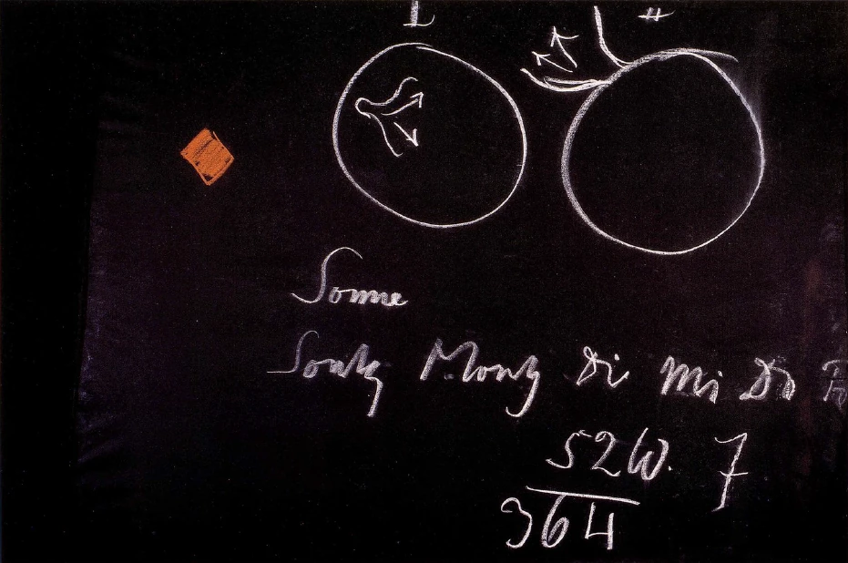
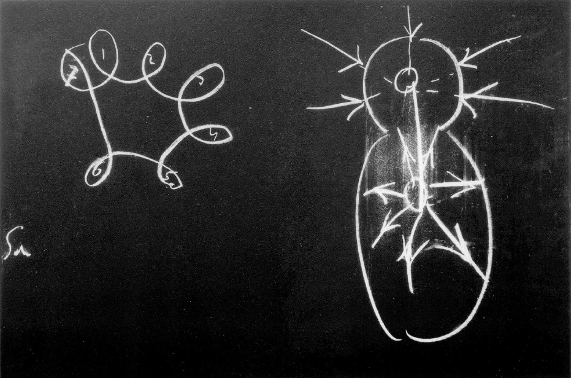

[ 1 ] ^tadv9o

Die letzten Betrachtungen hier waren gewidmet einem Wege, der entsprechend begangen dazu führt, eine Anschauung zu gewinnen über unser Weltenall und seine Organisation. Sie haben gesehen, daß dieser Weg notwendig macht, immerfort den Einklang aufzusuchen zwischen dem, was im Menschen selbst vor sich geht, und dem, was im großen Weltenall vor sich geht. Ich werde die folgenden Betrachtungen morgen und übermorgen so anzulegen haben, daß auch unsere von auswärts zur Generalversammlung gekommenen Freunde einiges von diesen Dingen werden haben können. Daher werde ich morgen von dem, was gesagt worden ist, kurz einiges zu wiederholen haben, das Wesentliche, um daran dann anderes anzuknüpfen. Heute will ich aber in den Gang unserer Betrachtungen einiges einfügen, das gerade geeignet sein kann, des Näheren auf den wahren Weg, das Weltall kennen zu lernen, hinzuweisen. ^57pxth

[ 2 ] ^0fvnvz

Wenn Sie meine «Geheimwissenschaft» durchgehen, so werden Sie sehen, daß bei dieser skizzenhaften Darstellung der Entwickelung des uns bekannten Weltenalls, wie sie gegeben ist in dieser «Geheimwissenschaft», überall die Beziehung zum Menschen festgehalten ist. Wenn Sie ausgehen von der Saturnentwickelung, um dann bis zu unserer Erdenentwickelung fortzuschreiten durch die Sonnen- und Mondenentwickelung, so wissen Sie ja, daß diese Saturnentwickelung dadurch charakterisiert wird, mitcharakterisiert wird, daß durch diese Saturnentwickelung die erste Anlage gemacht worden ist für die menschliche Sinnenhaftigkeit. Und so geht es dann weiter. Überall werden die Zustände des Weltenalls so verfolgt, daß man zu gleicher Zeit damit die Entwickelung des Menschen hat. Also, der Mensch wird nicht so gedacht im Weltenall stehend, wie das in der äußeren Naturwissenschaft heute geschieht, daß man das Weltenall auf der einen Seite betrachtet, und dann den Menschen auf der andern Seite, wie zwei nicht recht zueinander gehörige Wesenheiten, sondern beides wird ineinander gedacht, wird in seiner Entwickelung miteinander verfolgt. Dies muß auch durchaus berücksichtigt werden, wenn man von dem spricht, was gegenwärtig Eigenschaften, Kräfte, Bewegungen und so weiter des Weltenalls sind. Man kann nicht auf der einen Seite im kopernikanisch-galileischen Sinne das Weltenall rein räumlich abstrakt betrachten und daneben gewissermaßen dann den Menschen, sondern man muß beide ineinanderfließen lassen während der Betrachtung. ^o7fczb

[ 3 ] ^ikjfmo

Das ist aber nur dann möglich, wenn man eine gehörige Vorstellung von dem Menschen selbst erst gewonnen hat. Ich habe Sie schon darauf aufmerksam gemacht, wie wenig eingentlich die gegenwärtige naturwissenschaftliche Anschauung geeignet ist, Aufschlüsse über den Menschen selbst zu geben. Was tut sie denn eigentlich gerade da, wo sie aus ihren heutigen Voraussetzungen heraus am größten ist, diese Naturwissenschaft? Betrachten Sie sie nur. Sie stellt in einer Großartigkeit dar, wie der Mensch aus anderen Formen körperlich nach und nach sich entwickelt hat. Sie verfolgt, wie dann während der Embryonalzeit diese Formen wie in einer kurzen Wiederholung noch einmal durchgemacht werden. Das heißt, sie betrachtet den Menschen als das oberste der Tiere. Sie betrachtet die Tierheit, und dann setzt sie den Menschen zusammen aus alledem, was sie an der Tierheit gefunden hat. Das heißt, sie betrachtet alles Außermenschliche, um dann gewissermaßen zu sagen: So, hier Schlußpunkt, da endet das Außermenschliche, da kommt es beim Menschen an. — Es wird nicht der Mensch selbst als solcher betrachtet. Das ist dasjenige, was der heutigen Naturwissenschaft gar nicht gelegen ist, den Menschen als solchen zu betrachten, und daher gewinnt sie gar keine Anschauung von der menschlichen Wirklichkeit. ^i7athc

[ 4 ] ^fe3kmi

Sehen Sie, ich möchte hier ausgehen von etwas, was ich gestern an ganz anderem Orte und in ganz anderem Zusammenhange vor anderem Publikum entwickelt habe, was aber auch hier aufklärend in unserem jetzigen Zusammenhange wirken kann. Es wäre wirklich heute sehr vonnöten, daß die Menschen, die sachverständig auf diesem Gebiete sein wollen, zur Goetheschen naturwissenschaftlichen Betrachtung, insbesondere zur Betrachtung seiner Farbenlehre ein wenig ihre Zuflucht nehmen würden. In dieser Farbenlehre ist eigentlich eine ganz andere Methode der naturwissenschaftlichen Betrachtung eingeschlagen, als man sie heute gewohnt ist. Gleich im Beginne ist die Rede von den sogenannten subjektiven Farben, von den physiologischen Farben, und da wird sehr sorgfältig untersucht, wie das menschliche Auge als ein Lebendiges Erlebnisse hat an der Umgebung, wie diese Erlebnisse durchaus nicht einfach nur so lange dauern, als das Auge der Außenwelt exponiert ist, ausgesetzt Ist, sondern wie eine Nachwirkung da ist. Sie kennen ja alle die einfachste Erscheinung auf diesem Gebiete: Sie sehen auf eine begrenzte, sagen wir zum Beispiel rote Fläche (Tafel 13, Rhombus links, Pfirsichblüt), wenden dann das Auge rasch ab und sehen auf eine weiße Fläche: Sie sehen das Rot in der grünen Nachfarbe. Das heißt, das Auge steht noch in einem gewissen Sinne unter dem Eindrucke desjenigen, was es erlebt hat. Nun, wir wollen jetzt nicht die Gründe untersuchen, warum gerade eine grüne Nachfarbe erscheint, sondern wir wollen nur an der mehr allgemeinen Tatsache festhalten, daß das Auge nachher das Erlebnis noch nachklingen läßt. ^oeez6n

 ^5icb77

[ 5 ] ^w7jdvs

Da haben wir es zu tun mit einem Erlebnis an der Peripherie unseres menschlichen Leibes. Das Auge liegt an der Peripherie des menschlichen Leibes. Wir finden, wenn wir auf das Erlebnis des Auges hinschauen, daß durch eine gewisse begrenzte Zeit das Auge dieses Erlebnis noch ausklingen läßt. Dann ist das Erlebnis ganz abgeklungen. Dann kann das Auge unbeeinflußt durch das, was es erlebt hat, sich anderen Erlebnissen zuwenden. Betrachten wir rein anschauungsgemäß zunächst einmal eine Erscheinung, die nun nicht an ein einzelnes lokalisiertes Organ unseres Organismus gebunden ist, sondern an den ganzen Menschen gebunden ist, und wir werden, wenn wir uns unbefangener Beobachtung hingeben, nicht verkennen können, wie eben schon vor dieser Beobachtung dieses Erlebnis verwandt ist mit dem Erlebnis an dem lokalisierten Auge. Sie setzen sich einer Erscheinung, einem Erlebnis aus, Sie exponieren sich als ganzer Mensch diesem Erlebnis. Indem Sie sich als ganzer Mensch diesem Erlebnis exponieren, nehmen Sie es auf, so wie das Auge das Erlebnis der Farbe aufnimmt, gegenüber welcher es exponiert ist. Und jetzt können Sie erleben, daß noch nach Monaten, nach Jahren das Nacherlebnis, das Nachbild, in Form des Gedächtnisbildes aus Ihnen herauskommt. Es ist die ganze Erscheinung etwas anders, aber Sie werden das Verwandte des Erinnerungsbildes mit einem Nachbilde des Erlebnisses, das auf kurze, beschränkte Zeit das Auge hat, nicht verkennen können. ^mclal2

[ 6 ] ^33q4tx

So werden Fragen vor den Menschen in Richtigkeit hingestellt, und der Mensch kann ja nur etwas über die Welt erfahren, indem er in der richtigen Weise fragen lernt. Fragen wir uns einmal: Wie hängen diese beiden Erscheinungen zusammen, das Nachbild des Auges und das Erinnerungsbild an ein bestimmtes Erlebnis, das - wir wollen es ganz unbestimmt lassen woher — aus uns aufsteigt? — Sehen Sie, wenn man solche Fragen aufwirft und nach einer sachgemäßen Antwort sucht, so versagt sogleich die ganze Methode der gegenwärtigen naturwissenschaftlichen Betrachtung. Sie versagt aus dem Grunde, weil ja diese Betrachtung eines nicht weiß: sie weiß nicht die universelle Bedeutung der Metamorphose. Die ganze universelle Bedeutung der Metamorphose, die kennt die gegenwärtige Naturwissenschaft nicht. Diese Metamorphose ist etwas, was eben beim Menschen in dem einen Leben nicht abgeschlossen ist, was beim Menschen sich erst abschließt in den aufeinanderfolgenden Erdenleben. ^0fcf6z

[ 7 ] ^2fj3tq

Sie wissen, wir unterscheiden zunächst einmal, um eine Ansicht gewinnen zu können über den ganzen Menschen — wenn wir von der Dreigliedrigkeit absehen, nur auf zwei Glieder sehen, wobei wir das zweite und dritte zusammenfassen -, wir unterscheiden zunächst die menschliche Kopforganisation und den übrigen Menschen. Wir müssen, wenn wir die menschliche Kopforganisation studieren wollen, verstehen können, wie diese Kopforganisation mit der ganzen Entwickelung des Menschen zusammenhängt. Sie ist eine spätere Metamorphose, sie ist die Umbildung des ganzen übrigen Menschen hinsichtlich seiner Kräfte. Was Sie, indem Sie sich kopflos denken natürlich mit alledem, was vom Kopf in den übrigen Organismus hineingehört und zum Kopf eigentlich gehört —, was Sie da im übrigen Menschen sind, das fassen Sie ja natürlich zunächst substantiell auf. Aber dieses Substantielle kommt nicht in Betracht, sondern der Kräftezusammenhang dieser Substanz metamorphosiert sich im All zwischen dem Tode und einer neuen Geburt und wird im nächsten Erdenleben Kopforganisation. Das heißt, was Sie jetzt in Ihrem außer dem Kopf befindlichen Menschen an sich tragen, ist eine frühere Metamorphose der späteren Kopforganisation. Wenn Sie aber verstehen wollen, wie diese Metamorphose zusammenhängt, dann müssen Sie das Folgende ins Auge fassen. ^zy1ujt

[ 8 ] ^a1y3mp

Nehmen Sie einmal irgendein Organ — Leber oder Niere - Ihres übrigen Menschen und vergleichen Sie das mit Ihrer Kopforganisation, so finden Sie einen wesentlichen, durchgreifenden Unterschied. Sie finden nämlich den Unterschied, daß die ganze Tätigkeit der Organe Ihres außerkopflichen Menschen nach innen gerichtet ist. Wenn Sie zum Beispiel das Nierenorgan nehmen, so ist die ganze Tätigkeit nach dem Innern der Körperhöhle gerichtet. Dorthin ist die Tätigkeit des Nierensystems gerichtet. Und es ist diese Tätigkeit sogar auf Ausscheidung berechnet. Wenn Sie dieses Organ vergleichen mit irgendeinem Organ, das gerade für das Haupt, für den Kopf des Menschen charakteristisch ist, so können Sie das Auge nehmen. Das ist genau entgegengesetzt konstruiert, das ist ganz nach außen gerichtet. Und was es als Wechselbeziehung nach außen hat, das gibt es nach dem Innern des Menschen, nach dem Verständnis, nach dem Verstande ab. Sie haben in einem Organe des Hauptes das volle polarische Gegenbild eines Organes des übrigen Menschen. Der übrige Mensch hat seine Organe ganz nach dem Innern der Organisation des Organismus gerichtet. Das Haupt hat seine wesentlichen Organe nach außen geöffnet. Daher kann ich schematisch folgendes zeichnen (Tafel 13, oben): ^3hxi9b

[ 9 ] ^p4wayf

Nehmen wir einmal an, das wäre die eine Metamorphose, das wäre die andere Metamorphose, die hier in Betracht kommt, so müssen Sie sich vorstellen: erstes Leben, zweites Leben; dazwischen ist dann das Leben zwischen dem Tode und einer neuen Geburt. Wir haben ein inneres Organ. Dieses innere Organ ist nach innen geöffnet. Indem die Metamorphose wirksam ist zwischen dem Tode und einer neuen Geburt, kehrt sich die ganze Stellung und alles, was an dieses Organ geknüpft wird, um. Das Organ wird nach außen geöffnet. Es ist also so, wie wenn dasjenige, was da nach innen seine Tätigkeit entfaltet, in der nächsten Inkarnation nach außen seine Tätigkeit entfaltet. Sie müssen sich also vorstellen, daß da etwas vorgegangen ist zwischen den zwei Inkarnationen, was man nur vergleichen kann damit, daß Sie sich denken, Sie haben hier einen Handschuh, den ziehen sie an; und nunmehr nehmen Sie ihn und drehen ihn um, so daß dasjenige, was an die Hand anliegt, nach außen kommt und das, was früher nach außen, nach der Luft zu lag, nach innen kommt. Also die Metamorphose hat sich nicht nur so vollzogen, daß dasjenige, was da die übrigen Organe sind, sich etwa bloß umgebildet hat, nein, es hat sich auch umgestülpt. Es ist das Innere, das nach innen Gewendete zum Äußeren, zum nach außen Gewendeten geworden. So daß wir sagen können: Die Organe - ich werde jetzt sprechen von Körper und Kopf als dem Gegensatze -, die Organe des Körpers metamorphosieren sich, indem sie sich umstülpen. Also unsere Augen wären in unserer vorhergehenden Inkarnation irgend etwas in unserem Bauche gewesen, wenn ich den Ausdruck eben gebrauchen darf. Das hat sich umgestülpt in seinen Kräften und ist jetzt Augen geworden, und die haben die Fähigkeit erlangt, Nachbilder zu erzeugen. Diese Fähigkeit, Nachbilder an der Außenwelt zu erzeugen, die muß auch von etwas herkommen. Wovon kommt diese Fähigkeit, Nachbilder zu erzeugen, her? ^z3qxym

[ 10 ] ^j50925

Nun, betrachten wir einmal die Augen, die Aufgabe der Lebenstätigkeit des Auges, betrachten wir das einmal ganz unbefangen. Die Nachbilder beweisen uns ja nur, daß das Auge etwas Lebendiges ist, die Nachbilder beweisen uns ja nur, daß das Auge die Tätigkeit ein wenig festhält. Warum hält das Auge die Tätigkeit ein wenig fest? Lassen Sie uns von etwas Einfacherem ausgehen. Nehmen Sie einmal an, Sie greifen Seide an. Greife ich Seide an, so bleibt mir im Organ, im Gefühlsorgan eine Nachwirkung der Seidenglätte. Wenn ich wiederum an die Seide herankomme, so erkenne ich Seide wiederum an dem, was es in mir bewirkt hat. So ist es auch beim Auge. Das Nachbild hat etwas zu tun mit dem Wiedererkennen. Die innere Lebendigkeit, die da in Betracht kommt, damit das Nachbild entsteht, die hat etwas zu tun mit dem Wiedererkennen. Aber da draußen, wenn es sich um das Wiedererkennen handelt, da bleiben die Dinge. Sie bleiben draußen. Wenn ich jetzt jemanden von Ihnen sehe und ihn morgen wieder treffe und ihn wieder erkenne, da steht er leibhaftig da. ^rsfcim

[ 11 ] ^msa44o

Vergleichen wir das jetzt einmal mit dem, woraus das Auge als Metamorphose sich entwickelt hat in bezug auf die Tätigkeit. Sehen wir auf das Organ in unserem inneren Organismus, aus dem sich das Auge entwickelt hat. Da muß in einer gewissen Weise veranlagt sein dasjenige, was als die Fähigkeit des Nachbildens, als die Lebendigkeit des Auges erscheint, nur muß es nach innen gewendet sein. Da muß auch das etwas zu tun haben mit dem Wiedererkennen. Aber ein Erlebnis wiedererkennen heißt, sich daran erinnern. Suchen Sie also die ursprüngliche Metamorphose für die Tätigkeit des Auges in einem früheren Leben, so müssen Sie fragen nach der Tätigkeit des Organs, die wirkt für die Erinnerung. Diese Dinge lassen sich natürlich nicht so bequem und einfach darlegen, wie man es heute liebt; aber sie lassen sich eben dem Wege nach andeuten. Und verfolgen Sie den Weg, dann werden Sie finden: alle unsere Sinnesorgane, die nach außen gerichtet sind, haben ihre Gegenbilder in unseren inneren Organen. Und diese inneren Organe sind ja zu gleicher Zeit die Organe der Erinnerung. Mit dem Auge sehen Sie dasjenige, was im äußeren Leben wiederkehrt; mit dem, was in Ihrer Leibeshöhle entspricht der früheren Metamorphose des Auges, erinnern Sie sich an die Bilder, die Ihnen das Auge vermittelt. Mit dem Ohre hören Sie die Töne; mit demjenigen, was in Ihrer Leibeshöhle dem Ohr entspricht, erinnern Sie sich an die Töne. Und so wird der ganze Mensch, indem er seine Organe nach dem Innern öffnet, zum Erinnerungsorgan. Der ganze Mensch ist Erinnerungsorgan. Und wir stellen uns dem äußeren Leben gegenüber, wir nehmen dieses äußere Leben auf. Die materialistische Naturwissenschaft sagt, wir nehmen zum Beispiel Augenbilder auf; ihre Wirkungen übertragen sich auf den Augennerv. Damit ist es aber aus. Der ganze übrige Organismus ist für den Erkenntnisprozeß das fünfte Rad am Wagen. Das ist aber nicht wahr. Dasjenige, was wir wahrnehmen, geht in den übrigen Organismus über, und die Nerven haben mit der Erinnerung unmittelbar gar nichts zu tun, sondern die übrigen Organe, die Organe, welche ihre Tätigkeit nach innen öffnen. Der ganze Mensch ist Erinnerungswerkzeug, nur spezialisiert nach den verschiedenen Organen. Der Materialismus erlebt die furchtbare Tragik —- ich habe darauf schon aufmerksam gemacht -, daß er gerade das Materielle nicht erkennen kann, denn er bleibt in Abstraktionen stecken. Und der Materialismus wird immer abstrakter, das heißt filtrierter, geistiger, und er kann nicht in das Wesen der materiellen Erscheinungen eindringen. Er begreift nicht die Geistigkeit der materiellen Erscheinungen. Zum Beispiel begreift er nicht, daß mit unserem Gedächtnisse unsere inneren Leibesorgane viel mehr zu tun haben als das Gehirn, das nur die Vorstellungen vorbereitet, damit sie von den übrigen Leibesorganen aufgenommen werden. In dieser Beziehung ist unsere Wissenschaft - was denn eigentlich? - die fortgesetzte Askese, das fortgesetzte einseitige Asketentum. Worin besteht denn dieses einseitige Asketentum? Darinnen, daß man nicht die materielle Welt in ihrer Geistigkeit begreifen, sondern sie verachten, sie überwinden will, mit ihr nichts zu tun haben will. Unsere Wissenschaft hat schon von der Askese das gelernt, daß sie überhaupt nichts mehr begreift von der Welt; daß sie ausdenkt, die Augen und die übrigen Sinnesorgane nehmen die Wahrnehmungen auf, übertragen sie aufs Nervensystem und dann auf irgend etwas, was man im Unbestimmten läßt. Nein, dann geht das über in den übrigen Organismus. Da entstehen zunächst die Erinnerungen durch das Zurückschwingen der Organe. ^9njr9k

[ 12 ] ^cgbu5s

Das hat man in Zeiten, in denen eine falsche Askese nicht auf die Menschenanschauungen gedrückt hat, sehr wohl gewußt. Daher haben die Alten, wenn sie zum Beispiel von «Hypochondrie» gesprochen haben, nicht so gesprochen wie oftmals der moderne Mensch oder gar die Psychoanalytiker, daß die Hypochondrie nur etwas Seelisches sei, das da in der Seele wurzelt. Nein, Hypochondrie heißt ja Unterleibsknorpeligkeit. Die Alten haben ganz gut gewußt, daß das, was Hypochondrie ist, in einer Versteifung, in einer Verhärtung des Unterleibssystems seinen Grund hat. Und die englische Sprache, die noch auf einer Etappe steht, die gegenüber den andern europäischen Sprachen eine weniger vorgerückte Stufe darstellt, die hat in sich noch eine Erinnerung von diesem Zusammenklang des Materiellen mit dem Geistigen. Ich erinnere nur an das eine. Man nennt im Englischen seelisch etwas «spleen», aber es ist nicht bloß seelisch. Die Milz heißt auch «spleen». Und der «spleen» hat mit der Milz sehr viel zu tun. Das ist nämlich nicht etwas, was man bloß aus dem Nervensystem zu erklären hat, sondern was man aus der Milz zu erklären hat. Und so könnte sehr vieles gefunden werden. Der Genius der Sprache hat ja sehr vieles erhalten, und wenn auch die Worte etwas umgebildet sind für den seelischen Gebrauch, weisen sie doch auf dasjenige hin, was als eine Uranschauung der Menschheit gut funktioniert hat. ^6cqjcz

[ 13 ] ^9rr9sk

Sie sehen sich also die Welt an, nehmen sie als ganzer Mensch wahr, und indem Sie sie als ganzer Mensch wahrnehmen, wirkt sie auf Ihre Organe. Diese Organe passen sich den Erlebnissen, der Erlebnisart an. Auf der Klinik, wenn man Anatomie treibt, ist Leber Leber; Leber eines Fünfzigjährigen, Leber eines Fünfundzwanzigjähtigen, Leber eines Musikers ist Leber; Leber eines, der von der Musik so viel versteht, wie der Ochs vom Sonntag, wenn er die ganze Woche Gras gefressen hat, ist auch Leber. Aber das Bedeutsame besteht darinnen, daß ein gewichtiger Unterschied ist zwischen der Leber eines Musikers und der Leber eines Nichtmusikers, weil die Leber sehr, sehr viel zu tun hat mit dem, was widerklingt im Menschen von musikalischen Vorstellungen. Ja, es nützt nichts, in asketischer Erkenntnis die Leber als ein geringes Organ zu betrachten. Diese Leber, die scheinbar ein so geringes Organ ist, ist der Sitz alles dessen, was in der schönen Folge der Melodien lebt, und die Leber hat sehr viel mit dem Anhören einer Symphonie zu tun. Nur muß man natürlich sich klar sein, daß diese Leber auch noch ein Ätherorgan hat und daß das in erster Linie damit zu tun hat. Aber die äußere physische Leber ist eben gewissermaßen das Exsudat der Ätherleber und ist so gestaltet, wie diese Ätherleber gestaltet ist. Ja, da bereiten Sie sich Ihre Organe zu, und wenn Sie nun ganz selbst sich überlassen wären, und insofern Sie sich selbst überlassen sind, würde ganz genau Ihr Sinnesapparat in der nächsten Inkarnation ein Abbild Ihrer Erlebnisse gegenüber der Umwelt sein. Er ist es in gewisser Beziehung, nur ist er es nicht ausschließlich, denn es kommen uns in dem Leben zwischen dem Tode und neuer Geburt Wesen der höheren Hierarchien zu Hilfe, welche bewirken, daß nicht immer alle jene Ungezogenheiten, die wir begehen gegenüber unseren Organen, auch wirklich von uns schicksalsmäßig getragen werden müssen. Es wird uns geholfen zwischen Tod und neuer Geburt. Wir sind in bezug auf diesen Teil unserer Organisation nicht auf uns allein angewiesen. ^o9beqf

[ 14 ] ^zqm6rp

Aber Sie sehen daraus, daß ein solcher Zusammenhang besteht zwischen dem ganzen übrigen Menschen und seinen Organen und seiner Kopforganisation. Der Körper wird Kopf, und den Kopf verlieren wir in bezug auf seine Kräftebildung mit dem Tod. Daher ist er auch wesentlich knöcherig in seiner Form und erhält sich länger als der übrige Organismus hier auf der Erde. Das ist nur das äußere Zeichen dafür, daß er uns verlorengeht für unsere folgende Inkarnation, für alles das, was wir durchzumachen haben zwischen dem Tod und einer neuen Geburt. ^dpld6u

[ 15 ] ^3p8si1

Diese Dinge, die wurden von der alten atavistischen Weisheit wohl gefühlt, und sie wurden auch dann gefühlt, wenn jener große Zusammenhang des Menschen mit dem Makrokosmos gesucht wurde, der in den alten Beschreibungen über die Himmelsbewegungen zum Ausdrucke kam. Der Genius der Sprache hat auch in dieser Beziehung manches erhalten. Sehen Sie, der Mensch - ich habe es Ihnen das letzte Mal ausgeführt - macht innerlich den Tageskteislauf mit. Sie machen Anspruch darauf, jeden Tag zu frühstücken, nicht bloß am Sonntag. Sie machen Anspruch darauf, jeden Tag zu Mittag zu essen und Abendbrot zu essen, nicht bloß, daß Sie frühstücken am Sonntag, Mittagessen am Mittwoch und Abendessen am Sonnabend; das tun Sie nicht. Sie unterliegen in bezug auf dasjenige, was Stoffwechsel mit der Außenwelt ist, dem Tageskreislauf. Diesen macht der Mensch innerlich mit. Dieser Tageskreislauf des Inneren, der entspricht im Menschen dem Tageskreislauf der Erde um ihre Achse. Solche Dinge wurden lebendig gefühlt in der Urweisheit. Da hat der Mensch gewußt, er ist nicht abgesondert von der Erde, er macht das mit, was die Erde macht. Und er wußte auch hinzudeuten auf dasjenige, was er da mitmacht. Wer Sinn hat für alte Kunstwerke, obwohl wir in den erhaltenen Kunstwerken sehr wenig Gelegenheit haben, diese Dinge uns noch anzuschauen, der kann selbst aus den alten Kunstwerken noch herausfühlen, wie eine lebendige Empfindung da war bei den Alten vom Zusammenhange des Mikrokosmos, des Menschen, mit dem Makrokosmos, aus der Stellung gewisser Figuren, aus der beginnenden Bewegung gewisser Figuren und so weiter; in denen sind zumeist kosmische Bewegungen nachgeahmt. Aber in etwas anderem liegt noch mehr. ^3zwykv

[ 16 ] ^e3gq6c

Sehen Sie, bei allen oder bei den meisten Völkern finden Sie dem Tag die Woche gegenübergestellt. Sie haben auf der einen Seite, wenn ich so sagen darf, den Kreislauf des Stoffwechsels, was sich darin ausdrückt, daß Sie jeden Tag essen müssen zu denselben Mahlzeiten. Aber der Mensch war niemals so, daß er nur nach diesem Kreislauf des Stoffwechsels gerechnet hat. Er hat hinzugefügt zu dem Tageskteislauf den Wochenkteislauf. Er hat unterschieden erstens Sonne, Auf- und Untergang, dem Tageskreislauf entsprechend; aber er hat hinzugefügt: Sonntag, Montag, Dienstag, Mittwoch, Donnerstag, Freitag, Samstag - einen siebenfach so langen Zeitraum. Dann ist er wiederum zurückgekommen zum Sonntag. Gewissermaßen kommen wir nach 7 Kreisläufen wiederum zurück (Tafel 14, links). Das ist gefühlt in dem Gegensatze zwischen Tag und Woche. Aber mit diesem Gegensatz zwischen Tag und Woche wollte der Mensch noch viel mehr ausdrücken. Er wollte ausdrücken: der Tageskreislauf hängt mit der Sonne zusammen, mit dem Sonnenumgang. Wir nennen ihn heute scheinbar; das geht uns augenblicklich nichts an. ^5aybm8

 ^jr7van

[ 17 ] ^9cv3bj

Nun haben wir einen siebenmal so großen Zeitraum, der wiederum zur Sonne zurückkehrt, aber der alle Planeten in sich aufnimmt, . Sonne, Mond, Mars, Merkur, Jupiter, Venus und Saturn. Der Wochenumgang nimmt alle Planeten in sich auf. Dadurch sollte gesagt werden: Wir haben einen Kreislauf, der dem Tag entspricht, einen andern Kreislauf, der einem siebenmal so großen Zeitraum entspricht, und der die Planeten in sich aufnimmt. Es sollte darauf hingedeutet werden: Nicht bloß dreht sich die Erde um ihre Achse, oder die Sonne geht herum, sondern das ganze System hat in sich auch eine Bewegung. Diese Bewegung könnte noch in manchem anderen gesehen werden. Nehmen Sie einmal den Jahreskreislauf, so bekommen Sie im Jahr, wie Sie wissen, 52 Wochen. Das ist ungefähr das Siebentel der Zahl nach, der Tage im Jahreskreislauf. Das heißt, die Wochen, von dem Jahresanfangs- zum Jahresendpunkt gedacht, machen notwendig zu denken, daß dasjenige, was von den Wochen geschieht, in einer anderen Geschwindigkeit geschieht, als was vom Tageskreislauf geschieht. ^cfast1

[ 18 ] ^kesn50

Woher rührte denn das Gefühl, das eine Mal zu rechnen mit einem Tageskreislauf, das andere Mal zu rechnen mit einem Wochenkreislauf? Woher rührte denn dieses Gefühl? Das rührte von der Empfindung des Gegensatzes zwischen der menschlichen Hauptesentwickelung und der Entwickelung des ganzen übrigen Menschen her. Die menschliche Hauptesentwickelung, wir sehen sie in etwas repräsentiert, worauf ich Sie auch schon aufmerksam gemacht habe, wir sehen sie repräsentiert in dem, was im Haupte sich herausbildet ungefähr in einem Jahreskreislauf: in der Zahnbildung, der ersten Zahnbildung, der Milchzahnbildung. ^33yy9u

[ 19 ] ^84f7vh

Wenn Sie den Zahnwechsel ins Auge fassen, so tritt er nach einem siebenmal so großen Zeitraume ein, um das 7. Lebensjahr herum. Man kann sagen: wie sich der einzelne Jahreskreislauf in bezug auf die Zahnbildung verhält zu dem Kreislauf in der Menschenentwickelung, der bis zum Zahnwechsel hin wirkt, so verhält sich der Tag zur Woche. Das wurde gefühlt. Und es wurde deshalb gefühlt, weil man das andere richtig empfand: Zahnbildung, insofern die Milchzähne entstehen, ist vorzugsweise ein Ergebnis der Vererbung. Sie brauchen nur den Embryo anzuschauen, wie er sich eigentlich aus der Kopfbildung heraus entwickelt und das andere anschließt, so werden Sie auch verstehen, daß die Empfindung der Alten richtig war, die Milchzahnbildung mehr mit dem Kopf, die spätere Zahnbildung mehr mit dem ganzen menschlichen Organismus in Zusammenhang zu bringen. Das ist ein Ergebnis, das sich allerdings heute auch wiederum einstellt, wenn wir sachgemäß die Sache betrachten. Die Milchzähne sind an die Kräfte des menschlichen Hauptes gebunden. Die anderen Zähne sind an die Kräfte gebunden, die aus dem übrigen Organismus in das Haupt hereinschießen. ^z7eh5h

[ 20 ] ^cw0iyt

Damit aber haben Sie an einem besonderen Falle hingedeutet auf einen wichtigen Gegensatz des Hauptes und des übrigen menschlichen Organismus. Dieser Gegensatz ist zunächst ein zeitlicher. Dasjenige, was im menschlichen Kopf vor sich geht, geht siebenmal so schnell vor sich wie das, was im übrigen menschlichen Organismus vor sich geht. Übersetzen wir uns das einmal in eine vernünftige Sprache — wir haben es eben in einer realen Sprache ausgedrückt -, jetzt übersetzen wir uns das in eine vernünftige Sprache. Denken Sie sich einmal, Sie essen heute, Sie haben heute die entsprechenden Mahlzeiten gegessen, ordnungsgemäß gegessen. Aber was Sie da gegessen haben - Ihr Organismus verlangt, daß Sie es morgen wiederholen. Aber Ihr Haupt, das hält ein anderes Tempo ein. Das Haupt muß 7 Tage lang warten, bis dasjenige, was heute von Ihrem übrigen Organismus aufgenommen worden ist, so weit ist, daß es vom Haupte verarbeitet werden kann. Wenn morgen Sonntag ist und Sie essen, dann muß Ihr Haupt bis zum nächsten Sonntag warten, um die Früchte dieses Essens zu haben. Da geschieht nach einer 7-tägigen Periode eine Wiederholung dessen, was Sie 7 Tage vorher in Ihrem Organismus vollbracht haben. Das fühlte man und drückte gleichsam das dadurch aus, daß man sagte: die Woche hindurch braucht man, bis das Physisch-Leibliche geistig-seelisch wird. ^0d6vx0

[ 21 ] ^0blxvz

Sie sehen, die Metamorphose besteht auch darinnen, daß dasjenige, was eine siebenmal so lange Zeit braucht, in der einfachen Zeit wiederholt wird, wenn das nächste Leben folgt auf dieses Leben. Wir haben es also zu tun mit einer räumlichen Metamorphose dadurch, daß unser übriger Organismus, unser Körper, nicht bloß sich umwandelt, sondern umstülpt; und wir haben es zu tun mit einer zeitlichen Metamorphose, indem unsere Hauptesorganisation um 7 zurückgeblieben ist. ^z9jiie

[ 22 ] ^ma3srz

Es ist in der Tat diese menschliche Organisation nicht so einfach, als man es haben möchte im Sinne der heutigen bequemen Wissenschaft. Man muß sich schon darauf einlassen, diese Menschheitsorganisation komplizierter zu denken. Und studiert man den Menschen nicht, so kann man auch nicht studieren, an welchen Bewegungen des Weltenalls der Mensch teilnimmt. Deshalb sind die seit dem Beginn der Neuzeit beschriebenen Bewegungen des Weltenalls eben Abstraktionen, sind beschrieben mit Ausschluß von Menschenkenntnis. ^yke2bw

[ 23 ] ^xrde5w

Das ist die Reform, die vor allen Dingen der Astronomie bevorsteht, daß wiederum der Mensch einbezogen werden muß, indem die Bewegungen des Weltenalls studiert werden. Natürlich werden dadurch die Studien etwas schwieriger als sie sonst sind. ^twtd2d

[ 24 ] ^r35b74

Sehen Sie, Goethe hat aus einer großartigen Intuition heraus die Metamorphose des Menschenschädels aus dem Rückgrat, aus dem Wirbelknochen des Rückgrats in sich gefühlt, als er einmal in Venedig am Juden-Kirchhof einen glücklich gespalteten Schöpsenschädel fand. Der war so schön in seine einzelnen Stücke auseinandergefallen, daß Goethe an diesem Schöpsenschädel die Umwandlung der menschlichen Rückgratswirbelknochen in Schädelknochen studieren konnte. Goethe hat dann das im einzelnen verfolgt. Die Wissenschaft hat sich auch in einer gewissen Weise dieser Sache angenommen. Sie finden interessante Beobachtungen, die der vergleichende Anatom Gar Gegenbaur darüber gemacht hat, und Hypothesen, die er darüber aufgestellt hat - sehr schöne Dinge; aber eigentlich konnte Gegenbaur der Goetheschen Intuition nur Schwierigkeiten machen. Er findet nicht, daß man den richtigen Parallelismus der Wirbelknochen des Rückgrates mit den einzelnen Gebilden am Schädel angeben könne. ^k6fnqv

[ 25 ] ^ufyc1b

Ja, sehen Sie, warum das? Weil die Leute nicht ans Umstülpen denken, weil nicht bloß an ein Umwandeln zu denken ist, sondern an eine Umstülpung; daher kann nur annähernd eine Zusammenfassung von Schädelknochen ähnlich sein dem Rückgratwirbel. Denn in Wirklichkeit werden ja die Schädelknochen in ihrer Form gebildet als das Ergebnis jener Kräfte, die auf den Menschen wirken zwischen dem Tode und einer neuen Geburt und müssen daher wesentlich anders ausschauen, als bloß umgewandelte andere Knochen. Umgestülpt sind sie. Dieses Umstülpen, das ist dasjenige, was in Betracht kommt. Und jetzt werden Sie eines vor allen Dingen begreifen. ^7opclr

[ 26 ] ^nna6ph

Nehmen Sie einmal an, das wäre gewissermaßen schematisch der obere Mensch, der Kopfmensch. Alle Wirkungen gehen von außen nach innen. Das wäre der übrige Mensch (Tafel 14, rechts). Alle Wirkungen gehen von innen nach außen, aber sie bleiben in dem organischen Inneren des Menschen. So daß wir sagen können: Der Mensch steht durch seinen Kopf mit der Umwelt in Beziehung, durch seinen übrigen Organismus mit dem, was in ihm selbst vor sich geht. Der abstrakte Mystiker sagt: Schaue in dein Inneres, dann findest du das Wesen der Außenwelt. — Das ist aber nur sehr abstrakt gedacht, denn so stimmt es nicht. Das Wesen der Außenwelt finden wir nicht, wenn wir alles dasjenige innerlich betrachten, was von außen auf uns einwirkt, sondern erst dann, wenn wir tiefer gehen, wenn wir erst uns als eine Dualität betrachten und aus einem ganz anderen Teile unseres Wesens die Welt wieder erstehen lassen. Das ist der Grund, warum bei der abstrakten Mystik so wenig herauskommt und warum es notwendig ist, auch hier an einen inneren Prozeß zu denken, nicht bloß an ein abstraktes Umwandeln der äußeren Anschauung. ^k8l38i

[ 27 ] ^gsz6g2

Sehen Sie, ich möchte ja keinem von Ihnen zumuten, das Mittagessen vor sich stehen zu lassen und durch den schönen Anblick gesättigt sein zu sollen. Das geht nicht, nicht wahr. Es würde das Leben nicht unterhalten werden können. Wir müssen den Prozeß herbeiführen, der zunächst in 24 Stunden abläuft, und wenn wir den ganzen Menschen, den Hauptesmenschen dazugenommen, ins Auge fassen, nach 7 Tagen erst abläuft. Dasjenige aber, was geistig aufgenommen wird, das muß ebenso wirklich aufgenommen werden, kann nicht bloß angeschaut werden, muß innerlich verarbeitet werden, braucht auch eine siebenmal so lange Periode. Daher ist es notwendig, zunächst das, was aufgenommen wird, intellektuell zu verarbeiten. Aber damit es wiedergeboren werden kann, haben wir 7 Jahre verlaufen zu lassen. Dann taucht es erst wiederum auf. Dann wird es erst dasjenige, was es werden soll. Das war ja der Grund, warum, nachdem angefangen worden ist so um 1901 mit der Anthroposophischen Gesellschaft, geduldig 7 Jahre, dann sogar 14 Jahre gewartet worden ist auf das, was da herauskommt. ^mgln65

[ 28 ] ^j4msiw

Nun, an diesem Punkte will ich heute lieber schließen! Wir werden morgen dann davon weiter reden. ^fo3m40