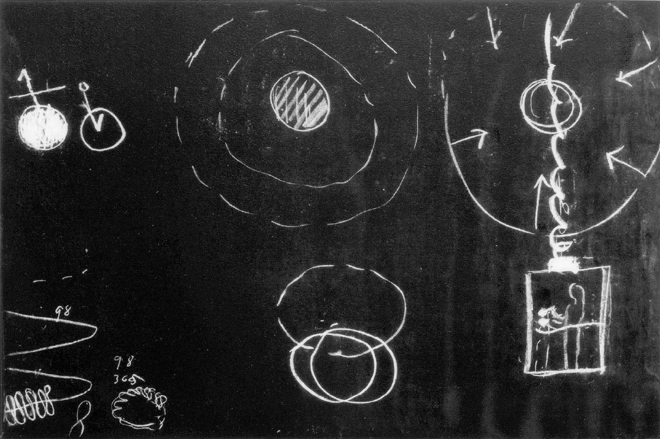
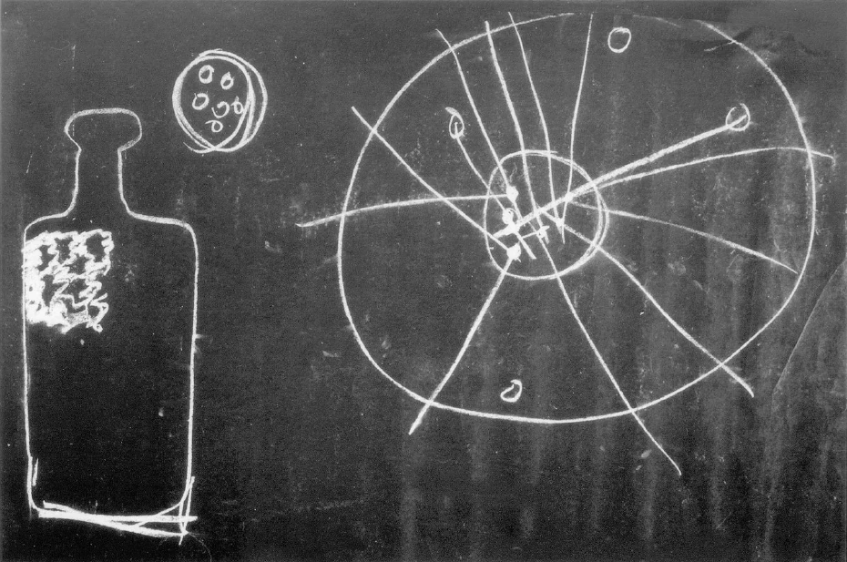

[ 1 ] ^3zwz5z

Ich möchte zunächst einige Bemerkungen, die im Laufe der letzten Betrachtungen vorgekommen sind, in einer gewissen Form heute wieder vorbringen. Sie wissen, daß die Zugehörigkeit des Menschen zum ganzen Weltenall älteren Erkenntnisrichtungen viel näher gelegen hat als unserer Gegenwart. Wenn wir zurückgehen würden noch in die ägyptisch-chaldäische Kulturperiode, so würden wir finden, daß in jener Kulturperiode, also selbst auch nur im zweiten Jahrtausend vor unserer Zeitrechnung, der Mensch sich nicht gefühlt hat wie ein abgesondertes Wesen, das hier auf dem Erdball herumläuft, sondern wie ein Wesen, das zu der ganzen sichtbaren Welt gehört. Der Mensch wußte, daß er in einer gewissen Weise allerdings abhängig ist von der Erde. Das ist ja leicht wahrzunehmen. Das ist etwas, was selbst das Zeitalter des Materialismus nicht ableugnet, denn das Zeitalter des Materialismus gibt ja auch zu, daß der Mensch in bezug auf seinen physischen Stoffwechsel abhängig ist von den Produkten der Erde, die er in sich aufnimmt. Der Mensch der Vorzeit wußte sich aber - allerdings mit einem atavistischen Erkennen - in bezug auf sein Seelisches abhängig auf der einen Seite von den Elementen Feuer, Wasser, Luft, und auf der andern Seite von den Planetenbewegungen. Das bezog er ebenso auf sein Seelisches, wie er die Produkte der Erde auf seinen physischen Stoffwechsel bezog. Und er bezog dasjenige, was im Sternenhimmel ist außer dem unmittelbaren Planetensystem, auf seinen Geist. ^i9q9jk

[ 2 ] ^k07dds

So also wußte sich der Mensch in Zeitaltern, in denen von Materialismus nicht die Rede sein konnte, im Schoße des ganzen Weltenalls. Sie können nun fragen: Ja, wie kommt es denn, daß dazumal der Mensch in bezug auf die Bewegungen der Himmelskörper in einem so gewaltigen Irrtum war, während er heute im materialistischen Zeitalter es so herrlich weit gebracht hat, gerade mit Bezug auf diese äußeren Vorgänge des Weltenalls das Richtige zu wissen? Nun, wir haben schon einige Zeit von diesen Dingen gesprochen und darauf hingewiesen, daß ja der Mensch heute durchaus an die Bewegungen, die ihm von der sogenannten Wissenschaft für die Sternenwelt vorgeschrieben werden, auch nur aus gewissen Vorurteilen heraus glaubt. Davon wollen wir dann morgen noch ein Weiteres sprechen. Jetzt aber wollen wir vor allen Dingen einmal darauf sehen, wie ja den Menschen der Gegenwart ganz und gar verlorengegangen ist ein Bewußtsein davon, daß dasjenige, was zum ganzen Menschen gehört, ja nicht gefunden werden kann in der irdischen Welt, so wenig als in der sichtbaren Sternenwelt. Es ist doch nicht möglich, eine richtige Anschauung zu gewinnen auch über die sichtbare Sternenwelt, wenn man nicht zu dem äußerlich-physischen Leben das Überphysische in der Betrachtung hinzufügt, das ja der Mensch durchzumachen hat zwischen dem Tod und einer neuen Geburt. Darauf haben wir ja bereits auch gestern wiederum hingewiesen, wie die Gesamtmetamorphose des Menschen in diesem Wechsel zwischen irdischem Leben und überirdischem Leben drinnensteht; wie diejenigen Organe, die wit heute als die des niederen Menschen betrachten, die Organe, von denen wir gestern sagten, daß sie sich nach innen öffnen, wie diese sich umbilden in bezug auf ihre Kräfte — selbstverständlich nicht in bezug auf ihre Substanz - in der Zeit zwischen dem Tod und einer neuen Geburt, und zu dem sogenannten edleren Organ, zu dem Kopforgan werden. Unser physischer Kopf, er ist ja in der Tat nichts weiter in bezug auf seine Kraftstruktur, als die Umbildung des sogenannten niederen Menschen aus dem vorigen Erdenleben. ^sb7isb

[ 3 ] ^ipdrb9

Wenn wir dies uns wirklich vor Augen führen, so können wir ja zunächst im Geiste darauf hinschauen, wie zwischen dem Tod und einer neuen Geburt der Mensch einen gewissen Inhalt seines Erlebens hat, wie er einen Inhalt hier hat zwischen der Geburt und dem Tode. Aber diese Inhalte seines Erlebens sind wesentlich andere. Wenn wir uns schematisch klar machen wollen, worinnen der Unterschied besteht, so können wir sagen: Wenn hier (Tafel 15, Mitte oben) der Mensch ist zwischen der Geburt und dem Tode, so hat der Mensch den Umkreis zu seinen Erlebnissen, den räumlichen Umkreis und dasjenige, was in der Zeit verläuft; das hat er zu seinen Erlebnissen. Sie wissen ja, daß zum allergeringsten Teile der Mensch hier auf dieser Erde sein eigenes inneres Leben zum wirklichen Erlebnis hat. Die inneren Vorgänge des Organismus werden ja nicht erlebt. Sie wissen von dem, was um Sie ist. Von dem, was innerhalb der Haut ist, ist dem Menschen unmittelbar ja nichts bekannt, denn die Bekanntschaft, welche uns Anatomie und Physiologie liefern, die kann ja nicht als wirkliche Bekanntschaft gerechnet werden, denn sie ist durchaus so, daß wir ja in das wirkliche Innere durch die entsprechenden Untersuchungen doch nicht hineinschauen. Nur eine Illusion kann glauben, daß man in das Innere wirklich hineinschaut. Und nur Geisteswissenschaft kann nach und nach dieses Innere wirklich enthüllen. ^w53fsx

 ^796gkb

[ 4 ] ^k1jb2h

Aber wie ist es in der Zeit zwischen dem Tod und einer neuen Geburt? Da müssen wir uns sagen, wir schauen in einer gewissen Weise von der Peripherie nach dem Zentrum (Tafel 15, rechts oben). Da wissen wir so wenig von der Peripherie, wie wir in dem Leben zwischen Geburt und Tod von dem Zentrum, von unserem Innern wissen. Dafür aber schauen wir während dieser Zeit die Geheimnisse, die Mysterien des Menschen selber. Dasjenige, was verborgen ist in unserem Innern innerhalb unserer Haut, das schauen wir als unsere Erfahrung zwischen dem Tod und einer neuen Geburt. ^18suo3

[ 5 ] ^8vqf90

Sie werden vielleicht sagen, dann sei diese Welt doch eine furchtbar kleine, die wir da schauen zwischen dem Tod und einer neuen Geburt. Aber auf die räumliche Größe kommt es eben nicht an. Es kommt auf die Reiche oder Armut des Inhaltes an, nicht auf die räumliche Größe. Gerade das muß uns immer wieder und wieder zum Bewußtsein kommen, daß es auf die Reiche oder Armut des Inhaltes ankommt. Wenn Sie alles zusammennehmen, was Sie im mineralischen Reiche, im pflanzlichen, im tierischen Reiche, im Reiche der Wälder und Berge, im Reich der Gestirne hier von der Erde aus wahrnehmen, so ist das noch nicht zu vergleichen an Reichtum mit dem, was der Mensch selbst in seinem Innern an Mysterien enthält. ^c0wr8b

[ 6 ] ^8p8nm7

Der wirkliche Vorgang ist etwa der, daß wir die Strukturkräfte des Hauptes verlieren, wenn wir durch den Tod gehen. Die haben ihre Dienste getan. Dagegen werden diejenigen Strukturkräfte aufgenommen von der geistigen Welt, welche eben Strukturkräfte sind des übrigen Organismus. Und sie werden aus den inneren Erlebnissen, die jetzt die peripherischen Erlebnisse sind, so umgewandelt, daß, nachdem die Zeit dafür reif geworden ist, aus der geistigen Welt herein das Haupt des Menschen im Leibe der Mutter determiniert wird. ^b5puqw

[ 7 ] ^quekpf

Sie müssen sich durchaus klar darüber sein, daß das, was als der erste Anfang des Prozesses der Menschwerdung im Leibe der Mutter vor sich geht, ein Ergebnis ist des ganzen Kosmos. In der Befruchtung wird nur Veranlassung dazu gegeben, daß eine gewisse Wirkung von dem Kosmos in einen Menschenleib herein geschieht. Und dasjenige, was zuerst bei der Menschenbildung entsteht, ist durchaus ein Abbild des ganzen Kosmos. Wer studieren will den Embryo von seinen ersten Stadien an, der muß studieren diesen Embryo als ein Abbild des ganzen Kosmos. Das sind die Dinge, die heute fast ganz übersehen werden. ^ojr2db

[ 8 ] ^187n6t

Worauf schaut man denn eigentlich heute, wenn man von Menschenentstehung im physischen Sinne spricht? Man schaut auf die Vererbungslinie. Man sieht, wie in dem Elternorganismus der Kindesorganismus sich bildet und weiß nicht, daß in dem Elternorganismus tätig sind die kosmischen Kräfte, die außer uns sind in unserer Umgebung, weit hinaus in das Weltenall reichend, daß der ganze Makrokosmos seine Kräfte spendet in das Menschenwesen, damit ein neues Menschenwesen entstehen könne. ^8f1kki

[ 9 ] ^q0a3m0

Das ist ja überhaupt der Fehler unserer Weltenbetrachtung von heute, daß wir nirgends hinschauen auf den Makrokosmos, daß wir uns niemals bewußt werden, worin die Kräfte liegen, die wir beobachten. Sehen Sie, ich muß doch noch einmal auf dieses zurückkommen: Der heutige Physiker oder Chemiker sagt, es gibt Moleküle; die Moleküle bestehen aus Atomen (Tafel 16, links oben). Die Atome haben Kräfte, durch die sie aufeinander wirken. Das ist eine Vorstellung, die eigentlich ganz und gar nicht der Wirklichkeit entspricht. In Wahrheit ist es beim kleinsten Molekül so, daß auf dieses Molekül der ganze Sternenhimmel wirkt. Nehmen wir an, hier wäre ein Planet, dort wäre ein Planet und so weiter (Kreislein der Zeichnung rechts), dann Fixsterne. Die Fixsterne senden Kräfte herein. Diese Kräfte, die hereingesendet werden, schneiden sich in der mannigfaltigsten Weise, bilden Schnittpunkte. Die Planeten senden auch ihre Kräfte herein, die sich schneiden, so daß in diesem Molekül überall nichts anderes ist als die Zusammenfassung der Kräfte des Makrokosmos. Es ist die Sehnsucht der heutigen Wissenschaft, endlich die Mikroskopie so weit zu treiben, daß man die Atome in einem Molekül betrachten kann. Diese Betrachtungsweise muß aufhören. Statt mikroskopisch die Struktur des Moleküls untersuchen zu wollen, schaue man sie an draußen im Sternenhimmel, in der Konstellation des Sternenhimmels; das Kupfer in der einen, das Zinn in der andern Konstellation. Man schaue an die Struktur der Moleküle, die sich nur abspiegelt im Molekül, draußen im Makrokosmos. Statt bei allem ins Kleinste hineinzugucken, sollte man den Blick hinauswenden ins Größte, denn da ist zu suchen dasjenige, was im Kleinsten lebt. ^ggjcmq

 ^edktll

[ 10 ] ^xspa6y

Und so wirkt die materialistische Denkweise auch auf anderen Gebieten. Sehen Sie, Sie werden heute von manchem, der nun auch glaubt, etwas sagen zu können über den Fortschritt der Erkenntnis, sagen hören: Oh, der Materialismus des 19. Jahrhunderts ist ja überwunden. - Nein, er ist solange nicht überwunden, solange man atomistisch denkt, solange man nicht die Gestaltung, die Konfiguration des Kleinsten im Größten sucht. So ist der Materialismus, in der Menschheit betrachtet, auch nicht überwunden, wenn man nicht einzugehen weiß auf die Beziehung des Menschen zum Größten, zum ganzen Weltenall. ^dzi2b8

[ 11 ] ^xrbqu2

Nun treffen wir da aber ja sogleich eine neue, ich möchte sagen, ungeheuerliche Spur des Materialismus, auf die ich schon öfter aufmerksam gemacht habe. Und wir treffen diese Spur gerade oftmals in gewissen Richtungen der sogenannten Theosophie. Da ist die physische Materie, dann der Äther, nur dünner, aber im übrigen so ähnlich wie die physische Materie, nur dünner; das Astralische wieder dünner; dann kommen noch allerlei andere schöne Dinge, immer dünner und dünner und dünner. Das ist - ob man das nun astralische Welt, Kama Manas oder wie immer nennt -, das ist deshalb nicht spirituell, das bleibt materialistisch. Will man wirklich zum Verständnis der Welt kommen, dann muß man bereits das schwer Materielle beim Äther aufhören lassen. Dann muß man sich klar sein, daß der Äther nicht mehr solche Materie ist wie diejenige, von der wir als den Raum erfüllend sprechen. Wenn wit von der Materie, die den Raum füllt, sprechen, so denken wir uns, wenn ich schematisch spreche, eben den Raum ausgefüllt mit Materie. Wenn wir aber von Äther sprechen, so dürfen wir uns nicht den Raum ausgefüllt denken von Materie, sondern wir müssen uns den Raum entleert denken von Materie. Wenn gewöhnliche Materie an etwas anstößt, so drückt es dieses, schiebt es weiter. Wenn Äther sich diesem nähert, so saugt er das an sich und zieht es in sich herein (Tafel 15, links oben). Es ist die gerade entgegengesetzte Wirkung zu der gewöhnlichen Materie. Der Äther übt Saugwirkungen. Wenn der Äther nicht Saugwirkungen übte, dann schauten Sie hinten so aus wie vorne, denn schon in dem, was die Verschiedenheit des Menschen macht hinten und vorne, ist ein Ergebnis auf der einen Seite der drückenden Wirkung der Schwere-Materie und der saugenden Wirkung der Äther-Materie oder des Äthers. Ihre Nase wird herausgetrieben aus Ihrem Organismus durch die Schwere-Materie, Ihre Augenhöhle wird hineingesaugt durch die saugende Kraft des Äthers. Und so, indem Sie hinten anders sind wie vorne, vorne anders sind wie hinten, wirkt in Ihnen drückende und saugende Substantialität. ^zt9ze4

[ 12 ] ^mhl5z6

Sehen Sie, solche Dinge beachtet man eigentlich gar nicht, an sie denkt man heute im materialistischen Zeitalter gar nicht. Wenn man weiter von dem Astralen spricht, dann kann man weder denken an die dreifach ausgedehnte, dreidimensionale physische Materie, noch an den saugenden Äther, sondern da muß man an ein Drittes denken, das die Vermittelung zwischen beiden bildet. Und denkt man nun gar an dasjenige, als das man sich das Ich-Wesen vorzustellen hat, da hat man an ein Viertes zu denken, das wiederum vermittelt auf der einen Seite die saug-drückende Wirkung von Äther und physischer Materie und auf der andern Seite die astrale Substantialität. Das sind die Dinge, welche berücksichtigt werden müssen (Tafel 15, Mitte unten). ^t25ieu

[ 13 ] ^umjzb4

Sie können nicht sagen: Ja, wenn der Äther bloß eine saugende Wirkung hat, woher kommt es denn, daß der Äther wahrnehmbar ist? Es ist eben so, daß der Äther sich so verhält zu der Schwere-Materie, wie sich - im Bilde ist das jetzt gesprochen, gleichsam auf einem anderen Niveau - verhält, was ich hier in einer Selterswasserflasche habe (Tafel 16, links). Da habe ich da drinnen Wasser und darinnen Perlen. Nicht wahr, das Wasser sehe ich nicht, aber die Perlen sehe ich, trotzdem die Perlen dünner sind. Und so ist es, daß auch in gewissen Fällen der Äther, der überhaupt eine Aussparung der physischen Materie ist, der der physischen Materie gegenüber das Entgegengesetzte ist, daß der auch wahrgenommen werden kann. ^r2zyme

[ 14 ] ^za3hj5

Nun werden Sie sehen aus dem eben Dargestellten, daß ja allerdings, wenn wir sprechen von dem Leben zwischen dem Tod und einer neuen Geburt, wir uns tatsächlich zu denken haben, daß dieses Leben außerhalb des Raumes, des gewöhnlichen Raumes, den wir hier wahrnehmen, gelebt wird, und unsere Anstrengung müßte dahin gehen, eine Vorstellung von diesem Außerhalb-des-Raumes zu gewinnen. Sie werden sie gewinnen, wenn Sie sich zuerst versuchen vorzustellen den erfüllten Raum. Das können Sie sich vorstellen. Sie brauchen sich nur einen Tisch vorzustellen; der erfüllt den Raum. Dann gehen Sie über von dem erfüllten Raum zum leeren Raum. Nun werden Sie sagen: Leerer Raum - das kann nicht mehr überboten werden. - Ich habe Ihnen gesagt, das ist geradeso gescheit, als wenn jemand sagt: Ich habe mein Portemonnaie voll Geld, da nehme ich immerfort heraus, bis ich nichts mehr habe; das Nichts kann nicht mehr überboten werden. Es kann überboten werden. Ich mache Schulden, dann habe ich weniger als nichts in meinem Beutel. Und so kann auch der leere Raum überboten werden. Wenn er von Äther erfüllt ist, ist er weniger als leer, ist et von negativer Entität. ^g18b4r

[ 15 ] ^jeyuvq

Und dasjenige, was die Vermittelung bildet, was auch in Ihnen als astralischer Leib die Vermittelung bildet zwischen dem Saugenden und dem Drückenden, das ist eben das Astralische. Sehen Sie, es gäbe keine Beziehung zwischen Ihrem Vorne und Hinten, die nicht gleich sind, sondern verschieden sind, weil in Ihnen Saug- und Druckwirkungen sind, wenn in Ihnen nicht Astralität tätig wäre, die die Vermittelung bildet. Sie werden sagen: Ich bemerke diese Vermittelung nicht. - Ja, bitte, verfolgen Sie den Verdauungsprozeß, dann werden Sie schon sehen, daß diese Vermittelung da ist, daß sich diese Vermittelung sehr genau ausdrückt. Da ist das Astralische drinnen tätig. Und die Tätigkeit des Astralischen beruht gerade auf dem Gegensatze der vorderen Wesenheit und der rückwärtigen Wesenheit des Menschen, ebenso, wie nun die Vermittelung durch das Astralische hindurch zwischen dem oberen und dem unteren Menschen auf der Ich-Wesenheit beruht. So handelt es sich darum, diesen Menschen, wie er vor uns steht, konkret aufzufassen, wirklich konkret aufzufassen, und uns dazu klar zu sein darüber, daß, indem der Mensch hier zwischen Geburt und Tod lebt, er sein Astralisches und sein Ich im Saugenden und Drückenden abdrückt, und daß er zurückträgt seine Wesenheit in dasjenige, was hier auf dieser Erde nur die Vermittelung bildet zwischen Vorne und Hinten und Oben und Unten. ^06y8ll

[ 16 ] ^md2y22

Ja, diese Vermittelung zwischen Vorne und Hinten, Oben und Unten, was ist denn das? Sehen Sie, das ist dasjenige, was wir in uns erleben, indem wir unser Gleichgewicht erleben. Wir schnappen mit dem Kopf nicht nach vorne und nach rückwärts über; wir können uns auch aufrichten. Wir ordnen uns in die Gleichgewichtslage ein. Das sehen wir nicht, das erleben wir. In das leben wir uns zunächst ein, was wir im Leben hier nicht berücksichtigen; in das leben wir uns zunächst ein, wenn wir durch die Pforte des Todes gehen. Wenn wit nur Augen hätten, es wäre dann finster um uns, wenn wir nur Ohren hätten, es wäre dann stumm um uns. Aber wir haben auch einen Gleichgewichtssinn und einen Bewegungssinn. Da wird es erlebbar in uns. Wir machen mit dasjenige, was in der Welt Gleichgewicht und Bewegung bedeuten. Wir finden uns hinein in die Bewegungen der Außenwelt. ^fwajc7

[ 17 ] ^shkxjv

Sehen Sie, hier in dem Leben zwischen Geburt und Tod, da erleben wir eigentlich nur die Wirkung der Erdbewegung um ihre Achse im täglichen Stoffwechsel. Wir müssen täglich frühstücken, täglich mittagsmahlen, und das, was da geschieht, das geschieht in 24 Stunden und ist gleichlaufend der Umdrehung der Erde um ihre Achse. Diese zwei Dinge gehören zusammen. Das eine ist ein Beweis für das andere. So gehören sie zusammen. Wenn wir sterben, dann wird diese Bewegung der Erde etwas ganz Reales, wie hier die sichtbaren Dinge. Dann leben wir mit diese Bewegung der Erde. Dann beginnen wir zunächst damit, daß wir diese Bewegung der Erde miterleben. ^ozhnmf

[ 18 ] ^u5al2t

Und so erleben wir noch andere Bewegungen des Sternenhimmels mit. Wir erleben sie mit, und es ist auch eigentlich in dieser Zeichnung (Tafel 15, rechts oben) das Miterleben schon drinnen, denn Sie dehnen sich ja in den Weltenraum hinaus nicht wie eine Qualle aus, sondern Sie machen das Leben dieses Weltenraumes mit, und als ein das Leben des Weltenraumes miterlebendes Wesen erleben Sie das Innere des Menschen. Hier zwischen Geburt und Tod sagen Sie: Mein Herz ist in meiner Brust, in dem Herzen laufen zusammen die Säftebewegungen der Blutzirkulation; in einem gewissen Reifestadium zwischen Tod und neuer Geburt sagen Sie: In meinem Innern ist Sonne - und Sie meinen die wirkliche Sonne, von der sich die Physiker einbilden, sie wäre ein Gasball, die aber etwas ganz anderes ist. Sie erleben die wirkliche Sonne. Sie erleben die Sonne zwischen Tod und neuer Geburt so, wie Sie hier Ihr Herz erleben. Und wie die Sonne hier für Ihr Auge sichtbar ist, so ist zwischen dem Tod und einer neuen Geburt das Herz in seinem Werden auf dem Wege zur Zirbeldrüse in einer wunderbaren metamorphosischen Umbildung die Ursache grandioser Erlebnisse zwischen dem Tode und einer neuen Geburt. Ihr ganzes Blutsystem erleben Sie in Umwandelung, natürlich immer nicht die Substanz, sondern die bewegenden Kräfte. Hier haben Sie Ihr Blutsystem in sich. Indem Sie zwischen Tod und neuer Geburt weiterleben, werden diese Kräfte, die im Blutsystem liegen, immer andere. Und wenn Sie wiederum hier ankommen in einem neuen Erdenleben, dann sind das die Kräfte des neuen Nervensystems geworden. Sehen Sie sich an auf den heutigen Tafeln der Anatomie oder der Physiologie das Bild der Nervenstränge und der Blutzirkulation; sehen Sie sich an die Blutzirkulation: eine Inkarnation. Daraus wird in der nächsten Inkarnation das Nervenleben. Und wenn ich sage: Kopfsystem, Brustsystem, Gliedmaßensystem, so dürfen Sie auch das nicht nur so schematisierend nebeneinanderstellen, denn die Dinge gehen ineinander. Sehen Sie sich den Wunderbau des menschlichen Auges an: Blutgefäße, Aderhaut, Netzhaut. Die letzten beiden sind Metamorphosen voneinander. Was heute Netzhaut ist, war in der vorhergehenden Inkarnation Aderhaut, und was heute Aderhaut Ihres Auges ist, wird in der nächsten Inkarnation Netzhaut sein - allerdings nicht gerade so unmittelbar. Aber es ist trotzdem das gültig, was ich gesagt habe. Sie sehen, ein wirkliches Verständnis des Menschen, der vor uns steht, kann man nicht gewinnen, wenn man den Menschen nur so betrachtet, wie er sich zwischen der Geburt und dem Tod oder höchstens durch die Kräfte der physischen Vererbung entwickelt. Denn durch all das verstehen wir höchstens die Dinge bis, sagen wir, zu der Säftebewegung. Aber diese Säftebewegung ist ja auch das Letzte, was wir da verstehen. Die Nervenanlagen eines gegenwärtigen Lebens sind das Ergebnis eines vorigen Lebens und sind aus dem gegenwärtigen Leben überhaupt nicht zu verstehen. ^vuqn83

[ 19 ] ^ov9kgx

Ich bitte Sie nun, nicht etwa einzuwenden: Ja, die Tiere haben ja auch Nerven, und die haben keine früheren Leben. - So die Welt zu beurteilen, heißt eben, sie sehr kurzsichtig zu beurteilen. Wenn das Nervensystem beim Menschen in seinen Kräften die Umwandelung des Blutsystems im vorigen Leben ist, so muß bei den Tieren nicht auch dasselbe für das Nervensystem gelten. Sonst, wenn Sie eine solche Logik anwenden würden - sie wird allerdings heute vielfach angewendet -, dann bedeutet das ganz genau dasselbe, wie wenn Sie zu einem Raseur hineingehen, bei ihm eine Anzahl Rasiermesser finden und sagen: Bitte, das wollen wit uns einmal als Besteck kaufen für unseren Mittagstisch, denn Messer gehören zum Essen! - Rasiermesser nur just nicht, sondern die gehören zu etwas anderem! Es trägt nicht ein Dinge in dieser Weise seine unmittelbare Bestimmung in sich, ebensowenig ein Organ. Das Organ beim Menschen ist etwas ganz anderes als das Organ beim Tiere. Es kommt darauf an, wozu man das Organ verwendet. Man sollte nicht vergleichen Nervensystem mit Nervensystem, nämlich Menschennerven mit Tiernerven, sondern man sollte darauf sehen, daß allerdings der Menschennerv dem Tiernerv gegenüber etwas Ähnliches geworden ist wie das Rasiermesser gegenüber dem Tischmesser, so daß man auf dem gewöhlichen Wege der materialistischen Untersuchung zu nichts kommen kann. Das ist aber der Weg, der heute hauptsächlich eingeschlagen wird. ^wolt81

[ 20 ] ^82ewqz

Und dieser Weg, der verhindert, daß nun wirklich ins Auge gefaßt wird, was den Menschen als Produkt der geistigen Welt erklärlich macht. Denn sehen Sie, unsere religiösen Bekenntnisse, wie sie sich nach und nach entwickelt haben, haben auch - das habe ich schon öfter gesagt - sehr dem Egoismus gefrönt, gedient. Sie gehen ja fast allein darauf hinaus, dem Menschen sein Fortleben nach dem Tode bloß zu beweisen, weil er das in seinem Egoismus verlangt. Aber ebenso wichtig ist es, dem Menschen die Fortsetzung zu beweisen des vorgeburtlichen Lebens, daß der Mensch begreift: hier auf dieser Erde habe ich ein Fortsetzer dessen zu sein, was ich zwischen dem Tod und meiner jetzigen Geburt war. Ich habe ein geistiges Leben hier fortzusetzen. Das frönt allerdings weniger dem Egoismus, aber es ist zu gleicher Zeit etwas, was wiederum in die Kultur einfließen muß, damit diese unsere Kultur die Menschen von den antisozialen Instinkten befreit. Denken Sie nur einmal, was es heißen wird, wenn man ein menschliches Antlitz betrachten und sagen wird: Das ist nicht von dieser Welt, daran hat gearbeitet die geistige Welt zwischen dem letzten Tode und dieser Geburt; was es heißen wird, wenn man in dem Materiellen schon sehen wird das Bild der geistigen Arbeit zwischen dem Tod und einer neuen Geburt. Es wird in der Tat eine andere Art der Bildung sein, die dann unter den Menschen ist, und diese andere Art der Bildung wird eine andere Gesinnung zuwegebringen. Und diese Gesinnung wird es nicht zulassen, daß wir den Sternenhimmel erblicken und da bloß eine große Maschinerie sehen von sich gegenseitig Newtonisch anziehenden Sternen. Dies auch, wenn man davon absieht, daß heute die Abstraktion auf den höchsten Gipfel gekommen ist. ^1y4uxk

[ 21 ] ^u8hi6o

Sehen Sie, die Abstraktion ist schon sehr stark in unserem gewöhnlichen Sonnen- und Planetensystem enthalten. Aber heute treibt die Abstraktion ganz kuriose Blüten. So zum Beispiel werden Sie heute durch einen großen Teil der populären Literatur gehen sehen die Glorifizierung einer gewissen Idee, die zum Beispiel Einstein gehabt hat. Da wird gesagt, durch diese Idee sei die Gravitation erschüttert. Denn man stelle sich einmal vor (Tafel 15, rechts unten), weit weg von allen Weltenkörpern, so daß kein Schwerefeld wirkt, sei ein Kasten. In diesem Kasten befinde sich ein Mensch; der halte in seinen zwei Händen einen Stein und eine Flaumfeder. Er ist irgendwo, wo es keine Weltenkörper gibt, in einem Kasten und hält einen Stein und eine Flaumfeder in dem Kasten drinnen. Jetzt läßt er sie los, und siehe da, sie fangen an zu fallen. Sie fallen auf den Boden herunter. Ja, sagt Einstein, da wird der Mensch vielleicht sagen: Der Stein und die Flaumfeder fallen auf den Boden herunter. Aber so braucht es nicht zu sein, sondern da oben kann ein Seil angebracht sein, das hängt da (Zeichnung) — wo, das weiß ich nicht! und statt dessen, daß der Stein und die Flaumfeder herunterfallen, wird der ganze Kasten da heraufgezogen. Der Stein und die Flaumfeder - weil ja kein Weltenkörper in der Nähe ist - fallen nicht, sondern sie bleiben da; aber der Kasten wird in die Höhe gehoben, und der Stein und die Flaumfeder bleiben an derselben Stelle. Wie der Kasten da bei ihnen angekommen ist mit seinem Boden, nimmt er sie mit. ^rlogow

[ 22 ] ^y92x7g

Diese Erörterung einer äußersten Abstraktion können Sie heute als die moderne Relativitätstheorie Albert Einsteins geschildert finden. Denken Sie, wie weit die Menschheit abgekommen ist vom Wirklichkeitsdenken! Man redet von Relativität. Schön, das kann man. Aber denken Sie sich einmal, was werden sollte, wenn die ganze Vorstellung nur ernst genommen würde: ein Kasten da, weit weg von allen Weltenkörpern, kein Weltenkörper in der Nähe, der den Stein und die Flaumfeder anziehen könnte, ein Mensch da drinnen! Luft ist nur in der Nähe von Weltenkörpern, aber der ist da ganz froh darinnen mit seinem Stein und seiner Flaumfeder; die brauchen nicht zu atmen natürlich. Und der Kasten ist außerdem aufgehängt, wird da hinaufgezogen. ^plng0c

[ 23 ] ^ykaby4

Das ist noch eine Steigerung jenes Newtonschen Stoßes, der dem Weltenkörper gegeben wird in der Tangente, damit er mit Zentrifugalkraft zu der Zentripetalkraft noch fortfliegen könne. Aber solche Dinge bilden heute tatsächlich den Gegenstand wissenschaftlicher Erörterung, und man hält sie für große Taten, während sie nichts anderes sind als Zeugnis dafür, wie man bei der äußersten Abstraktion angekommen ist und wie der Materialismus es gerade dahin gebracht hat, daß der Mensch nichts mehr weiß von der Materie, daß der Mensch in Gedankengebilden leben kann, die fernliegen aller Wirklichkeit. ^8adoen

[ 24 ] ^9uumc3

Nur werden diese Dinge heute nicht beachtet, sondern es geht durch alle Zeitungen, daß eine große Entdeckung gemacht worden ist: Die Gravitationstheorie ist abgelöst durch die bloße Trägheitstheorie. Der Stein und die Flaumfeder werden nicht angezogen, sondern sie beharren - vielleicht nur, weil man sich auch vorstellen kann, daß sie da beharren, während der Kasten da hinaufgezogen wird. Man kann wirklich sagen, es lebt heute soviel Unsinn als Genialität, daß es grotesk ist, darauf zu kommen, wieviel Unsinn als Genialität lebt. Wie kann man sich denn wundern darüber, daß in dieser Zeit auch auf andern Gebieten die Gedanken kreuz und quer und grad und krumm gehen und endlich das bewirkt haben, was die Menschen erlebten in den letzten fünf bis sechs Jahren. ^30ei2w

[ 25 ] ^k8h1nk

Das ist das, woran immer wieder erinnert werden muß. Ich mußte heute daran erinnern und werde morgen auf diesen Voraussetzungen einiges über das Weltengebäude auch für unsere zur Generalversammlung gekommenen Freunde anfügen. ^4lwg2g