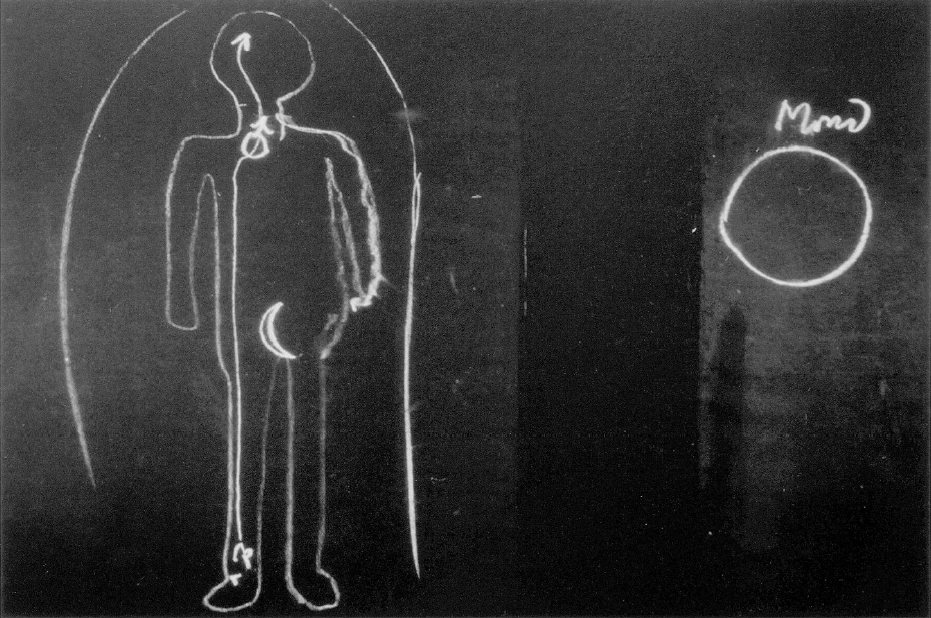

[ 1 ] ^b17gco

Es liegt den gegenwärtigen Betrachtungen im weitesten Sinne das Thema zugrunde, das Weltenall kennenzulernen aus den Beziehungen des Menschen zu diesem Weltenall. Ich möchte bei denen, die schon einige Ausblicke auf das Weltenall selbst in diesen Abenden erhalten haben, eben durchaus nicht die Meinung hervorrufen, daß durch die leichtgeschürzte Art, wie in unserer gebräuchlichen Astronomie von den Himmelsbewegungen die Rede ist, man schon auf die Wahrheit dieser Sache komme. Aber ich möchte auch, daß diejenigen Freunde, die jetzt hier zur Generalversammlung erschienen sind, nicht bloß etwas hören, was mittendrinnen steht in einer fortgesetzten Folge, sondern ich möchte, daß auch sie ein abgeschlossenes Bild in diesen bei Gelegenheit der Generalversammlung gehaltenen Vorträgen haben. Daher möchte ich heute die gestrigen Betrachtungen in einem gewissen Sinne fortsetzen und nur hinweisen darauf, wie man aus dem Begriff des Menschen heraus zu dem Begriff des Weltenalls kommt, seines Wesens und seiner Bewegung. Natürlich ist das ein so ausführliches Thema, daß ich es für die Freunde, die jetzt gerade hier sind, nicht erschöpfen kann. Das, was ich heute zu sagen habe und schon in den letzten Vorträgen gesagt habe, wird dann am nächsten Sonnabend eine Fortsetzung erfahren. Aber ich möchte heute etwas wenigstens, was zum Teil schon hervorgeht aus dem schon Betrachteten, für unsere auswärtigen Freunde vorbringen. ^3aktc4

[ 2 ] ^duwh33

Sie kennen ja von den verschiedensten Betrachtungen her, die wit darüber gepflogen haben, die Beziehung, die im menschlichen Leben besteht zwischen dem täglichen Rhythmus von Wachen und Schlafen. Sie wissen ja, daß wir diese Beziehung abstrakt gewöhnlich so schildern, daß wir sagen: Im wachen Zustande sind in einer gewissen inneren Verbindung physischer Leib, Ätherleib, astralischer Leib und Ich-Wesen. Im schlafenden Zustande haben wir auf der einen Seite physischen Leib und Ätherleib miteinander verbunden, und gewissermaßen getrennt, wenigstens in bezug auf den Tageszusammenhang, auf den Wachzustand, getrennt davon das Ich-Wesen und den astralischen Leib. Aber Sie wissen ja auch, daß dies zunächst nur eine abstrakte Feststellung ist, denn ich habe ja oft genug betont, daß mit Bezug auf alles, was zur Gliedmaßennatur des Menschen gehört, was gewissermaßen, indem es sich nach dem Innern des Organismus fortsetzt, auch der eigentliche Träger des Stoffwechsels ist und was zugleich zusammenhängt mit dem Willen, der Mensch im Grunde fortwährend in einem Schlafzustande ist. Wir müssen ja durchaus uns klar darüber sein, daß alles, was mit unserem Willen zusammenhängt, in einem fortwährenden Schlafzustande ist, auch dann, wenn wir wachen. So daß wir sagen können: der Gliedmaßenmensch als Träger des Willensmenschen ist in einem fortwährenden Schlafzustande. Dasjenige, was nun zwischen der eigentlichen Kopforganisation und dieser Gliedmaßenorganisation ist, die sich aber nach dem Innern fortsetzt, was also dazwischenliegt, was dem Zirkulationsmenschen zugehört, dem rhythmischen Menschen, das ist in einem fortwährenden Traumzustand. Das ist ja zu gleicher Zeit dasjenige, was das äußere Werkzeug der Gefühlswelt ist. Die Gefühlswelt wurzelt ganz und gar im rhythmischen Menschen. Und während der Stoffwechselmensch mit seiner Fortsetzung, den Gliedmaßen, zugleich der Träger des Willens ist, ist der rhythmische Mensch der Träger des Gefühlslebens, und das verhält sich zu unserem Bewußtsein wirklich so, wie der Traumzustand sich zu unserem Wachbewußtsein verhält. Wirklich wach sind wir nur in unserem Vorstellungsieben vom Aufwachen bis zum Einschlafen. ^s6b83t

[ 3 ] ^vohm0z

Da haben Sie also eigentlich diese Tatsache gegeben, daß der Mensch in seinem Leben zwischen der Geburt und dem Tode abwechselnd im Wachzustande ist für sein Vorstellungsleben, daß er für sein Gefühlsleben, das zum Träger den rhythmischen Menschen hat, im Traumzustande ist, daß er aber in einem fortwährenden Schlafzustande ist in bezug auf die Gliedmaßennatur und die Stoffwechselnatur. Denn Sie müssen sich nur klar sein darüber, die menschliche Natur wirklich so genommen, daß man sie verstehen kann, setzt voraus, daß man die Fortsetzung der Gliedmaßennatur nach innen ins Auge faßt. Alles, was schließlich mit dem Unterleibe noch zu tun hat, alles, was mit dem Stoffwechsel, also sagen wir zum Beispiel mit der weiblichen Milchabsonderung zu tun hat, ist ja nach innen gerichtete Fortsetzung des Gliedmaßenmenschen, so daß, wenn wir von Willensnatur, Stoffwechselnatur sprechen, wir natürlich nicht bloß schematisch die äußeren Gliedmaßen verstehen. Hauptsächlich sind es die äußeren Gliedmaßen, aber das, was Gliedmaßentätigkeit ist, setzt sich nach dem Innern fort. In bezug auf dieses, was zugleich unmittelbar zusammenhängt mit der menschlichen Willensnatur, ist der Mensch fortwährend schlafend. Das kompliziert die zunächst abstrakte Vorstellung von dem Herausgehen des Ich und des astralischen Leibes. Aber es macht notwendig, daß wir uns auch noch über eine andere Sache einen entsprechenden Aufschluß bilden. ^h7d9l3

[ 4 ] ^0n95lj

Sehen Sie, wenn heute der materialistisch gesinnte Physiologe von dem Willen spricht, der sich zum Beispiel in einer menschlichen Gliedbewegung offenbart, so denkt er, da wird irgendein telegraphisches Zeichen vom Zentralorgan, vom Gehirn abgeschickt, geht durch den sogenannten motorischen Nerv und bewegt dann, sagen wir, das rechte Bein. Aber das ist als solches wirklich eine ganz unbegründete Hypothese, und es ist auch eine unrichtige Hypothese. Denn die geistige Beobachtung zeigt das Folgende. Wenn wir den Menschen schematisch nehmen (Tafel 17), so ist das so: Wenn das rechte Bein gehoben wird durch den Willen, so geschieht von der Ich-Wesenheit des Menschen, von der wirklichen Ich-Wesenheit ein unmittelbarer Einfluß auf das Bein, und das Bein wird unmittelbar durch die Ich-Wesenheit gehoben. Nur verläuft das alles so, wie die Tätigkeit des Schlafens. Das Bewußtsein weiß nichts davon. Daß hier Nerven eingeschaltet sind, die dann zum Zentralorgan gehen, das unterrichtet uns bloß davon, daß wir ein Bein haben, das unterrichtet uns nur fortwährend von der Anwesenheit dieses Beines. Dieser Nerv hat als solcher nichts zu tun mit der Wirkung des Ich auf das Bein. Es ist eine unmittelbare Korrespondenz zwischen dem Bein und dem Willen, der beim Menschen verknüpft ist mit der IchWesenheit, beim Tiere verknüpft ist mit dem astralischen Leib. Alles, was die Physiologie zu sagen hat zum Beispiel auch mit Bezug auf die Fortpflanzungsgeschwindigkeit des sogenannten Willens, das müßte umgedacht werden dahingehend, daß man es zu tun hat mit der Fortpflanzungsgeschwindigkeit, die sich bezieht auf die Wahrnehmung des betreffenden Gliedes. Natürlich können diejenigen, die dressiert sind auf die heutige Physiologie, mit einem Dutzend Einwendungen kommen. Ich kenne diese Einwände sehr gut; aber man muß nur versuchen zurechtzukommen mit einem wirklich logischen Denken und man wird finden, daß dasjenige, was ich hier sage, in Übereinstimmung steht mit den Beobachtungstatsachen, nicht aber das, was Sie heute in den physiologischen Lehrbüchern finden. ^ixm201

 ^nwa13m

[ 5 ] ^006oct

Manchmal wird, ich möchte sagen, mit Fingern hingedeutet auf solche Dinge. So hat einmal auf einer italienischen Naturfotscherversammlung, ich glaube in den achtziger Jahren des vorigen Jahrhunderts, eine sehr interessante Diskussion stattgefunden über die Widersprüche, die sich ergeben zwischen der gewöhnlichen Lehre von dem motorischen Nerv und einer Gliedmaßenbewegung. Aber da ja innerhalb der heutigen Physiologie keine Geneigtheit besteht, auf das Geistige des Menschen einzugehen, so konnte natürlich auch bei einer solchen Diskussion nicht viel mehr herauskommen, als daß man eben Widersprüche konstatierte mit dem, was man als hypothetische Erklärung für die Tatsache gefunden hat. Es würde überhaupt interessant sein, wenn sich einmal unsere gelehrten Freunde und solche haben wir ja doch auch unter uns — darauf einließen, die physiologische, biologische Literatur der letzten vierzig Jahre zu prüfen. Sie werden außerordentlich interessante Entdeckungen machen, Sie müssen nur die betreffenden Sachen aufsuchen. Sie werden sehen, daß da überall die Tatsachen bereitliegen, die man nur in der richtigen Weise ergreifen muß, um dazu zu kommen, dasjenige, was Geisteswissenschaft bringt, zu belegen. Es würde zu den interessantesten Aufgaben von Forschungsinstituten gehören, die ja nun errichtet werden sollen, wenn folgendes getan würde: Man müßte zunächst einmal sorgfältig die internationale Literatur durchnehmen —- man muß die internationale nehmen, denn es finden sich die merkwürdigsten Hinweise gerade zum Beispiel in der englischen und namentlich in der amerikanischen Literatur. Die Amerikaner haben die interessantesten Tatsachen konstatiert, wissen nur gar nichts damit anzufangen. Wenn Sie eingehen würden auf diese Dinge, wirklich den Blick werfen würden auf das, was da ist, und dann konstatieren würden, daß man nur, eben weil man den richtigen Blick hat, worauf die Sache hinaus will, einen einzigen Schritt nötig hat, die Versuchsanordnung fortzusetzen, würden Sie heute wirklich ganz Großartiges leisten können. Man müßte nur einmal so weit sein, daß man ein Forschungsinstitut hat und die Versuchsanordnung, das heißt den nötigen Apparat und das nötige Material dazu überall liegen die Dinge so, ich möchte sagen, daß sie warten. Man merkt heute gar nicht, wie alles dahin drängt, die Versuchsreihen, die angefangen sind, und die immer nur abgebrochen werden gerade an den entscheidenden Stellen, weil die Menschen nicht die Richtung wissen, wie alles drängt nach solchen Forschungsinstituten, wie wir sie hier im Auge haben. Und diese Forschungsinstitute würden wirklich bedeutungsvolle Grundlagen auch für die Praxis liefern. Was für eine Technik erst daraus entstehen würde, wenn man diese Dinge wirklich machen würde, zuerst als Versuche, um sie dann auszubauen, davon lassen sich die Menschen heute nichts träumen. Es fehlt nur die Möglichkeit, praktisch zu arbeiten. Nun, das nur nebenbei. ^p9f366

[ 6 ] ^1ou61a

Sie sehen also, wir haben es zu tun mit einem Teil des Menschen, der dann auch schläft, wenn wir wachen. Nun mache ich Sie auf eine Tatsache aufmerksam, welche eine große Rolle gespielt hat in der ganzen älteren, sagen wir, Welterkenntnis. Diese ältere Welterkenntnis hat zum Beispiel folgende Zuordnung gemacht. Sie hat gesagt: Zugeordnet ist der Ausgangspunkt für die unteren Gliedmaßen dem Monde. Zugeordnet ist gewissermaßen der Zusammenlaufungspunkt für die oberen Gliedmaßen da in der Kehlkopfgegend, zugeordnet ist diese Partie dem Mars (Mond und Mars werden in die Zeichnung 17 eingezeichnet). Der heutige Mensch, der so recht drinnensteht in der gegenwärtigen Weltanschauung, kann natürlich mit solchen Dingen nichts anfangen; und jenen Firlefanzereien, welche unklare Mystiker und unklare Theosophen heute über diese Dinge sagen, denen sollte man wirklich keinen besonderen Wert beimessen. Denn diese Dinge sind viel tiefer als das, was insbesondere heute auf dem Gebiete der materialistischen Theosophie immer gesagt wird: grobe, physische Materie; Äther etwas feiner; Astralisches wieder feiner und so weiter - Dinge, die als Theosophie geltend gemacht werden, die aber eigentlich nicht eine spirituelle Lehre, sondern nur eine spirituelle Lüge sind, weil sie nichts sind als die Fortsetzung gerade des Materialismus. Die Dinge aber, welche Reste einer uralten Menschenweisheit sind, führen uns tatsächlich dazu, daß wenn wir anfangen sie zu verstehen, sie eine großartige Verehrung, eine tiefe Demut gegenüber dem Urwissen der Menschheit in uns hervorrufen, denn die Andeutungen haben sich erhalten nicht nur bis tief ins Mittelalter herein, sondern sogar bis ins 18. Jahrhundert herein. Man findet es noch in der Literatur des 18., vielleicht auch des 19. Jahrhunderts, aber da schon abgeschrieben, da ist es nicht mehr aus einem ursprünglichen Bewußtsein hervorgegangen. Und wenn heute mystische Gigerl es wiederum in die Literatur hineinfügen, so ist es eben erst recht abgeschrieben. Aber bis ins 18. Jahrhundert herein findet man noch ein gewisses Bewußtsein von diesen Dingen, und dann wiederum gerade die Mondennatur mit dieser Stelle des Organismus in Verknüpfung gedacht. ^6yt2lh

[ 7 ] ^63ol82

Sehen Sie, was ich jetzt eben gesagt habe, daß der Mensch mit Bezug auf seine Willens-Stoffwechselnatur ein schlafendes, ein fortwährend schlafendes Wesen ist, das drückt sich am intensivsten aus in den unteren Gliedmaßen. Man könnte eigentlich sagen: Durch jene metamorphosische Umformung, welche Arme und Hände beim Menschen erlangt haben, trotzt der Mensch der Unbewußtheit ab, was eigentlich Schlafesnatur des Gliedmaßenmenschen ist. Sie werden auch wahrnehmen können, wenn Sie sich ein wenig das innere Erleben für solche Dinge schärfen, daß doch ein beträchtlicher Unterschied besteht zwischen den Bewegungen der Beine und den Bewegungen der Arme. Die Bewegungen der Arme sind frei, sie folgen in einer gewissen Weise Empfindungen. Die Bewegungen der Beine sind nicht so frei - ich meine jetzt die Gesetzmäßigkeit, durch die wir die Beine in Bewegung bringen. Allerdings, dies ist etwas, was nicht immer beachtet und nicht immer in der richtigen Weise gewürdigt wird, denn sehen Sie, ein größerer Teil des Eurythmiebesuchenden Publikums ist natürlich daraufhin dressiert, mehr passiv sich den Vorstellungen hinzugeben; der empfindet dann bei unserer Eurythmie die geringer artikulierte Beinbewegung gegenüber der mehr artikulierten Armbewegung und Händebewegung. Aber das kommt nur davon her, daß eben, um die Armbewegungen zu verstehen, schon ein Mitarbeiten der Seele notwendig ist von seiten des Zuschauers. Das will man ja heute in der Zeit des Kinos durchaus nicht haben, das Mitarbeiten. Wenn Sie sich eine Tanzbewegung ansehen, wo bloß die Beine tanzen und die Arme höchstens einige Willkürgebärden machen, da brauchen Sie nicht viel mitzudenken oder mitzuempfinden. Nun, das auch nur nebenbei. ^3xh5kh

[ 8 ] ^ta1gzo

Also am intensivsten unbewußt ist dasjenige, was sich auf die Bewegung der unteren Gliedmaßen bezieht. Da schläft der Mensch in gewisser Weise ganz. Wie der Wille in die Beine hineinwirkt, wie der Wille schon im Unterleibe wirkt, das ist etwas, was total verschlaschlafen wird. Da ist gewissermaßen der Mensch immer seiner bewußten Natur abgekehrt. Da sendet ihm die eigene Natur nur das zurück, was Reflexion ist. Sie verfolgen ja natürlich auch die Bewegung Ihrer Beine, aber eben durch Ihren Nervenapparat, durch die Wahrnehmung; wie der Wille hineinschießt, das verfolgen Sie nicht, sondern bekommen es nur in der Reflexion in die Wahrnehmung herein. Die untere Natur kehrt Ihnen gewissermaßen die eine Seite immer ab und nur die eine Seite immer zu, je nachdem Sie sie beleuchten von Ihrem oberen Menschen aus. Das ist aber genau ebenso, wie es der Mond macht (Tafel 17, rechts). Der Mond geht, wie Sie ja wissen, um die Erde herum. Er ist ein höflicher Herr; er wendet immer nur die eine Seite der Erde zu. Während er um die Erde kreist, dreht er sich nicht so, daß er einmal seine Vorderseite zeigt, das andere Mal seine Rückseite, sondern er wendet der Erde nie seine Rückseite zu. Man hat aber auch zugleich niemals irgend etwas Eigenes von dem Monde, sondern immer das zurückgesendete, das reflektierte Licht. Da ist durchaus ein innerer Parallelismus zwischen der Mondennatur und der ganzen inneren menschlichen Wesenheit. Sie schauen hinauf nach dem Monde, und verstehen Sie ihn auch nur dieser äußeren formalen Seite nach, so müssen Sie darin die innere Verwandtschaft mit der unteren Organisation des Menschen empfinden. Und je mehr man auf diese Dinge eingeht, desto mehr ist dieses der Fall. Es ist durchaus die naive, instinktiv-naive Wahrnehmung der Alten gewesen, die diese innerliche Beziehung der menschlichen Natur zu dem Weltenkörper ins Auge faßte, während der heutige materialistische Philister sagt: Nun ja, Mond - silberiges Licht. Von der Ähnlichkeit mit dem Silber im Licht hat man für beide dasselbe Zeichen genommen. — Das alles ist nichts anderes als ein Ergebnis der Ignoranz gegenüber jenem großartigen Wissen, das nicht auf die Weise von den Alten errungen worden ist, wie wir uns das geistige Wissen wieder erringen müssen, das auf andere Art aber von ihnen errungen worden ist. ^o632eu

[ 9 ] ^cfdi5d

Und nehmen wir jetzt die andere Tatsache, nehmen wir die Tatsache, daß die Arme, in ihrer Verbindung mit dem Oberen des mittleren Menschen, in einer gewissen Weise, ich möchte sagen, im Menschen selber aufwachen, daß die Armbewegung wenigstens traumhaft wird, dann fühlen wir, daß alles, was die Arme betrifft, mehr Verwandtschaft hat mit der menschlichen Bewußtheit, als dasjenige, was die Beinbewegung betrifft. Der elementarisch empfindende Mensch wird daher sehr häufig schon ganz naturgemäß die Arme ein wenig zu Hilfe nehmen, wenn es sich um die Sprache handelt, die ja mit dem mittleren Menschen sehr viel zu tun hat. Eine Unterstützung des Redens mit den Armen wird uns naheliegen. Ich glaube aber nicht, daß es sehr viele Redner gibt, die zu gleicher Zeit durch Beingesten ihre Rede unterstützen, oder viele Zuhörer, welche an diesen Beingesten Gefallen finden würden. Also Sie brauchen nur in der richtigen Weise solch ein Bedürfnis des Menschen zu fühlen, dann fühlen Sie die Verwandtschaft heraus, die nun wirklich besteht zwischen den Armen und Händen - die ja zum Gliedmaßenmenschen gehören -, diesem höheren Teil des Gliedmaßenmenschen und dem mittleren Menschen, dem rhythmischen Menschen, der zu seinem seelischen Gegenbilde das Gefühlsmäßige des Menschen hat. Vorzugsweise versuchen wir ja die Rede, die sehr leicht abstrakt wird, durch Gebärden der Arme und Gebärden der Hände zu unterstützen. Das Gefühlsmäßige suchen wir in die Rede hineinzubringen durch diese Unterstützung. Es gilt heute in manchen Kreisen - ich will nicht sagen in welchen - als Zeichen einer abgeklärten Natur, wenn man die Rede möglichst wenig mit Gebärden unterstützt. Man könnte auch, wenn man von einem anderen Standpunkte aus die Sache ins Auge faßt, sagen: Nun ja, wenn jemand, um ja nicht die Rede durch Gebärden zu unterstützen, die Gewohnheit sich beilegt, während er redet, die Hände immer in die Hosentaschen zu stecken, so ist er vielleicht nicht bloß abgeklärt, sondern vielleicht auch etwas blasiert. Und das ist der andere Gesichtspunkt der Sache. Ich will weder für das eine noch das andere jetzt eintreten, aber Sie sehen zugleich, daß die ganze Natur der Arme, neben dem, daß sie dem Stoffwechsel-Gliedmaßenmenschen angehören, zugleich auf den mittleren Menschen, auf den Zirkulationsmenschen hinweist. Das wiederum wurde gefühlt, indem man Sprache und Armbewegung zusammenfassend mit dem Mars in eine gewisse Beziehung gebracht hat. Der Mars steht ja nicht in so inniger Verbindung mit der Erde, wie der Mond, und dasjenige, was dem Sprachorganismus und dem Armorganismus zugrunde liegt, steht auch nicht mit dem irdischen Menschen in einer so innigen Verbindung wie das, was dem Beinorganismus und dem Unterleibsorganismus zugrunde liegt. Wir können sagen: In einer gewissen Beziehung wirkt das, was den unteren Gliedmaßen als Tätigkeiten entspricht, sehr stark auf den unbewußten Menschen; auf den halbbewußten Menschen wirkt aber ungeheuer stark das, was den Armen und Händen entspricht. Und es ist schon so: Jemand, der ganz ungeschickte Hände hat, der also zum Beispiel gar nicht mit den Fingern geschickte Bewegungen ausführen kann, der wird auch kein sehr feinsinniger Denker sein. Er wird in einer gewissen Weise mehr nach groben Gedankenmaschen suchen als nach feinen Gedankengliedern. Er wird, wenn er grobklotzige Hände hat, viel eher sich für den Materialismus eignen, als wenn er geschickte Handbewegungen hat. Das hat nichts zu tun mit der abstrakten Weltanschauung, sondern es hat zu tun mit dem wirklichen Hinneigen zu einer spirituellen Weltanschauung, die immer den Anspruch erhebt, daß man sie in feinmaschigen Gedanken erfaßt. ^id1v35

[ 10 ] ^an5d75

All diese Dinge werden von einer umfassenden Pädagogik durchaus ins Auge gefaßt. Sie würden wahrscheinlich Ihre Freude haben, wenn Sie, in unsere Waldorfschule eintretend, gerade in das Zimmer kommen, wo so nach 10 Uhr vormittags der Handarbeitsunterricht gegeben wird von unserer Freundin, Frau Mo/r, mit einigen andern Damen zusammen, und Sie sehen würden, wie da unmittelbar nebeneinander die strickenden Knaben, die häkelnden Knaben sitzen, wie sie fleißig und hingebungsvoll stricken und häkeln, geradeso wie die Mädchen. Das alles sind Dinge, die durchaus aus dem Ganzen dieses Waldorfschulgeistes herauskommen, denn da handelt es sich wirklich nicht darum, daß man in einigen abstrakten programmatischen Sätzen dies oder jenes schreibt, sondern daß man das ernst nimmt, daß der ganze Unterricht von Menschenerkenntnis ausgehen soll; daß man wissen soll als Lehrer, was es für eine Bedeutung hat, wenn ich geschickt die Finger zu bewegen verstehe — wenn ich unter Umständen sogar ordentlich den Mittelfinger über den Zeigefinger zu geben vermag, so wie einen Merkurstab, oder wenn ich das durchaus nicht zu machen vermag -, was das für einen großen Unterschied macht für das Denken. Unsere Fingerbewegungen sind in hohem Maße Lehrer der Elastizität unseres Denkens. Diese Dinge können aber nun auch erkennend weiter verfolgt werden. Sie werden verhältnismäßig leicht sich die Fertigkeit aneignen, den mittleten Finger über den Zeigefinger elastisch drüberzulegen, so daß Sie eine Schlange um den Merkurstab zuwege bringen, aber Sie werden das mit der mittleren Zehe gegenüber der zweiten Zehe weniger leicht zustande bringen. Daraus sehen Sie den Unterschied der ganzen Organisation. Es ist sehr wichtig, das ins Auge zu fassen, denn die Fußkonstruktion hängt innig zusammen mit unserer ganzen menschlichen Erdennatur. Durch unsere Handorganiisation erheben wir uns über die Erdennatur. Wir erheben uns zum Außerirdischen. Dieses Sich-Erheben zum Außerirdischen im Menschen, das fühlte die alte Weisheit, indem sie sagte: Der untere Mensch ist dem Mond zugeteilt; der sich über die Erdennatur erhebende Mensch ist dem Mars zugeteilt. - So fühlte diese uralte Weisheit in dem ganzen Weltenall drinnen die Organisation, wie wir im Menschen die Organisation fühlen. Aber der Materialismus hat es ja eben gerade dazu gebracht, nichts mehr vom Menschen zu verstehen. Das ist — ich muß es immer wieder betonen - die Tragik des Materialismus, daß er seine Blicke auf die Materie hinrichtet, aber von der Materie nichts mehr versteht, sondern gerade den Zusammenhang mit dem materiellen Dasein verliert. Daher kann dieser Materialismus auch sozial nur Unheil anrichten. Denn gerade die sozialistischen Materialisten, die Marxisten, sind gegenüber der Wirklichkeit eben Schwätzer. Das haben sie gelernt von den Bürgerlichen, die das materialistische Geschwätz seit Jahrhunderten treiben, es aber nicht auf die soziale Institution angewendet haben und in Halbheiten steckengeblieben sind. Eine spirituelle Weltanschauung wird uns gerade wiederum die Natur des Menschen enthüllen, dann aber so, daß sie uns nun nicht etwa ein abstraktes SeelischGeistiges enthüllt, sondern ein konkretes Seelisch-Geistiges, das in alle einzelnen Glieder der menschlichen Organisation hineinzuarbeiten vermag. ^xs84ng

[ 11 ] ^h61bfd

Nun kann man ja allerdings in diesen Dingen nicht fortschreiten, ohne daß man auch immer zu der anderen Seite des Lebens seine Zuflucht nimmt. Denn diese Entwickelung, welche - ich habe das schon gestern gesagt - unser Organismus zeigt, ist ja insofern eine zwiespältige, als alles, was zum oberen Menschen gehört, eine Metamorphose ist des unteren Menschen aus dem vorhergehenden Erdenleben. Da ist einmal ein Zeitpunkt zwischen dem Tod und einer neuen Geburt, wo eine vollständige Umstülpung stattfindet, wo das Innere nach außen gekehrt wird, wo aus dem, was sich in unserem unteren Menschen als der Zusammenhang darstellt zwischen der Leber- und Milzorganisation, wo sich das umgestaltet in seiner ganzen Kraftstruktur zu demjenigen, was in uns ist als Gehörorganisation, wenn wir wiedergeboren werden. Der ganze untere Mensch erscheint umgestaltet. Wir tragen heute im unteren Menschen einen gewissen Zusammenhang von Milz und Leber. Die schlüpfen gewissermaßen ineinander. Was heute Milz ist, schlüpft durch die Leber hindurch, gelangt in gewisser Beziehung auf die andere Seite und erscheint wiederum in der Gehörorganisation. Und so die anderen Organe. Sehen Sie, die Leute reden heute davon, daß Beweise gefunden werden sollten für die wiederholten Erdenleben. Ja, man muß sich doch erst die Methode verschaffen, durch welche diese Beweise gefunden werden können. Wer in der richtigen Weise das menschliche Haupt zu betrachten vermag, wer einen Sinn hat für die Beobachtung des menschlichen Hauptes, der kommt schon dazu, diese Umwandelung des unteren Menschen in das menschliche Haupt zu verstehen; aber er kann es nicht verstehen, ohne daß er das Zwischenstadium des Erlebens zwischen dem Tode und einer neuen Geburt einbezieht. ^ilfdgl

[ 12 ] ^6c8x5t

Sehen Sie, in dieser Beziehung erlebt man sehr merkwürdige Dinge. Vielleicht wird es Sie ein wenig in Erstaunen setzen, wenn ich folgendes sage. Ein Künstler, der bekannt geworden ist mit unserer Anschauung, der sagte: Ja, das ist alles sehr schön, was die Anthroposophie sagt, aber sie gibt doch keine Beweise. Da hat zum Beispiel de Rochas Beweise gegeben, denn der hat gezeigt, wie in gewissen Hypnosezuständen und dergleichen Reminiszenzen an frühere Erdenleben auftreten können beim Menschen. — Ich muß sagen, gerade bei einem Künstler war es mir höchst merkwürdig, daß er so etwas sagt, denn ich möchte ihm sagen: Sich einmal, das ist geradeso, als wenn ich zu dir sagen wollte: Ja, lieber Freund, deine Bilder sagen mir gar nichts, zeige mir doch erst die Originale dieser Bilder, dann werde ich glauben, daß diese Bilder gut sind - oder so etwas. Es wäre Unsinn, nicht wahr? Aber sobald er über sein eigenes Gebiet hinausgeht, hat er keinen Sinn dafür, daß man aus dem, was vorliegt, aus der wirklichen Gestalt des menschlichen Hauptes, auf das kommt, was in diesem menschlichen Haupte ausgedrückt ist. Das Bild muß durch sich selbst sprechen, nicht durch den bloßen Vergleich mit dem Original. Das menschliche Haupt spricht für sich selbst. Es spricht die Wahrheit aus, es ist umgestalteter unterer Mensch und weist uns zurück auf das frühere Erdenleben. Aber man muß sich erst die Möglichkeit verschaffen, dasjenige, was da ist, in der richtigen Weise zu verstehen. ^rsswtl

[ 13 ] ^69cm18

So wird man hingewiesen darauf, daß dasjenige, was physisch vorhanden ist, unmittelbar ein Ausdruck für das Geistige ist. Man kann den physischen Menschen, der vor uns steht, so verstehen, daß er ein Ausdruck des Geistigen ist, das durchlebt wird zwischen dem Tod und einer neuen Geburt. Die physische Welt ist aus sich selbst zu erklären, und sie bringt die geistige Welt mit in dieser Erklärung. Aber das muß man erst haben, daß man sich sagt: Die Naturerscheinungen sind nur eine Halbheit, wenn wir sie als bloße Sinneserscheinungen haben. Das muß man erst haben, dann kann man den Übergang finden dazu, daß das Ereignis, das der Erde eigentlich erst den rechten Sinn gibt, das Ereignis von Golgatha, auf der einen Seite ein rein geistiges Ereignis ist, aber zu gleicher Zeit in das physische Leben eingreift. Wenn man nicht vorbereitet ist, die Beziehungen vom Geistigen zum Physischen in der richtigen Weise zu sehen, so wird man niemals imstande sein zu begreifen, daß das Ereignis von Golgatha ein geistiges Ereignis ist und zu gleicher Zeit ein Ereignis des physischen Planes. Indem 869 auf dem achten allgemeinen Konzil der Geist abgeschafft worden ist, ist zu gleicher Zeit die Unmöglichkeit inauguriert worden, das Ereignis von Golgatha zu begreifen. Das ist das Interessante, daß die abendländischen Bekenntnisse zwar vom Christentum ausgegangen sind, daß sie aber merkwürdigerweise Sorge getragen haben, daß das Wesen des Christentums nicht innerhalb dieser Bekenntnisse begriffen werden kann. Das Wesen dieses Christentums muß vom Geiste aus erfaßt werden. Und die abendländischen Bekenntnisse haben sich gegen den Geist gewehrt, und einer der Hauptgründe, warum Anthroposophie auch von katholischer Seite verpönt wird, ist der, daß hier wiederum von dem Irrtümlichen, der Mensch bestehe aus Leib und Seele, zurückgegangen wird auf das Wahre: der Mensch besteht aus Leib, Seele und Geist. Das weist eben hin auf das Interesse, welches auf jener Seite ist, die Menschen nur ja nicht zur Erkenntnis des Geistes kommen zu lassen und nur ja nicht darauf kommen zu lassen, was das Ereignis von Golgatha eigentlich ist. Und so ist denn auch zunächst diese ganze Erkenntnis, von der Sie sehen, daß sie so aufklärend wirkt für das Menschenbegreifen, so ist diese ganze Erkenntnis verlorengegangen. Wie soll man daher für die heutige Menschheit eine Pädagogik aufbauen, da die heutige Menschheit den Blick für das Wesen des Menschen verloren hat? ^zgc73t

[ 14 ] ^c8315w

Pädagoge sein, heißt, jenes großartige Rätsel lösen, welches uns das Kind aufgibt, das nach und nach herausbringt, was veranlagt worden ist zwischen dem Tod und einer neuen Geburt. Aber die Bekenntnisse haben ja zunächst nur gerechnet mit dem post-mortemLeben, mit dem nachtodlichen Leben, um dem menschlichen Egoismus zu frönen, während sie nicht damit gerechnet haben, das menschliche Leben hier auf der Erde als eine Fortsetzung des Himmelslebens zu betrachten. An den Menschen die Anforderung zu stellen, sich würdig desjenigen zu erweisen, was an ihn als Anfordetung ergangen ist, bevor er durch die Geburt in dieses Erdenleben eingetreten ist, das erfordert eine gewisse Selbstlosigkeit der Anschauung, während die Bekenntnisse bisher zumeist mit dem Egoismus der Anschauung gerechnet haben. Hier gewinnt dasjenige, was den Bekenntnissen eigen ist, ich möchte sagen, in gewissem Sinne eine moralische Färbung. Hier mündet die rein theoretische Erkenntnis in die höhere Gesinnungsmoral und Weltanschauungsmoral ein. Und das sollte auch von den Freunden der Anthroposophie eingesehen werden, daß in gewissem Sinne eine moralische Hinneigung zur Geistigkeit die Vorbedingung ist für ein Erkennen des geistigen Wesens. In unserer heutigen schweren Zeit ist es ganz besonders notwendig, daß man auch dieser moralischen Seite des Weltanschauungswesens seine Aufmerksamkeit zuwendet. Wenn Sie hinblicken auf das, was in der äußeren Welt geschieht, so werden Sie sich schon sagen müssen: Phrase, die die Schwester der Lüge ist, und die sich bis zur Lüge gerade in unserer Zeit in so furchtbarer Weise aufbauscht, das ist dasjenige, was aus dem Materialismus doch auch für das moralische Erleben der Menschheit sich ergeben hat. Es würde immer stärker und stärker werden, wenn nicht der Menschheit aufgeholfen würde durch die Erkenntnis, die nach dem Geiste hin geht, und die verbunden sein muß mit einer Hebung des inneren moralischen Sinnes des Menschen. Wir sollten uns aneignen auch zu fühlen, wie geisteswissenschaftliche Weltanschauung zu den Aufgaben, zu der ganzen Würde des Menschen steht und sollten von diesem Erfühlen den Ausgangspunkt nehmen zu unserem Erkennen. Das ist der Menschheit in der Gegenwart nur allzusehr notwendig, und man möchte immer wieder neue Wendungen und neue Formen des Aussprechens finden, um gerade diese Seite der geisteswissenschaftlichen Aufgaben zu charakterisieren. ^68dpqk