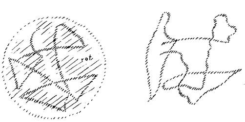
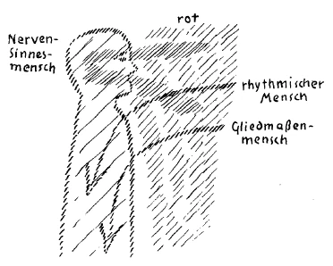
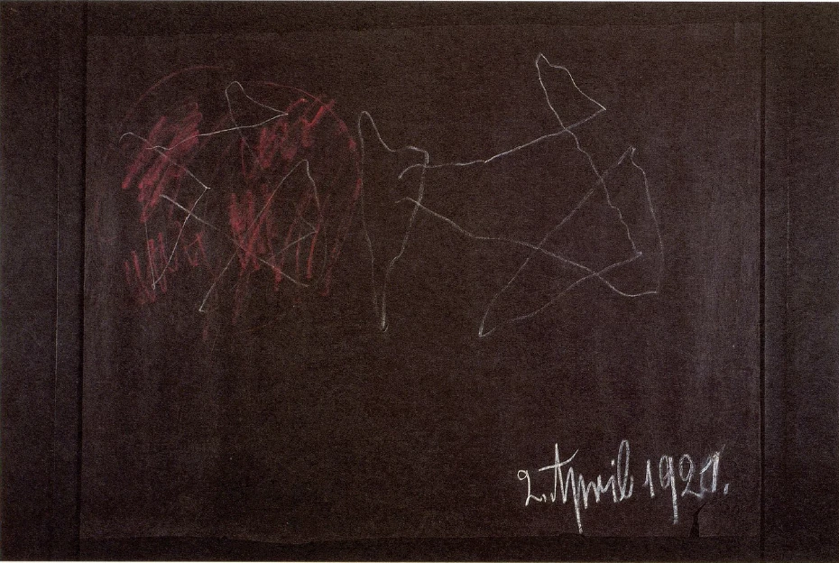
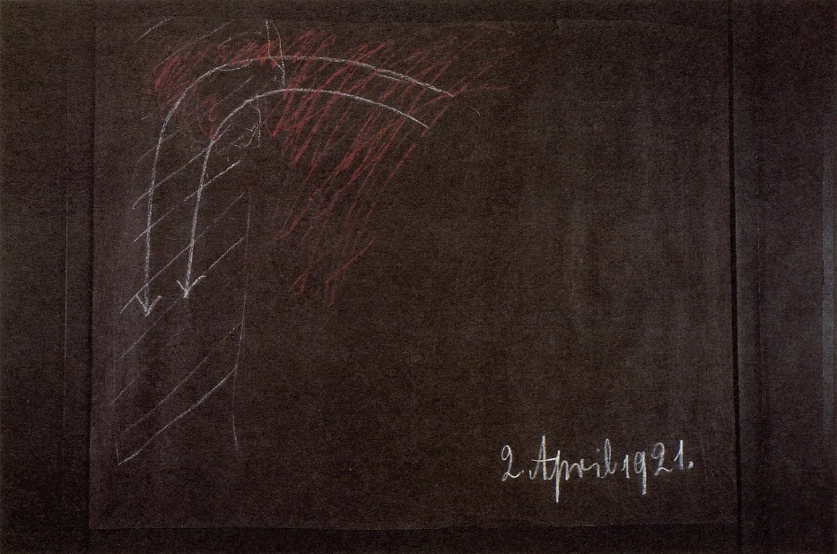

[ 1 ] ^ofucfk

Die Zeit der materialistischen Entwickelung liegt ja vorzugsweise in der Mitte und in der zweiten Hälfte des 19. Jahrhunderts. Heute mag uns zunächst von dieser materialistischen Entwickelung mehr die theoretische Seite interessieren. Manches von dem, was ich heute über diese theoretische Seite sagen werde, kann aber auch in ungefähr derselben Weise für die mehr praktische Lebensseite des Materialismus gesagt werden. Allein, wie gesagt, davon wollen wir heute absehen, wir wollen mehr sehen auf dasjenige, was durch die ganze zivilisierte Welt in der Mitte und in der zweiten Hälfte des 19. Jahrhunderts als die materialistische Weltanschauung aufgetreten ist. ^9uwfa8

[ 2 ] ^kz4yxu

Bei einer solchen Sache handelt es sich eigentlich um ein Zweifaches. Es handelt sich erstens darum, daß wir uns klar sein müssen darüber, inwiefern so etwas wie die materialistische Weltanschauung zu bekämpfen ist, daß wir gewissermaßen in uns tragen müssen alle diejenigen Vorstellungen und Ideen, durch die wir gerüstet sein können, um die materialistische Weltanschauung als solche abzuweisen. Allein neben diesem Gerüstetsein mit der nötigen Vorstellungswelt haben wir gerade vom Gesichtspunkte der Geisteswissenschaft aus noch etwas anderes nötig. Wir haben nötig, diese materialistische Vorstellungsweise zu verstehen, zu verstehen erstens ihrem Inhalte nach, zweitens aber auch zu verstehen, inwiefern in der Menschheitsentwickelung einmal diese extreme materialistische Weltanschauung auftreten konnte. ^y180ll

[ 3 ] ^go7yu3

Es könnte als ein Widerspruch erscheinen, daß auf der einen Seite hier gefordert wird, man müsse die materialistische Weltanschauung bekämpfen können, und auf der anderen Seite wiederum, man müsse sie verstehen können. Es ist dies für denjenigen, der auf dem Boden der Geisteswissenschaft steht, nicht in Wirklichkeit ein Widerspruch, sondern es ist nur ein scheinbarer Widerspruch. Die Sache verhält sich vielmehr so. Im Laufe der Menschheitsentwickelung müssen Momente auftreten, welche zunächst diese Menschheit in einer gewissen Weise herunterziehen, welche die Menschheit unter ein gewisses Niveau herunterbringen, damit sie sich dann durch sich selber wiederum heraufheben könne. Und es würde für die Menschheit keine Hilfe sein, wenn sie dutch irgendeinen göttlichen Ratschluß oder dergleichen davor bewahrt werden könnte, nicht die Niederungen des Daseins durchmachen zu müssen. Es ist für die Menschheit, damit sie zum vollen Gebrauche ihrer Freiheitskräfte komme, durchaus notwendig, auch in die Niederungen sowohl der Weltauffassung wie des Lebens herunterzusteigen. Und das Gefährliche liegt eigentlich nicht darin, daß zur rechten Zeit - und die war für den theoretischen Materialismus eigentlich die Mitte des 19. Jahrhunderts - so etwas auftritt, sondern das Gefährliche besteht darin, daß wenn im Laufe der normalen Entwickelung so etwas aufgetreten ist, dann daran festgehalten wird, daß dann dieses für einen gewissen Zeitpunkt Notwendige hinübergetragen wird in künftige Zeiten. Und wenn man sagen kann, daß der Materialismus in gewisser Beziehung für die Menschheit eine Prüfung war in der Mitte des 19. Jahrhunderts, die durchzumachen war, so ist es auf der anderen Seite auch wiederum richtig, daß das Festhalten an dem Materialismus jetzt einen furchtbaren Schaden bringen muß, und daß dasjenige, was wir an furchtbaren Weltkatastrophen und Menschheitskatastrophen durchmachen, eben darauf beruht, daß die Menschheit an diesem Materialismus in weiten Kreisen festhalten möchte. ^28cfxa

[ 4 ] ^l9jva3

Was bedeutet eigentlich der theoretische Materialismus? Er bedeutet die Anschauung, daß der Mensch zunächst der Umfang desjenigen sei, was die materiellen Prozesse seines physischen Leibes ausmacht. Der theoretische Materialismus studierte die physisch-sinnlichen Prozesse des physischen Leibes, und wenn auch zunächst dasjenige, was er in diesem Studium erreicht hat, mehr oder weniger am Anfange ist, so hat er doch die letzten Konsequenzen in bezug auf die Weltanschauungen bereits gezogen. Er hat den Menschen gewissermaßen erklärt als den Zusammenfluß dieser physischen Kräfte, er hat sein Seelisches erklärt als etwas, was nur hervorgerufen wird durch das Zusammenarbeiten dieser physischen Kräfte. Er hat aber auch eingeleitet die Untersuchung der physischen Natur des Menschen. Dieses letztere, die weitere Untersuchung der physischen Natur des Menschen, das ist dasjenige, was bleiben muß. Was das 19. Jahrhundert als Konsequenz aus dieser physischen Untersuchung gezogen hat, das ist das, was eine vorübergehende Erscheinung bleiben muß in der Menschheitsentwickelung. Aber als solche vorübergehende Erscheinung wollen wir sie zunächst einmal begreifen. ^jyv73f

[ 5 ] ^w9dnv7

Was liegt denn eigentlich da vor? Nun, wenn wir zurückblicken in die Menschheitsentwickelung und an der Hand desjenigen, was ich in der «Geheimwissenschaft im Umriß» angegeben habe, ziemlich weit zurückblicken, dann müssen wir sagen: Dieses Menschenwesen hat die verschiedensten Stadien durchgemacht. - Wir brauchen uns ja nur zu beschränken auf dasjenige, was das Menschenwesen im Laufe der Erdenentwickelung selber durchgemacht hat, und wir werden uns sagen müssen: Dieses Menschenwesen ging im Verlauf der Erdenentwickelung von einer allerdings im Verhältnis zu seiner heutigen Gestaltung primitiven Bildungsform aus, wandelte dann diese Bildungsform um und kam immer näher und näher derjenigen Gestalt, die eben der Mensch heute hat. Solange man im groben der menschlichen Gestaltung bleibt, so lange wird man, wenn man das geschichtliche Dasein des Menschen verfolgt, die Unterschiede nicht so außerordentlich groß finden. Wer etwa nach den Mitteln, die für die äußere Geschichte vorhanden sind, die Gestalt eines alten Ägypters oder selbst eines alten Inders vergleichen will mit der Gestaltung eines Menschen der heutigen europäischen Zivilisation, der wird nur verhältnismäßig kleine Unterschiede finden, wenn er eben durchaus im gröberen der Betrachtung bleibt. In bezug auf dieses gröbere der Betrachtung treten ja die großen Unterschiede gegenüber den primitiven Bildungsformen, die der Urmensch gehabt hat, erst hervor in den Zeiten, die weit hinter den geschichtlichen zurückliegen. Aber wenn wir ins feinere hineingehen, wenn wit in das hineingehen, was sich allerdings den äußeren Blicken verbirgt, dann gilt das nicht mehr, was ich eben gesagt habe, dann muß man durchaus sagen: Zwischen dem Organismus eines heutigen Zivilisationsmenschen und dem Organismus eines alten Ägypters oder selbst eines alten Griechen oder Römers ist ein großer, ein bedeutsamer Unterschied. Und wenn auch die Umwandlung in viel feinerer Weise sich vollzogen hat in geschichtlichen Zeiten, so hat sie sich eben doch in bezug auf alle feinere Gestaltung des menschlichen Organismus vollzogen. Und was sich da vollzogen hat, das hat eine gewisse Kulmination, einen gewissen Höhepunkt erreicht in der Mitte des 19. Jahrhunderts. So paradox es klingt, es ist durchaus so, daß in bezug auf seine innere Formung, in bezug auf dasjenige, was der menschliche Organismus überhaupt werden kann, der Mensch um die Mitte des 19. Jahrhunderts am vollkommensten war, und daß gerade seit jener Zeit eine Art Dekadenz wiederum eintritt, daß der menschliche Organismus in Rückverwandlung begriffen ist. Daher war es auch in der Mitte des 19. Jahrhunderts so, daß namentlich diejenigen Organe am vollkommensten ausgebildet waren, welche als die physischen Organe der Verstandestätigkeit dienen. ^03gv67

[ 6 ] ^t8dpz4

Was wir den menschlichen Verstand, den menschlichen Intellekt nennen, das braucht ja physische Organe. Diese physischen Organe waren in früheren Zeiten bei weitem weniger ausgebildet, als sie es in der Mitte des 19. Jahrhunderts waren. Es ist durchaus so, daß dasjenige, was wir zum Beispiel am Griechen, was wir selbst an solchen vollendeten Griechen bewundern, wie Plato oder Aristoteles es waren, darauf beruht, daß diese Griechen nicht so vollkommene Denkorgane im rein physischen Sinne hatten, wie die Menschen des 19. Jahrhunderts sie hatten. Je nachdem man den Geschmack dazu hat, kann man sagen: Gott sei’s gedankt, daß die Menschen der Griechenzeit nicht so vollkommene Denkorgane hatten wie die Menschen des 19. Jahrhunderts! - Ist man aber ein Nüchterling des 19. Jahrhunderts selber und will man diese Nüchterlingheit beibehalten, dann kann man sagen: Die Griechen waren eben Kinder, die haben noch nicht jene vollkommenen Denkorgane gehabt, die der Mensch des 19. Jahrhunderts hat, und man muß daher mit einer gewissen Nachsicht auf das herunterschauen, was Plato und Aristoteles zutage gefördert haben. - Gymnasiallehrer tun das oftmals, indem sie sich ungeheuer erhaben fühlen in der Kritik über Plato und Aristoteles. Aber verstehen wird man das, was ich jetzt eben angedeutet habe, nur dann vollkommen, wenn man sich bekanntgemacht hat mit Menschen, die es ja auch gibt, welche bis zu einem gewissen Grade eine Art Schauvermögen haben, dasjenige, was man, im besten Sinne des Wortes, eine Art hellseherisches Bewußtsein nennen kann. ^0qqbuc

[ 7 ] ^dmo7uj

Bei Menschen, die ein solches hellseherisches Bewußtsein heute haben, kann das Vorhandensein dieses hellseherischen Bewußtseins — diejenigen, die etwa in diesem Auditorium ein solches hellseherisches Bewußtsein haben sollten, mögen mir die Erzählung dieser Wahrheit verzeihen - gerade auf der mangelhaften Ausbildung der mangelhaften Verstandesorgane beruhen. Es ist durchaus eine ganz gewöhnliche Erscheinung, daß wir innerhalb unserer heutigen Welt Menschen treffen können mit einem gewissen hellseherischen Bewußtsein, die eigentlich von dem, was man heute den wissenschaftlichen Verstand nennt, außerordentlich wenig haben. Und so wahr dieses ist, so wahr ist aber auch das andere, daß nun solche hellseherischen Menschen dazu kommen können, gewisse Dinge, die sie selber durch ihre Erkenntnis hervorbringen, aufzuzeichnen oder zu erzählen, und daß in diesen Erzählungen, in diesen Aufzeichnungen Gedanken leben, die viel gescheiter sind als die Gedanken derjenigen Menschen, die, ohne Hellseherisches zu entwickeln, mit den allerbesten Verstandeswerkzeugen arbeiten. Es kann vorkommen, daß vom Gesichtspunkte der heutigen Wissenschaft aus dumme - verzeihen Sie den Ausdruck -, dumme hellseherische Personen Gedanken produzieren, durch die sie zwar nicht gescheiter werden, aber die gescheiter sind als Gedanken der autoritativsten Wissenschafter von heute. Diese Tatsache ist schon durchaus vorhanden. Und worauf beruht sie? Sie beruht darauf, daß solche hellseherische Personen gar nicht nötig haben, irgend etwas von Denkorganen anzustrengen, um zu diesen Gedanken zu kommen. Sie schaffen aus der geistigen Welt heraus die betreffenden Bilder, und da drinnen sind schon die Gedanken, sie sind schon fertig, während die anderen Menschen, die nicht hellsehend sind und nur denken können, zur Ausbildung ihrer Gedanken ihre Denkorgane ausbilden müssen. Schematisch gezeichnet, wäre das so. Nehmen wir an, solche hellseherischen Personen bringen in allerlei Bildern irgend etwas aus der geistigen Welt heraus; das hier (siehe Zeichnung, rot) sei so etwas, was durch solche Personen aus der geistigen Welt herauskommt. Aber da drinnen sind Gedanken, es ist ein Gedankennetz drinnen. Das denken die betreffenden Personen nicht, sondern sie schauen es, sie bringen es mit aus der geistigen Welt heraus; sie haben nicht nötig, Denkorgane anzustrengen. ^5158lf

 ^y0zpef

[ 8 ] ^09f3te

Schauen wir einen anderen an, der nicht hellseherisch begabt ist, sondern der denken kann, von dem Roten da ist nichts vorhanden bei ihm, das bringt er nicht heraus; er bringt auch aus der geistigen Welt dieses Gedankengerippe (siehe Zeichnung links) nicht heraus; aber er strengt seine Denkorgane an und bringt dann durch seine Denkorgane dieses Gedankengerippe zur Welt (siehe Zeichnung rechts). ^19mv9q

[ 9 ] ^jaz29n

Man kann, wenn man heute die Menschen betrachtet, die Abstufungen zwischen diesen zwei Extremen überall bemerken. Für denjenigen, der sein Anschauungsvermögen nicht geschult hat, ist es allerdings außerordentlich schwer, zu unterscheiden, ob der andere wirklich gescheit ist in dem Sinne, daß er durch seine Verstandesorgane denkt, oder ob er gar nicht durch seine Verstandesorgane denkt, vielmehr irgendwie etwas herschafft in sein Bewußtsein, und daß nur das, was bildhaft ist, was imaginativ ist, sich bei ihm entwickelt, aber so schwach, daß es von ihm selber nicht bemerkt wird. Und so sind alle möglichen Menschen heute vorhanden, die sehr gescheite Gedanken hervorbringen, aber deshalb gar nicht gescheit zu sein brauchen, während andere sehr gescheite Gedanken denken, aber in gar keiner besonderen Weise mit irgendeiner geistigen Welt in Beziehung stehen. Das Einschulen auf diese Unterscheidung, das gehört zu den bedeutsamen psychologischen Aufgaben in unserer Zeit und es liefert die Grundlage zu wichtiger Menschenkenntnis in der Gegenwart. Wenn Sie das zur Erklärung nehmen, so wird es Ihnen nicht mehr so unverständlich sein, daß sich der empirischen übersinnlichen Betrachtung eben ergibt, daß in der Mitte des 19. Jahrhunderts der menschliche Organismus bei dem Gros der Menschen eben die vollkommensten Denkorgane hatte. Es wurde niemals so ausschließlich viel gedacht wie um die Mitte des 19. Jahrhunderts, und so wenig gescheit wie um diese Zeit. ^d4tzlo

[ 10 ] ^u2mchi

Gehen Sie nur zurück - das tun nur die Menschen heute nicht in die zwanziger Jahre oder vor die zwanziger Jahre des 19. Jahrhunderts und lesen Sie durch, was damals wissenschaftlich produziert war, so werden Sie sehen: das hat noch einen ganz anderen Ton, da lebt eben noch durchaus nicht jenes ganz abstrakte, auf die menschlichen physischen Denkorgane angewiesene Denken wie später, ganz zu schweigen von solchen Dingen, wie sie etwa ein Herder oder Goethe und Schiller hervorgebracht haben. Da leben noch großartige Anschauungen darinnen. Daß man das nicht glaubt, und daß die Kommentare heute so sprechen, als ob das nicht der Fall wäre, darauf kommt es ja nicht an. Denn diejenigen, die diese Kommentare schreiben und die Goethe und Schiller und Herder zu verstehen glauben, die verstehen sie eben nicht, die sehen das Wichtigste bei ihnen nicht. ^f1s3nl

[ 11 ] ^xk2wv8

Das ist eine wichtige Tatsache, daß um die Mitte des 19. Jahrhunderts der menschliche Organismus in bezug auf seine physische Gestaltung gewissermaßen bei einer Kulmination, bei einem Höhepunkt angekommen war und daß er seitdem wiederum zurückgeht, und zwar - in einer gewissen Weise für das verständige Erfassen der Welt - rasch zurückgeht. ^qy8jhf

[ 12 ] ^0qr7wm

Mit dieser Tatsache hängt aber zusammen die Ausbildung des Materialismus in der Mitte des 19. Jahrhunderts. Denn was ist denn eigentlich dieser menschliche Organismus? - Dieser menschliche Organismus ist ja ein getreues Abbild des Geistig-Seelischen des Menschen. Man braucht sich gar nicht zu verwundern, daß dieser menschliche Organismus in seinem Bau manchem, der eben nicht auf das Geistig-Seelische einzugehen vermag, schon wie die Erklärung des ganzen Menschen erscheint. Insbesondere, wenn man die Hauptesorganisation und im Haupte wiederum die Nervenorganisation berücksichtigt, tritt das ja stark hervor. ^xlk1yk

[ 13 ] ^jybu63

Ich habe neulich in Stuttgart innerhalb meiner Vorträge ein Erlebnis erwähnt, das wirklich geeignet ist, Licht zu werfen auf diese Sache. Ich sagte: Es war so am Beginne des 20. Jahrhunderts in einer Versammlung des Berliner Giordano-Bruno-Vereins, da sprach zunächst ein Mensch - was ich einen handfesten Materialisten nenne -, ein sehr kundiger Materialist war es, der den Gehirnbau ebensogut kannte, wie man heute den Gehirnbau, wenn man gewissenhaft studiert hat, wirklich kennt; und er war einer von denjenigen Menschen, welche in der Analyse des Gehirnbaues eigentlich schon die ganze Seelenkunde sehen, welche sagen: Man muß nur erkennen, wie das Gehirn arbeitet, dann hat man die Seele, dann beschreibt man die Seele. - Nun war es interessant; er malte auf die Tafel diese verschiedenen Hirnpartien auf, also die Verbindungsstränge und so weiter, und lieferte da eben jenes wunderbare Bild, das man ja bekommt, wenn man diesen menschlichen Gehirnbau verfolgt. Und er glaubte eben durchaus mit der Schilderung dieses Gehirnbaues etwas gegeben zu haben, was Seelenkunde ist. Nachdem er seine Auseinandersetzungen gemacht hatte, erhob sich ein handfester Philosoph, ein Herbartianer. Dieser Herbartianer sagte: Gegen die Ansichten, die der Mann entwickelt hat, daß man schon die Seelenkunde besitzt, wenn man den Gehirnbau erklärt, gegen diese Ansichten muß ich mich natürlich entschieden wenden; aber gegen die Zeichnung, die er gemacht hat, brauche ich mich gar nicht zu wenden, diese Zeichnung stimmt ganz gut auch mit meiner Herbartschen Ansicht überein, daß die Vorstellungen sich miteinander vergesellschaften, daß von einer Vorstellung zu der anderen gewisse Verbindungsstränge rein seelischer Art gehen. Und er fügte hinzu, er könne als Herbartianer ganz gut dieselbe Zeichnung machen, nur würden bei ihm die einzelnen Kreise und so weiter nicht Gehirnpartien bedeuten, sondern Vorstellungskomplexe. Aber die Zeichnung würde ganz dieselbe bleiben! ^l2xh2o

[ 14 ] ^im1tdg

Sehr interessant, sehen Sie! Wenn es darauf ankommt, die Sache in die Wirklichkeit hineinzustellen, da sind die Leute ganz entgegengesetzter Ansicht; wenn sie Zeichnungen machen von derselben Sache, so müssen sie eigentlich dieselben Zeichnungen machen, und der eine ist ganz und gar Herbartscher Philosoph, der andere ist handfester materialistischer Physiologe. ^yhz9yy

[ 15 ] ^ougnpv

Worauf beruht das? Das beruht darauf, daß es in der Tat so ist: Wir haben das geistig-seelische Wesen des Menschen, das tragen wir in uns. Und dieses geistig-seelische Wesen, das ist der Schöpfer der ganzen Form unseres Organismus. Und wir brauchen uns nicht zu verwundern darüber, daß da, wo der Organismus seine vollkommenste Partie hat, im Nervensystem des Gehirns, daß da das Abbild, das die geistig-seelische Wesenheit heraussetzt, vollkommen ähnlich sieht diesem geistig-seelischen Wesen. Es ist in der Tat so, daß da, wo der Mensch am meisten, wenn ich so sagen möchte, Mensch ist, in seinem Nervenbau, daß er da ein getreues Abbild ist des Geistig-Seelischen, so daß derjenige, der zufrieden ist mit dem Abbild, der vor allen Dingen ein Sinnliches vor sich haben will und zufrieden ist mit dem Abbild, in der Tat dasselbe, was man zunächst mit Bezug auf den Menschen im Geistig-Seelischen sieht, auch in dem Abbild sieht. Und da er kein Verlangen hat nach dem Geistig-Seelischen, da er gewissermaßen nur das Abbild will, so hält er sich an den Bau des Gehirns. Und weil dieser Bau des Gehirnes ebenso besonders vollendet sich darstellte dem Betrachter um die Mitte des 19. Jahrhunderts, so lag es wiederum, wenn man die damalige Veranlagung der Menschheit nimmt, ungeheuer nahe, den theoretischen Materialismus auszubilden. Denn was liegt eigentlich beim Menschen vor? Wenn man den Menschen als solchen betrachtet - ich will ihn hier schematisch zeichnen - und dann den Gehirnbau nimmt, dann ist das so, daß zunächst der Mensch ein dreigliedriges Wesen ist, wie wir wissen: der Gliedmaßenmensch, der rhythmische Mensch und der NervenSinnesmensch. Wenn wir den Nerven-Sinnesmenschen ansehen, so haben wir den vollkommensten Teil des Menschen vor uns, sozusagen den am meisten menschlichen Teil. In diesem am meisten menschlichen Teil spiegelt sich die äußere Welt (siehe Zeichnung, rot). Ich will dieses Spiegeln dadurch bezeichnen, daß ich zum Beispiel die Wahrnehmungen durch das Auge bezeichne. Ich könnte auch die Wahrnehmungen durch das Ohr zeichnen und so weiter. Die äußere Welt also spiegelt sich in dem Menschen, so daß wir vorliegen haben den Bau des Menschen und die Spiegelung der äußeren Welt in diesem Menschen. Solange wir den Menschen so betrachten, können wir eigentlich gar nicht anders, selbst wenn wir über die manchmal recht groben Vorstellungen des Materialismus hinausgehen, als den Menschen materialistisch zu deuten. Denn wir haben auf der einen Seite den Bau des Menschen. Wir können diesen Bau verfolgen in all seinen feineren Gewebestrukturen und bekommen, je mehr wir gegen die Kopforganisation heraufgehen, ein getreues Abbild des Geistig-Seelischen. Und wir können dann weiterverfolgen dasjenige, was sich von der Außenwelt in dem Menschen spiegelt. Das ist aber bloßes Bild. Wir haben die Realität des Menschen, die wir in ihre feineren Strukturen hinein verfolgen können, und wir haben das Bild der Welt. ^m46yz3

 ^rc1hit

[ 16 ] ^t6bg74

Halten wir das recht gut fest: wir haben des Menschen Realität in seinem Organausbau und wir haben dasjenige, was sich drinnen im Menschen spiegelt. Das ist eigentlich alles, was zunächst der äußeren sinnlichen Beobachtung vorliegt. Bei dieser äußeren sinnlichen Beobachtung liegt also im Grunde das Folgende vor: Diese ganze Struktur des Menschen zerfällt, wenn der Mensch stirbt, zerfällt als Leichnam. Außerdem liegen ihr die Bilder der äußeren Welt vor. Wenn Sie den Spiegel zerbrechen, kann sich nichts mehr spiegeln; die Bilder sind also auch vergangen, wenn der Mensch durch den Tod geht. Ist es also nicht natürlich, daß da der äußeren sinnlich-physischen Beobachtung nichts anderes vorliegt als das, was ich eben angeführt habe, daß da gesagt werden muß: Mit dem Tode zerfällt die physische Struktur des Menschen? - Die spiegelte früher die Außenwelt. Was der Mensch in der Seele trägt, ist Spiegelbild; das vergeht aber. Diese Tatsache stellte einfach der Materialismus des 19. Jahrhunderts hin. Er mußte sie hinstellen, weil er schließlich von anderem nichts wußte. Nun wird die Sache schon anders, wenn man ein wenig eingeht auf das menschliche geistige und seelische Leben selber. Da aber betreten wir schon ein Gebiet, wohin die physisch-sinnliche Beobachtung nicht dringen kann. ^nmdag1

[ 17 ] ^418dl9

Nehmen wir eine naheliegende Tatsachenreihe der Seele heraus, die einfache Tatsachenreihe, die damit gegeben ist, daß wir der Außenwelt beobachtend gegenüberstehen. Wir beobachten die Dinge, wir nehmen sie wahr, haben sie dann vorstellungsgemäß in uns. Aber wir haben auch ein Gedächtnis, ein Erinnerungsvermögen. Was wir an der Außenwelt erleben, das können wir wiederum heraufheben in Bildern aus den Tiefen unseres Wesens. Wir wissen, welche Bedeutung diese Erinnerung für den Menschen hat. Bleiben wir zunächst bei dieser Tatsachenreihe stehen. Nehmen Sie diese zwei inneren Erlebnisse: Sie schauen durch die Augen die Außenwelt an oder hören sie mit Ihren Ohren, nehmen sie sonst mit Ihren Sinnen wahr. Da sind Sie in einer gegenwärtigen seelischen Betätigung. Das geht über in Ihr vorstellungsgemäßes Leben. Das was Sie heute erlebt haben, Sie können es in ein paar Tagen aus den Untergründen Ihrer Seele in Bildern wiederum heraufheben. Es geht ja in irgendeiner Weise etwas in Sie hinein, Sie holen es wiederum aus sich heraus. Es ist unschwer zu erkennen, daß dasjenige, was da in die Seele hineingeht, von der Außenwelt herrühren muß. Ich will mich jetzt gar nicht weiter einlassen auf etwas anderes als auf den reinen Tatbestand, der ja offen zutage liegt, daß das, was so erinnert wird, von der Außenwelt kommen muß. Denn wenn Sie irgendeinen roten Gegenstand gesehen haben, so erinnern Sie sich wiederum an den roten Gegenstand, und was in Ihnen vorgegangen ist, ist nur das Bild des roten Gegenstandes, das wiederum in Ihnen heraufkommt. Also es ist etwas, was die Außenwelt in Sie hineingeprägt hat, tiefer hineingeprägt hat, als wenn Sie sich nur unmittelbar vorstellend in der Außenwelt betätigen. Aber stellen Sie sich jetzt vor: Sie gehen an irgend etwas heran, beobachten es, sind also in einer gegenwärtigen Seelenbetätigung gegenüber dem Beobachteten. Sie verlassen es; nach einigen Tagen haben Sie Veranlassung, die Bilder des Beobachteten wieder aus dem Untergrund Ihres Wesens heraufzuheben, da sind sie wieder da; sie sind blasser, gewiß, aber sie sind da, sie sind bei dem Menschen da. Aber was war in der Zwischenzeit? ^hfv81q

[ 18 ] ^wtaftl

Nun bitte ich Sie, halten Sie das fest, was ich Ihnen gesagt habe, und vergleichen Sie dieses eigentümliche Spiel von gegenwärtigen Wahrnehmungsvorstellungen und Erinnerungsvorstellungen mit dem, was Sie gut kennen als das Bild des Traumes. Sie werden unschwer bemerken können, wie mit dem Erinnerungsvermögen das Träumen zusammenhängt. Die Traumvorstellungen brauchen ja nur nicht sehr konfus zu sein, dann werden Sie sehen, wie sie an die Erinnerungsvorstellungen anknüpfen, wie also eine Verwandtschaft besteht zwischen dem Träumen und demjenigen, was da aus den lebendigen Vorstellungen in die Erinnerung übergeht. ^ob2oq0

[ 19 ] ^qruqo3

Aber jetzt betrachten Sie etwas anderes. Der Mensch muß organisch vollkommen gesund sein, wenn er sozusagen das Träumen richtig vertragen will. Zum Träumen gehört, daß man sich organisch völlig in der Hand hat, daß der Moment immer wiederum eintreten kann, wo man weiß: Das ist ein Traum gewesen. — Es muß irgend etwas nicht in Ordnung sein, wenn jemand nicht zu dem Moment kommen könnte, wo er vollkommen durchschauen würde: etwas ist ein Traum gewesen. Man hat ja Menschen kennengelernt, die haben geträumt, daß sie geköpft worden sind. Nun denken Sie, wenn diese Menschen hinterher nicht unterscheiden können dieses geträumte Köpfen von dem wirklichen Köpfen und glauben würden, daß sie nun wirklich geköpft sind und würden doch weiterleben müssen, bedenken Sie doch nur einmal, wie wenig solche Menschen, ohne konfus zu werden, die Tatsachen durch das Unterscheiden zusammenbringen könnten. Sie müßten fortwährend erleben: Ich komme eben vom Köpfen. - Und wenn sie voraussetzen müßten, daß sie das glauben müßten, dann kann man ja ungefähr ermessen, welche Worte sich da ihren Lippen entringen würden. Also, es handelt sich darum, daß der Mensch immerzu die Möglichkeit hat, sich so in der Hand zu haben, daß er Träume von dem In-der-Wirklichkeit-Drinnenstecken mit seinem Vorstellen unterscheiden kann. Aber es gibt doch auch Menschen, die können das nicht. Es gibt Menschen, die erleben allerlei Halluzinatorisches, Visionäres und dergleichen und halten es für Wirklichkeiten. Die können es nicht unterscheiden, die haben sich nicht so stark in der Hand. Was bedeutet das? Das bedeutet, daß bei diesen Leuten das, was im Traume lebt, einen Einfluß auf ihre Organisation hat, daß ihre Organisation angepaßt ist der Traumvorstellung. Sie haben irgendwo etwas nicht vollständig ausgebildet in ihrem Nervensystem, was vollständig ausgebildet sein sollte; daher ist der Traum in ihnen tätig, er wirkt in ihnen. ^52jq3z

[ 20 ] ^xy1fhh

Wenn also irgend jemand seine Traumvorstellungen nicht von den erlebten Wirklichkeiten unterscheiden kann, so bedeutet das, daß die Traumkraft in ihm organisierend wirkt. Sobald der Traum unseres ganzen Gehirnes mächtig würde, würden wir überhaupt die ganze Welt als Traum anschauen. Wer solch eine Tatsache in ihrem vollen Werte betrachten kann, der wird nach und nach zu Dingen kommen, zu denen sich allerdings unsere gewöhnliche Wissenschaft heute nicht aufschwingen will, weil sie nicht den Mut dazu hat; er wird dazu kommen, einzusehen, daß in dem, was im Traumleben kraftet, dasselbe liegt, was in uns Organisationskraft ist, was Wachstums-, Belebekraft ist. Nur dadurch, daß gewissermaßen unser Organismus so in sich konsolidiert ist, daß er so feste Strukturen hat, daß er widersteht dem gewöhnlichen Traum, nur dadurch hat die Kraft der gewöhnlichen Träume nicht die Macht, seine Struktur auseinanderzureißen, und der Mensch kann unterscheiden das Traumerlebnis vom Wirklichkeitserlebnis. ^zcglq3

[ 21 ] ^m776cn

Aber wenn das Kind klein ist und heranwächst, wenn es also immer größer und größer wird, da ist eine Kraft in ihm. Das ist dieselbe Kraft, die im Traume ist, nur daß man sie beim Traume ansieht. Und wenn: man sie nicht ansieht, sondern wenn sie im Leibe wirkt, diese Kraft, die sonst im Traume ist, dann wächst man durch sie. Und man braucht nicht einmal so weit zu gehen, auf das Wachsen hinzuschauen. Auch wenn Sie täglich zum Beispiel essen und das Gegessene in sich verdauen, es in dem ganzen Organismus verbreiten, so ist es durch die Kraft, die im Traume lebt. Wenn daher irgend etwas im Organismus nicht richtig ist, dann hängt das auch mit unrichtigem Träumen zusammen. Es ist dieselbe Kraft, die in dem Traumleben äußerlich angeschaut wirkt, und die da in einem wirkt selbst bis in die Verdauungskräfte hinein. ^ca8rny

[ 22 ] ^0onn9j

So können wir sagen: Wir werden gewahr, wenn wir nur das Leben des Menschen richtig anschauen, die wirksame Traumeskraft in seinem Organismus. Und indem ich das schilderte, diese wirksame Traumeskraft, betrete ich eigentlich in dieser Schilderung dieselben Wege, die ich betreten muß, wenn ich den menschlichen Ätherleib beschreibe. ^dc9mwg

[ 23 ] ^bxb9sq

Denken Sie sich, irgend jemand könnte durchschauen alles dasjenige, was im Menschen wächst vom Kinde auf, was im Menschen die Verdauung bewirkt, was im Menschen wirkt, um den ganzen Organismus in seiner Tätigkeit zu erhalten; denken Sie sich, ich könnte dieses ganze Kraftsystem nehmen, herausnehmen aus dem Menschen und es vor den Menschen hinstellen, dann hätte ich den Ätherleib vor den Menschen hingestellt. Dieser Ätherleib, dieser Leib also, der sich nur in Unregelmäßigkeiten in dem Traume offenbart, war in sich viel mehr ausgebildet vor dem Zeitpunkte im 19. Jahrhundert, den ich angeführt habe. Er wurde immer schwächer und schwächer in seiner Struktur. Dafür wurde der physische Leib immer stärker und stärker in seiner Struktur. Der Ätherleib kann in Bildern vorstellen, er kann traumhafte Imaginationen haben, aber er kann nicht denken. Und sobald in irgendeinem Menschen der Gegenwart dieser Ätherleib besonders stark tätig zu sein beginnt, dann wird er das, was ich vorhin sagte, er wird etwas hellseherisch; aber er kann dann weniger denken, denn zum Denken braucht er gerade den physischen Leib. ^nxbmf9

[ 24 ] ^zsxacn

Daher ist es nicht zu verwundern, daß die Menschen, wenn sie im 19. Jahrhundert das Gefühl hatten, sie könnten besonders gut denken, eigentlich zum Materialismus hingetrieben wurden. Was ihnen zu diesem Denken am meisten half, das ist dieser physische Leib, mit anderen Worten ausgedrückt. Aber mit diesem Denken gerade, mit diesem physischen Denken hängt die besondere Art des Gedächtnisses zusammen, die im 19. Jahrhundert entwickelt worden ist, es ist ein Gedächtnis, das womöglich wenig bildhaft ist, womöglich in Abstraktionen verläuft. ^bi9yn5

[ 25 ] ^m3qv2x

Interessant ist solch eine Erscheinung. Ich habe öfters den Kriminalanthropologen Moriz Benedikt angeführt; ich möchte auch heute ein interessantes Erlebnis, das er selber erzählt in seinen «Lebenserinnerungen», anführen. Er hatte eine Rede zu halten auf einer Naturforscherversammlung, und nun erzählt er, daß er sich auf diese Rede, indem er Tag und Nacht nicht geschlafen hat, zweiundzwanzig Nächte lang vorbereitet hat. Zweiundzwanzig Nächte hat er die Rede vorbereitet, und am letzten Tag, bevor er die Rede gehalten hat, ist ein Journalist bei ihm erschienen, der sollte diese Rede veröffentlichen. Er diktierte sie ihm. Er hatte die Rede nicht niedergeschrieben, erzählt er, er hatte sie nur dem Gedächtnis eingeprägt. Er diktierte sie dem Journalisten; also im Kämmerchen diktierte er sie dem Journalisten und dann hielt er bei der Naturforscherversammlung diese Rede. Was der Journalist nach dem Diktat abgedruckt hat, stimmte nun bis aufs Wort genau mit dem überein, was Benedikt dann der Naturforscherversammlung vorgetragen hat. — Ich muß sagen, ich bewundere so etwas außerordentlich! Denn man bewundert immer dasjenige, was zu leisten man selbst niemals imstande wäre. Das also ist eine sehr interessante Erscheinung. Der Mann hat zweiundzwanzig Nächte lang daran gearbeitet, Wort für Wort einzuverleiben seiner Organisation, was er vorbereitet hat, so daß er niemals hätte irgendeinen Satz anders sagen können in der Wortfolge, als wie er saß in seinem Organismus, so fest saß er da. ^lo6cuy

[ 26 ] ^7sxebk

So etwas ist nur möglich, wenn man die ganze Rede absolut aus dem allmählich sich formenden Wortlaut dem physischen Organismus einprägen kann. Es ist schon richtig so, daß man das, was man da ausdenkt, so fest dem physischen Organismus einprägt, wie die Naturkraft das Knochensystem fest aufbaut. Dann ruht diese ganze Rede wie ein Gerippe im physischen Organismus. Es ist ja das Gedächtnis gewöhnlich an den Ätherleib gebannt, aber hier hat sich der Ätherleib ganz im physischen Organismus abgedruckt. Der ganze physische Organismus hat etwas in sich, wie er seine Knochen in sich hat, was als ein Gerippe dieser Rede dasteht. Dann kann man auch so etwas machen, wie es der Professor Benedikt gemacht hat. Und so etwas ist eben nur möglich, wenn dieser physische Organismus in seiner Nervenstruktur so ausgebildet ist, daß er in seine Plastik dasjenige hineinnimmt, ohne Widerstand hineinnimmt, was in ihn hineingebracht wird, nach und nach allerdings, zweiundzwanzig Tage beziehungsweise zweiundzwanzig Nächte hindurch mußte es hineingearbeitet werden. ^ebfmnf

[ 27 ] ^hg96ka

Man braucht sich da nicht zu verwundern, daß jemand, der so auf seinen physischen Leib baut, das Gefühl bekommt, dieser physische Leib ist das einzig Arbeitende im Menschen drinnen. - Und es war schon das Leben des Menschen allmählich so geworden, daß es sich ganz und gar in den physischen Leib hineinarbeitete, und er daher auch zu dem Glauben kam: der physische Leib ist alles in der menschlichen Organisation. Ich glaube nicht, daß ein anderes Zeitalter als dasjenige, welches auf den physischen Leib diesen großen Wert legt, hätte zu einer so grotesken Erfindung - verzeihen Sie diesen Ausdruck - kommen können, wie es die Stenographie ist. Denn man hat ja, als man keine Stenographie gehabt hat, nicht solchen Wert darauf gelegt, das Wort und die Wortfolge so unbedingt festzuhalten und so festzuprägen die Worte, wie sie im Stenogramm festgehalten werden wollen. So festprägen kann sie ja nur der Abdruck im physischen Leib. Also nur die besondere Vorliebe für das Abprägen im physischen Leibe bewirkt auch die andere Vorliebe, dieses abgeprägte Wort zu erhalten, ja nicht irgend etwas zu erhalten, was um ein Niveau höher erhoben ist. Da hätte die Stenographie nämlich nichts zu suchen, wenn man diejenigen Formen festhalten wollte, die sich im ätherischen Leibe ausprägen. Es gehörte schon die materialistische Tendenz dazu, um etwas so Groteskes zu erfinden, wie es die Stenographie ist. ^osm3lb

[ 28 ] ^8ngsce

Nun, das sollte nur erläuternd hinzugefügt werden zu dem, was ich zu dem Problem beitragen möchte: das Verstehen des Auftretens des Materialismus im 19. Jahrhundert. Die Menschheit war bei einer gewissen Verfassung angelangt, die hinneigte zu dem Einprägen des Geistig-Seelischen in den physischen Organismus. Sie müssen das, was ich gesagt habe, als eine Interpretation nehmen, nicht als eine Kritik der Stenographie. Ich will nicht, daß die Stenographie heute gleich abgeschafft wird. Das ist niemals die Tendenz, die solchen Charakteristiken zugrunde liegt. Denn man muß sich ganz klar sein: Damit, daß man etwas versteht, will man es ja auch nicht durchaus gleich abschaffen! Es gibt vieles in der Welt, was notwendig ist zum Leben, was aber auch nicht zu allem dienen kann - ich will das Thema nicht weiter ausführen - und was man doch auch in seiner Notwendigkeit begreifen muß. Aber wir leben, das muß ich immer wieder betonen, in einem Zeitalter, in dem es durchaus notwendig ist, etwas mehr in die Tiefe sowohl der Naturentwickelung wie der Kulturentwickelung einzudringen, sich sagen zu können: Woher kommt die eine oder die andere Erscheinung? - Denn mit dem bloßen keiferischen Aburteilen und Abkritisieren ist es nicht getan; man muß alle Dinge der Welt wirklich verstehen. ^m5yl8u

[ 29 ] ^vxls7b

Was ich also heute ausgeführt habe, möchte ich dahin zusammenfassen, daß uns die Entwickelung der Menschheit zeigt, daß gewissermaßen die Strukturvollendung des physischen Leibes in der Mitte des 19. Jahrhunderts einen Höhepunkt erreichte, daß jetzt schon wieder die Dekadenz eintritt, und daß mit diesem Vervollkommnen des physischen Leibes der Aufschwung der theoretischen materialistischen Weltanschauung zusammenhängt. Ich werde ja über diese Dinge in den nächsten Tagen von dem einen oder anderen Gesichtspunkt aus das eine oder das andere noch zu sagen haben. Heute möchte ich gerade dieses vor Ste hingestellt haben, was ich eben zusammengefaßt habe. ^qux56d

 ^h1csi6

 ^to1cm6

