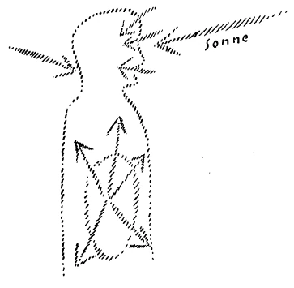
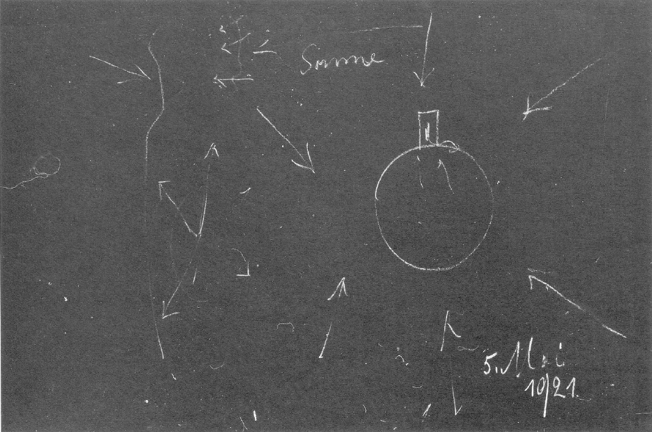
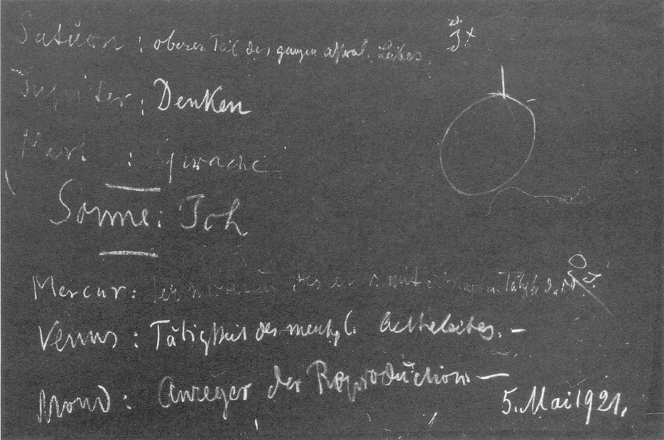

[ 1 ] ^eavyxj

Die vierte nachatlantische Epoche, in welche hineinfällt die Verstandesentwickelung der Menschheit, sie wurde aus den griechischen Mysterien heraus geleitet. Erst gaben die Mysterien der allgemeinen Bevölkerung Vorderasiens, des europäischen Südens, dasjenige an, was dieser Verstandes- oder Gemütskultur zugrunde liegt. Es spielte in diesen Mysterien das Geheimnis von dem menschlichen Zusammenleben mit der Sonne eine große Rolle. Wir wissen ja aus den Darstellungen, die ich in meiner «Theosophie» gegeben habe, wie innerhalb der Verstandes- oder Gemütsseele des Menschen das Ich aufleuchtet, das dann gewissermaßen zu seiner vollen inneren Kraft durch die Bewußtseinsseele kommen soll. Insofern nun das Ich des Menschen gewissermaßen zu seiner Erweckung kommen sollte während der Verstandeskulturzeit, mußten sich die Mysterien dieser Zeit beschäftigen mit den Geheimnissen des Sonnenlebens und seinen Zusammenhängen mit demjenigen, was gerade menschliches Ich ist. Es ist Ihnen ja auch bekannt aus meiner Darstellung der «Rätsel der Philosophie», wie der Grieche noch in der Außenwelt seine Vorstellungen, seine Begriffe so wahrgenommen hat, wie wir heute Farben, Töne und so weiter wahrnehmen. Dasjenige, was in den Vorstellungen lebte, das war durchaus für den Griechen nicht eben bloß innerlich in der Seele Erschaffenes, sondern es war für ihn etwas an den Dingen Wahrgenommenes. In dieser Beziehung hatte ja Goethe durchaus etwas Griechisches in sich, was er dadurch bezeugte, daß, als er in dem berühmten Gespräch von Schiller die Worte hörte, seine Vorstellungen, also etwas Begrifflich-Ideelles, wären keine Wahrnehmungen, sondern eine Idee, daß er darauf sagte, dann sähe er seine Ideen vor sich, wie er eben äußere Wahrnehmungen vor sich sehe. ^0cgv3c

[ 2 ] ^5pb2ni

Diese griechische Art, sich zu den Vorstellungen zu verhalten, war durchaus verknüpft mit einer ganz bestimmten Empfindung, welche die Griechen hatten, wenn sie ihr Auge richteten auf die äußere Welt. Sie sahen in dem, was ihnen als Vorstellungsinhalt entgegenglänzte, überall eigentlich das Geschöpf des Sonnenlebens. Sie empfanden, indem die Sonne am Morgen aufging, auch das Heraufkommen des Vorstellungslebens in dem Raum, und beim Untergange der Sonne empfanden sie das Versinken der Vorstellungswelt. Man kann die Entwickelung der Völker nicht verstehen, wenn man nicht diese Änderung des Seelenlebens durchaus ins Auge faßt. ^buaifb

[ 3 ] ^9n1d4y

Das ist etwas, meine lieben Freunde, was den Menschen in ihrem Seelenleben eigentlich verlorengegangen ist: mitzuempfinden die Geistigkeit ihrer ganzen Umgebung. Heute sieht der Mensch eben den Sonnenball heraufkommen, und er hat nur die Empfindung für dasjenige, was ihm da entgegentritt an farbiger und leuchtender Lufterscheinung. Und ebenso ist es, wenn er die Sonne in der Abendtöte verschwinden sieht. Der Grieche hatte eben die Empfindung, daß des Morgens aufsteigt diejenige Welt, die ihm die Vorstellungen bringt, und daß sie des Abends untergeht, daß abends diejenige Welt kommt, die ihm diese Vorstellungswelt entzieht. Er war daher so, daß er sich empfand Vorstellung-verlassen in der Finsternis der Nacht. Und wenn er hinausblickte in den Himmel, den wir blau sehen, für den er ja die gleiche Bezeichnung wie für das Dunkel hatte, so fühlte er eigentlich die Welt begrenzt von demjenigen, was außerhalb des Vorstellungslebens war. Dort hörte für ihn das Vorstellungsleben, so wie es dem Menschen beschert ist, auf, wo er begrenzt sah den Weltraum. Jenseits dieses Weltraumes waren für ihn andere Gedankenwelten, die Gedankenwelten der Götter. Und sie sah er eben eng gebunden an dasjenige, was er als Licht bezeichnete. Sie offenbarten sich ihm gewissermaßen konzentriert im Sonnenleben, während sie sonst sich ihm entzogen in der Weite des dunklen Weltenfirmamentes. Man muß in diese ganz andersgeartete Empfindungswelt hineinschauen, wenn man verstehen will, wie eigentlich, nachdem diese Anschauungsweise mit aller ihrer inneren Lebendigkeit eine Zeitlang gewirkt hat in der Weltentwickelung des Menschen, wie dann der Mensch in seinen fortgeschrittensten Repräsentanten fühlte, wie er im Weltenraum das Sonnenleben nicht mehr als ihm etwas geistig Zurückstrahlendes empfinden konnte, und wie er in den ersten Zeiten eben - es war das gerade bei den fortgeschrittensten Repräsentanten der Menschheit der Fall, bei denjenigen, die noch ihre Bildung in den griechischen Mysterien empfangen hatten -, wie er empfand das Mysterium von Golgatha als eine Erlösung, insofern als es ihm die Möglichkeit brachte, in sich nun das Licht zu entzünden. Das Licht, das er vorher als Göttliches wirklich erlebt hat, das wollte er jetzt erleben dadurch, daß er seinen seelisch-geistigen Anteil nahm an den Geschehnissen des Mysteriums von Golgatha. Man lernt dasjenige, was eigentlich in der Menschheit im Laufe der Jahrtausende geschehen ist, nicht kennen, wenn man bloß mit dem Verstande auf diese Dinge hinsieht. Man muß die Umwandlung des Menschengemütes, des menschlichen Seelenlebens in seiner Ganzheit ins Auge fassen. Und wir, die wir nun seit dem Beginne des 15. Jahrhunderts leben in dem Zeitalter der Bewußtseinsseelenentwickelung, wir haben ja von jener Verstandesgeistigkeit, welche da war in den Zeiten der vierten nachatlantischen Periode, nur noch das Schattenwesen unserer inneren Verstandestätigkeit. Das habe ich ja in den letzten Wochen hier auseinandergesetzt. Aber wir müssen uns wiederum durchringen zu einer Erkenntnis desjenigen, was dieses Verstandeswesen, dieses schattenhafte Verstandeswesen durchdringen kann mit einer lebendigen Anschauung des Weltenalls. Gerade durch die moderne Verstandesschattenkultur ist der Mensch gewissermaßen an die Erde gebannt worden. Er betrachtet heute, insbesondere wenn er sich anstecken läßt von der immer weiter und weiter um sich greifenden, rein wissenschaftlichen Kultur, er betrachtet ja heute nur dasjenige, was ihm die Erde eigentlich gibt. Er hat keine Ahnung davon, daß er mit seinem ganzen Wesen nicht bloß der Erde angehört, sondern daß er mit seinem ganzen Wesen dem außerirdischen Weltall angehört. Und das ist dasjenige, was sich der Mensch wieder erringen muß, diese Erkenntnis seines Zusammenhanges mit dem außerirdischen Weltenall. ^f7mw2m

[ 4 ] ^7flu9j

Wir bilden heute einfach unsere Begriffe, Vorstellungen, indem wir von dem irdischen Leben ausgehen und uns nach diesem irdischen Leben das ganze Weltenall konstruieren. Aber dasjenige, was sich da uns als Weltbild ergibt, ist dann nicht viel anders als eine Übertragung der irdischen Verhältnisse auf die außerirdischen Verhältnisse. Und so ist es denn gekommen, daß aus den grandiosen Errungenschaften der modernen Naturwissenschaft heraus mit der Spektralanalyse und den anderen Ergebnissen, daß da gebildet worden ist eine Anschauung über die Sonne, die eigentlich ganz den irdischen Verhältnissen nachgebildet ist. Man bildet sich die Vorstellung, wie ein leuchtender Gaskörper eben aussieht. Und nun überträgt man diese Ansicht eines leuchtenden Gaskörpers auf dasjenige, was uns als Sonne entgegenkommt im Weltenall. Wir müssen wiederum geisteswissenschaftliche Unterlagen anwenden lernen, um zu einer Anschauung von der Sonne kommen zu können. Diese Sonne, von der der Physiker glaubt, wenn er hinauskommen würde in den Weltenraum, sie böte sich ihm dar als eine leuchtende Gaskugel; diese Sonne, trotzdem sie das Weltenlicht in ihrer Art uns zurückstrahlt, so wie sie es empfängt, ist ein durch und durch geistiges Wesen, und wir haben es nicht zu tun mit einem physischen Wesen, das da oben irgendwo im Weltenraum herumgondelt, sondern mit einem durch und durch geistigen Wesen. Und der Grieche empfand noch richtig, wenn er das, was ihm von der Sonne zustrahlte, als dasjenige empfand, was in Zusammenhang gebracht werden muß mit seiner Ich-Entwickelung, insofern diese Ich-Entwickelung gebunden ist an das Vorstellungswesen des Verstandes. In dem Sonnenstrahl sah der Grieche dasjenige, was in ihm entzündet das Ich. So daß man sagen muß: Der Grieche hatte noch diese Empfindung von der Geistigkeit des Kosmos. Er sah in dem Sonnenwesen substantiell ein dem Ich verwandtes Wesen. Dasjenige, was der Mensch gewahr wird, wenn er zu sich selber Ich sagt, die Kraft, die in ihm wirkt, so daß er zu sich Ich sagen kann, auf die sah der Grieche hin, und er fühlte sich veranlaßt, zur Sonne dasselbe zu sagen wie zu seinem Ich, dieselbe Empfindung der Sonne entgegenzubringen, wie er sie seinem Ich entgegenbrachte. ^hrklu2

[ 5 ] ^apxi15

Ich und Sonne, sie verhalten sich wie das Innere und das Äußere. Was draußen durch den Weltenraum kreist als Sonne, ist das Welten-Ich. Was drinnen in mir lebt, ist das Ich des Menschen. Man möchte sagen: Gerade noch zu erhaschen ist diese Empfindung für diejenigen Menschen, die etwas tiefer mitfühlen mit dem ganzen All der Natur. Schon sehr verglommen ist dasjenige, was da eigentlich zugrunde liegt, aber es gibt doch noch heute dasjenige Leben im Menschen, das gewissermaßen heraufkommen vernimmt die Sonne im Frühling, das den Sonnenstrahl noch erleben kann als etwas Geistiges, und das das Ich aufleben fühlt, indem der Sonnenstrahl in einer größeren Stärke die Erde erleuchtet. Aber es ist, ich möchte sagen, eine letzte Empfindung, die in dieser äußeren Art nun auch schon verglimmt in der Menschheit, die zugrunde gehen will innerhalb der abstrakten Verstandesschattenkultur, die nach und nach sich unseres ganzen Zivilisationslebens bemächtigt hat. Aber durchdringen müssen wir wiederum dazu, etwas zu erkennen von dem Menschheitszusammenhang mit dem außerirdischen Dasein. Und in dieser Beziehung möchte ich heute auf einiges hinweisen. ^pgvdy2

[ 6 ] ^05896s

Wir werden, indem wir all dasjenige zusammennehmen, was Sie an verschiedenen Stellen unserer geisteswissenschaftlichen Literatur zerstreut finden, zunächst wiederum den Zusammenhang der Sonne mit dem Ich ergreifen können, und wir werden den bedeutungsvollen Gegensatz erkennen können, der da besteht zwischen den Kräften, die der Erde von der Sonne zustrahlen, und denjenigen Kräften, welche für die Erde wirksam sind in demjenigen, was wir Mond nennen. Sonne und Mond, sie sind in einer gewissen Beziehung das völlige Gegenteil voneinander. Sie sind polar zueinander. Wenn wir die Sonne studieren mit den Mitteln der Geisteswissenschaft, so strahlt uns die Sonne alles dasjenige zu, was uns gestaltet zu einem Träger unseres Ich. Wir verdanken der Sonnenstrahlung dasjenige, was uns eigentlich die menschliche Gestalt gibt, was uns in der menschlichen Gestalt zu einem Abbild des Ich macht. Alles, was im Menschen von außen wirkt, was von außen seine Gestalt bestimmt, was schon während seiner Embryonalzeit seine Gestalt bestimmt, das ist Sonnenwirkung. Wenn sich der menschliche Embryo im Mutterleibe bildet, dann ist durchaus nicht bloß dasjenige vorhanden, was eine heutige Wissenschaft träumt, daß von der befruchteten Mutter die Kräfte ausgehen würden, welche den Menschen formen, nein, der menschliche Embryo ruht nur im mütterlichen Leibe. Dasjenige, was ihm da die Form gibt, das sind die Sonnenkräfte. Allerdings müssen wir diese Sonnenkräfte in Zusammenhang bringen mit den ihnen entgegengesetzt wirkenden Mondenkräften. Die Mondenkräfte sind zunächst dasjenige, was sich für den unteren, den Stoffwechselmenschen als das Innerliche geltend macht. So daß wir sagen können, wenn wir schematisch zeichnen: die Sonnenkräfte sind dasjenige, was den Menschen von außen gestaltet. Dasjenige, was sich im Stoffwechsel des Menschen von innen aus gestaltet, das sind die zentral ausstrahlenden Mondenkräfte, die sich in ihm festsetzen. ^n9eqla

 ^pq2llu

[ 7 ] ^j0dgtu

Das widerspricht nicht dem, daß diese Mondenkräfte zum Beispiel das menschliche Gesicht mitformen. Sie formen ja das menschliche Gesicht, weil dasjenige, was im unteren, im Stoffwechselmenschen, von dem Zentrum aus wirkt, gewissermaßen anziehend von außen auf die menschliche Gesichtsbildung wirkt; differenzierend die menschliche Gesichtsbildung wirken die Mondenkräfte, aber indem sie sich summieren mit den Sonnenkräften, während sie vom Inneren des Menschen aus den Sonnenkräften entgegenwirken. Daher hängt auch die menschliche Fortpflanzung als Organismus von den Mondenkräften ab, die Gestalt geben. Aber das Fortgepflanzte, das hängt von den Sonnenkräften ab. Der Mensch ist mit seinem ganzen Wesen zwischen Mondenkräften und Sonnenkräften eingespannt. ^vysu2y

[ 8 ] ^hw0mhn

Nun müssen wir aber unterscheiden, wenn wir die Mondenkräfte im menschlichen Inneren, im Inneren des menschlichen Stoffwechsels suchen, diese Mondenkräfte im Stoffwechsel von den Kräften, die im Stoffwechsel nun selber ihren Ursprung haben. Es spielen die Mondenkräfte in den Stoffwechsel hinein, aber der Stoffwechsel hat seine eigenen Kräfte. Und diese eigenen Kräfte, das sind die Erdenkräfte. So daß wir sagen können, wenn im Menschen die Kräfte wirken, die in den Substanzen seiner Nahrungsmittel liegen, die Kräfte, die also, sagen wir, in den Vegetabilien oder sonstigen Nahrungsmitteln liegen, so wirken diese Kräfte in ihm durch sich selbst. Sie wirken da als Erdenkräfte. Der Stoffwechsel ist zunächst ein Ergebnis der Erdenkräfte; aber in diese Erdenkräfte wirkt dasjenige hinein, was Mondenkräfte sind. Wenn der Mensch bloß den Stoffwechsel mit seinen Kräften in sich hätte, wenn also gewissermaßen die Substanzen seiner Nahrungsmittel nur ihre eigenen Kräfte in seinem Leib fortsetzen würden, nachdem sie aufgenommen sind, dann würde der Mensch ein Chaos sein von allen möglichen Kräften. Daß diese Kräfte immerzu wirken, die menschliche Wesenheit von innen aus zu erneuern, das hängt gar nicht von der Erde ab, das hängt von dem der Erde beigegebenen Mond ab. Von innen heraus wird der Mensch dutch den Mond gestaltet, von außen herein wird der Mensch durch die Sonne gestaltet. Und indem die Sonnenstrahlen wieder aufgenommen werden durch das Auge in den menschlichen Kopforganismus, wirken sie auch innerlich; aber sie wirken doch von außen herein. ^mgbsvu

[ 9 ] ^ovdqgk

So finden wir, wie auf der einen Seite der Mensch in seiner ganzen Ich-Entwickelung abhängt von der Wirkung der Sonne, wie er ein fest auf der Erde lebendes Ich nicht sein könnte ohne die Sonne; und wie kein Menschengeschlecht wäre, keine Fortpflanzung wäre, wenn nicht der Mond der Begleiter der Erde wäre. Man kann sagen: die Sonne ist dasjenige, was den Menschen als eine Persönlichkeit, als einzelnes Individuum fest auf die Erde stellt. Der Mond ist dasjenige, was den Menschen in seiner Vielheit, in seiner ganzen Entwickelung auf die Erde hinzaubert. Das Menschengeschlecht als physische Folge von Generationen ist das Ergebnis der Mondenkräfte, die es anregen. Der Mensch als einzelnes Wesen, als Individualität, ist das Ergebnis der Sonnenkräfte. Und wenn wir daher den Menschen und das Menschengeschlecht studieren wollen, dann können wir nicht bloß die Verhältnisse der Erde studieren. Vergebens suchen die Geologen die Verhältnisse der Erde zu ergründen und daraus den Menschen zu begreifen, vergebens untersuchen sie die anderen Kräfte der Erde, um daraus den Menschen zu begreifen. Der Mensch ist zunächst nicht auf der Erde gemacht. Der Mensch ist geformt aus dem Kosmos herein; der Mensch ist ein Ergebnis der Sternenwelt, zunächst von Sonne und Mond. Von der Erde stammen nur diejenigen Kräfte, welche dem Stoff selbst innewohnen, und die wirksam sind außerhalb des Menschen, dann ihre Wirksamkeit fortsetzen, wenn sie in den Menschen dutch das Essen und Trinken eingetreten sind; aber sie werden da empfangen von dem Außerirdischen. ^eclfbh

[ 10 ] ^23i1wx

Was im Menschen vorgeht, ist durchaus nicht bloß ein irdisches Geschehen, ist durchaus etwas, was von der Sternenwelt aus besorgt wird. Zu dieser Erkenntnis muß wiederum der Mensch sich durchringen. Und wenn wir den Menschen weiter betrachten, so können wir Rücksicht nehmen darauf: Er ist zunächst ein physischer Leib. Dieser physische Leib nimmt ja die äußeren Nahrungsmittel auf. In diesem physischen Leib setzen sie ihre Kräfte fort. Aber der physische Leib wird angegriffen von dem astralischen Leib, und in dem astralischen Leib ist tätig die Mondenwirkung, so wie ich es Ihnen dargestellt habe. Und in diesen astralischen Leib wirkt hinein die Sonnenwirkung. Sonne und Mond durchziehen kraftend den astralischen Leib, und der astralische Leib äußert sich in der Weise, wie ich es jetzt eben beschrieben habe. Der ätherische Leib steht in der Mitte zwischen physischem Leib und astralischem Leib. ^rc46tf

[ 11 ] ^ndnr8r

Wenn man die Kräfte studiert, welche von den Nahrungsmitteln ausgehen, so werden sie zunächst regsam im physischen Leibe, und sie werden von dem astralischen Leib, der Sonnen- und Mondenwirkung in sich hat, so aufgenommen, wie ich es eben beschrieben habe. Aber dazwischen steht das andere, dasjenige, was im ätherischen Leibe wirksam ist. Das kommt auch nicht von der Erde, das kommt aus dem Umkreise des ganzen Weltenraumes. Wenn wir die Erde im Verhältnis zum Menschen betrachten mit ihren Produkten, mit denjenigen Stoffen, die sich darleben als feste, flüssige, luftförmige Bestandteile, so werden diese aufgenommen vom Menschen, im Menschen drinnen verarbeitet gemäß den Sonnen- und Mondenkräften. Aber im Menschen wirken auch diejenigen Kräfte, die ihm zustrahlen nun von allen Seiten des Weltenraumes. Die Kräfte, die in den Nahrungsmitteln wirken, sie kommen aus der Erde heraus. Aber ihm strahlen von allen Seiten des Weltenraumes Kräfte zu: das sind die ätherischen Kräfte. Diese ätherischen Kräfte, die ergreifen auch, aber in einer viel gleichförmigeren Weise, die Nahrungsmittel und verwandeln sie so, daß sie aus ihnen ein Lebensfähiges machen, daß sie aus ihnen etwas machen, was außerdem das Ätherische als solches, das Licht und die Wärme, innerlich erleben kann. So daß wir sagen können: Der Mensch ist zugeteilt durch seinen physischen Leib der Erde, durch seinen ätherischen Leib dem ganzen Umkteis, dutch seinen astralischen Leib ist er zunächst zugeteilt dem Monde und der Sonne in ihren Wirkungen. Aber diese Wirkungen, die im astralischen Leib als Sonnen- und Mondwirkungen enthalten sind, die werden wiederum modifiziert, so modifiziert, daß ein gewaltiger Unterschied besteht zwischen denjenigen Wirkungen, welche ausgeübt werden auf den oberen, und denen, die ausgeübt werden auf den unteren Menschen. ^rlljss

[ 12 ] ^okmek2

Nennen wir heute «oberen Menschen» denjenigen Menschen, der gewissermaßen durchkreist wird von dem nach aufwärts, nach dem Kopfe zu gehenden Blutstrom; nennen wir den «unteren Menschen» dasjenige, was vom Herzen nach abwärts liegt. Wenn wir so den Menschen anschauen, dann haben wir zunächst im Menschen das Obere, das sein Haupt umfaßt, und dasjenige, was gewissermaßen organisch zu dem Haupte gehört. Das ist hauptsächlich in seiner Gestaltung.von den Sonnenwirkungen abhängig. Das bildet sich ja auch zunächst embryonal vorzugsweise aus. Da wirken schon im Embryo auf diesen Organismus die Sonnenwirkungen in ganz besonderer Weise, aber diese Wirkungen setzen sich ja dann fort, wenn der Mensch geboren ist, wenn der Mensch physisch da ist im Leben zwischen der Geburt und dem Tode. Und da wird nun dasjenige, was ja in diesem Gebiet des Menschen, ich möchte sagen, was oberhalb des Herzens liegt, genauer müßte man das nach der Blutzirkulation beschreiben, was oberhalb des Herzens liegt, das wird in bezug auf die astralischen Wirkungen modifiziert von Saturn, Jupiter, Mars (siehe Darstellung $S. 233). ^wd9taj

[ 13 ] ^tdr2b3

Der Saturn hat Kräfte, die er - betrachten wir es nach der kopernikanischen Weltanschauung - in seinem Umkreis um die Sonne entwickelt und die er der Erde zuschickt; er hat diejenigen Kräfte, welche eigentlich im ganzen astralischen Leib, namentlich in demjenigen Teile, der diesem oberen Menschen angehört, wirksam sind. Der Saturn hat die Kräfte, die in diesen astralischen Leib hineinstrahlen. Und indem sie den astralischen Leib durchstrahlen, beleben, wirken sie auf ihn so, daß von ihnen eigentlich in ganz wesentlicher Weise abhängt, inwiefern sich der astralische Leib in ein richtiges Verhältnis zum physischen Leib des Menschen stellt. Wenn der Mensch zum Beispiel nicht richtig schlafen kann, wenn also sein astralischer Leib nicht richtig herausgehen will aus dem Ätherleib und dem physischen Leib, wenn er beim Erwachen nicht richtig hineingehen will, wenn er sonst in irgendeiner Weise sich nicht richtig eingliedert dem physischen Leibe, so ist das eine Wirkung, eine unregelmäßige Wirkung der Saturnkräfte. Der Saturn ist im wesentlichen derjenige Weltenkörper, welcher auf dem Umwege durch das menschliche Haupt ein richtiges Verhältnis des astralischen Leibes zum menschlichen physischen Leib und zum Ätherleib herstellt. Dadurch liefern die Saturnkräfte auf der anderen Seite wiederum das Verhältnis des astralischen Leibes zum Ich, weil ja der Saturn im Verhältnisse steht zu der Sonnenwirkung. Er steht so im Verhältnis zur Sonnenwirkung, daß das räumlich-zeitlich dadurch ausgedrückt ist, daß ja der Saturn ungefähr seinen Umkreis um die Sonne, wie Sie wissen, in dreißig Jahren vollendet. ^payx1i

[ 14 ] ^ji939o

Diese Beziehung des Saturn zur Sonne, die drückt sich im Menschen dadurch aus, daß erstens das Ich in ein entsprechendes Verhältnis kommt zum astralischen Leib, aber namentlich daß der astralische Leib sich in einer richtigen Weise in die ganze menschliche Organisation eingliedert. So daß wir sagen können, der Saturn hat seine Beziehung zu dem oberen Teil des ganzen astralischen Leibes. Diese Beziehung, die war für die Menschen älterer Zeiten durchaus etwas Maßgebendes. Und noch in der ägyptisch-chaldäischen Zeit, wenn wir zurückgehen würden in das 3., 4. Jahrtausend vor dem Mysterium von Golgatha, da würden wir finden, daß bei den Lehrern, bei den Weisen in den Mysterien jeder Mensch daraufhin beurteilt wurde, wie er sein Verhältnis zum Saturn durch sein Geburtsdatum bestimmt hatte; denn man wußte ganz genau, wenn ein Mensch geboren ist bei dieser oder jener Konstellation des Saturn, so war er ein Mensch, der seinen astralischen Leib im physischen Leib richtig brauchen konnte oder weniger richtig brauchen konnte. Die Erkenntnis solcher Dinge spielte in alten Zeiten eine große Rolle. Aber darauf beruht gerade der Fortschritt der Menschheitsentwickelung in unserem Zeitalter, das mit dem Beginn des 15. Jahrhunderts seinen Anfang genommen hat, daß wir uns freimachen von dem, was da in uns wirkt. ^a1dvlh

[ 15 ] ^zjdhph

Meine lieben Freunde, mißverstehen Sie das nicht. Das heißt nicht, daß der Saturn heute nicht in uns wirkt. Er wirkt in uns geradeso, wie er in alten Zeiten gewirkt hat; nur müssen wir uns davon freimachen. Und wissen Sie, worinnen dieses In-der-richtigen-Weise-Freimachen von der Saturnwirkung besteht? Man macht sich am schlechtesten frei von der Saturnwirkung, wenn man dem schattenhaften Intellekt unseres Zeitalters folgt. Da läßt man geradezu die Saturnwirkungen in sich wüten, da schießen die Saturnwirkungen hin und her und machen einen gerade zu demjenigen, was man in unserem Zeitalter den nervösen Menschen nennt. Der nervöse Mensch beruht im wesentlichen darauf, daß sein astralischer Leib in seine ganze physische Wesenheit nicht ordentlich eingeschaltet ist. Darauf beruht die Nervosität unseres Zeitalters. Und wozu der Mensch gebracht werden muß, ist: das Streben nach wirklicher Anschauung, das Streben nach Imagination. Wenn der Mensch beim abstrakten Vorstellen bleibt, so wird er immer nervöser und nervöser werden, weil er eigentlich herauswächst aus der Saturntätigkeit, diese aber doch in ihm ist, in ihm hin- und herschießt und aus seinen Nerven den astralischen Leib herauszerrt und daher den Menschen nervös macht. Die Nervosität unseres Zeitalters muß kosmisch erkannt werden als eine Saturnwirkung. ^2fm8w8

[ 16 ] ^ptjoru

So wie es Saturn zu tun hat mit dem oberen Teil des ganzen astralischen Leibes, insofern dieser astralische Leib mit dem ganzen Organismus in Verbindung steht durch das Nervensystem, hat es Jupiter vorzugsweise mit dem menschlichen Denken zu tun (siehe Darstellung S. 233). ^1xy00i

[ 17 ] ^70ed5g

Dieses menschliche Denken beruht ja in einer gewissen Weise auch auf einer partiellen Tätigkeit des astralischen Leibes. Ich möchte sagen, eine kleinere Partie des astralischen Leibes ist tätig beim Denken als beim Versorgen des ganzen Menschen durch den astralischen Leib. Was in unserem astralischen Leib wirkt, und was zunächst überhaupt unser Denken stark macht, das ist Jupiterwirkung. Jupiterwirkung hat es vorzugsweise mit dem astralischen Durchorganisieren des menschlichen Gehirnes zu tun. ^av7ti0

[ 18 ] ^v9hm3g

Sehen Sie, die Saturnwirkungen erstrecken sich eigentlich über das ganze menschliche Leben, und dieses ganze menschliche Leben hat ja angefangen seit unseren drei ersten Lebensjahrzehnten. Wie wir uns - solange wir in den Wachstumsperioden sind, und ganz hören diese ja eigentlich erst auf nach dem dreißigsten Jahre -, wie wir uns da entwickeln in unserem astralischen Leib, davon hängt unser ganzes Leben und unsere Gesundheit ab. Daher braucht der Saturn dreißig Jahre, um herumzugehen um die Sonne. Das ist ganz auf den Menschen zugeschnitten. ^dbqej4

[ 19 ] ^51022z

Dasjenige, was sich in uns als Denken entwickelt, das hat mit den ersten zwölf Lebensjahren zu tun. Dasjenige, was da draußen kreist, das ist nicht ohne Beziehung zum Menschen. ^jzh2jz

[ 20 ] ^k8tsbu

Ebenso wie es Jupiter zu tun hat mit dem Denken, hat es Mars zu tun mit demjenigen, was die Sprache ist. Mars hat es zu tun mit der Sprache. ^6803tp

Saturn = oberer Teil des ganzen astralischen Leibes ^r9b6xm

Jupiter = Denken ^z8jvr5

Mars = Sprache ^jzx12p

[ 21 ] ^lb2ir0

Mars, sehen Sie, hebt gewissermaßen vom astralischen Leib noch ein kleinere Partie, als diejenige ist, die fürs Denken in Betracht kommt, heraus aus seiner ganzen Einorganisierung in den übrigen Menschen. Und von den Marswirkungen in uns hängt es ab, daß entfaltet werden können die Kräfte, die sich dann in das Sprechen ergießen. Die kleine Umlaufszeit des Mars ist ja auch dafür maßgebend. Der Mensch lernt ja innerhalb einer Zeit, die durchaus der halben Umlaufzeit des Mats ungefähr entspricht, die ersten Sprachlaute. ^ud2chq

[ 22 ] ^ijrmcg

Auf- und absteigende Entwickelung! Wir sehen, diese ganze Entwickelung, insofern sie an die Gegend des menschlichen Hauptes gebunden ist, hängt zusammen mit Saturn-, Jupiter- und Marskräften. ^mvlppp

[ 23 ] ^sa0rd1

Damit haben wir die äußeren Planeten in ihrem Fortwirken innerhalb des menschlichen astralischen Leibes gegeben. Während die Sonne mehr mit dem Ich zusammenhängt, haben diese drei Weltenkörper: Saturn, Jupiter und Mars, mit der Entwickelung desjenigen, was ja an den astralischen Leib gebunden ist, Sprechen, Denken und dem ganzen Verhalten der menschlichen Seele im menschlichen Organismus zu tun. Dann haben wir die Sonne, die mit dem eigentlichen Ich zu tun hat. Und dann haben wir diejenigen Planeten, die wir auch die inneren nennen, diejenigen Planeten, die gewissermaßen der Erde näher sind als die Sonne, diejenigen Planeten also, die zwischen der Erde und der Sonne sich befinden, während die anderen Planeten, Saturn, Jupiter, Mars, abgewendet sind von der Erde gegenüber der Sonne. Wenn wir diese inneren Planeten ins Auge fassen, dann kommen wir dazu, ebenfalls solche Beziehungen ihrer Kräfte zum Menschen ins Auge zu fassen. Betrachten wir zunächst den Merkur. ^07od9x

[ 24 ] ^cbbbs0

Merkur hat, ich möchte sagen seine Angriffspunkte ähnlich dem Monde mehr im Inneren des Menschen, nur gegenüber dem menschlichen Antlitz wirkt er von außen; aber er wirkt schon in demjenigen Teil des Menschen, der unter der Herzgegend liegt. Da wirkt er mit seinen Kräften, indem er innerlich die menschliche Organisation ergreift und seine Kräfte von dort wiederum ausstrahlen. Und da wirkt er so, daß er vorzugsweise es ist, der die Vermittlung besorgt der Wirksamkeit des astralischen Leibes in der ganzen Atmungs- und Zirkulationstätigkeit des Menschen. Er ist der Vermittler zwischen dem astralischen Leib und den rhythmischen Vorgängen im Menschen. So daß wir also sagen können: seine Kräfte besorgen die Vermittlung des Astralischen mit der rhythmischen Tätigkeit des Menschen (siehe Darstellung S. 233). Dadurch greifen die Merkurkräfte ähnlich den Mondenkräften auch ein in den ganzen Stoffwechsel des Menschen, aber nur insofern der Stoffwechsel dem Rhythmus unterliegt, auf die rhythmische Tätigkeit zurückwirkt. ^49af34

[ 25 ] ^w6ildx

Dann haben wir Venus. Venus ist dasjenige, was vorzugsweise im menschlichen Ätherleib tätig ist, was also von dem Kosmos aus im menschlichen Ätherleib sich betätigt: Tätigkeit des menschlichen Ätherleibes. ^er4a3e

[ 26 ] ^toesig

Und dann haben wir Mond. Über ihn haben wir schon gesprochen. Er ist dasjenige im Menschen, was den Sonnenkräften polarisch entgegengesetzt ist, und was von innen aus den Stoff überführt ins Lebendige und dadurch auch mit der Reproduktion zusammenhängt. Der Mond ist also im ausgiebigsten Sinne der Anreger sowohl der inneren Reproduktion wie auch der Fortpflanzungsreproduktion. ^9yijl6

[ 27 ] ^oiru39

Bedenken Sie nun, daß ja dasjenige, was im Menschen eigentlich vorgeht, Ihnen in seiner Abhängigkeit erscheint von dem umliegenden Kosmos. Der Mensch ist auf der einen Seite mit seinem physischen Leib gebunden an die irdischen Kräfte, mit seinem ätherischen ^wab12s

[ 28 ] ^b14pcg

Leib gebunden an den ganzen kosmischen Umkreis. In ihm wird aber differenziert in dieser Weise, wie ich es hier dargestellt habe, und indem die Differenzierung vorzugsweise von seinem astralischen Leibe ausgeht, gliedern sich in diesen astralischen Leib die Kräfte von Saturn, Jupiter, Mars, Merkur, Venus, Mond ein. Auf dem Umwege durch das Ich wirkt dann die Sonne in ihm. Bedenken Sie, daß dadurch, daß der Mensch also in den Kosmos eingegliedert ist, es etwas anderes ist, ob der Mensch auf einem Punkte der Erde steht und, sagen wit, Jupiter glänzt vom Himmel, oder ob der Mensch hier auf der Erde steht und Jupiter ist von der Erde zugedeckt. Die Wirkungen auf den Menschen sind in dem einen Falle direkt, die Wirkungen in dem anderen Falle sind so, daß die Erde sich dazwischen stellt. Das gibt einen bedeutsamen Unterschied. Jupiter, haben wir gesagt, steht mit dem Denken in Beziehung. Nehmen wir an, da wo das menschliche physische Denkorgan in seiner vorzugsweisen Entfaltung ist, da erlebt der Mensch, also bald nach seiner Geburt, von seiner Geburt aus, daß Jupiter ihm zuglänzt seine Wirksamkeit. Der Mensch bekommt die direkte Jupiterwirkung. Sein Gehirn wird ganz besonders zum Denkorgan umgegliedert; er bekommt eine gewisse Anlage zum Denken. Nehmen wir an, der Mensch verlebt diese Jahre so, daß der Jupiter auf der anderen Seite ist, die Jupiterwirkungen also durch die Erde gehindert sind: sein Gehirn wird wenig umgestaltet zum Denkorgan. Wirkt dagegen die Erde mit ihren Stoffen und Kräften in ihm, und alles dasjenige, was von den Stoffen der Erde ausgeht, wird vielleicht gerade umgestaltet, sagen wir, durch die Mondenwirkungen, die ja immer in einer gewissen Weise da sind, so wird der Mensch ein dumpf Träumender, ein dumpf bewußtes Wesen nur; das Denken tritt zurück. Dazwischen liegen alle möglichen Grade. Nehmen Sie an, ein Mensch habe aus seiner früheren Inkarnation solche Kräfte in sich, welche sein Denken dazu prädestinieren, in dem Erdenleben, das er nun antreten soll, besonders ausgebildet zu sein; dann schickt er sich an, auf die Erde herunterzukommen. Er wählt sich, da ja der Jupiter seine bestimmte Umlaufszeit hat, diejenige Zeit, in der er auf der Erde erscheint, in der er auf der Erde geboren werden soll, so, daß der Jupiter direkt die Strahlen zusendet. ^d3e44e

[ 29 ] ^uznee5

Auf diese Weise gibt die Sternkonstellation dasjenige ab, in das der Mensch sich hineingeboren werden läßt nach den Bedingungen seiner früheren Erdenleben. ^9bzpu2

[ 30 ] ^4i5zra

Von dem, was sich Ihnen da erweist, muß sich ja allerdings der Mensch heute im Bewußtseinszeitalter immer mehr und mehr freimachen. Aber es handelt sich darum, daß er sich in der richtigen Weise freimacht davon, daß er tatsächlich so etwas tut, wie ich es angedeutet habe mit Bezug auf die Saturnwirkungen: daß er versucht, aus dem bloßen schattenhaften intellektuellen Entwickeln zu einem bildhaften, anschaulichen Entwickeln wiederum zu kommen. Was wir auf die Art aus der Geisteswissenschaft entwickeln, wie ich es dargestellt habe in «Wie erlangt man Erkenntnisse der höheren Welten?», ist zugleich eine Anweisung dafür, daß der Mensch in der tichtigen Weise unabhängig werde von den kosmischen Kräften, die aber trotzdem in ihm wirken. ^4894o1

[ 31 ] ^bun4cx

Indem der Mensch sich geboren werden läßt, lebt er sich in die Erde hinein, je nachdem die Sternkonstellation ist. Aber er muß sich ausrüsten mit Kräften, die ihn in der richtigen Weise unabhängig machen von dieser Sternkonstellation. ^75ulmh

[ 32 ] ^s0f3xf

Sehen Sie, zu solchen Erkenntnissen vom Zusammenhange des Menschen mit dem außerirdischen Kosmos muß unsere Zivilisation wieder kommen. Der Mensch muß sich wieder fühlen so, daß er weiß: In meiner Organisation wirken nicht nur die gewöhnlichen, von der heutigen Wissenschaft anerkannten Vererbungskräfte. Gegenüber dem wirklichen Tatbestand ist es zum Beispiel ein bloßer Unsinn, zu glauben, innerhalb der Organisation des weiblichen Organismus lägen diejenigen Kräfte, die sich dann vererben - es ist das so eine dunkle, mystische Vorstellung, dieses Vererben -, die dann sich so vererben, daß sie ein Herz, eine Leber ausbilden und so weiter. Kein Herz wäre im menschlichen Organismus, wenn nicht die Sonne eben dieses Herz eingliederte, und zwar vom Kopfe aus, und keine Leber wäre im menschlichen Organismus, wenn ihm nicht diese Leber von Venus eingegliedert würde. Und so ist es mit den einzelnen Organen des Menschen. Die hängen durchaus zusammen mit demjenigen, was außerirdisch ist. Im Gehirn des Menschen wirken die Jupiterkräfte. In der ganzen Konstitution des Menschen, insofern er seinen astralischen Leib gesund oder krank einorganisiert hat in seine physische Organisation, wirken die Saturnkräfte. Der Mensch lernt sprechen dadurch, daß die Marskräfte in ihm wirken, und im Sprechen zeigen sich die Marskräfte. ^8zgn8w

[ 33 ] ^gykrnp

Das sind Dinge, die wiederum durchschaut werden müssen von der Menschheit. Der Mensch muß wiederum wissen, daß mit einer Wissenschaft, die nur das Irdische umfaßt, sein Wesen durchaus nicht erklärt werden kann. Dann wird man auch den Zusammenhang des Menschen mit der Erde kennenlernen. Denn die anderen Wesenheiten, die um den Menschen herum leben, sie sind auch nicht bloß Erdenwesen. Erdenwesen sind bloß zunächst die Mineralien. Aber auch mit den Mineralien sind Veränderungen vor sich gegangen, welche wiederum abhängig gewesen sind von den Kräften der Umgebung der Erde. So sind alle unsere Metalle, insofern sie kristallisieren, durchaus in ihren Gestalten deshalb da, weil sie in einer gewissen Weise abhängig sind von den außerirdischen Kräften, weil sie gebildet worden sind, als die Erde noch nicht intensiv ihre Kräfte entwickelt hatte, sondern noch die außerirdischen Kräfte in der Erde tätig waren. Heilkräfte, die in den Mineralien, in den Metallen namentlich liegen, sie hängen mit dem zusammen, wie diese Metalle sich innerhalb der Erde, aber aus außerirdischen Kräften gebildet haben. ^k6djgv

[ 34 ] ^20u935

Wir sehen, wenn wir in der nachatlantischen Entwickelung zurückgehen, wie da der Mensch in der ersten Zeit, als die alte indische Kultur blühte, durchaus ein Wesen war, das sich fühlte im ganzen Weltenall, ein Bürger des ganzen Weltenalls. Er war, wenn er auch noch nicht diejenigen Kräfte, auf die heute die Menschheit so stolz ist, entwickelt hatte, er war im wahren Sinne des Wortes Mensch. Dann wurde der Mensch mehr oder weniger abgelenkt von den außerirdischen Kräften. Aber wir sehen noch in der ganzen chaldäischen Zeit und in der ersten griechischen Zeit, wie wenigstens der Mensch hinblickte auf die Sonne. Er war noch in gewissem Sinne eine Art Amphibium, das sich freute, wenn es die Sonnenstrahlen empfing, und wenn es nicht mehr in der Dumpfheit der Erde drinnen zu wühlen brauchte, Aus dem Menschen war ein Amphibium geworden. Jetzt ist der Mensch, indem er glaubt, daß er eigentlich nur mit den Erdenkräften zusammenhängt, man kann nicht einmal sagen ein Maulwurf, er ist eigentlich ein Regenwurm, der höchstens noch wahrnimmt, wenn ihm dasjenige, was erst von der Erde in den Weltenraum hinausgesetzt wurde, das Regenwasser, wiederum zurückkommt. Das ist das einzige, was der Mensch noch von außerirdischen Kräften wahrnimmt. Aber das nehmen die Regenwürmer auch wahr - Sie haben das heute morgen sehen können, wenn Sie auf den Straßen gegangen sind! Der Mensch ist im Grunde heute in seinem Materialismus ein Regenwurm geworden. Er muß wiederum dieses Regenwurmwesen überwinden. Das kann er aber nur, wenn er sich dahin entwickelt, seinen Zusammenhang mit dem außerirdischen Kosmos zu erkennen. ^wwee6e

[ 35 ] ^zg7o0t

Also, meine lieben Freunde, es handelt sich darum, daß wir es in unseren Zeiten dahin bringen müssen, uns aus unserer Zivilisation heraus zu einem neuen Spiritualismus zu «entregenwurmen». ^407gr4

 ^rbf132

 ^famfab

