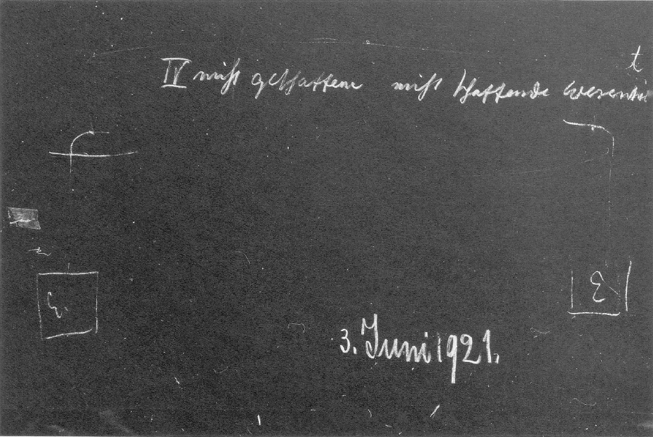

[ 1 ] ^dbpckz

Wir haben gestern geschlossen mit zwei bedeutsamen Fragen, die sich ergeben haben aus der Betrachtung der Stellung einer solchen Persönlichkeit wie Johannes Scotus Erigena es war. Bei diesem Mann finden wir ja eine Anschauung, die herüberleuchtet aus den ersten christlichen Jahrhunderten in das 9. Jahrhundert hinein. Wir können sagen, aus allem dem, was sich im Laufe der letzten Zeit ergeben hat, sind die Vorstellungsarten, ist die ganze Art zu denken in den ersten christlichen Jahrhunderten noch anders als später. Und ein großer Umschwung hat stattgefunden, wie wir ja schon wissen, im 4. nachchristlichen Jahrhundert. Die Menschen haben einfach von der Mitte des 4. Jahrhunderts an viel verstandesmäßiger gedacht als vorher. Man möchte sagen: alles Erkennen, alles Vorstellungbilden war vorher viel mehr einer Art von Eingebung entsprungen als später, wo die Menschen sich immer mehr bewußt wurden, selber mit den Gedanken zu arbeiten. Und was sich als solches Bewußtsein für die Menschen vor dem 4. nachchristlichen Jahrhunderte herausgestellt hatte, das klingt nach noch in einem solchen Ausspruche wie dem des Scotus Erigena, daß der Mensch als Mensch urteilt und Schlüsse zieht, daß er aber als Engel erkennt. Was da Scotus Erigena, ich möchte sagen wie ein altes Erbstück, wie durch eine Reminiszenz noch heraufholt, das wurde von all denen angenommen vor dem 4. Jahrhundert, die überhaupt Gedanken hatten. Sie kamen gar nicht darauf, die Gedanken, die ein Wissen, ein Erkennen vermittelten, dem Menschen als solchem zuzuschreiben, sondern sie schrieben das dem in ihnen wirkenden Engel zu. Ein Engel bewohnte den Leib des Menschen, der erkannte, und an dieser Erkenntnis nahm der Mensch teil. ^fec5vc

[ 2 ] ^t94ufd

Solch ein unmittelbares Bewußtsein war ganz verglommen seit dem 4. nachchristlichen Jahrhundert, und in solchen Geistern wie in Johannes Scotus leuchtete es wieder auf, wurde es gewissermaßen mit Mühe herausgeholt aus der Seele. Das beweist eben, daß die ganze Art des Weltenschauens anders geworden ist im Laufe dieser Jahrhunderte, und daher wird es so schwer für die Menschen der Gegenwart, sich zurückzuvetsetzen in die Denk- und Anschauungsweise der ersten christlichen Jahrhunderte. Erst mit Hilfe der Geisteswissenschaft muß das wiederum angestrebt werden. Man muß wiederum zu Vorstellungen kommen, die nun wirklich entsprechend sind dem, was in den ersten christlichen Jahrhunderten gedacht worden ist. Schon zur Zeit des Scotus Erigena begannen ja solche Dinge wie der sogenannte Abendmahlsstreit, wie der Streit über die Vorherbestimmung des Menschen. Es waren die Dinge, welche durchaus anzeigen, wie in die Sphäre des menschlichen Diskutierens dasjenige hereingezogen ist, was vorher mehr einer Inspiration, einer Eingebung entsprach, und über das man eigentlich nicht gestritten hat. Aber es wurden eben später viele Dinge ganz und gar nicht mehr verstanden. ^pusr6w

[ 3 ] ^o5k565

Zu den nicht mehr verstandenen Dingen gehört zum Beispiel der Anfang des Johannes-Evangeliums, so wie er einfach populär vorliegt. Wenn wir diesen Anfang des Johannes-Evangeliums ernst nehmen, so besagt er ja eigentlich etwas, was im allgemeinen Bewußtsein der christlichen Bekenner durch die späteren Jahrhunderte gar nicht mehr vorhanden ist. Bedenken Sie doch nur, daß im Anfang des Johannes-Evangeliums die Worte sind: Im Urbeginne war der Logos -, und daß es dann weiter heißt: Durch den Logos sind alle Dinge entstanden, ist alles dasjenige entstanden, was eben zu dem Entstandenen gehört, und außer durch den Logos ist nichts von dem Entstandenen geworden. ^nx7sqj

[ 4 ] ^d9n57x

Wenn man diese Worte ernst nimmt, so-muß man sich sagen: Sie bedeuten, daß durch den Logos die sichtbaren Dinge, die Weltendinge entstanden sind, und daß also der Logos der eigentliche Schöpfer der Weltendinge ist. Im christlichen Bewußtsein nach dem 4. Jahrhunderte wird ja der Logos, der im Sinne des JohannesEvangeliums ganz richtig mit dem Christus identifiziert wird, durchaus nicht als der Schöpfer der sichtbaren Dinge angesehen, sondern der Schöpfer wird dem Christus gegenübergestellt als der Vatergott, der Gottvater. Der Logos wird als der Sohn bezeichnet, aber nicht der Sohn wird zum Schöpfer gemacht, sondern der Vater wird zum Schöpfer gemacht. Das ist eine Lehre, die durch die Jahrhunderte gelebt hat, und die durchaus dem Johannes-Evangelium widerspricht. Man kann nicht das Johannes-Evangelium ernst nehmen und in dem Christus nicht den Schöpfer aller sichtbaren Dinge sehen, sondern in dem Vatergott den Schöpfer der sichtbaren Dinge sehen. Sie sehen, meine lieben Freunde, wie wenig ernst eigentlich das Evangelium in den späteren christlichen Zeiten genommen worden ist. ^wp46f1

[ 5 ] ^hdw5g4

Nun müssen wir uns schon zurückversetzen in die ganze Denkweise, die, wie gesagt, einen Umschwung in dem gekennzeichneten Zeitpunkte erfahren hat, und die diejenige der ersten christlichen Jahrhunderte war, die ja im Grunde genommen aufgebaut war wiederum auf demjenigen, was aus alten heidnischen Zeiten über die geistige Welt dageblieben war. Wir müssen uns namentlich klarwerden darüber, wie angesehen worden ist dasjenige, was sich ja dann in dem. christlichen Meßopfer fortsetzte, wie angesehen worden ist das Abendmahl, dessen wesentlicher Inhalt ja in dem Worte liegt: Dies ist mein Leib -— wobei hingedeutet wird auf das Brot -, dies ist mein Blut - wobei hingedeutet wird auf den Wein. Dieser Inhalt des Abendmahles, er war wirklich in den ersten christlichen Jahrhunderten verstanden worden, sogar verstanden worden von Menschen, die gar nicht etwa gelehrte Naturen waren, sondern die sich einfach im Zeichen des Abendmahles zum Andenken an den Christus versammelten. Aber was meinte man denn damit eigentlich? Man meinte das Folgende. ^k91g2y

[ 6 ] ^4gvqhz

Man hatte im ganzen Altertum eine religiöse Weisheitslehre, und im Grunde genommen war diese religiöse Weisheitslehre um so mehr auf dem Wesen des Vatergottes aufgebaut, in je frühere Zeiten man zurückschaut. Wenn wir die religiösen Bekenntnisse sehr alter Zeiten betrachten, die sich dekadent dann erhalten haben in den späteren religiösen Bekenntnissen, wenn wir diese alten Bekenntnisse nehmen, so zeigen sie überall eine gewisse Verehrung desjenigen, was zurückgeblieben war von dem Ahnherrn eines Stammes, eines Volkes. Man verehrte gewissermaßen den Stammvater eines Stammes, eines Volkes. Sie wissen ja aus Tacitus’ «Germania», wie auch diejenigen Völkerschaften, die dann ins Römische Reich gedrungen sind und die neue Zivilisation möglich gemacht haben, durchaus noch Erinnerungen hatten an solche Stammesgottheiten, obwohl sie schon vielfach übergegangen waren, wie ich in den öffentlichen Vorträgen des letzten Kurses ausgeführt habe, zu einer anderen Form der Gottesverehrung, zu den Lokalgottheiten. Man hatte also die Meinung, Generation nach Generation ist verflossen, seitdem ein alter Ahne da war, der den Stamm, der das Volk begründet hat, und die Seele, das Geistig-Seelische dieses Stammvaters, das waltete noch bis in die spätesten Generationen hinein. Und dieses Walten ist an die physische Gemeinschaft der Leiber des Stammes gebunden. Diese Leiber sind ja alle miteinander verwandt. Sie sind eben gemeinsamer Abstammung. Durch ihre Adern fließt das gemeinsame Blut. Der Leib und das Blut sind eines. Und wie man hinauf sah zu dem Seelisch-Geistigen des Stammvaters, indem man sich religiös erhob, so fühlte man das Walten der Gottheit, zu der der Stammvater gegangen ist, von der der Stammvater nunmehr wirkte durch sein Seelisch-Geistiges auf den ganzen Stamm, auf das ganze Volk. Das Walten dieser Gottheit sah man in den Leibern, in dem Blute, das durch Generationen herunterrann, und etwas tief Geheimnisvolles sah man in den geheimnisvollen Kräften des Leibes und in den Kräften des Blutes. ^ecpt7v

[ 7 ] ^3e61hx

Man sah wirklich in jenen alten heidnischen Zeiten in demjenigen, was im Leibe waltete und was durch das Blut rann, die Kräfte der Gottheit selber. Man kann daher schon sagen, daß wenn ein Bekenner jener alten Weltanschauung tierisches oder gar Menschenblut herausrinnen sah, er in diesem Blute den Leib der Gottheit selber erblickte, und er sah in dem, was sich aus dem Blute aufbaute, in den Leibern der Stammesverwandten, der Volksverwandten, die Gestalten der Gottheit, das Ebenbild der Gottheit. Wie da in dem Materiellen zu gleicher Zeit das Göttlich-Geistige verehrt wurde, davon können sich die Menschen heute eben keine Vorstellungen mehr machen. ^fe33vu

[ 8 ] ^mjawc5

Durch das Blut der Generationen rann also die Kraft der Gottheit herunter; durch die Leiber der Generationen gestaltete die Gottheit ihr Ebenbild, und zu dieser Gottheit kam die Seele und der Geist des Ahnen und wirkte mit Götterkraft auf die Nachkommen, wurde verehrt als die Ahnengottheit. Nicht nur für diese alten Bekenntnisse, sondern vor allen Dingen auch für die wirkliche Wahrheit hängt dasjenige, was im menschlichen Leibe wirkt, von den Kräften der Erde ab. Seine Anlagen, das wissen Sie ja, sind aus viel älteren Zeiten; aber in dem menschlichen Leib, so wie er heute ist mit dem mineralischen Reiche in sich, und im Blute wirken die Kräfte der Erde. ^gpi9gv

[ 9 ] ^bmskir

Im menschlichen Blute zum Beispiel wirken nicht bloß diejenigen Kräfte, die durch Nahrungsmittel einziehen in den Menschen, sondern die Kräfte, die im ganzen Erdenplaneten tätig sind. Dadurch, daß zum Beispiel der Mensch in einer Gegend lebt, die sehr viel von roter Erde hat, also eine gewisse geologische Beschaffenheit, gewisse metallische Einschlüsse hat in der Erde, dadurch wird von der Erde auf das Blut gewirkt. Und wiederum, von der Erde ist die Gestaltung, ist der Leib des Menschen abhängig. Anders gestaltet sich der Leib in wärmeren, anders in kälteren Gegenden der Erde. Das Leibliche und das im Blute Wirkende hängt von dem ab, was in der Erde als Kräfte waltet. Diese Wahrheit, zu der wir heute erst wiederum kommen durch geisteswissenschaftliche Untersuchung, sie war aus ihrer instinktiven Erkenntnis heraus diesen alten Menschen noch ohne weiteres klar. Sie wußten, im Blute pulsieren die Erdenkräfte. Wir sagen uns heute, wenn wir den einen Telegraphenapparat von der Station A dutch einen Draht verbinden mit dem Telegraphenapparat der Station B, so verbinden wir nur einseitig die Apparate. Wir leiten durch den Draht den elektrischen Strom; aber der elektrische Strom muß sich schließen. Er schließt sich dadurch, daß wir die sogenannte Erdleitung bilden. Es ist Ihnen ja wohl bekannt, daß wenn wir auf der einen Station einen Telegraphenapparat haben, wir über die Telegraphenstangen den Draht führen; aber der Strom ist dann nicht geschlossen, der Strom muß geschlossen werden. Wir leiten ihn in die Platte, die wir in die Erde versenken, hinein, hier ebenfalls in die Platte [auf der anderen Seite], die wir in die Erde versenken, tun sonst gar nichts. Wir könnten auch einen anderen Draht hier legen, dann würde der Strom geschlossen sein, aber wir tun das nicht, wir bringen hier eine Erdleitungsplatte und hier eine Erdleitungsplatte an (es wird gezeichnet), und die Erde besorgt das andere selbst. Das wissen wir heute als ein Ergebnis der äußeren Wissenschaft. Wir müssen voraussetzen, daß die Elektrizität, der elektrische Strom in der Erde drinnen arbeitet. Nun, die alten Menschen wußten nichts von der Elektrizität und dem elektrischen Strom. Aber sie wußten dafür etwas von ihrem Blute. Sie standen auf der Erde und wußten, da ist etwas in der Erde drinnen, was im Blute auch lebt. Sie sahen die Sache anders an; sie sprachen nicht von Elektrizität, aber sie sprachen von etwas Irdischem, das in ihrem Blute lebt. Wir wissen nicht mehr, daß sie im Blute lebt, die Elektrizität der Erde. Wir reden nur, indem wir äußerlich dutch mathematisch-mechanische Vorstellungen die Sache zu umfassen trachten. Und so kam es, daß die Menschen mit dem Erdenkörper als solchem verbanden diese Gottesvorstellung, die sie hatten. Sie sagten sich: das Göttliche waltet im Blute, waltet im Leibe, es waltet durch die Erde. Das war dasjenige, was in der Gottvatervorstellung erschien. Die Gottvatervorstellung ist eine solche aus dem Grunde, weil man ja den Urvater des Stammes, des Volkes, als den Ausgangspunkt des Göttlichen ansah; aber als das Mittel, wodurch er wirkte, sah man die Erde an, und die Wirkungen der Erde im Blute, im ganzen Menschenleib sah man als dasjenige an, was eigentlich Wirkungen des Göttlichen sind. ^ttgknq

[ 10 ] ^efaxkw

Nun aber hatten alle diese alten Menschen noch eine andere Vorstellung. Sie sagten sich: Nicht allein das Irdische wirkt auf den Menschen. Es wäre ja gut, wenn bloß das Irdische auf den Menschen wirkte, aber das ist nicht der Fall, sondern es wirkt der Nachbar der Erde, der Mond, zusammen mit den Kräften der Erde. Und so sagten sie sich: Es wirkt eigentlich nicht die Erde allein, sondern Erde und Mond wirken zusammen, und mit dieser Mischung von Erden- und Mondenkräften verbanden sie die Vorstellungen von jetzt nicht nur einer einheitlichen Gottheit der Erde, sondern von vielen Untergottheiten, die eben dann in der heidnischen Welt da waren. Alles dasjenige, was als Gottesvorstellung da war, was auf den Menschen wirkte durch Leib und Blut, das also war der Urquell, der die Gottesvorstellung eigentlich speiste in dieser alten Zeit. ^r5v1sq

[ 11 ] ^gd7k22

Es war nun kein Wunder, daß alles Erkennen in diesen alten Zeiten sich hinwandte zur Erde, sich hinwandte zum Monde, hinwandte zu den Wirkungen der Erde, daß man das dazu ergründen mußte, was auf die Erde wirkte. Da bildete man eine feine Wissenschaft aus. Diese Wissenschaft von der Vatergottheit, die wirkte nach in den drei ersten Büchern des Johannes Scotus Erigena, von denen ich Ihnen gestern gesprochen habe. Im Grunde genommen weiß er es nicht mehr recht, denn er lebte eben schon im 9. nachchristlichen Jahrhunderte; aber Erbstücke der Urweisheit waren vorhanden, die davon sprachen, daß in dem, was den Menschen irdisch umgibt, der Vatergott lebt, der nicht geschaffen, aber schaffend ist, die anderen Gottheiten leben, die geschaffen sind, aber schaffend sind. Das sind also die verschiedenen Wesenheiten der Hierarchien. Dann ist ausgebreitet um den Menschen dasjenige, was sichtbare Welt ist, das Geschaffene und Nichtschaffende, und erwarten soll der Mensch diejenige Welt, in welcher die Gottheit als eine nichtschaffende und nichtgeschaffene, also als eine ruhende waltet, die alles andere in ihrem Schoße aufnimmt. Dies das vierte Buch des Scotus Erigena. ^bxpipj

[ 12 ] ^mvjlfy

Nun, in diesem vierten Buche, das habe ich Ihnen ja gesagt, ist vorzugsweise die Soteriologie und die Eschatologie behandelt. In diesem vierten Buche wird dargestellt die Geschichte des Christus Jesus, die Auferstehung, die Gnadengaben werden dargestellt, aber auch gewissermaßen das Weltenende, das Hineingehen in die ruhende Gottheit. Die drei ersten Kapitel des großen Buches des Scotus Erigena zeigen uns, ich möchte sagen, klar einen Nachklang alter Anschauungen, denn im Grunde genommen recht christlich wird erst das vierte Kapitel. Die drei ersten Kapitel, sie werden christlich durchsetzt mit allerlei Vorstellungen, aber dasjenige, was in ihnen eigentlich wirksam ist, ist im Grunde genommen noch aus der alten Heidenzeit, und wir finden es so, wie es in der Heidenzeit war, auch bei den Kirchenvätern der ersten christlichen Jahrhunderte. Wir können sagen: Durch die Natur, durch dasjenige, was der Mensch in den Wesen, die ihn umgaben, sah, sah er die Region des Vatergottes. Er sah eine Idealwelt hinter der Natur. Er sah gewisse Kräfte in der Natur. Er sah endlich in der Aufeinanderfolge der Generationen, in diesem Werden der Menschheit selber in den einzelnen Stämmen und Völkern das Walten des Vatergottes. In den ersten christlichen Jahrhunderten war zu dieser Erkenntnis nur eine andere noch hinzugetreten, die fast ganz verlorengegangen ist. ^eihkeo

[ 13 ] ^9spa1j

Die ersten christlichen Kirchenväter - ihre spätchristlichen Kritiker haben ja das gründlich ausgerottet -, die sagten nämlich: In dem, was namentlich durch die Generationen hindurch durch das Blut geflossen ist, was sich in den Leibern ausgestaltet hat, da wirkte schon der Vatergott, aber in fortwährendem Kampf und in fortwährendem Zusammensein mit seinen gegnerischen Mächten, den Naturgeistern. Das war eine besonders lebendige Vorstellung in den ersten christlichen Jahrhunderten, daß es dem Vatergott eigentlich nie gelungen war, allein zu wirken, sondern daß er im steten Kampfe gelegen hatte mit den Naturgeistern, die in allem Möglichen der Außenwelt walteten. Und so sagten diese ersten christlichen Kirchenväter: Die Alten der vorchristlichen Zeit glaubten an den Vatergott, aber sie konnten ihn ja gar nicht unterscheiden von den Naturgeistern; sie glaubten eigentlich an dieses ganze Reich des Vatergottes mit dem Naturreich zusammen. Sie glaubten, daß von dem herrührte die ganze sichtbare Welt. Das ist aber nicht wahr, so sagten sie. Es wirken zusammen alle diese geistigen Wesenheiten, diese verschiedenen Naturgottheiten, sie wirken in der Natur, aber sie haben sich erst in die irdischen Dinge hineingeschlichen. Die irdischen Dinge aber, die wir mit den Sinnen sehen, die außer uns sind, die also geworden sind als irdische, die rühren nicht von diesen Naturgeistern und auch nicht vom Vatergotte her, der eigentlich nur in denjenigen Metamorphosen sein schaffendes Wesen hatte, die der Erde vorangegangen sind. Dasjenige, was Erde ist, dasjenige, was man sieht als Erde, das rührt nicht vom Vatergotte her und nicht von den Naturgeistern, das rührt von dem Sohne, von dem Logos her, den der Vatergott hat aus sich hervorgehen lassen, damit der Logos die Erde schaffe; und das Johannes-Evangelium ist aufgerichtet, ein großes, bedeutsames Monument, um anzudeuten: Nein, es ist nicht so, wie die Alten geglaubt haben, daß die Erde vom Vatergott geschaffen sei; der Vatergott hat den Sohn aus sich hervorgehen lassen, und der Sohn ist der Schöpfer der Erde. ^nnxowk

[ 14 ] ^pf7fdi

Das sollte das Johannes-Evangelium sagen. Das war im Grunde genommen dasjenige, wofür die Kirchenväter der ersten christlichen Jahrhunderte gekämpft haben, was dann zu fassen dem menschlichen Verstande, der sich entwickelte, so schwer geworden ist, daß Dionysius der Areopagite vorgezogen hat, zu sagen: Alles dasjenige, was der Verstand schafft, ist positive Theologie und dringt nicht bis in die Regionen hinein, die die eigentlichen Geheimnisse der Welt enthalten. Dahinein kann man nur kommen, wenn man alle Prädikate negiert, wenn man spricht nicht von dem Sein Gottes, sondern von dem Übersein Gottes, wenn man nicht spricht von der Persönlichkeit, sondern von der Überpersönlichkeit, wenn man also alles ins Negative hinüberversetzt; dann kommt man dutch die negative Theologie dem eigentlichen Geheimnis des Daseins bei. Aber Dionysius und ein solcher Nachfolger wie Johannes Scotus Erigena, der aber schon ganz von dem Verstande durchsetzt war, die glaubten eben nicht, daß man mit dem menschlichen Verstande überhaupt noch fähig sei, diese Geheimnisse der Welt zu erklären. ^3m5dkj

[ 15 ] ^y7z0zl

Nun, was ist denn damit aber gesagt, daß der Logos der Schöpfer von allem ist? Denken Sie an dasjenige, was ja im Grunde genommen, nur eben dann abgeschwächt gegen die Zeit des Mysteriums von Golgatha hin, aber was im Grunde genommen in allen alten vorchristlichen Zeiten vorhanden war. Die Menschen sagten sich: Durch das Blut, durch den Leib wirkt die Gottheit, und sie hatten damit die Vorstellung verbunden, daß wenn das Blut durch die Adern des Menschen oder der Tiere rinnt, dieses Blut dann eigentlich den Göttern weggenommen ist. Es ist der rechtmäßige Besitz der Götter. Man kann also den Göttern sich nähern, wenn man ihnen Blut zurückgibt. Sie wollen das Blut eigentlich für sich haben; die Menschen haben das Blut in Besitz genommen, man muß den Göttern wiederum das Blut zurückgeben. Daher die Blutopfer in jenen alten Zeiten. ^qbfwyk

[ 16 ] ^e08cob

Nun kam der Christus und sagte: Das ist nicht dasjenige, um was es sich handelt, da kommt man nicht an die irdischen Dinge heran. Die irdischen Dinge sind gar nicht von denjenigen Göttern, die das Blut haben wollen. Sehen wir auf dasjenige, was wirkt im Menschen, bevor die Erde auf ihn wirkt, nehmen wir das Brot, also dasjenige, wovon sich der Mensch ernährt, nehmen wir es so, wie es der Mensch zunächst aufnimmt. Er nimmt es auf durch seinen Geschmack. Es geht das Nahrungsmittel im Menschen bis zu einem gewissen Punkt, bevor es in Blut umgewandelt wird. Es wird ja erst in Blut umgewandelt, nachdem es durch die Darmwände in die Organisation übergegangen ist. Da beginnt erst die Erdenwirkung; solange das Nahrungsmittel noch nicht übernommen ist vom Blute, hat die Erdenwirkung noch nicht begonnen. Sehet also nicht in dem Blute dasjenige, was dem Gotte entspricht, sehet es in dem Brote, bevor das Brot zu Blut wird, und sehet es in dem Wein, bevor der Wein in das Blut hineingeht. Da ist das Göttliche, da ist die Verkörperung des Logos. Sehet nicht auf dasjenige, was im Blute rinnt, denn das, was im Blute rinnt, das ist bei den Menschen altes Erbstück der Mondenzeit, der vorirdischen Zeit. Dasjenige, was im Menschen irdisch ist, mit dem hat das Nahrungsmittel zu tun, bevor es Blut wird. Also weg mit den Vorstellungen von dem Blute und von dem Leibe, von dem Fleische, dagegen hingelenkt die Vorstellungen zu demjenigen, was noch nicht Blut geworden ist und noch nicht Fleisch geworden ist, hingelenkt die Vorstellungen auf dasjenige, was auf der Erde draußen bereitet wird, was irdisch ist, ohne daß der Mond einen Einfluß dabei hat, das heißt auf das, was vom Sonneneinfluß herkommt. Denn wir sehen die Dinge durch das Licht der Sonne, und wir essen das Brot und trinken den Wein, indem wir in ihnen die Sonnenkraft essen und trinken. Die sichtbaren Dinge sind nicht durch den Vatergott, die sichtbaren Dinge sind durch den Logos. ^3x0zx7

[ 17 ] ^k4sl8j

Denken Sie, da war die ganze Vorstellungswelt der Menschen hingelenkt auf dasjenige, was man nun nicht im Stile der Alten gewinnen konnte aus der ganzen Natur, was man nur dadurch gewinnen konnte, daß man hinsah auf dasjenige, was die Sonne erglänzen läßt auf der Erde. Es war auf etwas rein Geistiges hingewiesen. Man soll nicht heraussaugen aus den physischen Dingen der Erde dasjenige, was das Göttliche ist, man soll dieses Göttliche sehen in dem reinen Geistigen, in dem Logos. Es wurde der Logos entgegengesetzt den alten Gottvatervorstellungen, das heißt, es wurde der Menschen Sinn auf etwas rein Geistiges hingelenkt. Niemals hat in vorchristlichen Zeiten der Mensch durch etwas anderes als durch dasjenige, was in ihm gewissermaßen organisch gekocht worden ist, und in ihm dann innerlich als eine Vision oder dergleichen aufgegangen ist, das Göttliche gesehen. Er sah schon das Göttliche auch für ihn aufsteigen aus dem Blute. Jetzt suchte er es im reinen Geistigen zu erfassen. Jetzt sollte er aber auch die Dinge, die um ihn herum sichtbar sind, als ein Ergebnis des Logos ansehen, nicht desjenigen, was sich in die Dinge erst hineingeschlichen hat, als das Ergebnis eines Gottes, der im Vorirdischen geschaffen hat. ^97890i

[ 18 ] ^mb7thu

Damit, wenn wir so denken, kommen wir den Vorstellungen der ersten christlichen Jahrhunderte eigentlich erst nahe. Aber damit war ja den Menschen zunächst etwas gegeben wie ein Hinweis, daß sie nicht irgendwelcher anderen Kraft, als der Kraft ihres Bewußtseins entnehmen sollen die Vorstellungen, um zum Göttlichen zu kommen. Die Menschen waren hingelenkt auf das Geistige. Was konnte man ihnen daher sagen? Man konnte ihnen sagen: Ehedem war die Erde so mächtig, daß sie euch die Vorstellung gegeben hat vom Göttlichen. Das hat aufgehört. Die Erde gibt nichts mehr her. Ihr müßt dutch euch selbst zum Logos und zum schöpferischen Prinzip kommen. Ihr habt im Grunde genommen bisher verehrt dasjenige, was im Vorirdischen schöpferisch war; jetzt sollt ihr dasjenige verehren, was im Irdischen schöpferisch ist. Das könnt ihr aber nur durch die Kraft eures Ich, eures Geistes erfassen. ^9adxlw

[ 19 ] ^qb5g00

Und das drückte sich aus in dem, daß die ersten Christen sagten: der Weltuntergang ist nahe. Sie meinten, der Untergang derjenigen Erde, die dem Menschen Erkenntnis gibt, ohne daß er mit seinem Bewußtsein an diesen Erkenntnissen arbeitet. Und es ist in der Tat eine tiefe Wahrheit ausgesprochen mit diesem Weltuntergange, denn der Mensch war vorher ein Sohn der Erde. Der Mensch überließ sich den Erdenkräften. Er verließ sich darauf, daß sein Blut ihm seine Erkenntnisse gab. Damit war es aus. Die Reiche der Himmel sind nahe herangekommen, die Reiche der Erde haben aufgehört. Der Mensch kann fortan nicht mehr ein Sohn der Erde sein. Der Mensch muß sich zum Genossen eines geistigen Wesens machen, das von der geistigen Welt auf die Erde heruntergekommen ist, des Logos, des Christus. ^y1ajrk

[ 20 ] ^1jb101

Der Weltuntergang wurde prophezeit für das 4. nachchristliche Jahrhundert: Erdenuntergang, der Anbruch eines neuen Reiches, der Anbruch desjenigen Reiches, wo der Mensch sich fühlen soll, wohnend als Geist unter Geistern. Das wird wohl dem Menschen der Gegenwart am schwierigsten sein, sich vorzustellen, daß tatsächlich unsere gegenwärtige Art, als Menschen zu wohnen, die Menschen der Christus-Zeit nicht als ein irdisches Wohnen angesehen haben würden, sondern als ein Wohnen schon im Geisterreiche, nachdem die Erde, wie sie war, als sie noch für den Menschen die Kräfte hergab, untergegangen ist. Jemand, der in der richtigen Weise die Denkweise der ersten Christen verstanden hätte, würde heute nicht sagen, die ersten Christen hätten abergläubisch an den Untergang der Welt geglaubt; er sei aber nicht gekommen. In dem Sinne, wie die ersten Christen das gesehen haben, ist dieser Untergang im 4. nachchristlichen Jahrhundert dagewesen, und diejenige Art, wie wir jetzt leben, würden eben diese ersten Christen schon als das neue Jerusalem angesehen haben, als das Reich, in dem der Mensch als Geist unter Geistern lebt. Nur würden sie gesagt haben: Nach unserer Anschauung ist eigentlich der Mensch in den Himmel eingezogen, aber er ist so schlecht, daß er das nicht erkennt; er glaubt, daß im Himmel drinnen nur alles von Milch und Honig überfließt, daß da nicht die bösen Geister seien, gegen die er sich zu wehren hat. - Die ersten Christen würden gesagt haben: vorher waren diese bösen Geister in den Naturdingen drinnen, nun sind sie losgelassen, schwirren unsichtbar herum; der Mensch muß sich ihrer erwehren. ^o3m1md

[ 21 ] ^rbpr1b

Also Weltuntergang im Sinne der ersten christlichen Zeiten war eben durchaus da. Man hat es nur nicht verstanden. Man hat nicht verstanden, daß statt des in der Erde wohnenden Gottes, der also sich ankündigte durch die Erdenereignisse, daß statt dessen da war der übersinnliche Logos, den man im Übersinnlichen erkennen muß, an den man sich halten muß durch übersinnliche Kräfte. Und wenn man dies annimmt, dann wird man auch verstehen, wieso im 9., 10., 11. Jahrhundert wiederum Weltuntergangsstimmung da war im zivilisierten Europa. Wiederum erwartete man den Weltuntergang. Man wußte nicht, was die ersten Christen damit gemeint haben, aber aus dieser Weltuntergangsstimmung, die über das ganze zivilisierte Europa im 9., 10., 11. Jahrhundert verbreitet war, bildete sich dasjenige, was nun auch auf mehr materielle Art den Weg zu dem Christus hin suchte, als man ihn eigentlich hätte suchen sollen. Man sollte erkennen: im Geiste soll man den Logos finden, nicht aus den Naturerscheinungen heraus. Dieses den Logos im Geiste Suchen, das haben diese Menschen, die nun wiederum in die Weltuntergangsstimmung hineinkamen, nicht begriffen, sondern sie haben es auf mehr materielle Art gesucht. Und so entstand aus dieser Stimmung heraus die Stimmung der Kreuzzüge: den Christus materiell im Orient in seinem Grabe wenigstens noch zu suchen, sich zu halten an den Christus in der Weltuntergangsstimmung, man möchte sagen, in der mißverstandenen Weltuntergangsstimmung. ^nn2q21

[ 22 ] ^44qek9

Ja, man fand nicht den Christus drüben im Oriente. Man hat ungefähr diejenige Antwort bekommen, die auch dazumal die Leute bekommen haben, die den Christus im Grabe sichtbarlich suchten, die Antwort: Der, den ihr suchet, der ist nicht mehr hier -, der muß eben im Geiste gesucht werden. ^repeea

[ 23 ] ^9nrmnw

Und jetzt im 20. Jahrhundert, und die Dinge werden sich wieder vermehren, ist ja auch Weltuntergangsstimmung, wenn auch die Menschen so lethargisch und gleichgültig geworden sind, daß sie nicht einmal mehr diese Weltuntergangsstimmung merken. Aber es hat immerhin derjenige, der von dieser Weltuntergangsstimmung im «Untergang des Abendlandes» spricht, einen bedeutenden, weithin bemerkbaren Eindruck gemacht, und diese Weltuntergangsstimmung wird sich immer mehr und mehr verbreiten. ^dreumc

[ 24 ] ^u93r9t

Eigentlich aber brauchte man nicht von dem Untergang der Welt zu reden. Sie ist in dem Sinne, daß man aus der Natur heraus das Geistige finden kann, untergegangen, und es handelt sich darum, daß man gewahr wird, man lebt in einer geistigen Welt. Dieser Irrtum der Menschen, nicht zu wissen, daß sie in einer geistigen Welt leben, das ist es, was das Unheil über die Welt heraufgebracht hat, das macht, daß die Kriege immer blutiger und blutiger werden, und daß immer deutlicher und deutlicher wird: die Menschen sind wie besessen. Sie sind auch von den bösen Mächten besessen, die sie durcheinanderführen, denn sie reden gar nicht mehr, als ob sie dasjenige aussprechen würden, was in ihrem Ich liegt. Sie sind wie von einer Psychose besessen. Diese Psychose ist ja etwas, von dem man viel redet, was aber wenig verstanden wird. ^9viiv1

[ 25 ] ^rfk7q8

Was die ersten Christen als Weltuntergang gemeint haben, was sie darunter verstanden haben, das ist dagewesen, und die neue Zeit ist da. Sie muß nur erkannt werden, es muß nur durchschaut werden, daß tatsächlich der Mensch, wenn er erkennt, erkennt als ein Engel, und wenn er seiner selbst bewußt wird, er seiner selbst bewußt wird als ein Erzengel. Daß also die geistige Welt bereits heruntergekommen ist, daß man sich ihrer nur bewußt werden muß, das ist das Wichtige. Viele haben gemeint, sie nehmen das Evangelium ernst. Aber obwohl es im Evangelium ganz deutlich steht, daß alle Dinge, die da entstanden sind, die also in Betracht kommen, nicht aus ihren irdischen Kräften erklärt werden sollen, sondern durch den Logos entstanden sind, trotzdem bekannten sich die Leute zum Vatergotte, der eben anzuerkennen ist zwar als eins mit dem Christus, aber eben als derjenige Aspekt der Dreieinigkeit, der gewirkt hat, bis die Erde sich gebildet hat; während der eigentliche Regent der Erde der Christus, der Logos ist. ^9j6nm3

[ 26 ] ^y53srz

Diese Dinge konnten kaum mehr verstanden werden im 9. Jahrhundert, als Scotus Erigena wirkte. Daher ist auf der einen Seite dieses Buch über die Gliederung der Natur von Scotus Erigena groß und bedeutend, auf der anderen Seite, wie ich Ihnen eben gestern sagte, wiederum chaotisch, so daß man sich eigentlich erst anfängt auszukennen, wenn man es in dem Sinne geisteswissenschaftlich betrachtet, wie wir das gestern und heute getan haben. ^k6xrdg

[ 27 ] ^b1pccv

Nun, wie gesagt, im vierten Kapitel spricht Johannes der Schotte von der nichtgeschaffenen und nichtschaffenden Wesenheit. Durchschauen wir das, durchschauen wir den wirklichen Sinn desjenigen, was Scotus Erigena da schildert, die ruhende Gottheit, in der sich alles vereint, so ist der Schritt ja schon da. Die Welt, die in den früheren drei Kapiteln geschildert wird, ist untergegangen. Diese Welt der ruhenden Gottheit, der nichtgeschaffenen und nichtschaffenden Wesenheit, sie ist da. Die Erde ist im Niedergehen, insofern sie Natur ist. Ich habe öfter darauf aufmerksam gemacht, daß das so ist, indem ich Sie hingewiesen habe darauf, daß selbst der Geologe heute sagt: Im großen ganzen entsteht ja auf der Erde nichts mehr. Gewiß, als Nachklang bilden sich Pflanzen und so weiter, pflanzen sich Pflanzen, Tiere und Menschen fort; aber die Erde im großen und ganzen, sie ist ja etwas anderes geworden, als sie war. Sie zersplittert, sie zerschellt. Die Erde ist ja im ganzen in ihrem mineralischen Reiche bereits im Zerfall. - Der große Geologe Sueß drückt das in seinem Werk «Das Antlitz der Erde» aus, indem er sagt, wir gehen auf den auseinanderfallenden Schollen der Erde herum. Und er weist auf gewisse Gebiete dieser Erde hin, wo man das sehen kann, wie man bereits diese auseinanderfallenden Erdschollen hat. Er weist darauf hin, wie das früher anders war. Das, allerdings nicht aus Naturtatsachen, aber aus den moralischen Tatsachen der Menschheitsentwickelung heraus meint die Weltanschauung und Lebensauffassung der ersten christlichen Jahrhunderte. ^eeg6dm

[ 28 ] ^whdrq7

Und tatsächlich, seit dem Beginn des 15. Jahrhunderts leben wir noch mehr, als das für Scotus Erigena der Fall war, in der ruhenden Gottheit darin, die da wartet, bis wir nun in unserer Aktivität dazu kommen, die Imagination, die Inspiration zu erlangen, um die Welt um uns herum als eine geistige anzusehen, um zu erkennen, daß wir ja in der geistigen Welt sind, die die irdische abgestoßen hat, daß wir nach dem Weltuntergang leben, daß wir angekommen sind bei dem neuen Jerusalem. ^cnmcnv

[ 29 ] ^pbndn6

Es ist in der Tat ein eigentümliches geistiges Schicksal der “Menschheit, daß sie in der geistigen Welt lebt und es nicht weiß und nicht wissen will. Alle Interpretationen, die darauf ausgehen, das wirkliche Christentum so darzustellen, als ob es verquickt wäre mit irgendwelchen unvollständigen Vorstellungen, wie von einem Weltuntergang, der doch nicht eingetreten ist und der nur symbolisch gemeint sein soll und so weiter, alle diese Auslegungen sind ein Nichts. Dasjenige, was da steht in den Schriften des Christentums, das muß nur eben im richtigen Sinne verstanden werden, das muß nur richtig aufgefaßt werden. Es muß Klarheit herrschen darüber, daß es sich handelt darum, daß allerdings die ersten christlichen Vorstellungen solche waren, daß man von einer Welt gesprochen hat, die schon anders war nach dem 4. nachchristlichen Jahrhunderte. ^o95a2w

[ 30 ] ^zzo6jz

Solche Lehren, wie sie in den ersten christlichen Jahrhunderten vorhanden waren, solche Lehren bewunderten die Weistümer des Heidentums, und die christlichen Kirchenväter versuchten diese zu verbinden mit dem Geheimnis von Golgatha. Man sah tatsächlich die Dinge so an, wie ich sie heute geschildert habe. Aber man glaubte nicht daran, daß die Menschen sie zunächst verstehen können. Daher konservierte man in Dogmen, die nur geglaubt werden sollen, die nicht verstanden werden sollen, die Geheimnisse der alten Zeit. Die Dogmen sind nicht etwa Aberglaube oder Unwahrheit. Die Dogmen sind schon wahr, nur daß sie in der richtigen Weise verstanden werden müssen. Verstanden können sie aber nur werden, wenn durch dasjenige, was nun heraufgekommen ist mit dem Beginne des 15. Jahrhunderts, dieses Verständnis gesucht wird. ^z9ep5w

[ 31 ] ^9eh7nc

Sehen Sie, als Scotus Erigena noch lebte, da war der menschliche Verstand noch eine Kraft. Scotus Erigena empfand noch, daß der Engel in ihm erkennt. Er war immerhin bei den Besten noch eine Kraft, dieser menschliche Verstand. Seit der Mitte des 15. Jahrhunderts haben wir ja nur noch den Schatten dieses Verstandes, dieses Intellektes. Wir entwickeln die Bewußtseinsseele seit der Mitte des 15. Jahrhunderts; aber wir haben noch den Schatten des Verstandes. Wenn der Mensch heute seine Begriffe entwickelt, nun, er ist wahrhaftig weit genug entfernt von der Vorstellung, daß da ein Engel in ihm erkennt. Er denkt sich nun halt: Ich denke da etwas aus über die Dinge, die ich erfahren habe. Er redet jedenfalls nicht davon, daß da eigentlich ein geistiges Wesen vorhanden ist, das da erkennt, oder gar ein noch höheres geistiges Wesen, das er ist durch sein Selbstbewußtsein. Dasjenige, womit der Mensch heute die Dinge zu erkennen versucht, das ist der Schatten des Intellektes, wie er sich für die Griechen, zum Beispiel für Plato und Aristoteles, wie er sich selbst für die Römer noch herausgebildet hat, wie er selbst noch lebendig war für Scotus Erigena im 9. nachchristlichen Jahrhundert. ^15jhjv

[ 32 ] ^bbypet

Aber gerade das, meine lieben Freunde, daß wir uns durch den Verstand nicht mehr zu beirren lassen brauchen, das kann uns weiterhelfen. Die Menschen laufen heute einem Schatten nach, dem Verstande in ihnen, dem Intellekt. Von dem lassen sie sich beirren, statt zu streben nach Imagination, nach Inspiration, nach Intuition, die nun wiederum in die geistige Welt, die eigentlich uns umgibt, hineinführen. Daß der Verstand schattenhaft geworden ist, das ist ja gerade gut. Aber wir haben zunächst mit diesem schattenhaften Verstande die äußere Naturwissenschaft gegründet. Wir müssen von ihm aus weiterarbeiten, und Gott ist zur Ruhe gekommen, damit er uns arbeiten lasse. Der vierte Zustand ist heute vollends da. Der Mensch muß sich nur dessen bewußt werden. Und ohne daß er sich dessen bewußt wird, kann nichts weiter sich bilden auf der Erde. Denn dasjenige, was die Erde als Erbstück empfangen hat, das ist dahin, das ist untergegangen. Neues muß gegründet werden. ^7n727n

[ 33 ] ^l7fm6y

Solch ein Mensch wie Spengler schaut auf die Trümmer, die da sind noch von den alten Zivilisationen. Sie sind ja auch genügend zubereitet worden. Im 9., 10., 11. Jahrhundert war Weltuntergangsstimmung. Nachher kamen die Kreuzzüge. Sie haben nichts eigentlich gebracht, weil ja im Materiellen gesucht worden ist dasjenige, was im Geiste hätte gesucht werden sollen. Nun, da die Kreuzzüge nichts gebracht hatten, kam den Menschen, man möchte sagen, zunächst wie eine Aushilfe, die Renaissance. Das Griechentum wurde wieder erschlossen, dasjenige, was heute unter den Menschen als Bildung verbreitet wird, das Griechentum war wieder da, es war aber zunächst nicht da als ein Neues. Das Neue war nur in bezug auf die äußere Natur in mathematisch-mechanischen Vorstellungen da seit dem Beginn des 15. Jahrhunderts. Dafür aber waren da die Trümmer des Altertums. Unseren jungen Leuten werden die Trümmer des Altertums als Gymnasialbildung eingepfropft. Sie bilden dann die Grundlage der Zivilisation. Oswald Spengler hat diese Trümmer der Renaissance angetroffen. Wie erratische Blöcke schwimmen sie auf dem Meer, das weiteres erzeugen will. Aber schaut man nur hin auf diese Eisblöcke, die da schwimmen, dann sieht man den Untergang. Denn dasjenige, was da aus dem Alten sich erhalten hat, ist in Untergangsstimmung, und niemand kann galvanisieren dasjenige, was unsere heutige Bildung ist. Die geht zugrunde. Eine andere Zivilisation muß aus dem Geistigen heraus durch Urschöpfung geschaffen werden, denn der vierte Zustand ist da. ^qh7k74

[ 34 ] ^vj1chf

So muß Scotus Erigena verstanden werden, der sich seine Weisheit — ich möchte sagen, für ihn schon schwer verständlich — aus der Irischen Insel herübergebracht hatte, aus den Mysterien, die da auf der Irischen Insel gepflegt worden waren; das muß man heute aus dem Scotus Erigena herauslesen. Und so spricht nicht nur dasjenige, was man aus der Geisteswissenschaft als Urerkenntnis haben kann, sondern so sprechen auch die Dokumente der älteren Zeiten, wenn man sie wirklich verstehen will, wenn man endlich loskommen will von dem Alexandrinismus der neueren philosophischen Wissenschaft, welche sich Philologie nennt. Man muß schon sagen, so wie diese Dinge getrieben werden heute, merkt man weder viel von Philologie noch von Philosophie. Wenn man die Einpaukereien und die Examensordnungen in unseren Bildungsanstalten sich anschaut, dann ist von «Philo» außerordentlich wenig vorhanden, das muß schon aus einer anderen Ecke heraus kommen, aber wir brauchen es wiederum. ^3x80p1

[ 35 ] ^mex4p8

Ich wollte Ihnen vorführen erstens die Gestalt des ScotusErigena, zweitens aber wollte ich zeigen, wie man die Wege erst suchen muß, um dasjenige, was verschüttet ist von der Urweisheit, in der richtigen Weise fassen zu können. Solche Tatsachen beachten ja die Menschen heute nicht, daß im Johannes-Evangelium klar ausgesprochen ist: Der Logos ist das Schöpferische, nicht der Vatergott. ^u1elvu

 ^npmq40

