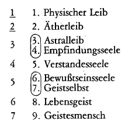
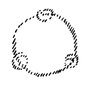
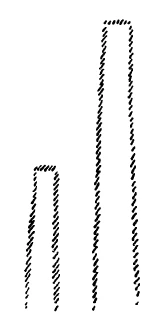
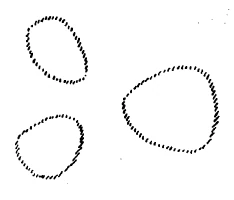
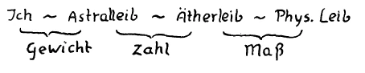
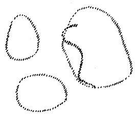
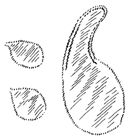
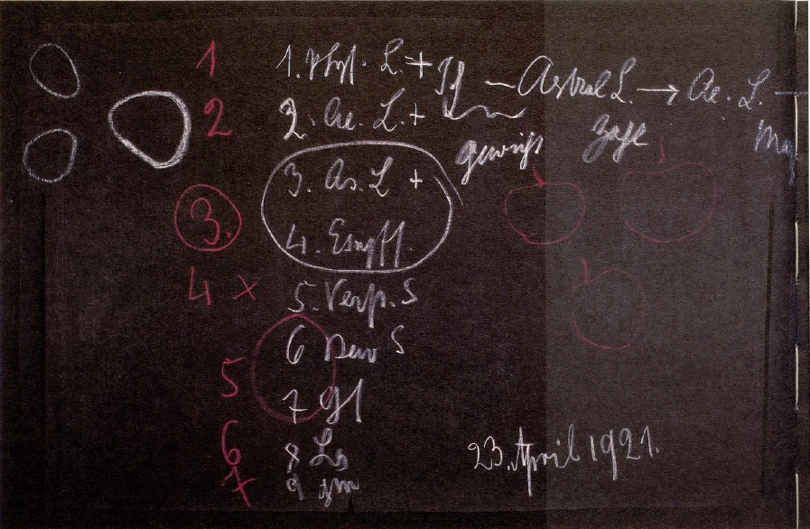
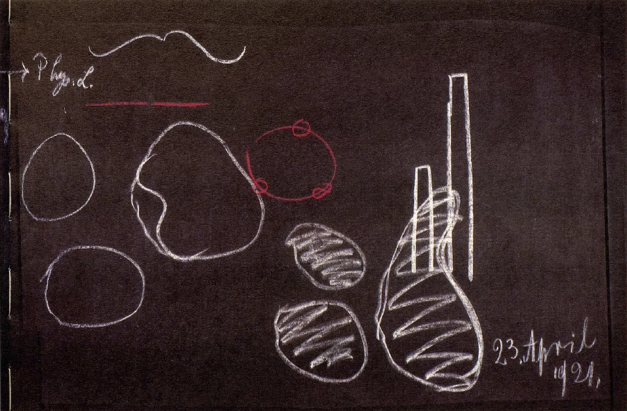

[ 1 ] ^c2ypz2

Ich werde heute ein scheinbar entlegeneres Kapitel vorzubringen haben, das sich aber doch mit dem gestern Gesagten und morgen zu Sagenden zu einem Ganzen zusammenschließen wird. Ich habe öfters erwähnt, daß der Mensch, indem er die Entwickelung der Menschheit überblickt, zu sehr von der Anschauung ausgeht, daß eigentlich die Gesamtverfassung des menschlichen Seelenlebens, so lange es überhaupt eine menschliche Entwickelung gibt, die geschichtlich oder vorgeschichtlich zu verfolgen ist, im wesentlichen gleichgeblieben sei. Aber das, was da geglaubt wird, entspricht eben durchaus nicht den Tatsachen. Allerdings, es ist schwer zu konstatieren, wie die aufeinanderfolgenden Metamorphosen der menschlichen Seelenentwickelung gewesen sind, wenn man bloß in der Lage ist, auf die geschichtlich durch Dokumente überlieferten Tatsachen zu sehen. Wenn man jedoch weiter zurückschauen kann, als diese Tatsachen gehen, dann zeigt sich auch das geschichtlich Überlieferte in einem anderen Lichte, und dann zeigt sich, daß es mit der menschlichen Seelenbeschaffenheit nicht immer so gewesen ist, wie es heute ist, oder wie es in den Zeiten war, die gerade noch durch Äußerliches zu überschauen sind. Vor allen Dingen glaubt man: Nun ja, der Mensch hat zum Beispiel heute so etwas wie eine Geometrie, er hat so etwas wie eine Arithmetik, die ja im wesentlichen die Lehre vom Zählen ist, und er hat dann die Kunst des Wägens, des Gewichtbestimmens. Man macht sich Vorstellungen darüber, was messen ist, was ein Maß ist. Man macht sich Vorstellungen darüber, wie man heute zählt und wie man die Dinge abwiegt, und man denkt sich: Gewiß, in der Zeit, in der nach unserer nun einmal bestehenden Meinung die Menschen noch ganz kindlich waren, in der haben sie eben noch nicht messen, zählen und rechnen gekonnt. Aber seitdem man das kann, seitdem wird es eben ungefähr in derselben Weise ausgeübt, wie das heute ausgeübt wird. ^slu15v

[ 2 ] ^3qcj9q

Das ist eben durchaus nicht der Fall, und wenn es auch, wie gesagt, in ein entlegeneres Gebiet führt, wir müssen uns schon einmal, bevor wir auf das Geschichtliche der Menschheit eingehen, etwas genauere Vorstellungen bilden über Maß, Zahl und Gewicht. Sie wissen ja, daß auch nach der äußeren Überlieferung in der pythagoräischen Schule über die Zahlen etwas andere Ansichten geherrscht haben als heute herrschen. Die Pythagoräer haben, wie Sie ja alle wissen, bestimmte Vorstellungen verknüpft mit der Zahl‘ - eins, zwei, drei, vier und so weiter -, sie haben ganz bestimmte Vorstellungen verbunden mit der geraden Zahl, mit der ungeraden Zahl. Kurz, sie haben in einer gewissen qualitativen Weise, nicht bloß in quantitativer Weise von der Zahl gesprochen. ^eqoc8n

[ 3 ] ^eh2uzs

Wenn man dasjenige, was da zugrunde liegt, geisteswissenschaftlich betrachtet, so kommt man dazu, einzusehen, wie das, was in der pythagoräischen Schule vorhanden war, die ja immerhin noch eine Art Geheimschule war, im Grunde schon nur mehr der letzte Nachklang von einer viel älteren Zahlenweisheit war, die in uralte Zeiten zurückgeht, und von der sich nur Überlieferungen erhalten haben. Und das, was uns über Pythagoras gesagt wird, das ist im Grunde genommen schon etwas, was im Niedergange begriffen war von einer uralten Zahlenlehre. Man kommt eben, wenn man die Sachen geisteswissenschaftlich verfolgt, über Maß, Zahl und Gewicht zu wesentlich anderen Vorstellungen, als wir sie heute haben. Aber wie gesagt, wir müssen uns da ein wenig klarmachen können, wenn das auch manchen von Ihnen Schwierigkeiten bereiten mag, wie es heute um diese Begriffe Messen, Zählen, Wägen steht. ^pyg30o

[ 4 ] ^jxiwnv

Messen - wie messen wir? Wir können nur ei» Maß haben, und dieses Maß, das muß in irgendeiner Weise angenommen sein. Wir können nicht sagen, daß dieses Maß, das wir zugrunde legen, nehmen wir also heute das Metermaß, irgendwie absolut bestimmt sei. Es ist angenommen, es ist bestimmt als ein bestimmter Teil des nördlichen Erdmeridianquadranten, der durch Paris geht, und es ist nicht einmal dieser Teil, der zehnmillionste Teil, genau enthalten in jenem gewissermaßen ehernen Grundmaßstab, der zu Paris sich befindet als der Urmeterstab. Aber es ist angenommen. Man sagt, man will von einem bestimmten Maß ausgehen, und dann mißt man andere Längen damit oder auch Flächen, indem man aus dem Längenmaß ein Quadratmaß bildet. Aber dasjenige, was man da herausbekommt über das zu Messende, ist zurückgeführt auf ein rein Willkürliches, auf ein einmal Angenommenes. Das ist wichtig, daß wir uns das klarmachen, daß wir eigentlich ein willkürliches Maß zugrunde legen, so daß wir immer nur das Verhältnis irgendeiner Größe zu diesem willkürlich angenommenen Maß haben, wenn wir messen. Mit der Zahl verhält es sich schon etwas anders. ^gd8qmp

[ 5 ] ^f8mpia

So wie wir heute einmal in unserem abstrakten Dasein leben, so zählen wir «eins», «zwei», «drei»; wir zählen «eins», «zwei», «drei», wenn wit Äpfel zählen, wenn wir Menschen zählen, wenn wir Pferde zählen, wenn wir Stühle zählen. Für das, was da durch die Zahl bestimmt werden soll, ist es gleichgültig, wofür wir «eins» sagen. Wir haben unsere besondere Art des Zählens für alle Dinge, die wir eben abzählen und die als Einheit etwas in sich Geschlossenes bilden. ^g3v2yw

[ 6 ] ^qmysgf

Merken Sie, wenn wit messen, so legen wir eine willkürliche Maßeinheit zugrunde; aber auf diese willkürliche Maßeinheit beziehen wir dann alles. Diese Maßeinheit ist gewissermaßen etwas, sie ist da; sie ist sogar vorstellbar, ich möchte sagen, in einer dingähnlichen Art, in einer sachähnlichen Art. Die Einheit als Zahl, die ist nicht vorstellbar in einer dinglichen Art. Was die Einheit als Zahl ist, das ist ein völliges Abstraktum, das ist etwas, was auf alles anwendbar ist. Es kommt nicht darauf an, ob wir Jahre zählen oder ob wir Menschen zählen oder ob wir Sterne zählen, wir werden ins völlig Abstrakte geführt, in dasjenige, mit dem gar keine Wirklichkeit gemeint werden kann, weil alle Wirklichkeiten damit gemeint sein können und keine Wirklichkeit gemeint sein kann. Wenn wit arithmetisch die Einheit zugrunde legen, da entfällt uns das bißchen Dinghafte, Sachhafte, was wir noch haben, wenn wir messen. Und gar beim Wägen, beim Wägen haben wir es zu tun damit, daß wir dasjenige gar nicht übersehen, was wir zugrunde legen. Da entfällt uns die Geschichte noch mehr als bei der Zahl. Bei der Zahl haben wir wenigstens, wenn wir etwa Stühle zählen und sagen «eins», «zwei», «drei, mit dem dritten Stuhle abgeschlossen und er steht als Einheit vor uns. Wenn wir aber eine Waage haben, da legen wir auf der einen Seite ein Gewicht auf - das Gewicht ist ja für sich nichts, wenn es nicht angezogen wird von der Erde, wie wir sagen -, und das wiederum, was wit abwägen, ist gleich dem Gewichte des Gewichtes. Aber wir stehen da gar nicht mehr allein; wir stehen im Grunde genommen mit der ganzen Erde da. Dasjenige, worauf wir uns beziehen, liegt völlig irgendwie außerhalb des Bereiches, den wir überschauen. Wir kommen in ein völliges Abstraktum hinein, wenn wir sagen: Irgend etwas wiegt fünf Kilo. - Denken Sie nur, was Sie da eigentlich in der Vorstellung haben, wenn Sie sagen, etwas wiegt fünf Kilo, Sie legen ein Fünfkilogewicht auf eine Waagschale, ja, aber ein Fünfkilogewicht, das ist ja nichts für sich! Es ist keine Eigenschaft des Dinges da. Wenn ich sage: Ein Stuhl - so ist wenigstens dieses «eins» geschlossen in dem Stuhl drinnen; aber diese fünf Kilo, die müssen sich auf die Erde beziehen. Da haben Sie nur irgend etwas, was eine Beziehung zu etwas ist, was Sie gar nicht überschauen: zum ganzen Erdenkörper. Und wenn Sie dann das andere auf der Waagschale, die fünf Kilo abwiegen sollen, so haben Sie wieder etwas, was Ihnen ganz entschlüpft, was wieder einem Ganzen angehört, was weniger ist als ein Abstraktum. ^hp37oo

[ 7 ] ^tx2xup

Gehen wir von der Zahl aus. In früherer Zeit - und wir werden dabei zurückgeführt eigentlich bis in den zweiten nachatlantischen Zeitraum -, in dem zweiten nachatlantischen Zeitraum, da behandelte man das ganze Denken über die Zahl wesentlich anders, als es heute in der äußeren Welt behandelt wird. Da hatten wirklich die Menschen Vorstellungen über «eins», über «zwei», über «drei». Für uns ist «zwei» nichts anderes als das zweimalige Vorhandensein der Einheit; und «drei» ist das dreimalige Vorhandensein der Einheit ' und «vier» eben das viermalige Vorhandensein der Einheit. Und so zählen wir fort, indem wir immer nur «eins» dazugeben, also denselben Denkakt wiederholen. Wir können ihn ad infinitum, ins unendliche wiederholen. ^h4ntxq

[ 8 ] ^1g18nr

So war es nicht in dem zweiten nachatlantischen Zeitraum. Da fühlte man, sagen wir zwischen «zwei» und «drei», einen solchen Unterschied, wie man ihn heute nur zwischen Gegenständen fühlt. Man fühlte in der Drei etwas wesentlich anderes als in der Zwei, nicht bloß daß die Einheit dazugefügt ist, sondern man fühlte in der Drei etwas Geschlossenes, etwas, wo sich die drei Dinge aufeinander beziehen, in der Zwei etwas Offenes, etwas, wo die zwei Dinge gleichgültig nebeneinanderliegen. Diese Gleichgültigkeit desNebeneinanderliegens, an das dachte man, wenn man «zwei» sagte. In der Drei fühlte man nicht etwas gleichgültig Nebeneinanderliegendes, sondern man konnte sich unter Drei nur etwas vorstellen, was zusammengehört, wovon sich jedes auf das andere bezieht. Von der Zwei konnte man sich vorstellen, daß das eine links entwischt, das andere rechts entwischt. Von der Drei konnte man sich das nicht vorstellen. Von der Drei stellte man sich immer vor: Wenn das eine entwischt, dann sind die zwei anderen nicht mehr das, was sie gewesen sind, denn dann sind sie ein Gleichgültig-Daseiendes. Die Drei schloß gewissermaßen die Zwei zu einer Totalität, zu einem Ganzen zusammen. Ein solches Rechnen, wie wir es haben, das elementare Rechnen, das Wiederholen desselben Aktes, das gab es in jenen älteren Zeiten überhaupt nicht. Und erst heute werden wir dutch die Geisteswissenschaft wiederum in einer gewissen Weise in das Qualitative der Zahl hineingeführt. ^f86q3g

[ 9 ] ^bt392b

Ich kann Ihnen das an einem Beispiel, das Sie längst kennen, veranschaulichen, so daß Sie sehen werden: man ist genötigt, nicht bloß eins zu eins zu eins und so weiter hinzuzufügen, sondern mit der Zahl nun auch wirklichkeitsgemäß unterzutauchen in das Dasein. Damit Sie eine, es ist noch, ich möchte sagen, die elementarste, Vorstellung von der Sache bekommen, machen Sie mit mir das Folgende dutch. Sie finden in meiner «Theosophie» die einzelnen Glieder des Menschen beschrieben; diese Glieder des Menschen werden beschrieben: ^ovykqb

[ 10 ] ^zk6szc

Aber diese Glieder der menschlichen Wesenheit so nebeneinanderzufügen, das heißt, sie nacheinander abstrakt aufzuzählen, das heißt nicht in die Wirklichkeit untertauchen. Denn diese Neun hier, die gibt es ja gar nicht; man kann gar nicht so zählen: 1. Physischer Leib, 2. Ätherleib, 3. Astralleib, 4. Empfindungsseele; man kann gar nicht so zählen, wenn man sich die menschliche Wesenheit klarmachen will, wenn man heute den Menschen seiner Wirklichkeit nach ansieht. Tatsächlich muß man so sagen: Physischer Leib, gut, der grenzt sich als ein in sich Geschlossenes ab, Ätherleib auch: aber der Astralleib, indem wir also zum Dritten übergehen, der ist nicht etwas in sich Abgeschlossenes, und wir können nicht einfach die Empfindungsseele zu ihm hinzuzählen beim wirklichen Menschen, sondern wir müssen diese zwei, Astralleib und Empfindungsseele, unbedingt zusammenfassen und dadurch, daß wir in der Wirklichkeit übergehen von eins zu zwei zu drei, können wir gewissermaßen real abzählen, können wir in der Drei nicht finden ein einfaches Hinzufügen. ^3dug82

[ 11 ] ^c3npca

Dasjenige, was im Menschen sich bildet als «Astralleib» und «Empfindungsseele», die ineinanderwirken, ist abstrakt einfach ein Drittes; aber dadurch, daß wir in dieser Realität übergehen zum Dritten, können wir nicht mehr einfach zu den zwei Ersten ein Drittes hinzufügen, sondern müssen uns klar sein: dieses Dritte ist in sich etwas anderes als die beiden Ersten. ^3297ob

[ 12 ] ^ut0vdn

Dann kommen wir dazu, das Vierte zu zählen, was eigentlich das Fünfte ist, und dann müssen wir wiederum im Grunde genommen das Sechste und Siebente zusammenrechnen im heutigen Menschen, so daß wir eigentlich haben, wie Sie das auch in meiner«Theosophie» verzeichnet finden: drei, vier, fünf, sechs, sieben. Wir bekommen sieben wirkliche Glieder, die aber, wenn sie abstrakt aufgezählt werden, neun Glieder sind: ^736iy4

 ^vatcun

[ 13 ] ^y6u093

Wir lernen aus der Wirklichkeit heraus zu sagen: Indem wir nach der Regel der Zahl vorgehen, ist nicht gleichgültig das eine dem anderen. Einfach dadurch, daß dies das Dritte ist (siehe Zusammenstellung, 3), ist es etwas anderes. Gewiß, wir müssen uns das heute, weil wir gewöhnt sind, über die Zahl abstrakt zu denken, ein wenig veranschaulichen, weil es dem gewöhnlichen Bewußtsein weit abliegt. Aber in alten Zeiten, also in der ersten und zweiten Periode nachatlantischer Zeit, da fiel es gar niemandem ein, in den Zahlen beim Vorrücken das gleichgültige Hinzufügen des einen zum anderen sich vorzustellen, sondern man erlebte etwas, wenn man überging, sagen wir von der Zwei zur Drei, so wie man hier etwas erlebt, wenn man übergeht von der Zwei zur Drei (siehe Zusammenstellung). Heute kann man es gerade erst fühlen an einem solchen Beispiel; man fühlt es noch nicht an der Zahl selber. In jenen alten Zeiten fühlte man es an den Zahlen selber. Man sprach von den Zahlen in ihren Verhältnissen zueinander. So empfand man zum Beispiel: Alles dasjenige, was als Zwei vorhanden ist, das hat etwas nach der Welt Offenes, das ist nichts Abgeschlossenes; dasjenige, was als Drei, als wirkliche Drei vorhanden ist, das ist etwas Abgeschlossenes. Nun werden Sie sagen, man muß da einen Unterschied machen, je nachdem, was man zählte. Wenn man zählte: Ein Mann, eine Frau, ein Kind, so ist Mann, Frau gleich Zweiheit, unabgeschlossen zur Welt; in dem Kinde schließt es sich ab, bildet eine Ganzheit. Wenn man Äpfel zählte, dann konnte man allerdings nicht sagen, daß drei Äpfel mehr abgeschlossen sind als zwei Äpfel. Ja, das Äußere empfand man nur so, aber die Zahl empfand man nicht so; die Zahl empfand man nämlich ganz anders. ^zi52cq

[ 14 ] ^l12h8f

Sie werden sich erinnern, daß gewisse Stämme, die noch der Urbevölkerung angehören, nach ihren zehn Fingern zählen, indem sie die Anzahl des außen Vorhandenen mit ihren Fingern vergleichen, so daß man also sagen könnte, wenn drei Äpfel daliegen, das ist gleich drei Finger. ^ghr3hq

[ 15 ] ^17xsw7

Aber nun würde man nicht gesagt haben: Eins, zwei, drei natürlich in der entsprechenden Sprache: Daumen, Zeigefinger, Mittelfinger. -— Da hat man zwar draußen in der Welt nichts Bestimmtes; aber in dem, was einem innerlich repräsentierte das, was draußen ist, da hatte man etwas sehr Bestimmtes, denn die drei Finger, die sind voneinander verschieden. Nun, wir haben es so herrlich weit gebracht als Menschheit jetzt in der fünften Periode der nachatlantischen Zeit — es war schon in der vierten im wesentlichen so -, daß wir nicht mehr nötig haben, zu sagen: Daumen, Zeigefinger, Mittelfinger -, sondern wir sagen: Eins, zwei, drei. - Der Genius der Sprache wird nicht mehr berücksichtigt. Denn wenn Sie hinhören würden auf die Sprache, so würden Sie rein empfindungsgemäß sich sagen: Eins, entzwei -.das heißt auseinander. In der Sprache liegt es noch. Wenn Sie aber sagen: Drei - und haben ein Gefühl für die Laute, dann haben Sie das Geschlossene. Drei: sind nur zu denken eigentlich - wenn man sie richtig denkt - als zueinandergehörig im Kreise liegend. Zwei: entzwei; drei: in sich geschlossen. Der Genius der Sprache hat das noch. ^6othic

 ^w9b7xu

[ 16 ] ^bff1ye

Ja, also wie gesagt, wir haben es «so herrlich weit gebracht», daß wir abstrakt eine Einheit an die andere herantragen können, und dann empfinden wir, nun ja: Das ist zwei, das ist eins; bei drei ist ja noch eins dabei und so weiter. Aber warum können wir denn überhaupt zählen? Ja, in Wirklichkeit machen wir es nämlich nicht anders als die Wilden, nur haben die Wilden das mit ihren fünf Fingern gemacht, mit ihren fünf physischen Fingern. Wir zählen auch, nur zählen wir mit den Fingern unseres Ätherleibes und wissen nichts mehr davon. Das spielt sich im Unterbewußtsein ab, da abstrahieren wit. Denn dasjenige, wodurch wir zählen, das ist eigentlich der Ätherleib, und eine Zahl ist noch immer nichts anderes in Wirklichkeit als ein Vergleichen mit demjenigen, was in uns ist. Die ganze Arithmetik ist in uns, und wir haben sie in uns hineingeboren durch unseren Astralleib, so daß sie eigentlich aus unserem Astralleib herauskommt, und unsere zehn Finger sind nur der Abdruck dieses. Astralischen und Ätherischen. Und dieser beiden bedient sich nur dieser äußere Finger, während wir, wenn wir rechnen, dasjenige, was durch den Astralleib bewirkt Inspiration von der Zahl, im Ätherleib ausdrücken und dann durch den Ätherleib, mit dem wir überhaupt denken, zählen. So daß wir sagen können: Äußerlich ist heute für uns das Zählen etwas recht Abstraktes, innerlich hängt es damit zusammen - und es ist sehr interessant, die verschiedenen Zählungsmethoden nach der Zehnzahl, nach dem Dezimalsystem oder nach der Zwölfzahl bei den verschiedenen Völkern zu verfolgen, wie das mit der verschiedenen Konstitution ihres Ätherischen und Astralischen zusammenhängt -, innerlich hängt es damit zusammen, daß wir zählen, weil wir selbst erst gezählt sind; wir sind aus der Weltenwesenheit heraus gezählt und nach der Zahl geordnet. Die Zahl ist uns eingeboren, einverwoben von dem Weltenganzen. Draußen werden uns nach und nach die Zahlen gleichgültig; in uns sind sie nicht gleichgültig, in uns hat jede Zahl ihre bestimmte Qualität. "Versuchen Sie es nur einmal, die Zahlen herauszuwerfen aus dem. Weltenall, und sehen Sie sich an, was der Zahl gemäß gestaltet wird, wenn einfach eins zu dem anderen hinzugesetzt würde; sehen Sie sich an, wie dann Ihre Hand ausschauen würde, wenn da der Daumen wäre, und nachher würde einfach das Nächste hinzugesetzt als die gleiche Einheit, dann wiederum, wiederum: Sie hätten fünf Daumen an der Hand, an der anderen Hand auch wiederum fünf Daumen! - Das würde dann entsprechen dem abstrakten Zählen. ^bf9az0

[ 17 ] ^cail5s

So zählen die Geister des Weltenalls nicht. Die Geister des Weltenalls gestalten nach der Zahl und sie gestalten in jenem Sinne nach der Zahl, den man früher mit der Zahl verband, wie gesagt, noch in der ersten, noch in der zweiten Periode der nachatlantischen Zeit. Das Herausentwickeln der abstrakten Zahl aus der ganz konkreten Vorstellung des Zahlenhaften, des Zahlenmäßigen, das hat sich erst im Laufe der Menschheitsentwickelung gebildet. Und darüber muß man sich klar sein, daß es eine tiefe Bedeutung hat, wenn aus den alten Mysterien heraus überliefert wird: Die Götter haben den Menschen nach der Zahl gebildet. - Die Welt ist voller Zahl, das heißt, alles wird nach der Zahl gebildet, und der Mensch ist nach der Zahl herausgestaltet, so daß unser Zählen in jenen alten Zeiten nicht vorhanden war; aber ein bildhaftes Denken in den Qualitäten der Zahl, das war vorhanden. ^gk0lzb

[ 18 ] ^qnxtsi

Da kommen wir in alte Zeiten zurück, wie gesagt, bis in die erste, zweite nachatlantische Periode, in die urindische, in die urpersische Zeit, in denen ein Zählen in unserem Sinne durchaus nicht möglich war, wo man mit der Zwei etwas ganz anderes verbunden hat, als zweimal die Eins, mit der Drei etwas ganz anderes, als zwei und eins und dergleichen. ^xno2nj

 ^k1t7v5

[ 19 ] ^9l6rji

Sie sehen, die menschliche Seelenverfassung hat sich schon im Laufe der Zeit ganz beträchtlich verändert. Und wenn wir nun den etwas späteren Zeitraum betrachten, der die dritte Periode der nachatlantischen Zeit ist, dann stellt sich das Maß als etwas ganz anderes heraus. Heute messen wit, indem wir eine willkürliche Maßeinheit annehmen. Aber an eine solche willkürliche Maßeinheit dachte man zum Beispiel noch im dritten nachatlantischen Zeitraum eigentlich nicht, sondern man hatte da auch in bezug auf das Messen etwas durchaus Bildhaftes im Auge. Man hatte dasjenige im Auge, was Ihnen vielleicht klarwerden kann, wenn wir uns sagen: Wir sehen zum Beispiel dieses als Säule und sehen dann das als Säule an (siehe Zeichnung); wir sehen nach diesen zwei Säulen hin. Wenn wir abstrakt empfinden, sagen wir, die zweite Säule ist zweimal so groß wie die erste; wir haben sie mit der ersten gemessen. — Aber das ist sehr abstrakt vorgestellt. Konkret vorgestellt ist das etwa in der folgenden Weise auszudeuten: Fühlen wir uns der ersten Säule gegenüber, so fühlen wir sie schwach gegenüber der zweiten; wir fühlen, daß sie wachsen muß, und wir fühlen, wenn sie wächst und wächst, daß, wenn sie bis hierher gewachsen ist, sie etwas Besonderes ist. Sie hat soviel Kraft aufgewendet auf dieses Wachsen, daß sie jetzt eine Stärke hat, wo durch sie etwa in ihren zwei Teilen sich so verhalten kann, daß die beiden gleich stark sind. Man kann da etwas Qualitatives empfinden. Man kann weitergehen. Man kann sagen: Ich habe hier ein Gebilde, ich messe es an dem anderen und bekomme so die Symmetrie heraus; es erweitert sich mir der Begriff des Maßes, er geht hinein in das Bild. ^wczje0

[ 20 ] ^ony5x2

Auf diese Weise bekommt man allmählich eine Vorstellung, daß Maß tatsächlich etwas zu tun hat mit dem, was wir heute noch ganz dunkel empfinden, wenn wir von mäßig und maßvoll reden, wobei wir auch nicht an Abmessen denken. Wählen wir einmal dieses Beispiel: Wenn jemand eine bestimmte Speise in einem bestimmten Quantum zu sich nimmt, so finden wir das manchmal maßvoll, ohne daß wir es messen. Wir finden etwas anderes unmäßig. Aber wir messen da nicht irgend etwas ab, wir vergleichen nicht messend den Magen mit demjenigen, was hineinkommt und dergleichen. Wir messen auch nicht das Stück Fleisch ab und essen es dann, wit messen es nicht an der Größe des Menschen, sondern wir haben etwas Qualitatives, etwas Eigenschaftliches, wenn wir von maßvoll oder von maßlos und dergleichen sprechen. - Da kommen wir zu etwas, was zwar nicht so stark verschieden ist von dem, was wir heute das Maß nennen, was aber doch immerhin zeigt, daß wir heute unter dem Maß etwas Abstraktes, nämlich «das Enthaltensein der Maßeinheit in irgendeiner bestimmten Größe» verstehen, während man früher darunter etwas, was qualitativ mit den Dingen zusammenhing, verstand. So vor allen Dingen empfand man maßvoll jedes einzelne Glied des Menschen in bezug auf den Gesamtmenschen, ohne daß man dabei an eine Einheit dachte. Uns ist davon noch etwas zurückgeblieben, nämlich, daß es uns ekelhaft ist, wenn wit als Künstler irgend etwas abmessen sollen; wenn wir als Künstler messen sollen mit dem wirklichen Maßstabe, damit nun die Nase nicht zu lang oder zu kurz ist, so ist das eigentlich unkünstlerisch. Künstlerisch ist es nur, wenn im Anschauen eine Sache die Größe hat, die sie haben muß an einem Organismus. Also hier handelt es sich auch nicht um einen abstrakten Vorgang, sondern um etwas, was mit dem Bildhaften zusammenhängt. Und wenn Sie schließlich auf dasjenige Maßverhältnis, das heute noch eine gewisse Rolle spielt, sehen, auf den sogenannten Goldenen Schnitt, so hängt dieser ja nicht zusammen mit dem Messen, sondern er hängt zusammen mit etwas, was nur qualitativ ist: das Kleine verhält sich zum Mittleren, wie das Mittlere zum Großen. Das Kleine mag so groß sein, wie es will, es muß nur immer sich verhalten zu dem Mittleren wie das Mittlere zu dem Großen. Wir haben nicht eine Maßeinheit im Auge, sondern wir haben im Auge etwas, was sich im Anschauen aufeinander bezieht, und reden doch von dem Maß und dem Maßvollen, das sich im Goldenen Schnitt zum Ausdrucke bringt. Wir können gar nicht irgendwie beim Goldenen Schnitt dasjenige zugrunde legen, was Maßeinheit wäre im abstrakten Sinne, wie wir das sonst können. Wir können also sagen: Mit Bezug auf das Messen sehen wir in der Menschheitsentwickelung, indem wir die Zeiten durchgehen, daß im vierten nachatlantischen Zeitraum, im griechisch-lateinischen, allmählich dieses anschauliche Empfinden des Maßes sich umwandelt in das abstrakte Messen. Das ist eigentlich erst im vierten nachatlantischen Zeitraum der Fall. Im dritten empfand man viel mehr noch die Maßverhältnisse so, wie wir nur noch empfinden, wenn wir den Goldenen Schnitt empfinden. Und unser abstraktes Zählen geht zurück, indem wir in alte Zeiten kommen, auf ein Erleben der inneren Eigenschaft der Zahl. ^m9gbrm

[ 21 ] ^1rt8vs

Nun, beim Gewicht, da ist der heutige Mensch schon ganz weit draußen, ganz furchtbar weit draußen aus dem, was im ersten nachatlantischen Zeitraum als Erleben des Gewichtes vorhanden war. Sie brauchen sich ja nur an eine sehr bekannte Erscheinung zu erinnern, die gewiß die meisten von Ihnen erlebt haben, wenn der Athlet kommt und seine furchtbar ‚schweren Gewichte. trägt, auf. denen «200 Kilo» steht; und er schleppt sie und schleppt- sie und er schwitzt, und Sie schwitzen schon fast mit ihm.:Und dann, wenn er Sie lange genug hat schwitzen lassen, dann hebt er sie plötzlich auf und läuft davon. Das Ganze hat gar kein Gewicht, sondern es ist Ihnen nur vorgetäuscht. Aber Sie empfinden eigentlich nach dem Abstraktum, was da daraufsteht: «200 Kilo.» Das Erleben des Gewichts ist uns eben heute durchaus entzogen. Daher gehört es auch zu den größten Erlebnissen, wenn beim hellseherischen Bewußtsein, wie es ja durchaus der Fall ist, gegenüber den Naturerscheinungen das Erlebnis des absoluten Gewichtes auftritt. Es ist durchaus so, daß in jenem ersten nachatlantischen Zeitraum, den wir den urindischen nennen, der Mensch in sich noch etwas empfand von Gewichtsverhältnissen. Ich habe Ihnen öfters davon gesprochen, daß eigentlich unser Gehirn im Gehirnwasser schwimmt und dadurch ja nach dem bekannten Gesetze, wonach ein schwimmender Körper scheinbar so viel leichter wird, als das Gewicht des verdrängten Wassers beträgt, das Gehirn wesentlich an seinem Gewichte verliert; sonst würde es uns ja die darunterliegenden Adern fortwährend zerdrücken. Das Gehirn schwimmt im Gehirnwasser; aber heute merkt der Mensch in seinem abstrakten Erleben nichts mehr davon. Er merkt auch von den anderen Verhältnissen nichts mehr in sich. Er erlebt nicht mehr das Gewicht, er gibt nicht acht auf dieses Erleben des Gewichtes. Es ist wesentlich verschieden, das Gewicht seines Körpers zu erleben, wenn man zwölf Jahre alt ist, oder wenn man, sagen wir, fünfmal so alt geworden ist; aber die meisten haben ja vergessen, wie sie sich selber schwer vorgekommen sind in ihrem zwölften Lebensjahre, und können es daher nicht gut vergleichen. Aber nehmen wir meinetwillen irgendwie zwei Lebensalter an, in denen man der Waage nach gleich schwer ist; dann kommt es nicht darauf an, sondern da kommt es auf das Erlebnis der Schwere an. Dieses Gewichtserlebnis, das heute also für den Menschen nur da ist in Beziehung zur Erde, dieses Gewichtserlebnis war ein Absolutes in dem ersten nachatlantischen Ä Zeitraum. E Heute empfinden wir nur noch einen Rest davon in der Kunst, in der Kunst allerdings sehr stark. Ich brauche Sie nur auf. folgendes aufmerksam zumachen. Nehmen Sie an, ich zeichne zwei’ Figuren: Da haben Sie für. meine Anschauung eigentlich etwas Ungeklärtes, | etwas Unaufgelöstes, ‚etwas, was nicht sein soll. So zwei Dinge nebeneinander, die fordern mich auf, ein Drittes dazuzumachen. Aber ‘ich kann das Dritte nur so machen, daß es größer i ist, die beiden : zusammenhält in einer gewissen Weise. Dann habe ich das Gefühl, die drei schweben in der Luft und können sich gegenseitig halten. ^asqklg

 ^g6a030

[ 22 ] ^f1f2x9

Wenn der kompositionelle Maler heute drei Engel malt, die ja eine Schwereanschauung nicht haben, so verteilt er sie im Raume so, daß sie sich gegenseitig tragen, daß der eine von dem anderen getragen ist. Drei Engel einfach nebeneinander zu malen auf eine Fläche, das ist selbstverständlich das Schlechteste, was man künstlerisch leisten kann; da hat man kein wirkliches künstlerisches Gefühl für solche Dinge. Man muß ein Gefühl haben für das gegenseitige Gewicht, wie das eine das andere trägt, und im künstlerischen Empfinden ist noch ein leiser Anflug von dem vorhanden, was erlebt wurde vor allen Dingen innerlich im Menschen in der nachatlantischen Zeit als das Gewichtende. Das Erlebnis von Gewicht, Zahl und Maß, das entwickelt sich durch die drei ersten nachatlantischen Zeiträume so, wie es sich eben entwickeln mußte, indem der Mensch sich da drinnen fühlte im Kosmos. Und von dem, wonach er aus dem Kosmos heraus gebildet worden ist, wurden dann die anderen Dinge beurteilt, dasjenige, was er aus sich hervorbrachte. Schaute er auf das, was sein astralischer Leib in den Ätherleib hineinstieß, so mußte er sagen: Der Astralleib zählt, aber zählt differenzierend, zählt den Ätherleib. Er gestaltet ihn zählend. - Zwischen dem Astralleib und Ätherleib liegt die Zahl, und die Zahl ist ein Lebendes, ein in uns Wirksames. Zwischen dem Ätherleib und dem physischen Leib liegt etwas anderes. Aus dem Ätherleib heraus wird durch die inneren Verhältnisse dasjenige gebildet, was wir dann sehen; nach dem Goldenen Schnitt sind wir ja im Grunde genommen auch organisch aufgebaut: die Stirn zu einem gewissen Teil, und wiederum dieser andere Teil zu der ganzen Kopflänge und so weiter. Das alles prägt der Ätherleib aus dem Kosmos, aus kosmischen Verhältnissen unserem physischen Leib ein. Das Maß und das Maßvolle, das in uns ist, das ist der Übergang vom Ätherleib zum physischen Leib. Und endlich im Übergang vom Ich zum astralischen Leib liegt dasjenige, innerlich erlebbar, was Gewicht ist. Ich habe Ihnen öfters gesagt, das Ich wurde eigentlich erst geboren im Laufe der Menschheitsentwickelung. Der alte Inder der urindischen Zeit erlebte nicht ein solches Ich. Er erlebte aber innerlich das Gewichten, das Gestaltetsein, so daß er sowohl seine Schwere, sein Hinunterdrängen, wie seinen Auftrieb, sein Hinaufsteigen empfand. In sich empfand er dieses, was da überwunden wird, indem das Kind aus einem Kriecher ein Geher wird; das empfand er. Er empfand nicht «Ich», aber er empfand, wie er durch die ahrimanischen Mächte ani die Erde gefesselt wurde, «gewichtigt» wurde, wie er aufgetrieben wurde durch die luziferischen Mächte, hinaufgehoben wurde, und er empfand dies als seine Gleichgewichtslage. Würden wir die alten Worte, die für das Ich da waren, studieren, so würden wir finden, daß eben das in der Bildung der Worte selber drinnenliegt. So wie zusammengefügt wurden in den Verben die Worte ihrer inneren Konfiguration nach, so war da drinnenliegend das Gleichgewicht zwischen dem Schweben und dem Fallen. ^bxmjm2

 ^gtdc40

[ 23 ] ^dx0vgp

Unsere so abstrakten Vorstellungen: Gewicht, was ja überhaupt schon gar nicht mehr abstrakt ist, denn wir stehen einem ganz Unbekannten gegenüber; Zahl, was vollständig abstrakt ist, weil es dem, was gezählt wird, ganz gleichgültig ist; und Maß, was bei uns auch schon immer mehr abstrakt geworden ist —, das alles projiziert der Mensch eigentlich von seinem Inneren auf das Äußere. Er überträgt dasjenige, was in ihm eine reale Bedeutung hat, weil er nach Maß, Zahl und Gewicht konstruiert ist, aufgebaut ist, er überträgt das auf die gleichgültig äußeren Dinge, entmenscht sich in diesem Abstraktionsprozeß selber, so daß man sagen kann: Die Menschheitsentwickelung tendiert dahin, die inneren Erlebnisse von Gewicht, Zahl und Maß zu verlieren, nur einen letzten Anflug im Künstlerischen aufzubewahren, dann aber sie nicht mehr so zu erleben, daß der Mensch selber sich herausgestaltet fühlt aus dem Kosmos nach Gewicht, Zahl und Maß. Was wir heute als abstrakte Geometrie haben, wo wir kongruente und ähnliche Figuren vergleichen, wo wir sagen, daß eine Ellipse entsteht, wenn die Summe der Entfernung jedes ihrer Punkte von zwei bestimmten Punkten eine konstante Größe ist, das ist für uns etwas Abstraktes. Da messen wir im Grunde genommen die Entfernungen und finden ihre Summe immer gleich der großen Achse der Ellipse. Aber in diesem eigentümlichen Verhältnis von zwei voneinander verschiedenen Größen zueinander, in dem erlebte man noch im dritten nachatlantischen Zeitraum die Ellipse, auch wenn man sie gar nicht irgendwie vorstellte. Man fühlte in dem Maß des einen zu dem anderen schon das Elliptische, so wie man in der gleichen Zeit den Kreis fühlte. Und so fühlte man auch das Wesen der Zahl. So entwickelte sich die Menschheit vom konkreten Erleben zum Abstrakten hin und bildete aus dem alten Maßerleben die Geometrie aus, aus dem alten Zahlenerleben die Arithmetik und aus dem alten Gewichtserleben, indem der Mensch ganz und gar das Gewichtserlebnis verlor, sich ganz entmenschte, nur dasjenige, was äußerliches Beobachten ist. ^mla2q9

[ 24 ] ^veqqmv

Ja, dutch alles dieses bereitete sich schon langsam vor, was sich dann im 19. Jahrhundert zu der vollständigen Kulmination entwickelt hat, es bereitete sich langsam vor das Abstraktwerden des inneren menschlichen Erlebens: der Mensch ging der menschlichen Auschauung verloren. Der Mensch kommt nicht mehr an sich heran; er ahnt nichts mehr davon, daß er Geometrie bildet, weil er nach dem Maß herausgebildet ist aus dem Kosmos, daß er zählt an sich, durch sich. Er ist überrascht, wenn die Wilden ihre Finger nehmen, um damit die äußeren Dinge zu vergleichen; aber er weiß nicht, daß er nach der Zahl herausgebildet ist aus dem Kosmos und daß er im Grunde genommen in dieser Beziehung immer ein Wilder bleibt und in seinem Ätherleib, der seinem astralischen Leib gemäß den inneren Eigenschaften der Zahlen selber die Zahlen eingebildet hat, daß er danach die Zahlen außen erlebt hat und so weiter. Geometrie, Arithmetik und die Gewichtslehre, das Wägen, das sind Dinge, die durchaus in die Sphäre des Abstrakten im Laufe der Menschheitsentwickelung eingezogen sind und die mitgewirkt haben, daß also der Mensch sich nurmehr überlassen konnte einer solchen Wissenschaft, einem solchen wissenschaftlichen Forschen, das diese Dinge im Äußeren anschaut. ^9uv3dh

[ 25 ] ^fddhim

Was tun wir heute, wenn wir wissenschaftlich forschen? Wir messen, wir zählen, wir wägen. Sie können heute schon merkwürdige Definitionen des Seins lesen. Es gibt heute bereits Denker, die sagen: Seiend ist dasjenige, was man messen kann. - Aber dabei denkt man natürlich nur an das Messen mit einem willkürlichen Maßstab, und es ist merkwürdig, daß man nun das Sein zurückführt auf irgend etwas, dem eigentlich die Willkür zugrunde liegt. Man lebt also in etwas, was ganz und gar der Mensch aus sich herausgesetzt hat, bezüglich dessen er ganz und gar den Zusammenhang mit sich selber verloren hat. Unter solchen Einflüssen kam dann das zustande, was ich ja gerade während dieses Kurses von den verschiedensten Seiten her betont habe: daß in der neueren Erkenntnis der Mensch sich selber verloren hat. Er hat sich verloren, habe ich oft gesagt, in seiner Erkenntnis, indem er eigentlich nur dasteht wie der letzte Schlußpunkt der Tierreihe; er hat sich verloren in dem sozialen Leben, in dem wir zwar außerordentlich gute Maschinen ausgebildet haben, während wir aber nicht in unser soziales Leben einbeziehen können, was die Menschen bedeuten, die an den Maschinen stehen. Man muß lernen, hineinzuschauen in die Menschheitsentwickelung, man muß namentlich auf diese Weise beobachten, wie der Prozeß der Intellektualisierung des Menschen sich gebildet hat. Denken Sie nur einmal, was das für eine andere Seelenverfassung war, wenn in dem ersten nachatlantischen Zeitraum der Mensch fortwährend, indem er ein Bein vorstellte, die Gleichgewichtslage anders erlebte, fortwährend das Gewichtigwerden, das Fallen und Schweben erlebte, wenn er fühlte, wie die Zahl in seine eigene Gestalt hineingeschossen ist, wie er nach dem Maß aufgebaut ist. Denken Sie, wie das anders war, als wenn wir nur äußerlich messen, zählen, wägen und den Menschen dabei ganz aus dem Spiele lassen. Es ist schon so, daß heute höchstens, wie ich ja angedeutet habe, für denjenigen, der eine feinere Empfindung für die Sprache hat, noch etwas ersichtlich werden kann aus den Zahlworten über das Wesen der Zahl, denn in denen liegt schon etwas darinnen von dem Wesen der Zahl, oder aus dem künstlerischen Anschauen heraus, wenn jemand zum Beispiel empfindet, daß dies möglich ist: ^kp2bbh

 ^ma051r

ber dieses hier unmöglich ist in dieser Beziehung: ^5ka81x

 ^gtbdyi

[ 26 ] ^5o8gk0

Dann hat er einen Hauch von dem, was Empfinden der inneren Gewichtigkeit ist, des inneren Gleichgewichtes. Wenn ich folgen kann mit der Linie irgendeinem Verhältnis bei einem anderen, so habe ich ein gegenseitiges Sich-Halten. Wenn ich aber da ein Horn zeichne, wo keins sein kann, so habe ich für das gegenseitige Sich-Halten keine Empfindung. Sehen Sie sich nur einmal an, wie die Menschheit ringt, um, ich möchte sagen, aus dem Inneren herauszusetzen das äußere Maß, die äußere Anschauung gegenüber dem innerlichen Erleben. Sehen Sie sich an in dem Bilde von Raffael - eigentlich auf allen Bildern von Raffael, aber insbesondere in dem Bilde von Raffael, wo die «Vermählung von Maria und Joseph» gegeben wird -, sehen Sie sich da an, wie die Figuren dastehen, wie alles so ist, daß da die Dinge gegenseitig sich tragen, daß man verliert das Gefühl, es zieht auch nach unten. Sehen Sie sich insbesondere an, wenn wirklich ältere Maler irgendeine fliegende Gestalt malen, wie das motiviert ist, wie man dieser Gestalt ganz genau ansieht, daß das nicht heruntergewichtet, sondern daß sich das irgendwie dutch die anderen Verhältnisse selber trägt. Da haben Sie dieses Übergehen von dem innerlichen Gewichten zu dem äußerlichen Bestimmten des Gewichtes, und da haben Sie den Gang der Menschheit in der nachatlantischen Zeit vom inneren Erleben zum Intellektualismus, dieses Heraufringen zum Intellekt, wo alles, was vom Menschen in Vorstellung erlebt wird, vom Menschen losgelöst ist, wo der Mensch das Zerreißen, das «entzweien» gar nicht mehr erlebt, wenn er «zwei» sagt. ^9w6cuw

[ 27 ] ^kfutz8

Leise tritt das auf. Wenn man dann dieses Wort weiteranwendet, wenn man sagt: «zweifeln», da empfindet man den Anklang an «entzwei». Wer zweifelt, der sagt: Vielleicht ist das richtig, vielleicht ist das nicht richtig. - Das geht offen nach beiden Seiten hin; da ist das «entzweien» drinnen im Vorstellungsakt. Das liegt aber schon in der Zahl zwei. ^4b35dg

[ 28 ] ^sqq9b1

Drei - da können Sie nicht in derselben Weise empfinden, wenn Sie es auf etwas anwenden. Wenden Sie es auf das Urteil an, so haben Sie den Obersatz, den Untersatz, den Schlußsatz: eine Dreiheit, eine in sich geschlossene Sache. Nehmen Sie die berühmteste logische Persönlichkeit, den Cajus: «Alle Menschen sind sterblich; Cajus ist ein Mensch, also ist Cajus sterblich.» Die Sachen gehören zusammen: Obersatz, Untersatz, Schlußsatz. Aber nehmen Sie bloß Obersatz und Untersatz - und es bleibt offen. ^ch566d

[ 29 ] ^9h5ngt

Also ich wollte Ihnen hierdurch andeuten, wie der Weg der Menschheit zur Abstraktion hin ist, wie tatsächlich die Menschheit, indem sie sich selber verloren, in ihre Entwickelung den Intellekt hereingeholt hat. ^180i5c

[ 30 ] ^id77rx

Davon wollen wir dann morgen weiterreden. Das Heutige sollte eine Episode sein; aber Sie werden schon sehen, wie sich das mit den weitergehenden Betrachtungen zusammenschließt. ^zlcew9

 ^022r73

 ^vs0tba

