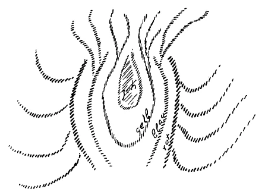
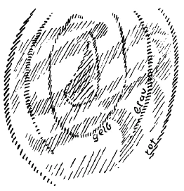
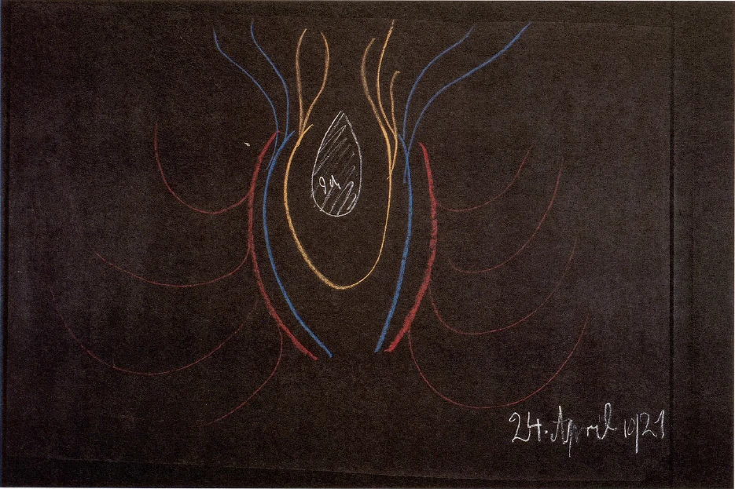
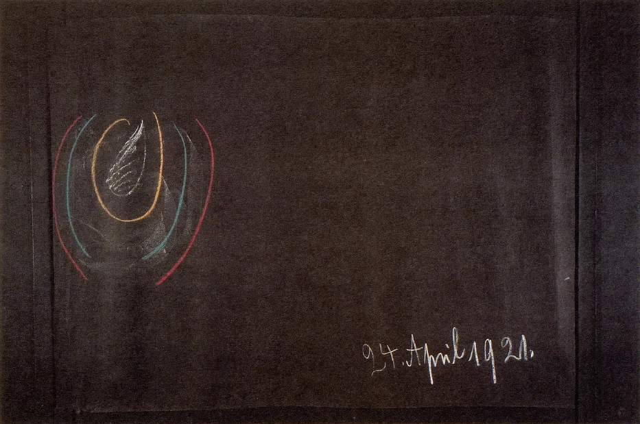

[ 1 ] ^ts25ux

Wir haben im Verlaufe der letzten Woche eine Reihe von Betrachtungen angestellt, die geeignet sind, Licht zu verbreiten über die geistige Verfassung der Gegenwart und der nächsten Zukunft. Wir haben ja in der letzten Zeit ganz besonders hingewiesen auf jenen Zeitpunkt europäischer Menschheitsentwickelung im 4. nachchristlichen Jahrhundert, der einen tiefen Einschnitt bildet. Vorher verstand man, wenigstens im Süden Europas, bis zu einem gewissen Grade aus orientalischen Weisheitsuntergründen heraus das Mysterium von Golgatha. Man hatte noch mit einem gewissen Verständnis umfaßt, was heute so sehr mit Antipathie angesehen wird von gewissen Seiten: die sogenannte Gnosis. Die Gnosis war ja eben der letzte Rest orientalischer Urweisheit, jener Urweisheit, die aus instinktiven Erkenntniskräften der Menschen hervorgegangen ist, die aber tief eingedrungen ist in das Wesen des Weltgefüges. Was nun im Mysterium von Golgatha sich abgespielt hat, man konnte es einsehen mit Hilfe derjenigen Vorstellungen und Empfindungen, die man aus diesem gnostischen Erkennen heraus gewonnen hatte. Aber an dem Zugrundegehen dieses gnostischen Erkennens arbeitete ja jene christliche Strömung, die immer mehr einmündete in das römische Staatswesen, die immer mehr und mehr annahm die Form des römischen Staatswesens. Diese christliche Strömung rottete aus bis auf ganz geringfügige Reste, aus denen wenig zu gewinnen ist, alles das, was einst als Gnosis vorhanden war. Und wir haben ja gesehen, es blieb dann nichts zurück von der alten orientalischen Urweisheit im lebendigen europäischen Menschheitsbewußtsein als die einfachen, in materielle Geschehnisse gekleideten Erzählungen über das, was sich in Palästina zur Zeit des Mysteriums von Golgatha zugetragen hat. ^e10vqd

[ 2 ] ^ons2rq

Diese Erzählungen wurden zunächst ja in jene Form gekleidet, die aus dem alten Heidentum heraus stammte, wie Sie das am «Heliand» sehen. Sie bürgerten sich ein in der europäischen Zivilisation. Allein man hatte immer weniger das Gefühl, daß man sie mit einer gewissen Erkenntniskraft durchdringen soll. Man hatte immer weniger das Gefühl, daß ein tiefes Weltenrätsel und Geheimnis zu schauen sei in dem Mysterium von Golgatha; denn über dasjenige, was als Christus mit dem Jesus verbunden war, hatte man durch Konzilsbeschlüsse festgestellte Formeln aufgebracht. Man hatte den Glauben gefordert an diese festgestellten Formeln, und allmählich ging alles, was an lebendigem Wissen noch vorhanden war bis in die Zeit des 4. nachchristlichen Jahrhunderts, eben in das festgefügte Formelwesen der römischen Staatskirche über. ^jpz4d3

[ 3 ] ^fgwuq0

Und wenn man, ich möchte sagen, das ganze System dieser abendländischen christlich-kirchlichen Strömung überschaut, dann sieht man eben, daß in gewisse feste, starre, immer mehr und mehr unverständliche Formeln gekleidet wurde dasjenige, was das Mysterium von Golgatha war, daß aber ein lebendiges spirituelles Wissen eigentlich ausgerottet wurde. ^7mwa8g

[ 4 ] ^e6sk5h

Es liegt da eine eigentümliche Tatsache europäischer Entwickelung vor. Man möchte sagen: Dasjenige, was fruchtbares, lebendiges orientalisches Urwissen war, das floß ein in die Formeln und erfror in den Formeln, welche das römische Kirchentum annahm. Und in Formeln pflanzte es sich fort durch die folgenden Jahrhunderte. Diese Formeln waren da. Es gab allerdings Leute, welche aus diesen Formeln noch irgend etwas zu machen wußten; aber es war unmöglich geworden, daß das allgemeine Menschheitsbewußtsein eben etwas anderes empfing als tote Form. Gewiß, wir haben eine Reihe ganz ausgezeichneter Geister. Wir brauchen uns nur an manche derjenigen zu erinnern, die von den irländischen Wissensstätten ausgingen, wir brauchen uns nur an den am Hofe Karls des Kahlen lebenden Scotus Erigena zu erinnern. In solchen Persönlichkeiten haben wir eben Menschen, welche die Formeln aufnahmen und in diesen Formeln den Geist noch ahnten, oder ihn mehr oder weniger herausfanden. Wir haben dann die Scholastik, über die wir ja öfters in einem gewissen Zusammenhang gesprochen haben, die in einer mehr abstrakten Form dann versuchte, die Formeln erkenntnisgemäß zu durchdringen. Es liegt eben die Tatsache vor, daß ein weit ausgebreitetes System religiösen Inhaltes in Formeln erfroren vorlag, durch die Jahrhunderte von Generation zu Generation verpflanzt worden ist und als solches Formelwesen weiterlebte. Auf der einen Seite lagen also die theologischen Formeln vor, auf der anderen Seite die in materialistische Bilder gekleideten Erzählungen über die Ereignisse in Palästina. ^atzgg5

[ 5 ] ^83gpg0

Man darf nun durchaus nicht vergessen, wenn man die heutige Zeit verstehen will, was es im Grunde genommen mit diesen in römische Staatsbegriffe gekleideten römisch-katholischen Formeln auf sich hat. Da sind Formeln von großer Bedeutung, großartige Formeln. Da ist vor allen Dingen die Formel der Trinität, die Formel also, welche hinweist, in der Terminologie der späteren Zeiten, auf Vater, Sohn und Geist. In dieser Formel war allerdings eine alte, tiefe Urweisheit eingefroren, etwas Großes und Gewaltiges, das einstmals die menschliche Erkenntnis instinktiv besessen hat. Aber höchstens der genial inspirierte Blick einzelner konnte ahnen, was in einer solchen Formel steckt. ^lqqone

[ 6 ] ^7rvhjn

Da war dasjenige, was durch die verschiedenen Konzilsbeschlüsse durchgehend zuletzt erfroren ist in der Formel über die zwei Naturen des Christus und des Jesus in einer Person. Da waren Formeln über die Geburt, über die Wesenheit des Christus Jesus, über Tod und Auferstehung und Himmelfahrt. Da waren endlich Formeln, welche die verschiedenen Feste festsetzten, und alles das war im Grunde genommen das Gerippe, das Schattenbild einer wunderbaren uralten Weisheit. Und dieses Schattenbild, dieses Gerippe setzte sich durch die Jahrhunderte fort. Es konnte sich namentlich dadurch fortsetzen, daß es eine gewisse Form alter Kulte annahm, und dasjenige, was in Formeln, in die höchsten Formeln gekleidet war, wie zum Beispiel die Formel der Verwandlung des Brotes und Weines in den Leib und in das Blut des Christus, das konnte sich fortpflanzen, weil es gekleidet wurde in eine uralt heilige Kultform wie das Meßopfer, das nur eben etwas umgestaltet wurde, aber sich als solches fortsetzte. Es lebten dann die verschiedenen Metamorphosen der christlichen Feste durch das ganze Kirchenjahr hindurch. Es lebten diejenigen Dinge, die Sie kennen als die Sakramente, welche gewissermaßen durch die Kirche den Menschen herausheben sollten aus dem gewöhnlichen materiellen Leben und ihn hinaufheben sollten in eine höhere geistige Sphäre. Durch das alles und durch seine Verbindung mit dem Impuls des Christentums lebte sich das in den Jahrhunderten europäischer Entwickelung fort. Daneben, wie gesagt, war die schlichte, aber in materialistische Formeln gekleidete Erzählung über die Ereignisse in Palästina. ^ellmph

[ 7 ] ^6hy53c

Das aber alles zusammen war etwas, was dutch seinen bedeutsamen Inhalt — weil man ja im Grunde etwas anderes nicht hatte, um eine Beziehung zu begründen zu den übersinnlichen Welten - auf diejenigen Geister wirkte, die nach solcher Erkenntnis strebten; was aber auch diejenige Art von Wirksamkeit entfalten konnte durch den Kultus, durch die schlichte Evangelienerzählung, welche auf die große breite Masse der europäischen Bevölkerung ihren Einfluß gewonnen hat. ^zwr6yk

[ 8 ] ^y9psry

Daneben pflanzte sich nun fort als Einzelnes ein anderes System des Kultus, das weniger mit dem Christentum als solchem rechnete, das das Christentum oftmals aufnahm, aber im Grunde genommen nicht organisch mit dem Christentum verbunden war, das mehr hervorging aus noch älteren Kultformen. Es pflanzte sich dasjenige fort, was dann in das Formelwesen der neuzeitlichen Freimaurerei einmündete, was eben nur eine äußerliche Beziehung zu dem Christentum hatte und hat. Und Sie wissen ja, daß sich das, was sich in die Form der römisch-katholischen Dogmatik kleidete und den römisch-katholischen Kultus hat, und dasjenige, was in freimauterischer Weise an andere Kultformen und an andere Symbolik anknüpft, sich bis in unsere Tage herein bis aufs Messer bekämpfen. ^zvahrd

[ 9 ] ^kin7z3

Diese Entwickelung ist ja mehr oder weniger zu verfolgen, wenn man nur mit einigem Sinn die geschichtlichen Tatsachen, die vorliegen, ins Seelenauge faßt. Aber so richtig verstehen kann man das, was da vorliegt, eigentlich doch nur, wenn man hinblicken kann auf jenen Einschnitt europäischer Entwickelung, der im 4. nachchristlichen Jahrhundert sich vollzog und der, ich möchte sagen, wie in einen Abgrund hinunter versenkte dasjenige, was alte spirituelle Weisheit und ihre Nachklänge waren; so daß man eigentlich in Europa durch die folgenden Jahrhunderte wenig wußte von dem, was orientalische Urweisheit war. ^a6ixqm

[ 10 ] ^mjn2l0

Nach und nach waren ja der Menschheit die inneren Fähigkeiten hingeschwunden, welche es dem Menschen in alten Zeiten, wie ich das gestern angedeutet habe, möglich machten, Gewicht, Zahl und Maß in ihrem eigenen Wesen zu erleben. Maß, Zahl, Gewicht wurden Abstraktionen, und als Abstraktionen wurde mit ihnen dann im fünften nachatlantischen Zeitraum dasjenige begründet, was heute unsere naturwissenschaftliche Weltanschauung ist, was den Menschen nicht aufnehmen konnte in sein Gebiet, was vor dem Menschen haltmachte, was den Menschen ganz und gar nicht begriff, was aber eben mit den Abstraktionen von Gewicht, Zahl und Maß die äußeren Naturerscheinungen, abgesehen vom Menschen, mit einer gewissen Großartigkeit umfaßte, und was dann eine Art Höhepunkt erreichte im 19. Jahrhundert. ^kh4iqp

[ 11 ] ^j0xdat

Zu diesen Dingen haben die Menschen heute noch zuwenig Distanz; sie sehen noch nicht, wie tatsächlich in der Mitte des 19. Jahrhunderts ein ganz besonderer Zeitpunkt europäischer Entwickelung war. Das intellektuelle Streben, das reine Verstandesstreben, das kam in der Mitte des 19. Jahrhunderts zu seiner vollsten, zu seiner höchsten Entfaltung. Es war dies dasjenige Streben, das sich aus denselben Quellen heraus ergeben hatte, aus denen eben seit dem ersten Drittel des 15. Jahrhunderts die modernen naturwissenschaftlichen Anschauungen flossen. Es war aber zu gleicher Zeit dasjenige Streben, welches zuletzt nichts mehr anfangen konnte, im Grunde genommen schon lange nichts mehr hat anfangen können mit dem Kultus, der sich fortgepflanzt hatte, welches schon lange nichts mehr hat anfangen können mit den dogmatischen Formeln, die durch die Konzilien festgelegt worden waren. Lediglich einige Ranken waren geblieben, einige Abfälle, wie zum Beispiel der Abfall des Konzils von 869, wo man beschlossen hatte, daß der Mensch nicht bestehe aus Leib, Seele und Geist, sondern nur aus Leib und Seele, und daß die Seele einige geistige Eigenschaften habe. Dieser Abfall war geblieben, und dieser Abfall lebt in den modernen philosophischen Anschauungen fort, die glauben, unbefangen zu sein, die aber im Grunde genommen nur nachplappern, was dieser katholischen Dogmatik entstammt. ^2crwlf

[ 12 ] ^wrbyli

Aus all diesen Strömungen heraus bildete sich die moderne Stimmung der europäischen Zivilisation, die immer mehr hintendierte zu einer rein intellektuellen, zu einer verstandesmäßigen Auffassung des Weltenalls. Und diese Stimmung, die aber schon durch Jahrhunderte vorbereitet war, erreichte ihren Höhepunkt in der Mitte des 19. Jahrhunderts. Und wie können wir, wenn wir auf den Menschen hinschauen seelisch-geistig, diesen Höhepunkt begreifen? Da müssen wir einmal einen Blick auf die Menschennatur werfen, wie sie in alten Zeiten war, und wie sie allmählich geworden ist. Wir haben es von verschiedenen Gesichtspunkten aus schon getan, wollen es heute wiederum von einem gewissen Gesichtspunkte aus tun. ^34z7ej

[ 13 ] ^dgyku8

Stellen wir einmal schematisch die menschliche Wesenheit vor uns hin. Nehmen wir zunächst einmal des Menschen physischen Leib (siehe Zeichnung, rot). Wie gesagt, ich zeichne schematisch. ^b4kf3u

 ^0u78yr

[ 14 ] ^6rzp7u

Nehmen wir des Menschen Ätherleib (blau); nehmen wir des Menschen astralischen Leib (gelb), und nehmen wir des Menschen Ich. Betrachten wir nun zunächst einmal diese menschliche Wesenheit, wie sie war in alten Zeiten, in jenen alten Zeiten, in denen das instinktive Hellsehen noch vorhanden war, das dann abblühte, verwelkte und allmählich verschwand. Das Ich ist ja im Grunde genommen Erdenprodukt, auf das brauchen wir weniger zu sehen; allein klar müssen wir uns sein, daß in des Menschen physischem Leib, Ätherleib, astralischem Leib ja im Grunde genommen die ganze Welt lebt. Wir können sagen: In diesem physischen Leib lebt dasjenige, was die ganze Welt ist. Er ist herausgeboren, ergänzt sich noch immer durch die Nahrungsaufnahme aus ihr. Im ätherischen Leib lebt die ganze Welt; fortwährend kommen auf den verschiedensten Wegen in ihn hinein diejenigen Dinge, welche auf überphysische Weise in den Menschen hereinwirken, die sich in seinen Wachstumskräften äußern, die sich zum Beispiel in der Zirkulation seines Blutes äußern, die im Atem leben und so weiter, und die nicht etwa dieselben sind wie die Kräfte, die in der Nahrungsaufnahme und in der Verdauung leben. Wir haben dann alles das, was in seinem astralischen Leibe lebt, was ja auch aufnimmt Eindrücke aus der Welt, was durch die Sinne eindringt und so weiter. Das war so und es ist heute noch so, als der Mensch mit seinem alten instinktiven Hellsehen lebte; aber es war während dieser Zeit des alten instinktiven Hellsehens der Mensch intimer verbunden mit seinem physischen Leib, mit seinem Ätherleib, mitseinem Astralleib, als er es heute ist. Wenn er des Morgens aufwachte, so tauchte er hinein mit seinem Ich und seinem astralischen Leibe in seinen physischen Leib und in seinen Ätherleib. Ein inniges Gefüge bildete sich zwischen seinem Ich und seinem astralischen Leibe und seinem Ätherleibe und seinem physischen Leibe. Und er lebte nicht nur in seinem physischen Leibe, er lebte in den Kräften, die in seinem physischen Leibe darinnen arbeiteten. ^783joj

[ 15 ] ^s3v9nd

Ich möchte Ihnen das ganz anschaulich schildern. Nehmen Sie einmal an, der Mensch des alten Hellsehens aß eine Pflaume. Es nimmt sich ja für den heutigen Menschen fast grotesk aus, wenn man so etwas schildert, aber es ist tief wahr. Nehmen wir an, der Mensch des alten Hellsehens aß eine Pflaume; diese Pflaume hat in sich ätherische Kräfte. Wenn der Mensch heute eine Pflaume ißt, weiß er ja nicht, was in dieser Pflaume vorgeht. Der Mensch des alten Hellsehens aß eine Pflaume, hatte sie nun im Magen, verdaute sie und erlebte mit, wie das, was da ätherisch in der Pflaume lebte, in seinen Leib überging; er erlebte es kosmisch mit. Und erst wenn er nun innerlich seinen Vergleich anstellte zwischen den verschiedenen Dingen, die er in seinen Magen hineinbeförderte, da lebte alles das, was an Beziehungen vorhanden war in der Welt draußen, das lebte in ihm weiter fort, das nahm er innerlich wahr. Er erfüllte sich vom Aufwachen am Morgen bis zum Einschlafen am Abend mit einem innerlichen lebendigen Anschauen desjenigen, was draußen die Pflaumen leben, was die Äpfel leben, was auch vieles andere noch lebt, das er zu sich nahm. Er kannte innerlich durch den Atmungsprozeß die geistige Wesenhaftigkeit der Luft. Er kannte durch das, was in seinem Zirkulationsprozesse vor sich ging, wenn die Wärme drinnen zirkulierte, was als Wärmekräfte im Kosmos in seiner Umgebung war. Er hörte nicht damit auf, das Licht im Auge bloß zu empfinden; sondern er fühlte, wie das Licht durch seine Augennerven einstrahlte, in seinem eigenen Ätherleib aufstieß auf die physischen Glieder, in den physischen Gliedern lebte; er erlebte sich ganz konkret drinnen im Kosmischen. Das war allerdings ein dumpfes Bewußtsein, aber es war eben vorhanden. Es war allerdings während des Tages übertönt von dem, was auch der damalige Mensch schon äußerlich wahrnahm. Aber selbst in den ersten Zeiten der griechischen Zivilisation war es so, daß die Menschen schon noch einen Nachklang desjenigen hatten, was heute ja nur noch andere Wesen haben. Ich habe schon einmal oder sogar vielleicht öfters darauf hingewiesen, daß es außerordentlich interessant ist, mit spirituellem Blick hinzuschauen auf eine Weide, wo Kühe liegen und verdauen. Dieses ganze Geschäft des Verdauens ist für die Kühe ein kosmisches Erleben, für die Schlangen erst recht; wenn sie liegen und verdauen, so erleben sie in der Tat Weltgeschehen. Da blüht und sproßt aus ihrem Organismus für sie, für ihre Anschauung etwas auf, was Welt ist. Da steigt aus ihrem Inneren etwas auf, was viel schöner ist als alles dasjenige, was der Mensch jemals durch Augen von außen sehen kann. Und so etwas war, ich möchte sagen, als Unterton bei den Menschen, die das alte instinktive Hellsehen hatten, vorhanden. Es war allerdings die größte Zeit des Tages gedämpft durch das äußere Anschauen. Wenn aber dann diese Menschen einschliefen, dann trugen sie das, was sie da erlebt hatten und was sie aufgenommen hatten in ihren astralischen Leib und in ihr Ich, hinaus, wenn ihr Ich mit seinem astralischen Leib allein war, und dann stieg es in Form von realen Träumen mächtig auf; dann erlebten sie in Form von realen Träumen nach, was sie nur dumpf während des Tages erlebt hatten. ^btkrs1

[ 16 ] ^84m42m

Sehen Sie, da weise ich Sie hin auf das innerliche seelisch-leiblich-physische Erleben der Menschen älterer Zeiten, die gerade dadurch, daß sie so seelisch-leiblich-physisch erlebten, kosmisch erlebten, die gerade darinnen ihr kosmisch-übersinnliches Schauen hatten. Und wenn dann im Orient die Menschen den Somatrank tranken, dann wußten sie, was der Geist der Höhe ist. Dieser Somatrank, der durchsetzte und durchwühlte und durchwob ihr Inneres, der durchlebte ihr Blut. Und wenn sie dann einschliefen und dasjenige, was als Ich und astralischer Leib im Blute gewoben hatte, mitnahm die Formen, die entstanden waren durch das Verdauen des Somatrankes, dann dehnte sich ihr Wesen aus in Raumesweiten, und sie fühlten die Geistigkeiten des Kosmos nach in ihrem nächtlichen Erleben. ^kyn75y

[ 17 ] ^5pjhpf

Solch ein Erleben war durchaus noch zu finden bei denjenigen, bei denen der alte Zarathustra in der urpersischen Zeit ein geneigtes Ohr fand. Man versteht das, was schließlich aus den orientalischen Urkunden, die geblieben sind, zu uns herübertönt, nicht, wenn man nicht solche Dinge weiß. Aber dieses lebendige kosmische Schauen, es verglomm allmählich. Es ist schon in der historisch-ägyptischen Zeit wenig zu finden, aber es sind die Nachklänge noch da, und es schwindet bis auf letzte Reste, die sich bei primitiven Menschen ja immer erhalten haben, im 4. nachchristlichen Jahrhundert dahin. Und von da ab rang sich immer mehr aus dem Menschen heraus das, was nun ganz und gar an den bloßen physischen Leib gebunden ist in seiner Isoliertheit von der Welt: der Intellekt, das Verstandesmäßige. Man kann nicht anders, wenn man ein bildliches Vorstellen hat und hinuntertaucht in seinen Leib, als etwas Kosmisches mitempfinden. ^5ncp2m

 ^q2k8em

[ 18 ] ^vo30ux

Man kann nicht anders, wenn man noch etwas von der inneren Eigenschaft der Zahl hat und dann hinuntertaucht in seinen Leib, als die Zahlenmäßigkeit des Kosmos miterleben. Und so ist es auch mit den Gewichtsverhältnissen. Aber wenn man mit der Kraft des Ichs, welche als rein Verstandesmäfßiges, als rein Intellektuelleswirkt, wenn man damit hinuntertaucht in den menschlichen Organismus beim Aufwachen, dann taucht man damit nur in den isolierten menschlichen Leib ein, in dasjenige, was der menschliche Leib nur durch sich ist, was er ist ohne seine Verbindung mit dem Kosmos. In den irdischen menschlichen Leib in voller Isolierung taucht man ein, so daß man, wenn man dieses verstandesmäßßig zeichnen wollte, eben sagen müßte: Da ist zwar auch vorhanden Ätherleib, Astralleib, Ich (siehe Zeichnung blau, gelb, Mitte); aber das Ich erlebt hier in der menschlichen Wesenheit nichts vom Kosmischen mehr. Es erlebt eben nur dumpf sein Sein, sein Untergetauchtsein in den isolierten menschlichen Organismus. Wenn daher dieses rein verständige Ich schlafend in die Umwelt herausgeht, nimmt es nichts mit. Und dieses Nichts-Mitnehmen, das bewirkt, daß höchstens Reminiszenzträume, Traumbilder irrealer Art im Menschen auftauchen können, aber daß dieses Ich nicht kosmisch irgendwie von etwas durchdrungen ist. Der Mensch erlebt also im Grunde genommen vom Einschlafen bis zum Aufwachen nichts Wesentliches, weil sein ganzes Erleben auf den isolierten menschlichen Organismus berechnet ist, der aber nunmehr mit denjenigen Kräften auf dieses Ich wirkt, welche nichts mit dem Kosmos zu tun haben. Daher wird das Ich stumpf vom Einschlafen bis zum Aufwachen. Das muß auch so sein. Die alten instinktiv-hellseherischen Menschen haben zwar ihr kosmisches Schauen gehabt, sie haben, in instinktiven Intuitionen, in instinktiven Inspirationen, in instinktiven Imaginationen gelebt; aber sie haben nicht ein selbständiges Verstandesdenken gehabt, denn dieses selbständige Verstandesdenken, dieses eigentlich intellektuelle Denken, das muß sich bedienen des Werkzeuges des isolierten menschlichen Leibes, wenn es sich ausbilden will. Das muß stumpf sein zwischen dem Einschlafen und Aufwachen, bringt daher auch beim Aufwachen nichts mit, während der alte Mensch mitgebracht hat das, was er, nachdem er das Erleben im Leibe hinausgetragen hatte in den Kosmos, erlebt hat im Begegnen dieser Nachklänge, dieser kosmischen Nachklänge mit dem draußenstehenden wirklich geistig-kosmischen Geschehen. Von dem, was er da erlebt hat, brachte er wieder Nachklänge zurück; er hatte dadurch einen lebendigen Verkehr mit dem Kosmos. Was im verstandesmäßigen Denken vom Menschen errungen wird, das wird errungen vom Aufwachen bis zum Einschlafen, wird stumpf nach dem Einschlafen. Der Mensch ist nun auf das Wachen angewiesen. ^pue6cv

[ 19 ] ^61fs5s

Sehen Sie, es liegt ein merkwürdiges Verhältnis vor, es liegt das Verhältnis vor, daß in alten Zeiten der Mensch mehr an seinen Leib gebunden war als er es heute ist, aber daß er eben im Leibe das Geistige des Kosmos erlebte. Dieses Erleben im Leibe hat der neuere Mensch verloren. Der neuere Mensch ist geistig, aber er hat den verdünntesten Geist, er lebt im Intellekt und kann im Geiste nur leben vom Aufwachen bis zum Einschlafen, und er wird stumpf, wenn er in die geistige Welt geht mit seinem ganz verdünnten intellektiven Geiste. ^hayvui

[ 20 ] ^lrz3cu

Warum haben wir eigentlich den Materialismus bekommen? Und warum haben die alten Menschen den Materialismus nicht gehabt? - Die alten Menschen haben den Materialismus nicht gehabt, weil sie in der Materie des Leibes gelebt haben; die neueren Menschen haben den Materialismus, weil sie nur im Geiste leben, weil sie ganz frei sind von einem kosmischen Zusammenleben mit ihrem Leibe. Der Materialismus kommt gerade daher, daß der Mensch geistig geworden ist, aber verdünnt geistig. Am geistigsten war der Mensch in der Mitte des 19. Jahrhunderts; aber er hat sich ahrimanisch selbst belogen, indem er nicht erkannte, daß das, worin er lebt, der verdünnte Geist ist, und er nahm nur auf in das Geistigste, was ihm werden konnte, die Vorstellung von der Materialität. Der Mensch war ganz und gar ein geistiger Behälter geworden; aber er ließ in diesen geistigen Behälter nur die Gedanken vom materiellen Dasein hineinfließen. Das ist das Geheimnis des Materialismus, daß der Mensch wegen seiner Geistigkeit sich der Materie zuwandte. Das ist die Ableugnung des modernen Menschen gegenüber der eigenen Geistigkeit. Der Kulminationspunkt des Geistigseins war in der Mitte des 19. Jahrhunderts erreicht; aber der Mensch erfaßte dieses Geistigsein nicht. ^dw3v5x

[ 21 ] ^l0oe0k

Das aber, wie gesagt, bereitete sich langsam vor durch die Jahrhunderte. Hinabgeglommen war die alte instinktive Geistigkeit im 4, nachchristlichen Jahrhundert, herauf kam die neue Geistigkeit im ersten Drittel des 15. Jahrhunderts; dazwischen ist gewissermaßen eine Episode des menschlichen Erlebens. Aber jetzt, nach diesem Zeitpunkt, nach dem ersten Drittel des 15. Jahrhunderts, nach dem 15. Jahrhundert überhaupt, machte sich dieses Angewiesensein des Menschen auf seinen isolierten irdischen physischen Leib geltend. Jetzt fing er eben an, keine Beziehung mehr zu entwickeln zu dem, was eingefroren war in den dogmatischen Konzilienformeln, was ja allerdings eingefroren war, aber doch einen großartigen Inhalt hatte. Und er konnte im Grunde genommen auch keine Beziehung mehr finden zu den schlichten Erzählungen von Palästina. Er zwang sich noch einige Zeit, einen Sinn damit zu verbinden. Man kann aber nur einen Sinn damit verbinden, wenn man sie erkennend durchdringt. Insbesondere aber konnte er keinen Sinn mehr damit verbinden, dieser moderne Mensch, immer weniger und weniger Sinn verbinden mit den Kultformen, mit dem Kultus selbst. Das Meßopfer, eine Handlung von höchster kosmischer Bedeutung, wurde zum äußeren Symbolum, da man es nicht verstand; das Sakrament der Transsubstantiation, das sich forterhalten hatte das Mittelalter hindurch, und das eine tiefe kosmische Bedeutung hat, wurde in die rein intellektuelle Diskussion der Menschen hineingeworfen. Es war ganz selbstverständlich, daß man mit dem isolierten Verstand, wenn man anfing zu fragen, in welcher Weise der Christus enthalten sei im Altarsakrament, das nicht begreifen konnte; denn zum Verstandesbegreifen sind diese Dinge eben nicht geeignet. Jetzt fing man an, sie mit dem Verstande begreifen zu wollen. ^mfwfpr

[ 22 ] ^bnhujy

Das führte dann dazu, daß jene Diskussionen von so großer weltgeschichtlicher Bedeutung auftauchten, die als «Abendmahlsstreit» bekannt sind, und die geknüpft sind an Namen wie Has und andere. Und die fortgeschrittensten, die im verständigen Auffassen der Welt fortgeschrittensten Menschen der europäischen Zivilisation mündeten in die verschiedenen Protestantismen hinein. Es ist die Reaktion des Intellekts gegen dasjenige, was aus einer viel breiteren, viel intensiveren Erkenntniskraft hervorgegangen war als es der Intellekt ist. Wie fremd standen sich gegenüber die Kräfte, die sich in der modernen Seele gebildet hatten als intellektive Kräfte, und dasjenige, was in den eingefrorenen Formeln lebte, aber ‚was in sich doch umschloß ein Gtoßes, ein Gewaltiges! Die evangelischen Bekenntnisse der verschiedensten Art kamen herauf, Kompromisse zwischen dem Intellekt und den alten Überlieferungen, und das 16., 17., 18., 19. Jahrhundert, sie liefen ab, und der Mensch stand eben in der Mitte des 19. Jahrhunderts auf dem Höhepunkt seiner intellektuellen Entwickelung; er wurde ein ganz und gar geistiges Wesen. Er konnte durch diese Geistigkeit begreifen, was in der äußeren Sinneswelt ist; aber er begriff sich selber nicht als Geist. Kaum hatte man noch eine Ahnung, was ein solcher Satz bedeutete, wie der des Leibniz, der da sagte: «Nichts lebt im Intellekt, was nicht vorher in den Sinnen gelebt hat, außer dem Intellekt selber.» Diese letztere Wendung hatte der moderne Mensch ganz und gar weggelassen und er bekannte sich nur zu dem Satze: Nichts lebt in dem Intellekt, was nicht vorher in den Sinnen gelebt hat -, während Leibniz ganz und gar durchschaute, daß der Intellekt ein durch und durch Geistiges ist, etwas, was im Menschen arbeitet, ganz unabhängig von aller physischen Körperlichkeit. ^wn6osn

[ 23 ] ^v46pa5

Wie gesagt, der Intellekt wirkte, aber er erkannte sich nicht. Und so haben wir es erlebt, daß der Mensch nun auf dem Übergange zu einer anderen Entwickelungsphase seines Lebens ist, und er trägt gewissermaßen nichts in die Nacht hinaus. Denn dasjenige, was verstandesmäßig erarbeitet wird, wird durch den Leib erarbeitet und hat keine Beziehung zu dem Außerleiblichen. Nun muß sich der Mensch neuerdings hineinarbeiten in die geistige Welt. Es tritt für ihn die Möglichkeit ein, in diese geistige Welt hineinzuschauen; sie ist deutlich da. Was der Mensch früher aus seinem physischen, aus seinem Ätherleib, aus seinem astralischen Leib herausgeholt hat an instinktivem Anschauen über den Kosmos, es kann heute wieder errungen werden. Wir können zu Imaginationen kommen und können die Weltentwickelung durch Saturn, Sonne und Mond, Erde und so weiter in Imaginationen schildern. Wir können dasjenige, was da lebt, in die Zahlnatur, in die Zahlwesenheit hineinschauen und können dadurch die Inspiration empfangen, wie aus der Weltengeistigkeit heraus sich durch die Zahlengesetzmäßigkeit die Welt gestaltet. Es ist zunächst durchaus möglich, daß das da ist, was in dieser Weise imaginativ und inspirativ und intuitiv über die Welt zu erringen ist. ^rnig0k

[ 24 ] ^7sujj8

Die meisten Menschen werden sagen: Wenn wir nicht selber hellsichtig geworden sind, so können wir das höchstens studieren. - Gut, aber man kann es studieren, und immer wieder und wiederum ist gesagt worden, der gewöhnliche Intellekt kann es einsehen. Heute soll hinzugefügt werden, warum der gewöhnliche Intellekt es einsehen kann. Nehmen Sie an, Sie lesen so etwas wie die «Geheimwissenschaft im Umrißs». Nehmen Sie an, Sie versuchen, sich mit dem gewöhnlichen Intellekt in diese Dinge hineinzuversetzen ‚Sie nehmen es auf mit dem Intellekt, der nur an den isolierten menschlichen Leib gebunden ist. Sie nehmen aber etwas auf, was Sie durch diesen Intellekt nicht haben aufnehmen können, weil dieser Intellekt sich selber nicht begriffen hat durch die Jahrhunderte hindurch. Jetzt nehmen Sie etwas auf, was für diejenigen Begriffe, die der Intellekt nur aus der äußeren Sinneswelt entlehnt, unverständlich ist, was aber verständlich wird, wenn der Intellekt sich aufrafft, um aus sich selber heraus etwas zu verstehen, um zunächst nicht zu bejahen oder zu verneinen, sondern nur zu verstehen. Das ist ja, was gesagt wird: Verstehen soll man die Dinge. - Man braucht sie zunächst einfach nur zu verstehen. Versteht man sie, so schafft man ja mit dem, was das Ich sich als Verständnis errungen hat, nun in die Nacht hinein. Da bleibt man nicht mehr stumpf, wie bei dem bloßen intellektiven Verhalten zur Welt, da lebt man vom Einschlafen bis zum Aufwachen mit einem anderen Inhalt in der fein filtrierten Geistigkeit. Und dann wacht man auf und hat, eine allerdings immer nur kleine Möglichkeit des innerlichen Aneignens zugesetzt zu dem, was man sich bemüht hat, intellektuell zu verstehen. Aber ich möchte sagen, mit jeder Nacht, mit jedem Schlafen setzt sich etwas dazu von einer innerlichen Beziehung, der Mensch bekommt eine innerliche Beziehung. Er trägt das, was er als Nachklang seines Tagesverstehens in die außerkörperliche Welt hinausträgt, beim Einschlafen wieder herein, und dadurch bekommt er eine Beziehung, eine ganz aus dem Realen herausgeholte Beziehung zu der geistigen Welt, wenn er sich diese Beziehung nicht ruiniert durch dasjenige, wodurch er sie sich ja heute vielfach ruiniert; ich habe diese Hilfsmittel des Ruinierens der Geistigkeit ja öfters angeführt. Sie wissen, zahlreiche Menschen sehen sehr darauf, vor dem Einschlafen etwas zu erlangen, was sie die «Bettschwere» nennen; sie trinken so viele Gläser Bier, bis sie die nötige Bettschwere haben. Das ist ein ganz gewöhnlicher Ausdruck, der heute weit verbreitet ist gerade in der «Intelligenz». Da allerdings können sich jene Kräfte nicht hineinentwickeln, von denen ich jetzt eben gesprochen habe. ^xhgtnc

[ 25 ] ^qjna7z

Aber die Geistigkeit ist zu erforschen. Die Geistigkeit kann auf die eben geschilderte Weise auch erlebt werden. Der Mensch ist herausgewachsen aus der Geistigkeit. Er kann wiederum hineinwachsen in diese Geistigkeit. Wir stehen heute am Anfange dieses Hineinwachsens in die Geistigkeit. Was sich in den verflossenen Jahrhunderten, seit dem 15. Jahrhundert bis ins 19. Jahrhundert herein, wo der Verstand auf der höchsten Stufe stand, entwickelt hat, was sich gerade unter den fortgeschrittensten Menschen Europas entwickelt hat, das ist zwar eine gewisse Geistigkeit, die aber zunächst ohne Inhalt ist; denn erst wenn man wieder an die Imagination sich wendet, bekommt diese Geistigkeit den ersten Inhalt. Das, was höchstfiltrierte Geistigkeit ist, das muß seinen Inhalt bekommen. Er wird zunächst noch von den weitesten Kreisen der Welt abgelehnt. Die Welt will bei der filtrierten Geistigkeit bleiben und nur einen Inhalt geben, der der äußeren materiellen Welt entlehnt ist. Sie will mit diesem Verstande sich nicht aufraffen, um dasjenige, was aus dem Schauen der geistigen Welt gegeben wird, zu verstehen. Die Evangelienbekenntnisse, sie sind eben Kompromisse zwischen dem Intellekt und den alten Traditionen; sie haben den Zusammenschluß verloren. Der Kultus sagt ihnen nichts, daher hat der Kultus nach und nach ziemlich aufgehört innerhalb dieser Bekenntnisse. Bis zu abstrakten Vorstellungen ist es gekommen statt des lebendigen Erfassens von so etwas wie der TIranssubstantiation. Die schlichten Erzählungen können höchstens erzählt werden, aber man kann mit ihnen ja keinen anderen Sinn verbinden als den, den man eben mit einer materialistischen Theologie verbinden kann: daß man es nämlich zu tun hat mit Ereignissen, die sich angliedern lassen an den schlichten Mann aus Nazareth und so weiter. Das ist etwas, was zu keinem Inhalte kommen kann, das ist etwas, was allen Zusammenhang mit der Geistigkeit verliert. ^n85ime

[ 26 ] ^bmh87j

Und so haben wir heute die Weltsituation, daß dasteht dasjenige, was zunächst den Intellekt abgelehnt hat, was solche Kompromisse nicht eingegangen ist, wodurch in weiten Kreisen der Bevölkerung eine Beziehung sich erhalten hat, wenn auch eine völlig instinktive, zu den Formeln, die in den Dogmen leben, deren Inhalt für den Menschen nicht mehr daliegt, aber der ja doch ausgeflossen ist in diese Formeln. Auch haben sich diese Kreise ihr lebendiges Verhältnis zum Kultus, zum Zeremoniell erhalten, ihren Zusammenhang mit dem Sakramentalen. So sehr auch das alles ausgepreßt ist, es lebte einmal in dem, was da Gerippe, was Schatten geworden ist, die alte Geistigkeit, diejenige Geistigkeit, zu der eben noch durch die Formeln eine Beziehung da ist. In den neueren Bekenntnissen protestantischer Art, in denen man einen Kompromiß versucht, lebt eine solche Beziehung nicht. - Und dann sind die Menschen da, die sich die ganz aufgeklärten nennen, die bloß im Intellekt leben, der allerdings geistig ist, der aber das Geistige nicht erfassen will. ^jt7v84

[ 27 ] ^x6hibe

Das sind die drei Strömungen, die wir haben, und wir können ja rechnen für die Zukunft nicht mit solchen Strömungen als fruchtbaren, die nur einen äußerlichen Kompromiß haben eingehen wollen, wir können nicht rechnen mit der bloßen Intellektualität, die zu keinem Inhalt kommen kann, die daher sich selbst verlieren muß, weil sie sich nicht selbst erkennen will. Wir können nur rechnen mit dem, wozu allmählich die Strömungen auslaufen, immer deutlicher und deutlicher laufen sie aus, wir können rechnen mit dem, was sich in alte Formeln gegossen hat, was die fortlebende römisch-katholische Kirche ist, und mit demjenigen, was ernst macht mit der neuen Intellektualität, diese Intellektualität imaginativ, inspirativ und intuitiv vertieft und zu einer neuen Geistigkeit kommt. In diesen zwei Gegensätzen lebt sich die moderne Welt auseinander. Auf der einen Seite stehen die Menschen da mit dem Intellekt. Sie sind innerlich träge, sie wollen diesen Intellekt nicht anwenden; aber sie brauchen einen Inhalt. Sie greifen zurück zu den toten Formeln. Gerade unter intelligenten Leuten, die aber innerlich träge sind, die in gewisser Beziehung intellektuell-dadaistisch sind, in denen macht sich heute eine jungkatholische Bewegung geltend, welche aufgreifen will das Alte, das in Formeln erstarrt ist, welche von außen einen Inhalt bekommen möchte, in historischen Erscheinungen aber erstarrt. Sie krampft aus dem Intellekt heraus, einen Sinn zu verbinden mit dem alten Inhalt, und wir haben solche intellektualistischen Krämpfe, welche dutch alten Inhalt ihre erstarrten Formeln sich neuerdings zubereiten wollen zum Gebrauche der Menschen. ^y3zuee

[ 28 ] ^cbfcwv

Wir haben zum Beispiel ein intellektuell verkrampftes Sich-Hinneigen zu erstarrten Formeln auf vielen Seiten in dem neuen «Tat»Heft. Denn der Verleger Diederichs tut schließlich alles, er bringt alles in Kategorien und auf Papier, und so hat er auch einer jungkatholischen Bewegung jetzt ein ganzes «Tat»-Heft gewidmet, woraus man sehen kann, wie man heute krämpfig denkt, wie man ein innerlich-krämpfiges Denken entwickelt, um nicht sich innerlich aufzuraffen, um innerlich träge bleiben zu können und mit dem Intellekt, der nun schon einmal da ist, das sich am trägsten Fortschiebende aufzufassen. Das alles versuchen die Menschen, um ablehnen zu können dieses lebendige Hinarbeiten aus der neueren Intellektualität heraus zu der Geistigkeit, die ergriffen werden kann und die ergriffen werden muß. Und immer mehr und mehr werden sich die Dinge so zuspitzen, daß eine mächtige Bewegung durch die Welt geht, welche faszinierend wirkt, suggerierend wirkt, hypnotisierend wirkt auf alle diejenigen, die träge bleiben wollen im Intellekt. Eine katholische Welle geht durch die Welt selbst der intelligenten Leute, die aber in ihrer Intelligenz träge bleiben wollen. Die schläfrigen Seelen merken es nur nicht. Aber unfruchtbar muß das bleiben, demjenigen zuzustreben, was Oswald Spengler so anschaulich geschildert hat in seinem «Untergang des Abendlandes». Man kann das Abendland katholisch machen, aber man tötet damit seine Zivilisation. Dieses Abendland muß sich zuwenden dem Aufwachen, dem Innerlich-regsam-Werden, dem Nicht-träge-Bleiben der Intelligenz, denn diese Intelligenz, sie kann sich aufraffen, sie kann sich innerlich erfüllen mit Verständnis für die neue Geistesanschauung. ^pbrbjo

[ 29 ] ^8m8tcr

Dieser Kampf, er bereitet sich vor, er ist da, und er ist die Hauptsache. Alles andere gerät in der Zukunft zwischen diesen beiden Strömungen unter die Räder in bezug auf dasjenige, was Weltanschauungsfragen sind. Auf das hin muß der Blick gerichtet werden, denn was sich da auslebt, verbirgt sich in mancherlei Formeln und Formen. Und wer da glaubt, mit dem, womit man vielleicht noch im Beginne dieses Jahrhunderts sich einem Traum hingegeben hat, weiterkommen zu können, der lebt nicht mit das Leben der Gegenwart. Derjenige lebt allein das Leben der Gegenwart, der sich ein Auge entwickelt für das, was in diesen beiden geschilderten Strömungen lebt. Darauf muß mit wachen Augen hingesehen werden. Denn all das, wovon ich vor acht Tagen gesprochen habe, daß heute zahlreiche Menschen das Böse lieben und aus dem bloßen Hang zum Bösen in der Weise verleumden, wie es Ihnen charakterisiert worden ist, das muß uns vor die Seele treten. Jene innere Unwahrhaftigkeit muß uns vor die Seele treten, daß, wie ich es Ihnen erwähnt habe, die Leute, welche in ihrem katholischen Bewußtsein gestärkt werden sollen, in die katholische Kirche in Stuttgart zum Vortrag des Generals von Gleich geschickt werden, und daß dieser katholische General mit dem Lutherliede schließt! - Da findet sich das zusammen, was nicht auf das Bekenntnis hält, sondern was nur im Ausschleimen der Lüge zusammenströmen will. ^94nt33

[ 30 ] ^5jtxqp

Auf diese Dinge muß heute hingesehen werden. Wenn man nicht hinsieht, so schläft man, macht nicht mit dasjenige, was heute eigentlich doch nur den Menschen zum wahren Menschen machen kann. ^t4upg8

 ^063hg5

 ^seer54

