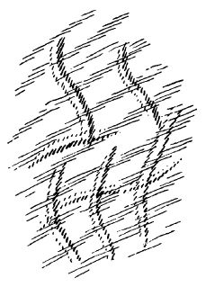
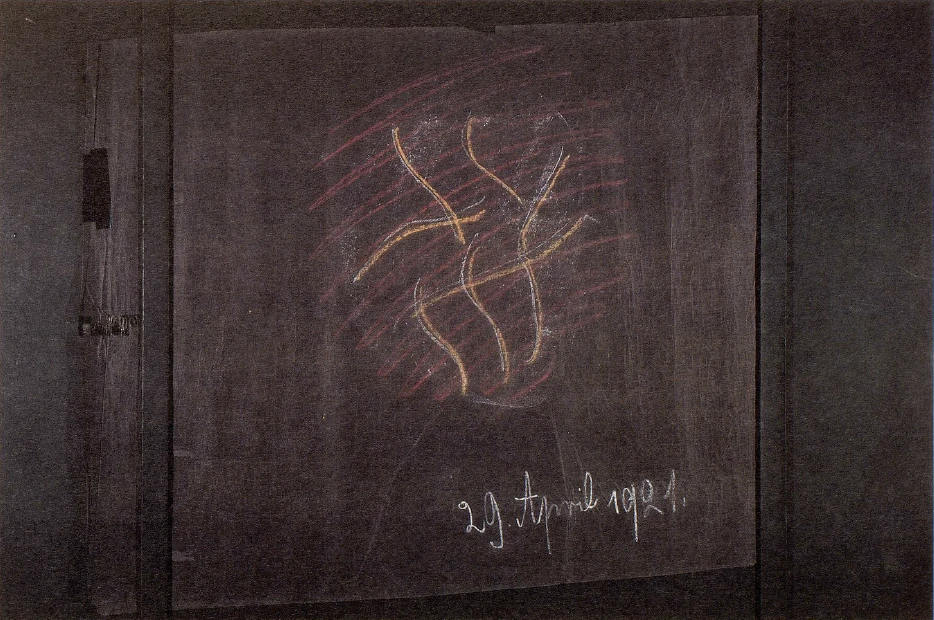

[ 1 ] ^939epx

Wir haben uns in dieser Zeit beschäftigt mit der europäischen Zivilisationsentwickelung, und wir werden den Versuch machen, einiges zu dem Gesagten hinzuzufügen, immer mit der Absicht, dadurch ein Verständnis desjenigen herbeizuführen, was in der Gegenwart in das menschliche Leben von den verschiedensten Seiten her hereinspielt und was zum Ergreifen der Gegenwartsaufgaben führt. Wenn Sie das einzelne menschliche Leben betrachten, so kann Ihnen das ja ein Bild geben von der Entwickelung der Menschheit. Allein Sie müssen natürlich dabei berücksichtigen, was wir mit Bezug auf die Unterschiede der individuellen menschlichen Entwickelung und der menschlichen oder menschheitlichen Gesamtentwickelung gesagt haben. Ich habe ja wiederholt darauf aufmerksam gemacht, daß, während der einzelne Mensch immer älter und älter wird, sich für die Gesamtheit eigentlich die Sache so stellt, daß sie immer jünger und jünger wird, gewissermaßen heraufrückt zum Erleben jüngerer Abschnitte. Wenn wir aber berücksichtigen, daß also in dieser Beziehung gewissermaßen Leben der Gesamtheit und Leben des einzelnen individuellen Menschen polarisch entgegengesetzt sind, so können wir aber dann doch, wenigstens zur Verdeutlichung, davon sprechen, wie uns das einzelne menschliche Leben ein Bild sein kann von dem Leben der Gesamtmenschheit. Und betrachten wir dann so das Leben des einzelnen Menschen, so finden wir, daß in jedes Lebensalter gewissermaßen etwas ganz Bestimmtes als Summe von Erlebnissen hineingehört. Wir können nicht, sagen wir, einem sechsjährigen Kinde beibringen, was wir einem zwölfjährigen beibringen können, und wir können nicht voraussetzen, daß wiederum das zwölfjährige Kind mit demselben Verständnis denjenigen Dingen entgegenkommt, die erst der zwanzigjährige Mensch begreift. Der Mensch muß gewissermaßen hineinwachsen in das, was für seine einzelnen Lebensepochen das Angemessene ist. So ist es auch mit der Gesamtmenschheit. Es ist schon einmal so, daß diese einzelnen Kulturepochen, die wir aus der Erkenntnis der Menschheitsentwickelung heraus anzugeben haben - urindisches, urpersisches, ägyptisch-chaldäisches, griechisch-lateinisches Zeitalter und dann das Zeitalter, dem wir selbst angehören -, daß diese Zeitalter ganz gewisse Zwvilisationsinhalte haben, und daß die Gesamtmenschheit in diese Zivilisationsinhalte hineinwachsen muß. Aber so wie der einzelne Mensch gewissermaßen hinter sich selbst, hinter seinen Entwickelungsmöglichkeiten zurückbleiben kann, so können das auch gewisse Teile der Gesamtmenschheit. Das ist eine Erscheinung, welche durchaus berücksichtigt werden muß, namentlich in unserer Zeit berücksichtigt werden muß, weil ja die Menschheit jetzt einrückt in das Entwickelungsstadium der Freiheit und ihr es also selbst überlassen ist, sich hineinzufinden in das, was ihr für dieses und das nächste Zeitalter vorgesetzt ist. Es liegt gewissermaßen in der menschlichen Willkür, zurückzubleiben hinter dem, was ihr vorgesetzt ist. Dem einzelnen Menschen, wenn er zurückbleibt in bezug auf das, was ihm vorgesetzt ist, stehen gegenüber andere, die sich hineinfinden in ihre richtigen Entwickelungsinhalte; diese anderen schleppen ihn dann gewissermaßen mit sich. Aber es bedeutet das auch in gewissem Sinne ein ihm oftmals nicht gerade behagliches Schicksal, wenn er empfinden muß, wie er da in einem gewissen Sinne zurückbleibt hinter den anderen, die das entsprechende Entwickelungsziel erreichen. ^g0156x

[ 2 ] ^n3sq6f

Es kann auch so im großen Menschenleben geschehen; es kann geschehen, daß einzelne Völker das Ziel erreichen, andere zurückbleiben. Die Ziele der verschiedenen Völker sind ja, wie wir gesehen haben, auch voneinander verschieden. Wenn nun irgendein Volk sein Ziel erreicht, andere hinter ihrem Ziel zurückbleiben, so geht erstens etwas verloren, was nur gerade durch dieses zurückbleibende Volk hätte erreicht werden können, andererseits aber wird das zurückbleibende Volk sehr vieles annehmen, was ihm eigentlich gar nicht angemessen ist, und was es, ich möchte sagen, nachahmend von anderen Völkern, die ihre Ziele erreichen, dann aufnimmt. ^98eyxv

[ 3 ] ^qrqtyw

Solche Dinge geschehen eben in der Menschheitsentwickelung; sie zu beachten, ist in der Gegenwart von ganz besonderer Bedeutung. Nun werden wir zunächst heute einiges zusammenfassen und von einem bestimmten Gesichtspunkte aus beleuchten, was uns ja bekannt ist von anderen Seiten her. Wir wissen: Die Zeit vom 8. vorchristlichen Jahrhundert bis zum 15. nachchristlichen Jahrhundert ist die Zeit der Entwickelung der Verstandes- oder Gemütsseele bei dem eigentlichen zivilisierten Teil der Menschheit. Diese Entwickelung der Verstandes- oder Gemütsseele beginnt im 8. vorchristlichen Jahrhundert in Südeuropa, in Vorderasien, und wir können es verfolgen, wenn wir auf die Anfänge der geschichtlichen Entwickelung des griechischen Volkes hinschauen. Das griechische Volk hat ja durch aus noch sehr viel von dem in sich, was man nennen kann Entwickelung der Empfindungsseele, die insbesondere angemessen war dem dritten nachatlantischen Zeitalter, dem ägyptisch-chaldäischen Zeitalter. Da war alles Entwickelung der Empfindungsseele. Da gab sich der Mensch den Eindrücken der Außenwelt hin und in den Eindrücken der Außenwelt empfing er zugleich alles dasjenige, was er dann als seine Erkenntnisse schätzte, was er in seine Willensimpulse übergehen ließ. Der ganze Mensch war gewissermaßen so, daß er sich fühlte als ein Glied des ganzen Kosmos. Er befragte die Sterne und ihre Bewegungen, wenn es sich darum handelte, was er tun solle und so weiter. Dieses Miterleben der Außenwelt, dieses Sehen von Geistigem in allen Einzelheiten der Außenwelt, das war ja dasjenige, was die Ägypter in dem Höhenzeitalter ihrer Kultur auszeichnete, was in Vorderasien lebte und was bei den Griechen eine gewisse Nachblüte hatte. Die älteren Griechen hatten ja durchaus diese freie Hingabe der Seele an die äußere Umgebung, und mit diesem freien Hingeben der Seele an die äußere Umgebung war eben verknüpft ein Wahrnehmen des Elementar-Geistigen in den äußeren Erscheinungen. Aber es entwickelte sich dann bei den Griechen dasjenige heraus, was die griechischen Philosophen «Nus» nennen, was ein allgemeiner Weltverstand ist und dann eigentlich überhaupt die Grundeigenschaft der menschlichen Seelenentwickelungen bis ins 15. Jahrhundert hinein geblieben ist, im 4. nachchristlichen Jahrhundert eine Art Höhepunkt erlebte und dann wieder abflutete. Aber diese ganze Entwickelung vom 8. vorchristlichen Jahrhundert bis zum 15. nachchristlichen Jahrhundert entwickelt eigentlich dasjenige, was Verstand ist. Wenn wir aber in diesem Zeitalter von «Verstand» sprechen, so müssen wir absehen von dem, was wir jetzt in unserem Zeitalter eigentlich als Verstand ansprechen. Für uns ist der Verstand etwas, was wir eigentlich nur in uns tragen, was wir in uns entwickeln und wodurch wir die Welt begreifen. So war es nicht bei den Griechen und so war es auch noch nicht im 11.,12., 13. Jahrhundert, wenn von Verstand gesprochen wurde. Der Verstand war ein Objektives, der Verstand war etwas, was die Welt erfüllte. Der Verstand ordnete die einzelnen Welterscheinungen. Man betrachtete die Welt und ihre Erscheinungen und sagte sich: Dasjenige, was eine Erscheinung auf die andere folgen läßt, was hineinstellt die einzelnen Erscheinungen in ein größeres Ganzes und so weiter, das macht der Weltverstand. - Dem menschlichen Kopfe sprach man nur zu, daß er teilnehme an diesem allgemeinen Weltverstand. ^ptx9ez

[ 4 ] ^0c2ngd

Wenn wir heute vom Lichte sprechen, dann sagen wir, wenn wit moderne Physik und Physiologie treiben wollen: Das Licht ist in uns. Aber mit dem naiven Bewußtsein wird kein Mensch glauben, daß das Licht nur in seinem Kopfe ist. Ebensowenig wie das naive Bewußtsein von heute sagt: Da draußen ist es ganz finster, das Licht ist nur in meinem Kopfe -, ebensowenig sagte der Grieche oder sagte noch der Mensch des 11., 12. nachchristlichen Jahrhunderts: Der Verstand ist nur in meinem Kopfe. - Er sagte: Der Verstand ist draußen, er erfüllt die Welt, er ordnet da alles. Geradeso wie der Mensch sich bewußt wird des Lichtes durch seine Wahrnehmung, so sagte er sich, wird er sich bewußt des Verstandes. Der Verstand leuchtet gewissermaßen in ihm auf. ^8g3mke

[ 5 ] ^nbtqnk

Es war ein Wichtiges verbunden mit diesem Heraufkommen des Weltverstandes in der menschlichen Kulturentwickelung. Vorher, als die Kulturentwickelung im Zeichen der Empfindungsseele verlief, da sprach man nicht von einem solchen die ganze Welt übergreifenden Einheitsprinzip, da sprach man von Geistern der Pflanzen, von Geistern, welche die Tierwelt regulieren, von Geistern des Flüssigen, von Geistern der Luft und so weiter. Es war eine Vielheit von geistigen Wesenheiten, von denen man sprach. Nicht nur war es der Polytheismus, die Volksreligion, welche von dieser Vielheit sprach, sondern es war durchaus auch in denjenigen, die Eingeweihte waren, das Bewußtsein vorhanden, daß sie es mit einer wesenhaften Vielheit draußen zu tun haben. Dadurch, daß das Verstandeszeitalter heraufrückte, entwickelte sich eine Art von Monismus. Der Verstand wurde als ein einziger, die ganze Welt umfassender angesehen; und dadurch entwickelte sich auch eigentlich erst der monotheistische Charakter der Religion, der allerdings schon im dritten nachatlantischen Zeitalter seine Vorstufe hatte. Aber das, was wir wissenschaftlich festhalten sollen von diesem Zeitalter - vom 8. vorchristlichen bis zum 15. nachchristlichen Jahrhundert -, das ist schon die Tatsache, daß es das Zeitalter der Entwickelung des Weltverstandes ist, und daß man ganz anders über den Verstand dachte, als wir heute denken. ^7mji01

[ 6 ] ^25y94d

Woher kommt es nun, daß man anders über den Verstand dachte? Man dachte anders über den Verstand aus dem Grunde, weil man auch, indem man verständig war, indem man durch den Verstand etwas zu begreifen suchte, anders fühlte. Der Mensch ging durch die Welt, er sah die Dinge an durch seine Sinne; aber er empfand gewissermaßen immer, wenn er nachdachte, einen gewissen Ruck. Es war etwa so, wenn er nachdachte, wie wenn er etwas von stärkeren Aufwachen empfinde, als er empfand im gewöhnlichen Wachen. Das Nachdenken war noch etwas, was man unterschieden empfand von dem gewöhnlichen Leben. Vor allen Dingen empfand man im Nachdenken noch, daß man da in etwas drinnensteht, was objektiv ist, was nicht bloß subjektiv ist. Daher war es auch, daß bis in das 15. Jahrhundert, und in der Nachwirkung noch bis in spätere Zeiten, die Menschen ein gewisses Gefühl hatten gegenüber dem tieferen Nachdenken über die Dinge, ein Gefühl, das der Mensch heute gar nicht mehr hat. Heute hat der Mensch gar nicht das Gefühl, daß das Nachdenken in einer gewissen Seelenverfassung vollbracht werden sollte. Bis in das 15. Jahrhundert hatte der Mensch das Gefühl, daß er eigentlich nur etwas Schlechtes bewirkt in der Welt, wenn er nicht gut ist und doch nachdenklich wird. Er machte sich gewissermaßen einen Vorwurf, wenn er als ein schlechter Mensch nachdachte. Das ist etwas, was man gar nicht mehr so richtig gründlich empfindet. Heute denken die Menschen: Ich kann schlecht sein, wie ich will, in meiner Seele, ich denke halt nach. Das haben die Menschen bis zum 15. Jahrhundert nicht getan. Die haben es eigentlich als eine Art Beleidigung des göttlichen Weltenverstandes empfunden, wenn sie in einer schlechten Seelenverfassung nachgedacht haben; sie haben also in dem Akte des Nachdenkens schon etwas Reales gesehen, sie haben sich darinnen gewissermaßen mit der Seele schwimmend gesehen in dem allgemeinen Weltenverstande. Woher kommt das? ^pffzdx

[ 7 ] ^yy19wd

Das kommt davon her, daß die Menschen eigentlich in diesem Zeitalter vom 8. vorchristlichen bis zum 15. nachchristlichen Jahrhundert, insbesondere im 4. nachchristlichen Jahrhundert, ausgesprochen ihren Ätherleib verwendeten, wenn sie nachdachten. Nicht als ob sie sich sagten: Jetzt, jetzt bringe ich den Ätherleib in Tätigkeit. Aber dasjenige, was sie empfanden, die ganze Seelenstimmung, die brachte der Ätherleib in Bewegung, wenn gedacht wurde. Man kann geradezu sagen: Die Menschen dachten in diesem Zeitalter mit dem Ätherleib. - Und das ist das Charakteristische, daß im 15. Jahrhundert angefangen wird, mit dem physischen Leib zu denken. Wir denken mit den Kräften, die der Ätherleib in den physischen Leib hineinsendet, wenn wir denken. Das ist also der große Unterschied, der sich ergibt, wenn man das Denken vor dem 15. Jahrhundert und nach dem 15. Jahrhundert betrachtet. Wenn man das Denken vor dem 15. Jahrhundert betrachtet, dann verläuft es im Ätherleib (siehe Zeichnung, helle Schraffierung), gewissermaßen gibt es dem Ätherleib eine gewisse Struktur. Wenn man das Denken jetzt betrachtet, verläuft es im physischen Leib (dunkel). Jede solche Linie des Ätherleibes ruft ein Abbild von sich hervor, und dieses Abbild ist dann im physischen Leib; es ist also gewissermaßen ein Siegelabdruck der ätherischen Tätigkeit im physischen Leibe, was seit jener Zeit in der Menschheit vor sich geht, wenn gedacht wird. Das war im wesentlichen die Entwickelung vom 15. bis ins 19., 20. Jahrhundert herein, daß der Mensch immer mehr und mehr sein Denken herausgeholt hat aus dem Ätherleib und daß er sich hält an dieses Schattenbild, das er im physischen Leib erhält von dem eigentlichen Gedankenursprung im Ätherleib. Es ist also wirklich das vorhanden, daß in diesem fünften nachatlantischen Zeitraum eigentlich gedacht wird mit dem physischen Leib, daß aber im Grunde genommen das nur ein Schattenbild ist desjenigen, was das Weltendenken einstmals war, daß also seit jener Zeit in der Menschheit nur ein Schattenbild des Weltendenkens lebt. ^5wym42

 ^ajnid2

[ 8 ] ^v46gzt

Sehen Sie, im Grunde genommen ist all das, was da entstanden ist seit dem 15. Jahrhundert, was sich ausgebildet hat als neuere Mathematik, als neuere Naturwissenschaft und so weiter, Schattenbild, Gespenst des früheren Denkens; es hat kein Leben mehr. Die Menschheit macht sich heute eigentlich keinen Begriff davon, ein ‚wieviel lebendigeres Element das Denken vorher war. Der Mensch fühlte sich im Denken zu gleicher Zeit erfrischt in jener älteren Zeit, er war froh, wenn er denken konnte, denn das Denken war ein Labetrunk der Seele für ihn. Daß das Denken etwa auch ermüden könne, das war keine Ansicht jener Zeiten. Es konnte der Mensch gewissermaßen durch etwas anderes ermüden; aber wenn er wirklich denken konnte, so fühlte er dies als eine Erfrischung, als einen Labetrunk der Seele, er fühlte auch immer etwas von Begnadung, die ihm wurde, wenn er in Gedanken leben konnte. ^qtbps0

[ 9 ] ^1sj6k5

Dieser Umschwung in der Seelenverfassung ist einmal geschehen, und wir haben heute in dem, was als Denken der neueren Zeit auftritt, ein durchaus Schattenhaftes. Daher auch die große Schwierigkeit, durch das Denken - wenn ich mich so ausdrücken darf - den Menschen überhaupt in irgendeinen Schwung zu bringen. Vom Denken aus kann man ja zu dem modernen Menschen alles mögliche reden, aber er kommt nicht in Schwung. Dennoch ist es das, was er lernen muß. Der Mensch muß sich bewußt werden, daß er in seinem modernen Denken ein Schattenbild hat, und daß dieses Schattenbild nicht Schattenbild bleiben darf, daß dieses Schattenbild, das das moderne Denken ist, belebt werden muß, damit es Imagination werden kann. Es ist immer ein Versuch, das moderne Denken zur Imagination zu machen, was zum Beispiel zutage tritt in einem solchen Buch wie in meiner «Theosophie» oder wie in meiner «Geheimwissenschaft im Umriß», wo eben überall in das Denken hinein die Bilder getrieben werden, damit das Denken zur Imagination, also wiederum zum Leben aufgerufen werde. Es würde sonst die Menschheit vollständig veröden. Wir könnten vertrocknete Gelehrsamkeit weit verbreiten, aber diese vertrocknete Gelehrsamkeit würde nicht zum Wollen sich aufraffen und nicht entflammen können, wenn in dieses schattenhafte Denken, in dieses Denkgespenst, das in der neueren Zeit eben in die Menschheit hereingekommen ist, nicht wiederum das imaginative Leben einziehen würde. ^6bf2ga

[ 10 ] ^bv994e

Das ist ja, ich möchte sagen, die große Schicksalsfrage der neueren Zivilisation, daß eingesehen werde, wie das Denken auf der einen Seite tendiert, ein Schattenwesen zu werden, wie die Menschen immer mehr und mehr sich in dieses Denken zurückziehen, einkapseln, und wie daneben dasjenige, was ins Wollen übergeht, eigentlich bloß eine Art Auslieferung an die menschlichen Instinkte wird. Je weniger das Denken wird Imagination aufnehmen können, desto mehr wird das volle Interesse desjenigen, was im äußeren sozialen Leben lebt, in die Instinkte übergehen. Die ältere Menschheit, wenigstens in denjenigen Zeiten, welche die Zivilisation trugen, bekam - das haben Sie aus den letzten Vorträgen entnehmen können - aus ihrem ganzen Organismus heraus etwas, was geistig war. Der moderne Mensch bekommt nur aus seinem Kopfe etwas heraus, was geistig ist, daher überläßt er sich in bezug auf den Willen seinen Trieben, seinen Instinkten. Das ist die große Gefahr, daß die Menschen immer mehr und mehr bloße Kopfmenschen werden und in bezug auf das Wollen in der Außenwelt sich ihren Instinkten überlassen, was dann selbstverständlich zu den sozialen Zuständen führt, die jetzt im Osten Europas Platz greifen und auch bei uns infizierend Platz greifen allüberall. Dadurch, daß das Denken Schattenbild geworden ist, dadurch kommt das auf. Man kann nicht oft genug auf diese Dinge hinweisen. Gerade aus solchen Untergründen heraus wird man das Bedeutsame begreifen, was anthroposophisch orientierte Geisteswissenschaft eigentlich will. Sie will, daß das Schattenbild wiederum ein lebendiges Wesen werde, daß wiederum unter Menschen herumgehe das, was ergreift den ganzen Menschen. Das kann aber nicht geschehen, wenn dasDenken Schattenbild bleibt, wenn nicht die Imaginationen in dieses Denken wieder einziehen, wenn nicht zum Beispiel die Zahl so belebt wird, wie ich es gezeigt habe, indem ich hingewiesen habe auf den siebengliedrigen Menschen, der eigentlich ein neungliedriger ist, wobei aber immer zweites und drittes, und sechstes und siebentes Glied, sich so zusammenschließen, daß sie jeweils eine Einheit werden, so daß gewissermaßen sieben herauskommt, wenn man neun Glieder summiert. Dieses innere Eingreifen desjenigen, was einmal dem Menschen von innen gegeben war, das ist dasjenige, was angestrebt werden muß. In dieser Beziehung muß man recht ernst nehmen, was durch Geisteswissenschaft, anthroposophisch orientiert, gerade von dieser Seite her charakterisiert wird. ^7hawcm

[ 11 ] ^xow773

Von anderer Seite her ist gesehen worden, wie das Denken schattenhaft wird, und daher ist im Jesuitenorden eine Methode geschaffen worden, welche von einer gewissen Seite her Leben in dieses Denken hineinbringt. Die jesuitischen Exerzitien gehen darauf hinaus, Leben in dieses Denken hineinzubringen. Aber sie tun es, indem sie altes Leben wiederum erneuern, indem sie vor allen Dingen nicht auf die Imagination hin und dutch die Imagination arbeiten, sondern durch den Willen arbeiten, der ja insbesondere in den jesuitischen Exerzitien eine große Rolle spielt. Die Menschheit der Gegenwart sollte begreifen und begreift viel zuwenig, wie in einer solchen Gemeinschaft, wie es die jesuitische ist, alles Seelenleben etwas radikal anderes wird, als es bei den anderen Menschen ist. Die anderen Menschen der Gegenwart sind alle im Grunde genommen in anderer Seelenverfassung als diejenigen, die Jesuiten werden. Die Jesuiten arbeiten aus einem Weltenwillen heraus, das ist nicht zu leugnen. Sie sehen daher gewisse Zusammenhänge, die da sind, und höchstens werden solche Zusammenhänge von manchen anderen Orden noch gesehen, die wiederum von den Jesuiten bis aufs Messer bekämpft werden. Aber dieses Bedeutungsvolle, wodurch Realität hineinkommt in das schattenhafte Denken, das ist es, was den Jesuiten zu einem Menschen anderer Art macht, als es die modernen Zivilisationsmenschen sind, die überhaupt nurmehr in Schattenbildern denken und daher im Grunde genommen schlafen, weil das Denken nicht ergreift ihren Organismus, weil es nicht vibriert in ihrem Blute, weil es nicht eigentlich wirklich durchflutet ihr Nervensystem. ^vc78n9

[ 12 ] ^k1oqzg

Noch niemals wird jemand, wie ich glaube, einen begabten Jesuiten nervös gesehen haben, währenddem die moderne Gelehrsamkeit und die moderne Bildung immer mehr nervös werden. Wann wird man nervös? Wenn die physischen Nerven sich geltend machen. Dann macht sich etwas geltend, was eigentlich physisch gar keine Berechtigung hat, sich geltend zu machen, weil es bloß da ist, um das Geistige durchzuleiten. Diese Sachen hängen innig zusammen mit der Verkehrtheit unseres modernen Bildungswesens, und der Jesuitismus ist gewiß von einem Standpunkte aus, den wir entschieden bekämpfen müssen, aber eben von einem Standpunkte des Belebens des Denkens aus, etwas, was mit der Welt geht, wenn es auch wie ein Krebs zurückgeht. Aber es geht, es steht nicht still, während unsere Wissenschaft, wie sie heute gang und gäbe ist, im Grunde genommen den Menschen gar nicht ergreift. ^4l5xj8

[ 13 ] ^rx51uc

Wenn ich Sie da auf etwas hinweisen darf, so muß ich sagen: Ich habe ja schon öfters zum Ausdrucke gebracht, wie es einem eigentlich fortwährend immer wieder und wiederum Schmerz bereitet, daß dieser moderne Mensch, der ja alles mögliche denken kann, der so furchtbar gescheit ist, aber doch mit keiner Faser seines Lebens auch lebendig drinnensteht in der Gegenwart, nicht sieht, was um ihn herum vorgeht; er sieht es ja nicht, was um ihn herum vorgeht, er will nicht mitmachen. Das ist beim Jesuiten anders. Der Jesuit, der den vollen Menschen in Regsamkeit bringt, der sieht, was heute durch die Welt vibriert. Dafür möchte ich ein paar Worte aus einer Jesuitenflugschrift der Gegenwart vorlesen, aus der Sie sehen, was darinnen für ein Leben pulsiert: ^u2u270

[ 14 ] ^wb1mzx

«Für alle diejenigen, die es mit den christlichen Grundsätzen ernst nehmen, denen das Volkswohl wirklich Herzenssache ist, denen das Heilandswort ‹Misereor super turbam› einmal tief in die Seele gedrungen, für diese alle ist jetzt die Zeit gekommen, wo sie getragen von den Grundwellen der bolschewistischen Sturmflut, mit viel größerem Erfolg mit dem Volk und für das Volk arbeiten können. Und da nur nicht zu zaghaft sein. Also grundsätzliche und allseitige Bekämpfung des «Kapitalismus, der Ausbeutung und Auswucherung des Volkes, schärfere Betonung der Arbeitspflicht auch für die höheren Stände, Beschaffung menschenwürdiger Wohnungen für Millionen von Volksgenossen, auch wenn diese Beschaffung Inanspruchnahme der Paläste und größeren Wohnungen erfordert, Ausnutzung der Bodenschätze, Wasser- und Luftkräfte nicht für Trusts und Syndikate, sondern für das Gemeinwohl, Hebung und Bildung der Volksmassen, Beteiligung aller Volkskreise an Staatsverwaltung und Staatsleitung, Benutzung der Idee des Rätesystems zum Ausbau einer neben der parlamentarischen Massenvetretung einhergehenden und gleichberechtigten Ständevertretung, um die von Lenin mit Recht gerügte «Isolierung der Massen vom Staatsapparat» zu verhindern. ... Gott hat die Güter der Erde für alle Menschen gegeben, nicht daß einzelne in üppigem Überfluß schwelgen, Millionen aber in einer physisch und moralisch gleich verderblichen Armut schmachten. ...» ^j7z5l1

[ 15 ] ^14j9y3

Sehen Sie, das ist das Feuer, das allerdings etwas spürt von dem, was vorgeht. Das ist ein Mensch, der in seinem übrigen Buche den Bolschewismus streng bekämpft, der natürlich vom Bolschewismus nichts wissen will, der aber nicht sitzt wie irgend jemand, der heute sich schön auf einen Stuhl niedergelassen hat und ringsherum das Feuer der Welt nicht merkt, sondern der es merkt und der weiß, was er will, weil er sieht. ^evhifx

[ 16 ] ^nkr2vg

Die Menschen haben es dazu gebracht, über die Dinge der Welt bloß nachzudenken und sie im übrigen laufen zu lassen, wie sie laufen. Das ist es, worauf man immer wieder hinweisen muß, daß der Mensch noch etwas anderes in sich hat als bloße Gedanken, durch die man eben nachdenkt, und sich nicht kümmert eigentlich um das Wesen der Welt. Da braucht man ja bloß hinzuweisen auf das, was zum Beispiel die Theosophische Gesellschaft ist. Die Theosophische Gesellschaft weist hin auf die großen Eingeweihten, die irgendwo sitzen; gewiß, das kann sie mit Recht. Aber es handelt sich nicht darum, daß die da sitzen, sondern es handelt sich darum, wie diejenigen, die von ihnen reden, auf sie hinweisen. Die Theosophen stellen sich vor, die großen Eingeweihten regieren die Welt; dann setzen sie sich selber nieder und haben gute Gedanken, die sie überallhin ausströmen lassen, und dann reden sie von Weltregierung, reden von Weltepochen, von Weltimpulsen. Wenn es aber wirklich einmal dahin kommt, daß eine reale Sache, wie Anthroposophie es ist, notwendigerweise, weil es nicht anders sein kann, drinnen leben muß im realen Gang der Welt, dann findet man das ungemütlich, weil man eigentlich dann nicht mehr auf dem Stuhl sitzenbleiben könnte, sondern miterleben müßte das, was in der Welt vorgeht. ^13gg4i

[ 17 ] ^y1ll9n

Scharf muß betont werden, wie das, was Verstand ist, in den Menschen geworden ist zum Schatten, weil es früher erlebt worden ist im ätherischen Leib und jetzt gewissermaßen hinuntergerutscht ist in den physischen Leib und da nur ein subjektives Dasein führt. Aber es kann durch die Imagination lebendig gemacht werden. Dann führt es zur Bewußtseinsseele, und diese Bewußtseinsseele kann nur als ein Reales erfaßt werden, wenn sie das Ich als das Ewige in sich fühlt, und wenn durchschaut wird, wie dieses Ich heruntersteigt zur Verkörperung aus geistig-seelischen Welten, wie es durch die Todespforte wiederum in geistig-seelische Welten geht. Wenn diese innerliche geistig-seelische Wesenheit des Ichs ergriffen wird, dann kann tatsächlich das Schattenbild des Verstandes mit Realität erfüllt werden. Denn vom Ich aus muß dieses Schattenbild des Verstandes mit Realität erfüllt werden. ^rz8s74

[ 18 ] ^peoxei

Es ist notwendig, daß gesehen werde, wie es ein lebendiges Denken gibt. Denn was kennt denn der Mensch seit dem 15. Jahrhundert? — Er kennt ja bloß das logische Denken, er kennt nicht das lebendige Denken. Auch darauf habe ich wiederholt aufmerksam gemacht. Was ist lebendiges Denken? - Ich will ein naheliegendes Beispiel nehmen. Ich habe 1892 die «Philosophie der Freiheit» geschrieben. Diese «Philosophie der Freiheit» hat einen bestimmten Inhalt. Ich habe 1903 geschrieben die «Theosophie», die hat wieder einen bestimmten Inhalt. In der «Theosophie» ist die Rede vom Ätherleib, Astralleib und so weiter. Davon ist in der «Philosophie der Freiheit» nicht die Rede. Da kommen nun diejenigen Menschen, die bloß das logisch Tote kennen, bloß den Leichnam des Denkens kennen, und sagen: Ja, ich lese die «Philosophie der Freiheit», ich kann aus ihr heraus keinen Begriff «herausmutzeln», keinen Begriff herausnehmen vom Ätherleib, Astralleib; das geht nicht, das bekomme ich nicht heraus aus den Begriffen, die dort sind. - Aber das wäre ja derselbe Vorgang, wie wenn ich einen kleinen fünfjährigen Knaben hätte und möchte einen Mann von sechzig Jahren aus ihm machen, und ich nehme ihn und ziehe ihn in die Höhe und möchte ihn in der Breite ausdehnen! Ich darf da nicht einen mechanisch-leblosen Vorgang an die Stelle des Lebendigen setzen. Aber stellen Sie sich die «Philosophie der Freiheit» als etwas Lebendiges vor, was sie wirklich ist, stellen Sie sich vor, daß sie wächst; dann wächst aus ihr das heraus, was nur derjenige, der aus den Begriffen etwas «herausmutzeln» will, nicht herausbekommt. Darauf beruhen eben alle die Einwände von Widersprüchen: daß man nicht verstehen kann, was lebendiges Denken ist, im Gegensatz zu dem toten Denken, das heute die ganze Welt, die ganze Zivilisation beherrscht. In der Welt des Lebendigen entwickeln sich die Dinge von innen heraus. Derjenige, der weiße Haare hat, der hat sie, wenn er früher schwarze gehabt hat, nicht dadurch bekommen, daß sie ihm weiß angestrichen worden sind, sondern er hat sie von innen heraus bekommen. Das Aufundabsteigende entwickelt sich von innen heraus, und so ist es auch mit dem lebendigen Denken. Heute aber setzt man sich hin und will bloß Konklusionen entwickeln, will bloß äußerliche Logik empfinden. Was ist Logik? - Logik ist Anatomie des Denkens, und Anatomie studiert man an Leichnamen, und Logik ist am Leichnam des Denkens studiert. Es ist ja gewiß berechtigt, Anatomie an den Leichnamen zu studieren. Ebenso berechtigt ist es, Logik an Leichnamen des Denkens zu studieren! Aber niemals kann man mit dem, was am Leichnam studiert ist, das Leben begreifen. Das ist dasjenige, worauf es ankommt, worauf es wirklich ankommt, wenn man heute lebendig Anteil nehmen will mit ganzer Seele an dem, was durch die Welt eigentlich wallt und webt. Man muß schon immer wiederum auf diese Seite der Sache hinweisen, weil wir im Sinne der guten Weltentwickelung, im Sinne der guten Merischenentwickelung eine Belebung brauchen des schattenhaft gewordenen Denkens. Dieses Schattenhaftwerden des Denkens, das hat seinen Höhepunkt in der Mitte des 19. Jahrhunderts erlebt. Daher fallen in diese Mitte des 19. Jahrhunderts gerade diejenigen Dinge, welche, ich möchte sagen, die Menschheit am meisten berückt haben. Wenn auch diese Dinge als solche nicht groß gewesen sind: wenn sie an den richtigen Platz gestellt werden, erscheinen sie groß. ^0798ci

[ 19 ] ^q9ws3u

Nehmen wir das Ende der fünfziger Jahre. Da erscheinen Darwins «Entstehung der Arten», Karl Marx «Die Prinzipien der politischen Ökonomie» sowie die «Psycho-Physik» von Gustav Theodor Fechner, in der versucht wird, das Psychische, das Seelische durch das äußere Experiment aufzudecken. In demselben Jahre wird der Menschheit die berückende Entdeckung der Kirchhoff- und Bunsenschen Spektralanalyse vorgeführt, wodurch gewissermaßen gezeigt wird, daß, wo man hinschauen mag im Weltenall, man dieselbe Stofflichkeit findet. Es wird gewissermaßen alles getan in dieser Mitte des 19. Jahrhunderts, um die Menschen darin zu berücken, daß das Denken hier schon subjektiv zu bleiben hat, eben schattenhaft zu bleiben hat und ja nicht eingreifen darf in das Äußere, so daß man sich gar nicht vorstellen darf, daß in der Welt Verstand, Nus, irgend etwas im Kosmos selber Lebendes sei. ^2tkh36

[ 20 ] ^pm6gq6

Das ist es, was diese zweite Hälfte des 19. Jahrhunderts so unphilosophisch, aber auch im Grunde genommen so tatenlos machte und was bewirkte, daß während die wirtschaftlichen Verhältnisse immer komplizierter und komplizierter wurden, der Welthandel sich zur Weltwirtschaft ausdehnte, so daß tatsächlich die ganze Erde ein Wirtschaftsgebiet wurde, daß gerade dieses schattenhafte Denken die immer wuchtigere Wirklichkeit nicht erfassen konnte. Das ist die Tragik des allermodernsten Zeitalters. Die wirtschaftlichen Verhältnisse sind immer wuchtiger und wuchtiger, immer brutaler und brutaler geworden, das menschliche Denken blieb schattenhaft, und die Schatten konnten schon gar nicht mehr eindringen in das, was sich äußerlich in der brutalen wirtschaftlichen Wirklichkeit abspielte. ^wo3eik

[ 21 ] ^i2v2w8

Das ist es, was unsere gegenwärtige Misere ausmacht. Wenn ein Mensch nun wirklich einmal glaubt, feiner organisiert zu sein und Bedürfnis zu haben nach dem Geistigen, dann gewöhnt er sich womöglich an, ein langes Gesicht zu machen, in Fistelstimme zu sprechen und davon zu reden, wie man sich erheben müsse von der brutalen Wirklichkeit, denn nur im Mystischen könne im Grunde genommen das Geistige erfaßt werden. Das Denken ist so fein geworden, daß es weggehen muß von der Wirklichkeit, daß es in seinem Schattendasein ja gleich zugrunde geht, wenn es eindringen will in die brutale Wirklichkeit. Die Wirklichkeit entwickelt sich nach den Instinkten darunter, die wuchtet und brutalisiert. Wir sehen oben die fetten Eier der Mystiken und Weltanschauungen und Theosophien schwimmen und unten das Leben brutal ablaufen. Das ist etwas, was zum Heile der Menschheit eben aufhören muß. Das Denken muß belebt werden, und der Gedanke muß so mächtig werden, daß er sich nicht zurückzuziehen braucht vor der brutalen Wirklichkeit, sondern daß er in diese brutale Wirklichkeit untertauchen kann, leben kann als Geist in dieser brutalen Wirklichkeit; dann wird die Wirklichkeit nicht mehr brutal sein. Das muß man verstehen. ^ug8qw0

[ 22 ] ^mmhebr

Was nach allen möglichen Richtungen hin nicht verstanden wird, das ist, daß das Denken, wenn darinnen das Weltenwesen lebt, gar nicht anders sein kann, als daß es seine Kraft ausgießt über alles mögliche. Das ist doch eigentlich etwas ganz Selbstverständliches. Aber diesem modernen Denken gilt es als Sakrileg, wenn nur einmal auftritt so etwas wie ein Denken, das gar nicht anders kann, als seine Fäden zu ziehen nach den verschiedenen Gebieten hin. Was den Ernst des Lebens heute ausmachen soll, das ist, daß eingesehen werden soll: Wir haben in dem Denken, und zwar mit Recht, ein Schattenbild gehabt; es ist aber das Zeitalter angekommen, das in dieses Denk-Schattenbild hinein Leben bringen muß, damit von diesem Denk-Leben, von diesem inneren seelischen Leben das äußere physisch-sinnliche Leben seine soziale Anregung erhalten kann. ^wujiyv

[ 23 ] ^iw46z1

Davon wollen wir dann morgen weiterreden. ^p94rcy

 ^v29do7

