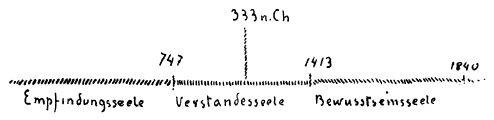
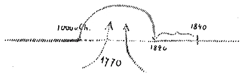
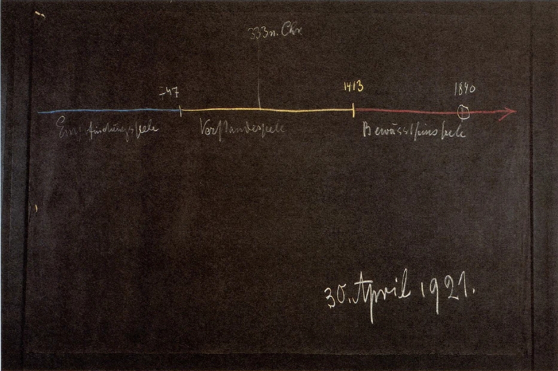
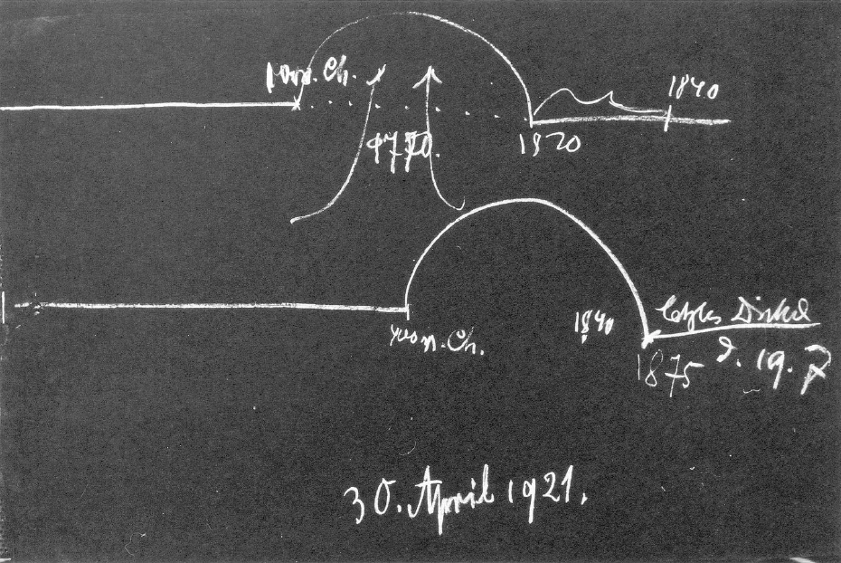

[ 1 ] ^9t9h26

Wir haben im Verlaufe dieser Betrachtungen gesehen, welch wichtiger Punkt in der Menschheitsentwickelung des Abendlandes die Mitte des 19. Jahrhunderts ist. Wir haben aufmerksam darauf gemacht, wie in dieser Mitte des 19. Jahrhunderts gewissermaßen der Höhepunkt materialistischer Gesinnung, materialistischer Lebensansicht vorhanden ist; aber wir haben auch aufmerksam darauf machen müssen, wie das, was sich da im Menschen seit dem Beginn des 15. Jahrhunderts herausgerungen hat, eigentlich ein Geistiges ist, so daß man sagen könnte: Das war das Charakteristische in diesem Entwickelungspunkt neuzeitlicher Menschheitsentwickelung, daß der Mensch, indem er am geistigsten geworden ist, diese Geistigkeit nicht erfassen konnte, sondern sich nur erfüllte mit materialistischem Denken, materialistischem Fühlen und auch materialistischem Wollen und Tun. Und die Gegenwart steht ja noch immer unter den Nachwirkungen desjenigen, was sich da, ich möchte sagen, von vielen Menschen unvermerkt vollzogen hat und was ja innerhalb der Menschheitsentwickelung einen Höhepunkt erreicht hat. Wozu war dieser Höhepunkt da? - Er war da, weil ja ein Entscheidendes geschehen sollte in bezug auf das Erringen der Bewußtseinsseelenstufe durch die neuzeitliche Menschheit. ^wq1y5r

[ 2 ] ^ob0pb5

Fassen wir einmal ins Auge, wie sich die Menschheitsentwickelung abgespielt hat, dann müssen wir sagen: Wir haben, wenn wir beginnen beim dritten nachatlantischen Zeitraum, etwa bis, sagen wit, zum Jahre 747 (siehe Zeichnung) vor dem Mysterium von Golgatha, was wir als die Entwickelung der Empfindungsseele in der Menschheit bezeichnen können. Es beginnt dann das Zeitalter der Verstandes- oder Gemütsseele, die bis zum Jahre 1413 etwa dauert, die ihren Höhepunkt erreicht in demjenigen Zeitpunkt, von dem die äußere Geschichte ja wenig mitteilt, der aber ins Auge gefaßt werden muß, wenn man überhaupt die europäische Entwickelung begreifen will. Es ist ungefähr der Zeitpunkt 333 nach Christus. Seit dem Jahre 1413 haben wir es zu tun mit der Entwickelung der Bewußtseinsseele, in welcher Entwickelung wir noch darinnenstehen, die eben ein entscheidendes Ereignis erlebte um das Jahr 1850, besser gesagt 1840. ^3xdet8

 ^9ydy29

[ 3 ] ^0se4m9

Es war um dieses Jahr 1840 die Sache so, daß wenn wir die Menschheit als Ganzes auffassen - wie sich die einzelnen Nationen dazumal verhielten, das werden wir nachher gleich zu betrachten beginnen -, wir sagen können, daß, insofern wir auf repräsentative Persönlichkeiten der Nationen hinschauen, sie in diesem Jahre 1840 vor dem Punkte standen, wo der Verstand schon am meisten zum Schattenwesen geworden war. Der Verstand hatte seinen Schattencharakter angenommen. Ich habe Ihnen ja gestern diesen Schattencharakter des Verstandes zu charakterisieren versucht. So weit war die Menschheit der zivilisierten Erde gediehen, daß von da ab die Möglichkeit bestand, aus der allgemeinen Kultur heraus ohne Einweihung die Empfindung zu bekommen: Wir haben den Verstand, der Verstand hat sich heraufentwickelt, aber dieser Verstand hat für sich selber keinen Inhalt mehr. Wir haben Begriffe, aber diese Begriffe sind leer, wir müssen sie mit etwas erfüllen. — Das ist der Ruf, der sozusagen durch die Menschheit, allerdings noch dunkel und unvernehmlich, geht. Aber in den tiefen, untergründigen, unterbewußten Sehnsuchten der Menschen lebt der Ruf, eine Erfüllung zu bekommen für das Schattenhafte des Verstandesdenkens. Es ist eben der Ruf, der nach Geisteswissenschaft geht. Wir können aber diesen Ruf auch konkret fassen. ^wrqvcy

[ 4 ] ^4ht0kc

Es war einfach in dieser Mitte des 19. Jahrhunderts die menschliche Organisation, in deren physischem Teil ja dieser schattenhafte Verstand geübt wird, so weit, daß sie den Verstand, den leeren schattenhaften Verstand gut ausbilden konnte. Nun gehörte in diesen schattenhaften Verstand etwas hinein, er mußte mit etwas erfüllt werden. Erfüllt werden kann er nur, wenn der Mensch sich bewußt wird: Ich muß etwas aufnehmen von dem, was sich mir auf der Erde selbst nicht darbietet, was auf der Erde selber nicht lebt, was ich nicht erfahren kann in dem Leben zwischen der Geburt und dem Tode. Ich muß wirklich in diesen Verstand herein etwas aufnehmen, was zwar ausgelöscht wurde, als ich aus geistigen Seelenwelten mit den Ergebnissen meiner früheren Erdenleben in eine physische Körperlichkeit herunterstieg, etwas, was zwar verdunkelt worden ist, was aber ruht in den Tiefen meiner Seele. Ich muß es von da heraufbringen, ich muß mich auf etwas besinnen, was in mir ist einfach dadurch, daß ich ein Mensch des 19. Jahrhunderts bin. ^v14ks7

[ 5 ] ^mp8mf2

Es war vorher nicht so, daß die Menschen in derselben Weise hätten Selbstbesinnung üben können. Daher mußten sie erst ihre Menschheit so weit bringen, daß der physische Leib eben sich immer reifer und reifer machte, um den schattenhaften Verstand vollständig auszubilden, vollständig zu üben. Jetzt waren die physischen Leiber, wenigstens bei den vorgerücktesten Menschen, so weit, daß man hätte sagen können, besser gesagt, man kann es seither: Ich will mich darauf besinnen, was suche ich aus den Untergründen meines Seelenlebens heraufzubringen, um in diesen schattenhaften Verstand etwas hineinzugießen? - Dadurch wäre dann dieser schattenhafte Verstand von etwas durchgossen worden, und dadurch hätte aufgedämmert die Bewußtseinsseele. Es war also gewissermaßen in diesem Zeitpunkt die Gelegenheit dazu gegeben, daß die Bewußtseinsseele hätte aufdämmern können. ^ssj0et

[ 6 ] ^b1bb0f

Nun werden Sie sagen: Ja, aber schon die ganze Zeit vorher, seit dem Jahre 1413, war ja das Zeitalter der Bewußtseinsseele. — Gewiß, aber es ist eben eine vorbereitende Entwickelung zunächst gewesen, und Sie brauchen nur zu bedenken, welche Grundbedingungen zu einer solchen Vorbereitung gerade in diesem Zeitalter gegenüber allen früheren Zeitaltern vorhanden waren. In dieses Zeitalter fällt ja zum Beispiel die Entdeckung der Buchdruckerkunst, die Ausbreitung der Schrift. Die Menschen nehmen seit dem 15. Jahrhundert dutch die Buchdruckerkunst und durch die Schrift nach und nach eine ganze Menge von geistigem Inhalt auf. Aber sie nehmen ihn eben äußerlich auf; und das Wesentliche dieses Zeitalters ist ja, daß eine ungeheure Summe von geistigem Inhalt äußerlich aufgenommen worden ist. Die Völker der zivilisierten Erde haben ja äußerlich etwas aufgenommen, was sie früher eigentlich in ihren großen Massen nur durch die hörbare Sprache haben aufnehmen können. Im Zeitalter der Verstandesentwickelung war es so, und im Zeitalter der Empfindungsseele war es erst recht so, daß im Grunde genommen alle Verbreitung der Bildung auf dem mündlichen Sprechen beruht hat. Durch die Sprache klingt noch etwas durch von GeistigSeelischem. In den Worten lebte besonders in früheren Zeiten durchaus das, was man nennen kann den «Genius der Sprache». Das hörte auf, als in abstrakter Form, durch Schrift und Druck, der Inhalt der menschlichen Bildung aufgenommen wurde. Das Gedruckte und Geschriebene hat ja die Eigentümlichkeit, daß es in einer gewissen Weise das auslöscht, was der Mensch durch die Geburt mitbekommt aus seinem überirdischen Dasein. ^ibji51

[ 7 ] ^h4o2n1

Selbstverständlich soll das nicht heißen, daß Sie nun aufhören sollen zu lesen oder zu schreiben, sondern es soll heißen, daß eine stärkere Kraft heute notwendig ist, um das, was in der menschlichen Wesenheit unten liegt, heraufzuheben. Aber diese stärkere Kraft muß auch notwendig erlangt werden. Wir müssen auf Selbstbesinnung kommen, trotzdem wir lesen und schreiben, wir müssen eben diese stärkere Kraft entwickeln gegenüber der früheren. Das ist die Aufgabe im Zeitalter der Entwickelung der Bewußtseinsseele. ^3fkl4g

[ 8 ] ^ht2gfw

Bevor wir uns nun ein wenig ansehen können, wie ja nun in einer gewissen Weise doch begonnen hat das Herunterwirken der geistigen Welt in die physisch-sinnliche Welt herein, wollen wir uns einmal heute die Frage vorlegen: Wie haben denn eigentlich die Nationen der neueren Zivilisation diesen Zeitpunkt von 1840 angetroffen? ^w70s9z

[ 9 ] ^tf549p

Wir wissen aus früheren Vorträgen, daß das charakteristische Volk für die Ausbildung der Bewußtseinsseele, also für dasjenige, worauf es gerade in diesem Zeitalter ankommt, das angelsächsische Volk ist. Dieses angelsächsische Volk ist das Volk, das durch seine ganze Organisation daraufhin angelegt ist, die Bewußtseinsseele besonders auszubilden. Darauf beruht ja die besondere Stellung des angelsächsischen Volkes, des anglo-amerikanischen Volkes in unserem Zeitalter, daß es für die Ausbildung der Bewußtseinsseele besonders veranlagt ist. Aber jetzt fragen wir uns einmal rein äußerlich: Wie ist denn eigentlich dieses angelsächsische Volk angekommen an diesem Zeitpunkte, der der wichtigste ist in der modernen Kulturentwickelung? ^fikmni

[ 10 ] ^1hd23s

Man kann sagen: Gerade das angelsächsische Volk hat lange Zeit fortgelebt in einem Zustande, den man vielleicht am besten dadurch bezeichnen kann - selbstverständlich mit den entsprechenden Varianten und Metamorphosen -, daß man sagt: Es haben sich in bezug auf die innere Seelenverfassung innerhalb des angelsächsischen Volkes bis ins 19. Jahrhundert herein diejenigen inneren Impulse erhalten, welche im Griechentum schon anderen Formen gewichen sind. — Man könnte sagen, im 11. und 10. vorchristlichen Jahrhundert ist das Eigentümliche, daß da die Nationen das, was durchgemacht wird, in verschiedenen Zeiten durchmachen, daß sich gewissermaßen die Zeiten übereinanderschieben. Nur bemerkt man solche Dinge außerordentlich schwer aus dem Grunde, weil ja natürlich im 19. Jahrhundert schon alles mögliche da war - Schreiben, Lesen -, weil andere Daseinsbedingungen da waren in Schottland und in England, als sie vorhanden waren in der Homerischen Zeit. ^27xeph

[ 11 ] ^7jmi0d

Aber dennoch, wenn man die Seelenverfassung des Volkes eben als Nation ins Auge faßt, so ist das so, daß geblieben ist diese Seelenverfassung der Homerischen Zeit, die in Griechenland im tragischen Zeitalter überwunden worden ist, die in den Sophoklismus übergegangen ist. Diese Zeit hat sich in der angelsächsischen Welt erhalten bis ins 19. Jahrhundert herein, eine Art patriarchalischer Lebensauffassung, eine Art patriarchalischen Lebens. Insbesondere hat sich ausgebreitet dieses patriarchalische Leben von der Seelenverfassung in Schottland herein, und es ist aus diesem Grunde, warum gerade auf das angelsächsische Volk nicht etwa dasjenige gewirkt hat, was von den Einweihungsstätten Irlands ausgegangen ist. Das hat ja, wie wir bei anderen Gelegenheiten gehört haben, hauptsächlich im kontinentalen Europa gewirkt. Auf der britischen Insel selber hat hauptsächlich dasjenige gewirkt, was vom Norden, von Schottland herunter auch an Einweihungswahrheiten gekommen ist, und diese Einweihungswahrheiten haben dann das andere durchdrungen. Aber es ist etwas in der ganzen Auffassung der menschlichen Persönlichkeit, das gewissermaßen uralt geblieben ist. Und das wirkt noch nach, das wirkt nach selbst in der Artund Weise, wie, sagen wir, das Verhältnis von Whigs und Tories in dem englischen Parlamente sich entfaltete. Es ist ja so, daß wir es ursprünglich nicht etwa zu tun haben mit dem Gegensatz von liberal und konservativ, sondern wir haben es zu tun mit zwei Schattierungen in politischen Ansichten, für die man heute eigentlich gar keine Empfindungen mehr hat. ^x00iwm

[ 12 ] ^d5w8ry

Die Whigs sind ja im wesentlichen eigentlich die Fortpflanzung desjenigen, was man nennen könnte, eine von allgemeiner Menschenliebe getragene, in Schottland aufgegangene Menschheitsströmung. Die Tories sind ursprünglich katholisierende, der Sage nach, die aber einen gewissen historischen Hintergrund hat, sogar katholisierende Pferdediebe aus Irland gewesen. Dieser Gegensatz, der sich dann ausdrückt in dem besonderen politischen Wollen, der spiegelt ein gewisses patriarchalisches Sein; und dieses patriarchalische Sein, das hat gewisse elementare Kräfte fortbehalten. Man kann das sehen aus der Art und Weise, wie die Besitzer größerer Ländereien zu denjenigen Menschen gestanden haben, die als Untertanen auf diesen Ländereien gesessen haben. Bis ins 19. Jahr- . hundert geht ja dieses Untertanenverhältnis; bis ins 19. Jahrhundert war es ja so, daß im Grunde genommen niemand ins Parlament gewählt wurde, der nicht durch ein solches grundbesitzerliches Verhältnis eine gewisse Macht hatte. Man muß nur bedenken, was das bedeutet. Solche Dinge wiegt man nicht in der richtigen Weise. Man muß nur bedenken, was es bedeutet, daß zum Beispiel erst im Jahre 1820 im englischen Parlament das Gesetz abgeschafft wurde, wonach man einen Menschen, der eine Uhr gestohlen oder der gewildert hat, mit dem Tode bestrafte. Bis dahin war es durchaus gesetzliche Bestimmung, daß jemand, der eine Taschenuhr gestohlen hatte oder der Wilddieb war, mit dem Tode bestraft wurde. Das zeigt ja durchaus, wie geblieben waren gewisse alte elementare Zustände. Heute sieht der Mensch das, was in seiner unmittelbaren Gegenwart lebt, und er verlängert sozusagen die wesentlichsten Grundbestandteile der Zivilisation der Gegenwart nach rückwärts und sieht nicht, wie kurz eigentlich die Zeit ist, in der für die wichtigsten europäischen Gegenden diese Dinge sich aus ganz elementaren Zuständen erst herausgebildet haben. ^y3x8ga

[ 13 ] ^071pgi

So können wir sagen, daß sich da diese patriarchalischen Zustände als der Grund und Boden desjenigen erhalten haben, in was dann einschlug das Allerallermodernste, das nicht zu denken ist in der sozialen Struktur ohne die Entwickelung der Bewußtseinsseele. Bedenken Sie nur schon im 18. Jahrhundert den ganzen Umschwung, der in der sozialen Struktur eingetreten war durch die technische Metamorphose in bezug auf die Textilindustrie und so weiter. Bedenken Sie, wie da das maschinelle Element, das technische Element hineingezogen ist in dieses Patriarchalische, und bilden Sie sich eine anschauliche Vorstellung, wie auf dem Grunde des Patriarchalischen, dieses gutsherrlichen Verhältnisses zu den Untertanen, sich da hineinschiebt die Entstehung des modernen Proletariats durch die Umgestaltung der Textilindustrie. Denken Sie sich, was da für ein Chaos sich durcheinanderschiebt, wie sich die Städte herausbilden aus den alten Landschaften, wie das Patriarchalische, ich möchte sagen, mit einem kühnen Sprung hineinspringt in das moderne sozialistische, proletarische Leben. ^oq7b05

[ 14 ] ^7pyx9y

Man kann geradezu, wenn man es graphisch darstellen will, sagen, es entwickelt sich dieses Leben in der Form, wie es in Griechenland bis etwa um das Jahr 1000 vor Christus war (siehe Zeichnung). Dann macht es einen kühnen Sprung, und wir stehen plötzlich im Jahr 1820. Innerlich ist das Leben im Jahre 1000 vor Christus stehengeblieben; aber äußerlich sind wir im 18. Jahrhundert, sagen wit 1770 (Pfeile). Da wälzt sich hinein alles dasjenige, was dann im modernen Leben, ja in der Jetztzeit dasteht. Aber den Anschluß, die Notwendigkeit findet dieses englische Leben erst 1820 (siehe Zeichnung); da sind ja solche Dinge überhaupt erst spruchreif geworden, wie die Abschaffung der Todesstrafe für einen kleinlichen Diebstahl und dergleichen. So kann man sagen: Es ist durchaus hier zusammengeflossen ein Uraltes mit dem Allerallermodernsten; und so trifft dann die Weiterentwickelung hinein in das Jahr 1840. ^7prx4m

 ^w6ze7c

[ 15 ] ^2psrc9

Was hatte nun in diesem Zeitalter hier, in der ersten Hälfte des 19. Jahrhunderts, gerade bei dem anglo-amerikanischen Volke zu geschehen? Wir müssen bedenken, daß erst nach dem Jahre 1820, sogar erst nach 1830 Gesetze notwendig geworden sind in England, wodurch Kinder unter zwölf Jahren nicht zu längerer Fabrikarbeit angehalten werden durften als zu achtstündiger, Kinder von dreizehn bis zu achtzehn Jahren höchstens zu zwölfstündiger Tagesarbeit. Bitte, vergleichen Sie das mit den heutigen Verhältnissen! Bedenken Sie, was heute als Achtstundentag von der breiten Masse des Proletariats gefordert wird! Im Jahre 1820 noch wurden in England Knaben länger als acht Stunden beschäftigt in Bergwerken und Fabriken, und erst in diesem Jahre wurde für diese der Achtstundentag angesetzt; aber für Kinder vom zwölften bis achtzehnten Lebensjahre herrschte noch der Zwölfstundentag. ^kx1qp3

[ 16 ] ^a5kq8s

Man muß diese Dinge durchaus ins Auge fassen, wenn man sehen will, was da eigentlich zusammengestoßen ist, und im Grunde genommen könnte man sagen, erst im zweiten Drittel des 19. Jahrhunderts wandte sich England heraus aus dem Patriarchalischen und sah sich genötigt, zu rechnen mit dem, was sich langsam durch die Maschinentechnik hineingeschoben hat in dieses Alte. So traf dasjenige Volk, welches vorzugsweise berufen ist, die Bewußtseinsseele sozusagen auszubilden, so traf dieses Volk der Zeitpunkt von 1840. ^cllqwa

[ 17 ] ^xaxgag

Nehmen Sie jetzt andere Völker der modernen Zivilisation; nehmen Sie dasjenige, was vom lateinisch-romanischen Elemente geblieben ist, was also das Romanisch-Lateinische vom vierten nachatlantischen Zeitraum herübergetragen hat, was gewissermaßen als Erbgut herübergebracht hat die alte Verstandesseelenkultur im Zeitalter der Bewußtseinsseele. Seine Kulmination, seinen Höhepunkt hat ja das, was da noch vorhanden war an Leben der Verstandesseele, in der Französischen Revolution am Ende des 18. Jahrhunderts gefunden. Wir sehen, wie da plötzlich in äußerster Abstraktion auftauchen die Ideale von «Freiheit», «Gleichheit», «Brüderlichkeit». Wir sehen, wie sie ergriffen werden von solchen Skeptikern wie Voltaire, von solchen Enthusiasten wie Rousseau, wir sehen, wie sie überhaupt auftauchen aus der breiten Masse des Volkes; wir sehen, wie die Abstraktion, die vollberechtigt ist auf diesem Gebiete, hier eingreift in das Gefüge der sozialen Struktur - eine ganz andere Entwickelung als drüben in England. In England die Überreste des altgermanischen patriatchalischen Lebens, durchsetzt von dem, was die moderne Technik, was das moderne materialistische wissenschaftliche Leben in die soziale Struktur hineinsenden konnte, in Frankreich alles Überlieferung, alles Tradition. Man möchte sagen: Mit demselben Duktus, mit dem einstmals ein Brutus oder Cäsar in Rom in den verschiedensten Schattierungen gewirkt haben, mit demselben Duktus wird jetzt die Französische Revolution in Szene gesetzt. So taucht wiederum auf in abstrakten Formen das, was Freiheit, Gleichheit und Brüderlichkeit ist. Und nicht von außen herein wird da zersprengt, wie in England, dasjenige, was als altes patriarchalisches Element vorhanden ist, sondern das romanisch-juristische Festsetzen, das Festhalten an dem alten Eigentumsbegriff, an den Grundbesitzerverhältnissen und so weiter, an den Erbschaftsverhältnissen namentlich, das, was römisch-juristisch festgesetzt ist, wird von der Abstraktion her zersetzt, wird von der Abstraktion her auseinandergetrieben. ^03cg5r

[ 18 ] ^aouri5

Man braucht nur zu denken, welchen ungeheuren Einschnitt in das ganze europäische Leben die Französische Revolution brachte. Man braucht ja nur daran zu erinnern, daß vor der Französischen Revolution diejenigen, die, ich möchte sagen, herausgesondert waren aus der Masse des Volkes, auch Rechtsvorteile hatten. Nur gewisse Leute konnten, sagen wir, zu gewissen Staatsstellungen kommen. Da Breschen hineinzuschlagen, das zu durchlöchern, das war dasjenige, was aus der Abstraktion heraus, aus dem schattenhaften Verstande heraus die Französische Revolution forderte. Aber sie trug eben durchaus in sich das Gepräge des schattenhaften Verstandes, der Abstraktion, und es blieb im Grunde genommen das, was da gefordert wurde, eine Art Ideologie. Daher, könnte man sagen, schlägt dasjenige, was schattenhafter Verstand ist, sogleich um in sein Gegenteil. ^t6lebc

[ 19 ] ^v008rk

Wir sehen dann den Napoleonismus und wir sehen das staatlich-soziale Experimentieren im Laufe des 19. Jahrhunderts. Die erste Hälfte des 19. Jahrhunderts ist ja in Frankreich ein Experimentieren ohne Ziel. Wie sind die Ereignisse, durch welche so ein Louis-Philippe zum Beispiel König von Frankreich wird und dergleichen, wie wird da experimentiert? — Es wird so experimentiert, daß man sieht, der schattenhafte Verstand vermag nicht wirklich in die realen Verhältnisse einzugreifen. Es bleibt alles ungetan im Grunde genommen, es bleibt alles unvollendet, es bleibt alles Erbschaft des alten Romanismus. Man könnte sagen: Heute ist noch immer nicht das Verhältnis, das die Französische Revolution im Abstrakten ganz klar hatte, das Verhältnis, sagen wir zur katholischen Kirche, in der äußeren konkreten Wirklichkeit in Frankreich geklärt. Und wie unklar war es von Zeit zu Zeit immer wiederum im Laufe des 19. Jahrhunderts. Der abstrakte Verstand hatte sich zu einer gewissen Höhe heraufgerungen in der Revolution, und dann ein Experimentieren, ein Nicht-Gewachsensein den äußeren Verhältnissen. Und so traf diese Nation das Jahr 1840. ^lezrte

[ 20 ] ^bkusq6

Wir könnten auch andere Nationen in Betracht ziehen. Sehen wit zum Beispiel Italien an, das noch, ich möchte sagen, ein Stück Empfindungsseele mitbehielt beim Durchgang durch die Verstandeskultur, das dieses Stück Empfindungsseele in die neuere Zeit heraufbrachte, und es daher nicht bis zu den abstrakten Begriffen von Freiheit, Gleichheit und Brüderlichkeit brachte, bis zu denen man es in der Französischen Revolution gebracht hatte, das aber doch den Übergang suchte von einem gewissen alten Gruppenbewußtsein der Menschen zu dem individuellen Menschheitsbewußtsein. Italien traf das Jahr 1840 so, daß man sagen kann: Was sich da in Italien heraufarbeiten will an individuellem Menschheitsbewußtsein, wird eigentlich immerfort niedergehalten von demjenigen, was.nun im übrigen Europa ist. Wir sehen ja, wie die Habsburgische Tyrannei in einer furchtbaren Weise lastet gerade auf dem, was sich in Italien an individuellem Menschheitsbewußtsein heraufarbeiten will. Wir sehen ja jenen merkwürdigen Kongreß von Verona, der in den zwanziger Jahren des 19. Jahrhunderts eigentlich ausmachen wollte, wie man sich auflehnen kann gegen den ganzen Sinn der modernen Zivilisation. Wir sehen, wie da von Rußland, Österreich ausging, ich möchte sagen eine Art von Verschwörung gegen dasjenige, was das moderne Menschheitsbewußtsein bringen sollte. Es ist kaum etwas so interessant, wie dieser Veroneser Kongreß, der im Grunde genommen die Frage beantworten wollte: Wie schlägt man alles das tot, was sich als modernes Menschheitsbewußtsein heraufentwickeln will? ^vsyzli

[ 21 ] ^lilj8a

Und dann sehen wir, wie nun die Menschheit im übrigen Europa ringt, so ringt, daß in Mitteleuropa ja überhaupt nur immer ein kleiner Teil der Menschheit sich heraufringen kann zu einem gewissen Bewußtsein, sozusagen in einer gewissen Weise erlebt, daß jetzt das Ich eintreten soll in die Bewußtseinsseele. Wir sehen, wie das in einer gewissen geistigen Höhe erreicht werden soll. Wir sehen es in jener merkwürdigen Kulturhöhe des Goetheschen Zeitalters, in der ein Fichte gewirkt hat, wir sehen, wie sich da das Ich vordrücken will zur Bewußtseinsseele herein. Aber wir sehen, wie die ganze GoetheKultur etwas bleibt, was im Grunde genommen nur bei ganz wenigen lebt. Ich glaube, die Menschen studieren allzuwenig, was selbst noch in der jüngsten Vergangenheit war. Die Menschen denken zum Beispiel einfach: Goethe hat gelebt von 1749 bis 1832; er hat den «Faust» und alles Mögliche geschrieben. - Das ist das, was man weiß von Goethe, und das war seither da. ^0anb0v

[ 22 ] ^c1w29k

Bis zum Jahre 1862, also dreißig Jahre nach Goethes Tode, war ja überhaupt für die wenigsten Menschen ein Exemplar von Goethe zu beschaffen. Goethe war nicht frei; nur ganz wenige Menschen besaßen irgendwie ein Exemplar von Goethes Schriften. Es war also dasjenige, was Goetheanismus ist, etwas, was ganz wenigen eigen geworden war. Erst in den sechziger Jahren konnte eine größere Anzahl von Menschen überhaupt Kunde erlangen von dem, was in Goethe lebte, und da war im Grunde genommen schon das Verständnis, die Verständnisfähigkeit wiederum hinuntergeschwunden. Es ist zu einem richtigen Verständnis Goethes im Grunde genommen gar nicht gekommen. Und das letzte Drittel des 19. Jahrhunderts war überhaupt gar nicht geeignet, ein rechtes Verständnis für Goethe hervorzurufen. ^mut71x

[ 23 ] ^y93h4x

Ich habe es ja öfters erwähnt, wie Herman Grimm in den siebziger Jahren zunächst seine «Vorlesungen über Goethe» an der Berliner Universität gehalten hat. Das war ein Ereignis, und das Buch, das vorhanden ist als der «Goethe» Herman Grimms, ist eine bedeutende Erscheinung innerhalb der mitteleuropäischen Literatur. Aber wenn man jetzt dieses Buch nimmt, was bedeutet es denn? Ja, alle Gestalten, die mit Goethe im Zusammenhange lebten, kommen darinnen vor, aber sie haben immer nur Ausdehnungen nach zwei Dimensionen; sie sind Schattenfiguren. Alles das, was da Porträts sind, sind Schattenfiguren. Goethe selber ist bei Herman Grimm eine zweidimensionale Wesenheit. Es ist gar nicht der Goethe selber. Ich will gar nicht sprechen von dem Goethe, den man in Weimar in den Nachmittags-Kaffeekränzchen den «dicken Geheimrat mit dem Doppelkinn» nannte; von dem will ich gar nicht sprechen; aber er hat überhaupt keine «Dicke» in Herman Grimms «Goethe», sondern er ist dort ein zweidimensionales Wesen, er ist der Schatten, der an eine Wand hingeworfen ist. Und ebenso all die anderen, die da auftreten; Herder, ein Schatten, der an eine Wand hingemalt ist. Etwas mehr Greifbarkeit tritt uns gerade bei Herman Grimm bei denjenigen Persönlichkeiten entgegen, die aus dem Volke heraufsteigen zu Goethe, wie Friederike von Sesenheim, die so wunderschön da geschildert ist, oder wie die Frankfurterin Lili Schönemann, also gerade dasjenige, was heraufsteigt nun nicht aus der Atmosphäre, in der Goethe eigentlich geistig lebte. Das ist mit einer gewissen «Dicke» geschildert. Aber so ein Jacobi, so eine Gestalt wie Lavater - alles Schattenbilder an der Wand. Man kommt nicht in das eigentliche Wesen der Sachen hinein, man sieht, ich möchte sagen, handgreiflich, wie die Abstraktion wirkt. Die Abstraktion kann ja auch durchaus anmutig sein, was das Herman Grimmsche Buch durchaus ist; aber schattenhaft ist das Ganze. Es sind Silhouetten, zweidimensionale Wesenheiten, die uns da entgegentreten. ^7j8x7a

[ 24 ] ^5osdjh

Und das konnte auch nicht anders sein. Denn es ist wirklich so: Deutscher durfte man sich ja in Deutschland überhaupt nicht nennen in der Zeit, in der zum Beispiel Herman Grimm noch jung war. Die Art und Weise, wie man von Deutschen gesprochen hat in der ersten Hälfte des 19. Jahrhunderts, die wird ja insbesondere in der Gegenwart mißverstanden. Wie «gruselt» es die Leute des Westens, die Ententeleute, wenn sie heute anfangen Fichtes «Reden an die deutsche Nation» zu lesen und da finden: «Ich spreche zu Deutschen schlechtweg, von Deutschen schlechtweg.» Geradeso wird das unschuldige Lied «Deutschland, Deutschland über alles», töricht interpretiert, indem ja dieses Lied nichts anderes heißen soll als, man will Deutscher sein, nicht Schwabe, nicht Bayer, nicht Österreicher, nicht Franke, nicht Thüringer. Wie dieses Lied sich nur auf die Deutschen stellt allseitig, so wollte Fichte nur sprechen «zu Deutschen schlechtweg», nicht zu Österreichern, zu Bayern, zu Badensern, zu Württembergern oder zu Franken, oder zu Preußen gar; er wollte «zu Deutschen» sprechen. Das versteht man natürlich zum Beispiel in einem Lande nicht, wo es längst selbstverständlich geworden ist, daß man sich einen Franzosen nennen kann. In Deutschland wurde man in gewissen Zeiten eingesperrt, wenn man sich einen Deutschen nannte. Man konnte sich einen Österreicher, einen Schwaben, einen Bayer nennen; aber Deutscher sich zu nennen, war hochverräterisch. Wer in Bayern sich einen Deutschen nannte, der bekundete damit, daß er nicht nur hinaufschauen wollte zum bayerischen Throne, der seine Grenze da und dort hat, sondern daß er hinausschauen wollte über die Grenze von Bayern hinaus. Das war aber Hochverrat! Man durfte sich nicht einen Deutschen nennen. Daß diese Dinge, die von Deutschen und über Deutschland gesagt worden sind, eben Bezug haben auf dieses Zusammendrängen desjenigen, was deutsch ist, das wird heute gar nicht verstanden, und man stellt das törichte Zeug hin, als wenn so etwas wie das Hoffmannsche Lied sich darauf beziehen würde, daß Deutschland herrschen soll über alle Nationen der Welt; während es nichts anderes heißen soll als: nicht Schwaben, nicht Österreich, nicht Baden über alles in der Welt, sondern Deutschland über alles in der Welt, gerade wie der Franzose sagt: Frankreich über alles in der Welt. Aber gerade da in Mitteleuropa war dieses Eigentümliche, daß man im Grunde genommen eine Stammeskultur hatte. Sie können ja heute noch diese Stammeskultur in Deutschland überall sehen. Der Württemberger ist verschieden vom Franken, er ist verschieden bis in die Begriffs- und Wortformen, bis in die Gedankenformen hinein, die sich in der Literatur ausbreiten. Es ist ja auch durchaus, sagen wir, ein grandioser Unterschied, wenn Sie einen Franken nehmen, wie zum Beispiel den klotzigen Michael Conrad - wenn ich die neuere Literatur hernehme -, und ihn vergleichen mit irgend etwas, was etwa von einem Württemberger, also im Nachbarlande, in derselben Zeit geschrieben worden ist. Bis in die ganze Konfiguration der Gedanken spielt ja das bis in die neueste Zeit hinein. Aber all das, was sich da ausbreitet, was da in den Stammeseigentümlichkeiten lebt, das bleibt ja unberührt von dem, was nun eigentlich erreicht wird von den repräsentativen Trägern der Nationen. Man hat doch, sagen wir, in dem Gebiete, das man Deutschland nennt, so etwas erreicht, wie den Goetheanismus mit alledem, was dazugehört. Aber das ist ja nur von wenigen intellektuellen Menschen erreicht worden, davon ist die große Masse der Menschheit gar nicht berührt. Die große Masse der Menschheit bleibt ungefähr auf dem Standpunkte, der eigenommen worden ist in Mitteleuropa etwa um das Jahr 300 oder 400 nach Christus. Geradeso wie man im angelsächsischen Volke stehengeblieben ist bei dem Jahre 1000 vor Christus, so bleibt man in Mitteleuropa stehen bei dem Jahre 400 nach Christus. Das bitte ich nicht so zu nehmen, daß jetzt wiederum ein furchtbarer Hochmut aufkommen könnte, indem man sagt: Die Angelsachsen, die sind im homerischen Zeitalter zurückgeblieben, und wir waren schon im Jahre 400 nach Christus! - So sind die Dinge nicht zu bewerten, sondern es wird eben nur auf gewisse Eigentümlichkeiten hingewiesen. ^e4igg4

[ 25 ] ^xiqbbg

Nun ergeben aber wiederum die geographischen Verhältnisse, daß dieser Stand der allgemeinen Seelenbildung in Deutschland viel länger dauert als in England drüben. England hat in sein altes patriarchalisches Leben schnell hineinfließen lassen müssen dasjenige, was zunächst bei ihm auf dem Gebiete der Textilindustrie, aber später auch auf dem Gebiete anderer Techniken aus dem modernen materialistisch-wissenschaftlich-technischen Leben die soziale Struktur gestaltet hat. Was deutsches Gebiet war, und was überhaupt Mitteleuropa war, das hat sich dem zunächst entgegengestellt, das hat die alten Eigentümlichkeiten viel länger behalten, bis, ich möchte sagen, zu einem Zeitpunkte, wo schon über die ganze Welt in voller Geltung war, was durch die moderne Technik gekommen ist. England hat noch den Anschluß gefunden mit der Umgestaltung der sozialen Struktur bis zu einem gewissen Grade in der ersten Hälfte des 19. Jahrhunderts. Das alles, was da errungen worden ist, das ging durchaus vorüber an Mitteleuropa. ^y8fzk1

[ 26 ] ^1973of

Mitteleuropa nahm zwar etwas von abstrakten Revolutionsideen auf. Das kam in den vierziger Jahren, in der Mitte des 19. Jahrhunderts, dann in verschiedenen Wogen und Wellen zum Durchbruch; aber es wartete gewissermaßen ab, bis die Technik die ganze Welt erfüllte, und dann trug sich ja das Eigentümliche zu, daß solch ein Mensch - wir könnnten auch andere Repräsentanten nehmen -, der in Deutschland denken gelernt hat vom Hegelismus, wie Karl Marx , dann hinübergegangen ist nach England und dort sich das soziale Leben angeschaut und daraus die sozialistischen Doktrinen gebildet hat. Für diese sozialen Doktrinen war dann am Ende des 19. Jahrhunderts Mitteleuropa reif. Diese sozialen Doktrinen wurden dann von Mitteleuropa angenommen, so daß also, wenn man in einer etwa ähnlichen Weise nun aufzeichnen wollte, was sich in Mitteleuropa entwickelt hat, man sagen müßte: Es ging die Entwickelung elementarer fort, wenn auch durch Schrift und Druck Mannigfaltiges von außen aufgenommen worden ist. Es ging dasjenige, was wie vierhundert Jahre nach Christus war, weiter, machte dann einen Sprung und fand erst im Grunde genommen im letzten Drittel des 19. Jahrhunderts den Anschluß, etwa im Jahre 1875. So daß, während das Jahr 1840 von der angelsächsischen Nation schon mit einer Umwandlung der Verhältnisse angetroffen wird, schon mit der Notwendigkeit, die Bewußtseinsseele aufzunehmen, das deutsche Volk fortträumte, und im Traume erlebte es noch das Jahr 1840 und verschlief dann die Zeit, die da gewesen wäre, um eine Brücke zu bauen zwischen den führenden Persönlichkeiten und dem, was aus der Masse des Volkes als Proletariat aufstieg und was sich dann der sozialistischen Doktrin bemächtigte und eben dadurch einen gewaltsamen, radikalen Zwangsdruck ausübte hin zu der Bewußtseinsseele, etwa von 1875 an. Aber auch dies ist eigentlich nicht bemerkt worden, jedenfalls nicht in irgendwelche Kanäle gebracht worden, und wird ja im Grunde genommen heute noch immer in der schiefsten Weise beurteilt. ^z8zscl

[ 27 ] ^k0xlj9

Um aufall die Anomalien zu kommen, welche da zugrundeliegen, braucht man ja nur daran zu erinnern, daß Oswald Spengler, der das bedeutende Buch geschrieben hat über den «Untergang des Abendlandes», ja auch ein Büchelchen, das, wie ich glaube, schon in 60 000 Exemplaren verbreitet ist, oder vielleicht in noch mehr, geschrieben hat über den Sozialismus. Spengler hat ja ungefähr die Anschauung, daß diese europäische, diese abendländische Zivilisation überhaupt sich ihr Grab gräbt. Wenn das Jahr 2200 geschrieben sein wird, so wird man nach Spengler auf dem Boden der Barbarei leben. Man muß Spengler Recht geben in bezug auf gewisse Seiten seiner Ausführungen; denn wenn die europäische Welt dabei bleibt, sich so weiter entwickeln zu wollen, wie sie es jetzt tut, so wird, wenn das dritte Jahrtausend beginnt, alles barbarisiert sein. In dieser Beziehung hat Spengler vollständig recht; nur sieht Spengler nicht und will nicht sehen, wie aus dem Inneren des Menschen der schattenhafte Verstand zu Imaginationen und damit die ganze Menschheit des Abendlandes zu einer neuen Kultur erhoben werden kann. Diese Belebung der Kultur durch das, was anthroposophische Geisteswissenschaft will, das sieht nämlich ein Mensch wie Oswald Spengler nicht. Aber er hat den Gedanken, der Sozialismus — der richtige Sozialismus, wie er meint, dieser Sozialismus, der wirklich ein soziales Leben herbeiführt -, der müsse noch vor diesem Untergange entstehen; es habe noch die Menschheit des Abendlandes die Mission, den Sozialismus zu verwirklichen. Aber, sagt Oswald Spengler, die einzigen Menschen, die berufen sind, den Sozialismus zu verwirklichen, das sind die Preußen. Daher hat er das Büchelchen geschrieben «Preußentum und Sozialismus». Jeder andere Sozialismus ist nach Spengler falsch, lediglich derjenige, der im Wilhelminischen Zeitalter seine ersten rosigen Strahlen gezeitigt hat, lediglich dieser Sozialismus müsse die Welt erobern; dann werde die Welt den wahren, den richtigen Sozialismus erleben. So spricht heute ein Mensch, den ich zu den genialsten Menschen der Gegenwart zu zählen habe. Es kommt nicht darauf an, die Menschen zu beurteilen nach dem Inhalte dessen, was sie sagen, sondern es kommt darauf an, die Menschen nach ihrer geistigen Kapazität zu beurteilen. Dieser Oswald Spengler, der fünfzehn Wissenschaften beherrscht, ist natürlich «gescheiter als alle die Schreiber, Doktoren, Magister und Pfaffen» und so weiter, und man kann schon sagen, er hat mit seinem Buch über den Untergang des Abendlandes etwas hingestellt, was Berücksichtigung verdient, was ja übrigens auch namentlich in der Jugend Mitteleuropas einen ungeheuer tiefen Eindruck macht. Aber daneben steht die Idee, die ich nunmehr jetzt ausgeführt habe, und Sie sehen, wie heute gerade genialische Menschen zu den ausgefallensten Ideen kommen können. Man ergreift Verstand, der heute wirkt, und der ist schattenhaft. Die Schatten huschen hin, man ist in einem Schatten drinnen, dann huscht man den anderen nach, nichts lebt. Es ist ja auch in der Silhouette, in dem Schattenbild einer Frau, das auf die Wand geworfen wird, ihre Schönheit gar nicht zu erkennen, und so ist es, wenn die Sachen in Schattenbildern betrachtet werden, auch. Das Preußentum im Schattenbilde ist durchaus zu verwechseln mit dem Sozialismus. Wenn eine Frau der Wand den Rücken zuwendet und ihr Schatten auf die Wand fällt, dann kann man die Häßlichste für schön halten; in gleicher Art kann man auch das Preußentum für den Sozialismus halten, wenn der schattenhafte Verstand dasjenige, was die Genialität ist, innerlich durchsetzt. ^lmu17i

[ 28 ] ^q166a9

So muß man heute diese Dinge ansehen. Man darf heute nicht auf die Inhalte gehen, sondern man muß auf die Kapazitäten gehen, das ist das Wichtige. Und so muß man anerkennen, daß so ein Mensch wie Spengler ein genialer Mensch ist, wenn man auch eine große Anzahl seiner Ideen für eine Narretei halten muß. Wir leben in einem Zeitalter, wo ursprüngliche, elementare Urteilsbegründungen auftreten müssen; denn aus gewissen elementaren Untergründen heraus muß zu einem Verständnis der Gegenwart und damit zu Impulsen für Wirklichkeiten für die Zukunft gekommen werden. ^3q7y3b

[ 29 ] ^qv8fxu

Vollkommen verschlafen natürlich hat der Osten dasjenige, was sich im Jahre 1840 ergeben hat. Denken Sie doch nur an die Handvoll Intellektueller in der großen Masse der durch die orthodoxe Religion, namentlich durch den orthodoxen Kultus noch tief im Orientalismus steckenden Angehörigen des russischen Volkes. Und denken Sie an die einschläfernde Wirkung eines Alexanders I., Nikolaus I. und aller derjenigen «I.», die nachgefolgt sind! Was heute gekommen ist, war also dasjenige, was hin wollte nach diesem Punkte, an dem die Bewußtseinsseele ihren Einschlag haben sollte in das europäische Leben. ^tr5sg7

[ 30 ] ^hdkrbd

Davon wollen wir dann morgen weiterreden. ^e92rwf

 ^c4zbfw

 ^y8eku4

