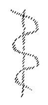
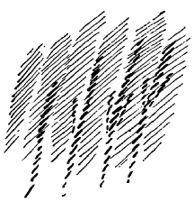
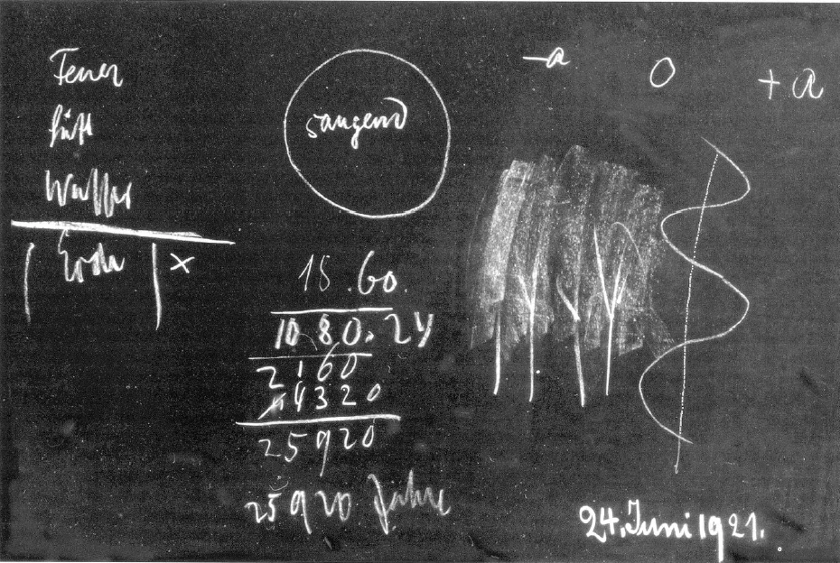
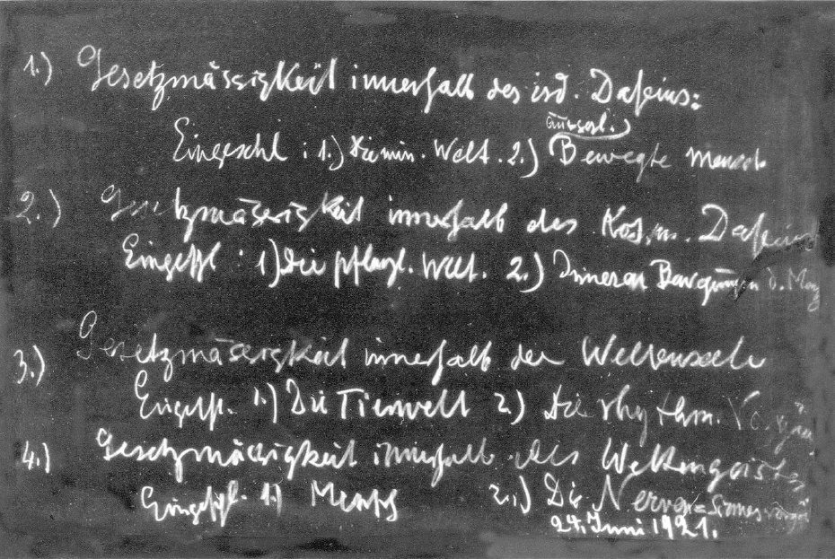

[ 1 ] ^bwwk1a

Nach den historischen Betrachtungen, die wir angestellt haben, werden wir uns heute einiges vor die Seele führen über den gegenwärtigen Menschen, das uns dann die Möglichkeit bieten wird, das Hineingestelltsein dieses gegenwärtigen Menschen in die ganze Zeit, in den nächsten Tagen genauer zu betrachten. Wir müssen uns ja klar darüber sein, daß der Mensch, so wie er als geistiges, seelisches, leibliches Wesen vor uns steht, nach drei verschiedenen Richtungen verschieden in der Welt drinnensteht. Das ergibt sich ja schon, wenn wir den Menschen, ich möchte sagen, rein äußerlich betrachten. Seinem Geiste nach geht er unabhängig von den äußeren Erscheinungen durch die Welt; seiner Seele nach ist er nicht so unabhängig von den äußeren Erscheinungen. Man braucht nur gewisse Zusammenhänge, die durch das Leben hin sichtbar sind, zu betrachten, und man wird finden, wie das eigentlich seelische Leben gewisse Zusammenhänge hat mit der äußeren Welt. Man kann seelisch bedrückt sein, man kann seelisch erheitert sein. Erinnern Sie sich, wie oftmals Sie im Traume sich bedrückt fühlten, wie Sie dieses Bedrücktfühlen, wenn Sie aufwachen, zurückführen müssen auf eine Unregelmäßigkeit im Atmungsrhythmus. Das ist eine grobe Erscheinung, könnte man sagen, und dennoch, immer ist alles seelische Leben nicht ganz ohne einen ähnlichen Zusammenhang mit dem rhythmischen Leben, das wir durchmachen in unserem Atmungsrhythmus, in unserem Blutzirkulationsrhythmus und dem äußeren rhythmischen Leben des ganzen Kosmos. Alles, was in der Seele vorgeht, hängt zusammen mit dem Weltenrhythmus. Wenn wir also auf der einen Seite als geistige Wesen bis zu einem hohen Grade uns unabhängig fühlen von unserer Umwelt, können wir es nicht in bezug auf unser seelisches Leben, denn unser seelisches Leben steht im allgemeinen Weltenrhythmus darinnen. ^bcnbq7

[ 2 ] ^2vvkyx

Noch mehr stehen wir in den allgemeinen Weltenerscheinungen darinnen als leibliches Wesen. Man braucht wiederum zunächst nur von groben Erscheinungen auszugehen. Man ist als leibliches Wesen schwer, man hat ein Gewicht. Andere bloß mineralische Wesenheiten haben auch ein Gewicht. Mineralische Wesen, pflanzliche Wesen, tierische Wesen und der Mensch als leibliches Wesen, sie alle gliedern sich ein in die allgemeine Schwere, und wir müssen sogar in einem gewissen Sinne uns erheben über diese allgemeine Schwere, wenn wir unseren Leib zum physischen Werkzeug des geistigen Lebens machen wollen. Wir haben das ja öfters erwähnt, wenn es auf das bloße physische Gewicht unseres Gehirnes ankäme, so wäre das ja so groß - eintausenddreihundert bis eintausendfünfhundert Gramm -, daß es uns alle Adern, die unter dem Gehirne sind, zerdrücken würde. Aber dieses Gehirn unterliegt dem Archimedischen Prinzip, indem es im Gehirnwasser schwimmt. Es verliert so viel von seinem Gewichte durch das Schwimmen im Gehirnwasser, daß es eigentlich nur zwanzig Gramm wiegt, also nur mit zwanzig Gramm auf die Adern der Gehirnbasis drückt. Sie sehen daraus, daß eigentlich das Gehirn viel mehr nach oben strebt als nach unten. Es widerstrebt der Schwere. Es reißt sich heraus aus der allgemeinen Schwere. Aber es macht dabei nichts anderes als irgendein anderer Körper, den Sie ins Wasser geben, und der ebensoviel von seinem Gewichte verliert, als das Gewicht des verdrängten Wasserkörpers ist. ^4u53zp

[ 3 ] ^kss843

Sie sehen also ein Wechselspiel unseres ganzen leiblichen Wesens mit der äußeren Welt. Und zwar ist es so, daß wir hier nicht nur wie mit dem seelischen Weben in einen Rhythmus eingegliedert sind, sondern daß wir ganz drinnenstehen in diesem äußeren physischen Leben. Wenn wir an einer bestimmten Stelle des Erdbodens stehen, drücken wir auf diese Stelle des Erdbodens; wenn wir weggehen nach einer andern Stelle, drücken wir auf eine andere Stelle des Erdbodens. Wir sind also physische Wesen als leiblicher Mensch wie andere physische Wesen der andern Naturreiche auch. ^4htj5p

[ 4 ] ^r2ysrl

Wir können also sagen: Mit unserem geistigen Menschen sind wir in einer gewissen Weise von der Umwelt unabhängig, mit unserem seelischen Menschen sind wir in den Rhythmus der Welt eingegliedert, mit unserem leiblichen Menschen sind wir in die ganze übrige Welt so eingegliedert, wie wenn wir gar nicht Seele und Geist wären. Diese Unterscheidung müssen wir durchaus ins Auge fassen. Denn wir kommen auch nicht zu einem Verständnisse des höheren Wesens des Menschen, wenn wir nicht diese dreifache Stellung des Menschen zu seiner ganzen Umgebung ins Auge fassen. Wir wollen uns jetzt einmal die Umgebung des Menschen ansehen. In der Umgebung des Menschen haben wir zunächst - ich fasse verschiedenes, das wir seit vielen Monaten betrachtet haben, nur von andern Gesichtspunkten aus, jetzt zusammen - alles dasjenige, was von Naturgesetzen beherrscht wird. Stellen Sie sich einmal das Weltenall vor, von Naturgesetzen beherrscht, eingespannt in diese Naturgesetze die gesamte sichtbare oder sonst durch die Sinne wahrnehmbare Welt. Wir wollen dies zunächst als erste Umwelt des Menschen in Betracht ziehen. ^8x21i8

[ 5 ] ^cyqlpg

Wenn wir diese Welt in Betracht ziehen - eine einfache Überlegung zeigt, daß wir es ja dann nur mit der eigentlichen irdischen Welt zu tun haben. Nur waghalsige und unbegründete Hypothesen der Physiker können davon sprechen, daß denselben Naturgesetzen, die wir hier auf der Erde beobachten um uns herum, etwa auch der außerirdische Kosmos unterliegt. Ich habe Sie öfter darauf aufmerksam gemacht, wie überrascht die Physiker sein würden, wenn sie an die Stelle hinaufkommen könnten, wo die Sonne ist. Die Physiker betrachten ja die Sonne als so etwas wie einen großen Gasofen, allerdings ohne Wände, so ungefähr wie ein brennendes Gas. Man würde dieses brennende Gas nicht finden, wenn man an die Stelle des Kosmos käme, wo die Sonne ist. Man würde an der Stelle des Kosmos, wo die Sonne ist, etwas finden, was allerdings sehr unähnlich ist der Vorstellung der Physiker. Wenn das hier (es wird gezeichnet) den Raum umschließt, den wir uns von der Sonne eingenommen denken, so ist an dieser Stelle nicht nur nichts vorhanden von all den Materien, die wir auf der Erde hier finden, sondern es ist nicht einmal dasjenige vorhanden an dieser Stelle, was wir den leeren Raum nennen. Denken Sie sich einmal zunächst den erfüllten Raum; Sie haben ja, indem Sie hier auf der Erde leben, immer den erfüllten Raum um sich. Ist er nicht von irgendwelchen festen oder flüssigen Substanzen durchsetzt, so ist er durchsetzt von Luft oder mindestens von Wärme, von Licht und so weiter. Kurz, wir haben es stets mit dem erfüllten Raum zu tun. Sie wissen aber, daß man ja auch, wenigstens annähernd, einen leeren Raum herstellen kann, wenn man aus dem Rezipienten der Luftpumpe die Luft auspumpt. ^hawe66

[ 6 ] ^awtuwg

Nun stellen Sie sich vor, wir haben irgendeinen erfüllten Raum; wir wollen ihn mit dem Buchstaben A bezeichnen und ein Plus davorsetzen, + A. Jetzt können wir den Raum immer leerer und leerer machen, da wird das A immer kleiner und kleiner werden; aber der Raum ist erfüllt, deshalb bezeichnen wir das immer noch mit Plus. Wir können — obzwar wir das in der Tat nicht mit irdischen Verhältnissen durchführen können, denn wir können den Raum ja nur annähernd leer machen -, aber wir können uns denken, daß immerhin ein luftleerer Raum vollständig herstellbar wäre. Dann wäre eben in dem Teil des Raumes, der dann leer gemacht ist, nur Raum. Ich will ihn als Null bezeichnen. Er hat Null Inhalt. Nun können wir es aber so machen mit dem Raume, wie Sie es mit Ihrem Portemonnaie machen können. Wenn Sie Ihr Portemonnaie gefüllt haben, können Sie immer mehr und mehr herausnehmen; zuletzt ist einmal Null darinnen. Wenn Sie aber jetzt weiter Geld ausgeben wollen, können Sie aus dem Portemonnaie nichts mehr herausnehmen, wenn schon Null drinnen war, aber Sie können Schulden machen. Da ist noch weniger als Null dann im Portemonnaie drinnen, wenn Sie Schulden haben. So können Sie sich auch den Raum denken nicht nur leer, sondern ich möchte sagen saugend, weniger darinnen als Null, -A. Und von diesem Saugeraum, von diesem Raum, der nicht nur leer ist, sondern der einen Inhalt hat, der das Gegenteil von materieller Erfülltheit ist, von diesem Raum ist der Raum eingenommen, den man sich von der Sonne ausgefüllt zu denken hat. Also die Sonne ist innerlich saugend, nicht drückend wie ein Gas. Sie ist von negativer Materialität erfüllt. ^3m81xf

 ^spu778

[ 7 ] ^uxq512

Das will ich nur als Beispiel anführen, damit Sie sehen, daß man nicht irdische Gesetzmäßigkeit so einfach auf den außerirdischen Kosmos übertragen kann. Da sind ganz andere Verhältnisse im außerirdischen Kosmos zu denken als diejenigen, die wir in unserer Umgebung auf der Erde kennenlernen. So daß wir, wenn wir zuerst sprechen von einer gewissen Gesetzmäßigkeit, wir sagen müssen: Wir sind von Gesetzmäßigkeit innerhalb des irdischen Daseins umgeben, und in diese Gesetzmäßigkeit ist die Welt des Stofflichen eingeschlossen, die uns zunächst zugänglich ist. — Stellen Sie sich diese Welt des irdischen Daseins vor: Sie brauchen sich nur die Vorgänge, die in der mineralischen Welt geschehen, vor Augen zu führen, vor die Seele zu rücken, so haben Sie dasjenige, was zunächst, insofern Sie es sehen, ganz eingeschlossen ist in diese Gesetzmäßigkeit des irdischen Daseins. Also wir können sagen: Da ist eingeschlossen erstens die mineralische Welt; zweitens aber ist noch etwas anderes eingeschlossen. Wenn wir herumgehen, oder auch wenn wir herumgetragen werden, kurz, wenn wir uns nur gewissermaßen, wenn ich mich grob ausdrücken darf, als Gegenstände benehmen in dieser physischen Welt, dann leben wir in derselben Gesetzmäßigkeit. Für die irdische Gesetzmäßigkeit ist es nämlich gleichgültig, ob ein Straßenstein herumgetragen wird, bewegt wird, oder ob der Mensch herumgetragen wird oder sich selber bewegt; das ist für die irdische Gesetzmäßigkeit ganz einerlei. Sie brauchen sich das nur zu überlegen. Für die irdische Gesetzmäßigkeit kommt nichts anderes in Betracht als die Ortsveränderung des Menschen, die er allerdings selber bewirken kann. Das hängt dann mit andern Dingen zusammen; aber wenn man bloß irdische Gesetzmäßigkeit studiert, dann kann es einem gleichgültig sein, was innerhalb der Haut des Menschen vorgeht, oder was in der Seele des Menschen vorgeht. Da kommt nur die Lageveränderung im irdischen Raume in Betracht. ^3uxea5

[ 8 ] ^303ked

Wir können also sagen: Das zweite ist, außer der mineralischen Welt, der bewegte Mensch, und zwar der äußerlich bewegte Mensch (siehe Aufstellung Seite 62).- Wir finden keinen andern Bezug der äußeren Welt zum Menschen, insofern sie irdisch ist und vor unseren Sinnen auftritt, als lediglich den Bezug zum äußerlich bewegten Menschen. Wenn wir irgendeinen andern Bezug zum Menschen suchen wollen, dann müssen wir gleich zu etwas anderem unsere Zuflucht nehmen. Und da kommen wir allerdings zum Außerirdischen, zu unserer außerirdischen Umgebung, insofern wir zum Beispiel die Mondenumgebung studieren, dasjenige, was vom Monde ausgeht. Es tritt ja, wenigstens für das Bewußtsein vieler Menschen, noch etwas von der Wirkung des Mondes auf die Erde zutage. Die Menschen glauben in weitem Umkreise an solche Wirkungen des Mondes auf die Erde, zum Beispiel an den Zusammenhang der Mondesbewegungen mit den Regenphasen. Gelehrte Leute der Gegenwart betrachten das als Aberglaube. Ich habe Ihnen, wenigstens einigen von Ihnen, ja erzählt, daß das einmal in Leipzig einen niedlichen Tatsachenbestand gegeben hat. ^5stwhp

[ 9 ] ^t9n8gs

Der interessante Naturphilosoph und Ästhetiker, Gustav Theodor Fechner, hat sogar ein Buch verfaßt über den Einfluß des Mondes auf die Witterungsverhältnisse. Er war der Universitätskollege des bekannten Botanikers und Naturforschers Schleiden. Schleiden war selbstverständlich als moderner Materialist tief davon durchdrungen, daß sich so etwas nur auf Aberglauben stützen könne, was da sein Kollege Gustav Fechner über den Einfluß der Mondesphasen auf die Witterung geltend machte. Nun waren aber außer den beiden Gelehrten an der Universität Leipzig auch derer beiden Frauen, die Frau Schleiden und die Frau Fechner, und es waren dazumal noch so einfache Verhältnisse in Leipzig, daß man Regenwasser für die Wäsche sammelte. Nun behaupteten die Frauen, man könne bei gewissen Mondesphasen eben mehr Regenwasser auffangen und dadurch mehr Wasser zum Waschen bekommen als bei andern Mondesphasen. Und die Frau Professor Fechner sagte, sie glaube an das, was ihr Mann veröffentlicht habe über den Einfluß der Mondesphasen auf die Witterung; deshalb möchte sie mit der Frau Professor Schleiden, die nicht daran glaube, übereinkommen, daß diese ihre Tonnen hinstelle, wie es der Meinung des Professor Schleiden entspreche; sie würde ja nach dessen Meinung geradesoviel Regenwasser bekommen als sie, die Frau Professor Fechner, nach dem guten Rat ihres Mannes bekomme. Und siehe da, trotzdem der Professor Schleiden die Anschauung des Professor Fechner als außerordentlich abergläubisch angesehen hat, ging die Frau Professor Schleiden auf diesen Handel nicht ein, sondern wollte auch zu den andern Mondesphasen ihre Tonnen hinstellen, um das Regenwasser zu bekommen. ^8mkr12

[ 10 ] ^yvzp5o

Nun, weniger sichtbar ist zunächst für unser heutiges wissenschaftliches Bewußtsein der Einfluß von den Kräften anderer planetarischer Weltenkörper. Aber würde man — wie das nun geschehen soll inunserem wissenschaftlich-physiologischen Institut in Stuttgart - einmal genauer studieren zum Beispiel die Linie, nach der die Pflanzenblätter am Stengel wachsen, so würde man finden, wie jede einzelne Linie sich an die Bewegung der Planeten anschließt, wie diese Linien gewissermaßen Miniaturbilder der Planetenbewegungen darstellen. Und man würde finden, daß man manches auf der Oberfläche der Erde nur begreift, wenn man das Außerirdische kennt und dieses Außerirdische nicht einfach identifiziert mit dem Irdischen; wenn man voraussetzt, daß eine Gesetzmäßigkeit vorhanden ist, die kosmisch und nicht tellurisch ist. ^imsrv2

 ^6r14lu

[ 11 ] ^g75lhd

Also wir können sagen, wir haben eine zweite Gesetzmäßigkeit innerhalb des kosmischen Daseins. Wird man einmal studieren diese kosmischen Einflüsse - und man wird das ganz empirisch studieren können -, dann wird man erst eine wirkliche Botanik haben. Denn was als unsere Pflanzenwelt auf der Erde wächst, wächst nicht in der Weise aus der Erde heraus, wie es sich die materialistische Botanik vorstellt, sondern wird herausgezogen aus der Erde durch die kosmischen Kräfte. Und was durch die kosmischen Kräfte so im Pflanzenwachstum herausgezogen wird, durchsetzt wird es von den mineralischen Kräften, die gewissermaßen das kosmische Pflanzengerippe durchsetzen, so daß es sinnlich sichtbar wird. So daß wir sagen können, eingeschlossen ist in diese kosmische Gesetzmäßigkeit erstens die pflanzliche Welt; zweitens — aber allerdings so, daß es nicht so leicht zu konstatieren ist wie bei der pflanzlichen Welt, weil es sich eine gewisse Selbständigkeit erringt und unabhängig wird von dem Rhythmus der äußeren Vorgänge, dennoch aber den Rhythmus innerlich nachahmt — wird eingeschlossen in diese kosmische Gesetzmäßigkeit alles das, was innere Bewegung des Menschen ist, also durchaus physische, aber innere Bewegung des Menschen. In die irdische Gesetzmäßigkeit ist also erstens der äußerlich bewegte Mensch eingeschlossen; wenn Sie aber hinschauen auf Ihre Verdauung, auf die Bewegung der Nahrungsstoffe in den Verdauungsorganen, wenn Sie im weiteren schauen jetzt nicht auf den Rhythmus, sondern auf die Bewegung des Blutes durch die Blutgefäße — und es gibt noch vieles andere, was sich im Inneren des Menschen bewegt -, dann haben Sie ein Bild von dem, was im Inneren des Menschen sich bewegt, gleichgültig, ob er steht oder geht. Das kann nicht so ohne weiteres eingegliedert werden in die erste Gesetzmäßigkeit, sondern das muß eingegliedert werden in die kosmische Gesetzmäßigkeit, geradeso wie die Form und auch die Bewegungen der Pflanzen; nur gehen diese beim Menschen langsamer vor sich als die Formen und die Bewegungen der Pflanzen. So daß wir sagen können: Zweitens sind da eingegliedert die inneren Bewegungen des Menschen (siehe Aufstellung Seite 62). ^4hcpb3

[ 12 ] ^djlcc5

Sie können nun den Kosmos nehmen, ich möchte sagen bis in unbestimmte Entfernungen, irgendwie hat alles in dieser Weise Einfluß auf das Leben, das sich auf der Erdoberfläche entwickelt. Aber wenn dieses beides nur vorhanden wäre, wenn nur vorhanden wäre irdische Gesetzmäßigkeit und kosmische Gesetzmäßigkeit in dem Sinne, wie ich sie jetzt vor Sie hingestellt habe, so würde nichts anderes auf der Erde vorhanden sein können als die mineralische Welt und die pflanzliche Welt, denn der Mensch könnte da natürlich nicht vorhanden sein. Bewegen könnte er sich, wenn er vorhanden sein könnte, und innerliche Bewegungen könnten vorhanden sein, aber das gibt natürlich noch nicht den Menschen. Auch nicht Tiere könnten auf der Erde vorhanden sein, real könnten nur vorhanden sein Mineralien und Pflanzen. Es muß dasjenige, was zunächst kosmische Gesetzmäßigkeit und kosmischer Seinsinhalt ist, durchsetzt und durchwebt sein von etwas, das wir überhaupt nicht mehr zum Raume rechnen können, demgegenüber wir nicht mehr vom Raume sprechen können. ^rs2gel

[ 13 ] ^why4fh

Natürlich ist alles, was unter eins und zwei fällt, im Raume zu denken, aber wir müssen von etwas sprechen, was nicht mehr im Raume als vorhanden gedacht werden kann, was aber zunächst durchsetzt alle kosmische Gesetzmäßigkeit. Sie brauchen nur daran zu denken, wie beim Menschen seine Bewegungen, seine inneren Bewegungen mit seinem Rhythmus zusammenhängen. Zunächst landet ja gewissermaßen dasjenige, was die Bewegung unserer Nahrungsstoffe in uns ist, in der Blutbewegung. Aber die Blutbewegung findet ja nicht so statt, daß das Blut einfach als der Nahrungssaft die Adern durchläuft. Das Blut bewegt sich rhythmisch, und außerdem steht dieser Rhythmus wiederum in einem bestimmten Verhältnis zum Atmungsrhythmus, indem Sauerstoff für die Blutbildung verbraucht wird. Wir haben diesen doppelten Rhythmus. Ich habe einmal darauf hingewiesen, wie auf diesem Verhältnis des Blutrhythmus zum Atmungsrhythmus, von vier zu eins, innere seelische Gesetzmäßigkeit so beruht, daß Metrik und Versmaß eigentlich davon abhängen. ^spp0h7

[ 1 ^rdf3i2

 ] ^xxtqlw

Wir sehen also, daß dasjenige, was sich da abspielt als innere Bewegung, mit dem Rhythmus zusammenhängt, und von dem Rhythmus haben wir gesagt, daß er in Beziehung steht zum Seelenleben des Menschen. Ebenso müssen wir das, was wir in den Bewegungen der Sterne haben, in Beziehung bringen zur Weltenseele. So daß wir zum dritten sprechen können von der Gesetzmäßigkeit innerhalb der Weltenseele (siehe Aufstellung Seite 62), und darinnen haben wir eingeschlossen erstens die Tierwelt und zweitens alles dasjenige, was zunächst mit Bezug auf den leiblichen Menschen seine rhythmischen Vorgänge sind. Diese rhythmischen Vorgänge innerhalb des Menschen stehen ja im Verhältnisse zum gesamten Weltenrhythmus. Wir haben auch davon schon gesprochen, wollen uns aber das jetzt für die nächsten Betrachtungen dieser Tage wieder vor die Seele führen. ^l5ogte

[ 15 ] ^m8ckw9

Sie wissen, achtzehn Atemzüge hat ungefähr der Mensch in der Minute. Rechnen Sie das sechzigmal, so bekommen Sie die Atemzüge in der Stunde. Nehmen Sie das vierundzwanzigmal, so bekommen Sie die Atemzüge des Tages: Sie bekommen ungefähr 25920 Atemzüge für den normalen Menschen im Laufe des Tages. Diese Zahl der Atemzüge bildet also den Tag- und Nachtrhythmus im Menschen. Wir wissen, daß der Frühlingsaufgangspunkt der Sonne mit jedem Jahr etwas weiterrückt, so daß gewissermaßen die Sonne um das Himmelsgewölbe ihren Frühlingsaufgangspunkt vorwärtsrückt. Und die Dauer der Zeit, nach welcher dieser Frühlingsaufgangspunkt wieder an seinen alten Ort zurückkommt, ist 25920 Jahre. Das ist der Rhythmus zunächst unseres Weltenalls, und unser Atemrhythmus in vierundzwanzig Stunden ist ein Miniaturabbild davon. Wir befinden uns also mit unserem Rhythmus eingesponnen in den Weltenrhythmus, durch unsere Seele in die Gesetzmäßigkeit der Weltenseele. ^pc0nvj

[ 16 ] ^z8t0oo

Das vierte, das wir betrachten können, ist nun die Gesetzmäßigkeit, die dem ganzen Weltenall zugrunde liegt, wie auch alle drei früheren Gesetzmäßigkeiten, jene Gesetzmäßigkeiten, innerhalb welcher wir uns fühlen, wenn wir unserer selbst als geistige Menschen uns bewußt werden. Wenn wir unserer selbst als geistige Menschen uns bewußt werden, dann ist das ja so, daß wir uns klar darüber sein müssen: Wir können zunächst das oder jenes von der Welt nicht begreifen, denn mit dem heutigen Intellektualismus, der schon einmal die allgemeine geistige Kulturkraft ist, wird ja das wenigste begriffen; wir begreifen also mit unserem Geiste in einem bestimmten menschlichen Entwickelungszustande zunächst wenig. Aber es liegt in der Selbstauffassung des Geistes selber, daß er sich sagt: Wenn er sich entwickelt, so können ihm keine Grenzen gegeben sein. Er muß sich in das Weltenall hinein erkennend, fühlend, wollend entwickeln können. Und so müssen wir, indem wir unseren Geist in uns tragen, ihn beziehen auf eine vierte Gesetzmäßigkeit innerhalb des Weltengeistes (siehe Aufstellung Seite 62). ^s2cmvl

[ 17 ] ^c15ot5

Und nun erst kommen wir zu dem, was darinnen eingeschlossen ist als reales Wesen, denn der Mensch könnte ja innerhalb der andern Gesetzmäßigkeiten gar nicht da sein. Da kommen wir erst dazu, den Menschen zu finden, aber im Speziellen vom Menschen dasjenige, was sein Nerven-Sinnesapparat ist, alles das, was zunächst der physische Träger des geistigen Lebens ist, also die Nerven-Sinnesvorgänge. Es ist ja beim Menschen so, daß zunächst der ganze Mensch in Betracht kommt, der seinen Kopf, das heißt, den hauptsächlichsten Berger der Nerven-Sinnesorgane trägt, und dann dieser Kopf selber. Der Mensch ist gewissermaßen dadurch Mensch, daß er seinen Kopf hat, und das menschlichste am Menschen ist der Kopf, ist das Haupt. ^70dv2c

1.) Gesetzmäßigkeit innerhalb des irdischen Daseins ^w2ydnb

Eingeschlossen: 1) Die mineralische Welt 2) Der äußerlich bewegte Mensch ^uy5dq9

2.) Geserzmäßigkeit innerhalb des kosmischen Daseins ^f6rydq

Eingeschlossen: 1) Die pflanzliche Welt 2) Die inneren Bewegungen des Menschen ^lg976k

3.) Gesetzmäßigkeit innerhalb der Weltenseele ^4p612a

Eingeschlossen: 1) Die Tierwelt 2) Die rhythmischen Vorgänge ^x1cb9l

4.) Gesetzmäßigkeit innerhalb des Weltengeistes ^zbhbqd

Eingeschlossen: 1) Der Mensch 2) Die Nerven-Sinnesvorgänge ^x0vt87

[ 8 ] ^kjmthh

So daß uns schon da der Mensch zweimal begegnen darf. Nun gibt uns das zunächst - wenn wir es als Zusammenfassung betrachten von dem, was wir in den letzten Wochen besprochen haben - ein Bild des Zusammenhanges der Menschen mit der Umwelt, aber mit jener Umwelt, die nicht bloß die räumliche ist, denn auf die räumliche Welt bezieht sich nur eins und zwei, sondern auch mit derjenigen Welt, die die nichträumliche ist. Darauf bezieht sich dann drei und vier. Das wird ja insbesondere den Menschen der Gegenwart schwer, zu denken, daß irgend etwas nicht im Raume sein könnte, oder daß es keinen Sinn hat, vom Raume zu reden, wenn man auch von Realitäten spricht. Ohne das kann man aber nicht zu einer geistigen Wissenschaft aufsteigen. Wer im Raume bleiben will, kann nicht zu geistigen Entitäten aufsteigen. ^kx9n8s

[ 19 ] ^4fvsi6

Ich habe Ihnen das letzte Mal, als ich hier sprach, von der Weltanschauung der Griechen gesprochen, um Sie darauf hinzuweisen, wie zu andern Zeiten die Menschen die Welt anders angesehen haben, als das heute der Fall ist. Dieses Bild, von dem ich Ihnen eben gesprochen habe, ergibt sich dem Menschen der Gegenwart; es ergibt sich ihm, wenn er einfach vorurteilslos, ungehindert durch das, was an Schutt die heutige Wissenschaft aufwirft, die Welt betrachtet. ^6f0axh

[ 20 ] ^i6z3io

Nun muß ich zu dem, was ich Ihnen über die griechische Anschauung gesagt habe, noch einiges hinzufügen, damit wir den Anschluß finden an dasjenige, was ich durch dieses Schema Ihnen habe sagen wollen. Wenn der Mensch ganz gescheit ist, dann sagt er: Die räumliche Welt besteht aus etlichen siebzig Elementen, die verschiedene Atomgewichte haben und so weiter, und diese Elemente gehen Synthesen ein, man kann Analysen mit ihnen vollführen und so weiter. Auf chemischen Verbindungen und chemischen Entbindungen beruht dasjenige, was in der Welt vorgeht in bezug auf diese etlichen siebzig Elemente. Daß sie weiter zurückgeführt werden können auf etwas Ursprünglicheres, darum wollen wir uns im gegenwärtigen Augenblicke weniger kümmern. Im allgemeinen gelten ja der populären Wissenschaft heute diese etlichen siebzig Elemente. ^ip91xa

[ 21 ] ^3td026

Ein Grieche, nicht in seiner gegenwärtigen Verkörperung, da würde er ja natürlich auch so denken wie die gegenwärtigen Menschen, wenn er gelehrt wäre, aber sagen wir, wenn er als alter Grieche wiederum hereingeschneit kommen könnte in die gegenwärtige Welt, dann würde er sagen: Ja, das ist ja ganz schön, diese etlichen siebzig Elemente, aber mit dem kommt man nicht weit, die sagen eigentlich nichts über die Welt aus. Da haben wir ganz anders über die Welt gedacht. Wir haben gedacht, die Welt besteht aus Feuer, Luft, Wasser, Erde. ^6gycf1

[ 22 ] ^sfesj3

Da würde der Mann der Gegenwart sagen: Das ist eben einer kindlichen Auffassungsweise eigen. Über das sind wir längst hinaus. Wir lassen ja in den Aggregatzuständen, in den gasigen Aggregatzuständen das Luftförmige gelten, im flüssigen Aggregatzustand das Wässerige und im festen Aggregatzustand lassen wir die Erde gelten. Aber Wärme gilt uns überhaupt nicht mehr als irgend etwas, das man so anspricht wie du. Wir sind eben über diese kindlichen Vorstellungen hinaus. Wir haben dasjenige, was die Welt für uns konstituiert, in unseren etlichen siebzig Elementen. ^cwg41x

[ 23 ] ^jv5ccp

Da würde der Grieche sagen: Ganz schön, aber Feuer oder Wärme, Luft, Wasser, Erde, das ist uns etwas ganz anderes, als was du dir darunter vorstellst. Und was wir uns darunter vorgestellt haben, davon verstehst du gar nichts. - Nun würde zuerst der heutige Gelehrte etwas sonderbar berührt sein davon, und er würde meinen, er stünde eben einem Menschen auf kindlicherer Kulturentwickelungsstufe gegenüber. Aber der Grieche würde vielleicht - denn er würde gleich überschauen, was der moderne Gelehrte eigentlich in seinem Kopfe hat -, er würde sich ganz gewiß nicht zurückhaltend verhalten, sondern er würde sagen: Ja, weißt du, was du deine zweiundsiebzig Elemente nennst, das gehört alles für uns zu der Erde dazu; es ist ja schön, daß du das differenzierst, daß du das weiter spezifizierst, aber die Eigenschaften, die du bei deinen zweiundsiebzig Elementen anerkennst, die gehören für uns zur Erde dazu. Von Wasser, Luft und Feuer verstehst du gar nichts, davon weißt du gar nichts. ^r9ggnf

[ 24 ] ^1p4de4

Und er würde weiter reden, der Grieche — Sie sehen, ich wähle nicht eine weit im Orient zurückgelegene Kulturepoche, sondern nur einen wissenden Griechen -, er würde sagen: Was du da von deinen zweiundsiebzig Elementen mit ihren Synthesen und Analysen sagst, ist ja alles ganz schön, aber was glaubst du, worauf sich das bezieht? Es bezieht sich ja alles lediglich auf den physischen Menschen, wenn er gestorben ist und im Grabe liegt. Da gehen seine Stoffe, da geht sein ganzer physischer Leib die Prozesse durch, die du kennenlernst in deiner Physik, in deiner Chemie. Das, was du innerhalb der Strukturverhältnisse deiner etlichen siebzig Elemente kennenlernen kannst, das bezieht sich ja gar nicht auf den lebenden Menschen. Du weißt gar nichts von dem lebenden Menschen, weil du nichts weißt von Wasser, Luft und Feuer. Man muß erst etwas wissen von Wasser, Luft und Feuer, dann weiß man etwas vom lebenden Menschen. Durch das, was du mit deiner Chemie umfassest, weißt du nur etwas von dem, was mit dem Menschen geschieht, wenn er gestorben ist und im Grabe liegt, von dem, was der Leichnam als seine Prozesse durchmacht. Von dem weißt du nur, wenn du mit deinen etlichen siebzig Elementen kommst. ^lnccjo

[ 25 ] ^96wehw

Er würde ja nun mit dem weiteren bei dem gegenwärtigen Gelehrten nicht sonderlich Glück haben, der Grieche, aber er würde sich vielleicht in der folgenden Weise bemühen, ihm noch etwas klarzumachen. Er würde ihm sagen: Sieh einmal, wenn du deine zweiundsiebzig Elemente betrachtest, so ist das für uns alles Erde. Wir betrachteten zwar nur das Allgemeine; aber wenn du das auch spezifizierst: es ist eben nur ein genaueres Kennen, und durch das genauere Kennen dringt man nicht in die Tiefen. Wenn du aber wüßtest, was wir als Wasser bezeichnen, so hättest du ein Element, an dem, sobald es überhaupt in sein Weben und Leben kommt, nicht mehr bloß die irdischen Verhältnisse tätig sind, sondern das Wasser in seiner ganzen Wirksamkeit unterliegt kosmischen Verhältnissen. ^7h62wu

[ 26 ] ^t0fego

Der Grieche verstand unter dem Wasser nicht das physische Wasser, sondern er verstand darunter all das, was an Gesetzmäßigkeit vom Kosmos auf die Erde hereinspielt, in das die Wasser - Stoffbewegung einbezogen ist. Und innerhalb dieser Wasser -Stoffbewegung lebt wiederum das pflanzliche Element. Der Grieche schaute - indem er von allem Erdigen dasjenige unterschied, was im lebend-webenden Wasserelement ist — in diesem lebend-webenden Elemente zu gleicher Zeit die ganze Gesetzmäßigkeit des vegetabilischen Lebens, das eingespannt ist in dieses wässerige Element. So daß wir sagen können: Dieses wässerige Element können wir schematisch irgendwohin auf die Erde in irgendeiner Weise hinstellen, aber vom Kosmos aus determiniert hinstellen. Und nun können wir von unten hinauf irgendwie sprossend, in allerlei Weise sprossend das mineralische Element denken, das eigentlich irdische Element, das dann die Pflanzen durchsetzt, gewissermaßen durchspritzt mit dem irdischen Elemente. Aber was der Grieche sich unter dem wässerigen Elemente dachte, war etwas wesentlich Neues, und es war das für ihn eine ganz positive Anschauung. Und er schaute das nicht in Begriffen an, er schaute das in Bildern an, in Imaginationen. Wir müssen allerdings bis in die platonische Zeit zurückgehen — denn durch Aristoteles ist diese Anschauungsweise verdorben worden -, wir müssen bis auf Plato, auf die vorplatonische Zeit zurückgehen, und finden dann, wie der wirklich wissende Grieche in Imagination dasjenige angeschaut, hat, was da im wässerigen Element lebte und die Vegetation eigentlich trug, und was er durchaus auf den Kosmos bezog. ^kgce17

 ^gkx5bl

[ 27 ] ^pu39cj

Nun würde er weiter sagen: Siehst du, das, was da im Grabe liegt, wenn der Mensch gestorben ist, und was gesetzmäßig durchzogen ist von den Strukturgesetzen, die in deinen etlichen siebzig Elementen wirken, das ist eingespannt zwischen der Geburt, oder sagen wir der Empfängnis und dem Tode, in das ätherische Leben, in das aus dem Kosmos hereinwirkende ätherische Leben. Von dem bist du durchsetzt, wenn du ein lebendiger Mensch bist, und von dem verstehst du nichts, wenn du nicht von Wasser als einem besonderen Elemente redest, und wenn du nicht hinausschaust in die Pflanzenwelt als eingespannt in das wässerige Element, wenn du nicht diese Bilder, diese Imaginationen siehst. ^1kfimu

[ 28 ] ^5s7ct1

Wir Griechen - würde er sagen -, wir redeten gewiß vom Ätherleib des Menschen, aber wir erdichteten nichts über den Ätherleib, sondern wir sagten: Was einem da erscheinen kann vor dem Seelenauge, wenn man im Frühling die aufsprießende, grünwerdende Pflanzenwelt sieht, wenn man die allmählich sich verschieden färbende Pflanzenwelt sieht, wenn man diese Pflanzenwelt zum Fruchten kommen sieht im Sommer und die Blätter welk werden sieht gegen den Herbst zu, was einem da erscheinen kann, wenn man einen solchen Jahreslauf in der Vegetation sieht und ein inneres Verständnis dafür hat, das setzt sich zu einem ebenso in Bezug, wie man sich durch Brot und Fleisch, die man ißt, zur mineralischen Welt in Bezug setzt; ebenso setzt man sich zu dem in Bezug, was im Jahreslauf draußen sichtbar ist in der vegetabilischen Welt. Und durchdringt man sich mit der Anschauung, daß überhaupt ja alles in uns im vierundzwanzigstündigen Lauf wie in einem Miniaturbild abläuft und dann sich durch das ganze Leben hindurch wiederholt, so haben wir in uns ein Miniaturbild dessen, was da draußen aus dem wässerigen, ätherischen Elemente heraus, aus dem Kosmos heraus die Umwelt konstituiert. Wir können, wenn wir mit Verständnis diese äußere Welt anschauen, sagen: Das, was da draußen ist, lebt in unserem Inneren. - Geradeso wie wir sagen: Der Spinat wächst da draußen, ich pflücke ihn, ich koche ihn und esse ihn und dadurch habe ich ihn im Magen, das heißt in meinem physischen Leibe -, so können wir sagen: Da draußen im Jahreslaufe webt und lebt ein ätherisches Leben, und das habe ich in mir. ^hqqdcz

[ 29 ] ^c2eg3k

Nicht das physische Wasser ist es, an das der Grieche dachte, aber das, was er in diesen Imaginationen erfaßte und zum Menschen in lebendige Beziehung brachte, das lag seiner Anschauung zugrunde. Und so würde er weiter sagen zu seinem Unterredner: Du studierst den Leichnam, der im Grabe liegt, weil du nur Erde studierst, denn deine etlichen siebzig Elemente sind Erde. Wir studierten den lebenden Menschen. Wir studierten während unserer Zeit auch den Menschen, der noch nicht gestorben ist, der aus innerer Regsamkeit heraus wächst und sich bewegt. Das kann man nicht, wenn man nicht aufsteigt zu den andern Elementen. ^zmt7kk

[ 30 ] ^q4wqu6

So war es bei den Griechen, und würden wir weiter zurückkommen, dann würde uns mit aller Deutlichkeit das Luftelement und das Feuer- oder Wärmeelement entgegentreten. Das wollen wir später auch noch betrachten; aber ich will zunächst heute darauf hinweisen, wie dieses, daß der Mensch in seinem Inneren nicht die richtigen Kräftezusammenhänge sieht, in der Tat davon abhängt, daß er diese Kräftezusammenhänge auch in der Außenwelt nicht finden kann, daß er verzichtet auf diese Kräftezusammenhänge. Und das ist das Charakteristische unserer Kulturentwickelung seit dem ersten Drittel des 15. Jahrhunderts, daß das Verständnis für diese Zusammenhänge der Elemente einfach verlorengegangen ist, damit aber auch verlorengegangen ist das Verständnis für den lebendigen Menschen. Wir studieren den Leichnam in der offiziellen Wissenschaft. Wir haben ja öfter gehört, daß diese Phase schon einmal in der Entwickelungsgeschichte der Menschheit kommen mußte, aus andern Gründen allerdings kommen mußte, nämlich damit die Menschheit durch die Phase der Freiheitsentwickelung durchgehen könne. Aber ein gewisses Verständnis für Natur und Mensch ist seit dem ersten Drittel des 15. Jahrhunderts verlorengegangen. Das Verständnis hat sich bisher beschränkt auf dieses bloße eine Element, die Erde. Und wir müssen wiederum den Rückweg antreten. Wir müssen uns wiederum zurückfinden durch die Imagination zu dem Elemente des Wassers, durch die Inspiration zu dem Elemente der Luft, durch die Intuition zu dem Elemente des Feuers. Im Grunde genommen ist es auch ein Aufstieg zu den Elementen, was wir als einen Aufstieg in der höheren Erkenntnis gesehen und gedeutet haben, den Aufstieg von dem gewöhnlichen gegenständlichen Erkennen durch die Imagination, Inspiration zur Intuition. Davon wollen wir dann übermorgen weiterreden. ^q2zy9m

 ^dquyjj

 ^h2n5uz

