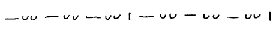
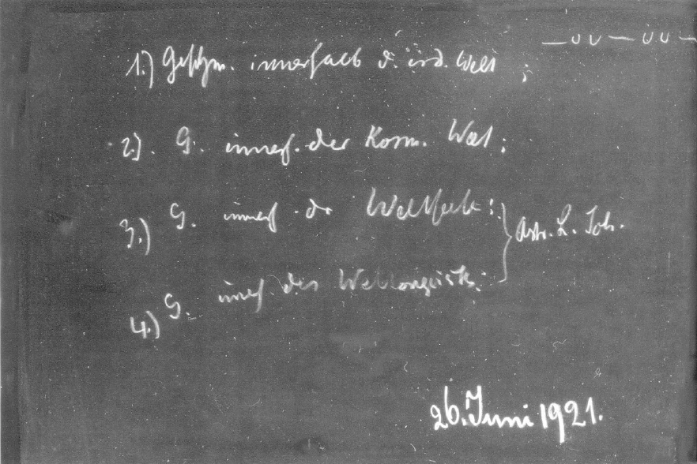
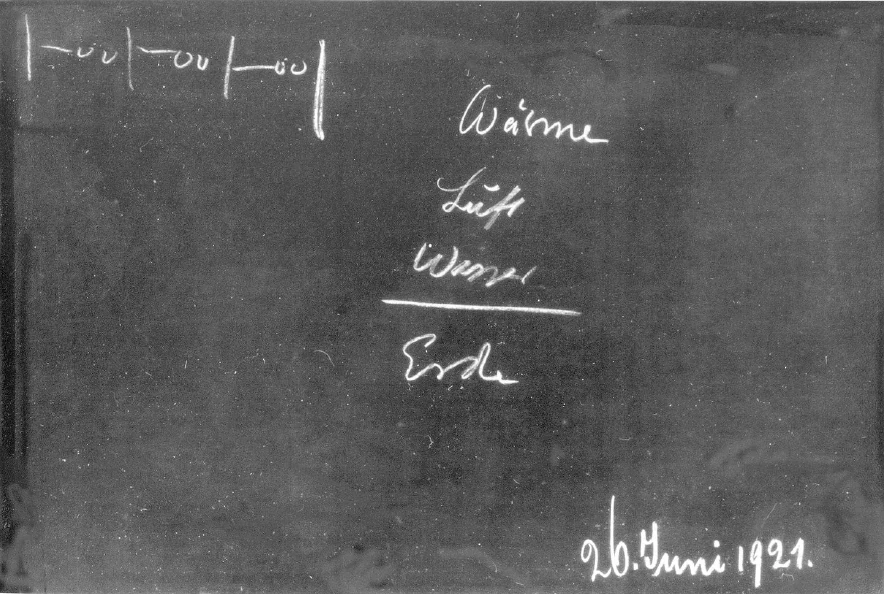

[ 1 ] ^e1gour

Vorgestern sprachen wir davon, wie etwa ein Grieche derjenigen Zeit, in der noch eine gewisse verinnerlichte Erkenntnis vorhanden war, gedacht haben würde über die Weltanschauung, über das wissenschaftliche Weltbild der Gegenwart, und ich versuchte dann vorzuführen, wie von dem Gesichtspunkt imaginativer Erkenntnis solch ein Grieche dasjenige beschrieben haben würde, was wir gewohnt sind, den menschlichen Ätherleib zu nennen, im Verhältnis zu dem Elemente des Wassers. Ich sagte: Der imaginativen Erkenntnis würde sich ein gewisser Zusammenhang ergeben der gesamten Wasserwirkung, des Wellens und Webens des Wasserelementes, des Strebens nach der Weite, des SichSenkens nach der Erde, und ein Zusammenhang dieser, ich möchte sagen, Kräfteentfaltungen nach der Weite und nach dem Zentrum mit dem Gestalten, mit dem Bilden des pflanzlichen Elementes in seinen einzelnen Formen. Wir kommen da zu einer konkreten Gestaltung des Inhaltes der imaginativen Welt, wenigstens eines Teiles der imaginativen Welt. Praktisch für das menschliche Anschauen ist eine solche Erkenntnis nur zu erlangen, wenn eine Entwickelung angestrebt wird, wie sie eben beschrieben worden ist in meinem Buche: «Wie erlangt man Erkenntnisse der höheren Welten?», zum Ziele der imaginativen Erkenntnis. ^2dug5f

[ 2 ] ^pc1xra

Nun würde man aber mit einer solchen Erkenntnis noch immer unbekannt bleiben dem gegenüber, was in der früheren Weltanschauung das Luftelement genannt wurde. Dieses Luftelement, es kann so, wie es zum Beispiel die Alten aufgefaßt haben, nur in sogenannter inspirierter Erkenntnis durchdrungen werden. Sie werden nahekommen dieser inspirierten Erkenntnis, diesem Erleben des Luftelementes, wenn Sie versuchen, sich folgendes klarzumachen. Ich habe schon des öfteren erwähnt, wie heute der Mensch im Grunde genommen recht äußerlich betrachtet wird. Man braucht ja nur sich daran zu erinnern, wie heute anatomische, physiologische Bilder von dem Menschen gemacht werden. Sie werden so gemacht, daß man irgendwelche scharfen Konturen von den inneren Organen hinzeichnet, von Herz, Lunge, Leber. Gewiß, diese scharfen Konturen, diese Grenzlinien von Herz, Lunge, Leber und so weiter, sie haben ja eine gewisse Berechtigung. Allein wir zeichnen mit ihnen den Menschen so, wie wenn er durch und durch ein fester Körper wäre, aber er ist das ja nicht. Der Mensch besteht zum allergeringsten Teile aus festen mineralischen Substanzen. Wenn wir, ich möchte sagen, selbst ein Maximum nehmen, so können wir höchstens acht Prozent als fest im Menschen annehmen; zu zweiundneunzig Prozent ist der Mensch eine Flüssigkeitssäule, ist er gar nicht fest. Das Feste ist nur eingelagert im Menschen. Davon wird sehr wenig Bewußtsein erweckt bei den gegenwärtigen Schülern der Physiologie, der Anatomie und so weiter. Den wässerigen Menschen, den Flüssigkeitsmenschen lernen wir aber nicht kennen, wenn wir ihn so zeichnen mit den festen Grenzen seiner Organe, sondern der Flüssigkeitsmensch ist etwas, was in fortwährender Strömung ist; sein Organismus ist ein fortwährend in sich Bewegliches. Und in diesen Flüssigkeitsorganismus lagert sich ja jetzt der Luftorganismus erst ein. Die Luft strömt ein, verbindet sich mit den Substanzen im Inneren, quirlt sie, wenn ich so sagen darf, auf. ^qo0jf9

[ 3 ] ^4py10a

Dadurch, daß der Mensch dieses Luftelement in sich hat, bildet er eigentlich eine vollständige Einheit mit der äußeren Welt. Die Luft, die ich jetzt in mir habe, ich habe sie ja vor ganz kurzer Zeit nicht in mir gehabt; sie war draußen. Die Luft, die ich jetzt in mir habe, sie wird nachher wiederum draußen sein. Man kann ja gar nicht davon sprechen, daß der Mensch, wenn wir ihn diesem dritten Elemente, dem Luftelement gemäß betrachten, innerhalb seiner Haut abgeschlossen ist, und erst recht nicht dem Wärme- oder Feuerelement gegenüber. Man kann nicht sagen, daß der Mensch ein abgeschlossenes Wesen ist. ^gr1cn1

[ 4 ] ^ri7my5

Nun stellen wir dem, was wir so als den vollständigen Menschen betrachten, als denjenigen Menschen, der nicht nur organisiert ist im Festen, sondern der organisiert ist im Flüssigen, im Luftförmigen und in dem Elemente der Wärme, in der konfigurierten, ineinander sich bewegenden Wärme, dem stellen wir gegenüber den Menschen, wie er ist, wenn er schlafend mit seiner Seele und mit seinem Geiste außerhalb des Leibes und Ätherleibes ist. Was vom Aufwachen bis zum Einschlafen den Menschen durchseelt und durchgeistet, das ist ja nicht da in der Zeit zwischen dem Einschlafen und Aufwachen. Das ist dann in einer andern Welt, die auch durchzogen ist von Gesetzmäßigkeit. Und wir müssen uns jetzt fragen: Von welcher Gesetzmäßigkeit ist die Welt durchzogen, in der sich der Mensch zwischen dem Einschlafen und Aufwachen befindet? - Wir haben gestern vier Arten von Gesetzmäßigkeiten angegeben: erstens die Gesetzmäßigkeit innerhalb der irdischen Welt, zweitens die Gesetzmäßigkeit innerhalb der kosmischen Welt, drittens die Gesetzmäßigkeit innerhalb der Weltenseele und viertens die Gesetzmäßigkeit innerhalb des Weltengeistes. Wir fragen uns: Wo ist jetzt der Mensch mit seiner Seele und mit seinem Geiste oder mit seinem seelischen Teil und mit seinem Ich zwischen dem Einschlafen und dem Aufwachen? - Nun, eine Überlegung und der Vergleich mit dem, was wir bisher besprochen haben, ergibt Ihnen, daß hier astralischer Leib und Ich sind in der Zeit zwischen dem Einschlafen und Aufwachen, in dem Gebiete der Weltenseele und des Weltengeistes. ^3bl47n

1. Gesetzmäßigkeit innerhalb der irdischen Welt ^jrq1qr

2. Gesetzmäßigkeit innerhalb der kosmischen Welt ^46jxbl

3. Gesetzmäßigkeit innerhalb der Weltenseele + ^orsky3

4. Gesetzmäßigkeit innerhalb des Weltengeistes = Astr. Leib, Ich ^u14afy

[ 5 ] ^pddraq

>Und wir müssen ganz ernst nehmen, was wir vorgestern erwähnt haben, daß wir ja mit den beiden ersten Welten, mit der irdischen und der kosmischen Welt, das gesamte Gebiet des Raumes erschöpft haben. Wir kommen also, indem wir diese Gebiete betreten, schon außerhalb der Gebiete der Räumlichkeit. Das ist etwas, was wir uns immer klarer vor die Seele stellen müssen: Jedes Schlafen führt den Menschen nicht nur, wie man oftmals sagt, außerhalb seines physischen Leibes, sondern es führt ihn außerhalb des gewöhnlichen Raumes. Es führt ihn in eine Welt, die überhaupt nicht verwechselt werden darf mit der Welt, die sinnlich angeschaut werden kann. Aus dieser Welt heraus ist aber alle Gesetzmäßigkeit, welche zugrunde liegt dem rhythmischen Menschen, jenem Menschen, der sein Flüssigkeitselement und auch sein Luftelement mit Rhythmus durchorganisiert. Der Rhythmus erscheint im Raume, aber der Quell des Rhythmus, die Gesetzmäßigkeit, welche den Rhythmus hervorbringt, die strömt in jedem Punkte des Raumes aus außerräumlichen Tiefen hervor. Die wird überall reguliert von einer realen Welt, die jenseits des Sinnesraumes ist. Und stehen wir gegenüber jenem wunderbaren Wechselspiel, das sich abspielt im innermenschlichen Rhythmus durch die Atemzüge und durch den Puls, dann nehmen wir eigentlich in diesem Rhythmus etwas wahr, was aus geistigen, außerräumlichen Untergründen hereinreguliert wird in die Welt, in der sich der Mensch auch als physischer Mensch befindet. Wir können gar nicht das Element des Luftartigen verstehen, wenn wir nicht zu einem solchen konkreten Verstehen der rhythmischen Äußerung des Menschen innerhalb dieses Luftartigen kommen können. ^c2aujq

[ 6 ] ^yf541q

Wenn man noch mit der Imagination dasjenige erfaßt, was ich Ihnen vorgestern beschrieben habe, das Weben und Wesen der pflanzlichen Welt und das damit parallel gehende Weben und Wesen des menschlichen Ätherleibes, dann ist man noch in der Welt, in der man sonst auch ist; man muß sich nur erdentrückt denken, gewissermaßen hinausergossen in den ganzen Kosmos. Aber geht man über zu dem Luftelemente, dann muß man sich herausversetzen aus dem Raum, dann muß man die Möglichkeit haben, in einer Welt sich zu wissen, die nun nicht mehr räumlich ist, sondern nur noch zeitlich, in der nur noch das Zeitliche eine gewisse Bedeutung hat. In Zeiten, in denen man solche Dinge lebendig angeschaut hat, sah man das, was solchen Welten angehört, auch in einer solchen Weise an, daß man das Hineinspielen des Geistigen in die menschliche Betätigung auf dem Umwege durch den Rhythmus wirklich sah. Und ich habe aufmerksam darauf gemacht, wie der Grieche der griechischen Urzeit herausgegliedert hat den Hexameter: drei Pulsschläge mit der Zäsur, was einen Atemzug gibt, weitere drei Pulsschläge mit der Zäsur oder mit dem Ende des Verses gibt den vollen Hexameter: in zwei Atemzügen die entsprechenden acht Pulsschläge. Das Zusammenklingen der Pulsschläge mit der Atmung, es wurde kunstvoll gestaltet beim Rezitativ des griechischen Hexameters. Wie, man möchte sagen, die geistig-übersinnliche Welt den Menschen durchrieselt, wie sie hereinrieselt in die Blutzirkulation, in den Blutrhythmus und sich synthetisiert, vier Pulsschläge, vier Pulsrhythmen zu einem Atmungsrhythmus, das wurde wiedergegeben in jener Sprachgestaltung, die der Hexameter ist. Alle ursprünglichen Bestrebungen, Verse zu bauen, sind hervorgeholt aus dieser rhythmischen Organisation des Menschen. ^jj1e12

 ^cigjsw

[ 7 ] ^5sfe93

Real wird für den Menschen selbst die Welt, aus der dieses rhythmische Sich-Betätigen kommt, erst dann, wenn der Mensch schlafend bewußt wird. Die Tätigkeit, in der der Mensch dann schlafend, aber bewußt lebt, spielt eben in seinen Rhythmus herein. Was da zugrunde liegt, bleibt unbewußt dem gewöhnlichen Alltagsbewußtsein und erst recht dem gewöhnlichen heutigen wissenschaftlichen Bewußtsein. Wird das aber bewußt, dann tritt nicht nur dasjenige auf vor dem Menschen, was ich gestern beschrieb, die wogende, webende, wellende Pflanzenwelt, sondern dann tritt etwas auf, was jetzt nicht Bilder der gewöhnlichen Tierwelt sind, denn die wären räumlich, sondern es tritt auf ein deutliches Bewußtsein — das aber nur außerhalb des Leibes, nicht innerhalb des Leibes auftreten kann -, welches zum Inhalte hat die konkreten Bilder, aus denen sich dann die Gestalten der Tiere im Raume bilden. Geradeso wie unsere menschliche rhythmische Tätigkeit hereinsprudelt aus dem Außerräumlichen, so sprudeln herein aus dem Außerräumlichen die Gestalten, die dann in den verschiedenen Tieren sich organisieren. ^u88ih2

[ 8 ] ^shqr61

Das erste, was erlebt wird, wenn man bewußt jenen Zustand durchmacht, der sonst unbewußt zwischen dem Einschlafen und Aufwachen durchgemacht wird, was man da erlebt, indem man untertaucht in diese Welt, die der Quell unseres Rhythmus ist, das ist, daß einem die tierische Welt in ihren Formen verständlich wird. Die Tierwelt kann nicht in ihren Formen erklärt werden aus äußeren physischen Grundlagen, Kräften. Wenn die Zoologen oder Morphologen glauben, die Löwenform, die Tigerform, die Schmetterlingsform, die Käferform aus irgend etwas erklären zu können, was hier im physischen Raume zu finden ist, so täuschen sie sich sehr. Es ist das, woraus die Formen der Tiere zu erklären sind, nicht aus irgend etwas zu erklären, was hier im physischen Raume zu finden ist. Man trifft es an auf die Weise, wie ich es jetzt beschrieben habe, wenn man eben in die dritte der Gesetzmäßigkeiten hineinkommt, in die Gesetzmäßigkeiten der Weltenseele. ^9rvroo

[ 9 ] ^m5lpbj

Und ich möchte jetzt wiederum zurückverweisen auf den Griechen, den ich ja vorgestern in ein Gespräch gebracht habe mit dem modernen Gelehrten, der alles weiß; das heißt, er gibt ja zuweilen zu, daß er nicht alles weiß, aber er prätendiert, daß auf seine Art mindestens alles erklärt werden müsse. Der Grieche würde sagen: Auf deine Art kann überhaupt nichts erklärt werden, denn ich habe davon gehört, daß du so etwas hast wie eine Logik. Da zählst du allerlei abstrakte Begriffsformen, Kategorien auf, Sein, Werden, Haben und so weiter. Diese Logik ist etwas, was eine Gesetzmäßigkeit der Begriffe, der Ideen darstellen soll. Ja, aber diese abstrakte Logik — ich denke jetzt an einen Griechen der vorsokratischen Zeit, an einen Griechen derjenigen Zeit, aus der dann die Philosophien des T’hales, des Heraklit, des Anaxagoras hervorgegangen sind, die ja äußerlich nur zum Teil erhalten sind -, das, was ihr die Logik nennt — würde ein solcher Grieche sagen -, das hat ja erst ein Mensch gemacht, der eigentlich nicht mehr viel gewußt hat von den Geheimnissen der Welt. Das hat erst Aristoteles gemacht, nachdem er gründlich seinen Philisterverstand auf den Platonismus angewendet hat. Gewiß, Aristoteles ist ein großer Mann, aber eben ein großer Philister, der die wirkliche Logik ganz korrumpiert hat, der die wirkliche Logik zu einem Gespinst gemacht hat, das sich zur Realität verhält, wie eben etwas ganz dünn gesponnenes Wesenloses zu etwas dicht Realem. Und die wirkliche Logik - würde ein Grieche dieser Zeit sagen, der eben in seiner Art ein Wissenschafter gewesen wäre - umfaßt diejenigen Formen, die in der Tierwelt äußerlich-räumlich werden, und die man findet, wenn man bewußt wird zwischen Einschlafen und Aufwachen. Das ist Logik, das ist der reale Inhalt des logischen Bewußtseins. ^ghw127

[ 10 ] ^b3h58n

In der Tierwelt ist eben nichts anderes vorhanden als das, was im Menschen auch vorhanden ist, aber im Menschen ist es vergeistigt, und so kann er denken, so kann er die logischen Formen denken, die in der äußeren Welt in den Raum schießen und Tiere werden. Es ist schon so: Wenn wir zwischen dem Aufwachen und Einschlafen im gewöhnlichen Bewußtsein unsere Begriffsformen wälzen, die eine Begriffsform mit der andern verbinden, dann tun wir in ideeller Beziehung dasselbe, was die Außenwelt tut, indem sie die verschiedenen Formen des Getieres gestaltet. Geradeso wie man sein Ätherisches betrachtet, wenn man den Blick wendet auf die Pflanzen und diese Pflanzenwelt sich eingebettet denkt in das Element des Wassers, geradeso begreift man die eigene Seelenwelt - meinetwillen kann sie die Astralwelt genannt werden -, wenn man mit diesem lebendigen Weben, das bewußt wird dem Bewußtsein zwischen Einschlafen und Aufwachen, sich durchdringt und das äußere Gestalten der Tierwelt versteht. Man muß sich dann das eigene Gestalten der ideellen Welt eingesponnen denken in den Rhythmus des luftigen Elementes. ^qm45lw

[ 11 ] ^4wr057

Sie können sich ja eine ganz konkrete Vorstellung machen aus mancherlei, das ich Ihnen über den Menschen angedeutet habe. Nehmen Sie den Vorgang ganz konkret: Sie atmen ein, die Luft geht die Ihnen bekannten Wege durch die Lunge. Dadurch aber, daß Sie eingeatmet haben, schlägt in den Raum, in dem das Rückenmark, aber auch die Rückenmarksflüssigkeit eingebettet ist, die Einatmungsluft hinein; durch den Arachnoidealraum wird dieses Wasser, das das Rückenmark umgibt, gegen das Gehirn hin rhythmisch geworfen. Das Gehirnwasser kommt in Tätigkeit. Diese Tätigkeit, in die das Gehirnwasser kommt, das ist die Tätigkeit des Gedankens. In Wirklichkeit wellt der Gedanke auf dem Atemzuge, der sich dem Gehirnwasser überträgt, und dieses Gehirnwasser, in dem das Gehirn schwimmt, das überträgt seinen rhythmischen Schlag nun auf das Gehirn selbst. Im Gehirn leben die Eindrücke der Sinne, die Eindrücke der Augen, der Ohren durch die Nerven-Sinnesbetätigung. Mit dem, was da von den Sinnen her im Gehirn lebt, schlägt der Atemrhythmus zusammen, und in diesem Zusammenschlagen entwickelt sich jenes Wechselspiel zwischen Sinnesempfinden und jener Gedankentätigkeit, jener formalen Gedankentätigkeit, die äußerlich in den Tierformen ihr Leben hat, und die dasjenige ist, was der Atmungsrhythmus bewirkt, indem er sich unserem Gehirnwasser im Arachnoidealraum mitteilt und dann dasjenige umspielt, was im Gehirn durch die Sinne lebt. Da lebt alles dasjenige drinnen, was nun ideell in uns zur Tätigkeit gelangt aus dem Rhythmus heraus. ^jwu5mx

[ 12 ] ^z81e0p

Das ist das Wesentliche, daß Sie versuchen, allmählich einzudringen in die Art, wie das Geistige hereinspielt in die physisch-sinnliche Welt. Das ist gerade der große Kulturschaden unserer Zeit, daß wir eine Wissenschaft haben, die zum Geiste in abstrakten Formen, in rein intellektualistischen Formen gelangt, während das Geistige begriffen werden muß in seinem schöpferischen Elemente, sonst bleibt die materielle Welt wie ein Hartes, Unbezwungenes außerhalb des Geistigen da. Wir müssen hineinschauen, wie dieses Element der dritten und vierten Gesetzmäßigkeit ganz konkret hereinspielt in das, was wir selber ausführen. ^97oxbk

[ 13 ] ^w4gbbj

Es gehört zu dem Wunderbarsten, was wir da gewahr werden, wenn wir den eigentlichen inneren Grund dessen kennenlernen, was sich mit jedem Atemzug vollziehen kann; was sich nicht vollzieht, sondern vollziehen kann, indem die Einatmung heraufspielt ins Gehirnwasser. Nun kommt der Rückschlag: Das Gehirnwasser wird wiederum durch den Arachnoidealraum heruntergedrängt, und dann kommt es zur Ausatmung. Das ist dann wieder ein Hingeben an die Welt, das ist ein Zusammengehen mit der Welt. Aber in diesem Ich-Werden - Zusammengehen mit der Welt - Ich-Werden - Zusammengehen mit der Welt, darin liegt im wesentlichen dasjenige, was sich im Atmungsrhythmus ausdrückt. ^m13rvs

[ 14 ] ^5ysy9h

So muß man reden, wenn man von jener Wirklichkeit redet, die gemeint ist mit dem Elemente der Luft, während Erde eben alles das umfaßt, was in unseren etlichen siebzig chemischen Elementen enthalten ist. Sie sehen ja: Das, was Leichnam wird, ist der Gesetzmäßigkeit der zweiundsiebzig Elemente unterworfen. Dasjenige aber, was diesen Leichnam zunächst in Regsamkeit bringt, so daß er wächst, daß er verdauen kann, das ist aus dem Kosmos hereingeströmt. Was diesen Organismus durchdringt, so daß er nicht nur wächst, nicht nur verdauen kann, sondern daß er immerzu in rhythmischer Tätigkeit sich entfaltet, in Puls- und Atmungsrhythmus, das kommt aus einer außerräumlichen Welt. Und wir studieren diese außerräumliche Welt ebenso im Luftelemente, denn da offenbart sie sich, wie wir die kosmische, nicht die irdische Welt, im Wasserelemente studieren, denn da offenbart sie sich. Und was sie für den heutigen Chemiker, für den heutigen Phyisker offenbart, das kommt nur aus dem in sich differenzierten Erdenelemente. ^eo5ru2

[ 15 ] ^xmqmx2

Wir können dann auch den Übergang finden zu dem Wärme- oder Feuerelemente; aber das ist eigentlich nur möglich in einem Momente, der sich praktisch für den Menschen ergibt, wenn er die Fähigkeit erlangt hat, nicht nur bewußt aus seinem Leibe herauszugehen, sondern mit diesem Bewußtsein in die andern Wesen unterzutauchen. Das ist ein Unterschied. Man kann lange die Fähigkeit haben, aus seinem Leibe herauszugehen, wenn noch etwas Egoismus zurückgeblieben ist gegenüber der Welt, so kann man zwar alles das auffassen, wovon ich bis jetzt gesprochen habe, aber man kann nicht in diese äußere Welt wirklich untertauchen, man kann sich ihr nicht hingeben. Kommen solche Elemente einer wirklichen übersinnlichen Liebe hinzu, eines Untertauchens in diejenige Welt, in der man lebt zwischen dem Einschlafen und Aufwachen, dann erst lernt man eigentlich praktisch das Element der Wärme oder des Feuers kennen. Und dann lernt man im Grunde genommen erst kennen das wahre Wesen des Menschen. Denn was äußerlich durch die Sinne angesehen wird, das ist ja zunächst nur ein Scheinbild des Menschen, das ist der Mensch von der andern Seite, von der Seite des Scheines. ^oj3cuc

[ 16 ] ^2ksvnj

Steigt man auf zu dem Elemente des Wassers, so zerfließt einem ja zunächst die ätherische Wesenheit des Menschen. Sie wird, ich möchte sagen, zu einem Miniaturbild von Winter, Sommer, Herbst und so weiter. Kommt man zu dem Elemente der Luft, dann gewahrt man ein rhythmisches Sich-Bewegen. Den geschlossenen Menschen, den Menschen, wie er als ewiger Mensch ist, den lernt man nur kennen innerhalb des Elementes der Wärme. Da schließt sich wiederum alles zusammen, schließen sich zusammen jene Bewegungen und Webungen des Wasserelementes und die Rhythmen und Rhythmisierungen des Luftelementes. Sie gleichen sich aus, sie harmonisieren sich und entharmonisieren sich im Wärmeelemente, im Feuerelemente, und da kann man das wirkliche Wesen des Menschen kennenlernen. Da ist man eigentlich erst wirklich in dem vierten, in der Gesetzmäßigkeit des Weltengeistes darinnen. ^pgp3rq

[ 17 ] ^t0q5b5

Wenn man also heute hört aus früherer Wissenschaft von Erde, Wasser, Feuer, Luft, sollte man sich nicht vorstellen: Wie haben wir es so herrlich weit gebracht mit unserer gegenwärtigen Wissenschaft -, sondern man sollte sich vorstellen: Ein ganz anderes Bewußtsein von dem Wurzeln des Menschen in übersinnlichen Tiefen war vorhanden. Daher wußte man auch etwas von der verschiedenen Stellung des Erdenelementes zu diesem Übersinnlichen. Gewissermaßen ist das Erdenelement ganz außerhalb der Sphäre des Übersinnlichen. Es kommt ihm schon nahe das Wasserelement; mit der im kosmischen Raume ausgebreiteten Sphärenwelt ist eigentlich dieses Wasserelement viel verwandter als mit dem, was Erde selber ist. Wir kommen aber aus dem Raume völlig heraus, wenn wir den Quell dessen suchen, was in uns den Luftrhythmus, also unsere Luftorganisation ausmacht; denn in bezug auf unsere Luftorganisation sind wir rhythmisierend, entrhythmisierend und so weiter. Und wir kommen endlich zu dem universellen Außerräumlichen, zu dem, was auch die Zeit noch überwindet, wenn wir in das Feuerelement hineinkommen, in das Wärmeelement. Da aber lernen wir erst den ganzen in sich abgeschlossenen Menschen kennen. Dieses findet man dann wirklich, wenn man es wieder entdeckt hat - und es ist schon einmal notwendig, daß man es heute wiederum entdeckt —, man findet es dann noch, obwohl korrumpiert, in der Literatur, die zurückliegt hinter dem 15. Jahrhundert. ^xcwyep

[ 18 ] ^7ffngv

Da ist vor ein paar Jahren das Werk eines schwedischen Gelehrten erschienen über die Alchemie. Dieser schwedische Gelehrte liest einen Vorgang, von einem Alchemisten beschrieben, und er sagt: Wenn man diesen Vorgang heute nachprüft, dann ist er der reine Unsinn, dann kann man sich gar nichts dabei vorstellen. - Man kann ganz gut begreifen, wenn der Chemiker von heute, selbst der schwedische, der etwas vorurteilsloser ist als der mitteleuropäische, die Ausdrücke nimmt, in die dasjenige gekleidet ist, was auch nur in der korrumpierten Literatur der älteren Zeiten vorhanden ist, das nachmacht und dann sagt, daß gar nichts dabei herauskommt! Ich habe den Vorgang, den der gute schwedische Gelehrte nicht verstehen kann, aufgesucht in der Literatur, die dem schwedischen Gelehrten vorgelegen hat, und in diesem Vorgang, der dort beschrieben ist in der Literatur, war allerdings ein Stück des Embryonalvorganges, der Embryoentwickelung des Menschen gegeben! Das zeigte sich sehr bald. Aber man mußte die Sache lesen können! Der heutige Gelehrte liest so etwas, er wendet die Ausdrücke an, die in seiner Chemie stehen, die er gelernt hat. Nun stellt er seine Retorten auf und macht den Vorgang nach: Unsinn! - Dasjenige, was er gelesen hat, ist das Stück eines Vorganges, das sich im mütterlichen Leibe bei der Embryonalbildung vollzieht. Sehen Sie, so ist der Abgrund, der aufgetan ist zwischen dem, was der heutige Gelehrte lesen kann, und dem, was einmal gemeint war. ^76khul

[ 19 ] ^01deno

Aber all die Dinge, die da beschrieben werden, sind beschrieben unter dem Einflusse solcher Vorstellungen, wie wir sie heute wiederum hervorsuchen aus neuerer Geisteswissenschaft. Entdeckt man sie nicht wieder, dann kann man diese Schriften gar nicht lesen. Sie waren in einer ganz andern Weise, als wir sie heute entdecken, vorhanden. Sie waren instinktiv, atavistisch vorhanden, aber sie waren eben vorhanden und die Menschheit hat sich gewissermaßen herausgehoben zum Verständnisse des bloßen Erdenelementes. Wir müssen wiederum den Eingang finden in die Elemente, die uns nun nicht bloß den Leichnam des Menschen erklären, sondern die uns wiederum den ganzen Menschen, den lebenden Menschen erklären. Dazu ist allerdings notwendig, daß man lernt, innerhalb unserer Zivilisation ganz ernst zu nehmen, was in der Präexistenzfrage gegeben ist. ^nmpdia

[ 20 ] ^e93faf

Als die Präexistenz hinausgeworfen wurde aus der abendländischen Kulturentwickelung, da war eigentlich das selbstlose Forschen aus dieser Kulturentwickelung herausgeworfen. Wenn heute die Prediger von Unsterblichkeit predigen: bitte, nehmen Sie alle Predigten, ich habe ja schon öfter darauf aufmerksam gemacht, sie appellieren im Grunde genommen an den menschlichen Egoismus. Man weiß, der Mensch fühlt sich unbehaglich, er hat Furcht vor dem Aufhören des Lebens. Gewiß, es hört nicht auf. Aber man appelliert nicht an seine Erkenntniskräfte, wenn man davon spricht, sondern man appelliert an seine Todesfurcht, an seinen Willen, fortleben zu wollen, wenn der Leib ihm genommen ist; man appelliert an seinen Egoismus mit andern Worten. Das kann man nicht, wenn man von der Präexistenz spricht. Eigentlich ist es insbesondere den Leuten der Gegenwart zunächst höchst einerlei, wenn sie auf ihren Egoismus schauen, ob sie vorher, bevor sie geboren oder konzipiert worden sind, gelebt haben. Sie leben jetzt, dessen sind sie gewiß. Deshalb sind sie nicht sehr besorgt um die Präexistenz, sie sind um die Postexistenz besorgt; denn wenn sie auch jetzt leben, so wissen sie nicht, ob sie nach dem Tode leben werden. Das hängt mit ihrem Egoismus zusammen. Aber da sie schon einmal leben, so sagen sie sich, wenn auch unbewußt oder instinktiv, wenn sie nicht Erkenntnis getrieben haben: Nun, ich lebe, und wenn ich auch vor meiner Geburt oder Konzeption nicht gelebt habe, so macht mir das nichts aus, wenn ich nur jetzt angefangen habe zu leben und nicht wieder aufhöre! Das ist die Stimmung, aus der heraus im Grunde heute die Gefühle geholt werden, durch welche die Menschen für die Unsterblichkeit begeistert werden. Deshalb haben wir in den bekannten Sprachen ein Wort für Unsterblichkeit als Anweisung zur Ewigkeit an dem Ende des Lebens, aber nicht, wie ich Ihnen ja auch schon öfter gesagt habe, in den gebräuchlichen Kultursprachen ein Wort für Ungeborenheit. Das müssen wir natürlich nach und nach ebenso erobern. Das spricht mehr zu der Erkenntnis, das spricht mehr zu der Unegoität, zu dem egoismusfreien Erkennen des Menschen. An das muß wiederum appelliert werden. Und überhaupt muß die Erkenntnis mit der Moral, mit der Ethik durchzogen werden. Ehe nicht wiederum der Laboratoriumstisch eine Art Altar, ehe nicht das Synthetisieren und Analysieren eine Art Geisteskunst ist und man sich bewußt ist, man greift ein in die Weltenentwickelung, indem man dies oder jenes tut, eher kann es mit unserer Kulturentwickelung nicht aufwärtsgehen. Wir kommen unbedingt in einen furchtbaren Niedergang hinein, wenn nicht in weiteren Kreisen eingesehen wird: Man muß zu egoismusfreier Erkenntnis, zu durchmoralisierter Erkenntnis gelangen, muß jene mit den höheren Welten gar nicht rechnenden Analysen und Synthesen, wie wir sie heute haben, überwinden. Man muß wiederum so etwas verstehen lernen wie den Rhythmus, der hineinspielt in unser Leben, wie dasjenige, was in die Wärme hineinspielt. Denn in die Wärme spielt eben das Moralische hinein; und indem es einfach Wärmeunterschiede, Wärmetingierungen gibt, gibt es in Wirklichkeit die weltdurchwellende Moralität, in der sich der Mensch entwickelt. Das alles muß nach und nach der Menschheit bewußt werden. Und es ist nicht bloß, möchte ich sagen, eine idealistische Schrulle, die uns auffordert, in dieser Zeit die Zeichen der Zeit zu deuten, sondern es sprechen die Zeichen der Zeit selber dahingehend, daß diese Vertiefung nach dem Übersinnlichen versucht werden muß. ^rjynn3

 ^arcapj

 ^mhchqg

