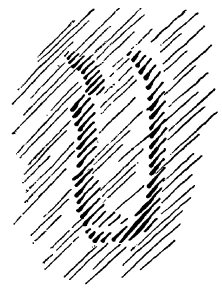
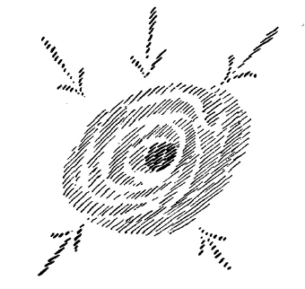
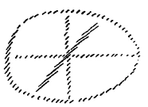
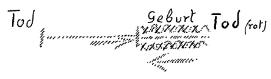
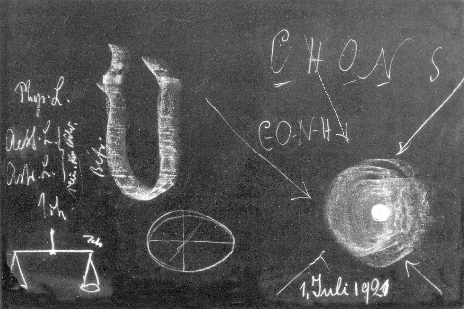
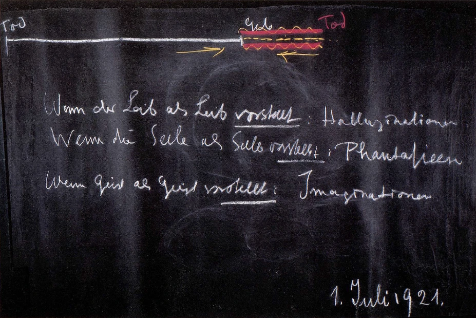

[ 1 ] ^6re77m

Ich möchte heute im Zusammenhange mit den Ausführungen, die ich vor acht Tagen und früher gemacht habe, einiges wie eine Episode ausführen, das uns dann zur Fortsetzung unserer Betrachtungen hinüberleiten kann. Wir sehen, indem wir die Welt erleben, an der Welt und an uns manches als abnorm, vielleicht auch als krankhaft an, und das gewiß von einem Gesichtspunkte aus mit Recht; aber damit, daß wir im absoluten Sinne irgend etwas als abnorm oder als krankhaft ansehen, haben wir die Welt noch nicht verstanden. Ja, wir versperren uns oftmals den Weg zum Verständnis der Welt, wenn wir bei solchen Abschätzungen des Daseins, wie gesund und krank, richtig, unrichtig, wahr, falsch, gut, böse und so weiter einfach stehenbleiben. Denn was von einem Gesichtspunkte aus sich als krankhaft, als abnorm ausnimmt, hat von einem andern Gesichtspunkte aus im Ganzen des Weltzusammenhanges seine volle Berechtigung. Ich will gleich einen konkreten Fall anführen und Sie werden sehen, was gemeint ist. ^eo4omk

[ 2 ] ^0bphzg

Mit Recht sieht man das Auftreten sogenannter Halluzinationen oder auch Visionen als etwas Krankhaftes an. Halluzinationen, Gebilde, die vor dem menschlichen Bewußtsein auftreten und für die bei einer genaueren kritischen Prüfung der Mensch nicht die entsprechende Realität finden kann, solche Halluzinationen, solche Visionen sind etwas Krankhaftes, wenn wir sie betrachten von dem Gesichtspunkte des menschlichen Lebens, so wie es sich uns darstellt zwischen der Geburt oder der Empfängnis und dem Tode. Aber damit, daß wir die Halluzinationen als etwas Abnormes bezeichnen, als etwas, was ja ganz gewiß nicht hereingehört in den normalen Ablauf des Lebens zwischen Geburt und Tod, haben wir das Wesen der Halluzinationen eben durchaus nicht begriffen. ^zooqhj

[ 3 ] ^e695w7

Sehen wir jetzt einmal ab von einer jeglichen solchen Beurteilung der Halluzinationen. Nehmen wir sie so, wie sie bei dem Halluzinierenden auftritt. Sie tritt auf als ein Bild, das in einer intensiveren Weise mit der ganzen Subjektivität, mit dem Eigenleben verbunden ist als die gewöhnliche äußere Wahrnehmung, die durch die Sinne vermittelt wird. Die Halluzination wird intensiver innerlich erlebt als die Sinneswahrnehmung. Die Sinneswahrnehmung verträgt es außerdem, durchsetzt zu werden mit scharfen kritischen Gedanken; der Halluzination gegenüber vermeidet es der Halluzinierende, sie mit scharfen kritischen Gedanken zu durchsetzen. Er lebt in der schwebenden, webenden Bildlichkeit. ^hvm977

[ 4 ] ^oytsiw

Was ist denn das, in dem der Mensch da lebt? Ja, man kann das nicht kennenlernen, wenn man nur dasjenige kennt, was in das gewöhnliche menschliche Bewußtsein zwischen der Geburt und dem Tode eintritt. Denn in dieses Bewußtsein tritt unter allen Umständen der Inhalt der Halluzination als etwas Unberechtigtes hinein. Es muß die Halluzination von einem ganz andern Gesichtspunkte gesehen werden; dann kann man ihrem Wesen nahekommen. Und dieser Gesichtspunkt ergibt sich, wenn im Verlaufe der Entwickelung zu höherem Schauen der Mensch dazu kommt, sein eigenes Leben und Weben zwischen dem Tod und einer neuen Geburt kennenzulernen, namentlich das Leben und Weben der eigenen Wesenheit, wenn dieses Leben der Geburt, der Konzeption zu, schon um Jahrzehnte nahe kommt. Wenn man also die Fähigkeit erlangt, sich in dasjenige einzuleben, in dem ja auf ganz normale Weise der Mensch lebt, wenn er sich der Geburt oder der Konzeption nähert, dann lebt man sich in die wahre Gestalt dessen ein, was unnormal, als Halluzination im Leben zwischen Geburt und Tod auftritt. ^emcm58

[ 5 ] ^9l1hxv

Wie wir hier im Leben zwischen Geburt und Tod umgeben sind von der Welt der Farben, von der Welt, die wir in jedem Lufthauch und so weiter fühlen, kurz, von der Welt, die wir uns eben vorstellen als von uns erlebt zwischen Geburt und Tod, so lebt unser eigenes seelisch-geistiges Wesen zwischen dem Tod und einer neuen Geburt in einem Elemente, das durchaus identisch ist mit dem, was in uns auftritt in der Halluzination. Wir werden gewissermaßen, und zwar gerade unserer Leiblichkeit nach, aus dem Elemente der Halluzination heraus geboren. Was in der Halluzination auftritt, das, ich möchte sagen, durchschwebt und durchweht die Welt, die der unsrigen zugrunde liegt, und wir tauchen auf, indem wir geboren werden, aus diesem Elemente, das uns abnorm in der halluzinatorischen Welt vor die Seele treten kann. ^lrddng

[ 6 ] ^bz31qm

Was ist denn dann die Halluzination im gewöhnlichen Bewußtsein? Nun, wenn der Mensch das Leben zwischen dem Tode und einer neuen Geburt durchlebt hat, sich durch Konzeption und Geburt in das physisch-sinnliche Dasein hereinbegeben hat, dann haben gewisse geistige Wesenheiten jener höheren Hierarchien, die wir kennengelernt haben, eine Intuition gehabt, und das Ergebnis dieser Intuition, das ist der physische Leib. So daß wir sagen können: Gewisse Wesenheiten haben Intuitionen; das Ergebnis dieser Intuitionen ist der menschliche physische Leib, der nur dadurch entstehen kann, daß ihn die Seele durchdringt, indem sie auftaucht aus dem Elemente der Halluzinationen. Was geschieht, wenn nun in krankhafter Weise Halluzinationen vor dem gewöhnlichen Bewußtsein auftreten? Ich kann Ihnen das eigentlich nur bildlich veranschaulichen, aber es ist natürlich, daß ich es Ihnen nur bildlich veranschaulichen kann, denn Halluzinationen sind ja Bilder; also ist es selbstverständlich, daß man da mit abstrakten Begriffen nicht viel ausmachen kann, daß man da bildlich veranschaulichen muß. ^zyk45q

 ^2u5660

[ 7 ] ^refsw6

Nun denken Sie sich das Folgende: Dieser menschliche physische Leib ist ja, wie ich Ihnen neulich ausgeführt habe, nur zum geringsten Teile eigentlich so, daß man ihn in festen Konturen hat; er ist zum größten Teile wässerig, er ist auch luftförmig und so weiter. Dieser menschliche physische Leib hat eine gewisse Konsistenz, er hat eine gewisse natürliche Dichte. Wenn nun diese natürliche Dichte zu einer unnatürlichen gemacht wird, wenn sie unterbrochen wird - stellen Sie sich vor symbolisch, dieser physische Leib würde etwas zusammengezogen in seiner Elastizität -, dann wird das ursprüngliche halluzinatorische Element, aus dem heraus er geboren ist, herausgepreßt, so wie das Wasser aus einem Schwamm herausgepreßt wird. Nichts anderes ist das Entstehen des halluzinatorischen Wesens, als daß aus dem physischen Leib das eigene Element, aus dem heraus er entsteht, aus dem heraus er geformt wird, aus ihm ausgepreßt wird. Und das Krankwerden, das sich äußert im halluzinatorischen Bewußtseinsleben, das weist immer auf eine Ungesundheit des physischen Leibes hin, der sich geistig gewissermaßen aus sich herauspreßt. ^9ekwo2

[ 8 ] ^s0enwq

Wir werden ja durch diese Tatsache darauf hingewiesen, daß unser Denken in einem gewissen Sinne durchaus das ist, wovon der Materialismus redet. Unser physischer Leib ist wirklich in gewissem Sinne ein Abbild von dem, was präexistent, vor der Geburt oder vor der Konzeption, in geistigen Welten vorhanden ist. Er ist ein Abbild. Und das Denken, das im gewöhnlichen Bewußtsein auftritt, dasjenige Denken, auf das die Gegenwart am meisten stolz ist, das erklären die Materialisten nicht mit Unrecht als etwas, was ganz und gar an den physischen Leib gebunden ist. Es ist einfach so: Dieses Denken, dessen sich der heutige Mensch, namentlich seit der Geburt der neueren naturwissenschaftlichen Denkweise, seit dem 15. Jahrhundert, bedient, dieses Denken geht als solches mit dem physischen Leib zugrunde, hört auf mit dem physischen Leibe. Das, was Sie oftmals in der heute gebräuchlichen, aber erst in der heute, nicht in früheren Jahrhunderten gebräuchlichen katholischen Philosophie finden, als ob das abstrakte, intellektuelle Getriebe der Seele den Tod überdauerte, das ist falsch, das ist nicht richtig. Denn dieses Denken, das gerade das charakteristische Seelenleben der Gegenwart darstellt, das ist durchaus gebunden an den physischen Leib. Was den physischen Leib überdauert, das tritt erst in der nächsthöheren Stufe der Erkenntnis auf, in dem Imaginieren, in dem bildlichen Vorstellen und so weiter. ^kp34aj

[ 9 ] ^h2na89

Sie werden sagen: Ja, dann hat derjenige, der keine bildlichen Vorstellungen hat, überhaupt keine Unsterblichkeit! - Die Frage kann man so gar nicht stellen: Man habe keine bildlichen Vorstellungen - denn das heißt gar nichts. Sie können sagen: Ich habe keine bildlichen Vorstellungen in meinem Alltagsbewußtsein, ich bringe sie nicht in mein Alltagsbewußtsein herein. - Aber bildhafte Vorstellungen, Imaginationen bilden sich fortwährend in einem aus, nur werden sie verwendet im organischen Prozeß des Lebens; sie werden die Kräfte, aus denen der Mensch fortwährend seinen Organismus neu aufbaut. Unsere materialistische Philosophie und unsere materialistische Naturwissenschaft meint, daß, wenn der Mensch schläft, er aus irgend etwas die verbrauchten Organe wiederum aufbaut; aus was, darüber macht sich die Naturwissenschaft dann nicht viel Kopfzerbrechen. So ist es aber nicht, sondern gerade in unserem Wachleben bilden wir fortwährend, auch wenn wir nur das alltägliche intellektualistische Bewußtsein entwickeln, Imaginationen, und diese Imaginationen, die verdauen wir gewissermaßen seelisch, und davon bauen wir unseren Leib auf. Weil diese Imaginationen den Leib aufbauen, deshalb werden sie für das gewöhnliche Bewußtsein nicht abgesondert wahrgenommen. Die Entwickelung zum höheren Schauen beruht darauf, daß wir uns partiell, für außen, diesem Arbeiten am physischen Leibe entziehen, und daß wir dasjenige, was sonst im physischen Leibe unten kocht und brodelt, heraufbringen in das Bewußtsein. Daher gehört zum höheren Schauen Geisteswissenschaft, weil das ja nicht lange anhalten kann, denn sonst würde der Organismus in seiner Gesundheit untergraben. Also ist auch das Imaginieren durchaus beim gewöhnlichen Seelenleben vorhanden, nur wird es in den Leib hinein verdaut zwischen Geburt und Tod. So daß wir sagen können: Auch da geschieht während des gewöhnlichen Lebens eine unterbewußte Tätigkeit, die auch nichts anderes ist als etwas, das, wenn es zum Bewußtsein kommt, ein Halluzinieren ist. — Das Halluzinieren ist durchaus etwas, was eine geregelte elementarische Tätigkeit im Dasein ist. Es darf eben nur nicht zur Unzeit in unserem Bewußtsein auftreten. Es muß das Halluzinieren, so wie es gewöhnlich auftritt, gewissermaßen mehr das Unterbewußte unseres Daseins sein. Und wenn der Leib auspreßt, ich möchte sagen, seine Ursubstanz, dann kommt er eben dazu, dieses Ausgepreßte seiner Ursubstanz dem gewöhnlichen Bewußtsein einzuverleiben, und dann treten Halluzinationen auf. Halluzinieren heißt nichts anderes als, der Leib schickt ins Bewußtsein dasjenige herauf, was er eigentlich verwenden sollte zum Verdauen, zum Wachsen oder zu sonst etwas in sich. ^o1ht34

[ 10 ] ^u4tosw

Das hängt wiederum mit dem zusammen, was ich oftmals auseinandergesetzt habe mit Bezug auf die Illusionen, die sich die Menschen gegenüber gewissen Mystikern machen. Es ist so, wie wenn man, ich möchte sagen, das Heilige wegwischen würde von den Mystikern, wenn man auf das zugrunde Liegende aufmerksam macht. Ich sagte: Nehmen Sie solche Halluzinationen, die einen wunderschönen poetischen Charakter haben, wie diejenigen, die solche Persönlichkeiten, wie Mechthild von Magdeburg oder auch die Heilige Therese beschreiben. Ja, schön sind die Dinge, aber was sind sie in Wirklichkeit? — Wer diese Dinge durchschaut, der findet: Sie sind aus den Organen des Organismus herausgepreßtes Halluzinieren. Sie sind die Ursubstanz. Und wer die Wahrheit beschreiben will, muß schon manchmal Vorgänge, die dem Verdauen sehr verwandt sind, bei der Mechthild von Magdeburg oder der Heiligen Therese beschreiben, wenn dann die schönsten mystischen Poesien dem Bewußtsein entquellen. ^wr4v6b

[ 11 ] ^on0iiy

Man sollte eigentlich nicht sagen, daß dadurch das Aroma hinweggenommen wird von manchen Erscheinungen der geschichtlichen Mystik. Die Wollust, die manche Menschen empfinden, wenn sie an Mystik denken, oder wenn sie selber Mystik erleben wollen, diese Wollust wird allerdings damit etwas auf das Richtige zurückgeführt. Und vieles mystische Erleben ist eben nichts anderes als innere Wollust, die durchaus poetisch schön für das Bewußtsein zum Vorschein kommen kann. Aber das, was da zerstört wird, ist ja nur ein zerstörtes Vorurteil, eine zerstörte Illusion. Derjenige, der wirklich in dieses menschliche Innere vordringen will, der muß schon einmal das mitmachen, daß er nun nicht die wunderschönen Beschreibungen solcher Mystiker findet, sondern die Herausgestaltungen seiner Organe, Leber, Lunge und so weiter, aus dem Kosmos, aus dem Halluzinieren des Kosmos. Und im Grunde genommen ist nicht das Aroma von der Mystik weggenommen, sondern eine höhere Erkenntnis eröffnet, wenn wir sagen können, wie die Leber sich herausbildet aus dem halluzinierenden Kosmos, wie sie gewissermaßen sich zusammensetzt aus dem, was in sich verdichtet, als umgewandelter Geist, als umgewandelte Halluzination erscheint. Auf diese Weise sieht man in das Leibliche hinein, und man sieht den Zusammenhang dieses Leiblichen mit dem ganzen Kosmos. ^m0pxuk

[ 12 ] ^iuc69e

Ja, nun wird aber natürlich der ganz gescheite Mensch kommen und man hat ja immer, wenn man die Wahrheit auseinandersetzen will, etwas Rücksicht zu nehmen auf die ganz gescheiten Menschen, die dann ihre Einwendungen machen, wenn man versucht, die Wahrheit auseinanderzusetzen -, und dieser ganz gescheite Mensch wird sagen: Was erzählst du uns da, daß sich die menschliche Gestalt aus dem Kosmos herausbildet! Wir wissen doch, daß der Mensch aus dem Mutterleibe herausgeboren wird. Wir wissen doch, wie er als Embryo aussieht und so weiter! — Ja, da liegt eben eine durch und durch falsche Vorstellung zugrunde, die wir, obwohl wir Ähnliches schon vor unsere Seele haben treten lassen, nochmals ins Auge fassen wollen. ^x8ofhq

[ 13 ] ^x0wgku

Wenn wir die Gestalten der äußeren Natur überschauen — bleiben wir zunächst einmal bei der mineralischen Welt stehen -, so finden wir da die mannigfaltigsten Gestalten. Wir sprechen sie als Kristallgestalten an. Aber wir finden auch andere Gestalten in der Natur, und wir finden, daß eine gewisse Konfiguration, innerliche Konfiguration herauskommt, wenn sich, sagen wir, Kohlenstoff, Wasserstoff, Sauerstoff, Stickstoff, Schwefel miteinander verbinden. Wir wissen: Wenn sich Kohlenstoff und Sauerstoff zu Kohlensäure verbinden, entsteht ein Gas von einer gewissen Schwere; wenn sich Kohlenstoff mit Stickstoff verbindet, entsteht das Zyangas und so weiter. Aber da bilden sich immer Stoffe, denen der Chemiker nachgehen kann, die gewissermaßen nun nicht immer eine äußerliche Kristallisation haben, aber eine innerliche Konfiguration. Man hat sogar in der neueren Zeit diese innere Konfiguration angedeutet durch die bekannten Strukturformeln der Chemie. ^a406wx

[ 14 ] ^fy8ier

Nun hat man immer eine gewisse Voraussetzung gemacht. Das ist diese. Man hat die Voraussetzung gemacht: Die Moleküle, wie man sagt, werden immer komplizierter und komplizierter, je mehr man aus dem mineralischen Unorganischen zum Organischen heraufkommt. Und man sagt: Das organische Molekül, das Zellenmolekül besteht aus Kohlenstoff, Sauerstoff, Stickstoff, Wasserstoff und Schwefel. Die sind in irgendeiner Weise verbunden. Aber sehr kompliziert sind sie verbunden -, sagt man. Und man betrachtet es als ein Ideal der Naturwissenschaft, darauf zu kommen, wie nun diese einzelnen Atome in den komplizierten organischen Molekülen verbunden sein können. Man sagt sich zwar: Das wird noch lange dauern, bis man finden wird, wie Atom an Atom lagert in dem Organischen, in dem lebendigen Molekül. - Aber das Geheimnis besteht darin: Je organischer ein Stoffzusammenhang wird, desto weniger bindet sich chemisch das eine an das andere, desto chaotischer werden die Stoffe durcheinandergewirbelt; und schon die gewöhnlichen Eiweißmoleküle, meinetwegen in der Nervensubstanz, in der Blutsubstanz, sind eigentlich im Grunde genommen innerlich amorphe Gestalten, sind nicht komplizierte Moleküle, sondern sind innerlich zerrissene anorganische Materie, anorganische Materie, die sich entledigt hat der Kristallisationskräfte, der Kräfte überhaupt, die die Moleküle zusammenhalten, die die Atome aneinandergliedern. Das ist schon in den gewöhnlichen Organmolekülen der Fall, und am meisten ist es der Fall in den Embryomolekülen, in dem Eiweiß des Keimes. ^blyenh

 ^7l0pnb

[ 15 ] ^dd8jgs

Wenn ich hier schematisch den Organismus und hier den Keim, also den Beginn des Embryos zeichne, so ist der Keim das allerchaotischste an Zusammenwürfelung des Stofflichen. Dieser Keim ist etwas, was sich emanzipiert hat von allen Kristallisationskräften, von allen chemischen Kräften des Mineralreiches und so weiter. Es ist absolut an einem Orte das Chaos aufgetreten, das nur durch den andern Organismus zusammengehalten wird. Und wir haben dadurch, daß hier dieses chaotische Eiweiß auftritt, die Möglichkeit gegeben, daß die Kräfte des ganzen Universums auf dieses Eiweiß wirken, daß dieses Eiweiß in der Tat ein Abdruck von Kräften des ganzen Universums wird. Und zwar sind zunächst diejenigen Kräfte, die dann formbildend sind für den ätherischen Leib und für den astralischen Leib, in der weiblichen Eizelle vorhanden, ohne daß noch die Befruchtung eingetreten ist. Durch die Befruchtung wird dieser Gestaltung auch noch dasjenige einverleibt, was physischer Leib und was Ich ist, was Ich-Hülle, also Gestaltung des Ich ist. Das also hier ist vor der Befruchtung und dieses hier ist rein kosmisches Bild, ist Bild aus dem Kosmos heraus, weil sich das Eiweiß eben emanzipiert von allen irdischen Kräften und dadurch determinierbar ist durch das, was außerirdisch ist. In der weiblichen Eizelle ist in der Tat irdische Substanz den kosmischen Kräften hingegeben. Die kosmischen Kräfte schaffen sich ihr Abbild in der weiblichen Eizelle. Das geht so weit, daß bei gewissen Gestaltungen des Eies, zum Beispiel in gewissen Tierklassen, Vögeln, selbst in der Gestaltung des Eies etwas sehr Wichtiges gesehen werden kann. Das kann natürlich nicht bei höheren Tieren und nicht beim Menschen wahrgenommen werden, aber in der Gestaltung des Eies bei Hühnern können Sie das Abbild des Kosmos finden. Denn das Ei ist nichts anderes als das wirkliche Abbild des Kosmos. Die kosmischen Kräfte wirken hinein auf das determinierte Eiweiß, das sich emanzipiert hat vom Irdischen. Das ende Ei ist durchaus ein Abdruck des Kosmos, und die Philosophen sollten nicht spekulieren, wie die drei Dimensionen des Raumes sind, denn wenn man nur richtig weiß, wo man hinzuschauen hat, so kann man überall die Weltenrätsel anschaulich dargestellt finden. Daß die eine Weltenachse länger ist als die beiden andern, dafür ist ein Beweis, ein anschaulicher Beweis einfach das Hühnerei, und die Grenzen des Hühnereies, die Eierschalen, sind ein wirkliches Bild unseres Raumes. Es wird schon notwendig sein — das ist eine Zwischenbemerkung für Mathematiker -, daß unsere Mathematiker sich damit befassen, welches die Beziehungen sind zwischen der Lobatschewskijschen Geometrie zum Beispiel oder der Riemannschen Raumdefinition, und dem Hühnerei, der Gestaltung des Hühnereies. Daran ist außerordentlich viel zu lernen. Die Probleme müssen eigentlich im Konkreten angefaßt werden. ^lokz16

 ^dy3o1j

[ 16 ] ^vne0nu

Sie sehen, wir finden da, indem wir uns das determinierbare Eiweiß vor die Seele rücken, das Hereinwirken des Kosmos, und wir können im einzelnen aussprechen, wie der Kosmos hereinwirkt. Es ist ja allerdings wahr: Man kann an dieser Stelle heute noch nicht sehr weit gehen, denn würden die Menschen durchschauen, wie sich diese Betrachtungen nun weiter fortsetzen ließen, so würde heute noch der fürchterlichste Unfug mit einem solchen Wissen getrieben werden, insbesondere in der Gegenwart eines außerordentlichen moralischen Tiefstandes der zivilisierten Erdenbevölkerung. ^jc02gg

[ 17 ] ^ojz7dc

Nun haben wir gewissermaßen betrachtet, wie unser Leib zu Vorstellungen kommt: er preßt aus sich heraus die halluzinatorische Welt, aus der er entstanden ist. Außer dem Leibe tragen wir mit unserem Wesen herum unser Seelisches. Wir werden es besser betrachten, wenn wir zunächst das Seelische einmal auslassen und nach dem andern, nach dem Geistigen hinschauen. Geradeso wie wir zwischen Geburt und Tod hier herumgehen, uns von außen beschauen und sagen: Wir tragen unseren Leib an uns -, so haben wir zwischen dem Tod und einer neuen Geburt ein geistiges Dasein. Das entspricht ja einem innerlichen Beschauen, aber wir reden, wenn ich mich so ausdrücken darf, zwischen Tod und neuer Geburt von unserem Geistigen auch nicht anders, als wir hier im physischen Leben von unserem Leibe reden. Man gewöhnt sich hier, von dem Geistigen als dem eigentlichen Urgrund von allem zu reden. Aber das ist eigentlich eine illusorische Ausdrucksweise. Man sollte von dem Geistigen als dem reden, was einem eigen ist zwischen Tod und neuer Geburt. So wie einem der Leib hier zwischen Geburt und Tod eigen ist, so wie man hier verleiblicht ist, ist man zwischen Tod und neuer Geburt vergeistigt. Und dieses Geistige, das hört nicht etwa auf, wenn wir den Leib annehmen, der sich aus der Welthalluzination herausbildet, sondern es wirkt nach. ^w80fg3

[ 18 ] ^34x4e1

Stellen Sie sich den Moment der Konzeption beziehungsweise einen Moment zwischen der Konzeption und der Geburt vor. Es kommt nicht darauf an, daß wir gerade diesen Zeitpunkt genau ins Auge fassen, aber stellen Sie sich irgendeinen Zeitpunkt vor, den der Mensch durchschreitet, indem er aus dem Geistigen ins physische Dasein heruntersteigt, so werden Sie sich sagen: Von diesem Zeitpunkte an gliedert sich physisches Dasein in das Geistig-Seelische des Menschen hinein. Das Geistig-Seelische macht gewissermaßen die Metamorphose durch nach dem Physischen hin. Nun hört aber die Kraft, die uns eigen war zwischen dem Tod und einer neuen Geburt, nicht etwa auf mit diesem Moment, wo wir ins physisch-sinnliche Dasein hereintreten, sondern sie wirkt fort, aber sie wirkt in einer ganz eigentümlichen Weise fort. — Ich möchte das schematisch so darstellen. ^jel108

 ^rggayu

[ 19 ] ^ujvs7b

Nehmen Sie also die Kraft von dem letzten Tod, die da in der geistigen Welt in Ihnen wirkt, bis - ich will es Geburt nennen - in die gegenwärtige Geburt herein. Da wirken dann weiter die Kräfte des physischen Leibes, Ätherleibes und so weiter. Da wäre ein neuer Tod (rot, dunkel schraffiert). Aber diese Kraft, die uns da eigen war bis zu der Geburt, die dauert fort, und doch wieder nicht fort, möchte man sagen; denn ihre eigentliche Wesenheit hat sie ergossen in das Leibliche, das sie durchgeistigt. Was hier fortdauert von dieser Kraft, was gleichsam in derselben Richtung läuft, das sind nur Bilder, das ist nur ein Bilddasein. So daß wir zwischen der Geburt und dem Tode in uns lebendig das Bild dessen haben, was wir zwischen dem Tod und einer neuen Geburt hatten. Und dieses Bild ist die Kraft unseres Intellektes. Unser Intellekt ist nämlich gar nicht eine Realität zwischen Geburt und Tod, sondern er ist das Bild unseres Seins zwischen dem Tod und einer neuen Geburt. ^350pyb

[ 20 ] ^1qrksa

Diese Erkenntnis löst nicht nur Erkenntnisrätsel, sondern zugleich Kulturrätsel. Die ganze Konfiguration unserer neuzeitlichen Kultur, die ja vom Intellekt abhängt, die wird einem anschaulich, wenn man weiß, das ist eine Bildkultur, das ist eine Kultur, die von gar keiner Realität geschaffen ist, die von dem Bild, allerdings jetzt sogar von einem Bild der spirituellen Realität, geschaffen ist. Wir haben eine abstrakte geistige Kultur. Der Materialismus ist ja eine abstrakte geistige Kultur; man denkt in den feinsten Gedanken, wenn man die Gedanken verleugnet und Materialist wird. Die materialistischen Gedanken waren im Grunde genommen recht scharfsinnig, aber sie gingen natürlich in den Irrtum hinein. Es ist durchaus das Bild einer Welt, das da kulturwirkend ist, nicht eine Welt selbst. ^gv5p37

[ 21 ] ^apr1h5

Diese Vorstellung ist schwierig; aber bemühen Sie sich, sie zu haben. Sie finden es nur leicht, im Raume Bilder vorzustellen. Wenn Sie vor einem Spiegel stehen, so schreiben Sie dem Bilde, das Ihnen erscheint, keine Realität zu, sondern sich selbst schreiben Sie die Realität zu, nicht dem Bilde. Was hier räumlich sich abspielt, das spielt sich hier wirklich zeitlich ab. Sie haben in dem, was Sie als Intellekt erleben, das Spiegelbild, das eigentlich zurück sich spiegelt, das nach Ihrem früheren Dasein zurück sich spiegelt. In Ihnen, in Ihrer Leiblichkeit haben Sie eine spiegelnde Platte, nur daß sie in der Zeit wirkt, und die wirft zurück das Bild von dem vorgeburtlichen Leben. Nur werden fortwährend in dieses intellektualistische Bild die Seinswahrnehmungen hineingeworfen, die Sinneswahrnehmungen. Es vermischen sich die Sinneswahrnehmungen darinnen. Deshalb nimmt man nicht wahr, daß es eigentlich zurückgeworfen wird. Man lebt in der Gegenwart. Kommt man durch solche Übungen, wie ich sie beschrieben habe in «Wie erlangt man Erkenntnisse der höheren Welten?» dazu, die Sinneswahrnehmungen wirklich herauszuwerfen und lebendig in diesem Bildsein zu leben, dann gelangt man dadurch tatsächlich in das vorgeburtliche, in das präexistente Leben hinein. Es ist dann die Präexistenz eine Tatsache. DasBild des Präexistenten istja in uns, wir müssen es nur durchschauen; dann gelangen wir dazu, hineinzuschauen in dieses Präexistente. ^d10wmc

[ 22 ] ^k1nizg

Im Grunde genommen hat jeder Mensch diese Möglichkeit, wenn er nur eben nicht in das andere Phänomen verfällt, daß er, wenn er die Sinneswahrnehmungen ausschaltet, in einen gesunden Schlaf versinkt. Das ist ja bei den meisten Menschen der Fall. Sie schalten die Sinneswahrnehmungen aus, dann ist aber auch das Denken nicht mehr da. Aber wenn man die Sinneswahrnehmungen wirklich ausschalten kann und das Denken noch lebhaft bleibt, dann sieht man nicht hinein in die Raumeswelt, sondern zurück in die Zeit, die man zuletzt verlebt hat zwischen dem letzten Tod und dieser Geburt. Man sieht sie zunächst sehr undeutlich, aber man weiß: die Welt, in die man hineinschaut, das ist die Welt zwischen dem Tod und dieser letzten Geburt. Die Wahrheit, eine wahre Überschau von dem zu bekommen, das hängt nur davon ab, daß man nicht einschläft, wenn man die Sinneswahrnehmungen unterdrückt, daß das Denken so lebhaft bleibt, wie es mit Hilfe der Sinneswahrnehmungen oder im Besitze der Sinneswahrnehmungen ist. ^lbkpdx

[ 23 ] ^o3z7vt

Wenn man aber in dieser Weise also durch sich hindurchsieht nach seinem präexistenten Leben und dann natürlich weiter sich schult, dann treten die konkreten Konfigurationen auch in dieser geistigen Welt auf, dann ersteht vor uns eine geistige Umwelt. Dann tritt das Entgegengesetzte ein. Wir leben hier innerhalb der physischen Welt. Wir pressen nicht aus unserem Leibe seine Halluzinationen heraus, aber wir holen uns aus unserem Leibe heraus und versetzen uns in unser präexistentes Leben, füllen uns dort mit geistiger Wirklichkeit an. In die Welt, die in Halluzinationen flutet, in die tauchen wir unter, und indem wir ihre Realitäten wahrnehmen, nehmen wir nun nicht Halluzinationen wahr, sondern Imaginationen. Indem wir uns also zum geistigen Anschauen erheben, nehmen wir Imaginationen wahr. ^0sm2vq

[ 24 ] ^nqs6z4

Es ist natürlich tölpelhaft, es ist nicht einmal anständig, möchte ich sagen, wenn jemand heute Wissenschafter sein will und immer wieder und wiederum mit dem Einwande gegen Anthroposophie kommt: Nun ja, was da in Anthroposophie geboten wird, das könnte ja auch bloß halluzinatorisch sein; man kann das nicht von Halluzination unterscheiden. - Es sollten nur jene Leute sich wirklich befassen mit der ganzen Methode des Forschens in der Geisteswissenschaft, dann würden sie finden, daß gerade da ganz scharf und präzise die Grenze gezogen wird zwischen Halluzinationen und der Imagination. ^ju4r5p

[ 25 ] ^nuu7ps

Und was liegt zwischen beiden? Nun, ich habe Sie jetzt aufmerksam gemacht auf der einen Seite auf das leibliche Umkleidetsein zwischen Geburt und Tod, auf der andern Seite auf das geistige Umkleidetsein zwischen dem Tod und einer neuen Geburt. Das Seelische ist die Vermittelung zwischen beiden. Das Geistige wird hereingetragen in das physische Dasein durch das seelische Leben; das, was im Physischen erlebt wird, wird wiederum durch das Seelische hinausgetragen durch den Tod ins Geistige. Das Seelische ist der Vermittler zwischen Leib und Geist. ^36b43o

[ 26 ] ^v5kpq2

Wenn der Leib als Leib vorstellt, stellt er Halluzinationen vor, beziehungsweise er bringt Halluzinationen in das Bewußtsein herein. Wenn der Geist als Geist vorstellt, hat er Imaginationen. Wenn nun die Seele, die die Vermittlerin ist zwischen beiden, ihrerseits ins Vorstellen kommt, wenn also die Seele als Seele vorstellt, dann entstehen weder die unberechtigten, dem Leibe abgepreßten Halluzinationen, noch dringt sie vor zu den geistigen Realitäten, aber sie hat das unkonturierte Zwischenfeld: das sind die Phantasien. So daß Sie sagen können: Stellt der Leib vor - er ist nicht im Leben zwischen Geburt und Tod zum Vorstellen da, aber stellt er dennoch vor, stellt er also unberechtigt, anormal vor, so entstehen Halluzinationen. Stellt der Geist vor, indem er sich wirklich heraushebt aus dem Leibe und zu Realitäten kommt, so hat er Imaginationen. Die Seele bildet die Vermittlerin zwischen den Halluzinationen und den Imaginationen in den nicht scharf konturierten Phantasien. ^pfg7pa

Wenn der Leib als Leib vorstellt: Halluzinationen ^qa67x6

Wenn die Seele als Seele vorstellt: Phantasien ^f6m545

Wenn der Geist als Geist vorstellt: Imaginationen ^0t68zi

[ 27 ] ^byyt4u

Und indem wir diese Vorgänge hier schildern, schildern wir reale Vorgänge. Im intellektualistischen Denken haben wir ja nur das Bild des präexistenten Seelenlebens, das Bild also eines durch und durch imaginierten Lebens, das auftaucht aus dem Halluzinatorischen. Aber real ist unser intellektuelles Leben nicht. Wir selbst sind nicht real, indem wir denken, sondern wir entwickeln uns zum Bilde, indem wir denken. Sonst könnten wir auch nicht frei sein. Die Freiheit des Menschen beruht darauf, daß unser Denken nicht real ist, wenn es reines Denken wird. Ein Spiegelbild kann nicht eine Causa sein. Wenn Sie irgendein Spiegelbild vor sich haben, etwas was bloß Bild ist und Sie richten sich darnach, dann determiniert es nicht. Wenn Ihr Denken eine Realität ist, gibt es keine Freiheit. Wenn Ihr Denken Bild ist, dann ist Ihr Leben zwischen Geburt und Tod die Schule der Freiheit, weil keine Causa im Denken liegt. Und Causa-los muß das Leben sein, das ein Leben in Freiheit ist. ^p4clrj

[ 28 ] ^yc9xaq

Das Leben in Phantasie dagegen ist nicht völlig frei; dafür ist es real, als Vorstellungsleben real. Das freie Leben, das in uns ist, ist dem Denken nach kein reales Leben, sondern indem wir das reine Denken haben und aus dem reinen Denken heraus den Willen zur freien Tat entwickeln, erfassen wir im reinen Denken dieRealität an einem Zipfel. Aber da, wo wir selbst aus unserer Substanz dem Bilde Realität verleihen, da ist die freie Handlung möglich. Das wollte ich schon in meiner «Philosophie der Freiheit» 1893 darstellen auf rein philosophische Weise, um eben einen Unterbau zu haben für ein Späteres. Darauf wollen wir dann morgen weitere Betrachtungen gründen. ^ejp7xp

 ^2rj578

 ^txcqho

