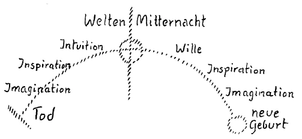
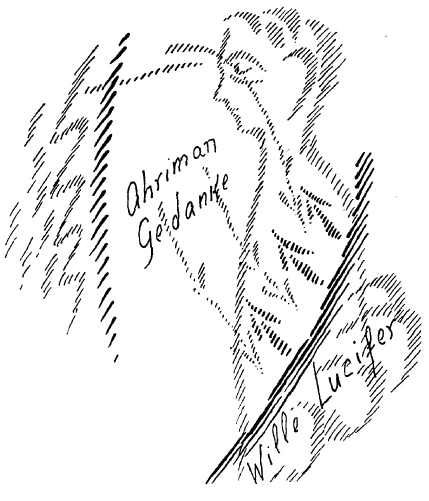
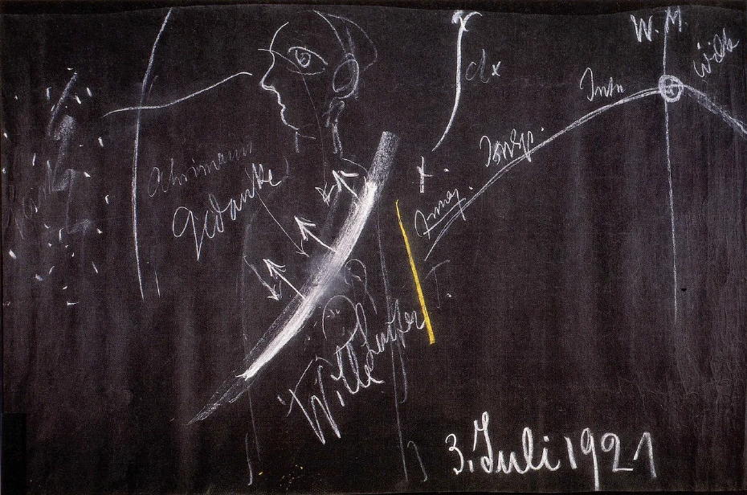
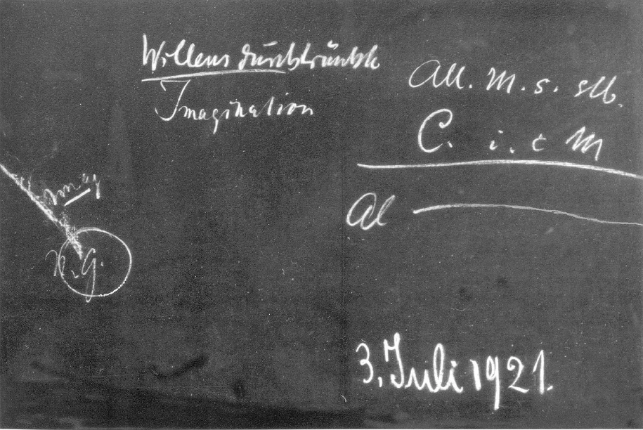

[ 1 ] ^e3d7yd

Nach den Betrachtungen, die wir angestellt haben, wird nun eine Grundtatsache des menschlichen Lebens und Wesens gut vor unsere Seele hintreten können. Es ist ja gerade dann, wenn man sich auf eine genauere Betrachtung des Verhältnisses des Menschen zu seiner Umwelt einläßt, immer eine Art Rätsel, wie es denn komme, daß man nicht hineinschauen kann in das eigentliche Wesen der äußeren Welt. Diese äußere Welt liegt uns vor in ihren Phänomenen, in ihren Ereignissen und auch, wenn wir nur ein schwaches Erkenntnisbedürfnis haben, müssen wir vermuten, daß hinter diesen Erscheinungen, die uns als farbige, als tönende, als wärmende Welt und so weiter vorliegen, erst das eigentliche Wesen der Wirklichkeit verborgen ist. Gewissermaßen ein Schleier ist da, und hinter diesem Schleier ist erst das eigentliche Wesen der Wirklichkeit. Auf der andern Seite liegt ein ähnliches Rätsel vor mit Bezug auf dasjenige, was menschliches Inneres ist. Ich habe ja in den letzten Tagen darauf hingedeutet, wie dieses menschliche Innere seine Organrätsel enthüllt, wenn man erst wirklich hineingelangt in dieses Innere. Aber es liegt doch zunächst für das gewöhnliche Bewußtsein die Tatsache vor, daß man nicht so tief hinunterschauen kann ins eigene Innere, um die Natur von Lunge, Leber und so weiter, wie wir das gestern besprochen haben, wirklich durchschauen zu können. Nun, diese Tatsache des Vorhandenseins zweier Rätsel, des Rätsels gegenüber der Unerkennbarkeit der äußeren Welt, des Rätsels der Unerkennbarkeit der inneren Welt, diese Tatsache versteht man aus der Erkenntnis des ganzen Wesens des Menschen heraus, wenn man sich einläßt darauf, die ganze menschliche Natur einmal ins Auge zu fassen, die ja nur die eine Seite hier zwischen Geburt und Tod uns zeigt, die andere Seite zwischen dem Tod und einer neuen Geburt hat. ^8bpc2k

[ 2 ] ^mhndy2

Aber betrachten wir zunächst den Menschen, wie er sich uns darbietet hier zwischen der Geburt und dem Tode. Wir brauchen da zunächst eine innere seelische Tatsache, die mit unserem ganzen normalen Tagesleben zusammenhängt, wir brauchen die innere Tatsache des Gedächtnisses. Ich habe gestern davon gesprochen, wie dieses Gedächtnis eigentlich beruht auf einer Rückspiegelung an den Außenseiten der inneren Organe. Aber wir brauchen ja dieses Gedächtnis für unser Seelenleben. Ich habe öfters auf Tatsachen hingewiesen, welche zeigen, wie die Störung dieses Gedächtnisses unser ganzes normales Leben hier zwischen Geburt und Tod untergraben kann. Es war dies ein Beispiel, welches zeigte, daß das Erinnerungsvermögen sich im Menschen auslöschen kann. Solche Fälle sind ja auch sonst bekannt. Sie können in psychologischen Werken von zahlreichen solchen Fällen lesen. Es ist ja eine ganz bekannte Tatsache, daß das geschehen kann, und in kleinerem Maßstabe findet sich diese Erscheinung viel häufiger, als man eigentlich denkt. Und Sie brauchen sich ja auch nichts anderes vorzustellen, als daß einfach für solche Menschen diese Vorgänge, ohne daß sie im gewöhnlichen Sinne des Wortes davon wissen, so sind, wie für Sie vom Einschlafen bis zum Aufwachen jede Nacht: das Bewußtsein ist ausgelöscht. Aber es übt eine solche abnorme Diskontinuität des Bewußtseins einen außerordentlich bedeutsamen Einfluß auf das ganze Persönlichkeitsbewußtsein aus. Es kommt der Mensch nicht mehr mit sich zurecht, wenn er so etwas durchgemacht hat; es ist ihm nachträglich im Leben eigentlich etwas Furchtbares. Daraus aber können Sie sehen, wie wichtig es ist, für das gewöhnliche Leben zwischen Geburt und Tod - mit Ausnahme der Schlafenszustände - die Kontinuität des Bewußtseins zu haben. ^l2ohu9

[ 3 ] ^qa3gj4

Die Kontinuität des Bewußtseins hängt ja zusammen mit unserem Gedächtnis. Wir brauchen also das Gedächtnis, um das gewöhnliche Leben normal zu unterhalten. Nun besteht, wenn man eine okkulte Entwickelung durchmacht, eine andere Tatsache. Es besteht die Tatsache, daß man nötig hat, solche Seelenkräfte zu entwickeln, welche eigentlich für die Momente des geistigen Schauens dieses gewöhnliche Gedächtnis auch auslöschen. Solange man nämlich dieses gewöhnliche Gedächtnis hat, kann man im Grunde genommen nicht in die geistige Welt hineinschauen. Und bei Schülern der okkulten Entwickelung stellt sich gewöhnlich als ein Erlebnis dieses heraus, daß sie anfangs, wenn sie beginnen, an ihrer Entwickelung zu arbeiten, gewisse Schauungen haben und dann später darüber klagen, daß sie diese Schauungen nicht mehr haben, daß sie ausbleiben. Das beruht darauf, daß es für solche Schauungen, wenn sie echte, wahre Schauungen sind, wenn sie nicht Halluzinationen sind, eigentlich kein Gedächtnis gibt. Es ist nicht möglich, sich wiederum an eine Schauung zu erinnern, denn die Schauung ist etwas Reales. Sehen Sie ein Stück Kreide an und sehen Sie wieder weg, so haben Sie das Erinnerungsbild. Wollen Sie aber die Kreide vor sich haben, die reale Kreide, dann müssen Sie wieder zurückkehren zur Wahrnehmung, Sie müssen wiederum das Reale vor sich haben. Für dieses Reale hilft Ihnen das Gedächtnis gar nichts. Wenn Sie ein heißes Eisen berühren, so verbrennen Sie sich. Sie können noch soviel von der Hitze in der Erinnerung haben, Sie verbrennen sich nicht dabei. Sie müssen, weil die Schauung Sie in Zusammenhang bringt mit etwas Realem und nicht ein bloßes Bild ist, wiederum zu ihr zurückkehren. Es handelt sich darum, daß man zu der Schauung wiederum zurückkehrt, nicht sich bloß erinnert, denn ein wirkliches Schauen ist ein wirkliches okkultes Erlebnis und kann nicht Erinnerung werden, sondern man kann nur auf indirekte Weise wiederum dazu kommen. Man kann sich sagen: Bevor die Schauung eingetreten ist, habe ich dies oder jenes durchgemacht im gewöhnlichen Bewußtsein. Daran kann man sich dann erinnern, und man muß diese Etappe wiederum heraufrufen bis zu dem Punkte, wo die Schauung eingetreten ist; dann kommt man bei dem Punkte an. Sie kann nicht wieder unmittelbar eintreten, aber man muß den Weg gewissermaßen wiederum zurückmachen. Das berücksichtigen viele nicht; sie glauben, man könne sich an eine Schauung im gewöhnlichen Sinne erinnern. Man muß also in einer gewissen Beziehung sogar bei der okkulten Entwickelung das Gedächtnis untergraben. Das ist durchaus notwendig, es läßt sich das gar nicht verhindern. Deshalb muß man sagen: Derjenige, der eine solche okkulte Entwickelung anstrebt, der muß vor allen Dingen sicher sein, daß er im gewöhnlichen Leben ein vernünftiger Mensch ist, das heißt, daß er ohne irgendwelche falschmystischen Anwandelungen einen gesunden Verstand und ein gesundes Gedächtnis hat. Wer im gewöhnlichen Leben schon irgendwie herumschwefelt oder schwimmelt, ist nicht geeignet, eine okkulte Entwickelung durchzumachen. Man muß durchaus die Möglichkeit haben, sich an die Ereignisse des Tages mit aller Bestimmtheit zu erinnern, dann kann man es wagen, zu den Schauungen vorzudringen, für die es eben nicht ein solches Erinnern gibt. Die Vorsichten, die anempfohlen werden für eine okkulte Entwickelung, sind durchaus eben in der Sache selbst begründet. So können Sie sagen: Für das gewöhnliche Bewußtsein ist das Gedächtnis da, und es gehört zu einem normalen Leben zwischen Geburt und Tod dieses Gedächtnis. ^ziq85h

[ 4 ] ^1imrkr

Nun kann ich Ihnen schematisch aufzeichnen, wie sich das menschliche Wesen im Besitze dieses Gedächtnisses verhält. Ich will es Ihnen etwa so aufzeichnen (siehe Zeichnung Seite 128). Es ist das, was ich jetzt aufzeichne, nicht als solches vorhanden, aber es ist im Ätherleib wahrzunehmen. Ich zeichne schematisch als diese Linie das, was eigentlich über den ganzen Leib ausgedehnt ist, und Sie müßten sich dann vorstellen, daß vom Kopf, also von den Sinneswahrnehmungen, Sinnesorganen, bis zu dieser Linie dasjenige ist, was außerhalb der Organe ist. Diese Linie soll die schematische Grenzlinie für die Organe des Menschen sein: Hier wird zurückgespiegelt, und jenseits dieser Linie liegen also Herz, Lunge, Leber und so weiter. Hier (Pfeile) wird zurückgespiegelt. Das ist symbolisch die Linie des menschlichen Gedächtnisses. Sie können sich förmlich vorstellen: Wir haben in unserem Inneren ein Häutchen; es ist eigentlich das Grenzhäutchen zwischen dem AÄtherleib und dem Astralleib, nur ist es in Wirklichkeit nicht räumlich, es ist eben schematisch gezeichnet. Es wird dasjenige, was wahrgenommen ist, durch die Kraft der Organe, die dahinter sind, zurückgeworfen; es wird dadurch gespiegelt, aber es wird eben dennoch hier gespiegelt, und wir können nicht durchschauen im gewöhnlichen Bewußtsein, wir können durch die Gedächtnishaut nicht in das Innere des Menschen hineinschauen. Das Gedächtnis deckt uns das Innere des Menschen zu. Es muß das Innere des Menschen zudecken, sonst wäre der Mensch nicht normal im gewöhnlichen Leben zwischen Geburt und Tod. Das Gedächtnis ist dasjenige, was uns unser gewöhnliches Bewußtsein nach innen zu verschließt. Sobald dieses Gedächtnis unterbrochen wird, sobald also irgendwo ein Riß entsteht, wie es durch die okkulte Entwickelung geschieht, sehen wir so, wie ich es gestern beschrieben habe, in unsere Organe hinein. ^48xa51

[ 5 ] ^fwf8ma

Nun haben wir die Antwort auf das Rätsel des Nicht-nach-Innenschauen-Könnens. Es muß zugedeckt sein dieses Innere, sonst würden wir nicht normal sein im Leben zwischen Geburt und Tod, denn wir brauchen dieses Gedächtnis. Also das Innere unseres Selbst wird uns verhüllt durch unsere Gedächtnisspiegelung. Das ist dasjenige, was Sie als eine Lösung dieses Rätsels haben müssen. ^kxsz8p

[ 6 ] ^0zg6ag

Nach der andern Seite, nach der Seite der Außenwelt, da sehen wir gewissermaßen ausgebreitet den Sinnenschleier und sehen nicht dahinter. Wir wollen einmal die Sache so auffassen, daß wir uns sagen: Wie wäre es, wenn wir dahintersehen würden, wenn wir also, nach außen schauend, nicht den Sinnenschleier hätten, hinter dem die Wesenheit der Welt liegt, sondern wenn das überall durchbrochen wäre, wenn man da überall durchschauen und durchgucken könnte, wie wäre es dann? - Wir würden stets mit unserer Wahrnehmung, mit unserer Anschauung in die Dinge hineinfließen. Wir würden mit den Dingen zusammenfließen. Wir könnten uns nicht unterscheiden von den Dingen. Und was wäre die Folge? Niemals könnten wir, wenn wir uns nicht unterscheiden könnten von den Dingen, die Gefühle der Liebe entwickeln, denn Liebe beruht darauf, daß man nicht hinüberfließt in den andern, sondern daß man eine Individualität bleibt, getrennt ist und dennoch hinüberfühlt. Wir sind so organisiert, daß wir liebefähig sind zwischen Geburt und Tod. Und in der okkulten Entwickelung muß diese Liebefähigkeit wiederum durch Imagination, Inspiration, Intuition ersetzt werden. Wir müssen gewissermaßen die Liebefähigkeit durchbrechen. Es würde unser Leben total ruinieren, wir würden kaltherzig werden, wenn wir im gewöhnlichen Leben die Liebe nicht hätten. Daher ist es wieder notwendig, daß derjenige, der nach dieser Richtung hin eine okkulte Entwickelung durchmacht, vor allen Dingen im höchsten Grade die Liebefähigkeit entwickelt. Hat er sie so entwickelt, daß er sie nicht verlieren kann durch die okkulte Entwickelung, daß er sie trotz dieser Entwickelung behält, dann kann er es wagen, den Sinnenschleier zu durchdringen und in die wirkliche Objektivität hinauszuschauen. Sie sehen das zweite Rätsel vor Ihre Seele hingestellt. Der Mensch muß so organisiert sein, daß er gedächtnisfähig und liebefähig ist. Weil er liebefähig sein muß, kann er mit dem gewöhnlichen Bewußtsein nicht hinter den Sinnenschleier hinüberschauen, und weil er gedächtnisfähig sein muß, kann er nicht in das eigene Innere hineinschauen. ^q9la5p

[ 7 ] ^qafjfs

Das ist dasjenige, was eigentlich die Wahrheit der so falschen Kantschen Philosophie ist. Kant wollte die menschliche Subjektivität untersuchen und hat einige ganz abstrakte Begriffe hingepfahlt, die eigentlich nichts besagen. In Wirklichkeit ist es so, daß wir den Menschen zwischen Geburt und Tod als gedächtnisfähiges und liebefähiges Wesen verstehen müssen. Da lernt der Mensch das kennen, was in der Empfindung lebt, da lernt der Mensch kennen, was in der Liebe lebt. Und das hat er durch die Pforte des Todes hinüberzutragen. Aber deshalb sind wir auf der Erde, damit wir in diesen beiden Fähigkeiten uns vervollkommnen. ^do3t6g

[ 8 ] ^yxcyug

Wenn nun der Mensch durch das Gedächtnis auseinanderzuhalten hat sein wahrnehmendes und denkendes Wesen, das außerdem hier an den Sinnenschleier stößt, dann entwickelt er, hauptsächlich durch das Haupt — aber der Mensch ist ja im Ganzen Haupt -, das Leben, das wir als das Leben des Bewußtseins bezeichnen. Dieses Leben des Bewußtseins bleibt beim Gedanken stehen. Der Gedanke wird Erinnerungsbild. Aber wir dringen nicht weiter vor als bis zum Erinnerungsbild. Da wird der Gedanke aufgehalten; nur dadurch, daß er da aufgehalten wird, kann er ja immer wiederum zurückkommen als Erinnerung. Da wird der Gedanke aufgehalten, und unser normales Leben zwischen Geburt und Tod beruht eigentlich darauf, daß wir den Gedanken nicht hinunterlassen in die Organe. Seine Kräfte kommen hinunter, wie ich das gestern geschildert habe, aber den Gedanken als solchen, wie er lebt in uns als Bild, den können wir nicht hinunterlassen. In dem Augenblicke, wo wir sterben, da wird der Gedanke das, was er im gewöhnlichen Bewußtsein nicht werden soll: da wird der Gedanke Imagination. Diese Imagination, die in der okkulten Entwickelung mit aller Mühe erstrebt wird, die tritt ein, wenn der Mensch durch den Tod geht. Alle seine Gedanken werden Bilder. Der Mensch lebt dann ganz in Bildern. Man kann daher den Toten nur verstehen, wenn man diese Bildersprache kennengelernt hat. Sofort nach dem Tode verwandeln sich die Gedanken in Bilder. Mit diesen Bildern lebt der Mensch ja einige Zeit zwischen dem Tod und einer neuen Geburt. Dann werden die Bilder nach und nach Inspiration. So wächst die Seele tatsächlich weiter. Die Bilder werden Inspiration. Da fängt der Mensch dann an, die Sphärenmusik wahrzunehmen. Da wird für ihn die Sphärenmusik etwas Reales. Er lebt in der Welt der Weltentöne. Und zuletzt wächst er zusammen mit dem objektiv-geistigen Weltenall. Seine Seele wird ganz Intuition. Er wird gewissermaßen eins mit dem Weltenall. ^466yu1

[ 9 ] ^nbwh6c

Das ist zugleich der Punkt, wenn eine Zeitlang diese Intuition da war, wo die Weltenmitternacht eintritt, von der ich auch gestern wieder sprach. Nun beginnt der Rückweg, und die Intuition ist nun geeignet, etwas aufzunehmen, was der Mensch allmählich verlassen hat, indem er hier auf der Erde gelebt hat. Wenn der Mensch nämlich durch des Todes Pforte getreten ist, lebt er durch andere Kräfte, als diejenigen sind, die wir hier auf der Erde den Willen nennen. Er lebt sich in kosmischere Kräfte ein. Der Wille wird, ich möchte sagen, absorbiert, der Wille schwindet allmählich dahin. Aber wenn der Mensch an der Weltenmitternacht angekommen ist, also nachdem er durch den imaginativen Zustand, durch den Inspirationszustand, Intuitionszustand durchgegangen ist und gewissermaßen auf der Höhe des Lebens zwischen Tod und neuer Geburt angekommen ist, dann füllt sich die Intuition wiederum mit Wille an. Der Gedanke wird wiederum willensmäßig, und dieser Wille durchsättigt immer mehr und mehr die Seele, die nun wiederum zur Inspiration sich durchringt, dann zur Imagination. Wenn sie bei der Imagination angekommen ist und eine Zeitlang sie durchgemacht hat, dann ist sie wiederum reif, hier verkörpert zu werden. Aus dem Bilde heraus bildet sich auf die Weise, wie ich es geschildert habe, was dann als umgewandelter Gliedmaßen-Stoffwechselmensch der vorigen Inkarnation da auftritt. Sie sehen also, durch diejenigen Stufen, welche angestrebt werden bei der okkulten Entwickelung, steigt der Mensch hinauf bis zur Weltenmitternacht, und er geht dann den umgekehrten Weg wiederum herunter bis zur Imagination und kommt bei der Gedankenbildung an, wenn er sich verkörpert. ^u3r4i9

[ 10 ] ^eg2ab7

Während dieser ganzen Zeit nimmt der Mensch den Willen auf. Und nun, indem der Mensch wiederum ins physische Dasein kommt, sehen wir, wie das, was aus dem Kosmos hereinwirkt, was er in sich aufgenommen hat von der vorigen Inkarnation, im Bilde ist, und im Bilde ist noch der Wille drinnen. Wir haben also jetzt hier eine willensdurchtränkte Imagination. ^70utig

 ^b927bx

[ 11 ] ^zuzsu7

Wenn der Mensch also vor der Konzeption ankommt bei einem neuen physischen Leben, hat er zwar eine Imagination, aber eine willensdurchtränkte Imagination. Aus der Imagination, die im wesentlichen ja dasjenige ist, was schon da war als Bild, entsteht das Haupt und was zunächst dazugehört, und der Wille, der bemächtigt sich der neuen Gliedmaßen und des Stoffwechsels. So daß sich dieses hier verteilt auf das Haupt und auf den übrigen Menschen. Das Haupt ist im wesentlichen, ich möchte sagen, kristallisierter, erstarrter Gedanke; was im übrigen Menschen lebt, ist organisierter Wille. Eigentlich kann der Mensch nur im Haupte wirklich aufwachen. Nicht wahr, Ihre Gedanken kennen Sie, Ihre Vorstellungen sind im gewöhnlichen Bewußtsein — das kann man zu allen heutigen Menschen sagen; was im Willen vorgeht, ich habe es öfter erwähnt, das ist den Menschen genau so unbekannt wie das, was im Schlafe vor sich geht. Denn wie weiß man, wenn man einen Arm hebt, im gewöhnlichen Bewußtsein, was da vor sich geht! Man nimmt wahr, daß der Arm gehoben wird, die Vorstellung hat man, aber der Willensakt als solcher bleibt im Schlaf, verhältnismäßig so, wie dasSchlafen zwischen Einschlafen und Aufwachen ist. Also kann man sagen: Mit Bezug auf den Gliedmaßen-Stoffwechselmenschen schläft der Mensch auch bei Tag; er erwacht eigentlich nur in bezug auf seinen Hauptesmenschen. - Das wirkt alles wiederum zusammen. ^huboyo

[ 12 ] ^21vcse

Die offizielle Wissenschaft heute spricht von einer gewissen Logik. Sie spricht in der Logik von Vorstellung, von Urteil und von Schluß. Ja, stellen wir einen solchen Schluß vor uns hin. Der bekannte Schluß, der in allen Logiken steht, bezieht sich ja auf die berühmte logische Persönlichkeit. Also: AlleMenschen sind sterblich, Cäsar ist ein Mensch, also ist Cäsar sterblich. - Das ist der Schluß. Jedes Glied des Schlusses ist ein Urteil: Alle Menschen sind sterblich - ist ein Urteil, Cäsar ist ein Mensch - ist ein Urteil, also ist Cäsar sterblich - ist ein Urteil. Das Ganze ist ein Schluß. Mensch, Cäsar, sind Vorstellungen. ^aupby9

[ 13 ] ^srpb7o

Wenn Sie heute einen Menschen fragen, der nun wiederum zu den ganz Gescheiten gehört - wir müssen uns immer an die ganz Gescheiten halten, denn die geben ja den Ton an -, dann sagt er: Alles das geht so vor, daß es sich im Nervensystem abspielt. Das Nervensystem ist der Vermittler von Vorstellung, Urteil, Schluß, sogar von Gefühl und Wille. - Aber schon bei diesem Vorstellen, Urteilen und Schließen ist es nicht so, wie das heutige offizielle Denken meint. Nur das Vorstellen als solches ist nämlich eigentlich eine Kopfangelegenheit. Wenn Sie ein Urteil fällen, dann müssen Sie allerdings durch Vermittelung des Ätherleibes fühlen, wie Sie auf den Beinen stehen. Sie urteilen nämlich gar nicht mit dem Kopf, Sie urteilen mit den Beinen, allerdings mit den Beinen des Ätherleibes. Derjenige, der urteilt, auch wenn er liegt, streckt seine Ätherbeine aus. Urteilen beruht nicht auf dem Kopfe, Urteilen beruht auf den Beinen. Das glaubt einem natürlich heute keiner, aber wahr ist es doch. Und Schließen, das beruht auf den Armen und Händen, überhaupt auf dem, was sich beim Menschen heraushebt aus dem, was auch das Tier hat. Das Tier steht auf den Beinen, das Tier ist selbst ein Urteil, aber es schließt nicht. Der Mensch schließt. Dazu hat er seine Arme frei bekommen, dazu sind seine Arme da, nicht zum Gehen. Der Mensch hat seine Arme frei, damit er ein Wesen ist, das schließen kann. Und was sich vollzieht, indem man auf seine Ätherbeine tritt, und was sich vollzieht, indem man seinen Astralarm bewegt, das ist Urteil, das ist Schluß, das spiegelt sich bloß im Haupte als Vorstellung und wird dann auch zur Vorstellung. So daß man den ganzen Menschen braucht, nicht bloß den Nerven-Sinnesmenschen, damit Urteil und Schluß zustande kommen. ^ptf84r

[ 14 ] ^lq0dev

Nun, wenn Sie das in Betracht ziehen, dann werden Sie sich sagen: Der Mensch holt aus seinem Gliedmaßensystem eigentlich Urteil und Schluß heraus. Das sind nämlich schon Willensakte im Grunde genommen, und das kommt aus einem unbestimmteren Zustande heraus, als das Vorstellen ist. Geradeso wie wir des Morgens aufwachen, so erleben wir im Grunde genommen, wenn wir mit einem Schluß fertig sind. Wir haben ihn aus der ganzen Tiefe unseres Wesens hervorgeholt. Dasjenige, was vom vorigen Leben bis zu diesem Leben alt geworden ist, was sich im Kopfe auslebt, das führt uns dazu, Vorstellungen haben zu können durch den Kopf. Da sind wir in bezug auf den Kosmos alt, wenn wir geboren werden. Und daß unser Wille sich erneuert hat, das ist, weil wir in bezug auf den Kosmos jung geworden sind. Es ist immer dasjenige, was wir als Haupt an uns tragen, erinnernd an die vorige Inkarnation. Es ist das Alte. Was der Gliedmaßen-Stoffwechselmensch ist, das hat sich der Wille erobert, indem er in diese Inkarnation hereinzieht. Das wird ihm eigentlich vermittelt durch den Mutterleib. Denn das andere - man braucht ja nur die äußere empirische Embryologie zu studieren, so wird es bestätigt - wird eigentlich aus dem Kosmos herein in die Mutter konstruiert. Das Haupt ist eben ein Abbild des Kosmos, wird durch äußere Kräfte bewirkt. Derjenige, der das leugnen will, der soll auch nur sagen, es sei ein Unsinn, daß der Magnetismus der Erde die Magnetnadel stellt. Der Physiker geht, wenn er die Magnetnadel erklären will, aus der Magnetnadel heraus; der Physiologe, der Embryologe, der Biologe, der bleibt, wenn er den Embryo erklären will, im Mutterleib drinnen. Das ist ebenso unsinnig, wie wenn man die Magnetnadel nur aus sich selbst erklären wollte. Man muß herausgehen zum ganzen Kosmos. Wir haben zunächst das Haupt in der ganzen Entwickelung und darangegliedert nur wird der übrige Leib, den sich der Wille erobert, der sich an die Imagination herangemacht hat während des Durchganges durch das Leben zwischen Tod und neuer Geburt von der Mitternachtsstunde des Daseins an. ^31ntas

[ 15 ] ^ag64j8

Nun, wenn wir diesen Menschen hier betrachten (siehe Zeichnung Seite 128), so finden wir alles, was sich auf das Denken und auf die Wahrnehmung bezieht, oberhalb des Gedächtnishäutchens, alles, was sich auf den Willen bezieht, unterhalb. Das wirkt herauf, wirkt aus dem Unbewußten herauf, das man erst auf die Weise findet, wie wir es gestern auseinandergesetzt haben. Da wirkt der Wille herauf. In bezug auf den Willen sind wir schlafend. Und so haben wir eigentlich den Menschen wirklich als eine Dualität im Leben zwischen Geburt und Tod. Der Mensch ist schon ein Monon, aber er ist es in bezug auf die ganze Welt, und er muß es im Werden herstellen, dieses Monadische. Er muß es immer wieder erneuern. Aber in Wirklichkeit ist der Mensch zwischen Geburt und Tod dualistisch: der Gedanke gewissermaßen mit der Wahrnehmung auf der einen Seite, der Wille mit dem Gemüt auf der andern Seite. ^7k8z87

[ 16 ] ^pw7cik

Dadurch aber ist der Mensch eigentlich, ich möchte sagen, der Durchschnitt durch zwei Welten, Denn bitte, seien Sie ehrlich und fragen Sie sich, was haben Sie denn in jedem Momente Ihres Lebens im Bewußtsein? Ihre Erinnerungsvorstellungen, dasjenige, was Sie erlebt haben seit dem zweiten, dritten Jahr oder fünften, sechsten Jahr, das ist der Inhalt des Bewußtseins. Und was von unten da durchkommt, was aus dem Willen herausquillt, das ist die Liebe, die Liebefähigkeit. Und eigentlich ist der Mensch nichts anderes als dasjenige, was da im Durchschnitte erscheint als Erinnerungsbilder und Liebe. Es ist im Grunde genommen der Mensch so: oberhalb ist eine Welt, die kosmischer Gedanke ist, unterhalb ist eine Welt, die kosmischer Wille ist. Und immerzu ist der Mensch der Angriffspunkt für Luzifer von der Willensseite her und der Angriffspunkt für Ahriman auf der Gedankenseite (siehe Zeichnung). Ahriman möchte fortwährend den Menschen ganz zum Kopfe machen. Luzifer möchte fortwährend dem Menschen den Kopf abschlagen, daß er gar nicht denken kann, daß alles auf dem Umwege durch das Herz in Wärme herausströmt, daß er ganz überfließt von Weltenliebe und ausfließt in die Welt als Weltenliebe, als ein kosmisch-schwärmerisches Wesen ausfließt. ^zan3bg

[ 17 ] ^kta77t

In unserem Zeitalter, in unserer hochgepriesenen Kultur haben wir vorzugsweise ahrimanische Einflüsse tätig. Diese ahrimanischen Einflüsse, sensitivere Menschen haben sie immer verspürt. Als ich noch ein ganz junger Mensch war, redete ich einmal mit einem österreichischen Dichter, der dazumal sehr bekannt war; der hatte eine feine Empfindung für das, was in der Kultur heraufzieht, und er drückte das halbbildlich aus, aber dieses Halbbildliche war für ihn eine Wirklichkeit. Er sagte zu mir - es ist mir, als ob es heute geschehen wäre: Wie wir heutigen Menschen wären, das sei eigentlich ein furchtbares Los; ein furchtbares Los, das die Menschheit treffen wird, wenn die Dinge so fortgehen, wie sie jetzt gehen. Denn der Mensch wird allmählich die Geschicklichkeit seiner Glieder verlieren, er wird nicht mehr ordentlich gehen können, er wird immerfort radfahren und sich mechanisch weiterbewegen; er wird auch die unmittelbare Geschicklichkeit seiner Hände verlieren, alles wird technisch. Geradeso wie ein Muskel verkümmert, der nicht gebraucht wird, so wird alles das allmählich verkümmern und der Mensch wird nur Kopf werden. Der Kopf wird immer größer werden, und zuletzt wird sich der Mensch so fortkugeln mit einem ganz verkrüppelten übrigen Organismus. ^sv0tip

[ 18 ] ^omz3y5

Dieses Bild stand, ich möchte sagen, wie ein Alpdruck vor diesem österreichischen Dichter - Hermann Rollett hieß er -, und er schilderte das ganz anschaulich, denn es bedrückte ihn ganz ungeheuer diese Vorstellung, daß die Menschen einmal rollende Köpfe werden durch unsere Kultur. Aber es liegt etwas sehr Wahres dem zugrunde. Es liegt das zugrunde, daß tatsächlich in unserer Zeit die Mächte außerordentlich stark sind, welche unseren Kopf immer mehr und mehr entwickeln möchten. Mit dem physischen Kopf gelingt es ihnen nicht gerade ganz besonders gut, aber mit dem Ätherkopf gelingt es schon besser. Also es ist tatsächlich so, daß in unserer Zeit uns die ahrimanischen Mächte zu ganzen Kopfmenschen machen möchten, daß sie uns ganz und gar umgestalten möchten zu bloßen Denkern. ^vhm4gb

[ 19 ] ^sq20c2

Aber für den Menschen in seiner gesunden Entwickelung ist der andere Pol da, der Willenspol, der immer entgegenarbeitet, wenn wir sterben, so daß der Wille den Gedanken ergriffen hat. Der Gedanke darf noch nicht allein sein. Wenn wir geboren werden, da haben wir neuen Willen gesammelt, aber der Gedanke sondert sich ab, findet unseren Kopf; der Wille bemächtigt sich des andern Leibes. Während wir auf der Erde leben, ist ein fortwährendes Wechselwirken da zwischen Wille und Gedanke in uns. Der Wille bemächtigt sich des Gedankens, und wir müssen dieses Zusammengesetzte aus Wille und Gedanke wiederum durchtragen durch den Tod. Ahriman möchte uns daran verhindern. Der möchte, daß der Wille abgesondert bleibt, daß der Gedanke nur in uns besonders ausgebildet würde. Dann verlören wir unsere Individualität, wenn es zuletzt wirklich zu dem käme, was Ahriman eigentlich will. Wir verlören vollständig unsere Individualität. Wir würden mit einem geradezu übertriebenen, instinktiv ausgebildeten Gedanken im Momente des Todes ankommen. Aber den könnten wir Menschen nicht halten, diesen Gedanken, und Ahriman könnte sich seiner bemächtigen und ihn einfügen der übrigen Welt, so daß dieser Gedanke in der übrigen Welt weiterwirkte. Das ist tatsächlich das Schicksal, das der Menschheit droht, wenn sie den gegenwärtigen Materialismus fortsetzt, daß die ahrimanischen Mächte so stark werden, daß Ahriman den Menschen die Gedanken wegstehlen kann und sie der Erde einverleiben kann in ihrer Wirksamkeit, so daß die Erde, die eigentlich zugrunde gehen sollte, konsolidiert wird. Ahriman arbeitet darauf hin, daß die Erde konsolidiert wird, daß die Erde als Erde bestehen bleibt. Ahriman arbeitet gegen das Wort: «Himmel und Erde werden vergehen, aber meine Worte werden nicht vergehen.» Er will, daß die Worte weggeworfen werden und daß Himmel und Erde bestehen bleiben. Das kann nur erreicht werden, wenn den Menschen die Gedanken gestohlen werden, wenn die Menschen entindividualisiert werden. ^gv5g55

[ 20 ] ^pem2zp

Wenn Ahriman weiterwirken könnte, wie er es seit dem Jahre 1845 ja ganz besonders gekonnt hat, dann würden zunächst die menschlichen Gehirne immer steifer und steifer werden, und die Menschen würden wie unter Zwangsgedanken leben, unter materialisierten Gedanken, wie ich das gestern auseinandergesetzt habe. Es würde sich das besonders darin zeigen, daß die Menschen auch in der Erziehung so geführt würden, daß sie nicht bewegliche Gedanken haben, sondern daß sie, wenn sie ein bestimmtes Alter erreicht haben, ganz fixierte Gedanken haben. Nun bitte ich Sie, fragen Sie sich, ob das nicht schon im hohen Grade vielfach gegenwärtig erreicht ist! Denken Sie nur, wie fixiert die Gedanken vieler Menschen heute sind. Kann man den Menschen heute noch viel beibringen? Ihre Gedanken sind so starr, so fest, daß man ihnen nicht viel beibringen kann. Das ist schon ahrimanisch verwendet. Und Ahriman bemüht sich, das immer zu steigern, immer mehr die Gedanken zu Zwangsgedanken zu machen. Und ein solches wirksames Produkt dieser Zwangsgedanken auf wissenschaftlichem Gebiete ist der Atomismus. Da wird hinter dem Sinnenschleier nicht Geist vermutet, sondern lauter Atome, überall schwingende Atome, wirbelnde, schwingende Atome. Natürlich können Sie mit nichts anderem hinter diesen Sinnenschleier kommen als mit den Gedanken. Aber Ahriman hat die Leute schon so verwirrt, daß sie ihre Gedanken schon materialisiert haben. Sie glauben nicht mehr daran, daß sie eigentlich da nur eine Welt von Gedankenatomen konstruieren, sondern sie betrachten das als Wirklichkeit; sie setzen also die Gedanken da hinaus. Das ist durchaus ahrimanisierte Welt. Wir haben heute eine ahrimanisierte Wissenschaft, eine durch und durch ahrimanisierte Wissenschaft. ^zo4sh7

 ^e1vac8

[ 21 ] ^3nbcob

Daß man das hat, tritt einem zuweilen im Leben in einer furchtbaren Weise entgegen. Ich habe zum Beispiel einmal — es ist jetzt vielleicht fünfunddreißig Jahre her - ein Manuskript bekommen. Es war ein sehr gelehrtes Manuskript. Es sollte aufstellen das Menschendifferential - ich erzähle Ihnen eine wahre Geschichte -, das heißt, dasjenige Differential, daß, wenn man integriert, man den Menschen bekommt. Wenn man also integriert vom Fuß bis zum Kopf, bekommt man den Menschen. Es war eine sehr gelehrte Abhandlung. Und der Arzt, der mir das brachte, der sagte: Sie können den Verfasser auch kennenlernen -, denn er war bei ihm auf der Klinik. Und als ich den Mann kennenlernte, sagte der: Ja, das ist so, ich habe das selber erlebt, ich bestehe ja ganz aus Differentialatomen, überall sind Differentiale, ich bin nur ein Integral. - Er hatte sich ganz differenziert vorgestellt in lauter Atomen; das war eine intellektuell-ahrimanische Bewußtseinsart. Aber sie ist ja schließlich, ich möchte sagen, nur das starr gewordene System des Atomismus. Denn als mir dieses Manuskript gebracht wurde, mußte ich mich erinnern, daß es ja eine Laplacesche Weltenformel gibt: da soll es möglich sein, aus den Vorgängen der Atome durch Integration — wobei man jetzt nicht vom Fuß bis zum Kopf integriert, sondern wo man einfach vom Weltenanfang bis zum Weltenende zu integrieren hat — auszurechnen, wenn man irgendeinen speziellen Wert einsetzt, nun, sagen wir, wann Cäsar den Rubikon überschritten hat und dergleichen! Nicht wahr, einfach indem man die Atome in der Weltenformel vorbringt, in der entsprechenden Weise behandelt. Diese ganze Denkweise sah zum Verzweifeln ähnlich der Abhandlung, die jener Mann von sich selber gemacht hat, der sich ganz als ein zwischen den Grenzen von Fuß und Kopf eingeschlossenes Integral angesehen hat. Man kann da schon, wenn man die Dinge richtig anschaut, durchaus in das Ahrimanischwerden unserer Kultur hineinschauen. ^97za7d

[ 22 ] ^q8wlju

Dem muß natürlich entgegengearbeitet werden, und das kann nur dadurch geschehen, daß unsere Begriffe wiederum zur Bildlichkeit gebracht werden, daß wir also nicht bloß arbeiten mit abstrakten Begriffen, sondern daß wir unsere Begriffe zur Bildlichkeit bringen. Dann werden wir, wenn wir hinausgehen durch die Pforte des Todes, schon Bilder mitbringen, und wir finden den Anschluß an dasjenige, was die Welt fordert. Sonst geht die Menschheit der Gefahr entgegen, sich selbst zu verlieren, und was eigentlich durch das Hineinfließen des Willens in die Gedanken individualisiert werden sollte, das wird mineralisiert, wird zur allgemeinen Erde gemacht, und die Erde würde ein Weltenwesen werden, aber die Menschheit würde seelisch in einen großen Friedhof einmünden. ^uqwe68

[ 23 ] ^p5hg1j

Man muß zuweilen solche Kulturausblicke machen. In unserer Zeit ist es durchaus notwendig, solche Kulturausblicke zu machen. Denn derjenige, der die Dinge der Entwickelung heute genauer zu überschauen vermag, der weiß, wie rasch wir uns im Grunde genommen dieser Verknöcherung unserer Kultur nähern. Ich möchte auch bei dieser Gelegenheit nicht unerwähnt lassen, daß man ja bis zum Jahre 869, bis zum achten allgemeinen ökumenischen Konzil in Konstantinopel die Gliederung des Menschen hatte in Leib, Seele und Geist. Nun ist ja, wie ich öfter erwähnt habe, auf diesem achten allgemeinen ökumenischen Konzil für das Abendland die Formel aufgestellt worden: Es darf nicht geglaubt werden, daß der Mensch aus Leib und Seele und Geist besteht, sondern nur aus Leib und Seele, und die Seele hat einige geistige Eigenschaften. Das ist dann allgemein übergegangen. Im Mittelalter war es ketzerisch, häretisch, zu glauben, der Mensch bestünde aus Leib, Seele und Geist. Heute finden die Philosophieprofessoren durch unbefangene Wissenschaft: Der Mensch besteht nur aus Leib und Seele. Diese «unbefangene Wissenschaft» ist nichts anderes als ein Beschluß des achten allgemeinen ökumenischen Konzils. Aber das strebt nach einem andern hin. Man kann sagen: Durch dieses achte ökumenische Konzil hat die Menschheit verloren das Bewußtsein über den Geist, das wieder errungen werden muß. Gehen wir aber auf dem Wege weiter, den ich Ihnen jetzt geschildert habe, so verliert die Menschheit auch noch das Bewußtsein über die Seele. ^hqdrix

[ 24 ] ^z0z31m

Bei den Materialisten des 19. Jahrhunderts war dieses Bewußtsein über die Seele schon bis zu dem Grade verschwunden, daß man sagte: Das Gehirn sondert Gedanken ab wie die Leber Galle. Man hat also eigentlich nur noch das Bewußtsein der leiblichen Vorgänge gehabt. Und in der Tat, es bestehen heute schon, ohne daß es die Menschen wissen, in gewissen Untergründen, wo allerlei Gesellschaften nach solchen Dingen hinarbeiten, die Tendenzen, etwas Ähnliches herbeizuführen wie 869 auf dem Konzil von Konstantinopel, nämlich zu erklären: Der Mensch besteht nicht aus Leib und Seele, sondern der Mensch besteht aus dem Leib, und die Seele ist bloß etwas, was aus dem Leibe heraus sich entwickelt. Es ist daher unmöglich, den Menschen seelisch zu erziehen; man muß also ein Mittel, ein materielles Mittel finden, womit man den Menschen in einem gewissen Lebensalter impft, und dann wird er seine Talente ausbilden durch Impfung. - Diese Tendenz besteht durchaus. Sie liegt in der geraden Linie der ahrimanischen Entwickelung: nicht mehr Schulen zu gründen, um zu lehren, sondern mit gewissen Stoffen zu impfen. Man kann das nämlich. Es ist nicht so, als ob man es nicht könnte. Man kann es; aber man macht den Menschen zu einem Automaten. Man würde dasjenige riesig beschleunigen, was man sonst auf dem Wege des Gedankenzwanges, durch eine Erziehung, die auf Gedankenzwang hinarbeitet, erreicht. Es gibt schon durchaus Substanzen, die man gewinnen kann, wodurch der Mensch, wenn er zum Beispiel mit sieben Jahren geimpft würde, sich die Volksschule gut ersparen könnte; er würde nämlich ein Gedankenautomat.Er würde außerordentlich gescheit werden, aber er würde kein Bewußtsein davon haben. Es würde so ablaufen diese Gescheitheit. Aber was liegt vielen Menschen heute schon daran, ob der Mensch ein inneres Leben hat oder nicht, wenn er nur äußerlich herumläuft und das oder jenes tut! Diejenigen Menschen, die sich heute vorzugsweise der ahrimanischen Kultur ergeben - und die gibt es auch -, streben durchaus nach solchen Idealen hin. Schließlich, was könnte es denn Reizvolleres geben für eine Gesinnung, wie sie sich heute immer mehr verbreitet, als einen Impfstoff zu finden, statt sich mit den Kindern jahrelang abzuplagen! Man muß diese Dinge drastisch darstellen. Solange man sie nicht drastisch darstellt, merkt nämlich die Menschheit der Gegenwart nicht, zu welchen Zielen sie hinstrebt. Durch einen solchen Impfstoff würde eben einfach das erreicht werden, daß der Ätherleib gelockert würde im physischen Leibe. Sobald der Ätherleib gelockert wird, ist das Spiel zwischen dem Universum und dem Ätherleib ein außerordentlich lebhaftes und der Mensch würde Automat werden. Denn der physische Leib des Menschen muß hier auf der Erde durch geistigen Willen erzogen werden. ^jl50yn

[ 25 ] ^jb9ygl

Aus dem vollen Bewußtsein, das man vor Augen hat gegenüber der Automatisierung des Menschen, sind die Methoden für die Waldorfschule, die pädagogischen Methoden für die Waldorfschule ausfindig gemacht. Sie sollen durchaus in dieser Beziehung ein Kulturmotor sein, der wiederum zur Spiritualisierung hinführt. Denn es ist im Grunde genommen — man kann das schon sagen - heute vor allen Dingen notwendig, daß das geistige Leben unter den Menschen als geistiges Leben besonders gepflegt werde. Daher sollte man auch wacker hinsehen auf alles das, was als Symptom zur Besserung bei einzelnen Menschen hervortritt. Ich habe es bei andern Gelegenheiten oftmals hervorgehoben, wie die Menschheit heute darnach strebt, an Stelle der wirklichen Lebenspraxis die Routine zu setzen; Routine, was ja Mechanisierung des Lebens ist. ^9k8ro8

[ 26 ] ^6i7qcm

Ich mußte mich neulich sehr freuen, als ich las, wie es doch noch Menschen gibt, die außer der gewöhnlichen Lebensroutine eine wirkliche Lebenspraxis auch im praktischen Leben immer schon als etwas Wichtiges angesehen haben. Es ging nämlich neulich einmal die Nachricht durch die Welt, wie Edison seine Leute geprüft hat, die er für Praktiker vorbereiten wollte. Es interessierte ihn gar nicht, ob ein Kaufmann gut buchführen kann. Das, sagte er, lernt einer in drei Wochen, wenn er sonst ein geschickter, vernünftiger Mensch ist. -Alle diese Spezialitäten, die interessieren ihn gar nicht, das bringt man schon fertig. Und es ist richtig. Aber Edison legte den Menschen, von denen er wissen wollte, ob sie auch etwas im praktischen Leben taugen, Fragen vor, Fragen von dieser Art etwa: Wie groß ist Sibirien? — Also wenn er irgendeinen prüfen wollte, ob er ein guter Buchhalter ist, fragte er nicht, ob er richtig eine Bilanz verfertigen kann, sondern: Wie groß ist Sibirien? - Oder: Wenn ein Zimmer fünf Meter lang, drei Meter breit und vier Meter hoch ist, wieviel Kubikmeter Luft faßt es dann? — und ähnliche Fragen. Er legte Fragen vor: Was steht an derjenigen Stelle, wo Cäsar den Rubikon überschritt - und so weiter, ganz allgemeine Fragen, und je nachdem der eine mehr oder weniger solche allgemeine Fragen beantworten konnte, stellte Edison ihn zum Buchhalter oder so etwas an. Ob er also gut Bücher führen kann oder nicht, das interessierte ihn gar nicht, denn das wußte er: Wenn jemand eine solche Frage beantworten kann, so ist ein Beweis dafür geliefert, daß er seine Schulzeit nicht vergebens abgesessen hat, daß er als Kind mit beweglichen Gedanken sich heranentwickelt hat; und das verlangte er. ^xjtenf

[ 27 ] ^3eky7l

So sollte eigentlich die Praxis gestaltet werden, während wir in der letzten Zeit gerade dem Gegenteil zugesteuert haben und immer mehr in Spezialisierungen verfallen sind, so daß schließlich wirklich es zum Verzweifeln war mit den Leuten, die man für die Praxis brauchte. Sie waren überhaupt nicht mehr zu gewinnen für irgend etwas, was außerhalb der Kassette war, in die sie gerade eingepfercht sein wollten. Man muß schon sagen: Auch auf diese Weise muß in die Beweglichkeit der Gedanken hineingearbeitet werden. Wenn in solcher Weise in die Beweglichkeit der Gedanken hineingearbeitet wird, dann werden sich diese Gedanken nicht verhärten und Ahriman wird einen schweren Stand haben. Aber Sie werden selber sehen, wenn Sie das Leben betrachten, wie wenig die Edisons da sind, die gerade solche praktischen Grundsätze haben. Das, worauf es ankommt, ist, hinzuarbeiten nach der Bildlichkeit der Begriffe; wer nach der Bildlichkeit der Begriffe hinarbeitet, wird nicht mehr sagen können, er verstehe Geisteswissenschaft nicht. Denn gerade der Ruck, den sich ein Mensch gibt, um von dem Abstrakten die Bildlichkeit der Begriffe zu bekommen, der bedeutet auf der einen Seite die Möglichkeit, so etwas zu begreifen: Die Erde hat sich aus Mond, Sonne, Saturn entwickelt. Auf der andern Seite mischt sich für das innere Leben in die bildlichen Vorstellungen, in die Imaginationen, Gefühlsleben herein. Der Vollmensch tritt wirklich ein. ^kaidhp

[ 28 ] ^3tdex3

Neulich einmal wurde hier mitgeteilt, daß ein Kritiker der Anthroposophie gesagt hat, die Anthroposophie wäre keine Wissenschaft, weil sie dasjenige, wozu sie kommt, aus dem ganzen Menschen heraus schöpft; eine Wissenschaft aber dürfe nur aus dem Intellekt heraus schöpfen. Also Sie sehen, man definiert zuerst, was eine Wissenschaft ist, daß die nicht aus dem ganzen Menschen schöpfen darf, und dann sagt man: Es ist falsch, wenn aus dem ganzen Menschen geschöpft wird. — Auf diese Weise kann man natürlich alles in Grund und Boden definieren. Darauf kommt es gerade an, daß wir die einseitige Kopfkultur wiederum ausdehnen zu einer Vollmenschenkultur. Und es ist ja eigentlich nur das falsche Bewußtsein, das zu dieser Kopfkultur kommt und das sich dann ausbildet im praktischen Leben. Denn der falsche Glaube, daß wir mit dem Kopfe urteilen, schließen, der verleitet die Menschen zu der Kopfkultur. Wir urteilen mit den Beinen und schließen mit den Armen. Weiß man das einmal, daß der ganze Mensch schon notwendig ist zu einem Urteil und zu einem Schluß, dann wird man nicht mehr sich sträuben gegen den Grundsatz: Wirkliche Wahrheit muß aus dem ganzen, aus dem vollen Menschen herauskommen. Das ist dasjenige, worauf ich Sie heute hinweisen wollte. ^x30nmh

 ^6pjbuz

 ^eerlrp

