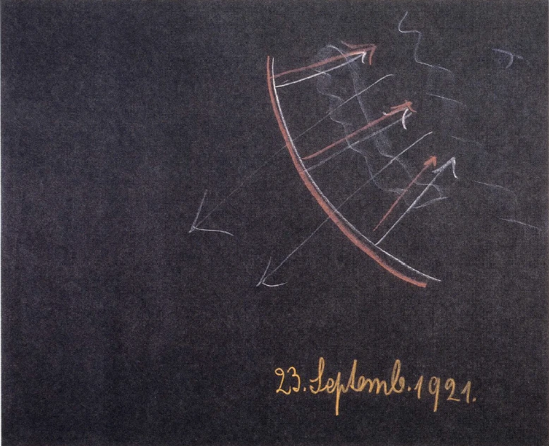
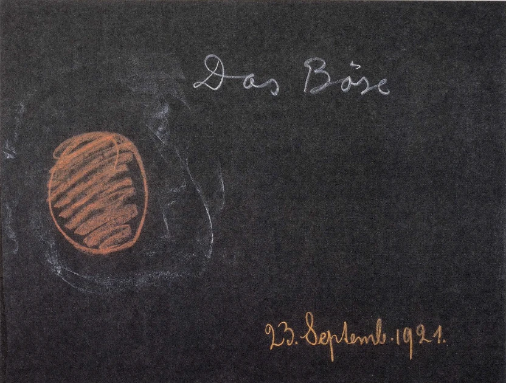

[ 1 ] ^qnuj98

Ich werde am Sonntag in dem Vortrage, den ich dann zu halten habe, Ihnen hier an dieser Stelle eine Übersicht geben über das, was sich durch den Stuttgarter Kongreß und sonst auf dem Gebiete der anthroposophischen Bewegung innerhalb Deutschlands in den letzten Wochen zugetragen hat. Heute wollen wir einiges durchsprechen, was sich an mancherlei anschließt, was wir hier schon betrachtet haben, und wodurch wir den Zusammenhang herstellen können zwischen den folgenden Tagen und demjenigen, was wir hier behandelt haben, bevor ich nach Deutschland abgereist bin. ^qz1h91

[ 2 ] ^hgoc9q

Wenn ein orientalischer Weiser alter Zeit - wir müßten, um dasjenige zu betrachten, was ich hier sagen will, allerdings in sehr alte Zeiten der orientalischen Kultur zurückgehen -, wenn ein solcher orientalischer Weiser, der eingeweiht war in die Mysterien des alten Morgenlandes, seinen Blick wenden würde auf die heutige abendländische, die westliche Zivilisation überhaupt, so würde er, diese Zivilisation beurteilend, vielleicht zu den Angehörigen dieser westlichen Zivilisation sagen: Ihr lebt eigentlich ganz von der Furcht. Eure ganze Seelenverfassung ist von der Furcht beherrscht. Alles, was ihr tut, aber auch alles, was ihr empfindet, ist durchtränkt in den wichtigsten Augenblicken des Lebens und in seinen Auswirkungen durch die Furcht, und da die Furcht außerordentlich verwandt ist mit dem Haß, so spielt der Haß eine große Rolle in eurer ganzen Zivilisation. ^3szkbs

[ 3 ] ^5h2vm9

Verstehen wir uns recht, meine lieben Freunde. Ich meine, so würde, wenn er heute wiederum mit demselben Bildungsgrad, mit derselben Seelenverfassung unter den westlichen Menschen stehen würde, ein Weiser der alten orientalischen Kulturwelt sprechen, und er würde bemerklich machen, wenn er auf diese Dinge zu reden käme, daß allerdings in seinen Zeiten und auf seinem Territorium aus ganz anderen Untergründen heraus die Zivilisation begründet worden ist. Er würde wahrscheinlich sagen: Zu meinen Zeiten spielte die Furcht im Zivilisationsleben eigentlich keine Rolle. Zu meiner Zeit - wenn es sich darum handelte, eine Weltanschauung herauszutragen in die Welt und daraus Tat und soziales Leben zu machen - spielte die Hauptsache die Lust, die sich steigern konnte zur völligen Hingabe an die Welt, die sich steigern konnte zur Liebe. ^9zhiqb

[ 4 ] ^5ruu5d

Das würde er so empfinden, und dadurch würde er von seinem Standpunkte aus hinweisen, wenn er richtig verstanden würde, auf allerwichtigste Ingredienzien, auf allerwichtigste Impulse in dem heutigen Zivilisationsleben. Und verstünden wir es, ihn in richtiger Weise zu hören, dann würde uns dadurch vieles gegeben sein, was wir eigentlich brauchen, um den Punkt zu finden, von dem ausgegangen werden muß in der Erfassung des Lebens der Gegenwart. ^9km6v3

[ 5 ] ^6u2acp

Im Grunde ist es doch so, daß drüben in Asien, wenn auch starke europäische Einflüsse in das religiöse, in das ästhetische, in das wissenschaftliche, in das soziale Leben aufgenommen worden sind, der Nachklang herrscht der alten Zivilisation. Diese alte Zivilisation ist ja in Dekadenz, im Niedergange, und wenn der alte orientalische Weise sagt: Die Liebe war die Grundkraft der alten orientalischen Zivilisation -, so muß allerdings gesagt werden: Davon ist ja in der Gegenwart unmittelbar wenig zu bemerken. Aber wer zu sehen vermag, sieht selbst in den Niedergangserscheinungen der asiatischen Kultur durchaus diesen Einschlag eines ursprünglichen Elementes der Lust, der Freude, der Liebe an der Welt und zur Welt. ^ceibbm

[ 6 ] ^enf66f

Es gab im Oriente wenig von dem in alten Zeiten, was dann von den Menschen gefordert worden ist, seit ihnen erklungen ist das Wort, das am radikalsten zum Vorschein kam durch den griechischen Spruch: «Erkenne dich selbst!» Dieses «Erkenne dich selbst!», es trat eigentlich erst in der Zeit, als die ältere griechische Kulturentwickelung da war, in das menschliche geschichtliche Leben ein. Die umfassende, lichtvolle altorientalische Weltanschauung, sie war noch nicht durchdrungen von einer solchen Art von Menschenerkenntnis; sie war überhaupt nicht eigentlich darauf gerichtet, den Blick nach dem Inneren des Menschen zu wenden. Der Mensch ist ja in dieser Beziehung abhängig von den Verhältnissen, die in seiner Umwelt herrschen. Die altorientalische Kultur wurde einfach begründet unter einer anderen Wirkung des Sonnenlichtes auf die Erde, unter einer anderen Einwirkung der irdischen Verhältnisse selbst als die spätere westliche Kultur. Der innere Blick des Menschen wurde im alten Oriente, man möchte sagen, gefangengenommen von dem, was den Menschen als Welt umgab, und er hatte besondere Veranlassung, sich mit seinem ganzen Inneren hinzugeben an die Welt. Welterkenntnis war es, was in der alten orientalischen Weisheit und in der Auffassung der Welt durch diese altorientalische Weisheit blühte. Und auch in dem, was im alten Oriente in den Mysterien selbst lebte — Sie können das entnehmen aus alledem, was seit vielen Jahren nach dieser Richtung zu Ihnen gesprochen worden ist -, war nicht enthalten eine eigentliche Befolgung der Forderung «Erkenne dich selbst!». Richte den Blick in die Welt, versuche, an dich herankommen zu lassen, was in den Tiefen der Welterscheinungen verborgen ist! - das würde man viel eher als eine Forderung der altorientalischen Kultur aufstellen können. Aber genötigt wurden die Mysterienlehrer und Mysterienschüler, den Blick nach dem Inneren des Menschen zu lenken, als die asiatische Zivilisation sich mehr nach dem Westen hin ausbreitete. Schon als die Mysterienkolonien in Ägypten durch Nordafrika hindurch begründet wurden, aber namentlich als dann die Mysterien mehr nach dem Westen hin - eine besondere Stätte war ja das alte Irland - in Mysterienkolonien sich entfalteten, da trat an die Mysterienlehrer und die Mysterienschüler, die von Asien herüberkamen, einfach durch die geographischen Verhältnisse des Westens und damit durch die ganz andere elementarische Ausgestaltung der westlichen Welt die Notwendigkeit heran nach der Selbsterkenntnis des Menschen, nach einer wirklichen Innenschau. Und durch das, was sich diese Mysterienschüler in Asien schon erobert hatten an äußerer Welterkenntnis, an Erkenntnis der geistigen Tatsachen und Wesenheiten, die der äußeren Welt zugrunde liegen, einfach dadurch konnten sie nunmehr tief eindringen in dasjenige, was eigentlich im Inneren des Menschen vorhanden ist. ^963wsw

[ 7 ] ^lb3nfe

Man hätte das in Asien drüben gar nicht beobachten können. Es würde gewissermaßen der nach innen gerichtete Blick gelähmt worden sein. Aber mit dem, was man durch den nach außen gerichteten Blick, der in die geistige Welt hineindrang, mitbrachte nach den westlichen Mysterienkolonien, konnte man nun hineinschauen in das menschliche Innere. Und eigentlich nur die stärksten Seelen konnten wirklich, man möchte sagen, zunächst aushalten, was da im menschlichen Inneren zu erblicken war. Menschliche innere Wesenheit kam eigentlich zunächst zum Bewußtsein der Menschheit in diesen vom Oriente ausgehenden und in westlichen Gebieten begründeten Mysterienkolonien. Man merkt eigentlich, was diese Selbsterkenntnis des Menschen für einen Eindruck machte auf diese orientalischen Mysterienlehrer und Mysterienschüler, wenn man ein Wort wiederholt, das immer wieder von den Lehrern, die schon diesen Blick nach dem Inneren des Menschen gehabt hatten, an die Schüler gerichtet worden ist und durch das ihnen klargemacht werden sollte, in welcher Art von Seelenverfassung menschliche Selbsterkenntnis eigentlich aufzufassen ist. ^2ynndp

[ 8 ] ^lgcyhq

Das Wort, das ich meine, wird viel zitiert. Es wurde aber nur mit seinem vollen Gewichte in den älteren Mysterienkolonien Ägyptens, Nordafrikas, Irlands ausgesprochen zur Vorbereitung für den Schüler, zur Beachtung für den Eingeweihten überhaupt gegenüber den innermenschlichen Erlebnissen. Das Wort, das da ausgesprochen wurde, das ist: Keiner, der nicht eingeweiht ist in die heiligen Mysterien, sollte die Geheimnisse des Menscheninneren erfahren, denn vor einem Uneingeweihten diese Geheimnisse auszusprechen, ist unstatthaft; es macht sich dann der Mund sündhaft, der diese Geheimnisse ausspricht, und es wird sündhaft das Ohr, das diese Geheimnisse hört! ^ksbvx2

[ 9 ] ^hf3vd5

Oftmals ist dieses Wort ausgesprochen worden aus innerem Erleben heraus, aus dem, was eben ein durch orientalische Weisheit vorbereiteter Mensch erfahren konnte, wenn er durch die irdischen Verhältnisse des Westens zur Menschenerkenntnis vordrang. Der Tradition nach hat sich dieses Wort erhalten, und heute wird es - allerdings in seinem innersten Wesen unverstanden - in den Geheimorden und Geheimgesellschaften des Westens, die aber nach außen hin eigentlich einen großen Einfluß haben, immer wiederholt. Aber es wird eben aus der Tradition heraus wiederholt. Es wird nicht mit dem nötigen Gewichte ausgesprochen, denn man weiß eigentlich nicht, was man damit sagen soll. ‚Aber auch jetzt ist es durchaus so, daß in den Geheimorden des Westens, von denen ich oftmals gerade an dieser Stätte gesprochen habe, dieses Wort wie eine Devise gebraucht wird: Es gibt Geheimnisse über das menschliche Innere, die dürfen nur innerhalb der Geheimgesellschaften dem Menschen mitgeteilt werden, denn es ist sonst eben sündhaft der Mund, der sie ausspricht, sündhaft das Ohr, das sie hört. ^8q5vl8

[ 10 ] ^4ed3np

Man muß ja sagen: So, wie sich die Zeiten entwickelt haben, so lernen manche Menschen — nicht der mitteleuropäischen, aber der westlichen Länder - in ihren Geheimgesellschaften mancherlei, was als Tradition sich aus alten Weisheitsforschungen erhalten hat. Es wird unverstanden aufgenommen, obwohl es eigentlich vielfach als ein Impuls ins Handeln hineindringt. Es war ja durchaus so, daß in den neueren Jahrhunderten, eigentlich schon seit der Mitte des 15. Jahrhunderts, die Konstitution des Menschen eine solche wurde, die wiederum unmöglich machte, diese Dinge in ihrer ursprünglichen Gestalt zu sehen. Man konnte sie nur intellektuell aufnehmen. Man konnte Begriffe davon bekommen, aber man konnte nicht zu dem eigentlichen Erleben vordringen. Nur Ahnungen haben einzelne Menschen gehabt. Durch Ahnungen allerdings sind dann manche Menschen in jene Regionen des Erlebens eingedrungen, um die es sich da handelt. Und solche Menschen haben manchmal sonderbare äußere Lebensformen angenommen, wie zum Beispiel Lord Bulwer, der den «Zanoni» geschrieben hat. So wie er in seinen späteren Lebensjahren geworden ist, das ist ja nur zu begreifen, wenn man weiß, wie er zunächst die Tradition der menschlichen Selbsterkenntnis aufgenommen hat, wie er aber durchaus durch seine besondere individuelle Konstitution fähig war, schon in gewisse Mysterien einzudringen. Dadurch aber entfernte er sich von der Naturgemäßheit des Lebens. Gerade an ihm kann man sehen, wie der Mensch dem Leben gegenüber sich dann verhält, wenn er im Inneren eben diese andersgeartete geistige Welt nicht bloß in Begriffen aufnimmt, sondern in die ganze Seelenverfassung, eben in das innere Erleben. Man muß dann manches anders beurteilen, als es nach dem Maßstabe der gewöhnlichen Philisterei geschehen kann. Es ist ja natürlich etwas Ungeheuerliches, wenn Bulwer herumgezogen ist so, daß er mit einer gewissen Emphase seine inneren Erlebnisse ausgesprochen hat, dann aber bei sich hatte eine jüngere weibliche Gestalt, die ein harfenartiges Instrument spielte, und immer dieses Spiel des harfenartigen Instrumentes zwischen den einzelnen Passagen seiner Rede brauchte. Er erschien da oder dort in den Gesellschaften, in denen es ja sonst formell ganz philisterhaft herging; er erschien aber niemals allein. Da erschien er in seiner etwas absonderlichen Tracht, setzte sich, und vor seinen Knien saß dann gewissermaßen sein Harfenmädchen, und wenn er sprach, dann sprach er einige Sätze, dann wiederum spielte das Mädchen, dann setzte er fort, dann spielte das Mädchen wieder. So stellte er etwas in einem höheren Sinne Kokettes — so muß man es zunächst aussprechen — in die gewöhnliche Welt des menschlichen Philisteriums hinein, jenes Philisteriums, in das die Menschheit ja immer mehr hineinwuchs, besonders seit der Mitte des 15. Jahrhunderts. ^0bzogp

[ 11 ] ^hnnt42

Es weiß die Menschheit von dem Grade der Philistrosität, in den sie hineingewachsen ist, nicht viel, und immer weniger weiß sie davon, weil diese ein Naturgemäßes wird. Man sieht nur das als vernünftig an, wie man sich nun eben jetzt «benimmt». Aber die Dinge im Leben hängen zusammen, und die moderne Trockenheit und Schläfrigkeit, die moderne Art, von Mensch zu Mensch sich zu verhalten, gehört als Folge zu der intellektualistischen Entwickelung der letzten Jahrhunderte. Beide Dinge gehören zusammen. Solch ein Mensch wie Bulwer paßt da natürlich an sich nicht hinein. Man kann es sich ja durchaus als ein Mögliches vorstellen, daß die älteren Menschen in der Welt herumgehen und von den jüngeren mit einer angenehmen Musik begleitet werden. Man muß nur den Abstand der einen Seelenverfassung von der anderen im richtigen Lichte sehen, dann wird einem so etwas doch auch im richtigen Lichte erscheinen können. Aber es war bei Bulwer so, weil in ihm etwas aufleuchtete, was so unmittelbar nicht da sein konnte in der modernen intellektualistischen Zeit, sondern nur als Tradition. ^x06i6x

[ 12 ] ^lxbwz7

Aber kennenlernen muß man wiederum, was Menschenerkenntnis war.in den Mysterienkolonien, auf die ich hingewiesen habe. Der gewöhnliche Mensch der heutigen Zeit sieht um sich herum die Welt durch die äußeren physischen Sinneseindrücke. Er kombiniert das, was er sieht, mit seinem Verstande. Und er sieht dann auch in sein Inneres hinein. Im Grunde genommen ist das die Welt, die der Mensch überschaut, und aus der heraus er auch handelt. Die Sinneseindrücke, die er von außen empfängt, das, was er aus diesen Sinneseindrücken als Vorstellungen entwickelt, das, was dann von diesen Vorstellungen nach dem Inneren hinein durch Gefühlsimpulse, Willensimpulse umgewandelt wird und was dann wiederum als Erinnerungen des Lebens zurückstrahlt in das Bewußtsein, das ist der Inhalt der Seelenverfassung, der Inhalt des Lebens, in dem der Mensch in der Gegenwart webt, aus dem heraus er handelt. Der Mensch der Gegenwart fragt eigentlich höchstens mit falscher Mystik: Was ist da eigentlich in dem Inneren drinnen? Was ergibt sich der Selbsterkenntnis? — Indem er eine solche Frage aufwirft, will er sich die Antwort geben aus seinem gewöhnlichen Bewußtsein heraus. Aber aus diesem gewöhnlichen Bewußtsein kommt nichts anderes, als was eigentlich aus den äußeren Sinneseindrücken entstanden und durch Gefühl und Wille umgewandelt ist. Die Reflexe, die Spiegelbilder des äußeren Lebens findet man, wenn man auf die Weise des gewöhnlichen Bewußtseins nach dem Inneren hineinschaut. Und wenn auch die äußeren Eindrücke durch Gefühl und Wille umgewandelt sind — der Mensch weiß ja nicht, wie Gefühl und Wille eigentlich wirken, und so sieht er sehr häufig das, was er da in seinem Inneren sieht, weil es umgewandelt ist, nicht an als das Spiegelbild der äußeren Welt, sondern als eine besondere Verkündigung einer göttlichen Welt, einer ewigen Welt und dergleichen. Das ist es aber nicht. Es ist das, was dem gewöhnlichen Bewußtsein für den heutigen Menschen als Selbsterkenntnis erscheint, nur die umgewandelte Außenwelt, die aus seinem eigenen Inneren in sein Bewußtsein hinein sich spiegelt. Würde der Mensch in sein Inneres wirklich hineinschauen wollen, dann müßte er - ich habe das Bild schon öfter hier gebraucht — das, was der innere Spiegel ist, zerbrechen. ^906rtq

[ 13 ] ^szo8ge

Unser Inneres ist ja wirklich wie ein Spiegel. Wir schauen die Außen welt an. Hier sind die äußeren Sinneseindrücke. Daran knüpfen wir Vorstellungen. Dann werden diese Vorstellungen von dem Inneren gespiegelt. Wir kommen, indem wir nach dem Inneren hineinschauen, nur zu diesem Spiegel im Inneren (siehe Zeichnung Seite 20, rot). Wir sehen das, was in dem Erinnerungsspiegel zurückgeworfen wird (rote Pfeile). Wir können mit diesem gewöhnlichen Bewußtsein geradesowenig in das Innere des Menschen hineinschauen, wie man, ohne ihn zu zerbrechen, hinter den Spiegel schauen kann. ^9grhgk

 ^rfjn80

[ 14 ] ^d6eb34

Das aber war gerade bewirkt worden durch die Vorbereitung im alten orientalischen Weisheitswesen, daß diese Lehrer und Schüler der nach dem Westen hin getragenen Mysterienkolonien scharf hinter die Erinnerungen in das Innere des Menschen hineinschauen konnten. Und aus dem heraus, was sie da erblickten, sprachen sie diese Worte, die darauf hindeuteten, daß sie eigentlich begreiflich machen wollten, wie man, insbesondere in jenen alten Zeiten, gut vorbereitet sein mußte, wenn man den Blick in dieses Innere des Menschen richten wollte. ^nkdg8n

[ 15 ] ^8cbni1

Was sieht man denn da im Inneren des Menschen? Da sieht man, wie da allerdings von der Kraft des Wahrnehmens und Denkens, die sich entwickelt vor dem Erinnerungsspiegel, etwas hineindringt bis unter den Erinnerungsspiegel. Die Gedanken dringen unter diesen Erinnerungsspiegel hinunter und wirken in dem menschlichen Ätherleib, in demjenigen Teil des menschlichen Ätherleibes, der dem Wachstum, der aber auch der Entstehung der Willenskräfte zugrunde liegt. Indem wir hinausblicken in den sonnendurchhellten Raum, indem wir überblicken alles das, was uns aus den Sinneseindrücken kommt, strahlt etwas in unser Inneres, das ja allerdings auf der einen Seite zu den Erinnerungsvorstellungen wird, das aber doch durchsickert durch den Erinnerungsspiegel; was uns ebenso durchdringt, wie uns durchdringen, sagen wir, die Vorgänge der Ernährung, des Wachstums und so weiter. Die Gedankenkräfte durchdringen ja zunächst den Ätherleib, und dieser von den Gedankenkräften durchdrungene Ätherleib, der wirkt in einer ganz besonderen Weise nun auf den physischen Leib. Da entsteht im physischen Leib eine vollständige Umwandelung des materiellen Daseins, das im physischen Leib des Menschen ist. In der Außenwelt wird Materie nirgends vollständig zerstört. Daher sprechen die neuere Philosophie und Naturwissenschaft für die Außenwelt von der Erhaltung der Materie. Aber dieses Gesetz der Erhaltung der Materie gilt nur für die Außenwelt. Im Inneren des Menschen wird Materie vollständig zurückverwandelt in das Nichts. Vollständig wird die Materie da in ihrem Wesen zerstört. Unsere Menschennatur beruht gerade darauf, daß wir in der Lage sind, tiefer als die Erinnerung in ihr gespiegelt wird, die Materie in das Chaos zurückzuwerfen, die Materie vollständig zu zerstören. ^v74ghx

[ 16 ] ^zk33sq

Das war es, worauf der Mysterienschüler gewiesen wurde, der vom Oriente in die Mysterienkolonien namentlich Irlands und des Westens überhaupt geführt worden ist: In deinem Inneren, unter dem Erinnerungsvermögen, da trägst du als Mensch etwas in dir, was auf Zerstörung ausgeht, und hättest du das nicht in dir, so hättest du dein Denken nicht entwickeln können, denn du mußt dein Denken dadurch entwickeln, daß die Denkkräfte den Ätherleib durchdringen. Aber ein Ätherleib, der von den Gedankenkräften durchdrungen wird, wirkt auf den physischen Leib so, daß er dessen Materie in das Chaos zurückwirft, zerstört. ^4qe2go

[ 17 ] ^vynul0

Wenn der Mensch daher mit derselben Gesinnung, mit der er bis zur Erinnerung vordringt, sich einläßt auf dieses menschliche Innere, dann tritt er ein in die Region, wo das Menschenwesen zerstören will, wo das Menschenwesen auslöschen will, was da ist. Wir alle tragen unter unserem Erinnerungsspiegel, gerade zum Behufe der Entwickelung des menschlichen gedankenvollen Ich, die Zerstörungswut, die Auflösungswut der Materie gegenüber. Es gibt keine menschliche Selbsterkenntnis, die nicht auf dieses innere menschliche Faktum in aller Intensität hinweist. ^8g5p6x

[ 18 ] ^mki0sg

Daher muß derjenige, welcher hingewiesen werden soll auf diesen im Inneren des Menschen befindlichen Zerstörungsherd, Interesse haben an der Entwickelung des Geistes. Er muß sich mit aller Intensität sagen können: Der Geist muß bestehen, und um des Bestandes des Geistes willen darf das Materielle ausgelöscht werden. — Erst nachdem zur Menschheit jahrelang wiederum von den Interessen gesprochen wird, die mit dem geisteswissenschaftlichen Forschen zusammenhängen, kann aufmerksam gemacht werden auf das, was sich eigentlich im Inneren des Menschen befindet. Aber es muß auch heute darauf aufmerksam gemacht werden, denn ohne das würde sich der Mensch immer für etwas anderes halten, als er gerade innerhalb der westlichen Zivilisation ist. Der Mensch ist innerhalb der westlichen Zivilisation die Umhüllung eines Zerstörungsherdes, und eigentlich können die Niedergangskräfte in die Aufgangskräfte nur übergeführt werden, wenn der Mensch sich bewußt wird, daß er die Umhüllung eines Zerstörungsherdes ist. ^1k6pih

[ 19 ] ^9s3yf7

Was würde geschehen, wenn der Mensch durch Geisteswissenschaft nicht auf dieses Bewußtsein hingeführt würde? Nun, wir sehen bereits in der Entwickelung der heutigen Zeit, was geschehen würde. Das, was gewissermaßen isoliert, abgesondert im Menschen ist und nur im Menschen wirken sollte, diese einzige Stelle haben sollte, wo Materie in ihr Chaos zurückgeworfen wird, das dringt heraus, das dringt in die äußeren menschlichen Instinkte. Das wird überhaupt westliche und Erdenzivilisation werden. Das zeigt sich in alledem, was an zerstörungswütigen Kräften heute zum Beispiel im Osten Europas und so weiter auftritt. Das ist die aus dem Inneren in das Äußere hineingeworfene Zerstörungswut, und der Mensch kann sich in der Zukunft gegenüber dem, was da eigentlich in seinen Instinkt übergeht, nur zurechtfinden durch etwas, was in ihm sein muß, wenn wiederum wirkliche Menschenerkenntnis eintritt, wenn wir wiederum aufmerksam gemacht werden auf diesen menschlichen Zerstörungsherd im Inneren, der aber da sein muß um der Entwickelung des menschlichen Denkens willen. Denn jene Stärke des Denkens, die der Mensch haben muß, damit der Mensch seine der heutigen Zeit angemessene Weltanschauung haben kann, diese Stärke des Denkens, die da vor dem Erinnerungsspiegel sein muß, die bewirkt die Fortsetzung des Denkens in den Ätherleib hinein, und dieser vom Denken durchdrungene Ätherleib, der wirkt eben in dieser Weise zerstörend auf den physischen Leib. Es ist einmal in dem modernen Menschen des Westens dieser Zerstörungsherd. Die Erkenntnis macht nur darauf aufmerksam. Und viel schlimmer ist es, wenn der Herd da ist, ohne daß der Mensch mit seinem Bewußtsein darauf hinweisen kann, als wenn der Mensch mit vollem Bewußtsein von diesem Zerstörungsherd Kenntnis nimmt und sich von diesem Gesichtspunkte aus in die moderne Zivilisationsentwickelung hineinbegibt. ^1k9gpk

[ 20 ] ^nrto0h

Was die Schüler, die von diesen Geheimnissen zuerst gehört haben in diesen Mysterienkolonien, von denen ich gesprochen habe, zuerst befallen hat, war Furcht. Die haben sie gründlich kennengelernt. Gründlich kennengelernt haben sie die Empfindung, daß in das menschliche Innere hineinzuschauen — nicht unehrlich im Sinne einer nebulosen Mystik, sondern ehrlich hineinzuschauen -, Furcht einflößen muß, furchterregend ist. Und diese Furcht, sie wurde bei den alten Mysterienschülern des Westens nur dadurch vertrieben, daß man diese Schüler auf das ganze Gewicht der Tatsachen hingewiesen hat. Dann haben sie das, was da als Furcht entstehen muß, durch das Bewußtsein überwunden. ^uhiswa

[ 21 ] ^0jmri7

Als dann die intellektualistische Zeit heraufkam, da wurde diese Furcht unbewußt, und als solche unbewußte Furcht wirkt sie weiter. In allen möglichen Maskierungen wirkt sie im äußeren Leben. Es war aber einfach angemessen der modernen Zeit, in das menschliche Innere hineinzuschauen. «Erkenne dich selbst!», wurde eine richtige Forderung. Die Mysterienschüler wurden geradezu durch das Heraufrufen der Furcht, auf das dann die Überwindung dieser Furcht folgen konnte, in der richtigen Weise auf die Selbsterkenntnis gewiesen. Die intellektualistische Zeit trübte den Blick für das, was im menschlichen Inneren ist; aber sie konnte nicht die Furcht fortschaffen. Und so kam es, daß der Mensch selbst bis zu dem Grade unter dem Eindrucke dieser unbewußten Furcht stand und steht, daß er sagte und sagt: Es gibt überhaupt nichts im Menschen, was hinausliegt über Geburt und Tod. Er fürchtet sich, tiefer hinunterzuschauen als in dieses Erinnerungsleben, in dieses gewöhnliche Gedankenleben, das ja seine Gesetzmäßigkeit nur zwischen Geburt und Tod hat. Er fürchtet sich, hinunterzublicken in das eigentliche Ewige der Menschenseele, und aus dieser Furcht heraus begründet er die Lehre: Es gibt überhaupt nichts als dieses Leben zwischen Geburt und Tod. — Der moderne Materialismus ist aus der Furcht entstanden, ohne daß er im geringsten eine Ahnung davon hat. Ein Furcht- und Angstprodukt selbst ist diese moderne materialistische Weltanschauung. ^hjvr0d

[ 22 ] ^0a4vdk

So lebt diese Furcht in den äußeren Handlungen der Menschen, in der sozialen Gestaltung, im geschichtlichen Werden seit der Mitte des 15. Jahrhunderts, so lebt sie insbesondere im 19. Jahrhundert in der materialistischen Weltanschauung. Warum wurden die Leute Materialisten, das heißt, wollten nur gelten lassen das Äußere, im materiellen Dasein Gegebene? Weil sie sich fürchteten, in die Untergründe des Menschen hinunterzusteigen. ^0r0puy

[ 23 ] ^qb8vrz

Das hätte aus seiner Erkenntnis heraus der alte orientalische Weise ausdrücken wollen, indem er gesagt hätte: Ihr Abendländer der Gegenwart lebt ja ganz aus der Furcht heraus. Ihr begründet eure sozialen Ordnungen aus der Furcht heraus, ihr treibt eure Künste aus der Furcht heraus. Ihr habt eure materialistische Weltanschauung aus der Furcht heraus geboren. Ihr und die Nachfolger derjenigen, wenn sie auch in die Dekadenz gekommen sind, die einstmals zu meiner Zeit die altorientalische Weltanschauung begründet haben, ihr und diese Menschen Asiens, ihr werdet euch niemals verstehen können, denn bei den Asiaten ist doch schließlich alles aus der Liebe entsprungen; bei euch entsteht alles aus der Furcht, die mit dem Haß verwandt ist. ^3ougdp

[ 24 ] ^3raov4

Gewiß, solches klingt radikal, aber ich versuche es eben dadurch vorzubringen, daß ich es gerade einem altorientalischen Weisen in den Mund lege. Man wird vielleicht glauben, daß er so sprechen könnte, wenn er wieder aufstehen würde, während man vielleicht den Menschen der Gegenwart für närrisch ansehen würde, wenn er so radikal diese Dinge hinstellen würde. Aber lernen kann man doch gerade aus der radikalen Charakterisierung dieser Dinge, was wir heute für den gesunden Fortgang der Zivilisation eben lernen müssen. Die Menschheit wird wieder wissen müssen, daß das, was gerade die höchste Errungenschaft der neueren Zeit bildet, das verstandesmäßige Denken, gar nicht da sein könnte, wenn nicht das Vorstellungsleben im Inneren aus einem Zerstörungsherd aufstiege, den man erkennen muß, damit man ihn im Inneren hält, damit er nicht in die äußeren Instinkte übergeht und zu sozialen Impulsen werde. ^q4b0m7

[ 25 ] ^f7o8j3

Man kann da schon tief in die Zusammenhänge des Lebens der neueren Zeit hineinsehen, wenn man diese Dinge überschaut. Die Welt also, die sich als ein solcher Zerstörungsherd ankündigt, sie liegt im Inneren jenseits des Erinnerungsspiegels. Aber das Leben des gegenwärtigen Menschen verläuft zwischen demjenigen, was dieser Erinnerungsspiegel gibt, und dem äußeren Sinneswahrnehmen. Und ebensowenig wie der Mensch hinunterblicken kann in sein eigenes Inneres bis jenseits des Erinnerungsspiegels, ebensowenig kann er das durchstoßen, was sich da außen ausbreitet als Sinneswahrnehmungen. Er dichtet eine materielle atomistische Welt hinzu, die eben eine phantastische Welt ist, weil er nicht durchstoßen kann durch diese Sinnesvorstellungen. ^dkgs7m

[ 26 ] ^6doooi

Aber der Mensch ist nicht fremd dieser Welt jenseits der äußeren Sinnesvorstellungen. Er dringt jede Nacht zwischen dem Einschlafen und Aufwachen in diese Welt hinein. Wenn Sie schlafen, sind Sie in dieser Welt drinnen. Was Sie da erleben, das ist jenseits der Sinnesvorstellungen, nicht die von den Phantasten der Naturwissenschaft aufgestellte atomistische Welt. Aber was da jenseits der Sinnessphäre ist, das erlebte wiederum gerade der altorientalische Weise in seinen Mysterien. Das aber kann man nur erleben, wenn man Hingabe hat an die Welt, wenn man den Drang und den Trieb hat, sich ganz hinzugeben an die Welt. Da muß Liebe in der Erkenntnis walten, wenn man hinter die Sinneseindrücke kommen will. ^q8dkzi

[ 27 ] ^xfsb51

Diese Liebe in der Erkenntnis hatte insbesondere die alte orientalische Zivilisation. Und warum muß man diese Hingabe haben? Man muß diese Hingabe haben, weil, wenn man mit dem gewöhnlichen menschlichen Ich hineinkommen wollte in die Welt jenseits der Sinne, man Schaden nehmen würde. Man muß sein Ich, wie man es gewöhnlich hat, aufgeben, wenn man in diese Welt jenseits der Sinne eindringen will. Dieses Ich, wodurch entsteht es? Dadurch, daß das Menschenwesen in ein Chaos der Zerstörung eintauchen kann, bildet sich dieses Ich. Dieses Ich muß gestählt und erhärtet werden in derjenigen Welt, die im Inneren des Menschen als die Welt eines Zerstörungsherdes ist. Mit diesem Ich kann man nicht jenseits der Sphäre der äußeren Sinneswelt leben. ^lj4y52

 ^c7jmdp

[ 28 ] ^sn1mw3

Stellen wir uns schematisch den Zerstörungsherd im Inneren des Menschen vor (siehe Zeichnung, rot). Er ist über den ganzen menschlichen Organismus ausgebreitet. Was ich da schildere, ist intensiv, nicht extensiv aufzufassen, aber ich werde es schematisch zeichnen. Da ist der Zerstörungsherd, da ist die menschliche Hülle. Wenn das, was im Inneren ist, über die ganze Welt verbreitet würde, was würde in der Welt leben durch den Menschen? Das Böse! Das Böse ist nichts anderes, als das nach außen geworfene, im Inneren des Menschen notwendige Chaos. Und in diesem Chaos, in dem, was im Menschen sein muß, aber auch in ihm bleiben muß als ein Herd des Bösen, in dem muß das menschliche Ich, die menschliche Egoität erhärtet werden. Diese menschliche Egoität kann nicht jenseits der menschlichen Sinnessphäre in der Außenwelt leben. Daher verschwindet das Ich-Bewußtsein im Schlafe, und wenn es auftritt in den Träumen, so erscheint es sich oftmals fremd oder geschwächt. Das Ich, das da in dem Herd des Bösen im Inneren eigentlich erhärtet wird, das kann da nicht hinein jenseits der Sphäre der Sinneserscheinungen. Daher die Anschauung des altorientalischen Weisen, daß man nur durch Hingabe, durch Liebe, durch Aufgabe des Ich da eindringen kann, und daß, wenn man ganz eindringt, man nicht lebt in einer Welt des Vana, des Webens in dem Gewohnten, sondern in der Welt, wo dieses gewohnte Dasein verweht ist, Nirvana ist. Auf diese Auffassung des Nirvana, des höchstgesteigerten Hingebens des Ich, wie es im Schlafe vorhanden ist, wie es in vollbewußter Erkenntnis vorhanden war für die Schüler der altorientalischen Zivilisation, würde anspielen solch ein altorientalischer Weiser, wie ich ihn sprechend hypothetisch vor Ihre Seele hingestellt habe. Und er würde eben sagen: Bei euch ist alles, weil ihr die Egoität ausbilden mußtet, auf die Furcht gegründet. Bei uns, weil wir die Egoität unterdrücken mußten, war alles auf Liebe gegründet. Bei euch spricht das Ich, das sich geltend machen will. Bei uns sprach das Nirvana, indem das Ich sich in die ganze Welt liebend ausgoß. ^x4g5sy

[ 29 ] ^kwsw4s

Faßt man diese Dinge in Begriffe, so sind sie da in einer gewissen Weise konserviert, aber sie leben in der Welt der Menschheit als Empfindungen, als Gefühle fluktuierend, und sie durchdringen das menschliche Dasein. Und in solchen Gefühlen und Empfindungen machen sie das aus, was auf der einen Seite heute im Oriente, was auf der anderen Seite im Okzident lebt. Im Okzident haben die Menschen ein Blut, haben die Menschen einen Lymphsaft, der durchtränkt ist von der Egoität, die erhärtet ist in dem inneren Herde des Bösen. Im Orient haben die Menschen ein Blut, eine Lymphe, in denen die Nachklänge leben des Nirvanasehnens. ^65yl2j

[ 30 ] ^lyv8zs

In ihrem Bewußtsein gehen die Menschen des Orients und des Okzidents im groben heutigen Vorstellen über diese Dinge hinweg, denn das Vorstellen des Intellekts hat etwas Grobes. Das Vorstellen des Intellekts drängt darnach, irgendwie dem lebendigen Organismus Blut abzuzapfen, es zum Präparat zu machen, das dann unter die Lupe zu nehmen und dann anzuschauen, da sich Vorstellungen zu machen. Die Vorstellungen, die man dadurch bekommt, sie sind schon für das gewöhnliche Erleben unendlich grob. Das ist es, was man da auf diese Weise überhaupt sagen kann. Glauben Sie, daß das die feinnuancierten Unterschiede zwischen den Menschen trifft, die, sich benachbart, hier nebeneinander sitzen? Das Mikroskop gibt natürlich nur grobe Begriffe von Blut, von Lymphe. Feinnuancierte Unterschiede sind schon vorhanden unter den Menschen, die aus denselben Milieuverhältnissen heraus entstanden sind. Aber diese Nuancierungen sind natürlich in intensivster Weise vorhanden zwischen den Menschen des Orients und des Okzidents, was heute der Verstand ja nur ganz grob vorstellen kann. ^b55xbb

[ 31 ] ^e0po8o

So lebt es in den Leibern der Menschen Asiens, Europas und Amerikas und wie sie sich zueinander verhalten, so lebt es im äußeren sozialen Leben sich aus. Mit jenem groben Verstande, der in den letzten Jahrhunderten dazu dienlich war, die äußere Natur zu erkennen, werden wir die Anforderungen des neueren sozialen Lebens nicht bezwingen können, werden wir insbesondere nicht den Ausgleich finden können zwischen dem Orient und dem Okzident. Aber der muß gefunden werden. ^qxohvs

[ 32 ] ^5zybd2

Im Spätherbst gehen die Menschen zur Washingtoner Konferenz, und da soll über dasjenige verhandelt werden, was, ich möchte sagen, aus einer instinktiven Genialität heraus der General Smuts, der Südafrikaminister Englands, gesagt hat: Es ist einmal die Entwickelung der neueren Menschheit dadurch charakterisiert, daß der Ausgangspunkt der Kulturinteressen, der bisher in der Nordsee und im Atlantischen Ozean war, übertragen wird nach dem Stillen Ozean. Aus der Kultur der um die Nordsee herum liegenden Gebiete, die sich allmählich im Westen ausgedehnt hat, wird eine Weltkultur. Der Schwerpunkt dieser Weltkultur wird aus der Nordsee nach dem Stillen Ozean fortgetragen. ^7gomld

[ 33 ] ^pvn74h

Vor dieser Veränderung steht die Menschheit. Aber die Menschen reden heute noch so, daß dieses Reden aus den alten groben Begriffen heraus erfolgt und kein Wesenhaftes getroffen wird, das aber getroffen werden muß, wenn wir wirklich vorwärtskommen wollen. Die Zeichen der Zeit stehen bedrohlich und bedeutsam vor uns und sagen uns: Bisher brauchte man nur ein eingeschränktes Vertrauen zwischen Menschen, die sich eigentlich alle voreinander im geheimen fürchteten. Diese Furcht maskierte sich nur in allerlei andere Gefühle. Aber nunmehr brauchen wir eine Seelenverfassung, die eine Weltkultur wird umspannen können. Wir brauchen ein Vertrauen, das die Gegensätze zwischen Orient und Okzident ausgleichen kann. Da eröffnen sich bedeutsame Perspektiven; die brauchen wir. Die Menschen glauben heute nur über wirtschaftliche Fragen verhandeln zu dürfen, über die Stellung, die Japan im Stillen Ozean haben wird, über die Art und Weise, wie man China wird gestalten müssen, damit ein offenes Tor für alle übrigen kommerziellen, Handel treibenden Völker der Erde geschaffen werde und so weiter. ^3j5es2

[ 34 ] ^b8o9f6

Meine lieben Freunde, diese Fragen werden auf keiner Konferenz der Erde entschieden, bevor den Menschen nicht bewußt wird, daß zum Wirtschaften Vertrauen von einem Menschen zum anderen gehört. Und dieses Vertrauen, es wird in der Zukunft nur auf geistige Art errungen werden können. Die äußere Kultur wird die geistige Vertiefung brauchen. Ich wollte heute auf das, was in dieser Richtung hier oftmals geltend gemacht worden ist, wiederum von einer anderen Seite hindeuten. Wir werden morgen in diesem Sinne dann weiter sprechen. ^aktibf