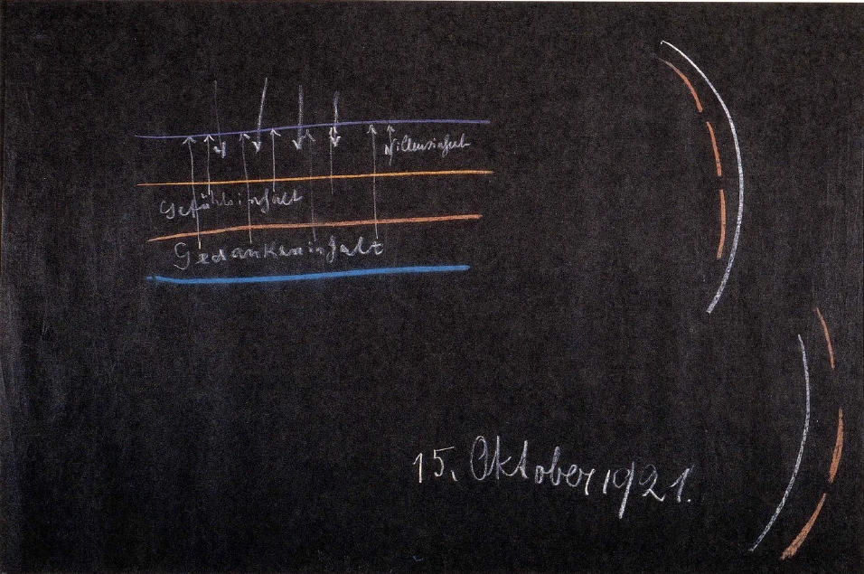
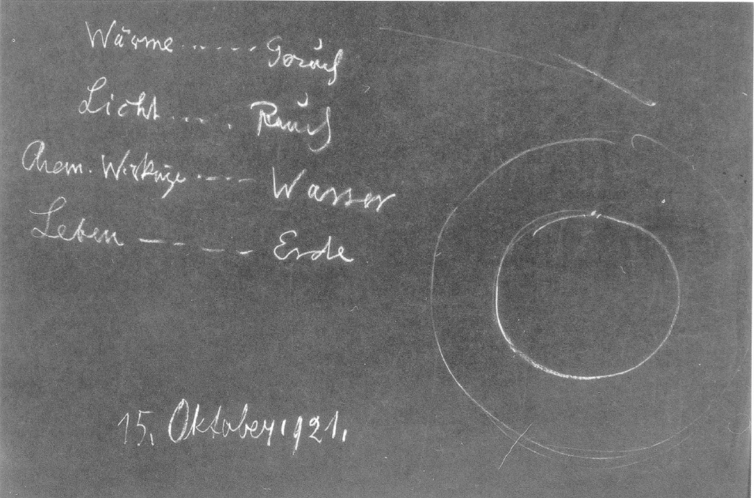

[ 1 ] ^mlbqr4

Ich will noch einmal zurückblicken auf die letzten Betrachtungen. Wir haben versucht, uns Vorstellungen zu machen darüber, wie das menschliche Geistesleben, das menschliche Seelenleben und das menschliche Leibesleben zu begreifen sind. Wenn wir uns das menschliche Seelenleben vor Augen stellen, also das, was der Mensch als Inneres in sich ablaufen fühlt als Denken, Fühlen und Wollen, so finden wir ja, daß das Denkerische, also das, was unmittelbar erlebt wird als Gedankeninhalt, sich abspielt zwischen dem physischen Leibe und dem Ätherleibe, daß sich dann abspielt das Fühlen zwischen dem Ätherleibe und dem astralischen Leibe, das Wollen zwischen dem astralischen Leibe und dem Ich. Wir sehen daraus, daß die Gedanken, insofern wir uns ihrer voll bewußt sind, nur darstellen, was wie aus den Tiefen des eigenen Wesens heraufblickt und den Wellen des Seelenlebens eigentlich nur die Form geben kann. So etwas wie Schatten schlagen aus den Tiefen des menschlichen Wesens herauf, erfüllen unser Bewußtsein und sind dann der Gedankeninhalt. ^wkkebg

 ^g5q306

[ 2 ] ^k541wd

Wenn wir uns die Sache schematisch darstellen wollten, so könnten wir uns sagen: Physischer Leib (siehe Zeichnung, blau), Ätherleib (orange), astralischer Leib (gelb) und Ich (violett). Dann würden wir zwischen dem physischen Leib und dem Ätherleib den Gedankeninhalt haben. — Aber Sie haben aus meinen Schilderungen der letzten Vorträge ersehen, daß dieser Gedankeninhalt in seiner Wahrheit etwas viel Realeres ist als das, was wir im Bewußtsein erleben. Was wir im Bewußtsein erleben, das ist ja nur etwas, was eben, wie ich sagte, aus der Tiefe unseres Wesens die Wellen heraufschlägt bis zum Ich. Da schlägt es herauf. Der Gefühlsinhalt liegt zwischen Ätherleib und astralischem Leib und schlägt wiederum bis zum Ich herauf, und der Willensinhalt, der ist dann zwischen dem astralischen Leib und dem Ich. Der liegt also dem Ich am nächsten. Wir können sagen: In dem Willen erlebt sich das Ich in seiner unmittelbarsten Art, während Gefühlsinhalt und Gedankeninhalt in den Tiefen unseres Wesens ruhen und nur eben die Wellen heraufschlagen in unser Ich. ^nayu5o

[ 3 ] ^yfe0cr

Nun aber wissen wir ja auch, daß das Wollen, daß der Willensinhalt, wie er von uns erlebt wird, dumpf erlebt wird. Von dem Willen, wie er, sagen wir, in einer Armbewegung, in einer Beinbewegung lebt, wissen wir nicht mehr als wir von dem wissen, was sich abspielt zwischen dem Einschlafen und Aufwachen. Der Wille lebt dumpf in uns. Dennoch ist er das, was in unserem eigentlichen Ich als das ihm Nächste lebt. Bewußt, oder sagen wir wachend, nehmen wir den Willen nur wiederum durch die Gedankenabschattungen wahr, die aus den Tiefen des Wesens heraufkommen. Die Vorstellungen, die wir bewußt erleben, sind Schattenbilder eines tiefen seelischen Webens; aber sie sind eben nur Schattenbilder, während wir allerdings den Willen unmittelbar, aber dumpf erleben. Ein waches Bewußtsein vom Willen können wir aber doch nur haben durch die schattenhaften Gedankenbilder. ^o9xucv

[ 4 ] ^jokal5

So erscheint uns die Sache, wenn wir unsere menschliche Wesenheit betrachten und dabei auf die Tiefe des Inneren sehen. Wir sehen, wie, ich möchte sagen, wenig wir von uns selbst in unserem Bewußtsein enthalten, wie wenig da heraufschlägt von dem Inneren unseres Wesens in unser Bewußtsein. Wir verstehen gewissermaßen nur wenig, was wir dem Ich nach im Inneren sind, und nehmen eigentlich nur wahr die Tingierung, welche der Gedankeninhalt heraufwirft in dieses dumpfe, willenshafte Ich. ^2z2zhu

[ 5 ] ^4qnzf1

Man kann eigentlich mit dem gewöhnlichen Bewußtsein von diesem gedankenerfüllten dumpfen Ich kaum mehr als ein unmittelbar Wirkliches sehen, als dasjenige ist, was wir etwa kurz vor dem Aufwachen oder kurz nach dem Einschlafen als unser dumpfes Ich empfinden. Aber in dieses dumpfe Ich schlägt ja eben mit dem Aufwachen die Welt der Sinneswahrnehmungen ein. Werden Sie sich nur einmal bewußt, wie Ihr Leben zwischen dem Einschlafen und dem Aufwachen dumpf ist, so daß Sie die Dumpfheit fast als leer empfinden. Und erst mit dem Aufwachen, wenn Sie die Sinne nach außen öffnen, die Sinneseindrücke kommen, sind Sie an der Hand der Sinneseindrücke in der Lage, sich als Ich wirklich zu empfinden. Da schlägt der Schein der Sinneswahrnehmungen in das Ich herein. Da erfüllt jenes dumpfe Wesen, von dem ich eben gesprochen habe, der Schein der Sinneswahrnehmungen. So daß das Ich als vollbewußtes im Erdenmenschen eigentlich nur lebt in demjenigen Zustande, in dem er durch die Sinnesbilder, durch alles das, was in seine Sinne hereindringt, in Verkehr mit der Außenwelt gekommen ist, und es tritt dann von innen entgegen noch als das Hellste, noch als das, was am meisten aufhellt, der abgeschattete Gedankeninhalt. ^l8aifb

[ 6 ] ^sp8j46

Man kann also sagen: DieSinneswahrnehmungen dringen von außen herein. Der Willensinhalt wird nur dumpf wahrgenommen. Der Gefühlsinhalt schlägt herauf, verbindet sich mit den Sinneseindrücken. Wir sehen Rot, es erfüllt uns mit einem gewissen Gefühl; wir sehen Blau, wir hören Cis oder C und fühlen etwas dabei. Dann machen wir uns aber auch Vorstellungen über das, was die Sinneseindrücke sind. Der Gedankeninhalt, der von innen kommt, verwebt sich mit den Sinneseindrücken. Inneres verbindet sich mit Außerem. Aber daß wir im vollen wachen Ich leben, das verdanken wir eigentlich dem Sinnenschein, und unser Ich steuert dazu so viel bei, als eben jetzt beschrieben werden konnte von dem, was da entgegenschlägt dem Außeren. ^bri98e

[ 7 ] ^58u7a2

Beachten wir wohl diesen Sinnenschein. Sehen wir auf ihn hin und seien wir uns klar darüber: er hängt ganz und gar an unserem physischen Dasein. Er kann uns nur erfüllen, indem wir unseren physischen Leib der Außenwelt im wachenden Zustande entgegenstellen. Dieser Sinnenschein, er hört auf in dem Augenblicke, wo wir, durch den Tod gehend, unseren physischen Leib ablegen in dem Sinne, wie wir das in den vorangehenden Betrachtungen besprochen haben. ^918wiq

[ 8 ] ^kr2sqp

Zwischen Geburt und Tod wird also gewissermaßen unser Ich erweckt durch den Sinnenschein. Wir können von unserem eigentlichen Wesen als wache Erdenmenschen nur soviel haben, als sich an diesem Sinnenschein eben belebt. Stellen Sie sich jetzt lebhaft vor, wie das menschliche Ich-Wesen den Sinnenschein, der ja eben nur ein Schein ist, auffängt und ihn mit dem eigenen menschlichen Wesen verwebt. Nun bedenken Sie, wie da ein Äußeres ein Inneres wird, wie — Sie können es ja am Traum sehen -, ich möchte sagen, ein ganz feines Gewebe innerlich gesponnen wird, in das sich die Sinneseindrücke einweben. Das Ich bemächtigt sich dessen, was da durch die Sinneseindrücke kommt. Das Äußere wird Innerliches. Aber nur das, was innerlich wird, kann der Mensch durch die Pforte des Todes tragen. ^n6m89d

[ 9 ] ^gp5sew

Es ist also ein feines Gewebe zunächst, das der Mensch durch die Pforte des Todes trägt. Seinen physischen Leib legt er ab. Der vermittelte ihm die Sinneseindrücke. Daher sind die Sinneseindrücke ja nur Schein, denn der physische Leib wird abgelegt. Nur so viel, als das Ich von dem Schein in sich aufgenommen hat, wird durch die Pforte des Todes getragen. Der ätherische Leib wird auch abgelegt kurze Zeit nach dem Tode. Damit aber wird das, was zwischen dem physischen Leib und dem ätherischen Leib ist, von dem eigenen Wesen abgelegt. Das löst sich, wie wir gesehen haben, im allgemeinen Kosmos zunächst auf, bildet nur den Keim für weitere Welten, lebt aber eigentlich mit unserem Menschenwesen nach dem Tode nicht weiter zusammen, sondern nur das lebt weiter, was an Wellen heraufgeschlagen und sich mit dem Sinnenschein verbunden hat. Wenn man das erwägt, so kann man ungefähr eine Vorstellung bekommen von dem, was der Mensch durch des Todes Pforte trägt. ^7aw8nd

[ 10 ] ^48mb1u

Aus diesem Grunde, weil das so ist, muß man ja, wenn man gefragt wird: Wie kann jemand eine Verbindungsbrücke bauen zu einem hingegangenen Menschen? — folgendes sagen: Diese Verbindungsbrücke, man kann sie nicht bauen, wenn man abstrakte Gedanken, unanschauliche Vorstellungen zu dem verstorbenen Menschen hinschickt. Wenn man an den verstorbenen Menschen mit abstrakten Vorstellungen denkt — wie ist es denn da? Abstrakte Vorstellungen haben vom Sinnenschein fast nichts mehr, sie sind abgeblaßt, aber es lebt in ihnen auch nichts innerlich Wirkliches, sondern nur dasjenige, was heraufschlägt aus dem innerlich Wirklichen. Nur eine Tingierung mit dem menschlichen Wesen lebt in abstrakten Vorstellungen. Was wir also durch unseren Intellekt auffassen, das ist ja viel weniger wirklich als das, was im Sinnenschein unser Ich erfüllt. Was im Sinnenschein unser Ich erfüllt, macht unser Ich wach. Aber nur durchsetzt wird dieser wache Inhalt mit den Wogen, die aus dem eigenen Inneren heraufschlagen. Wenn wir also abstrakte, verblaßte Gedanken an einen Toten richten, kann er mit uns nicht Gemeinschaft haben; wohl aber, wenn wir uns recht innerlich konkret vorstellen, wie wir mit ihm da oder dort zusammengestanden haben, wie wir mit ihm gesprochen haben, wie er das oder jenes durch sein eigenes Sprechen von uns gewollt hat. Der Gedankeninhalt, der blasse Gedankeninhalt wird nicht viel fruchten, wohl aber, wenn wir eine feine Empfindung entwickeln für den Klang seiner Sprache, für die besondere Art von Emotion oder Temperament, mit dem er sich mit uns unterhalten hat, wenn wir das lebendig warme Zusammensein mit seinen Wünschen fühlen, kurz, wenn wir uns dieses Konkrete vorstellen, aber so, daß unsere Vorstellungen Bilder sind: wenn wir uns selber sehen, wie wir mit ihm zusammengestanden oder zusammengesessen haben, wie wir die Welt mit ihm erlebt haben. Leicht könnte man glauben, daß über den Tod hinüber gerade die blassen Gedanken spielen. Das ist nicht der Fall. Die anschaulichen Bilder spielen über den Tod hinüber. Und in Bildern des Sinnenscheins, in Bildern, die wir nur dadurch haben, daß wir Augen und Ohren, eine Tastempfindung und so weiter haben, in solchen Bildern bewegt sich das, was der Tote wahrnehmen kann. Denn er hat mit dem Tode alles abgelegt, was nur abstraktes, blasses, intellektualistisches Denken ist. Unsere bildhaften Vorstellungen, insofern wir sie uns angeeignet haben, die nehmen wir durch den Tod mit. Unsere Wissenschaft, unser intellektualistisches Denken, das nehmen wir alles nicht durch den Tod mit. Der Mensch kann ein großer Mathematiker sein, viel geometrische Vorstellungen haben - das alles legt er ebenso ab wie seinen physischen Leib. Der Mensch kann viel wissen über Sternenwelten und die Erdenoberfläche - insofern er dieses Wissen aufgenommen hat in blassen Gedanken, legt er es mit dem Tode ab. Wenn der Mensch als ein gelehrter Botaniker über eine Wiese geht und seine theuretischen Gedanken über die Blumen der Wiese sich durch den Kopf gehen läßt, so ist das ein Gedankeninhalt, der ihn nur hier auf der Erde erfüllt. Allein das, was in seine Augen hereinschlägt und was tingiert wird dadurch, daß er die Blumen liebt, was also dadurch menschlich warm gemacht wird, daß der blasse Gedanke mit dem IchErlebnis zusammengebracht wird, das wird durch des Todes Pforte getragen. ^25r8kc

[ 11 ] ^l7kfeg

Es ist wichtig, daß man weiß, was man eigentlich als wirkliches menschliches Besitztum hier auf der Erde so erwirbt, daß man es durch die Pforte des Todes tragen kann. Es ist wichtig, daß man weiß, wie der ganze Intellektualismus, der die Hauptsache der menschlichen Zivilisation seit der Mitte des 15. Jahrhunderts ausmacht, etwas ist, was nur im Erdenleben Bedeutung hat, was nicht durch des Todes Pforte getragen wird. So daß man sagen kann: Das Menschengeschlecht lebte die vergangenen Zeiten, die wir besprochen haben, wenn wir nur anfangen bei der atlantischen Katastrophe, die langen Zeiten hindurch durch das alte Indertum, das alte Persertum, durch die ägyptisch-chaldäische Zeit und dann durch unser Zeitalter herauf bis zu uns, die Menschen lebten in dieser ganzen Zeit, also bis zum ersten Drittel oder bis zur Mitte des 15. Jahrhunderts noch kein so ausgesprochenes intellektualistisches Leben, wie dasjenige ist, das wir heute als unser Zivilisationsleben so schätzen. — Aber von alldem, was durch die Pforte des Todes mitgetragen wird, erlebten die Menschen vor dem 15. Jahrhundert eben viel mehr. Denn gerade das, auf das sie stolz geworden sind seit dem 15. Jahrhundert, was den ganzen Wert des Erdenlebens eigentlich für die heutige gebildete, sogenannte gebildete Welt ausmacht, das ist etwas, was mit dem Tode ausgelöscht ist. Man könnte geradezu sagen: Was ist das Charakteristische der neueren Zivilisation? Das Charakteristische all dessen, was so gepriesen wird als gebracht durch den Kopernikanismus, durch den Galileismus, es ist etwas, was mit dem Tode abgelegt werden muß, was der Mensch sich eigentlich nur durch das Erdenleben erwerben kann, was aber für ihn auch nur ein Erdenbesitz werden kann. Und indem der Mensch sich heraufentwickelt hat zu der modernen Zivilisation, hat er eigentlich gerade dieses Ziel erreicht, hier zwischen Geburt und Tod zu erleben, was nur für die Erde Bedeutung hat. Es ist sehr wichtig für den modernen Menschen, daß er gründlich wisse, daß der Inhalt dessen, was heute auch gerade im Schulmäßigen als das höchste angesehen wird, nur für das Erdenleben eine eigentliche Bedeutung hat. In unseren gewöhnlichen Schulen unterrichten wir unsere Kinder mit alldem, was moderne Zivilisation ist, zunächst nicht für ihr unsterbliches Seelenteil, sondern wir unterrichten sie nur für ihr irdisches Dasein. ^mdm02c

[ 12 ] ^ywf47i

Der Intellektualismus, er kann auch in folgender Weise von der Seele richtig erfaßt werden. Wenn der Mensch des Morgens aufwacht, da dringen die Sinnesbilder auf ihn ein. Er merkt nur, daß wie ein feines Netz die Gedanken diese Sinnesbilder durchspinnen, und er lebt ja eigentlich in Bildern. Diese Bilder verschwinden sofort, wenn er des Abends einschläft. Auch sein Gedankenleben verschwindet da. Aber der Schein dieser Sinnesbilder, er ist doch wesentlich, denn was sich von ihm das Ich aneignet, das geht mit durch den Tod. Was von innen kommt, der Gedankeninhalt, der bleibt noch in Form einer kurzen Erinnerung, wie Sie wissen, wenige Tage nach dem Tode bestehen, solange der Mensch seinen Ätherleib trägt. Dann löst sich der Ätherleib in den Weiten des Kosmos auf. Das ist ein kurzes Erlebnis für den Menschen unmittelbar nach dem Tode, daß er seine Bilder, die den Sinnenschein enthalten, insofern ihn das Ich sich angeeignet hat, ich möchte sagen, mit starken Linien durchwebt fühlt von dem, was er sich nun durch sein Wissen angeeignet hat. Aber das legt er mit seinem Ätherleib wenige Tage nach seinem Tode ab. Dann lebt er sich mit seinen Bildern in den Kosmos hinein, und dann werden diese Bilder einverwoben in den Kosmos so, wie sie dem eigenen Wesen vor dem Tode einverwoben werden. Vor dem Tode gestalteten sich die Bilder in den Sinneswahrnehmungen nach innen. Sie werden von dem menschlichen Wesen, ich möchte sagen, insofern es durch seine Haut begrenzt ist, ergriffen. Nach dem Tode, nachdem die paar Tage vergangen sind, wo das Gedankenleben noch erlebt wird, weil man den Ätherleib hat, bevor sich dieser auflöst, nach diesen Tagen werden die Bilder in einer gewissen Weise größer. Sie vergrößern sich so, daß sie gewissermaßen nach außen nun so aufgenommen werden, wie sie während des Erdenlebens nach innen aufgenommen wurden. Man könnte schematisch den ganzen Vorgang so zeichnen: Wenn das des Menschen Leibesgrenze ist (siehe Zeichnung, hell) und er im Wachzustande seine Eindrücke hat, dann bilden sich seine Innenerlebnisse von den Sinneseindrücken innerhalb seines Wesens. Nach dem Tode erlebt der Mensch seine Grenze wie ein umfassendes Gefühl; aber die Eindrücke, die wandern gewissermaßen aus ihm heraus. Er empfindet sie in seiner Umgebung (rot). So daß sich der Mensch, während er im Erdenleben sagt: Meine Seelenerlebnisse sind in mir -, sich nach dem Tode sagt: Meine Seelenerlebnisse sind vor mir, oder besser gesagt, um mich. - Sie verschmelzen mit der Umwelt. Sie werden dadurch auch innerlich anders. Sagen wir zum Beispiel, der Mensch habe sich, weil er ein Blumenliebhaber ist, besonders stark eingeprägt in immer wiederholten Sinneseindrücken eine Rose, eine rote Rose; dann wird er, wenn er nun nach dem Tode erlebt dieses Hinauswandern, die Rose größer sehen, bildhaft größer, aber sie wird ihm grünlich erscheinen. Also auch innerlich ändert sich das Bild. Alles das, was der Mensch in der grünen Natur wahrgenommen hat, insofern er wirklich mit menschlichem Anteil diese grüne Natur erlebt, nicht bloß mit abstrakten Gedanken, wird nun nach dem Tode für ihn zu einer rötlich sanften Umgebung seines ganzen Wesens. Aber es wandert das Innere nach außen: Der Mensch hat sozusagen das, was er sein Innen nennt, nach dem Tode in seiner Umgebung, außen. ^1igv50

[ 13 ] ^me0wau

Diese Erkenntnisse, die also dem menschlichen Wesen angehören, insofern dieses wiederum der Welt selbst angehört, diese Erkenntnisse, wir können sie uns durch Geisteswissenschaft aneignen. Denn nur dadurch, daß wir uns diese Erkenntnisse aneignen, bekommen wir eine Vorstellung von dem, was wir eigentlich selber sind. Wir können nicht eine Vorstellung von dem bekommen, was wir eigentlich selber sind, wenn wir uns nur in dem Sinne kennen, wie der Mensch ist zwischen Geburt und Tod und in seiner Gedankenwebung von innen. Denn das sind die Dinge, die als solche nach dem Tode abfallen. Von dem Sinnenschein bleibt nur das, was ich Ihnen eben geschildert habe, und es bleibt so, wie ich es Ihnen geschildert habe. ^attw83

[ 14 ] ^k4f2z7

Es ist in der Mitte des 19. Jahrhunderts, wo die materialistische Empfindungsweise und Weltanschauung der zivilisierten Menschheit, wie ich öfter betont habe, eine Kulmination erlangt hatte, einen Höhepunkt, es ist da viel davon die Rede gewesen, wie der Mensch, wenn er sich eine Religion begründet, wenn er von irgend etwas GöttlichGeistigem in der äußeren Welt spricht, eigentlich nur sein Inneres nach außen projiziere. Sie brauchen nur einen solchen grundmaterialistischen Schriftsteller wie den Feuerbach zu lesen, der auch auf Richard Wagner einen großen Einfluß gehabt hat, so werden Sie sehen, wie dieses materialistische Denken eigentlich draußen nur die Natur sieht, das heißt aber nur den Schein, in derjenigen Gestalt, wie er sich darstellt zwischen Geburt und Tod, und wie dann diese materialistische Gesinnung glaubt, alles Denken über das Göttlich-Geistige sei doch nur das Innere des Menschen, hinausgeworfen, hinausprojiziert, so daß der Mensch das Göttlich-Geistige nur dadurch glaubt annehmen zu dürfen, weil er sein eigenes Inneres nach außen projiziert. Man nannte diese scheinbare Erkenntnis den Anthropomorphismus. Man sagte: Der Mensch ist anthropomorphistisch; er stellt sich die Welt nach dem vor, was in seinem eigenen Inneren liegt. Und es wurde ja um die Mitte des 19. Jahrhunderts bei den eigentlich charakteristischen Materialisten ein Satz geprägt, welcher darstellen sollte, wie so herrlich weit die Welt der Menschen es gebracht hätte, gerade in der neueren Zeit. Man sagte: Die Alten glaubten, Gott habe die Welt geschaffen; wir Neueren aber wissen: Der Mensch hat Gott geschaffen, das heißt, er strahlt ihn von seinem eigenen Wesen nach außen hinaus. — Das war aus dem Grunde, weil man eben nur von dem Inneren wußte, das zwischen Geburt und Tod eine Bedeutung hat. Und es war in Wirklichkeit nicht bloß eine falsche Ansicht, die man sich da gebildet hat, sondern man hatte sich eine Weltanschauung gebildet, die in der Tat anthropomorphistisch war: Man hatte von dem Göttlich-Geistigen keine anderen Vorstellungen als diejenigen, die der Mensch schließlich aus sich hinausgeworfen, hinausprojiziert hatte. ^3ji0az

[ 15 ] ^q7n71w

Aber vergleichen Sie damit alles das, was zum Beispiel von mir in meiner «Geheimwissenschaft im Umriß» dargestellt worden ist; da werden Sie sehen, daß die Welt nicht so dargestellt wird, wie die menschlichen Vorstellungen im Inneren sind. Was ich da darstelle als Saturn-, Sonne-, Mond-, Erdenentwickelung — der Mensch trägt es nicht in sich. Man muß erst vorausnehmen, was der Mensch nach dem Tode erlebt, was er also vor sich hinstellen kann. Da ist nichts Anthropomorphisches. Diese «Geheimwissenschaft» ist dargestellt kosmomorphistisch, das heißt, es sind die Eindrücke so, daß sie tatsächlich erlebt werden als außerhalb des Menschen stehend. Daher verstehen diese Dinge diejenigen Menschen nicht, die vorstellungsgemäß nur erleben können, was innerhalb des Menschen liegt, wie das ja so geworden ist gerade im intellektualistischen Zeitalter seit der Mitte des 15. Jahrhunderts. Dieses Zeitalter, das nimmt ja nur wahr, was eben im Inneren des Menschen lebt, und projiziert es nach außen. Niemals wird man eine Außenwelt so schildern können, wie ich sie in dem Kapitel meiner «Geheimwissenschaft» schildere, wo von der Saturnentwickelung die Rede ist, auch nur in der allereinfachsten elementarsten Erscheinung, wenn man nur das, was im menschlichen Inneren lebt, nach außen projiziert. ^6vm9sg

[ 16 ] ^fd77gd

Sehen Sie, der Mensch lebt zum Beispiel in Wärme. Wie er durch seinen Gesichtssinn die Welt in Farben wahrnimmt, so nimmt er die Welt in Wärme wahr durch seinen Wärmesinn. Er erlebt die Wärme in seinem, ich möchte sagen, Innenmenschenwesen, insofern es durch die Haut begrenzt ist. Aber er abstrahiert dabei schon in der Wahrnehmung. Wärme im Weltenleben wahrgenommen, kann eigentlich nicht anders dargestellt werden, als indem man sie in ihrer Totalität erfaßt. Dann ist aber bei Wärme immer etwas dabei, was in der menschlichen Erfahrung nur ausgedrückt werden kann, indem man auf den Geruchssinn hinweist. Wärme, objektiv draußen wahrgenommen, hat immer auch etwas von Geruch an sich. ^hj1tc7

[ 17 ] ^k5khil

Und jetzt lesen Sie das Kapitel in meiner «Geheimwissenschaft» über denjenigen Vorgang unserer Erde, der hauptsächlich in Wärme lebt: wie da zugleich von den Geruchsempfindungen die Rede ist, indem man diese Dinge schildert. Sie sehen daraus, es ist die Wärme nicht so geschildert, wie der Mensch sie im Intellektualismus erlebt. Es ist herausgestellt aus dem Menschen. Und das, was der Mensch hier zwischen Geburt und Tod als Wärme erlebt, das ist eben sogleich nach dem Tode wie eine Geruchsempfindung da. ^wtq3ia

[ 18 ] ^0q7og6

Licht erlebt der Mensch hier auf der Erde eigentlich sehr abstrakt. Er erlebt dieses Licht, indem er sich einer fortwährenden Täuschung hingibt. Ich möchte darauf auch hier hinweisen: Ich habe - es ist jetzt, ich darf wohl sagen, achtunddreißig Jahre her - eine Abhandlung geschrieben, sehr grün, jugendlich, in der ich darzustellen versuchte, wie die Leute vom Lichte reden. Aber wo ist denn das Licht? Der Mensch nimmt Farben wahr; die sind seine Sinneseindrücke. Wo er immer hinschaut: Farben, irgendeine Tingierung nimmt er wahr, auch wenn er weiß, es ist eine Tingierung. Aber Licht — er lebt im Licht, aber er nimmt das Licht doch nicht wahr; er nimmt durch das Licht Farben wahr, aber das Licht selbst nimmt er doch nicht wahr. In welchen Illusionen der Mensch in dieser Beziehung im intellektualistischen Zeitalter lebt, das geht daraus hervor, daß es eine «Lichtlehre» in unserer Physik gibt; daß man so redet, als wenn das irgend etwas wäre, was Hand und Fuß hat, wenn man es als Lichtlehre betrachtet. Es hat nicht Hand und Fuß. Nur eine Farbenlehre hat Hand und Fuß, aber nicht eine Lichtlehre. ^esbcwg

[ 19 ] ^fyh47d

Es brauchte schon des ganz gesunden Natursinns Goethes, damit nicht eine Optik zustande kam, sondern eine Farbenlehre. Wir schlagen heute unsere Physikbücher auf — da wird das Licht geradezu konstruiert: Strahlen werden da gezogen; die reflektieren sich und tun alles mögliche. Aber es ist ja alles keine Realität! Farben sieht man. Von einer Farbenlehre kann man sprechen, aber nicht von einer Lichtlehre. Man lebt im Lichte. Durch das Licht und am Licht nimmt man Farben wahr, aber nichts vom Lichte. Das Licht kann niemand sehen. Denken Sie sich, Sie wären in einem Raume, der ganz durchleuchtet wäre, aber kein einziger Gegenstand wäre drinnen. Sie könnten ebensogut im Dunkeln sein. Sie würden in einem Raum, wenn er ganz dunkel ist, nicht mehr für sich wahrnehmen als im bloßen Lichte; Sie könnten ihn nicht einmal unterscheiden von einem ganz dunklen Raum. Sie könnten ihn nur durch ein inneres Erlebnis unterscheiden. Aber sobald der Mensch durch die Pforte des Todes geschritten ist, nimmt er geradeso, wie er an der Wärme den Geruch wahrnimmt, an dem Lichte etwas wahr, wofür wir heute in unserer intellektualistischen Sprache nicht einmal ein passendes Wort haben — wir müßten sagen: Rauch. Ein Hinfluten, das nimmt er wirklich wahr. Das Hebräische hatte noch so etwas: Ruach. Das Hinflutende wird wahrgenommen. Dasjenige, was wir eigentlich allein berechtigt sind, Luft zu nennen, das wird da wahrgenommen. ^bmx4e4

[ 20 ] ^ytcgf8

Und wenn wir nun auf dasjenige sehen, was überall in unseren Erdenverhältnissen wirkt als chemische Wirkungen: Wir nehmen sie wahr in ihren Erscheinungen, diese chemischen Wirkungen, die chemischen Ätherwirkungen. Geistig gesehen, ohne den physischen Leib, also auch nach dem Tode, liefern sie das, was der Inhalt des Wassers ist. ^5lr5mb

[ 21 ] ^anczxr

Und das Leben selber, es ist das, was der Inhalt der Erde ist, des Festen. Unsere gesamte Erde wird von dem Gesichtspunkte des toten Menschen aus als ein großes Lebewesen wahrgenommen. Wenn wir hier auf der Erde herumwandeln, nehmen wir ihre einzelnen Wesenheiten, insofern sie Erdenwesenheiten sind, auch als Totes wahr. Aber worauf beruht denn das, daß wir Totes wahrnehmen? Die ganze Erde lebt, und sie enthüllt sich uns auch in ihrem Leben sofort, wenn wir sie von jenseits des Todes aus erblicken. Wenn das unsere Erde ist (es wird gezeichnet), so sehen wir von ihr ja immer nur ein ganz kleines Stück und sind angepaßt an das Sehen dieses kleinen Stückes, nur wenn wir sie im Geiste umschweben und außerdem ein Wahrnehmungsvermögen von außen haben, die Eindrücke also vergrößert werden, dann nehmen wir sie als ganzes Wesen wahr. Dann aber ist sie ein Lebewesen. - Damit habe ich auf etwas hingedeutet, was außerordentlich wichtig ist, einmal ins Auge zu fassen. (Es wird an die Tafel geschrieben.) ^9iqel2

Wärme Geruch ^hs72p7

Licht Rauch, Luft ^p6g9d4

Chemische Wirkungen Wasser ^20m8bl

Leben Erde ^6v2f4r

 ^ujgsh6

[ 22 ] ^cgach0

Sehen Sie, ich hatte einmal mit einem Herrn ein Gespräch, der sagte, man wisse jetzt endlich durch die Relativitätstheorie, daß man sich den Menschen auch doppelt so groß vorstellen könne als er ist; das alles sei relativ, das alles hänge ja nur vom menschlichen Anschauen ab. ^0rwcqo

[ 23 ] ^tsq79x

Das ist eine ganz unwirklichkeitsgemäße Anschauung. Denn sehen Sie, wenn - es ist schon sogar ein nicht ganz eigentliches Bild, aber sagen wir — ein Sonnenkäferchen auf dem Menschen herumkriecht, so ist es im Verhältnis zum Menschen in einer gewissen Größe. Es nimmt nicht die ganze menschliche Wesenheit wahr, sondern seiner Größe gemäß immer nur wenig vom Menschen. Und deshalb ist für das Sonnenkäferchen der Mensch kein Lebendes, sondern der Mensch, auf dem es herumkriecht, ist für das Sonnenkäferchen geradeso tot, wie für den Menschen die Erde tot ist. Sie müssen den Gedanken aber auch umgekehrt denken können. Sie müssen sich sagen können: Damit der Mensch die Erde als tot erleben kann, muß er eine bestimmte Größe haben auf der Erde. Die Größe des Menschen ist nicht eine zufällige im Verhältnis zur Erde, sondern sie ist völlig angemessen dem ganzen Leben des Menschen auf der Erde. Daher kann man sich den Menschen nicht — etwa im Sinne der Relativitätstheorie — groß oder klein denken. Nur wenn man ganz abstrakt, wenn man ganz intellektualistisch denkt und vorstellt, dann kann man ihn groß und klein denken; nur dann kann man sagen: Wäre man etwas anders organisiert, so würde der Mensch vielleicht doppelt so groß erscheinen, und dergleichen. ^3sfg4h

[ 24 ] ^bgcnzt

Das hört auf, wenn man eine Vorstellung in sich aufnimmt, die absieht von dem Subjektiven, und die des Menschen Größe im Verhältnis zur Erde ins Auge fassen kann. Es ist eben auch so, daß das ganze menschliche Wesen nach dem Tode ins Weltenall hinaus sich erweitert, daß der Mensch eine Zeitlang nach dem Tode viel größer wird als die Erde selbst. Dann empfindet er sie als ein lebendes Wesen. Und dann empfindet er in alledem, was Wasser ist, chemische Wirkungen. Er empfindet in dem Luftartigen das Licht, nicht abgesondert Luft und Licht, sondern in dem Luftartigen das Licht und so weiter. Bilder erlebt der Mensch, veränderte Bilder gegenüber den Bildern seines Wachlebens zwischen Geburt und Tod. ^p21slj

[ 25 ] ^lsngsb

Ich sagte: Nichts können wir durch den Tod mit uns nehmen von dem, was auf intellektualistische Art von unserer Seele erworben ist, nichts davon. Aber vor dem 15. Jahrhundert, da hatte der Mensch noch eine Art Erbschaft aus Urzeiten. Sie wissen ja, diese Erbschaft war so groß in Urzeiten, daß der Mensch ein atavistisches Hellsehen hatte, das dann abgestumpft und abgeblaßt, abgelähmt wurde, das vollends in die Abstraktion überging seit der Mitte des 15. Jahrhunderts. Aber das, was der Mensch von dieser göttlichen Erbschaft mit durch den Tod nahm, das gab ihm eigentlich sein Wesen. So wie der Mensch hier physische Materie aufnimmt, wenn er durch die Geburt respektive durch die Empfängnis ins irdische Dasein tritt, so war es das göttliche Wesen, das er mitbrachte und durch den Tod trug, das ihm überhaupt, wenn ich sosagen darf, der Ausdruck ist grotesk, aber er wird es Ihnen verständlich machen, eine geistige Schwere - es ist natürlich polarisch entgegengesetzt der physischen Schwere -, das ihm eine geistige Schwere gab. ^q7i4vm

[ 26 ] ^5cvxfk

So wie die Menschen jetzt inkarniert werden, haben sie dieses Erbe eigentlich, wenn sie richtige Zivilisationsmenschen sind, nicht mehr an sich. Höchstens da und dort kann man es noch bemerken: die nichtrichtigen Zivilisationsmenschen, die immer seltener werden, haben das noch in sich. Und es ist durchaus eine ernste Angelegenheit der Menschheitsentwickelung, daß der Mensch durch das, was er durch die intellektualistische Zivilisation erhält, sein Wesen im Grunde verliert. Und er geht der Gefahr entgegen, daß er nach dem Tode zwar so hinauswächst, daß er diese Eindrücke hat, aber daß er sein eigentliches Wesen, das Ich, verliert, wie ich das schon gestern von einem anderen Gesichtspunkte aus dargestellt habe. Und es gibt für dieses Wesen, für den neueren und zukünftigen Menschen nur eine Rettung, und die ist durch das Folgende zu erkennen: Wir können, wenn wir hier in der Sinneswelt eine Realität erfassen wollen, die das Denken so stark macht, daß es nicht bloß blasses Bild ist, sondern daß es innere Lebendigkeit hat - wir können am Menschen eine solche von innen heraus kommende Realität nur in jenem reinen Denken erkennen, das ich in meiner «Philosophie der Freiheit» als dem Handeln zugrunde liegend geschildert habe. Sonst haben wir in allem menschlichen Bewußtsein nur Sinnenschein. Wenn wir aber aus reinem Denken heraus, das heißt, wie ich es in meiner «Philosophie der Freiheit» dargestellt habe, frei handeln, wenn wir also wirklich die Impulse unseres Handelns im reinen Denken haben, so geben wir diesem sonst Scheindenken, diesem intellektualistischen Denken dadurch, daß es zugrunde liegt unseren Handlungen, eine Realität. Und das ist die einzige Realität, die wir rein von innen heraus in den Sinnenschein hereinverweben können und mit durch den Tod nehmen können. ^yhktfh

[ 27 ] ^7hfpec

Was also nehmen wir da eigentlich mit durch den Tod? Das, was wir in wirklicher Freiheit hier zwischen Geburt und Tod erlebt haben. Diejenigen Handlungen, die entsprechen der Schilderung der Freiheit in meiner «Philosophie der Freiheit», begründen, was der Mensch außer dem Sinnenschein, der sich in der Weise, wie ich es geschildert habe, umwandelt, durch den Tod hindurchtragen kann. Dadurch bekommt er wieder ein Wesen. Dadurch, daß sich der Mensch frei macht von der Determination in der sinnlichen Welt, dadurch bekommt er nach dem Tode wieder ein Wesen, dadurch ist er ein reales Wesen. Die Freiheit ist es, was, wenn wir dieses Wesen erwerben, uns gerade für die Zukunft als Menschenseelen bewahrt vor dem seelisch-geistigen Tode. ^wsu64v

[ 28 ] ^wfvncr

Diejenigen Menschen, die sich nur ihren Naturgewalten, das heißt, den Instinkten und Trieben - ich habe das vom rein philosophischen Standpunkt in meiner «Philosophie der Freiheit» geschildert — überlassen, die leben in etwas, was mit dem Tode verfällt. Sie leben sich dann in die geistige Welt hinein. Selbstverständlich, ihre Bilder sind da. Aber sie würden allmählich in Anspruch genommen werden müssen von anderen geistigen Wesenheiten, wenn der Mensch sich nicht im vollen Sinne der Freiheit entwickelte, damit er wiederum ein Wesen bekomme, wie er es gehabt hat, als er sein göttlich-geistiges Erbe noch hatte. ^y3btrz

[ 29 ] ^6fklop

So innerlich hängt das intellektualistische Zeitalter mit der Freiheit zusammen. Deshalb konnte von mir immer gesagt werden: Der Mensch mußte intellektualistisch werden, damit er frei werden könne. Der Mensch verliert im Intellektualismus sein geistiges Wesen, denn er kann vom Intellektualismus nichts durch des Todes Pforte tragen. Aber er erwirbt hier die Freiheit durch den Intellektualismus, und was er so in Freiheit erwirbt, das kann er dann durch des Todes Pforte tragen. ^comt5s

[ 30 ] ^mq27ij

Der Mensch mag also denken so viel er will auf bloße intellektualistische Art — nichts davon geht durch des Todes Pforte. Allein wenn der Mensch das Denken verwendet, um es in freien Handlungen auszuleben, so geht so viel gewissermaßen als die geistig-seelische Substanz, die ihn zum Wesen macht und nicht zum bloßen Wissen, mit ihm aus seinen Freiheitserlebnissen durch des Todes Pforte. Im Denken wird uns durch den Intellektualismus unser Menschenwesen genommen, um uns zur Freiheit gelangen zu lassen. Was wir in Freiheit erleben, das wird uns dann wiederum gegeben als menschliches Wesen. Der Intellektualismus tötet uns, aber er belebt uns auch. Er läßt uns wieder auferstehen mit völlig verwandelter Wesenheit, indem er uns zu freien Menschen macht. ^uii7er

[ 31 ] ^sactxt

Ich habe das heute zunächst so dargestellt, wie es sich aus dem Menschenwesen selbst ergibt. Morgen will ich dann, was ich heute nur aus dem Menschenwesen dargestellt habe, in Zusammenhang bringen mit dem Mysterium von Golgatha, mit dem Christus-Erlebnis, um zu zeigen, wie sich in Tod und Auferstehung nun das Christus-Erlebnis als innerliches Erlebnis beim Menschen hineinergießen kann. Davon also morgen weiter. ^39bopj