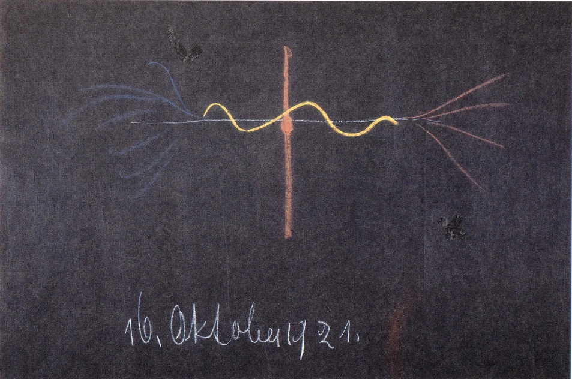

[ 1 ] ^cbw9mo

Im Laufe der letzten Betrachtungen zeigte es sich uns, wie grundverschieden des Menschen ganze Anschauung ist, je nachdem er hier zwischen der Geburt und dem Tode oder aber in der geistigen Welt zwischen dem Tode und einer neuen Geburt lebt. Und wir haben gestern gesagt, daß der Mensch in unserem gegenwärtigen Zeitalter, seit der Mitte des 15. Jahrhunderts, hier zwischen der Geburt und dem Tode sich erwerben kann die Freiheit, daß dann alles, was er vollbringt aus dem Impuls der Freiheit heraus, seinem Wesen in dem Leben zwischen dem Tod und neuer Geburt gewissermaßen Schwere, Realität, Sein gibt. Gerade wenn wir loskommen hier von den Notwendigkeiten des irdischen Daseins, wenn wir uns erheben zu Motiven für unser Wollen, die frei sind, wenn wir also für unser Wollen nichts aus dem Irdischen heraus nehmen, dann zimmern wir uns dadurch die Möglichkeit, zwischen dem Tod und einer neuen Geburt auch ein selbständiges Wesen zu sein. Nur gehört zu diesem gewissermaßen Sein-Selbst-Bewahren nach dem Tode in unserem Zeitalter dazu, was man nennen kann die Beziehung zu dem Mysterium von Golgatha; und man kann ja dieses Mysterium von Golgatha von den verschiedensten Gesichtspunkten aus betrachten. Wir haben schon eine große Anzahl von Gesichtspunkten im Laufe der Jahre eingenommen; wir wollen es heute einmal von dem Gesichtspunkte, der sich ergibt durch die Betrachtung des Wertes der Freiheit für den Menschen, anschauen. ^3kqosd

[ 2 ] ^589o3l

Wenn der Mensch hier auf der Erde zwischen Geburt und Tod lebt, dann hat er ja eigentlich im gewöhnlichen Bewußtsein keine Selbstanschauung. Der Mensch kann nicht in sich hineinschauen. Es ist natürlich nur eine Täuschung, wenn eine äußere Wissenschaft durch die Betrachtung dessen, was am Menschen tot ist, zuweilen ja wirklich nur durch die Betrachtung des Leichnams, glaubt, eine Innenerkenntnis der menschlichen Organisation zu gewinnen. Das ist ja durchaus ein Trug, eine Illusion. Der Mensch hat hier zwischen Geburt und Tod nur eine Anschauung der äußeren Welt. Aber was für eine Anschauung der äußeren Welt hat er hier? Er hat diejenige Anschauung, die wir oftmals genannt haben die Anschauung des Scheines, und auch gestern habe ich dies wiederum stark hervorgehoben. ^uu2a2e

[ 3 ] ^jy694i

Wenn wir unsere Sinne hinausrichten in unsere Weltumgebung zwischen Geburt und Tod, dann stellt sich uns die Welt als Erscheinung, als Schein dar. Wir können diesen Schein in unser Ich-Wesen hereinnehmen. Wir können ihn zum Beispiel in der Erinnerung behalten, haben ihn also dann in gewissem Sinne zu unserem Eigentum gemacht. Aber insofern er beim Hinausschauen in die Welt vor uns steht, ist er eben Schein, ein Schein, der sich als solcher noch ganz besonders dadurch zu erkennen gibt, daß er ja, wie ich Ihnen gestern gezeigt habe, im Tode verschwindet und in anderer Form wiederum auftritt, indem er nun nicht mehr in uns erlebt wird, sondern vor uns oder um uns erlebt wird. ^s8ghb3

[ 4 ] ^eiz91i

Wenn aber der Mensch zwischen Geburt und Tod im heutigen Zeitalter die Welt nicht als Schein wahrnehmen würde, wenn er den Schein nicht erleben könnte, so könnte er ja nicht frei sein. Die Entwickelung der Freiheit ist nur möglich in der Welt des Scheines. Ich habe das angedeutet in meinem Buche «Vom Menschenrätsel», indem ich darauf hingewiesen habe, daß eigentlich die Welt, die wir erleben, verglichen werden kann mit den Bildern, die uns aus einem Spiegel heraus anschauen. Diese Bilder, die uns aus einem Spiegel heraus anschauen, die können uns nichts aufzwingen; sie sind eben nur Bilder, sie sind Schein. Und so ist das, was der Mensch als Wahrnehmungswelt hat, auch Schein. ^7pwyl0

[ 5 ] ^0wobcm

Der Mensch ist ja durchaus nicht etwa ganz nur in den Schein der Welt eingesponnen. Er ist nur mit seinem Wahrnehmen, das sein waches Bewußtsein ausfüllt, eingesponnen in eine Scheinwelt. Aber wenn der Mensch hinblickt auf seine Triebe, auf seine Instinkte, auf seine Leidenschaften, auf seine Temperamente, auf all das, was heraufwogt aus dem menschlichen Wesen, ohne daß er es zu klaren Vorstellungen bringen kann, wenigstens zu wachen Vorstellungen, so ist ja das alles nicht Schein. Es ist schon Wirklichkeit, aber eine Wirklichkeit, die dem Menschen nicht vor das gegenwärtige Bewußtsein tritt. Der Mensch lebt zwischen Geburt und Tod in einer wahren Welt, die er nicht kennt, die aber niemals dazu angetan ist, ihm wirklich die Freiheit zu geben. Instinkte, die ihn unfrei machen, kann sie ihm einpflanzen, innere Notwendigkeiten kann sie hervorbringen, aber nie und nimmer kann sie den Menschen die Freiheit erleben lassen. Die Freiheit kann nur erlebt werden innerhalb einer Welt von Bildern, von Schein. Und wir müssen eben, indem wir aufwachen, in ein Scheinwahrnehmungsleben eintreten, damit sich da die Freiheit entwickeln kann. ^fqa5pb

[ 6 ] ^qsca7h

Dieses Scheinleben, das wir als unser waches Wahrnehmungsleben haben, es war nicht immer so innerhalb der geschichtlichen Entwickelung der Menschheit. Wenn wir zurückgehen in alte Zeiten, in die wir ja schon öfter den Blick zurückgeworfen haben, wo ein gewisses instinktives Schauen vorhanden war oder das, was Nachzügler ist dieses instinktiven Schauens, was ja als Nachzügler gewissermaßen noch fortgedauert hat bis in die Mitte des 15. Jahrhunderts, wenn wir da zurückblicken, so können wir nicht im gleichen Sinne sagen, daß der Mensch in seinem wachen Zustande nur eine Scheinwelt um sich hatte. Durch den Schein hindurch sprach ja für den Menschen alles das, was er in seiner Art als den geistigen Hintergrund der Welt sah. Er sah allerdings auch diesen Schein, aber in anderer Weise. Es war dieser Schein für ihn Ausdruck, Offenbarung einer geistigen Welt. Diese geistige Welt ist hinter dem Scheine verschwunden. Der Schein ist geblieben. Das ist das Wesentliche in der Fortentwickelung der Menschheit, daß ältere Zeiten den Schein als die Offenbarung einer göttlich-geistigen Welt empfunden haben, daß aber aus diesem Schein die göttlich-geistige Welt verschwunden ist und der Schein heute dem Menschen vor Augen liegt, damit er innerhalb dieser Scheinwelt seine Freiheit finden kann, daß also der Mensch seine Freiheit in einer Scheinwelt finden muß, daß er in der wahren Welt, die ganz zurückgetreten ist in die dumpfen Erlebnisse des Inneren, keine Freiheit, sondern nur eine Notwendigkeit findet. Man kann also sagen: Lebt der Mensch zwischen Geburt und Tod - alles das, was ich sage, gilt nur für unser Zeitalter -, so ist seine Wahrnehmungswelt eine Scheinwelt. Er nimmt die Welt wahr, aber er nimmt die Welt als Schein wahr. ^2fw497

[ 7 ] ^ertnr2

Wie ist es nun zwischen dem Tod und einer neuen Geburt? Wir haben ja in den letzten Betrachtungen darauf hingewiesen, daß da der Mensch nicht diese äußere Welt wahrnimmt, die er hier gewahr wird zwischen der Geburt und dem Tode, sondern daß in der Zeit zwischen dem Tod und einer neuen Geburt der Mensch wesentlich den Menschen selbst, das Innere des Menschen sieht. Der Mensch ist dann für den Menschen die Welt. Das, was gerade hier auf der Erde verborgen ist, das ist in der geistigen Welt offenbar. Der ganze Zusammenhang zwischen dem Seelischen und dem Organischen des Menschen, zwischen der Wirksamkeit der einzelnen Organe, kurz, alles, was gewissermaßen, symbolisch gesprochen, innerhalb der menschlichen Haut ist, das durchschaut der Mensch zwischen dem Tod und einer neuen Geburt. ^e2ogps

[ 8 ] ^lb1oyy

Aber nun ist es wieder für unser Zeitalter so, daß da der Mensch eben nicht dazu kommt, im Scheine zu leben. Das Leben im Scheine ist ihm eigentlich nur gewährt zwischen der Geburt und dem Tode. Der Mensch kommt heute nicht dazu, zwischen dem Tode und einer neuen Geburt im Scheine zu leben. Er wird gewissermaßen gefangengenommen von der Notwendigkeit, wenn er durch den Tod tritt. So frei sich der Mensch fühlt in seinem Wahrnehmen hier auf der Erde, wo er seine Augen hinwenden kann, wohin er will, sich in Begriffen zusammenfassen kann, was er wahrnimmt, in der Weise, daß er sein freies Tun in diesen Begriffen empfindet, so unfrei fühlt sich der Mensch in dieser Beziehung auf die Wahrnehmungswelt zwischen dem Tod und einer neuen Geburt. Er wird gewissermaßen hingerissen von der Welt. Es ist geradeso, als ob in dieser Zeit der Mensch so wahrnehmen würde, wie er hier wäre, wenn er gewissermaßen hypnotisiert würde von jeder einzelnen Sinneswahrnehmung, wenn er hingerissen würde von jeder einzelnen Sinneswahrnehmung, so daß er nicht freiwillig von ihr loskommen könnte. ^sww3bg

[ 9 ] ^sfuoin

Das ist die Entwickelung, in die der Mensch eingetreten ist mit der Mitte des 15. Jahrhunderts. Aus dem Schein der Erde sind ihm verschwunden die göttlich-geistigen Welten. In der Zeit zwischen dem 'Tod und einer neuen Geburt nehmen ihn aber diese göttlich-geistigen Welten so gefangen, daß er seine Selbständigkeit ihnen gegenüber nicht bewahren kann. Nur, sagte ich, wenn der Mensch hier wirklich Freiheit entwickelt, das heißt, wenn er seinen ganzen Menschen engagiert für das Scheinleben, dann ist es ihm möglich, auch sein Eigenwesen durch die Todespforte zu tragen. Was aber dazu noch notwendig ist, es kann uns vor Augen treten, wenn wir noch auf einen anderen Unterschied unseres Anschauens von heute mit älteren menschlichen Anschauungen hinblicken. ^9rjdte

[ 10 ] ^zu4wzx

Ob wir mehr die allgemeine Menschheit betrachten oder die Eingeweihten und die Mysterien in älteren Zeiten, die ganze Weltanschauung war anders orientiert, als sie heute orientiert ist. Wenn der Mensch bei demjenigen stehenbleibt, was er seit der Mitte des 15. Jahrhunderts durch die seither aufgekommene Wissensart eben erkennen kann, wenn man auf das hindeutet, so findet man, daß der Mensch sich da Vorstellungen macht über die Erdenentwickelung, Vorstellungen macht über die Entwickelung seiner eigenen Menschengattung; aber es entschwinden ihm solche Vorstellungen, die in irgendeiner befriedigenden Weise auf Erdenanfang und Erdenende hinweisen können. Man möchte sagen, eine gewisse Entwickelungslinie überblickt der Mensch. Er sieht geschichtlich zurück, er sieht geologisch zurück. Aber wenn er weiter zurückgeht, macht er sich Hypothesen. Er stellt an den Anfang den Urnebel (Zeichnung $. 179, waagrechter Strich hell), der ein physisches Gebilde zu sein scheint. Daraus entwickeln sich dann — das heißt, es entwickelt sich nicht, sondern der Mensch bildet sich ein, daß es sich entwickelt - die höheren Wesen der Naturreiche, Pflanzen, Tiere und so weiter. Dann wiederum stellt sich der Mensch vor nach heutigen physikalischen Vorstellungen: Am Ende verfällt das irdische Sein in den Wärmetod (Zeichnung rote Striche rechts) — wiederum eine Hypothese. Der Mensch sieht also gewissermaßen ein Stück zwischen Anfang und Ende. Anfang und Ende verschwimmen als unbefriedigende Gebilde vor dem heutigen Blick des Menschen. ^7pdb2e

[ 11 ] ^za49fu

Das war für ältere Zeiten nicht so. Für ältere Zeiten hatten die Menschen vermöge jenes Sich-Offenbarens des Göttlich-Geistigen im Scheine gerade über Erdenanfang und Erdenende ganz präzise Vorstellungen. Wir können auf das Alte Testament blicken, wir können in andere Religionslehren der Alten blicken: Wir finden im Alten Testamente gerade über den Weltenanfang in der Art, wie es eben damals gegeben werden konnte, Vorstellungen ausgebildet, so daß der Mensch aus diesen Vorstellungen sein eigenes Dasein auf der Erde begreifen konnte. Aus dem Kant-Laplaceschen Urnebel heraus kann niemand das menschliche Dasein jetzt auf der Erde begreifen. ^y6mjtv

[ 12 ] ^7csp29

Wenn Sie die wunderbaren Kosmogonien der verschiedenen heidnischen Völker nehmen, so haben Sie wiederum etwas, woraus der Mensch sein irdisches Dasein begreifen kann. Der Mensch also richtete den Blick auf den Erdenanfang und konnte zu Vorstellungen kommen, die ihn einschlossen. Was dann als Vorstellungen über das Erdenende da war, das hielt sich sogar länger im Bewußtsein der Menschen aufrecht. Wir sehen noch, sagen wir, in Michelangelos «Jüngstem Gericht», in anderen «Jüngsten Gerichten» bis in die neuesten Zeiten hinein Vorstellungen über das Erdenende, die durchaus den Menschen einschließen, die, mögen nun die Vorstellungen über Schuld und Sühne noch so schwierig sein, den Menschen nicht vernichten. ^c482rt

[ 13 ] ^5cr12n

Nehmen wir die heutige hypothetische Vorstellung über das Erdenende: da ist ja alles in eine gleichmäßige Wärme aufgegangen. Das ganze menschliche Wesen ist abgeschmolzen. Der Mensch hat da keinen Platz. Neben dem also, daß das göttlich-geistige Sein verschwunden ist aus dem Wahrnehmungsschein, sind dem Menschen verlorengegangen im Laufe der Zeit solche Vorstellungen über Erdenanfang und Erdenende, innerhalb welcher er Geltung haben kann, innerhalb welcher er mit dem Erdenanfang und Erdenende sich selber im Kosmos sehen kann. ^6mwtwn

[ 14 ] ^bwq9rs

Was war denn für diese Menschen, in welcher Gestalt immer sie sie mögen erkannt haben, die Geschichte? Die Geschichte war das, was sich zwischen Erdenanfang und Erdenende bewegte, was einen Sinn bekam durch die Vorstellungen vom Erdenanfang und Erdenende. Nehmen Sie irgendeine heidnische Kosmologie und Sie können sich das geschichtliche Werden der Menschheit vorstellen. Sie gelangen zurück bis in Zeiten, in denen das Irdische aufgeht in einem göttlich-geistigen Weben. Die Geschichte hat einen Sinn. Auch nach vorne hin, nach dem Erdenende, hat die Geschichte einen Sinn. Blieb bis in die neueren Zeiten herein für das bildhafte Anschauen, für das religiöse Empfinden mehr erhalten die Vorstellung von dem Erdenende, so blieb für die geschichtliche Betrachtung der Erdenanfang noch in einer gewissen Weise bis in die neuesten Zeiten wie ein Nachzügler durchaus vorhanden. Bis in solch aufgeklärte Geschichtswerke wie die Rottecksche Weltgeschichte finden Sie noch das Nachwirken dieser Vorstellung vom Erdenanfang, die der Geschichte einen Sinn gibt. Wenn das auch nur noch ein Schatten ist über den Erdenanfang in Rottecks Weltgeschichte, die ja im Anfange des 19. Jahrhunderts geschrieben worden ist, es gibt das dem geschichtlichen Werden noch einen Sinn. Das ist das Bedeutsame, das Eigentümliche, daß in derselben Zeit, in der der Mensch eintritt in eine Wahrnehmungswelt des Scheines, indem ihm also die äußere Natur als Schein vor sein Wahrnehmen tritt, daß in dieser Zeit für das unmittelbare menschliche Wissen die Geschichte wegen des Fehlens von Erdenanfang und Erdenende ihren Sinn verliert. ^l8m6gc

[ 15 ] ^zioo7t

Nehmen Sie nur diese Sache völlig ernst. Nehmen Sie am Ausgangspunkte der Erdenentwickelung einen Urnebel, aus dem sich herausballen zuerst unbestimmte Gestalten, dann alle Wesen, die dann heraufkommen bis zum Menschen, und nehmen Sie am Erdenende den Wärmetod, in dem alles erstirbt, und dazwischen dasjenige, was wir erzählen meinetwillen von Moses, von den alten chinesischen Größen, von den alten indischen, persischen, ägyptischen Größen bis über Griechenland, bis über Rom hinaus, bis in unsere Zeiten, zu dem wir hinzufügen in Gedanken, was etwa noch kommen möchte - es spielt sich auf der Erde ab wie eine Episode ohne Anfang und ohne Ende. Sinnlos erscheint die Geschichte. ^8qvekv

[ 16 ] ^p1q66q

Man muß sich das nur einmal klarmachen. Die Natur ist zu überschauen, wenn auch nicht in ihrem Inneren. Als Schein tritt sie vor den Menschen, indem er sie erlebt zwischen der Geburt und dem Tode. Die Geschichte wird sinnlos. Und der Mensch ist nur nicht mutig genug in unserer Zeit, sich zu gestehen, daß die Geschichte sinnlos ist, sinnlos aus dem Grunde, weil ihm entfallen ist Erdenanfang und Erdenende. Der Mensch müßte eigentlich heute das größte Rätsel empfinden gegenüber dem geschichtlichen Werden der Menschheit. Er müßte sich sagen: Sinnlos ist dieses geschichtliche Werden. ^uklryx

[ 17 ] ^8z0t1e

Einzelne haben das geahnt. Lesen Sie bei Schopenhauer nach, was er über die Sinnlosigkeit der Geschichte aus dem abendländischen Glauben heraus vorgebracht hat, dann werden Sie eben sehen, daß Schopenhauer diese Sinnlosigkeit durchaus empfunden hat. Es muß auftreten das Verlangen, in einer anderen Weise den Sinn der Geschichte wiederum zu finden. Aus der Welt, die wir genügend finden können für die Naturerkenntnis, aus der Welt des Scheines, aus ihr heraus können wir uns gerade im Goetheschen Sinne eine befriedigende Naturerkenntnis bilden, wenn wir auf Hypothesen verzichten und in der Phänomenologie, das heißt in der Scheinlehre, in der Erscheinungslehre stehenbleiben. In der Naturlehre kann Befriedigung sein, wenn wir uns nur enthalten der störenden Hypothesen über Erdenanfang und Erdenende. Aber wir sind dann gewissermaßen in unserer Erdenhöhle eingeschlossen; wir sehen nicht heraus. Die Kant-Laplacesche Theorie und der Wärmetod verbauen uns den Ausblick in die zeitlichen Weltenweiten. ^hhbm4j

[ 18 ] ^px1ld5

Im Grunde genommen ist das die Lage, in der nach dem allgemeinen Bewußtsein doch die gegenwärtige Menschheit lebt. Daher droht ihr eine gewisse Gefahr. Sie kann sich nicht recht einleben in die bloße Welt der Phänomene, in die Welt des Scheines. Vor allen Dingen mit dem inneren Leben kann sie sich nicht in diese Welt des Scheines einleben. Sie will sich der Notwendigkeit, der inneren Notwendigkeit übergeben, den Instinkten, Trieben, Leidenschaften. Wir sehen ja heute wenig von dem verwirklicht, was aus der freien Impulsivität des reinen Denkens hervorgeht. Aber ebensoviel als dem Menschen hier im Leben zwischen Geburt und Tod mangelt an Freiheit, ebensoviel kommt mit dem hypnotisierenden Zwange zwischen Tod und neuer Geburt von Unfreiheit, von Notwendigkeit in der Wahrnehmung über ihn. So daß dem Menschen die Gefahr droht, daß er durch die Todespforte schreitet, sein eigenes Wesen nicht mitnehmen kann, aber für die Wahrnehmungswelt sich nicht einlebt in etwas Freies, sondern in etwas, was ihn untertauchen läßt in Zwangsverhältnisse, was ihn wie erstarren macht in der äußeren Welt. ^4y5ve8

[ 19 ] ^rbey2d

Was da einschlagen muß in das Leben der Menschheit gegen die Zukunft hin, das ist, daß dem Menschen in anderer Weise das Göttlich-Geistige erscheint, als es ihm erschienen ist in alten Zeiten. In alten Zeiten konnte sich der Mensch an Erdenanfang und Erdenende innerhalb des Physischen ein Geistiges denken, mit dem er sich eins wissen konnte, das ihn nicht ausschloß. Immer mehr und mehr aber muß der Mensch von der Mitte dieses Durchgeistigten aufnehmen, statt von Anfang und Ende (siehe Zeichnung, senkrechter Strich Mitte). Und wie man im Alten Testamente am Erdenanfang sah eine Genesis des Menschen, innerhalb welcher sein Sein gesichert war, wie man hatte in heidnischen Kosmogonien ein Sich-Herausentwickeln der Menschheit, aus göttlich-geistigem Dasein, wie man hat ein Hinblicken auf das Erdenende, das sich noch erhalten hat, wie gesagt, in den Anschauungen vom Weltenuntergang, die dem Menschen auch nicht sein Sein vor sich selber nehmen, so muß sich in der neueren Zeit in einer richtigen Anschauung vom Mysterium von Golgatha für die Mitte der Erdenentwickelung dasjenige finden, wo man wiederum Göttliches und Irdisches ineinanderschaut. Recht verstehen muß der Mensch, wie der Gott durch den Menschen gegangen ist mit dem Mysterium von Golgatha. Dann ist ihm das dafür gegeben, was ihm entfallen ist für Erdenanfang und Erdenende. Aber es ist ein wesentlicher Unterschied zwischen diesem Hinblicken auf das Mysterium von Golgatha und dem früheren Hinblicken auf Erdenanfang und Erdenende. ^8d0u16

 ^t20f1w

[ 20 ] ^lowxwk

Versetzen Sie sich nur recht in das Entstehen einer heidnischen Kosmogonie. Es gibt ja allerdings heute vielfach die Vorstellung, daß diese heidnischen Kosmogonien Erdichtungen der Völker sind. Man hat die Vorstellung: So wie heute der Mensch seine Gedanken in Freiheit aneinanderkuppelt und wieder auseinanderreißt, so haben einstmals die Menschen ihre Kosmogonien ausgesponnen. Aber das ist ja nur eine verirrte Universitätsansicht und geht die Vernunft nichts an. Worum es sich handelt, das ist, daß der Mensch ganz so drinnenstand im Weltenanschauen, daß er nicht anders konnte als in dieser Weise hinschauen auf den Weltenanfang, wie es sich ihm in der Kosmogonie, in den Mythen darstellte. Es war darin keine Freiheit, es war durchaus etwas, was sich dem Menschen mit Notwendigkeit ergab. Er mußte hineinschauen in den Erdenanfang; er konnte gar nicht anders, er konnte das nicht unterlassen. Das stellt man sich heute gar nicht mehr richtig vor, wie da der Mensch durch einen instinktiven Erkenntnisgehalt sich den Erdenanfang, in gewisser Beziehung auch das Erdenende, vor die Seele stellte. ^brmhj1

[ 21 ] ^ja1z1i

So kann sich der Mensch heute das Mysterium von Golgatha nicht vor die Seele stellen. Das ist der große Unterschied beim Christentum gegenüber den alten Götterlehren. Wenn der Mensch den Christus finden will, dann muß er ihn in Freiheit finden. Er muß sich frei zu dem Mysterium von Golgatha bekennen. Der Inhalt der Kosmogonien drängte sich dem Menschen auf. Das Mysterium von Golgatha drängt sich dem Menschen nicht auf. Er muß in einer gewissen Auferstehung seines Wesens in Freiheit an das Mysterium von Golgatha herankommen. ^evpqps

[ 22 ] ^g8vrnd

Zu einer solchen Freiheit wird der Mensch geführt durch das, was ich in diesen Tagen als die Aktivität des Erkennens bei anthroposophischer Geisteswissenschaft bezeichnet habe. Wenn ein Pastor meint, er könne die «Akasha-Chronik» in einer «illustrierten Prachtausgabe» empfangen, also, er könne sie so empfangen, daß er sich nicht in innerer Aktivität anzustrengen brauchte um das, was zwar in Begriffen vor seine Seele treten muß, was aber zu Bildern werden muß, so zeigt er, daß er nur veranlagt ist, dieser Pastor, für eine heidnische Erfassung der Welt, nicht für eine christliche Erfassung; denn zu dem Christus muß der Mensch in innerlicher Freiheit kommen. Gerade wie sich der Mensch zu dem Mysterium von Golgatha stellen muß, gehört zu seinen intimsten Erziehungsmitteln zur Freiheit. ^99c8pa

[ 23 ] ^176hxo

Der Mensch wird gewissermaßen schon durch das Mysterium von Golgatha, wenn er es richtig erlebt, losgerissen von der Welt. Was tritt denn da ein? Erstens: Der Mensch kann jetzt in einer Scheinwahrnehmungswelt leben, denn in dieser Scheinwahrnehmungswelt wogt etwas auf, was ihn zu einem geistigen Sein führt, zu dem geistigen Sein, das garantiert ist in dem Mysterium von Golgatha. Das ist das eine. Das andere aber ist: Die Geschichte hat aufgehört, Sinn zu haben, weil Anfang und Ende weggefallen sind; sie bekommt wiederum einen Sinn, weil ihr dieser Sinn von der Mitte aus gegeben wird. Man lernt erkennen, wie alles das, was vor dem Mysterium von Golgatha liegt, hintendiert, hinzielt zu dem Mysterium von Golgatha, wie alles, was nach dem Mysterium von Golgatha liegt, ausgeht von diesem Mysterium von Golgatha. Die Geschichte bekommt wiederum einen Sinn, während sie sonst eine Scheinepisode ist ohne Anfang und ohne Ende. Indem dem Menschen die äußere Wahrnehmungswelt als Scheinwelt gegenübertritt wegen seiner Freiheit, wird ihm die Geschichte, die das nicht darf, zu einer Scheinepisode; sie steht ohne Schwerpunkt da. Sie löst sich auf in Dunst und Nebel, was sie im Grunde genommen schon bei Schopenhauer theoretisch tat. Durch dieHinneigung zu dem Mysterium von Golgatha bekommt das, was sonst geschichtlicher Schein ist, innerliches Leben, geschichtliche Seele, und zwar eine solche, die verbunden ist mit alldem, was der Mensch im modernen Zeitalter braucht, was er braucht, weil er angewiesen ist darauf, daß sein Leben sich in Freiheit entwickelt. Wenn er durchgeht durch die Pforte des Todes, hat er sich hier die große Lehre der Freiheit entwickelt, Freiheitsentfaltung angeeignet. Das Bekenntnis zu dem Mysterium von Golgatha, das wirft hinein in das Leben das Licht, das sich ausgießen muß über alldem, was frei ist im Menschen. Und der Mensch hat die Möglichkeit, sich vor der Gefahr zu retten, daß er hier im Scheine die Veranlagung für die Freiheit hat, diese Freiheit aber nicht entwickelt, weil er den Instinkten, den Trieben sich hingibt, nach dem Tode daher der Notwendigkeit verfällt. Indem er nun ein religiöses Bekenntnis, das ganz anderer Art ist als die älteren religiösen Bekenntnisse, zu dem seinigen macht, indem er ein nur in der Freiheit lebendes religiöses Bekenntnis seine ganze Seele ausfüllen läßt, artet er sich zum Erleben der Freiheit um. ^x0t79p

[ 24 ] ^hgnheb

Das ist es nämlich, was im Grunde genommen nur wenigen Menschen der heutigen Zivilisation aufgegangen ist: daß erst die Erkenntnis in Freiheit, die Erkenntnis in Aktivität zu dem Christus, zu dem Mysterium von Golgatha führen kann. Den Menschen war die historische Nachricht der Bibel gegeben, damit sie für diejenige Zeit, in welcher sie noch nicht Hinneigung haben konnten für Geisteswissenschaft, eine Kunde von dem Mysterium von Golgatha erhalten haben. ^9tf7on

[ 25 ] ^e8bzix

Gewiß, das Evangelium wird niemals seinen Wert verlieren. Es wird einen immer größeren Wert bekommen, aber zu dem Evangelium muß hinzutreten die unmittelbare Erkenntnis des Wesens des Mysteriums von Golgatha. Der Christus muß auch durch die menschliche Kraft allein, nicht bloß durch die aus den Evangelien wirkende Kraft, erkannt, gefühlt, empfunden werden können. Das ist es ja, was für das Christentum durch die Geisteswissenschaft angestrebt wird. Die Geisteswissenschaft versucht, die Evangelien zu erklären. Sie fußt aber nicht auf den Evangelien. Sie schließt nicht aus den Evangelien. Sie kommt gerade dadurch zu ihrer hohen Bewertung der Evangelien, weil sie gewissermaßen hinterher entdeckt, was alles in den Evangelien steckt und was ja im Grunde genommen für die äußere Menschheitsentwickelung schon verlorengegangen ist. ^xhz0a8

[ 26 ] ^usrm83

So hängen mit der ganzen neueren Menschheitsentwickelung auf der einen Seite die Freiheit, der Wahrnehmungsschein und auf der anderen Seite das Mysterium von Golgatha und der Sinn des geschichtlichen Werdens zusammen. Dieser Ablauf von allerlei Episoden, wie man ihn heute kennenlernt in der landläufigen geschichtlichen Darstellung, er bekommt eben erst Gewichtigkeit, wenn man das Mysterium von Golgatha in die geschichtliche Entwickelung hineinstellen kann. ^5xl1qr

[ 27 ] ^omtmzd

Das wurde von vielen Leuten doch in der richtigen Weise empfunden, und sie haben das richtige Bild dafür gebraucht. Sie haben sich gesagt: Man hat einstmals hinausgeschaut in die Himmelsweiten, man hat die Sonne erblickt, aber die Sonne nicht so erblickt, wie sie heute erblickt wird, so daß es Physiker gibt, die da glauben, da draußen schwimme im Weltenall ein großer Gasball. Ich habe es oft gesagt: Die Physiker würden sehr erstaunt sein, wenn sie einen Weltballon bauen könnten — und da, wo sie einen großen Gasball vermuten, würden sie negativen Raum finden, der sie im Nu überhaupt nicht nur in das Nichts, sondern jenseits des Nichts hinüber, weit hinüber über die Sphäre des Nichts befördern würde. Das, was man da an materialistischen Kosmologien heute entwickelt, das ist ja pure Phantasterei. So hat man sich nicht vorgestellt in älteren Zeiten: die Sonne - ein Gasball, der da draußen schwimmt, sondern die Sonne war ein Geistwesen. Das ist sie auch für den wirklichen Weltanschauer heute noch: ein Geistwesen, das sich nur äußerlich in der Weise repräsentiert, wie das Auge eben die Sonne wahrnehmen kann. Und dieses zentrale Geistwesen empfand die ältere Menschheit als eins mit dem Christus. Die ältere Menschheit wies auf die Sonne, wenn sie von dem Christus sprach. ^uqqh6x

[ 28 ] ^fobyzd

Die neuere Menschheit muß nun nicht von der Erde hinausweisen, sondern auf die Erde weisen, wenn sie von dem Christus spricht, muß die Sonne in dem Menschen von Golgatha suchen. Mit der Anerkenntnis der Sonne als eines Geistwesens war eben verbunden eine menschenmögliche Vorstellung von Erdenanfang und Erdenende. Mit der Vorstellung von dem Jesus, in dem der Christus gewohnt hat, ist eine menschenmögliche und menschenwürdige Vorstellung der Erdenmitte möglich, und von da wird ausstrahlen nach Anfang und Ende hin, was wiederum den ganzen Kosmos so erscheinen läßt, daß der Mensch in ihm Platz hat. Man muß also einer Zeit entgegenleben, in der nicht aus den materialistischen naturwissenschaftlichen Vorstellungen Hypothesen gebaut werden über Erdenanfang und Erdenende, sondern in der ausgegangen wird von der Erkenntnis des Mysteriums von Golgatha, und davon ausgehend das kosmische Werden auch überschaut wird. Mit der äußerlich leuchtenden Sonne empfand der alte Mensch den außerweltlichen Christus. Mit der richtigen Erkenntnis des Mysteriums von Golgatha erschaut der Mensch innerhalb des geschichtlichen Erdenwerdens die Sonne dieses Erdenwerdens durch den Christus. Es glänzt so draußen in der Welt, es glänzt so in der Geschichte - draußen physisch, in der Geschichte geistig: Sonne dort, Sonne da. ^lutqui

[ 29 ] ^fh7k6r

Das gibt vom Gesichtspunkte der Freiheit aus den Weg zum Mysterium von Golgatha. Ihn muß die neuere Menschheit finden, wenn sie über die Niedergangskräfte hinaus in Aufgangskräfte hineinkommen will. ^hbbfax

[ 30 ] ^5droq4

Das muß eben ganz tief und gründlich erkannt werden. Und diese Erkenntnis wird keine abstrakte, keine theoretische bloß sein, diese Erkenntnis wird eine solche sein, die den ganzen Menschen ausfüllt, eine zu erfühlende und im Gefühl zu erlebende Erkenntnis. Nicht bloß ein Hinschauen zu Christus, ein Erfülltsein mit Christus wird das Christentum sein, von dem Anthroposophie wird sprechen müssen. ^r2jnzk

[ 31 ] ^hc9cpk

Man möchte immer den Unterschied wissen zwischen dem, was als ältere Theosophie gelebt hat, und Anthroposophie. Liegt dieser Unterschied nicht auf der Hand? Die ältere Theosophie hat wieder aufgewärmt die heidnische Kosmologie. Überall finden Sie in der Literatur der Theosophie die heidnische Kosmologie aufgewärmt, die für den modernen Menschen nicht paßt; sie redet ihm allerdings von Erdenanfang und Erdenende, aber das ist für ihn nicht mehr so. Und was fehlt diesen Schriften? Gerade diesen Schriften der älteren Theosophie fehlt die Mitte, fehlt überall das Mysterium von Golgatha. Und es fehlt ihnen gründlicher als selbst der äußeren Naturwissenschaft. ^j7r95g

[ 32 ] ^fed6sj

Anthroposophie hat eine fortlaufende Kosmologie, die nicht auslöscht das Mysterium von Golgatha, sondern es aufnimmt, so daß es darinnen ist. Und alle Entwickelung bis in die Saturnzeit zurück, bis zur Vulkanzeit vorwärts wird so gesehen, daß das Licht für dieses Sehen ausstrahlt von der Erkenntnis des Mysteriums von Golgatha. Man muß nur den guten Willen haben, solch einen prinzipiellen Gegensatz anzuerkennen, dann wird man über den Unterschied zwischen älterer ’Theosophie und der Anthroposophie gar keinen Zweifel haben können. ^jb46gs

[ 33 ] ^7trmji

Und wenn insbesondere auch sogenannte christliche Theologen immer wieder und wieder zusammenstellen Anthroposophie und Theosophie, so rührt das lediglich davon her, daß diese christlichen Theologen eben vom Christentum nicht viel verstehen. Es ist ja doch tief bedeutsam, daß Nietzsches Freund, der wirklich bedeutende Basler Theologe Overbeck, sein Buch geschrieben hat über die Christlichkeit der modernen Theologie, indem er den Nachweis zu erbringen suchte, daß die moderne Theologie, auch die christliche Theologie, eben nicht mehr christlich ist. So daß man sagen kann: Hier wurde auch schon von äußerer Wissenschaft darauf aufmerksam gemacht, daß die moderne christliche Theologie vom Christentum nichts versteht, nichts weiß. ^3i1s9i

[ 34 ] ^nx0lvq

Man sollte nur einmal gründlich erkennen, was alles zum Unchristlichen gehört. Die moderne Theologie gehört jedenfalls nicht zum Christlichen, sondern zum Unchristlichen. Aber diese Dinge möchten sich die Menschen aus Bequemlichkeit aus ihrer Erkenntnis auch hinwegwischen. Sie dürfen aber nicht hinweggewischt werden, denn so viel wie weggewischt wird, so viel verliert der Mensch an Möglichkeit, das Christentum wirklich innerlich zu erleben. Das muß erlebt werden, muß erlebt werden, weil es der andere Pol ist zu dem Freiheitserleben, das heraufkommen muß. Freiheit allein aber erlebt - erlebt werden muß sie -, würde den Menschen in den Abgrund hineinführen. Der Führer über diesen Abgrund kann ihm eben nur das Mysterium von Golgatha sein. ^giqmbh

[ 35 ] ^7dbfp5

Davon dann das nächste Mal weiter. ^rgzgkx