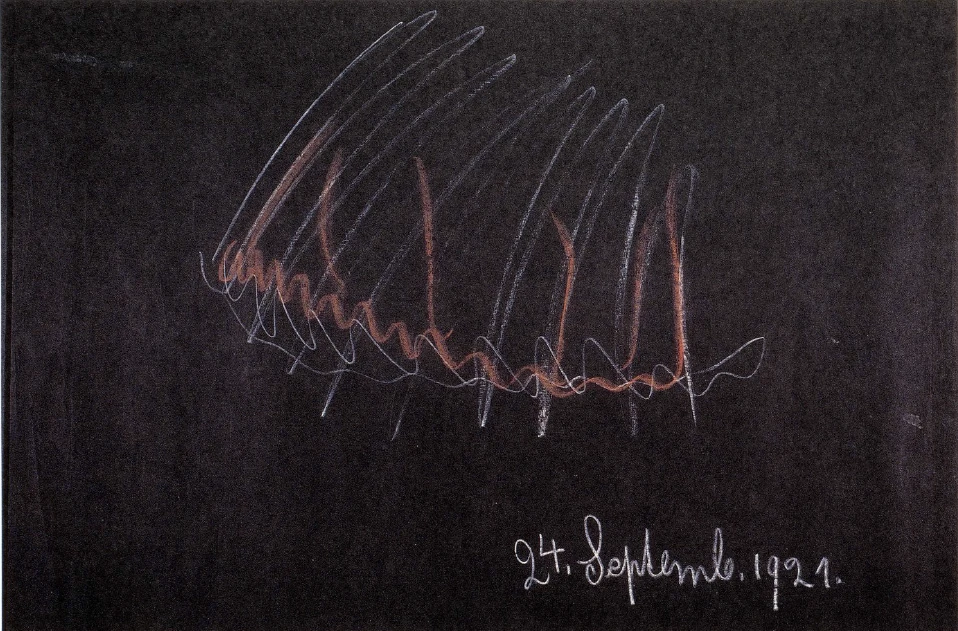
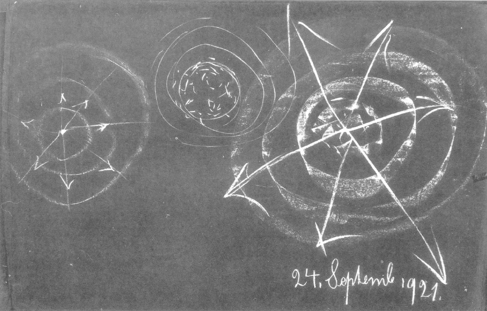

[ 1 ] ^jkzjzu

Ich habe gestern davon gesprochen, daß wir im Inneren des Menschen eine Art Herd der Zerstörung finden. Wenn wir im gewöhnlichen Bewußtsein verharren, so kommen wir ja eigentlich innerhalb dieses Bewußtseins, sagte ich, nur dahin, von den Eindrücken der Welt die Erinnerungen zu bewahren. Wir machen an der Welt unsere Erfahrungen, haben an ihr unsere Erlebnisse durch die Sinne, durch den Verstand, durch die Wirkungen auf unser Seelenleben überhaupt. Später können wir aus unserer Erinnerung die Nachbilder desjenigen, was wir erlebt haben, wiederum hervorholen. Wir tragen als unser Innenleben in uns die Nachbilder der Sinneserlebnisse. Und es ist schon so, wie wenn ein Spiegel in uns wäre, der nur anders wirkt als ein gewöhnlicher räumlicher Spiegel. Ein gewöhnlicher räumlicher Spiegel strahlt zurück, was vor ihm ist. Jener lebendige Spiegel, den wir in uns tragen, strahlt anders zurück. Die Sinneseindrücke, die wir aufnehmen, die strahlt er im Laufe der Zeit, veranlaßt durch dies oder jenes, wiederum in unser Bewußtsein zurück und wir haben die Erinnerungen an unsere Erlebnisse. Wenn wir einen räumlichen Spiegel zerschlagen, so sehen wir hinter den Spiegel. Wir sehen dann ein Gebiet, das wir eben gerade nicht sehen, wenn der Spiegel intakt ist. Wenn wir in der entsprechenden Weise innerlich üben, dann kommen wir, wie ich öfter erwähnt habe, zu etwas wie zu einem Zerbrechen des inneren Spiegels. Die Erinnerungen können gewissermaßen für kurze Zeit — das muß alles in unserer Willkür stehen — aufhören, und wir sehen tiefer in unser Inneres hinein. Und dann eben, wenn wir tiefer in unser Inneres hineinsehen, wenn wir hinter den Erinnerungsspiegel sehen, dann erblicken wir das, was ich gestern charakterisierte als eine Art Zerstörungsherd. ^l3tfnf

[ 2 ] ^109eh3

Ein solcher Zerstörungsherd muß ja in uns sein, denn nur in einem solchen kann eigentlich das Ich des Menschen sich verfestigen. Da ist eigentlich auch der Herd zur Befestigung, zur Erhärtung des Ich. Ich sagte gestern: Wenn diese Ich-Erhärtung, diese Egoität nach außen ins soziale Leben getragen wird, so entsteht eben gerade dadurch das Böse, das Böse im sozialen Leben, im Wirken des Menschen. ^l5up54

[ 3 ] ^zbpcgz

Sie sehen daraus, wie kompliziert eigentlich das Leben, in das der Mensch hineingestellt ist, eingerichtet ist. Was im Inneren des Menschen seine gute Aufgabe hat, ohne das wir unser Ich nicht ausbilden können, das darf gar nicht nach außen getragen werden. Der schlechte, der böse Mensch trägt es nach außen, der gute Mensch behält es in seinem Inneren. Wenn es nach außen getragen wird, wird es Verbrechen, wird es das Böse. Wenn es im Inneren bewahrt bleibt, ist es das, was wir brauchen, damit das menschliche Ich die richtige Stärke erhalte. Es gibt eben nichts in der Welt, was nicht an seinem Orte seine segensreiche Bedeutung haben würde. Wir würden gedankenlose, unbesonnene Menschen sein, wenn wir nicht in uns diesen Herd hätten. Denn dieser Herd äußert sich ja so, daß wir in ihm etwas erleben, was wir in der äußeren Welt niemals erleben können. In der äußeren Welt sehen wir die Dinge materiell. Alles, was wir da sehen, sehen wir materiell, und wir sprechen dann nach den Gewohnheiten der heutigen Wissenschaft von der Erhaltung der Materie, von der Unzerstörbarkeit des eigentlichen Materiellen. ^o23ry6

[ 4 ] ^l4c6yn

In diesem Zerstörungsherd, von dem ich gestern gesprochen habe, wird die Materie wirklich vernichtet. Sie wird in ihr Nichts zurückgeworfen. Und dann können wir innerhalb dieses Nichts, das da entsteht, das Gute entstehen lassen, wenn wir statt unserer Instinkte, unserer Triebe, die nur zur Ausbildung der Egoität wirken müssen, durch eine moralische Seelenverfassung alles das hineingießen in diesen Zerstörungsherd, was moralische, was ethische Ideale sind. Dann entsteht ein Neues. Dann entstehen eben gerade in diesem Zerstörungsherde die Keime für künftige Welten. Da also nehmen wir als Menschen teil an entstehenden Welten. Und wenn wir, wie man das aus meiner «Geheimwissenschaft im Umriß» ersehen kann, davon sprechen, daß einmal unsere Erde der Vernichtung entgegengehen und sich durch allerlei Umwandlungszustände das Jupiterdasein entwickeln wird, so müssen wir sagen: In diesem Jupiterdasein wird nur dasjenige sein, was sich heute schon in den Menschen innerhalb dieses Zerstörungsherdes als Neubildung gestaltet aus den moralischen Idealen heraus — allerdings auch aus den antimoralischen Impulsen heraus, aus demjenigen, was eben gerade als das Böse aus der Egoität heraus wirkt. Und so wird das Jupiterdasein eben ein Kampf sein zwischen dem, was die Menschen auf der Erde schon zustande bringen dadurch, daß sie in ihr inneres Chaos hineinbringen ihre moralischen Ideale, und dem, was sie auch hineinbringen als das, was mit der Ausbildung der Egoität als das Unmoralische, als das Widermoralische entsteht. So also schauen wir auf ein Gebiet, wo Materie in ihr Nichts zurückgeworfen wird, indem wir in unser tiefstes Inneres hineinblicken. ^g3ads6

[ 5 ] ^ig67nw

Ich habe dann darauf hingedeutet, wie es sich auf der anderen Seite des menschlichen Daseins verhält, auf der Seite, wo die Sinneserscheinungen um uns herum ausgebreitet sind. Wir blicken hin auf diese Sinneserscheinungen: Wie ein Teppich sind sie ausgebreitet, und wir wenden dann unseren kombinierenden Verstand an, um innerhalb dieser Sinneserscheinungen Gesetze zu finden, die wir die Naturgesetze nennen. Aber mit dem gewöhnlichen Bewußtsein kommt man nicht durch diesen Sinnesteppich durch. Geradesowenig wie man mit dem gewöhnlichen Bewußtsein nach innen durch den Erinnerungsspiegel durchkommt, geradesowenig kommt man nach außen durch mit dem gewöhnlichen Bewußtsein durch den Teppich der Sinneseindrücke. Mit dem entwickelten Bewußtsein kommt man durch, und mit einem instinktiv schauenden Bewußtsein kamen die Menschen der alten orientalischen Weisheit durch. Und dann erblickten sie diejenige Welt, in der zunächst die Egoität im Bewußtsein sich nicht geltend machen kann. Wir treten jedesmal beim Einschlafen in diese Welt ein. Da wird die Egoität herabgedämpft, weil eben jenseits des Sinnesteppichs die Welt liegt, wo zunächst die für das Menschendasein sich entwikkelnde Ich-Gewalt keinen Platz hat. Daher sprach diejenige Weltanschauung, die als die alte orientalische eine besondere Sehnsucht entwickelte, hinter den Sinneserscheinungen zu leben, von dem Nirvana, von dem Verwehen der Egoität. ^u9x6js

[ 6 ] ^xw1i18

Wir haben dann gestern hingewiesen auf den großen Gegensatz, der da lebt zwischen Orient und Okzident. Der Orient hat einstmals ausgebildet alles das, was der Mensch ersehnt zu schauen hinter den Sinneserscheinungen, und er bildete da das Schauen für eine geistige Welt aus, für diejenige Welt, die nicht aus Atomen und Molekülen, wohl aber aus geistigen Wesenheiten sich zusammengliedert, und die für die alte orientalische Weltanschauung einfach als die schaubare Wirklichkeit da war. Jetzt lebt der Orient, jetzt lebt Asien und leben andere Glieder der Welt in den dekadenten Entwickelungsstadien dieses Sich-Sehnens nach der Welt hinter den Sinneserscheinungen, während der Okzident ausgebildet hat die Egoität, ausgebildet hat alles das, was im Menscheninneren sich erhärtet und verfestigt innerhalb des Zerstörungsherdes, den wir charakterisiert haben. ^joazyr

[ 7 ] ^qs1hwf

Damit hat man aber auch zu gleicher Zeit auf alles das hingedeuter, was notwendigerweise heute und in der nächsten Zukunft wird einziehen müssen in das Bewußtsein der Menschen. Denn würde weiter bleiben, was sich seit der Mitte des 15. Jahrhunderts als der bloße Intellektualismus heraufentwickelt hat, so würde die Menschheit vollständig in den Niedergang verfallen, denn mit Hilfe des Intellektualismus gelangt man niemals weder hinter den Erinnerungsspiegel noch hinter den vor unseren Sinnen ausgebreiteten Sinnesteppich. Der Mensch muß aber wieder ein Bewußtsein von diesen Welten erlangen. Er muß ein Bewußtsein von diesen Welten erlangen schon aus dem Grunde, damit für ihn das Christentum wiederum eine Wahrheit werden könne; denn das Christentum ist eigentlich heute für ihn keine Wahrheit. Wir sehen das am besten an der neuzeitlichen Ausbildung der Christus-Vorstellung, wenn man überhaupt von einer solchen Ausbildung sprechen kann. Es ist schon einmal so für den modernen Menschen in dem gegenwärtigen Entwickelungsstadium, daß er zu einer Christus-Vorstellung gar nicht kommen kann aus denjenigen Begriffen und Ideen heraus, die sich seit dem 15. Jahrhundert als die naturwissenschaftlichen ausgebildet haben. Und man ist auch im 19. Jahrhundert und im Beginne des 20. Jahrhunderts zu keiner Christus-Vorstellung fähig gewesen. ^6g0ufs

[ 8 ] ^20f7h4

Diese Dinge muß man in der folgenden Weise ansehen. Wenn der Mensch so, wie er nun einmal sein heutiges Bewußtsein hat, sich die Welt ringsherum anschaut, so bildet er sich mit dem kombinierenden Verstande Naturgesetze. Dadurch kommt er ja auf eine Weise, die durchaus dem heutigen Bewußtsein schon möglich ist, dazu, zu sagen: Diese Welt ist von Gedanken durchsetzt, denn die Naturgesetze sind in Gedanken erfaßbar und sind eigentlich selbst die Weltgedanken. — Man kommt dann dazu — namentlich, wenn man die Naturgesetze verfolgt bis zu derjenigen Stufe, wo sie angewendet werden müssen auf das eigene Entstehen des Menschen als physisches Wesen -, sich zu sagen: Innerhalb derjenigen Welt, die wir mit unserem gewöhnlichen Bewußtsein überschauen, von der Sinneswahrnehmung bis zum Erinnerungsspiegel, lebt ein Geistiges. - Man muß eigentlich schon als Mensch krank sein, pathologisch sein, wenn man wie der gewöhnliche atheistische Materialist dieses Geistige nicht anerkennen will. Wir stehen ja in dieser Welt, die dem gewöhnlichen Bewußtsein gegeben ist, so darinnen, daß wir aus ihr als physischer Mensch durch die physische Konzeption und die physische Geburt selber hervorgehen. Was da beobachtbar ist innerhalb der physischen Welt, das muß nämlich notwendigerweise unvollständig betrachtet werden, wenn man nicht eine allgemeine geistige Wesenheit zugrunde legt. Wir werden als physische Wesen auf physische Art geboren. Wir sind eigentlich, wenn wir als kleines Kind geboren werden, für die äußere physische Anschauung ziemlich ähnlich einem Naturwesen. Und aus diesem Naturwesen, das im Grunde genommen in einer Art von schlafendem Zustand ist, entwickeln sich die inneren geistigen Fähigkeiten heraus. Diese inneren geistigen Fähigkeiten entstehen ja erst im Laufe der künftigen Entwickelung. Man muß sich ganz notwendigerweise dazu bequemen, das, was da im Menschen entsteht als die geistigen Fähigkeiten, ebenso zurückzuverfolgen hinter Geburt und Konzeption, wie man das Wachsen der Glieder verfolgt. Dann aber kommt man eben dazu, sich auch das lebendig geistig zu denken, was man sonst an der äußeren Natur sich nur als die abstrakten Naturgesetze bildet. Und dann kommt man, mit anderen Worten, zum Konstatieren dessen, was man den Vatergott nennen kann. ^m4mvm6

[ 9 ] ^vyulxi

Es ist schon bedeutsam, daß die Scholastik im Mittelalter angenommen hat, daß unter denjenigen Erkenntnisergebnissen, die man haben kann aus der gewöhnlichen Beobachtung der Welt durch die gewöhnliche menschliche Vernunft, die Erkenntnis des Vatergottes ist. Man kann schon sagen, wie ich es öfters ausgedrückt habe: Wer sich wirklich darauf einläßt, diese Welt, die dem gewöhnlichen Bewußtsein gegeben ist, zu zergliedern und dann nicht dazu kommt, die Naturgesetze zuletzt zusammenzufassen in demjenigen, was man den Vatergott nennt, der muß eigentlich irgendwie krank sein, pathologisch sein. Atheist sein, heißt krank sein - so sprach ich das hier einmal aus. ^cz6err

[ 10 ] ^nqhxos

Aber man kommt mit diesem gewöhnlichen Bewußtsein eben nicht weiter als bis zu diesem Vatergotte. Bis zu ihm kann man kommen mit dem gewöhnlichen Bewußtsein, aber eben nicht weiter. Und daher ist es charakteristisch, daß einer, der als ein ganz bedeutender Theologe der neuesten Zeit gilt, Adolf von Harnack, davon gesprochen hat, daß eigentlich Christus, der Sohn, in die Evangelien gar nicht hineingehöre, daß in die Evangelien die Botschaft vom Vater gehöre, daß Christus Jesus eigentlich nur insoweit in die Evangelien gehöre, als er die Botschaft von dem Vatergott gebracht hat. Sie können da ganz deutlich sehen, daß dieses moderne Denken auch in der modernen Theologie mit einer gewissen Konsequenz dazu führt, nur den Vatergott anzuerkennen und die Evangelien selber so aufzufassen, daß in ihnen nur enthalten ist die Botschaft von dem Vatergotte. Man wollte also im Sinne dieser Theologie den Christus als Wesenheit nur insofern gelten lassen, als er einmal in der Welt aufgetreten ist und den Menschen die richtige Lehre vom Vatergotte beigebracht habe. ^3hraiz

[ 11 ] ^u0tjwa

Darin ruht zweierlei: erstens der Glaube, als ob die Botschaft vom Vatergotte nicht durch die gewöhnliche Weltbetrachtung gefunden werden könnte. Die Scholastik hat das noch angenommen, hat nicht angenommen, daß die Evangelien dazu da seien, um von dem Vatergotte zu sprechen, sondern sie hat angenommen, daß die Evangelien dazu da seien, um von dem Sohnesgotte zu sprechen. Daß so die Meinung auftreten konnte, es solle eigentlich nur vom Vatergotte gesprochen werden, das bezeugt, daß auch die Theologie eingelaufen ist in die Denkweise, die sich eben als die okzidentale ausgebildet hat. Denn bis etwa ins 3., 4. nachchristliche Jahrhundert, wo noch viel von orientalischer Weisheit im Christentum da war, da beschäftigte die Menschen innig die Frage nach dem Unterschiede zwischen dem Vatergotte und dem Sohnesgotte. Man möchte sagen: Diese feinen Unterscheidungen zwischen dem Vater- und dem Sohnesgotte, die die ersten christlichen Jahrhunderte unter dem Einfluß der orientalischen Weisheit noch beschäftigt haben, die haben eigentlich gar keinen Inhalt mehr für den modernen Menschen, für jenen modernen Menschen, der unter solchen Einflüssen, wie ich es gestern dargestellt habe, die Egoität ausgebildet hat. ^qdzw9n

[ 12 ] ^piooys

Und so kommt denn eine gewisse Unwahrheit in das moderne religiöse Bewußtsein hinein. Das, was der Mensch innerlich erlebt, wozu er kommt durch seine Weltzergliederung und Weltsynthese, das ist der Vatergott. Aus der Tradition, aus der Überlieferung hat er dann Gott den Sohn. Die Evangelien sprechen ihm davon, die Tradition spricht ihm davon: Er hat den Christus; er will sich zum Christus bekennen — aber aus dem inneren Erleben heraus hat er eigentlich den Christus nicht, Und so überträgt er das, was er eigentlich nur anwenden sollte auf den Vatergott, auf den Christus-Gott. Die moderne Theologie hat eigentlich gar nicht den Christus, sie hat nur den Vater, aber sie nennt den Vater «Christus», weil es nun schon einmal so ist, daß die ChristusWesenheit aus der Geschichte überliefert ist und man Christ sein will. Man dürfte sich, wenn man wahr wäre, gar nicht Christ nennen in der neueren Zeit! ^hf30r0

[ 13 ] ^k7p4pa

Das wird allerdings anders, wenn wir weiter nach dem Osten hinübergehen. Schon im europäischen Osten wird es anders. Wenn Sie den hier auch schon öfters erwähnten russischen Philosophen Solowjow nehmen, so haben Sie ja wiederum eine Seelenverfassung, zur Philosophie geworden, die mit einem vollen Rechte, nämlich mit einem innerlichen Rechte spricht von einem Unterschied zwischen dem Vater und dem Sohn, weil beides, der Vater und Christus, für Solowjow Erlebnisse sind. Der westliche Mensch unterscheidet nicht zwischen Gott dem Vater und Christus. Wenn Sie innerlich ehrlich sind, werden Sie es selber fühlen, wie Ihnen sogleich, wenn Sie eine Unterscheidung treffen wollen zwischen dem Vatergott und dem Christus, beide durcheinanderfließen. Das ist bei Solowjow unmöglich. Solowjow erlebt beide getrennt, und er hat daher auch noch einen Sinn für die Kämpfe, die Geisteskämpfe, die in den ersten christlichen Jahrhunderten ausgefochten worden sind, um für das menschliche Bewußtsein den Unterschied zwischen dem Vatergotte und dem Sohnesgotte zu vergegenwärtigen. ^117ws0

[ 14 ] ^hi15rh

Das ist es aber, wozu der moderne Mensch wiederum kommen muß. Es muß doch eine Wahrheit darinnenstecken, wenn man sich Christ nennt. Es darf doch nicht so sein, daß man eigentlich den Christus zu verehren vorgibt und ihm nur die Eigenschaften des Vatergottes beilegt! Man wird aber nur dadurch, daß man solche Wahrheiten vorbringt, wie diejenigen sind, auf die ich gestern aufmerksam gemacht habe, dazu kommen, die beiden Erlebnisse, das Vatererlebnis und das Sohneserlebnis, zu haben. ^pfrd9t

[ 15 ] ^uipxyt

Aber allerdings, es wird dazu notwendig sein, daß die ganze abstrakte Form des Bewußtseins, in der der moderne Mensch aufwächst und die eigentlich nichts zuläßt als die Anerkennung des Vatergottes, durch ein viel konkreteres Bewußtseinsleben ersetzt werde. Natürlich, so wie ich Ihnen die Dinge gestern dargestellt habe, kann man sie heute nicht ganz allgemein in der Welt darstellen, die nicht genügend vorbereitet ist durch die anderen Gebiete der Geisteswissenschaft, der Anthroposophie. Aber es gibt immerhin Möglichkeiten, auch den modernen Menschen ebenso darauf hinzuweisen, wie in seinem Inneren ein Zerstörungsherd ist, und wie in der Außenwelt dasjenige ist, wo das Ich gewissermaßen ertrinkt, wo es sich nicht befestigt halten kann wie man in alten Zeiten vom Sündenfall und ähnlichem gesprochen hat. Man muß nur die Form finden, wie diese Dinge ebenso in das gewöhnliche Bewußtsein übergehen können, wie früher die Lehre vom Sündenfall die Lehre von einer geistigen Grundlage der Welt gegeben hat, die anders gewaltet hat als unsere Vatergott-Lehre. ^u4hpva

[ 16 ] ^5lf2tz

Unsere Wissenschaft wird sich eben durchdringen müssen mit solchen Anschauungen, wie ich sie gestern geltend gemacht habe. Unsere Wissenschaft will nur anerkennen die Naturgesetze im Inneren des Menschen. Aber gerade in diesem Zerstörungsherde, von dem ich jetzt schon öfter hier gesprochen habe, da vereinigen sich die Naturgesetze mit den Moralgesetzen, da werden Naturgesetze und moralische Gesetze eines. In unserem Inneren wird eben die Materie, und damit alle Naturgesetze, vernichtet. Das materielle Leben mit allen Naturgesetzen wird ins Chaos zurückgeworfen, und aus dem Chaos vermag aufzusteigen eine neue Natur, durchtränkt von den Moralimpulsen, die wir in unserem Inneren in sie hineinlegen. Und wir haben gesagt: Alles das, was da als Zerstörungsherd sich geltend macht, ist unterhalb unseres Erinnerungsspiegels. Wenn wir also schauend hinunterdringen unter diesen Erinnerungsspiegel, so bemerken wir das, was eigentlich immer im Menschen ist. Durch die Erkenntnis wird ja der Mensch nicht anders. Er erkennt nur das, wie er ist, wie er sonst immer ist. Der Mensch muß zur Besinnung kommen über das, was er ist und wie er ist. ^xcqy21

[ 17 ] ^py7yni

Aber indem wir so hinunterdringen, wir könnten sagen, in das innere Böse im Menschen und dann auch ein Bewußtsein davon bekommen, wie da in dieses innere Böse, wo die Materie zerstört wird, wo die Materie in ihr Chaos zurückgeworfen wird, die moralischen Impulse hineinwehen, dann haben wir den Anfang des geistigen Seins in uns selbst. Wir nehmen dann in uns selber den schaffenden Geist wahr. Denn indem die moralischen Gesetze an der Materie wirken, die eins geworden, ins Chaos zurückgeworfen ist, haben wir in uns ein auf naturhafte Weise geistig Wirksames. Wir werden uns bewußt des konkreten geistig Wirksamen, das in uns ist und das der Keim für künftige Welten ist. ^jp7hha

[ 18 ] ^r49lxx

Womit können wir das, was sich da in unserem Inneren ankündigt, vergleichen? Wir können es jetzt nicht vergleichen mit demjenigen, was unsere Sinne zunächst von der äußeren Natur uns mitteilen. Wir können es nur vergleichen mit dem, was uns etwa ein anderer Mensch mitteilt, wenn er zu uns spricht. Deshalb ist es mehr als ein Vergleich, wenn wir sagen: Was da im Inneren sich vollzieht, indem die moralischen oder auch unmoralischen Impulse sich mit dem Chaos in uns verbinden, das spricht zu uns. Das ist in der Tat etwas, was in uns spricht. Und man kommt da in einer Weise, die nicht etwa Allegorie oder Symbol ist, sondern die durchaus real ist, man kommt darauf, wie das, was wir äußerlich durch unsere Ohren hören können, eine für die Erdenwelt abgeschwächte Sprache ist, während in unserem Inneren eine Sprache gesprochen wird, die über die Erde hinausgeht, weil sie aus dem heraus spricht, was die Keime für künftige Welten enthält. Wir dringen da wirklich vor zu dem, was das «innere Wort» genannt werden muß. Allerdings so, daß in dem abgeschwächten Worte, das wir sprechen oder hören im Verkehr mit unseren Mitmenschen, ja Hören und Sprechen getrennt ist, während wir in unserem Inneren, wenn wir unter den Erinnerungsspiegel hinuntertauchen in das innere Chaos, eine Wesenhaftigkeit haben, wo in unserem Inneren selber gesprochen wird und zu gleicher Zeit gehört wird. Hören und Sprechen vereinigen sich da wiederum. Das innere Wort spricht in uns, das innere Wort wird in uns gehört. ^ru7i7p

[ 19 ] ^1jm658

Aber wir sind da zugleich in ein Gebiet hineingekommen, wo es keinen Sinn mehr hat, von Subjektivem und Objektivem zu sprechen. Wenn Sie den anderen Menschen hören, wenn er zu Ihnen Worte spricht, die Sie mit ihrem Gehörsinn wahrnehmen, dann wissen Sie, diese Wesenheit des anderen Menschen ist außer Ihnen, aber Sie müssen gewissermaßen sich aufgeben, sich an sie hingeben, damit Sie im Gehörten die Wesenheit des anderen Menschen wahrnehmen. Und wiederum, wenn Sie sprechen: Sie wissen, das, was wirklich Wort wird, hörbares Wort, ist nicht bloß etwas Subjektives, das ist etwas, was in die Welt hineingestellt wird. Also auch in dem Abgeschwächten, das wir im Verkehr mit anderen Menschen hören als Wort und das wir zu ihnen sprechen als Wort, da hat die Unterscheidung zwischen Subjektivität und Objektivität keinen Sinn. Wir stehen mit unserer Subjektivität in der Objektivität drinnen, und die Objektivität wirkt in uns und mit uns, indem wir wahrnehmen. So wird es auch, indem wir hinuntersteigen zu dem inneren Wort. Es ist nicht bloß ein inneres Wort, es ist zu gleicher Zeit etwas Objektives. Es spricht nicht unser Inneres, es spricht, bloß auf dem Schauplatz unseres Inneren, die Welt. ^qq2d72

[ 20 ] ^2li7ku

Daher ist es auch für den, der nun eine Einsicht hat, wie hinter dem Sinnesteppich eine geistige Welt ist, wie da die geistigen Wesenheiten der höheren Hierarchien walten und weben, für den ist es so, daß er zunächst durch eine Imagination wahrnimmt diese Wesenheiten; aber sie werden für ihn, für sein Schauen von innerlichem Leben durchdrungen, indem er nun, scheinbar durch sich, aber in Wirklichkeit aus der Welt, das Wort vernimmt. ^kthq1r

[ 21 ] ^fi63qc

Der Mensch dringt also durch Hingabe, durch Liebe ein in die Welt jenseits des Sinnesteppichs, und er dringt dazu vor, die Wesenheiten, die sich ihm da bei voller Hingabe seines eigenen Wesens offenbaren, wahrzunehmen durch das, was er in seinem Inneren als das innere Wort gelten lassen muß. Wir wachsen zusammen mit der Außenwelt. Die Außenwelt wird gewissermaßen weltentönend, wenn das innere Wort erweckt ist. ^i3yox4

[ 22 ] ^sw065v

Nun, das, was ich Ihnen da schildere, das ist ja bei jedem Menschen der Gegenwart da. Er hat nur keine Erkenntnis, daher keine Besonnenheit, kein Bewußtsein davon; und er muß erst hineinwachsen in eine solche Erkenntnis, in eine solche Besonnenheit. Wenn wir mit dem gewöhnlichen Bewußtsein, das uns die intellektualistischen Begriffe liefert, die Welt erkennen, so erkennen wir eigentlich nur das Vergehende, nur die Vergangenheit. Und wenn wir dann recht anschauen, was uns unser Intellekt liefern kann, so ist es im Grunde genommen der Rückblick auf die vergehende Welt. Aber wir können mit dem, was ich angedeutet habe, den Vatergott finden. Welches Bewußtsein entwickeln wir also dem Vatergotte gegenüber? Das Bewußtsein, daß der Vatergott einer Welt zugrunde liegt, deren Vergehen sich in unserer Intellektualität ankündigt. ^1d4lfo

[ 23 ] ^644vdy

Ja, es ist so: Seit der Mitte des 15. Jahrhunderts hat der Mensch eine besondere Fähigkeit in seiner Intellektualität entwickelt, das Untergehende der Welt zu betrachten. Den Weltenleichnam analysieren wir und prüfen wir mit unseren intellektualistischen Wissenschaftserkenntnissen. Und solche Theologen, wie Adolf Harnack, die nur am Vatergotte festhalten, sind eigentlich für die Welt Schilderer des Untergehenden, dessen, was mit der Erde vollends untergehen wird, was mit der Erde vollends verschwinden wird. Es sind nach rückwärts weisende Geister. ^eo5onn

[ 24 ] ^hb566g

Aber schließlich, wie ist es denn für den Menschen, der sich so ganz einlebt in das, was ihm von Kindheit auf als moderne naturwissenschaftliche Denkweise eingepfropft wird? Es ist so, daß er lernt: Da in der Welt entstehen und vergehen zwar die äußeren Phänomene, aber die Materie bleibt, die Materie ist das Unzerstörbare, und wenn auch die Erde einmal an ihrem Ende angekommen sein wird, die Materie wird nicht zerstört sein. Gewiß, es wird ein großer Friedhof kommen, aber dieser große Friedhof wird dieselben Atome und Moleküle oder wenigstens dieselben Atome bergen, die heute schon da sind. - Man wendet den Blick nur hin auf dieses Untergehende, und man studiert auch in dem Aufgehenden im Grunde genommen nur das, was vom Untergehenden in das Aufgehende hineinspielt. ^g2mwec

[ 25 ] ^158jhm

Das würde einem Orientalen nie möglich sein mitzumachen, und in dem abgedämpften philosophischen Fühlen Solowjows zeigt sich das schon im europäischen Orient, im Osten von Europa. Wenn er es auch nicht deutlich ausspricht — wenigstens nicht so deutlich, als es in der Zukunft ausgesprochen werden müßte im allgemeinen Bewußtsein -, so muß man doch sagen: Solch ein Geist wie Solowjow hat noch so viel vom Orientalen, daß er überall sieht, wie das Untergehende der Welt da ist, das sich Zerbröckelnde, das sich Auflösende, das nach dem Chaos Strebende und daß doch auch wiederum das Aufgehende, das Zukünftige da ist. Aber man muß das dann so sehen, wenn man es der Realität, der Wirklichkeit nach sehen will, daß wir all das haben, was wir mit unseren Sinnen sehen, auch von dem anderen Menschen zunächst mit unseren Sinnen sehen: das, all das wird einmal nicht sein. Was sich unseren Augen zeigt, was sich unseren Ohren weist und so weiter, das wird einmal nicht sein. Himmel und Erde werden vergehen - denn auch das, was wir von den Sternen durch unsere Sinne sehen, gehört zu diesem Vergänglichen —, Himmel und Erde werden vergehen; das aber, was sich als das innere Wort in dem inneren Chaos des Menschen, in dem Zerstörungsherde bildet, das wird, nachdem Himmel und Erde vergangen sind, so fortleben, wie der Keim der Pflanze des gegenwärtigen Jahres im nächsten Jahr in der Pflanze weiterleben wird. In dem Inneren der Menschen sind die Keime von Weltenzukünften. Und nehmen die Menschen in diesen Keimen den Christus auf, dann können Himmel und Erde vergehen, aber der Logos, der Christus, kann nicht vergehen. Der Mensch trägt gewissermaßen in seinem Inneren, was einmal sein wird, wenn alles das nicht mehr sein wird, was er um sich sieht. ^4pkiyu

[ 26 ] ^t8fk2k

Und er muß sich sagen können: Ich blicke zum Vatergotte. Der Vatergott liegt der Welt zugrunde, die ich durch die Sinne sehen kann. Sie ist seine Offenbarung. Aber sie ist eine untergehende Welt, und sie wird in diesen Untergang auch den Menschen mitreißen, wenn der Mensch ganz aufgehen würde in ihr, wenn nur das Bewußtsein des Vatergottes entwickelt werden könnte. Der Mensch würde zurückkehren zum Vatergotte; er würde keine Fortentwickelung haben können. Da ist aber eine aufgehende Welt, die zunächst eben gerade durch den Menschen da ist. Adelt der Mensch seine sittlichen Ideale durch das Christus-Bewußtsein, durch den Christus-Impuls, gestaltet er seine sittlichen Ideale so, daß sie sind, wie sie sein sollten dadurch, daß der Christus auf die Erde gekommen ist, dann lebt in seinem Chaos keimend in die Zukunft hinein, was nun nicht eine untergehende, was eine aufgehende Welt ist. ^abrd92

[ 27 ] ^plr82d

Man muß diese starke Empfindung haben für die untergehende und für die aufgehende Welt. Man muß in der Natur schon empfinden, wie in ihr ein immerwährendes Sterben ist. Und durch dieses Sterben wird die Natur gewissermaßen tingiert. Dafür aber ist in der Natur auch ein fortwährendes Aufgehen, ein fortwährendes Geborenwerden. Das tingiert die Natur nicht mit demjenigen, was dann unseren Sinnen sichtbar wird, aber das ist doch in der Natur empfindbar, wenn wir nur mit offenem Herzen uns dieser Natur hingeben. ^k7dxo6

[ 28 ] ^n50t5i

Wir sehen draußen in der Natur, sagen wir, die Farben, die Farben im Sinne des Farbenspektrums, von dem äußersten Rot bis zu dem äußersten Violett, mit den Zwischennuancen. Wenn wir nun in einer gewissen Weise diese Farben durcheinander tingieren würden, dann würden sie Leben annehmen. Dann werden sie gerade zu dem, was als die menschliche sogenannte Fleischfarbe, das Inkarnat, aus dem Menschen herausdringt. Wo wir in die Natur hineinblicken, erblicken wir gewissermaßen den ausgebreiteten Regenbogen als das Zeichen des Vatergottes. Blicken wir aber auf den Menschen: Das Inkarnat, es spricht aus des Menschen Inneren heraus, indem sich alle Farben durchdringen, aber Leben annehmen, lebendig werden in ihrem Sich-Durchdringen. Fort ist dasjenige, was da Leben annimmt, wenn wir nur den Leichnam ansehen. Da wird wiederum zurückgeworfen in den Regenbogen, in die Schöpfung des Vatergottes, was der Mensch ist. Aber der Mensch muß in seinem Inneren auch die Quelle des Farbigen, das, was den Regenbogen zum Inkarnat, was den Regenbogen zu einer lebendigen Einheit macht — er muß dieses in seinem Inneren erblicken. ^zhrsbw

[ 29 ] ^mc00rj

Ich habe Sie in einer vielleicht komplizierten Weise gestern und heute auf dieses Innere geführt in seiner eigentlichen Bedeutung: wie durch dieses die Materie, das, was äußerlich ist, in das Nichts, in das Chaos zurückgeworfen wird, damit der Geist neu schöpferisch werden kann. Wenn man bis zu diesem Neuschöpferischen blickt, dann sagt man sich: Der Vatergott wirkt bis zu der Materie in ihrer Vollendetheit (siehe Zeichnung, hell). Sie tritt uns in der äußeren Welt in der verschiedensten Weise entgegen, so daß sie für uns sichtbar ist. Aber in unserem eigenen Inneren wird diese Materie in ihr Nichts zurückgeworfen, wird durchdrungen von dem rein geistigen Wesen, von unseren moralischen Idealen oder auch antimoralischen Idealen (rot). Da sprießt dann neues Leben auf. Die Welt muß uns in dieser ihrer Doppelgestalt erscheinen: Der Vatergott, wie er das, was äußerlich sichtbar ist, schafft, wie es an seinem Ende angelangt ist im Menscheninneren, wo es ins Chaos zurückgeworfen wird. Wir müssen das Ende dieser Welt stark fühlen, die die Welt des Vatergottes ist, und wir werden sehen, wie wir dadurch zu einem innerlichen Verstehen des Mysteriums von Golgatha kommen, zu jenem innerlichen Verstehen, durch das uns anschaulich wird, wie das, was im Sinne der Vatergott-Schöpfung an ein Ende kommt, wie das durch den Sohnesgott wiederum auflebt, wie ein neuer Anfang gemacht wird. ^o8ds3x

 ^typm09

[ 30 ] ^xqtr0n

Man kann im Grunde genommen überall in der abendländischen Welt sehen, wie seit dem 15. Jahrhundert hintendiert worden ist, nur das Untergehende, nur das Leichnammäßige, das allein dem Intellekt zugänglich ist, zu durchdringen, wie alle sogenannte Bildung nur gestaltet worden ist unter dem Einflusse einer solchen auf das Tote gerichteten Wissenschaftlichkeit. Sie ist dem wirklichen Christentum entgegengesetzt. Das wirkliche Christentum muß Empfindung haben für das Lebendige, aber auch trennen können diese Empfindung des Auflebenden von dem Niedergehenden. Daher ist schon die wichtigste Vorstellung, die sich anknüpfen muß an das Mysterium von Golgatha, die des auferstandenen Christus, des Christus, der den Tod besiegt hat. Darauf kommt es an, einzusehen, daß die wichtigste Vorstellung die des durch den Tod gegangenen und auferstandenen Christus ist. Das Christentum ist eben nicht bloß eine Erlösungsreligion — das waren die orientalischen Religionen auch -, das Christentum ist eine Auferstehungsreligion, eine Wiedererweckungsreligion für dasjenige, was sonst eben die sich zerbröckelnde Materie ist. ^1iwm6m

[ 31 ] ^dmypes

Kosmisch haben wir vorhanden das Zerbröckelnde der Materie im Monde, dasjenige, was immer neu und frisch entsteht, im Sonnenhaften. Geistig gesehen, durch geistiges Schauen gesehen, wird der Mond, schon wenn man hinauskommt aus der gewöhnlichen sinnlichen Anschauung bis dahin, wo die Imagination wirkt, etwas, was in einem fortwährenden Prozeß ist: Es zersplittert sich fortwährend (Mitte der Zeichnung a, S. 44). Da, wo der Mond sitzt, zersplittert sich die Materie des Mondes und stäubt in die Welt hinaus, sammelt sich von der Umgebung wiederum, zersplittert sich (Umkreiszeichnung a, S. 44). Man hat, indem man den Mond - schon in der Imagination - anschaut, ein fortwährendes Zusammenkommen von Materie, die sich zersplittert da, wo der Mond ist, und hinausstäubt in die Welt. Der Mond ist eigentlich so zu sehen: Kreis, engerer Kreis, mehr zusammen also, engerer Kreis; jetzt aber wird es Mond selber. Da löst es sich auf, zersplittert. Da splittert es hinaus in alle Welt. Es erträgt im Monde die Materie nicht den Mittelpunkt, nicht das Zentrum. Es konzentriert sich die Materie nach dem Mondenzentrum hin, erträgt aber das Zentrum nicht, macht halt, splittert als Weltenstaub hinaus. Nur der gewöhnlichen sinnlichen Anschauung erscheint der Mond als ruhend. Er ist nicht ruhend. Es preßt sich fortwährend Materie zusammen und splittert hinaus (Zeichnung b, S. 44). ^shbe2t

 ^ikpjwu

[ 32 ] ^5utr4j

Anders ist es bei der Sonne. Schon in der Imagination, da sehen wir, wie nicht in dieser Weise Materie zusammensplittert, sondern wie in der Tat Materie auch sich dem Zentrum zwar nähert, aber nun anfängt, in den Strahlen im Hinausdringen Lebendigkeit zu bekommen. Das zersplittert nicht, das bekommt Lebendigkeit, das breitet Leben von dem Mittelpunkt nach allen Seiten aus. Und mit diesem Leben entwickelt sich Astralität. Da, beim Mond, ist nichts; da wird die Astralität zerstört. Da, bei der Sonne, verbindet sich Astralität mit dem Strahlenden. Die Sonne ist in Wahrheit etwas, was von innerlichem Leben durchdrungen ist, wo nicht der Mittelpunkt nicht ertragen wird, sondern wo er gerade wirkt wie etwas Befruchtendes. Im Mittelpunkte der Sonne lebt das kosmisch Befruchtende. Man hat in der Tat auch kosmisch in dem Gegensatze von Sonne und Mond das In-das-Chaosgeworfen-Werden der Materie, und das Aufgehende, Sprossende, Sprießende der Materie. ^p9r025

[ 33 ] ^0zh6i8

Wenn wir in unser Inneres hinuntertauchen — wir blicken in unser inneres Chaos, in unser Mondenhaftes. Da ist der innere Mond. Die Materie wird zerstört, wie es äußerlich in der Welt nur da geschieht, wo der Mond eben ist. Aber dann dringt durch unsere Sinne das Sonnenhafte ein in uns, dann geht das Sonnenhafte bei uns in das Mondenhafte hinein. Die Materie, die sich innerlich zerstäubt, wird ersetzt durch das Sonnenhafte. Hier stößt fortwährend im Inneren die Materie in das Mondenhafte hinein, und da saugt der Mensch durch seine Sinne fortwährend das Sonnenhafte ein (es wird auf die Zeichnung verwiesen). So stehen wir mit dem Kosmos in Beziehung, und so muß man Wahrnehmungsvermögen haben für das Mondenhafte, das SichZersplitternde, das in den Weltenstaub Laufende, und für das Belebende im Sonnenhaften. ^qqkxae

[ 34 ] ^11299p

Durch diese beiden Erlebnisse erblickt man in dem sich Zersplitternden, Zerstäubenden, die Welt des Vatergottes, die da sein mußte, bis sich die Welt in die Welt des Sohnesgottes wandelte, die im Grunde genommen physisch gegeben ist durch das Sonnenhafte der Welt. Mondenhaftes und Sonnenhaftes, sie verhalten sich wie Vatergottheit zu Sohnesgottheit. ^x011u3

[ 35 ] ^cmlqy6

Das war instinktiv geschaut in den ersten christlichen Jahrhunderten. Das muß wiederum mit voller Besonnenheit erkannt werden, wenn der Mensch wieder in ehrlicher Weise von sich wird wollen sagen können: Ich bin ein Christ. ^ohu7uj

[ 36 ] ^6hnycg

Das ist es, was ich Ihnen heute darlegen wollte. ^cddnfw