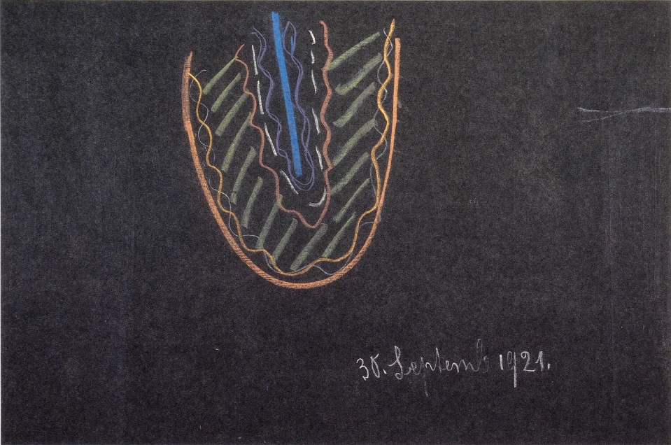
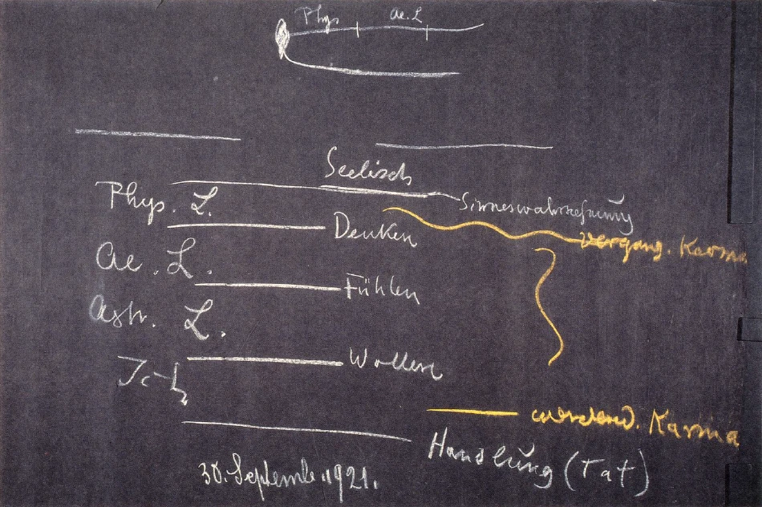

[ 1 ] ^ww0rk1

Wir wollen in den Betrachtungen etwas fortfahren, die wir letzten Freitag und Sonnabend hier gepflogen haben, und ich möchte heute im besonderen Ihren Blick wenden auf eine Betrachtung des seelischen Lebens, wie sie sich ergibt, wenn man dieses seelische Leben ins Auge faßt von dem Gesichtspunkte der imaginativen Erkenntnis aus, den Sie ja kennen aus meiner Schrift «Wie erlangt man Erkenntnisse der höheren Welten?». Sie wissen, wir unterscheiden, aufsteigend von unserem gewöhnlichen Bewußtsein aus, vier Erkenntnisstufen: diejenige Erkenntnisstufe, die uns eignet im heutigen gewöhnlichen Leben und in der heutigen gewöhnlichen Wissenschaft, jene Erkenntnisstufe, die das eigentliche Zeitbewußtsein ausmacht und die ja genannt wird im Sinne dieser Schrift «Wie erlangt man Erkenntnisse der höheren Welten?» das gegenständliche Erkennen, und dann kommt man hinein in das Gebiet des Übersinnlichen durch die Erkenntnisstufen der Imagination, der Inspiration, der Intuition. Im gewöhnlichen gegenständlichen Erkennen ist es unmöglich, das Seelische zu betrachten. Das Seelische wird erlebt, und indem man es erlebt, entwickelt man die gegenständliche Erkenntnis. Aber eine eigentliche Erkenntnis kann ja nur gewonnen werden, wenn man das zu Erkennende objektiv vor sich hinstellen kann. Das kann man im gewöhnlichen Bewußtsein mit dem seelischen Leben nicht. Man muß sich gewissermaßen um eine Stufe hinter das seelische Leben zurückziehen, damit es außerhalb von uns zu stehen kommt; dann kann man es betrachten. Das aber ergibt sich eben durch die imaginative Erkenntnis. Und zwar möchte ich Ihnen heute einfach schildern, was sich da für die Betrachtung herausstellt. ^11bgsj

[ 2 ] ^6a6qse

Sie wissen, wir unterscheiden, indem wir den Menschen überblicken, den physischen Leib, den ätherischen oder Bildekräfteleib, der eigentlich eine Summe von Tätigkeiten ist, den astralischen Leib und das Ich zunächst, wenn wir bei dem stehenbleiben, was im gegenwärtigen Menschen west. Wenn wir nun das seelische Erleben heraufbringen nicht zur Erkenntnis, aber zum Bewußtsein, so unterscheiden wir es ja, indem wir es gewissermaßen im fluktuierenden Leben erfassen, in Denken, in Fühlen, in Wollen. Es ist das schon so, daß Denken, Fühlen und Wollen im gewöhnlichen Seelenleben ineinanderspielen. Sie können sich keinen Gedankenverlauf vorstellen, ohne daß Sie sich das Hineinspielen des Willens in den Gedankenverlauf mit vorstellen. Wie wir einen Gedanken zu dem anderen hinzufügen, wie wir einen Gedanken von dem anderen trennen, das ist durchaus eine in das Denkleben hineinstrebende Willenstätigkeit. Und wiederum, wenn auch zunächst, wie ich oftmals auseinandergesetzt habe, der Vorgang dunkel bleibt: wir wissen doch, daß, wenn wir als Menschen wollend sind, in unser Wollen als Impulse unsere Gedanken hineinspielen, so daß wir auch im gewöhnlichen Seelenleben durchaus nicht ein Wollen abgesondert für sich haben, sondern ein gedankendurchsetztes Wollen. Und erst recht fluten ineinander Gedanken, Willensimpulse und die eigentlichen Gefühle im Fühlen. Wir haben also durchaus das Seelenleben als ineinanderflutend, aber doch so, daß wir gedrängt sind durch Dinge, die wir heute immer außer acht lassen wollen, innerhalb dieses flutenden Seelenlebens zu unterscheiden Denken, Fühlen, Wollen. Wenn Sie meine «Philosophie der Freiheit» in die Hand nehmen, werden Sie sehen, wie man genötigt ist, das Denken reinlich loszulösen vom Fühlen und Wollen, aus dem Grunde, weil man nur durch eine Betrachtung des losgelösten Denkens zu einer Anschauung über die menschliche Freiheit kommt. ^ssnxdx

[ 3 ] ^rftzbn

Also indem wir einfach, ich möchte sagen, lebendig erfassen Denken, Fühlen, Wollen, erfassen wir zugleich das flutende, das webende Seelenleben. Und wenn wir das dann, was wir da in unmittelbarer Lebendigkeit erfassen, zusammenhalten mit demjenigen, was uns anthroposophische Geisteswissenschaft erkennen lehrt über den Zusammenhang der einzelnen Glieder des Menschen, physischer Leib, Ätherleib, astralischer Leib und Ich, dann ergibt sich eben für ein imaginatives Erkennen das Folgende. ^xfttnj

[ 4 ] ^mukd2v

Wir wissen ja, daß wir während des wachen Lebens, vom Aufwachen bis zum Einschlafen, in einem gewissen innigen Zusammenhange haben physischen Leib, Ätherleib, astralischen Leib und Ich. Wir wissen ferner, daß wir im schlafenden Zustande getrennt haben physischen Leib und Ätherleib auf der einen Seite, astralischen Leib und Ich auf der anderen Seite. Wenn auch die Ausdrucksweise durchaus nur approximativ richtig ist, daß man sagt: Ich und astralischer Leib trennen sich vom physischen Leibe und Ätherleibe - man kommt zunächst zu einer durchaus gültigen Vorstellung, wenn man eben diese Ausdrucksweise gebraucht. Das Ich mit dem astralischen Leibe ist vom Einschlafen bis zum Aufwachen außer dem physischen Leibe und dem Ätherleibe. ^a9tx24

[ 5 ] ^036wgz

Sobald der Mensch nun zum imaginativen Erkennen vorrückt, wird er immer mehr und mehr in die Lage versetzt, genau ins Seelenauge, ins innere Anschauen zu fassen, was sich erleben läßt, ich möchte sagen, wie vorübergehend, im Status nascendi. Man hat es und muß es rasch erfassen, aber man kann es erfassen. Man hat vor sich, was in dem Momente des Aufwachens und Einschlafens besonders scharf beobachtet werden kann. Diese Momente des Einschlafens und Aufwachens können beobachtet werden für ein imaginatives Erkennen. Sie wissen ja, daß unter den Vorbereitungen, welche notwendig sind, um zu höheren Erkenntnissen zu kommen, von mir in dem vorhin angeführten Buche erwähnt worden ist die Heranerziehung einer gewissen Geistesgegenwart. Die Menschen reden ja im gewöhnlichen Leben so wenig von den Beobachtungen, die sich von der geistigen Welt her machen lassen, weil ihnen diese Geistesgegenwart fehlt. Würde diese Geistesgegenwart in ausgiebigerem Sinne bei den Menschen heranerzogen, so würden heute schon alle Menschen reden können von geistig-übersinnlichen Impressionen, denn sie drängen sich eigentlich im eminentesten Maße auf beim Einschlafen und Aufwachen, insbesondere beim Aufwachen. Nur weil so wenig heranerzogen wird, was Geistesgegenwart ist, deshalb bemerken die Menschen das nicht. Im Momente des Aufwachens tritt ja vor der Seele eine ganze Welt auf. Aber im Entstehen vergeht sie schon wiederum, und ehe sich die Menschen darauf besinnen, sie zu erfassen, ist sie fort. Daher können sie so wenig reden von dieser ganzen Welt, die da vor die Seele sich hinstellt und die wahrhaftig zum Begreifen des inneren Menschen von ganz besonderer Bedeutung ist. ^uawd7m

[ 6 ] ^fg90h1

Was sich da vor die Seele hinstellt, wenn man wirklich dazu kommt, in Geistesgegenwart den Aufwachemoment zu ergreifen, das ist eine ganze Welt von flutenden Gedanken. Nichts Phantastisches braucht dabei zu sein. So wie man im chemischen Laboratorium beobachtet, mit derselben Seelenruhe und Besonnenheit kann man sie beobachten. Und dennoch ist diese flutende Gedankenwelt, die sehr genau zu unterscheiden ist vom bloßen Träumen, da. Das bloße Träumen spielt sich so ab, daß es erfüllt ist von Lebensreminiszenzen. Was sich da abspielt im Momente des Aufwachens, das sind nicht Lebensreminiszenzen. Sie sind sehr gut zu unterscheiden von Lebensreminiszenzen, diese flutenden Gedanken. Man kann sie sich in die Sprache des gewöhnlichen Bewußtseins übersetzen, aber es sind im Grunde genommen fremdartige Gedanken, Gedanken, die wir sonst nicht erfahren können, wenn wir sie nicht in dem Momente, der entweder durch geisteswissenschaftliche Schulung in uns möglich gemacht ist, oder eben in diesem Momente des Aufwachens erfassen. ^eqvd7x

[ 7 ] ^ix77zg

Was erfassen wir da eigentlich? Nun, wir sind mit unserem Ich und unserem astralischen Leibe eingedrungen in den Ätherleib und in den physischen Leib. Was im Ätherleibe erlebt wird, wird allerdings so erlebt, daß es traumhaft ist. Und man lernt, indem. man dieses, wie ich es angedeutet habe, subtil in Geistesgegenwart beobachten lernt, man lernt wohl unterscheiden dieses Hindurchgehen durch den Ätherleib, in dem die Lebensreminiszenzen traumhaft auftreten, und dann, vor dem vollen Erwachen, vor den Eindrücken, die die Sinne nun haben nach dem Erwachen, das Hineingestelltsein in eine Welt, die durchaus eine Welt von webenden Gedanken ist, die aber nicht so erlebt wird wie die Traumgedanken, bei denen man genau weiß, man hat sie subjektivin sich. Die Gedanken, die ich jetzt meine, sie stellen sich wie ganz objektiv dar gegenüber dem eindringenden Ich und astralischen Menschen, und man merkt ganz genau: man muß passieren den Ätherleib; denn solange man den Ätherleib passiert, bleibt alles traumhaft. Man muß aber auch passieren den Abgrund, den Zwischenraum — möchte ich sagen, wenn ich mich recht uneigentlich, aber dadurch vielleicht deutlicher ausdrücke -, den Zwischenraum zwischen Ätherleib und physischem Leib, und schlüpft dann in das volle Ätherisch-Physische hinein, indem man aufwacht und die äußeren physischen Eindrücke der Sinne da sind. Sobald man in den physischen Leib hineingeschlüpft ist, sind eben die äußeren physischen Sinneseindrücke da. Was wir da an Gedankenweben objektiver Art erleben, spielt sich also durchaus zwischen dem Ätherleib und dem physischen Leib ab. Wir müssen in ihm also sehen eine Wechselwirkung des Ätherleibes und des physischen Leibes. So daß wir sagen können, wenn wir schematisch zeichnen: Wenn etwa das den physischen Leib darstellt (orange), das den Ätherleib (grün), so haben wir das lebendige Weben von physischem Leib und Ätherleib in den Gedanken, die wir da erfassen, und man kommt dann auf dem Wege einer solchen Beobachtung zu der Erkenntnis, daß sich zwischen unserem physischen und unserem Ätherleib, gleichgültig ob wir wachen, ob wir schlafen, immerzu Vorgänge abspielen, die eigentlich im webenden Gedankensein bestehen, die webendes Gedankensein zwischen unserem physischen Leib und unserem Ätherleib sind (gelb). So daß wir jetzt das erste Element des seelischen Lebens verobjektiviert erfaßt haben. Wir sehen in ihm ein Weben zwischen dem Ätherleib und dem physischen Leib. ^4rml28

 ^zp2uhp

[ 8 ] ^544xb5

Dieses webende Gedankenleben kommt eigentlich so, wie es ist, im Wachzustande nicht zu unserem Bewußtsein. Es muß eben auf die Art, wie ich es geschildert habe, erfaßt werden. Wenn wir nämlich aufgewacht sind, schlüpfen wir mit unserem Ich und mit unserem astralischen Leib in unseren physischen Leib hinein. Ich und astralischer Leib in unserem mit dem Ätherleib durchdrungenen physischen Leib nehmen teil an dem Sinneswahrnehmungsleben. Sie werden, indem Sie das Sinneswahrnehmungsleben in sich haben, mit den äußeren Weltengedanken, die Sie sich bilden können an den Sinneswahrnehmungen, durchdrungen und haben dann die Stärke, dieses objektive Gedankenweben zu übertönen. An der Stelle, wo sonst die objektiven Gedanken weben, bilden wir also gewissermaßen aus der Substanz dieses Gedankenwebens heraus unsere alltäglichen Gedanken, die wir uns im Verkehre mit der Sinneswelt auf die eben angedeutete Weise ausbilden. Und ich kann sagen: In dieses objektive Gedankenweben hinein spielt dasjenige, was nun das subjektive Gedankenweben ist (hell), das das andere übertönt, das sich aber auch abspielt zwischen dem Ätherleib und dem physischen Leib. Wir leben in der Tat in diesem - wie ich schon sagte: uneigentlich, aber deshalb doch verständlich, muß ich es als Zwischenraum zwischen Ätherleib und physischem Leib bezeichnen —, wir leben in diesem Zwischenraum zwischen Ätherleib und physischem Leib, wenn wir mit der Seele selber Gedanken weben. Wir übertönen die objektiven Gedanken, die im schlafenden und wachenden Zustand immer vorhanden sind, mit unserem subjektiven Gedankenweben. Aber gewissermaßen in derselben Region unseres menschlichen Wesens ist beides vorhanden: das objektive Gedankenweben und das subjektive Gedankenweben. ^b8uw2d

[ 9 ] ^g2trih

Was hat das objektive Gedankenweben für eine Bedeutung? Das objektive Gedankenweben, wenn es wahrgenommen wird, wenn wirklich eintritt, was ich geschildert habe als das geistesgegenwärtige Ergreifen des Momentes des Aufwachens, dieses objektive Gedankenweben wird nicht als bloßes Gedankliches erfaßt, sondern es wird erfaßt als dasjenige, was in uns lebt als die Kräfte des Wachstums, als die Kräfte des Lebens überhaupt. Diese Kräfte des Lebens sind verbunden mit dem Gedankenweben. Sie durchsetzen dann den Äther- oder Lebensleib nach innen; sie konfigurieren nach außen den physischen Leib. Wir nehmen das, was wir als objektives Gedankenweben da wahrnehmen im geistesgegenwärtigen Erfassen des Aufwachemomentes, durchaus wahr als Gedankenweben nach der einen Seite und als Wachstums-, als Ernährungstätigkeit auf der anderen Seite. Was in dieser Art in uns ist, wir nehmen es als ein innerliches Weben wahr, das aber durchaus ein Lebendiges darstellt. Das Denken verliert gewissermaßen seine Bildhaftigkeit und Abstraktheit. Es verliert auch alles das, was scharfe Konturen sind. Es wird fluktuierendes Denken, aber es ist deutlich als Denken zu erkennen. Das Weltendenken webt in uns, und wir erfahren, wie das Weltendenken in uns webt und wie wir mit unserem subjektiven Denken untertauchen in dieses Weltendenken. So haben wir das Seelische in einem gewissen Gebiete erfaßt. ^2rvhsi

[ 10 ] ^33n69n

Gehen wir jetzt weiter im geistesgegenwärtigen Erfassen des Aufwachemomentes, so finden wir das Folgende. Wir können, wenn wir in der Lage sind, Traumhaftes zu erleben beim Passieren des Ätherleibes, wenn wir also mit dem Ich und dem astralischen Leibe den Ätherleib passieren, wir können dann bildhaft das Traumhafte uns vergegenwärtigen. Die Bilder des Traumes müssen aufhören in dem Augenblicke, wo wir aufwachen, sonst würden wir den Traum in das gewöhnliche bewußte Wacherleben hineinnehmen und wachende Träumer sein, wodurch wir ja die Besonnenheit verlieren würden. Die Träume als solche müssen aufhören. Aber wer mit Bewußtsein die Träume erlebt, wer also jene Geistesgegenwart bis zurück zum Erleben der Träume hat — denn das gewöhnliche Erleben der Träume ist ein Reminiszenzerleben, ist eigentlich ein Nachher-Erinnern an die Träume; das ist ja das gewöhnliche Gewahrwerden des Traumes, daß man ihn eigentlich erst wie eine Reminiszenz erfaßt, wenn er abgelaufen ist —, also wenn der Traum erlebt wird beim Durchfluten des Ätherleibes, nicht erst nachher im Erinnern, wo er in Kürze erfaßt werden kann, wie er gewöhnlich erfaßt wird, wenn man ihn also erfaßt während er ist, also gerade beim Durchdringen durch den Ätherleib, dann erweist er sich wie etwas Regsames, wie etwas, das man so erlebt wie Wesenhaftes, in dem man sich fühlt. Das Bildhafte hört auf, bloß Bildhaftes zu sein. Man bekommt das Erlebnis, daß man im Bilde drinnen ist. Dadurch aber, daß man dieses Erlebnis bekommt, daß man im Bilde drinnen ist, daß man also mit dem Seelischen sich regt, wie man sonst im wachen Leben mit dem Körperlichen in der Beinbewegung, in der Handbewegung sich regt - so wird nämlich der Traum: er wird aktiv, er wird so, daß man ihn erlebt, wie man eben Arm- und Beinbewegungen oder Kopfbewegungen und dergleichen erlebt —, wenn man das erlebt, wenn man dieses Erfassen des Traumhaften wie etwas Wesenhaftes erlebt, dann schließt sich gerade beim weiteren Fortgang, beim Aufwachen, an dieses Erlebnis ein weiteres an: daß diese Regsamkeit, die man da im Traume erlebt, in der man nunmehr drinnensteht als in etwas Gegenwärtigem, daß diese untertaucht in unsere Leiblichkeit. Geradeso wie wir beim Denken fühlen: Wir dringen bis zu der Grenze unseres physischen Leibes, wo die Sinnesorgane sind, und nehmen die Sinneseindrücke auf mit dem Denken, so fühlen wir, wie wir in uns untertauchen mit demjenigen, was im Traume als innerliche Regsamkeit erlebt wird. Was man da erlebt im Momente des Aufwachens — oder eigentlich vor dem Momente des Aufwachens, wenn man im Traume drinnen ist, wenn man durchaus noch außer seinem physischen Leibe, aber schon im Ätherleib ist, beziehungsweise gerade hineingeht in seinen Ätherleib -, das taucht unter in unsere Organisation. Und ist man so weit, daß man dieses Untertauchen als Erlebnis vor sich hat, dann weiß man auch, was nun wird mit dem Untergetauchten: das Untergetauchte strahlt wieder zurück in unser waches Bewußtsein, und zwar strahlt es zurück als Gefühl, als Fühlen. Die Gefühle sind in unsere Organisation untergetauchte Träume. ^1doxcq

[ 11 ] ^e1c7g0

Wenn wir das, was webend ist in der Außenwelt, in diesem traumwebhaften Zustande wahrnehmen, sind es Träume. Wenn die Träume untertauchen in unsere Organisation und von innen heraus bewußt werden, erleben wir sie als Gefühle. Wir erleben also die Gefühle dadurch, daß dasjenige in uns, was in unserem astralischen Leib ist, untertaucht in unseren Ätherleib und dann weiter in unsere physische Organisation, nicht bis zu den Sinnen hin, nicht also bis zu der PeriPherie der Organisation, sondern nur in die innere Organisation hinein. Dann, wenn man dies erfaßt hat, zunächst durch imaginative Erkenntnis besonders deutlich erschaut hat im Momente des Aufwachens, dann bekommt man auch die innere Kraft, es fortwährend zu schauen. Wir träumen nämlich während des wachen Lebens fortwährend. Wir überleuchten nur das Träumen mit unserem denkenden Bewußtsein, mit dem Vorstellungsleben. Wer unter die Oberfläche des Vorstellungslebens blicken kann — und man schult sich zu diesem Blicken dadurch, daß man eben geistesgegenwärtig erfaßt den Moment des Träumens selber -, wer sich so geschult hat, daß er das beim Aufwachen erfassen kann, was ich bezeichnet habe, der kann dann auch unter der Oberfläche des lichtvollen Vorstellungslebens das den ganzen Tag hindurch dauernde Träumen erleben, das aber nicht als Träumen erlebt wird, sondern das immer sofort untertaucht in unsere Organisation und als Gefühlswelt zurückstrahlt. Und er weiß dann: Was das Fühlen ist, es spielt sich ab zwischen dem astralischen Leib, den ich hier schematisch so zeichne (Zeichnung S. 51, hell), und dem Ätherleib. Es drückt sich natürlich im physischen Leib aus (orange). So daß der eigentliche Ursprung des Fühlens zwischen dem astralischen Leib und dem Ätherleib liegt (rot). So wie der physische Leib und der Ätherleib in lebendiger Wechselwirkung ineinanderwirken müssen zum Gedankenleben, so müssen ätherischer Leib und astralischer Leib in lebendiger Wechselwirkung sein zum Gefühlsleben. Wenn wir wachend sind, erleben wir dieses lebendige Wechselspiel unseres ineinandergedrängten Ätherleibes und astralischen Leibes als unser Fühlen. Wenn wir schlafen, erleben wir, was der nunmehr außen lebende astralische Leib in der äußeren Ätherwelt erlebt, als die Bilder des Traumes, die nun während des ganzen Schlafens vorhanden sind, aber eben nicht wahrgenommen werden im gewöhnlichen Bewußtsein, sondern nur eben reminiszenzenhaft in jenen Fragmenten, die das gewöhnliche Traumleben bilden. ^auae8j

[ 12 ] ^9cpb0p

Sie sehen daraus, daß wir, wenn wir das Seelenleben erfassen wollen, noch zwischen die Glieder der menschlichen Organisation hineinblicken müssen. Wir denken uns das Seelenleben als flutendes Denken, Fühlen, Wollen. Von letzterem wollen wir gleich sprechen. Aber wir erfassen es objektiv, indem wir gewissermaßen in die Zwischenräume zwischen diese vier Glieder hineinschauen, zwischen den physischen Leib und Ätherleib, und Ätherleib und astralischen Leib. ^w70c9r

[ 13 ] ^ierci7

Was sich im Wollen ausdrückt, das entzieht sich ja, wie ich öfters von anderen Gesichtspunkten aus hier ausgeführt habe, durchaus der Betrachtung des gewöhnlichen Wachlebens, des gewöhnlichen Bewußtseins. In diesem gewöhnlichen Bewußtsein sind vorhanden die Vorstellungen, nach denen wir unser Wollen orientieren, die Gefühle, die wir entwickeln in Anlehnung an die Vorstellungen als Motive für unser Wollen; aber wie das, was da als der Vorstellungsinhalt unseres Wollens klar in unserem Bewußtsein liegt, hinunterspielt, wenn ich nur die Arme bewege zum Wollen, was da eigentlich vorgeht, das wird uns im gewöhnlichen Bewußtsein nicht gegeben. In dem Augenblicke, wo der Geistesforscher die Imagination in sich heranzieht und dazu kommt, die Natur des Denkens, des Fühlens so anzusehen, wie ich gesagt habe, dann kann er auch dahin gelangen, als etwas in das Bewußtsein Hereinfallendes die menschlichen Erlebnisse zu haben, die zwischen dem Einschlafen und dem Aufwachen sich abspielen. Denn in den Übungen zur Imagination werden Ich und astralischer Leib erkraftet. Sie werden in sich stärker, sie lernen sich erleben. Im gewöhnlichen Bewußtsein hat man eben nicht das wirkliche Ich. Wie hat man das Ich im gewöhnlichen Bewußtsein? Sehen Sie, immer wiederum muß ich diesen Vergleich machen: Wenn man das Leben in der Erinnerung zurück anschaut, so stellt es sich scheinbar als eine geschlossene Strömung dar. Die ist es aber doch nicht, sondern wir müßten eigentlich, indem wir jetzt leben, den heutigen Tag überblicken bis zum Aufwachen, haben dann eine leere Stelle, daran schließt sich der Bewußtseinsinhalt des gestrigen Tages und so weiter fort. Was wir da in der Rückerinnerung beobachten, das trägt allerdings in sich auch diejenigen Zustände, die wir nicht bewußt durchlebt haben, die also in dem präsenten Inhalt des Bewußtseins nicht drinnen sind. Aber sie sind auf andere Art drinnen. Ein Mensch, der gar nicht schlafen würde - wenn ich das hypothetisch anführen darf -, der würde eine ganz zerstörte Rückerinnerung haben. Die Rückerinnerung würde ihn gewissermaßen blenden. Er würde alles das, was er in der Rückerinnerung vor sein Bewußtsein hinstellt, als etwas ihm ganz Fremdes, blendend Glänzendes erleben. Er würde überwältigt sein davon, und er würde sich vollständig ausschalten müssen. Er käme gar nicht dazu, sich selber in sich zu erfühlen. Nur dadurch, daß sich die Schlafzustände hineinstellen in die Rückerinnerung, wird die Rückerinnerung abgeblendet. Wir sind in der Lage, sie auszuhalten. Denn dadurch wird es möglich, daß wir uns selbst behaupten gegenüber unserer Erinnerung. Lediglich dem Umstande, daß wir schlafen, haben wir unsere Selbstbehauptung in der Erinnerung zu verdanken. Was ich jetzt sage, könnte schon durch empirische Beobachtung der menschlichen Lebensläufe in vergleichender Weise gut konstatiert werden. ^myljua

[ 14 ] ^vn2hp9

Aber geradeso wie wir da die innere Aktivität erfühlen in der Rückerinnerung, so erfühlen wir ja eigentlich unser Ich aus unserem gesamten Organismus heraus. Wir erfühlen es so, wie wir die Schlafzustände als, ich möchte sagen, die finsteren Räume im Erinnerungsfortgang wahrnehmen. Wir nehmen das Ich nicht direkt wahr für das gewöhnliche Bewußtsein, sondern wir nehmen es nur wahr, wie wir die Schlafzustände wahrnehmen. Aber indem wir das imaginative Bewußtsein erwerben, tritt dieses Ich wirklich auf, und es ist willensartiger Natur. Und wir merken: Was in uns ein Gefühl, das in sich schließt, mit der Welt sympathisch oder antipathisch zu fühlen, was das in uns aktiviert zum Wollen, das spielt sich in einem ähnlichen Prozesse ab, wie er sich abspielt zwischen dem Wachen und dem Hineinkommen in das Schlafen. Man kann das wiederum geistesgegenwärtig beobachten, wenn man ebenso wie für das Aufwachen für das Einschlafen dieselben Eigenschaften entwickelt, von denen ich gesprochen habe. Da merkt man beim Einschlafen, daß man hineinträgt in den Schlafzustand, was ausstrahlt, als Aktivität ausstrahlt aus unserem Gefühlsleben, und was hineinstrahlt in die Außenwelt, und man lernt dann erkennen, wie man jedesmal, wenn man sich wirklich willensmäßig entwickelt, untertaucht jetzt in einen ähnlichen Zustand, wie man untertaucht in den Schlafzustand. In ein inneres Schlafen taucht man ein. Was einmal vorgeht beim Einschlafen, wo dann das Ich mit dem astralischen Leib herausrückt aus physischem Leib und Ätherleib, das tritt jedesmal innerlich ein beim Wollen. ^0n1h39

 ^se9902

[ 15 ] ^mdipvt

Natürlich müssen Sie sich darüber klar sein, daß das, was ich Ihnen da schildere, viel schwieriger zu ergreifen ist als das, was ich vorhin geschildert habe, denn der Moment des Einschlafens ist eben geistesgegenwärtig meistens noch schwieriger zu erfassen als der des Aufwachens. Nach dem Aufwachen sind wir wach; da haben wir wenigstens die Anlehnung an die Reminiszenzen. Beim Einschlafen müssen wir den Wachzustand noch in das Schlafen hinein fortsetzen, wenn wir zu einer Beobachtung kommen wollen. Aber der Mensch schläft eben meistens ein; er sendet nicht hinein in das Einschlafen die Aktivität des Fühlens. Kann er sie aber da hinein fortsetzen, was eben durch Schulung in imaginativer Erkenntnis geschieht, dann merkt er, daß tatsächlich im Wollen ein Untertauchen in dasselbe Element ist, in das wir untertauchen, wenn wir einschlafen. Wir werden tatsächlich im Wollen von unserer Organisation frei. Wir verbinden uns mit der realen Objektivität. So wie wir beim Aufwachen durch unseren Ätherleib einziehen, durch unseren physischen Leib und bis in die Sinnesregion, also bis an die Peripherie des Leibes kommen, gewissermaßen von dem ganzen Leib Besitz ergreifen, den ganzen Leib durchtränken, so senden wir wiederum im Fühlen in den Leib zurück, indem wir innerlich untertauchen, unsere Träume; sie werden eben Gefühle. Aber wenn wir jetzt nicht im Leibe bleiben, sondern, ohne daß wir an die Peripherie des Leibes gehen, innerlich geistig aus dem Leibe herausgehen, dann kommen wir zum Wollen. So daß sich das Wollen tatsächlich eigentlich unabhängig vom Leibe vollzieht. Ich weiß, daß damit viel gesagt wird, aber ich muß das auch darstellen, weil es eine Realität ist. Und in dem Erfassen dessen kommen wir dazu, nun einzusehen, daß — wenn wir nun hier das Ich haben (siehe Zeichnung Seite 51, blau) — das Wollen sich abspielt zwischen dem astralischen Leib und dem Ich (lila). ^3nthjp

[ 16 ] ^tbo7qx

Wir können also sagen: Wir gliedern den Menschen in physischen Leib, in Ätherleib oder Bildekräfteleib, in astralischen Leib und in Ich. Zwischen dem physischen Leib und dem Ätherleib spielt sich seelisch das Denken ab. Zwischen dem Ätherleib und dem astralischen Leib spielt sich seelisch das Fühlen ab. Zwischen dem astralischen Leib und dem Ich spielt sich seelisch das Wollen ab. Indem wir an die Peripherie des physischen Leibes kommen, haben wir die Sinneswahrnehmung. Indem wir auf dem Wege durch unser Ich herauskommen aus uns, unsere ganze Organisation in die Außenwelt hineinstellen, wird das Wollen zur Handlung, dem anderen Pol der Sinneswahrnehmung (siehe Schema Seite 62). ^9ftn8b

[ 17 ] ^3ymscg

Auf diese Weise gelangt man zu einem objektiven Erfassen dessen, was subjektiv im flutenden Denken, Fühlen und Wollen erlebt wird. So verwandelt sich das Erleben in das Erkennen. Alle Psychologie, welche das flutende Denken, Fühlen und Wollen sonst auf eine andere Weise erfassen will, bleibt formal, weil sie nicht an die Realität herandringt. An die Realität kann für das seelische Erleben nur die imaginative Erkenntnis herandringen. ^8uclpa

[ 18 ] ^maambq

Fassen wir jetzt einmal ins Auge, was sich uns gewissermaßen wie eine Begleiterscheinung unserer ganzen Betrachtungen ergeben hat. Wir sagten: Man kann durch geistesgegenwärtige Betrachtung im Moment des Aufwachens, wenn man durchgeschlüpft ist durch den Ätherleib, Gedankenweben, das objektiver Art ist, sehen. Man nimmt dieses objektive Gedankenweben zunächst wahr. Ich sagte, man kann es von den Träumen und auch vom alltäglichen Gedankenleben, vom subjektiven Gedankenleben ganz gut unterscheiden, denn es ist verbunden mit dem Wachstum, mit dem Werden. Es ist eigentlich eine reale Organisation. Faßt man es aber auf, was da webt, was man, wenn man es durchschaut, als Gedankenweben wahrnimmt, wenn man es, ich möchte sagen, anfühlt, innerlich antastet, so nimmt man es als Wachstumskraft, als Ernährungskraft und so weiter, als den werdenden Menschen wahr. Es ist etwas, was zunächst fremd ist, aber Gedankenwelt ist. Wenn man es nun genauer studieren kann, so ist es ja das innerliche Weben von Gedanken an uns selbst. Wir erfassen es an der Peripherie unseres physischen Leibes; bevor wir an das Sinneswahrnehmen herankommen, erfassen wir es. Wenn wir es genauer verstehen lernen, wenn wir uns in seine Fremdheit gegenüber unserem subjektiven Denken einleben, dann erkennen wir es, dann erkennen wir es als das, was wir mitgebracht haben durch unsere Geburt aus früheren Erlebnissen, aus vorgeburtlichen respektive vor der Konzeption liegenden Erlebnissen. Und es wird für uns etwas objektiv Gegenständliches das Geistige, das unseren ganzen Organismus zusammenbringt. Der Präexistenzgedanke gewinnt Objektivität, wird zum objektiven Anschauen. Wir können mit innerem Erfassen sagen: Wir sind aus der Welt des Geistes heraus durch Gedanken gewoben. Die subjektiven Gedanken, die wir dazufügen, sie stehen im Bereiche unserer Freiheit. Diejenigen Gedanken, die wir da erblicken, sie bilden uns, sie bauen unseren Leib aus dem Gedankenweben heraus auf. Sie sind unser vergangenes Karma (siehe Tafel 6 Schema Seite 62). Also: Ehe wir an die Sinneswahrnehmungen herankommen, nehmen wir unser vergangenes Karma wahr. ^rekwf1

[ 19 ] ^fwzwyj

Und wenn wir einschlafen, so hat dieses Einschlafen für denjenigen, der in objektiver Erkenntnis lebt, etwas Ähnliches mit dem Wollen. Wenn das Wollen zur vollständigen Bewußtheit gebracht wird, merkt man ganz deutlich: Man schläft in den eigenen Organismus hinein. So wie sonst die Träume hinuntergehen, gehen in unsere Organisation die Wollensmotive hinein. Man schläft in den Organismus hinein. Man lernt unterscheiden dieses Hineinschlafen in den Organismus, das sich zunächst auslebt in unseren gewöhnlichen Handlungen - die sind eben äußerlich sich vollziehend, wir vollziehen sie zwischen dem Aufwachen und Einschlafen -; aber nicht alles das, was in unserem Gefühlsleben drinnen lebt, lebt sich in diese Handlungen hinein. Wir vollbringen ja auch das Leben zwischen dem Einschlafen und Aufwachen. Und was wir sonst in die Handlungen hineindrängen würden, drängen wir ja aus uns durch denselben Vorgang im Einschlafen hinaus. Eine ganze Summe von Willensimpulsen drängen wir hinaus in die rein geistige Welt, in der wir uns befinden zwischen dem Einschlafen und Aufwachen. Willensimpulse, die in unser geistiges Sein übergehen, die wir nur hegen zwischen dem Einschlafen und Aufwachen: lernen wir sie durch imaginative Erkenntnis beobachten, so nehmen wir in ihnen wahr, was an Handlungsorientierung vorhanden bleibt über den Tod hinaus, was mit uns geht über den Tod hinaus. ^v943j3

[ 20 ] ^zsfy9l

Zwischen dem astralischen Leib und dem Ich entwickelt sich das Wollen. Das Wollen wird Handlung, indem es so weit nach der Außenwelt geht, bis es an den Ort kommt, woher sonst die Sinneseindrücke kommen. Aber im Einschlafen geht ja eine ganze Menge hinaus, was wie Handlung werden will, aber eben nicht Handlung wird, sondern mit dem Ich verbunden bleibt, indem das Ich durch den Tod in die geistige Welt übergeht. ^qd54bb

[ 21 ] ^aqkwc4

Sie sehen, wir erleben hier auf der anderen Seite unser werdendes Karma (siehe Schema Seite 62). Zwischen dem Wollen und der Handlung erleben wir unser werdendes Karma. Beide schließen sich dann im imaginativen Bewußtsein zusammen: das vergangene und das werdende Karma, das, was in uns webt und lebt und so sich gibt, daß es weiterwebt unter der Schwelle, über welcher unsere freien Handlungen liegen, die wir ausleben können zwischen Geburt und Tod. Zwischen Geburt und Tod leben wir in der Freiheit. Aber es webt und lebt unter dieser Region des freien Willens, Wollens, die eigentlich nur ein Dasein hat zwischen Geburt und Tod, das Karma, dessen aus der Vergangenheit kommende Wirkungen wir wahrnehmen, wenn wir uns aufhalten können mit unserem Ich und unserem astralischen Leibe im Ätherleib gerade beim Durchbrechen bis zum physischen Leibe hin. Und wiederum auf der anderen Seite nehmen wir unser werdendes Karma wahr, wenn wir uns aufhalten können in der Region, die gerade liegt zwischen dem Wollen und dem Handeln, und wenn wir soviel Selbstzucht durch Übung entwickeln können, daß wir innerlich uns ebenso aktivieren können in einem Gefühl, wie wir uns, ich möchte sagen, indem wir den Leib zu Hilfe nehmen, aktivieren in der Handlung; wenn wir uns im Geiste aktivieren können im Gefühl, wenn wir also eine Handlung festhalten im Ich. ^7yvm4c

[ 22 ] ^jugwxd

Stellen Sie sich das lebhaft vor: Man kann so enthusiasmiert sein, so innerlich eingenommen sein für irgend etwas, was aus dem Gefühle sprießt, wie das, was sonst in die Handlung übergeht; aber man muß es zurückhalten: dann leuchtet es auf in der Imagination als das werdende Karma. ^y9wkyz

[ 23 ] ^jk0296

Was ich Ihnen hier geschildert habe, ist natürlich im Menschen immer vorhanden. Der Mensch passiert mit jedem Aufwachen, jeden Morgen beim Aufwachen die Region seines vergangenen Karmas; er passiert jeden Abend beim Einschlafen die Region seines werdenden Karmas. Der Mensch kann durch eine gewisse Aufmerksamkeit auch ohne besondere Schulung in Geistesgegenwärtigkeit erfassen das vergangene Objektive, ohne daß er es freilich so deutlich erkennt, wie ich es jetzt geschildert habe. Er kann es aber wahrnehmen; es ist da. Und es ist dann da alles das, was er in seinen sittlichen Impulsen in sich trägt im Guten und im Schlechten. Durch dieses lernt sich eigentlich der Mensch besser kennen, als wenn er im Momente des Aufwachens dieses Gedankenweben, das ihn selbst bildet, gewahr wird. ^ktrpqp

[ 24 ] ^a4l8c5

Aber schon schreckhafter ist das Wahrnehmen dessen, was zwischen dem Wollen und der Handlung liegt, was man zurückhalten kann. Da lernt man sich kennen insoweit, als man sich selber gemacht hat während dieses Lebens. Da lernt man kennen, was man als innere Artung durch den Tod hinausträgt als werdendes Karma. ^brugig

[ 25 ] ^dpas82

Ich wollte Ihnen heute zeigen, wie man über diese Dinge in lebendiger Erfassung reden kann, wie durchaus Anthroposophie sich nicht erschöpft in einer Schematik, sondern wie die Dinge lebendig geschildert werden können, und werde morgen dann in dieser Betrachtung weiter fortfahren, indem ich übergehen werde zu einer noch tieferen Erfassung der menschlichen Wesenheit auf Grundlage des heute Ausgeführten. ^ua18n2