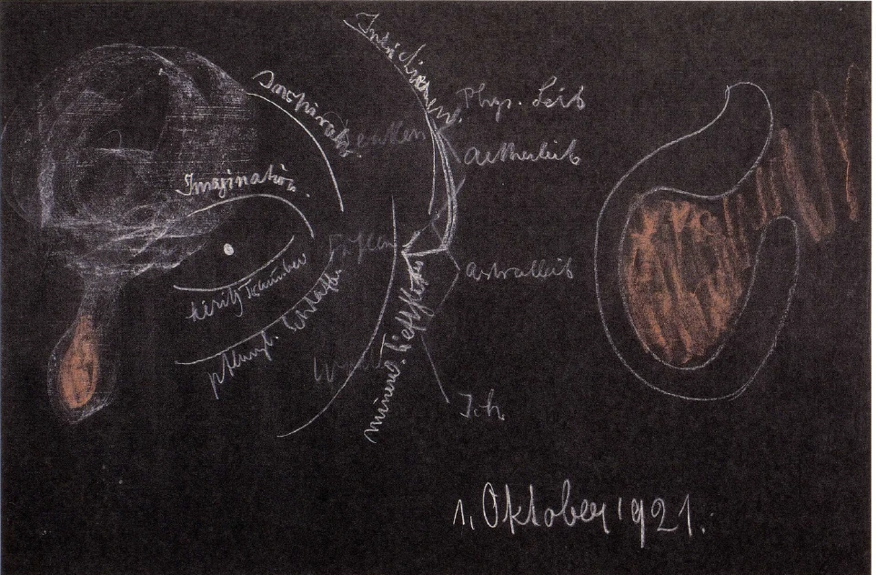
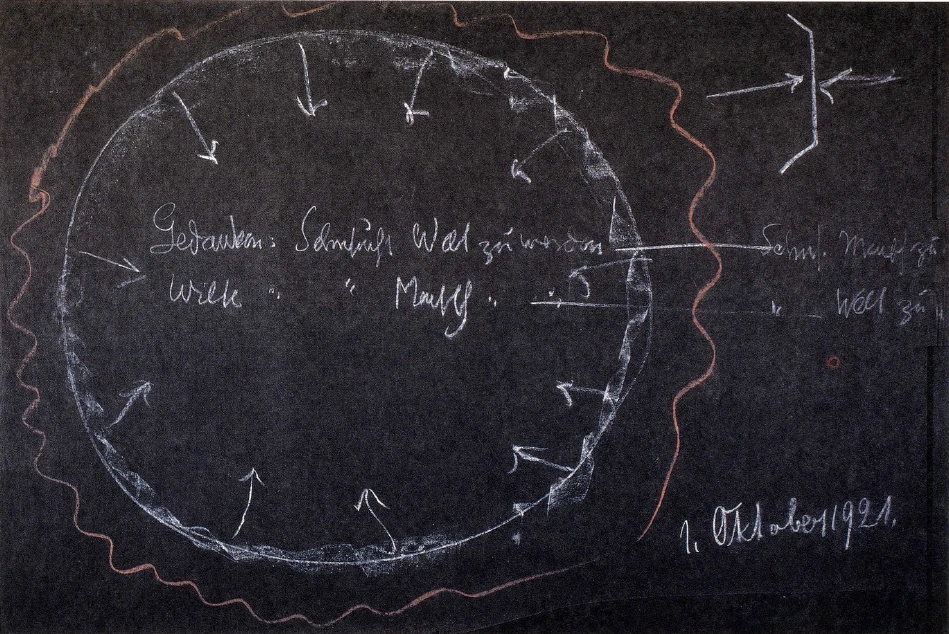

[ 1 ] ^u9fr9g

Wir haben gestern darauf hinweisen können, wie der Mensch in seinem Bewußtsein gewissermaßen nach zwei Seiten hin an die Welt herankommt: wenn er sich nach innen und wenn er sich nach außen betätigt. Für das gewöhnliche Bewußtsein allerdings wird das, was im Menschen da lebt, nicht erfaßbar, weil das Bewußtsein gerade daran anstößt. Aber wir haben eben doch gesehen, wie das Karma im Menschen auch zwischen Geburt und Tod nach zwei Seiten hin lebt: auf der einen Seite, wenn der Mensch beim Aufwachen untertaucht in seinen Ätherleib, wo er, während er untertaucht, auch im gewöhnlichen Bewußtsein die Reminiszenzen der Träume haben kann. Dann passiert er gewissermaßen den Zwischenraum zwischen Ätherleib und physischem Leib - im physischen Leib ist er ja erst, wenn er die volle Sinneswahrnehmung hat — und geht da durch die Region der in ihm befindlichen lebendig wirksamen Gedanken. Das sind dieselben Gedanken, die eigentlich an dem Aufbau seines Organismus teilgenommen haben, die er durch die Geburt ins Dasein mitgebracht hat und die, mit anderen Worten, sein verflossenes, sein fertiges Karma ausmachen. Dann aber stößt der Mensch beim Einschlafen an dasjenige, was nicht Handlung werden kann. Was aus unseren Gemüts- und Willensimpulsen in die Handlungen eintritt, das wird ja ausgelebt im Leben. Aber es bleibt immer etwas zurück, und das nimmt der Mensch in den Schlaf hinein. Das ist aber auch sonst vorhanden. Alles das, was aus dem Seelenleben nicht in die Handlung hineingeht, was gewissermaßen vor der Handlung stehenbleibt, ist das werdende Karma, das sich bildet und das wir dann weiter durch den Tod tragen. Kurz, ich habe gestern darauf hinweisen wollen, wie im Menschen die Kräfte des Karma leben. ^n6qisv

[ 2 ] ^t3bwbs

Wir werden heute nun, damit wir morgen dem Ganzen eine Art von Abschluß geben können, etwas die menschliche Umgebung betrachten, um zu zeigen, wie der Mensch nun eigentlich in der Welt drinnensteht. Wir haben uns gestern bemüht, das menschliche Seelenleben selber objektiv zu betrachten, haben also gefunden, daß das Denken sich entwickelt in derjenigen Region, welche ja eben diese objektive Gedankenregion ist zwischen dem physischen Leib und dem Ätherleib; daß dann das Fühlen sich entwickelt zwischen dem Ätherleib und dem Astralleib, und daß das Wollen sich entwickelt zwischen dem Astralleib und dem Ich. So daß also - ich sagte schon gestern, der Ausdruck ist ungeeignet, aber er ist doch verständlich — gewissermaßen in den Zwischenräumen, die wir annehmen müssen zwischen den vier Gliedern der menschlichen Natur, zwischen physischem Leib, Ätherleib, astralischem Leib und Ich, diese eigentliche seelische Betätigung sich entwickelt. Wollen wir sie objektiv anschauen, dann sind sie Wechseltätigkeiten zwischen den Gliedern der menschlichen Wesenheit. ^f3b1eo

 ^81vozf

[ 3 ] ^9uzwr3

Nun wollen wir heute etwas die menschliche Umgebung anschauen. Vergegenwärtigen wir uns da so recht, wie der Mensch in einem ganz lebendigen Traumleben ist, wie der Mensch Bilder durch das Traumleben schweifend hat. Ich habe nun gestern gesagt: Es kann das imaginative Bewußtsein wahrnehmen, wie diese Bilder in die Organisation hinuntergehen und wie das in diesen Bildern Wirkende unsere Gefühle zustande bringt. Unsere Gefühle sind also das, was eigentlich ergriffen würde, wenn man tiefer in das Innere des Menschen hineinschauen würde, für die Anschauung in Traumbildern. Gefühle sind die Wellen, die aus dem Tagestraumleben in unser Bewußtsein heraufschießen. Wir träumen, sagte ich gestern, unter der Oberfläche des Vorstellungslebens fortwährend fort, und dieses Traumleben, das lebt sich aus in den Gefühlen. ^m8vhx2

[ 4 ] ^lk8h6u

Wenn wir nun in die Umgebung des Menschen schauen, zunächst zur Tierwelt, dann haben wir in der Tierwelt ein Bewußtsein, welches nicht bis zu dem Denken, bis zu dem Gedankenleben heraufkommt, sondern welches sich eigentlich ausgestaltet in einer Art lebendigen Traumlebens. Wir können uns durch das Studium unseres eigenen Traumlebens eine Vorstellung davon bilden, wie es eigentlich im Seelenleben des Tieres aussieht. Es ist das Seelenleben des Tieres eben durchaus ein Träumen. Daher ist das Seelenleben des Tieres viel mehr tätig am Organismus als das Seelenleben des Menschen, das vom Organismus durch die Helligkeit des Vorstellungslebens viel mehr emanzipiert ist. Das Tier träumt eigentlich. Und so wie unsere Traumbilder, die Traumbilder, die wir uns bilden während des wachen Bewußtseins, als Gefühle heraufströmen, so ist ein solches gefühlsartiges Seelenleben dasjenige, was beim Tiere hauptsächlich zugrunde liegt. Ein vom hellen Gedankenlichte durchzogenes Seelenleben hat eigentlich das Tier nicht. Was also bei uns vorgeht zwischen dem Ätherleib und dem astralischen Leib, das ist das Wesentliche, was im Tiere vorgeht; das bildet das tierische Seelenleben. Und wir können das tierische Leben verstehen, wenn wir es also aus dem Seelenleben hervorgehend vorstellen. ^62osky

[ 5 ] ^agfif2

Es ist wichtig, daß man sich eine gewisse Vorstellung verschafft von diesen Verhältnissen, denn man wird dann begreifen, was eigentlich vorgeht, sagen wir, wenn das Tier verdaut. Man wende nur einmal den Blick auf eine Herde, die in der Verdauung auf einer Weide liegt. Die ganze Stimmung, die in den Tieren ist, die kündigt ja an, was da durch Geistesforschung zutage tritt: daß tatsächlich die erregte Tätigkeit, die sich im wesentlichen abspielt zwischen Ätherleib und Astralleib des Tieres, in einem lebendigen Fühlen heraufdringt, und daß das Tier in diesem Fühlen lebt. Eine Steigerung und Herabminderung dieses Fühlens, das ist das Wesentliche des tierischen Erlebens, und das Teilnehmen an seinen Traumbildern, wenn es eben das Fühlen etwas dämpft und mehr das Bild an die Stelle des Fühlens tritt. Wir können also sagen: Das Tier lebt in einem Bewußtsein, das unserem Traumbewußtsein ähnlich ist. ^62h302

[ 6 ] ^0hb8ql

Wenn wir bei ihm das Bewußtsein suchen, das wir selber als Menschen, als hier auf der Erde herumgehende Menschen haben, dann können wir es nicht innerhalb des Tieres suchen, dann müssen wir es suchen bei Wesen, die nicht zu einem unmittelbar physischen Dasein kommen. Wir nennen sie die tierischen Gattungsseelen, Seelen, die als solche nicht eine physische Körperlichkeit haben, sondern die sich durch die Tiere ausleben. Wir können sagen, daß alle Löwen zusammen eine solche Gattungsseele haben, die ein geistiges Dasein hat. Die hat dann ein solches Bewußtsein, wie wir Menschen es haben, nicht das einzelne Tier. ^x1ckjn

[ 7 ] ^dhnhnq

Gehen wir nun herunter in die Pflanzenwelt, dann haben wir nicht ein solches Bewußtsein wie bei den Tieren, sondern wir haben in der Pflanzenwelt selber ein solches Bewußtsein, wie wir es haben vom Einschlafen bis zum Aufwachen. Die Pflanze ist ein schlafendes Wesen. Wir entwickeln dieses Bewußtsein aber auch zwischen dem astralischen Leib und dem Ich im Wollen. Was da in der Pflanzenwelt tätig ist, das ist im wesentlichen gleichgeartet mit demjenigen, was in unserem Wollen lebt. In unserem Wollen schlafen wir eigentlich auch dann, wenn wir wach sind. Dieselbe Tätigkeit, die in unserem Wollen waltet, die waltet eigentlich über die ganze Pflanzenwelt hin. ^o8e6bh

[ 8 ] ^gnmd38

Das Bewußtsein, das wir entwickeln als Schlafbewußtsein, das ist ja etwas, was sich eigentlich fortwährend als Unbewußtes einschiebt in unser Bewußtes, was Lücken bildet, wie ich gestern sagte, in unserer Erinnerung. Aber geradeso wie unser Bewußtsein dumpf ist, für die meisten Menschen überhaupt ausgelöscht ist während des Schlafens, so ist das Pflanzenbewußtsein. ^a5mvfv

[ 9 ] ^mebsb2

Wenn wir dann aufsuchen, was beim Pflanzenleben so ist wie beim tierischen Leben, dann können wir das nicht in der einzelnen Pflanze suchen, sondern dann müssen wir es eigentlich in der ganzen Erdenseele suchen. Die ganze Erdenseele führt ein träumendes Bewußtsein und schläft sich hinein in das Pflanzenbewußtsein. Und nur insoferne die Erde teilnimmt an dem kosmischen Werden, flackert sie so auf, daß sie solch ein völliges Bewußtsein entwickeln kann, wie wir Menschen es haben zwischen Geburt und Tod im wachenden Zustande. Das ist aber vorzugsweise dann der Fall, wenn die Winterszeit da ist: das ist eine Art Aufwachen der Erde, währenddem das dumpfe Traumbewußtsein während der Sommerszeit, während der warmen Zeit vorhanden ist. Es ist eben durchaus ein Fehlschluß, wie ich auch in früheren Vorträgen schon auseinandergesetzt habe, zu glauben, daß die Erde etwa im Sommer wacht und im Winter schläft. Das Umgekehrte ist der Fall. In der regen vegetativen Tätigkeit, die entwickelt wird während des Sommers, während der warmen Jahreszeit, ist gerade ein Schlafzustand der Erde, eigentlich ein 'Traumzustand der Erde vorhanden, währenddem ein Wachzustand der Erde vorhanden ist in der kalten Jahreszeit. Wenn wir aber nun zum mineralischen Reich hinuntersteigen, dann kommen wir dazu, uns sagen zu müssen: ein noch tieferes Bewußtsein ist da vorhanden als dasjenige unseres Schlafes, ein Bewußtsein, das unserer gewöhnlichen menschlichen Erfahrung durchaus schon ferne liegt, das also hinausgehen würde über das Wollen. Aber eigentlich liegt das, was da in den Mineralien lebt als Bewußtseinszustand, uns Menschen nur scheinbar, nur für das gewöhnliche Bewußtsein ferne. In Wirklichkeit liegt es uns gar nicht so ferne. Wenn wir nämlich übergehen vom Wollen zum wirklichen Tun, wenn wir etwas ausführen, dann sondert sich ja unser Wollen von uns ab. Und das, in dem wir dann, ich möchte sagen, drinnen schwimmen, in dem wir weben und leben, indem wir die Handlung ausführen, die wir ja nur vorstellen — wir stecken ja mit unserem Bewußtsein nicht drinnen in der Handlung, wir stellen sie nur vor -, aber das, was in der Handlung selber drinnensteckt, der Inhalt der Handlung, das ist schließlich dasselbe, was da jenseits der Oberfläche der Mineralien im Mineralischen drinnensteckt und das mineralische Bewußtsein konstituiert. Wir würden eigentlich, wenn wir noch tiefer hinuntersinken könnten in die Unbewußtheit, da ankommen, wo das mineralische Bewußtsein webt. Aber wir würden uns in keinen anderen Zustand hineinfinden als in denjenigen, in dem auch unser Tun selber sich vollzieht. Daher liegt uns das mineralische Bewußtsein gewissermaßen jenseits dessen, was wir als Menschen noch erleben können. Aber auch unser eigenes Handeln liegt jenseits dessen, was da von uns Menschen erlebt werden kann. Insofern also unser Handeln nicht von uns abhängt, nicht im Gebiete dessen liegt, was innerhalb unserer Freiheit eingeschlossen ist, ist unser Handeln genau ebenso Weltgeschehen wie das, was in den Mineralien drinnen geschieht. Wir gliedern unser Handeln in dieses Geschehen ein, und damit haben wir eigentlich die Beziehung des Menschen zu seiner Umgebung schon bis zu demjenigen getragen, wo dann der Mensch mit seinem Handeln sogar jenseits seines Schlafbewußtseins hinüberkommt. Indem der Mensch die Mineralwelt um sich herum gewahr wird, gerät er, indem er die Mineralien von außen anschaut, an dasjenige heran, was jenseits seines Erlebens liegt. Wir können sagen: Wenn das der Umkreis dessen sei, was wir innerhalb des Menschenreiches, des Tierreiches, des Pflanzenreiches sehen, und dann hier an das Mineralreich herankommen, so ist da das Mineralreich, indem es auf unsere Sinne wirkt, uns zuweisend seine äußere Seite; aber jenseits, da wo wir nicht mehr hineinkommen, da entwickelt das Mineralreich dann, gewissermaßen abgewendet von uns, sein Bewußtsein (siehe Zeichnung, rot). Und dieses Bewußtsein, das da entwickelt wird, das ist dasjenige, von dem auch aufgenommen werden die inneren Inhalte unserer Handlungen, die dann weiterwirken im Verlaufe unseres Karma. ^85ide3

 ^wors3h

[ 10 ] ^ztc40g

Und jetzt gehen wir zu Wesen, welche nun nicht unter den Menschen stehen in der Reihe der Naturreiche, sondern die über dem Menschen stehen. Wie können wir von diesen Wesen eine gewisse Vorstellung bekommen? Wie bildet sich überhaupt auch für das Bewußtsein, das wir begründen müssen durch Geistesforschung, durch Anthroposophie, wie bildet sich da eine Vorstellung von solchen höheren Wesen? Nun, Sie wissen aus der Darstellung meines Buches «Wie erlangt man Erkenntnisse der höheren Welten?» und aus dem, was ich über denselben Gegenstand in mündlichen Vorträgen gegeben habe, daß wir von dem Tagesbewußtsein, das wir das gegenständliche Bewußtsein nennen, aufwärtssteigen können zum imaginativen Bewußtsein. Wenn wir in gesunder Weise zum imaginativen Bewußtsein aufsteigen, dann werden wir ja zunächst von unserer Leiblichkeit frei. Wir weben im Ätherleben. Dadurch werden unsere Vorstellungen nicht scharf konturiert sein, sie werden ineinanderfließende Imaginationen sein, aber sie werden eben so sein, daß sie demjenigen Gedankenleben ähneln, das ich gestern charakterisierte, das wir beim Aufwachen finden zwischen Ätherleib und physischem Leib. Wir leben uns schon in ein solches Gedankenleben ein. Es ist nicht so, dieses Gedankenleben, in das wir uns in der Imagination einleben, daß wir in freier Willkür einen Gedanken zu dem anderen hinzugliedern, sondern die Gedanken gliedern sich selber ineinander. Es ist ein Gedankenorganismus, ein bildhafter Gedankenorganismus, in den wir uns hineinleben. Aber dieser bildhafte Gedankenorganismus hat Lebenskraft in sich. Er stellt sich uns so dar, daß er gedankenwesenhaft ist, aber daß er eigentlich lebt, daß er Eigenleben in sich hat; nicht das Eigenleben, das die physischirdischen Dinge haben, aber ein Eigenleben, das im Grunde genommen alles durchwebt und durchlebt. Wir leben uns hinein in eine Welt, die im Imaginieren lebt, deren Tätigkeit das Imaginieren ist. ^hszmt8

[ 11 ] ^9y2ikf

Das ist die Welt, die wir zunächst über dem Menschen erleben: diese webende, sich imaginierende Welt. Und nur wie ein Stück, wie etwas, was herausgeschnitten ist aus dieser webenden, sich imaginierenden Welt finden wir dasjenige, was in uns selber eingesponnen ist zwischen unserem Ätherleib und unserem physischen Leib, das wir beim Aufwachen finden können und das wir identisch wissen mit demjenigen, was hereinkommt durch Konzeption und Geburt aus der geistigen Welt in diese physische Welt, wenn wir eben in diese physische Welt hereintreten. Diejenige Welt, welche die sich imaginierende Welt ist, sie entläßt uns gewissermaßen zuletzt, und sie arbeitet dann nach unserer Geburt noch weiter in unserem physischen Leib. Ein Gedankenweben, unabhängig von unserem eigenen subjektiven Gedankenweben findet da statt. Dieses Gedankenweben findet in unserem Wachstum statt. Dieses Gedankenweben ist auch tätig in unserer Ernährung. Dieses Gedankenweben ist herausgebildet aus dem allgemeinen Gedankenweben des Kosmos. ^n3usae

[ 12 ] ^b2vanf

Wir können nicht unseren Ätherleib verstehen, wenn wir ihn nicht so verstehen, daß wir haben das allgemeine Gedankenweben der Welt siehe Zeichnung, hell), und unser eigener Ätherleib ist gewissermaßen herausgewoben durch unsere Geburt aus diesem Gedankenweben der Welt. Das Gedankenweben der Welt webt in uns hinein, bildet die Kräfte, die unserem Ätherleib zugrunde liegen und die eigentlich sich zeigen in dem Zwischenraum zwischen Ätherleib und physischem Leib. Durch den physischen Leib werden sie gewissermaßen hereingetragen, abgesondert von der äußeren Welt und wirken dann in uns mit Hilfe des Ätherleibes, des eigentlichen Bildekräfteleibes (unten). ^oob71d

[ 13 ] ^3lq8qr

So können wir uns eine Vorstellung machen von dem, was hinter unserer Welt ist. Unsere nächste Erkenntnis ist die imaginative, und das nächste Wesenhafte, das in unserer Umgebung ist, ist das Sich-Imaginierende, das sich in lebendigen Bildern Auslebende. Und unserer eigenen Organisation liegt ein solches sich in lebendigen Bildern Auslebendes zugrunde. Wir sind unserem Ätherleib nach durchaus aus dem Kosmos herausgebildet, herausgestaltet. Wie wir also, indem wir in das Reich hinuntergehen, das unter uns liegt, unser Bewußtsein, wie wir es im Traume haben, dem Tiere zuzuschreiben haben, so haben wir, indem wir über uns hinaufgehen, das, was wir dann subjektiv erhalten in der Imagination. Was wir innerlich ausbilden als ein Gewebe von Imaginationen, das haben wir äußerlich vorhanden, das schauen wir gewissermaßen von außen an. Wir imaginieren nach innen. Die nächsten Wesen über dem Menschen imaginieren sich nach außen, offenbaren sich durch die nach außen getriebene Imagination, und wir selbst sind aus dieser Welt herausgegliedert durch eine solche nach außen getriebene Imagination. So daß unserer Welt tatsächlich ein Gedankenweben, ein Bildgedankenweben zugrunde liegt, daß wir finden, indem wir die geistige Welt suchen, ein Bildgedankenweben. ^5kb6rm

[ 14 ] ^fcug8v

Sie wissen, daß dann als nächste Stufe die Stufe der Inspiration in der Entwickelung unserer Erkenntnisvermögen dasteht. Wir können die Imagination von innen erleben als einen Erkenntnisvorgang. Aber die nächste Welt nach der sich imaginierenden ist diejenige, die gewissermaßen in demselben Elemente webt und lebt, in das wir geraten bei der Inspiration. Nur ist es für diese Welt eine Exspiration, ein gewissermaßen aus sich Herausbreiten. Wir inspirieren uns beim Erkennen. Dasjenige aber, was die nächste Welt tut, das ist: sie exspiriert sich, sie treibt das nach außen, was wir nach innen treiben im inspirierten Erkennen. ^1gl8g8

[ 15 ] ^t2u5t7

So also gelangen wir, indem wir gewissermaßen das, was wir im Inspirieren von innen erleben, von der umgekehrten Seite anschauen, an die Objektivität der nächsthöheren Wesen heran. Und ebenso ist es beim Intuitieren, beim intuitiven Erkennen. Aber ich muß vorher noch sagen: Wenn wir als Mensch gewissermaßen bloß aus dem Gedankenweben der Welt herausgesponnen wären, dann würden wir nicht mitbringen in dieses Leben unser Seelisches, das sich durchgelebt hat durch das Leben vom letzten Tode bis zu dieser Geburt; denn was da herausgesponnen wird aus dem allgemeinen Gedankenweben der Welt, das ist eben aus dem Kosmos herausgesponnen, das ist uns zuteil geworden durch den Kosmos. Da hinein muß dann erst das Seelische kommen. Und dieses Seelische kommt da hinein durch eine solche Exspirationstätigkeit, durch eine zu der Inspiration umgekehrten Tätigkeit. Wir sind also gewissermaßen herausexspiriert aus dem seelisch-geistigen Weltenall. Indem uns der Kosmos mit seinem Gedankenweben umspinnt, durchdringt uns die geistig-seelische Welt exspirierend mit dem Seelischen. Aber sie muß dieses Seelische ja zuerst aufnehmen. Und da kommen wir an das heran, was nun wiederum nur vom Menschen aus richtig begriffen werden kann. ^ogwbwc

[ 16 ] ^xyhw9g

Sehen Sie, indem wir als Menschen zwischen Geburt und Tod in der Welt leben, nehmen wir fortwährend durch unsere Sinneswahrnehmungen die Eindrücke von der Außenwelt auf. Wir bilden uns Vorstellungen davon, wir durchdringen diese Vorstellungen mit unseren Gefühlen. Wir gehen über zu unseren Willensimpulsen. Wir durchdringen das alles. Aber das bildet in uns eine Art abstrakten Lebens, eine Art Bildlebens zunächst. Und wenn Sie, ich möchte sagen, nach innen schauen, zu demjenigen, was sich da von den Sinnesorganen nach innen als seelisches Erleben der Außenwelt innerlich bildet, so ist das ja Ihr seelischer Inhalt. Es ist der seelische Inhalt des Menschen, der im höheren Wachbewußtsein darstellt zwischen Geburt und Tod, was ihm die Außenwelt gibt. Sein Inneres nimmt das gewissermaßen auf. Wenn ich schematisch dieses Innere so zeichne: Dann wird im Wahrnehmen die Welt gewissermaßen hereingeschickt (Zeichnung S. 73, rot) und wird von Gefühls- und Willenskräften innerlich durchzogene Welt, die sich da drinnen preßt in dem menschlichen Organismus. Wir tragen eigentlich eine Anschauung der Welt in uns; aber wir tragen eine Anschauung der Welt in uns dadurch, daß die Wirkungen, die Eindrücke der Welt in uns sich pressen. Und wir können im gewöhnlichen Bewußtsein das Schicksal dessen, was da eigentlich mit den Eindrücken der Welt in uns vorgeht, gar nicht völlig durchschauen. Was da in uns hineindringt und was in uns so lebt, daß es - in gewissen Grenzen - ein Bild des Kosmos ist, das ist so, daß es durchtränkt wird nicht nur von den Gefühlen und den innerlichen Willensimpulsen, die uns ins Bewußtsein kommen, sondern es wird überhaupt von alldem, was da im Menschen drinnen lebt, durchpulst. Dadurch bekommt es eine gewisse Tendenz. Es wird, solange wir leben bis zum Tode hin, zusammengehalten vom Leibe. Indem es durch die Pforte des Todes dringt, nimmt es vom Leibe mit, was man nennen kann einen Wunsch, fortzusetzen, was es im Leibe geworden ist: den Wunsch, Menschenwesenheit anzunehmen. Wenn wir unser inneres Seelenleben durch den Tod tragen, bekommt es den Wunsch, Menschenwesenheit anzunehmen. ^61w6k3

[ 17 ] ^tra5rl

Das ist es, was unser Seelenleben durch den Tod trägt: die Sehnsucht nach Menschenwesenheit. Und diese Sehnsucht nach Menschenwesenheit, die ist insbesondere scharf ausgeprägt in alledem, was wie träumend und schlafend in den Untergründen unseres seelischen Lebens ist, was in unserem Willen ist. Unser Wille, wie er sich eingliedert dem Seelenleben, das aus den Eindrücken der Außenwelt entsteht, der trägt, indem er durch den Tod geht, in sich die tiefste Sehnsucht, nun in einer geistigen Welt, in einem geistigen Weltweben Mensch zu werden. ^mm8ftr

[ 18 ] ^edgsou

Unsere Gedankenwelt dagegen, diejenige Welt, die zum Beispiel in unseren Erinnerungen geschaut werden kann, die aus uns selber zurückgestrahlt ist in unser Bewußtsein hinein, die trägt die umgekehrte Sehnsucht in sich. Die ist ja eine Verwandtschaft eingegangen mit unserem Menschenwesen. Unsere Gedanken gehen eine starke Verwandtschaft ein mit unserem Menschenwesen. Die tragen dann, indem sie durch den Tod gehen, die eminenteste Sehnsucht in sich, sich auszubreiten in die Welt, Welt zu werden (siehe Zeichnung Seite 68). ^fpaxn9

[ 19 ] ^96zdkb

Wir können also sagen: Indem wir Menschen durch den Tod gehen, tragen die Gedanken in sich die Sehnsucht, Welt zu werden. Der Wille dagegen, den wir entwickeln im Leben, er trägt in sich die Sehnsucht, Mensch zu werden. ^kf7ge4

Gedanken: Sehnsucht, Welt zu werden ^rsnmx1

Wille: Sehnsucht, Mensch zu werden ^nl0oxm

[ 20 ] ^sgrkvl

Das ist dasjenige, womit wir durch den Tod gehen. Alles das, was in den Tiefen unseres Wesens waltet als Wille, es trägt im tiefsten Inneren die Sehnsucht in sich, Mensch zu werden. Man kann das beobachten mit dem imaginativen Bewußtsein, wenn man den schlafenden Menschen beobachtet, der den Willen ja außer sich hat, in dem Ich den Willen außer sich hat. Da drückt sich schon deutlich in dem außerhalb des Menschenleibes Befindlichen die Sehnsucht aus, beim Aufwachen wiederum zurückzukehren, um menschenähnlich sich zu gestalten in der Ausbreitung des menschlichen physischen Leibes selbst. Aber diese Sehnsucht bleibt über den Tod hinaus. Was willensartiger Natur ist, das will Mensch werden, währenddem das, was gedankenhafter Natur ist und was sich verbinden muß gerade mit den Gedanken, die dem physischen Leben so nahe sind, mit den Gedanken, die eigentlich unser menschliches Gewebe bilden, die unsere menschliche Figur zwischen Geburt und Tod haben -, das nimmt die Sehnsucht an, sich wiederum zu zerstreuen, sich wiederum zu zerfluten, Welt zu werden. Und das dauert dann bis ungefähr in die Mitte der Zeit, die wir zubringen zwischen dem Tod und einer neuen Geburt. ^gcj75y

[ 21 ] ^y1zn55

Da ist das Gedankenhafte in seiner Sehnsucht, Welt zu werden, gewissermaßen bis ans Ende gekommen. Es hat sich eingegliedert in den ganzen Kosmos. Die Sehnsucht Welt zu werden, ist erreicht, und es findet eine Umkehr statt. In der Mitte zwischen dem Tod und einer neuen Geburt verwandelt sich diese Sehnsucht der Gedanken, Welt zu werden, langsam in die Sehnsucht, wiederum Mensch zu werden, wiederum sich so zu verweben, wie das dann wird, wenn es eben unser Gedankengewebe wird, das wir beim Aufwachen gegen den Leib hin wahrnehmen können. So daß wir sagen können - ich nenne ja das, was da in der Mitte zwischen dem Tod und einer neuen Geburt liegt, wie Sie aus meinen Mysteriendramen wissen, die Mitternachtsstunde des Daseins -, daß wir in dieser Mitternachtsstunde des Daseins eine rhythmische Umkehrung haben von der Gedankensehnsucht unseres Wesens, Welt zu werden, nachdem sie erfüllt ist, in die Sehnsucht, wiederum Mensch zu werden, nach und nach herunterzusteigen, um wiederum Mensch zu werden. ^97awfp

[ 22 ] ^gogefg

In demselben Augenblicke, wo die Gedanken die Sehnsucht bekommen, wiederum Mensch zu werden, tritt bei dem Willen das Umgekehrte ein. Der Wille entwickelt ja zunächst die Sehnsucht, Mensch zu werden in dem geistigen Elemente, das wir durchleben zwischen dem Tod und einer neuen Geburt. Diese Sehnsucht ist es, die den Willen am meisten erfüllt. Es hat da draußen zwischen dem Tode und einer neuen Geburt gewissermaßen ein geistiges Abbild des Menschen erlebt; darinnen entsteht jetzt die lebhafteste Sehnsucht, wieder Welt zu werden. Gewissermaßen breitet sich der Wille aus; er wird Welt, er wird kosmisch. Dadurch, daß er sich ausbreitet, gelangt er auch eben in die Nähe derjenigen Naturströmung, die dann durch die Vererbungslinie gebildet wird im Fortgang der Generationen. So daß das, was als Wille wirkt im geistig-physischen Kosmos, was als Wille beginnt, um die Mitternachtsstunde des Daseins die Sehnsucht zu haben, Welt zu werden, daß das eigentlich schon in der Generationenfolge lebt. Wenn wir dann in der anderen Strömung, die die Sehnsucht hat, Mensch zu werden, uns einkörpern, ist uns vorangegangen der Wille im Weltwerden. Er lebt schon in der Fortpflanzung der Generation, in die wir dann untertauchen. In dem, was wir von den Vorfahren bekommen, lebt schon der Wille, der da Welt werden wollte von der Mitternachtsstunde des Daseins an, und mit diesem Welt-werden-Wollenden Willen kommen wir zusammen, indem das, was seit der Mitternachtsstunde des Daseins in den Gedanken von uns Mensch werden will, sich dann in das eingliedert. ^uggrnl

Gedanken: ^p3svxo

Sehnsucht, Welt zu werden - Sehnsucht, Mensch zu werden ^7uuy6z

Wille: ^778yxa

Sehnsucht, Mensch zuwerden — Sehnsucht, Welt zu werden ^fgtjjm

[ 23 ] ^qufa51

Sie sehen also, wenn wir so mit geistigem Blick verfolgen, was auf der einen Seite im Physischen lebt, was auf der anderen Seite im Geistigen lebt, dann stellt sich uns das Bild des Menschenwerdens wirklich vor die Seele hin. Wir sind aber auch, indem wir durch das Gedankengewebe, das die Sehnsucht hat, Mensch zu werden, sich zu unserem physischen Dasein herunterzuneigen, wir sind da verwandt mit all den Wesen, die in der nächsten Sphäre über den Menschen leben, die sich imaginieren. Wir passieren gewissermaßen die Sphäre der sich imaginierenden Wesen. Und gerade in dem Augenblicke, wo diese Umkehrung stattfindet, da findet auch unsere Ich-durchdrungene Seele die Möglichkeit, nun fortzuleben in den beiden Strömungen, die ja divergieren, aber mit denen die Seele lebt, kosmisch lebt, bis sie sich wiederum nach der vollen Erfüllung der Menschwerde-Sehnsucht einkörpert und eben ein einzelner Mensch wird. Die Seele lebt im Grunde genommen sehr kompliziert, und hier in der Mitternachtsstunde des Daseins geht sie über den Abgrund. Sie wird gewissermaßen aus unserer Vergangenheit selber, jener Vergangenheit zunächst, die zwischen unserem letzten Tode und der Mitternachtsstunde des Daseins liegt, hereininspiriert. Die Mitternachtsstunde des Daseins passieren wir durch eine Tätigkeit, die dem Inspirieren, wenn man es innerlich erlebt, ähnlich ist, und die äußerlich ein Exspirieren ist, herrührend aus früherem Dasein. Ist die Seele über die Mitternachtsstunde des Daseins hinweg, da kommen wir zusammen mit denjenigen Wesen, die in zweiter Stufe über dem Menschen stehen und die im Exspirieren leben, wie ich gesagt habe. ^2h72pm

[ 24 ] ^1hwrls

Aber als dritte Stufe haben wir im höheren Erkennen die intuitive Erkenntnis. Erleben wir sie nach innen, dann haben wir sie gewissermaßen von der einen Seite, erleben wir sie von außen, so haben wir ein Intuitieren, ein Sich-Hingeben, ein richtiges Sich-Hingeben. Dieses Sich-Hingeben, dieses sich in die Außenwelt-Ergießen, das ist das Wesen derjenigen Hierarchie, die als dritte Stufe über dem Menschen steht, das Intuitieren. Und dieses Intuitieren ist jene Tätigkeit, durch die der Inhalt unserer früheren Erdenleben herüber intuitiert wird in unser gegenwärtiges Erdenleben, herüberströmt, sich herüberergießt in unser gegenwärtiges Erdenleben. Diese Tätigkeit üben wir allerdings fortwährend aus, sowohl auf dem Wege bis zur Mitternachtsstunde des Daseins wie auch weiter darüber hinaus. Diese Tätigkeit durchdringt alles andere, und wir sind durch sie, also indem wir durch die wiederholten Erdenleben gehen, Teilnehmer an jener Welt, in welcher die im realen Intuitieren lebenden Wesen sind, die sich hingebenden Wesen sind. Wir geben uns ja auch eben an jedes folgende Erdendasein hin aus unserem früheren Erdenleben heraus. ^qwx9iw

[ 25 ] ^qw55wh

So können wir auch Vorstellungen gewinnen, wie nun unser Leben verläuft zwischen dem Tod und einer neuen Geburt in der Umgebung dieser drei Welten. ^46dknt

[ 26 ] ^zkmght

Wie wir hier zwischen Geburt und Tod in der Umgebung der tierischen, der pflanzlichen und der mineralischen Welt leben, so leben wir zwischen dem Tod und einer neuen Geburt in derjenigen Welt, wo das, was wir sonst in der Imagination erfassen, in Bildern gestaltet nach außen lebt. Dasjenige also, was wir aus dem geistigen Kosmos in unsere Leibgestaltung hineintragen, das können wir daher auch durch Imagination erfassen. Das, was wir von unserem Seelischen durch die Mitternachtsstunde des Daseins hindurchtragen, was in uns dann vorzugsweise als Gefühlstätigkeit lebt, aber ins Traumhafte eben abgestumpft, das können wir erfassen durch inspirierende Erkenntnis, und das ist auch, wenn es auftritt als unser Gefühlsleben, durchsetzt von solchen Wesenheiten. ^uglzjk

[ 27 ] ^bshkc3

Wir leben nämlich als Menschen in Wahrheit nur völlig in unserer äußeren Sinneswahrnehmung. Schon wenn wir zum Denken vordringen, dann ist objektiv dieses Denken etwas, was für die Imagination gegeben wird, was in einem Bildgestalten besteht. Wir heben nur die abstrakten Gedanken in unserem Bewußtsein aus dem Bildgestalten heraus. Hinter unserem Bewußtsein liegt dann gleich das Bildweben der Gedanken. Dadurch, daß wir die abstrakten Gedanken herausheben können aus diesem Bildweben, kommen wir als Menschen zwischen Geburt und Tod zur Freiheit. Die Welt der imaginativen Notwendigkeit liegt dahinter. Da sind wir aber auch nicht mehr in derselben Weise allein wie hier. Da sind wir verwoben mit den sich durch Imagination offenbarenden Wesen, so wie wir dann in unserem Fühlen verwoben sind mit den durch Exspiration, mit den das Inspirieren nach außen offenbarenden Wesen. Und indem wir von Erdenleben zu Erdenleben gehen, sind wir verwoben mit denjenigen Wesenheiten, die im Intuitieren leben. ^ao4tq6

[ 28 ] ^pysmfo

Unser menschliches Leben reicht also hinunter in die drei Reiche der Natur und reicht hinauf in die drei Reiche des göttlich-geistig-seelischen Dasein. Das zeigt uns, daß wir ja hier im Anschauen des Menschen nur die Außenseite des Menschen haben. In dem Augenblicke, wo wir nach dem Inneren schauen, setzt sich uns der Mensch fort nach den höheren Welten hinauf, verrät er uns, offenbart er uns seinen Zusammenhang nach den höheren Welten hinauf, und wir leben uns durch Imagination, Inspiration und Intuition in diese höheren Welten hinein. ^flo98u

[ 29 ] ^ch6cx1

Damit haben wir einmal einen Blick geworfen auf die menschliche Umgebung. Wir haben aber damit zu gleicher Zeit diejenige Welt entdeckt, die als eine Welt geistiger Notwendigkeiten hinter der Welt physischer Notwendigkeiten steht, und wir lernen dann um so mehr das, was in der Mitte drinnen liegt, würdigen: die Welt unseres gewöhnlichen Bewußtseins, das wir durchmachen in wachendem Zustande zwischen der Geburt und dem Tode. Da einverleiben wir unserem eigentlichen menschlichen Wesen das, was in der Freiheit leben kann. Unter uns und über uns ist nicht Freiheit. Freiheit tragen wir durch die Todespforte dadurch, daß wir mitnehmen den wesentlichsten Inhalt des Bewußtseins, den wir da haben zwischen der Geburt und dem Tode. Der Mensch verdankt eben dem Erdendasein die Eroberung dessen, was in ihm das Freiheitsleben ist. Dann allerdings kann es ihm nicht mehr genommen werden, wenn er es sich erobert hat dadurch, daß er das Leben zwischen Geburt und Tod durchgemacht hat, dann kann es ihm nicht mehr genommen werden, wenn er dieses Leben weiterträgt in die Welt der geistigen Notwendigkeiten hinein. Dieses Erdenleben bekommt gerade seinen tiefen Sinn dadurch, daß wir es hineinzustellen vermögen zwischen das, was unter uns und über uns liegt. Und so leben wir uns hinauf zu der Erfassung dessen, was im Menschen als das Geistige erfaßt werden kann. ^7soqff

[ 30 ] ^bql6yr

Wenn wir das Seelische erkennen wollen, so müssen wir gewissermaßen in die Zwischenräume zwischen physischem Leib, Ätherleib, Astralleib und Ich hineinschauen; dann müssen wir in das hineinschauen, was da webt zwischen den Gliedern unserer menschlichen Wesenheit. Wenn wir den Menschen als geistiges Wesen kennenlernen wollen, dann müssen wir danach fragen, was der Mensch erlebt mit sich imaginierenden Wesenheiten, mit Wesenheiten, die sich außen durch Inspiration oder eigentlich Exspiration offenbaren, mit Wesenheiten, die sich durch Intuitieren offenbaren. Wie wir also gewissermaßen aufsuchen müssen, was unsere menschlichen Wesensglieder miteinander für Wechseltätigkeit entwickeln, wenn wir das Seelenleben prüfen wollen, so müssen wir den Verkehr mit den Wesenheiten der höheren Hierarchien aufsuchen, wenn wir den Menschen als geistiges Wesen betrachten wollen. ^72k1i0

[ 31 ] ^pi7uz2

Wenn wir hinunterschauen in die Natur und den Menschen vollständig anschauen wollen, dann enthüllt sich uns dieser Mensch für das geistige Anschauen in dem Augenblicke, wo wir aus innerer Erkenntnis heraus sagen können: Der Mensch, so wie er heute ist, trägt in sich physischen Leib, Ätherleib, astralischen Leib und Ich. — Jetzt hat man erkennen gelernt, was der Mensch innerhalb der Natur ist. Nun werden wir gewahr, zunächst auf subjektive Art durch inneres Erleben, das Seelenweben. Wir schauen es ja nicht an, wir stehen darinnen. Indem wir uns zur Anschauung aufschwingen, müssen wir es suchen zwischen den Gliedern, die wir also als die Wesensglieder des Menschen im natürlichen Dasein entdeckt haben. Was diese Glieder miteinander tun nach innen hin, das enthüllt sich uns als die objektive Anschauung des Seelenlebens. ^0wwqi3

[ 32 ] ^qxpkgb

Dann aber müssen wir weitergehen und müssen nun nicht nur die Wesensglieder des Menschen und die Wirksamkeit dieser Wesensglieder aufeinander suchen, sondern wir müssen den ganzen Menschen nehmen und ihn in Wechseltätigkeit mit demjenigen sehen, was in seiner im weitesten Umfange aufgefaßten Weltenumgebung lebt: unter ihm und über ihm. Da entdecken wir, wie unter ihm dasjenige lebt, was gegenüber dem, was über ihm ist und was sich als die eigentliche Geistigkeit des Menschen erweist — Geistigkeit als Erlebnis unserer Tätigkeit mit den Wesen der höheren Hierarchien -, wie schlafend ist. Das, was sich als die eigentliche Geistigkeit da oben erlebt und das, was unten in der Natur erlebt wird, wird wie ein Wechseln, ein rhythmisches Wechseln zwischen Wachen und Schlafen erlebt. Gehen wir vom menschlichen Bewußtsein, das das wachende Bewußtsein ist, hinunter zum tierischen Bewußtsein, das das träumende Bewußtsein ist, gehen wir bis zum Pflanzenreich: schlafend; gehen wir noch tiefer hinunter: tiefer als das Schlafen; gehen wir hinauf: wir finden zunächst das Imaginieren als Realität erfüllt. Also ein weiteres Aufwachen ergibt sich gegenüber unserem gewöhnlichen Bewußtsein, ein noch weiteres Aufwachen bei den höheren Wesen, durch Inspiration; ein völliges Erwachtsein im Intuitieren, ein solches Erwachtsein, daß es ein Hingeben ist an die Welt. ^v4c6iv

[ 33 ] ^9zqpzb

Und jetzt verfolgen Sie bitte das, was ich nun hier schematisch zeichne, was aber zum Welt- und Menschenverständnis von größter Bedeutung ist. Nehmen Sie hier gewissermaßen als den Zentralpunkt das gewöhnliche menschliche Bewußtsein. Es geht zunächst herunter, findet das tierische Traumbewußtsein; geht weiter herunter, findet das pflanzliche Schlafbewußtsein; geht weiter herunter und findet das mineralische Tiefschlafbewußtsein. ^6i3t3z

[ 34 ] ^rrcfu9

Nun aber geht der Mensch über sich hinauf, findet die Wesenheiten, welche in Imaginationen sich offenbaren; geht weiter hinauf, findet die Wesenheiten, welche in Inspirationen sich offenbaren, eigentlich durch ein exspirierendes Wesen; findet endlich die Wesenheiten, welche sich durch Intuitieren offenbaren, die sich ausgießen. Wohin ergießen sie sich? Das höchste Bewußtsein ergießt sich in das Tiefschlafbewußtsein des Mineralreiches hinein. Das Mineralreich ist um uns herum ausgebreitet, zeigt uns seine eine Seite. Würden Sie, indem Sie an diese eine Seite des Mineralreiches herankommen, nicht durch Zerbröckeln bis in die Atome, sondern wirklich durchkönnen, so würden Sie auf der anderen Seite sich entgegenstrahlen finden dasjenige, was im intuitierenden Bewußtsein in das Tiefschlafbewußtsein des Mineralreiches hineinströmt. Und diesen Prozeß, den wir da im Raume finden können, wir machen ihn als Menschen selbst im Werdegang durch die verschiedenen Erdenleben in der Zeit durch. ^nv7q0u

[ 35 ] ^fbmj9i

Nun, wir wollen morgen über diese Verhältnisse weiter sprechen. ^4yr0a6