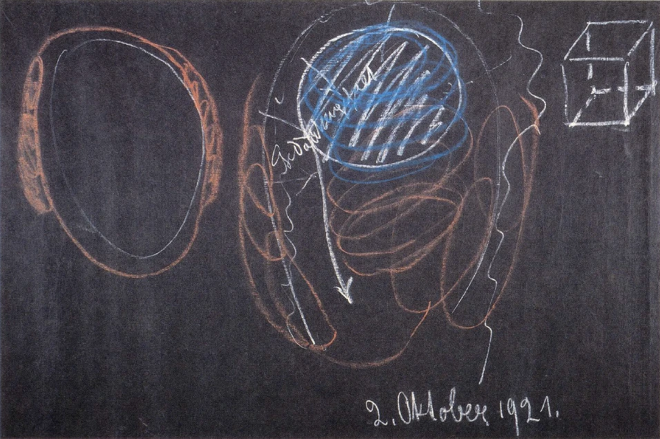
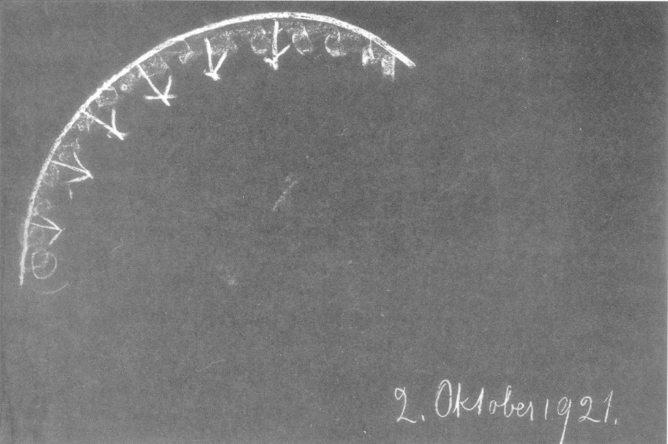

[ 1 ] ^858teu

Ich möchte noch einmal, damit der Zusammenhang gewahrt wird, kurz rekapitulieren, was in den letzten Tagen vor unsere Seele getreten ist in bezug auf die Erkenntnis des seelischen und geistigen Lebens des Menschen. Insbesondere demjenigen, was für einen gewissen vorläufigen Abschluß dieser Betrachtungen noch nachzutragen sein wird, möchte ich das Nötige vom Vorangegangenen vorausschicken. Ich will heute mehr von den Resultaten sprechen; den Gang der Beobachtung habe ich ja in den letzten Tagen auseinandergesetzt. ^1l9znn

[ 2 ] ^ya4y02

Wir haben gesehen, daß vorhanden ist gewissermaßen in dem Zwischenraum zwischen dem ätherischen Leib und dem physischen Leib, sagen wir, ein Gewebe von lebendigen Gedanken. Dieses Gewebe von lebendigen Gedanken, was ist es denn eigentlich? Es ist dasjenige, was wir durch die Geburt aus der geistig-seelischen Welt hereintragen in die irdische Welt. Es ist notwendig, daß man sich vorstelle, daß das, was wir innerhalb unserer Denktätigkeit nur im Bilde haben, was also innerhalb unserer Denktätigkeit nur etwas abbildet, daß das ein selbständiges Leben für sich habe, aber dann eben nicht darinnen ist, was wir erfühlen, indem wir Gedanken haben, sondern daß das Gedankengewebe durchzogen ist von objektiver Wesenheit, also ein wirkendes, webendes, tätiges Gedankengewebe ist. Das ist beim Menschen ja so, daß es mitwirkt bei seiner Gestaltung, daß es mitwirkt durch das ganze Leben zwischen der Geburt und dem Tode. ^41qbbn

[ 3 ] ^zowxcj

Was ich da zuletzt sagte, bitte ich voll ins Auge zu fassen. Man kann nicht etwa sagen, daß beim Menschen dieses Gedankengewebe ihn ganz bilde, daß also der Mensch ganz herausgewoben wäre aus demjenigen, was man nennen kann Weltgedanken. Das ist nicht der Fall, wenigstens nicht in bezug auf dieses zwischen dem ätherischen und dem physischen Leibe befindliche Gedankengewebe. Der Mensch wird durchaus auch aus anderem konstituiert, das aus dem allgemeinen Kosmos heraus an ihn herankommt, und nur mitwebend ist dasjenige, was ich da als Gedankengewebe beschrieben habe. Aber wir finden es gewissermaßen an derjenigen Stelle, wo unser subjektives Denken auch liegt, denn die subjektiven Gedanken weben wir in dieses Gedankengewebe hinein. Die objektiven erscheinen ja dem gewöhnlichen Bewußtsein gar nicht, aber indem sich die subjektiven, an der Außenwelt entzündeten Gedanken in dieses Gewebe hineinleben, kommt das, was unser Gedankeninhalt ist, für unser Bewußtsein zustande. ^rn42dz

 ^vh93pb

[ 4 ] ^tehy12

Das ist also gewissermaßen der Mensch nach der einen Seite hin. Es ist der Mensch nach der Seite seiner Haut hin, insofern in die Haut ja im Grunde genommen die Summe der Sinne eingestaltet ist. Sobald wir aber heute an die Sinneswelt selber herangehen, so ist die Sache so, daß wir gewissermaßen nicht bis zu den Sinnen kommen, indem wir so dasjenige betrachten, was der Mensch eingegliedert bekommen hat, indem er durch die Geburt ins Dasein getreten ist. Wir müssen die Sache schematisch so zeichnen, daß wir sagen: Wenn dieses das Gedankengewebe zwischen dem Ätherleib und dem physischen Leibe ist (siehe Zeichnung, hell), so schlingt sich um dieses Gedankengewebe nach außen alles das, was (rot) in die Haut eingegliedertes Sinnesleben ist. Das ist also gewissermaßen aus dem Kosmos herausgebildet und ist dem Menschen angegliedert. Das ist es also, was der Mensch vom Kosmos gewissermaßen geschenkt erhält, wenn er, durch die Geburt ankommend, das hereinträgt, was zunächst in seinem Gedankengewebe ist. Und eigentlich, wenn man von dem Menschen spricht als sich hindurchentwickelnd durch Saturnentwickelung, Sonnenentwickelung, Mondenentwickelung, Erdenentwickelung, wie ich es beschrieben habe in meiner «Geheimwissenschaft im Umriß», so finden wir zunächst hauptsächlich diese äußere Entwickelung, vom Saturn angefangen, gerade in der Konfiguration der Sinnesorgane ausgedrückt. Das setzt sich dann allerdings durch Prozesse nach innen ins Drüsensystem, Nervensystem und so weiter fort, aber von den Sinnen geht dasjenige aus, was der Mensch als seine Organisation aus dem Kosmos hereinbekommt. Das aber, was ich hier gezeichnet habe als Gedankengewebe, ist eben durchaus etwas, was dem individuellen Menschen angehört, was allerdings herausgegliedert wird aus der Ätherwelt, indem der Mensch durch die Geburt ins Dasein tritt, was aber durchaus doch dem individuellen Menschen angehört, das heißt, mit der individuell irdischen Entwickelung des Menschen zu tun hat. So daß man sagen kann: Diese objektive Gedankenorganisation, sie arbeitet während unseres Embryonallebens und während unseres ganzen späteren Lebens zwischen Geburt und Tod an uns, aber sie ist nicht etwa alles, was die ganze Wesenheit des Menschen aus sich heraussetzt. ^iwi5m2

[ 5 ] ^z8ep5z

Auf der anderen Seite haben wir gefunden, was willensartiger Natur ist. Und wir können sagen: Was willensartiger Natur ist, entwickelt sich zwischen dem Astralleib und dem Ich. Das Ich ist eigentlich so wie es der Mensch als Mensch hat, ganz und gar willensartiger Natur. Es entwickelt sich aber so, daß, wie ich angedeutet habe, zunächst während des Lebens zwischen Geburt und Tod die Impulse des Wollens in die Handlungen des Menschen übergehen, aber nicht vollständig; es bleiben Dinge zurück. Und was da zurückbleibt von Willensartigem, das geht in das werdende Karma über. So daß wir also, wenn wir den Menschen nach seinem physischen Leibe hin betrachten, in dem Gedankengewebe nach dem vergangenen Karma kommen, und indem wir den Menschen betrachten nach seinem Ich - das Ich ist es ja, das eigentlich in seinen Handlungen lebt; dessen muß man sich nur vollständig bewußt sein, daß das Ich eigentlich völlig erst in den Handlungen lebt, eigentlich erst erwacht an dem Handeln des Menschen -, wird das, was das Ich gewissermaßen da zurückbehält in sich, dann durch die Pforte des Todes getragen und geht in das Zukunftskarma, in das werdende Karma über. ^0yflma

[ 6 ] ^d85u2u

Da finden wir also, gewissermaßen objektiv betrachtend, was sonst subjektiv als Seelenleben in uns ist. Wir finden es objektiviert. Wir finden es so, daß wir es objektiv betrachten können. Aber wir finden, wenn wir nach der Verwandtschaft hinschauen mit dem Subjektiven, daß wir nach der einen Seite Gedankengebilde haben, nach der anderen Seite ein Willensgebilde haben. In der Mitte drinnen steht für das subjektive Erleben das Fühlen. ^mcfwta

[ 7 ] ^awu2cr

Dieses Fühlen, man kommt auf seine eigentliche Wesenheit nur, wenn man sich klar darüber ist, daß eigentlich jedes Gefühl, das der Mensch als einzelnes hegen kann, verwoben ist in das ganze Gefühlsleben des Menschen. Und das Gefühlsleben des Menschen läßt sich eigentlich wiederum nur betrachten, wenn wir es so auffassen, daß wir sagen: In einem Lebensaugenblicke sind wir durchströmt, durchsetzt von der Gesamtheit unseres Gefühlslebens. Wir könnten auch sagen: Wir sind in einer gewissen Gefühlsstimmung; in jedem Augenblicke unseres Lebens sind wir in einer gewissen Gefühlsstimmung. Diese Gefühlsstimmung, versuchen wir es einmal - jeder kann es ja eigentlich zunächst nur individuell tun —, diese Gefühlsstimmung uns zum Bewußtsein zu bringen. Versuchen wir uns zum Bewußtsein zu bringen, wieder Mensch in irgendeinem Augenblickeseines Erdenlebens in einer gewissen Gefühlsstimmung ist. Sie wissen ja: diese Gefühlsstimmung ist eine unendlich mannigfaltige. Sie ist so, daß sie bei dem einen ausarten kann in eine, ich möchte sagen, Überfröhlichkeit, daß also der eine im Übermaße fröhlich gestimmt ist, der andere unter Depressionen leidet, der dritte wieder mehr im Gleichmaße gestimmt ist. Wir brauchen, wenn wir bloß auf diese Gefühlsstimmung in irgendeinem Lebensaugenblicke unseren Blick hinrichten wollen, dabei gar nicht auf die Ursachen dieser Gefühlsstimmungen einzugehen, sondern brauchen nur die besondere Schattierung, die besondere Nuance dieser Gefühlsstimmung ins Auge zu fassen: wie sie bei dem einen bis zur tiefsten Depression kommen kann, bei dem anderen im Gleichmaß sein kann, bei dem dritten wieder bis zum Frohsinn, bis zur äußersten Fröhlichkeit gehen kann; wie tausenderlei Zwischenstufen vorliegen können. Bei jedem Menschen ist eigentlich diese Gefühlsstimmung eine andere. Und nun, wenn man sich durch eine Art von Selbsterkenntnis nach dieser Gefühlsstimmung erkundigt, so findet man ja eigentlich zunächst nichts anderes als subjektives Erleben in dieser Gefühlsstimmung, subjektives Erleben, das in allerlei Weise nuanciert ist eben durch die äußeren Erfahrungen, durch die äußeren Erlebnisse; aber eben subjektives Erleben findet man. ^oevvik

[ 8 ] ^xhgg7f

Man kann, wenn man in diesem subjektiven Erleben, also im eigentlichen inneren Seelenweben bleibt, ohne auf das Anschauen einzugehen, also darauf einzugehen, daß einem diese Dinge objektiv werden, man kann sich da nicht über das Wesen, sagen wir, dieser gefühlsmäßigen Seelenstimmung in irgendeinem Augenblicke aufklären. Aber man kann doch schon im gewöhnlichen Leben darauf kommen, was diese Stimmung, diese ganz und gar in Gefühlen lebende Stimmung eigentlich ist. Dazu muß man allerdings die Fähigkeit des psychologischen Betrachtens haben. Man muß die Möglichkeit haben, besonders prägnante Persönlichkeiten vielleicht einmal auf ihren Gefühlsgehalt zu prüfen. Und da können Sie die folgende Erfahrung machen. Allerdings, es wird die äußere Beobachtung nur ein Annäherndes an die eigentliche Wahrheit geben können, aber eben dieses Annähernde ist schon außerordentlich viel wert. ^0iafkx

[ 9 ] ^k4skz7

Wir können uns zum Beispiel die Aufgabe Stellen, Goethe zu studieren, den man ja gut verfolgen kann nach seinen Tagebüchern, Briefen, nach demjenigen, was gerade in seine bezeichnendsten Werke geflossen ist, wo wir immer, da wir ihn biographisch manchmal von Tag zu Tag, manchmal vom Vormittag zum Nachmittag verfolgen können, gerade bei ihm gut sehen können, wie die Gemütsstimmungen sind. Man kann sich zum Beispiel die Aufgabe vorsetzen, in feiner psychologischer Weise die Gemütsstimmung, die Goethe zu irgendeiner Zeit, sagen wir, 1790 hatte, zu studieren. Man wird zunächst versuchen, sie möglichst genau zu beschreiben. Man kann das, man kann diese Gemütsstimmung möglichst genau beschreiben. Und indem man das tut, wird man aber allerdings nach zwei Richtungen hingewiesen - und das ist außerordentlich wichtig, sich einmal vor die Seele zu stellen -, man wird nach zwei Richtungen hingewiesen: man wird auf Goethes Leben vor 1790 gewiesen und auf das, was nach 1790 von Goethe durchlebt worden ist. Und wenn man dann mit einem psychologischen Blicke gleichsam zusammenschaut alles das, was auf Goethes Seele eingedrungen ist vor 1790, mit demjenigen, was dann bis zu seinem Tode auf seine Seele gewirkt hat - wenn man sich also vergegenwärtigt das vorhergehende und nachfolgende Leben -, da stellt sich das Wunderbare heraus, daß jeder Gemütsstimmungsaugenblick im Menschen ein Zusammenwirken darstellt zwischen dem, was vorangegangen ist, das der Mensch kennt, das schon in seinem Leben bewußt vorhanden ist, und dem, was erst kommt, demjenigen also, was noch nicht seiner zunächst bewußten Erfahrung gegeben ist. Das dem eigenen Bewußtsein zunächst noch Unbekannte lebt aber schon in der allgemeinen Gefühlsstimmung. Man kann es schon so biographisch, möchte ich sagen, herausbekommen, dieses Geheimnis der Gemütsstimmung eines Augenblickes. Und man grenzt mit dem schon durchaus an diejenigen Gebiete der menschlichen Betrachtung, die gern von den Menschen, die gedankenlos dahinleben, außer acht gelassen werden. Was geht den Menschen die Zukunft an, er weiß sie ja noch nicht — so meint er. In seinem Gefühlsleben weiß er sie. ^ciwi6u

[ 10 ] ^ig4ku4

Und wenn man dann weitergeht und weiter prüft, prüft zum Beispiel die Gemütsstimmung irgendeines Menschen, den man genau gekannt hat und von dem man erfahren hat, daß er, sagen wir, ein paar Jahre, nachdem man diese Gemütsstimmung aufgefaßt hat, gestorben ist, so kann man ganz genau sehen, wie der nahende Tod mit alledem, was mit ihm zusammenhängt, durchaus schon sein Licht zurückgeworfen hat auf die Gemütsstimmung. So daß man also wirklich, wenn man auf diese Dinge eingeht, sehen kann zunächst des Menschen Vergangenheit aus dem Leben zwischen Geburt und Tod, und die Zukunft bis zum Tode hineinspielen in demjenigen, was im Gemüte gefühlsmäßig zusammen lebt. Daher hat das Gemütsleben etwas für den Menschen selbst so Unerklärliches. Daher stellt es sich herein in das Leben wie etwas Elementares, weil es durchaus als Gefühl schon tingiert ist von demjenigen, was wir erst erleben werden. ^9z5ud6

[ 11 ] ^frykbq

Diese Sache mußte ja durchaus schon berücksichtigt werden in der Zeit, in der ich meine «Philosophie der Freiheit» abfaßte. Warum mußte ich denn darauf dringen, daß die freie Handlung nur hervorgehen darf aus dem reinen Denken? Nun, weil, wenn die Handlung auf das Gefühl gebaut ist, ja die Zukunft schon hineinspielt, also aus dem Gefühl heraus niemals eine wirklich freie Handlung kommen könnte! Die kann nur aus dem wirklich im reinen Denken erfaßten Impuls heraus kommen. Und wenn Sie sich erinnern an das, was ich an den zwei verflossenen Tagen dargestellt habe, so werden Sie die Sache noch mehr an Ihre Seele heranbringen können. Ich habe gesagt: So wie uns das Gefühl erscheint, so ist es ja zunächst so, daß das, was in uns eigentlich geschieht, was in unserer Menschenwesenheit vorgeht, im Gefühl zurück-, heraufstrahlt in unser Bewußtsein. Wenn ich schematisch zeichne, so kann ich sagen: Im Gefühl strömt nach oben in das Bewußtsein herein, was eben das Erlebnis des Gefühles ist; nach unten aber strömt, was von dem imaginativen Bewußtsein den Traumbildern gleich erlebt werden kann (siehe Zeichnung Seite 89), was also durchaus in Imaginationen sich abspielt. So daß das Gefühlsleben eigentlich für den Gesamtmenschen so verläuft, daß nach oben strömt, was uns als Gefühl bewußt wird (blau), daß aber in die menschliche Organisation hinunter- und hineinströmt, was eigentlich Bild ist, was wirklich dann, wenn es durch das imaginative Bewußtsein geschaut wird, eben als Bild geschaut wird (rot, innen). Das strömt für das gewöhnliche Bewußtsein als ein Unbewußtes hinunter in die ganze menschliche Wesenheit. Zwar nicht in den einzelnen Ereignissen, denn die müssen eigentlich erst herankommen - ich bitte, das wohl aufzufassen -, aber in der Gesamtstimmung des Lebens lebt in dem Menschen durchaus auch wie, ich möchte sagen, in einem Grundton das Ergebnis seiner zukünftigen Erlebnisse. Nicht als ob da die Bilder lebten von dem, was geschieht; aber die Eindrücke davon, die leben in den Bildern. ^ixstgm

[ 12 ] ^sf8rea

Also diese Bilder, die da hinunterströmen, müssen Sie sich nicht vorstellen als so etwas, wie wenn kinematographisch die Zukunft abliefe, sondern Sie müssen sie sich vorstellen als das Ergebnis der Eindrücke. Nur bei gewissen Leuten, die atavistisch hellseherisch sind, bei denen können die Bilder, die sich dann übersetzen in die Bilder von gewissen Tatsachen, zum Vorschein kommen, und dann kann ein gewisses Schauen in die nächste Zukunft ja stattfinden. Uns soll aber heute vorzugsweise das interessieren, daß zunächst in den Menschen hinuntergeschickt wird in bildhafter Weise, was sich als seine Gefühlswelt auslebt. ^ds3q1e

[ 13 ] ^s9f510

Indem wir nun vom Gefühl zum Willen übergehen, dringt das, was so, wie ich es Ihnen dargestellt habe, nun hier in den Menschen hineingeht, nach außen und wird zu seinem werdenden Karma, zu seinem Zukunftskarma (rot, außen). So daß, was im Menschen entsteht durch seine Gefühle, gewissermaßen etwas zu tun hat mit seinem Karma bis zu seinem Tode hin; das aber, was aus dem Willen entsteht, hat zu tun mit seinem Karma über den Tod hinaus. ^yr5myp

[ 14 ] ^u4yihd

Es ist also durchaus möglich, diese Dinge alle in den Einzelheiten zu verfolgen und zu studieren. Man redet, indem man immer weiterrückt in bezug auf die Ausgestaltung anthroposophischer Geisteswissenschaft, durchaus nicht in schematischer Weise von bloßen Begriffen, sondern man redet von dem Konkreten, das im Menschen lebt und das, indem es der Mensch zu seinem Bewußtsein bringt, ihm erst die Aufklärung gibt über das, was er eigentlich ist. Aber Sie müssen ein starkes Gefühl davon bekommen, wie der Wille, der sich anlehnt an das Gefühlsleben, eigentlich in die Zukunft, über den Tod hinaus wirkt, wie der Wille der Erzeuger des werdenden Karma ist. ^lkjca9

 ^25l66i

[ 15 ] ^dcet0n

Wenn wir uns noch einmal nach der anderen Seite wenden, nach jenem Gedankengewebe, das wir gefunden haben und das wirklich zwischen dem Ätherleib und dem physischen Leibe im Menschen lebt, dann müssen wir uns ja klar sein, daß, indem wir durch die Sinneseindrücke etwas von der Welt erfahren, uns also eine sinnliche Weltanschauung bilden, wir dann diese Sinneseindrücke gedanklich verarbeiten, und indem wir sie gedanklich verarbeiten, weben wir eigentlich mit unserer Subjektivität in diesem Gedankengewebe darinnen. Wir verbinden, was wir infolge der Sinneseindrücke in unserer Seele erleben, einerseits mit dem, was uns als ein Gedankengewebe durch die Geburt hindurch eingegliedert wird; aber das eine, das objektive Gedankengewebe bleibt unbewußt, und nur das, was wir hineinweben, was wir gewissermaßen hineindrängen aus unserer inneren Gedankentätigkeit heraus, das kommt uns zum Bewußtsein. Es ist tatsächlich so, als ob das Gedankengewebe da wäre, die subjektiven Gedanken anschlagen, da hineinschlagen in dieses Gedankengewebe und dieses Gedankengewebe dann zurückspiegelt unsere subjektiven Gedanken, indem es ihnen allerdings allerlei Richtungen gibt und uns dadurch unsere subjektiven Gedanken zum Bewußtsein kommen (siehe Zeichnung Seite 93). Ich sage, indem es ihnen allerlei Richtungen gibt. ^9jljbs

[ 16 ] ^bnub9s

Sehen Sie, wenn wir, sagen wir, irgendeinen äußeren Gegenstand wahrnehmen - ich will Ihnen den Vorgang ganz genau schildern -, zum Beispiel also einen Würfel, einen Kristallwürfel: wir sehen ihn zunächst. Wir bleiben beim Sehen nicht stehen. Wir denken über ihn. Aber dieser Gedanke leitet sich bis zu dem Gedankengewebe fort, und das Gedankengewebe, das uns eingegliedert ist durch die Geburt, mit dem wir uns also behaftet haben, als wir im Kosmos waren, das wir ja durch den Kosmos auch bekommen haben, dieses Gedankengewebe ist so beschaffen, daß wir nun anfangen, aus gewissen Voraussetzungen heraus uns kristallographische Ideen zu bilden, die wir uns aus dem Inneren heraus bilden. Indem wir uns zum Beispiel bilden die Gedanken des tesseralen Systems, des tetragonalen Systems, des rhombischen Systems, des monoklinen Systems, des triklinen Systems, des hexagonalen Systems, also indem wir ausdenken in einer mathematisch-geometrischen Art Kristallsysteme, dann finden wir, wir können die Kristallsysteme ausdenken. In das tesserale System, das wir da in unserem Inneren ausgebildet haben, da paßt dieser Würfel hinein. Indem wir so etwas wie zum Beispiel den Gedanken des Würfels eingliedern in das, was gewissermaßen Apriori-Gedanken sind, die wir aus unserem Inneren herausnehmen, sind wir in diesem Augenblicke, wo uns subjektive Gedanken aufstoßen, auf das objektive Gedankengebiet hingelenkt. Denn was wir als Geometrisches, als rein geometrischmechanische Physik und so weiter ausbilden, das holen wir aus diesem Gedankengewebe, das uns mit der Geburt eingegliedert ist, heraus, und das einzelne Individuelle, das wir eingliedern diesen Gedanken, die wir über die äußeren sinnlichen Anschauungen und Eindrücke entwickeln, die sind diejenigen, über die wir uns aufklären, indem wir sie uns zurückreflektieren lassen, aber durchsetzen lassen mit dem gewissermaßen ewig in uns lebenden gestaltenden Gedankengewebe, dem Prozesse nach wenigstens ewig, wenn auch nicht in den einzelnen Formen, denn die ändern sich von Inkarnation zu Inkarnation. ^zwhpc2

[ 17 ] ^t1ehr0

Wir leben also, indem wir denken und indem wir das Gedankliche so eingliedern in unser inneres Gedankenleben, daß wir es verstehen, wir leben so, daß wir auch für unser subjektives Denken heraufholen, was in diesem Gedankengewebe darinnen ist. ^yc7xf4

[ 18 ] ^zb0peu

Nun, das, was ich jetzt gesagt habe, das ist ja etwas, was im Menschen fortwährend vorgeht, was sich fortwährend im Menschen abspielt. Aber zu gleicher Zeit werden Sie sehen: Auf der einen Seite, indem wir beim Gefühl beginnen, fassen wir ins Auge, was vom Gefühl aus in den Organismus hineingeht, zum Willen übergeht. Das, was vom Willen gewissermaßen im Ich still stehen bleibendes, werdendes Karma wird, das alles bringt uns in die Richtung der Menschenzukunft. Wenn wir zur entgegengesetzten Seite, nach dem Gedankengewebe hin sehen, nach welcher auch unsere subjektiven Gedanken laufen, das bringt uns durchaus in die Strömung nach der menschlichen Vergangenheit hin. Daher ist auf diesem Wege auch unser vergangenes, unser vollendetes Karma zu suchen. Im Gefühle begegnen sich wirklich im eminentesten Sinne Vergangenheit und Zukunft im Menschen. Der Mensch wird also gewissermaßen aus den Gedanken heraus geboren. Er lebt sich durchs Gefühl hindurch und webt in seinen Willen, was mit ihm durch die Pforte des Todes geht. ^hx3eti

[ 19 ] ^zwx5un

Indem wir diese Worte aussprechen, deuten wir eigentlich hin auf das, was wir subjektiv im Seelenleben haben in der Zeit zwischen der Geburt und dem Tode. Aber wir können noch weitergehen. Wir können das Folgende ins Auge fassen. Wir können uns fragen: Wie ist es denn nun eigentlich, wenn sich diese subjektiven Gedanken, die wir an die äußeren Eindrücke anknüpfen, mit demjenigen, was ganz gewiß nur Vergangenes ist, zusammenfügen, so wie ich das eben beschrieben habe? Sehen Sie, der subjektive Gedanke, er wird uns zunächst bewußt als Gedanke. Als Gedanke hat er einen gewissen Vorstellungsinhalt. Wir denken einen Inhalt, wenn wir über den Würfel denken. Aber Sie werden sich durchaus über das klar werden, was ich schon vorgestern angedeutet habe: Wir können im Seelenleben nicht ohne weiteres Denken, Fühlen und Wollen trennen. ^ck73e6

[ 20 ] ^43j6nf

Im Wollen leben alle Motive unserer moralischen Gedanken. Aber auch im Denken, im subjektiven Denken sind wir uns bewußt, daß wir nicht nur einen Gedankeninhalt haben. Wir reihen einen Gedanken an den anderen an, und wir sind uns der Tätigkeit bewußt, die einen Gedanken an den anderen anreiht. Was lebt denn da im Denken? Nun, es lebt auf eine feine Weise im Denken, namentlich im subjektiven Denken, schon der Wille. Wir müssen uns also klar sein: Indem wir denken, lebt auf der einen Seite der Gedankeninhalt, auf der anderen Seite die Willenstätigkeit im Denken. Wenn nun die Gedanken hier anstoßen (siehe Zeichnung) — sie werden uns allerdings als Gedanken zurückreflektiert, aber in den Gedanken, in diesen subjektiven Gedanken, die wir gewissermaßen hineinprojizieren, hineinstoßen nach dem Gedankengewebe, lebt ja auch Wille. Diesen Willen können wir eigentlich im gewöhnlichen Bewußtsein nicht brauchen. Fühlen Sie nur, wenn diese Tätigkeit, die ich Ihnen hier angedeutet habe, ganz klar zum Ausdruck käme in der Erinnerung: in der Erinnerung muß der Wille schon geschwunden sein! Er muß noch tätig sein; aber wenn die Erinnerung fertig ist, wenn der erinnerte Gedanke da ist — die Erinnerung würde ja nicht rein sein, sie würde nicht klar abbilden, was sie abbilden soll als ein vergangenes Erlebnis, wenn sie vom Willen durchwert ^55fu7m

[ 21 ] ^pu64b6

strömt wäre! Man kann ja natürlich, wenn Sie sich an das erinnern, was Sie gestern gegessen haben, nicht mehr die Suppe ändern; da ist der Wille schon heraußen, nicht wahr. Es soll der reine Gedankeninhalt zutage treten. Der Wille muß also im Reflektieren abgestreift werden. Wo kommt er denn hin? ^iipr0v

[ 22 ] ^wemnmw

Nun, wenn ich dieselbe Zeichnung (S. 89) mache, wenn ich hier das Gedankengewebe habe und da reflektiert wird, so geht einfach der Gedankengehalt ins Bewußtsein. Der Willensgehalt der Gedanken, er geht hinunter und vereinigt sich mit dem anderen Willens- und Gemütsgehalt und geht ein in das werdende Karma, wird also ein Bestandteil des werdenden Karma (siehe Zeichnung Seite 94, hellschraffiert; dunkelschraffierter Pfeil nach unten). ^nz2xnc

[ 23 ] ^ot16pr

Auf der anderen Seite: Unsere Willensimpulse, sie sind ja wie der schlafende Teil auch während unseres Wachlebens. Wir sehen nicht hinunter bis in diejenigen Regionen, wo der Wille eigentlich lebt. Wir haben zuerst den Gedanken des Willensimpulses. Der geht dann gewissermaßen in unbewußter Weise über in das Wollen, und erst, wenn das Wollen sich nach außen äußert, so betrachten wir wiederum das, was durch uns geschieht, das, was wir im gewöhnlichen Bewußtsein erleben beim Wollen. Beim Handeln erleben wir eigentlich alles im Vorstellungsleben, träumen davon im Gefühlsleben, schlafen aber darüber in bezug auf das eigentliche Willensleben. ^rnwrqb

[ 24 ] ^0q71i0

Aber es sind eben Gedanken, die wir hineinleiten in dieses Willensleben. Wann aber nur? Nur dann, wenn wir uns nicht unseren Instinkten, unseren Trieben, wenn wir uns also nicht bloß der sogenannten niederen Menschennatur hingeben, denn die ist schon da unten, die treibt uns dann zum Wollen und zum Handeln. Dann aber bekommen wir unseren Willen herein in dasjenige, was unser subjektives Erleben ausmacht, wenn wir ihn beherrschen mit unseren reinen Gedanken, die nach dem Wollen sich hinrichten, das heißt, wenn wir ihn beherrschen mit unseren intuitiv erfaßten moralischen Idealen. Diese intuitiv erfaßten moralischen Ideale können wir dem Gedankenwillen mit auf den Weg geben hinunter nach der Willensregion. Dadurch wird unser Wille durchsetzt von unserer Moralität, und im Inneren des Menschen findet daher fortwährend dieser Kampf statt zwischen demjenigen, was der Mensch hinunterschickt aus seinen moralischen Intuitionen in die Willensregion, und demjenigen, was da unten wühlt und brodelt in seinem instinktiv-traumhaften Leben. Das ist alles das, was im Menschen vorgeht. Aber das, was da unten im Menschen vorgeht, ist zu gleicher Zeit dasjenige, in dem sich vorbereitet seine Menschenzukunft über den Tod hinaus. Es schlägt herauf in die Gefühlsregion. Es lebt eigentlich im Willen diese Zukunft. Sie schlägt herauf in die Gefühlsregion, und mehr webt sich noch in das Fühlen hinein als nur dasjenige, was ich vorhin als die Gefühlsstimmung, die eine Bedeutung hat für das Leben zwischen Geburt und Tod, geschildert habe. In der gewöhnlichen Gefühlsverfassung, die ich geschildert habe als sich ausdehnend von der äußersten Depression zu der völligen Ausgelassenheit, zu der Überfröhlichkeit, da kann sich abspielen all das, worinnen zusammenspielt Menschenzukunft und Menschenvergangenheit in dem Leben zwischen Geburt und Tod. Aber auch das, was über den Tod hinausgeht, dringt ein in dasjenige, was da von unten heraufkommt. Und was lebt da? Da lebt nun etwas — weil es aus den Regionen heraufkommt, wo das Bewußtsein nicht mehr mitmacht, empfinden wir es als etwas Objektives. Es ist auch etwas Objektives, denn es hat mit den Gesetzmäßigkeiten zu tun, durch die wir uns als moralische Menschenwesen durch den Tod tragen. Was da zurückstrahlt, das ist dann das Gewissen. Und psychologisch erfaßt, ist dies der eigentliche Ursprung des Gewissens. Wollte sich die psychologische Wissenschaft wirklich an diese Dinge heranmachen, dann müßte sie nun die Einzelheiten des Seelenlebens nach diesen Richtlinien hin prüfen, und sie würde bis in die minuziösesten Einzelheiten des Seelenlebens überall die Bestätigung dessen finden, was von anthroposophischer Geisteswissenschaft als solche Richtlinien gegeben wird. ^5wgd9x

[ 25 ] ^jcftxv

Wir sehen also: Unsere Gefühle strömen unseren Gedanken entgegen. Sie strömen zunächst entgegen und beleben unsere subjektiven Gedanken; aber sie schlagen gewissermaßen auch nach dem objektiven Gedankennetz hin, und in diesem erleben wir uns selbst als gegeben, als ein Wesen, welches sich durch die Geburt ins irdische Dasein hereingelebt hat. Nach der anderen Seite können wir uns erleben als das Wesen, das durch den Tod geht. Man braucht nur das menschliche Innere wirklich zu studieren, und man kommt durchaus auf das, was im menschlichen Inneren sich schon als solches ankündigt, daß es über den Menschen, das heißt über Geburt und Tod hinausweist, daß es also hinausweist in diejenige Welt, die nicht innerhalb des Sinnlichen beschlossen ist. Denn diese Welt, die nicht innerhalb des Sinnlichen beschlossen ist, gibt uns ja zunächst das, was in unserem Inneren eigentlich vorhanden ist. Insbesondere das wäre von einer großen Wichtigkeit, daß man wirklich in einer realen Psychologie - denn das, was heute als Psychologie gilt, ist ja nur eine Summe von Formalismen eben untersuchte die Gemütsstimmung des Menschen in einem Augenblick, wo Vergangenheit und Zukunft ineinanderfließen. Man würde dadurch vieles Rätselhafte im Menschenleben finden, und man würde sich überzeugen, daß ein Einwand, der außerordentlich naheliegt, eben nicht gilt. Der Einwand, der außerordentlich naheliegt, ist der: Ja, was würde denn eigentlich aus dem Menschen, wenn er sich so durchschauen würde, wenn er also gewissermaßen fortwährend in sein Inneres hineinblicken würde, um seine subjektive Gemütsstimmung auf das hin zu prüfen, was gewissermaßen in seiner Zukunft liegt? - Dieser Einwand liegt nahe, aber es ist nur der Einwand, den die Einbildung macht. Man stellt sich vor, daß eben die Art, wie die Zukunft erscheint, so ist, wie sie dann in der Anschauung, in der Erfahrung erlebt wird. So wird ja nicht die Zukunft abgebildet, wie sie dann erlebt wird! Erlebt wird sie im Verkehre mit der Außenwelt, im Zusammenstoßen mit der Außenwelt. Was da innerlich vor sich geht, das ist dasjenige, was im Menscheninneren sich als das Ausstrahlende kundgibt, und das ist etwas, was, wenn es der Mensch noch so genau kennt, ihn durchaus nicht in seinem Lebenswege beirren kann. Wie überhaupt die Einwände gegen Menschenkenntnis aus der Furcht entstehen, die ganz und gar wurzelt in Illusionen, die man sich macht, weil man eben bloß nach dem Leben des gewöhnlichen Bewußtseins urteilt, weil man sich nicht aufschwingen will zu der Anschauung, daß, sobald das Bewußtsein hinaufsteigt in höhere Regionen, es eben völlig Neues erlebt. Nun aber habe ich Ihnen ja gestern gezeigt, wie, wenn der Mensch durch die Pforte des Todes kommt, er sich entwickelt mit zwei Sehnsuchten, die auf der einen Seite vom Gedankenleben, auf der anderen Seite vom Willensleben ausgehen: wie das Gedankenleben sich sehnt nach Weltensein, das Willensleben, indem es durch den Tod geht, sich sehnt nach Menschensein; wie das dauert bis zu dem, was ich genannt habe die Mitternachtsstunde des Daseins; wie dann eine rhythmische Umkehr stattfindet: wie das Gedankliche sich anfängt zu sehnen nach dem Menschlichen, und das Willentliche sich anfängt zu sehnen nach dem Ausgießen in den Kosmos, so daß das Willensmäßige dann in den vererbten Eigenschaften lebt. Das Gedankliche aber lebt in dem Individuellen, das sich eingliedert in das neue Erdenleben. Das Willensmäßige umgibt uns gewissermaßen in dem, was wir von den Vorfahren — äußerlich angeschaut: in den vererbten Eigenschaften und vererbten Substanzen — haben. Das Gedankliche ist das, was sich in uns eingliedert, und während des Lebens verbinden wir wieder mit diesem Gedankenleben alles das, was wir aus den Tiefen des Gemüts- und Willenslebens heraufholen. Zunächst wird uns das Gedankenleben eingegliedert als etwas, was zunächst nicht warm und lebendig ist wie unser Innenleben überhaupt. Würden wir so bleiben mit dem Gedankenleben, wie wir geboren werden, wir würden gewissermaßen Gedankenautomaten werden voller innerer Kälte. Aber im Momente der Geburt beginnt das individuelle Innere aus dem Willen und aus dem Gemüte heraus sich zu regen, mit Wärme und Leben zu durchsetzen das, was zunächst kalt geworden ist auf dem Wege von dem Tode bis zur Geburt; und dadurch haben wir eben als Mensch die Möglichkeit, mit dem individuell Warmen zu durchsetzen, was uns aus dem weiten Weltenall in Kälte konstituieren muß. ^7o0ket

[ 26 ] ^eziwjz

So gliedert sich der Mensch ein in das Räumliche und in den Werdegang der Welt. So steht er darinnen. Diese Dinge werden von dem heutigen naturwissenschaftlichen Denken ganz zugedeckt. Das heutige naturwissenschaftliche Denken will nicht heran an eine wirkliche Menschenerkenntnis. Daher erlebt sich der Mensch heute — und er wird sich immer mehr und mehr so erleben -, indem er vieles in der Umwelt erkennt, so, daß er sich in seiner eigentlichen Wesenheit nicht erkennen kann. Der Mensch lebt sich heute gerade durch die gegenwärtige Wissens- und sonstige Bildung so herein, daß er von seiner eigenen Wesenheit im Grunde genommen nichts ergreift. Und immer mehr und mehr wird dieses zunehmen. Und wenn vollständig erfüllt werden könnte, was gewissermaßen dem Menschen direkt wird durch die einseitige naturwissenschaftliche Erkenntnis, so würde der Mensch seiner selbst völlig entfremdet werden. Sein inneres Individuelles würde sich heraufleben wollen, würde schmelzen wollen durch seine Wärme die Eismassen, die wir durch die Geburt ins irdische Dasein hereingetragen haben. Der Mensch würde seelisch zugrunde gehen an diesem Prozesse, der ihn innerlich überwältigt, der ja auch geschieht, wenn er ihn nicht erkennt, den er aber im Grunde genommen auf die Dauer nur ertragen kann, indem er ihn erkennt. Alle Zeichen der Zeit sprechen dafür, daß der Mensch zu solcher hier charakterisierter Selbsterkenntnis wirklich kommen muß. Und es ist einfach die Aufgabe des gegenwärtigen Geisteslebens in seinem Hinleben gegen die nächste Zukunft, diese Dinge der Kulturentwickelung wirklich einzuverleiben. Aber die bisherige Bildung hat große Massen von Furcht, große Massen von Antipathie aufgewendet gegen die Geltendmachung dessen, was der Menschheit so notwendig ist, wenn sie nicht im Untergang versinken will, sondern zu einem neuen Aufgang kommen will. ^9681ne