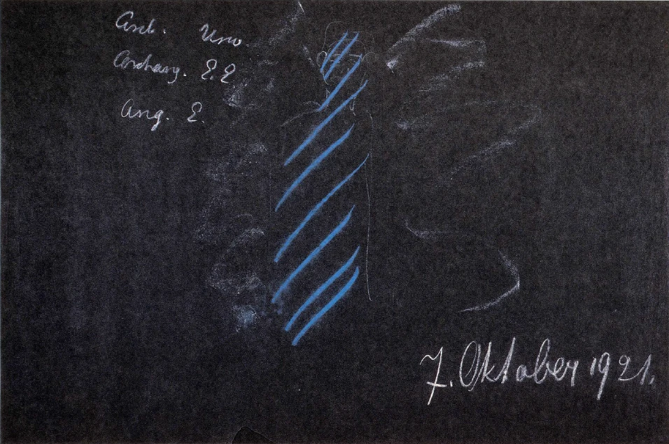
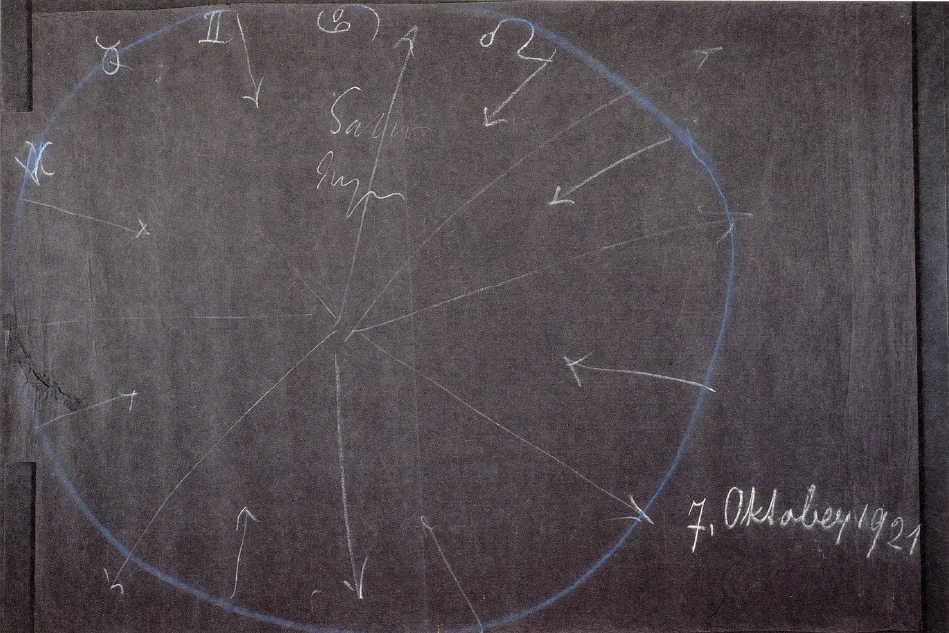

[ 1 ] ^3nat5s

Wir haben gesehen, wie uns die Betrachtungen der seelischen Verhältnisse des Menschen gewissermaßen in die Zwischenräume zwischen physischem Leib, Ätherleib, astralischem Leib und Ich führten, wie uns aber die Betrachtungen der geistigen Verhältnisse im Menschen gewissermaßen aus der Erscheinung des Menschen hier, wie er sie hat in seinem Leben zwischen Geburt und Tod, hinausführen in das weite geistige Weltenall. Insofern der Mensch — so könnte man sagen - Geist ist, steht er durchaus in Beziehungen zu dem ganzen geistigen Weltenall. Und daher kann man das, was sich im Menschen als geistige Geschehnisse abspielt, auch nur sachgemäß in diesem Zusammenhang mit dem gesamten Weltenall betrachten. Das Seelische ist ja sozusagen des Menschen intimes Innenleben. Es spielt sich in einer dreifachen Gestalt ab, so ab, daß das Gedankliche gelegen ist zwischen physischem Leib und Ätherleib, das Gefühlsmäßige zwischen Ätherleib und Astralleib, und das Willensmäßige zwischen dem Astralleib und dem Ich. Da also bleiben wir in der Betrachtung des Seelischen durchaus innerhalb des Menschen stehen. Sobald wir aber an wirkliche geistige Geschehnisse herantreten, müssen wir aus dem Menschen, wie er zunächst uns als geschlossenes Wesen gegenübersteht in der Welt zwischen Geburt und Tod, heraustreten. ^0spd9h

[ 2 ] ^sws0nm

Nun wissen wir ja - und wir haben es gerade vor acht Tagen von einem gewissen Gesichtspunkte aus wiederum besprochen -, daß wir, wenn wir zunächst in das Geistige hinaufsteigen, zu Wesenheiten kommen, die in ähnlicher Weise über dem Menschen sich anordnen, wie das tierische, pflanzliche und mineralische Reich unter dem Menschen sich anordnen. Wir bekommen also dann, aufsteigend - Namen tun nichts zur Sache -, die Wesenheiten Angeloi, Engelwesenheiten; Archangeloi, Erzengelwesenheiten; und Archai, Urwesenheiten, Zeitgeister. Wir haben ja auch schon von verschiedensten Gesichtspunkten aus diese Wesenheiten, welche gewissermaßen die Reiche ausmachen, die wir antreffen, wenn wir nach dem Geistigen hin die Stellung des Menschen ansehen, charakterisiert. Diejenigen Wesenheiten, die als Angeloi oder Engel bezeichnet werden, sie sind diejenigen, die die stärkste Beziehung zu dem individuellen, zu dem einzelnen Menschen haben. Der einzelne Mensch hat ja in der Tat eine solche Beziehung zur ersten über ihm stehenden Hierarchie, so daß er gewissermaßen - es ist das nicht ganz genau ausgedrückt, aber man kann so sagen, wie es oftmals populär ausgedrückt wird — eine gewisse Beziehung zu einem solchen Engelwesen entwickelt. ^3geiel

[ 3] ^11zdqm

Diejenigen, die dann die zweite Hierarchie über ihm ausmachen, sind die Archangeloi. Wir können von ihnen so sprechen, daß wir ihnen zunächst in ihren Funktionen das zuteilen, was als Volksgeister wirkt, was also Menschengruppen, die volksmäßig zusammengehören, umfaßt, obwohl es da alle möglichen Abstufungen gibt. ^uabazn

[ 4 ] ^u313u5

Wenn wir endlich zu den höheren Archai aufsteigen, so haben wir gewissermaßen die führenden Wesenheiten durch gewisse Zeitepochen hindurch, über die Differenzierungen des Volksmäßigen hinweg. Das ist gewiß nicht die einzige, sagen wir, Funktion dieser Wesenheiten, aber wir bekommen zunächst gewisse Vorstellungen, wenn wir uns an diese ja auch bei ihnen sich findende Funktion halten. ^zpfivc

 ^bcldzj

Archai, Urwesenheiten, Zeitgeister ^cqa8zi

Archangeloi, Erzengelwesenheiten ^supjkk

Angeloi, Engelwesenheiten. ^5twxqo

[ 5 ] ^9z840d

Wie wir nun des Menschen physisches Leben auf der Erde dadurch uns begreiflich machen können, daß wir uns fragen: Was hat er für Beziehungen zur tierischen Organisation, zur pflanzlichen Organisation, zur mineralischen Organisation? -, so müssen wir uns fragen: Was hat er für Beziehungen zu diesen ins Geistige hineinragenden Wesensstufen? —, um ihn eben als geistiges Wesen kennenzulernen. ^79qhe4

[ 6 ] ^vctlre

Dazu müssen wir in der folgenden Weise vorgehen. Stellen wir uns einmal vor nach gewissen Gesichtspunkten, wie der Mensch durch die Pforte des Todes geht. Wir wissen, daß so, wie wir nun einmal jetzt in diesem Zeitraume der Erdenentwickelung, der sehr viele Jahre umfaßt, als Menschen leben, dem gewöhnlichen Bewußtsein gegenwärtig werden solche Gesetzmäßigkeiten, die dem mineralischen Reiche zugrunde liegen. Der Mensch füllt sich sozusagen von seiner Geburt bis zu seinem Tode mit alldem an, was ihm das mineralische Reich in einem gewissen Sinne begreiflich macht, und er hat ein Gefühl davon, daß er mit den ihm zur Verfügung stehenden Begriffen und Ideen das mineralische Reich begreiflich finden kann. ^hb8edf

[ 7 ] ^cyriaj

Nicht so ist es gegenüber dem Pflanzenreiche. Sie wissen ja, daß die Wissenschaft vor dem Pflanzenreiche halt macht, höchstens das Ideal aufstellt, daß die komplizierte Zusammensetzung der Pflanzenzellen, der lebenden Zellen überhaupt, einmal erklärlich werden in ihrer Struktur, was, wie ich Ihnen auseinandergesetzt habe, ein völlig verkehrtes Beginnen ist, weil ja die Struktur der Pflanze oder der lebenden Zellen überhaupt sich nicht durch eine besonders komplizierte Struktur auszeichnet, sondern durch ein Hineingehen der chemischen Struktur ins Chaotische. Der Mensch kommt aber eben über diese Begriffe des Mineralischen nicht hinaus. Noch weniger kommt er mit seinen, wenn ich so sagen darf, mineralischen Begriffen in das Tierische hinein, oder gar zur Selbsterkenntnis. Das alles muß ja durch geisteswissenschaftliche Forschungen gegeben werden. Der Mensch eignet sich also an ein — nennen wir es so — mineralisches, das heißt für das Mineralische geeignetes Bewußtsein. ^qep1ix

[ 8 ] ^72fx8u

Dieses Bewußtsein, das ja gewoben wird zwischen der Geburt und dem Tode, trägt er in seinen Folgen durch den Tod hindurch. Mit dem also, was aus diesem Bewußtsein werden kann, wenn er die Pforte des Todes durchschreitet und im geistigen Reiche selber lebt, mit dem hat er dann sein weiteres Dasein zu durchwandern. ^6zp6in

[ 9 ] ^xd4enx

Aber es schlägt in dieses Bewußtsein noch wesentlich ein anderes herauf. Was sich in dieses mineralische Bewußtsein hereinerstreckt, trotzdem es durchaus nicht zu ihm gehört, was es tingiert, das ist das moralische Bewußtsein; das ist dasjenige, was da kommt aus all den Bewußtseinsvorgängen, die sich an unsere Willensimpulse, an unsere Handlungsweise anschließen. Was wir da empfinden als unsere Befriedigung über dieses oder jenes, was wir als unsere Gewissensbisse, als unsere Vorwürfe und dergleichen empfinden, das alles färbt gewissermaßen unser mineralisches Bewußtsein, und das ist etwas, was der Mensch ebenso mitnimmt durch die Pforte des Todes. Man kann also sagen: Mit einem mineralischen Bewußtsein, tingiert durch das moralische Erleben, tritt der Mensch durch die Pforte des Todes; und mit dem, was sich als Folge davon ergeben kann, lebt er dann im geistigen Reiche weiter. ^7xs8dt

[ 10 ] ^sbq9rj

Nun ist es so, daß der Mensch durch dieses mineralische Bewußtsein nicht nur hier die mineralische Welt versteht, sondern daß er durch dieses mineralische Bewußtsein eben gerade seine Beziehung entwickelt zu dem Wesen aus der Hierarchie der Angeloi, also zu demjenigen Wesen, an das er sich wenden will als das seiner individuellen Entwickelung am nächsten stehende. Und wenn der Mensch nun durch die Pforte des Todes gegangen ist, so handelt es sich darum, inwiefern er durch die Folgen seines mineralischen Bewußtseins gewissermaßen die Beziehung zu diesem Engelwesen aufrechterhalten kann. Er kann es nur nach Maßgabe dessen, was von der moralischen Seite her dieses mineralische Bewußtsein tingiert hat. Denn dieses mineralische Bewußtsein strebt nach dem Tode gewissermaßen zur Ausbreitung in die Welt. Es strebt dazu, kosmisch zu werden, dem Weltenall sich anzupassen; es strebt über das Individuelle hinaus. ^c3jol5

[ 11 ] ^2a0gdd

Wir können ja auch sagen, daß im Leben zwischen Geburt und Tod der Mensch dem Engelwesen am nächsten steht, wenn er in dem Zustande lebt, aus dem dann die Träume hervorgehen, die ja durchaus auch etwas mit seinem individuellen Wesen zu tun haben, und die eigentlich verleugnen auf der einen Seite und doch wiederum festhalten auf der anderen Seite das mineralisch-gedankliche Wesen. Der Mensch würde auch jenes unterbewußte Verhältnis zu der Hierarchie der Angeloi nicht finden können, wenn nicht sein mineralisches Bewußtsein tingiert wäre von den Zuständen, die er in einem gewissen Sinne verschläft, aber die doch diejenigen sind, die herausragen aus dem Schlafzustande, die sich dann in den Traumwelten ausleben. Der Traum selber ist ja mit Ausnahme davon, daß er sich mit seinen Konturen nicht an die äußere sinnliche Wirklichkeit hält, daß er auch den Kontakt mit der äußeren sinnlichen Wirklichkeit vielfach verleugnet, dennoch aus demselben Stoff gewoben, aus dem die Gedankenwelt gewoben ist zwischen der Geburt und dem Tode. Der Mensch nimmt also, indem er durch die Pforte des Todes schreitet, dasjenige mit, was er in sich entwickelt hat innerhalb seines mineralischen Bewußtseins, um die Beziehung zu seinem Engelwesen aufrechtzuerhalten. ^g2k2dr

[ 12 ] ^j926ps

Nun, so wie wir heute in unserer gegenwärtigen Menschheitsepoche leben, so durchdringt der Mensch — namentlich dann, wenn er sich zu den ganz aufgeklärten Menschen rechnet — wenig dasjenige, was er als mineralisches Bewußtsein hat, mit seinem moralischen Erleben. Im Gegenteil, er ist so viel als möglich bemüht, dieses mineralische Bewußtsein fernzuhalten von dem Moralischen. Er möchte in sich mindestens diese zwei Welten aufrichten: er möchte auf der einen Seite alles das betrachten, was sich schließlich im Reiche der mineralischen Natur, und soweit die mineralische Natur in das Pflanzliche und Tierische und Menschliche hineinreicht, eben begreifen läßt, und möchte dann als etwas, was eben nur aus seinem Inneren herausquillt, das Moralische betrachten. Es widerstrebt dem heutigen Zeitgeiste, das, was in der Natur lebt, zu gleicher Zeit mit moralischen Impulsen durchtränkt zu denken. Es klafft ein Abgrund zwischen dem Moralischen und dem Mineralischen. Der Mensch findet nichtleicht dieBrücke, um das Moralische einzugliedern in das Mineralische. Ich habe ja öfter darauf aufmerksam gemacht, wie der Mensch sich die Erdenentwickelung rein mineralisch vorstellt, von dem Inhalte der Kant-Laplaceschen Theorie aus bis wiederum zu dem eben, was in der Neuzeit mineralisch gedacht ist, und wie der Mensch da ausschaltet alles das, was moralisches Empfinden ist. So kommt es, daß der Mensch eine außerordentlich geringe Beziehung entwickeln kann zu dem Wesen der Angeloi, daß er in unserem heutigen Zeitenlaufe gewissermaßen — populär gesprochen - sich wenig intim verbinden kann mit seinem Engelwesen. ^nwdhy3

[ 13 ] ^21hwbh

Wenn das mineralische Bewußtsein ganz und gar getrennt wäre von den moralischen Tingierungen, dann würde der Mensch sogar in die Gefahr kommen, vor dem, was ich nenne die Mitternachtsstunde des Daseins, die nötige Verbindung mit dem Engelwesen ganz zu verlieren. Ich sage: in die Gefahr kommen. Es kommen heute noch die wenigsten Menschen in diese Gefahr; aber wenn nicht eine geistige Vertiefung der ganzen Menschheitsentwickelung auf der Erde, des Menschendenkens, Menschenfühlens und Menschenwollens über die Erde hin eintritt, dann wird sich, was da als Gefahr lebt, allerdings verwirklichen können, und es würde zahlreiche Menschen geben, welche zwischen dem Tod und einer neuen Geburt, schon wenn sie in die Nähe der Mitternachtsstunde des Daseins kommen, die Beziehungen zu ihren Engelwesen abbrechen müßten. Das Engelwesen würde zwar noch immer Beziehungen unterhalten; die würden aber einseitig von ihm zum Menschen bleiben. Der Mensch würde sie nicht in einer genügenden Weise zwischen dem Tode und einer neuen Geburt erwidern können. Wir müssen uns durchaus klar sein, daß die dem Materialismus zueilende neuere Kultur für das Geistige des Menschen die Bedeutung hat, daß der Mensch die Beziehung zu seinem Engelwesen beeinträchtigt, daß diese Beziehung immer loser und loser wird. Nun muß aber der Mensch gerade dann, wenn er gegen die Mitternachtsstunde des Daseins zu kommt, die Beziehung zu dem Erzengelwesen durch das Engelwesen anknüpfen. Soll diese Beziehung, wie sie durchaus sein kann, wenn der Mensch in der geistigen Welt drinnen lebt, eine solche sein, daß sie nicht nur einseitig von dem Engelwesen nach der Menschheit hin geht, sondern daß sie auch von dem Menschen erwidert werden kann, dann muß eben der Mensch einen geistigen Inhalt aufnehmen, das heißt, er muß seine moralischen Impulse religiös tingieren. ^al6r0z

[ 14 ] ^h5vp93

Der Mensch der heutigen Zeit steht also vor der Gefahr, daß, wenn dieselbe Entwickelung weitergeht, er eine lose Beziehung zu seinem Engelwesen erhält und dadurch auch keine innere Beziehung anknüpfen kann zu dem Erzengelwesen. Aber das Erzengelwesen ist schon daran beteiligt, ihn wiederum zurückzubringen in das physische Leben. Das Erzengelwesen ist namentlich daran beteiligt, die Kräfte auszubilden, die ihn zurückbringen in eine gewisse Volksgemeinschaft. ^zkvjhg

[ 15 ] ^z8gd5r

Wenn die Menschen, wie das ja schon seit Jahrhunderten der Fall ist, innerlich ungeistig leben, dann entwickelt sich eben die Beziehung der Erzengel zum Menschen einseitig, und dann wächst der Mensch nicht mit seinem inneren seelischen Wesen in das Volkstum hinein, sondern er wird gewissermaßen von außen, sagen wir, durch die Weltenordnung, in das Volkstum hineingestellt, das dem Erzengel zu leiten zugeteilt ist. Man kommt nicht früher zu einem Verständnis unserer heutigen Zeit, die ja gerade dadurch charakterisiert ist, daß in einer so einseitigen Weise die Volkstümer kultiviert werden, bis man weiß, daß das davon herrührt, daß eigentlich die Seelen, die in der letzten Zeit heruntergekommen sind in das irdische Dasein, eben eine lose Beziehung zu ihrem Engelwesen und dadurch keine innere Beziehung zu dem Erzengelwesen haben, daß sie dadurch gewissermaßen nur von außen hineinwachsen in ihr Volkstum; daß das Volkstum dann durchaus als ein seelenloser Impuls in ihnen ist und die Menschen eben nur durch äußerliche Impulse, durch Zusammengehörigkeiten der Sprache, durch allerlei nach dem Chauvinismus hinneigende Impulse drinnenstehen in dem Volkstum. Wer seelisch in seinem Volkstume drinnensteht — und das ist ja heute bei den wenigsten Menschen der Fall -, der wird durchaus nicht zum Chauvinismus, zum einseitigen Nationalismus sich entwickeln können, sondern er wird das, was an fruchtbaren Kräften im Volkstum drinnen ist, entwickeln, das wird er individuell machen. Aber er wird nicht in einer gewissen einseitigen Weise auf sein Volkstum pochen. Er wird es gewissermaßen überall als die Farbe seines Wesens hineinfließen lassen in seine menschlichen Offenbarungen, aber er wird es nicht in einer äußerlichen Weise, namentlich in einer gegen andere gegnerischen äußeren Weise, hervorkehren. ^fnbqlo

[ 16 ] ^azpggs

Daß das heute so der Fall ist, daß das heute geradezu den Grundton abgibt für die Weltpolitik, daß alle Verhältnisse, die sich auf dem Volkstum aufbauen, heute der menschlichen Entwickelung solche Schwierigkeiten machen, das beruht durchaus auf dem, was ich eben angedeutet habe. Wenn nämlich die Verbindung, die in der Mitternachtsstunde des Daseins — vor und nachher, durch lange Zeiten hindurch - eintritt, wenn diese Verbindung nicht durchseelt werden kann dadurch, daß man durch die Pforte des Todes das Entsprechende mitnimmt an religiöser Innigkeit, die aber spirituell ist, die nicht ein Wortreligiöses ist, dann kann nämlich der Erzengel nur wirken auf dasjenige, was pflanzenhaft im Kosmos ist und als das Pflanzenhafte in den Menschen hereingeschickt wird. Der Mensch wird dann durch sehr unterbewußte Kräfte, die mit seinem Pflanzentum, das heißt mit demjenigen, was ihn da hineinstellt in die Atmungsverhältnisse, die ja modifiziert werden durch die Sprachverhältnisse, durch all das also, was in der Sprache auf pflanzenhafte Weise in den menschlichen Organismus sich hineindrängt, durch das wird er, kann er nur von seinem Erzengel aus dirigiert werden. Es ist dann so, daß der Mensch mehr oder weniger, wenn er dann geboren ist, wenn er aufwächst als Kind, auf eine äußerliche Weise in die Sprache hineinwächst. Würde er die Beziehung, die innere, die seelische Beziehung zu seinem Erzengel haben finden können durch den Engel hindurch, dann würde das so geworden sein, daß er auch seelisch in das Sprachliche hineinwächst, daß er gewissermaßen den Genius der Sprache vernimmt, nicht bloß das, was das Außerliche, Mechanische der Sprache ist. ^phm2dw

[ 17 ] ^kti709

Aber wir sehen ja heute, wie stark das der Fall ist, wie stark die Menschen heute in vieler Beziehung ein Abdruck des Mechanischen in ihrer Sprache sind, so daß sie eigentlich in ihrem ganzen Wesen nicht nur das Sprachliche wie einen Grundton tragen, sondern daß sie geradezu wie ein Abdruck des Sprachlichen sich ausnehmen; daß man genau sehen kann, wie der Gesichtsausdruck selber ein Ausdruck des Sprachlichen wird. Was uns als Volkstümer entgegentritt, die eigentümlichen volksmäßigen Physiognomien, wie sie uns heute entgegentreten, sie sind durchaus eben auf eine äußerliche Weise von seiten der Archangeloi an den Menschen herangekommen. ^dwqy67

[ 18 ] ^du7sr1

Was äußerlich in der Menschheit sich abspielt, das kann, insoferne es in dem Geistigen des Menschen wirkt, eigentlich nur durch eine solche Betrachtung erklärbar werden, wie wir sie jetzt aus der anthroposophischen Geisteswissenschaft heraus anstellen, und alle heutige Anthropologie oder Ähnliches ist eigentlich bloß ein Spielen, möchte ich sagen, mit der Terminologie. Man hat eigentlich in vieler Beziehung in dem, was heute die Anthropologen oder ähnlicheLeute schreiben über die Konfiguration der Menschheit auf der Erde, über die Differenzierung der Menschheit, nirgends orientierende, leitende Gesichtspunkte, weil man das, was man als Begriffe auffaßt, nach äußerlichen Merkmalen gruppiert. Man kann ja das Ganze auch umgruppieren. Ein wirklicher Inhalt strömt doch erst in die Sache, wenn man sie geistig betrachtet. Dann darf man aber nicht zurückschrecken vor dem Aufsteigen zu der Betrachtung wirklicher konkreter Geistwesenheiten. ^3x037e

[ 19 ] ^86ech2

Man sieht ja daraus auch, daß nur die geistige Vertiefung die Schäden der heutigen Zeit heilen kann. Diese Schäden der heutigen Zeit, insofern sie uns im öffentlichen Leben entgegentreten, gründen sich ja vielfach darauf, daß das Verhältnis des Menschen zu seinem Angelos und dadurch die Verbindung mit dem Erzengeltum ein loses geworden ist, und so, daß es nur von außen hereinwirken kann. ^5ecjtf

[ 20 ] ^evxezl

Wenn der Mensch nun zwischen dem Tod und einer neuen Geburt die weitere Entwickelung durchmacht, die von der Mitternachtsstunde des Daseins aus dann wiederum hereinführt in das physische Erdenleben, so kommt er ja namentlich in den Bereich der Archai, der Urgründe. Diese Archai, diese Urgründe, sie haben es in der gegenwärtigen kosmischen Entwickelung damit zu tun, daß sie den Menschen gewissermaßen wiederum in die irdischen Grenzen seines Wesens zurückführen. ^mmo3ib

[ 21 ] ^ir5l51

Die Sache ist so: Wenn der Mensch durch die Pforte des Todes tritt, so lebt er so weiter, daß er zunächst die Folgen seines mineralischen Bewußtseins mit der moralischen Tingierung erlebt, dadurch sich gewissermaßen erweitert über die Welt. Dann zieht er sich von der Mitternachtsstunde des Daseins ab wiederum in sich zusammen. Zunächst wird er übergeführt in das Pflanzliche, das ihm eingegliedert wird. Und je mehr er sich dem irdischen Leben nähert, desto mehr zieht er sich gewissermaßen zusammen, so daß er als ein von seiner Haut umschlossenes Wesen wiederum geboren werden kann. ^g65u05

[ 22 ] ^s5e21y

Dieses, was da an dem Menschen zu geschehen hat, wenn er in den Bereich der Archai eintritt, das gliedert, verdichtet das Pflanzenhafte zum Tierischen. Der Mensch hat, indem er die Mitternachtsstunde des Daseins überschreitet, erst die Kräfte — natürlich nicht die Organe, sondern erst die Kräfte - in sich, die also sein Atmen, auch das differenzierte Atmen bedingen. Aber daß sich diese Kräfte dann zu den Organkräften konzentrieren, das geschieht erst nach der Mitternachtsstunde des Daseins, das geschieht erst in dem Bereich der Archai. Der Mensch wird sozusagen immer mehr und mehr Mensch. Aber es ist doch so, daß diese kosmische Wirkung, die da auf den Menschen ausgeübt wird im Sinne der Kräfte, die von den Archai ausgehen, den Menschen eigentlich so organisiert, daß die Organe nach der tierischen Bildung hinstreben. Wenn wir den Menschen in seiner Beziehung zum Kosmos auffassen, dann ist das so, daß der Mensch, indem er da herausstrebt von der Mitternachtsstunde des Daseins aus zu einem neuen Erdenleben, da ja geradeso unter kosmischen Gesetzen steht, wie er hier auf der Erde unter irdischen Gesetzen steht. Und wir können das Folgende sagen: Aus den unermeßlichen Weiten des Weltenalls heraus wird der Mensch bestimmt, indem er sich immer mehr und mehr zusammenzieht. Es ist gewissermaßen ein Ausdehnen des Menschen durch das mineralische Bewußtsein in die Weiten des Weltenalls hinaus bis zur Mitternachtsstunde des Daseins (siehe Zeichnung, Pfeile), in die unermeßlichen Weiten des Weltenalls hinaus. Wenn dann die Mitternachtsstunde des Daseins eintritt (blau), so gliedern sich dem Menschen die Kräfte ein, die dann in ihm als pflanzenähnliche Kräfte wirken. Von dieser Mitternachtsstunde des Daseins aus kehrt der Mensch wiederum zurück, um sich dann gewissermaßen für das irdische Leben zu begrenzen (Pfeile nach innen). Diese Mitternachtsstunde des Daseins ist überhaupt ein ungeheuer bedeutsamer Einschnitt in der Menschenentwickelung. ^ilp0zd

 ^r5skwk

[ 23 ] ^lqerq3

Während der Mensch sich vom Tode aus hinauslebt in das Kosmische, wird er immer mehr und mehr mit der Welt eins. Er unterscheidet sich da wenig von der Welt. Ich möchte sagen, um das bildhaft auszudrücken — man kann natürlich von physischen Organen da draußen nicht sprechen, aber Sie werden mich verstehen, wenn ich in Bildern, die aus dem physischen Dasein hergenommen sind, dieses ausführe -: Er lernt gewissermaßen, wie das Auge mit dem Licht zusammenwächst, und er unterscheidet dann nicht mehr Licht und Auge, nicht mehr Ton und Ohr. Er wächst, indem er sich hinausdehnt in die Weite, mit dem Weltenall zusammen. ^djsxh0

[ 24 ] ^p7zxyp

Indem er dann passiert, was die Mitternachtsstunde des Daseins ist, wo er anfängt sich wiederum zusammenzuziehen, um wieder einmal ein begrenztes Wesen zu werden, da dämmert in ihm auf eine Art objektiver Vorstellung: Das ist jetzt nicht die Welt, sondern das ist der Mensch. Und immer stärker und stärker wird jetzt in dem Menschen ein Bewußtsein, das eigentlich am stärksten ist dann, wenn der Mensch wiederum ins irdische Leben zurücktritt. Aber wie hier auf der Erde der Inhalt unseres Bewußtseins die Mineralien, die Pflanzen, die Tiere, die Berge, die Flüsse, die Wolken, die Sterne, die Sonne, der Mond sind, so werden dann, bei diesem Rückgehen zur Erde, die Hauptvorstellungen die von dem Wesen des Menschen. ^e5rvu5

[ 25 ] ^uuireh

Es ist wirklich so: Wenn wir auf der einen Seite die scheinbar recht komplizierte Welt nehmen, die da außerhalb unserer Haut liegt, mit allem, was darinnen ist, wenn wir die Welt nehmen mit ihrem Seelischen und Geistigen, sie ist gewiß sehr kompliziert, aber was innerhalb unserer Haut liegt, es ist ebenso kompliziert, es unterscheidet sich nur der Größe nach, aber auf die Größe kommt es nicht an. Unsere Welt ist dasjenige, was außerhalb unserer Haut liegt, wenn wir zwischen der Geburt und dem Tod leben; das, was innerhalb ist, schließen wir ja nur aus dem, was der Mensch während des Lebens eigentlich nicht in Wirklichkeit ist, aus dem Leichnam. Aber in der Zeit von der Mitternachtsstunde des Daseins bis zum nächsten Leben auf der Erde, da ist die Menschenwelt das Innere des Menschen nach Leib, Seele und Geist (siehe Zeichnung Seite 110, blau). Da ist gewissermaßen der Mensch die Welt. Wir verlieren nach und nach bis zur Mitternachtsstunde des Daseins an den Folgen des mineralischen Bewußtseins die Welt, indem wir uns allerdings in sie einleben, als ob sie unser Selbst, unser ganzes umfassendes Selbst wäre, so daß wir nicht mehr unterscheiden zwischen unserem Selbst und der Welt. Und indem wir wieder zurückkehren, wird unsere Welt der Mensch. Wir schauen nicht die Sterne, wir schauen die Gliederung der menschlichen Gliedmaßen, wir schauen nicht dasjenige, was sonst im Weltenall, sagen wir, zwischen Sternen und Erde enthalten ist, wir schauen das Innere der menschlichen Organisation, insofern es sich aus Geist und Seele herausgestaltet. Wir schauen den Menschen. Was wir da anschauen, das ist dasjenige, was uns hinführt zum erneuerten Erdendasein. Diesen sich gestaltenden Menschen schauen wir. ^jz7fj4

[ 26 ] ^mo64vi

Wir leben in der Zeit um die Mitternachtsstunde des Daseins herum in dem sich nach dem Pflanzlichen gestaltenden Menschen. Und wenn wir in die Region der Archai kommen, leben wir in dem, wie sich die Organe des Menschen im Sinne der tierischen Kräfte gestalten. Ich sagte: Geradeso wie wir zwischen der Geburt und dem Tode abhängig sind von dem, was von der Erde aus auf uns wirkt, so sind wir, indem wir da draußen im Weltenall sind — es ist jetzt nicht nur das Räumliche, aber man kann es ja natürlich nur räumlich darstellen -, abhängig von demjenigen, was außerirdisch ist. Und in dem Momente, wo wir durch die Archai durchgehen, können wir die Gesetze, die in uns wirken im Sinne des Weltenalls - so wie wir die Erdengesetze hier während unseres irdischen Gemeinschaftslebens durch die Gesetze der heutigen Physik prüfen —, wir können diese Gesetze ausdrücken, indem wir uns beziehen auf Widder, Stier, Zwillinge, Krebs, Löwe, Jungfrau, Waage und so weiter. ^kk62ja

[ 27 ] ^r7vid4

Und indem wir die Stellungen desjenigen, was Sonne ist, auf diese Sterne beziehen, überhaupt auf den Fixsternhimmel beziehen, da haben wir in den Konstellationen der Sonne zu diesem Fixsternhimmel dasjenige, was an Gesetzen waltet im Bereiche des Willens der Archai. Der Wille, der da waltet, der durchsetzt diese Gesetze, das ist der Wille der Archai. ^rmachw

[ 28 ] ^3mljs5

Wenn wir aber da draußen Naturgesetze suchen würden in der Weise, die unseren Naturgesetzen so entsprechen, wie die Naturgesetze auf der Erde während unseres irdischen Daseins uns entsprechen, dann müßten wir auf diese Sternenkonstellationen sehen. Und wir sind ja lange Zeit in dem Bereich, wo wir also von den Sternenkonstellationen abhängig sind — aber nicht mehr, als wir hier auf der Erde abhängig sind von den Naturgesetzen, wo auch unser Wille dann wirkt, der etwas Höheres als die Naturgesetze ist. Wir dürfen auch da nicht vom Kosmos im Sinne einer mit mechanischer Notwendigkeit wirkenden kosmischen Gesetzmäßigkeit sprechen. Aber das, was wir in den Sternenkonstellationen finden, ist gewissermaßen der Ausdruck, das Bild für diese Gesetze, die da auf uns wirken. Und wie früher, wo wir allein im Bereich der Archangeloi waren, die Gesetze des Pflanzlichen auf uns gewirkt haben, so wirken jetzt die Gesetze des Tierähnlichen auf uns. ^10hszl

[ 29 ] ^rdyfi7

Man kommt, wenn man diese Dinge wiederum durch Geisteswissenschaft findet, auf die ungeheuer bedeutsame Tatsache, daß die Alten, die aus gewissen traumhaften Schauungen des Weltenalls heraus auch Kenntnisse gehabt haben, die dann verlorengegangen sind, daß diese Alten wirklich, man möchte sagen, mit einer atavistischen Genialität diesen Bilderkreis, der ihnen den Fixsternhimmel repräsentierte, den Tierkreis nannten. Ich kann nicht anders als finden, daß uns neuere Geisteswissenschaft, die uns diese Dinge wieder zeigt, aus ganz anderen Untergründen heraus zum Verständnis dessen führt, was aus ahnungsvollem Erkennen einstmals durchschaut worden ist. Man wird, möchte ich sagen, ungeheuer ergriffen, wenn einem da von alten Zeiten her bewahrt ist die Lehre von dem Tierkreise und seiner Wirkung auf den Menschen, und wenn man dann, ganz abgesehen von dem, was da bewahrt ist, durch die Mittel der heutigen Geisteswissenschaft wiederum dazu kommt, Erkenntnisse mit den Konstellationen der Sonne zu den Tierkreisbildern, das heißt zum Fixsternhimmel, zu verbinden. Das ist es, was die neuere Geisteswissenschaft so eng zusammenschließt mit der Weisheit der Alten. Und zwischen uns, die wir suchen wollen die Geisteswissenschaft, und dieser Periode, wo die Weisheit der Alten waltete, haben wir etwas, was zwar notwendig war zur Erringung der menschlichen Freiheit, was aber doch im Grunde genommen darstellt ein Zeitalter der Finsternis. ^108sd4

[ 30 ] ^wab08i

Wir kommen also in den Bereich der Archai und bekommen da eingegliedert, was unser tierisches Wesen ist. Was ist unser tierisches Wesen? ^qjhf9z

[ 31 ] ^nlfvwj

Nun, unser tierisches Wesen ist das, was uns zunächst unsere Organe gibt, die ja bis auf die Zahl vielfach ähnlich sind mit den Organen der höheren Tiere. Aber ehe wir noch an die Geburt herankommen, werden wir aus dem bloßen, wenn ich mich jetzt so ausdrücken darf, Tierkreisbereich entlassen und rücken ein in den Bereich der Planeten, Saturn, Jupiter und so weiter. Indem wir in den Bereich der Planeten einrücken, indem wir also der Erde gewissermaßen näherkommen, näher dem Zeitpunkte, wo wir wiederum die menschliche Begrenzung annehmen, wird das, was in uns als das Tierische sich aus kosmischen Gesetzen heraus eingegliedert hat, wenn ich mich so ausdrücken darf, gerichtet. Ehe wir in das Planetensystem, also in die Kräfte des Planetensystems hereingetaucht sind, haben wir zum Beispiel nicht die Richtung mit dem Rückgrat von der Erde weg, mit dem Kopf nach oben gerichtet. Wir haben mehr das, was das Tier in bezug auf seine Richtkräfte beherrscht. Alles, was uns zum Beispiel die Hände als die Organe unseres Seelischen konstruiert, was sie nicht zum Greif-, nicht zum Gehorgan macht, was sie zu Organen macht, die aus den Impulsen des Seelischen heraus sich frei betätigen können, das verdanken wir dann diesem Einflusse des Planetarischen. Und alles das, was uns hilft als Menschen, bis in die niederste Stufe der tierischen Organisation ein Mensch zu sein, das verdanken wir dann der Konstellation des Mondes zu den übrigen Planeten. ^7vziu8

[ 32 ] ^2s7u58

Wir werden also geradezu durch das Planetensystem vermenschlicht, indem wir zurückkehren. Ich sagte Ihnen: Der Mensch selber, der sich gestaltende Mensch ist die Welt, die in unserem Bewußtsein bei dieser Rückkehr von der Mitternachtsstunde des Daseins lebt. Wir sehen auch, wie zunächst vorhanden ist alles das, was zuletzt hinpulst nach den tierischen Kräften. Wir durchleben das so, daß wir es eigentlich durchleben wie eine Art von Untergang, wie eine Art von eisigem Vorgang. Aber das ganze wird, ich möchte sagen, gelockert, indem wir in den Planetenbereich treten, und das erst gestaltet die kosmische Welt, die wir so sehen als die Menschenwelt, zu der Welt, die der irdische Mensch darstellt, der sich dem Tierischen entreißt, der herauswächst aus dem Tierischen. Dies erfüllt uns nun. Dies wird der Inhalt unseres Bewußtseins. Wir tragen das, was der Kosmos uns gegeben hat, als ein System von Kräften in uns. ^kasmu9

[ 33 ] ^iuzvvj

So kommen wir geistig-seelisch aus den geistigen Welten herab. Wir haben durchlebt die Welten, in denen wir in unmittelbarer Berührung im Zusammenhang standen mit Angeloi, Archangeloi, Archai. Wir kommen so als Menschen herab. Aber allerdings, wenn wir in dem eben vorhin charakterisierten Sinne nicht intime Beziehungen zu unserem Engelwesen angeknüpft haben, dann haben wir Schwierigkeiten, wenn wir da in die Planetenregion eindringen, weil wir schon zu der Welt der Archai selbst keine göttlich-geistigen Beziehungen anknüpfen konnten. Äußerlich sind wir eingegliedert worden dem Volkstum. Die Archai haben dann wiederum die Notwendigkeit, gewissermaßen nur von außen in uns hereinzuwirken. Wir werden dadurch auf die Erde hingestellt, daß alle Kräfte von den Archai aus auf einen bestimmten Platz der Erde hintendieren. Der Erzengel oder die Erzengel schieben uns in ein Volkstum hinein. Unseren besonderen Platz innerhalb des Volkstums bestimmen dann die Archai. Wir wachsen unseelisch und ungeistig, auf eine äußerlich mechanische Weise hinein in diese Umgebung. ^ai48k8

[ 34 ] ^xvilhy

Das ist ja ein Charakteristikon der heutigen Zeit, daß der Mensch nicht mehr etwa die innere Beziehung hat, die intime innere Beziehung hat, die er in älteren Zeiten zu seiner unmittelbaren Umgebung hatte, wo er auch seelisch hineinwuchs in diese unmittelbare Umgebung. In einer karikaturenhaften Weise ist dieses Hineinwachsen höchstens noch erhalten - nicht wahr, wie gesagt, karikaturhaft -, wenn heute, was aber auch schon aufhört, etwa die Kinder hineinwachsen in irgendein besonderes Schloß, nachdem sie zuvor zu ihren Ahnen hingetrieben worden sind. Da ist noch eine solche Beziehung, die in früheren Zeitläufen seelisch war. Heute wird der Mensch hineingedrängt in seine Umgebung, so daß er im Grunde genommen wenig innerliche Beziehung hat, daß er sich in einer ganz äußerlichen Weise an den Ort gestellt findet, an den ihn das Karma trägt, daß er überhaupt dieses ganze Hereingestelltsein in das physische Dasein als etwas Außerliches empfindet. ^3yz0kw

[ 35 ] ^5au5rr

Wenn des Menschen Wesen durch Erziehung und Leben so gestaltet wird, daß er durchseelt, durchgeistigt wird, daß er zu einer geistigen Weltauffassung kommt, dann wird er auch durch das Leben zwischen dem Tod und einer neuen Geburt das hindurchtragen, daß er das innige Verhältnis zu seinem Engel nicht löst, daß er in sein Volkstum durch den Erzengel seelenartig hineingetragen wird, daß er auch durch die Welt der Archai nicht bloß so äußerlich hineingestellt wird in das unmittelbare Dasein, sondern daß er wiederum schon in seine tierische Organisation etwas aufnehmen kann, was er dann so empfindet, daß er sich sagt: Es hat eine tiefe Bedeutung, daß ich gerade von diesem Orte, wo zunächst mein Bewußtsein allmählich erwacht, wo meine Erziehung geleitet wird, daß ich von diesem Orte in die Welt hinaus meine Wirksamkeit entfalte. Das ist allerdings etwas, was wir dadurch herbeiführen müssen, daß wir die Erziehung in dem Sinne reformieren, daß der Mensch wiederum empfindet: Von dem Orte seiner Erziehung nimmt er etwas mit, was ihm dann seine Mission in der Welt gibt. Dann, wenn das so ist, wird der Mensch aber auch gewissermaßen herauswachsen aus dem bloß äußerlichen Bereiche der Archai. Er wird die menschlichen Richtkräfte in durchseelter und durchgeistigter Weise erleben, und er wird in anderer Weise in das neue Leben hereinwachsen, als das heute vielfach der Fall ist. ^w43il8

[ 36 ] ^q6ntab

Also, wie ist es denn eigentlich, wenn der Mensch da ankommt bei einem neuen Erdenleben? Sein Bewußtsein ist erfüllt von dem, wie er von innen heraus seinen Menschen konfiguriert. Er ist erfüllt von einer Welt, die er schaut, die eine Wirkenswelt ist, nicht etwa eine bloße Gedankenwelt. Diese Welt hat allmählich seit der Mitternachtsstunde des Daseins, wie ich ausgeführt habe, die Tendenz des Willens zum Menschentum hin angenommen, und der Mensch taucht unter in das, was ihm entgegengebracht wird durch die Vererbung der Generationen, durch die Substanz, die er von seinen Ahnen erhält. Er taucht darinnen unter. Er umhüllt sich mit der physischen Hülle. Er tritt in die physische Welt herein. Wir können in der Tat, wenn wir den Menschen geistig betrachten, finden, wie der Inhalt des Seelischen ist, wenn er untertaucht in das physische Dasein zu einem neuen Leben. ^cil1r2

[ 37 ] ^phvk2h

Natürlich ist es in dem ganzen Gebiete, das der Mensch durchlebt zwischen dem Tod und einer neuen Geburt, so, daß der Mensch da in die nächsten Beziehungen kommt zu Angeloi, Archangeloi, Archai; diese aber wieder stehen weiter hinauf mit den höheren Hierarchien in Beziehung. Und so durchläuft, durchwandert der Mensch zwischen dem Tod und einer neuen Geburt ein Gebiet, in dem aber für seine Beziehungen zu diesem Gebiete durchaus maßgebend ist dasjenige, was er durch die Todespforte trägt. Denn so, wie es ihm gelungen ist, das, was aus den Tiefen seines Wesens als Geistiges herauf will, mit dem mineralischen Bewußtsein zu durchdringen, so intim kann er werden mit seinem Engelwesen. Dadurch aber, daß er so intim mit seinem Engelwesen werden kann, wächst er in die Welt der Archangeloi hinein, so daß er gewissermaßen ihre Kraft von sich aus erkennend, empfindend, bewußt erwidern kann, so daß er dann weitergehen kann und das individualisierte Wesen wird, das er allmählich werden muß, wenn die Welt einem Aufgange, nicht einem Niedergange entgegengehen soll. ^zk23wz

[ 38 ] ^t05em0

Es ist durchaus möglich, von den verschiedensten Gesichtspunkten aus dieses Leben zwischen dem Tod und einer neuen Geburt ganz prägnant zu beschreiben. Einen Gesichtspunkt finden Sie ja in meinem Vortragszyklus, den ich im Jahre 1914 in Wien gehalten habe; einen anderen Gesichtspunkt habe ich Ihnen heute entwickelt. Alle diese Gesichtspunkte sind geeignet, immer mehr und mehr den Menschen auch nach der geistigen Seite hin kennenzulernen. Wer aber nicht in dieser Weise zu einer ganzen geistigen Welt herausgehen will, der wird niemals das Geistige im Menschen selber begreifen können. Wie wir in die Zwischenräume zwischen physischem Leib, Ätherleib, astralischem Leib und Ich gehen müssen, um das Seelische in seiner Objektivität zu durchschauen, so müssen wir aus dem Menschen heraus in die geistige Welt gehen, um seine Beziehungen zu dieser geistigen Welt zu studieren. Dann finden wir das, was im Menschen eigentlich als Geistiges webt und lebt. Es ist nur die Bequemlichkeit unserer Zeit, daß man vom Geist nur im Allgemeinen spricht. Wir müssen in die Möglichkeit kommen, von dem Geiste zu sprechen in allen Einzelheiten, wie wir von der Natur sprechen in allen Einzelheiten. Dann wird wirkliche Menschenerkenntnis erstehen, dann wird in dem Sinne, wie es der Mensch braucht, das uralte Wahrwort erfüllt, das schon von Griechenland heraufleuchtet, dessen Erfüllung aber noch immer angestrebt werden muß für den Menschen, das Wahrwort: «Erkenne dich selbst!» ^6yeakn

[ 39 ] ^5yh7xw

Selbsterkenntnis ist Weltenerkenntnis und Weltenerkenntnis ist Selbsterkenntnis. Denn leben wir zwischen der Geburt und dem Tode, dann sind die Sterne und die Sonne und der Mond und die Berge und die Täler und die Flüsse und die Pflanzen und die Tiere und die Mineralien unsere Welt, und dasjenige, was innerhalb unserer Menschengrenze lebt, das sind wir. Leben wir zwischen dem Tod und einer neuen Geburt, dann ist das, was sich als Geistiges verbirgt hinter Sonne, Mond, hinter den Sternen, hinter Bergen und Flüssen — das sind wir, und unsere Welt ist dann des Menschen Inneres. Welt und Mensch wechseln rhythmisch, indem der Mensch physisch und geistig lebt. Für den Menschen hier auf Erden ist die Welt die da draußen. Für den Menschen zwischen Tod und neuer Geburt ist die Welt das da drinnen. Daher handelt es sich nur um das Abwechseln der Zeiten, daß der Mensch sagen kann: Menschenerkenntnis ist Welterkenntnis und Welterkenntnis ist Menschenerkenntnis im wirklichsten Sinne. ^b9cjzg