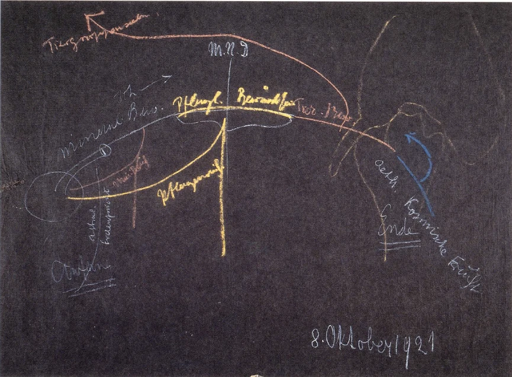
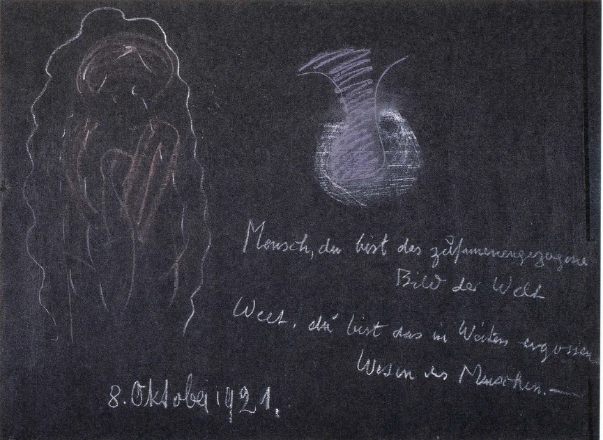

[ 1 ] ^w1ybqe

Die Betrachtung, die wir seit einiger Zeit angestellt haben, hat uns dazu geführt, die Beziehung des Menschen zur geistigen Welt ins Auge zu fassen, und diese Beziehung wiederum hat es notwendig gemacht, den Blick zu werfen auf diejenige Entwickelung, die der Mensch durchmacht zwischen dem Tod und einer neuen Geburt. An diesem Punkte wollen wir heute einsetzen. Wir haben gestern gesagt, daß der Mensch durch die Pforte des Todes trägt ein, ich nannte es mineralisches Bewußtsein. Es kann so genannt werden, weil es im wesentlichen zu seinem Inhalte hat die mineralische Welt mit ihren Gesetzen. Tingiert, also durchtränkt ist dieses Bewußtsein mit alldem, was aus den moralischen Gefühlen und Empfindungen des Menschen kommt. Mit demjenigen, was sich nun von diesen beiden Seiten her zusammensetzt, tritt der Mensch seinen Weg an durch die Welt, die er durchläuft zwischen dem Tod und einer neuen Geburt. Wenn wir das, was so der Mensch ist nach dem Tode, betrachten, so stellt sich uns das Folgende dar: Es hat sich entrungen demjenigen, was gewissermaßen wie eine Art von Schale war, dem physischen Leibe und dem ätherischen Leibe, der astralische Leib und das Ich. ^3vxkke

[ 2 ] ^th9ht8

Nun, wenn wir uns die kosmische Entwickelung der Menschheit vorstellen mit den zu ihr gehörigen kosmisch-planetarischen Körpern, dann wissen wir ja aus der Darstellung in meiner «Geheimwissenschaft im Umriß», wie diese kosmische Entwickelung in der Vergangenheit durchgeht durch die Saturnentwickelung, Sonnenentwickelung, Mondenentwickelung, und wie dann der Mensch in der Erdenentwickelung ankommt, in der er eben noch drinnensteht. Wir wissen auch, daß im wesentlichen die Saturnentwickelung den physischen Leib in seiner ersten Anlage bildet als eine Art universellen Sinnesorganes, das sich dann durch Sonnen-, Monden- und Erdenentwickelung weiterbildet. Wir wissen, daß der ätherische Leib während der Sonnenentwickelung dazukommt, der astralische Leib in der ersten Anlage während der Mondenentwickelung, und daß die Erdenentwickelung die eigentliche Ich-Entwickelung für den Menschen ist. ^rtml1b

[ 3 ] ^thl3b4

Wenn wir das Menschenwesen im ganzen auffassen, so hat es sein Ich durch die Verbindung des Menschen mit der Erde; denn durch diejenigen Kräfte, die in der Erde vorhanden sind, wird das Ich gestaltet, gebildet. Wenn wir also sagen: Der Mensch tritt durch die 'Todespforte, indem er sein Ich durch sie durchträgt -, so bringt er ja eigentlich dasjenige durch die Todespforte hindurch, was er aus seiner irdischen Entwickelung hat, was er sich also innerhalb der irdischen Entwickelung aneignet. Wir tragen geradezu durch den Tod hindurch, was der irdischen Entwickelung angehört. Während der irdischen Entwickelung ist eben zu den anderen Reichen - das können Sie wiederum aus meiner «Geheimwissenschaft» entnehmen — die mineralische Welt dazugekommen. Also das Außere, die mineralische Welt, gehört gewissermaßen mit der Ich-Entwickelung zusammen. Daß das Ich mit einem mineralischen Bewußtsein durch des Todes Pforte tritt, das hängt im wesentlichen also mit dem zusammen, was der Mensch eigentlich von der Erde hat. Nun aber ist ja die Erde nur unvollständig aufgefaßt, wenn wir sie bloß so auffassen, wie sie uns zunächst als Weltkörper entgegentritt. Die Erde ist gewissermaßen als Weltkörper ein Wesen, das sich vergleichen läßt mit einem großen Tropfen im unendlichen Meere des Raumes. Aber dieser Tropfen ist ja gerade dadurch konstituiert, daß er in sich stofflich differenziert ist, daß er Stoffe enthält von verschiedener Schwere, verschiedener Dichte. ^i7v7ob

[ 4 ] ^qgggnz

Wir brauchen nur die Metalle, die in der Erde sind, ins Auge zu fassen. Wir finden Metalle verschiedener Dichte. Was der Mensch also in sich eingegliedert erhält von der Erde mit dem mineralischen Bewußtsein, das rührt von der ganzen Erde her, das rührt einfach davon her, daß die Erde eben dieser Gesamtplanet im Kosmos ist. Das nach den verschiedenen Mineralsubstanzen hin Differenzierte, das wirkt dann so, daß der Mensch nicht nur mitnimmt durch die Pforte des Todes, was sein Ich geworden ist, sondern daß er auch für einige Zeit mitnimmt, was sein astralischer Leib war, was ja auch beschrieben ist in der «Geheimwissenschaft» und im Buch «Theosophie» als der Durchgang des Menschen durch die Seelenwelt. (Während der folgenden Ausführungen wird an die Tafel gezeichnet, Zeichnung S. 129.) So daß wir sagen können: Wenn der Mensch die Erde verläßt, dann entwickelt er das mineralische Bewußtsein. Aber dieses mineralische Bewußtsein, es wird zunächst durchdrungen von demjenigen, was der Mensch von der differenzierten Erde mitnimmt, von der Erde, insofern sie aus verschiedenen Substanzen besteht. Das bildet dann die Zeit seines Durchganges durch die Seelenwelt. Und wir können sagen: Da nimmt der Mensch etwas mit, was zunächst nicht nur sein Ich ist, das dann weitergeht, sondern was in gewisser Weise eine astralische Erdenfrucht ist. ^9rnbw4

[ 5 ] ^dz4k2a

Wenn wir dann den Menschen weiter verfolgen, wenn er diese astralische Erdenfrucht abgelegt hat in dem Sinne, wie ich das beschrieben habe in meinem Buche «Theosophie», wo gezeigt ist, wie er einige Zeit nach dem Tode seinen Durchgang durch die Seelenwelt vollendet hat, dann wandert sein Ich weiter. Aber es ist zunächst durchdrungen von mineralischem Bewußtsein. Richten wir den geistigen Blick da hinauf, wo der Mensch ist, so gewahren wir das mineralische Bewußtsein des verstorbenen Menschen, das heißt die Gedankenwelt, die sich auf das Mineralische bezieht. Und es ist in der Tat so: An demjenigen, was nun mineralisches Reich ist auf der Erde und auch im Kosmos, arbeitet mit diese von dem Menschen durch den Tod getragene Gedankenwelt. ^fq7kxl

[ 6 ] ^uzgmel

Das ist ein außerordentlich bemerkenswerter und bedeutsamer Zusammenhang. Wenn wir hier auf der Erde unsere Mineralien überschauen, wenn wir das mineralische Reich, das ja auch in den Wolken ist, denn das sind ja auch mineralische Wirkungen, überschauen und uns fragen: Was für geistige Essenzen wirken denn da drinnen? — so müssen wir uns zur Antwort geben: In diesen mineralischen Gebilden, die uns gewissermaßen, wenn wir als Menschen auf der Erde mit physischen Sinnen stehen, ihre Außenseite zeigen, in allen mineralischen Wirkungen leben die Gedanken, zu denen die Menschengedanken nach dem Tode werden. Wir können also geradezu, wenn wir verständnisvoll hinblicken auf das mineralische Reich, unseren Blick schweifen lassen über dieses mineralische Reich und können uns sagen: In der mineralischen Tätigkeit arbeitet innerlich dasjenige, was das Bewußtsein der Toten ist im Beginne ihrer überirdischen Laufbahn. — Wir müssen also das mineralische Reich nicht nur aus äußeren Gründen hier ein totes, unlebendiges Reich nennen, sondern wir müssen es auch in dem Sinne ein totes Reich nennen, als zunächst die Menschengedanken, die wesenhaften Menschengedanken, die der Mensch zu hegen hat nach dem Tode, hineinwirken in dieses mineralische Reich. ^ca7wak

 ^e821as

[ 7 ] ^yqz5er

Wenn der Mensch dann seine Wanderung fortsetzt, so kommt er ja immer mehr in die Nähe der Mitternachtsstunde des Daseins. Vorund nachher entwickelt er in dem Sinne, wie ich das gestern auseinandergesetzt habe, ein Bewußtsein, das mehr pflanzenhafter Natur ist, das also nicht das mineralische Bewußtsein ist von vorher, sondern ein Bewußtsein, das dadurch entsteht, daß die menschliche Wesenheit durchdrungen wird von den pflanzenschaffenden Kräften. Der Mensch nimmt ja etwas anderes auf aus dem außerirdischen Reiche, als die Erde als solche ihm geben kann. Der Mensch nimmt auf zu dem, was die Erde ihm geben kann, dasjenige, was eine Art höheren Bewußtseins ist, und es kann uns das dadurch anschaulich sein, daß wir sagen: Es entwickelt dann der Mensch ein pflanzliches Bewußtsein. Und während dieser Zeit arbeitet er sowohl auf der Erde wie auch im Kosmos mit an dem Pflanzenreich (siehe Zeichnung Seite 129). ^c6i3ny

[ 8 ] ^1p26sb

Das gehört zu den Geheimnissen des Daseins, daß, wenn wir die Pflanzendecke der Erde, wenn wir alles im vegetabilischen Dasein Befindliche betrachten, daß uns das dann ja natürlich auch nur die Außenseite zeigt; es hat auch eine Innenseite. Nur müssen wir natürlich die Innenseite nicht unter den Wurzeln suchen, sondern über den Blüten. Wenn wir die Pflanze uns vorstellen, die da blüht, so ist sie in dem, was sich so astralisch zur Pflanze niederneigt, was gewissermaßen astralisch lebt und seinen äußeren Ausdruck in der Pflanzendecke in dem Befruchtungsvorgange hat; das also, was nicht gesehen wird. Man möchte sagen: Die Außenseite wäre diese, wenn man die Pflanze selber rein von der Wurzel nach der Blüte anschaut, und das Innere wäre dann das, was über der Blüte ist. Wenn wir also das, was die Pflanzendecke äußerlich sinnlich ist, als eine Außenseite betrachten, so ist die Innenseite davon das Gebiet derjenigen Kräfte, welche zum Teil ihren Ausgangspunkt haben von dem Bewußtsein derjenigen Menschen, die in der Mitte zwischen dem Tod und einer neuen Geburt leben, die vor und nach der Mitternachtsstunde des Daseins leben. Also auch in der Pflanzendecke der Erde haben wir etwas zu sehen, demgegenüber wir sagen können: Es ist in seinem kosmischen Dasein etwas, was zusammenhängt mit der ganzen menschlichen Entwickelung. ^31duan

[ 9 ] ^vnagha

Wenn wir gegenüber dem mineralischen Reiche sagen können: In diesem toten Reiche leben die webenden Gedanken der Menschen, die in der ersten Hälfte, im Anfange ihrer Laufbahn zwischen dem Tod und einer neuen Geburt sind —, dann müssen wir sagen: In dem Pflanzenwachstum der Erde enthüllt sich uns auf eine äußerliche Weise, was innerlich im Weltenall lebt, so daß es auch ausmacht die Bewußtseinswelt der Menschen in der Mitte zwischen dem Tod und einer neuen Geburt. ^u46ame

[ 10 ] ^ccd7e2

Jene innigen Beziehungen zwischen dem Menschen und der Welt, von denen wir gestern gesprochen haben und die es möglich machten, daß die gestrige Betrachtung schloß mit den Worten: Welterkenntnis ist Menschenerkenntnis und Menschenerkenntnis ist Welterkenntnis — diese Beziehungen enthüllen sich da noch auf eine ganz besondere Weise. Es zeigt sich uns, daß wir tatsächlich auch schon hier auf der Erde etwas anschauen von dem, was der Mensch ist zwischen dem Tod und einer neuen Geburt. Schauen wir die Mineralien an, so enthüllen sie uns — etwa so, wie eine Art äußeren Bildes irgendeinen Vorgang enthüllt -, was Menschen innerlich bewußt tun in der Zeit, die gleich nach dem Tode folgt. Und indem wir die Pflanzenwelt anblicken, enthüllt sich das, was der Mensch innerlich tut in der Mitte seines Entwickelungsganges zwischen dem Tod und einer neuen Geburt. ^s2f8t1

[ 11 ] ^xbmaw3

Solche Dinge lassen sich für den unbefangenen Blick auch in einer gewissen äußerlichen Weise beobachten. Man wird, ich glaube, jedesmal aufs neue überrascht, wenn man die eigentümliche Natur Goethes sie ist eben nur ein hervorragendes Beispiel — betrachtet. Diese eigentümliche Natur Goethes, worin besteht sie denn? Sie besteht darin, daß Goethe zum Beispiel immer wieder und wiederum den Ansatz dazu gemacht hat, Zeichner oder Maler zu werden. Er ist niemals dazu gekommen, wirklich Zeichner oder Maler zu werden; aber was er hinterlassen hat von seiner Zeichnerei, von seiner Malerei, das frappiert in einer gewissen Beziehung durch das Treffsichere. Und wenn man dann Goethes Dichtungen, namentlich manche in dieser Beziehung außerordentlich charakteristische, ins Auge faßt, dann sagt man sich: Goethe hat zwar kein Maler werden können, aber seine Dichtungen zeigen, daß sie gewissermaßen sich ausgelebt haben wie eine verschlagene Malerei. - Goethe malt viel in seinen Dichtungen. Man könnte sagen, wenn man das zum Beispiel nach den Talenten mancher modernen Kritiker ausdrücken möchte - aber ich will nicht behaupten, daß es sehr gut ist, das zu sagen -: Goethe hat die Anlage gehabt, ein schlechter Maler zu werden, und er hat die malerischen Anlagen in die Dichtung hineingetragen und ist deshalb eine Art bloß malender Dichter geworden. ^5jdlaa

[ 12 ] ^zrbffl

Weiter kann man wiederum sagen: Etwas recht haben doch diejenigen Menschen gehabt, die manche Dichtungen Goethes, schon in einem gewissen Sinne «Iphigenie» und «Tasso», aber noch mehr «Die natürliche Tochter», marmorglatt und marmorkalt genannt haben. Goethe hat so dramatische Dichtungen gegeben, in denen eigentlich ein Bildhauer lebt, und so sind sie als dramatische Dichtungen in gewisser Beziehung nicht von jenem inneren Leben durchhaucht, von denen die Shakespearschen Dichtungen durchsetzt sind; sie sind in einer gewissen Beziehung Dichtungen, die steckengeblieben sind und die sich ausgelebt haben in gewissen plastischen Formen. Kurz, Goethe kann einem gerade vielleicht deshalb als ein besonderes Genie erscheinen, weil er eigentlich niemals richtig ganz zur Welt gekommen ist. Er ist zur Welt gekommen als Maler, ist es aber nicht geworden. Da hat er sich wiederum zurückgewandt zur Dichtung und hat in einer Dichtung, die halb malerisch ist, die Sache zum Ausdrucke gebracht. Er hat nicht vollständig die dramatische Dichtung herausgesetzt; er war dazu dichterisch veranlagt, ist aber niemals eigentlich ein wirklich dramatischer Dichter geworden, sondern ist vorher steckengeblieben, hat sich wiederum zurückgewendet und hat das in einer plastischen Weise zum Ausdrucke gebracht. Man könnte sagen, und das ist wirklich etwas, was Goethe charakterisiert, was einem kommt, wenn man ihn so recht betrachtet: Goethe ist ein Mensch, der eigentlich nie so recht geboren worden ist. - Er hat eine Farbenlehre verfaßt und war doch nicht im wirklichen Sinne ein Physiker. Er hat sich mit Naturwissenschaft befaßt, aber er hat es nicht in das vollständig Fachliche hineingebracht. Kurz, er ist eigentlich nirgends ganz in die Welt herausgetreten. Er ist nicht ordentlich zur Welt gekommen. ^t4vgfl

[ 13 ] ^zxnnb4

Man könnte sogar noch weiter gehen, könnte zum Beispiel seine Beziehungen zu den Frauen ins Auge fassen. Die haben sich gewöhnlich auch nur bis zu einem gewissen Grade entwickelt und niemals bis zu demjenigen Punkt hin, bis zu dem sie sich bei ordentlichen Weltmenschen, die so recht ins physische Leben hereingeboren werden, entwickeln. Überall könnte man das bewahrheitet finden, wenn man nur diese Dinge fühlt und empfindet, wenn man nur nicht ein Hindernis hat für das Fühlen und Empfinden solcher Dinge an dem gewöhnlichen pedantisch-philiströsen Vorstellen, das ja natürlich all das einwenden kann, was ich Ihnen nicht zu nennen brauche. Man kann ja selbstverständlich gegen die These, Goethe sei nicht ganz geboren worden, einwenden: Ja, er ist am soundsovielten in Frankfurt geboren. Nicht wahr, das kann man in allen Biographien verzeichnet finden. Aber ich mache Sie darauf aufmerksam, daß auch da die Sache wiederum einen Haken hat. Er ist nämlich halbtot zur Welt gekommen und ganz schwarz am Körper. Also auch da liegt nicht ein so robustes Hereingehen in die Welt vor, sondern eine Art halbtotes Hereinkommen in die Welt. ^5mf2jh

[ 14 ] ^fo31vb

Und wiederum, verfolgen Sie sein Leben, wie er überall nicht ankommt, zurückgeschleudert wird bis zum Erkranktsein. Alles ist so — ich möchte sagen, bis zu der Art und Weise, wie er in Weimar herumging: unnahbar in einer gewissen Beziehung —, daß man sagen kann: Er ist nicht ganz herausgetreten zur Welt. Und das rührte doch davon her, daß er besonders viel mitbekommen hat von demjenigen, was da um die Mitternachtsstunde des Daseins an pflanzlichem Bewußtsein sich entwickelt. Daher auch sein Hindrängen zur Metamorphose der Pflanzen, wo er sein Allergrößtes geleistet hat: dieses wunderbare Anschauen der Pflanzenwelt. ^onw03b

[ 15 ] ^4h8toh

Ich kann mir wirklich vorstellen, daß es etwas Groteskes hat, wenn man wie im Ernst davon spricht, Goethe sei nicht ganz zur Welt herausgetreten. Aber es gibt eben viele Leute, die sprechen lieber davon, daß die äußere Welt eine Art Maja sei im Allgemeinen, im Abstrakten. Wenn man dann aber im besonderen darauf eingeht, wie sich die einzelnen Majastufen differenzieren, dann ist es zum Beispiel durchaus eine Maja, wenn man Goethe so ganz äußerlich nimmt, wie ihn etwa Mr. Lewes oder der Professor Bielschowsky und so weiter genommen haben! So ist er ganz sicherlich nicht, sondern er ist eben ganz anders. Er ist so, daß man wirklich an ihm das Urständen merkt in diesem Gebiete, das gerade hier in der Mitte dieses Lebenslaufes des Menschen zwischen dem Tod und einer neuen Geburt liegt. ^z8uwy3

[ 16 ] ^1rzvgy

Wir kommen dann zu dem dritten Gliede in dieser Entwickelung, wo es schon zugeht der neuen Verkörperung, dem neuen Erdenleben. Da entwickelt der Mensch, wie Sie sich jetzt sehr leicht denken können, eine Art tierischen Bewußtseins (siehe Zeichnung Seite 129, rot). Er hat äußerlich ein solches Bewußtsein, wie ich es Ihnen gestern beschrieben habe, aber er arbeitet mit dem, was jetzt in seinem Bewußtsein lebt, vor allen Dingen mit in alldem auch, was sich als tierische Welt auf der Erde hier entwickelt. Nur können wir jetzt nicht gut sagen: wenn wir die Tierwelt äußerlich anschauen, dann bedeute sie uns die Außenseite; das Innere führe uns zu den Menschengedanken hinauf, die der Mensch hat, oder zu dem menschlichen Bewußtseinsinhalte hinauf, den der Mensch hat, wenn er schon im dritten Teile seines Lebenslaufes zwischen dem Tod und einer neuen Geburt ist. So können wir eigentlich nicht sagen, sondern wir können etwa so sagen: Wenn wir die tierische Welt anschauen, dann liefert uns diese tierische Welt gewissermaßen eine Art Inneres. Also: Das mineralische und das pflanzliche Reich — beim Pflanzlichen stimmt es nicht mehr so ganz, aber man kann es doch so nehmen — zeigen uns gewissermaßen die Außenseite; die Innenseite bietet uns neben anderem der Bewußtseinszustand derjenigen, die durch die Pforte des Todes gegangen sind und auf dem Wege zu einem neuen Erdenleben sind. Aber indem wir das tierische Reich ansehen, müssen wir eigentlich sagen: Das bietet uns die Innenseite, und die Außenseite sind die Gruppenseelen der Tiere, die hinaufgehen bis ins Schaffen überirdischer Hierarchien. Und da, beim tierischen Reiche, können wir jetzt nicht in den Tieren selbst das finden, was vom Menschen aus, vom menschlichen Bewußtsein aus arbeitet, sondern wir können sagen: In demjenigen, was tierische Gruppenseele ist, was da in der Gesamtheit der tierischen Gruppenseelenwelt sich entwickelt, in dem weben und leben die menschlichen Gedanken mit. In der Tat durchlebt der Mensch in dieser Zeit alle die feinen und komplizierten Konfigurationen der tierischen Gruppenseelenwelt. Das wird jetzt des Menschen Welt, diese tierische Gruppenseelenwelt. Und aus dem, was der Mensch da anschaut in der tierischen Gruppenseelenwelt, aus dem, was von da aus- und eingeht in seinem Bewußtsein, konstituiert er seine eigenen Organe. Er zieht gewissermaßen das, was er da in den Weltenweiten sieht, allmählich ganz zusammen in das tätige Anschauen seines eigenen Wesens. Aus der Summe der tierischen Gruppenseelen heraus formt sich der Mensch seinen eigenen inneren organhaft gegliederten Organismus. ^fnrqjz

 ^khme0t

[ 17 ] ^txn85r

Man möchte sagen: Der Mensch bildet da, sagen wir, die Hauptformen seines Gehirns — natürlich zunächst als Kräfte, nicht daß da solche Klumpen von Materie gebildet werden -, zunächst als Kräfte: Lunge, Herz mit Blutgefäßen und so weiter. Die einzelnen Organe bildet der Mensch aus dem ganzen Zusammenhang des tierischen Gruppenwesens heraus. Während also der Mensch eigentlich im ersten Teil seines übersinnlichen Lebensweges an der äußeren Welt baut, kommt er jetzt immer mehr und mehr in sich zurück und baut endlich aus der Gesamtheit der tierischen Gruppenseelenwelt die einzelnen Organe seines inneren Organismus auf. ^b1idg6

[ 18 ] ^yn46rp

Und dann tritt ja der Mensch im letzten Stadium seines Werdens so auf, daß er, wie ich Ihnen gestern gesagt habe, in den Bereich der planetarischen Kräfte kommt. Das ist jetzt gewissermaßen eine spätere Stufe, die der Mensch durchmacht. Nachdem er durchgemacht hat das Wirken aus und in dem tierischen Gruppenseelensystem, wird der Mensch abhängig von dem in der Außenwelt, was in den Bewegungen, in den Konstellationen der Planeten lebt. Dadurch aber wird vorbereitet des Menschen Ätherleib. Der Mensch neigt sich hin zum Wiedergeborenwerden. Sein Ätherleib wird ausgebildet. Sichtbar werden jetzt in diesem Ätherleib die Gedankengewebe, von denen ich Ihnen gesprochen habe, die dann im Menschen anzutreffen sind zwischen dem Ätherleib und dem physischen Leib. So daß der Mensch jetzt gewissermaßen einspinnt hier in seinem Organsystem das, was er mehr aus Gefühlen heraus gearbeitet hat, aus Gefühlen heraus, die aber durchaus schon durchsetzt sind von Gedanken. Da bildet er dann das Gedankengewebe herum. Dieses Gedankengewebe ist also ein Ergebnis dessen, was der Mensch aus der Wirkung der planetarischen Welt auf sein Wesen, das sich der Wiedergeburt nähert, erfahren hat. Dadurch aber wird der Mensch reif, einzutreten in die Hülle, die ihm jetzt hergegeben wird von demjenigen, was sich in der Reihenfolge der Generationen vollzieht. ^sic2y2

[ 19 ] ^va593r

Was ist denn da der Mensch, der da herunterkommt? Der Mensch, der da herunterkommt, ist so, daß er ausgegossen hat unmittelbar nach dem Tode das Gedankliche, das Mineralisch-Gedankliche, das er mitgenommen hat, in die mineralische Welt des Außeren. Dadurch, daß er die Gedanken ausgegossen hat, drängen sich allmählich Willensimpulse herauf, Gefühlsinhalte. Das alles durchsetzt ihn dann mit dem Inhalte des pflanzlichen Bewußtseins. Der Mensch kommt zuerst dazu, am Pflanzenreich der Außenwelt mitzuarbeiten, zieht sich dann in sich selbst zurück, arbeitet mit dem tierischen Bewußtsein aus der Gruppenseelenhaftigkeit der Tiere heraus und bildet sich da seine Organe, die er in gewissem Maße umgibt mit jener Hülle, die aus Gedankenstoffen gewoben ist. Das ist es, was nun hinunter will in das physische Dasein. ^ctf2zv

[ 20 ] ^o9ge5v

Wie kommt nun diese Eingliederung in das physische Dasein zustande? Nun, ich habe schon früher und auch wieder gestern darauf aufmerksam gemacht, daß man in der heutigen Wissenschaft vielfach erwartet, es werde sich einstmals ergeben, daß die Zellen eine sehr komplizierte chemische Struktur haben, so daß wir gewissermaßen die komplizierteste chemische Formel finden würden für das, was in der Zelle sich darbietet. Das ist aber ein vollständig unrichtiger Gedanke. In der Zelle, schon in der gewöhnlichen organischen Zelle ist es so (siehe Zeichnung, hell), daß das chemische Zusammenhalten darinnen nicht etwa stärker ist als in einer gewöhnlichen komplizierten chemischen Verbindung, sondern im Gegenteil: chaotisch werden die chemischen Wahlverwandtschaften gerade, und am allerchaotischsten sind sie in der befruchteten Keimzelle. Die befruchtete Keimzelle ist in bezug auf das Materielle direkt Chaos, Chaos, das zerfällt, Chaos, das wirklich zerfällt. In dieses verfallende Chaos ergießt sich das, was ich Ihnen als den Menschen geschildert habe, der sich eben in der Weise, wie ich es beschrieben habe, gebildet hat (lila). Und nicht durch den Keim selber, sondern durch die Prozesse, die im mütterlichen Leibe zwischen dem Embryo und der Umgebung vor sich gehen, bildet sich dann das eigentlich Physische aus. Es wird also tatsächlich dasjenige, was da aus der geistigen Welt herunterkommt, in das Leere hineingelegt und nur durchtränkt mit mineralischer Substanz. Es ist, wie Sie sehen können, ein durchaus durchsichtiger Vorgang, der hier geschildert wird. ^llhkde

[ 21 ] ^vlsyyy

Das tierische Bewußtsein können wir nicht so sehen, daß es zurückwirkt, sondern wir müssen sagen, es wirkt hinauf in das Gruppenseelenhafte, in die Tiergruppenseelen (siehe Zeichnung Seite 129, roter Pfeil). Und dann, wenn der Mensch angekommen ist im planetarischen Bereich, dann bildet er den Menschen selber aus und gliedert sich in dieser Weise ein in das, was ihm Platz macht, wie ich eben davon gesprochen habe. ^h4gx34

[ 22 ] ^w8nj4u

Wenn Sie aber jetzt den Anfang und das Ende des Lebensweges zwischen dem Tod und einer neuen Geburt ins Auge fassen, dann werden Sie sich sagen müssen: Da tritt etwas auf, was durchaus aufeinander bezogen werden kann. In dem, was wir nennen können den Durchgang der Menschenseele durch die Seelenwelt nach dem Tode, tritt etwas auf, was noch auf das Irdische einen Bezug hat, was den Menschen zurück weist auf das Irdische. Wir wissen ja, daß der Mensch da zurücklaufend in ungefähr einem Drittel seines Lebenslaufes sein Erdenleben durchwandert, durchwandert eben in der Weise, wie ich Ihnen das beschrieben habe. Gewissermaßen das polarisch Entgegengesetzte ist das, was dann der Mensch im Durchgang durch das Planetensystem vor der Geburt erlebt. Es teilt sich ihm da als Mensch etwas mit, was er noch aus den Himmeln mit auf die Erde bringt. Geradeso wie er für die Seelenwelt noch etwas hinausträgt, was in seinem astralischen Leibe ist, wodurch er in einer Rückwärtswanderung sein Erdenleben durchlebt, so bringt der Mensch etwas mit sich aus dem Kosmos, was dann seinen ätherischen Leib durchsetzt, was jetzt ebenso etwas zu tun hat mit seinem ätherischen Leibe, wie das, was ich genannt habe die astralische Erdenfrucht mit seinem astralischen Leibe. Mit seinem ätherischen Leib hat das, was er sich aus dem Kosmos bringt, zu tun, ebenso wie das, was er als die astralische Erdenfrucht hinausträgt, mit seinem astralischen Leibe zu tun hat. ^05thq3

[ 23 ] ^5w9xlw

Ich kann also sagen: Der Mensch bringt sich aus dem Kosmos herein die ätherische kosmische Frucht. Diese ätherische kosmische Frucht, die sich da der Mensch hereinbringt, die lebt tatsächlich in seinem ätherischen Leibe weiter. Der Mensch hat von der ersten Stunde, von dem ersten Augenblicke seiner Geburt an in seinem Ätherleibe etwas wie eine kosmische Stoßkraft nach vorwärts, die durchwirkt durch das ganze Leben. Mit dieser kosmischen Stoßkraft verbindet sich das, was als die karmischen Tendenzen zurückgeblieben ist. In dieser kosmischen Stoßkraft wirken die karmischen Tendenzen. ^98hlmb

[ 24 ] ^51wfeb

Man kann also in gewissem Sinne sagen: Man ist selbst imstande, ganz anschaulich darauf hinzuweisen, wie das Karma sich zum wirklichen Menschen verhält. Während wir uns sagen, der Mensch hat ein präexistentes Leben, er kommt herein aus geistigen Höhen in das physisch-irdische Dasein, gliedert sich seinem physischen Leib, Ätherleib ein mit seinem Ich und seinem astralischen Leib -, kann man sagen, daß sein Karma, das er mitbringt aus dem früheren Erdenleben, sich eingliedert in diejenige ätherische Stoßkraft, die er mit hereinnimmt aus den Wirkungen des planetarischen Systems, die vorangehen seiner Erdeneingliederung. ^j2bswp

[ 25 ] ^1snjrx

Und nun, ich möchte sagen, jetzt können Sie fast mit Händen greifen, wie man aus den planetarischen Beziehungen das, was im Menschen drängt und stößt, wenn man es sachgemäß macht, herausrechnen kann. In dieser Weise kann man intim in all das hineinschauen, was im Menschen so wirkt, daß es aus seinem physisch-sinnlichen Wirken in die geistig-seelische Welt hinausgeht und daß es von ihm aus der geistig-seelischen Welt hereingetragen wird und sich wiederum in sein physisch-leibliches Erdendasein gewissermaßen einhüllt und in demselben wirkt. Man kann diese Dinge durchaus im einzelnen angeben. ^9wp004

[ 26 ] ^qa3rqy

Der Mensch kann sich erfüllen mit solchen Vorstellungen, wie sie durch diese Erkenntnisse kommen, und er wird sich dann sagen: Ich trete als physische Menschengestalt in dieses irdische Dasein, bin scheinbar abgeschlossen von der übrigen Welt. Diese Bewußtheit des Abgeschlossenwerdens, sie wird mir gegeben da, wo sich mein Übersinnliches hineinlegt in das Lager, das ihm zubereitet wird vom irdisch-physischen Dasein aus. Aber indem ich mich in diese Hülle eingliedere, wachse ich immer mehr und mehr wiederum in den Kosmos hinein durch mein Wahrnehmen, durch meine Erfahrungen. Und ich wachse insbesondere hinein, wenn ich mir solche Vorstellungen bilde vom Zusammenhang des Menschen mit der Welt. ^2msymr

[ 27 ] ^man23k

So lernt der Mensch, gerade durch anthroposophische Geisteswissenschaft, sich als eins zu fühlen mit dem Weltenall. Er fühlt die Welt in sich, sich in der Welt. Er fühlt das Leben des Makrokosmos pulsieren in seinem eigenen Inneren, und er empfindet, wie das, was er im Inneren erlebt, wiederum hinauspulst in den ganzen Kosmos. Das Atmen wird ihm nur ein Symbolum für ein umfassendes Dasein: Die eingezogene Atemluft nimmt die Gestalt des menschlichen Leibes an, wird Innenleben; die den Organismus verlassende Atemluft zerstreut sich wieder in die Welt. So ist es aber auch mit dem Geistig-Seelischen: Der ganze Kosmos wird gewissermaßen geistig-seelisch eingeatmet, wird zum Menschen; das, was da im Menschen wird, wird wiederum geistig-seelisch ausgeatmet und zerstreut sich im Kosmos, bis es gewissermaßen an der Peripherie des Kosmos ankommt, um wiederum zurückzukommen und den Menschen zu bilden. Man kann schon im Menschen das Abbild der Welt sehen, und in der Welt das fein aufgelöste menschliche Wesen. So daß man eine umfassende Welt- und Menschenkenntnis zusammenfassen kann in die beiden Sätze: ^pmfu0r

[ 28 ] ^4y8ihx

Der Mensch soll sich, damit die Zukunft für ihn eine Aufgangs-, nicht eine Niedergangsentwickelung ist, ein solches Bewußtsein aneignen, das wirklich seine Wesenheit mit dem Kosmos zusammen schließt. ^zb4ysv

[ 29 ] ^0zfj7s

Morgen wollen wir davon weiter sprechen. ^9ybn0e