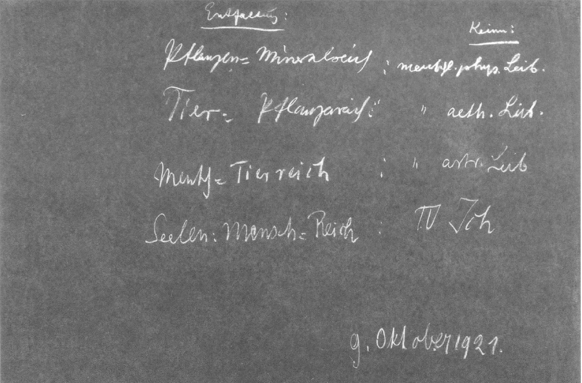
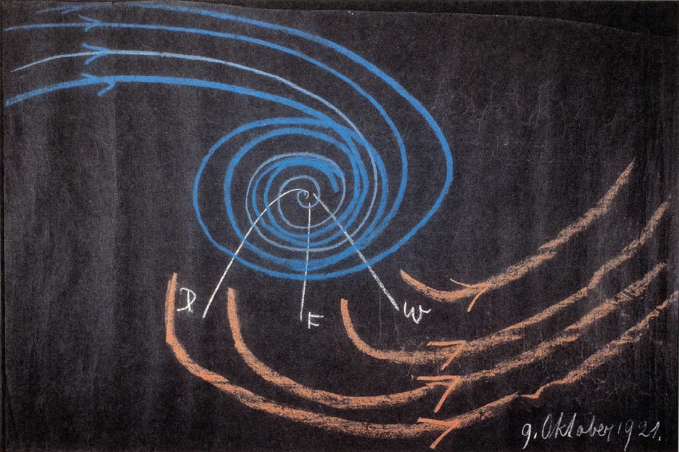

[ 1 ] ^zzvd3g

Wir haben gesprochen von der seelischen und geistigen Entwickelung des Menschen. Indem wir die geistige Entwickelung ins Auge gefaßt haben, mußten wir hinweisen auf die Art, wie diese geistige Entwickelung des Menschen, also das, was in ihm geistig wirksam ist, heraus entsteht aus seinem Zusammenarbeiten mit den Wesen der höheren Hierarchien der über ihm stehenden Reiche. Und wenn wir uns wiederum fragen nach der besonderen Artung dieser höheren Wesen, so werden wir verwiesen auf die Vergangenheit des Kosmos. Wir wissen ja aus meiner «Geheimwissenschaft im Umriß», wie zum Beispiel die Wesen, die wir in das Reich der Angeloi einreihen, während der alten Mondenentwickelung die Menschheitsstufe durchgemacht haben, wie die Archangeloi ihre Menschheitsstufe während der alten Sonnenentwickelung durchgemacht haben, die Archai während der alten Saturnentwickelung. Kurz, wenn wir in der Art, wie wir heute, wo wir den Menschen vor uns haben, etwas verstehen können vom Kosmos, wenn wir in der Art verstehen wollen diese höheren Reiche, dann müssen wir auf weitvergangene Zeiten zurückblicken. Wir können also auch sagen: Wollen wir das Wesen des Menschen als Geist verstehen, dann blicken wir hinauf zu der heutigen Entwickelungsstufe von Wesenheiten, die in weit zurückliegenden Zeiten auf ihre besondere Art durchgemacht haben, was heute der Mensch während des Erdendaseins durchmacht. Wir müssen also auf die Vergangenheit höherer Wesenheiten blicken, wenn wir die geistige Entfaltung des Menschen ins Auge fassen. ^6kqckn

[ 2 ] ^98dtzb

Wir haben auch die seelische Entfaltung vor unser geistiges Auge hingestellt und wir haben gefunden, daß diese seelische Entwickelung nach Denken, Fühlen, Wollen gewissermaßen in den Zwischenräumen zwischen Ich, astralischem Leib, Ätherleib und physischem Leib sich abspielt. ^22shco

[ 3 ] ^xtqioh

Nun ist ja gar kein Zweifel: Das, was des Menschen Seelenleben ausmacht, ist Gegenwart. Wir entwickeln unsere Seele heran an demjenigen, was wir aus den Tiefen unseres Wesens herausholen, was sich da zwischen den vier Gliedern der Menschheit für das Denken, Fühlen und Wollen entwickelt. Wir nehmen äußere Eindrücke auf, verarbeiten sie, nehmen vielfach selber teil an dieser Verarbeitung in der unmittelbaren Gegenwart. Kurz, wir können sagen: Wenn wir das seelische Leben des Menschen ins Auge fassen, so müssen wir das geistig-seelisch-physische Weben in der Gegenwart zu unserem Verständnisse bringen. Wie ist es nun, wenn wir des Menschen physischen Leib, ätherischen Leib - Bildekräfteleib, astralischen Leib und sein Ich nun selbst ins Auge fassen? Diesen physischen Leib, ihn trägt der Mensch von der Geburt oder vom Embryonalleben an bis zum Tode an sich. Indem er ihn im Tode abstößt, kann dieser physische Leib seine Form nicht bewahren. Er hat nur die Möglichkeit, seine Form, seine Gestaltung, sein ganzes Wesen zu bewahren, wenn des Menschen Seele und Geist ihn durchdringen. Die Kräfte, die außen in der irdisch-physischen Natur wirken, sie zerstören ihn, die einen schneller, die anderen langsamer, aber sie zerstören ihn. Dieser physische Leib zerfällt, weil er innerhalb der Kräfte, die die Erde zusammensetzen im mineralischen, tierischen, pflanzlichen Reich, nicht bestehen kann. Dieser physische Leib, er ist also eigentlich nur da vermöge der besonderen Gestaltung, die aus den höheren Reichen, aus den geistigen Reichen heraus der menschliche Geist ihm gibt. Er ist nur da vermöge der Prozesse, die die menschliche Seele im Denken, Fühlen, Wollen mit ihm vornimmt. Dieser physische Leib hat keine Existenzmöglichkeit, wenn er sich in dem physischen Erdendasein allein befindet. Bevor der Mensch in das Embryonalleben kommt, nachdem er durch den Tod gegangen ist, hat alles das, was an Kräften in diesen physischen Leib hereinwirkt, innerhalb der Erde kein Heimatrecht. Nur während des menschlichen physischen Erdenlebens bildet sich die Gestalt dieses physischen Leibes, spielen sich die entsprechenden Prozesse in diesem physischen Leibe ab, wächst dieser physische Leib, verwelkt und so weiter. Er gehört dem Menschen an, nicht aber der Erde. Das ergibt eine ganz gewöhnliche Überlegung. In dem Augenblicke nun, wo wir mit der Geisteswissenschaft an diese physische Welt herankommen, finden wir zwar, daß das richtig ist, daß der physische Leib in der Erde keinen Bestand hat; aber was ihn zusammenfügt, das hat ja im bewußten Leben des Menschen auch nicht eigentlich Bestand. Es bleibt ja völlig unterbewußt. Es ist aber doch ein innerlich Bildhaftes, und wir können es erfassen, wenn wir das imaginative Bewußtsein entwickeln. Dann entwickeln wir gewissermaßen das innerlich Bildhafte dieses physischen Leibes. Und was wir da als innerlich Bildhaftes schauen, das widersteht den Kräften, denen die Stoffe des physischen Leibes mit ihren Kräften nicht gewachsen sind. ^7gg2xb

[ 4 ] ^kael8q

Dieses innerlich Bildhafte, das verfällt nicht den Erdenprozessen. Dieses innerlich Bildhafte kann wenigstens bestehen und auch, wenn die Erde einmal nicht mehr da sein wird, hinausgetragen werden zu kommenden Entwickelungsstufen der Erde. Dann wird sich aus diesem physischen Menschenleib etwas bilden, was wir ein Naturreich der Zukunft nennen können, das jetzt eben noch gar nicht da ist - ein Naturreich der Zukunft. Aus dem, was heute erst Bild ist, wird ein Naturreich der Zukunft entstehen, ein Reich, das seinem Wesen nach in einer gewissen Beziehung mitten drinnenstehen wird zwischen unserem heutigen Mineralreich, das wie tot auf der Erde daliegt, und dem Pflanzenreich, das sich in dieses tote Mineralreich hineinsenkt, es belebt, Leben entwickelnd. ^a9q28s

[ 5 ] ^9c6jpx

Denken Sie sich einmal die mineralische Welt, in welche die Pflanzenwelt eingesenkt ist, teilnehmend an dem Leben, nicht bloß als tote Erde daliegend und die Stoffe durch die Wurzeln und durch die Luft der Pflanze beibringend, sondern denken Sie sich das, in was da die Pflanze eingesenkt ist, selber lebend: eine ganze lebende Erde, die nicht das tote Mineralreich hat und eine pflanzliche Welt, die nun nicht bloß Leben hineinsenken kann in dieses Mineralreich, sondern die im lebenden Mineralreich selber drinnen lebt, ein lebendes Mineralreich, eine künftige Verwandlungsstufe unserer Erde - in meiner «Geheimwissenschaft» nenne ich sie die Jupiterstufe -, ein künftiges, lebendes Mineralreich, aber dieses Mineralreich so lebend, daß es sich zur Pflanze formt, daß gewissermaßen das, was jetzt bloß stofflich als chemische Prozesse in das Pflanzenreich untertaucht, daß das selber lebendige chemische Prozesse sein werden, so daß das pflanzliche Leben und die mineralische Gestaltung eines ist. Das ist es, was als späteres, ich möchte sagen, Pflanzenreich im menschlichen physischen Leib von heute seinen Keim hat. Der menschliche physische Leib von heute ist der Keim eines zukünftigen Reiches, eines zukünftigen Naturreiches. ^m1s2gk

[ 6 ] ^zpizjh

Und betrachten wir den heutigen Ätherleib des Menschen. Er bleibt unbewußt während des Lebens zwischen Geburt und Tod; aber er ist tätig. Er ist ja im Grunde genommen das, was uns einpflanzt das eigentliche Leben. Er ist das uns Belebende. Er ist das, was die Kräfte des Wachstums, auch der Ernährung enthält. Er bleibt im Unterbewußten. Seine wahre Gestalt können wir ja gar nicht wahrnehmen. Aber diese wahre Gestalt, wir nehmen sie wahr für kurze Zeit, nachdem wir durch des Todes Pforte gegangen sind. Da schauen wir zurück auf eine Bilderwelt, die also eine Welt webender Gedanken ist. Diese Bilderwelt ist die wahre Gestalt des ätherischen Leibes. Während wir beim physischen Leib durch das imaginative Bewußtsein Bilder wahrnehmen, welche uns verbürgen, daß im physischen Leibe der Keim liegt für ein späteres Pflanzen-Mineralreich, bietet uns im rein natürlichen Verlauf der Entwickelung der ätherische Leib des Menschen nach dem Tode selber diese Bilder dar. Diese Bilder haben aber im gegenwärtigen Erdendasein wiederum keinen Bestand. Was in uns die Kräfte des Wachstums, die Kräfte der Ernährung sind, das also, was unser ätherisches, unser vitales Dasein bewirkt, das hat keinen Bestand innerhalb des Irdischen. Wenige Tage, nachdem wir durch des Todes Pforte gegangen sind, lösen sich diese Bilder auf; und wir treten ein in eine zukünftige Lebensentwickelung, innerhalb welcher wir diese Bilder als solche, als Bild-Ätherleib, als Bildekräfteleib nicht haben. Sie lösen sich auf im ätherischen Kosmos, wie sich der physische Leib in den Kräften des Erdendaseins auflöst. Wieder aber zeigt dieses Bilddasein des ätherischen Leibes durch seine eigene Wesenheit, daß wir in ihm etwas haben, was keimhaft ist, was zwar jetzt verschwindet wie der Keim der Pflanze, den wir in die Erde senken, aber der dann als Pflanze, als gestaltete Pflanze aufgeht. So nimmt der Kosmos, gleichsam unseren Ätherleib auflösend bis ins Unendliche, unseren Ätherleib auf. Aber alles das, was so im Kosmos aus menschlichen Ätherleibern gewoben wird, wird in ihm zu Kräften eines zukünftigen Jupiter-Naturreiches, eines Pflanzen-Tierreiches, eines Tier-Pflanzenreiches. Und die Beobachtungen bieten uns eine Gewähr, daß der menschliche ätherische Leib der Keim dieses zukünftigen Reiches ist, eines Reiches, das zwischen der Pflanzen- und der Tierwelt mitten drinnensteht. ^mfl77o

[ 7 ] ^tieko5

Wir denken uns die heutige Pflanzenwelt, welche nur Leben entwickelt, die keine Empfindungen entwickelt. Wir denken uns aber, daß in einer Substantialität, die der heutigen Pflanzenwelt ähnlich ist, aber durchsetzt mit Empfindungsfähigkeit, sich ein Tier-Pflanzenreich, ein Pflanzen-Tierreich entwickelt, welches gewissermaßen die zukünftige Erde oder den Jupiterplaneten umweben wird. Die Empfindung wird nicht so sein, wie die Empfindung der heutigen Tiere, die sich auf die Wahrnehmungen des Irdischen beschränken, die Empfindung wird sein eine kosmische Empfindung, ein Wahrnehmen der den Jupiter umgebenden Vorgänge. ^m8m12l

[ 8 ] ^2ldydh

Wir haben also hier in dem ätherischen Leibe den Keim für ein zukünftiges Reich, für ein Tier-Pflanzenreich. Gewissermaßen wird abschmelzen — und das wird ja den Untergang des Irdischen bilden — das, was heute draußen ausgebreitet ist als mineralisches Reich. Dagegen wird aus demjenigen, was scheinbar sich ganz auflöst in den irdischen Kräften, aus den menschlichen physischen Leibern, als Keim ein künftiger Weltenplanet mit seinem untersten Reiche, mit einem Mineral-Pflanzenreiche entstehen. Aus demjenigen, was sich nach dem Tode wie zerstreut, wird sich konsolidieren ein zweites Reich dieses künftigen Weltenplaneten, ein Tier-Pflanzenreich, das ihn umweben wird wie eine Art lebendiger Ätherizität. ^u2v7ic

[ 9 ] ^n9t4oi

Und der menschliche astralische Leib: Wir wissen, daß der Mensch ja durchmacht durch längere Zeit, wenn er durch die Pforte des Todes getreten ist, das, was ich beschrieben habe in meinem Buche «Theosophie» als den Gang durch die Seelenwelt. Ich habe dort beschrieben, wie die Umwandlungen des menschlichen Erlebens in dieser Seelenwelt nach dem Tode sich abspielen, wie der Mensch durch gewisse Zustände durchgeht, die ich Begierdenglut, fließenden Reiz und so weiter genannt habe. Aber all das, was da von dem Menschen durchgemacht wird, wenn es auch längere Zeit währt, es ist auch etwas, was man als sich auflösend empfinden kann, was man sogar als verschwindend empfinden kann. Lesen Sie nur die letzten Seiten dieser Beschreibung, die da handelt von des Menschen Durchgang durch die Seelenwelt nach dem Tode, und Sie werden aus der Art und Weise, wie dort geschildert ist, dieses Gefühl bekommen, wie, ich möchte sagen, hinschwindet in die Welt, was da der Mensch als astralischen Leib in sich getragen hat, wie es gewissermaßen so hinschwindet, wie wenn finstere Wolken in einem allgemeinen Lichtmeere von diesem Lichtmeere aufgezehrt würden. Ich habe ganz absichtlich dort in meiner «TheosoPhie» die Schilderung stilistisch so gestaltet, daß man etwas fühlen und empfinden kann von diesem Sich-Auflösen, wie wenn Finsternis in dem Lichte sich auflösen würde, wie wenn das Tote vom Leben verzehrt würde. Fühlen Sie an der Schilderung des Endes dieses Durchganges durch die menschliche Seelenwelt nach dem Tode, wie das ist, dann werden Sie sagen: Wenn so geschildert wird dieser Durchgang durch die Seelenwelt, dann haben wir ja auch etwas geschildert in ähnlicher Weise, wie der Imagination die Bilder des physischen Leibes vor dem geistigen Auge stehen, wie dem Menschen gleich nach dem Tode der ätherische Leib vor dem Seelenauge steht. ^8m7ok4

[ 10 ] ^muicua

Wir haben in dieser Schilderung, die in meinem Buche «Theosophie» gegeben wird, wenn wir sie recht lebendig machen, geradezu etwas, was seiner Wesenheit nach wiederum sich als Keim für Zukünftiges entpuppt. Aber es löst sich vom Menschen los, wie sich die anderen Glieder der menschlichen Natur von ihm loslösen. Der physische Leib löst sich los, wird Keim für ein Pflanzen-Mineralreich. Der ätherische Leib löst sich los, wird Keim für ein Tier-Pflanzenreich. Der menschliche astralische Leib wird gewissermaßen aufgesogen von der allgemeinen Weltumgebung, und er wird Keim für ein MenschenTierreich, für ein Reich, welches das höhere Tierische, das heute da ist, um eine Stufe hinaufgehoben hat, wie wenn sich die Tiere nicht bloß in Empfindungen bewegten, wie sie sich heute bewegen, sondern in Gedanken bewegten, und auch, obwohl auf eine mehr automatische Art als das beim heutigen Menschen der Fall ist, aber doch in einer gewissen Weise vernünftige Handlungen ausführend: ein MenschenTierreich, das wir uns so vorzustellen haben, daß vernünftige, von innen heraus tätig erfüllte Handlungen vollbracht werden, die aber doch wiederum nicht so verlaufen wie beim Menschen heute, wo die vernünftige Handlung aus dem Zentrum seines Ich-Wesens heraus kommt. Das werden sie nicht; sie werden schon mehr einen, ich möchte sagen, eben wiederum automatenhaften Charakter haben; aber sie werden nicht so sein wie die Handlungen des heutigen Tierreiches, bloß aus Instinkten hervorgehend. Sie werden gewissermaßen vom Tiere ausgeführte Handlungen einer großen Jupitervernunft sein, und das einzelne Tier wird hineingestellt sein in diese Jupitervernunft. ^3zzwkx

[ 11 ] ^gens2j

Nun bleibt uns dann noch das menschliche Reich als solches. Verfolgen Sie wiederum in meiner «Theosophie», wie da dieses menschliche Reich, das nach Abstreifen des astralischen Leibes in die Geisterwelt aufsteigt, wie das in der Geisterwelt innere Erlebnisse hat, die aber dort durchaus so beschrieben werden können, daß die Beschreibungen Bilder einer geistigen Außenwelt sind. Ich habe, um das zu erreichen, geschildert, wie dort in dem Geisterlande durchaus etwas durchlebt wird wie ein Kontinentalgebiet des Geisterlandes, etwas wie ein Meeresgebiet, etwas wie ein Luftgebiet. In alldem, was da von mir geschildert worden ist in diesem Geisterland, haben Sie etwas, was Bilder sind von einer Welt, die heute für das Irdische nicht da ist. Die heutige irdische Umgebung ist anders. Aber dennoch, will man die Dinge wirklich so schildern, wie sie der Wahrheit gemäß geschildert werden sollen, dann muß man dies tun, indem man an die großen Zusammenfassungen des Erdenplaneten sich anlehnt: indem man, was sich hier als kontinentale Gebiete zusammenschließt, auch in diesem seinem Zusammenschlusse anwendet auf das, was man da im Geisterland findet; ebenso indem man das Meeresgebiet zusammenfaßt. Was dort als Kontinentalland, als Meeresgebiet, als Luftgebiet, als Wärmegebiet geschildert ist, es ist so geschildert, daß es zu gleicher Zeit durchsetzt ist von demjenigen, was der Mensch als Moralisches durch die Pforte des Todes trägt. Es ist so geschildert, daß die moralisch-geistige Welt dort unmittelbar in sich auch das äußerlich Substantielle hat, daß das Moralische da ein Schattenriß ist, aber es noch nicht bringt bis zum Schaffen eines Himmelskörpers, eines Planeten. Aber das, was da des Menschen Ich durchlebt, es ist der Keim dieser Verteilungskategorien, dieser Zusammenhänge im großen für den künftigen Jupiterplaneten. Wir haben also in dem menschlichen Ich von heute den Keim für das, was dann die große Verteilung sein wird, das Zusammenleben in Gebieten, die dann anders aussehen werden, aber die in ähnlicher Weise behandelt werden können wie heute die Kontinentalgebiete, Meeresgebiete und so weiter. Wir haben da etwas, was wir aber nun, um es zu charakterisieren, um dafür eine Idee, einen Begriff zu bekommen, auch in anderer Weise wiederum zusammenfassen müssen. ^9hqwc2

[ 12 ] ^guna20

Wir müssen etwa so sagen: In diesem Weben im Geisterland, das ich in dem Buche «Theosophie» beschrieben habe, da sieht man ja sofort: man hat es nicht mit dem einzelnen Menschen zu tun. Es gliedern sich gleich, wie Sie sehen, schon in dem zweiten Gebiete, in dem Meeresgebiete, die Menschen wie zu Menschenzusammenhängen, Menschengruppen zusammen: etwas Übermenschliches entsteht. Das Ich wird höher hinaufgehoben. Das Ich vereint sich mit anderen Ichen in Menschengruppen. Lesen Sie das doch nach in der Beschreibung des Geisterlandes: es ist etwas, was man nur beschreiben kann als ein Reich, das über dem Menschenreiche steht. Und in ein solches Reich wird der Mensch dann während des Jupiterdaseins eintreten. Es kann nicht dadurch beschrieben werden, daß ich etwa sage: ein «Engel-Menschenreich»; das würde die Sache nicht genau treffen, weil, wenn ich Angeloi charakterisiere, so ist das ein Begriff für die Gegenwart, der dadurch charakterisiert ist, daß die Angeloi während der Mondenzeit Menschen waren. Wenn ich also das, was sich da entwickeln wird während des zukünftigen Erdendaseins oder Jupiterdaseins, charakterisieren will, so müßte ich schon so sprechen, daß ich sage: Es ist der Mensch in eine höhere Sphäre gehoben; es ist der Mensch in seiner äußeren Offenbarung, in seiner leiblichen Offenbarung so geworden, daß er das, was heute tief im Inneren lebt, was heute seelisch nur lebt, nach außen offenbart. Wie er heute, ich möchte sagen, auf geheimnisvolle Art sein Inneres im Inkarnat, in der Fleischfarbe offenbart, so wird er in der Zukunft sein Inneres, ob er gut oder böse ist, in seiner äußeren Konfiguration offenbaren. Heute kann man nur andeutungsweise der Menschengestalt entnehmen, ob irgend jemand ein Pedant ist, oder ein bissiger Mensch, oder ein grausamer Mensch, oder ein gefräßiger Mensch. Gewisse moralische Qualitäten, sie drücken sich heute auf leise Weise ab in der Physiognomie oder im Gange oder in sonstiger äußerer Gestaltung, aber immer so, daß sie auch geleugnet werden können, daß man sozusagen sich darauf berufen kann, man könne nichts dafür, daß man die gerade just auf Gefräßigkeit hindeutenden Lippen oder ein auf Gefräßigkeit deutendes Unterantlitz erhalten hat. Aber wie man heute sozusagen sich herausreden kann in bezug auf dieses äußere Auftreten des Seelischen, so wird das in der Zukunft ganz und gar nicht möglich sein. Menschen, die festhalten am Materiellen, werden das dann deutlich ausdrücken in ihrer Gestalt: sie werden ahrimanische Formen annehmen. Man wird in dieser Zukunft deutlich unterscheiden zwischen ahrimanischen Gestalten und luziferischen Gestalten. Für diese luziferischen Gestalten haben ja eine gute Anlage eine große Anzahl von Mitgliedern verschiedener theosophischer Gesellschaften, die immer schwärmen in höheren Regionen. Es werden auch Gestalten da sein, die den Ausgleich bilden. Die schwärmerischen Mystiker, sie werden die luziferischen Gestaltungen annehmen. Das aber, was angestrebt werden soll durch das Innewohnen des Christus, ist der Ausgleich. Kurz, als Entfaltung dessen, was heute Ich-Keim ist, werden wir haben das Seelen-Menschenreich. ^bsvyhh

 ^zlb58m

[ 13 ] ^3purq5

Was wir da in unserem Ich in uns tragen: Ein Mensch, der ganz tragisch gelitten hat an der Verfallszivilisation des 19. Jahrhunderts, Nietzsche, er hat gefühlt, daß eigentlich dieses Ich sich entringen muß, um seine Zukunft zu retten, demjenigen, was heute schon im Verfall drinnen ist. Er hat, weil die ganze Idee abstrakt geblieben ist, das abstrakte Wort «Übermensch» gewählt. Aber es ist ein unbestimmter dunkler Drang, auszudrücken, was im Ich nicht bloß fertig ist, sondern was im Ich keimhaft ist und als Keim hinweisen muß auf künftige kosmische Gestaltungen. ^0ox656

[ 14 ] ^q7iqcx

Nietzsche hat das ja wiederholt schön ausgedrückt, indem er sagte: Der Mensch ist im Grunde genommen etwas, was aus dem Wurm geworden ist. Aber wie der Mensch aus dem Wurm geworden ist, so wird der Übermensch aus dem Menschen werden. — Er stellt sich dadurch mit einem dunklen Gefühl hinein in etwas, was zur Klarheit zu bringen eigentlich unsere Zeit als Aufgabe hat, wenn sie nicht im Finstern einer Verfallskultur und Verfallszivilisation herumtappen will. ^o5zg4w

[ 15 ] ^66s5n7

Es ist durchaus begreiflich, daß Nietzsche, der nur tragisch gelitten hat an unserer rein intellektualistischen Kultur, diesen intellektualistischen Begriff des Übermenschen, der eigentlich im Grunde genommen keinen Inhalt hat, aus dem, was man eben haben konnte in der intellektualistischen Kultur, herausdestilliert hat. Nietzsche ist ja auch nicht zu einem wirklichen Begreifen des Christus gekommen. Und es hat sich ihm das Eigentümliche ergeben, daß er aus diesem Drange des IchKeimes heraus, und wiederum aus der Notwendigkeit, stehenzubleiben innerhalb der intellektualistischen Kultur, nun nicht zu einem Anbeter des Christus, sondern zu einem Anbeter des Antichrist, geradezu zu einem Verehrer und Glorifizierer des Antichrist geworden ist. Das Antichristentum ist in Nietzsche genial zutage getreten. Aber dieses Antichristentum würde, wenn es das bleiben sollte, was es ist, nichts anderes vollziehen können, als den Menschen dazu zu veranlassen, zu träumen von einem abstrakten Übermenschen, aber sich zu gleicher Zeit die Gewißheit einzupflanzen, daß dieser abstrakte Übermensch mit dem Erdendasein stirbt. Nietzsche wollte noch krampfhaft festhalten an der Entwickelungsidee. Aber auch dieses krampfhafte Festhalten half ihm nichts. Er kam aus den Abstraktionen des Intellektualismus nur zu einer «Wiederholung des Gleichen», so daß sich später nicht höhere Stufen ergeben würden, sondern immer nur die Wiederholung des Gleichen, die aber auch, wie gesagt, krampfhaft nur da ist, um die Entwickelungsidee festzuhalten. ^f57yo1

[ 16 ] ^cs1ike

So haben wir also des Menschen Geistiges, des Menschen Seelisches, des Menschen Leibliches betrachtet. Wenn wir des Menschen Geistiges betrachten, so erscheint es uns heute eben als der dem Menschen maßgebende Geist. Und insofern wir als Menschengeist diesen Geist betrachten, erscheint er uns nicht sehr differenziert. Er trägt in sich gewisse, ich möchte sagen, Färbungen, aber er erscheint uns als ein Einheitliches. Betrachten wir diesen Menschengeist in seinem Weltenzusammenhange, dann brauchen wir dazu Geisteswissenschaft. Wenn wir nicht zur Geisteswissenschaft kommen, dann strahlt man einfach diesen indifferenzierten, einheitlichen, unbestimmten Menschengeist in die Welt hinaus und es entsteht der verwaschene Pantheismus. Wenn man aber mit Geisteswissenschaft diesen Menschengeist erkennen lernen will, dann dringt man ein in die Welt der im gegenseitigen Verhältnisse und im Verhältnisse zum Menschen stehenden höheren geistigen Reiche. Was wir in unserem Geist haben, es wird erst konkret eingesenkt in eine Welt, wenn wir es konkret eingesenkt finden in die Welt der höheren Hierarchien. Was wir fluktuierend als unser Seelenleben, differenziert in Denken, Fühlen und Wollen haben, wir können es erst erkennen lernen, wenn wir es gewissermaßen in den Zwischenstufen zwischen den Leibesgliedern des Menschen suchen: wie da das Denken webt zwischen dem physischen Leib und dem ätherischen Leib, gewissermaßen den Verkehr dieser beiden Leiber vermittelnd, wie da das Fühlen webt zwischen dem ätherischen und dem astralischen Leib, das Durcheinanderatmen von ätherischem Leib und astralischem Leib vermittelnd. Und wenn wir das Wollensleben kennenlernen wollen, dann müssen wir das Ineinanderkraften von Ich und astralischem Leib beobachten und gewissermaßen in dem Wechselspiel, das sich zwischen beiden entwickelt, das Willensleben studieren. Dann haben wir des Menschen Gegenwart, sein seelisches Leben. ^3l0qra

[ 17 ] ^xqszki

Und wenn wir nun hinuntersteigen zu des Menschen Leiblichkeit, dann erscheint uns zunächst dieses Leibliche so, als ob es eigentlich für das Nichts bestimmt wäre. Der physische Leib, der für den Menschen diese große Bedeutung hat, während er auf der Erde lebt, er scheint gegenüber den einzelnen Gesetzmäßigkeiten ein Nichts zu sein, denn er löst sich in ihnen auf. Sie zerstören ihn. Der ätherische Leib, er wird noch, ich möchte sagen, erhalten kurze Zeit nach dem Tode, aber er verbreitet sich im Kosmos. Er entschwindet dem Menschen. Er hebt sich hinweg. Er scheint wiederum für den Kosmos nichts zu sein in der Gegenwart der Erde. Der astralische Leib, er wird dem Menschen am Ende seiner Seelenwanderung nach dem Tode wie resorbiert von dem seelisch-geistigen Dasein, wiederum wie ein Nichts. Das Ich, es ist von der Erde gegeben, es scheint der Erde anzugehören. Wir bekommen aus dem Ich heraus zunächst nicht eine Idee, was es sein soll für die Zukunft. Betrachten wir aber diese Leibesglieder des Menschen im Lichte der Geistesforschung, so finden wir, wie im physischen Leib, im ätherischen Leib, im astralischen Leib, im Ich-Leib eigentlich die Keime liegen für kosmische Welten. Es handelt sich bloß darum, daß wir die Wege finden, das, was wir da in uns tragen als Keime künftiger kosmischer Welten, in der richtigen Weise zu pflegen, so daß die Keime gedeihen können. Denn Keime, das wissen Sie, Keime können auch verfallen, und die Möglichkeit des Verfallens haben, wie andere Keime, auch diese Keime. ^bhj5jt

[ 18 ] ^fgjkhy

Unsere Verbindung mit dem Mysterium von Golgatha gibt uns die Kräfte, die den Christus in uns zum Gärtner machen, der die Keime nicht verfallen läßt, sondern der die Keime hinüberführt in die Zukunftswelt. Wenn abschmilzt das mineralische Reich der Erde, wenn verwest das pflanzliche Reich der Erde, wenn hinstirbt das Reich der Tierklassen, wenn auch die gegenwärtige Menschengestalt nicht mehr möglich ist, weil sie ein Ausfluß der Erde ist, also zur Erde gehört, wenn also alles das wie in Nichts zerfällt, dann sind die Keime da, die der Gärtner hinüberführt in eine zukünftige Gestaltung der Erdenwelt, die ich in meiner «Geheimwissenschaft» die Jupiterwelt genannt habe. ^uyatxt

[ 19 ] ^a39tgq

Sehen wir auf die geistigen Reiche über dem Menschen: wir erblicken sie in der Vergangenheit und verstehen sie ihrer Wesenheit nach. Wir wissen aber, daß sie in ihrer gegenwärtigen Arbeit zustande bringen, was in unserem Geiste webt und lebt. Sehen wir auf des Menschen Seelenwelt, dann finden wir die Gegenwart, finden diese Seelenwelt innig mit der Gegenwart verbunden. Sehen wir aber auf des Menschen leibliche Welt, dann tragen wir in dieser leiblichen Welt die Keime für die Zukunft in uns. ^yae0k9

[ 20 ] ^2upyn9

Es enthüllen sich uns die Leiber nach ihrer geistigen Art. Wenn wir sie außen anschauen, sind sie die Leiber. Wenn wir auf ihre innerliche Wesenheit eingehen, sind sie Kraft und Geist — aber Kraft und Geist, der in die Zukunft hineinwächst. Man kann in einem Symbolum Vergangenheit, Gegenwart und Zukunft in bezug auf den Menschen etwa so zusammenstellen, daß man sagt: Die Vergangenheit (siehe Zeichnung, blau) kommt herüber, kreist sich ein in unsere gegenwärtige Geistigkeit. Aus unserer Geistigkeit strahlt aus unser Seelisches (hell) in Denken, Fühlen, Wollen. Und das Denken sondert gewissermaßen nach der einen Seite den physischen Leib aus, nach der anderen Seite den ätherischen Leib; das Fühlen sondert nach der einen Seite den ätherischen, nach der anderen Seite den astralischen Leib aus; das Wollen nach der einen Seite den astralischen Leib, nach der anderen Seite das Ich. Und wir können sagen: das alles entwickelt sich keimmäßig in die Zukunft hinein, um neue Reiche zu bilden (rot). ^ka18fw

[ 21 ] ^iyypcr

So können wir aber auch die verschiedenen Hierarchien, die Anteil nehmen an uns, ja auch bezeichnen als sich gewissermaßen hier spiralisch zusammenschließend, und wir haben im Bilde, schematisch, den Menschenwirbel, der da, wo er sich in der Mitte zusammenschließt, die gegenwärtigen Erlebnisse des Menschen im Seelischen bildet. ^kw9yv3

 ^eczrtr

[ 22 ] ^9f8zr7

Es ist durchaus so, daß Menschenerkenntnis Welterkenntnis ist. Denn auch von diesem Gesichtspunkte, den wir heute wiederum eingenommen haben, enthüllt sich uns das. Wir haben eine Welt in der Vergangenheit. Wir haben ihre Wirkung heute im menschlichen Geiste. Welterkenntnis muß Menschenerkenntnis werden, wenn wir den menschlichen Geist aus der Welt begreifen wollen. Menschenerkenntnis wird Welterkenntnis, indem wir des Menschen Leiber studieren, wenn wir die Wesen dieser Leiber in ihrer Keimnatur ins Auge fassen und hinschauen darauf, wie das, was des Menschen Hüllen sind, heute schon, seinem Wesen nach, zwei Welten in sich schließt. Vergangene Welten werden erkannt im gegenwärtigen Menschen. Erkenntnis des gegenwärtigen Menschen, dem Geiste nach, heißt: Welterkenntnis der Vergangenheit. Erkenntnis des gegenwärtigen Menschen, dem Leibe nach, heißt: Welterkenntnis der Zukunft. ^o8812w

[ 23 ] ^d9z6jc

Ja, wahrhaftig, nach den allerverschiedensten Gesichtspunkten hin ist Welterkenntnis Menschenerkenntnis. Willst du die Welt erkennen, schau in dich selber. Willst du den Menschen erkennen, schau in die Welt. Willst du den Menschen als Geist erkennen, schau in die Herrlichkeiten der vergangenen Welt. Willst du die Herrlichkeiten der zukünftigen Welten erkennen, schau in die keimhafte Natur der menschlichen leiblichen Gegenwart. Es ist Menschenerkenntnis Welterkenntnis und Welterkenntnis Menschenerkenntnis. ^jedoq1

[ 24 ] ^zd249u

Davon dann das nächste Mal weiter. ^sol9ll